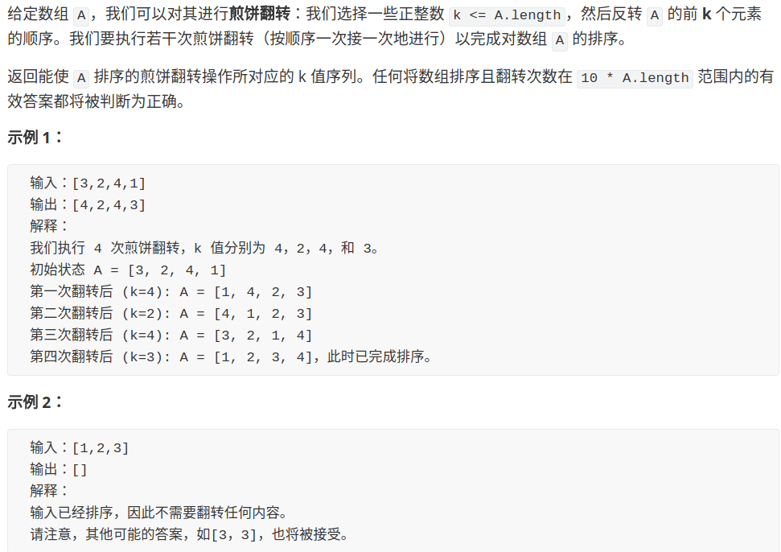

# Pancakes Sorting

**Translator: [Dong Wang](https://github.com/Coder2Programmer)**

**Author: [labuladong](https://github.com/labuladong)**

The pancake sorting is a very interesting practical problem: assuming there are `n` pieces of pancakes of **different sizes** on the plate, how do you turn it several times with a spatula to make these pancakes in order(small up, big down)?


Imagine using a spatula to flip a pile of pancakes. There are actually a few restrictions that we can only flip the top cakes at a time:


Our question is, **how do you use an algorithm to get a sequence of flips to make the cake pile order**?

First, we need to abstract this problem and use an array to represent the pancakes heap:



How to solve this problem? In fact, it is similar to the previous article [Part of a Recursive Reverse Linked List](../data_structure/reverse_part_of_a_linked_list_via_recursion.md), which also requires **recursive thinking**.

### 1. Analysis of idea

Why is this problem recursive? For example, we need to implement a function like this:

```java
// cakes is a bunch of pancakes, the function will sort the first n pancakes
void sort(int[] cakes, int n);
```

If we find the largest of the first `n` pancakes, then we try to flip this pancake to the bottom:


Then, the scale of the original problem can be reduced, recursively calling `pancakeSort (A, n-1)`:


Next, how to sort the `n-1` pancakes above? Still find the largest piece of pancakes from it, then place this piece of pancake to the bottom, and then recursively call `pancakeSort (A, n-1-1)` ...

You see, this is the nature of recursion. To summarize, the idea is:

1. Find the largest of the `n` pancakes.
2. Move this largest pancake to the bottom.
3. Recursively call `pancakeSort(A, n-1)`.

Base case: When `n == 1`, there is no need to flip when sorting 1 pancake.

So, the last question left, **how do you manage to turn a piece of pancake to the end**?

In fact, it is very simple. For example, the third pancake is the largest, and we want to change it to the end, that is, to the `n` block. You can do this:

1. Use a spatula to turn the first 3 pieces of pancakes, so that the largest pancake turns to the top.
2. Use a spatula to flip all the first `n` cakes, so that the largest pancake turns to the `n`-th pancake, which is the last pancake.

After the above two processes are understood, the solution can be basically written, but the title requires us to write a specific sequence of inversion operations, which is also very simple, as long as it is recorded each time the pancake is turned.

### 2. Code implementation

As long as the above ideas are implemented in code, the only thing to note is that the array index starts from 0, and the results we want to return are calculated from 1.

```java
// record the reverse operation sequence
LinkedList<Integer> res = new LinkedList<>();

List<Integer> pancakeSort(int[] cakes) {
    sort(cakes, cakes.length);
    return res;
}

void sort(int[] cakes, int n) {
    // base case
    if (n == 1) return;
    
    // find the index of the largest pancake
    int maxCake = 0;
    int maxCakeIndex = 0;
    for (int i = 0; i < n; i++)
        if (cakes[i] > maxCake) {
            maxCakeIndex = i;
            maxCake = cakes[i];
        }
    
    // first flip, turn the largest pancake to the top
    reverse(cakes, 0, maxCakeIndex);
    res.add(maxCakeIndex + 1);
    // second flip, turn the largest pancake to the bottom
    reverse(cakes, 0, n - 1);
    res.add(n);

    // recursive
    sort(cakes, n - 1);
}

void reverse(int[] arr, int i, int j) {
    while (i < j) {
        int temp = arr[i];
        arr[i] = arr[j];
        arr[j] = temp;
        i++; j--;
    }
}
```

hrough the detailed explanation just now, this code should be very clear.

The time complexity of the algorithm is easy to calculate, because the number of recursive calls is `n`, each recursive call requires a for loop, the time complexity is O(n), so the total complexity is O(n^2).

**Finally, we can think about a problem.**: According to our thinking, the length of the operation sequence should be `2(n-1)`, because each recursion needs to perform 2 flips and record operations and there are always `n` layers of recursion, but since the base case returns the result directly without inversion, the length of the final operation sequence should be fixed `2(n-1) `.

Obviously, this result is not optimal (shortest). For example, a bunch of pancakes `[3,2,4,1]`. The flip sequence obtained by our algorithm is `[3,4,2,3,1,2]`, but the fastest way to flip should be ` [2,3,4] `:

* Initial state: `[3,2,4,1]`
* Turn over the first two: `[2,3,4,1]`
* Turn over the first three: `[4,3,2,1]`
* Turn over the first 4: `[1,2,3,4]`

If your algorithm is required to calculate the **shortest** operation sequence for sorting biscuits, how do you calculate it? In other words, what is the core idea and what algorithm skills must be used to solve the problem of finding the optimal solution?

May wish to share your thoughts.
