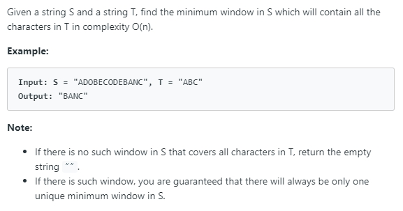
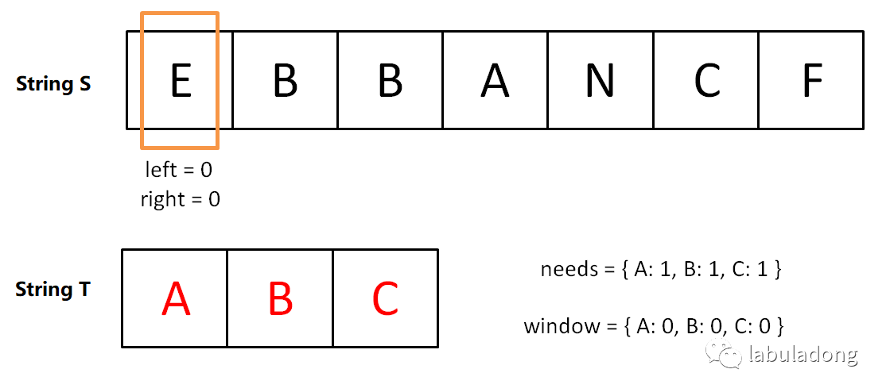
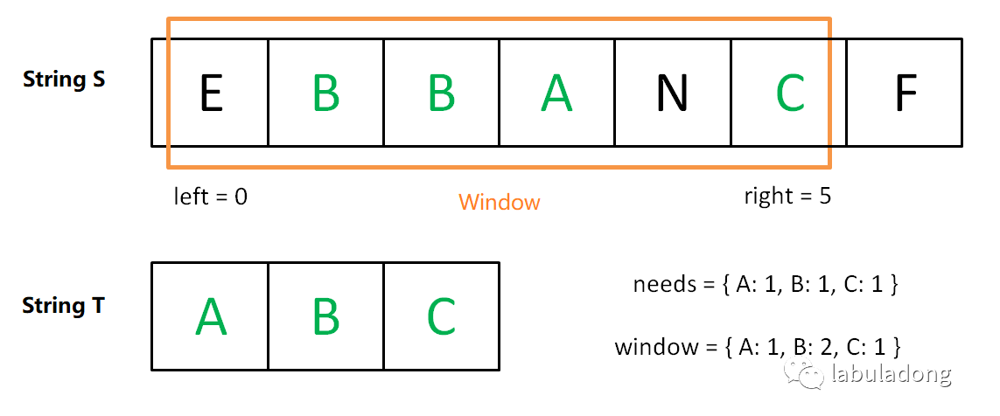
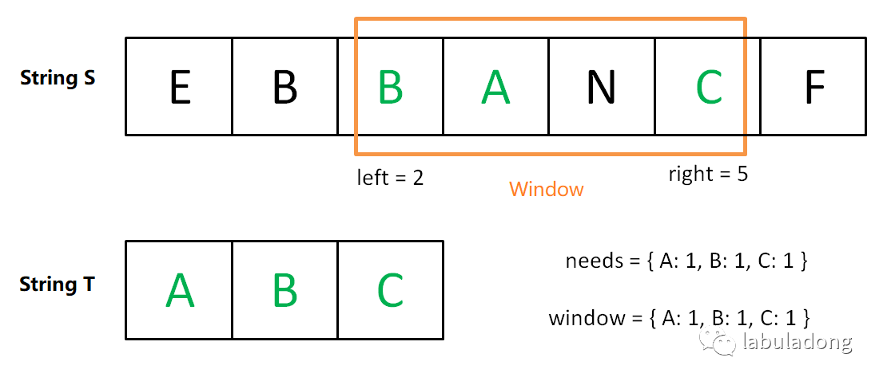
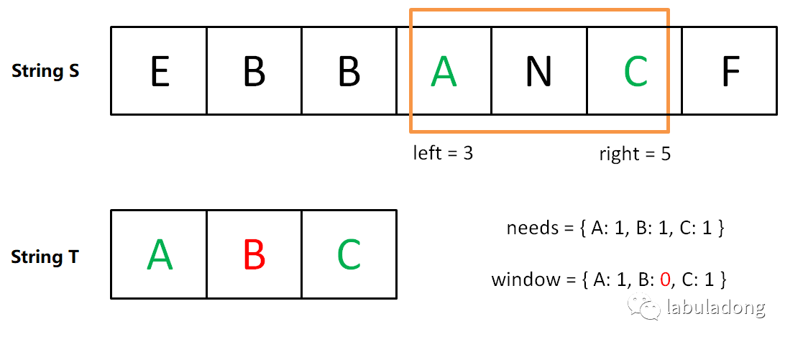
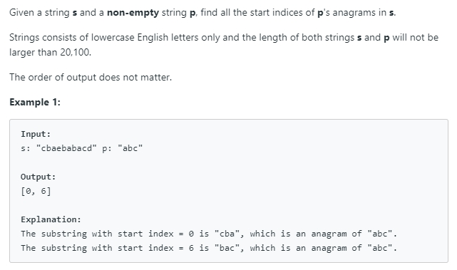
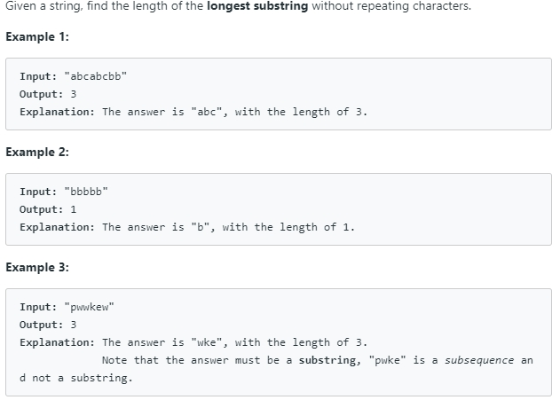

# Sliding Window Technique

**Translator: [floatLig](https://github.com/floatLig)**

**Author: [labuladong](https://github.com/labuladong)**

This article shows you the magic template for "sliding window" with two pointers: the left and right of the window. With this, you can easily solve several difficult substring matching problems.

There are at least 9 problems in LeetCode that can be solved efficiently using this method. In this article, we choose three problems with the most votes, more classical to explain. The first question, in order for the reader to master the algorithm template, the last two questions are easy to answer according to the template.

This article code for C++ implementation, will not use any programming quirks, but still briefly introduce some of the data structure used, in case some readers because of the language details of the problem hindering the understanding of the algorithm idea:

`unordered_map` is `hashmap`, one of its methods, `count(key)`, corresponds to `containsKey(key)` to determine whether the key exists or not.

`Map [key]` can be used to access the corresponding `value` of the `key`. Note that if the key does not exist, C++ automatically creates the key and assigns the `map[key]` value to 0.

`map[key]++`, which appears many times in the code, is equivalent to `map.put(key, map.getordefault (key, 0) + 1)` in Java.

Now let's get to the point.

### 1. Minimum Window Substring



The question asks us to return the minimum substring from the string S (Source) which has all the characters of the string T (Target). Let us call a substring desirable if it has all the characters from T.

If you don't use any optimization, the code would look like this:

```java
for (int i = 0; i < s.size(); i++)
    for (int j = i + 1; j < s.size(); j++)
        if s[i:j] contains all letters of t:
            update answer
```

Although the idea is very straightforward, but the *time complexity* of this algorithm is O(N^2).

We can solve it with sliding window. The sliding window algorithm idea is like this:

1. We start with two pointers, *left and right* initially pointing to the first element of the string S.

2. We use the right pointer to expand the window [left, right] until we get a desirable window that contains all of the characters of T.

3. Once we have a window with all the characters, we can move the left pointer ahead one by one. If the window is still a desirable one we keep on updating the minimum window size.

4. If the window is not desirable any more, we repeat step 2 onwards.

This idea actually not difficult. **Move right pointer to find a valid window. When a valid window is found, move left pointer to find a smaller window (optimal solution)**.

Now let's graph it. `needs` and `window` act as counters. `needs` record the number of occurrences of characters in T, and `window` record the number of occurrences of the corresponding character.

Initial State:



Moving the right pointer until the window has all the elements from string T.



Now move the left pointer. Notice the window is still desirable and smaller than the previous window.



After moving left pointer again, the window is no more desirable. 



We need to increment the right pointer and left pointer to look for another desirable window until the right pointer reaches the end of the string S (the algorithm ends).

If you can understand the above process, congratulations, you have fully mastered the idea of the sliding window algorithm.

Here comes the simple pseudocode.

```cpp
string s, t;
// Looking for the "minimum substring" of t in s
int left = 0, right = 0;
string res = s;

while(right < s.size()) {
    window.add(s[right]);
    right++;
    // When we found a valid window, move left to find smaller window.
    while (found a valid window) {
        // If the window's substring is shorter, update the res
        res = minLen(res, window);
        window.remove(s[left]);
        left++;
    }
}
return res;
```

If you can understand the code above, you are one step closer to solving the problem. Now comes the tricky question: how do you tell if the window (substring s[left...right]) meets the requirements (contains all characters of t)?

A general way is to use two hashmap as counters. To check if a window is valid, we use a map `needs` to store `(char, count)` for chars in t. And use counter `window` for the number of chars of t to be found in s. If `window` contains all the keys in `needs`, and the value of these keys is greater than or equal to the value in `needs`, we know that `window` meets the requirements and can start moving the left pointer.

Refinement pseudocode above.

```cpp
string s, t;
// Two pointers
int left = 0, right = 0;
string res = s;

// Initialize the map
unordered_map<char, int> window;
unordered_map<char, int> needs;
for (char c : t) needs[c]++;

// The number of characters that meet the requirement
int match = 0;

while (right < s.size()) {
    char c1 = s[right];
    if (needs.count(c1)) {
        window[c1]++; // Add to window
        if (window[c1] == needs[c1])
            // The number of occurrences of the character c1 meets the requirement
            match++;
    }
    right++;

    // When we found a valid window
    while (match == needs.size()) {
        // Update res here if finding minimum
        res = minLen(res, window);
        // Increase left pointer to make it invalid/valid again
        char c2 = s[left];
        if (needs.count(c2)) {
            window[c2]--; // Remove from window
            if (window[c2] < needs[c2])
                // The number of occurrences of the character c2 no longer meets the requirement
                match--;
        }
        left++;
    }
}
return res;
```

The above code already has complete logic, only a pseudo-code, that is, update `res`, but this problem is too easy to solve, directly see the solution!

The code of solving this problem is below.

```cpp
string minWindow(string s, string t) {
    // Records the starting position and length of the shortest substring
    int start = 0, minLen = INT_MAX;
    int left = 0, right = 0;

    unordered_map<char, int> window;
    unordered_map<char, int> needs;
    for (char c : t) needs[c]++;

    int match = 0;

    while (right < s.size()) {
        char c1 = s[right];
        if (needs.count(c1)) {
            window[c1]++;
            if (window[c1] == needs[c1]) 
                match++;
        }
        right++;

        while (match == needs.size()) {
            if (right - left < minLen) {
                // Updates the position and length of the smallest string
                start = left;
                minLen = right - left;
            }
            char c2 = s[left];
            if (needs.count(c2)) {
                window[c2]--;
                if (window[c2] < needs[c2])
                    match--;
            }
            left++;
        }
    }
    return minLen == INT_MAX ?
                "" : s.substr(start, minLen);
}
```

I think it would be hard for you to understand if you were presented with a large piece of code, but can you understand the logic of the algorithm by following up? Can you see clearly the structure of the algorithm?

**Time Complexity**: O(|S| + |T|) where |S| and |T| represent the lengths of strings S and T. In the worst case we might end up visiting every element of string S twice, once by left pointer and once by right pointer. ∣T∣ represents the length of string T.

The reader might think that the nested while loop complexity should be a square, but you can think of it this way, the number of while executions is the total distance that the double pointer left and right traveled, which is at most 2 meters.

### 2. Find All Anagrams in a String



The difficulty of this problem is medium, but using the above template, it should be easy.

If you update the res of the original code, you can get the answer to this problem.

```cpp
vector<int> findAnagrams(string s, string t) {
    // Init a collection to save the result
    vector<int> res;
    int left = 0, right = 0;
    // Create a map to save the Characters of the target substring.
    unordered_map<char, int> needs;
    unordered_map<char, int> window;
    for (char c : t) needs[c]++;
    // Maintain a counter to check whether match the target string.
    int match = 0;

    while (right < s.size()) {
        char c1 = s[right];
        if (needs.count(c1)) {
            window[c1]++;
            if (window[c1] == needs[c1])
                match++;
        }
        right++;

        while (match == needs.size()) {
            // Update the result if find a target
            if (right - left == t.size()) {
                res.push_back(left);
            }
            char c2 = s[left];
            if (needs.count(c2)) {
                window[c2]--;
                if (window[c2] < needs[c2])
                    match--;
            }
            left++;
        }
    }
    return res;
}
```

Since this problem is similar to the previous one, the `window` also needs to contain all the characters of the string t, but the last problem is to find the shortest substring. This problem is to find a substring of the same length.

### 3. Longest Substring Without Repeating Characters



When you encounter substring problems, the first thing that comes to mind is the sliding window technique.

Similar to the previous idea, use `window` as a counter to record the number of occurrences of characters in the window. Then move the right pointer to scan through the string. If the character is already in `window`, move the left pointer to the right of the same character last found.

```cpp
int lengthOfLongestSubstring(string s) {
    int left = 0, right = 0;
    unordered_map<char, int> window;
    int res = 0; // Record maximum length

    while (right < s.size()) {
        char c1 = s[right];
        window[c1]++;
        right++;
        // If a duplicate character appears in the window
        // Move the left pointer
        while (window[c1] > 1) {
            char c2 = s[left];
            window[c2]--;
            left++;
        }
        res = max(res, right - left);
    }
    return res;
}
```

One thing needs to be mentioned is that when asked to find maximum substring, we should update maximum after the inner while loop to guarantee that the substring is valid. On the other hand, when asked to find minimum substring, we should update minimum inside the inner while loop.

### Summarize

Through the above three questions, we can summarize the abstract idea of sliding window algorithm:

```java
int left = 0, right = 0;

while (right < s.size()) {
    window.add(s[right]);
    right++;

    while (valid) {
        window.remove(s[left]);
        left++;
    }
}
```

The data type of the window can vary depending on the situation, such as using the hash table as the counter, or you can use an array to do the same, since we only deal with English letters.

The slightly tricky part is the `valid` condition, and we might have to write a lot of code to get this updated in real time. For example, the first two problems, it seems that the solution is so long, in fact, the idea is still very simple, but most of the code is dealing with this problem.