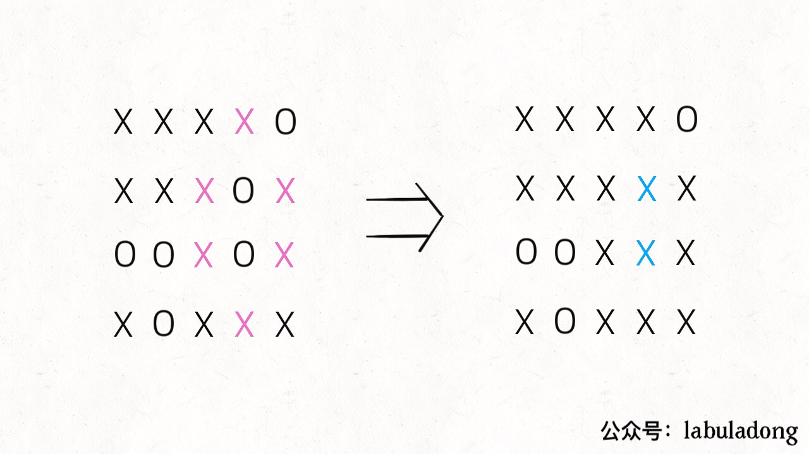

# Application of Union-Find

**Translator: [Ziming](https://github.com/ML-ZimingMeng/LeetCode-Python3)**

**Author: [labuladong](https://github.com/labuladong)**

Many readers in the previous article expressed interest in the Union-Find algorithm, so in this article, I will take a few LeetCode problems to talk about the ingenious use of this algorithm.

First, let's recall that the Union-Find algorithm solves the problem of dynamic connectivity of the graph, but the algorithm itself is not difficult. Your ability which is to abstract the original problem into a question about graph theory to abstract the problem determines whether you can solve it.

First let us review the algorithm code written in the previous article and answer a few questions:

```java
class UF {
    // Record the number of connected components
    private int count;
    // Store several trees
    private int[] parent;
    // Record the "weight" of the tree
    private int[] size;

    public UF(int n) {
        this.count = n;
        parent = new int[n];
        size = new int[n];
        for (int i = 0; i < n; i++) {
            parent[i] = i;
            size[i] = 1;
        }
    }
    
    /* Connect p and q */
    public void union(int p, int q) {
        int rootP = find(p);
        int rootQ = find(q);
        if (rootP == rootQ)
            return;
        
        // The small tree is more balanced under the big tree
        if (size[rootP] > size[rootQ]) {
            parent[rootQ] = rootP;
            size[rootP] += size[rootQ];
        } else {
            parent[rootP] = rootQ;
            size[rootQ] += size[rootP];
        }
        count--;
    }

    /* Determine whether p and q are connected to each other */
    public boolean connected(int p, int q) {
        int rootP = find(p);
        int rootQ = find(q);
        // Nodes on the same tree are interconnected
        return rootP == rootQ;
    }

    /* Returns the root node of node x */
    private int find(int x) {
        while (parent[x] != x) {
            // Path compression
            parent[x] = parent[parent[x]];
            x = parent[x];
        }
        return x;
    }
    
    public int count() {
        return count;
    }
}
```

The algorithm has three key points:

1. Use the `parent` array to record the parent node of each node, which is equivalent to a pointer to the parent node, so the` parent` array actually stores a forest (several multi-trees).

2. Use the `size` array to record the weight of each tree. The purpose is to keep the` union` tree still balanced without degrading it into a linked list, which affects the operation efficiency.

3. Path compression is performed in the `find` function to ensure that the height of any tree is kept constant, so that the time complexity of the` union` and `connected` API is O (1).

Some readers may ask, **Since the path compression, does the weight balance of the `size` array still need**? This problem is very interesting, because path compression guarantees that the tree height is constant (not more than 3), even if the tree is unbalanced, the height is also constant, which basically has little effect.

In my opinion, when it comes to time complexity, indeed, it is also O (1) without the need for weight balance. However, if the size array is added, the efficiency is still slightly higher, such as the following:


If weight balance optimization is carried out, case 1 will surely be obtained, without weight optimization, case 2 may occur. The `while` loop of path compression is triggered only when the height is 3, so case 1 will not trigger path compression at all, while case 2 will perform path compression many times to compress the nodes in the third layer to the second layer.

In other words, removing the weight balance, although the time complexity is still O (1) for a single `find` function call, the efficiency of the API call will decrease to some extent. Of course, the advantage is that it reduces some space, but for Big O notation, the space-time complexity has not changed.

Let's get down to business and see what practical applications this algorithm has.

### Ⅰ. DFS Alternatives

Many problems solved by the DFS depth-first algorithm can also be solved by the Union-Find algorithm.

For instance, Surrounded Regions of question 130: Given a 2D board containing `X` and `O` (the letter O), **capture all regions** surrounded by `X`.

```java
void solve(char[][] board);
```

Note that `O` must be surrounded by four sides in order to be replaced with `X`, that is, `O` on the corner must not be enclosed, and further, `O` connected to `O` on the corner Will not be surrounded by `X` and will not be replaced.



PS: This reminds me of the chess game "Othello" when I was a kid. As long as you use two pieces to sandwich each other's pieces, the opponent's pieces will be replaced with yours. Similarly, the pieces occupying the four corners are invincible, and the side pieces connected to it are also invincible (cannot be clipped).

The traditional method of solving this problem is not difficult. First use the for loop to traverse the four sides of the chessboard, and use the DFS algorithm to replace those `O` connected to the border with a special character, such as `#`; Second, traverse the entire chessboard, replace the remaining `O` Into `X` and restore `#` to `O`. This can complete the requirements of the problem, time complexity O (MN).

This problem can also be solved with the Union-Find algorithm. Although the implementation is more complicated and even less efficient, this is a general idea using the Union-Find algorithm and it is worth learning.

**Those `O` which do not need to be replaced have a common ancestor called` dummy`. These `O` and` dummy` are connected to each other,however, those `O` that need to be replaced are not connected to` dummy`**.


This is the core idea of Union-Find and it is easy to understand the code if you understand this diagram.

Firstly, according to our implementation, the bottom layer of Union-Find is a one-dimensional array. The constructor needs to pass in the size of the array, and the title is a two-dimensional chessboard.

Which is simple, that the two-dimensional coordinates `(x, y)` can be converted to the number `x * n + y` **This is a common technique for mapping two-dimensional coordinates to one dimension**.

Secondly, the "patriarch" we described earlier is fictitious and we need to leave a place for his elderly. The index `[0 .. m * n-1]` is a one-dimensional mapping of the coordinates in the chessboard, so let this dummy `dummy` node occupy the index` m * n`.

```java
void solve(char[][] board) {
    if (board.length == 0) return;

    int m = board.length;
    int n = board[0].length;
    // Leave an extra room for dummy
    UF uf = new UF(m * n + 1);
    int dummy = m * n;
    // Connect the first and last columns of O and dummy
    for (int i = 0; i < m; i++) {
        if (board[i][0] == 'O')
            uf.union(i * n, dummy);
        if (board[i][n - 1] == 'O')
            uf.union(i * n + n - 1, dummy);
    }
    // Connect O and dummy in the first and last rows
    for (int j = 0; j < n; j++) {
        if (board[0][j] == 'O')
            uf.union(j, dummy);
        if (board[m - 1][j] == 'O')
            uf.union(n * (m - 1) + j, dummy);
    }
    // Direction array d is a common method for searching up, down, left and right
    int[][] d = new int[][]{{1,0}, {0,1}, {0,-1}, {-1,0}};
    for (int i = 1; i < m - 1; i++) 
        for (int j = 1; j < n - 1; j++) 
            if (board[i][j] == 'O')
                // Connect this O with up, down, left and right O
                for (int k = 0; k < 4; k++) {
                    int x = i + d[k][0];
                    int y = j + d[k][1];
                    if (board[x][y] == 'O')
                        uf.union(x * n + y, i * n + j);
                }
    // All O not connected to dummy shall be replaced
    for (int i = 1; i < m - 1; i++) 
        for (int j = 1; j < n - 1; j++) 
            if (!uf.connected(dummy, i * n + j))
                board[i][j] = 'X';
}
```

This code is very long. In fact, it is just the realization of the previous idea. Only the `O` connected to the boundary `O` have the connectivity with `dummy` and they will not be replaced.

To be honest, the Union-Find algorithm solves this simple problem. It can be a bit of a killer. It can solve more complex and more technical problems. **The main idea is to add virtual nodes in a timely manner. Dynamic connectivity**.

### Ⅱ. Satisfiability of Equality Equations

This problem can be solved using the Union-Find algorithm, that is:

Given an array equations of strings that represent relationships between variables, each string `equations[i]` has length `4` and takes one of two different forms: `"a==b"` or `"a!=b"`.  Here, `a` and `b` are lowercase letters (not necessarily different) that represent one-letter variable names.

Return true if and only if it is possible to assign integers to variable names so as to satisfy all the given equations.

The core idea of solving the problem is that **divide the expressions in `equations` into two parts according to `==` and `!=`, First process the expressions of `==`, so that they are connected. `!=` Expression to check if the inequality relationship breaks the connectivity of the equality relationship**.

```java    
boolean equationsPossible(String[] equations) {
    // 26 letters
    UF uf = new UF(26);
    // Let equal letters form connected components first
    for (String eq : equations) {
        if (eq.charAt(1) == '=') {
            char x = eq.charAt(0);
            char y = eq.charAt(3);
            uf.union(x - 'a', y - 'a');
        }
    }
    // Check if inequality relationship breaks connectivity of equal relationship
    for (String eq : equations) {
        if (eq.charAt(1) == '!') {
            char x = eq.charAt(0);
            char y = eq.charAt(3);
            // If the equality relationship holds, it is a logical conflict
            if (uf.connected(x - 'a', y - 'a'))
                return false;
        }
    }
    return true;
}
```

At this point, the problem of judging the validity of the expression is solved. Is it easy to use the Union-Find algorithm?

### Ⅲ. Summery

The Union-Find algorithm is a dynamic connectivity problem, that is, how to transform the original problem into a graph. For the legitimacy of the formula, the equivalent relationship can be directly used, and for the checkerboard envelopment problem, a virtual node is used to create the dynamic connectivity.

In addition, you can use the directional array `d` to map a two-dimensional array to a one-dimensional array to simplify the amount of code.

Many more complex DFS algorithm problems can be solved using the Union-Find algorithm. There are more than 20 Union-Find related questions on LeetCode, and you can go and try!

