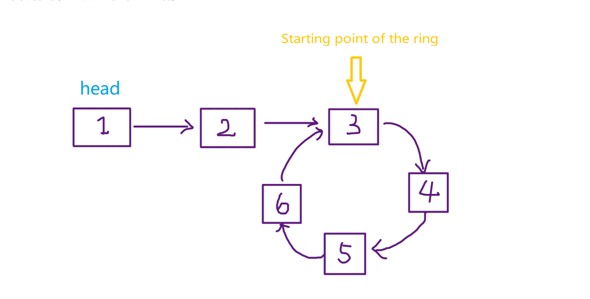
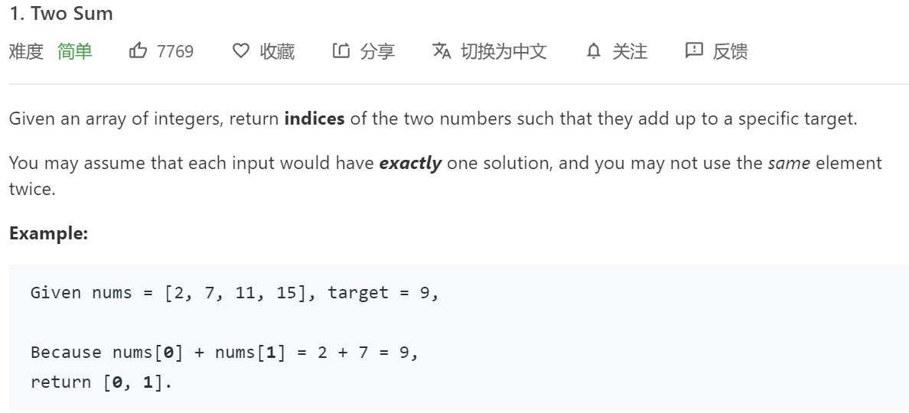

### Summary of Double Pointer skills

**Translator: [lriy](https://github.com/lriy)**

**Author: [labuladong](https://github.com/labuladong)**

I divided the double pointer technique into two categories, one is "fast and slow pointer" and the other is "left and right pointer". The former solution mainly solves the problems in the linked list, such as determining whether the linked list contains a ring; the latter mainly solves the problems in the array (or string), such as binary search.

### First, the common algorithm of fast and slow pointers
The fast and slow pointers are usually initialized to point to the head node of the linked list. When moving forward, the fast pointer is fast first, and the slow pointer is slow.

**1. Determine whether the linked list contains a ring.**

This should be the most basic operation of the linked list. If you already know this trick, you can skip it.

The characteristic of a single linked list is that each node only knows the next node, so if a pointer is used, it cannot be judged whether the linked list contains a ring.

If the linked list does not contain a ring, then this pointer will eventually encounter a null pointer null to indicate that the linked list is over. It is good to say that you can determine that the linked list does not contain a ring.

```
boolean hasCycle(ListNode head) {
    while (head != null)
        head = head.next;
    return false;
}
```
But if the linked list contains a ring, then the pointer will end up in an endless loop, because there is no null pointer in the circular array as the tail node.

The classic solution is to use two pointers, one running fast and one running slowly. If there is no ring, the pointer that runs fast will eventually encounter null, indicating that the linked list does not contain a ring; if it contains a ring, the fast pointer will eventually end up with a super slow pointer and meet the slow pointer, indicating that the linked list contains a ring.

```
boolean hasCycle(ListNode head) {
    ListNode fast, slow;
    fast = slow = head;
    while (fast != null && fast.next != null) {
        fast = fast.next.next;
        slow = slow.next;
        
        if (fast == slow) return true;
    }
    return false;
}
```
**2. Knowing that the linked list contains a ring, return to the starting position of the ring**



This problem is not difficult at all, look directly at the code:

```
ListNode detectCycle(ListNode head) {
    ListNode fast, slow;
    fast = slow = head;
    while (fast != null && fast.next != null) {
        fast = fast.next.next;
        slow = slow.next;
        if (fast == slow) break;
    }
    // The above code is similar to the hasCycle function
    slow = head;
    while (slow != fast) {
        fast = fast.next;
        slow = slow.next;
    }
    return slow;
}
```
It can be seen that when the "fast" and "slow" pointers meet, let any one of them point to the head node, and then let them advance at the same speed, and the node position when they meet again is the position where the ring starts. Why is this?

For the first encounter, suppose the slow pointer "slow" moves k steps, then the fast pointer "fast" must move 2k steps, which means that "fast" moves k steps more than "slow" （The length of the ring）


Suppose the distance between the meeting point and the start point of the ring is m, then the distance between the start point of the ring and the head node "head" is k-m.

Coincidentally, if we continue to k-m steps from the meeting point, we also reach the starting point of the loop.


So, as long as we repoint one of the fast and slow pointers to "head", and then the two pointers move at the same speed, we will meet after k-m steps. The place where we meet is the beginning of the ring.

**3.Find the midpoint of the linked list**

Similar to the above idea, we can also make the fast pointer advance two steps at a time, and the slow pointer advance one step at a time. When the fast pointer reaches the end of the list, the slow pointer is in the middle of the list.

```
while (fast != null && fast.next != null) {
    fast = fast.next.next;
    slow = slow.next;
}
// "slow" is in the middle
return slow;
```
When the length of the linked list is odd, "slow" happens to stop at the midpoint; if the length is even, the final position of "slow" is right to the middle:


An important role in finding the midpoint of a linked list is to "merge sort" the linked list.

Recall the "merge sort" of arrays: find the midpoint index recursively divide the array into two, and finally merge the two ordered arrays. For linked lists, merging two ordered linked lists is simple, and the difficulty is dichotomy.

But now that you have learned to find the midpoint of the linked list, you can achieve the dichotomy of the linked list. The specific content of the "merge sort" is not described in this article, you can find it online by yourself.

**4.Find the k-th element from the bottom of the linked list**

Our idea is still to use the fast and slow pointers, so that the fast pointer take k steps first, and then the fast and slow pointers start moving at the same speed. In this way, when the fast pointer reaches null at the end of the linked list, the position of the slow pointer is the kth penultimate linked list node (for simplicity, it is assumed that k does not exceed the length of the linked list):

```
ListNode slow, fast;
slow = fast = head;
while (k-- > 0) 
    fast = fast.next;

while (fast != null) {
    slow = slow.next;
    fast = fast.next;
}
return slow;
```

### Second, the common algorithm of left and right pointer
The left and right pointers actually refer to two index values in the array, and are generally initialized to left = 0, right = nums.length-1.

**1.Binary Search**

The previous "Binary Search" has been explained in detail, only the simplest binary algorithm is written here, in order to highlight its dual pointer characteristics:

```
int binarySearch(int[] nums, int target) {
    int left = 0; 
    int right = nums.length - 1;
    while(left <= right) {
        int mid = (right + left) / 2;
        if(nums[mid] == target)
            return mid; 
        else if (nums[mid] < target)
            left = mid + 1; 
        else if (nums[mid] > target)
            right = mid - 1;
    }
    return -1;
}
```
**2.Two sum**

Look directly at a LeetCode topic:




As long as the array is ordered, you should think of the two pointer technique. The solution of this problem is similar to binary search. You can adjust the size of "sum" by adjusting "left" and "right":

```
int[] twoSum(int[] nums, int target) {
    int left = 0, right = nums.length - 1;
    while (left < right) {
        int sum = nums[left] + nums[right];
        if (sum == target) {
            //The index required for the question starts at 1
            return new int[]{left + 1, right + 1};
        } else if (sum < target) {
            left++; //Make "sum" bigger
        } else if (sum > target) {
            right--; // Make "sum" smaller
        }
    }
    return new int[]{-1, -1};
}
```
**3.Reverse the array**

```
void reverse(int[] nums) {
    int left = 0;
    int right = nums.length - 1;
    while (left < right) {
        // swap(nums[left], nums[right])
        int temp = nums[left];
        nums[left] = nums[right];
        nums[right] = temp;
        left++; right--;
    }
}
```
**4.Sliding window algorithm**

This may be the highest state of the double pointer technique. If you master this algorithm, you can solve a large class of substring matching problems, but the "sliding window" is slightly more complicated than the above algorithms.

Fortunately, this type of algorithm has a frame template, and this article explains the "sliding window" algorithm template to help everyone kill a few LeetCode substring matching problems.

Thanks for reading!
