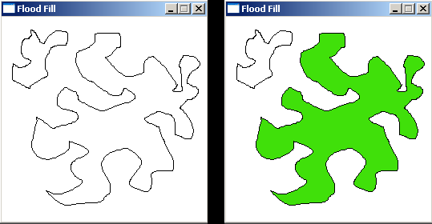
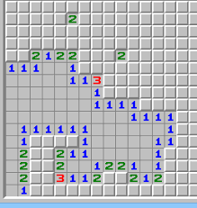
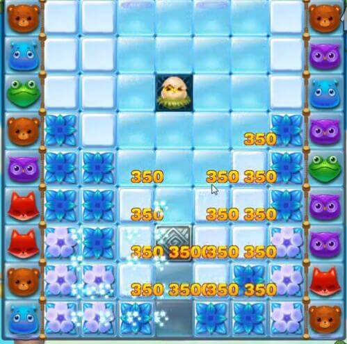
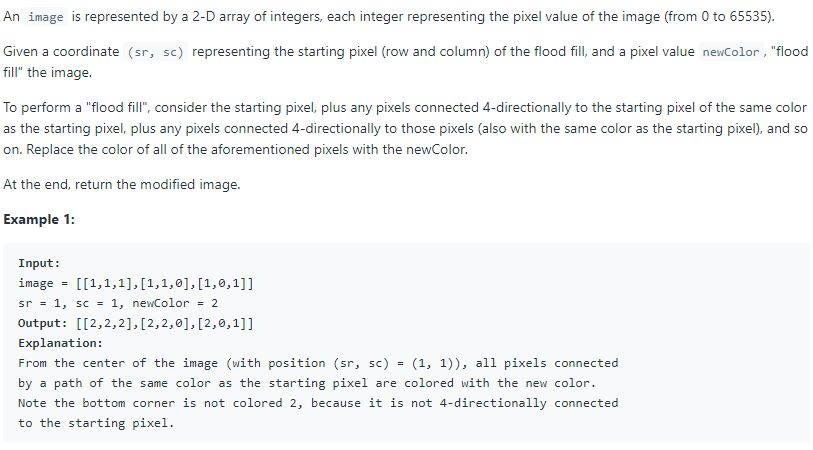
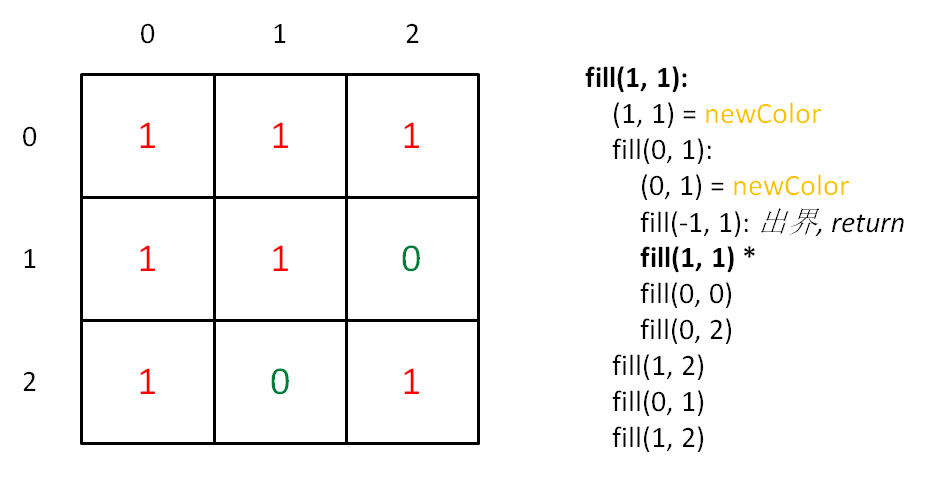
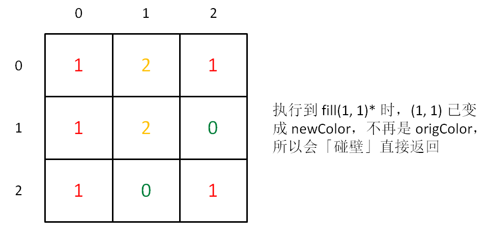
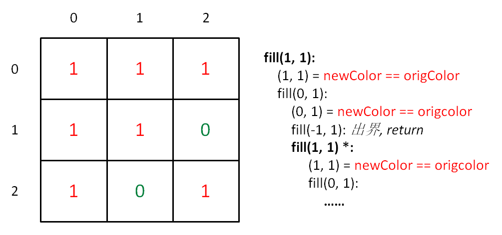
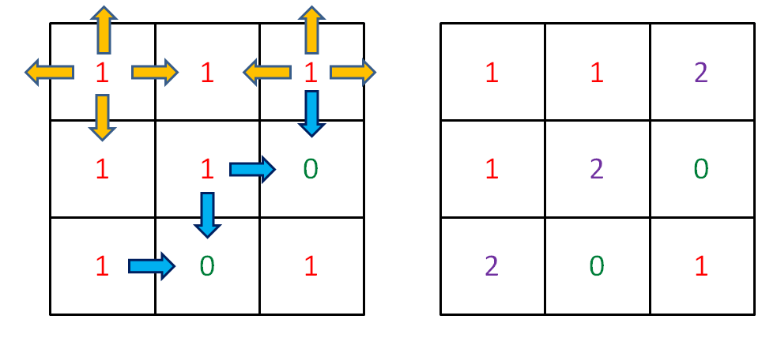
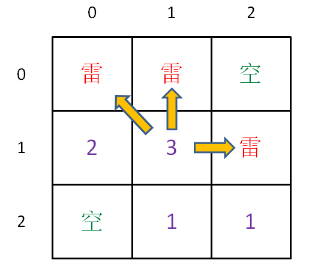

# Analysis and Application of FloodFill Algorithm

**Translator: [youyun](https://github.com/youyun)**

**Author: [labuladong](https://github.com/labuladong)**

What is the FloodFill algorithm? A real-life example is color filling. In the default Windows application _Paint_, using the bucket icon, we can fill the selected area with a color.



There are other applications of the FloodFill algorithm. Another example would be Minesweeper. Sometimes when you click on a tile, an area will expand out. The process of expansion is implemented through the FloodFill algorithm.



Similarly, those puzzle-matching games such as Candy Crush also use the FloodFill algorithm to remove blocks of the same color.



Now you should have some idea about the FloodFill algorithm. Let's abstract out the problems and find out what is common.

### 1. Build Framework

All above examples can be abstract as a 2D array. In fact, a picture is an array of pixels. We take an element as the starting point and expand till the end.

An array can be further abstracted as a graph. Hence, the problem becomes about traversing a graph, similar to traversing an N-ary tree. A few lines of code are enough to resolve the problem. Here is the framework:

```java
// (x, y) represents the coordinate
void fill(int x, int y) {
    fill(x - 1, y); // up
    fill(x + 1, y); // down
    fill(x, y - 1); // left
    fill(x, y + 1); // right
}
```

Using this framework, we can resolve all problems about traversing a 2D array. The concept is also called Depth First Search (DFS), or quaternary (4-ary) tree traversal. The root node is coordinate (x, y). Its four child nodes are at root's four directions.

Let's take a look at [a LeetCode problem](https://leetcode.com/problems/flood-fill/). It's actually just a color fill function.



In [another article](), we discussed a generic design of tree related algorithms. We can apply the concept here:

```java
int[][] floodFill(int[][] image,
        int sr, int sc, int newColor) {

    int origColor = image[sr][sc];
    fill(image, sr, sc, origColor, newColor);
    return image;
}

void fill(int[][] image, int x, int y,
        int origColor, int newColor) {
    // OUT: out of index
    if (!inArea(image, x, y)) return;
    // CLASH: meet other colors, beyond the area of origColor
    if (image[x][y] != origColor) return;
    image[x][y] = newColor;
    
    fill(image, x, y + 1, origColor, newColor);
    fill(image, x, y - 1, origColor, newColor);
    fill(image, x - 1, y, origColor, newColor);
    fill(image, x + 1, y, origColor, newColor);
}

boolean inArea(int[][] image, int x, int y) {
    return x >= 0 && x < image.length
        && y >= 0 && y < image[0].length;
}
```

If you can understand this block of code, you are almost there! It means that you have honed the mindset of framework. This block of code can cover 99% of cases. There is only one tiny problem to be resolved: an infinite loop will happen if `origColor` is the same as `newColor`.

### 2. Pay Attention to Details

Why is there infinite loop? Each coordinate needs to go through its 4 neighbors. Consequently, each coordinate will also be traversed 4 times by its 4 neighbors. __When we visit an visited coordinate, we must guarantee to identify the situation and exit. If not, we'll go into infinite loop.__

Why can the code exit properly when `newColr` and `origColor` are different? Let's draw an diagram of the algorithm execution:



As we can see from the diagram, `fill(1, 1)` is visited twice. Let's use `fill(1, 1)*` to represent this duplicated visit. When `fill(1, 1)*` is executed, `(1, 1)` has already been replaced with `newColor`. So `fill(1, 1)*` will return the control directly at the _CLASH_, i.e. exit as expected.

```java
// CLASH: meet other colors, beyond the area of origColor
if (image[x][y] != origColor) return;
```


However, if `origColor` is the same as `newCOlor`, `fill(1, 1)*` will not exit at the _CLASH_. Instead, an infinite loop will start as shown below.



### 3. Handling Details

How to avoid the case of infinite loop? The most intuitive answer is to use a boolean 2D array of the same size as image, to record whether a coordinate has been traversed or not. If visited, return immediately.

```java
 // OUT: out of index
if (!inArea(image, x, y)) return;
// CLASH: meet other colors, beyond the area of origColor
if (image[x][y] != origColor) return;
// VISITED: don't visit a coordinate twice
if (visited[x][y]) return;
visited[x][y] = true;
image[x][y] = newColor;
```

This is a common technique to handle graph related problems. For this particular problem, there is actually a better way: backtracking algorithm.

Refer to the article [Backtracking Algorithm in Depth]() for details. We directly apply the backtracking algorithm framework here:

```java
void fill(int[][] image, int x, int y,
        int origColor, int newColor) {
    // OUT: out of index
    if (!inArea(image, x, y)) return;
    // CLASH: meet other colors, beyond the area of origColor
    if (image[x][y] != origColor) return;
    // VISITED: visited origColor
    if (image[x][y] == -1) return;
    
    // choose: mark a flag as visited
    image[x][y] = -1;
    fill(image, x, y + 1, origColor, newColor);
    fill(image, x, y - 1, origColor, newColor);
    fill(image, x - 1, y, origColor, newColor);
    fill(image, x + 1, y, origColor, newColor);
    // unchoose: replace the mark with newColor
    image[x][y] = newColor;
}
```

This is a typical way, using a special value -1 to replace the visited 2D array, to achieve the same purpose. Because the range of color is `[0, 65535]`, -1 is special enough to differentiate with actual colors.

### 4. Extension: Magic Wand Tool and Minesweeper

Most picture editing softwares have the function "Magic Wand Tool". When you click a point, the application will help you choose a region of similar colors automatically. Refer to the picture below, if we want to select the eagle, we can use the Magic Wand Tool to select the blue sky, and perform inverse selection. Let's analyze the mechanism of the Magic Wand Tool.


Obviously, the algorithm must be based on the FloodFill algorithm. However, there are two differences:
1. Though the background color is blue, we can't guarantee all the blue pixels are exactly the same. There could be minor differences that can be told by our eyes. But we still want to ignore these minor differences.
2. FloodFill is to fill regions. Magic Wand Tool is more about filling the edges.

It's easy to resolve the first problem by setting a `threshold`. All colors within the threshold from the `origColor` can be recognized as `origColor`.

```java
if (Math.abs(image[x][y] - origColor) > threshold)
    return;
```

As for the second problem, let's first define the problem clearly: _"do not color all `origColor` coordinates in the region; only care about the edges."_. Next, let's analyze how to only color edges. i.e. How to find out the coordinates at the edges? What special properties do coordinates at the edges hold?



From the diagram above, we can see that for all coordinates at the edges, there is at least one direction that is not `origColor`. For all inner coordinates, all 4 directions are `origColor`. This is the key to the solution. Using the same framework, using `visited` array to represent traversed coordinates:

```java
int fill(int[][] image, int x, int y,
    int origColor, int newColor) {
    // OUT: out of index
    if (!inArea(image, x, y)) return 0;
    // VISITED: visited origColor
    if (visited[x][y]) return 1;
    // CLASH: meet other colors, beyond the area of origColor
    if (image[x][y] != origColor) return 0;

    visited[x][y] = true;
    
    int surround = 
          fill(image, x - 1, y, origColor, newColor)
        + fill(image, x + 1, y, origColor, newColor)
        + fill(image, x, y - 1, origColor, newColor)
        + fill(image, x, y + 1, origColor, newColor);
    
    if (surround < 4)
        image[x][y] = newColor;
    
    return 1;
}
```

In this way, all inner coordinates will have `surround` equal to 4 after traversing the four directions; all edge coordinates will be either OUT or CLASH, resulting `surround` less than 4. If you are still not clear, let's only look at the framework's logic flow:

```java
int fill(int[][] image, int x, int y,
    int origColor, int newColor) {
    // OUT: out of index
    if (!inArea(image, x, y)) return 0;
    // VISITED: visited origColor
    if (visited[x][y]) return 1;
    // CLASH: meet other colors, beyond the area of origColor
    if (image[x][y] != origColor) return 0;
    // UNKNOWN: unvisited area that is origColor
    if (image[x][y] == origColor) {
        // ...
        return 1;
    }
}
```

These 4 `if`s cover all possible scenarios of (x, y). The value of `surround` is the sum of the return values of the 4 recursive functions. And each recursive function will fall into one of the 4 scenarios. You should be much clearer now after looking at this framework.

This implementation colors all edge coordinates only for the `origColor` region, which is what the Magic Wand TOol does.

Pay attention to 2 details in this algorithm:
1. We must use `visited` to record traversed coordinates instead of backtracking algorithm.
2. The order of the `if` clauses can't be modified. (Why?)

Similarly, for Minesweeper, when we use the FloodFill algorithm to expand empty areas, we also need to show the number of mines nearby. How to implement it? Following the same idea, return `true` when we meet mine. Thus, `surround` will store the number of mines nearby. Of course, in Minesweeper, there are 8 directions instead of 4, including diagonals.



We've discussed the design and framework of the FloodFill algorithm. __All searching problems in a 2D array can be fit into this framework.__
