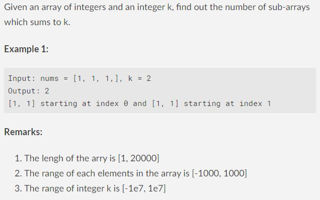
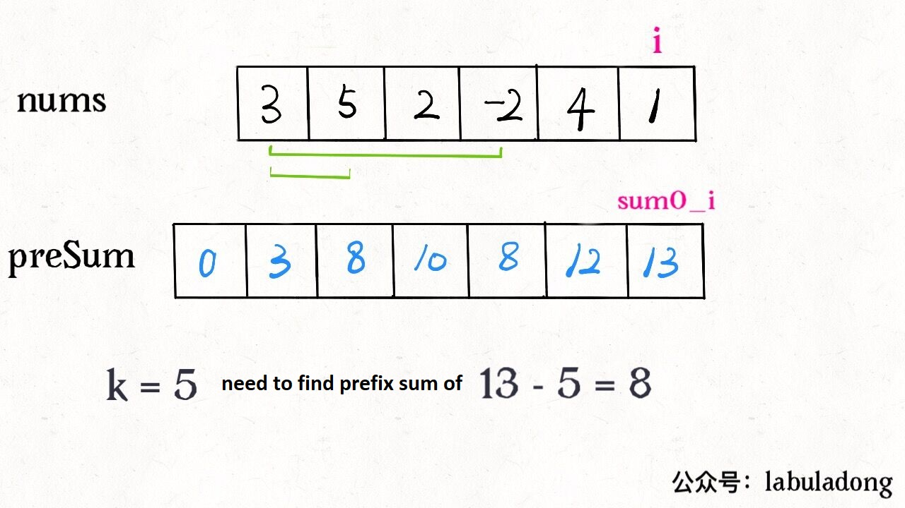

# Prefix Sum

**Translator: [youyun](https://github.com/youyun)**

**Author: [labuladong](https://github.com/labuladong)**

Let's talk about a simple but interesting algorithm problem today. Find the number of subarrays which sums to k.



The most intuitive way is using brute force - find all the subarrays, sum up and compare with k.

The tricky part is, __how to find the sum of a subarray fast?__ For example, you're given an array `nums`, and asked to implement API `sum(i, j)` which returns the sum of `nums[i..j]`. Furthermore, the API will be very frequently used. How do you plan to implement this API?

Due to the high frequency, it is very inefficient to traverse through `nums[i..j]` each time. Is there a quick method which find the sum in time complexity of O(1)? There is a technique called __Prefix Sum__.

### 1. What is Prefix Sum

The idea of Prefix SUm goes like this: for a given array `nums`, create another array to store the sum of prefix for pre-processing:

```java
int n = nums.length;
// array of prefix sum
int[] preSum = new int[n + 1];
preSum[0] = 0;
for (int i = 0; i < n; i++)
    preSum[i + 1] = preSum[i] + nums[i];
```


The meaning of `preSum` is easy to understand. `preSum[i]` is the sum of `nums[0..i-1]`. If we want to calculate the sum of `nums[i..j]`, we just need to perform `preSum[j+1] - preSum[i]` instead of traversing the whole subarray.

Coming back to the original problem. If we want to find the number of subarrays which sums to k respectively, it's straightforward to implement using Prefix Sum technique:

```java
int subarraySum(int[] nums, int k) {
    int n = nums.length;
    // initialize prefix sum
    int[] sum = new int[n + 1];
    sum[0] = 0; 
    for (int i = 0; i < n; i++)
        sum[i + 1] = sum[i] + nums[i];
    
    int ans = 0;
    // loop through all subarrays by brute force
    for (int i = 1; i <= n; i++)
        for (int j = 0; j < i; j++)
            // sum of nums[j..i-1]
            if (sum[i] - sum[j] == k)
                ans++;

    return ans;
}
```

The time complexity of this solution is O(N^2), while the space complexity is O(N). This is not the optimal solution yet. However, we can apply some cool techniques to reduce the time complexity further, after understanding how Prefix Sum and arrays can work together through this solution.

### 2. Optimized Solution

The solution in part 1 has nested `for` loop:

```java
for (int i = 1; i <= n; i++)
    for (int j = 0; j < i; j++)
        if (sum[i] - sum[j] == k)
            ans++;
```

What does the inner `for` loop actually do? Well, it is used __to calculate how many `j` can make the difference of `sum[i]` and `sum[j]` to be k.__ Whenever we find such `j`, we'll increment the result by 1.

We can reorganize the condition of `if` clause:

```java
if (sum[j] == sum[i] - k)
    ans++;
```

The idea of optimization is, __to record down how many `sum[j]` equal to `sum[i] - k` such that we can update the result directly instead of having inner loop.__ We can utilize hash table to record both prefix sums and the frequency of each prefix sum.

```java
int subarraySum(int[] nums, int k) {
    int n = nums.length;
    // map：prefix sum -> frequency
    HashMap<Integer, Integer> 
        preSum = new HashMap<>();
    // base case
    preSum.put(0, 1);

    int ans = 0, sum0_i = 0;
    for (int i = 0; i < n; i++) {
        sum0_i += nums[i];
        // this is the prefix sum we want to find nums[0..j]
        int sum0_j = sum0_i - k;
        // if it exists, we'll just update the result
        if (preSum.containsKey(sum0_j))
            ans += preSum.get(sum0_j);
        // record the prefix sum nums[0..i] and its frequency
        preSum.put(sum0_i, 
            preSum.getOrDefault(sum0_i, 0) + 1);
    }
    return ans;
}
```

In the following case, we just need prefix sum of 8 to find subarrays with sum of k. By brute force solution in part 1, we need to traverse arrays to find how many 8 there are. Using the optimal solution, we can directly get the answer through hash table.



This is the optimal solution with time complexity of O(N).

### 3. Summary

Prefix Sum is not hard, yet very useful, especially in dealing with differences of array intervals.

For example, if we were asked to calculate the percentage of each score interval among all students in the class, we can apply Prefix Sum technique:

```java
int[] scores; // to store all students' scores
// the full score is 150 points
int[] count = new int[150 + 1]
// to record how many students at each score
for (int score : scores)
    count[score]++
// construct prefix sum
for (int i = 1; i < count.length; i++)
    count[i] = count[i] + count[i-1];
```

Afterwards, for any given score interval, we can find how many students fall in this interval by calculating the difference of prefix sums quickly. Hence, the percentage will be calculated easily.

However, for more complex problems, simple Prefix Sum technique is not enough. Even the original question we discussed in this article requires one step further to optimize. We used hash table to eliminate an unnecessary loop. We can see that if we want to achieve the optimal solution, it is indeed important to understand a problem thoroughly and analyze into details.
