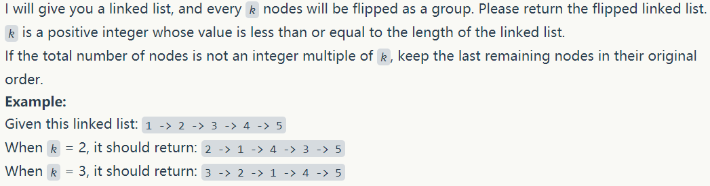
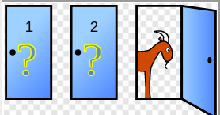
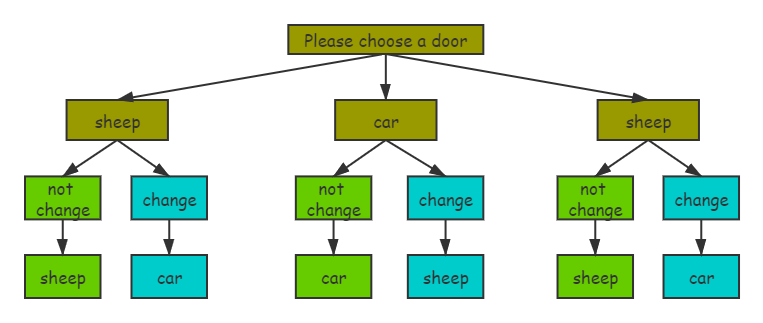

# Several counter-intuitive probability problems

**Translator: [Lyjeeq](https://github.com/Lyjeeq)**

**Author: [labuladong](https://github.com/labuladong)**

Last article [Shuffle Algorithm](./Shuffle_Algorithm.md) talked about the Monte Carlo method of verifying the probability algorithm. Let me talk about something easy today: several interesting questions related to probability.

There are two simplest principles for calculating probability:

Principle 1: There must be a frame of reference for calculating probability, which is called "sample space", that is, all the possible results of random events. The probability of occurrence of event A = sample space contained by A / the total number of sample points.

Principle two: To calculate the probability, we must understand that the probability is a continuous whole, and the continuous probability cannot be separated, which is the so-called conditional probability.

The above two principles have been studied in high school, but we are still easy to make mistakes, and the process of making mistakes is similar.

First, the second principle was ignored, the sample space was calculated incorrectly, and then the wrong answer was calculated by the first principle.

Here are a few simple but confusing questions, namely the boy and girl problem, the birthday paradox, and the three-door problem. Of course, the three questions are probably the most familiar to everyone, so let's talk about some interesting thoughts.

### 1.Boy and girl problems

Suppose there is a family with two children, and now I tell you that there is a boy among them, what is the probability that the other is also a boy?

Many people, including me, answered without thinking: 1/2, because the other child is either a boy or a girl, and the probability is equal. But in fact, the answer is 1/3.

Why is the above idea wrong? Because the sample space is not calculated correctly, the principle one calculation is wrong. There are two children, so the sample space is 4, that is, the four cases of brother, sister, brother, sister, sister and brother. Knowing that there is a boy, then the situation of sisters and sisters is excluded, so the sample space becomes 3. The other child is also a case where the boy has only brother and brother, so the probability is 1/3.

Why does calculating the sample space go wrong? Because we ignore the conditional probability, which confuses the following two problems:

This family has only one child. What is the probability that this child is a boy?

What is the probability that this family has two children, one is a boy and the other is a boy?

According to principle two, the problem of probability is continuous, and the above two problems cannot be confused. The second problem requires conditional probability, that is, the probability that one child is a boy and the other is a boy. The formula using conditional probability is easy to calculate, so I won't say much.

Through this question, the reader should understand the relationship between the two probability calculation principles. The most confusing thing is the neglect of conditional probability. In order not to be confused, the easiest way is to exhaust all possible results.

Finally, I have seen a very strange question about this question: What if the two children are twins and there is no difference in age?

I actually think there is so much truth! But in fact, we only use the age difference to indicate the independence of the two children, which means that even if the two children are the same sex, there are two possibilities. So don't use twins for sophistry.

### 2.Birthday paradox

The birthday paradox is caused by the question: How many people are needed in a room to make it possible that there are at least two people whose birthday is the same day to reach 50%?

The answer is 23 people, which means that if there are 23 people in the house, there is a 50% chance that two people will have the same birthday. This conclusion looks incredible, so it is called paradox. Intuitively, to get a 50% probability, there must be at least 183 people, because there are 365 days in a year? Actually not. I think this conclusion is incredible. There are two main misunderstandings:

**The first is to misunderstand the meaning of the word "existence".**

Readers may think that if the probability of the same birthday among 23 people can reach 50%, does it mean:

Suppose there are 22 people sitting in the room now, and then I walk in, then there is a 50% probability that I can find a person with my birthday. How is that possible?

No, your idea is self-centered, and the probability of transition is describing the whole. The meaning of "existence" refers to any two of the 23 people, involving decentralized combinations, and the high probability has nothing to do with you.

If you have to calculate the probability of having the same person as your birthday, you can calculate it like this:

1-P (22 people are different from my birthday) = 1-(364/365) ^ 22 = 0.06

Does the calculated result look much more reasonable? The calculation of the birthday paradox is not a single person, but a whole, which contains the permutations and combinations of all people, and the sum of their probabilities will of course be much greater.

**The second misconception is that the probability changes linearly.**

The reader may think that if the probability of having the same birthday among 23 people can reach 50%, does it mean that the probability of 46 people can reach 100%?

No, like a game with a 50% winning rate, do you play 100% twice? Obviously not, the winning rate for your two plays is 75%:

$ P (twice) = P (the first time) + P (losing the first time but winning the second time) = 1/2 + 1/2 * 1/2 = 75 \% $

Then switching to the birthday paradox is also a reason. Probability is not a simple superposition, but a continuous process must be considered, so this conclusion is not unreasonable.

So why is the probability of 23 people having the same birthday greater than 50%? We first calculate the probability that the 23 birthdays are unique (not duplicate). When there is only one person, the only probability of a birthday is $ 365/365 $, when there are two persons, the only probability of a birthday is $ 365/365 × 364/365 $, and so on. It can be seen that the probability of a birthday of 23 people is unique:

It is calculated to be about 0.493, so the probability of having the same birthday is 0.507, which is almost 50%. In fact, according to this algorithm, when the number of people reaches 70, the probability that two people have the same birthday rises to 99.9%, which can basically be considered as 100%. So from a probability perspective, it's not unusual to have people with the same birthday in a small group of dozens of people.

### 3.Three-door problem

This game is classic: the game participants face three doors, two of which are goats behind and one is a sports car. The participant just chooses a door, and the thing behind the door belongs to him (of course, the value of a sports car is greater). But the host decided to help the participants: after he chose, he didn't rush to open the door, but the host opened one of the remaining two doors and showed the goats (the host knows each door) What's next), and then give the participant a chance to change the door. At this time, should the participant change the door or not?

In order to prevent confusion for readers who see this question for the first time, let's describe it in detail:

You are a game participant. Now you have gates 1,2,3. Suppose you choose gate 1 randomly, then the host opens gate 3 and tells you that there is a goat behind. Now, do you stick with your initial choice of Gate 1 or choose to switch to Gate 2?

The answer is that you should change the door. The probability of getting a sports car after changing the door is 2/3. If you don't change, it is 1/3. Another counter-intuition, I feel that the probability of winning is the same, because there must be two doors left in the end, one is a sheep and the other is a sports car. This is a fact, so the probability is not 1/2 regardless of which one is chosen. ?

Similar to the boy and girl problem mentioned earlier, the simplest and safest method is to exhaust all possible results:

It is easy to see that the probability of choosing a door to win is 2/3, if not, it is 1/3.

There is a simpler way to address this: the moderator's door opening is actually "condensing" the probability. The probability that you choose a sports car in the beginning is of course 1/3, and the probability that the remaining two doors contain a sports car is of course 2/3, which is nothing to say. But the host helped you rule out a door that contains a goat, which is equivalent to concentrating that 2/3 probability on the remaining door. So, do you say that you are holding the original 1/3 door, or replace it with the 2/3 probability that has been "condensed"?

To be more intuitive, suppose you choose one of the three, and you have 2 doors left, and then you will add 98 goat-mounted doors, and randomly scramble these 100 doors. Will you change them? I'm sure not to change it, because this obviously dilutes the probability, and it is most likely that the original door is the most sports car. Let's also suppose that there are 100 doors at first. You choose one. Then the host will help you to exclude 98 goats from the remaining 99 doors. Would you like to change one door? Surely change it. The door you have is 1% and the other door is 99%, or you can understand it this way. If you do n’t change, you just choose 1 door. Changing the door is equivalent to choosing 99 doors. Obviously right?

Some readers have thought about the above thoughts. Let us consider the following question: Suppose that when you decide whether to change the door, Xiao Ming breaks through the door and asks you to make a choice. He had no idea what had happened before, he only knew that there were two doors in front of him, a sports car and a goat, so what was the probability that he would win the sports car?

Of course, it is 1/2, which is the root cause of many people doing wrong three problems. Similar to the birthday paradox, people are always easy to be self-centered. From this Xiaoming's perspective, calculating whether to change doors is obviously a misunderstanding.

It ’s like having two boxes, the first box has 4 black balls and 2 red balls, the second box has 2 black balls and 4 red balls, choose a box, touch a ball, ask you Probability.

For unknown Xiao Ming, he will randomly choose a box, touch the ball randomly, and the probability of touching the red ball is: 1/2 × 2/6 + 1/2 × 4/6 = 1/2

For the informed you, you know that the probability of touching the ball in the second box is high, so only touching in the second box, the probability of touching the red ball is: 0 × 2/6 + 1 × 4/6 = 2/3

The three questions are instructive. For example, if you have a multiple-choice question, you first get A, and then you get rid of B and C with a clever move. Do you want to replace A with D? The answer is, change!

Perhaps the reader will ask, if only one answer is excluded, say B, then should I replace A with C or D? The answer is, change!

Because according to the idea of ​​"concentrating" probability just now, as long as you exclude it, you are doing "concentrating", and it will definitely be 1/4 higher than the answer you got at the beginning. For example, the correct probability of both C and D is 3/8, and the A of you start is only 1/4.

Of course, the premise of using this strategy is that you are really blind and really randomly choose answers, so that the probability can be used as the ace.