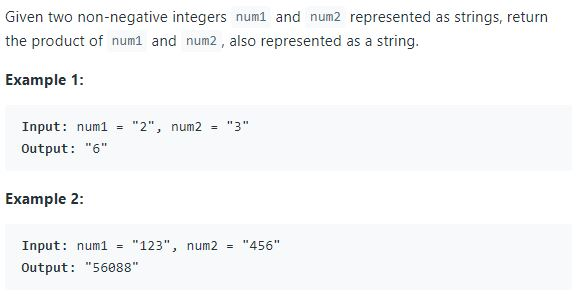
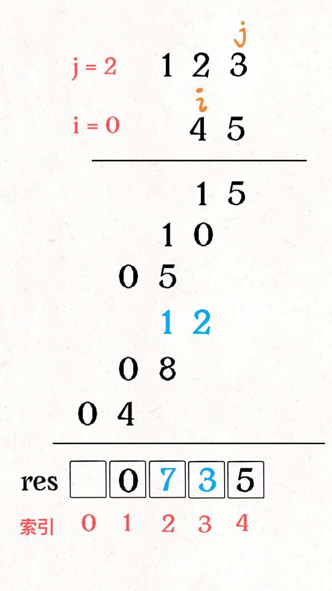

# String Multiplication

**Translator: [youyun](https://github.com/youyun)**

**Author: [labuladong](https://github.com/labuladong)**

For relatively small numbers, you can calculate directly using the operators provided by a programming language. When the numbers become very big, the default data types might overflow. An alternative way is to use string to represent the numbers, perform the multiplication in the primary school way, and produce the result as string as well. Take [this question](https://leetcode.com/problems/multiply-strings/) as an example.



Note that both `num1` and `num2` can be very long. We can't directly calculate by transforming them to integers. We can learn from the process multiplying by hand.

For example, when we multiply `123 × 45` by hand, the process is shown in the following diagram:


Firstly, calculate `123 × 5`. Then calculate `123 × 4`. In the end, add them together by shifting one digit. We learned this method in primary school. Can we __generalize the steps in this process__, such that a computer can understand?

This simple process actually involves a lot of knowledge - carry of multiplication, carry of addition, and adding numbers by shifting digits. Another not so obvious issue is the number of digits of the final result. When two two-digit numbers multiply, the result can be either four-digit or three-digit. How to generalize this? Without the mindset of a computer, we can't even automate simple problems. This is the beauty of algorithms.

Well, this process is still too high-level. Let's try something at a lower level. The processes of `123 × 5` and `123 × 4` can be further broken into parts and add together:


`123` is pretty small. If the number is large, we can't get the product directly. An array can help to store the result of addition:


Here is the rough process of calculation. __Two pointers `i, j` moves at `num1` and `num2` to multiply, adding the products to the correct positions of `res`__:


There is a key question now. How to add products to the correct positions of `res`? In other words, how to use `i, j` to calculate the corresponding indices in `res`?

With careful observation, __the product of `num1[i]` and `num2[j]` corresponds to `res[i+j]` and `res[i+j+1]`__.



If we understand the above, we should be able to translate the process into code:

```java
string multiply(string num1, string num2) {
    int m = num1.size(), n = num2.size();
    // the max number of digits in result is m + n
    vector<int> res(m + n, 0);
    // multiply from the rightmost digit
    for (int i = m - 1; i >= 0; i--)
        for (int j = n - 1; j >= 0; j--) {
            int mul = (num1[i]-'0') * (num2[j]-'0');
            // the corresponding index of product in res
            int p1 = i + j, p2 = i + j + 1;
            // add to res
            int sum = mul + res[p2];
            res[p2] = sum % 10;
            res[p1] += sum / 10;
        }
    // the result may have prefix of 0 (which is unused)
    int i = 0;
    while (i < res.size() && res[i] == 0)
        i++;
    // transform the result into string
    string str;
    for (; i < res.size(); i++)
        str.push_back('0' + res[i]);
    
    return str.size() == 0 ? "0" : str;
}
```

We have just completed the string multiplication.

__In summary__, some of our common ways of think may be hard to achieve by computer. For instance, the process of our calculation is not that complicated. But it is not easy to translate this process into code. Our algorithm needs to simplify the calculation process, achieve the result by adding while multiplying at the same time.

People usually say that we need to think out of the box, be creative, and be different. But systematic thinking can be a good thing. It can improve the efficiency and reduce the error rate. Algorithms are based on systematic thinking, and can help us to resolve complex problems.

Maybe algorithms are a kind of __mindset to find a systematic thinking__. Hope this article helps.
