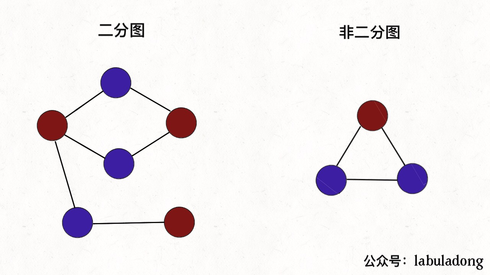
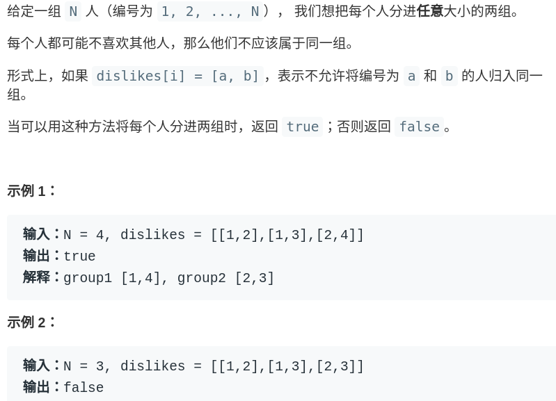
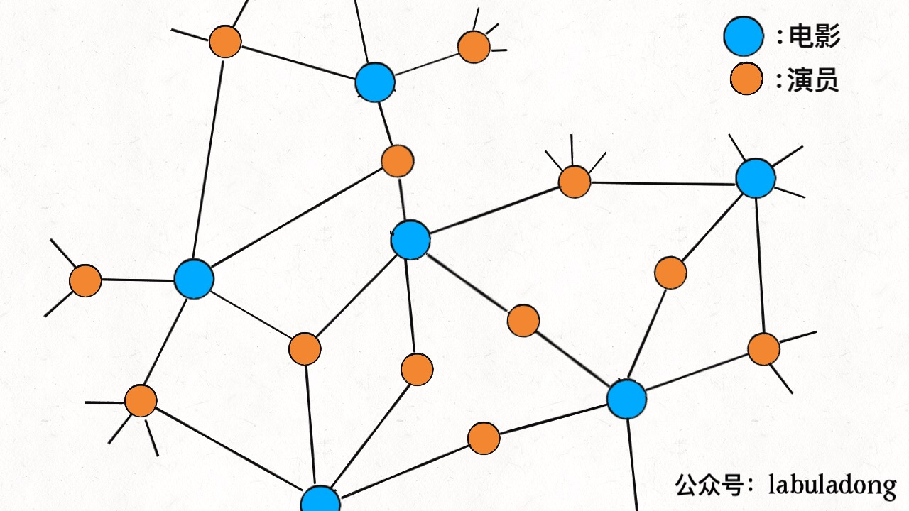
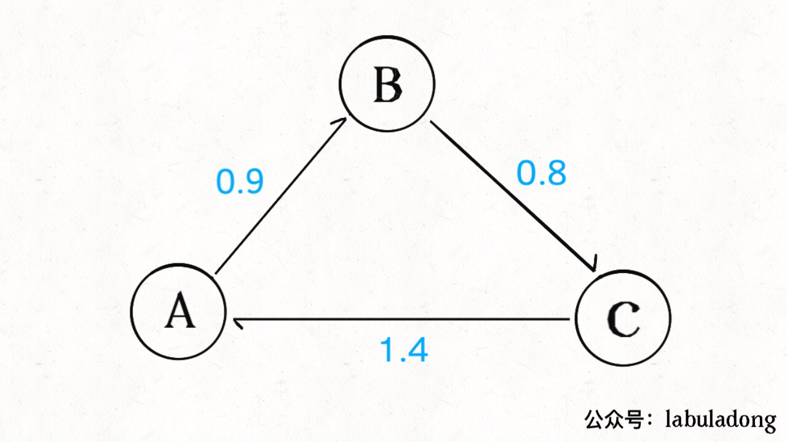

# Why I Recommend _Algorithms, 4th Edition_

**Translator: [natsunoyoru97](https://github.com/natsunoyoru97)**

**Author: [labuladong](https://github.com/labuladong)**

My previous articles are mainly about hardcore algorithms, but I'll no more talk about them today. I have highly recommended _Algorithms, 4th Edition_ (alias algs4) before in my previous articles but without explanation in details, so I'll introduce it to you.

I prefer to combine with applications rather than to throw out a pile of bibliography. I'll show you something fun and useful so you could learn something no matter you will read the book or not.

**_Algorithms, the 4th Edition_ IS FRIENDLY WITH NEWBIES**. There are so many readers asking questions like can they read algs4 with only C programming basics, and what is the best programming language to learn algorithms.

Algorithms are patterns of thinking and it is nothing about what programming language you use. My codes in the articles are not in only one programming language, and it is more about by what programming language is easier for you to understand. Plus, you can get a digital copy (say, a PDF file) and then you will know it is suitable for you or not.

algs4 is thick but the first chapter is about Java basics, practices and mathematical proofs are also take up lots of pages. All the things left are basic knowledge and answers for things hard to understand, which are of great value. If you write up the codes of basic knowledge, you will be good in algorithms.

I think this book is highly rated because of its in-detail explanation and combination between algorithms and applications in life. Not only do you know how to construct algorithms, but also you know how you can apply them to solve other problems in real life. Then I'll introduce two simple applications of graph algorithms:  

### 1. Applications of Bipartite Graph

The first example is **bipartite Graph**. In brief, the bipartite graph is a special kind of graph: you can paint all nodes with two colors, and the colors are different between ANY two nodes in one edge.

As we know what is a bipartite graph, what practical problems can it deal with? **In algorithms, it is usual to check a graph is a bipartite graph or not**. For example, here is a practice in LeetCode:

If we regard every person as a node and use the edges represent if two persons hate with each other, we can make a graph. Thus, according to the definition of the bipartite graph mentioned before, if the graph is bipartite, these persons can be split into two groups.

This is one application of algorithms in determining a bipartite graph, and bipartite graph can do more of this. bipartite graph, as a kind of data structure, also has its special application.

For example, we need a kind of data structure to store the relations between movies and actors: a movie has many actors, and an actor is possible to star in many movies. What kind of data structure do you apply to store the relation?

As what we do is to store the mapping, the most simple way is to apply a hash table, so we could use the `HashMap<String, List<String>>` to store the mapping from movies to the actor list. Given the name of a movie, we will get all the actors starred in this movie quickly.

But what do we do if we would like to get all the movies an actor stars in given his or her name? We need to apply inverted index, make some modification of the hash table, to build another hash table using the actors as the key and movie list as the value.

For this example, we can apply the bipartite graph instead of the hash table. Relation between movies and actors is like a bipartite graph: we regard movies and actors as nodes in the graph, relation of acting the role as edges, thus there is only connections between actors and movies, and there is no case that an actor node connects to another actor node or a movie node connects to another movie node.

By the definition of the bipartite graph, if we paint actor nodes and movie nodes, there must be a bipartite graph:

If the graph is constructed, there is no need to do an inverted index. One actor node only connects to a movie node, and a movie node only connects to an actor node.

algs4 also mentioned some other fun applications, such as degrees of separation in the social network (maybe you have heard about Six Degrees of Separation), it is a problem of applying BFS searching to find the shortest path, I just skip the code here.

### 2. Arbitrage with Bellman-Ford Algorithm

Given the exchange rate from a currency A to another currency B is 10, which means 1 unit of currency A can exchange 10 units of currency B. If we regard every currency as a node of the graph and the exchange rate between two currencies is weighted directed edge, the whole foreign exchange rate market is a complete weighted directed graph.

Once we abstract scenarios in real life to a graph, it is possible to solve some problems using algorithms. For example, such a situation may exist in the graph:

The weighted directed edges in the graph represent the exchange rate, we can find that if we exchange 100 units of currency A to currency B, continue exchanging to currency C, and exchange back to currency A, we could get 100×0.9×0.8×1.4 = 100.8 units of currency A! Provided the amount in a deal is larger, we could get a great amount of money. Such behavior getting the most bang for the buck is so-called arbitrage.

There are lots of restrictions in the reality, the market is also changing rapidly, but the profit of arbitrage is high. The key is how to find such chances **RAPIDLY**.

With help of the graph ADT, we found that the chance of arbitrage is a cycle, and the multiples of all weights in the cycle are above 1, we could make the most bang for the buck if we make the deal in the cycle.

There is a typical graph algorithm called **the Bellman-Ford algorithm**, which can be applied **to find cycles with negative weights**. To deal with the problem of arbitrage, we can substitute the weights of all edges w to -ln(w), then the target to find the cycle in which the multiples of weights is above 1 becomes to find the cycle in which the sum of the addition of weights, so we can apply the Bellman-Ford algorithm to find cycle including negative weights in O(EV) time, thus to find the chance of arbitrage.

The explanation of contents of algs4 is over here. You can read the relevant content in algs4. 

### 3. The Final Word

First things first, I have mentioned we can skip the mathematical proofs and practices behind the chapters. Someone may ask: Are these practices and proofs NOT IMPORTANT?

I would like to say, they ARE not important at least for most people. In my opinion, it is better to learn with goals. For most people, they learn algorithms just out of reviewing the computer basics and coping with questions in interviews. **If it is your goal**, what you have to do is to learn some basic data structures and typical algorithms, to make sense of their time complexity and practice. Why you have to struggle with practices and proofs?

This is the reason why I NEVER recommend you to read CLRS (alias _Introduction to Algorithms_). If someone recommends this book for you, it is only out of two reasons: he/she is a big cheese or he/she is pretending to be a big cheese. There are tons of mathematical proofs and many ADTs mentioned are rarely used, which you can only make it a reference. Just forgive yourself and stop to learn that useless stuff. 

Plus, it is more important to master the essence rather than to scan through pages. Spending your time on reading algs4 and make through of most chapters (things are rather difficult in the last), reading the articles in this repository. If you did all of these, it is enough. Don't be torn on trivial things.
