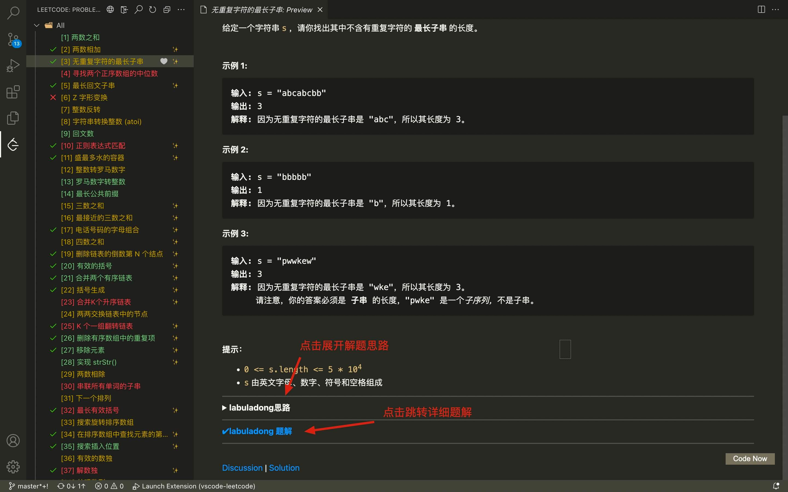
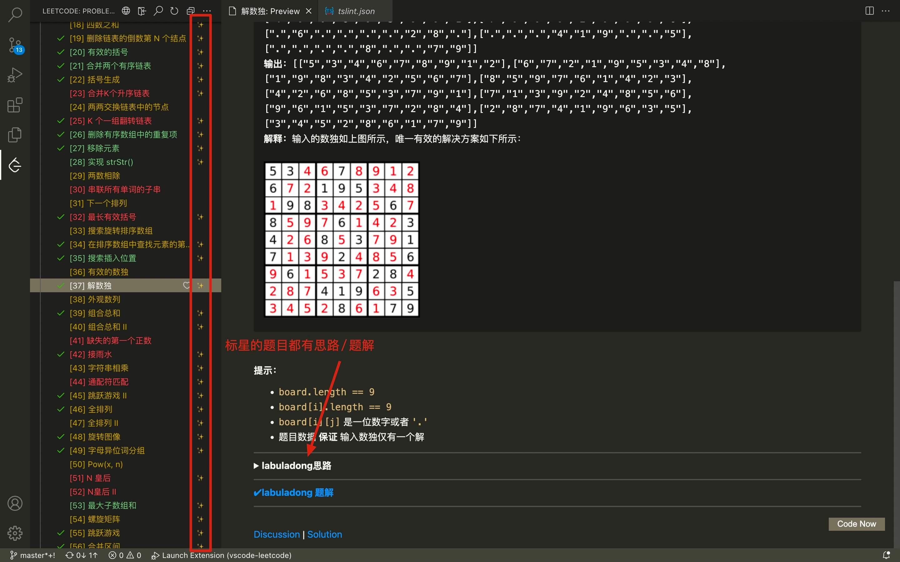

为了进一步帮助我的读者刷题和学习算法，我发布了 [labuladong 的刷题三件套](https://mp.weixin.qq.com/s/X-fE9sR4BLi6T9pn7xP4pg)，其中 Chrome 刷题插件广受大家的好评。所以现在我又写了一个 vscode 插件，把 [Chrome 插件的所有功能](https://mp.weixin.qq.com/s/wIxflO1dvXzDlibhEcENcQ) 都移植到了 vscode 上面。

本插件是我基于 LeetCode 官方的插件改写的：

https://github.com/LeetCode-OpenSource/vscode-leetcode

官方的插件对英文版 LeetCode 适配比较好，对中文力扣的支持一般，而且很久都不维护了，连登录都有问题。

**我把这些 bug 全部修复了，另外可以方便读者查看我的刷题笔记和详细题解**：

支持一边看解法思路一边写代码：

题目列表中带有 ✨ 标记的题目都是我在公众号讲解过的，可以查看题解或者思路：

我自己一直在坚持刷算法题并总结解题套路，所以未来插件中标 ✨ 的题目会越来越多，Chrome 插件和 vscode 插件都会同步更新。
