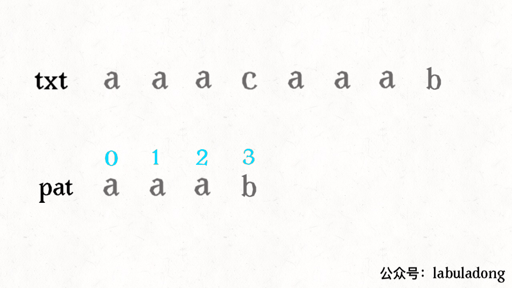
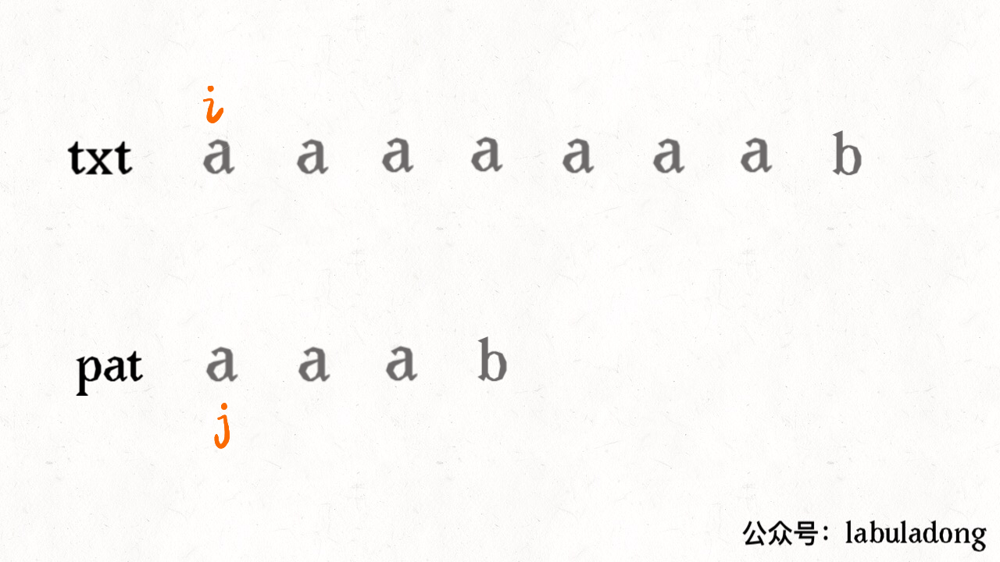
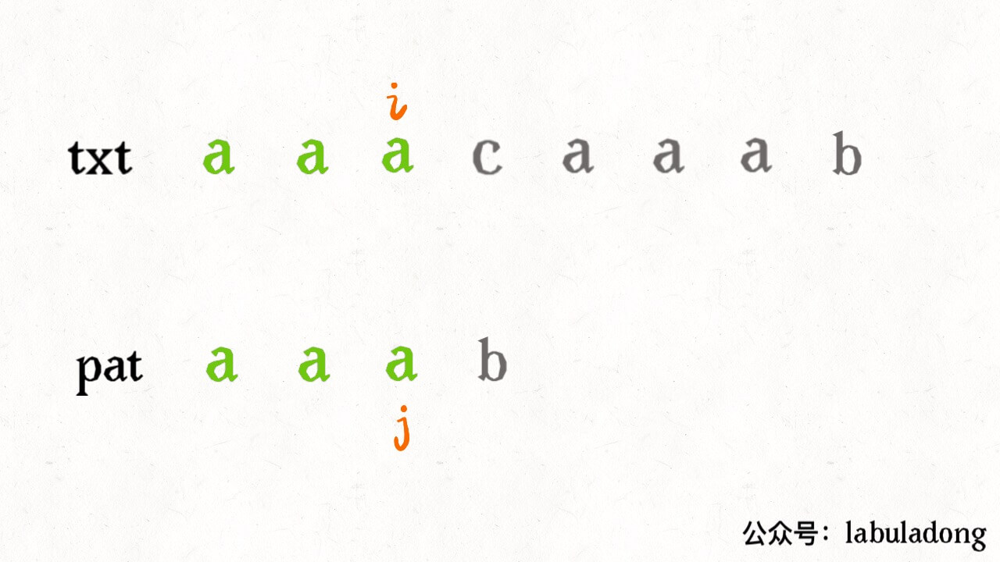
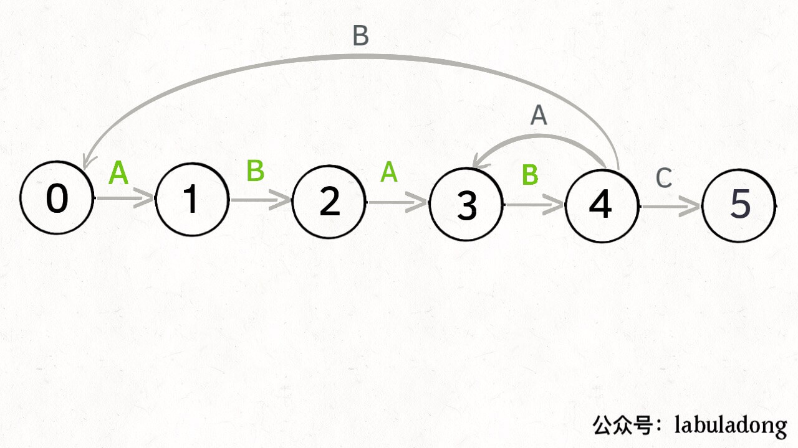
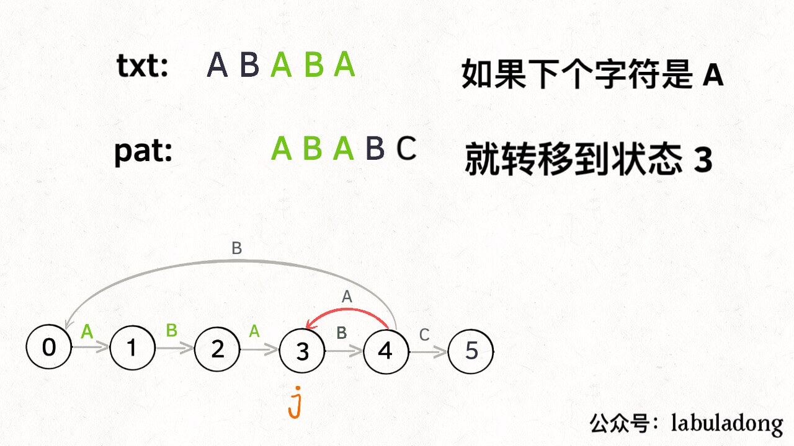
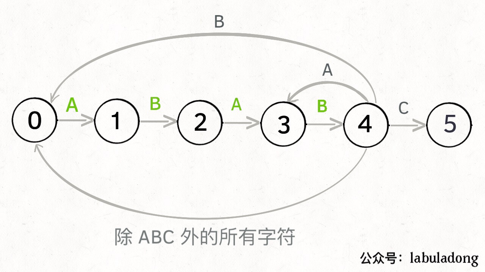
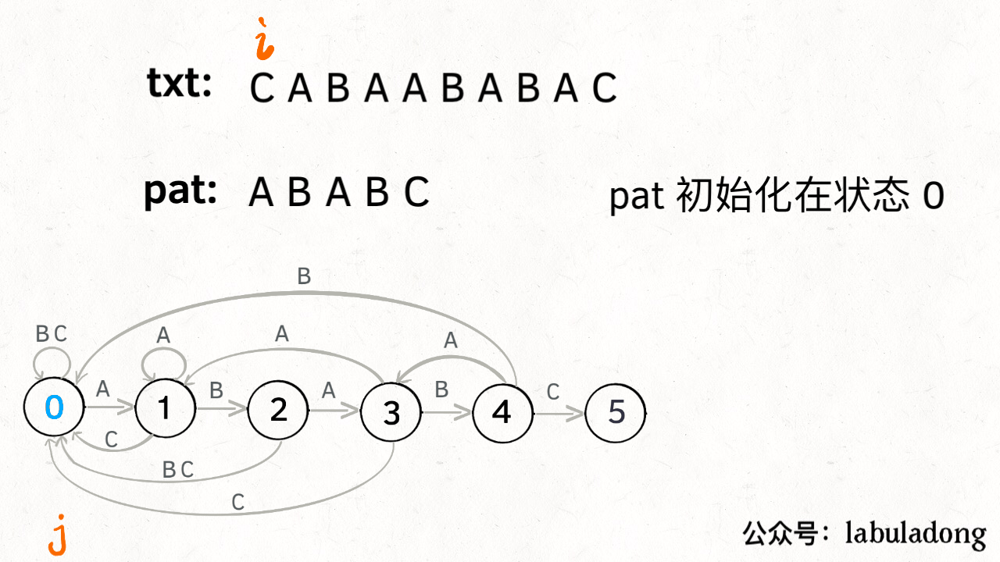
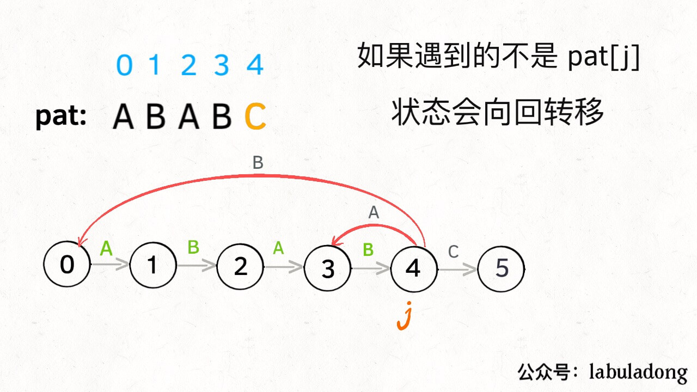
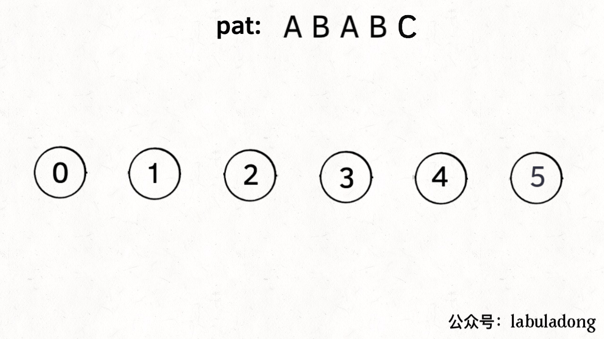

# 动态规划之KMP字符匹配算法


<p align='center'>
<a href="https://github.com/labuladong/fucking-algorithm" target="view_window"></a>
<a href="https://www.zhihu.com/people/labuladong"></a>
<a href="https://i.loli.net/2020/10/10/MhRTyUKfXZOlQYN.jpg"></a>
<a href="https://space.bilibili.com/14089380"></a>
</p>


相关推荐：
  * [经典动态规划：最长公共子序列](https://labuladong.gitee.io/algo/)
  * [特殊数据结构：单调栈](https://labuladong.gitee.io/algo/)

读完本文，你不仅学会了算法套路，还可以顺便去 LeetCode 上拿下如下题目：

[28.实现 strStr()](https://leetcode-cn.com/problems/implement-strstr)

**-----------**

KMP 算法（Knuth-Morris-Pratt 算法）是一个著名的字符串匹配算法，效率很高，但是确实有点复杂。

很多读者抱怨 KMP 算法无法理解，这很正常，想到大学教材上关于 KMP 算法的讲解，也不知道有多少未来的 Knuth、Morris、Pratt 被提前劝退了。有一些优秀的同学通过手推 KMP 算法的过程来辅助理解该算法，这是一种办法，不过本文要从逻辑层面帮助读者理解算法的原理。十行代码之间，KMP 灰飞烟灭。

**先在开头约定，本文用 `pat` 表示模式串，长度为 `M`，`txt` 表示文本串，长度为 `N`。KMP 算法是在 `txt` 中查找子串 `pat`，如果存在，返回这个子串的起始索引，否则返回 -1**。

为什么我认为 KMP 算法就是个动态规划问题呢，等会再解释。对于动态规划，之前多次强调了要明确 `dp` 数组的含义，而且同一个问题可能有不止一种定义 `dp` 数组含义的方法，不同的定义会有不同的解法。

读者见过的 KMP 算法应该是，一波诡异的操作处理 `pat` 后形成一个一维的数组 `next`，然后根据这个数组经过又一波复杂操作去匹配 `txt`。时间复杂度 O(N)，空间复杂度 O(M)。其实它这个 `next` 数组就相当于 `dp` 数组，其中元素的含义跟 `pat` 的前缀和后缀有关，判定规则比较复杂，不好理解。**本文则用一个二维的 `dp` 数组（但空间复杂度还是 O(M)），重新定义其中元素的含义，使得代码长度大大减少，可解释性大大提高**。

PS：本文的代码参考《算法4》，原代码使用的数组名称是 `dfa`（确定有限状态机），因为我们的公众号之前有一系列动态规划的文章，就不说这么高大上的名词了，我对书中代码进行了一点修改，并沿用 `dp` 数组的名称。

### 一、KMP 算法概述

首先还是简单介绍一下 KMP 算法和暴力匹配算法的不同在哪里，难点在哪里，和动态规划有啥关系。

暴力的字符串匹配算法很容易写，看一下它的运行逻辑：

```java
// 暴力匹配（伪码）
int search(String pat, String txt) {
    int M = pat.length;
    int N = txt.length;
    for (int i = 0; i <= N - M; i++) {
        int j;
        for (j = 0; j < M; j++) {
            if (pat[j] != txt[i+j])
                break;
        }
        // pat 全都匹配了
        if (j == M) return i;
    }
    // txt 中不存在 pat 子串
    return -1;
}
```

对于暴力算法，如果出现不匹配字符，同时回退 `txt` 和 `pat` 的指针，嵌套 for 循环，时间复杂度 `O(MN)`，空间复杂度`O(1)`。最主要的问题是，如果字符串中重复的字符比较多，该算法就显得很蠢。

比如 txt = "aaacaaab" pat = "aaab"：



很明显，`pat` 中根本没有字符 c，根本没必要回退指针 `i`，暴力解法明显多做了很多不必要的操作。

KMP 算法的不同之处在于，它会花费空间来记录一些信息，在上述情况中就会显得很聪明：


再比如类似的 txt = "aaaaaaab" pat = "aaab"，暴力解法还会和上面那个例子一样蠢蠢地回退指针 `i`，而 KMP 算法又会耍聪明：



因为 KMP 算法知道字符 b 之前的字符 a 都是匹配的，所以每次只需要比较字符 b 是否被匹配就行了。

**KMP 算法永不回退 `txt` 的指针 `i`，不走回头路（不会重复扫描 `txt`），而是借助 `dp` 数组中储存的信息把 `pat` 移到正确的位置继续匹配**，时间复杂度只需 O(N)，用空间换时间，所以我认为它是一种动态规划算法。

KMP 算法的难点在于，如何计算 `dp` 数组中的信息？如何根据这些信息正确地移动 `pat` 的指针？这个就需要**确定有限状态自动机**来辅助了，别怕这种高大上的文学词汇，其实和动态规划的 `dp` 数组如出一辙，等你学会了也可以拿这个词去吓唬别人。

还有一点需要明确的是：**计算这个 `dp` 数组，只和 `pat` 串有关**。意思是说，只要给我个 `pat`，我就能通过这个模式串计算出 `dp` 数组，然后你可以给我不同的 `txt`，我都不怕，利用这个 `dp` 数组我都能在 O(N) 时间完成字符串匹配。

具体来说，比如上文举的两个例子：

```python
txt1 = "aaacaaab" 
pat = "aaab"
txt2 = "aaaaaaab" 
pat = "aaab"
```

我们的 `txt` 不同，但是 `pat` 是一样的，所以 KMP 算法使用的 `dp` 数组是同一个。

只不过对于 `txt1` 的下面这个即将出现的未匹配情况：



`dp` 数组指示 `pat` 这样移动：


PS：这个`j` 不要理解为索引，它的含义更准确地说应该是**状态**（state），所以它会出现这个奇怪的位置，后文会详述。

而对于 `txt2` 的下面这个即将出现的未匹配情况：


`dp` 数组指示 `pat` 这样移动：


明白了 `dp` 数组只和 `pat` 有关，那么我们这样设计 KMP 算法就会比较漂亮：

```java
public class KMP {
    private int[][] dp;
    private String pat;

    public KMP(String pat) {
        this.pat = pat;
        // 通过 pat 构建 dp 数组
        // 需要 O(M) 时间
    }

    public int search(String txt) {
        // 借助 dp 数组去匹配 txt
        // 需要 O(N) 时间
    }
}
```

这样，当我们需要用同一 `pat` 去匹配不同 `txt` 时，就不需要浪费时间构造 `dp` 数组了：

```java
KMP kmp = new KMP("aaab");
int pos1 = kmp.search("aaacaaab"); //4
int pos2 = kmp.search("aaaaaaab"); //4
```

### 二、状态机概述

为什么说 KMP 算法和状态机有关呢？是这样的，我们可以认为 `pat` 的匹配就是状态的转移。比如当 pat = "ABABC"：


如上图，圆圈内的数字就是状态，状态 0 是起始状态，状态 5（`pat.length`）是终止状态。开始匹配时 `pat` 处于起始状态，一旦转移到终止状态，就说明在 `txt` 中找到了 `pat`。比如说当前处于状态 2，就说明字符 "AB" 被匹配：


另外，处于不同状态时，`pat` 状态转移的行为也不同。比如说假设现在匹配到了状态 4，如果遇到字符 A 就应该转移到状态 3，遇到字符 C 就应该转移到状态 5，如果遇到字符 B 就应该转移到状态 0：



具体什么意思呢，我们来一个个举例看看。用变量 `j` 表示指向当前状态的指针，当前 `pat` 匹配到了状态 4：


如果遇到了字符 "A"，根据箭头指示，转移到状态 3 是最聪明的：



如果遇到了字符 "B"，根据箭头指示，只能转移到状态 0（一夜回到解放前）：


如果遇到了字符 "C"，根据箭头指示，应该转移到终止状态 5，这也就意味着匹配完成：


当然了，还可能遇到其他字符，比如 Z，但是显然应该转移到起始状态 0，因为 `pat` 中根本都没有字符 Z：



这里为了清晰起见，我们画状态图时就把其他字符转移到状态 0 的箭头省略，只画 `pat` 中出现的字符的状态转移：


KMP 算法最关键的步骤就是构造这个状态转移图。**要确定状态转移的行为，得明确两个变量，一个是当前的匹配状态，另一个是遇到的字符**；确定了这两个变量后，就可以知道这个情况下应该转移到哪个状态。

下面看一下 KMP 算法根据这幅状态转移图匹配字符串 `txt` 的过程：



**请记住这个 GIF 的匹配过程，这就是 KMP 算法的核心逻辑**！

为了描述状态转移图，我们定义一个二维 dp 数组，它的含义如下：

```python
dp[j][c] = next
0 <= j < M，代表当前的状态
0 <= c < 256，代表遇到的字符（ASCII 码）
0 <= next <= M，代表下一个状态

dp[4]['A'] = 3 表示：
当前是状态 4，如果遇到字符 A，
pat 应该转移到状态 3

dp[1]['B'] = 2 表示：
当前是状态 1，如果遇到字符 B，
pat 应该转移到状态 2
```

根据我们这个 dp 数组的定义和刚才状态转移的过程，我们可以先写出 KMP 算法的 search 函数代码：

```java
public int search(String txt) {
    int M = pat.length();
    int N = txt.length();
    // pat 的初始态为 0
    int j = 0;
    for (int i = 0; i < N; i++) {
        // 当前是状态 j，遇到字符 txt[i]，
        // pat 应该转移到哪个状态？
        j = dp[j][txt.charAt(i)];
        // 如果达到终止态，返回匹配开头的索引
        if (j == M) return i - M + 1;
    }
    // 没到达终止态，匹配失败
    return -1;
}
```

到这里，应该还是很好理解的吧，`dp` 数组就是我们刚才画的那幅状态转移图，如果不清楚的话回去看下 GIF 的算法演进过程。下面讲解：如何通过 `pat` 构建这个 `dp` 数组？

### 三、构建状态转移图

回想刚才说的：**要确定状态转移的行为，必须明确两个变量，一个是当前的匹配状态，另一个是遇到的字符**，而且我们已经根据这个逻辑确定了 `dp` 数组的含义，那么构造 `dp` 数组的框架就是这样：

```python
for 0 <= j < M: # 状态
    for 0 <= c < 256: # 字符
        dp[j][c] = next
```

这个 next 状态应该怎么求呢？显然，**如果遇到的字符 `c` 和 `pat[j]` 匹配的话**，状态就应该向前推进一个，也就是说 `next = j + 1`，我们不妨称这种情况为**状态推进**：


**如果字符 `c` 和 `pat[j]` 不匹配的话**，状态就要回退（或者原地不动），我们不妨称这种情况为**状态重启**：



那么，如何得知在哪个状态重启呢？解答这个问题之前，我们再定义一个名字：**影子状态**（我编的名字），用变量 `X` 表示。**所谓影子状态，就是和当前状态具有相同的前缀**。比如下面这种情况：


当前状态 `j = 4`，其影子状态为 `X = 2`，它们都有相同的前缀 "AB"。因为状态 `X` 和状态 `j` 存在相同的前缀，所以当状态 `j` 准备进行状态重启的时候（遇到的字符 `c` 和 `pat[j]` 不匹配），可以通过 `X` 的状态转移图来获得**最近的重启位置**。

比如说刚才的情况，如果状态 `j` 遇到一个字符 "A"，应该转移到哪里呢？首先只有遇到 "C" 才能推进状态，遇到 "A" 显然只能进行状态重启。**状态 `j` 会把这个字符委托给状态 `X` 处理，也就是 `dp[j]['A'] = dp[X]['A']`**：


为什么这样可以呢？因为：既然 `j` 这边已经确定字符 "A" 无法推进状态，**只能回退**，而且 KMP 就是要**尽可能少的回退**，以免多余的计算。那么 `j` 就可以去问问和自己具有相同前缀的 `X`，如果 `X` 遇见 "A" 可以进行「状态推进」，那就转移过去，因为这样回退最少。


当然，如果遇到的字符是 "B"，状态 `X` 也不能进行「状态推进」，只能回退，`j` 只要跟着 `X` 指引的方向回退就行了：


你也许会问，这个 `X` 怎么知道遇到字符 "B" 要回退到状态 0 呢？因为 `X` 永远跟在 `j` 的身后，状态 `X` 如何转移，在之前就已经算出来了。动态规划算法不就是利用过去的结果解决现在的问题吗？

这样，我们就细化一下刚才的框架代码：

```python
int X # 影子状态
for 0 <= j < M:
    for 0 <= c < 256:
        if c == pat[j]:
            # 状态推进
            dp[j][c] = j + 1
        else: 
            # 状态重启
            # 委托 X 计算重启位置
            dp[j][c] = dp[X][c] 
```

### 四、代码实现

如果之前的内容你都能理解，恭喜你，现在就剩下一个问题：影子状态 `X` 是如何得到的呢？下面先直接看完整代码吧。

```java
public class KMP {
    private int[][] dp;
    private String pat;

    public KMP(String pat) {
        this.pat = pat;
        int M = pat.length();
        // dp[状态][字符] = 下个状态
        dp = new int[M][256];
        // base case
        dp[0][pat.charAt(0)] = 1;
        // 影子状态 X 初始为 0
        int X = 0;
        // 当前状态 j 从 1 开始
        for (int j = 1; j < M; j++) {
            for (int c = 0; c < 256; c++) {
                if (pat.charAt(j) == c) 
                    dp[j][c] = j + 1;
                else 
                    dp[j][c] = dp[X][c];
            }
            // 更新影子状态
            X = dp[X][pat.charAt(j)];
        }
    }

    public int search(String txt) {...}
}
```

先解释一下这一行代码：

```java
// base case
dp[0][pat.charAt(0)] = 1;
```

这行代码是 base case，只有遇到 pat[0] 这个字符才能使状态从 0 转移到 1，遇到其它字符的话还是停留在状态 0（Java 默认初始化数组全为 0）。

影子状态 `X` 是先初始化为 0，然后随着 `j` 的前进而不断更新的。下面看看到底应该**如何更新影子状态 `X`**：

```java
int X = 0;
for (int j = 1; j < M; j++) {
    ...
    // 更新影子状态
    // 当前是状态 X，遇到字符 pat[j]，
    // pat 应该转移到哪个状态？
    X = dp[X][pat.charAt(j)];
}
```

更新 `X` 其实和 `search` 函数中更新状态 `j` 的过程是非常相似的：

```java
int j = 0;
for (int i = 0; i < N; i++) {
    // 当前是状态 j，遇到字符 txt[i]，
    // pat 应该转移到哪个状态？
    j = dp[j][txt.charAt(i)];
    ...
}
```

**其中的原理非常微妙**，注意代码中 for 循环的变量初始值，可以这样理解：后者是在 `txt` 中匹配 `pat`，前者是在 `pat` 中匹配 `pat[1..end]`，状态 `X` 总是落后状态 `j` 一个状态，与 `j` 具有最长的相同前缀。所以我把 `X` 比喻为影子状态，似乎也有一点贴切。

另外，构建 dp 数组是根据 base case `dp[0][..]` 向后推演。这就是我认为 KMP 算法就是一种动态规划算法的原因。

下面来看一下状态转移图的完整构造过程，你就能理解状态 `X` 作用之精妙了：



至此，KMP 算法的核心终于写完啦啦啦啦！看下 KMP 算法的完整代码吧：

```java
public class KMP {
    private int[][] dp;
    private String pat;

    public KMP(String pat) {
        this.pat = pat;
        int M = pat.length();
        // dp[状态][字符] = 下个状态
        dp = new int[M][256];
        // base case
        dp[0][pat.charAt(0)] = 1;
        // 影子状态 X 初始为 0
        int X = 0;
        // 构建状态转移图（稍改的更紧凑了）
        for (int j = 1; j < M; j++) {
            for (int c = 0; c < 256; c++)
                dp[j][c] = dp[X][c];
            dp[j][pat.charAt(j)] = j + 1;
            // 更新影子状态
            X = dp[X][pat.charAt(j)];
        }
    }

    public int search(String txt) {
        int M = pat.length();
        int N = txt.length();
        // pat 的初始态为 0
        int j = 0;
        for (int i = 0; i < N; i++) {
            // 计算 pat 的下一个状态
            j = dp[j][txt.charAt(i)];
            // 到达终止态，返回结果
            if (j == M) return i - M + 1;
        }
        // 没到达终止态，匹配失败
        return -1;
    }
}
```

经过之前的详细举例讲解，你应该可以理解这段代码的含义了，当然你也可以把 KMP 算法写成一个函数。核心代码也就是两个函数中 for 循环的部分，数一下有超过十行吗？

### 五、最后总结

传统的 KMP 算法是使用一个一维数组 `next` 记录前缀信息，而本文是使用一个二维数组 `dp` 以状态转移的角度解决字符匹配问题，但是空间复杂度仍然是 O(256M) = O(M)。

在 `pat` 匹配 `txt` 的过程中，只要明确了「当前处在哪个状态」和「遇到的字符是什么」这两个问题，就可以确定应该转移到哪个状态（推进或回退）。

对于一个模式串 `pat`，其总共就有 M 个状态，对于 ASCII 字符，总共不会超过 256 种。所以我们就构造一个数组 `dp[M][256]` 来包含所有情况，并且明确 `dp` 数组的含义：

`dp[j][c] = next` 表示，当前是状态 `j`，遇到了字符 `c`，应该转移到状态 `next`。

明确了其含义，就可以很容易写出 search 函数的代码。

对于如何构建这个 `dp` 数组，需要一个辅助状态 `X`，它永远比当前状态 `j` 落后一个状态，拥有和 `j` 最长的相同前缀，我们给它起了个名字叫「影子状态」。

在构建当前状态 `j` 的转移方向时，只有字符 `pat[j]` 才能使状态推进（`dp[j][pat[j]] = j+1`）；而对于其他字符只能进行状态回退，应该去请教影子状态 `X` 应该回退到哪里（`dp[j][other] = dp[X][other]`，其中 `other` 是除了 `pat[j]` 之外所有字符）。

对于影子状态 `X`，我们把它初始化为 0，并且随着 `j` 的前进进行更新，更新的方式和 search 过程更新 `j` 的过程非常相似（`X = dp[X][pat[j]]`）。

KMP 算法也就是动态规划那点事，我们的公众号文章目录有一系列专门讲动态规划的，而且都是按照一套框架来的，无非就是描述问题逻辑，明确 `dp` 数组含义，定义 base case 这点破事。希望这篇文章能让大家对动态规划有更深的理解。


**＿＿＿＿＿＿＿＿＿＿＿＿＿**

**刷算法，学套路，认准 labuladong，公众号和 [在线电子书](https://labuladong.gitee.io/algo/) 持续更新最新文章**。

**本小抄即将出版，微信扫码关注公众号，后台回复「小抄」限时免费获取，回复「进群」可进刷题群一起刷题，带你搞定 LeetCode**。

<p align='center'>

</p>
======其他语言代码======

[28.实现 strStr()](https://leetcode-cn.com/problems/implement-strstr)

### python

[MoguCloud](https://github.com/MoguCloud) 提供 实现 strStr() 的 Python 完整代码：

```python
class Solution:
  def strStr(self, haystack: str, needle: str) -> int:
    # 边界条件判断
    if not needle:
      return 0
    pat = needle
    txt = haystack

    M = len(pat)
    # dp[状态][字符] = 下个状态
    dp = [[0 for _ in range(256)] for _ in pat]
    # base case
    dp[0][ord(pat[0])] = 1
    # 影子状态 X 初始化为 0
    X = 0
    for j in range(1, M):
      for c in range(256):
        dp[j][c] = dp[X][c]
        dp[j][ord(pat[j])] = j + 1
        # 更新影子状态
        X = dp[X][ord(pat[j])]

        N = len(txt)
        # pat 初始状态为 0 
        j = 0
        for i in range(N):
          # 计算 pat 的下一个状态
          j = dp[j][ord(txt[i])]
          # 到达终止态，返回结果
          if j == M:
            return i - M + 1
          # 没到达终止态，匹配失败
          return -1
```


### javascript

```js
class KMP {
  constructor(pat) {
    this.pat = pat;
    let m = pat.length;

    // dp[状态][字符] = 下个状态  初始化一个m*256的整数矩阵
    this.dp = new Array(m);
    for (let i = 0; i < m; i++) {
      this.dp[i] = new Array(256);
      this.dp[i].fill(0, 0, 256);
    }

    // base case
    this.dp[0][this.pat[0].charCodeAt()] = 1;

    // 影子状态X 初始为0
    let x = 0;

    // 构建状态转移图
    for (let j = 1; j < m; j++) {
      for (let c = 0; c < 256; c++) {
        this.dp[j][c] = this.dp[x][c];
      }

      // dp[][对应的ASCII码]
      this.dp[j][this.pat[j].charCodeAt()] = j + 1;

      // 更新影子状态
      x = this.dp[x][this.pat[j].charCodeAt()]
    }
  }

  search(txt) {

    let m = this.pat.length;
    let n = txt.length;

    // pat的初始态为0
    let j = 0;
    for (let i = 0; i < n; i++) {
      // 计算pat的下一个状态
      j = this.dp[j][txt[i].charCodeAt()];

      // 到达终止态 返回结果
      if (j === m) return i - m + 1;
    }

    // 没到终止态 匹配失败
    return -1;
  }

}

/**
 * @param {string} haystack
 * @param {string} needle
 * @return {number}
 */
var strStr = function(haystack, needle) { 
  if(haystack === ""){
    if(needle !== ""){
      return -1;
    }
    return 0;
  }

  if(needle === ""){
    return 0;
  }
  let kmp = new KMP(needle);
  return kmp.search(haystack)
};
```


