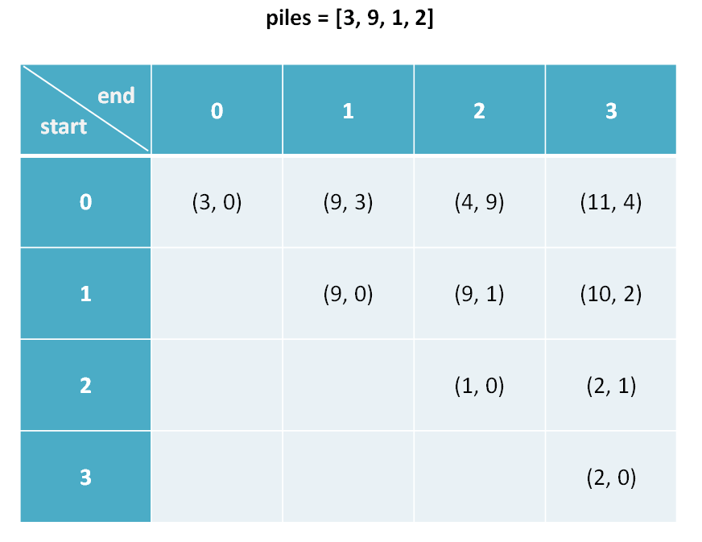
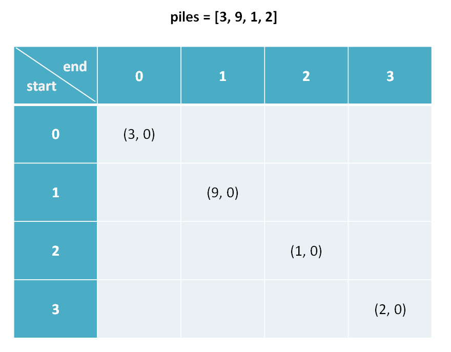
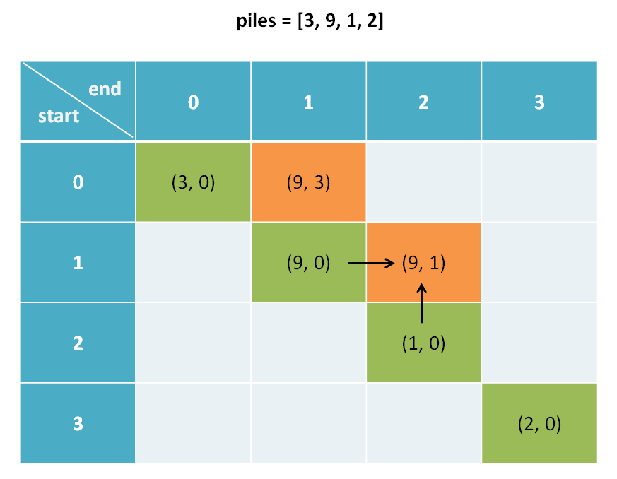
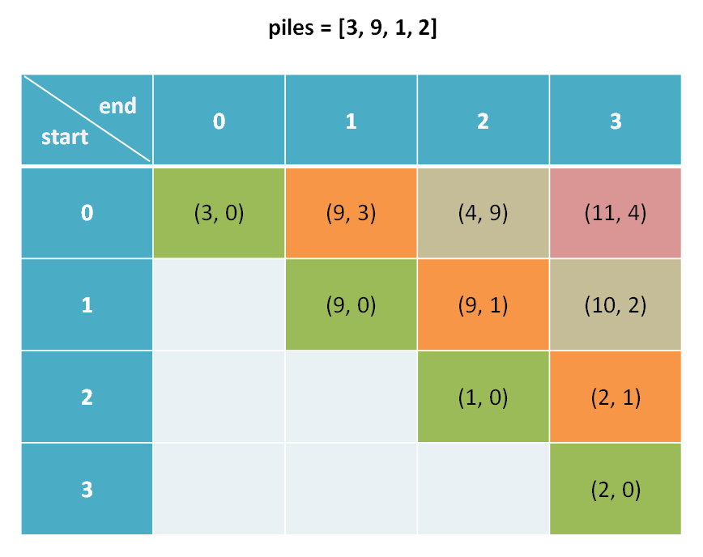

# 动态规划之博弈问题

上一篇文章 [几道智力题](../高频面试系列/一行代码解决的智力题.md) 中讨论到一个有趣的「石头游戏」，通过题目的限制条件，这个游戏是先手必胜的。但是智力题终究是智力题，真正的算法问题肯定不会是投机取巧能搞定的。所以，本文就借石头游戏来讲讲「假设两个人都足够聪明，最后谁会获胜」这一类问题该如何用动态规划算法解决。

博弈类问题的套路都差不多，下文举例讲解，其核心思路是在二维 dp 的基础上使用元组分别存储两个人的博弈结果。掌握了这个技巧以后，别人再问你什么俩海盗分宝石，俩人拿硬币的问题，你就告诉别人：我懒得想，直接给你写个算法算一下得了。

我们「石头游戏」改的更具有一般性：

你和你的朋友面前有一排石头堆，用一个数组 piles 表示，piles[i] 表示第 i 堆石子有多少个。你们轮流拿石头，一次拿一堆，但是只能拿走最左边或者最右边的石头堆。所有石头被拿完后，谁拥有的石头多，谁获胜。

石头的堆数可以是任意正整数，石头的总数也可以是任意正整数，这样就能打破先手必胜的局面了。比如有三堆石头 `piles = [1, 100, 3]`，先手不管拿 1 还是 3，能够决定胜负的 100 都会被后手拿走，后手会获胜。

**假设两人都很聪明**，请你设计一个算法，返回先手和后手的最后得分（石头总数）之差。比如上面那个例子，先手能获得 4 分，后手会获得 100 分，你的算法应该返回 -96。

这样推广之后，这个问题算是一道 Hard 的动态规划问题了。**博弈问题的难点在于，两个人要轮流进行选择，而且都贼精明，应该如何编程表示这个过程呢？**

还是强调多次的套路，首先明确 dp 数组的含义，然后和股票买卖系列问题类似，只要找到「状态」和「选择」，一切就水到渠成了。

### 一、定义 dp 数组的含义

定义 dp 数组的含义是很有技术含量的，同一问题可能有多种定义方法，不同的定义会引出不同的状态转移方程，不过只要逻辑没有问题，最终都能得到相同的答案。

我建议不要迷恋那些看起来很牛逼，代码很短小的奇技淫巧，最好是稳一点，采取可解释性最好，最容易推广的设计思路。本文就给出一种博弈问题的通用设计框架。

介绍 dp 数组的含义之前，我们先看一下 dp 数组最终的样子：



下文讲解时，认为元组是包含 first 和 second 属性的一个类，而且为了节省篇幅，将这两个属性简写为 fir 和 sec。比如按上图的数据，我们说 `dp[1][3].fir = 10`，`dp[0][1].sec = 3`。

先回答几个读者可能提出的问题：

这个二维 dp table 中存储的是元组，怎么编程表示呢？这个 dp table 有一半根本没用上，怎么优化？很简单，都不要管，先把解题的思路想明白了再谈也不迟。

**以下是对 dp 数组含义的解释：**

```python
dp[i][j].fir 表示，对于 piles[i...j] 这部分石头堆，先手能获得的最高分数。
dp[i][j].sec 表示，对于 piles[i...j] 这部分石头堆，后手能获得的最高分数。

举例理解一下，假设 piles = [3, 9, 1, 2]，索引从 0 开始
dp[0][1].fir = 9 意味着：面对石头堆 [3, 9]，先手最终能够获得 9 分。
dp[1][3].sec = 2 意味着：面对石头堆 [9, 1, 2]，后手最终能够获得 2 分。
```

我们想求的答案是先手和后手最终分数之差，按照这个定义也就是 $dp[0][n-1].fir - dp[0][n-1].sec$，即面对整个 piles，先手的最优得分和后手的最优得分之差。

### 二、状态转移方程

写状态转移方程很简单，首先要找到所有「状态」和每个状态可以做的「选择」，然后择优。

根据前面对 dp 数组的定义，**状态显然有三个：开始的索引 i，结束的索引 j，当前轮到的人。**

```python
dp[i][j][fir or sec]
其中：
0 <= i < piles.length
i <= j < piles.length
```

对于这个问题的每个状态，可以做的**选择有两个：选择最左边的那堆石头，或者选择最右边的那堆石头。** 我们可以这样穷举所有状态：

```python
n = piles.length
for 0 <= i < n:
    for j <= i < n:
        for who in {fir, sec}:
            dp[i][j][who] = max(left, right)

```

上面的伪码是动态规划的一个大致的框架，股票系列问题中也有类似的伪码。这道题的难点在于，两人是交替进行选择的，也就是说先手的选择会对后手有影响，这怎么表达出来呢？

根据我们对 dp 数组的定义，很容易解决这个难点，**写出状态转移方程：**

```python
dp[i][j].fir = max(piles[i] + dp[i+1][j].sec, piles[j] + dp[i][j-1].sec)
dp[i][j].fir = max(    选择最左边的石头堆     ,     选择最右边的石头堆     )
# 解释：我作为先手，面对 piles[i...j] 时，有两种选择：
# 要么我选择最左边的那一堆石头，然后面对 piles[i+1...j]
# 但是此时轮到对方，相当于我变成了后手；
# 要么我选择最右边的那一堆石头，然后面对 piles[i...j-1]
# 但是此时轮到对方，相当于我变成了后手。

if 先手选择左边:
    dp[i][j].sec = dp[i+1][j].fir
if 先手选择右边:
    dp[i][j].sec = dp[i][j-1].fir
# 解释：我作为后手，要等先手先选择，有两种情况：
# 如果先手选择了最左边那堆，给我剩下了 piles[i+1...j]
# 此时轮到我，我变成了先手；
# 如果先手选择了最右边那堆，给我剩下了 piles[i...j-1]
# 此时轮到我，我变成了先手。
```

根据 dp 数组的定义，我们也可以找出 **base case**，也就是最简单的情况：

```python
dp[i][j].fir = piles[i]
dp[i][j].sec = 0
其中 0 <= i == j < n
# 解释：i 和 j 相等就是说面前只有一堆石头 piles[i]
# 那么显然先手的得分为 piles[i]
# 后手没有石头拿了，得分为 0
```



这里需要注意一点，我们发现 base case 是斜着的，而且我们推算 dp[i][j] 时需要用到 dp[i+1][j] 和 dp[i][j-1]：



所以说算法不能简单的一行一行遍历 dp 数组，**而要斜着遍历数组：**



说实话，斜着遍历二维数组说起来容易，你还真不一定能想出来怎么实现，不信你思考一下？这么巧妙的状态转移方程都列出来了，要是不会写代码实现，那真的很尴尬了。


### 三、代码实现

如何实现这个 fir 和 sec 元组呢，你可以用 python，自带元组类型；或者使用 C++ 的 pair 容器；或者用一个三维数组 `dp[n][n][2]`，最后一个维度就相当于元组；或者我们自己写一个 Pair 类：

```java
class Pair {
    int fir, sec;
    Pair(int fir, int sec) {
        this.fir = fir;
        this.sec = sec;
    }
}
```

然后直接把我们的状态转移方程翻译成代码即可，可以注意一下斜着遍历数组的技巧：

```java
/* 返回游戏最后先手和后手的得分之差 */
int stoneGame(int[] piles) {
    int n = piles.length;
    // 初始化 dp 数组
    Pair[][] dp = new Pair[n][n];
    for (int i = 0; i < n; i++) 
        for (int j = i; j < n; j++)
            dp[i][j] = new Pair(0, 0);
    // 填入 base case
    for (int i = 0; i < n; i++) {
        dp[i][i].fir = piles[i];
        dp[i][i].sec = 0;
    }
    // 斜着遍历数组
    for (int l = 2; l <= n; l++) {
        for (int i = 0; i <= n - l; i++) {
            int j = l + i - 1;
            // 先手选择最左边或最右边的分数
            int left = piles[i] + dp[i+1][j].sec;
            int right = piles[j] + dp[i][j-1].sec;
            // 套用状态转移方程
            if (left > right) {
                dp[i][j].fir = left;
                dp[i][j].sec = dp[i+1][j].fir;
            } else {
                dp[i][j].fir = right;
                dp[i][j].sec = dp[i][j-1].fir;
            }
        }
    }
    Pair res = dp[0][n-1];
    return res.fir - res.sec;
}
```

动态规划解法，如果没有状态转移方程指导，绝对是一头雾水，但是根据前面的详细解释，读者应该可以清晰理解这一大段代码的含义。

而且，注意到计算 `dp[i][j]` 只依赖其左边和下边的元素，所以说肯定有优化空间，转换成一维 dp，想象一下把二维平面压扁，也就是投影到一维。但是，一维 dp 比较复杂，可解释性很差，大家就不必浪费这个时间去理解了。

### 四、最后总结

本文给出了解决博弈问题的动态规划解法。博弈问题的前提一般都是在两个聪明人之间进行，编程描述这种游戏的一般方法是二维 dp 数组，数组中通过元组分别表示两人的最优决策。

之所以这样设计，是因为先手在做出选择之后，就成了后手，后手在对方做完选择后，就变成了先手。这种角色转换使得我们可以重用之前的结果，典型的动态规划标志。

读到这里的朋友应该能理解算法解决博弈问题的套路了。学习算法，一定要注重算法的模板框架，而不是一些看起来牛逼的思路，也不要奢求上来就写一个最优的解法。不要舍不得多用空间，不要过早尝试优化，不要惧怕多维数组。dp 数组就是存储信息避免重复计算的，随便用，直到咱满意为止。

希望本文对你有帮助。

**致力于把算法讲清楚！欢迎关注我的微信公众号 labuladong，查看更多通俗易懂的文章**：


[上一篇：动态规划之子序列问题解题模板](../动态规划系列/子序列问题模板.md)

[下一篇：贪心算法之区间调度问题](../动态规划系列/贪心算法之区间调度问题.md)

[目录](../README.md#目录)