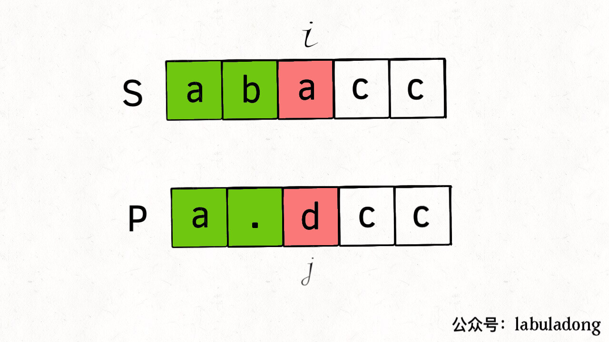

# 动态规划之正则表达

<p align='center'>
<a href="https://github.com/labuladong/fucking-algorithm" target="view_window"></a>
<a href="https://www.zhihu.com/people/labuladong"></a>
<a href="https://i.loli.net/2020/10/10/MhRTyUKfXZOlQYN.jpg"></a>
<a href="https://space.bilibili.com/14089380"></a>
</p>


相关推荐：
  * [我写了首诗，把滑动窗口算法算法变成了默写题](https://labuladong.gitee.io/algo/)
  * [二分查找高效判定子序列](https://labuladong.gitee.io/algo/)

读完本文，你不仅学会了算法套路，还可以顺便去 LeetCode 上拿下如下题目：

[10.正则表达式匹配](https://leetcode-cn.com/problems/regular-expression-matching/)

**-----------**

正则表达式是一个非常强力的工具，本文就来具体看一看正则表达式的底层原理是什么。力扣第 10 题「正则表达式匹配」就要求我们实现一个简单的正则匹配算法，包括「.」通配符和「*」通配符。

这两个通配符是最常用的，其中点号「.」可以匹配任意一个字符，星号「*」可以让之前的那个字符重复任意次数（包括 0 次）。

比如说模式串 `".a*b"` 就可以匹配文本 `"zaaab"`，也可以匹配 `"cb"`；模式串 `"a..b"` 可以匹配文本 `"amnb"`；而模式串 `".*"` 就比较牛逼了，它可以匹配任何文本。

题目会给我们输入两个字符串 `s` 和 `p`，`s` 代表文本，`p` 代表模式串，请你判断模式串 `p` 是否可以匹配文本 `s`。我们可以假设模式串只包含小写字母和上述两种通配符且一定合法，不会出现 `*a` 或者 `b**` 这种不合法的模式串，

函数签名如下：

```cpp
bool isMatch(string s, string p);
```

对于我们将要实现的这个正则表达式，难点在那里呢？

点号通配符其实很好实现，`s` 中的任何字符，只要遇到 `.` 通配符，无脑匹配就完事了。主要是这个星号通配符不好实现，一旦遇到 `*` 通配符，前面的那个字符可以选择重复一次，可以重复多次，也可以一次都不出现，这该怎么办？

对于这个问题，答案很简单，对于所有可能出现的情况，全部穷举一遍，只要有一种情况可以完成匹配，就认为 `p` 可以匹配 `s`。那么一旦涉及两个字符串的穷举，我们就应该条件反射地想到动态规划的技巧了。

### 一、思路分析

我们先脑补一下，`s` 和 `p` 相互匹配的过程大致是，两个指针 `i, j` 分别在 `s` 和 `p` 上移动，如果最后两个指针都能移动到字符串的末尾，那么久匹配成功，反之则匹配失败。

**如果不考虑 `*` 通配符，面对两个待匹配字符 `s[i]` 和 `p[j]`，我们唯一能做的就是看他俩是否匹配**：

```cpp
bool isMatch(string s, string p) {
    int i = 0, j = 0;
    while (i < s.size() && j < p.size()) {
        // 「.」通配符就是万金油
        if (s[i] == p[j] || p[j] == '.') {
            // 匹配，接着匹配 s[i+1..] 和 p[j+1..]
            i++; j++;
        } else {
            // 不匹配
            return false;
        }
    }
    return i == j;
}
```

那么考虑一下，如果加入 `*` 通配符，局面就会稍微复杂一些，不过只要分情况来分析，也不难理解。

**当 `p[j + 1]` 为 `*` 通配符时，我们分情况讨论下**：

1、如果 `s[i] == p[j]`，那么有两种情况：

1.1 `p[j]` 有可能会匹配多个字符，比如 `s = "aaa", p = "a*"`，那么 `p[0]` 会通过 `*` 匹配 3 个字符 `"a"`。

1.2 `p[i]` 也有可能匹配 0 个字符，比如 `s = "aa", p = "a*aa"`，由于后面的字符可以匹配 `s`，所以 `p[0]` 只能匹配 0 次。

2、如果 `s[i] != p[j]`，只有一种情况：

`p[j]` 只能匹配 0 次，然后看下一个字符是否能和 `s[i]` 匹配。比如说 `s = "aa", p = "b*aa"`，此时 `p[0]` 只能匹配 0 次。

综上，可以把之前的代码针对 `*` 通配符进行一下改造：

```cpp
if (s[i] == p[j] || p[j] == '.') {
    // 匹配
    if (j < p.size() - 1 && p[j + 1] == '*') {
        // 有 * 通配符，可以匹配 0 次或多次
    } else {
        // 无 * 通配符，老老实实匹配 1 次
        i++; j++;
    }
} else {
    // 不匹配
    if (j < p.size() - 1 && p[j + 1] == '*') {
        // 有 * 通配符，只能匹配 0 次
    } else {
        // 无 * 通配符，匹配无法进行下去了
        return false;
    }
}
```

整体的思路已经很清晰了，但现在的问题是，遇到 `*` 通配符时，到底应该匹配 0 次还是匹配多次？多次是几次？

你看，这就是一个做「选择」的问题，要把所有可能的选择都穷举一遍才能得出结果。动态规划算法的核心就是「状态」和「选择」，**「状态」无非就是 `i` 和 `j` 两个指针的位置，「选择」就是 `p[j]` 选择匹配几个字符**。

### 二、动态规划解法

根据「状态」，我们可以定义一个 `dp` 函数：

```cpp
bool dp(string& s, int i, string& p, int j);
```

`dp` 函数的定义如下：

**若 `dp(s, i, p, j) = true`，则表示 `s[i..]` 可以匹配 `p[j..]`；若 `dp(s, i, p, j) = false`，则表示 `s[i..]` 无法匹配 `p[j..]`**。

根据这个定义，我们想要的答案就是 `i = 0, j = 0` 时 `dp` 函数的结果，所以可以这样使用这个 `dp` 函数：

```cpp
bool isMatch(string s, string p) {
    // 指针 i，j 从索引 0 开始移动
    return dp(s, 0, p, 0);
```

可以根据之前的代码写出 `dp` 函数的主要逻辑：

```cpp
bool dp(string& s, int i, string& p, int j) {
    if (s[i] == p[j] || p[j] == '.') {
        // 匹配
        if (j < p.size() - 1 && p[j + 1] == '*') {
            // 1.1 通配符匹配 0 次或多次
            return dp(s, i, p, j + 2)
                || dp(s, i + 1, p, j);
        } else {
            // 1.2 常规匹配 1 次
            return dp(s, i + 1, p, j + 1);
        }
    } else {
        // 不匹配
        if (j < p.size() - 1 && p[j + 1] == '*') {
            // 2.1 通配符匹配 0 次
            return dp(s, i, p, j + 2);
        } else {
            // 2.2 无法继续匹配
            return false;
        }
    }
}
```

**根据 `dp` 函数的定义**，这几种情况都很好解释：

1.1 通配符匹配 0 次或多次

将 `j` 加 2，`i` 不变，含义就是直接跳过 `p[j]` 和之后的通配符，即通配符匹配 0 次：


将 `i` 加 1，`j` 不变，含义就是 `p[j]` 匹配了 `s[i]`，但 `p[j]` 还可以继续匹配，即通配符匹配多次的情况：


两种情况只要有一种可以完成匹配即可，所以对上面两种情况求或运算。

1.2 常规匹配 1 次

由于这个条件分支是无 `*` 的常规匹配，那么如果 `s[i] == p[j]`，就是 `i` 和 `j` 分别加一：


2.1 通配符匹配 0 次

类似情况 1.1，将 `j` 加 2，`i` 不变：


2.2 如果没有 `*` 通配符，也无法匹配，那只能说明匹配失败了：



看图理解应该很容易了，现在可以思考一下 `dp` 函数的 base case：

**一个 base case 是 `j == p.size()` 时**，按照 `dp` 函数的定义，这意味着模式串 `p` 已经被匹配完了，那么应该看看文本串 `s` 匹配到哪里了，如果 `s` 也恰好被匹配完，则说明匹配成功：

```cpp
if (j == p.size()) {
    return i == s.size();
}
```

**另一个 base case 是 `i == s.size()` 时**，按照 `dp` 函数的定义，这种情况意味着文本串 `s` 已经全部被匹配了，那么是不是只要简单地检查一下 `p` 是否也匹配完就行了呢？

```cpp
if (i == s.size()) {
    // 这样行吗？
    return j == p.size();
}
```

**这是不正确的，此时并不能根据 `j` 是否等于 `p.size()` 来判断是否完成匹配，只要 `p[j..]` 能够匹配空串，就可以算完成匹配**。比如说 `s = "a", p = "ab*c*"`，当 `i` 走到 `s` 末尾的时候，`j` 并没有走到 `p` 的末尾，但是 `p` 依然可以匹配 `s`。

所以我们可以写出如下代码：

```cpp
int m = s.size(), n = p.size();

if (i == s.size()) {
    // 如果能匹配空串，一定是字符和 * 成对儿出现
    if ((n - j) % 2 == 1) {
        return false;
    }
    // 检查是否为 x*y*z* 这种形式
    for (; j + 1 < p.size(); j += 2) {
        if (p[j + 1] != '*') {
            return false;
        }
    }
    return true;
}
```

根据以上思路，就可以写出完整的代码：

```cpp
/* 计算 p[j..] 是否匹配 s[i..] */
bool dp(string& s, int i, string& p, int j) {
    int m = s.size(), n = p.size();
    // base case
    if (j == n) {
        return i == m;
    }
    if (i == m) {
        if ((n - j) % 2 == 1) {
            return false;
        }
        for (; j + 1 < n; j += 2) {
            if (p[j + 1] != '*') {
                return false;
            }
        }
        return true;
    }

    // 记录状态 (i, j)，消除重叠子问题
    string key = to_string(i) + "," + to_string(j);
    if (memo.count(key)) return memo[key];
    
    bool res = false;
    
    if (s[i] == p[j] || p[j] == '.') {
        if (j < n - 1 && p[j + 1] == '*') {
            res = dp(s, i, p, j + 2)
               || dp(s, i + 1, p, j);
        } else {
            res = dp(s, i + 1, p, j + 1);
        }
    } else {
        if (j < n - 1 && p[j + 1] == '*') {
            res = dp(s, i, p, j + 2);
        } else {
            res = false;
        }
    }
    // 将当前结果记入备忘录
    memo[key] = res;
    
    return res;
}
```

代码中用了一个哈希表 `memo` 消除重叠子问题，因为正则表达算法的递归框架如下：

```cpp
bool dp(string& s, int i, string& p, int j) {
    dp(s, i, p, j + 2);     // 1
    dp(s, i + 1, p, j);     // 2
    dp(s, i + 1, p, j + 1); // 3
}
```

那么，如果让你从 `dp(s, i, p, j)` 得到 `dp(s, i+2, p, j+2)`，至少有两条路径：`1 -> 2 -> 2` 和 `3 -> 3`，那么就说明 `(i+2, j+2)` 这个状态存在重复，这就说明存在重叠子问题。

动态规划的时间复杂度为「状态的总数」*「每次递归花费的时间」，本题中状态的总数当然就是 `i` 和 `j` 的组合，也就是 `M * N`（`M` 为 `s` 的长度，`N` 为 `p` 的长度）；递归函数 `dp` 中没有循环（base case 中的不考虑，因为 base case 的触发次数有限），所以一次递归花费的时间为常数。二者相乘，总的时间复杂度为 `O(MN)`。

空间复杂度很简单，就是备忘录 `memo` 的大小，即 `O(MN)`。

**＿＿＿＿＿＿＿＿＿＿＿＿＿**

**刷算法，学套路，认准 labuladong，公众号和 [在线电子书](https://labuladong.gitee.io/algo/) 持续更新最新文章**。

**本小抄即将出版，微信扫码关注公众号，后台回复「小抄」限时免费获取，回复「进群」可进刷题群一起刷题，带你搞定 LeetCode**。

<p align='center'>

</p>
======其他语言代码======

### javascript

[10.正则表达式匹配](https://leetcode-cn.com/problems/regular-expression-matching/)

```js
var isMatch = function (s, p) {
		// 备忘录
    let memo = {}
    let dp = function (s, i, p, j) {
        let m = s.length, n = p.length;

        // base case
        if (j === n) {
            return i === m;
        }

        if (i === m) {
            if ((n - j) % 2 === 1) {
                return false;
            }
            for (; j + 1 < n; j += 2) {
                if (p[j + 1] !== '*') {
                    return false;
                }
            }
            return true;
        }

        // 记录状态（i，j），消除重叠子问题
        let key = i + ',' + j

        if (memo[key] !== undefined) {
            return memo[key];
        }
        let res = false;

        if (s[i] === p[j] || p[j] === '.') {
            // 匹配
            if (j < n - 1 && p[j + 1] === '*') {
                // 1.1 通配符匹配 0 次或多次
                res = dp(s, i, p, j + 2) || dp(s, i + 1, p, j);
            } else {
                // 1.2 常规匹配1次
                res = dp(s, i + 1, p, j + 1);
            }
        } else {
            // 不匹配
            if (j < n - 1 && p[j + 1] === '*') {
                // 2.1 通配符匹配0次
                res = dp(s, i, p, j + 2)
            } else {
                // 2.2 无法继续匹配
                res = false
            }
        }

        // 将当前结果记入备忘录
        memo[key] = res;

        return res;
    }

    // 指针 i，j 从索引 0 开始移动
    return dp(s, 0, p, 0);
};
```


### C++

```c++
class Solution {
public:
    map<string, bool> memo;
    bool isMatch(string s, string p) {
        // 指针 i，j 从索引 0 开始移动
        return dp(s, 0, p, 0);
    }

    /* 计算 p[j..] 是否匹配 s[i..] */
    bool dp(string& s, int i, string& p, int j) {
        int m = s.size(), n = p.size();
        // base case
        if (j == n) {
            return i == m;
        }
        if (i == m) {
            if ((n - j) % 2 == 1) {
                return false;
            }
            for (; j + 1 < n; j += 2) {
                if (p[j + 1] != '*') {
                    return false;
                }
            }
            return true;
        }

        // 记录状态 (i, j)，消除重叠子问题
        string key = to_string(i) + "," + to_string(j);
        if (memo.count(key)) return memo[key];
        
        bool res = false;
        
        if (s[i] == p[j] || p[j] == '.') {
            if (j < n - 1 && p[j + 1] == '*') {
                res = dp(s, i, p, j + 2)
                || dp(s, i + 1, p, j);
            } else {
                res = dp(s, i + 1, p, j + 1);
            }
        } else {
            if (j < n - 1 && p[j + 1] == '*') {
                res = dp(s, i, p, j + 2);
            } else {
                res = false;
            }
        }
        // 将当前结果记入备忘录
        memo[key] = res;
        
        return res;
    }
};
```

