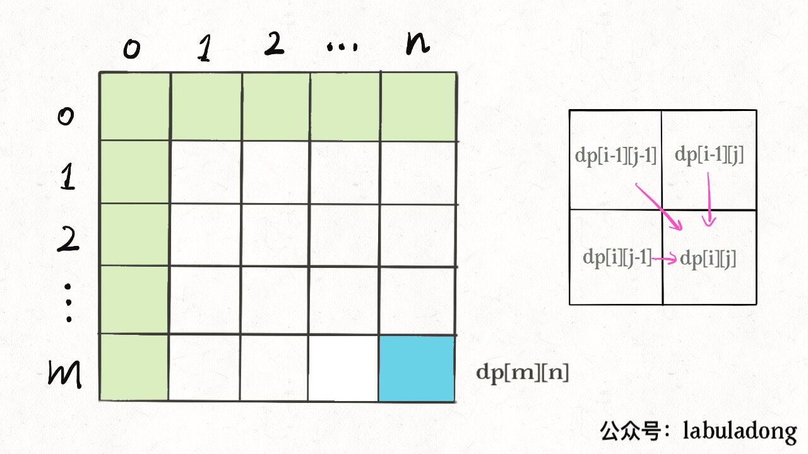
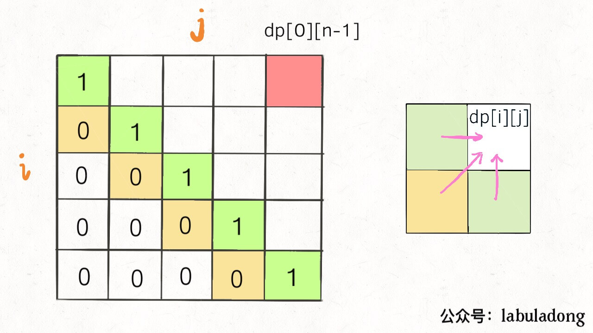
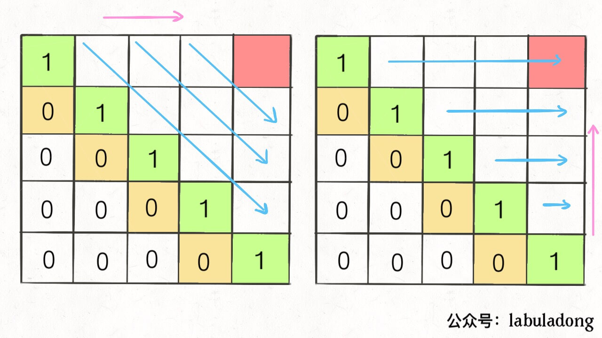

# 动态规划答疑篇


<p align='center'>
<a href="https://github.com/labuladong/fucking-algorithm" target="view_window"></a>
<a href="https://www.zhihu.com/people/labuladong"></a>
<a href="https://i.loli.net/2020/10/10/MhRTyUKfXZOlQYN.jpg"></a>
<a href="https://space.bilibili.com/14089380"></a>
</p>


相关推荐：
  * [搜索引擎背后的经典数据结构和算法](https://labuladong.gitee.io/algo/)
  * [动态规划之四键键盘](https://labuladong.gitee.io/algo/)

**-----------**

这篇文章就给你讲明白两个问题：

1、到底什么才叫「最优子结构」，和动态规划什么关系。

2、为什么动态规划遍历 `dp` 数组的方式五花八门，有的正着遍历，有的倒着遍历，有的斜着遍历。

### 一、最优子结构详解

「最优子结构」是某些问题的一种特定性质，并不是动态规划问题专有的。也就是说，很多问题其实都具有最优子结构，只是其中大部分不具有重叠子问题，所以我们不把它们归为动态规划系列问题而已。

我先举个很容易理解的例子：假设你们学校有 10 个班，你已经计算出了每个班的最高考试成绩。那么现在我要求你计算全校最高的成绩，你会不会算？当然会，而且你不用重新遍历全校学生的分数进行比较，而是只要在这 10 个最高成绩中取最大的就是全校的最高成绩。

我给你提出的这个问题就**符合最优子结构**：可以从子问题的最优结果推出更大规模问题的最优结果。让你算**每个班**的最优成绩就是子问题，你知道所有子问题的答案后，就可以借此推出**全校**学生的最优成绩这个规模更大的问题的答案。

你看，这么简单的问题都有最优子结构性质，只是因为显然没有重叠子问题，所以我们简单地求最值肯定用不出动态规划。

再举个例子：假设你们学校有 10 个班，你已知每个班的最大分数差（最高分和最低分的差值）。那么现在我让你计算全校学生中的最大分数差，你会不会算？可以想办法算，但是肯定不能通过已知的这 10 个班的最大分数差推到出来。因为这 10 个班的最大分数差不一定就包含全校学生的最大分数差，比如全校的最大分数差可能是 3 班的最高分和 6 班的最低分之差。

这次我给你提出的问题就**不符合最优子结构**，因为你没办通过每个班的最优值推出全校的最优值，没办法通过子问题的最优值推出规模更大的问题的最优值。前文「动态规划详解」说过，想满足最优子结构，子问题之间必须互相独立。全校的最大分数差可能出现在两个班之间，显然子问题不独立，所以这个问题本身不符合最优子结构。

**那么遇到这种最优子结构失效情况，怎么办？策略是：改造问题**。对于最大分数差这个问题，我们不是没办法利用已知的每个班的分数差吗，那我只能这样写一段暴力代码：

```java
int result = 0;
for (Student a : school) {
    for (Student b : school) {
        if (a is b) continue;
        result = max(result, |a.score - b.score|);
    }
}
return result;
```

改造问题，也就是把问题等价转化：最大分数差，不就等价于最高分数和最低分数的差么，那不就是要求最高和最低分数么，不就是我们讨论的第一个问题么，不就具有最优子结构了么？那现在改变思路，借助最优子结构解决最值问题，再回过头解决最大分数差问题，是不是就高效多了？

当然，上面这个例子太简单了，不过请读者回顾一下，我们做动态规划问题，是不是一直在求各种最值，本质跟我们举的例子没啥区别，无非需要处理一下重叠子问题。

前文不[同定义不同解法](https://labuladong.gitee.io/algo/) 和 [高楼扔鸡蛋进阶](https://labuladong.gitee.io/algo/) 就展示了如何改造问题，不同的最优子结构，可能导致不同的解法和效率。

再举个常见但也十分简单的例子，求一棵二叉树的最大值，不难吧（简单起见，假设节点中的值都是非负数）：

```java
int maxVal(TreeNode root) {
    if (root == null)
        return -1;
    int left = maxVal(root.left);
    int right = maxVal(root.right);
    return max(root.val, left, right);
}
```

你看这个问题也符合最优子结构，以 `root` 为根的树的最大值，可以通过两边子树（子问题）的最大值推导出来，结合刚才学校和班级的例子，很容易理解吧。

当然这也不是动态规划问题，旨在说明，最优子结构并不是动态规划独有的一种性质，能求最值的问题大部分都具有这个性质；**但反过来，最优子结构性质作为动态规划问题的必要条件，一定是让你求最值的**，以后碰到那种恶心人的最值题，思路往动态规划想就对了，这就是套路。

动态规划不就是从最简单的 base case 往后推导吗，可以想象成一个链式反应，以小博大。但只有符合最优子结构的问题，才有发生这种链式反应的性质。

找最优子结构的过程，其实就是证明状态转移方程正确性的过程，方程符合最优子结构就可以写暴力解了，写出暴力解就可以看出有没有重叠子问题了，有则优化，无则 OK。这也是套路，经常刷题的朋友应该能体会。

这里就不举那些正宗动态规划的例子了，读者可以翻翻历史文章，看看状态转移是如何遵循最优子结构的，这个话题就聊到这，下面再来看另外个动态规划迷惑行为。

### 二、dp 数组的遍历方向

我相信读者做动态规问题时，肯定会对 `dp` 数组的遍历顺序有些头疼。我们拿二维 `dp` 数组来举例，有时候我们是正向遍历：

```java
int[][] dp = new int[m][n];
for (int i = 0; i < m; i++)
    for (int j = 0; j < n; j++)
        // 计算 dp[i][j]
```

有时候我们反向遍历：

```java
for (int i = m - 1; i >= 0; i--)
    for (int j = n - 1; j >= 0; j--)
        // 计算 dp[i][j]
```

有时候可能会斜向遍历：

```java
// 斜着遍历数组
for (int l = 2; l <= n; l++) {
    for (int i = 0; i <= n - l; i++) {
        int j = l + i - 1;
        // 计算 dp[i][j]
    }
}
```

甚至更让人迷惑的是，有时候发现正向反向遍历都可以得到正确答案，比如我们在「团灭股票问题」中有的地方就正反皆可。

那么，如果仔细观察的话可以发现其中的原因的。你只要把住两点就行了：

**1、遍历的过程中，所需的状态必须是已经计算出来的**。

**2、遍历的终点必须是存储结果的那个位置**。

下面来距离解释上面两个原则是什么意思。

比如编辑距离这个经典的问题，详解见前文「编辑距离详解」，我们通过对 `dp` 数组的定义，确定了 base case 是 `dp[..][0]` 和 `dp[0][..]`，最终答案是 `dp[m][n]`；而且我们通过状态转移方程知道 `dp[i][j]` 需要从 `dp[i-1][j]`, `dp[i][j-1]`, `dp[i-1][j-1]` 转移而来，如下图：



那么，参考刚才说的两条原则，你该怎么遍历 `dp` 数组？肯定是正向遍历：

```java
for (int i = 1; i < m; i++)
    for (int j = 1; j < n; j++)
        // 通过 dp[i-1][j], dp[i][j - 1], dp[i-1][j-1]
        // 计算 dp[i][j]
```

因为，这样每一步迭代的左边、上边、左上边的位置都是 base case 或者之前计算过的，而且最终结束在我们想要的答案 `dp[m][n]`。

再举一例，回文子序列问题，详见前文「子序列问题模板」，我们通过过对 `dp` 数组的定义，确定了 base case 处在中间的对角线，`dp[i][j]` 需要从 `dp[i+1][j]`, `dp[i][j-1]`, `dp[i+1][j-1]` 转移而来，想要求的最终答案是 `dp[0][n-1]`，如下图：



这种情况根据刚才的两个原则，就可以有两种正确的遍历方式：



要么从左至右斜着遍历，要么从下向上从左到右遍历，这样才能保证每次 `dp[i][j]` 的左边、下边、左下边已经计算完毕，得到正确结果。

现在，你应该理解了这两个原则，主要就是看 base case 和最终结果的存储位置，保证遍历过程中使用的数据都是计算完毕的就行，有时候确实存在多种方法可以得到正确答案，可根据个人口味自行选择。


**＿＿＿＿＿＿＿＿＿＿＿＿＿**

**刷算法，学套路，认准 labuladong，公众号和 [在线电子书](https://labuladong.gitee.io/algo/) 持续更新最新文章**。

**本小抄即将出版，微信扫码关注公众号，后台回复「小抄」限时免费获取，回复「进群」可进刷题群一起刷题，带你搞定 LeetCode**。

<p align='center'>

</p>
======其他语言代码======

### javascript

正向遍历

```js
// 构建m*n的矩阵
let dp = new Array(m).fill(new Array(n))
    
for (let i = 0; i < m; i++)
    for (let j = 0; j < n; j++)
        // 计算 dp[i][j]
```

反向遍历

```js
for (let i = m - 1; i >= 0; i--)
    for (let j = n - 1; j >= 0; j--)
        // 计算 dp[i][j]
```

斜向遍历

```js
// 斜着遍历数组
for (let l = 2; l <= n; l++) {
    for (let i = 0; i <= n - l; i++) {
        let j = l + i - 1;
        // 计算 dp[i][j]
    }
}
```

