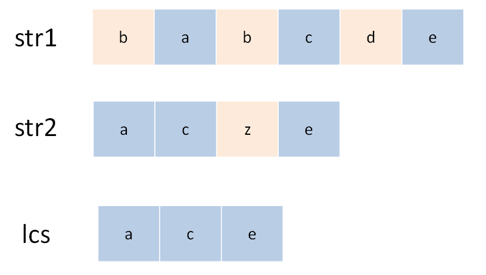
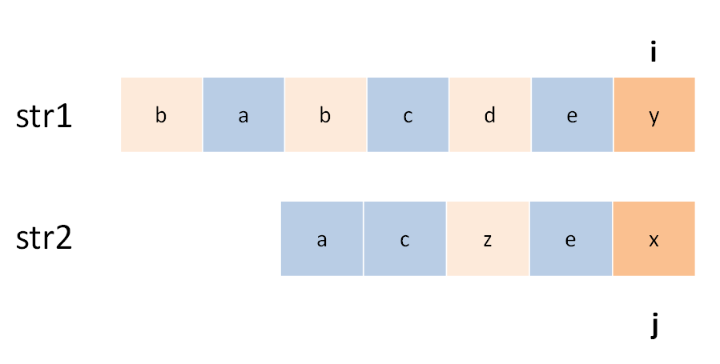
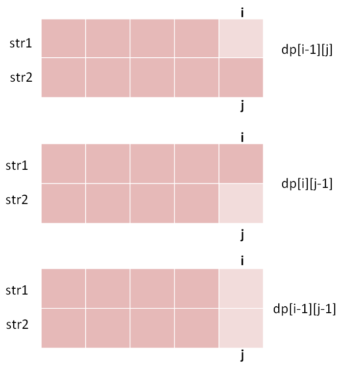
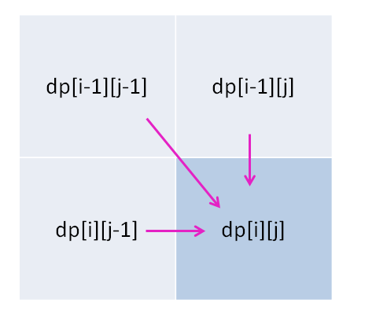

# 最长公共子序列

最长公共子序列（Longest Common Subsequence，简称 LCS）是一道非常经典的面试题目，因为它的解法是典型的二维动态规划，大部分比较困难的字符串问题都和这个问题一个套路，比如说编辑距离。而且，这个算法稍加改造就可以用于解决其他问题，所以说 LCS 算法是值得掌握的。

题目就是让我们求两个字符串的 LCS 长度：

```
输入: str1 = "abcde", str2 = "ace" 
输出: 3  
解释: 最长公共子序列是 "ace"，它的长度是 3
```

肯定有读者会问，为啥这个问题就是动态规划来解决呢？因为子序列类型的问题，穷举出所有可能的结果都不容易，而动态规划算法做的就是穷举 + 剪枝，它俩天生一对儿。所以可以说只要涉及子序列问题，十有八九都需要动态规划来解决，往这方面考虑就对了。

下面就来手把手分析一下，这道题目如何用动态规划技巧解决。

### 一、动态规划思路

**第一步，一定要明确 `dp` 数组的含义**。对于两个字符串的动态规划问题，套路是通用的。

比如说对于字符串 `s1` 和 `s2`，一般来说都要构造一个这样的 DP table：


为了方便理解此表，我们暂时认为索引是从 1 开始的，待会的代码中只要稍作调整即可。其中，`dp[i][j]` 的含义是：对于 `s1[1..i]` 和 `s2[1..j]`，它们的 LCS 长度是 `dp[i][j]`。

比如上图的例子，d[2][4] 的含义就是：对于 `"ac"` 和 `"babc"`，它们的 LCS 长度是 2。我们最终想得到的答案应该是 `dp[3][6]`。

**第二步，定义 base case。**

我们专门让索引为 0 的行和列表示空串，`dp[0][..]` 和 `dp[..][0]` 都应该初始化为 0，这就是 base case。

比如说，按照刚才 dp 数组的定义，`dp[0][3]=0` 的含义是：对于字符串 `""` 和 `"bab"`，其 LCS 的长度为 0。因为有一个字符串是空串，它们的最长公共子序列的长度显然应该是 0。

**第三步，找状态转移方程。**

这是动态规划最难的一步，不过好在这种字符串问题的套路都差不多，权且借这道题来聊聊处理这类问题的思路。

状态转移说简单些就是做选择，比如说这个问题，是求 `s1` 和 `s2` 的最长公共子序列，不妨称这个子序列为 `lcs`。那么对于 `s1` 和 `s2` 中的每个字符，有什么选择？很简单，两种选择，要么在 `lcs` 中，要么不在。



这个「在」和「不在」就是选择，关键是，应该如何选择呢？这个需要动点脑筋：如果某个字符应该在 `lcs` 中，那么这个字符肯定同时存在于 `s1` 和 `s2` 中，因为 `lcs` 是最长**公共**子序列嘛。所以本题的思路是这样：

用两个指针 `i` 和 `j` 从后往前遍历 `s1` 和 `s2`，如果 `s1[i]==s2[j]`，那么这个字符**一定在 `lcs` 中**；否则的话，`s1[i]` 和 `s2[j]` 这两个字符**至少有一个不在 `lcs` 中**，需要丢弃一个。先看一下递归解法，比较容易理解：

```python
def longestCommonSubsequence(str1, str2) -> int:
    def dp(i, j):
        # 空串的 base case
        if i == -1 or j == -1:
            return 0
        if str1[i] == str2[j]:
            # 这边找到一个 lcs 的元素，继续往前找
            return dp(i - 1, j - 1) + 1
        else:
            # 谁能让 lcs 最长，就听谁的
            return max(dp(i-1, j), dp(i, j-1))
        
    # i 和 j 初始化为最后一个索引
    return dp(len(str1)-1, len(str2)-1)
```

对于第一种情况，找到一个 `lcs` 中的字符，同时将 `i` `j` 向前移动一位，并给 `lcs` 的长度加一；对于后者，则尝试两种情况，取更大的结果。

其实这段代码就是暴力解法，我们可以通过备忘录或者 DP table 来优化时间复杂度，比如通过前文描述的 DP table 来解决：

```python
def longestCommonSubsequence(str1, str2) -> int:
    m, n = len(str1), len(str2)
    # 构建 DP table 和 base case
    dp = [[0] * (n + 1) for _ in range(m + 1)]
    # 进行状态转移
    for i in range(1, m + 1):
        for j in range(1, n + 1):
            if str1[i - 1] == str2[j - 1]:
                # 找到一个 lcs 中的字符
                dp[i][j] = 1 + dp[i-1][j-1]
            else:
                dp[i][j] = max(dp[i-1][j], dp[i][j-1])
        
    return dp[-1][-1]
```

### 二、疑难解答

对于 `s1[i]` 和 `s2[j]` 不相等的情况，**至少有一个**字符不在 `lcs` 中，会不会两个字符都不在呢？比如下面这种情况：



所以代码是不是应该考虑这种情况，改成这样：

```python
if str1[i - 1] == str2[j - 1]:
    # ...
else:
    dp[i][j] = max(dp[i-1][j], 
                   dp[i][j-1],
                   dp[i-1][j-1])
```

我一开始也有这种怀疑，其实可以这样改，也能得到正确答案，但是多此一举，因为 `dp[i-1][j-1]` 永远是三者中最小的，max 根本不可能取到它。

原因在于我们对 dp 数组的定义：对于 `s1[1..i]` 和 `s2[1..j]`，它们的 LCS 长度是 `dp[i][j]`。



这样一看，显然 `dp[i-1][j-1]` 对应的 `lcs` 长度不可能比前两种情况大，所以没有必要参与比较。

### 三、总结

对于两个字符串的动态规划问题，一般来说都是像本文一样定义 DP table，因为这样定义有一个好处，就是容易写出状态转移方程，`dp[i][j]` 的状态可以通过之前的状态推导出来：



找状态转移方程的方法是，思考每个状态有哪些「选择」，只要我们能用正确的逻辑做出正确的选择，算法就能够正确运行。


坚持原创高质量文章，致力于把算法问题讲清楚，欢迎关注我的公众号 labuladong 获取最新文章：


[上一篇：动态规划之正则表达](../动态规划系列/动态规划之正则表达.md)

[下一篇：学习算法和刷题的思路指南](../算法思维系列/学习数据结构和算法的高效方法.md)

[目录](../README.md#目录)