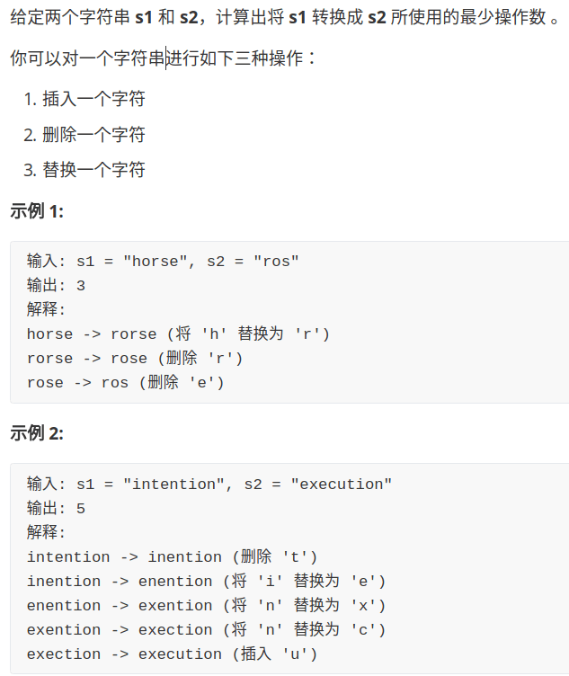
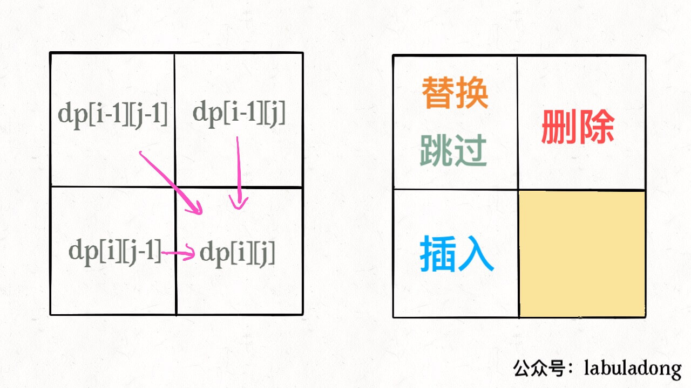

# 编辑距离

前几天看了一份鹅场的面试题，算法部分大半是动态规划，最后一题就是写一个计算编辑距离的函数，今天就专门写一篇文章来探讨一下这个问题。

我个人很喜欢编辑距离这个问题，因为它看起来十分困难，解法却出奇得简单漂亮，而且它是少有的比较实用的算法（是的，我承认很多算法问题都不太实用）。下面先来看下题目：



为什么说这个问题难呢，因为显而易见，它就是难，让人手足无措，望而生畏。

为什么说它实用呢，因为前几天我就在日常生活中用到了这个算法。之前有一篇公众号文章由于疏忽，写错位了一段内容，我决定修改这部分内容让逻辑通顺。但是公众号文章最多只能修改 20 个字，且只支持增、删、替换操作（跟编辑距离问题一模一样），于是我就用算法求出了一个最优方案，只用了 16 步就完成了修改。

再比如高大上一点的应用，DNA 序列是由 A,G,C,T 组成的序列，可以类比成字符串。编辑距离可以衡量两个 DNA 序列的相似度，编辑距离越小，说明这两段 DNA 越相似，说不定这俩 DNA 的主人是远古近亲啥的。

下面言归正传，详细讲解一下编辑距离该怎么算，相信本文会让你有收获。

### 一、思路

编辑距离问题就是给我们两个字符串 `s1` 和 `s2`，只能用三种操作，让我们把 `s1` 变成 `s2`，求最少的操作数。需要明确的是，不管是把 `s1` 变成 `s2` 还是反过来，结果都是一样的，所以后文就以 `s1` 变成 `s2` 举例。

前文「最长公共子序列」说过，**解决两个字符串的动态规划问题，一般都是用两个指针 `i,j` 分别指向两个字符串的最后，然后一步步往前走，缩小问题的规模**。

设两个字符串分别为 "rad" 和 "apple"，为了把 `s1` 变成 `s2`，算法会这样进行：


请记住这个 GIF 过程，这样就能算出编辑距离。关键在于如何做出正确的操作，稍后会讲。

根据上面的 GIF，可以发现操作不只有三个，其实还有第四个操作，就是什么都不要做（skip）。比如这个情况：


因为这两个字符本来就相同，为了使编辑距离最小，显然不应该对它们有任何操作，直接往前移动 `i,j` 即可。

还有一个很容易处理的情况，就是 `j` 走完 `s2` 时，如果 `i` 还没走完 `s1`，那么只能用删除操作把 `s1` 缩短为 `s2`。比如这个情况：


类似的，如果 `i` 走完 `s1` 时 `j` 还没走完了 `s2`，那就只能用插入操作把 `s2` 剩下的字符全部插入 `s1`。等会会看到，这两种情况就是算法的 **base case**。

下面详解一下如何将思路转换成代码，坐稳，要发车了。

### 二、代码详解

先梳理一下之前的思路：

base case 是 `i` 走完 `s1` 或 `j` 走完 `s2`，可以直接返回另一个字符串剩下的长度。

对于每对儿字符 `s1[i]` 和 `s2[j]`，可以有四种操作：

```python
if s1[i] == s2[j]:
    啥都别做（skip）
    i, j 同时向前移动
else:
    三选一：
        插入（insert）
        删除（delete）
        替换（replace）
```

有这个框架，问题就已经解决了。读者也许会问，这个「三选一」到底该怎么选择呢？很简单，全试一遍，哪个操作最后得到的编辑距离最小，就选谁。这里需要递归技巧，理解需要点技巧，先看下代码：

```python
def minDistance(s1, s2) -> int:

    def dp(i, j):
        # base case
        if i == -1: return j + 1
        if j == -1: return i + 1
        
        if s1[i] == s2[j]:
            return dp(i - 1, j - 1)  # 啥都不做
        else:
            return min(
                dp(i, j - 1) + 1,    # 插入
                dp(i - 1, j) + 1,    # 删除
                dp(i - 1, j - 1) + 1 # 替换
            )
    
    # i，j 初始化指向最后一个索引
    return dp(len(s1) - 1, len(s2) - 1)
```

下面来详细解释一下这段递归代码，base case 应该不用解释了，主要解释一下递归部分。

都说递归代码的可解释性很好，这是有道理的，只要理解函数的定义，就能很清楚地理解算法的逻辑。我们这里 dp(i, j) 函数的定义是这样的：

```python
def dp(i, j) -> int
# 返回 s1[0..i] 和 s2[0..j] 的最小编辑距离
```

**记住这个定义**之后，先来看这段代码：

```python
if s1[i] == s2[j]:
    return dp(i - 1, j - 1)  # 啥都不做
# 解释：
# 本来就相等，不需要任何操作
# s1[0..i] 和 s2[0..j] 的最小编辑距离等于
# s1[0..i-1] 和 s2[0..j-1] 的最小编辑距离
# 也就是说 dp(i, j) 等于 dp(i-1, j-1)
```

如果 `s1[i]！=s2[j]`，就要对三个操作递归了，稍微需要点思考：

```python
dp(i, j - 1) + 1,    # 插入
# 解释：
# 我直接在 s1[i] 插入一个和 s2[j] 一样的字符
# 那么 s2[j] 就被匹配了，前移 j，继续跟 i 对比
# 别忘了操作数加一
```


```python
dp(i - 1, j) + 1,    # 删除
# 解释：
# 我直接把 s[i] 这个字符删掉
# 前移 i，继续跟 j 对比
# 操作数加一
```


```python
dp(i - 1, j - 1) + 1 # 替换
# 解释：
# 我直接把 s1[i] 替换成 s2[j]，这样它俩就匹配了
# 同时前移 i，j 继续对比
# 操作数加一
```


现在，你应该完全理解这段短小精悍的代码了。还有点小问题就是，这个解法是暴力解法，存在重叠子问题，需要用动态规划技巧来优化。

**怎么能一眼看出存在重叠子问题呢**？前文「动态规划之正则表达式」有提过，这里再简单提一下，需要抽象出本文算法的递归框架：

```python
def dp(i, j):
    dp(i - 1, j - 1) #1
    dp(i, j - 1)     #2
    dp(i - 1, j)     #3
```

对于子问题 `dp(i-1, j-1)`，如何通过原问题 `dp(i, j)` 得到呢？有不止一条路径，比如 `dp(i, j) -> #1` 和 `dp(i, j) -> #2 -> #3`。一旦发现一条重复路径，就说明存在巨量重复路径，也就是重叠子问题。

### 三、动态规划优化

对于重叠子问题呢，前文「动态规划详解」详细介绍过，优化方法无非是备忘录或者 DP table。

备忘录很好加，原来的代码稍加修改即可：

```python
def minDistance(s1, s2) -> int:

    memo = dict() # 备忘录
    def dp(i, j):
        if (i, j) in memo: 
            return memo[(i, j)]
        ...
        
        if s1[i] == s2[j]:
            memo[(i, j)] = ...  
        else:
            memo[(i, j)] = ...
        return memo[(i, j)]
    
    return dp(len(s1) - 1, len(s2) - 1)
```

**主要说下 DP table 的解法**：

首先明确 dp 数组的含义，dp 数组是一个二维数组，长这样：


有了之前递归解法的铺垫，应该很容易理解。`dp[..][0]` 和 `dp[0][..]` 对应 base case，`dp[i][j]` 的含义和之前的 dp 函数类似：

```python
def dp(i, j) -> int
# 返回 s1[0..i] 和 s2[0..j] 的最小编辑距离

dp[i-1][j-1]
# 存储 s1[0..i] 和 s2[0..j] 的最小编辑距离
```

dp 函数的 base case 是 `i,j` 等于 -1，而数组索引至少是 0，所以 dp 数组会偏移一位。

既然 dp 数组和递归 dp 函数含义一样，也就可以直接套用之前的思路写代码，**唯一不同的是，DP table 是自底向上求解，递归解法是自顶向下求解**：

```java
int minDistance(String s1, String s2) {
    int m = s1.length(), n = s2.length();
    int[][] dp = new int[m + 1][n + 1];
    // base case 
    for (int i = 1; i <= m; i++)
        dp[i][0] = i;
    for (int j = 1; j <= n; j++)
        dp[0][j] = j;
    // 自底向上求解
    for (int i = 1; i <= m; i++)
        for (int j = 1; j <= n; j++)
            if (s1.charAt(i-1) == s2.charAt(j-1))
                dp[i][j] = dp[i - 1][j - 1];
            else               
                dp[i][j] = min(
                    dp[i - 1][j] + 1,
                    dp[i][j - 1] + 1,
                    dp[i-1][j-1] + 1
                );
    // 储存着整个 s1 和 s2 的最小编辑距离
    return dp[m][n];
}

int min(int a, int b, int c) {
    return Math.min(a, Math.min(b, c));
}
```

### 三、扩展延伸

一般来说，处理两个字符串的动态规划问题，都是按本文的思路处理，建立 DP table。为什么呢，因为易于找出状态转移的关系，比如编辑距离的 DP table：



还有一个细节，既然每个 `dp[i][j]` 只和它附近的三个状态有关，空间复杂度是可以压缩成 $O(min(M, N))$ 的（M，N 是两个字符串的长度）。不难，但是可解释性大大降低，读者可以自己尝试优化一下。

你可能还会问，**这里只求出了最小的编辑距离，那具体的操作是什么**？你之前举的修改公众号文章的例子，只有一个最小编辑距离肯定不够，还得知道具体怎么修改才行。

这个其实很简单，代码稍加修改，给 dp 数组增加额外的信息即可：

```java
// int[][] dp;
Node[][] dp;

class Node {
    int val;
    int choice;
    // 0 代表啥都不做
    // 1 代表插入
    // 2 代表删除
    // 3 代表替换
}
```

`val` 属性就是之前的 dp 数组的数值，`choice` 属性代表操作。在做最优选择时，顺便把操作记录下来，然后就从结果反推具体操作。

我们的最终结果不是 `dp[m][n]` 吗，这里的 `val` 存着最小编辑距离，`choice` 存着最后一个操作，比如说是插入操作，那么就可以左移一格：


重复此过程，可以一步步回到起点 `dp[0][0]`，形成一条路径，按这条路径上的操作进行编辑，就是最佳方案。


以上就是编辑距离算法的全部内容，如果本文对你有帮助，**欢迎关注我的公众号 labuladong，致力于把算法问题讲清楚**～


[上一篇：动态规划设计：最长递增子序列](../动态规划系列/动态规划设计：最长递增子序列.md)

[下一篇：经典动态规划问题：高楼扔鸡蛋](../动态规划系列/高楼扔鸡蛋问题.md)

[目录](../README.md#目录)