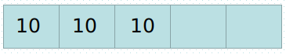
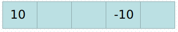
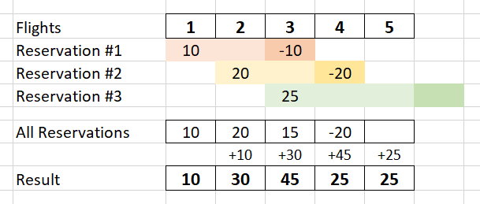

<!-- TOC -->

- [1、字符串分割](#1字符串分割)
- [2、打印全排列](#2打印全排列)
- [3.判断是否为质数](#3判断是否为质数)
- [4.查找两个字符串](#4查找两个字符串)
- [5、把字符串中元音字母转大写](#5把字符串中元音字母转大写)
- [6、字符串中按照字母出现字数排序](#6字符串中按照字母出现字数排序)
- [7.单词压缩编码](#7单词压缩编码)
    - [字典树--正途](#字典树--正途)
    - [捷径](#捷径)
    - [my code](#my-code)
- [8.航班预定座位数-?](#8航班预定座位数-)
    - [my code 超时了](#my-code-超时了)
    - [差分法，前缀和法](#差分法前缀和法)
- [9.奥运会排行榜-?](#9奥运会排行榜-)
            - [牛客网的 for 循环只 输出一次，](#牛客网的-for-循环只-输出一次)
- [10.分子弹 leetcode](#10分子弹-leetcode)

<!-- /TOC -->


## 1、字符串分割
[字符串分割](https://www.nowcoder.com/practice/d9162298cb5a437aad722fccccaae8a7?tpId=37&&tqId=21227&rp=1&ru=/ta/huawei&qru=/ta/huawei/question-ranking)

```py
"""
题目描述
•连续输入字符串，请按长度为8拆分每个字符串后输出到新的字符串数组；
•长度不是8整数倍的字符串请在后面补数字0，空字符串不处理。
输入描述:
连续输入字符串(输入2次,每个字符串长度小于100)

输出描述:
输出到长度为8的新字符串数组

示例1
输入
复制
abc
123456789
输出
复制
abc00000
12345678
90000000
"""

while True:
    try:
        line = raw_input()
        while len(line) > 8:
            print line[:8]
            line = line[8:]
        print line.ljust(8,'0')         ## str.ljust()  左对齐
    except:
        break
        
        
        
```

## 2、打印全排列
[2、打印全排列](https://www.nowcoder.com/practice/5632c23d0d654aecbc9315d1720421c1?tpId=40&&tqId=21374&rp=1&ru=/activity/oj&qru=/ta/kaoyan/question-ranking)
https://www.cnblogs.com/demonxian3/articles/7496813.html

```py
"""
校招时部分企业笔试将禁止编程题跳出页面，为提前适应，练习时请使用在线自测，而非本地IDE。
题目描述
给定一个由不同的小写字母组成的字符串，输出这个字符串的所有全排列。 我们假设对于小写字母有'a' < 'b' < ... < 'y' < 'z'，而且给定的字符串中的字母已经按照从小到大的顺序排列。
输入描述:
输入只有一行，是一个由不同的小写字母组成的字符串，已知字符串的长度在1到6之间。
输出描述:
输出这个字符串的所有排列方式，每行一个排列。要求字母序比较小的排列在前面。字母序如下定义：
已知S = s1s2...sk , T = t1t2...tk，则S < T 等价于，存在p (1 <= p <= k)，使得
s1 = t1, s2 = t2, ..., sp - 1 = tp - 1, sp < tp成立。

每组样例输出结束后要再输出一个回车。
示例1
输入
复制
abc
输出
复制
abc
acb
bac
bca
cab
cba
"""


def get_array(_list, _res, _all):
    if len(_list) <= 1:
        _res.append(_list[0])
        print "".join(_res)
        _res.pop()
        return              ## 记得 return ,以区别 下方函数。
    kk = [i for i in _all]
    _raw_list = [i for i in _list ]
    for i in range(len(_raw_list)):
        i0 = _raw_list[i]
        _list.pop(i)
        _res.append(i0)
        get_array(_list, _res, kk)
        _list.insert(i,i0)
        _res.pop()

while True:
    try:
        line = raw_input()
        _list1 = list(line)
        _list1.sort()
        get_array(_list1,[],[])
    except:
        break

```

## 3.判断是否为质数
3.判断是否为质数
https://www.jianshu.com/p/9b1de14a154c

```py
"""
判断一个数是否为质数（素数）方法：

如果是偶数，直接返回；然后从3开始，步长为2，一直到n的算术平方根为止，都除不尽则为质数。
"""
s_str = raw_input()
num = int(s_str)
import math

terminal = min(int(math.sqrt(num)+2),num)       ##  注意这里取值 min
count = 0
for i in range(1,terminal):
        if num % i ==0 and i != 1: 
            print "False"
            break
else:
    print "True"
```


## 4.查找两个字符串
 [4.查找两个字符串a,b中的最长公共子串](https://www.nowcoder.com/practice/181a1a71c7574266ad07f9739f791506?tpId=37&&tqId=21288&rp=1&ru=/activity/oj&qru=/ta/huawei/question-ranking)
4.最长公共字符串长度
https://www.jianshu.com/p/6b5dbfa9edcf

```py
"""
题目描述
查找两个字符串a,b中的最长公共子串。若有多个，输出在较短串中最先出现的那个。
输入描述:
输入两个字符串
输出描述:
返回重复出现的字符
示例1
输入
复制
abcdefghijklmnop
abcsafjklmnopqrstuvw
输出
复制
jklmnop
"""

while True:
    try:
        s_str = raw_input()
        l_str = raw_input()
        res, len_res = "", 0
        if len(s_str) > len(l_str): s_str , l_str = l_str , s_str
        len_s,len_l = len(s_str), len(l_str)
        dp = [[0 for _ in range(len_s+1)] for _ in range(len_l+1)]
        # print dp
        for l in range(len_l+1): dp[l][0]=0
        for s in range(len_s+1): dp[0][s]=0
        for s in range(1,len_s+1):
            for l in range(1,len_l+1):
                if l_str[l-1] == s_str[s-1]:
                    dp[l][s] = dp[l-1][s-1] + 1
                    if dp[l][s] > len_res: 
                        len_res = dp[l][s]
                        if s == len_s:res = s_str[s-len_res:]
                        else: res = s_str[s-len_res:s]
                else:
                    dp[l][s] = 0
        # print dp
        print res
        # return res
    except:
        break
```

## 5、把字符串中元音字母转大写

[首字母大写](https://www.nowcoder.com/practice/91f9c70e7b6f4c0ab23744055632467a?tpId=40&&tqId=21388&rp=1&ru=/activity/oj&qru=/ta/kaoyan/question-ranking)

```py
"""
首字母大写 
题目描述
对一个字符串中的所有单词，如果单词的首字母不是大写字母，则把单词的首字母变成大写字母。 在字符串中，单词之间通过空白符分隔，空白符包括：空格(' ')、制表符('\t')、回车符('\r')、换行符('\n')。
输入描述:
输入一行：待处理的字符串（长度小于100）。
输出描述:
可能有多组测试数据，对于每组数据，
输出一行：转换后的字符串。
示例1
输入
复制
if so, you already have a google account. you can sign in on the right.
输出
复制
If So, You Already Have A Google Account. You Can Sign In On The Right.
"""

while True:
    try:
        raw_str = raw_input()
        _str =""
        for i in range(len(raw_str)):
            _str = _str + raw_str[i] 
        if _str[0] not in [' ','\t','\r','\n']:_str = _str[0].upper() + _str[1:]
        for i in range(len(raw_str)):
            if raw_str[i] in [' ','\t','\r','\n']:
                if i+1 < len(raw_str) and raw_str[i+1] not in [' ','\t','\r','\n']:
                    if (i+2)< len(_str): _str = _str[:i+1] +_str[i+1].upper() + _str[i+2:]
                    else: _str = _str[:i+1] +_str[i+1].upper()
        print _str
    except:
        break
```

## 6、字符串中按照字母出现字数排序

[字母数字混合排序](https://www.nowcoder.com/practice/6d27688e056c491b9024fa1340404666?tpId=182&&tqId=34800&rp=1&ru=/activity/oj&qru=/ta/exam-all/question-ranking)

```py
"""


题目描述
输入一串字符，包含数字[0-9]和小写字母[a-z]，要求按数字从小到大、字母从a到z排序，并且所有数字排在字母后面
输入描述:
一串字符
输出描述:
按规则排序的一串字符
示例1
输入
复制
a31bz
输出
复制
abz13
"""


while True:
    try:
        raw_str = raw_input()
        _str = {}
        _num = {}
        for key in range(ord('z') - ord('a')+1): _str[chr(ord('a')+key)] = 0            ###  重点 range(ord('z') - ord('a')+1): _str[chr(ord('a')+key)]
        for key in range(10): _num[str(key)] = 0
        for i in raw_str:
            if i in _str: _str[i] = _str[i] + 1
            if i in _num: _num[i] = _num[i] + 1
        res = ''
        # print "### ", _str,_num
        for key in range(ord('z') - ord('a')+1):
            if _str[chr(ord('a')+key)] > 0: res = res + _str[chr(ord('a')+key)] * chr(ord('a')+key)
        for key in range(10):
            if _num[str(key)] > 0: res = res + _num[str(key)] * str(key)
        print res
    except:
        break

```

## 7.单词压缩编码
https://www.jianshu.com/p/8c1b0f3ea8d7
### 字典树--正途
[](https://leetcode-cn.com/problems/short-encoding-of-words/solution/python3-hou-zhui-shu-mo-ban-ti-820-dan-ci-de-ya-su/)
[](https://github.com/azl397985856/leetcode/blob/master/thinkings/trie.md)

```py
class Trie:

    def __init__(self):
        """
        Initialize your data structure here.
        """
        self.Trie = {}

    def insert(self, word):
        """
        Inserts a word into the trie.
        :type word: str
        :rtype: void
        """
        curr = self.Trie
        for w in word:
            if w not in curr:
                curr[w] = {}
            curr = curr[w]
        curr['#'] = 1

    def isTail(self, word):
        """
        Returns if the word is in the trie.
        :type word: str
        :rtype: bool
        """
        curr = self.Trie
        for w in word:
            curr = curr[w]
        return len(curr) == 1
        
class Solution:
    def minimumLengthEncoding(self, words):
        trie = Trie()
        cnt = 0
        words = set(words)
        for word in words:
            trie.insert(word[::-1])
        # print "#### ",trie.Trie
        for word in words:
            if trie.isTail(word[::-1]):
                cnt += len(word) + 1
        return cnt

```

### 捷径
```py
from typing import List

class Solution:
    def minimumLengthEncoding(self, words: List[str]) -> int:
        index_list = [(index, len(x)) for index, x in enumerate(words)]
        index_list.sort(key=lambda x: x[1], reverse=True)
        S = ""
        indexes = [0] * len(words)

        for index, _ in index_list:
            word = words[index] + '#'           ## 此题的 要点 在于  尾部对齐。， 因为以 `#` 为分隔符， 所以 `#` 具有唯一性。 所以可以用来 匹配。      
            try:
                word_index = S.index(word)
                indexes[index] = word_index
            except ValueError:
                indexes[index] = len(S)
                S += word

        return len(S)
```

### my code
"按照定义来， 但是超时了"
```py

class Solution(object):
    def minimumLengthEncoding(self, words):
        """
        :type words: List[str]
        :rtype: int
        """
        good = set(words)
        good = list(good)
        # _new = sorted(list(good),key=lambda i:len(i), reverse=True)
        # _new_copy = [i for i in _new]
        _abandon = set([])
        for i in good[::-1]:
            for j in good:
                if i != j:
                    flag,_s = self._helper(i,j)
                    if flag:
                        _abandon.add(_s)
                        break
        
        # _new_copy =[]
        count = 0
        for i in good:
            if i not in _abandon:
                count = count + len(i) + 1
                # _new_copy.append(i)
        # res_str='#'.join(_new_copy) + '#'
        # indexes = []
        # for i in words:
        #     indexes.append(res_str.index(i))
        # print "^^  :",res_str,_abandon,'  ',indexes
        return count

    def _helper(self,_a,_b):
        if len(_a)> len(_b): _b,_a = _a,_b
        if _a == _b[len(_b)-len(_a):]:
            return True,_a
        else:
            return False,''
```


## 8.航班预定座位数-?
https://blog.csdn.net/qq_44868502/article/details/102767317

### my code 超时了
```py
class Solution(object):
    def corpFlightBookings(self, bookings, n):
        """
        :type bookings: List[List[int]]
        :type n: int
        :rtype: List[int]
        """
        airline_seat = {}
        for i in range(1,n+1):
            airline_seat[i] = 0
        for booking in bookings:
            for i in range(booking[0],booking[1]+1):
                if i > n:break
                airline_seat[i] = airline_seat[i] + booking[2]
        
        return [airline_seat[i] for i in range(1,n+1)]
```
### 差分法，前缀和法
[leetcode_题解](https://leetcode-cn.com/problems/corporate-flight-bookings/solution/qian-zhui-he-fa-python-java-shi-jian-fu-za-du-on-b/)
首先我们将对一个区间的操作转化为左、右两个端点上的操作

如对于 bookings = [1, ３, 10]　ｎ = 5

我们正常解法为在　１－３ 位置上各加１如图所示




转换为使用端点表示为：从１开始＋10, 从４开始不加，那我们就标记位置１为10，位置4 为 -10如图：




在统计时 记res[i] = res[i] + res[i - 1] （i > 0）


那么对于 多个区间，我们只需要叠加起来即可



作者：tian_tian_
链接：https://leetcode-cn.com/problems/corporate-flight-bookings/solution/qian-zhui-he-fa-python-java-shi-jian-fu-za-du-on-b/
来源：力扣（LeetCode）
著作权归作者所有。商业转载请联系作者获得授权，非商业转载请注明出处。
```py
class Solution:
    def corpFlightBookings(self, bookings: List[List[int]], n: int) -> List[int]:
        res = [0]*n
        for l, r, seat in bookings:
            res[l - 1] += seat
            if r < n:
                res[r] -= seat
        for i in range(1,n):
            res[i] += res[i - 1]
        return res
"""
作者：tian_tian_
链接：https://leetcode-cn.com/problems/corporate-flight-bookings/solution/qian-zhui-he-fa-python-java-shi-jian-fu-za-du-on-b/
来源：力扣（LeetCode）
著作权归作者所有。商业转载请联系作者获得授权，非商业转载请注明出处。
"""
```

## 9.奥运会排行榜-?
#####  牛客网的 for 循环只 输出一次，
https://blog.csdn.net/qq_42325947/article/details/104246389


**此题有个坑，人口数可能为 0**
[奥运排序问题](https://www.nowcoder.com/practice/100a4376cafc439b86f5f8791fb461f3?tpId=40&&tqId=21448&rp=1&ru=/activity/oj&qru=/ta/kaoyan/question-ranking)
题目描述
按要求，给国家进行排名。
输入描述:
有多组数据。
第一行给出国家数N，要求排名的国家数M，国家号从0到N-1。
第二行开始的N行给定国家或地区的奥运金牌数，奖牌数，人口数（百万）。
接下来一行给出M个国家号。
输出描述:
排序有4种方式: 金牌总数 奖牌总数 金牌人口比例 奖牌人口比例 
对每个国家给出最佳排名排名方式 和 最终排名
格式为: 排名:排名方式
如果有相同的最终排名，则输出排名方式最小的那种排名，对于排名方式，金牌总数 < 奖牌总数 < 金牌人口比例 < 奖牌人口比例 
如果有并列排名的情况，即如果出现金牌总数为 100,90,90,80.则排名为1,2,2,4.
每组数据后加一个空行。
示例1
输入
复制
4 4
4 8 1
6 6 2
4 8 2
2 12 4
0 1 2 3
4 2
8 10 1
8 11 2
8 12 3
8 13 4
0 3
输出
复制
1:3
1:1
2:1
1:2

1:1
1:1


```py

while True:
    try:
        num_datas, num_query = input().split()
        num_datas, num_query = int(num_query), int(num_datas)
        all_datas = {}
        golds, medals, golds_pre_people, medals_pre_people = [], [], [], []
        for  i in range(num_query):
            num_glod, num_medal, num_people = input().split()
            num_glod, num_medal, num_people = int(num_glod), int(num_medal), float(num_people)
            gold_pre_people, medal_pre_people = num_glod/num_people, num_medal/num_people if num_people != 0 else 10000
            all_datas[str(i)] = [num_glod, num_medal, gold_pre_people, medal_pre_people]
            golds.append(num_glod)
            medals.append(num_medal)
            golds_pre_people.append(gold_pre_people)
            medals_pre_people.append(medal_pre_people)

        # golds = list(set(golds))
        # medals = list(set(medals))
        # golds_pre_people = list(set(golds_pre_people))
        # medals_pre_people = list(set(medals_pre_people))
        golds.sort(reverse=True)
        medals.sort(reverse=True)
        golds_pre_people.sort(reverse=True)
        medals_pre_people.sort(reverse=True)

        query_country = input().split()
        for country in query_country:
            ranking1,ranking2,ranking3,ranking4 = golds.index(all_datas[country][0]), medals.index(all_datas[country][1]), golds_pre_people.index(all_datas[country][2]), medals_pre_people.index(all_datas[country][3])
            rank_list = [ranking1,ranking2,ranking3,ranking4]
            min_val = min(rank_list)
            a, b = min_val+1, rank_list.index(min_val)+1
            print(a,":",b)
        print()
    except:
        break


```

## 10.分子弹 leetcode
