https://leetcode.cn/problems/01-matrix 的多语言解法👇

```cpp
// by chatGPT (cpp)
class Solution {
public:
    vector<vector<int>> updateMatrix(vector<vector<int>>& mat) {
        int m = mat.size(), n = mat[0].size();
        // 记录答案的结果数组
        vector<vector<int>> res(m, vector<int>(n, -1));
        // 初始化队列，把那些值为 0 的坐标放到队列里
        queue<pair<int, int>> q;
        for (int i = 0; i < m; i++) {
            for (int j = 0; j < n; j++) {
                if (mat[i][j] == 0) {
                    q.push({i, j});
                    res[i][j] = 0;
                }
            }
        }
        // 执行 BFS 算法框架，从值为 0 的坐标开始向四周扩散
        vector<vector<int>> dirs{{0, 1}, {0, -1}, {1, 0}, {-1, 0}};
        while (!q.empty()) {
            auto cur = q.front();
            q.pop();
            int x = cur.first, y = cur.second;
            // 向四周扩散
            for (auto& dir : dirs) {
                int nextX = x + dir[0];
                int nextY = y + dir[1];
                // 确保相邻的这个坐标没有越界且之前未被计算过
                if (nextX >= 0 && nextX < m && nextY >= 0 && nextY < n
                        && res[nextX][nextY] == -1) {
                    q.push({nextX, nextY});
                    // 从 mat[x][y] 走到 mat[nextX][nextY] 需要一步
                    res[nextX][nextY] = res[x][y] + 1;
                }
            }
        }

        return res;
    }
};
```

```go
// by chatGPT (go)
func updateMatrix(mat [][]int) [][]int {
    m, n := len(mat), len(mat[0])
    // 记录答案的结果数组
    res := make([][]int, m)
    for i := range res {
        res[i] = make([]int, n)
        for j := range res[i] {
            res[i][j] = -1
        }
    }
    // 初始化队列，把那些值为 0 的坐标放到队列里
    q := make([][2]int, 0)
    for i := 0; i < m; i++ {
        for j := 0; j < n; j++ {
            if mat[i][j] == 0 {
                q = append(q, [2]int{i, j})
                res[i][j] = 0
            }
        }
    }
    // 执行 BFS 算法框架，从值为 0 的坐标开始向四周扩散
    dirs := [][]int{{0, 1}, {0, -1}, {1, 0}, {-1, 0}}
    for len(q) > 0 {
        cur := q[0]
        q = q[1:]
        x, y := cur[0], cur[1]
        // 向四周扩散
        for _, dir := range dirs {
            nextX, nextY := x+dir[0], y+dir[1]
            // 确保相邻的这个坐标没有越界且之前未被计算过
            if nextX >= 0 && nextX < m && nextY >= 0 && nextY < n && res[nextX][nextY] == -1 {
                q = append(q, [2]int{nextX, nextY})
                // 从 mat[x][y] 走到 mat[nextX][nextY] 需要一步
                res[nextX][nextY] = res[x][y] + 1
            }
        }
    }

    return res
}
```

```java
// by labuladong (java)
class Solution {
    public int[][] updateMatrix(int[][] mat) {
        int m = mat.length, n = mat[0].length;
        // 记录答案的结果数组
        int[][] res = new int[m][n];
        // 初始化全部填充特殊值 -1，代表未计算，
        // 待会可以用来判断坐标是否已经计算过，避免重复遍历
        for (int[] row : res) {
            Arrays.fill(row, -1);
        }

        Queue<int[]> q = new LinkedList<>();
        // 初始化队列，把那些值为 0 的坐标放到队列里
        for (int i = 0; i < m; i++) {
            for (int j = 0; j < n; j++) {
                if (mat[i][j] == 0) {
                    q.offer(new int[]{i, j});
                    res[i][j] = 0;
                }
            }
        }
        // 执行 BFS 算法框架，从值为 0 的坐标开始向四周扩散
        int[][] dirs = new int[][]{{0, 1}, {0, -1}, {1, 0}, {-1, 0}};
        while (!q.isEmpty()) {
            int[] cur = q.poll();
            int x = cur[0], y = cur[1];
            // 向四周扩散
            for (int i = 0; i < 4; i++) {
                int nextX = x + dirs[i][0];
                int nextY = y + dirs[i][1];
                // 确保相邻的这个坐标没有越界且之前未被计算过
                if (nextX >= 0 && nextX < m && nextY >= 0 && nextY < n
                        && res[nextX][nextY] == -1) {
                    q.offer(new int[]{nextX, nextY});
                    // 从 mat[x][y] 走到 mat[nextX][nextY] 需要一步
                    res[nextX][nextY] = res[x][y] + 1;
                }
            }
        }

        return res;
    }
}
```

```javascript
// by chatGPT (javascript)
function updateMatrix(mat) {
  const m = mat.length, n = mat[0].length;
  // 记录答案的结果数组
  const res = new Array(m).fill().map(() => new Array(n).fill(-1));

  const q = [];
  // 初始化队列，把那些值为 0 的坐标放到队列里
  for (let i = 0; i < m; i++) {
    for (let j = 0; j < n; j++) {
      if (mat[i][j] === 0) {
        q.push([i, j]);
        res[i][j] = 0;
      }
    }
  }
  // 执行 BFS 算法框架，从值为 0 的坐标开始向四周扩散
  const dirs = [[0, 1], [0, -1], [1, 0], [-1, 0]];
  while (q.length) {
    const cur = q.shift();
    const x = cur[0], y = cur[1];
    // 向四周扩散
    for (let i = 0; i < 4; i++) {
      const nextX = x + dirs[i][0];
      const nextY = y + dirs[i][1];
      // 确保相邻的这个坐标没有越界且之前未被计算过
      if (nextX >= 0 && nextX < m && nextY >= 0 && nextY < n
        && res[nextX][nextY] === -1) {
        q.push([nextX, nextY]);
        // 从 mat[x][y] 走到 mat[nextX][nextY] 需要一步
        res[nextX][nextY] = res[x][y] + 1;
      }
    }
  }

  return res;
}
```

```python
# by chatGPT (python)
from collections import deque

class Solution:
    def updateMatrix(self, mat: List[List[int]]) -> List[List[int]]:
        m, n = len(mat), len(mat[0])
        # 记录答案的结果数组
        res = [[-1] * n for _ in range(m)]

        q = deque()
        # 初始化队列，把那些值为 0 的坐标放到队列里
        for i in range(m):
            for j in range(n):
                if mat[i][j] == 0:
                    q.append((i, j))
                    res[i][j] = 0

        # 执行 BFS 算法框架，从值为 0 的坐标开始向四周扩散
        dirs = [[0, 1], [0, -1], [1, 0], [-1, 0]]
        while q:
            x, y = q.popleft()
            # 向四周扩散
            for dx, dy in dirs:
                nextX, nextY = x + dx, y + dy
                # 确保相邻的这个坐标没有越界且之前未被计算过
                if 0 <= nextX < m and 0 <= nextY < n and res[nextX][nextY] == -1:
                    q.append((nextX, nextY))
                    # 从 mat[x][y] 走到 mat[nextX][nextY] 需要一步
                    res[nextX][nextY] = res[x][y] + 1

        return res
```

https://leetcode.cn/problems/01-matrix 的多语言解法👆

https://leetcode.cn/problems/0i0mDW 的多语言解法👇

```cpp
// by chatGPT (cpp)
class Solution {
public:
    int memo[201][201];

    int minPathSum(vector<vector<int>>& grid) {
        int m = grid.size();
        int n = grid[0].size();
        // 构造备忘录，初始值全部设为 -1
        memset(memo, -1, sizeof(memo));

        return dp(grid, m - 1, n - 1);
    }

    int dp(vector<vector<int>>& grid, int i, int j) {
        // base case
        if (i == 0 && j == 0) {
            return grid[0][0];
        }
        if (i < 0 || j < 0) {
            return INT_MAX;
        }
        // 避免重复计算
        if (memo[i][j] != -1) {
            return memo[i][j];
        }
        // 将计算结果记入备忘录
        memo[i][j] = min(
            dp(grid, i - 1, j),
            dp(grid, i, j - 1)
        ) + grid[i][j];

        return memo[i][j];
    }
};
```

```go
// by chatGPT (go)
func minPathSum(grid [][]int) int {
    m := len(grid)
    n := len(grid[0])
    // 构造备忘录，初始值全部设为 -1
    memo := make([][]int, m)
    for i := 0; i < m; i++ {
        memo[i] = make([]int, n)
        for j := 0; j < n; j++ {
            memo[i][j] = -1
        }
    }

    return dp(grid, m - 1, n - 1, memo)
}

func dp(grid [][]int, i int, j int, memo [][]int) int {
    // base case
    if i == 0 && j == 0 {
        return grid[0][0]
    }
    if i < 0 || j < 0 {
        return math.MaxInt32
    }
    // 避免重复计算
    if memo[i][j] != -1 {
        return memo[i][j]
    }
    // 将计算结果记入备忘录
    left := dp(grid, i - 1, j, memo)
    up := dp(grid, i, j - 1, memo)
    curr := grid[i][j] + min(left, up)
    memo[i][j] = curr
    return curr
}

func min(a, b int) int {
    if a < b {
        return a
    }
    return b
}
```

```java
// by labuladong (java)
class Solution {
    int[][] memo;

    public int minPathSum(int[][] grid) {
        int m = grid.length;
        int n = grid[0].length;
        // 构造备忘录，初始值全部设为 -1
        memo = new int[m][n];
        for (int[] row : memo)
            Arrays.fill(row, -1);

        return dp(grid, m - 1, n - 1);
    }

    int dp(int[][] grid, int i, int j) {
        // base case
        if (i == 0 && j == 0) {
            return grid[0][0];
        }
        if (i < 0 || j < 0) {
            return Integer.MAX_VALUE;
        }
        // 避免重复计算
        if (memo[i][j] != -1) {
            return memo[i][j];
        }
        // 将计算结果记入备忘录
        memo[i][j] = Math.min(
                dp(grid, i - 1, j),
                dp(grid, i, j - 1)
        ) + grid[i][j];

        return memo[i][j];
    }
}
```

```javascript
// by chatGPT (javascript)
var minPathSum = function(grid) {
    var m = grid.length;
    var n = grid[0].length;
    // 构造备忘录，初始值全部设为 -1
    var memo = new Array(m);
    for (var i = 0; i < memo.length; i++) {
        memo[i] = new Array(n);
        memo[i].fill(-1);
    }

    return dp(grid, m - 1, n - 1, memo);
};

function dp(grid, i, j, memo) {
    // base case
    if (i == 0 && j == 0) {
        return grid[0][0];
    }
    if (i < 0 || j < 0) {
        return Number.MAX_VALUE;
    }
    // 避免重复计算
    if (memo[i][j] != -1) {
        return memo[i][j];
    }
    // 将计算结果记入备忘录
    memo[i][j] = Math.min(
            dp(grid, i - 1, j, memo),
            dp(grid, i, j - 1, memo)
        ) + grid[i][j];

    return memo[i][j];
}
```

```python
# by chatGPT (python)
class Solution:
    def __init__(self):
        self.memo = None

    def minPathSum(self, grid: List[List[int]]) -> int:
        m = len(grid)
        n = len(grid[0])
        # 构造备忘录，初始值全部设为 -1
        self.memo = [[-1 for _ in range(n)] for _ in range(m)]

        return self.dp(grid, m - 1, n - 1)

    def dp(self, grid: List[List[int]], i: int, j: int) -> int:
        # base case
        if i == 0 and j == 0:
            return grid[0][0]
        if i < 0 or j < 0:
            return float('inf')
        # 避免重复计算
        if self.memo[i][j] != -1:
            return self.memo[i][j]
        # 将计算结果记入备忘录
        self.memo[i][j] = min(
            self.dp(grid, i - 1, j),
            self.dp(grid, i, j - 1)
        ) + grid[i][j]

        return self.memo[i][j]
```

https://leetcode.cn/problems/0i0mDW 的多语言解法👆

https://leetcode.cn/problems/1fGaJU 的多语言解法👇

```cpp
// by labuladong (cpp)
class Solution {
    public:
    vector<vector<int>> threeSum(vector<int>& nums) {
        sort(nums.begin(), nums.end());
        // n 为 3，从 nums[0] 开始计算和为 0 的三元组
        return nSumTarget(nums, 3, 0, 0);
    }

    /* 注意：调用这个函数之前一定要先给 nums 排序 */
    // n 填写想求的是几数之和，start 从哪个索引开始计算（一般填 0），target 填想凑出的目标和
    vector<vector<int>> nSumTarget(
            vector<int>& nums, int n, int start, int target) {

        int sz = nums.size();
        vector<vector<int>> res;
        // 至少是 2Sum，且数组大小不应该小于 n
        if (n < 2 || sz < n) return res;
        // 2Sum 是 base case
        if (n == 2) {
            // 双指针那一套操作
            int lo = start, hi = sz - 1;
            while (lo < hi) {
                int sum = nums[lo] + nums[hi];
                int left = nums[lo], right = nums[hi];
                if (sum < target) {
                    while (lo < hi && nums[lo] == left) lo++;
                } else if (sum > target) {
                    while (lo < hi && nums[hi] == right) hi--;
                } else {
                    res.push_back({left, right});
                    while (lo < hi && nums[lo] == left) lo++;
                    while (lo < hi && nums[hi] == right) hi--;
                }
            }
        } else {
            // n > 2 时，递归计算 (n-1)Sum 的结果
            for (int i = start; i < sz; i++) {
                vector<vector<int>>
                        sub = nSumTarget(nums, n - 1, i + 1, target - nums[i]);
                for (vector<int>& arr : sub) {
                    // (n-1)Sum 加上 nums[i] 就是 nSum
                    arr.push_back(nums[i]);
                    res.push_back(arr);
                }
                while (i < sz - 1 && nums[i] == nums[i + 1]) i++;
            }
        }
        return res;
    }
};
```

```go
// by chatGPT (go)
func threeSum(nums []int) [][]int {
    sort.Ints(nums)
    // n 为 3，从 nums[0] 开始计算和为 0 的三元组
    return nSumTarget(nums, 3, 0, 0)
}

/* 注意：调用这个函数之前一定要先给 nums 排序 */
// n 填写想求的是几数之和，start 从哪个索引开始计算（一般填 0），target 填想凑出的目标和
func nSumTarget(nums []int, n int, start int, target int) [][]int {
    sz := len(nums)
    var res [][]int
    // 至少是 2Sum，且数组大小不应该小于 n
    if n < 2 || sz < n {
        return res
    }
    // 2Sum 是 base case
    if n == 2 {
        // 双指针那一套操作
        lo, hi := start, sz-1
        for lo < hi {
            sum := nums[lo] + nums[hi]
            left, right := nums[lo], nums[hi]
            if sum < target {
                for lo < hi && nums[lo] == left {
                    lo++
                }
            } else if sum > target {
                for lo < hi && nums[hi] == right {
                    hi--
                }
            } else {
                res = append(res, []int{left, right})
                for lo < hi && nums[lo] == left {
                    lo++
                }
                for lo < hi && nums[hi] == right {
                    hi--
                }
            }
        }
    } else {
        // n > 2 时，递归计算 (n-1)Sum 的结果
        for i := start; i < sz; i++ {
            sub := nSumTarget(nums, n-1, i+1, target-nums[i])
            for _, arr := range sub {
                // (n-1)Sum 加上 nums[i] 就是 nSum
                arr = append(arr, nums[i])
                res = append(res, arr)
            }
            for i < sz-1 && nums[i] == nums[i+1] {
                i++
            }
        }
    }
    return res
}
```

```java
// by chatGPT (java)
class Solution {
    public List<List<Integer>> threeSum(int[] nums) {
        Arrays.sort(nums);
        // n 为 3，从 nums[0] 开始计算和为 0 的三元组
        return nSumTarget(nums, 3, 0, 0);
    }

    /* 注意：调用这个函数之前一定要先给 nums 排序 */
    // n 填写想求的是几数之和，start 从哪个索引开始计算（一般填 0），target 填想凑出的目标和
    public List<List<Integer>> nSumTarget(
            int[] nums, int n, int start, int target) {

        int sz = nums.length;
        List<List<Integer>> res = new ArrayList<>();
        // 至少是 2Sum，且数组大小不应该小于 n
        if (n < 2 || sz < n) return res;
        // 2Sum 是 base case
        if (n == 2) {
            // 双指针那一套操作
            int lo = start, hi = sz - 1;
            while (lo < hi) {
                int sum = nums[lo] + nums[hi];
                int left = nums[lo], right = nums[hi];
                if (sum < target) {
                    while (lo < hi && nums[lo] == left) lo++;
                } else if (sum > target) {
                    while (lo < hi && nums[hi] == right) hi--;
                } else {
                    List<Integer> triplet = new ArrayList<>();
                    triplet.add(left);
                    triplet.add(right);
                    res.add(triplet);
                    while (lo < hi && nums[lo] == left) lo++;
                    while (lo < hi && nums[hi] == right) hi--;
                }
            }
        } else {
            // n > 2 时，递归计算 (n-1)Sum 的结果
            for (int i = start; i < sz; i++) {
                List<List<Integer>> sub =
                        nSumTarget(nums, n - 1, i + 1, target - nums[i]);
                for (List<Integer> arr : sub) {
                    // (n-1)Sum 加上 nums[i] 就是 nSum
                    arr.add(nums[i]);
                    res.add(arr);
                }
                while (i < sz - 1 && nums[i] == nums[i + 1]) i++;
            }
        }
        return res;
    }
}
```

```javascript
// by chatGPT (javascript)
var threeSum = function(nums) {
    nums.sort((a, b) => a - b);
    // n 为 3，从 nums[0] 开始计算和为 0 的三元组
    return nSumTarget(nums, 3, 0, 0);
};

/* 注意：调用这个函数之前一定要先给 nums 排序 */
// n 填写想求的是几数之和，start 从哪个索引开始计算（一般填 0），target 填想凑出的目标和
var nSumTarget = function(nums, n, start, target) {
    var sz = nums.length;
    var res = [];
    // 至少是 2Sum，且数组大小不应该小于 n
    if (n < 2 || sz < n) return res;
    // 2Sum 是 base case
    if (n === 2) {
        // 双指针那一套操作
        var lo = start, hi = sz - 1;
        while (lo < hi) {
            var sum = nums[lo] + nums[hi];
            var left = nums[lo], right = nums[hi];
            if (sum < target) {
                while (lo < hi && nums[lo] === left) lo++;
            } else if (sum > target) {
                while (lo < hi && nums[hi] === right) hi--;
            } else {
                res.push([left, right]);
                while (lo < hi && nums[lo] === left) lo++;
                while (lo < hi && nums[hi] === right) hi--;
            }
        }
    } else {
        // n > 2 时，递归计算 (n-1)Sum 的结果
        for (var i = start; i < sz; i++) {
            var sub = nSumTarget(nums, n - 1, i + 1, target - nums[i]);
            for (var j = 0; j < sub.length; j++) {
                // (n-1)Sum 加上 nums[i] 就是 nSum
                sub[j].push(nums[i]);
                res.push(sub[j]);
            }
            while (i < sz - 1 && nums[i] === nums[i + 1]) i++;
        }
    }
    return res;
};
```

```python
# by chatGPT (python)
class Solution:
    def threeSum(self, nums: List[int]) -> List[List[int]]:
        nums.sort()
        # n 为 3，从 nums[0] 开始计算和为 0 的三元组
        return self.nSumTarget(nums, 3, 0, 0)

    # 注意：调用这个函数之前一定要先给 nums 排序
    # n 填写想求的是几数之和，start 从哪个索引开始计算（一般填 0），target 填想凑出的目标和
    def nSumTarget(self, nums: List[int], n: int, start: int, target: int) -> List[List[int]]:
        sz = len(nums)
        res = []
        # 至少是 2Sum，且数组大小不应该小于 n
        if n < 2 or sz < n:
            return res
        # 2Sum 是 base case
        if n == 2:
            # 双指针那一套操作
            lo, hi = start, sz - 1
            while lo < hi:
                _sum = nums[lo] + nums[hi]
                left, right = nums[lo], nums[hi]
                if _sum < target:
                    while lo < hi and nums[lo] == left:
                        lo += 1
                elif _sum > target:
                    while lo < hi and nums[hi] == right:
                        hi -= 1
                else:
                    res.append([left, right])
                    while lo < hi and nums[lo] == left:
                        lo += 1
                    while lo < hi and nums[hi] == right:
                        hi -= 1
        else:
            # n > 2 时，递归计算 (n-1)Sum 的结果
            for i in range(start, sz):
                if i > start and nums[i] == nums[i - 1]:
                    continue
                sub = self.nSumTarget(nums, n - 1, i + 1, target - nums[i])
                for arr in sub:
                    # (n-1)Sum 加上 nums[i] 就是 nSum
                    arr.append(nums[i])
                    res.append(arr)
        return res
```

https://leetcode.cn/problems/1fGaJU 的多语言解法👆

https://leetcode.cn/problems/2AoeFn 的多语言解法👇

```cpp
// by chatGPT (cpp)
class Solution {
public:
    // 备忘录
    int memo[100][100];

    int uniquePaths(int m, int n) {
        memset(memo, 0, sizeof(memo));
        return dp(m - 1, n - 1);
    }

    // 定义：从 (0, 0) 到 (x, y) 有 dp(x, y) 条路径
    int dp(int x, int y) {
        // base case
        if (x == 0 && y == 0) {
            return 1;
        }
        if (x < 0 || y < 0) {
            return 0;
        }
        // 避免冗余计算
        if (memo[x][y] > 0) {
            return memo[x][y];
        }
        // 状态转移方程：
        // 到达 (x, y) 的路径数等于到达 (x - 1, y) 和 (x, y - 1) 路径数之和
        memo[x][y] = dp(x - 1, y) + dp(x, y - 1);
        return memo[x][y];
    }
};
```

```go
// by chatGPT (go)
func uniquePaths(m int, n int) int {
    // 备忘录
    memo := make([][]int, m)
    for i := range memo {
        memo[i] = make([]int, n)
    }
    return dp(m-1, n-1, memo)
}

// 定义：从 (0, 0) 到 (x, y) 有 dp(x, y) 条路径
func dp(x int, y int, memo [][]int) int {
    // base case
    if x == 0 && y == 0 {
        return 1
    }
    if x < 0 || y < 0 {
        return 0
    }
    // 避免冗余计算
    if memo[x][y] > 0 {
        return memo[x][y]
    }
    // 状态转移方程：
    // 到达 (x, y) 的路径数等于到达 (x - 1, y) 和 (x, y - 1) 路径数之和
    memo[x][y] = dp(x-1, y, memo) + dp(x, y-1, memo)
    return memo[x][y]
}
```

```java
// by labuladong (java)
class Solution {
    // 备忘录
    int[][] memo;

    public int uniquePaths(int m, int n) {
        memo = new int[m][n];
        return dp(m - 1, n - 1);
    }

    // 定义：从 (0, 0) 到 (x, y) 有 dp(x, y) 条路径
    int dp(int x, int y) {
        // base case
        if (x == 0 && y == 0) {
            return 1;
        }
        if (x < 0 || y < 0) {
            return 0;
        }
        // 避免冗余计算
        if (memo[x][y] > 0) {
            return memo[x][y];
        }
        // 状态转移方程：
        // 到达 (x, y) 的路径数等于到达 (x - 1, y) 和 (x, y - 1) 路径数之和
        memo[x][y] = dp(x - 1, y) + dp(x, y - 1);
        return memo[x][y];
    }
}
```

```javascript
// by chatGPT (javascript)
var uniquePaths = function(m, n) {
    // 备忘录
    let memo = new Array(m).fill().map(() => new Array(n).fill(0));

    // 定义：从 (0, 0) 到 (x, y) 有 dp(x, y) 条路径
    var dp = function(x, y) {
        // base case
        if (x === 0 && y === 0) {
            return 1;
        }
        if (x < 0 || y < 0) {
            return 0;
        }
        // 避免冗余计算
        if (memo[x][y] > 0) {
            return memo[x][y];
        }
        // 状态转移方程：
        // 到达 (x, y) 的路径数等于到达 (x - 1, y) 和 (x, y - 1) 路径数之和
        memo[x][y] = dp(x - 1, y) + dp(x, y - 1);
        return memo[x][y];
    };

    return dp(m - 1, n - 1);
};
```

```python
# by chatGPT (python)
class Solution:
    def __init__(self):
        self.memo = None
    
    def uniquePaths(self, m: int, n: int) -> int:
        self.memo = [[0] * n for _ in range(m)]
        return self.dp(m-1, n-1)
    
    def dp(self, x: int, y: int) -> int:
        # base case
        if x == 0 and y == 0:
            return 1
        if x < 0 or y < 0:
            return 0
        # 避免冗余计算
        if self.memo[x][y] > 0:
            return self.memo[x][y]
        # 状态转移方程：
        # 到达 (x, y) 的路径数等于到达 (x - 1, y) 和 (x, y - 1) 路径数之和
        self.memo[x][y] = self.dp(x - 1, y) + self.dp(x, y - 1)
        return self.memo[x][y]
```

https://leetcode.cn/problems/2AoeFn 的多语言解法👆

https://leetcode.cn/problems/3sum 的多语言解法👇

```cpp
// by labuladong (cpp)
class Solution {
    public:
    vector<vector<int>> threeSum(vector<int>& nums) {
        sort(nums.begin(), nums.end());
        // n 为 3，从 nums[0] 开始计算和为 0 的三元组
        return nSumTarget(nums, 3, 0, 0);
    }

    /* 注意：调用这个函数之前一定要先给 nums 排序 */
    // n 填写想求的是几数之和，start 从哪个索引开始计算（一般填 0），target 填想凑出的目标和
    vector<vector<int>> nSumTarget(
            vector<int>& nums, int n, int start, int target) {

        int sz = nums.size();
        vector<vector<int>> res;
        // 至少是 2Sum，且数组大小不应该小于 n
        if (n < 2 || sz < n) return res;
        // 2Sum 是 base case
        if (n == 2) {
            // 双指针那一套操作
            int lo = start, hi = sz - 1;
            while (lo < hi) {
                int sum = nums[lo] + nums[hi];
                int left = nums[lo], right = nums[hi];
                if (sum < target) {
                    while (lo < hi && nums[lo] == left) lo++;
                } else if (sum > target) {
                    while (lo < hi && nums[hi] == right) hi--;
                } else {
                    res.push_back({left, right});
                    while (lo < hi && nums[lo] == left) lo++;
                    while (lo < hi && nums[hi] == right) hi--;
                }
            }
        } else {
            // n > 2 时，递归计算 (n-1)Sum 的结果
            for (int i = start; i < sz; i++) {
                vector<vector<int>>
                        sub = nSumTarget(nums, n - 1, i + 1, target - nums[i]);
                for (vector<int>& arr : sub) {
                    // (n-1)Sum 加上 nums[i] 就是 nSum
                    arr.push_back(nums[i]);
                    res.push_back(arr);
                }
                while (i < sz - 1 && nums[i] == nums[i + 1]) i++;
            }
        }
        return res;
    }
};
```

```go
// by chatGPT (go)
func threeSum(nums []int) [][]int {
    sort.Ints(nums)
    // n 为 3，从 nums[0] 开始计算和为 0 的三元组
    return nSumTarget(nums, 3, 0, 0)
}

/* 注意：调用这个函数之前一定要先给 nums 排序 */
// n 填写想求的是几数之和，start 从哪个索引开始计算（一般填 0），target 填想凑出的目标和
func nSumTarget(nums []int, n int, start int, target int) [][]int {
    sz := len(nums)
    var res [][]int
    // 至少是 2Sum，且数组大小不应该小于 n
    if n < 2 || sz < n {
        return res
    }
    // 2Sum 是 base case
    if n == 2 {
        // 双指针那一套操作
        lo, hi := start, sz-1
        for lo < hi {
            sum := nums[lo] + nums[hi]
            left, right := nums[lo], nums[hi]
            if sum < target {
                for lo < hi && nums[lo] == left {
                    lo++
                }
            } else if sum > target {
                for lo < hi && nums[hi] == right {
                    hi--
                }
            } else {
                res = append(res, []int{left, right})
                for lo < hi && nums[lo] == left {
                    lo++
                }
                for lo < hi && nums[hi] == right {
                    hi--
                }
            }
        }
    } else {
        // n > 2 时，递归计算 (n-1)Sum 的结果
        for i := start; i < sz; i++ {
            sub := nSumTarget(nums, n-1, i+1, target-nums[i])
            for _, arr := range sub {
                // (n-1)Sum 加上 nums[i] 就是 nSum
                arr = append(arr, nums[i])
                res = append(res, arr)
            }
            for i < sz-1 && nums[i] == nums[i+1] {
                i++
            }
        }
    }
    return res
}
```

```java
// by chatGPT (java)
class Solution {
    public List<List<Integer>> threeSum(int[] nums) {
        Arrays.sort(nums);
        // n 为 3，从 nums[0] 开始计算和为 0 的三元组
        return nSumTarget(nums, 3, 0, 0);
    }

    /* 注意：调用这个函数之前一定要先给 nums 排序 */
    // n 填写想求的是几数之和，start 从哪个索引开始计算（一般填 0），target 填想凑出的目标和
    public List<List<Integer>> nSumTarget(
            int[] nums, int n, int start, int target) {

        int sz = nums.length;
        List<List<Integer>> res = new ArrayList<>();
        // 至少是 2Sum，且数组大小不应该小于 n
        if (n < 2 || sz < n) return res;
        // 2Sum 是 base case
        if (n == 2) {
            // 双指针那一套操作
            int lo = start, hi = sz - 1;
            while (lo < hi) {
                int sum = nums[lo] + nums[hi];
                int left = nums[lo], right = nums[hi];
                if (sum < target) {
                    while (lo < hi && nums[lo] == left) lo++;
                } else if (sum > target) {
                    while (lo < hi && nums[hi] == right) hi--;
                } else {
                    res.add(new ArrayList<>(Arrays.asList(left, right)));
                    while (lo < hi && nums[lo] == left) lo++;
                    while (lo < hi && nums[hi] == right) hi--;
                }
            }
        } else {
            // n > 2 时，递归计算 (n-1)Sum 的结果
            for (int i = start; i < sz; i++) {
                List<List<Integer>>
                        sub = nSumTarget(nums, n - 1, i + 1, target - nums[i]);
                for (List<Integer> arr : sub) {
                    // (n-1)Sum 加上 nums[i] 就是 nSum
                    arr.add(nums[i]);
                    res.add(arr);
                }
                while (i < sz - 1 && nums[i] == nums[i + 1]) i++;
            }
        }
        return res;
    }
}
```

```javascript
// by chatGPT (javascript)
var threeSum = function(nums) {
  nums.sort((a, b) => a - b);
  // n 为 3，从 nums[0] 开始计算和为 0 的三元组
  return nSumTarget(nums, 3, 0, 0);
}

/* 注意：调用这个函数之前一定要先给 nums 排序 */
// n 填写想求的是几数之和，start 从哪个索引开始计算（一般填 0），target 填想凑出的目标和
var nSumTarget = function(nums, n, start, target) {
  var sz = nums.length;
  var res = [];
  // 至少是 2Sum，且数组大小不应该小于 n
  if (n < 2 || sz < n) return res;
  // 2Sum 是 base case
  if (n == 2) {
    // 双指针那一套操作
    var lo = start, hi = sz - 1;
    while (lo < hi) {
      var sum = nums[lo] + nums[hi];
      var left = nums[lo], right = nums[hi];
      if (sum < target) {
        while (lo < hi && nums[lo] == left) lo++;
      } else if (sum > target) {
        while (lo < hi && nums[hi] == right) hi--;
      } else {
        res.push([left, right]);
        while (lo < hi && nums[lo] == left) lo++;
        while (lo < hi && nums[hi] == right) hi--;
      }
    }
  } else {
    // n > 2 时，递归计算 (n-1)Sum 的结果
    for (var i = start; i < sz; i++) {
      var sub = nSumTarget(nums, n - 1, i + 1, target - nums[i]);
      for (var j = 0; j < sub.length; j++) {
        // (n-1)Sum 加上 nums[i] 就是 nSum
        sub[j].push(nums[i]);
        res.push(sub[j]);
      }
      while (i < sz - 1 && nums[i] == nums[i + 1]) i++;
    }
  }
  return res;
};
```

```python
# by chatGPT (python)
class Solution:
    def threeSum(self, nums: List[int]) -> List[List[int]]:
        nums.sort()
        # n 为 3，从 nums[0] 开始计算和为 0 的三元组
        return self.nSumTarget(nums, 3, 0, 0)

    # 注意：调用这个函数之前一定要先给 nums 排序
    # n 填写想求的是几数之和，start 从哪个索引开始计算（一般填 0），target 填想凑出的目标和
    def nSumTarget(self, nums: List[int], n: int, start: int, target: int) -> List[List[int]]:
        sz = len(nums)
        res = []
        # 至少是 2Sum，且数组大小不应该小于 n
        if n < 2 or sz < n:
            return res
        # 2Sum 是 base case
        if n == 2:
            # 双指针那一套操作
            lo, hi = start, sz - 1
            while lo < hi:
                s = nums[lo] + nums[hi]
                left, right = nums[lo], nums[hi]
                if s < target:
                    while lo < hi and nums[lo] == left:
                        lo += 1
                elif s > target:
                    while lo < hi and nums[hi] == right:
                        hi -= 1
                else:
                    res.append([left, right])
                    while lo < hi and nums[lo] == left:
                        lo += 1
                    while lo < hi and nums[hi] == right:
                        hi -= 1
        else:
            # n > 2 时，递归计算 (n-1)Sum 的结果
            for i in range(start, sz):
                sub = self.nSumTarget(nums, n - 1, i + 1, target - nums[i])
                for arr in sub:
                    # (n-1)Sum 加上 nums[i] 就是 nSum
                    arr.append(nums[i])
                    res.append(arr)
                while i < sz - 1 and nums[i] == nums[i + 1]:
                    i += 1
        return res
```

https://leetcode.cn/problems/3sum 的多语言解法👆

https://leetcode.cn/problems/3sum-closest 的多语言解法👇

```cpp
// by chatGPT (cpp)
class Solution {
public:
    int threeSumClosest(vector<int>& nums, int target) {
        if (nums.size() < 3) {
            return 0;
        }
        // 别忘了要先排序数组
        sort(nums.begin(), nums.end());
        // 记录三数之和与目标值的偏差
        int delta = INT_MAX;
        for (int i = 0; i < nums.size() - 2; i++) {
            // 固定 nums[i] 为三数之和中的第一个数，
            // 然后对 nums[i+1..] 搜索接近 target - nums[i] 的两数之和
            int sum = nums[i] + twoSumClosest(nums, i + 1, target - nums[i]);
            if (abs(delta) > abs(target - sum)) {
                delta = target - sum;
            }
        }
        return target - delta;
    }

    // 在 nums[start..] 搜索最接近 target 的两数之和
    int twoSumClosest(vector<int>& nums, int start, int target) {
        int lo = start, hi = nums.size() - 1;
        // 记录两数之和与目标值的偏差
        int delta = INT_MAX;
        while (lo < hi) {
            int sum = nums[lo] + nums[hi];
            if (abs(delta) > abs(target - sum)) {
                delta = target - sum;
            }
            if (sum < target) {
                lo++;
            } else {
                hi--;
            }
        }
        return target - delta;
    }
};
```

```go
// by chatGPT (go)
func threeSumClosest(nums []int, target int) int {
    if len(nums) < 3 {
        return 0
    }
    // 先排序数组
    sort.Ints(nums)
    // 记录三数之和与目标值的偏差
    delta := math.MaxInt32
    for i := 0; i < len(nums)-2; i++ {
        // 固定 nums[i] 为三数之和中的第一个数，
        // 然后对 nums[i+1..] 搜索接近 target - nums[i] 的两数之和
        sum := nums[i] + twoSumClosest(nums, i+1, target-nums[i])
        if int(math.Abs(float64(delta))) > int(math.Abs(float64(target-sum))) {
            delta = target - sum
        }
    }
    return target - delta
}

// 在 nums[start..] 搜索最接近 target 的两数之和
func twoSumClosest(nums []int, start int, target int) int {
    lo, hi := start, len(nums)-1
    // 记录两数之和与目标值的偏差
    delta := math.MaxInt32
    for lo < hi {
        sum := nums[lo] + nums[hi]
        if int(math.Abs(float64(delta))) > int(math.Abs(float64(target-sum))) {
            delta = target - sum
        }
        if sum < target {
            lo++
        } else {
            hi--
        }
    }
    return target - delta
}
```

```java
// by labuladong (java)
class Solution {
    public int threeSumClosest(int[] nums, int target) {
        if (nums.length < 3) {
            return 0;
        }
        // 别忘了要先排序数组
        Arrays.sort(nums);
        // 记录三数之和与目标值的偏差
        int delta = Integer.MAX_VALUE;
        for (int i = 0; i < nums.length - 2; i++) {
            // 固定 nums[i] 为三数之和中的第一个数，
            // 然后对 nums[i+1..] 搜索接近 target - nums[i] 的两数之和
            int sum = nums[i] + twoSumClosest(nums, i + 1, target - nums[i]);
            if (Math.abs(delta) > Math.abs(target - sum)) {
                delta = target - sum;
            }
        }
        return target - delta;
    }

    // 在 nums[start..] 搜索最接近 target 的两数之和
    int twoSumClosest(int[] nums, int start, int target) {
        int lo = start, hi = nums.length - 1;
        // 记录两数之和与目标值的偏差
        int delta = Integer.MAX_VALUE;
        while (lo < hi) {
            int sum = nums[lo] + nums[hi];
            if (Math.abs(delta) > Math.abs(target - sum)) {
                delta = target - sum;
            }
            if (sum < target) {
                lo++;
            } else {
                hi--;
            }
        }
        return target - delta;
    }
}
```

```javascript
// by chatGPT (javascript)
var threeSumClosest = function(nums, target) {
    if (nums.length < 3) {
        return 0;
    }
    // 别忘了要先排序数组
    nums.sort(function(a, b) {
        return a - b;
    });
    // 记录三数之和与目标值的偏差
    var delta = Number.MAX_SAFE_INTEGER;
    for (var i = 0; i < nums.length - 2; i++) {
        // 固定 nums[i] 为三数之和中的第一个数，
        // 然后对 nums[i+1..] 搜索接近 target - nums[i] 的两数之和
        var sum = nums[i] + twoSumClosest(nums, i + 1, target - nums[i]);
        if (Math.abs(delta) > Math.abs(target - sum)) {
            delta = target - sum;
        }
    }
    return target - delta;
};

// 在 nums[start..] 搜索最接近 target 的两数之和
var twoSumClosest = function(nums, start, target) {
    var lo = start, hi = nums.length - 1;
    // 记录两数之和与目标值的偏差
    var delta = Number.MAX_SAFE_INTEGER;
    while (lo < hi) {
        var sum = nums[lo] + nums[hi];
        if (Math.abs(delta) > Math.abs(target - sum)) {
            delta = target - sum;
        }
        if (sum < target) {
            lo++;
        } else {
            hi--;
        }
    }
    return target - delta;
};
```

```python
# by chatGPT (python)
class Solution:
    def threeSumClosest(self, nums: List[int], target: int) -> int:
        if len(nums) < 3:
            return 0
        # 别忘了要先排序数组
        nums.sort()
        # 记录三数之和与目标值的偏差
        delta = float('inf')
        for i in range(len(nums) - 2):
            # 固定 nums[i] 为三数之和中的第一个数，
            # 然后对 nums[i+1..] 搜索接近 target - nums[i] 的两数之和
            sum_ = nums[i] + self.twoSumClosest(nums, i + 1, target - nums[i])
            if abs(delta) > abs(target - sum_):
                delta = target - sum_
        return target - delta

    # 在 nums[start..] 搜索最接近 target 的两数之和
    def twoSumClosest(self, nums: List[int], start: int, target: int) -> int:
        lo, hi = start, len(nums) - 1
        # 记录两数之和与目标值的偏差
        delta = float('inf')
        while lo < hi:
            sum_ = nums[lo] + nums[hi]
            if abs(delta) > abs(target - sum_):
                delta = target - sum_
            if sum_ < target:
                lo += 1
            else:
                hi -= 1
        return target - delta
```

https://leetcode.cn/problems/3sum-closest 的多语言解法👆

https://leetcode.cn/problems/3sum-smaller 的多语言解法👇

```cpp
// by chatGPT (cpp)
class Solution {
public:
    int threeSumSmaller(vector<int>& nums, int target) {
        if (nums.size() < 3) {
            return 0;
        }
        // 别忘了要先排序数组
        sort(nums.begin(), nums.end());
        int res = 0;
        for (int i = 0; i < nums.size() - 2; i++) {
            // 固定 nums[i] 为三数之和中的第一个数，
            // 然后对 nums[i+1..] 搜索小于 target - nums[i] 的两数之和个数
            res += twoSumSmaller(nums, i + 1, target - nums[i]);
        }
        return res;
    }

    // 在 nums[start..] 搜索小于 target 的两数之和个数
    int twoSumSmaller(vector<int>& nums, int start, int target) {
        int lo = start, hi = nums.size() - 1;
        int count = 0;
        while (lo < hi) {
            if (nums[lo] + nums[hi] < target) {
                // nums[lo] 和 nums[lo+1..hi]
                // 中的任一元素之和都小于 target
                count += hi - lo;
                lo++;
            } else {
                hi--;
            }
        }
        return count;
    }
};
```

```go
// by chatGPT (go)
func threeSumSmaller(nums []int, target int) int {
    if len(nums) < 3 {
        return 0
    }
    // 别忘了要先排序数组
    sort.Ints(nums)
    res := 0
    for i := 0; i < len(nums) - 2; i++ {
        // 固定 nums[i] 为三数之和中的第一个数，
        // 然后对 nums[i+1..] 搜索小于 target - nums[i] 的两数之和个数
        res += twoSumSmaller(nums, i + 1, target - nums[i])
    }
    return res
}

// 在 nums[start..] 搜索小于 target 的两数之和个数
func twoSumSmaller(nums []int, start int, target int) int {
    lo, hi := start, len(nums) - 1
    count := 0
    for lo < hi {
        if nums[lo] + nums[hi] < target {
            // nums[lo] 和 nums[lo+1..hi]
            // 中的任一元素之和都小于 target
            count += hi - lo
            lo++
        } else {
            hi--
        }
    }
    return count
}
```

```java
// by labuladong (java)
class Solution {
    public int threeSumSmaller(int[] nums, int target) {
        if (nums.length < 3) {
            return 0;
        }
        // 别忘了要先排序数组
        Arrays.sort(nums);
        int res = 0;
        for (int i = 0; i < nums.length - 2; i++) {
            // 固定 nums[i] 为三数之和中的第一个数，
            // 然后对 nums[i+1..] 搜索小于 target - nums[i] 的两数之和个数
            res += twoSumSmaller(nums, i + 1, target - nums[i]);
        }
        return res;
    }

    // 在 nums[start..] 搜索小于 target 的两数之和个数
    int twoSumSmaller(int[] nums, int start, int target) {
        int lo = start, hi = nums.length - 1;
        int count = 0;
        while (lo < hi) {
            if (nums[lo] + nums[hi] < target) {
                // nums[lo] 和 nums[lo+1..hi]
                // 中的任一元素之和都小于 target
                count += hi - lo;
                lo++;
            } else {
                hi--;
            }
        }
        return count;
    }
}
```

```javascript
// by chatGPT (javascript)
var threeSumSmaller = function(nums, target) {
    // 如果数组长度小于3，返回0
    if(nums.length < 3) {
        return 0;
    }
    // 将数组升序排序
    nums.sort(function(a,b) {return a - b;});
    // 定义变量res，初始化为0
    var res = 0;
    // 枚举第一个元素
    for (var i = 0; i < nums.length - 2; i++) {
        // 对第一个元素之后的元素搜索两数之和小于target-nums[i]的个数
        res += twoSumSmaller(nums, i + 1, target - nums[i]);
    }
    // 返回答案
    return res;

    // 搜索nums[start..]内两数之和小于target的个数
    function twoSumSmaller(nums, start, target) {
        var lo = start, hi = nums.length - 1;
        var count = 0;
        while (lo < hi) {
            // 如果nums[lo] + nums[hi] < target，这时nums[lo]和nums[lo + 1..hi]中任意一个数与nums[hi]相加都会小于target
            if (nums[lo] + nums[hi] < target) {
                // 计算加入nums[lo]时小于target的两数之和的个数，并将lo移动一位
                count += hi - lo;
                lo++;
            } else {
                // 如果nums[lo] + nums[hi] >= target，则将hi往前一位
                hi--;
            }
        }
        // 返回小于target的两数之和的个数
        return count;
    }
};
```

```python
# by chatGPT (python)
class Solution:
    def threeSumSmaller(self, nums: List[int], target: int) -> int:
        if len(nums) < 3:
            return 0
        nums.sort()
        res = 0
        for i in range(len(nums) - 2):
            # 固定 nums[i] 为三数之和中的第一个数，
            # 然后对 nums[i+1..] 搜索小于 target - nums[i] 的两数之和个数
            res += self.twoSumSmaller(nums, i + 1, target - nums[i])
        return res

    def twoSumSmaller(self, nums: List[int], start: int, target: int) -> int:
        lo = start
        hi = len(nums) - 1
        count = 0
        while lo < hi:
            if nums[lo] + nums[hi] < target:
                # nums[lo] 和 nums[lo+1..hi]
                # 中的任一元素之和都小于 target
                count += hi - lo
                lo += 1
            else:
                hi -= 1
        return count
```

https://leetcode.cn/problems/3sum-smaller 的多语言解法👆

https://leetcode.cn/problems/3u1WK4 的多语言解法👇

```cpp
// by chatGPT (cpp)
class Solution {
public:
    ListNode *getIntersectionNode(ListNode *headA, ListNode *headB) {
        // p1 指向 A 链表头结点，p2 指向 B 链表头结点
        ListNode *p1 = headA, *p2 = headB;
        while (p1 != p2) {
            // p1 走一步，如果走到 A 链表末尾，转到 B 链表
            if (p1 == nullptr) p1 = headB;
            else               p1 = p1->next;
            // p2 走一步，如果走到 B 链表末尾，转到 A 链表
            if (p2 == nullptr) p2 = headA;
            else               p2 = p2->next;
        }
        return p1;
    }
};
```

```go
// by chatGPT (go)
func getIntersectionNode(headA, headB *ListNode) *ListNode {
    // p1 指向 A 链表头结点，p2 指向 B 链表头结点
    p1, p2 := headA, headB
    for p1 != p2 {
        // p1 走一步，如果走到 A 链表末尾，转到 B 链表
        if p1 == nil {
            p1 = headB
        } else {
            p1 = p1.Next
        }
        // p2 走一步，如果走到 B 链表末尾，转到 A 链表
        if p2 == nil {
            p2 = headA
        } else {
            p2 = p2.Next
        }
    }
    return p1
}
```

```java
// by labuladong (java)
public class Solution {
    public ListNode getIntersectionNode(ListNode headA, ListNode headB) {
        // p1 指向 A 链表头结点，p2 指向 B 链表头结点
        ListNode p1 = headA, p2 = headB;
        while (p1 != p2) {
            // p1 走一步，如果走到 A 链表末尾，转到 B 链表
            if (p1 == null) p1 = headB;
            else            p1 = p1.next;
            // p2 走一步，如果走到 B 链表末尾，转到 A 链表
            if (p2 == null) p2 = headA;
            else            p2 = p2.next;
        }
        return p1;
    }
}
```

```javascript
// by chatGPT (javascript)
var getIntersectionNode = function(headA, headB) {
    // p1 指向 A 链表头结点，p2 指向 B 链表头结点
    let p1 = headA, p2 = headB;
    while (p1 !== p2) {
        // p1 走一步，如果走到 A 链表末尾，转到 B 链表
        if (p1 === null) p1 = headB;
        else            p1 = p1.next;
        // p2 走一步，如果走到 B 链表末尾，转到 A 链表
        if (p2 === null) p2 = headA;
        else            p2 = p2.next;
    }
    return p1;
};
```

```python
# by chatGPT (python)
class Solution:
    def getIntersectionNode(self, headA: ListNode, headB: ListNode) -> ListNode:
        # p1 指向 A 链表头结点，p2 指向 B 链表头结点
        p1, p2 = headA, headB
        while p1 != p2:
            # p1 走一步，如果走到 A 链表末尾，转到 B 链表
            if p1 is None:
                p1 = headB
            else:
                p1 = p1.next
            # p2 走一步，如果走到 B 链表末尾，转到 A 链表
            if p2 is None:
                p2 = headA
            else:
                p2 = p2.next
        return p1
```

https://leetcode.cn/problems/3u1WK4 的多语言解法👆

https://leetcode.cn/problems/4sum 的多语言解法👇

```cpp
// by labuladong (cpp)
class Solution {
    public:
    vector<vector<int>> fourSum(vector<int>& nums, int target) {
        sort(nums.begin(), nums.end());
        // n 为 4，从 nums[0] 开始计算和为 target 的四元组
        return nSumTarget(nums, 4, 0, target);
    }

    /* 注意：调用这个函数之前一定要先给 nums 排序 */
    // n 填写想求的是几数之和，start 从哪个索引开始计算（一般填 0），target 填想凑出的目标和
    vector<vector<int>> nSumTarget(
            vector<int>& nums, int n, int start, int target) {

        int sz = nums.size();
        vector<vector<int>> res;
        // 至少是 2Sum，且数组大小不应该小于 n
        if (n < 2 || sz < n) return res;
        // 2Sum 是 base case
        if (n == 2) {
            // 双指针那一套操作
            int lo = start, hi = sz - 1;
            while (lo < hi) {
                int sum = nums[lo] + nums[hi];
                int left = nums[lo], right = nums[hi];
                if (sum < target) {
                    while (lo < hi && nums[lo] == left) lo++;
                } else if (sum > target) {
                    while (lo < hi && nums[hi] == right) hi--;
                } else {
                    res.push_back({left, right});
                    while (lo < hi && nums[lo] == left) lo++;
                    while (lo < hi && nums[hi] == right) hi--;
                }
            }
        } else {
            // n > 2 时，递归计算 (n-1)Sum 的结果
            for (int i = start; i < sz; i++) {
                vector<vector<int>>
                        sub = nSumTarget(nums, n - 1, i + 1, target - nums[i]);
                for (vector<int>& arr : sub) {
                    // (n-1)Sum 加上 nums[i] 就是 nSum
                    arr.push_back(nums[i]);
                    res.push_back(arr);
                }
                while (i < sz - 1 && nums[i] == nums[i + 1]) i++;
            }
        }
        return res;
    }
};
```

```go
// by chatGPT (go)
func fourSum(nums []int, target int) [][]int {
    sort.Ints(nums)
    // n 为 4，从 nums[0] 开始计算和为 target 的四元组
    return nSumTarget(nums, 4, 0, target)
}

/* 注意：调用这个函数之前一定要先给 nums 排序 */
// n 填写想求的是几数之和，start 从哪个索引开始计算（一般填 0），target 填想凑出的目标和
func nSumTarget(nums []int, n, start, target int) [][]int {
    sz := len(nums)
    res := [][]int{}
    // 至少是 2Sum，且数组大小不应该小于 n
    if n < 2 || sz < n {
        return res
    }
    // 2Sum 是 base case
    if n == 2 {
        // 双指针那一套操作
        lo, hi := start, sz-1
        for lo < hi {
            sum := nums[lo] + nums[hi]
            left, right := nums[lo], nums[hi]
            if sum < target {
                for lo < hi && nums[lo] == left {
                    lo++
                }
            } else if sum > target {
                for lo < hi && nums[hi] == right {
                    hi--
                }
            } else {
                res = append(res, []int{left, right})
                for lo < hi && nums[lo] == left {
                    lo++
                }
                for lo < hi && nums[hi] == right {
                    hi--
                }
            }
        }
    } else {
        // n > 2 时，递归计算 (n-1)Sum 的结果
        for i := start; i < sz; i++ {
            sub := nSumTarget(nums, n-1, i+1, target-nums[i])
            for _, arr := range sub {
                // (n-1)Sum 加上 nums[i] 就是 nSum
                arr = append(arr, nums[i])
                res = append(res, arr)
            }
            for i < sz-1 && nums[i] == nums[i+1] {
                i++
            }
        }
    }
    return res
}
```

```java
// by chatGPT (java)
class Solution {
    public List<List<Integer>> fourSum(int[] nums, int target) {
        Arrays.sort(nums);
        // n 为 4，从 nums[0] 开始计算和为 target 的四元组
        return nSumTarget(nums, 4, 0, target);
    }

    /* 注意：调用这个函数之前一定要先给 nums 排序 */
    // n 填写想求的是几数之和，start 从哪个索引开始计算（一般填 0），target 填想凑出的目标和
    private List<List<Integer>> nSumTarget(int[] nums, int n, int start, int target) {
        int sz = nums.length;
        List<List<Integer>> res = new ArrayList<>();
        // 至少是 2Sum，且数组大小不应该小于 n
        if (n < 2 || sz < n) return res;
        // 2Sum 是 base case
        if (n == 2) {
            // 双指针那一套操作
            int lo = start, hi = sz - 1;
            while (lo < hi) {
                int sum = nums[lo] + nums[hi];
                int left = nums[lo], right = nums[hi];
                if (sum < target) {
                    while (lo < hi && nums[lo] == left) lo++;
                } else if (sum > target) {
                    while (lo < hi && nums[hi] == right) hi--;
                } else {
                    res.add(new ArrayList<>(Arrays.asList(left, right)));
                    while (lo < hi && nums[lo] == left) lo++;
                    while (lo < hi && nums[hi] == right) hi--;
                }
            }
        } else {
            // n > 2 时，递归计算 (n-1)Sum 的结果
            for (int i = start; i < sz; i++) {
                List<List<Integer>> sub = nSumTarget(nums, n - 1, i + 1, target - nums[i]);
                for (List<Integer> arr : sub) {
                    // (n-1)Sum 加上 nums[i] 就是 nSum
                    arr.add(nums[i]);
                    res.add(arr);
                }
                while (i < sz - 1 && nums[i] == nums[i + 1]) i++;
            }
        }
        return res;
    }
}
```

```javascript
// by chatGPT (javascript)
var fourSum = function(nums, target) {
  nums.sort((a, b) => a - b);
  // n 为 4，从 nums[0] 开始计算和为 target 的四元组
  return nSumTarget(nums, 4, 0, target);
};

/* 注意：调用这个函数之前一定要先给 nums 排序 */
// n 填写想求的是几数之和，start 从哪个索引开始计算（一般填 0），target 填想凑出的目标和
var nSumTarget = function(nums, n, start, target) {
  var sz = nums.length;
  var res = [];
  // 至少是 2Sum，且数组大小不应该小于 n
  if (n < 2 || sz < n) return res;
  // 2Sum 是 base case
  if (n === 2) {
    // 双指针那一套操作
    var lo = start, hi = sz - 1;
    while (lo < hi) {
      var sum = nums[lo] + nums[hi];
      var left = nums[lo], right = nums[hi];
      if (sum < target) {
        while (lo < hi && nums[lo] === left) lo++;
      } else if (sum > target) {
        while (lo < hi && nums[hi] === right) hi--;
      } else {
        res.push([left, right]);
        while (lo < hi && nums[lo] === left) lo++;
        while (lo < hi && nums[hi] === right) hi--;
      }
    }
  } else {
    // n > 2 时，递归计算 (n-1)Sum 的结果
    for (var i = start; i < sz; i++) {
      var sub = nSumTarget(nums, n - 1, i + 1, target - nums[i]);
      for (var arr of sub) {
        // (n-1)Sum 加上 nums[i] 就是 nSum
        arr.push(nums[i]);
        res.push(arr);
      }
      while (i < sz - 1 && nums[i] === nums[i + 1]) i++;
    }
  }
  return res;
};
```

```python
# by chatGPT (python)
class Solution:
    def fourSum(self, nums: List[int], target: int) -> List[List[int]]:
        nums.sort()
        # n 为 4，从 nums[0] 开始计算和为 target 的四元组
        return self.nSumTarget(nums, 4, 0, target)
        
    # 注意：调用这个函数之前一定要先给 nums 排序
    # n 填写想求的是几数之和，start 从哪个索引开始计算（一般填 0），target 填想凑出的目标和
    def nSumTarget(self, nums: List[int], n: int, start: int, target: int) -> List[List[int]]:
        sz = len(nums)
        res = []
        # 至少是 2Sum，且数组大小不应该小于 n
        if n < 2 or sz < n:
            return res
        # 2Sum 是 base case
        if n == 2:
            # 双指针那一套操作
            lo, hi = start, sz - 1
            while lo < hi:
                s = nums[lo] + nums[hi]
                left, right = nums[lo], nums[hi]
                if s < target:
                    while lo < hi and nums[lo] == left:
                        lo += 1
                elif s > target:
                    while lo < hi and nums[hi] == right:
                        hi -= 1
                else:
                    res.append([left, right])
                    while lo < hi and nums[lo] == left:
                        lo += 1
                    while lo < hi and nums[hi] == right:
                        hi -= 1
        else:
            # n > 2 时，递归计算 (n-1)Sum 的结果
            for i in range(start, sz):
                sub = self.nSumTarget(nums, n - 1, i + 1, target - nums[i])
                for arr in sub:
                    # (n-1)Sum 加上 nums[i] 就是 nSum
                    arr.append(nums[i])
                    res.append(arr)
                while i < sz - 1 and nums[i] == nums[i + 1]:
                    i += 1
        return res
```

https://leetcode.cn/problems/4sum 的多语言解法👆

https://leetcode.cn/problems/8Zf90G 的多语言解法👇

```cpp
// by chatGPT (cpp)
class Solution {
public:
    int evalRPN(vector<string>& tokens) {
        stack<int> stk;
        for (const auto& token : tokens) {
            if (string("+-*/").find(token) != string::npos) {
                // 是个运算符，从栈顶拿出两个数字进行运算，运算结果入栈
                int a = stk.top();
                stk.pop();
                int b = stk.top();
                stk.pop();
                switch (token[0]) {
                    case '+':
                        stk.push(b + a);
                        break;
                    case '*':
                        stk.push(b * a);
                        break;
                    // 对于减法和除法，顺序别搞反了，第二个数是被除（减）数
                    case '-':
                        stk.push(b - a);
                        break;
                    case '/':
                        stk.push(b / a);
                        break;
                }
            } else {
                // 是个数字，直接入栈即可
                stk.push(stoi(token));
            }
        }
        // 最后栈中剩下一个数字，即是计算结果
        return stk.top();
    }
};
```

```go
// by chatGPT (go)
func evalRPN(tokens []string) int {
    stk := make([]int, 0)
    for _, token := range tokens {
        if strings.Contains("+-*/", token) {
            // 是个运算符，从栈顶拿出两个数字进行运算，运算结果入栈
            a, b := stk[len(stk)-1], stk[len(stk)-2]
            stk = stk[:len(stk)-2]
            switch token {
            case "+":
                stk = append(stk, a+b)
            case "*":
                stk = append(stk, a*b)
            // 对于减法和除法，顺序别搞反了，第二个数是被除（减）数
            case "-":
                stk = append(stk, b-a)
            case "/":
                stk = append(stk, b/a)
            }
        } else {
            // 是个数字，直接入栈即可
            num, _ := strconv.Atoi(token)
            stk = append(stk, num)
        }
    }
    // 最后栈中剩下一个数字，即是计算结果
    return stk[0]
}
```

```java
// by labuladong (java)
class Solution {
    public int evalRPN(String[] tokens) {
        Stack<Integer> stk = new Stack<>();
        for (String token : tokens) {
            if ("+-*/".contains(token)) {
                // 是个运算符，从栈顶拿出两个数字进行运算，运算结果入栈
                int a = stk.pop(), b = stk.pop();
                switch (token) {
                    case "+":
                        stk.push(a + b);
                        break;
                    case "*":
                        stk.push(a * b);
                        break;
                    // 对于减法和除法，顺序别搞反了，第二个数是被除（减）数
                    case "-":
                        stk.push(b - a);
                        break;
                    case "/":
                        stk.push(b / a);
                        break;
                }
            } else {
                // 是个数字，直接入栈即可
                stk.push(Integer.parseInt(token));
            }
        }
        // 最后栈中剩下一个数字，即是计算结果
        return stk.pop();
    }
}
```

```javascript
// by chatGPT (javascript)
var evalRPN = function(tokens) {
    let stk = [];
    for (let i = 0; i < tokens.length; i++) {
        let token = tokens[i];
        if ("+-*/".includes(token)) {
            // 是个运算符，从栈顶拿出两个数字进行运算，运算结果入栈
            let a = stk.pop(), b = stk.pop();
            switch (token) {
                case "+":
                    stk.push(a + b);
                    break;
                case "*":
                    stk.push(a * b);
                    break;
                // 对于减法和除法，顺序别搞反了，第二个数是被除（减）数
                case "-":
                    stk.push(b - a);
                    break;
                case "/":
                    stk.push(parseInt(b / a));
                    break;
            }
        } else {
            // 是个数字，直接入栈即可
            stk.push(parseInt(token));
        }
    }
    // 最后栈中剩下一个数字，即是计算结果
    return stk.pop();
};
```

```python
# by chatGPT (python)
class Solution:
    def evalRPN(self, tokens: List[str]) -> int:
        stk = []
        for token in tokens:
            if token in "+-*/":
                # 是个运算符，从栈顶拿出两个数字进行运算，运算结果入栈
                a = stk.pop()
                b = stk.pop()
                if token == "+":
                    stk.append(a + b)
                elif token == "-":
                    stk.append(b - a)
                elif token == "*":
                    stk.append(a * b)
                else: # token == "/"
                    stk.append(int(b / a))
            else:
                # 是个数字，直接入栈即可
                stk.append(int(token))
        # 最后栈中剩下一个数字，即是计算结果
        return stk.pop()
```

https://leetcode.cn/problems/8Zf90G 的多语言解法👆

https://leetcode.cn/problems/B1IidL 的多语言解法👇

```cpp
// by chatGPT (cpp)
class Solution {
public:
    int peakIndexInMountainArray(vector<int>& nums) {
        // 取两端都闭的二分搜索
        int left = 0, right = nums.size() - 1;
        // 因为题目必然有解，所以设置 left == right 为结束条件
        while (left < right) {
            int mid = left + (right - left) / 2;
            if (nums[mid] > nums[mid + 1]) {
                // mid 本身就是峰值或其左侧有一个峰值
                right = mid;
            } else {
                // mid 右侧有一个峰值
                left = mid + 1;
            }
        }
        return left;
    }
};
```

```go
// by chatGPT (go)
func peakIndexInMountainArray(nums []int) int {
    // 取两端都闭的二分搜索
    left, right := 0, len(nums)-1
    // 因为题目必然有解，所以设置 left == right 为结束条件
    for left < right {
        mid := left + (right-left)/2
        if nums[mid] > nums[mid+1] {
            // mid 本身就是峰值或其左侧有一个峰值
            right = mid
        } else {
            // mid 右侧有一个峰值
            left = mid + 1
        }
    }
    return left
}
```

```java
// by labuladong (java)
class Solution {
    public int peakIndexInMountainArray(int[] nums) {
        // 取两端都闭的二分搜索
        int left = 0, right = nums.length - 1;
        // 因为题目必然有解，所以设置 left == right 为结束条件
        while (left < right) {
            int mid = left + (right - left) / 2;
            if (nums[mid] > nums[mid + 1]) {
                // mid 本身就是峰值或其左侧有一个峰值
                right = mid;
            } else {
                // mid 右侧有一个峰值
                left = mid + 1;
            }
        }
        return left;
    }
}
```

```javascript
// by chatGPT (javascript)
var peakIndexInMountainArray = function(nums) {
  // 取两端都闭的二分搜索
  let left = 0, right = nums.length - 1;
  // 因为题目必然有解，所以设置 left == right 为结束条件
  while (left < right) {
    let mid = left + Math.floor((right - left) / 2);
    if (nums[mid] > nums[mid + 1]) {
      // mid 本身就是峰值或其左侧有一个峰值
      right = mid;
    } else {
      // mid 右侧有一个峰值
      left = mid + 1;
    }
  }
  return left;
};
```

```python
# by chatGPT (python)
class Solution:
    def peakIndexInMountainArray(self, nums: List[int]) -> int:
        # 取两端都闭的二分搜索
        left, right = 0, len(nums) - 1
        # 因为题目必然有解，所以设置 left == right 为结束条件
        while left < right:
            mid = left + (right - left) // 2
            if nums[mid] > nums[mid + 1]:
                # mid 本身就是峰值或其左侧有一个峰值
                right = mid
            else:
                # mid 右侧有一个峰值
                left = mid + 1
        return left
```

https://leetcode.cn/problems/B1IidL 的多语言解法👆

https://leetcode.cn/problems/FortPu 的多语言解法👇

```cpp
// by labuladong (cpp)
class RandomizedSet {
    public:
    // 存储元素的值
    vector<int> nums;
    // 记录每个元素对应在 nums 中的索引
    unordered_map<int,int> valToIndex;

    bool insert(int val) {
        // 若 val 已存在，不用再插入
        if (valToIndex.count(val)) {
            return false;
        }
        // 若 val 不存在，插入到 nums 尾部，
        // 并记录 val 对应的索引值
        valToIndex[val] = nums.size();
        nums.push_back(val);
        return true;
    }

    bool remove(int val) {
        // 若 val 不存在，不用再删除
        if (!valToIndex.count(val)) {
            return false;
        }
        // 先拿到 val 的索引
        int index = valToIndex[val];
        // 将最后一个元素对应的索引修改为 index
        valToIndex[nums.back()] = index;
        // 交换 val 和最后一个元素
        swap(nums[index], nums.back());
        // 在数组中删除元素 val
        nums.pop_back();
        // 删除元素 val 对应的索引
        valToIndex.erase(val);
        return true;
    }

    int getRandom() {
        // 随机获取 nums 中的一个元素
        return nums[rand() % nums.size()];
    }
};
```

```go
// by chatGPT (go)
// 定义结构体
type RandomizedSet struct {
    // 存储元素的值
    nums []int
    // 记录每个元素对应在 nums 中的索引
    valToIndex map[int]int
}

// 插入操作
func (r *RandomizedSet) insert(val int) bool {
    // 若 val 已存在，不用再插入
    if _, ok := r.valToIndex[val]; ok {
        return false
    }
    // 若 val 不存在，插入到 nums 尾部，
    // 并记录 val 对应的索引值
    r.valToIndex[val] = len(r.nums)
    r.nums = append(r.nums, val)
    return true
}

// 删除操作
func (r *RandomizedSet) remove(val int) bool {
    // 若 val 不存在，不用再删除
    if _, ok := r.valToIndex[val]; !ok {
        return false
    }
    // 先拿到 val 的索引
    index := r.valToIndex[val]
    // 将最后一个元素对应的索引修改为 index
    r.valToIndex[r.nums[len(r.nums)-1]] = index
    // 交换 val 和最后一个元素
    r.nums[index], r.nums[len(r.nums)-1] = r.nums[len(r.nums)-1], r.nums[index]
    // 在数组中删除元素 val
    r.nums = r.nums[:len(r.nums)-1]
    // 删除元素 val 对应的索引
    delete(r.valToIndex, val)
    return true
}

// 随机获取元素
func (r *RandomizedSet) getRandom() int {
    // 随机获取 nums 中的一个元素
    return r.nums[rand.Intn(len(r.nums))]
}
```

```java
// by chatGPT (java)
class RandomizedSet {
    // 存储元素的值
    List<Integer> nums;
    // 记录每个元素对应在 nums 中的索引
    Map<Integer, Integer> valToIndex;

    public boolean insert(int val) {
        // 若 val 已存在，不用再插入
        if (valToIndex.containsKey(val)) {
            return false;
        }
        // 若 val 不存在，插入到 nums 尾部，
        // 并记录 val 对应的索引值
        valToIndex.put(val, nums.size());
        nums.add(val);
        return true;
    }

    public boolean remove(int val) {
        // 若 val 不存在，不用再删除
        if (!valToIndex.containsKey(val)) {
            return false;
        }
        // 先拿到 val 的索引
        int index = valToIndex.get(val);
        // 将最后一个元素对应的索引修改为 index
        valToIndex.put(nums.get(nums.size()-1), index);
        // 交换 val 和最后一个元素
        Collections.swap(nums, index, nums.size()-1);
        // 在数组中删除元素 val
        nums.remove(nums.size()-1);
        // 删除元素 val 对应的索引
        valToIndex.remove(val);
        return true;
    }

    public int getRandom() {
        // 随机获取 nums 中的一个元素
        return nums.get((int)(Math.random() * nums.size()));
    }
}
```

```javascript
// by chatGPT (javascript)
/**
 * Initialize your data structure here.
 */
var RandomizedSet = function() {
    // 存储元素的值
    this.nums = [];
    // 记录每个元素对应在 nums 中的索引
    this.valToIndex = new Map();
};

/**
 * Inserts a value to the set. Returns true if the set did not already contain the specified element.
 * @param {number} val
 * @return {boolean}
 */
RandomizedSet.prototype.insert = function(val) {
    // 若 val 已存在，不用再插入
    if (this.valToIndex.has(val)) {
        return false;
    }
    // 若 val 不存在，插入到 nums 尾部，
    // 并记录 val 对应的索引值
    this.valToIndex.set(val, this.nums.length);
    this.nums.push(val);
    return true;
};

/**
 * Removes a value from the set. Returns true if the set contained the specified element.
 * @param {number} val
 * @return {boolean}
 */
RandomizedSet.prototype.remove = function(val) {
    // 若 val 不存在，不用再删除
    if (!this.valToIndex.has(val)) {
        return false;
    }
    // 先拿到 val 的索引
    const index = this.valToIndex.get(val);
    // 将最后一个元素对应的索引修改为 index
    this.valToIndex.set(this.nums[this.nums.length - 1], index);
    // 交换 val 和最后一个元素
    [this.nums[index], this.nums[this.nums.length - 1]] = [this.nums[this.nums.length - 1], this.nums[index]];
    // 在数组中删除元素 val
    this.nums.pop();
    // 删除元素 val 对应的索引
    this.valToIndex.delete(val);
    return true;
};

/**
 * Get a random element from the set.
 * @return {number}
 */
RandomizedSet.prototype.getRandom = function() {
    // 随机获取 nums 中的一个元素
    return this.nums[Math.floor(Math.random() * this.nums.length)];
};
```

```python
# by chatGPT (python)
class RandomizedSet:
    def __init__(self):
        # 存储元素的值
        self.nums = []
        # 记录每个元素对应在 nums 中的索引
        self.valToIndex = {}

    def insert(self, val: int) -> bool:
        # 若 val 已存在，不用再插入
        if val in self.valToIndex:
            return False
        # 若 val 不存在，插入到 nums 尾部，
        # 并记录 val 对应的索引值
        self.valToIndex[val] = len(self.nums)
        self.nums.append(val)
        return True

    def remove(self, val: int) -> bool:
        # 若 val 不存在，不用再删除
        if val not in self.valToIndex:
            return False
        # 先拿到 val 的索引
        index = self.valToIndex[val]
        # 将最后一个元素对应的索引修改为 index
        self.valToIndex[self.nums[-1]] = index
        # 交换 val 和最后一个元素
        self.nums[index], self.nums[-1] = self.nums[-1], self.nums[index]
        # 在数组中删除元素 val
        self.nums.pop()
        # 删除元素 val 对应的索引
        self.valToIndex.pop(val)
        return True

    def getRandom(self) -> int:
        # 随机获取 nums 中的一个元素
        return self.nums[random.randint(0, len(self.nums) - 1)]
```

https://leetcode.cn/problems/FortPu 的多语言解法👆

https://leetcode.cn/problems/Gu0c2T 的多语言解法👇

```cpp
// by chatGPT (cpp)
class Solution {
private:
    // 备忘录
    vector<int> memo;
    // dp 函数
    int dp(vector<int>& nums, int start) {
        if (start >= nums.size()) {
            return 0;
        }
        // 避免重复计算
        if (memo[start] != -1) {
            return memo[start];
        }
        int res = max(dp(nums, start + 1),
                      nums[start] + dp(nums, start + 2));
        // 记入备忘录
        memo[start] = res;
        return res;
    }

public:
    // 主函数
    int rob(vector<int>& nums) {
        // 初始化备忘录
        memo.resize(nums.size(), -1);
        // 强盗从第 0 间房子开始抢劫
        return dp(nums, 0);
    }
};
```

```go
// by chatGPT (go)
import (
    "fmt"
)

func rob(nums []int) int {
    // 初始化备忘录
    memo := make([]int, len(nums))
    for i := 0; i < len(memo); i++ {
        memo[i] = -1
    }
    // 强盗从第 0 间房子开始抢劫
    return dp(nums, 0, memo)
}

// 返回 dp[start..] 能抢到的最大值
func dp(nums []int, start int, memo []int) int {
    if start >= len(nums) {
        return 0
    }
    // 避免重复计算
    if memo[start] != -1 {
        return memo[start]
    }

    res := max(dp(nums, start+1, memo), nums[start]+dp(nums, start+2, memo))
    // 记入备忘录
    memo[start] = res
    return res
}

func max(x, y int) int {
    if x > y {
        return x
    }
    return y
}
```

```java
// by labuladong (java)
class Solution {
    // 备忘录
    private int[] memo;
    // 主函数
    public int rob(int[] nums) {
        // 初始化备忘录
        memo = new int[nums.length];
        Arrays.fill(memo, -1);
        // 强盗从第 0 间房子开始抢劫
        return dp(nums, 0);
    }

    // 返回 dp[start..] 能抢到的最大值
    private int dp(int[] nums, int start) {
        if (start >= nums.length) {
            return 0;
        }
        // 避免重复计算
        if (memo[start] != -1) return memo[start];

        int res = Math.max(dp(nums, start + 1),
                nums[start] + dp(nums, start + 2));
        // 记入备忘录
        memo[start] = res;
        return res;
    }
}
```

```javascript
// by chatGPT (javascript)
var rob = function(nums) {
    // 备忘录
    const memo = new Array(nums.length).fill(-1);
    
    // 返回 dp[start..] 能抢到的最大值
    const dp = (start) => {
        if (start >= nums.length) {
            return 0;
        }
        // 避免重复计算
        if (memo[start] != -1) return memo[start];

        const res = Math.max(dp(start + 1), nums[start] + dp(start + 2));
        // 记入备忘录
        memo[start] = res;
        return res;
    }

    // 强盗从第 0 间房子开始抢劫
    return dp(0);
};
```

```python
# by chatGPT (python)
class Solution:
    def __init__(self):
        # 备忘录
        self.memo = None
    
    # 主函数
    def rob(self, nums: List[int]) -> int:
        # 初始化备忘录
        self.memo = [-1] * len(nums)
        # 强盗从第 0 间房子开始抢劫
        return self.dp(nums, 0)
    
    # 返回 dp[start..] 能抢到的最大值
    def dp(self, nums: List[int], start: int) -> int:
        if start >= len(nums):
            return 0
        # 避免重复计算
        if self.memo[start] != -1:
            return self.memo[start]
        res = max(self.dp(nums, start + 1),
                  nums[start] + self.dp(nums, start + 2))
        # 记入备忘录
        self.memo[start] = res
        return res
```

https://leetcode.cn/problems/Gu0c2T 的多语言解法👆

https://leetcode.cn/problems/IDBivT 的多语言解法👇

```cpp
// by labuladong (cpp)
class Solution {
    public:
    vector<string> generateParenthesis(int n) {
        if (n == 0) return {};
        // 记录所有合法的括号组合
        vector<string> res;
        // 回溯过程中的路径
        string track;
        // 可用的左括号和右括号数量初始化为 n
        backtrack(n, n, track, res);
        return res;
    }

    // 可用的左括号数量为 left 个，可用的右括号数量为 rgiht 个
    void backtrack(int left, int right, 
                string& track, vector<string>& res) {
        // 若左括号剩下的多，说明不合法
        if (right < left) return;
        // 数量小于 0 肯定是不合法的
        if (left < 0 || right < 0) return;
        // 当所有括号都恰好用完时，得到一个合法的括号组合
        if (left == 0 && right == 0) {
            res.push_back(track);
            return;
        }
        
        // 尝试放一个左括号
        track.push_back('('); // 选择
        backtrack(left - 1, right, track, res);
        track.pop_back(); // 撤消选择

        // 尝试放一个右括号
        track.push_back(')'); // 选择
        backtrack(left, right - 1, track, res);
        track.pop_back(); // 撤消选择
    }
}
```

```go
// by chatGPT (go)
func generateParenthesis(n int) []string {
    if n == 0 {
        return []string{}
    }
    // 记录所有合法的括号组合
    var res []string
    // 回溯过程中的路径
    var track string
    // 可用的左括号和右括号数量初始化为 n
    backtrack(n, n, &track, &res)
    return res
}

// 可用的左括号数量为 left 个，可用的右括号数量为 right 个
func backtrack(left, right int, track *string, res *[]string) {
    // 若左括号剩下的多，说明不合法
    if right < left {
        return
    }
    // 数量小于 0 肯定是不合法的
    if left < 0 || right < 0 {
        return
    }
    // 当所有括号都恰好用完时，得到一个合法的括号组合
    if left == 0 && right == 0 {
        *res = append(*res, *track)
        return
    }

    // 尝试放一个左括号
    *track += "(" // 选择
    backtrack(left-1, right, track, res)
    *track = (*track)[:len(*track)-1] // 撤消选择

    // 尝试放一个右括号
    *track += ")" // 选择
    backtrack(left, right-1, track, res)
    *track = (*track)[:len(*track)-1] // 撤消选择
}
```

```java
// by chatGPT (java)
class Solution {
    public List<String> generateParenthesis(int n) {
        if (n == 0) return new ArrayList<>();
        // 记录所有合法的括号组合
        List<String> res = new ArrayList<>();
        // 回溯过程中的路径
        StringBuilder track = new StringBuilder();
        // 可用的左括号和右括号数量初始化为 n
        backtrack(n, n, track, res);
        return res;
    }

    // 可用的左括号数量为 left 个，可用的右括号数量为 right 个
    void backtrack(int left, int right, 
                StringBuilder track, List<String> res) {
        // 若左括号剩下的多，说明不合法
        if (right < left) return;
        // 数量小于 0 肯定是不合法的
        if (left < 0 || right < 0) return;
        // 当所有括号都恰好用完时，得到一个合法的括号组合
        if (left == 0 && right == 0) {
            res.add(track.toString());
            return;
        }
        
        // 尝试放一个左括号
        track.append('('); // 选择
        backtrack(left - 1, right, track, res);
        track.deleteCharAt(track.length() - 1); // 撤消选择

        // 尝试放一个右括号
        track.append(')'); // 选择
        backtrack(left, right - 1, track, res);
        track.deleteCharAt(track.length() - 1); // 撤消选择
    }
}
```

```javascript
// by chatGPT (javascript)
var generateParenthesis = function(n) {
    if (n === 0) return [];
    // 记录所有合法的括号组合
    var res = [];
    // 回溯过程中的路径
    var track = "";
    // 可用的左括号和右括号数量初始化为 n
    backtrack(n, n, track, res);
    return res;
};

// 可用的左括号数量为 left 个，可用的右括号数量为 rgiht 个
var backtrack = function(left, right, track, res) {
    // 若左括号剩下的多，说明不合法
    if (right < left) return;
    // 数量小于 0 肯定是不合法的
    if (left < 0 || right < 0) return;
    // 当所有括号都恰好用完时，得到一个合法的括号组合
    if (left === 0 && right === 0) {
        res.push(track);
        return;
    }

    // 尝试放一个左括号
    track += '('; // 选择
    backtrack(left - 1, right, track, res);
    track = track.substring(0, track.length - 1); // 撤消选择

    // 尝试放一个右括号
    track += ')'; // 选择
    backtrack(left, right - 1, track, res);
    track = track.substring(0, track.length - 1); // 撤消选择
};
```

```python
# by chatGPT (python)
class Solution:
    def generateParenthesis(self, n: int) -> List[str]:
        if n == 0:
            return []
        # 记录所有合法的括号组合
        res = []
        # 回溯过程中的路径
        track = ""
        # 可用的左括号和右括号数量初始化为 n
        self.backtrack(n, n, track, res)
        return res

    # 可用的左括号数量为 left 个，可用的右括号数量为 rgiht 个
    def backtrack(self, left: int, right: int, track: str, res: List[str]) -> None:
        # 若右括号剩下的多，说明不合法
        if right < left:
            return
        # 数量小于 0 肯定是不合法的
        if left < 0 or right < 0:
            return
        # 当所有括号都恰好用完时，得到一个合法的括号组合
        if left == 0 and right == 0:
            res.append(track)
            return

        # 尝试放一个左括号
        track += '(' # 选择
        self.backtrack(left - 1, right, track, res)
        track = track[:-1] # 撤消选择

        # 尝试放一个右括号
        track += ')' # 选择
        self.backtrack(left, right - 1, track, res)
        track = track[:-1] # 撤消选择
```

https://leetcode.cn/problems/IDBivT 的多语言解法👆

https://leetcode.cn/problems/M1oyTv 的多语言解法👇

```cpp
// by labuladong (cpp)
class Solution {
    public:
    string minWindow(string s, string t) {
        unordered_map<char, int> need, window;
        for (char c : t) need[c]++;

        int left = 0, right = 0;
        int valid = 0;
        // 记录最小覆盖子串的起始索引及长度
        int start = 0, len = INT_MAX;
        /**<extend down -200>
        
        */
        while (right < s.size()) {
            // c 是将移入窗口的字符
            char c = s[right];
            // 右移窗口
            right++;
            // 进行窗口内数据的一系列更新
            if (need.count(c)) {
                window[c]++;
                if (window[c] == need[c])
                    valid++;
            }

            // 判断左侧窗口是否要收缩
            while (valid == need.size()) {
                /**<extend down -200>
                
                */
                // 在这里更新最小覆盖子串
                if (right - left < len) {
                    start = left;
                    len = right - left;
                }
                // d 是将移出窗口的字符
                char d = s[left];
                // 左移窗口
                left++;
                // 进行窗口内数据的一系列更新
                if (need.count(d)) {
                    if (window[d] == need[d])
                        valid--;
                    window[d]--;
                }
            }
            /**<extend up -50>
            
            */
        }
        // 返回最小覆盖子串
        return len == INT_MAX ?
                "" : s.substr(start, len);
    }
};
```

```go
// by chatGPT (go)
func minWindow(s string, t string) string {
    need := make(map[byte]int)
    window := make(map[byte]int)
    for i := 0; i < len(t); i++ {
        need[t[i]]++
    }

    left, right, valid := 0, 0, 0 
    // 记录最小覆盖子串的起始索引及长度
    start, len := 0, math.MaxInt32
    /**<extend down -200>
    
    */
    for right < len(s) {
        // c 是将移入窗口的字符
        c := s[right]
        // 右移窗口
        right++
        // 进行窗口内数据的一系列更新
        if _, ok := need[c]; ok {
            window[c]++
            if window[c] == need[c] {
                valid++
            }
        }

        // 判断左侧窗口是否要收缩
        for valid == len(need) {
        	/**<extend down -200>
            
            */
            // 在这里更新最小覆盖子串
            if right-left < len {
                start = left
                len = right - left
            }

            // d 是将移出窗口的字符
            d := s[left]
            // 左移窗口
            left++
            // 进行窗口内数据的一系列更新
            if _, ok := need[d]; ok {
                if window[d] == need[d] {
                    valid--
                }
                window[d]--
            }
        }
        /**<extend up -50>
        
        */
    }
    // 返回最小覆盖子串
    if len == math.MaxInt32 {
    	return ""
    }
    return s[start : start+len]
}
```

```java
// by chatGPT (java)
class Solution {
    public String minWindow(String s, String t) {
        HashMap<Character, Integer> need = new HashMap<>();
        HashMap<Character, Integer> window = new HashMap<>();
        for (char c : t.toCharArray()) {
            need.put(c, need.getOrDefault(c, 0) + 1);
        }
        int left = 0, right = 0;
        int valid = 0;
        // 记录最小覆盖子串的起始索引及长度
        int start = 0, len = Integer.MAX_VALUE;
        /**<extend down -200>
        
        */
        while (right < s.length()) {
            // c 是将移入窗口的字符
            char c = s.charAt(right);
            // 右移窗口
            right++;
            // 进行窗口内数据的一系列更新
            if (need.containsKey(c)) {
                window.put(c, window.getOrDefault(c, 0) + 1);
                if (window.get(c).equals(need.get(c))) {
                    valid++;
                }
            }

            // 判断左侧窗口是否要收缩
            while (valid == need.size()) {
                /**<extend down -200>
                
                */
                // 在这里更新最小覆盖子串
                if (right - left < len) {
                    start = left;
                    len = right - left;
                }
                // d 是将移出窗口的字符
                char d = s.charAt(left);
                // 左移窗口
                left++;
                // 进行窗口内数据的一系列更新
                if (need.containsKey(d)) {
                    if (window.get(d).equals(need.get(d))) {
                        valid--;
                    }
                    window.put(d, window.get(d) - 1);
                }
            }
            /**<extend up -50>
            
            */
        }
        // 返回最小覆盖子串
        return len == Integer.MAX_VALUE ?
                "" : s.substring(start, start + len);
    }
}
```

```javascript
// by chatGPT (javascript)
var minWindow = function(s, t) {
    var need = new Map();
    var window = new Map();
    for (var c of t) {
        need.set(c, need.has(c) ? need.get(c) + 1 : 1);
    }

    var left = 0, right = 0;
    var valid = 0;
    // 记录最小覆盖子串的起始索引及长度
    var start = 0, len = Number.MAX_SAFE_INTEGER;
    /**<extend down -200>
    
    */
    while (right < s.length) {
        // c 是将移入窗口的字符
        var c = s[right];
        // 右移窗口
        right++;
        // 进行窗口内数据的一系列更新
        if (need.has(c)) {
            window.set(c, window.has(c) ? window.get(c) + 1 : 1);
            if (window.get(c) === need.get(c))
                valid++;
        }

        // 判断左侧窗口是否要收缩
        while (valid === need.size) {
            /**<extend down -200>
            
            */
            // 在这里更新最小覆盖子串
            if (right - left < len) {
                start = left;
                len = right - left;
            }
            // d 是将移出窗口的字符
            var d = s[left];
            // 左移窗口
            left++;
            // 进行窗口内数据的一系列更新
            if (need.has(d)) {
                if (window.get(d) === need.get(d))
                    valid--;
                window.set(d, window.get(d) - 1);
            }
        }
        /**<extend up -50>
        
        */
    }
    // 返回最小覆盖子串
    return len === Number.MAX_SAFE_INTEGER ?
            "" : s.substring(start, start + len);
};
```

```python
# by chatGPT (python)
class Solution:
    def minWindow(self, s: str, t: str) -> str:
        from collections import defaultdict
        need, window = defaultdict(int), defaultdict(int)
        for c in t:
            need[c] += 1
        
        left, right = 0, 0
        valid = 0
        # 记录最小覆盖子串的起始索引及长度
        start, length = 0, float('inf')
        # 
        while right < len(s):
            # c 是将移入窗口的字符
            c = s[right]
            # 右移窗口
            right += 1
            # 进行窗口内数据的一系列更新
            if c in need:
                window[c] += 1
                if window[c] == need[c]:
                    valid += 1
            
            # 判断左侧窗口是否要收缩
            while valid == len(need):
                # 
                # 在这里更新最小覆盖子串
                if right - left < length:
                    start = left
                    length = right - left
                # d 是将移出窗口的字符
                d = s[left]
                # 左移窗口
                left += 1
                # 进行窗口内数据的一系列更新
                if d in need:
                    if window[d] == need[d]:
                        valid -= 1
                    window[d] -= 1
            # 
        # 返回最小覆盖子串
        return '' if length == float('inf') else s[start:start+length]
```

https://leetcode.cn/problems/M1oyTv 的多语言解法👆

https://leetcode.cn/problems/MPnaiL 的多语言解法👇

```cpp
// by labuladong (cpp)
class Solution {
    public:

    // 判断 s 中是否存在 t 的排列
    bool checkInclusion(string t, string s) {
        unordered_map<char, int> need, window;
        for (char c : t) need[c]++;

        int left = 0, right = 0;
        int valid = 0;
        while (right < s.size()) {
            char c = s[right];
            right++;
            // 进行窗口内数据的一系列更新
            if (need.count(c)) {
                window[c]++;
                if (window[c] == need[c])
                    valid++;
            }

            // 判断左侧窗口是否要收缩
            while (right - left >= t.size()) {
                // 在这里判断是否找到了合法的子串
                if (valid == need.size())
                    return true;
                char d = s[left];
                left++;
                // 进行窗口内数据的一系列更新
                if (need.count(d)) {
                    if (window[d] == need[d])
                        valid--;
                    window[d]--;
                }
            }
        }
        // 未找到符合条件的子串
        return false;
    }
};
```

```go
// by chatGPT (go)
func checkInclusion(t string, s string) bool {
    need := make(map[byte]int)
    window := make(map[byte]int)
    for i := range t {
        need[t[i]]++
    }

    left, right := 0, 0
    valid := 0
    for right < len(s) {
        c := s[right]
        right++
        // 进行窗口内数据的一系列更新
        if _, ok := need[c]; ok {
            window[c]++
            if window[c] == need[c] {
                valid++
            }
        }

        // 判断左侧窗口是否要收缩
        for right-left >= len(t) {
            // 在这里判断是否找到了合法的子串
            if valid == len(need) {
                return true
            }
            d := s[left]
            left++
            // 进行窗口内数据的一系列更新
            if _, ok := need[d]; ok {
                if window[d] == need[d] {
                    valid--
                }
                window[d]--
            }
        }
    }
    // 未找到符合条件的子串
    return false
}
```

```java
// by chatGPT (java)
class Solution {
    public boolean checkInclusion(String t, String s) {
        Map<Character, Integer> need = new HashMap<>();
        Map<Character, Integer> window = new HashMap<>();
        for (char c : t.toCharArray()) need.put(c, need.getOrDefault(c, 0) + 1);

        int left = 0, right = 0;
        int valid = 0;
        while (right < s.length()) {
            char c = s.charAt(right);
            right++;
            // 进行窗口内数据的一系列更新
            if (need.containsKey(c)) {
                window.put(c, window.getOrDefault(c, 0) + 1);
                if (window.get(c).equals(need.get(c)))
                    valid++;
            }

            // 判断左侧窗口是否要收缩
            while (right - left >= t.length()) {
                // 在这里判断是否找到了合法的子串
                if (valid == need.size())
                    return true;
                char d = s.charAt(left);
                left++;
                // 进行窗口内数据的一系列更新
                if (need.containsKey(d)) {
                    if (window.get(d).equals(need.get(d)))
                        valid--;
                    window.put(d, window.get(d) - 1);
                }
            }
        }
        // 未找到符合条件的子串
        return false;
    }
}
```

```javascript
// by chatGPT (javascript)
var checkInclusion = function(t, s) {
  const need = new Map();
  const window = new Map();
  for (let c of t) {
    need.set(c, (need.get(c) || 0) + 1);
  }

  let left = 0, right = 0;
  let valid = 0;
  while (right < s.length) {
    const c = s[right];
    right++;
    // 进行窗口内数据的一系列更新
    if (need.has(c)) {
      window.set(c, (window.get(c) || 0) + 1);
      if (window.get(c) === need.get(c)) {
        valid++;
      }
    }

    // 判断左侧窗口是否要收缩
    while (right - left >= t.length) {
      // 在这里判断是否找到了合法的子串
      if (valid === need.size) {
        return true;
      }
      const d = s[left];
      left++;
      // 进行窗口内数据的一系列更新
      if (need.has(d)) {
        if (window.get(d) === need.get(d)) {
          valid--;
        }
        window.set(d, (window.get(d) || 0) - 1);
      }
    }
  }
  // 未找到符合条件的子串
  return false;
};
```

```python
# by chatGPT (python)
class Solution:
    def checkInclusion(self, t: str, s: str) -> bool:
        need, window = {}, {}
        for c in t:
            need[c] = need.get(c, 0) + 1
        
        left, right = 0, 0
        valid = 0
        while right < len(s):
            c = s[right]
            right += 1
            # 进行窗口内数据的一系列更新
            if c in need:
                window[c] = window.get(c, 0) + 1
                if window[c] == need[c]:
                    valid += 1
            
            # 判断左侧窗口是否要收缩
            while right - left >= len(t):
                # 在这里判断是否找到了合法的子串
                if valid == len(need):
                    return True
                d = s[left]
                left += 1
                # 进行窗口内数据的一系列更新
                if d in need:
                    if window[d] == need[d]:
                        valid -= 1
                    window[d] -= 1
        
        # 未找到符合条件的子串
        return False
```

https://leetcode.cn/problems/MPnaiL 的多语言解法👆

https://leetcode.cn/problems/N6YdxV 的多语言解法👇

```cpp
// by chatGPT (cpp)
class Solution {
public:
    int searchInsert(vector<int>& nums, int target) {
        return left_bound(nums, target);
    }
    
    // 搜索左侧边界的二分算法
    int left_bound(vector<int>& nums, int target) {
        if (nums.size() == 0) return -1;
        int left = 0;
        int right = nums.size(); // 注意
        
        while (left < right) { // 注意
            int mid = left + (right - left) / 2;
            if (nums[mid] == target) {
                right = mid;
            } else if (nums[mid] < target) {
                left = mid + 1;
            } else if (nums[mid] > target) {
                right = mid; // 注意
            }
        }
        return left;
    }
};
```

```go
// by chatGPT (go)
func searchInsert(nums []int, target int) int {
    return leftBound(nums, target)
}

//搜索左侧边界的二分算法
func leftBound(nums []int, target int) int {
    if len(nums) == 0 {
        return -1
    }
    left, right := 0, len(nums)

    for left < right {
        mid := left + (right - left)/2
        if nums[mid] == target {
            right = mid
        } else if nums[mid] < target {
            left = mid + 1
        } else if nums[mid] > target {
            right = mid
        }
    }
    return left
}
```

```java
// by labuladong (java)
class Solution {
    public int searchInsert(int[] nums, int target) {
        return left_bound(nums, target);
    }

    // 搜索左侧边界的二分算法
    int left_bound(int[] nums, int target) {
        if (nums.length == 0) return -1;
        int left = 0;
        int right = nums.length; // 注意

        while (left < right) { // 注意
            int mid = left + (right - left) / 2;
            if (nums[mid] == target) {
                right = mid;
            } else if (nums[mid] < target) {
                left = mid + 1;
            } else if (nums[mid] > target) {
                right = mid; // 注意
            }
        }
        return left;
    }
}
```

```javascript
// by chatGPT (javascript)
var Solution = function() {};

Solution.prototype.searchInsert = function(nums, target) {
  return this.left_bound(nums, target);
};

// 搜索左侧边界的二分算法
Solution.prototype.left_bound = function(nums, target) {
  if (nums.length == 0) return -1;
  var left = 0;
  var right = nums.length; // 注意

  while (left < right) { // 注意
    var mid = left + Math.floor((right - left) / 2);
    if (nums[mid] == target) {
      right = mid;
    } else if (nums[mid] < target) {
      left = mid + 1;
    } else if (nums[mid] > target) {
      right = mid; // 注意
    }
  }
  return left;
};
```

```python
# by chatGPT (python)
class Solution:
    def searchInsert(self, nums: List[int], target: int) -> int:
        return self.left_bound(nums, target)
    
    # 搜索左侧边界的二分算法
    def left_bound(self, nums: List[int], target: int) -> int:
        if len(nums) == 0:
            return -1
        left, right = 0, len(nums) # 注意

        while left < right: # 注意
            mid = left + (right - left) // 2
            if nums[mid] == target:
                right = mid
            elif nums[mid] < target:
                left = mid + 1
            elif nums[mid] > target:
                right = mid # 注意

        return left
```

https://leetcode.cn/problems/N6YdxV 的多语言解法👆

https://leetcode.cn/problems/NUPfPr 的多语言解法👇

```cpp
// by chatGPT (cpp)
class Solution {
public:
    bool canPartition(vector<int>& nums) {
        int sum = 0;
        for (int num : nums) sum += num;
        // 和为奇数时，不可能划分成两个和相等的集合
        if (sum % 2 != 0) return false;
        int n = nums.size();
        sum = sum / 2;
        vector<vector<bool>> dp(n + 1, vector<bool>(sum + 1, false));
        // base case
        for (int i = 0; i <= n; i++)
            dp[i][0] = true;

        for (int i = 1; i <= n; i++) {
            for (int j = 1; j <= sum; j++) {
                if (j - nums[i - 1] < 0) {
                    // 背包容量不足，不能装入第 i 个物品
                    dp[i][j] = dp[i - 1][j];
                } else {
                    // 装入或不装入背包
                    dp[i][j] = dp[i - 1][j] || dp[i - 1][j - nums[i - 1]];
                }
            }
        }
        return dp[n][sum];
    }
};
```

```go
// by chatGPT (go)
func canPartition(nums []int) bool {
    sum := 0
    for _, num := range nums {
        sum += num
    }
    // 和为奇数时，不可能划分成两个和相等的集合
    if sum%2 != 0 {
        return false
    }
    n := len(nums)
    sum = sum / 2
    dp := make([][]bool, n+1)
    for i := 0; i <= n; i++ {
        dp[i] = make([]bool, sum+1)
        // base case
        dp[i][0] = true
    }

    for i := 1; i <= n; i++ {
        for j := 1; j <= sum; j++ {
            if j-nums[i-1] < 0 {
                // 背包容量不足，不能装入第 i 个物品
                dp[i][j] = dp[i-1][j]
            } else {
                // 装入或不装入背包
                dp[i][j] = dp[i-1][j] || dp[i-1][j-nums[i-1]]
            }
        }
    }
    return dp[n][sum]
}
```

```java
// by labuladong (java)
class Solution {
    public boolean canPartition(int[] nums) {
        int sum = 0;
        for (int num : nums) sum += num;
        // 和为奇数时，不可能划分成两个和相等的集合
        if (sum % 2 != 0) return false;
        int n = nums.length;
        sum = sum / 2;
        boolean[][] dp = new boolean[n + 1][sum + 1];
        // base case
        for (int i = 0; i <= n; i++)
            dp[i][0] = true;

        for (int i = 1; i <= n; i++) {
            for (int j = 1; j <= sum; j++) {
                if (j - nums[i - 1] < 0) {
                    // 背包容量不足，不能装入第 i 个物品
                    dp[i][j] = dp[i - 1][j];
                } else {
                    // 装入或不装入背包
                    dp[i][j] = dp[i - 1][j] || dp[i - 1][j - nums[i - 1]];
                }
            }
        }
        return dp[n][sum];
    }
}
```

```javascript
// by chatGPT (javascript)
var canPartition = function(nums) {
    let sum = 0;
    for (let num of nums) {
        sum += num;
    }
    // 和为奇数时，不可能划分成两个和相等的集合
    if (sum % 2 !== 0) {
        return false;
    }
    let n = nums.length;
    sum = sum / 2;
    let dp = new Array(n + 1).fill(false).map(() => new Array(sum + 1).fill(false));
    // base case
    for (let i = 0; i <= n; i++) {
        dp[i][0] = true;
    }

    for (let i = 1; i <= n; i++) {
        for (let j = 1; j <= sum; j++) {
            if (j - nums[i - 1] < 0) {
                // 背包容量不足，不能装入第 i 个物品
                dp[i][j] = dp[i - 1][j];
            } else {
                // 装入或不装入背包
                dp[i][j] = dp[i - 1][j] || dp[i - 1][j - nums[i - 1]];
            }
        }
    }
    return dp[n][sum];
};
```

```python
# by chatGPT (python)
class Solution:
    def canPartition(self, nums: List[int]) -> bool:
        sum = 0
        for num in nums:
            sum += num
        # 和为奇数时，不可能划分成两个和相等的集合
        if sum % 2 != 0:
            return False
        n = len(nums)
        sum = sum // 2
        dp = [[False] * (sum + 1) for _ in range(n + 1)]
        # base case
        for i in range(n + 1):
            dp[i][0] = True

        for i in range(1, n + 1):
            for j in range(1, sum + 1):
                if j - nums[i - 1] < 0:
                    # 背包容量不足，不能装入第 i 个物品
                    dp[i][j] = dp[i - 1][j]
                else:
                    # 装入或不装入背包
                    dp[i][j] = dp[i - 1][j] or dp[i - 1][j - nums[i - 1]]
        return dp[n][sum]
```

https://leetcode.cn/problems/NUPfPr 的多语言解法👆

https://leetcode.cn/problems/O4NDxx 的多语言解法👇

```cpp
// by chatGPT (cpp)
class NumMatrix {
private:
    // preSum[i][j] 记录矩阵 [0, 0, i, j] 的元素和
    vector<vector<int>> preSum;

public:
    NumMatrix(vector<vector<int>>& matrix) {
        int m = matrix.size(), n = matrix[0].size();
        if (m == 0 || n == 0) return;
        // 构造前缀和矩阵
        preSum = vector<vector<int>>(m + 1, vector<int>(n + 1, 0));
        for (int i = 1; i <= m; i++) {
            for (int j = 1; j <= n; j++) {
                // 计算每个矩阵 [0, 0, i, j] 的元素和
                preSum[i][j] = preSum[i-1][j] + preSum[i][j-1] + matrix[i - 1][j - 1] - preSum[i-1][j-1];
            }
        }
    }

    // 计算子矩阵 [x1, y1, x2, y2] 的元素和
    int sumRegion(int x1, int y1, int x2, int y2) {
        // 目标矩阵之和由四个相邻矩阵运算获得
        return preSum[x2+1][y2+1] - preSum[x1][y2+1] - preSum[x2+1][y1] + preSum[x1][y1];
    }
};
```

```go
// by chatGPT (go)
type NumMatrix struct {
    // preSum[i][j] 记录矩阵 [0, 0, i, j] 的元素和
    preSum [][]int
}

func Constructor(matrix [][]int) NumMatrix {
    m, n := len(matrix), len(matrix[0])
    if m == 0 || n == 0 {
        return NumMatrix{}
    }
    // 构造前缀和矩阵
    preSum := make([][]int, m+1)
    for i := range preSum {
        preSum[i] = make([]int, n+1)
    }
    for i := 1; i <= m; i++ {
        for j := 1; j <= n; j++ {
            // 计算每个矩阵 [0, 0, i, j] 的元素和
            preSum[i][j] = preSum[i-1][j] + preSum[i][j-1] + matrix[i-1][j-1] - preSum[i-1][j-1]
        }
    }
    return NumMatrix{preSum}
}

// 计算子矩阵 [x1, y1, x2, y2] 的元素和
func (this *NumMatrix) SumRegion(x1 int, y1 int, x2 int, y2 int) int {
    // 目标矩阵之和由四个相邻矩阵运算获得
    return this.preSum[x2+1][y2+1] - this.preSum[x1][y2+1] - this.preSum[x2+1][y1] + this.preSum[x1][y1]
}
```

```java
// by labuladong (java)
class NumMatrix {
    // preSum[i][j] 记录矩阵 [0, 0, i-1, j-1] 的元素和
    private int[][] preSum;

    public NumMatrix(int[][] matrix) {
        int m = matrix.length, n = matrix[0].length;
        if (m == 0 || n == 0) return;
        // 构造前缀和矩阵
        preSum = new int[m + 1][n + 1];
        for (int i = 1; i <= m; i++) {
            for (int j = 1; j <= n; j++) {
                // 计算每个矩阵 [0, 0, i, j] 的元素和
                preSum[i][j] = preSum[i-1][j] + preSum[i][j-1] + matrix[i - 1][j - 1] - preSum[i-1][j-1];
            }
        }
    }

    // 计算子矩阵 [x1, y1, x2, y2] 的元素和
    public int sumRegion(int x1, int y1, int x2, int y2) {
        // 目标矩阵之和由四个相邻矩阵运算获得
        return preSum[x2+1][y2+1] - preSum[x1][y2+1] - preSum[x2+1][y1] + preSum[x1][y1];
    }
}
```

```javascript
// by chatGPT (javascript)
var NumMatrix = function(matrix) {
    // preSum[i][j] 记录矩阵 [0, 0, i, j] 的元素和
    var preSum;

    var m = matrix.length, n = matrix[0].length;
    if (m == 0 || n == 0) return;
    // 构造前缀和矩阵
    preSum = new Array(m + 1);
    for (var i = 0; i <= m; i++) {
        preSum[i] = new Array(n + 1).fill(0);
    }
    for (var i = 1; i <= m; i++) {
        for (var j = 1; j <= n; j++) {
            // 计算每个矩阵 [0, 0, i, j] 的元素和
            preSum[i][j] = preSum[i-1][j] + preSum[i][j-1] + matrix[i - 1][j - 1] - preSum[i-1][j-1];
        }
    }

    // 计算子矩阵 [x1, y1, x2, y2] 的元素和
    this.sumRegion = function(x1, y1, x2, y2) {
        // 目标矩阵之和由四个相邻矩阵运算获得
        return preSum[x2+1][y2+1] - preSum[x1][y2+1] - preSum[x2+1][y1] + preSum[x1][y1];
    }
};
```

```python
# by chatGPT (python)
class NumMatrix:
    def __init__(self, matrix: List[List[int]]):
        m, n = len(matrix), len(matrix[0])
        if m == 0 or n == 0:
            return
        # 构造前缀和矩阵
        self.preSum = [[0] * (n + 1) for _ in range(m + 1)]
        for i in range(1, m + 1):
            for j in range(1, n + 1):
                # 计算每个矩阵 [0, 0, i, j] 的元素和
                self.preSum[i][j] = self.preSum[i - 1][j] + self.preSum[i][j - 1] + matrix[i - 1][j - 1] - self.preSum[i - 1][j - 1]

    # 计算子矩阵 [x1, y1, x2, y2] 的元素和
    def sumRegion(self, x1: int, y1: int, x2: int, y2: int) -> int:
        # 目标矩阵之和由四个相邻矩阵运算获得
        return self.preSum[x2 + 1][y2 + 1] - self.preSum[x1][y2 + 1] - self.preSum[x2 + 1][y1] + self.preSum[x1][y1]
```

https://leetcode.cn/problems/O4NDxx 的多语言解法👆

https://leetcode.cn/problems/OrIXps 的多语言解法👇

```cpp
// by chatGPT (cpp)
class LRUCache {
    int cap;
    unordered_map<int, int> cache;
    list<int> keys;

public:
    LRUCache(int capacity) {
        this->cap = capacity;
    }

    int get(int key) {
        auto it = cache.find(key);
        if (it == cache.end()) {
            return -1;
        }
        // 将 key 变为最近使用
        makeRecently(key);
        return it->second;
    }

    void put(int key, int val) {
        auto it = cache.find(key);
        if (it != cache.end()) {
            // 修改 key 的值
            it->second = val;
            // 将 key 变为最近使用
            makeRecently(key);
            return;
        }

        if (cache.size() >= this->cap) {
            // 链表头部就是最久未使用的 key
            int oldestKey = keys.front();
            keys.pop_front();
            cache.erase(oldestKey);
        }
        // 将新的 key 添加链表尾部
        keys.push_back(key);
        cache[key] = val;
    }

private:
    void makeRecently(int key) {
        int val = cache[key];
        // 删除 key，重新插入到队尾
        keys.remove(key);
        keys.push_back(key);
        cache[key] = val;
    }
};
```

```go
// by chatGPT (go)
type LRUCache struct {
    cap  int
    cache map[int]int
}

// Constructor 创建一个 LRU Cache 实例
func Constructor(capacity int) LRUCache {
    return LRUCache{
        cap:  capacity,
        cache: make(map[int]int),
    }
}

// Get 获取一个 key 的值
func (this *LRUCache) Get(key int) int {
    if val, ok := this.cache[key]; ok {
        this.makeRecently(key)
        return val
    }
    return -1
}

// Put 插入一个 key/value
func (this *LRUCache) Put(key int, value int) {
    if _, ok := this.cache[key]; ok {
        this.cache[key] = value
        this.makeRecently(key)
        return
    }
    if len(this.cache) >= this.cap {
        this.removeLeastRecently()
    }
    this.cache[key] = value
}

// makeRecently 将一个元素标记为最近使用的
func (this *LRUCache) makeRecently(key int) {
    val := this.cache[key]
    delete(this.cache, key)
    this.cache[key] = val
}

// removeLeastRecently 移除最近未使用的元素
func (this *LRUCache) removeLeastRecently() {
    for k := range this.cache {
        delete(this.cache, k)
        break
    }
}
```

```java
// by labuladong (java)
class LRUCache {
    int cap;
    LinkedHashMap<Integer, Integer> cache = new LinkedHashMap<>();
    public LRUCache(int capacity) {
        this.cap = capacity;
    }

    public int get(int key) {
        if (!cache.containsKey(key)) {
            return -1;
        }
        // 将 key 变为最近使用
        makeRecently(key);
        return cache.get(key);
    }

    public void put(int key, int val) {
        if (cache.containsKey(key)) {
            // 修改 key 的值
            cache.put(key, val);
            // 将 key 变为最近使用
            makeRecently(key);
            return;
        }

        if (cache.size() >= this.cap) {
            // 链表头部就是最久未使用的 key
            int oldestKey = cache.keySet().iterator().next();
            cache.remove(oldestKey);
        }
        // 将新的 key 添加链表尾部
        cache.put(key, val);
    }

    private void makeRecently(int key) {
        int val = cache.get(key);
        // 删除 key，重新插入到队尾
        cache.remove(key);
        cache.put(key, val);
    }
}
```

```javascript
// by chatGPT (javascript)
var LRUCache = function(capacity) {
  this.cap = capacity;
  this.cache = new Map();
};

LRUCache.prototype.get = function(key) {
  if (!this.cache.has(key)) {
    return -1;
  }
  // 将 key 变为最近使用
  this.makeRecently(key);
  return this.cache.get(key);
};

LRUCache.prototype.put = function(key, val) {
  if (this.cache.has(key)) {
    // 修改 key 的值
    this.cache.set(key, val);
    // 将 key 变为最近使用
    this.makeRecently(key);
    return;
  }

  if (this.cache.size >= this.cap) {
    // 链表头部就是最久未使用的 key
    const oldestKey = this.cache.keys().next().value;
    this.cache.delete(oldestKey);
  }
  // 将新的 key 添加链表尾部
  this.cache.set(key, val);
};

LRUCache.prototype.makeRecently = function(key) {
  const val = this.cache.get(key);
  // 删除 key，重新插入到队尾
  this.cache.delete(key);
  this.cache.set(key, val);
};
```

```python
# by chatGPT (python)
class LRUCache:
    def __init__(self, capacity: int):
        self.cap = capacity
        self.cache = {}

    def get(self, key: int) -> int:
        if key not in self.cache:
            return -1
        # 将 key 变为最近使用
        self.makeRecently(key)
        return self.cache[key]

    def put(self, key: int, val: int) -> None:
        if key in self.cache:
            # 修改 key 的值
            self.cache[key] = val
            # 将 key 变为最近使用
            self.makeRecently(key)
            return

        if len(self.cache) >= self.cap:
            # 链表头部就是最久未使用的 key
            oldest_key = next(iter(self.cache))
            self.cache.pop(oldest_key)

        # 将新的 key 添加链表尾部
        self.cache[key] = val

    def makeRecently(self, key: int) -> None:
        val = self.cache[key]
        # 删除 key，重新插入到队尾
        del self.cache[key]
        self.cache[key] = val
```

https://leetcode.cn/problems/OrIXps 的多语言解法👆

https://leetcode.cn/problems/PzWKhm 的多语言解法👇

```cpp
// by chatGPT (cpp)
class Solution {
public:
    int rob(vector<int>& nums) {
        int n = nums.size();
        if (n == 1) return nums[0];

        vector<int> memo1(n, -1);
        vector<int> memo2(n, -1);
        // 两次调用使用两个不同的备忘录
        return max(
            dp(nums, 0, n - 2, memo1),
            dp(nums, 1, n - 1, memo2)
        );
    }

    // 定义：计算闭区间 [start,end] 的最优结果
    int dp(vector<int>& nums, int start, int end, vector<int>& memo) {
        if (start > end) {
            return 0;
        }

        if (memo[start] != -1) {
            return memo[start];
        }
        // 状态转移方程
        int res = max(
            dp(nums, start + 2, end, memo) + nums[start],
            dp(nums, start + 1, end, memo)
        );

        memo[start] = res;
        return res;
    }
};
```

```go
// by chatGPT (go)
import "fmt"

func rob(nums []int) int {
    n := len(nums)
    if n == 1 {
        return nums[0]
    }

    memo1 := make([]int, n)
    memo2 := make([]int, n)
    for i := range memo1 {
        memo1[i] = -1
        memo2[i] = -1
    }
    // 两次调用使用两个不同的备忘录
    return max(dp(nums, 0, n - 2, memo1), dp(nums, 1, n - 1, memo2))
}

// 定义：计算闭区间 [start,end] 的最优结果
func dp(nums []int, start, end int, memo []int) int {
    if start > end {
        return 0
    }

    if memo[start] != -1 {
        return memo[start]
    }
    // 状态转移方程
    res := max(dp(nums, start + 2, end, memo) + nums[start], dp(nums, start + 1, end, memo))

    memo[start] = res
    return res
}

func max(x, y int) int {
    if x > y {
        return x
    }
    return y
}
```

```java
// by labuladong (java)
class Solution {

    public int rob(int[] nums) {
        int n = nums.length;
        if (n == 1) return nums[0];

        int[] memo1 = new int[n];
        int[] memo2 = new int[n];
        Arrays.fill(memo1, -1);
        Arrays.fill(memo2, -1);
        // 两次调用使用两个不同的备忘录
        return Math.max(
                dp(nums, 0, n - 2, memo1),
                dp(nums, 1, n - 1, memo2)
        );
    }

    // 定义：计算闭区间 [start,end] 的最优结果
    int dp(int[] nums, int start, int end, int[] memo) {
        if (start > end) {
            return 0;
        }

        if (memo[start] != -1) {
            return memo[start];
        }
        // 状态转移方程
        int res = Math.max(
                dp(nums, start + 2, end, memo) + nums[start],
                dp(nums, start + 1, end, memo)
        );

        memo[start] = res;
        return res;
    }
}
```

```javascript
// by chatGPT (javascript)
var rob = function(nums) {
    const n = nums.length;
    if (n === 1) return nums[0];

    const memo1 = new Array(n).fill(-1);
    const memo2 = new Array(n).fill(-1);
    // 两次调用使用两个不同的备忘录
    return Math.max(
        dp(nums, 0, n - 2, memo1),
        dp(nums, 1, n - 1, memo2)
    );
};

// 定义：计算闭区间 [start,end] 的最优结果
function dp(nums, start, end, memo) {
    if (start > end) {
        return 0;
    }

    if (memo[start] !== -1) {
        return memo[start];
    }
    // 状态转移方程
    const res = Math.max(
        dp(nums, start + 2, end, memo) + nums[start],
        dp(nums, start + 1, end, memo)
    );

    memo[start] = res;
    return res;
}
```

```python
# by chatGPT (python)
class Solution:
    def rob(self, nums: List[int]) -> int:
        n = len(nums)
        if n == 1:
            return nums[0]
        memo1 = [-1]*n
        memo2 = [-1]*n
        # 两次调用使用两个不同的备忘录
        return max(
            self.dp(nums, 0, n-2, memo1),
            self.dp(nums, 1, n-1, memo2)
        )

    # 定义：计算闭区间 [start,end] 的最优结果
    def dp(self, nums: List[int], start: int, end: int, memo: List[int]) -> int:
        if start > end:
            return 0
        if memo[start] != -1:
            return memo[start]
        # 状态转移方程
        res = max(
            self.dp(nums, start+2, end, memo) + nums[start],
            self.dp(nums, start+1, end, memo)
        )
        memo[start] = res
        return res
```

https://leetcode.cn/problems/PzWKhm 的多语言解法👆

https://leetcode.cn/problems/QA2IGt 的多语言解法👇

```cpp
// by chatGPT (cpp)
class Solution {
public:
    vector<int> findOrder(int numCourses, vector<vector<int>>& prerequisites) {
        // 建图，和环检测算法相同
        vector<vector<int>> graph(numCourses);
        for (auto& edge : prerequisites) {
            int from = edge[1], to = edge[0];
            graph[from].push_back(to);
        }
        // 计算入度，和环检测算法相同
        vector<int> indegree(numCourses);
        for (auto& edge : prerequisites) {
            int from = edge[1], to = edge[0];
            indegree[to]++;
        }

        // 根据入度初始化队列中的节点，和环检测算法相同
        queue<int> q;
        for (int i = 0; i < numCourses; i++) {
            if (indegree[i] == 0) {
                q.push(i);
            }
        }

        // 记录拓扑排序结果
        vector<int> res(numCourses);
        // 记录遍历节点的顺序（索引）
        int count = 0;
        // 开始执行 BFS 算法
        while (!q.empty()) {
            int cur = q.front();
            q.pop();
            // 弹出节点的顺序即为拓扑排序结果
            res[count] = cur;
            count++;
            for (int next : graph[cur]) {
                indegree[next]--;
                if (indegree[next] == 0) {
                    q.push(next);
                }
            }
        }

        if (count != numCourses) {
            // 存在环，拓扑排序不存在
            return {};
        }
        
        return res;
    }
};
```

```go
// by chatGPT (go)
// 主函数
func findOrder(numCourses int, prerequisites [][]int) []int {
    // 建图，和环检测算法相同
    graph := buildGraph(numCourses, prerequisites)
    // 计算入度，和环检测算法相同
    indegree := make([]int, numCourses)
    for _, edge := range prerequisites {
        _, to := edge[1], edge[0]
        indegree[to]++
    }

    // 根据入度初始化队列中的节点，和环检测算法相同
    q := make([]int, 0)
    for i := 0; i < numCourses; i++ {
        if indegree[i] == 0 {
            q = append(q, i)
        }
    }

    // 记录拓扑排序结果
    res := make([]int, numCourses)
    // 记录遍历节点的顺序（索引）
    count := 0
    // 开始执行 BFS 算法
    for len(q) > 0 {
        cur := q[0]
        q = q[1:]
        // 弹出节点的顺序即为拓扑排序结果
        res[count] = cur
        count++
        for _, next := range graph[cur] {
            indegree[next]--
            if indegree[next] == 0 {
                q = append(q, next)
            }
        }
    }

    if count != numCourses {
        // 存在环，拓扑排序不存在
        return []int{}
    }

    return res
}

// 建图函数
func buildGraph(numCourses int, prerequisites [][]int) [] []int {
    // 图中共有 numCourses 个节点
    graph := make([][]int, numCourses)
    for i := 0; i < numCourses; i++ {
        graph[i] = make([]int, 0)
    }
    for _, edge := range prerequisites {
        from, to := edge[1], edge[0]
        // 修完课程 from 才能修课程 to
        // 在图中添加一条从 from 指向 to 的有向边
        graph[from] = append(graph[from], to)
    }
    return graph
}
```

```java
// by labuladong (java)
class Solution {
    // 主函数
    public int[] findOrder(int numCourses, int[][] prerequisites) {
        // 建图，和环检测算法相同
        List<Integer>[] graph = buildGraph(numCourses, prerequisites);
        // 计算入度，和环检测算法相同
        int[] indegree = new int[numCourses];
        for (int[] edge : prerequisites) {
            int from = edge[1], to = edge[0];
            indegree[to]++;
        }

        // 根据入度初始化队列中的节点，和环检测算法相同
        Queue<Integer> q = new LinkedList<>();
        for (int i = 0; i < numCourses; i++) {
            if (indegree[i] == 0) {
                q.offer(i);
                /**<extend up -200>
                
                */
            }
        }

        // 记录拓扑排序结果
        int[] res = new int[numCourses];
        // 记录遍历节点的顺序（索引）
        int count = 0;
        // 开始执行 BFS 算法
        while (!q.isEmpty()) {
            int cur = q.poll();
            // 弹出节点的顺序即为拓扑排序结果
            res[count] = cur;
            count++;
            for (int next : graph[cur]) {
                /**<extend up -200>
                
                */
                indegree[next]--;
                if (indegree[next] == 0) {
                    q.offer(next);
                }
            }
        }

        if (count != numCourses) {
            // 存在环，拓扑排序不存在
            return new int[]{};
        }
        
        return res;
    }

    // 建图函数
    List<Integer>[] buildGraph(int numCourses, int[][] prerequisites) {
        // 图中共有 numCourses 个节点
        List<Integer>[] graph = new LinkedList[numCourses];
        for (int i = 0; i < numCourses; i++) {
            graph[i] = new LinkedList<>();
        }
        for (int[] edge : prerequisites) {
            int from = edge[1], to = edge[0];
            // 修完课程 from 才能修课程 to
            // 在图中添加一条从 from 指向 to 的有向边
            graph[from].add(to);
        }
        return graph;
    }
}
```

```javascript
// by chatGPT (javascript)
var findOrder = function(numCourses, prerequisites) {
    // 建图，和环检测算法相同
    const graph = buildGraph(numCourses, prerequisites);
    // 计算入度，和环检测算法相同
    const indegree = new Array(numCourses).fill(0);
    for (const [from, to] of prerequisites) {
        indegree[to]++;
    }

    // 根据入度初始化队列中的节点，和环检测算法相同
    const q = [];
    for (let i = 0; i < numCourses; i++) {
        if (indegree[i] === 0) {
            q.push(i);
            /**<extend up -200>
            
            */
        }
    }

    // 记录拓扑排序结果
    const res = new Array(numCourses);
    // 记录遍历节点的顺序（索引）
    let count = 0;
    // 开始执行 BFS 算法
    while (q.length > 0) {
        const cur = q.shift();
        // 弹出节点的顺序即为拓扑排序结果
        res[count] = cur;
        count++;
        for (const next of graph[cur]) {
            /**<extend up -200>
            
            */
            indegree[next]--;
            if (indegree[next] === 0) {
                q.push(next);
            }
        }
    }

    if (count !== numCourses) {
        // 存在环，拓扑排序不存在
        return [];
    }

    return res;
};

// 建图函数
function buildGraph(numCourses, prerequisites) {
    // 图中共有 numCourses 个节点
    const graph = new Array(numCourses).map(() => []);
    for (const [from, to] of prerequisites) {
        // 修完课程 from 才能修课程 to
        // 在图中添加一条从 from 指向 to 的有向边
        graph[from].push(to);
    }
    return graph;
}
```

```python
# by chatGPT (python)
class Solution:
    def findOrder(self, numCourses: int, prerequisites: List[List[int]]) -> List[int]:
        # 建图，和环检测算法相同
        graph = self.buildGraph(numCourses, prerequisites)
        # 计算入度，和环检测算法相同
        indegree = [0] * numCourses
        for edge in prerequisites:
            from_, to = edge[1], edge[0]
            indegree[to] += 1

        # 根据入度初始化队列中的节点，和环检测算法相同
        q = collections.deque()
        for i in range(numCourses):
            if indegree[i] == 0:
                q.append(i)

        # 记录拓扑排序结果
        res = [0] * numCourses
        # 记录遍历节点的顺序（索引）
        count = 0
        # 开始执行 BFS 算法
        while q:
            cur = q.popleft()
            # 弹出节点的顺序即为拓扑排序结果
            res[count] = cur
            count += 1
            for next_ in graph[cur]:
                indegree[next_] -= 1
                if indegree[next_] == 0:
                    q.append(next_)

        if count != numCourses:
            # 存在环，拓扑排序不存在
            return []

        return res

    # 建图函数
    def buildGraph(self, numCourses: int, prerequisites: List[List[int]]) -> List[List[int]]:
        # 图中共有 numCourses 个节点
        graph = [[] for _ in range(numCourses)]
        for edge in prerequisites:
            from_, to = edge[1], edge[0]
            # 修完课程 from 才能修课程 to
            # 在图中添加一条从 from 指向 to 的有向边
            graph[from_].append(to)
        return graph
```

https://leetcode.cn/problems/QA2IGt 的多语言解法👆

https://leetcode.cn/problems/SLwz0R 的多语言解法👇

```cpp
// by chatGPT (cpp)
class Solution {
public:
    // 主函数
    ListNode* removeNthFromEnd(ListNode* head, int n) {
        // 虚拟头结点
        ListNode* dummy = new ListNode(-1);
        dummy->next = head;
        // 删除倒数第 n 个，要先找倒数第 n + 1 个节点
        ListNode* x = findFromEnd(dummy, n + 1);
        // 删掉倒数第 n 个节点
        x->next = x->next->next;
        return dummy->next;
    }

    // 返回链表的倒数第 k 个节点
    ListNode* findFromEnd(ListNode* head, int k) {
        ListNode* p1 = head;
        // p1 先走 k 步
        for (int i = 0; i < k; i++) {
            p1 = p1->next;
        }
        ListNode* p2 = head;
        // p1 和 p2 同时走 n - k 步
        while (p1 != nullptr) {
            p2 = p2->next;
            p1 = p1->next;
        }
        // p2 现在指向第 n - k 个节点
        return p2;
    }
};
```

```go
// by chatGPT (go)
// removeNthFromEnd 主函数
func removeNthFromEnd(head *ListNode, n int) *ListNode {
    // 虚拟头结点
    dummy := &ListNode{-1, head}
    // 删除倒数第 n 个，要先找倒数第 n + 1 个节点
    x := findFromEnd(dummy, n + 1)
    // 删掉倒数第 n 个节点
    x.Next = x.Next.Next
    return dummy.Next
}

// findFromEnd 返回链表的倒数第 k 个节点
func findFromEnd(head *ListNode, k int) *ListNode {
    p1 := head
    // p1 先走 k 步
    for i := 0; i < k; i++ {
        p1 = p1.Next
    }
    p2 := head
    // p1 和 p2 同时走 n - k 步
    for p1 != nil {
        p2 = p2.Next
        p1 = p1.Next
    }
    // p2 现在指向第 n - k 个节点
    return p2
}
```

```java
// by labuladong (java)
class Solution {
    // 主函数
    public ListNode removeNthFromEnd(ListNode head, int n) {
        // 虚拟头结点
        ListNode dummy = new ListNode(-1);
        dummy.next = head;
        // 删除倒数第 n 个，要先找倒数第 n + 1 个节点
        ListNode x = findFromEnd(dummy, n + 1);
        // 删掉倒数第 n 个节点
        x.next = x.next.next;
        return dummy.next;
    }

    // 返回链表的倒数第 k 个节点
    ListNode findFromEnd(ListNode head, int k) {
        ListNode p1 = head;
        // p1 先走 k 步
        for (int i = 0; i < k; i++) {
            p1 = p1.next;
        }
        ListNode p2 = head;
        // p1 和 p2 同时走 n - k 步
        while (p1 != null) {
            p2 = p2.next;
            p1 = p1.next;
        }
        // p2 现在指向第 n - k 个节点
        return p2;
    }
}
```

```javascript
// by chatGPT (javascript)
var removeNthFromEnd = function(head, n) {
    // 虚拟头结点
    var dummy = new ListNode(-1);
    dummy.next = head;
    // 删除倒数第 n 个，要先找倒数第 n + 1 个节点
    var x = findFromEnd(dummy, n + 1);
    // 删掉倒数第 n 个节点
    x.next = x.next.next;
    return dummy.next;
};

// 返回链表的倒数第 k 个节点
var findFromEnd = function(head, k) {
    var p1 = head;
    // p1 先走 k 步
    for (var i = 0; i < k; i++) {
        p1 = p1.next;
    }
    var p2 = head;
    // p1 和 p2 同时走 n - k 步
    while (p1 != null) {
        p2 = p2.next;
        p1 = p1.next;
    }
    // p2 现在指向第 n - k 个节点
    return p2;
};
```

```python
# by chatGPT (python)
class Solution:
    def removeNthFromEnd(self, head: ListNode, n: int) -> ListNode:
        # 虚拟头结点
        dummy = ListNode(-1)
        dummy.next = head
        # 删除倒数第 n 个，要先找倒数第 n + 1 个节点
        x = self.findFromEnd(dummy, n + 1)
        # 删掉倒数第 n 个节点
        x.next = x.next.next
        return dummy.next

    # 返回链表的倒数第 k 个节点
    def findFromEnd(self, head: ListNode, k: int) -> ListNode:
        p1 = head
        # p1 先走 k 步
        for i in range(k):
            p1 = p1.next
        p2 = head
        # p1 和 p2 同时走 n - k 步
        while p1:
            p2 = p2.next
            p1 = p1.next
        # p2 现在指向第 n - k 个节点
        return p2
```

https://leetcode.cn/problems/SLwz0R 的多语言解法👆

https://leetcode.cn/problems/SsGoHC 的多语言解法👇

```cpp
// by chatGPT (cpp)
class Solution {
public:
    vector<vector<int>> merge(vector<vector<int>>& intervals) {
        vector<vector<int>> res;
        // 按区间的 start 升序排列
        sort(intervals.begin(), intervals.end(), [](vector<int>& a, vector<int>& b) {
            return a[0] < b[0];
        });

        res.push_back(intervals[0]);
        for (int i = 1; i < intervals.size(); i++) {
            vector<int>& curr = intervals[i];
            // res 中最后一个元素的引用
            vector<int>& last = res.back();
            if (curr[0] <= last[1]) {
                last[1] = max(last[1], curr[1]);
            } else {
                // 处理下一个待合并区间
                res.push_back(curr);
            }
        }
        return res;
    }
};
```

```go
// by chatGPT (go)
func merge(intervals [][]int) [][]int {
    res := [][]int{}
    // 按区间的 start 升序排列
    sort.Slice(intervals, func(i, j int) bool {
        return intervals[i][0] < intervals[j][0]
    })

    res = append(res, intervals[0])
    for i := 1; i < len(intervals); i++ {
        curr := intervals[i]
        // res 中最后一个元素的引用
        last := res[len(res)-1]
        if curr[0] <= last[1] {
            last[1] = max(last[1], curr[1])
        } else {
            // 处理下一个待合并区间
            res = append(res, curr)
        }
    }
    return res
}

func max(a, b int) int {
    if a > b {
        return a
    }
    return b
}
```

```java
// by labuladong (java)
class Solution {
    public int[][] merge(int[][] intervals) {
        LinkedList<int[]> res = new LinkedList<>();
        // 按区间的 start 升序排列
        Arrays.sort(intervals, (a, b) -> {
            return a[0] - b[0];
        });

        res.add(intervals[0]);
        for (int i = 1; i < intervals.length; i++) {
            int[] curr = intervals[i];
            // res 中最后一个元素的引用
            int[] last = res.getLast();
            if (curr[0] <= last[1]) {
                last[1] = Math.max(last[1], curr[1]);
            } else {
                // 处理下一个待合并区间
                res.add(curr);
            }
        }
        return res.toArray(new int[0][0]);
    }
}
```

```javascript
// by chatGPT (javascript)
var merge = function(intervals) {
    let res = [];
    // 按区间的 start 升序排列
    intervals.sort((a, b) => {
        return a[0] - b[0];
    });

    res.push(intervals[0]);
    for (let i = 1; i < intervals.length; i++) {
        let curr = intervals[i];
        // res 中最后一个元素的引用
        let last = res[res.length - 1];
        if (curr[0] <= last[1]) {
            last[1] = Math.max(last[1], curr[1]);
        } else {
            // 处理下一个待合并区间
            res.push(curr);
        }
    }
    return res;
};
```

```python
# by chatGPT (python)
class Solution:
    def merge(self, intervals: List[List[int]]) -> List[List[int]]:
        res = []
        # 按区间的 start 升序排列
        intervals.sort(key=lambda x: x[0])
        res.append(intervals[0])
        for curr in intervals[1:]:
            # res 中最后一个元素的引用
            last = res[-1]
            if curr[0] <= last[1]:
                last[1] = max(last[1], curr[1])
            else:
                # 处理下一个待合并区间
                res.append(curr)
        return res
```

https://leetcode.cn/problems/SsGoHC 的多语言解法👆

https://leetcode.cn/problems/TVdhkn 的多语言解法👇

```cpp
// by labuladong (cpp)
class Solution {
    public:
    vector<vector<int>> res;
    vector<vector<int>> subsets(vector<int>& nums) {
        // 记录走过的路径
        vector<int> track;
        backtrack(nums, 0, track);
        return res;
    }

    void backtrack(vector<int>& nums, int start, vector<int>& track) {
        res.push_back(track);
        for (int i = start; i < nums.size(); i++) {
            // 做选择
            track.push_back(nums[i]);
            // 回溯
            backtrack(nums, i + 1, track);
            // 撤销选择
            track.pop_back();
        }
    }
};
```

```go
// by chatGPT (go)
// LeetCode Solution for Subsets
func subsets(nums []int) [][]int {
    var res [][]int
    backtrack := func(nums []int, start int, track []int) {
        tmp := make([]int, len(track))
        copy(tmp, track)
        res = append(res, tmp)
        for i := start; i < len(nums); i++ {
            // 做选择
            track = append(track, nums[i])
            // 回溯
            backtrack(nums, i+1, track)
            // 撤销选择
            track = track[:len(track)-1]
        }
    }
    backtrack(nums, 0, []int{})
    return res
}
```

```java
// by chatGPT (java)
class Solution {
    List<List<Integer>> res = new ArrayList<>();
    
    public List<List<Integer>> subsets(int[] nums) {
        List<Integer> track = new ArrayList<>();
        backtrack(nums, 0, track);
        return res;
    }
    
    private void backtrack(int[] nums, int start, List<Integer> track) {
        res.add(new ArrayList<>(track));
        for (int i = start; i < nums.length; i++) {
            // 做选择
            track.add(nums[i]);
            // 回溯
            backtrack(nums, i + 1, track);
            // 撤销选择
            track.remove(track.size() - 1);
        }
    }
}
```

```javascript
// by chatGPT (javascript)
var subsets = function(nums) {
    // 记录走过的路径
    var res = [];
    var backtrack = function(nums, start, track) {
        res.push(track.slice()); // 添加路径的拷贝
        for (var i = start; i < nums.length; i++) {
            // 做选择
            track.push(nums[i]);
            // 回溯
            backtrack(nums, i + 1, track);
            // 撤销选择
            track.pop();
        }
    }
    var track = [];
    backtrack(nums, 0, track);
    return res;
};
```

```python
# by chatGPT (python)
class Solution:
    def __init__(self):
        self.res = []
    
    def subsets(self, nums: List[int]) -> List[List[int]]:
        # 记录走过的路径
        track = []
        self.backtrack(nums, 0, track)
        return self.res

    def backtrack(self, nums: List[int], start: int, track: List[int]) -> None:
        self.res.append(track[:])
        for i in range(start, len(nums)):
            # 做选择
            track.append(nums[i])
            # 回溯
            self.backtrack(nums, i + 1, track)
            # 撤销选择
            track.pop()
```

https://leetcode.cn/problems/TVdhkn 的多语言解法👆

https://leetcode.cn/problems/UHnkqh 的多语言解法👇

```cpp
// by chatGPT (cpp)
class Solution {
public:
    ListNode* reverseList(ListNode* head) {
        if (head == nullptr || head->next == nullptr) {
            return head;
        }
        ListNode* last = reverseList(head->next);
        /**<extend up -200>
        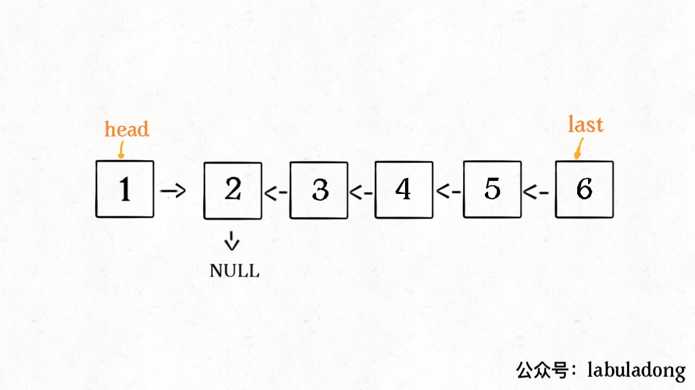
        */
        head->next->next = head;
        /**<extend up -200>
        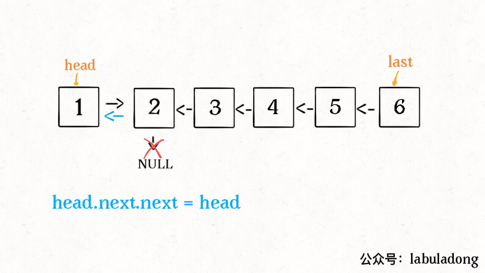
        */
        head->next = nullptr;
        /**<extend up -200>
        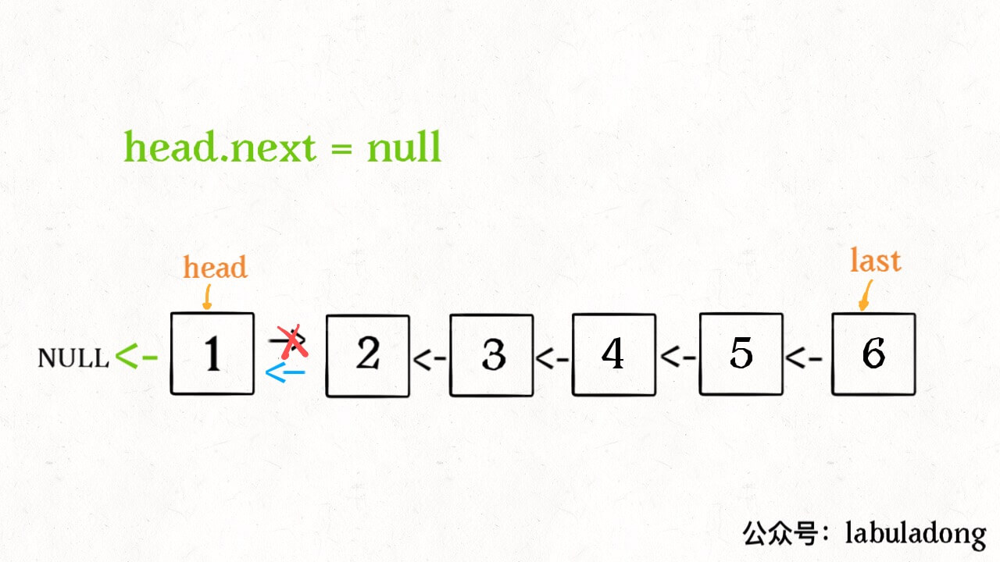
        */
        return last;
    }
};
```

```go
// by chatGPT (go)
func removeNthFromEnd(head *ListNode, n int) *ListNode {
    // 哑节点，方便处理删除头节点的情况
    dummy := &ListNode{Val: 0, Next: head}

    // 快指针先走 n 步
    fast := head
    for i := 0; i < n; i++ {
        fast = fast.Next
    }

    // 慢指针和快指针一起走，直到快指针到达链表尾部
    slow := dummy
    for fast != nil {
        slow = slow.Next
        fast = fast.Next
    }

    // 删除倒数第 n 个节点
    slow.Next = slow.Next.Next

    // 返回头节点
    return dummy.Next
}
```

```java
// by labuladong (java)
class Solution {
    public ListNode reverseList(ListNode head) {
        if (head == null || head.next == null) {
            return head;
        }
        ListNode last = reverseList(head.next);
        /**<extend up -200>
        
        */
        head.next.next = head;
        /**<extend up -200>
        
        */
        head.next = null;
        /**<extend up -200>
        
        */
        return last;
    }
}
```

```javascript
// by chatGPT (javascript)
/**
 * 给定一个字符串，请你找出其中不含有重复字符的 最长子串 的长度。
 *
 * 示例 1:
 *
 * 输入: "abcabcbb"
 * 输出: 3
 * 解释: 因为无重复字符的最长子串是 "abc"，所以其长度为 3。
 *
 * 示例 2:
 *
 * 输入: "bbbbb"
 * 输出: 1
 * 解释: 因为无重复字符的最长子串是 "b"，所以其长度为 1。
 *
 * 示例 3:
 *
 * 输入: "pwwkew"
 * 输出: 3
 * 解释: 因为无重复字符的最长子串是 "wke"，所以其长度为 3。
 *      请注意，你的答案必须是 子串 的长度，"pwke" 是一个子序列，不是子串。
 */

var lengthOfLongestSubstring = function(s) {
    let n = s.length, ans = 0;
    let index = new Map(); // 存储字符上一次出现的位置
    // i为左指针，j为右指针
    for (let j = 0, i = 0; j < n; j++) {
        if (index.has(s[j])) {
            // 如果有重复的字符，移动左指针到上一个同样字符的后一个位置
            i = Math.max(index.get(s[j]) + 1, i);
        }
        ans = Math.max(ans, j - i + 1); // 更新结果
        index.set(s[j], j); // 更新字符的位置
    }
    return ans;
};
```

```python
# by chatGPT (python)
# 请保留所有中文注释！
class Solution:
    def removeNthFromEnd(self, head: ListNode, n: int) -> ListNode:
        # 新建一个虚拟节点，避免特判头节点的情况
        dummy = ListNode(0, head)
        # 快指针先走n步
        fast = head
        for i in range(n):
            fast = fast.next
        # 慢指针开始走，与快指针保持n步的距离
        slow = dummy
        while fast is not None:
            fast = fast.next
            slow = slow.next
        # 此时slow指向的是倒数第n+1个节点，删除下一个节点即可
        slow.next = slow.next.next
        return dummy.next
```

https://leetcode.cn/problems/UHnkqh 的多语言解法👆

https://leetcode.cn/problems/VabMRr 的多语言解法👇

```cpp
// by labuladong (cpp)
class Solution {
    public:
    vector<int> findAnagrams(string s, string t) {
        unordered_map<char, int> need, window;
        for (char c : t) need[c]++;

        int left = 0, right = 0;
        int valid = 0;
        vector<int> res; // 记录结果
        while (right < s.size()) {
            char c = s[right];
            right++;
            // 进行窗口内数据的一系列更新
            if (need.count(c)) {
                window[c]++;
                if (window[c] == need[c])
                    valid++;
            }
            // 判断左侧窗口是否要收缩
            while (right - left >= t.size()) {
                // 当窗口符合条件时，把起始索引加入 res
                if (valid == need.size())
                    res.push_back(left);
                char d = s[left];
                left++;
                // 进行窗口内数据的一系列更新
                if (need.count(d)) {
                    if (window[d] == need[d])
                        valid--;
                    window[d]--;
                }
            }
        }
        return res;
    }
};
```

```go
// by chatGPT (go)
func findAnagrams(s string, t string) []int {
    need, window := make(map[byte]int), make(map[byte]int)
    for i := range t {
        need[t[i]]++
    }

    left, right := 0, 0
    valid := 0
    var res []int
    for right < len(s) {
        c := s[right]
        right++
        // 进行窗口内数据的一系列更新
        update := func(c byte) {
            if _, ok := need[c]; ok {
                window[c]++
                if window[c] == need[c] {
                    valid++
                }
            }
        }
        update(c)
        // 判断左侧窗口是否要收缩
        for right - left >= len(t) {
            // 当窗口符合条件时，把起始索引加入 res
            if valid == len(need) {
                res = append(res, left)
            }
            d := s[left]
            left++
            // 进行窗口内数据的一系列更新
            update := func(d byte) {
                if _, ok := need[d]; ok {
                    if window[d] == need[d] {
                        valid--
                    }
                    window[d]--
                }
            }
            update(d)
        }
    }
    return res
}
```

```java
// by chatGPT (java)
class Solution {
    public List<Integer> findAnagrams(String s, String t) {
        Map<Character, Integer> need = new HashMap<>();
        Map<Character, Integer> window = new HashMap<>();
        for (char c : t.toCharArray()) {
            need.put(c, need.getOrDefault(c, 0) + 1);
        }

        int left = 0, right = 0, valid = 0;
        List<Integer> res = new ArrayList<>(); // 记录结果
        while (right < s.length()) {
            char c = s.charAt(right);
            right++;
            // 进行窗口内数据的一系列更新
            if (need.containsKey(c)) {
                window.put(c, window.getOrDefault(c, 0) + 1);
                if (window.get(c).equals(need.get(c))) {
                    valid++;
                }
            }
            // 判断左侧窗口是否要收缩
            while (right - left >= t.length()) {
                // 当窗口符合条件时，把起始索引加入 res
                if (valid == need.size()) {
                    res.add(left);
                }
                char d = s.charAt(left);
                left++;
                // 进行窗口内数据的一系列更新
                if (need.containsKey(d)) {
                    if (window.get(d).equals(need.get(d))) {
                        valid--;
                    }
                    window.put(d, window.get(d) - 1);
                }
            }
        }
        return res;
    }
}
```

```javascript
// by chatGPT (javascript)
var findAnagrams = function(s, t) {
    var need = {}, window = {};
    for (var i = 0; i < t.length; i++) {
        var c = t[i];
        need[c] = (need[c] || 0) + 1;
    }

    var left = 0, right = 0;
    var valid = 0;
    var res = [];
    while (right < s.length) {
        var c = s[right];
        right++;

        // 进行窗口内数据的一系列更新
        if (need.hasOwnProperty(c)) {
            window[c] = (window[c] || 0) + 1;
            if (window[c] === need[c])
                valid++;
        }
        
        // 判断左侧窗口是否要收缩
        while (right - left >= t.length) {
            // 当窗口符合条件时，把起始索引加入 res
            if (valid === Object.keys(need).length)
                res.push(left);
            var d = s[left];
            left++;

            // 进行窗口内数据的一系列更新
            if (need.hasOwnProperty(d)) {
                if (window[d] === need[d])
                    valid--;
                window[d]--;
            }
        }
    }
    return res;
};
```

```python
# by chatGPT (python)
class Solution:
    def findAnagrams(self, s: str, t: str) -> List[int]:
        need, window = {}, {}
        for c in t:
            need[c] = need.get(c, 0) + 1  # 统计目标字符串中字符出现次数

        left, right = 0, 0
        valid = 0
        res = []
        while right < len(s):
            c = s[right]  # 移入窗口的字符
            right += 1
            # 进行窗口内数据的更新
            if c in need:
                window[c] = window.get(c, 0) + 1
                if window[c] == need[c]:
                    valid += 1

            # 判断左侧窗口是否要收缩
            while right - left >= len(t):
                # 当窗口符合条件时，把起始索引加入 res
                if valid == len(need):
                    res.append(left)
                d = s[left]  # 移出窗口的字符
                left += 1
                # 进行窗口内数据的更新
                if d in need:
                    if window[d] == need[d]:
                        valid -= 1
                    window[d] -= 1

        return res
```

https://leetcode.cn/problems/VabMRr 的多语言解法👆

https://leetcode.cn/problems/VvJkup 的多语言解法👇

```cpp
// by chatGPT (cpp)
class Solution {
public:
    vector<vector<int>> res;

    /* 主函数，输入一组不重复的数字，返回它们的全排列 */
    vector<vector<int>> permute(vector<int>& nums) {
        // 记录「路径」
        vector<int> track;
        // 「路径」中的元素会被标记为 true，避免重复使用
        vector<bool> used(nums.size(), false);

        backtrack(nums, track, used);
        return res;
    }

    // 路径：记录在 track 中
    // 选择列表：nums 中不存在于 track 的那些元素（used[i] 为 false）
    // 结束条件：nums 中的元素全都在 track 中出现
    void backtrack(vector<int>& nums, vector<int>& track, vector<bool>& used) {
        // 触发结束条件
        if (track.size() == nums.size()) {
            res.push_back(track);
            return;
        }

        for (int i = 0; i < nums.size(); i++) {
            // 排除不合法的选择
            if (used[i]) {
                /**<extend up -200>
                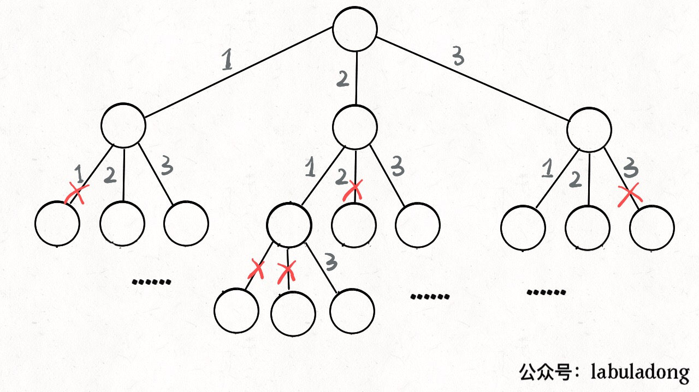
                */
                // nums[i] 已经在 track 中，跳过
                continue;
            }
            // 做选择
            track.push_back(nums[i]);
            used[i] = true;
            // 进入下一层决策树
            backtrack(nums, track, used);
            // 取消选择
            track.pop_back();
            used[i] = false;
        }
    }
};
```

```go
// by chatGPT (go)
func permute(nums []int) [][]int {
    res := [][]int{}

    /* backtrack 函数会用到的参数 */
    var backtrack func(nums, track []int, used []bool)
    backtrack = func(nums, track []int, used []bool) {
        // 「取消选择」的过程是撤销上一次的选择，所以不需要结束条件
        if len(track) == len(nums) {
            temp := make([]int, len(track))
            copy(temp, track)
            res = append(res, temp)
            return
        }

        for i := 0; i < len(nums); i++ {
            // 排除不合法的选择
            if used[i] {
                continue
            }
            // 做选择
            track = append(track, nums[i])
            used[i] = true
            // 进入下一层决策树
            backtrack(nums, track, used)
            // 「取消选择」，进行回溯
            track = track[:len(track)-1]
            used[i] = false
        }
    }

    backtrack(nums, []int{}, make([]bool, len(nums)))
    return res
}
```

```java
// by labuladong (java)
class Solution {

    List<List<Integer>> res = new LinkedList<>();

    /* 主函数，输入一组不重复的数字，返回它们的全排列 */
    List<List<Integer>> permute(int[] nums) {
        // 记录「路径」
        LinkedList<Integer> track = new LinkedList<>();
        // 「路径」中的元素会被标记为 true，避免重复使用
        boolean[] used = new boolean[nums.length];
        
        backtrack(nums, track, used);
        return res;
    }

    // 路径：记录在 track 中
    // 选择列表：nums 中不存在于 track 的那些元素（used[i] 为 false）
    // 结束条件：nums 中的元素全都在 track 中出现
    void backtrack(int[] nums, LinkedList<Integer> track, boolean[] used) {
        // 触发结束条件
        if (track.size() == nums.length) {
            res.add(new LinkedList(track));
            return;
        }

        for (int i = 0; i < nums.length; i++) {
            // 排除不合法的选择
            if (used[i]) {
                /**<extend up -200>
                
                */
                // nums[i] 已经在 track 中，跳过
                continue;
            }
            // 做选择
            track.add(nums[i]);
            used[i] = true;
            // 进入下一层决策树
            backtrack(nums, track, used);
            // 取消选择
            track.removeLast();
            used[i] = false;
        }
    }
}
```

```javascript
// by chatGPT (javascript)
var permute = function(nums) {
  const res = [];

  const backtrack = (track, used) => {
    if (track.length === nums.length) {
      res.push([...track]);
      return;
    }

    for (let i = 0; i < nums.length; i++) {
      if (used[i]) {
        // nums[i] 已经在 track 中，跳过
        continue;
      }
      track.push(nums[i]);
      used[i] = true;
      backtrack(track, used);
      track.pop();
      used[i] = false;
    }
  };

  backtrack([], []);
  return res;
};
```

```python
# by chatGPT (python)
class Solution:
    def __init__(self):
        self.res = []

    def permute(self, nums: List[int]) -> List[List[int]]:
        track = []
        used = [False] * len(nums)
        self.backtrack(nums, track, used)
        return self.res

    def backtrack(self, nums: List[int], track: List[int], used: List[bool]) -> None:
        if len(track) == len(nums):
            self.res.append(track.copy())
            return

        for i in range(len(nums)):
            if used[i]:
                # nums[i] 已经在 track 中，跳过
                continue
            track.append(nums[i])
            used[i] = True
            self.backtrack(nums, track, used)
            track.pop()
            used[i] = False
```

https://leetcode.cn/problems/VvJkup 的多语言解法👆

https://leetcode.cn/problems/WhsWhI 的多语言解法👇

```cpp
// by chatGPT (cpp)
class Solution {
public:
    int longestConsecutive(vector<int>& nums) {
        // 转化成哈希集合，方便快速查找是否存在某个元素
        unordered_set<int> set;
        for (int num : nums) {
            set.insert(num);
        }

        int res = 0;

        for (int num : set) {
            if (set.count(num - 1)) {
                // num 不是连续子序列的第一个，跳过
                continue;
            }
            // num 是连续子序列的第一个，开始向上计算连续子序列的长度
            int curNum = num;
            int curLen = 1;

            while (set.count(curNum + 1)) {
                curNum += 1;
                curLen += 1;
            }
            // 更新最长连续序列的长度
            res = max(res, curLen);
        }

        return res;
    }
};
```

```go
// by chatGPT (go)
func longestConsecutive(nums []int) int {
    // 转化成哈希集合，方便快速查找是否存在某个元素
    set := make(map[int]bool)
    for _, num := range nums {
        set[num] = true
    }

    res := 0

    for num := range set {
        if set[num-1] {
            // num 不是连续子序列的第一个，跳过
            continue
        }
        // num 是连续子序列的第一个，开始向上计算连续子序列的长度
        curNum := num
        curLen := 1

        for set[curNum+1] {
            curNum += 1
            curLen += 1
        }
        // 更新最长连续序列的长度
        res = max(res, curLen)
    }

    return res
}

func max(a, b int) int {
    if a > b {
        return a
    }
    return b
}
```

```java
// by labuladong (java)
class Solution {
    public int longestConsecutive(int[] nums) {
        // 转化成哈希集合，方便快速查找是否存在某个元素
        HashSet<Integer> set = new HashSet<Integer>();
        for (int num : nums) {
            set.add(num);
        }

        int res = 0;

        for (int num : set) {
            if (set.contains(num - 1)) {
                // num 不是连续子序列的第一个，跳过
                continue;
            }
            // num 是连续子序列的第一个，开始向上计算连续子序列的长度
            int curNum = num;
            int curLen = 1;

            while (set.contains(curNum + 1)) {
                curNum += 1;
                curLen += 1;
            }
            // 更新最长连续序列的长度
            res = Math.max(res, curLen);
        }

        return res;
    }
}
```

```javascript
// by chatGPT (javascript)
var longestConsecutive = function(nums) {
    // 转化成哈希集合，方便快速查找是否存在某个元素
    const set = new Set(nums);
    let res = 0;

    for (const num of set) {
        if (set.has(num - 1)) {
            // num 不是连续子序列的第一个，跳过
            continue;
        }
        // num 是连续子序列的第一个，开始向上计算连续子序列的长度
        let curNum = num;
        let curLen = 1;

        while (set.has(curNum + 1)) {
            curNum += 1;
            curLen += 1;
        }
        // 更新最长连续序列的长度
        res = Math.max(res, curLen);
    }

    return res;
};
```

```python
# by chatGPT (python)
class Solution:
    def longestConsecutive(self, nums: List[int]) -> int:
        # 转化成哈希集合，方便快速查找是否存在某个元素
        num_set = set(nums)
        
        res = 0
        
        for num in num_set:
            if num - 1 in num_set:
                # num 不是连续子序列的第一个，跳过
                continue
            # num 是连续子序列的第一个，开始向上计算连续子序列的长度
            cur_num = num
            cur_len = 1
            
            while cur_num + 1 in num_set:
                cur_num += 1
                cur_len += 1
            # 更新最长连续序列的长度
            res = max(res, cur_len)
        
        return res
```

https://leetcode.cn/problems/WhsWhI 的多语言解法👆

https://leetcode.cn/problems/XltzEq 的多语言解法👇

```cpp
// by chatGPT (cpp)
class Solution {
public:
    bool isPalindrome(string s) {
        // 先把所有字符转化成小写，并过滤掉空格和标点这类字符
        string filtered;
        for (int i = 0; i < s.length(); i++) {
            char c = s[i];
            if (isalnum(c)) { // 使用isalnum函数判断是否为字母或数字
                filtered += tolower(c); // 使用tolower函数将字符转换为小写
            }
        }

        // 然后对剩下的这些目标字符执行双指针算法，判断回文串
        s = filtered;
        // 一左一右两个指针相向而行
        int left = 0, right = s.length() - 1;
        while (left < right) {
            if (s[left] != s[right]) {
                return false;
            }
            left++;
            right--;
        }
        return true;
    }
};
```

```go
// by chatGPT (go)
func isPalindrome(s string) bool {
    // 先把所有字符转化成小写，并过滤掉空格和标点这类字符
    sb := strings.Builder{}
    for _, c := range s {
        if unicode.IsLetter(c) || unicode.IsDigit(c) {
            sb.WriteRune(unicode.ToLower(c))
        }
    }

    // 然后对剩下的这些目标字符执行双指针算法，判断回文串
    s = sb.String()
    // 一左一右两个指针相向而行
    left, right := 0, len(s)-1
    for left < right {
        if s[left] != s[right] {
            return false
        }
        left++
        right--
    }
    return true
}
```

```java
// by labuladong (java)
class Solution {
    public boolean isPalindrome(String s) {
        // 先把所有字符转化成小写，并过滤掉空格和标点这类字符
        StringBuilder sb = new StringBuilder();
        for (int i = 0; i < s.length(); i++) {
            char c = s.charAt(i);
            if (Character.isLetterOrDigit(c)) {
                sb.append(Character.toLowerCase(c));
            }
        }

        // 然后对剩下的这些目标字符执行双指针算法，判断回文串
        s = sb.toString();
        // 一左一右两个指针相向而行
        int left = 0, right = s.length() - 1;
        while (left < right) {
            if (s.charAt(left) != s.charAt(right)) {
                return false;
            }
            left++;
            right--;
        }
        return true;
    }
}
```

```javascript
// by chatGPT (javascript)
var isPalindrome = function(s) {
  // 先把所有字符转化成小写，并过滤掉空格和标点这类字符
  let sb = '';
  for (let i = 0; i < s.length; i++) {
    let c = s.charAt(i);
    if (/[0-9a-zA-Z]/.test(c)) {
      sb += c.toLowerCase();
    }
  }

  // 然后对剩下的这些目标字符执行双指针算法，判断回文串
  s = sb;
  // 一左一右两个指针相向而行
  let left = 0, right = s.length - 1;
  while (left < right) {
    if (s.charAt(left) !== s.charAt(right)) {
      return false;
    }
    left++;
    right--;
  }
  return true;
}
```

```python
# by chatGPT (python)
class Solution:
    def isPalindrome(self, s: str) -> bool:
        # 先把所有字符转化成小写，并过滤掉空格和标点这类字符
        sb = []
        for c in s:
            if c.isalnum():
                sb.append(c.lower())
                
        # 然后对剩下的这些目标字符执行双指针算法，判断回文串
        s = ''.join(sb)
        # 一左一右两个指针相向而行
        left, right = 0, len(s) - 1
        while left < right:
            if s[left] != s[right]:
                return False
            left += 1
            right -= 1
        return True
```

https://leetcode.cn/problems/XltzEq 的多语言解法👆

https://leetcode.cn/problems/YaVDxD 的多语言解法👇

```cpp
// by chatGPT (cpp)
class Solution {
public:
    int findTargetSumWays(vector<int>& nums, int target) {
        if (nums.empty()) return 0;
        return dp(nums, 0, target);
    }

    // 备忘录
    unordered_map<string, int> memo;

    int dp(vector<int>& nums, int i, int remain) {
        // base case
        if (i == nums.size()) {
            if (remain == 0) return 1;
            return 0;
        }
        // 把它俩转成字符串才能作为哈希表的键
        string key = to_string(i) + "," + to_string(remain);
        // 避免重复计算
        if (memo.count(key)) {
            return memo[key];
        }
        // 还是穷举
        int result = dp(nums, i + 1, remain - nums[i]) + dp(nums, i + 1, remain + nums[i]);
        // 记入备忘录
        memo[key] = result;
        return result;
    }
};
```

```go
// by chatGPT (go)
func findTargetSumWays(nums []int, target int) int {
    if len(nums) == 0 {
        return 0
    }
    //初始化备忘录
    memo := make(map[string]int)
    return dp(nums, 0, target, memo)
}

func dp(nums []int, i int, remain int, memo map[string]int) int {
    //基本情况
    if i == len(nums) {
        if remain == 0 {
            return 1
        }
        return 0
    }
    key := fmt.Sprintf("%d,%d", i, remain)
    //避免重复计算
    if _, ok := memo[key]; ok {
        return memo[key]
    }
    //穷举
    result := dp(nums, i+1, remain-nums[i], memo) + dp(nums, i+1, remain+nums[i], memo)
    //记录结果到备忘录
    memo[key] = result
    return result
}
```

```java
// by labuladong (java)
class Solution {
    public int findTargetSumWays(int[] nums, int target) {
        if (nums.length == 0) return 0;
        return dp(nums, 0, target);
    }

    // 备忘录
    HashMap<String, Integer> memo = new HashMap<>();

    int dp(int[] nums, int i, int remain) {
        // base case
        if (i == nums.length) {
            if (remain == 0) return 1;
            return 0;
        }
        // 把它俩转成字符串才能作为哈希表的键
        String key = i + "," + remain;
        // 避免重复计算
        if (memo.containsKey(key)) {
            return memo.get(key);
        }
        // 还是穷举
        int result = dp(nums, i + 1, remain - nums[i]) + dp(nums, i + 1, remain + nums[i]);
        // 记入备忘录
        memo.put(key, result);
        return result;
    }
}
```

```javascript
// by chatGPT (javascript)
var findTargetSumWays = function(nums, target) {
    if (nums.length === 0) return 0;
    // 备忘录
    let memo = new Map();

    function dp(nums, i, remain) {
        // base case
        if (i === nums.length) {
            if (remain === 0) return 1;
            return 0;
        }
        // 把它俩转成字符串才能作为哈希表的键
        let key = i + "," + remain;
        // 避免重复计算
        if (memo.has(key)) {
            return memo.get(key);
        }
        // 还是穷举
        let result = dp(nums, i + 1, remain - nums[i]) + dp(nums, i + 1, remain + nums[i]);
        // 记入备忘录
        memo.set(key, result);
        return result;
    }

    return dp(nums, 0, target);
};
```

```python
# by chatGPT (python)
class Solution:
    def __init__(self):
        self.memo = {}
    
    def findTargetSumWays(self, nums: List[int], target: int) -> int:
        if len(nums) == 0:
            return 0
        return self.dp(nums, 0, target)
    
    def dp(self, nums: List[int], i: int, remain: int) -> int:
        # base case
        if i == len(nums):
            if remain == 0:
                return 1
            return 0
        # 把它俩转成字符串才能作为哈希表的键
        key = str(i) + "," + str(remain)
        # 避免重复计算
        if key in self.memo:
            return self.memo[key]
        # 还是穷举
        result = self.dp(nums, i + 1, remain - nums[i]) + self.dp(nums, i + 1, remain + nums[i])
        # 记入备忘录
        self.memo[key] = result
        return result
```

https://leetcode.cn/problems/YaVDxD 的多语言解法👆

https://leetcode.cn/problems/Ygoe9J 的多语言解法👇

```cpp
// by chatGPT (cpp)
class Solution {
    vector<vector<int>> res;
    list<int> track;

public:
    vector<vector<int>> combinationSum(vector<int>& candidates, int target) {
        if (candidates.empty()) {
            return res;
        }
        backtrack(candidates, 0, target, 0);
        return res;
    }

    // 回溯算法主函数
    void backtrack(vector<int>& candidates, int start, int target, int sum) {
        if (sum == target) {
            // 找到目标和
            res.push_back(vector<int>(track.begin(), track.end()));
            return;
        }

        if (sum > target) {
            // 超过目标和，直接结束
            return;
        }

        // 回溯算法框架
        for (int i = start; i < candidates.size(); i++) {
            // 选择 candidates[i]
            track.push_back(candidates[i]);
            sum += candidates[i];
            // 递归遍历下一层回溯树
            backtrack(candidates, i, target, sum);
            // 撤销选择 candidates[i]
            sum -= candidates[i];
            track.pop_back();
        }
    }
};
```

```go
// by chatGPT (go)
func combinationSum(candidates []int, target int) [][]int {
    res := [][]int{}
    if len(candidates) == 0 {
        return res
    }
    backtrack(candidates, []int{}, target, 0, &res)
    return res
}

// 回溯算法框架
func backtrack(candidates []int, path []int, target, sum int, res *[][]int) {
    if sum == target {
        // 找到目标和
        *res = append(*res, append([]int{}, path...))
        return
    }
    if sum > target {
        // 超过目标和，直接结束
        return
    }
    for i := 0; i < len(candidates); i++ {
        // 选择 candidates[i]
        path = append(path, candidates[i])
        sum += candidates[i]
        // 递归遍历下一层回溯树
        backtrack(candidates[i:], path, target, sum, res)
        // 撤销选择 candidates[i]
        sum -= candidates[i]
        path = path[:len(path)-1]
    }
}
```

```java
// by labuladong (java)
class Solution {
    List<List<Integer>> res = new LinkedList<>();

    public List<List<Integer>> combinationSum(int[] candidates, int target) {
        if (candidates.length == 0) {
            return res;
        }
        backtrack(candidates, 0, target, 0);
        return res;
    }

    // 记录回溯的路径
    LinkedList<Integer> track = new LinkedList<>();

    // 回溯算法主函数
    void backtrack(int[] candidates, int start, int target, int sum) {
        if (sum == target) {
            // 找到目标和
            res.add(new LinkedList<>(track));
            return;
        }

        if (sum > target) {
            // 超过目标和，直接结束
            return;
        }

        // 回溯算法框架
        for (int i = start; i < candidates.length; i++) {
            // 选择 candidates[i]
            track.add(candidates[i]);
            sum += candidates[i];
            // 递归遍历下一层回溯树
            backtrack(candidates, i, target, sum);
            // 撤销选择 candidates[i]
            sum -= candidates[i];
            track.removeLast();
        }
    }
}
```

```javascript
// by chatGPT (javascript)
var combinationSum = function(candidates, target) {
    var res = [];
    if (candidates.length === 0) {
        return res;
    }

    // 记录回溯的路径
    var track = [];

    // 回溯算法主函数
    var backtrack = function(candidates, start, target, sum) {
        if (sum === target) {
            // 找到目标和
            res.push([...track]);
            return;
        }

        if (sum > target) {
            // 超过目标和，直接结束
            return;
        }

        // 回溯算法框架
        for (var i = start; i < candidates.length; i++) {
            // 选择 candidates[i]
            track.push(candidates[i]);
            sum += candidates[i];
            // 递归遍历下一层回溯树
            backtrack(candidates, i, target, sum);
            // 撤销选择 candidates[i]
            sum -= candidates[i];
            track.pop();
        }
    };

    backtrack(candidates, 0, target, 0);
    return res;
};
```

```python
# by chatGPT (python)
class Solution:
    def __init__(self):
        self.res = []
        self.track = []

    def combinationSum(self, candidates: List[int], target: int) -> List[List[int]]:
        if not candidates:
            return self.res
        self.backtrack(candidates, 0, target, 0)
        return self.res

    # 记录回溯的路径
    def backtrack(self, candidates, start, target, summation):
        if summation == target:
            # 找到目标和
            self.res.append(self.track[:])
            return
        if summation > target:
            # 超过目标和，直接结束
            return
        # 回溯算法框架
        for i in range(start, len(candidates)):
            # 选择 candidates[i]
            self.track.append(candidates[i])
            summation += candidates[i]
            # 递归遍历下一层回溯树
            self.backtrack(candidates, i, target, summation)
            # 撤销选择 candidates[i]
            summation -= candidates[i]
            self.track.pop()
```

https://leetcode.cn/problems/Ygoe9J 的多语言解法👆

https://leetcode.cn/problems/ZL6zAn 的多语言解法👇

```cpp
// by chatGPT (cpp)
class Solution {
public:
    int maxAreaOfIsland(vector<vector<int>>& grid) {
        // 记录岛屿的最大面积
        int res = 0;
        int m = grid.size(), n = grid[0].size();
        for (int i = 0; i < m; i++) {
            for (int j = 0; j < n; j++) {
                if (grid[i][j] == 1) {
                    // 淹没岛屿，并更新最大岛屿面积
                    res = max(res, dfs(grid, i, j));
                }
            }
        }
        return res;
    }

    // 淹没与 (i, j) 相邻的陆地，并返回淹没的陆地面积
    int dfs(vector<vector<int>>& grid, int i, int j) {
        int m = grid.size(), n = grid[0].size();
        if (i < 0 || j < 0 || i >= m || j >= n) {
            // 超出索引边界
            return 0;
        }
        if (grid[i][j] == 0) {
            // 已经是海水了
            return 0;
        }
        // 将 (i, j) 变成海水
        grid[i][j] = 0;

        return dfs(grid, i + 1, j)
                + dfs(grid, i, j + 1)
                + dfs(grid, i - 1, j)
                + dfs(grid, i, j - 1) + 1;
    }
};
```

```go
// by chatGPT (go)
// 记录岛屿的最大面积
func maxAreaOfIsland(grid [][]int) int {
    res := 0
    m, n := len(grid), len(grid[0])
    for i := 0; i < m; i++ {
        for j := 0; j < n; j++ {
            if grid[i][j] == 1 {
                // 淹没岛屿，并更新最大岛屿面积
                res = max(res, dfs(grid, i, j))
            }
        }
    }
    return res
}

// 淹没与 (i, j) 相邻的陆地，并返回淹没的陆地面积
func dfs(grid [][]int, i, j int) int {
    m, n := len(grid), len(grid[0])
    if i < 0 || j < 0 || i >= m || j >= n {
        // 超出索引边界
        return 0
    }
    if grid[i][j] == 0 {
        // 已经是海水了
        return 0
    }
    // 将 (i, j) 变成海水
    grid[i][j] = 0

    return dfs(grid, i+1, j) +
        dfs(grid, i, j+1) +
        dfs(grid, i-1, j) +
        dfs(grid, i, j-1) + 1
}

func max(a, b int) int {
    if a > b {
        return a
    }
    return b
}
```

```java
// by labuladong (java)
class Solution {
    public int maxAreaOfIsland(int[][] grid) {
        // 记录岛屿的最大面积
        int res = 0;
        int m = grid.length, n = grid[0].length;
        for (int i = 0; i < m; i++) {
            for (int j = 0; j < n; j++) {
                if (grid[i][j] == 1) {
                    // 淹没岛屿，并更新最大岛屿面积
                    res = Math.max(res, dfs(grid, i, j));
                }
            }
        }
        return res;
    }

    // 淹没与 (i, j) 相邻的陆地，并返回淹没的陆地面积
    int dfs(int[][] grid, int i, int j) {
        int m = grid.length, n = grid[0].length;
        if (i < 0 || j < 0 || i >= m || j >= n) {
            // 超出索引边界
            return 0;
        }
        if (grid[i][j] == 0) {
            // 已经是海水了
            return 0;
        }
        // 将 (i, j) 变成海水
        grid[i][j] = 0;

        return dfs(grid, i + 1, j)
                + dfs(grid, i, j + 1)
                + dfs(grid, i - 1, j)
                + dfs(grid, i, j - 1) + 1;
    }
}
```

```javascript
// by chatGPT (javascript)
var maxAreaOfIsland = function(grid) {
    let res = 0;
    let m = grid.length, n = grid[0].length;

    function dfs(grid, i, j) {
        if (i < 0 || j < 0 || i >= m || j >= n) {
            // 超出索引边界
            return 0;
        }
        if (grid[i][j] == 0) {
            // 已经是海水了
            return 0;
        }
        // 将 (i, j) 变成海水
        grid[i][j] = 0;

        return dfs(grid, i + 1, j)
                + dfs(grid, i, j + 1)
                + dfs(grid, i - 1, j)
                + dfs(grid, i, j - 1) + 1;
    }

    for (let i = 0; i < m; i++) {
        for (let j = 0; j < n; j++) {
            if (grid[i][j] == 1) {
                res = Math.max(res, dfs(grid, i, j));
            }
        }
    }
    return res;
};
```

```python
# by chatGPT (python)
class Solution:
    def maxAreaOfIsland(self, grid: List[List[int]]) -> int:
        # 记录岛屿的最大面积
        res = 0
        m, n = len(grid), len(grid[0])
        for i in range(m):
            for j in range(n):
                if grid[i][j] == 1:
                    # 淹没岛屿，并更新最大岛屿面积
                    res = max(res, self.dfs(grid, i, j))
        return res
    
    # 淹没与 (i, j) 相邻的陆地，并返回淹没的陆地面积
    def dfs(self, grid: List[List[int]], i: int, j: int) -> int:
        m, n = len(grid), len(grid[0])
        if i < 0 or j < 0 or i >= m or j >= n:
            # 超出索引边界
            return 0
        if grid[i][j] == 0:
            # 已经是海水了
            return 0
        # 将 (i, j) 变成海水
        grid[i][j] = 0
        
        return (self.dfs(grid, i + 1, j) 
                + self.dfs(grid, i, j + 1) 
                + self.dfs(grid, i - 1, j) 
                + self.dfs(grid, i, j - 1) + 1)
```

https://leetcode.cn/problems/ZL6zAn 的多语言解法👆

https://leetcode.cn/problems/aMhZSa 的多语言解法👇

```cpp
// by chatGPT (cpp)
class Solution {
public:
    bool isPalindrome(ListNode* head) {
        ListNode *slow, *fast;
        slow = fast = head;
        while (fast != nullptr && fast->next != nullptr) {
            slow = slow->next;
            fast = fast->next->next;
        }

        if (fast != nullptr)
            slow = slow->next;

        ListNode *left = head;
        ListNode *right = reverse(slow);
        while (right != nullptr) {
            if (left->val != right->val)
                return false;
            left = left->next;
            right = right->next;
        }

        return true;
    }

    ListNode* reverse(ListNode* head) {
        ListNode *pre = nullptr, *cur = head;
        while (cur != nullptr) {
            ListNode *next = cur->next;
            cur->next = pre;
            pre = cur;
            cur = next;
        }
        return pre;
    }
};
```

```go
// by chatGPT (go)
func isPalindrome(head *ListNode) bool {
    slow, fast := head, head
    for fast != nil && fast.Next != nil {
        slow = slow.Next
        fast = fast.Next.Next
    }
    if fast != nil {
        slow = slow.Next
    }
    left, right := head, reverse(slow)
    for right != nil {
        if left.Val != right.Val {
            return false
        }
        left = left.Next
        right = right.Next
    }
    return true
}

func reverse(head *ListNode) *ListNode {
    var pre *ListNode
    cur := head
    for cur != nil {
        next := cur.Next
        cur.Next = pre
        pre = cur
        cur = next
    }
    return pre
}
```

```java
// by labuladong (java)
class Solution {
    public boolean isPalindrome(ListNode head) {
        ListNode slow, fast;
        slow = fast = head;
        while (fast != null && fast.next != null) {
            slow = slow.next;
            fast = fast.next.next;
        }

        if (fast != null)
            slow = slow.next;

        ListNode left = head;
        ListNode right = reverse(slow);
        while (right != null) {
            if (left.val != right.val)
                return false;
            left = left.next;
            right = right.next;
        }

        return true;
    }

    ListNode reverse(ListNode head) {
        ListNode pre = null, cur = head;
        while (cur != null) {
            ListNode next = cur.next;
            cur.next = pre;
            pre = cur;
            cur = next;
        }
        return pre;
    }
}
```

```javascript
// by chatGPT (javascript)
var isPalindrome = function(head) {
    let slow, fast;
    slow = fast = head;
    while (fast != null && fast.next != null) {
        slow = slow.next;
        fast = fast.next.next;
    }

    if (fast != null)
        slow = slow.next;

    let left = head;
    let right = reverse(slow);
    while (right != null) {
        if (left.val != right.val)
            return false;
        left = left.next;
        right = right.next;
    }

    return true;
};

var reverse = function(head) {
    let pre = null, cur = head;
    while (cur != null) {
        let next = cur.next;
        cur.next = pre;
        pre = cur;
        cur = next;
    }
    return pre;
};
```

```python
# by chatGPT (python)
class Solution:
    def isPalindrome(self, head: ListNode) -> bool:
        slow, fast = head, head
        while fast and fast.next:
            slow = slow.next
            fast = fast.next.next
        
        if fast:
            slow = slow.next
        
        left = head
        right = self.reverse(slow)
        while right:
            if left.val != right.val:
                return False
            left = left.next
            right = right.next
        
        return True

    def reverse(self, head: ListNode) -> ListNode:
        pre, cur = None, head
        while cur:
            nxt = cur.next
            cur.next = pre
            pre = cur
            cur = nxt
        return pre
```

https://leetcode.cn/problems/aMhZSa 的多语言解法👆

https://leetcode.cn/problems/add-binary 的多语言解法👇

```cpp
// by chatGPT (cpp)
class Solution {
public:
    string addBinary(string a, string b) {
        // 先把输入的这两个二进制串反转，低位放在前面，方便处理进位
        reverse(a.begin(), a.end());
        reverse(b.begin(), b.end());
        // 存储结果
        string res = "";

        int m = a.size(), n = b.size();
        // carry 记录进位
        int carry = 0;
        int i = 0;

        // 开始类似 [2. 两数相加](#2) 的加法模拟逻辑
        // 只是这里运算的是二进制字符串
        while (i < max(m, n) || carry > 0) {
            int val = carry;
            val += i < m ? (a[i] - '0') : 0;
            val += i < n ? (b[i] - '0') : 0;
            res.push_back(val % 2 + '0');
            carry = val / 2;
            i++;
        }

        reverse(res.begin(), res.end());
        return res;
    }
};
```

```go
// by chatGPT (go)
func addBinary(a string, b string) string {
    // 先把输入的这两个二进制串反转，低位放在前面，方便处理进位
    reverse := func(str string) string {
        reversed := []rune(str)
        for i, j := 0, len(reversed)-1; i < j; i, j = i+1, j-1 {
            reversed[i], reversed[j] = reversed[j], reversed[i]
        }
        return string(reversed)
    }
    a = reverse(a)
    b = reverse(b)
    // 存储结果
    var sb strings.Builder

    m, n := len(a), len(b)
    // carry 记录进位
    carry := 0
    i := 0

    // 开始类似 [2. 两数相加](#2) 的加法模拟逻辑
    // 只是这里运算的是二进制字符串
    for i < max(m, n) || carry > 0 {
        val := carry
        if i < m {
            val += int(a[i] - '0')
        }
        if i < n {
            val += int(b[i] - '0')
        }
        sb.WriteString(strconv.Itoa(val % 2))
        carry = val / 2
        i++
    }

    return reverse(sb.String())
}

func max(a, b int) int {
    if a > b {
        return a
    }
    return b
}
```

```java
// by labuladong (java)
class Solution {
    public String addBinary(String a, String b) {
        // 先把输入的这两个二进制串反转，低位放在前面，方便处理进位
        a = new StringBuilder(a).reverse().toString();
        b = new StringBuilder(b).reverse().toString();
        // 存储结果
        StringBuilder sb = new StringBuilder();

        int m = a.length(), n = b.length();
        // carry 记录进位
        int carry = 0;
        int i = 0;

        // 开始类似 [2. 两数相加](#2) 的加法模拟逻辑
        // 只是这里运算的是二进制字符串
        while (i < Math.max(m, n) || carry > 0) {
            int val = carry;
            val += i < m ? (a.charAt(i) - '0') : 0;
            val += i < n ? (b.charAt(i) - '0') : 0;
            sb.append(val % 2);
            carry = val / 2;
            i++;
        }

        return sb.reverse().toString();
    }
}
```

```javascript
// by chatGPT (javascript)
var addBinary = function(a, b) {
  // 先把输入的这两个二进制串反转，低位放在前面，方便处理进位
  a = a.split("").reverse().join("");
  b = b.split("").reverse().join("");
  // 存储结果
  var sb = "";

  var m = a.length, n = b.length;
  // carry 记录进位
  var carry = 0;
  var i = 0;

  // 开始类似 [2. 两数相加](#2) 的加法模拟逻辑
  // 只是这里运算的是二进制字符串
  while (i < Math.max(m, n) || carry > 0) {
    var val = carry;
    val += i < m ? parseInt(a.charAt(i)) : 0;
    val += i < n ? parseInt(b.charAt(i)) : 0;
    sb += (val % 2);
    carry = Math.floor(val / 2);
    i++;
  }

  return sb.split("").reverse().join("");
};
```

```python
# by chatGPT (python)
class Solution:
    def addBinary(self, a: str, b: str) -> str:
        # 先把输入的这两个二进制串反转，低位放在前面，方便处理进位
        a = a[::-1]
        b = b[::-1]
        # 存储结果
        sb = []

        m, n = len(a), len(b)
        # carry 记录进位
        carry = 0
        i = 0

        # 开始类似 [2. 两数相加](#2) 的加法模拟逻辑
        # 只是这里运算的是二进制字符串
        while i < max(m, n) or carry > 0:
            val = carry
            val += int(a[i]) if i < m else 0
            val += int(b[i]) if i < n else 0
            sb.append(str(val % 2))
            carry = val // 2
            i += 1

        return "".join(sb[::-1])
```

https://leetcode.cn/problems/add-binary 的多语言解法👆

https://leetcode.cn/problems/add-two-numbers 的多语言解法👇

```cpp
// by chatGPT (cpp)
class Solution {
public:
    ListNode* addTwoNumbers(ListNode* l1, ListNode* l2) {
        // 在两条链表上的指针
        ListNode *p1 = l1, *p2 = l2;
        // 虚拟头结点（构建新链表时的常用技巧）
        ListNode *dummy = new ListNode(-1);
        // 指针 p 负责构建新链表
        ListNode *p = dummy;
        // 记录进位
        int carry = 0;
        // 开始执行加法，两条链表走完且没有进位时才能结束循环
        while (p1 != nullptr || p2 != nullptr || carry > 0) {
            // 先加上上次的进位
            int val = carry;
            if (p1 != nullptr) {
                val += p1->val;
                p1 = p1->next;
            }
            if (p2 != nullptr) {
                val += p2->val;
                p2 = p2->next;
            }
            // 处理进位情况
            carry = val / 10;
            val = val % 10;
            // 构建新节点
            p->next = new ListNode(val);
            p = p->next;
        }
        // 返回结果链表的头结点（去除虚拟头结点）
        return dummy->next;
    }
};
```

```go
// by chatGPT (go)
func addTwoNumbers(l1 *ListNode, l2 *ListNode) *ListNode {
    // 在两条链表上的指针
    p1, p2 := l1, l2
    // 虚拟头结点（构建新链表时的常用技巧）
    dummy := &ListNode{-1, nil}
    // 指针 p 负责构建新链表
    p := dummy
    // 记录进位
    carry := 0
    // 开始执行加法，两条链表走完且没有进位时才能结束循环
    for p1 != nil || p2 != nil || carry > 0 {
        // 先加上上次的进位
        val := carry
        if p1 != nil {
            val += p1.Val
            p1 = p1.Next
        }
        if p2 != nil {
            val += p2.Val
            p2 = p2.Next
        }
        // 处理进位情况
        carry = val / 10
        val = val % 10
        // 构建新节点
        p.Next = &ListNode{val, nil}
        p = p.Next
    }
    // 返回结果链表的头结点（去除虚拟头结点）
    return dummy.Next
}
```

```java
// by labuladong (java)
class Solution {
    public ListNode addTwoNumbers(ListNode l1, ListNode l2) {
        // 在两条链表上的指针
        ListNode p1 = l1, p2 = l2;
        // 虚拟头结点（构建新链表时的常用技巧）
        ListNode dummy = new ListNode(-1);
        // 指针 p 负责构建新链表
        ListNode p = dummy;
        // 记录进位
        int carry = 0;
        // 开始执行加法，两条链表走完且没有进位时才能结束循环
        while (p1 != null || p2 != null || carry > 0) {
            // 先加上上次的进位
            int val = carry;
            if (p1 != null) {
                val += p1.val;
                p1 = p1.next;
            }
            if (p2 != null) {
                val += p2.val;
                p2 = p2.next;
            }
            // 处理进位情况
            carry = val / 10;
            val = val % 10;
            // 构建新节点
            p.next = new ListNode(val);
            p = p.next;
        }
        // 返回结果链表的头结点（去除虚拟头结点）
        return dummy.next;
    }
}
```

```javascript
// by chatGPT (javascript)
var addTwoNumbers = function(l1, l2) {
    // 在两条链表上的指针
    let p1 = l1, p2 = l2;
    // 虚拟头结点（构建新链表时的常用技巧）
    let dummy = new ListNode(-1);
    // 指针 p 负责构建新链表
    let p = dummy;
    // 记录进位
    let carry = 0;
    // 开始执行加法，两条链表走完且没有进位时才能结束循环
    while (p1 !== null || p2 !== null || carry > 0) {
        // 先加上上次的进位
        let val = carry;
        if (p1 !== null) {
            val += p1.val;
            p1 = p1.next;
        }
        if (p2 !== null) {
            val += p2.val;
            p2 = p2.next;
        }
        // 处理进位情况
        carry = Math.floor(val / 10);
        val = val % 10;
        // 构建新节点
        p.next = new ListNode(val);
        p = p.next;
    }
    // 返回结果链表的头结点（去除虚拟头结点）
    return dummy.next;
};
```

```python
# by chatGPT (python)
class Solution:
    def addTwoNumbers(self, l1: ListNode, l2: ListNode) -> ListNode:
        # 在两条链表上的指针
        p1, p2 = l1, l2
        # 虚拟头结点（构建新链表时的常用技巧）
        dummy = ListNode(-1)
        # 指针 p 负责构建新链表
        p = dummy
        # 记录进位
        carry = 0
        # 开始执行加法，两条链表走完且没有进位时才能结束循环
        while p1 or p2 or carry:
            # 先加上上次的进位
            val = carry
            if p1:
                val += p1.val
                p1 = p1.next
            if p2:
                val += p2.val
                p2 = p2.next
            # 处理进位情况
            carry, val = divmod(val, 10)
            # 构建新节点
            p.next = ListNode(val)
            p = p.next
        # 返回结果链表的头结点（去除虚拟头结点）
        return dummy.next
```

https://leetcode.cn/problems/add-two-numbers 的多语言解法👆

https://leetcode.cn/problems/add-two-numbers-ii 的多语言解法👇

```cpp
// by chatGPT (cpp)
class Solution {
public:
    ListNode* addTwoNumbers(ListNode* l1, ListNode* l2) {
        // 把链表元素转入栈中
        stack<int> stk1, stk2;
        while (l1 != nullptr) {
            stk1.push(l1->val);
            l1 = l1->next;
        }
        while (l2 != nullptr) {
            stk2.push(l2->val);
            l2 = l2->next;
        }

        // 接下来基本上是复用我在第 2 题的代码逻辑
        // 注意新节点要直接插入到 dummy 后面

        // 虚拟头结点（构建新链表时的常用技巧）
        ListNode* dummy = new ListNode(-1);

        // 记录进位
        int carry = 0;
        // 开始执行加法，两条链表走完且没有进位时才能结束循环
        while (!stk1.empty() || !stk2.empty() || carry > 0) {
            // 先加上上次的进位
            int val = carry;
            if (!stk1.empty()) {
                val += stk1.top();
                stk1.pop();
            }
            if (!stk2.empty()) {
                val += stk2.top();
                stk2.pop();
            }
            // 处理进位情况
            carry = val / 10;
            val = val % 10;
            // 构建新节点，直接接在 dummy 后面
            ListNode* newNode = new ListNode(val);
            newNode->next = dummy->next;
            dummy->next = newNode;
        }
        // 返回结果链表的头结点（去除虚拟头结点）
        ListNode* result = dummy->next;
        delete dummy;
        return result;
    }
};
```

```go
// by chatGPT (go)
func addTwoNumbers(l1 *ListNode, l2 *ListNode) *ListNode {
    // 把链表元素转入栈中
    stk1 := []int{}
    for l1 != nil {
        stk1 = append(stk1, l1.Val)
        l1 = l1.Next
    }
    stk2 := []int{}
    for l2 != nil {
        stk2 = append(stk2, l2.Val)
        l2 = l2.Next
    }

    // 接下来基本上是复用我在第 2 题的代码逻辑
    // 注意新节点要直接插入到 dummy 后面

    // 虚拟头结点（构建新链表时的常用技巧）
    dummy := &ListNode{-1, nil}

    // 记录进位
    carry := 0
    // 开始执行加法，两条链表走完且没有进位时才能结束循环
    for len(stk1) > 0 || len(stk2) > 0 || carry > 0 {
        // 先加上上次的进位
        val := carry
        if len(stk1) > 0 {
            val += stk1[len(stk1)-1]
            stk1 = stk1[:len(stk1)-1]
        }
        if len(stk2) > 0 {
            val += stk2[len(stk2)-1]
            stk2 = stk2[:len(stk2)-1]
        }
        // 处理进位情况
        carry = val / 10
        val = val % 10
        // 构建新节点，直接接在 dummy 后面
        newNode := &ListNode{val, dummy.Next}
        dummy.Next = newNode
    }
    // 返回结果链表的头结点（去除虚拟头结点）
    return dummy.Next
}
```

```java
// by labuladong (java)
class Solution {
    public ListNode addTwoNumbers(ListNode l1, ListNode l2) {
        // 把链表元素转入栈中
        Stack<Integer> stk1 = new Stack<>();
        while (l1 != null) {
            stk1.push(l1.val);
            l1 = l1.next;
        }
        Stack<Integer> stk2 = new Stack<>();
        while (l2 != null) {
            stk2.push(l2.val);
            l2 = l2.next;
        }

        // 接下来基本上是复用我在第 2 题的代码逻辑
        // 注意新节点要直接插入到 dummy 后面

        // 虚拟头结点（构建新链表时的常用技巧）
        ListNode dummy = new ListNode(-1);

        // 记录进位
        int carry = 0;
        // 开始执行加法，两条链表走完且没有进位时才能结束循环
        while (!stk1.isEmpty() || !stk2.isEmpty() || carry > 0) {
            // 先加上上次的进位
            int val = carry;
            if (!stk1.isEmpty()) {
                val += stk1.pop();
            }
            if (!stk2.isEmpty()) {
                val += stk2.pop();
            }
            // 处理进位情况
            carry = val / 10;
            val = val % 10;
            // 构建新节点，直接接在 dummy 后面
            ListNode newNode = new ListNode(val);
            newNode.next = dummy.next;
            dummy.next = newNode;
        }
        // 返回结果链表的头结点（去除虚拟头结点）
        return dummy.next;
    }
}
```

```javascript
// by chatGPT (javascript)
var addTwoNumbers = function(l1, l2) {
  // 把链表元素转入栈中
  const stk1 = [];
  while (l1 !== null) {
    stk1.push(l1.val);
    l1 = l1.next;
  }
  const stk2 = [];
  while (l2 !== null) {
    stk2.push(l2.val);
    l2 = l2.next;
  }

  // 接下来基本上是复用我在第 2 题的代码逻辑
  // 注意新节点要直接插入到 dummy 后面

  // 虚拟头结点（构建新链表时的常用技巧）
  const dummy = new ListNode(-1);

  // 记录进位
  let carry = 0;
  // 开始执行加法，两条链表走完且没有进位时才能结束循环
  while (stk1.length || stk2.length || carry > 0) {
    // 先加上上次的进位
    let val = carry;
    if (stk1.length) {
      val += stk1.pop();
    }
    if (stk2.length) {
      val += stk2.pop();
    }
    // 处理进位情况
    carry = Math.floor(val / 10);
    val = val % 10;
    // 构建新节点，直接接在 dummy 后面
    const newNode = new ListNode(val);
    newNode.next = dummy.next;
    dummy.next = newNode;
  }
  // 返回结果链表的头结点（去除虚拟头结点）
  return dummy.next;
};
```

```python
# by chatGPT (python)
class Solution:
    def addTwoNumbers(self, l1: ListNode, l2: ListNode) -> ListNode:
        # 把链表元素转入栈中
        stk1 = []
        while l1:
            stk1.append(l1.val)
            l1 = l1.next
        stk2 = []
        while l2:
            stk2.append(l2.val)
            l2 = l2.next

        # 接下来基本上是复用我在第 2 题的代码逻辑
        # 注意新节点要直接插入到 dummy 后面

        # 虚拟头结点（构建新链表时的常用技巧）
        dummy = ListNode(-1)

        # 记录进位
        carry = 0
        # 开始执行加法，两条链表走完且没有进位时才能结束循环
        while stk1 or stk2 or carry > 0:
            # 先加上上次的进位
            val = carry
            if stk1:
                val += stk1.pop()
            if stk2:
                val += stk2.pop()
            # 处理进位情况
            carry = val // 10
            val = val % 10
            # 构建新节点，直接接在 dummy 后面
            newNode = ListNode(val)
            newNode.next = dummy.next
            dummy.next = newNode
        # 返回结果链表的头结点（去除虚拟头结点）
        return dummy.next
```

https://leetcode.cn/problems/add-two-numbers-ii 的多语言解法👆

https://leetcode.cn/problems/additive-number 的多语言解法👇

```cpp
// by chatGPT (cpp)
class Solution {
public:
    bool isAdditiveNumber(string num) {
        // 穷举前两个数字
        int n = num.size();
        for (int i = 1; i <= n; i++) {
            for (int j = i + 1; j <= n; j++) {
                string first = num.substr(0, i);
                string second = num.substr(i, j-i);
                if (isValid(num, first, second)) {
                    return true;
                }
            }
        }
        return false;
    }

private:
    // 定义：num 前两个数字分别是 first 和 second，判断 num 是否满足累加数的性质
    bool isValid(string num, string first, string second) {
        if ((first[0] == '0' && first.size() > 1)
                || (second[0] == '0' && second.size() > 1)) {
            // 0 开头的数字，只能是 0 本身
            return false;
        }
        string sumStr = strAdd(first, second);
        string next = num.substr(first.size() + second.size());
        if (next.find(sumStr) != 0) {
            // 不满足累加数的性质
            return false;
        }
        if (next == sumStr) {
            // 已经匹配完整个字符串
            return true;
        }
        // 根据递归函数的定义，继续匹配后面的三个数字，我这里用递归的方式去比较，因为容易写
        // 你也可以改用迭代写法，一样的
        return isValid(num.substr(first.size()), second, sumStr);
    }

    // 模拟加法竖式运算，具体可以看下这道题
    // https://leetcode-cn.com/problems/add-strings/
    string strAdd(string a, string b) {
        int n = a.size(), m = b.size();
        int i = n - 1, j = m - 1, add = 0;
        string builder;
        while (i >= 0 || j >= 0 || add != 0) {
            int x = i >= 0 ? a[i] - '0' : 0;
            int y = j >= 0 ? b[j] - '0' : 0;
            int result = x + y + add;
            builder.push_back(result % 10 + '0');
            add = result / 10;
            i--;
            j--;
        }
        reverse(builder.begin(), builder.end());
        return builder;
    }
};
```

```go
// by chatGPT (go)
import (
	"strconv"
	"strings"
)

// isAdditiveNumber - 穷举前两个数字
func isAdditiveNumber(num string) bool {
	n := len(num)
	for i := 1; i <= n; i++ {
		for j := i + 1; j <= n; j++ {
			first := num[:i]
			second := num[i:j]
			if isValid(num, first, second) {
				return true
			}
		}
	}
	return false
}

// isValid - 定义:num 前两个数字分别是 first 和 second，判断 num 是否满足累加数的性质
func isValid(num string, first string, second string) bool {
	if (strings.HasPrefix(first, "0") && len(first) > 1) ||
		(strings.HasPrefix(second, "0") && len(second) > 1) {
		// 0 开头的数字，只能是 0 本身
		return false
	}
	sumStr := strAdd(first, second)
	next := num[len(first)+len(second):]
	if !strings.HasPrefix(next, sumStr) {
		// 不满足累加数的性质
		return false
	}
	if next == sumStr {
		// 已经匹配完整个字符串
		return true
	}
	// 根据递归函数的定义，继续匹配后面的三个数字，我这里用递归的方式去比较，因为容易写
	// 你也可以改用迭代写法，一样的
	return isValid(num[len(first):], second, sumStr)
}

// strAdd - 模拟加法竖式运算，具体可以看下这道题
// https://leetcode.cn/problems/add-strings/
func strAdd(a, b string) string {
	i, j, carry := len(a)-1, len(b)-1, 0
	ans := ""
	for i >= 0 || j >= 0 {
		x, _ := strconv.Atoi(string(a[i]))
		y, _ := strconv.Atoi(string(b[j]))
		sum := x + y + carry
		tmp := sum % 10
		carry = sum / 10
		ans = strconv.Itoa(tmp) + ans
		i--
		j--
	}
	if carry > 0 {
		ans = "1" + ans
	}
	return ans
}
```

```java
// by labuladong (java)
class Solution {
    public boolean isAdditiveNumber(String num) {
        // 穷举前两个数字
        int n = num.length();
        for (int i = 1; i <= n; i++) {
            // 先穷举第一个数字
            String first = num.substring(0, i);
            for (int j = i + 1; j <= n; j++) {
                // 再穷举第二个数字
                String second = num.substring(i, j);
                if (isValid(num, first, second)) {
                    return true;
                }
            }
        }
        return false;
    }

    // 定义：num 前两个数字分别是 first 和 second，判断 num 是否满足累加数的性质
    boolean isValid(String num, String first, String second) {
        if (first.startsWith("0") && first.length() > 1
                || second.startsWith("0") && second.length() > 1) {
            // 0 开头的数字，只能是 0 本身
            return false;
        }
        String sumStr = strAdd(first, second);
        String next = num.substring(first.length() + second.length());
        if (!next.startsWith(sumStr)) {
            // 不满足累加数的性质
            return false;
        }
        if (next.equals(sumStr)) {
            // 已经匹配完整个字符串
            return true;
        }
        // 根据递归函数的定义，继续匹配后面的三个数字，我这里用递归的方式去比较，因为容易写
        // 你也可以改用迭代写法，一样的
        return isValid(num.substring(first.length()), second, sumStr);
    }

    // 模拟加法竖式运算，具体可以看下这道题
    // https://leetcode.cn/problems/add-strings/
    String strAdd(String a, String b) {
        int n = a.length(), m = b.length();
        int i = n - 1, j = m - 1, add = 0;
        StringBuilder builder = new StringBuilder();
        while (i >= 0 || j >= 0 || add != 0) {
            int x = i >= 0 ? a.charAt(i) - '0' : 0;
            int y = j >= 0 ? b.charAt(j) - '0' : 0;
            int result = x + y + add;
            builder.append(result % 10);
            add = result / 10;
            i--;
            j--;
        }
        return builder.reverse().toString();
    }
}
```

```javascript
// by chatGPT (javascript)
var isAdditiveNumber = function(num) {
    // 穷举前两个数字
    let n = num.length;
    for (let i = 1; i <= n; i++) {
        for (let j = i + 1; j <= n; j++) {
            let first = num.substring(0, i);
            let second = num.substring(i, j);
            if (isValid(num, first, second)) {
                return true;
            }
        }
    }
    return false;
}

var isValid = function(num, first, second) {
    if ((first.startsWith("0") && first.length > 1)
            || (second.startsWith("0") && second.length > 1)) {
        // 0 开头的数字，只能是 0 本身
        return false;
    }
    let sumStr = strAdd(first, second);
    let next = num.substring(first.length + second.length);
    if (!next.startsWith(sumStr)) {
        // 不满足累加数的性质
        return false;
    }
    if (next === sumStr) {
        // 已经匹配完整个字符串
        return true;
    }
    // 根据递归函数的定义，继续匹配后面的三个数字，我这里用递归的方式去比较，因为容易写
    // 你也可以改用迭代写法，一样的
    return isValid(num.substring(first.length), second, sumStr);
}

var strAdd = function(a, b) {
    let n = a.length, m = b.length;
    let i = n - 1, j = m - 1, add = 0;
    let builder = [];
    while (i >= 0 || j >= 0 || add != 0) {
        let x = i >= 0 ? a.charAt(i) - '0' : 0;
        let y = j >= 0 ? b.charAt(j) - '0' : 0;
        let result = x + y + add;
        builder.push(result % 10);
        add = Math.floor(result / 10);
        i--;
        j--;
    }
    return builder.reverse().join('');
}
```

```python
# by chatGPT (python)
class Solution:
    def isAdditiveNumber(self, num):
        # 穷举前两个数字
        n = len(num)
        for i in range(1, n + 1):
            for j in range(i + 1, n + 1):
                first = num[0 : i]
                second = num[i : j]
                if self.isValid(num, first, second):
                    return True
        return False

    def isValid(self, num, first, second):
        # 定义：num 前两个数字分别是 first 和 second，判断 num 是否满足累加数的性质
        if (first.startswith("0") and len(first) > 1) or (second.startswith("0") and len(second) > 1):
            # 0 开头的数字，只能是 0 本身
            return False
        sumStr = self.strAdd(first, second)
        next = num[len(first) + len(second):]
        if not next.startswith(sumStr):
            # 不满足累加数的性质
            return False
        if next == sumStr:
            # 已经匹配完整个字符串
            return True
        # 根据递归函数的定义，继续匹配后面的三个数字，我这里用递归的方式去比较，因为容易写
        # 你也可以改用迭代写法，一样的
        return self.isValid(num[len(first):], second, sumStr)

    def strAdd(self, a, b):
        # 模拟加法竖式运算，具体可以看下这道题
        # https://leetcode.cn/problems/add-strings/
        n, m = len(a), len(b)
        i, j, add = n - 1, m - 1, 0
        builder = []
        while i >= 0 or j >= 0 or add != 0:
            x = int(a[i]) if i >= 0 else 0
            y = int(b[j]) if j >= 0 else 0
            result = x + y + add
            builder.append(result % 10)
            add = result // 10
            i -= 1
            j -= 1
        return ''.join(str(i) for i in builder[::-1])
```

https://leetcode.cn/problems/additive-number 的多语言解法👆

https://leetcode.cn/problems/advantage-shuffle 的多语言解法👇

```cpp
// by chatGPT (cpp)
class Solution {
public:
    vector<int> advantageCount(vector<int>& nums1, vector<int>& nums2) {
        int n = nums1.size();
        // 给 nums2 降序排序
        priority_queue<pair<int, int>> maxpq;
        for (int i = 0; i < n; i++) {
            maxpq.push({i, nums2[i]});
        }
        // 给 nums1 升序排序
        sort(nums1.begin(), nums1.end());

        // nums1[left] 是最小值，nums1[right] 是最大值
        int left = 0, right = n - 1;
        vector<int> res(n);

        while (!maxpq.empty()) {
            auto [i, maxval] = maxpq.top(); maxpq.pop();
            // maxval 是 nums2 中的最大值，i 是对应索引
            if (maxval < nums1[right]) {
                // 如果 nums1[right] 能胜过 maxval，那就自己上
                res[i] = nums1[right];
                right--;
            } else {
                // 否则用最小值混一下，养精蓄锐
                res[i] = nums1[left];
                left++;
            }
        }
        return res;
    }
};
```

```go
// by chatGPT (go)
func advantageCount(nums1 []int, nums2 []int) []int {
    n := len(nums1)
    // 给 nums2 降序排序
    maxpq := make(PriorityQueue, 0)
    heap.Init(&maxpq)
    for i := 0; i < n; i++ {
        heap.Push(&maxpq, []int{i, nums2[i]})
    }
    // 给 nums1 升序排序
    sort.Ints(nums1)

    // nums1[left] 是最小值，nums1[right] 是最大值
    left, right := 0, n-1
    res := make([]int, n)

    for maxpq.Len() > 0 {
        pair := heap.Pop(&maxpq).([]int)
        // maxval 是 nums2 中的最大值，i 是对应索引
        i, maxval := pair[0], pair[1]
        if maxval < nums1[right] {
            // 如果 nums1[right] 能胜过 maxval，那就自己上
            res[i] = nums1[right]
            right--
        } else {
            // 否则用最小值混一下，养精蓄锐
            res[i] = nums1[left]
            left++
        }
    }
    return res
}

// 定义一个优先队列类型 PriorityQueue，用于按照指定比较函数排序
type PriorityQueue [][]int

func (pq PriorityQueue) Len() int {
    return len(pq)
}

func (pq PriorityQueue) Less(i, j int) bool {
    return pq[i][1] > pq[j][1]
}

func (pq PriorityQueue) Swap(i, j int) {
    pq[i], pq[j] = pq[j], pq[i]
}

func (pq *PriorityQueue) Push(x interface{}) {
    item := x.([]int)
    *pq = append(*pq, item)
}

func (pq *PriorityQueue) Pop() interface{} {
    old := *pq
    n := len(old)
    item := old[n-1]
    *pq = old[0 : n-1]
    return item
}
```

```java
// by labuladong (java)
class Solution {
    public int[] advantageCount(int[] nums1, int[] nums2) {
        int n = nums1.length;
        // 给 nums2 降序排序
        PriorityQueue<int[]> maxpq = new PriorityQueue<>(
                (int[] pair1, int[] pair2) -> {
                    return pair2[1] - pair1[1];
                }
        );
        for (int i = 0; i < n; i++) {
            maxpq.offer(new int[]{i, nums2[i]});
        }
        // 给 nums1 升序排序
        Arrays.sort(nums1);

        // nums1[left] 是最小值，nums1[right] 是最大值
        int left = 0, right = n - 1;
        int[] res = new int[n];

        while (!maxpq.isEmpty()) {
            int[] pair = maxpq.poll();
            // maxval 是 nums2 中的最大值，i 是对应索引
            int i = pair[0], maxval = pair[1];
            if (maxval < nums1[right]) {
                // 如果 nums1[right] 能胜过 maxval，那就自己上
                res[i] = nums1[right];
                right--;
            } else {
                // 否则用最小值混一下，养精蓄锐
                res[i] = nums1[left];
                left++;
            }
        }
        return res;
    }
}
```

```javascript
// by chatGPT (javascript)
var advantageCount = function(nums1, nums2) {
    var n = nums1.length;
    //给 nums2 降序排序
    var maxpq = new PriorityQueue((pair1, pair2) => pair2[1] - pair1[1]);
    for (var i = 0; i < n; i++) {
        maxpq.offer([i, nums2[i]]);
    }
    //给 nums1 升序排序
    nums1.sort((a, b) => a - b);
    // nums1[left] 是最小值，nums1[right] 是最大值
    var left = 0, right = n - 1;
    var res = new Array(n);

    while (!maxpq.isEmpty()) {
        var pair = maxpq.poll();
        // maxval 是 nums2 中的最大值，i 是对应索引
        var i = pair[0], maxval = pair[1];
        if (maxval < nums1[right]) {
            // 如果 nums1[right] 能胜过 maxval，那就自己上
            res[i] = nums1[right];
            right--;
        } else {
            // 否则用最小值混一下，养精蓄锐
            res[i] = nums1[left];
            left++;
        }
    }
    return res;
}
```

```python
# by chatGPT (python)
class Solution:
    def advantageCount(self, nums1: List[int], nums2: List[int]) -> List[int]:
        n = len(nums1)
        # 给 nums2 降序排序
        maxpq = []
        for i in range(n):
            maxpq.append([i, nums2[i]])
        maxpq.sort(key=lambda x: -x[1])

        # 给 nums1 升序排序
        nums1.sort()

        # nums1[left] 是最小值，nums1[right] 是最大值
        left, right = 0, n - 1
        res = [0] * n

        while maxpq:
            pair = maxpq.pop(0)
            # maxval 是 nums2 中的最大值，i 是对应索引
            i, maxval = pair[0], pair[1]
            if maxval < nums1[right]:
                # 如果 nums1[right] 能胜过 maxval，那就自己上
                res[i] = nums1[right]
                right -= 1
            else:
                # 否则用最小值混一下，养精蓄锐
                res[i] = nums1[left]
                left += 1
        return res
```

https://leetcode.cn/problems/advantage-shuffle 的多语言解法👆

https://leetcode.cn/problems/all-paths-from-source-to-target 的多语言解法👇

```cpp
// by chatGPT (cpp)
class Solution {
    // 记录所有路径
    vector<vector<int>> res;

public:
    vector<vector<int>> allPathsSourceTarget(vector<vector<int>>& graph) {
        deque<int> path;
        traverse(graph, 0, path);
        return res;
    }

    /* 图的遍历框架 */
    void traverse(vector<vector<int>>& graph, int s, deque<int>& path) {

        // 添加节点 s 到路径
        path.push_back(s);

        int n = graph.size();
        if (s == n - 1) {
            // 到达终点
            res.push_back(vector<int>(path.begin(), path.end()));
            path.pop_back();
            return;
        }

        // 递归每个相邻节点
        for (int v : graph[s]) {
            traverse(graph, v, path);
        }

        // 从路径移出节点 s
        path.pop_back();
    }
};
```

```go
// by chatGPT (go)
func allPathsSourceTarget(graph [][]int) [][]int {
    res := [][]int{}
    path := []int{}
    
    var traverse func(graph [][]int, s int, path []int)
    traverse = func(graph [][]int, s int, path []int) {
        // 添加节点 s 到路径
        path = append(path, s)

        n := len(graph)
        if s == n - 1 {
            // 到达终点
            tmp := make([]int, len(path))
            copy(tmp, path)
            res = append(res, tmp)
            path = path[:len(path) - 1]
            return
        }

        // 递归每个相邻节点
        for _, v := range graph[s] {
            traverse(graph, v, path)
        }

        // 从路径移出节点 s
        path = path[:len(path) - 1]
    }
    
    traverse(graph, 0, path)
    return res
}
```

```java
// by labuladong (java)
class Solution {
    // 记录所有路径
    List<List<Integer>> res = new LinkedList<>();

    public List<List<Integer>> allPathsSourceTarget(int[][] graph) {
        LinkedList<Integer> path = new LinkedList<>();
        traverse(graph, 0, path);
        return res;
    }

    /* 图的遍历框架 */
    void traverse(int[][] graph, int s, LinkedList<Integer> path) {

        // 添加节点 s 到路径
        path.addLast(s);

        int n = graph.length;
        if (s == n - 1) {
            // 到达终点
            res.add(new LinkedList<>(path));
            path.removeLast();
            return;
        }

        // 递归每个相邻节点
        for (int v : graph[s]) {
            traverse(graph, v, path);
        }

        // 从路径移出节点 s
        path.removeLast();
    }
}
```

```javascript
// by chatGPT (javascript)
var allPathsSourceTarget = function(graph) {
    // 记录所有路径
    var res = [];

    var traverse = function(graph, s, path) {
        // 添加节点 s 到路径
        path.push(s);

        var n = graph.length;
        if (s === n - 1) {
            // 到达终点
            res.push(path.slice());
            path.pop();
            return;
        }

        // 递归每个相邻节点
        for (var i = 0; i < graph[s].length; i++) {
            traverse(graph, graph[s][i], path);
        }

        // 从路径移出节点 s
        path.pop();
    };

    var path = [];
    traverse(graph, 0, path);

    return res;
};
```

```python
# by chatGPT (python)
from typing import List

class Solution:
    def __init__(self):
        # 记录所有路径
        self.res = []

    def allPathsSourceTarget(self, graph: List[List[int]]) -> List[List[int]]:
        path = []
        self.traverse(graph, 0, path)
        return self.res

    """ 图的遍历框架 """
    def traverse(self, graph: List[List[int]], s: int, path: List[int]) -> None:
        # 添加节点 s 到路径
        path.append(s)

        n = len(graph)
        if s == n - 1:
            # 到达终点
            self.res.append(path[:])
            path.pop()
            return

        # 递归每个相邻节点
        for v in graph[s]:
            self.traverse(graph, v, path)

        # 从路径移出节点 s
        path.pop()
```

https://leetcode.cn/problems/all-paths-from-source-to-target 的多语言解法👆

https://leetcode.cn/problems/bP4bmD 的多语言解法👇

```cpp
// by chatGPT (cpp)
class Solution {
    // 记录所有路径
    vector<vector<int>> res;

public:
    vector<vector<int>> allPathsSourceTarget(vector<vector<int>>& graph) {
        deque<int> path;
        traverse(graph, 0, path);
        return res;
    }

    /* 图的遍历框架 */
    void traverse(vector<vector<int>>& graph, int s, deque<int>& path) {

        // 添加节点 s 到路径
        path.push_back(s);

        int n = graph.size();
        if (s == n - 1) {
            // 到达终点
            res.push_back(vector<int>(path.begin(), path.end()));
            path.pop_back();
            return;
        }

        // 递归每个相邻节点
        for (int v : graph[s]) {
            traverse(graph, v, path);
        }

        // 从路径移出节点 s
        path.pop_back();
    }
};
```

```go
// by chatGPT (go)
func allPathsSourceTarget(graph [][]int) [][]int {
    // 记录所有路径
    res := [][]int{}
    var traverse func(graph [][]int, s int, path []int)

    traverse = func(graph [][]int, s int, path []int) {
        // 添加节点 s 到路径
        path = append(path, s)

        n := len(graph)
        if s == n-1 {
            // 到达终点
            tmp := make([]int, len(path))
            copy(tmp, path)
            res = append(res, tmp)
            path = path[:len(path)-1]
            return
        }

        // 递归每个相邻节点
        for _, v := range graph[s] {
            traverse(graph, v, path)
        }

        // 从路径移出节点 s
        path = path[:len(path)-1]
    }

    path := make([]int, 0)
    traverse(graph, 0, path)
    return res
}
```

```java
// by labuladong (java)
class Solution {
    // 记录所有路径
    List<List<Integer>> res = new LinkedList<>();

    public List<List<Integer>> allPathsSourceTarget(int[][] graph) {
        LinkedList<Integer> path = new LinkedList<>();
        traverse(graph, 0, path);
        return res;
    }

    /* 图的遍历框架 */
    void traverse(int[][] graph, int s, LinkedList<Integer> path) {

        // 添加节点 s 到路径
        path.addLast(s);

        int n = graph.length;
        if (s == n - 1) {
            // 到达终点
            res.add(new LinkedList<>(path));
            path.removeLast();
            return;
        }

        // 递归每个相邻节点
        for (int v : graph[s]) {
            traverse(graph, v, path);
        }

        // 从路径移出节点 s
        path.removeLast();
    }
}
```

```javascript
// by chatGPT (javascript)
var allPathsSourceTarget = function(graph) {
    // 记录所有路径
    let res = [];

    let traverse = function(graph, s, path) {
        // 添加节点 s 到路径
        path.push(s);

        let n = graph.length;
        if (s == n - 1) {
            // 到达终点
            res.push([...path]);
            path.pop();
            return;
        }

        // 递归每个相邻节点
        for (let v of graph[s]) {
            traverse(graph, v, path);
        }

        // 从路径移出节点 s
        path.pop();
    };

    let path = [];
    traverse(graph, 0, path);

    return res;
};
```

```python
# by chatGPT (python)
class Solution:
    # 记录所有路径
    res = []

    def allPathsSourceTarget(self, graph: List[List[int]]) -> List[List[int]]:
        path = []
        self.traverse(graph, 0, path)
        return self.res

    # 图的遍历框架
    def traverse(self, graph: List[List[int]], s: int, path: List[int]) -> None:

        # 添加节点 s 到路径
        path.append(s)

        n = len(graph)
        if s == n - 1:
            # 到达终点
            self.res.append(path[:])
            path.pop()
            return

        # 递归每个相邻节点
        for v in graph[s]:
            self.traverse(graph, v, path)

        # 从路径移出节点 s
        path.pop()
```

https://leetcode.cn/problems/bP4bmD 的多语言解法👆

https://leetcode.cn/problems/ba-shu-zi-fan-yi-cheng-zi-fu-chuan-lcof 的多语言解法👇

```cpp
// by chatGPT (cpp)
class Solution {
public:
    int translateNum(int num) {
        string s = to_string(num);
        int n = s.length();
        if (n < 1) {
            return 0;
        }
        // 定义：dp[i] 表示 s[0..i-1] 的解码方式数量
        vector<int> dp(n + 1);
        // base case: s 为空或者 s 只有一个字符的情况
        dp[0] = 1;
        dp[1] = 1;

        // 注意 dp 数组和 s 之间的索引偏移一位
        for (int i = 2; i <= n; i++) {
            char c = s[i - 1], d = s[i - 2];
            if ('0' <= c && c <= '9') {
                // 1. s[i] 本身可以作为一个字母
                dp[i] += dp[i - 1];
            }
            if (d == '1' || d == '2' && c <= '5') {
                // 2. s[i] 和 s[i - 1] 结合起来表示一个字母
                dp[i] += dp[i - 2];
            }
        }
        return dp[n];
    }
};
```

```go
// by chatGPT (go)
func translateNum(num int) int {
    s := strconv.Itoa(num)
    n := len(s)
    if n < 1 {
        return 0
    }
    // 定义：dp[i] 表示 s[0..i-1] 的解码方式数量
    dp := make([]int, n+1)
    // base case: s 为空或者 s 只有一个字符的情况
    dp[0] = 1
    dp[1] = 1

    // 注意 dp 数组和 s 之间的索引偏移一位
    for i := 2; i <= n; i++ {
        c, d := s[i-1], s[i-2]
        if '0' <= c && c <= '9' {
            // 1. s[i] 本身可以作为一个字母
            dp[i] += dp[i-1]
        }
        if (d == '1' || (d == '2' && c <= '5')) {
            // 2. s[i] 和 s[i - 1] 结合起来表示一个字母
            dp[i] += dp[i-2]
        }
    }
    return dp[n]
}
```

```java
// by labuladong (java)
class Solution {
    public int translateNum(int num) {
        String s = num + "";
        int n = s.length();
        if (n < 1) {
            return 0;
        }
        // 定义：dp[i] 表示 s[0..i-1] 的解码方式数量
        int[] dp = new int[n + 1];
        // base case: s 为空或者 s 只有一个字符的情况
        dp[0] = 1;
        dp[1] = 1;

        // 注意 dp 数组和 s 之间的索引偏移一位
        for (int i = 2; i <= n; i++) {
            char c = s.charAt(i - 1), d = s.charAt(i - 2);
            if ('0' <= c && c <= '9') {
                // 1. s[i] 本身可以作为一个字母
                dp[i] += dp[i - 1];
            }
            if (d == '1' || d == '2' && c <= '5') {
                // 2. s[i] 和 s[i - 1] 结合起来表示一个字母
                dp[i] += dp[i - 2];
            }
        }
        return dp[n];
    }
}
```

```javascript
// by chatGPT (javascript)
var translateNum = function(num) {
    var s = num.toString();
    var n = s.length;
    if (n < 1) {
        return 0;
    }
    // 定义：dp[i] 表示 s[0..i-1] 的解码方式数量
    var dp = new Array(n + 1).fill(0);
    // base case: s 为空或者 s 只有一个字符的情况
    dp[0] = 1;
    dp[1] = 1;

    // 注意 dp 数组和 s 之间的索引偏移一位
    for (var i = 2; i <= n; i++) {
        var c = s.charAt(i - 1), d = s.charAt(i - 2);
        if ('0' <= c && c <= '9') {
            // 1. s[i] 本身可以作为一个字母
            dp[i] += dp[i - 1];
        }
        if (d == '1' || d == '2' && c <= '5') {
            // 2. s[i] 和 s[i - 1] 结合起来表示一个字母
            dp[i] += dp[i - 2];
        }
    }
    return dp[n];
};
```

```python
# by chatGPT (python)
class Solution:
    def translateNum(self, num: int) -> int:
        s = str(num)
        n = len(s)
        if n < 1:
            return 0
        # 定义：dp[i] 表示 s[0..i-1] 的解码方式数量
        dp = [0] * (n + 1)
        # base case: s 为空或者 s 只有一个字符的情况
        dp[0] = 1
        dp[1] = 1

        # 注意 dp 数组和 s 之间的索引偏移一位
        for i in range(2, n + 1):
            c = s[i - 1]
            d = s[i - 2]
            if '0' <= c <= '9':
                # 1. s[i] 本身可以作为一个字母
                dp[i] += dp[i - 1]
            if d == '1' or (d == '2' and c <= '5'):
                # 2. s[i] 和 s[i - 1] 结合起来表示一个字母
                dp[i] += dp[i - 2]
        return dp[n]
```

https://leetcode.cn/problems/ba-shu-zi-fan-yi-cheng-zi-fu-chuan-lcof 的多语言解法👆

https://leetcode.cn/problems/ba-shu-zu-pai-cheng-zui-xiao-de-shu-lcof 的多语言解法👇

```cpp
// by chatGPT (cpp)
class Solution {
public:
    string minNumber(vector<int>& nums) {
        int n = nums.size();
        vector<string> strs(n);
        for (int i = 0; i < n; i++) {
            strs[i] = to_string(nums[i]);
        }
        sort(strs.begin(), strs.end(), [](const string& s1, const string& s2) {
            // 看看那种拼接方式得到的数字更小，排前面
            // 不用转成 int 类型，因为字符串的比较算法和正整数的比较算法是一样的
            // 而且拼接字符串比较长，会导致 int 类型溢出
            return (s1 + s2) < (s2 + s1);
        });

        return accumulate(strs.begin(), strs.end(), string(""));
    }
};
```

```go
// by chatGPT (go)
func minNumber(nums []int) string {
    n := len(nums)
    strs := make([]string, n)
    for i := 0; i < n; i++ {
        strs[i] = strconv.Itoa(nums[i])
    }
    sort.Slice(strs, func(i, j int) bool {
        // 看看那种拼接方式得到的数字更小，排前面
        // 不用转成 int 类型，因为字符串的比较算法和正整数的比较算法是一样的
        // 而且拼接字符串比较长，会导致 int 类型溢出
        return strs[i]+strs[j] < strs[j]+strs[i]
    })

    return strings.Join(strs, "")
}
```

```java
// by labuladong (java)
class Solution {
    public String minNumber(int[] nums) {
        int n = nums.length;
        String[] strs = new String[n];
        for (int i = 0; i < n; i++) {
            strs[i] = Integer.toString(nums[i]);
        }
        Arrays.sort(strs, (s1, s2) -> {
            // 看看那种拼接方式得到的数字更小，排前面
            // 不用转成 int 类型，因为字符串的比较算法和正整数的比较算法是一样的
            // 而且拼接字符串比较长，会导致 int 类型溢出
            return (s1 + s2).compareTo(s2 + s1);
        });

        return String.join("", strs);
    }
}
```

```javascript
// by chatGPT (javascript)
var minNumber = function(nums) {
    const n = nums.length;
    const strs = new Array(n);
    for (let i = 0; i < n; i++) {
        strs[i] = nums[i].toString();
    }
    strs.sort((s1, s2) => {
        // 看看那种拼接方式得到的数字更小，排前面
        // 不用转成 int 类型，因为字符串的比较算法和正整数的比较算法是一样的
        // 而且拼接字符串比较长，会导致 int 类型溢出
        return (s1 + s2).localeCompare(s2 + s1);
    });

    return strs.join("");
}
```

```python
# by chatGPT (python)
class Solution:
    def minNumber(self, nums: List[int]) -> str:
        n = len(nums)
        strs = [str(num) for num in nums]

        def compare(s1: str, s2: str) -> int:
            # 看看那种拼接方式得到的数字更小，排前面
            # 不用转成 int 类型，因为字符串的比较算法和正整数的比较算法是一样的
            # 而且拼接字符串比较长，会导致 int 类型溢出
            return -1 if s1 + s2 < s2 + s1 else 1

        strs.sort(key=functools.cmp_to_key(compare))

        return ''.join(strs)
```

https://leetcode.cn/problems/ba-shu-zu-pai-cheng-zui-xiao-de-shu-lcof 的多语言解法👆

https://leetcode.cn/problems/ba-zi-fu-chuan-zhuan-huan-cheng-zheng-shu-lcof 的多语言解法👇

```cpp
// by chatGPT (cpp)
class Solution {
public:
    int strToInt(string str) {
        int n = str.length();
        int i = 0;
        // 记录正负号
        int sign = 1;
        // 用 long 避免 int 溢出
        long res = 0;
        // 跳过前导空格
        while (i < n && str[i] == ' ') {
            i++;
        }
        if (i == n) {
            return 0;
        }

        // 记录符号位
        if (str[i] == '-') {
            sign = -1;
            i++;
        } else if (str[i] == '+') {
            i++;
        }
        if (i == n) {
            return 0;
        }

        // 统计数字位
        while (i < n && '0' <= str[i] && str[i] <= '9') {
            res = res * 10 + str[i] - '0';
            if (res > INT_MAX) {
                break;
            }
            i++;
        }
        // 如果溢出，强转成 int 就会和真实值不同
        if ((int) res != res) {
            return sign == 1 ? INT_MAX : INT_MIN;
        }
        return (int) res * sign;
    }
};
```

```go
// by chatGPT (go)
func myAtoi(str string) int {
    n := len(str)
    i := 0
    // 记录正负号
    sign := 1
    // 用 long 避免 int 溢出
    var res int64 = 0
    // 跳过前导空格
    for i < n && str[i] == ' ' {
        i++
    }
    if i == n {
        return 0
    }

    // 记录符号位
    if str[i] == '-' {
        sign = -1
        i++
    } else if str[i] == '+' {
        i++
    }
    if i == n {
        return 0
    }

    // 统计数字位
    for i < n && '0' <= str[i] && str[i] <= '9' {
        res = res * 10 + int64(str[i]-'0')
        if res > math.MaxInt32 {
            break
        }
        i++
    }
    // 如果溢出，强转成 int 就会和真实值不同
    if int(res) != res {
        if sign == 1 {
            return math.MaxInt32
        } else {
            return math.MinInt32
        }
    }
    return int(res) * sign
}
```

```java
// by labuladong (java)
class Solution {
    public int myAtoi(String str) {
        int n = str.length();
        int i = 0;
        // 记录正负号
        int sign = 1;
        // 用 long 避免 int 溢出
        long res = 0;
        // 跳过前导空格
        while (i < n && str.charAt(i) == ' ') {
            i++;
        }
        if (i == n) {
            return 0;
        }

        // 记录符号位
        if (str.charAt(i) == '-') {
            sign = -1;
            i++;
        } else if (str.charAt(i) == '+') {
            i++;
        }
        if (i == n) {
            return 0;
        }

        // 统计数字位
        while (i < n && '0' <= str.charAt(i) && str.charAt(i) <= '9') {
            res = res * 10 + str.charAt(i) - '0';
            if (res > Integer.MAX_VALUE) {
                break;
            }
            i++;
        }
        // 如果溢出，强转成 int 就会和真实值不同
        if ((int) res != res) {
            return sign == 1 ? Integer.MAX_VALUE : Integer.MIN_VALUE;
        }
        return (int) res * sign;
    }
}
```

```javascript
// by chatGPT (javascript)
var myAtoi = function(str) {
    let n = str.length;
    let i = 0;
    // 记录正负号
    let sign = 1;
    // 用 BigInt 避免 int 溢出
    let res = BigInt(0);
    // 跳过前导空格
    while (i < n && str[i] === ' ') {
        i++;
    }
    if (i === n) {
        return 0;
    }

    // 记录符号位
    if (str[i] === '-') {
        sign = -1;
        i++;
    } else if (str[i] === '+') {
        i++;
    }
    if (i === n) {
        return 0;
    }

    // 统计数字位
    while (i < n && '0' <= str[i] && str[i] <= '9') {
        res = res * BigInt(10) + BigInt(str[i].charCodeAt() - '0'.charCodeAt());
        if (res > BigInt(Number.MAX_VALUE)) {
            break;
        }
        i++;
    }
    // 如果溢出，强转成 int 就会和真实值不同
    if (res > BigInt(Number.MAX_VALUE)) {
        return sign === 1 ? Number.MAX_VALUE : Number.MIN_VALUE;
    }
    return Number(res) * sign;
};
```

```python
# by chatGPT (python)
class Solution:
    def myAtoi(self, s: str) -> int:
        n = len(s)
        i = 0
        # 记录正负号
        sign = 1
        # 用 long 避免 int 溢出
        res = 0
        # 跳过前导空格
        while i < n and s[i] == ' ':
            i += 1
        if i == n:
            return 0

        # 记录符号位
        if s[i] == '-':
            sign = -1
            i += 1
        elif s[i] == '+':
            i += 1
        if i == n:
            return 0

        # 统计数字位
        while i < n and '0' <= s[i] <= '9':
            res = res * 10 + ord(s[i]) - ord('0')
            if res > pow(2, 31) - 1:
                break
            i += 1
        # 如果溢出，强转成 int 就会和真实值不同
        if res != int(res):
            return sign == 1 and pow(2, 31) - 1 or -pow(2, 31)
        return int(res) * sign
```

https://leetcode.cn/problems/ba-zi-fu-chuan-zhuan-huan-cheng-zheng-shu-lcof 的多语言解法👆

https://leetcode.cn/problems/bao-han-minhan-shu-de-zhan-lcof 的多语言解法👇

```cpp
// by chatGPT (cpp)
// 原始思路
class MinStack1 {
    // 记录栈中的所有元素
    stack<int> stk;
    // 阶段性记录栈中的最小元素
    stack<int> minStk;

public:
    void push(int val) {
        stk.push(val);
        // 维护 minStk 栈顶为全栈最小元素
        if (minStk.empty() || val <= minStk.top()) {
            // 新插入的这个元素就是全栈最小的
            minStk.push(val);
        }
        else {
            // 插入的这个元素比较大
            minStk.push(minStk.top());
        }
    }

    void pop() {
        stk.pop();
        minStk.pop();
    }

    int top() {
        return stk.top();
    }

    int getMin() {
        // minStk 栈顶为全栈最小元素
        return minStk.top();
    }
};
// 优化版
class MinStack {
    // 记录栈中的所有元素
    stack<int> stk;
    // 阶段性记录栈中的最小元素
    stack<int> minStk;

public:
    void push(int val) {
        stk.push(val);
        // 维护 minStk 栈顶为全栈最小元素
        if (minStk.empty() || val <= minStk.top()) {
            // 新插入的这个元素就是全栈最小的
            minStk.push(val);
        }
    }

    void pop() {
        // 注意 Java 的语言特性，比较 Integer 相等要用 equals 方法
        if (stk.top() == minStk.top()) {
            // 弹出的元素是全栈最小的
            minStk.pop();
        }
        stk.pop();
    }

    int top() {
        return stk.top();
    }

    int getMin() {
        // minStk 栈顶为全栈最小元素
        return minStk.top();
    }
};
```

```go
// by chatGPT (go)
type MinStack1 struct {
    stk    []int
    minStk []int
}

func (this *MinStack1) Push(val int) {
    this.stk = append(this.stk, val)
    // 维护 minStk 栈顶为全栈最小元素
    if len(this.minStk) == 0 || val <= this.minStk[len(this.minStk)-1] {
        // 新插入的这个元素就是全栈最小的
        this.minStk = append(this.minStk, val)
    } else {
        // 插入的这个元素比较大
        this.minStk = append(this.minStk, this.minStk[len(this.minStk)-1])
    }
}

func (this *MinStack1) Pop() {
    this.stk = this.stk[:len(this.stk)-1]
    this.minStk = this.minStk[:len(this.minStk)-1]
}

func (this *MinStack1) Top() int {
    return this.stk[len(this.stk)-1]
}

func (this *MinStack1) GetMin() int {
    // minStk 栈顶为全栈最小元素
    return this.minStk[len(this.minStk)-1]
}

type MinStack struct {
    stk    []int
    minStk []int
}

func (this *MinStack) Push(val int) {
    this.stk = append(this.stk, val)
    // 维护 minStk 栈顶为全栈最小元素
    if len(this.minStk) == 0 || val <= this.minStk[len(this.minStk)-1] {
        // 新插入的这个元素就是全栈最小的
        this.minStk = append(this.minStk, val)
    }
}

func (this *MinStack) Pop() {
    // 注意 go 的语言特性，比较 int 相等可以直接使用 ==
    if this.stk[len(this.stk)-1] == this.minStk[len(this.minStk)-1] {
        // 弹出的元素是全栈最小的
        this.minStk = this.minStk[:len(this.minStk)-1]
    }
    this.stk = this.stk[:len(this.stk)-1]
}

func (this *MinStack) Top() int {
    return this.stk[len(this.stk)-1]
}

func (this *MinStack) GetMin() int {
    // minStk 栈顶为全栈最小元素
    return this.minStk[len(this.minStk)-1]
}
```

```java
// by labuladong (java)
// 原始思路
class MinStack1 {
    // 记录栈中的所有元素
    Stack<Integer> stk = new Stack<>();
    // 阶段性记录栈中的最小元素
    Stack<Integer> minStk = new Stack<>();

    public void push(int val) {
        stk.push(val);
        // 维护 minStk 栈顶为全栈最小元素
        if (minStk.isEmpty() || val <= minStk.peek()) {
            // 新插入的这个元素就是全栈最小的
            minStk.push(val);
        } else {
            // 插入的这个元素比较大
            minStk.push(minStk.peek());
        }
    }
    
    public void pop() {
        stk.pop();
        minStk.pop();
    }
    
    public int top() {
        return stk.peek();
    }
    
    public int getMin() {
        // minStk 栈顶为全栈最小元素
        return minStk.peek();
    }
}
// 优化版
class MinStack {
    // 记录栈中的所有元素
    Stack<Integer> stk = new Stack<>();
    // 阶段性记录栈中的最小元素
    Stack<Integer> minStk = new Stack<>();

    public void push(int val) {
        stk.push(val);
        // 维护 minStk 栈顶为全栈最小元素
        if (minStk.isEmpty() || val <= minStk.peek()) {
            // 新插入的这个元素就是全栈最小的
            minStk.push(val);
        }
    }

    public void pop() {
        // 注意 Java 的语言特性，比较 Integer 相等要用 equals 方法
        if (stk.peek().equals(minStk.peek())) {
            // 弹出的元素是全栈最小的
            minStk.pop();
        }
        stk.pop();
    }

    public int top() {
        return stk.peek();
    }

    public int getMin() {
        // minStk 栈顶为全栈最小元素
        return minStk.peek();
    }
}
```

```javascript
// by chatGPT (javascript)
/**
 * @constructor
 */
var MinStack1 = function() {
    // 记录栈中的所有元素
    this.stk = [];
    // 阶段性记录栈中的最小元素
    this.minStk = [];
};

/**
 * @param {number} val
 * @return {void}
 */
MinStack1.prototype.push = function(val) {
    this.stk.push(val);
    // 维护 minStk 栈顶为全栈最小元素
    if (this.minStk.length === 0 || val <= this.minStk[this.minStk.length - 1]) {
        // 新插入的这个元素就是全栈最小的
        this.minStk.push(val);
    } else {
        // 插入的这个元素比较大
        this.minStk.push(this.minStk[this.minStk.length - 1]);
    }
};

/**
 * @return {void}
 */
MinStack1.prototype.pop = function() {
    this.stk.pop();
    this.minStk.pop();
};

/**
 * @return {number}
 */
MinStack1.prototype.top = function() {
    return this.stk[this.stk.length - 1];
};

/**
 * @return {number}
 */
MinStack1.prototype.getMin = function() {
    // minStk 栈顶为全栈最小元素
    return this.minStk[this.minStk.length - 1];
};

/**
 * @constructor
 */
var MinStack = function() {
    // 记录栈中的所有元素
    this.stk = [];
    // 阶段性记录栈中的最小元素
    this.minStk = [];
};

/**
 * @param {number} val
 * @return {void}
 */
MinStack.prototype.push = function(val) {
    this.stk.push(val);
    // 维护 minStk 栈顶为全栈最小元素
    if (this.minStk.length === 0 || val <= this.minStk[this.minStk.length - 1]) {
        // 新插入的这个元素就是全栈最小的
        this.minStk.push(val);
    }
};

/**
 * @return {void}
 */
MinStack.prototype.pop = function() {
    // 注意 JavaScript 的语言特性，比较 Number 可以直接使用 ===
    if (this.stk[this.stk.length - 1] === this.minStk[this.minStk.length - 1]) {
        // 弹出的元素是全栈最小的
        this.minStk.pop();
    }
    this.stk.pop();
};

/**
 * @return {number}
 */
MinStack.prototype.top = function() {
    return this.stk[this.stk.length - 1];
};

/**
 * @return {number}
 */
MinStack.prototype.getMin = function() {
    // minStk 栈顶为全栈最小元素
    return this.minStk[this.minStk.length - 1];
};
```

```python
# by chatGPT (python)
# 原始思路
class MinStack1:
    def __init__(self):
        # 记录栈中的所有元素
        self.stk = []
        # 阶段性记录栈中的最小元素
        self.minStk = []

    def push(self, val: int) -> None:
        self.stk.append(val)
        # 维护 minStk 栈顶为全栈最小元素
        if not self.minStk or val <= self.minStk[-1]:
            # 新插入的这个元素就是全栈最小的
            self.minStk.append(val)
        else:
            # 插入的这个元素比较大
            self.minStk.append(self.minStk[-1])
    
    def pop(self) -> None:
        self.stk.pop()
        self.minStk.pop()
    
    def top(self) -> int:
        return self.stk[-1]
    
    def getMin(self) -> int:
        # minStk 栈顶为全栈最小元素
        return self.minStk[-1]


# 优化版
class MinStack:
    def __init__(self):
        # 记录栈中的所有元素
        self.stk = []
        # 阶段性记录栈中的最小元素
        self.minStk = []

    def push(self, val: int) -> None:
        self.stk.append(val)
        # 维护 minStk 栈顶为全栈最小元素
        if not self.minStk or val <= self.minStk[-1]:
            # 新插入的这个元素就是全栈最小的
            self.minStk.append(val)

    def pop(self) -> None:
        # 注意 Python 的语言特性，比较 Integer 相等不需要调用 equals 方法
        if self.stk[-1] == self.minStk[-1]:
            # 弹出的元素是全栈最小的
            self.minStk.pop()
        self.stk.pop()

    def top(self) -> int:
        return self.stk[-1]

    def getMin(self) -> int:
        # minStk 栈顶为全栈最小元素
        return self.minStk[-1]
```

https://leetcode.cn/problems/bao-han-minhan-shu-de-zhan-lcof 的多语言解法👆

https://leetcode.cn/problems/best-time-to-buy-and-sell-stock 的多语言解法👇

```cpp
// by chatGPT (cpp)
class Solution {
public:
    int maxProfit(vector<int>& prices) {
        int n = prices.size();
        vector<vector<int>> dp(n, vector<int>(2));
        for (int i = 0; i < n; i++) {
            if (i - 1 == -1) {
                // base case
                dp[i][0] = 0;
                dp[i][1] = -prices[i];
                continue;
            }
            dp[i][0] = max(dp[i - 1][0], dp[i - 1][1] + prices[i]);
            dp[i][1] = max(dp[i - 1][1], -prices[i]);
        }
        return dp[n - 1][0];
    }
};
```

```go
// by chatGPT (go)
func maxProfit(prices []int) int {
    n := len(prices)
    dp := make([][]int, n)
    for i := 0; i < n; i++ {
        dp[i] = make([]int, 2)
        if i - 1 == -1 {
            // base case
            dp[i][0] = 0
            dp[i][1] = -prices[i]
            continue
        }
        dp[i][0] = max(dp[i-1][0], dp[i-1][1]+prices[i])
        dp[i][1] = max(dp[i-1][1], -prices[i])
    }
    return dp[n-1][0]
}

func max(a, b int) int {
    if a > b {
        return a
    }
    return b
}
```

```java
// by labuladong (java)
class Solution {
    public int maxProfit(int[] prices) {
        int n = prices.length;
        int[][] dp = new int[n][2];
        for (int i = 0; i < n; i++) {
            if (i - 1 == -1) {
                // base case
                dp[i][0] = 0;
                dp[i][1] = -prices[i];
                continue;
            }
            dp[i][0] = Math.max(dp[i - 1][0], dp[i - 1][1] + prices[i]);
            dp[i][1] = Math.max(dp[i - 1][1], -prices[i]);
        }
        return dp[n - 1][0];
    }
}
```

```javascript
// by chatGPT (javascript)
/**
 * @param {number[]} prices
 * @return {number}
 */
var maxProfit = function(prices) {
    const n = prices.length;
    const dp = new Array(n).map(() => new Array(2));
    for (let i = 0; i < n; i++) {
        if (i - 1 === -1) {
            // base case
            dp[i][0] = 0;
            dp[i][1] = -prices[i];
            continue;
        }
        dp[i][0] = Math.max(dp[i - 1][0], dp[i - 1][1] + prices[i]);
        dp[i][1] = Math.max(dp[i - 1][1], -prices[i]);
    }
    return dp[n - 1][0];
};
```

```python
# by chatGPT (python)
class Solution:
    def maxProfit(self, prices: List[int]) -> int:
        n = len(prices)
        dp = [[0] * 2 for _ in range(n)]
        for i in range(n):
            if i - 1 == -1:
                # base case
                dp[i][0] = 0
                dp[i][1] = -prices[i]
                continue
            dp[i][0] = max(dp[i - 1][0], dp[i - 1][1] + prices[i])
            dp[i][1] = max(dp[i - 1][1], -prices[i])
        return dp[n - 1][0]
```

https://leetcode.cn/problems/best-time-to-buy-and-sell-stock 的多语言解法👆

https://leetcode.cn/problems/best-time-to-buy-and-sell-stock-ii 的多语言解法👇

```cpp
// by chatGPT (cpp)
class Solution {
public:
    int maxProfit(vector<int>& prices) {
        int n = prices.size();
        vector<vector<int>> dp(n, vector<int>(2));
        for (int i = 0; i < n; i++) {
            if (i - 1 == -1) {
                // base case
                dp[i][0] = 0;
                dp[i][1] = -prices[i];
                continue;
            }
            dp[i][0] = max(dp[i - 1][0], dp[i - 1][1] + prices[i]);
            dp[i][1] = max(dp[i - 1][1], dp[i - 1][0] - prices[i]);
        }
        return dp[n - 1][0];
    }
};
```

```go
// by chatGPT (go)
func maxProfit(prices []int) int {
    n := len(prices)
    dp := make([][]int, n)
    for i := 0; i < n; i++ {
        dp[i] = make([]int, 2)
        if i-1 == -1 {
            // base case
            dp[i][0] = 0
            dp[i][1] = -prices[i]
            continue
        }
        dp[i][0] = max(dp[i-1][0], dp[i-1][1]+prices[i])
        dp[i][1] = max(dp[i-1][1], dp[i-1][0]-prices[i])
    }
    return dp[n-1][0]
}

func max(a, b int) int {
    if a > b {
        return a
    }
    return b
}
```

```java
// by labuladong (java)
class Solution {
    public int maxProfit(int[] prices) {
        int n = prices.length;
        int[][] dp = new int[n][2];
        for (int i = 0; i < n; i++) {
            if (i - 1 == -1) {
                // base case
                dp[i][0] = 0;
                dp[i][1] = -prices[i];
                continue;
            }
            dp[i][0] = Math.max(dp[i - 1][0], dp[i - 1][1] + prices[i]);
            dp[i][1] = Math.max(dp[i - 1][1], dp[i - 1][0] - prices[i]);
        }
        return dp[n - 1][0];
    }
}
```

```javascript
// by chatGPT (javascript)
var maxProfit = function(prices) {
    const n = prices.length;
    const dp = new Array(n).fill(0).map(() => new Array(2).fill(0));
    for (let i = 0; i < n; i++) {
        if (i - 1 === -1) {
            // base case
            dp[i][0] = 0;
            dp[i][1] = -prices[i];
            continue;
        }
        dp[i][0] = Math.max(dp[i - 1][0], dp[i - 1][1] + prices[i]);
        dp[i][1] = Math.max(dp[i - 1][1], dp[i - 1][0] - prices[i]);
    }
    return dp[n - 1][0];
};
```

```python
# by chatGPT (python)
class Solution:
    def maxProfit(self, prices: List[int]) -> int:
        n = len(prices)
        dp = [[0] * 2 for _ in range(n)]
        for i in range(n):
            if i - 1 == -1:
                dp[i][0] = 0
                dp[i][1] = -prices[i]
                continue
            dp[i][0] = max(dp[i - 1][0], dp[i - 1][1] + prices[i])
            dp[i][1] = max(dp[i - 1][1], dp[i - 1][0] - prices[i])
        return dp[n - 1][0]
```

https://leetcode.cn/problems/best-time-to-buy-and-sell-stock-ii 的多语言解法👆

https://leetcode.cn/problems/best-time-to-buy-and-sell-stock-iii 的多语言解法👇

```cpp
// by chatGPT (cpp)
class Solution {
public:
    int maxProfit(vector<int>& prices) {
        int max_k = 2, n = prices.size();
        int dp[n][max_k + 1][2];
        for (int i = 0; i < n; i++) {
            for (int k = max_k; k >= 1; k--) {
                if (i - 1 == -1) {
                    // 处理 base case
                    dp[i][k][0] = 0;
                    dp[i][k][1] = -prices[i];
                    continue;
                }
                dp[i][k][0] = max(dp[i-1][k][0], dp[i-1][k][1] + prices[i]);
                dp[i][k][1] = max(dp[i-1][k][1], dp[i-1][k-1][0] - prices[i]);
            }
        }
        // 穷举了 n × max_k × 2 个状态，正确。
        return dp[n - 1][max_k][0];
    }
};
```

```go
// by chatGPT (go)
func maxProfit(prices []int) int {
    max_k, n := 2, len(prices)
    dp := make([][][]int, n)
    for i := range dp {
        dp[i] = make([][]int, max_k+1)
        for j := range dp[i] {
            dp[i][j] = make([]int, 2)
        }
    }
    for i := 0; i < n; i++ {
        for k := max_k; k >= 1; k-- {
            if i-1 == -1 {
                // 处理 base case
                dp[i][k][0] = 0
                dp[i][k][1] = -prices[i]
                continue
            }
            dp[i][k][0] = func() int {
                if dp[i-1][k][0] > dp[i-1][k][1]+prices[i] {
                    return dp[i-1][k][0]
                }
                return dp[i-1][k][1] + prices[i]
            }()
            dp[i][k][1] = func() int {
                if dp[i-1][k][1] > dp[i-1][k-1][0]-prices[i] {
                    return dp[i-1][k][1]
                }
                return dp[i-1][k-1][0] - prices[i]
            }()
        }
    }
    // 穷举了 n × max_k × 2 个状态，正确。
    return dp[n-1][max_k][0]
}
```

```java
// by labuladong (java)
class Solution {
    public int maxProfit(int[] prices) {
        int max_k = 2, n = prices.length;
        int[][][] dp = new int[n][max_k + 1][2];
        for (int i = 0; i < n; i++) {
            for (int k = max_k; k >= 1; k--) {
                if (i - 1 == -1) {
                    // 处理 base case
                    dp[i][k][0] = 0;
                    dp[i][k][1] = -prices[i];
                    continue;
                }
                dp[i][k][0] = Math.max(dp[i-1][k][0], dp[i-1][k][1] + prices[i]);
                dp[i][k][1] = Math.max(dp[i-1][k][1], dp[i-1][k-1][0] - prices[i]);
            }
        }
        // 穷举了 n × max_k × 2 个状态，正确。
        return dp[n - 1][max_k][0];
    }
}
```

```javascript
// by chatGPT (javascript)
var maxProfit = function(prices) {
    let max_k = 2, n = prices.length;
    let dp = Array(n).fill().map(() => Array(max_k + 1).fill().map(() => Array(2).fill(0)));
    for (let i = 0; i < n; i++) {
        for (let k = max_k; k >= 1; k--) {
            if (i - 1 == -1) {
                // 处理 base case
                dp[i][k][0] = 0;
                dp[i][k][1] = -prices[i];
                continue;
            }
            dp[i][k][0] = Math.max(dp[i-1][k][0], dp[i-1][k][1] + prices[i]);
            dp[i][k][1] = Math.max(dp[i-1][k][1], dp[i-1][k-1][0] - prices[i]);
        }
    }
    // 穷举了 n × max_k × 2 个状态，正确。
    return dp[n - 1][max_k][0];
};
```

```python
# by chatGPT (python)
class Solution:
    def maxProfit(self, prices: List[int]) -> int:
        max_k = 2
        n = len(prices)
        dp = [[[0 for _ in range(2)] for _ in range(max_k + 1)] for _ in range(n)]
        for i in range(n):
            for k in range(max_k, 0, -1):
                if i - 1 == -1:
                    # 处理 base case
                    dp[i][k][0] = 0
                    dp[i][k][1] = -prices[i]
                    continue
                dp[i][k][0] = max(dp[i-1][k][0], dp[i-1][k][1] + prices[i])
                dp[i][k][1] = max(dp[i-1][k][1], dp[i-1][k-1][0] - prices[i])
        # 穷举了 n × max_k × 2 个状态，正确。
        return dp[n - 1][max_k][0]
```

https://leetcode.cn/problems/best-time-to-buy-and-sell-stock-iii 的多语言解法👆

https://leetcode.cn/problems/best-time-to-buy-and-sell-stock-iv 的多语言解法👇

```cpp
// by chatGPT (cpp)
class Solution {
public:
    int maxProfit(int max_k, vector<int>& prices) {
        int n = prices.size();
        if (n <= 0) {
            return 0;
        }
        if (max_k > n / 2) {
            // 交易次数 k 没有限制的情况
            return maxProfit_k_inf(prices);
        }

        // base case：
        // dp[-1][...][0] = dp[...][0][0] = 0
        // dp[-1][...][1] = dp[...][0][1] = -infinity
        vector<vector<vector<int>>> dp(n, vector<vector<int>>(max_k + 1, vector<int>(2)));
        // k = 0 时的 base case
        for (int i = 0; i < n; i++) {
            dp[i][0][1] = INT_MIN;
            dp[i][0][0] = 0;
        }

        for (int i = 0; i < n; i++) {
            for (int k = max_k; k >= 1; k--) {
                if (i - 1 == -1) {
                    // 处理 i = -1 时的 base case
                    dp[i][k][0] = 0;
                    dp[i][k][1] = -prices[i];
                    continue;
                }
                // 状态转移方程
                dp[i][k][0] = max(dp[i - 1][k][0], dp[i - 1][k][1] + prices[i]);
                dp[i][k][1] = max(dp[i - 1][k][1], dp[i - 1][k - 1][0] - prices[i]);
            }
        }
        return dp[n - 1][max_k][0];
    }

private:
    // 第 122 题，k 无限的解法
    int maxProfit_k_inf(vector<int>& prices) {
        int n = prices.size();
        vector<vector<int>> dp(n, vector<int>(2));
        for (int i = 0; i < n; i++) {
            if (i - 1 == -1) {
                // base case
                dp[i][0] = 0;
                dp[i][1] = -prices[i];
                continue;
            }
            dp[i][0] = max(dp[i - 1][0], dp[i - 1][1] + prices[i]);
            dp[i][1] = max(dp[i - 1][1], dp[i - 1][0] - prices[i]);
        }
        return dp[n - 1][0];
    }
};
```

```go
// by chatGPT (go)
func maxProfit(max_k int, prices []int) int {
    n := len(prices)
    if n <= 0 {
        return 0
    }
    if max_k > n/2 {
        // 交易次数 k 没有限制的情况
        return maxProfitKInf(prices)
    }

    // base case：
    // dp[-1][...][0] = dp[...][0][0] = 0
    // dp[-1][...][1] = dp[...][0][1] = -infinity
    dp := make([][][]int, n)
    for i := 0; i < n; i++ {
        dp[i] = make([][]int, max_k+1)
        for k := 0; k <= max_k; k++ {
            dp[i][k] = make([]int, 2)
        }
    }

    // k = 0 时的 base case
    for i := 0; i < n; i++ {
        dp[i][0][1] = -1 << 31
        dp[i][0][0] = 0
    }

    for i := 0; i < n; i++ {
        for k := max_k; k >= 1; k-- {
            if i-1 == -1 {
                // 处理 i = -1 时的 base case
                dp[i][k][0] = 0
                dp[i][k][1] = -prices[i]
                continue
            }
            // 状态转移方程
            dp[i][k][0] = max(dp[i-1][k][0], dp[i-1][k][1]+prices[i])
            dp[i][k][1] = max(dp[i-1][k][1], dp[i-1][k-1][0]-prices[i])
        }
    }
    return dp[n-1][max_k][0]
}

// 第 122 题，k 无限的解法
func maxProfitKInf(prices []int) int {
    n := len(prices)
    dp := make([][]int, n)
    for i := 0; i < n; i++ {
        dp[i] = make([]int, 2)
    }

    for i := 0; i < n; i++ {
        if i-1 == -1 {
            // base case
            dp[i][0] = 0
            dp[i][1] = -prices[i]
            continue
        }
        dp[i][0] = max(dp[i-1][0], dp[i-1][1]+prices[i])
        dp[i][1] = max(dp[i-1][1], dp[i-1][0]-prices[i])
    }
    return dp[n-1][0]
}

func max(a, b int) int {
    if a > b {
        return a
    }
    return b
}
```

```java
// by labuladong (java)
class Solution {
    public int maxProfit(int max_k, int[] prices) {
        int n = prices.length;
        if (n <= 0) {
            return 0;
        }
        if (max_k > n / 2) {
            // 交易次数 k 没有限制的情况
            return maxProfit_k_inf(prices);
        }

        // base case：
        // dp[-1][...][0] = dp[...][0][0] = 0
        // dp[-1][...][1] = dp[...][0][1] = -infinity
        int[][][] dp = new int[n][max_k + 1][2];
        // k = 0 时的 base case
        for (int i = 0; i < n; i++) {
            dp[i][0][1] = Integer.MIN_VALUE;
            dp[i][0][0] = 0;
        }

        for (int i = 0; i < n; i++)
            for (int k = max_k; k >= 1; k--) {
                if (i - 1 == -1) {
                    // 处理 i = -1 时的 base case
                    dp[i][k][0] = 0;
                    dp[i][k][1] = -prices[i];
                    continue;
                }
                // 状态转移方程
                dp[i][k][0] = Math.max(dp[i - 1][k][0], dp[i - 1][k][1] + prices[i]);
                dp[i][k][1] = Math.max(dp[i - 1][k][1], dp[i - 1][k - 1][0] - prices[i]);
            }
        return dp[n - 1][max_k][0];
    }

    // 第 122 题，k 无限的解法
    private int maxProfit_k_inf(int[] prices) {
        int n = prices.length;
        int[][] dp = new int[n][2];
        for (int i = 0; i < n; i++) {
            if (i - 1 == -1) {
                // base case
                dp[i][0] = 0;
                dp[i][1] = -prices[i];
                continue;
            }
            dp[i][0] = Math.max(dp[i - 1][0], dp[i - 1][1] + prices[i]);
            dp[i][1] = Math.max(dp[i - 1][1], dp[i - 1][0] - prices[i]);
        }
        return dp[n - 1][0];
    }
}
```

```javascript
// by chatGPT (javascript)
var maxProfit = function(max_k, prices) {
    var n = prices.length;
    if (n <= 0) {
        return 0;
    }
    if (max_k > Math.floor(n / 2)) {
        // 交易次数 k 没有限制的情况
        return maxProfit_k_inf(prices);
    }

    // base case：
    // dp[-1][...][0] = dp[...][0][0] = 0
    // dp[-1][...][1] = dp[...][0][1] = -infinity
    var dp = new Array(n).fill(0).map(()=>new Array(max_k + 1).fill(0).map(()=>new Array(2).fill(0)));
    // k = 0 时的 base case
    for (var i = 0; i < n; i++) {
        dp[i][0][1] = Number.NEGATIVE_INFINITY;
        dp[i][0][0] = 0;
    }

    for (var i = 0; i < n; i++)
        for (var k = max_k; k >= 1; k--) {
            if (i - 1 == -1) {
                // 处理 i = -1 时的 base case
                dp[i][k][0] = 0;
                dp[i][k][1] = -prices[i];
                continue;
            }
            // 状态转移方程
            dp[i][k][0] = Math.max(dp[i - 1][k][0], dp[i - 1][k][1] + prices[i]);
            dp[i][k][1] = Math.max(dp[i - 1][k][1], dp[i - 1][k - 1][0] - prices[i]);
        }
    return dp[n - 1][max_k][0];
}

// 第 122 题，k 无限的解法
var maxProfit_k_inf = function(prices) {
    var n = prices.length;
    var dp = new Array(n).fill(0).map(()=>new Array(2).fill(0));
    for (var i = 0; i < n; i++) {
        if (i - 1 == -1) {
            // base case
            dp[i][0] = 0;
            dp[i][1] = -prices[i];
            continue;
        }
        dp[i][0] = Math.max(dp[i - 1][0], dp[i - 1][1] + prices[i]);
        dp[i][1] = Math.max(dp[i - 1][1], dp[i - 1][0] - prices[i]);
    }
    return dp[n - 1][0];
}
```

```python
# by chatGPT (python)
class Solution:
    def maxProfit(self, max_k: int, prices: List[int]) -> int:
        n = len(prices)
        if n <= 0:
            return 0
        if max_k > n // 2:
            # 交易次数 k 没有限制的情况
            return self.maxProfit_k_inf(prices)

        # base case：
        # dp[-1][...][0] = dp[...][0][0] = 0
        # dp[-1][...][1] = dp[...][0][1] = -infinity
        dp = [[[0] * 2 for _ in range(max_k + 1)] for _ in range(n)]
        # k = 0 时的 base case
        for i in range(n):
            dp[i][0][1] = float('-inf')
            dp[i][0][0] = 0

        for i in range(n):
            for k in range(max_k, 0, -1):
                if i - 1 == -1:
                    # 处理 i = -1 时的 base case
                    dp[i][k][0] = 0
                    dp[i][k][1] = -prices[i]
                    continue
                # 状态转移方程
                dp[i][k][0] = max(dp[i - 1][k][0], dp[i - 1][k][1] + prices[i])
                dp[i][k][1] = max(dp[i - 1][k][1], dp[i - 1][k - 1][0] - prices[i])
        return dp[n - 1][max_k][0]

    # 第 122 题，k 无限的解法
    def maxProfit_k_inf(self, prices: List[int]) -> int:
        n = len(prices)
        dp = [[0] * 2 for _ in range(n)]
        for i in range(n):
            if i - 1 == -1:
                # base case
                dp[i][0] = 0
                dp[i][1] = -prices[i]
                continue
            dp[i][0] = max(dp[i - 1][0], dp[i - 1][1] + prices[i])
            dp[i][1] = max(dp[i - 1][1], dp[i - 1][0] - prices[i])
        return dp[n - 1][0]
```

https://leetcode.cn/problems/best-time-to-buy-and-sell-stock-iv 的多语言解法👆

https://leetcode.cn/problems/best-time-to-buy-and-sell-stock-with-cooldown 的多语言解法👇

```cpp
// by chatGPT (cpp)
class Solution {
public:
    int maxProfit(vector<int>& prices) {
        int n = prices.size();
        vector<vector<int>> dp(n, vector<int>(2));
        for (int i = 0; i < n; i++) {
            if (i - 1 == -1) {
                // base case 1
                dp[i][0] = 0;
                dp[i][1] = -prices[i];
                continue;
            }
            if (i - 2 == -1) {
                // base case 2
                dp[i][0] = max(dp[i - 1][0], dp[i - 1][1] + prices[i]);
                // i - 2 小于 0 时根据状态转移方程推出对应 base case
                dp[i][1] = max(dp[i - 1][1], -prices[i]);
                //   dp[i][1]
                // = max(dp[i-1][1], dp[-1][0] - prices[i])
                // = max(dp[i-1][1], 0 - prices[i])
                // = max(dp[i-1][1], -prices[i])
                continue;
            }
            dp[i][0] = max(dp[i - 1][0], dp[i - 1][1] + prices[i]);
            dp[i][1] = max(dp[i - 1][1], dp[i - 2][0] - prices[i]);
        }
        return dp[n - 1][0];
    }
};
```

```go
// by chatGPT (go)
func maxProfit(prices []int) int {
    n := len(prices)
    dp := make([][2]int, n)
    for i := 0; i < n; i++ {
        if i-1 == -1 {
            // base case 1
            dp[i][0] = 0
            dp[i][1] = -prices[i]
            continue
        }
        if i-2 == -1 {
            // base case 2
            dp[i][0] = max(dp[i-1][0], dp[i-1][1]+prices[i])
            // i - 2 小于 0 时根据状态转移方程推出对应 base case
            dp[i][1] = max(dp[i-1][1], -prices[i])
            //   dp[i][1]
            // = max(dp[i-1][1], dp[-1][0] - prices[i])
            // = max(dp[i-1][1], 0 - prices[i])
            // = max(dp[i-1][1], -prices[i])
            continue
        }
        dp[i][0] = max(dp[i-1][0], dp[i-1][1]+prices[i])
        dp[i][1] = max(dp[i-1][1], dp[i-2][0]-prices[i])
    }
    return dp[n-1][0]
}

func max(x, y int) int {
    if x > y {
        return x
    }
    return y
}
```

```java
// by labuladong (java)
class Solution {
    public int maxProfit(int[] prices) {
        int n = prices.length;
        int[][] dp = new int[n][2];
        for (int i = 0; i < n; i++) {
            if (i - 1 == -1) {
                // base case 1
                dp[i][0] = 0;
                dp[i][1] = -prices[i];
                continue;
            }
            if (i - 2 == -1) {
                // base case 2
                dp[i][0] = Math.max(dp[i - 1][0], dp[i - 1][1] + prices[i]);
                // i - 2 小于 0 时根据状态转移方程推出对应 base case
                dp[i][1] = Math.max(dp[i - 1][1], -prices[i]);
                //   dp[i][1]
                // = max(dp[i-1][1], dp[-1][0] - prices[i])
                // = max(dp[i-1][1], 0 - prices[i])
                // = max(dp[i-1][1], -prices[i])
                continue;
            }
            dp[i][0] = Math.max(dp[i - 1][0], dp[i - 1][1] + prices[i]);
            dp[i][1] = Math.max(dp[i - 1][1], dp[i - 2][0] - prices[i]);
        }
        return dp[n - 1][0];
    }
}
```

```javascript
// by chatGPT (javascript)
/**
 * @param {number[]} prices
 * @return {number}
 */
var maxProfit = function(prices) {
    let n = prices.length;
    let dp = Array.from(Array(n), () => new Array(2).fill(0));
    for (let i = 0; i < n; i++) {
        if (i - 1 == -1) {
            // base case 1
            dp[i][0] = 0;
            dp[i][1] = -prices[i];
            continue;
        }
        if (i - 2 == -1) {
            // base case 2
            dp[i][0] = Math.max(dp[i - 1][0], dp[i - 1][1] + prices[i]);
            // i - 2 小于 0 时根据状态转移方程推出对应 base case
            dp[i][1] = Math.max(dp[i - 1][1], -prices[i]);
            //   dp[i][1]
            // = max(dp[i-1][1], dp[-1][0] - prices[i])
            // = max(dp[i-1][1], 0 - prices[i])
            // = max(dp[i-1][1], -prices[i])
            continue;
        }
        dp[i][0] = Math.max(dp[i - 1][0], dp[i - 1][1] + prices[i]);
        dp[i][1] = Math.max(dp[i - 1][1], dp[i - 2][0] - prices[i]);
    }
    return dp[n - 1][0];
};
```

```python
# by chatGPT (python)
class Solution:
    def maxProfit(self, prices: List[int]) -> int:
        n = len(prices)
        dp = [[0]*2 for _ in range(n)]
        for i in range(n):
            if i - 1 == -1:
                # base case 1
                dp[i][0] = 0
                dp[i][1] = -prices[i]
                continue
            if i - 2 == -1:
                # base case 2
                dp[i][0] = max(dp[i - 1][0], dp[i - 1][1] + prices[i])
                # i - 2 小于 0 时根据状态转移方程推出对应 base case
                dp[i][1] = max(dp[i - 1][1], -prices[i])
                #   dp[i][1]
                # = max(dp[i-1][1], dp[-1][0] - prices[i])
                # = max(dp[i-1][1], 0 - prices[i])
                # = max(dp[i-1][1], -prices[i])
                continue
            dp[i][0] = max(dp[i - 1][0], dp[i - 1][1] + prices[i])
            dp[i][1] = max(dp[i - 1][1], dp[i - 2][0] - prices[i])
        return dp[n - 1][0]
```

https://leetcode.cn/problems/best-time-to-buy-and-sell-stock-with-cooldown 的多语言解法👆

https://leetcode.cn/problems/best-time-to-buy-and-sell-stock-with-transaction-fee 的多语言解法👇

```cpp
// by chatGPT (cpp)
class Solution {
public:
    int maxProfit(vector<int>& prices, int fee) {
        int n = prices.size();
        vector<vector<int>> dp(n, vector<int>(2));
        for (int i = 0; i < n; i++) {
            if (i - 1 == -1) {
                // base case
                dp[i][0] = 0;
                dp[i][1] = -prices[i] - fee;
                //   dp[i][1]
                // = max(dp[i - 1][1], dp[i - 1][0] - prices[i] - fee)
                // = max(dp[-1][1], dp[-1][0] - prices[i] - fee)
                // = max(-inf, 0 - prices[i] - fee)
                // = -prices[i] - fee
                continue;
            }
            dp[i][0] = max(dp[i - 1][0], dp[i - 1][1] + prices[i]);
            dp[i][1] = max(dp[i - 1][1], dp[i - 1][0] - prices[i] - fee);
        }
        return dp[n - 1][0];
    }
};
```

```go
// by chatGPT (go)
func maxProfit(prices []int, fee int) int {
    n := len(prices)
    dp := make([][2]int, n)
    for i := 0; i < n; i++ {
        if i-1 == -1 {
            // base case
            dp[i][0] = 0
            dp[i][1] = -prices[i] - fee
            // dp[i][1]
            // = max(dp[i-1][1], dp[i-1][0]-prices[i]-fee)
            // = max(dp[-1][1], dp[-1][0]-prices[i]-fee)
            // = max(-inf, 0-prices[i]-fee)
            // = -prices[i]-fee
            continue
        }
        dp[i][0] = max(dp[i-1][0], dp[i-1][1]+prices[i])
        dp[i][1] = max(dp[i-1][1], dp[i-1][0]-prices[i]-fee)
    }
    return dp[n-1][0]
}

func max(a, b int) int {
    if a > b {
        return a
    }
    return b
}
```

```java
// by labuladong (java)
class Solution {
    public int maxProfit(int[] prices, int fee) {
        int n = prices.length;
        int[][] dp = new int[n][2];
        for (int i = 0; i < n; i++) {
            if (i - 1 == -1) {
                // base case
                dp[i][0] = 0;
                dp[i][1] = -prices[i] - fee;
                //   dp[i][1]
                // = max(dp[i - 1][1], dp[i - 1][0] - prices[i] - fee)
                // = max(dp[-1][1], dp[-1][0] - prices[i] - fee)
                // = max(-inf, 0 - prices[i] - fee)
                // = -prices[i] - fee
                continue;
            }
            dp[i][0] = Math.max(dp[i - 1][0], dp[i - 1][1] + prices[i]);
            dp[i][1] = Math.max(dp[i - 1][1], dp[i - 1][0] - prices[i] - fee);
        }
        return dp[n - 1][0];
    }
}
```

```javascript
// by chatGPT (javascript)
var maxProfit = function(prices, fee) {
    const n = prices.length;
    const dp = new Array(n).map(() => new Array(2).fill(0));
    for (let i = 0; i < n; i++) {
        if (i - 1 === -1) {
            // base case
            dp[i][0] = 0;
            dp[i][1] = -prices[i] - fee;
            //   dp[i][1]
            // = max(dp[i - 1][1], dp[i - 1][0] - prices[i] - fee)
            // = max(dp[-1][1], dp[-1][0] - prices[i] - fee)
            // = max(-inf, 0 - prices[i] - fee)
            // = -prices[i] - fee
            continue;
        }
        dp[i][0] = Math.max(dp[i - 1][0], dp[i - 1][1] + prices[i]);
        dp[i][1] = Math.max(dp[i - 1][1], dp[i - 1][0] - prices[i] - fee);
    }
    return dp[n - 1][0];
};
```

```python
# by chatGPT (python)
class Solution:
    def maxProfit(self, prices: List[int], fee: int) -> int:
        n = len(prices)
        dp = [[0]*2 for _ in range(n)]
        for i in range(n):
            if i - 1 == -1:
                # base case
                dp[i][0] = 0
                dp[i][1] = -prices[i] - fee
                #   dp[i][1]
                # = max(dp[i - 1][1], dp[i - 1][0] - prices[i] - fee)
                # = max(dp[-1][1], dp[-1][0] - prices[i] - fee)
                # = max(-inf, 0 - prices[i] - fee)
                # = -prices[i] - fee
                continue
            dp[i][0] = max(dp[i - 1][0], dp[i - 1][1] + prices[i])
            dp[i][1] = max(dp[i - 1][1], dp[i - 1][0] - prices[i] - fee)
        return dp[n - 1][0]
```

https://leetcode.cn/problems/best-time-to-buy-and-sell-stock-with-transaction-fee 的多语言解法👆

https://leetcode.cn/problems/binary-search 的多语言解法👇

```cpp
// by chatGPT (cpp)
class Solution {
public:
    int search(vector<int>& nums, int target) {
        int left = 0;
        int right = nums.size() - 1; // 注意

        while (left <= right) {
            int mid = left + (right - left) / 2;
            if (nums[mid] == target)
                return mid;
            else if (nums[mid] < target)
                left = mid + 1; // 注意
            else if (nums[mid] > target)
                right = mid - 1; // 注意
        }
        return -1;
    }
};
```

```go
// by chatGPT (go)
func search(nums []int, target int) int {
    left := 0
    right := len(nums) - 1 // 注意

    for left <= right {
        mid := left + (right - left) / 2
        if nums[mid] == target {
            return mid
        } else if nums[mid] < target {
            left = mid + 1 // 注意
        } else if nums[mid] > target {
            right = mid - 1 // 注意
        }
    }
    return -1
}
```

```java
// by labuladong (java)
class Solution {
    public int search(int[] nums, int target) {
        int left = 0;
        int right = nums.length - 1; // 注意

        while(left <= right) {
            int mid = left + (right - left) / 2;
            if(nums[mid] == target)
                return mid;
            else if (nums[mid] < target)
                left = mid + 1; // 注意
            else if (nums[mid] > target)
                right = mid - 1; // 注意
        }
        return -1;
    }
}
```

```javascript
// by chatGPT (javascript)
var search = function(nums, target) {
    var left = 0;
    var right = nums.length - 1; // 注意

    while (left <= right) {
        var mid = left + Math.floor((right - left) / 2);
        if (nums[mid] == target)
            return mid;
        else if (nums[mid] < target)
            left = mid + 1; // 注意
        else if (nums[mid] > target)
            right = mid - 1; // 注意
    }
    return -1;
};
```

```python
# by chatGPT (python)
class Solution:
    def search(self, nums: List[int], target: int) -> int:
        left = 0
        right = len(nums) - 1  # 注意

        while left <= right:
            mid = left + (right - left) // 2
            if nums[mid] == target:
                return mid
            elif nums[mid] < target:
                left = mid + 1  # 注意
            elif nums[mid] > target:
                right = mid - 1  # 注意

        return -1
```

https://leetcode.cn/problems/binary-search 的多语言解法👆

https://leetcode.cn/problems/binary-search-tree-to-greater-sum-tree 的多语言解法👇

```cpp
// by chatGPT (cpp)
class Solution {
public:
    TreeNode* bstToGst(TreeNode* root) {
        traverse(root);
        return root;
    }

    // 记录累加和
    int sum = 0;
    void traverse(TreeNode* root) {
        if (root == nullptr) {
            return;
        }
        traverse(root->right);
        // 维护累加和
        sum += root->val;
        // 将 BST 转化成累加树
        root->val = sum;
        traverse(root->left);
    }
};
```

```go
// by chatGPT (go)
/**
 * Definition for a binary tree node.
 * type TreeNode struct {
 *     Val int
 *     Left *TreeNode
 *     Right *TreeNode
 * }
 */
func bstToGst(root *TreeNode) *TreeNode {
    var sum int
    // 定义中序遍历函数，内部维护sum变量
    var traverse func(node *TreeNode)
    traverse = func(node *TreeNode) {
        if node == nil {
            return
        }
        traverse(node.Right)
        // 维护累加和
        sum += node.Val
        // 将BST转化为累加树
        node.Val = sum
        traverse(node.Left)
    }
    traverse(root)
    return root
}
```

```java
// by labuladong (java)
class Solution {
    public TreeNode bstToGst(TreeNode root) {
        traverse(root);
        return root;
    }

    // 记录累加和
    int sum = 0;
    void traverse(TreeNode root) {
        if (root == null) {
            return;
        }
        traverse(root.right);
        // 维护累加和
        sum += root.val;
        // 将 BST 转化成累加树
        root.val = sum;
        traverse(root.left);
    }
}
```

```javascript
// by chatGPT (javascript)
/**
 * @param {TreeNode} root
 * @return {TreeNode}
 */
var bstToGst = function(root) {
  let sum = 0;
  
  const traverse = function(root) {
    if (root == null) {
      return;
    }
    traverse(root.right);
    // 维护累加和
    sum += root.val;
    // 将 BST 转化成累加树
    root.val = sum;
    traverse(root.left);
  }
  
  traverse(root);
  return root;
};
```

```python
# by chatGPT (python)
class Solution:
    def bstToGst(self, root: TreeNode) -> TreeNode:
        # 记录累加和
        sum = 0
        
        # 中序遍历BST，递归地对BST节点的值进行累加和操作
        def traverse(root: TreeNode) -> None:
            nonlocal sum
            if not root:
                return
            traverse(root.right)
            # 维护累加和
            sum += root.val
            # 将 BST 转化成累加树
            root.val = sum
            traverse(root.left)
            
        traverse(root)
        return root
```

https://leetcode.cn/problems/binary-search-tree-to-greater-sum-tree 的多语言解法👆

https://leetcode.cn/problems/binary-tree-inorder-traversal 的多语言解法👇

```cpp
// by chatGPT (cpp)
class Solution {
public:
    /* 动态规划思路 */
    // 定义：输入一个节点，返回以该节点为根的二叉树的中序遍历结果
    vector<int> inorderTraversal(TreeNode* root) {
        vector<int> res;
        if (root == NULL) {
            return res;
        }
        vector<int> left = inorderTraversal(root->left);
        res.insert(res.end(), left.begin(), left.end());
        res.push_back(root->val);
        vector<int> right = inorderTraversal(root->right);
        res.insert(res.end(), right.begin(), right.end());
        return res;
    }

    /* 回溯算法思路 */
    vector<int> res;

    // 返回前序遍历结果
    vector<int> inorderTraversal2(TreeNode* root) {
        traverse(root);
        return res;
    }

    // 二叉树遍历函数
    void traverse(TreeNode* root) {
        if (root == NULL) {
            return;
        }
        traverse(root->left);
        // 中序遍历位置
        res.push_back(root->val);
        traverse(root->right);
    }
};
```

```go
// by chatGPT (go)
/**
 * Definition for a binary tree node.
 * type TreeNode struct {
 *     Val int
 *     Left *TreeNode
 *     Right *TreeNode
 * }
 */

// 动态规划思路
// 定义：输入一个节点，返回以该节点为根的二叉树的中序遍历结果
func inorderTraversal(root *TreeNode) []int {
    res := []int{}
    if root == nil {
        return res
    }
    res = append(res, inorderTraversal(root.Left)...)
    res = append(res, root.Val)
    res = append(res, inorderTraversal(root.Right)...)
    return res
}

// 回溯算法思路
func inorderTraversal2(root *TreeNode) []int {
    res := []int{}
    // 二叉树遍历函数
    var traverse func(node *TreeNode)
    traverse = func(node *TreeNode) {
        if node == nil {
            return
        }
        traverse(node.Left)
        // 中序遍历位置
        res = append(res, node.Val)
        traverse(node.Right)
    }

    traverse(root)
    return res
}
```

```java
// by labuladong (java)
class Solution {
    /* 动态规划思路 */
    // 定义：输入一个节点，返回以该节点为根的二叉树的中序遍历结果
    public List<Integer> inorderTraversal(TreeNode root) {
        LinkedList<Integer> res = new LinkedList<>();
        if (root == null) {
            return res;
        }
        res.addAll(inorderTraversal(root.left));
        res.add(root.val);
        res.addAll(inorderTraversal(root.right));
        return res;
    }

    /* 回溯算法思路 */
    LinkedList<Integer> res = new LinkedList<>();

    // 返回前序遍历结果
    public List<Integer> inorderTraversal2(TreeNode root) {
        traverse(root);
        return res;
    }

    // 二叉树遍历函数
    void traverse(TreeNode root) {
        if (root == null) {
            return;
        }
        traverse(root.left);
        // 中序遍历位置
        res.add(root.val);
        traverse(root.right);
    }
}
```

```javascript
// by chatGPT (javascript)
var inorderTraversal = function(root) {
    let res = new LinkedList();
    if (root === null) {
        return res;
    }
    res.addAll(inorderTraversal(root.left));
    res.add(root.val);
    res.addAll(inorderTraversal(root.right));
    return res;
};

var inorderTraversal2 = function(root) {
    let res = new LinkedList();
    if (root === null) {
        return res;
    }
    
    traverse(root);
    return res;
};

const traverse = function(root, res) {
    if (root === null) {
        return;
    }
    traverse(root.left, res);
    // 中序遍历位置
    res.add(root.val);
    traverse(root.right, res);
}
```

```python
# by chatGPT (python)
class Solution:
    def inorderTraversal(self, root: TreeNode) -> List[int]:
        """动态规划思路
        定义：输入一个节点，返回以该节点为根的二叉树的中序遍历结果
        """
        res = []
        if not root:
            return res
        res += self.inorderTraversal(root.left)
        res.append(root.val)
        res += self.inorderTraversal(root.right)
        return res
    
    def inorderTraversal2(self, root: TreeNode) -> List[int]:
        """回溯算法思路"""
        self.res = []
        self.traverse(root)
        return self.res
    
    def traverse(self, root: TreeNode):
        """二叉树遍历函数"""
        if not root:
            return
        self.traverse(root.left)
        # 中序遍历位置
        self.res.append(root.val)
        self.traverse(root.right)
```

https://leetcode.cn/problems/binary-tree-inorder-traversal 的多语言解法👆

https://leetcode.cn/problems/binary-tree-level-order-traversal 的多语言解法👇

```cpp
// by chatGPT (cpp)
class Solution {
public:
    vector<vector<int>> levelOrder(TreeNode* root) {
        vector<vector<int>> res;
        if (root == nullptr) {
            return res;
        }

        queue<TreeNode*> q;
        q.push(root);
        // while 循环控制从上向下一层层遍历
        while (!q.empty()) {
            int sz = q.size();
            // 记录这一层的节点值
            vector<int> level;
            // for 循环控制每一层从左向右遍历
            for (int i = 0; i < sz; i++) {
                TreeNode* cur = q.front();
                q.pop();
                level.push_back(cur->val);
                if (cur->left != nullptr)
                    q.push(cur->left);
                if (cur->right != nullptr)
                    q.push(cur->right);
            }
            res.push_back(level);
        }
        return res;
    }
};
```

```go
// by chatGPT (go)
func levelOrder(root *TreeNode) [][]int {
    res := [][]int{}
    if root == nil {
        return res
    }

    q := []*TreeNode{root}
    // while 循环控制从上向下一层层遍历
    for len(q) > 0 {
        sz := len(q)
        // 记录这一层的节点值
        level := []int{}
        // for 循环控制每一层从左向右遍历
        for i := 0; i < sz; i++ {
            cur := q[0]
            q = q[1:]
            level = append(level, cur.Val)
            if cur.Left != nil {
                q = append(q, cur.Left)
            }
            if cur.Right != nil {
                q = append(q, cur.Right)
            }
        }
        res = append(res, level)
    }
    return res
}
```

```java
// by labuladong (java)
class Solution {
    public List<List<Integer>> levelOrder(TreeNode root) {
        List<List<Integer>> res = new LinkedList<>();
        if (root == null) {
            return res;
        }

        Queue<TreeNode> q = new LinkedList<>();
        q.offer(root);
        // while 循环控制从上向下一层层遍历
        while (!q.isEmpty()) {
            int sz = q.size();
            // 记录这一层的节点值
            List<Integer> level = new LinkedList<>();
            // for 循环控制每一层从左向右遍历
            for (int i = 0; i < sz; i++) {
                TreeNode cur = q.poll();
                level.add(cur.val);
                if (cur.left != null)
                    q.offer(cur.left);
                if (cur.right != null)
                    q.offer(cur.right);
            }
            res.add(level);
        }
        return res;
    }
}
```

```javascript
// by chatGPT (javascript)
var levelOrder = function(root) {
    let res = [];
    if (root == null) {
        return res;
    }

    let q = [];
    q.push(root);
    // while 循环控制从上向下一层层遍历
    while (q.length > 0) {
        let sz = q.length;
        // 记录这一层的节点值
        let level = [];
        // for 循环控制每一层从左向右遍历
        for (let i = 0; i < sz; i++) {
            let cur = q.shift();
            level.push(cur.val);
            if (cur.left != null)
                q.push(cur.left);
            if (cur.right != null)
                q.push(cur.right);
        }
        res.push(level);
    }
    return res;
};
```

```python
# by chatGPT (python)
class Solution:
    def levelOrder(self, root: TreeNode) -> List[List[int]]:
        res = []
        if not root:
            return res

        q = []
        q.append(root)
        # while 循环控制从上向下一层层遍历
        while q:
            sz = len(q)
            # 记录这一层的节点值
            level = []
            # for 循环控制每一层从左向右遍历
            for i in range(sz):
                cur = q.pop(0)
                level.append(cur.val)
                if cur.left:
                    q.append(cur.left)
                if cur.right:
                    q.append(cur.right)
            res.append(level)
        return res
```

https://leetcode.cn/problems/binary-tree-level-order-traversal 的多语言解法👆

https://leetcode.cn/problems/binary-tree-level-order-traversal-ii 的多语言解法👇

```cpp
// by chatGPT (cpp)
class Solution {
public:
    vector<vector<int>> levelOrderBottom(TreeNode* root) {
        vector<vector<int>> res;
        if (root == NULL) {
            return res;
        }

        queue<TreeNode*> q;
        q.push(root);
        // while 循环控制从上向下一层层遍历
        while (!q.empty()) {
            int sz = q.size();
            // 记录这一层的节点值
            vector<int> level;
            // for 循环控制每一层从左向右遍历
            for (int i = 0; i < sz; i++) {
                TreeNode* cur = q.front();
                q.pop();
                level.push_back(cur->val);
                if (cur->left != NULL)
                    q.push(cur->left);
                if (cur->right != NULL)
                    q.push(cur->right);
            }
            // 把每一层添加到头部，就是自底向上的层序遍历。
            res.insert(res.begin(), level);
        }
        return res;
    }
};
```

```go
// by chatGPT (go)
func levelOrderBottom(root *TreeNode) [][]int {
    res := make([][]int, 0)
    if root == nil {
        return res
    }

    q := make([]*TreeNode, 0)
    q = append(q, root)
    // while 循环控制从上向下一层层遍历
    for len(q) > 0 {
        sz := len(q)
        // 记录这一层的节点值
        level := make([]int, 0)
        // for 循环控制每一层从左向右遍历
        for i := 0; i < sz; i++ {
            cur := q[0]
            q = q[1:]
            level = append(level, cur.Val)
            if cur.Left != nil {
                q = append(q, cur.Left)
            }
            if cur.Right != nil {
                q = append(q, cur.Right)
            }
        }
        // 把每一层添加到头部，就是自底向上的层序遍历。
        res = append([][]int{level}, res...)
    }
    return res
}
```

```java
// by labuladong (java)
class Solution {
    public List<List<Integer>> levelOrderBottom(TreeNode root) {
        LinkedList<List<Integer>> res = new LinkedList<>();
        if (root == null) {
            return res;
        }

        Queue<TreeNode> q = new LinkedList<>();
        q.offer(root);
        // while 循环控制从上向下一层层遍历
        while (!q.isEmpty()) {
            int sz = q.size();
            // 记录这一层的节点值
            List<Integer> level = new LinkedList<>();
            // for 循环控制每一层从左向右遍历
            for (int i = 0; i < sz; i++) {
                TreeNode cur = q.poll();
                level.add(cur.val);
                if (cur.left != null)
                    q.offer(cur.left);
                if (cur.right != null)
                    q.offer(cur.right);
            }
            // 把每一层添加到头部，就是自底向上的层序遍历。
            res.addFirst(level);
        }
        return res;
    }
}
```

```javascript
// by chatGPT (javascript)
var levelOrderBottom = function(root) {
    let res = [];
    if (root == null) {
        return res;
    }

    let q = [];
    q.push(root);
    // while 循环控制从上向下一层层遍历
    while (q.length > 0) {
        let sz = q.length;
        // 记录这一层的节点值
        let level = [];
        // for 循环控制每一层从左向右遍历
        for (let i = 0; i < sz; i++) {
            let cur = q.shift();
            level.push(cur.val);
            if (cur.left != null)
                q.push(cur.left);
            if (cur.right != null)
                q.push(cur.right);
        }
        // 把每一层添加到头部，就是自底向上的层序遍历。
        res.unshift(level);
    }
    return res;
};
```

```python
# by chatGPT (python)
class Solution:
    def levelOrderBottom(self, root: TreeNode) -> List[List[int]]:
        res = []
        if not root:
            return res
        
        q = collections.deque([root])
        # while 循环控制从上向下一层层遍历
        while q:
            sz = len(q)
            # 记录这一层的节点值
            level = []
            # for 循环控制每一层从左向右遍历
            for i in range(sz):
                cur = q.popleft()
                level.append(cur.val)
                if cur.left:
                    q.append(cur.left)
                if cur.right:
                    q.append(cur.right)
            # 把每一层添加到头部，就是自底向上的层序遍历。
            res.insert(0, level)
        return res
```

https://leetcode.cn/problems/binary-tree-level-order-traversal-ii 的多语言解法👆

https://leetcode.cn/problems/binary-tree-postorder-traversal 的多语言解法👇

```cpp
// by chatGPT (cpp)
class Solution {
public:
    /* 动态规划思路 */
    // 定义：输入一个节点，返回以该节点为根的二叉树的后序遍历结果
    vector<int> postorderTraversal(TreeNode* root) {
        vector<int> res;
        if (root == nullptr) {
            return res;
        }
        // 后序遍历结果特点：先是左子树，接着是右子树，最后是根节点的值
        auto left = postorderTraversal(root->left);
        auto right = postorderTraversal(root->right);
        res.insert(res.end(), left.begin(), left.end());
        res.insert(res.end(), right.begin(), right.end());
        res.push_back(root->val);
        return res;
    }

    /* 回溯算法思路 */
    vector<int> res;

    // 返回后序遍历结果
    vector<int> postorderTraversal2(TreeNode* root) {
        traverse(root);
        return res;
    }

    // 二叉树遍历函数
    void traverse(TreeNode* root) {
        if (root == nullptr) {
            return;
        }
        traverse(root->left);
        traverse(root->right);
        // 后序遍历位置
        res.push_back(root->val);
    }
};
```

```go
// by chatGPT (go)
// 动态规划思路
// 定义：输入一个节点，返回以该节点为根的二叉树的后序遍历结果
func postorderTraversal(root *TreeNode) []int {
    res := []int{}
    if root == nil {
        return res
    }
    // 后序遍历结果特点：先是左子树，接着是右子树，最后是根节点的值
    res = append(res, postorderTraversal(root.Left)...)
    res = append(res, postorderTraversal(root.Right)...)
    res = append(res, root.Val)
    return res
}

// 回溯算法思路
func postorderTraversal2(root *TreeNode) []int {
    res := []int{}
    traverse(root, &res)
    return res
}

// 二叉树遍历函数
func traverse(root *TreeNode, res *[]int) {
    if root == nil {
        return
    }
    traverse(root.Left, res)
    traverse(root.Right, res)
    // 后序遍历位置
    *res = append(*res, root.Val)
}
```

```java
// by labuladong (java)
class Solution {
    /* 动态规划思路 */
    // 定义：输入一个节点，返回以该节点为根的二叉树的后序遍历结果
    public List<Integer> postorderTraversal(TreeNode root) {
        LinkedList<Integer> res = new LinkedList<>();
        if (root == null) {
            return res;
        }
        // 后序遍历结果特点：先是左子树，接着是右子树，最后是根节点的值
        res.addAll(postorderTraversal(root.left));
        res.addAll(postorderTraversal(root.right));
        res.add(root.val);
        return res;
    }

    /* 回溯算法思路 */
    LinkedList<Integer> res = new LinkedList<>();

    // 返回后序遍历结果
    public List<Integer> postorderTraversal2(TreeNode root) {
        traverse(root);
        return res;
    }

    // 二叉树遍历函数
    void traverse(TreeNode root) {
        if (root == null) {
            return;
        }
        traverse(root.left);
        traverse(root.right);
        // 后序遍历位置
        res.add(root.val);
    }
}
```

```javascript
// by chatGPT (javascript)
/**
 * @param {TreeNode} root
 * @return {number[]}
 */
var postorderTraversal = function(root) {
    const res = [];
    /* 动态规划思路 */
    // 定义：输入一个节点，返回以该节点为根的二叉树的后序遍历结果
    if (root == null) {
        return res;
    }
    // 后序遍历结果特点：先是左子树，接着是右子树，最后是根节点的值
    res.push(...postorderTraversal(root.left));
    res.push(...postorderTraversal(root.right));
    res.push(root.val);

    /* 回溯算法思路 */
    /*LinkedList<Integer> res = new LinkedList<>();*/

    // 返回后序遍历结果
    // public List<Integer> postorderTraversal2(TreeNode root) {
    //     traverse(root);
    //     return res;
    // }

    // 二叉树遍历函数
    // void traverse(TreeNode root) {
    //     if (root == null) {
    //         return;
    //     }
    //     traverse(root.left);
    //     traverse(root.right);
    //     // 后序遍历位置
    //     res.add(root.val);
    // }

    return res;
}
```

```python
# by chatGPT (python)
class Solution:
    def postorderTraversal(self, root: TreeNode) -> List[int]:
        res = []
        if not root:
            return res
        # 后序遍历结果特点：先是左子树，接着是右子树，最后是根节点的值
        res += self.postorderTraversal(root.left)
        res += self.postorderTraversal(root.right)
        res.append(root.val)
        return res

    res = []

    def postorderTraversal2(self, root: TreeNode) -> List[int]:
        self.traverse(root)
        return self.res

    def traverse(self, root: TreeNode):
        if not root:
            return
        self.traverse(root.left)
        self.traverse(root.right)
        # 后序遍历位置
        self.res.append(root.val)
```

https://leetcode.cn/problems/binary-tree-postorder-traversal 的多语言解法👆

https://leetcode.cn/problems/binary-tree-preorder-traversal 的多语言解法👇

```cpp
// by chatGPT (cpp)
class Solution {
private:
    /* 动态规划思路 */
    // 定义：输入一个节点，返回以该节点为根的二叉树的前序遍历结果
    vector<int> preorderTraversal(TreeNode* root) {
        vector<int> res;
        if (!root) {
            return res;
        }
        // 前序遍历结果特点：第一个是根节点的值，接着是左子树，最后是右子树
        res.push_back(root->val);
        vector<int> left = preorderTraversal(root->left);
        res.insert(res.end(), left.begin(), left.end());
        vector<int> right = preorderTraversal(root->right);
        res.insert(res.end(), right.begin(), right.end());
        return res;
    }

    /* 回溯算法思路 */
    vector<int> res;

    // 二叉树遍历函数
    void traverse(TreeNode* root) {
        if (!root) {
            return;
        }
        // 前序遍历位置
        res.push_back(root->val);
        traverse(root->left);
        traverse(root->right);
    }

public:
    // 返回前序遍历结果
    vector<int> preorderTraversal2(TreeNode* root) {
        traverse(root);
        return res;
    }
};
```

```go
// by chatGPT (go)
/**
 * Definition for a binary tree node.
 * type TreeNode struct {
 *     Val int
 *     Left *TreeNode
 *     Right *TreeNode
 * }
 */
 
func preorderTraversal(root *TreeNode) []int {
    var res []int
    if root == nil {
        return res
    }

    // 动态规划思路
    // 前序遍历结果特点：第一个是根节点的值，接着是左子树，最后是右子树
    res = append(res, root.Val)
    res = append(res, preorderTraversal(root.Left)...)
    res = append(res, preorderTraversal(root.Right)...)

    // 回溯算法思路
    // traverse(root, &res)

    return res
}

// 回溯算法
// func traverse(root *TreeNode, res *[]int) {
//     if root == nil {
//         return
//     }
//     *res = append(*res, root.Val)
//     traverse(root.Left, res)
//     traverse(root.Right, res)
// }
```

```java
// by labuladong (java)
class Solution {
    /* 动态规划思路 */
    // 定义：输入一个节点，返回以该节点为根的二叉树的前序遍历结果
    public List<Integer> preorderTraversal(TreeNode root) {
        LinkedList<Integer> res = new LinkedList<>();
        if (root == null) {
            return res;
        }
        // 前序遍历结果特点：第一个是根节点的值，接着是左子树，最后是右子树
        res.add(root.val);
        res.addAll(preorderTraversal(root.left));
        res.addAll(preorderTraversal(root.right));
        return res;
    }

    /* 回溯算法思路 */
    LinkedList<Integer> res = new LinkedList<>();

    // 返回前序遍历结果
    public List<Integer> preorderTraversal2(TreeNode root) {
        traverse(root);
        return res;
    }

    // 二叉树遍历函数
    void traverse(TreeNode root) {
        if (root == null) {
            return;
        }
        // 前序遍历位置
        res.add(root.val);
        traverse(root.left);
        traverse(root.right);
    }
}
```

```javascript
// by chatGPT (javascript)
var Solution = function() {

    /* 动态规划思路 */
    // 定义：输入一个节点，返回以该节点为根的二叉树的前序遍历结果
    this.preorderTraversal = function(root) {
        let res = [];
        if (root == null) {
            return res;
        }
        // 前序遍历结果特点：第一个是根节点的值，接着是左子树，最后是右子树
        res.push(root.val);
        res = res.concat(this.preorderTraversal(root.left));
        res = res.concat(this.preorderTraversal(root.right));
        return res;
    };

    /* 回溯算法思路 */
    let res = [];

    // 返回前序遍历结果
    this.preorderTraversal2 = function(root) {
        traverse(root);
        return res;
    };

    // 二叉树遍历函数
    function traverse(root) {
        if (root == null) {
            return;
        }
        // 前序遍历位置
        res.push(root.val);
        traverse(root.left);
        traverse(root.right);
    }
};
```

```python
# by chatGPT (python)
# Definition for a binary tree node.
# class TreeNode:
#     def __init__(self, val=0, left=None, right=None):
#         self.val = val
#         self.left = left
#         self.right = right

class Solution:
    # 动态规划思路
    # 定义：输入一个节点，返回以该节点为根的二叉树的前序遍历结果
    def preorderTraversal(self, root: TreeNode) -> List[int]:
        res = []
        if not root:
            return res
        # 前序遍历结果特点：第一个是根节点的值，接着是左子树，最后是右子树
        res.append(root.val)
        res.extend(self.preorderTraversal(root.left))
        res.extend(self.preorderTraversal(root.right))
        return res

    # 回溯算法思路
    def __init__(self):
        self.res = []

    # 返回前序遍历结果
    def preorderTraversal2(self, root: TreeNode) -> List[int]:
        self.traverse(root)
        return self.res

    # 二叉树遍历函数
    def traverse(self, root: TreeNode) -> None:
        if not root:
            return
        # 前序遍历位置
        self.res.append(root.val)
        self.traverse(root.left)
        self.traverse(root.right)
```

https://leetcode.cn/problems/binary-tree-preorder-traversal 的多语言解法👆

https://leetcode.cn/problems/binary-tree-zigzag-level-order-traversal 的多语言解法👇

```cpp
// by chatGPT (cpp)
class Solution {
public:
    vector<vector<int>> zigzagLevelOrder(TreeNode* root) {
        vector<vector<int>> res;
        if (root == nullptr) {
            return res;
        }

        queue<TreeNode*> q;
        q.push(root);
        // 为 true 时向右，false 时向左
        bool flag = true;

        // while 循环控制从上向下一层层遍历
        while (!q.empty()) {
            int sz = q.size();
            // 记录这一层的节点值
            list<int> level;
            // for 循环控制每一层从左向右遍历
            for (int i = 0; i < sz; i++) {
                TreeNode* cur = q.front();
                q.pop();
                // 实现 z 字形遍历
                if (flag) {
                    level.push_back(cur->val);
                } else {
                    level.push_front(cur->val);
                }
                if (cur->left != nullptr)
                    q.push(cur->left);
                if (cur->right != nullptr)
                    q.push(cur->right);
            }
            // 切换方向
            flag = !flag;
            res.emplace_back(level.begin(), level.end());
        }
        return res;
    }
};
```

```go
// by chatGPT (go)
func zigzagLevelOrder(root *TreeNode) [][]int {
    res := make([][]int, 0)
    if root == nil {
        return res
    }

    q := make([]*TreeNode, 0)
    q = append(q, root)
    // 为 true 时向右，false 时向左
    flag := true

    // while 循环控制从上向下一层层遍历
    for len(q) > 0 {
        sz := len(q)
        // 记录这一层的节点值
        level := make([]int, 0, sz)
        // for 循环控制每一层从左向右遍历
        for i := 0; i < sz; i++ {
            cur := q[0]
            q = q[1:]
            // 实现 z 字形遍历
            if flag {
                level = append(level, cur.Val)
            } else {
                level = append([]int{cur.Val}, level...)
            }
            if cur.Left != nil {
                q = append(q, cur.Left)
            }
            if cur.Right != nil {
                q = append(q, cur.Right)
            }
        }
        // 切换方向
        flag = !flag
        res = append(res, level)
    }
    return res
}
```

```java
// by labuladong (java)
class Solution {
    public List<List<Integer>> zigzagLevelOrder(TreeNode root) {
        List<List<Integer>> res = new LinkedList<>();
        if (root == null) {
            return res;
        }

        Queue<TreeNode> q = new LinkedList<>();
        q.offer(root);
        // 为 true 时向右，false 时向左
        boolean flag = true;

        // while 循环控制从上向下一层层遍历
        while (!q.isEmpty()) {
            int sz = q.size();
            // 记录这一层的节点值
            LinkedList<Integer> level = new LinkedList<>();
            // for 循环控制每一层从左向右遍历
            for (int i = 0; i < sz; i++) {
                TreeNode cur = q.poll();
                // 实现 z 字形遍历
                if (flag) {
                    level.addLast(cur.val);
                } else {
                    level.addFirst(cur.val);
                }
                if (cur.left != null)
                    q.offer(cur.left);
                if (cur.right != null)
                    q.offer(cur.right);
            }
            // 切换方向
            flag = !flag;
            res.add(level);
        }
        return res;
    }
}
```

```javascript
// by chatGPT (javascript)
var zigzagLevelOrder = function(root) {
    let res = [];
    if (root == null) {
        return res;
    }

    let q = [];
    q.push(root);
    // 为 true 时向右，false 时向左
    let flag = true;

    // while 循环控制从上向下一层层遍历
    while (q.length > 0) {
        let sz = q.length;
        // 记录这一层的节点值
        let level = [];
        // for 循环控制每一层从左向右遍历
        for (let i = 0; i < sz; i++) {
            let cur = q.shift();
            // 实现 z 字形遍历
            if (flag) {
                level.push(cur.val);
            } else {
                level.unshift(cur.val);
            }
            if (cur.left != null)
                q.push(cur.left);
            if (cur.right != null)
                q.push(cur.right);
        }
        // 切换方向
        flag = !flag;
        res.push(level);
    }
    return res;
};
```

```python
# by chatGPT (python)
class Solution:
    def zigzagLevelOrder(self, root: TreeNode) -> List[List[int]]:
        res = []
        if not root:
            return res

        q = collections.deque()
        q.append(root)
        # 为 True 时向右，False 时向左
        flag = True

        # while 循环控制从上向下一层层遍历
        while q:
            sz = len(q)
            # 记录这一层的节点值
            level = collections.deque()
            # for 循环控制每一层从左向右遍历
            for i in range(sz):
                cur = q.popleft()
                # 实现 z 字形遍历
                if flag:
                    level.append(cur.val)
                else:
                    level.appendleft(cur.val)
                if cur.left:
                    q.append(cur.left)
                if cur.right:
                    q.append(cur.right)
            # 切换方向
            flag = not flag
            res.append(list(level))
        return res
```

https://leetcode.cn/problems/binary-tree-zigzag-level-order-traversal 的多语言解法👆

https://leetcode.cn/problems/bu-ke-pai-zhong-de-shun-zi-lcof 的多语言解法👇

```cpp
// by chatGPT (cpp)
class Solution {
public:
    bool isStraight(vector<int>& nums) {
        unordered_set<int> numSet;
        int maxVal = INT_MIN, minVal = INT_MAX;
        for (int num : nums) {
            if (num == 0) {
                // 小王不用管
                continue;
            }
            if (numSet.count(num)) {
                // 出现重复，不可能是顺子
                return false;
            }
            numSet.insert(num);

            maxVal = max(maxVal, num);
            minVal = min(minVal, num);
        }
        // 考虑到大小王，只要差小于 4 就一定可以凑出顺子
        return maxVal - minVal <= 4;
    }
};
```

```go
// by chatGPT (go)
func isStraight(nums []int) bool {
    numSet := make(map[int]bool)
    max, min := math.MinInt32, math.MaxInt32
    for _, num := range nums {
        if num == 0 {
            // 小王不用管
            continue
        }
        if numSet[num] {
            // 出现重复，不可能是顺子
            return false
        }
        numSet[num] = true

        max = int(math.Max(float64(max), float64(num)))
        min = int(math.Min(float64(min), float64(num)))
    }
    // 考虑到大小王，只要差小于 4 就一定可以凑出顺子
    return max - min <= 4
}
```

```java
// by labuladong (java)
class Solution {
    public boolean isStraight(int[] nums) {
        Set<Integer> numSet = new HashSet<>();
        int max = Integer.MIN_VALUE, min = Integer.MAX_VALUE;
        for (int num : nums) {
            if (num == 0) {
                // 小王不用管
                continue;
            }
            if (numSet.contains(num)) {
                // 出现重复，不可能是顺子
                return false;
            }
            numSet.add(num);

            max = Math.max(max, num);
            min = Math.min(min, num);
        }
        // 考虑到大小王，只要差小于 4 就一定可以凑出顺子
        return max - min <= 4;
    }
}
```

```javascript
// by chatGPT (javascript)
var isStraight = function(nums) {
    let numSet = new Set();
    let max = -Infinity, min = Infinity;
    for (let num of nums) {
        if (num === 0) {
            // 小王不用管
            continue;
        }
        if (numSet.has(num)) {
            // 出现重复，不可能是顺子
            return false;
        }
        numSet.add(num);

        max = Math.max(max, num);
        min = Math.min(min, num);
    }
    // 考虑到大小王，只要差小于 4 就一定可以凑出顺子
    return max - min <= 4;
};
```

```python
# by chatGPT (python)
class Solution:
    def isStraight(self, nums: List[int]) -> bool:
        numSet = set()
        maximum, minimum = float('-inf'), float('inf')
        for num in nums:
            if num == 0:
                # 小王不用管
                continue
            if num in numSet:
                # 出现重复，不可能是顺子
                return False
            numSet.add(num)
            maximum = max(maximum, num)
            minimum = min(minimum, num)
        # 考虑到大小王，只要差小于 4 就一定可以凑出顺子
        return maximum - minimum <= 4
```

https://leetcode.cn/problems/bu-ke-pai-zhong-de-shun-zi-lcof 的多语言解法👆

https://leetcode.cn/problems/bu-yong-jia-jian-cheng-chu-zuo-jia-fa-lcof 的多语言解法👇

```cpp
// by chatGPT (cpp)
class Solution {
public:
    int add(int a, int b) {
        if (a == 0 || b == 0) {
            return a == 0 ? b : a;
        }
        // 设 a = 1001
        // 设 b = 0101
        // 求和 1100
        int sum = a ^ b;
        // 进位 0001 << 1 = 0010
        int carry = (a & b) << 1;
        // add(1100, 0010)
        return add(sum, carry);
    }
};
```

```go
// by chatGPT (go)
func add(a int, b int) int {
    if a == 0 || b == 0 {
        if a == 0 {
            return b
        } else {
            return a
        }
    }

    // 设 a = 1001
    // 设 b = 0101
    // 求和 1100
    sum := a ^ b

    // 进位 0001 << 1 = 0010
    carry := (a & b) << 1

    // add(1100, 0010)
    return add(sum, carry)
}
```

```java
// by labuladong (java)
class Solution {
    public int add(int a, int b) {
        if(a == 0 || b == 0) {
            return a == 0 ? b : a;
        }
        // 设 a = 1001
        // 设 b = 0101
        // 求和 1100
        int sum = a ^ b;
        // 进位 0001 << 1 = 0010
        int carry = (a & b) << 1;
        // add(1100, 0010)
        return add(sum, carry);
    }
}
```

```javascript
// by chatGPT (javascript)
var add = function(a, b) {
    if (a == 0 || b == 0) {
        return a == 0 ? b : a;
    }
    // 设 a = 1001
    // 设 b = 0101
    // 求和 1100
    let sum = a ^ b;
    // 进位 0001 << 1 = 0010
    let carry = (a & b) << 1;
    // add(1100, 0010)
    return add(sum, carry);
};
```

```python
# by chatGPT (python)
class Solution:
    def add(self, a: int, b: int) -> int:
        if a == 0 or b == 0:
            return b if a == 0 else a
        # 设 a = 1001
        # 设 b = 0101
        # 求和 1100
        sum = a ^ b
        # 进位 0001 << 1 = 0010
        carry = (a & b) << 1
        # add(1100, 0010)
        return self.add(sum, carry)
```

https://leetcode.cn/problems/bu-yong-jia-jian-cheng-chu-zuo-jia-fa-lcof 的多语言解法👆

https://leetcode.cn/problems/bulb-switcher 的多语言解法👇

```cpp
// by chatGPT (cpp)
class Solution {
public:
    int bulbSwitch(int n) {
        return (int) sqrt(n);
    }
};
```

```go
// by chatGPT (go)
func bulbSwitch(n int) int {
    return int(math.Sqrt(float64(n)))
}
```

```java
// by labuladong (java)
class Solution {
    public int bulbSwitch(int n) {
        return (int)Math.sqrt(n);
    }
}
```

```javascript
// by chatGPT (javascript)
/**
 * @param {number} n
 * @return {number}
 */
var bulbSwitch = function(n) {
  return Math.floor(Math.sqrt(n));
};
```

```python
# by chatGPT (python)
class Solution:
    def bulbSwitch(self, n: int) -> int:
        return int(n ** 0.5)
```

https://leetcode.cn/problems/bulb-switcher 的多语言解法👆

https://leetcode.cn/problems/burst-balloons 的多语言解法👇

```cpp
// by chatGPT (cpp)
class Solution {
public:
    int maxCoins(vector<int>& nums) {
        int n = nums.size();
        // 添加两侧的虚拟气球
        vector<int> points(n + 2);
        points[0] = points[n + 1] = 1;
        for (int i = 1; i <= n; i++) {
            points[i] = nums[i - 1];
        }
        // base case 已经都被初始化为 0
        vector<vector<int>> dp(n + 2, vector<int>(n + 2, 0));
        // 开始状态转移
        // i 应该从下往上
        for (int i = n; i >= 0; i--) {
            // j 应该从左往右
            for (int j = i + 1; j < n + 2; j++) {
                // 最后戳破的气球是哪个？
                for (int k = i + 1; k < j; k++) {
                    // 择优做选择
                    dp[i][j] = max(
                            dp[i][j],
                            dp[i][k] + dp[k][j] + points[i] * points[j] * points[k]
                    );
                }
            }
        }
        return dp[0][n + 1];
    }
};
```

```go
// by chatGPT (go)
func maxCoins(nums []int) int {
    n := len(nums)
    // 添加两侧的虚拟气球
    points := make([]int, n+2)
    points[0] = points[n+1] = 1
    for i := 1; i <= n; i++ {
        points[i] = nums[i-1]
    }
    // base case 已经都被初始化为 0
    dp := make([][]int, n+2)
    for i := 0; i <= n+1; i++ {
        dp[i] = make([]int, n+2)
    }
    // 开始状态转移
    // i 应该从下往上
    for i := n; i >= 0; i-- {
        // j 应该从左往右
        for j := i + 1; j < n+2; j++ {
            // 最后戳破的气球是哪个？
            for k := i + 1; k < j; k++ {
                // 择优做选择
                dp[i][j] = max(dp[i][j], dp[i][k]+dp[k][j]+points[i]*points[j]*points[k])
            }
        }
    }
    return dp[0][n+1]
}

func max(a, b int) int {
    if a > b {
        return a
    }
    return b
}
```

```java
// by labuladong (java)
class Solution {
    public int maxCoins(int[] nums) {
        int n = nums.length;
        // 添加两侧的虚拟气球
        int[] points = new int[n + 2];
        points[0] = points[n + 1] = 1;
        for (int i = 1; i <= n; i++) {
            points[i] = nums[i - 1];
        }
        // base case 已经都被初始化为 0
        int[][] dp = new int[n + 2][n + 2];
        // 开始状态转移
        // i 应该从下往上
        for (int i = n; i >= 0; i--) {
            // j 应该从左往右
            for (int j = i + 1; j < n + 2; j++) {
                // 最后戳破的气球是哪个？
                for (int k = i + 1; k < j; k++) {
                    // 择优做选择
                    dp[i][j] = Math.max(
                            dp[i][j],
                            dp[i][k] + dp[k][j] + points[i] * points[j] * points[k]
                    );
                }
            }
        }
        return dp[0][n + 1];
    }
}
```

```javascript
// by chatGPT (javascript)
var maxCoins = function(nums) {
    let n = nums.length;
    // 添加两侧的虚拟气球
    let points = new Array(n + 2).fill(0);
    points[0] = points[n + 1] = 1;
    for (let i = 1; i <= n; i++) {
        points[i] = nums[i - 1];
    }
    // base case 已经都被初始化为 0
    let dp = new Array(n + 2).fill().map(() => new Array(n + 2).fill(0));
    // 开始状态转移
    // i 应该从下往上
    for (let i = n; i >= 0; i--) {
        // j 应该从左往右
        for (let j = i + 1; j < n + 2; j++) {
            // 最后戳破的气球是哪个？
            for (let k = i + 1; k < j; k++) {
                // 择优做选择
                dp[i][j] = Math.max(
                    dp[i][j],
                    dp[i][k] + dp[k][j] + points[i] * points[j] * points[k]
                );
            }
        }
    }
    return dp[0][n + 1];
};
```

```python
# by chatGPT (python)
class Solution:
    def maxCoins(self, nums: List[int]) -> int:
        n = len(nums)
        # 添加两侧的虚拟气球
        points = [0] * (n + 2)
        points[0], points[n + 1] = 1, 1
        for i in range(1, n + 1):
            points[i] = nums[i - 1]
        # base case 已经都被初始化为 0
        dp = [[0] * (n + 2) for _ in range(n + 2)]
        # 开始状态转移
        # i 应该从下往上
        for i in range(n, -1, -1):
            # j 应该从左往右
            for j in range(i + 1, n + 2):
                # 最后戳破的气球是哪个？
                for k in range(i + 1, j):
                    # 择优做选择
                    dp[i][j] = max(
                        dp[i][j],
                        dp[i][k] + dp[k][j] + points[i] * points[j] * points[k]
                    )
        return dp[0][n + 1]
```

https://leetcode.cn/problems/burst-balloons 的多语言解法👆

https://leetcode.cn/problems/c32eOV 的多语言解法👇

```cpp
// by chatGPT (cpp)
class Solution {
public:
    ListNode *detectCycle(ListNode *head) {
        ListNode *fast, *slow;
        fast = slow = head;
        while (fast != nullptr && fast->next != nullptr) {
            fast = fast->next->next;
            slow = slow->next;
            if (fast == slow) break;
            /**<extend down -200>
            
            */
        }
        // 上面的代码类似 hasCycle 函数
        if (fast == nullptr || fast->next == nullptr) {
            // fast 遇到空指针说明没有环
            return nullptr;
        }

        // 重新指向头结点
        slow = head;
        /**<extend up -100>
        
        */
        // 快慢指针同步前进，相交点就是环起点
        while (slow != fast) {
            fast = fast->next;
            slow = slow->next;
        }
        return slow;
    }
};
```

```go
// by chatGPT (go)
func detectCycle(head *ListNode) *ListNode {
    fast, slow := head, head
    for fast != nil && fast.Next != nil {
        fast = fast.Next.Next
        slow = slow.Next
        if fast == slow {
            break
            /**<extend down -200>
            
            */
        }
    }
    // 上面的代码类似 hasCycle 函数
    if fast == nil || fast.Next == nil {
        // fast 遇到空指针说明没有环
        return nil
    }

    // 重新指向头结点
    slow = head
    /**<extend up -100>
    
    */
    // 快慢指针同步前进，相交点就是环起点
    for slow != fast {
        fast = fast.Next
        slow = slow.Next
    }
    return slow
}
```

```java
// by labuladong (java)
public class Solution {
    public ListNode detectCycle(ListNode head) {
        ListNode fast, slow;
        fast = slow = head;
        while (fast != null && fast.next != null) {
            fast = fast.next.next;
            slow = slow.next;
            if (fast == slow) break;
            /**<extend down -200>
            
            */
        }
        // 上面的代码类似 hasCycle 函数
        if (fast == null || fast.next == null) {
            // fast 遇到空指针说明没有环
            return null;
        }

        // 重新指向头结点
        slow = head;
        /**<extend up -100>
        
        */
        // 快慢指针同步前进，相交点就是环起点
        while (slow != fast) {
            fast = fast.next;
            slow = slow.next;
        }
        return slow;
    }
}
```

```javascript
// by chatGPT (javascript)
var detectCycle = function(head) {
    let fast, slow;
    fast = slow = head;
    while (fast !== null && fast.next !== null) {
        fast = fast.next.next;
        slow = slow.next;
        if (fast === slow) break;
        /**<extend down -200>
        
        */
    }
    // 上面的代码类似 hasCycle 函数
    if (fast === null || fast.next === null) {
        // fast 遇到空指针说明没有环
        return null;
    }

    // 重新指向头结点
    slow = head;
    /**<extend up -100>
    
    */
    // 快慢指针同步前进，相交点就是环起点
    while (slow !== fast) {
        fast = fast.next;
        slow = slow.next;
    }
    return slow;
};
```

```python
# by chatGPT (python)
class Solution:
    def detectCycle(self, head: ListNode) -> ListNode:
        fast, slow = head, head
        while fast and fast.next:
            fast = fast.next.next
            slow = slow.next
            if fast == slow:
                break
            """
            <extend down -200>
            
            """
        # 上面的代码类似 hasCycle 函数
        if not fast or not fast.next:
            # fast 遇到空指针说明没有环
            return None

        # 重新指向头结点
        slow = head
        """
        <extend up -100>
        
        """
        # 快慢指针同步前进，相交点就是环起点
        while slow != fast:
            slow = slow.next
            fast = fast.next
        return slow
```

https://leetcode.cn/problems/c32eOV 的多语言解法👆

https://leetcode.cn/problems/capacity-to-ship-packages-within-d-days 的多语言解法👇

```cpp
// by chatGPT (cpp)
class Solution {
public:
    int shipWithinDays(vector<int>& weights, int days) {
        int left = 0;
        int right = 1;
        for (int w : weights) {
            left = max(left, w);
            right += w;
        }

        while (left < right) {
            int mid = left + (right - left) / 2;
            if (f(weights, mid) <= days) {
                right = mid;
            } else {
                left = mid + 1;
            }
        }

        return left;
    }

    // 定义：当运载能力为 x 时，需要 f(x) 天运完所有货物
    // f(x) 随着 x 的增加单调递减
    int f(vector<int>& weights, int x) {
        int days = 0;
        for (int i = 0; i < weights.size(); ) {
            // 尽可能多装货物
            int cap = x;
            while (i < weights.size()) {
                if (cap < weights[i]) break;
                else cap -= weights[i];
                i++;
            }
            days++;
        }
        return days;
    }
};
```

```go
// by chatGPT (go)
func shipWithinDays(weights []int, days int) int {
    left := 0
    right := 1
    for _, w := range weights {
        left = max(left, w)
        right += w
    }

    for left < right {
        mid := left + (right-left)/2
        if f(weights, mid) <= days {
            right = mid
        } else {
            left = mid + 1
        }
    }

    return left
}

// 定义：当运载能力为 x 时，需要 f(x) 天运完所有货物
// f(x) 随着 x 的增加单调递减
func f(weights []int, x int) int {
    days := 0
    for i := 0; i < len(weights); {
        // 尽可能多装货物
        cap := x
        for i < len(weights) {
            if cap < weights[i] {
                break
            } else {
                cap -= weights[i]
                i++
            }
        }
        days++
    }
    return days
}

func max(a, b int) int {
    if a > b {
        return a
    }
    return b
}
```

```java
// by labuladong (java)
class Solution {
    public int shipWithinDays(int[] weights, int days) {
        int left = 0;
        int right = 1;
        for (int w : weights) {
            left = Math.max(left, w);
            right += w;
        }

        while (left < right) {
            int mid = left + (right - left) / 2;
            if (f(weights, mid) <= days) {
                right = mid;
            } else {
                left = mid + 1;
            }
        }

        return left;
    }

    // 定义：当运载能力为 x 时，需要 f(x) 天运完所有货物
    // f(x) 随着 x 的增加单调递减
    int f(int[] weights, int x) {
        int days = 0;
        for (int i = 0; i < weights.length; ) {
            // 尽可能多装货物
            int cap = x;
            while (i < weights.length) {
                if (cap < weights[i]) break;
                else cap -= weights[i];
                i++;
            }
            days++;
        }
        return days;
    }
}
```

```javascript
// by chatGPT (javascript)
var shipWithinDays = function(weights, days) {
    let left = 0;
    let right = 1;
    for (let w of weights) {
        left = Math.max(left, w);
        right += w;
    }

    while (left < right) {
        let mid = left + Math.floor((right - left) / 2);
        if (f(weights, mid) <= days) {
            right = mid;
        } else {
            left = mid + 1;
        }
    }

    return left;
};

// 定义：当运载能力为 x 时，需要 f(x) 天运完所有货物
// f(x) 随着 x 的增加单调递减
function f(weights, x) {
    let days = 0;
    for (let i = 0; i < weights.length; ) {
        // 尽可能多装货物
        let cap = x;
        while (i < weights.length) {
            if (cap < weights[i]) break;
            else cap -= weights[i];
            i++;
        }
        days++;
    }
    return days;
}
```

```python
# by chatGPT (python)
class Solution:
    def shipWithinDays(self, weights: List[int], days: int) -> int:
        left = max(weights)
        right = sum(weights)

        while left < right:
            mid = (left + right) // 2
            if self.f(weights, mid) <= days:
                right = mid
            else:
                left = mid + 1

        return left

    # 定义：当运载能力为 x 时，需要 f(x) 天运完所有货物
    # f(x) 随着 x 的增加单调递减
    def f(self, weights, x):
        days = 0
        i = 0
        while i < len(weights):
            # 尽可能多装货物
            cap = x
            while i < len(weights):
                if cap < weights[i]:
                    break
                else:
                    cap -= weights[i]
                    i += 1
            days += 1
        return days
```

https://leetcode.cn/problems/capacity-to-ship-packages-within-d-days 的多语言解法👆

https://leetcode.cn/problems/car-pooling 的多语言解法👇

```cpp
// by chatGPT (cpp)
class Solution {
public:
    bool carPooling(vector<vector<int>>& trips, int capacity) {
        // 最多有 1000 个车站
        vector<int> nums(1001, 0);
        // 构造差分解法
        Difference df(nums);

        for (const auto& trip : trips) {
            // 乘客数量
            int val = trip[0];
            // 第 trip[1] 站乘客上车
            int i = trip[1];
            // 第 trip[2] 站乘客已经下车，
            // 即乘客在车上的区间是 [trip[1], trip[2] - 1]
            int j = trip[2] - 1;
            // 进行区间操作
            df.increment(i, j, val);
        }

        vector<int> res = df.result();

        // 客车自始至终都不应该超载
        for (int i = 0; i < res.size(); i++) {
            if (capacity < res[i]) {
                return false;
            }
        }
        return true;
    }

    // 差分数组工具类
    class Difference {
        // 差分数组
        vector<int> diff;

        /* 输入一个初始数组，区间操作将在这个数组上进行 */
        public:
        Difference(vector<int>& nums) {
            diff.resize(nums.size());
            // 根据初始数组构造差分数组
            diff[0] = nums[0];
            for (int i = 1; i < nums.size(); i++) {
                diff[i] = nums[i] - nums[i - 1];
            }
        }

        /* 给闭区间 [i, j] 增加 val（可以是负数）*/
        void increment(int i, int j, int val) {
            diff[i] += val;
            if (j + 1 < diff.size()) {
                diff[j + 1] -= val;
            }
        }

        /* 返回结果数组 */
        vector<int> result() {
            vector<int> res(diff.size());
            // 根据差分数组构造结果数组
            res[0] = diff[0];
            for (int i = 1; i < diff.size(); i++) {
                res[i] = res[i - 1] + diff[i];
            }
            return res;
        }
    };
};
```

```go
// by chatGPT (go)
func carPooling(trips [][]int, capacity int) bool {
    // 最多有 1000 个车站
    nums := make([]int, 1001)
    // 构造差分解法
    df := Difference{nums}

    for _, trip := range trips {
        // 乘客数量
        val := trip[0]
        // 第 trip[1] 站乘客上车
        i := trip[1]
        // 第 trip[2] 站乘客已经下车，
        // 即乘客在车上的区间是 [trip[1], trip[2] - 1]
        j := trip[2] - 1
        // 进行区间操作
        df.increment(i, j, val)
    }

    res := df.result()

    // 客车自始至终都不应该超载
    for _, val := range res {
        if capacity < val {
            return false
        }
    }
    return true
}

// 差分数组工具类
type Difference struct {
    // 差分数组
    diff []int
}

/* 输入一个初始数组，区间操作将在这个数组上进行 */
func (df *Difference) Difference(nums []int) {
    df.diff = make([]int, len(nums))
    // 根据初始数组构造差分数组
    df.diff[0] = nums[0]
    for i := 1; i < len(nums); i++ {
        df.diff[i] = nums[i] - nums[i-1]
    }
}

/* 给闭区间 [i, j] 增加 val（可以是负数）*/
func (df *Difference) increment(i int, j int, val int) {
    df.diff[i] += val
    if j+1 < len(df.diff) {
        df.diff[j+1] -= val
    }
}

/* 返回结果数组 */
func (df *Difference) result() []int {
    res := make([]int, len(df.diff))
    // 根据差分数组构造结果数组
    res[0] = df.diff[0]
    for i := 1; i < len(df.diff); i++ {
        res[i] = res[i-1] + df.diff[i]
    }
    return res
}
```

```java
// by labuladong (java)
class Solution {
    public boolean carPooling(int[][] trips, int capacity) {
        // 最多有 1000 个车站
        int[] nums = new int[1001];
        // 构造差分解法
        Difference df = new Difference(nums);

        for (int[] trip : trips) {
            // 乘客数量
            int val = trip[0];
            // 第 trip[1] 站乘客上车
            int i = trip[1];
            // 第 trip[2] 站乘客已经下车，
            // 即乘客在车上的区间是 [trip[1], trip[2] - 1]
            int j = trip[2] - 1;
            // 进行区间操作
            df.increment(i, j, val);
        }

        int[] res = df.result();

        // 客车自始至终都不应该超载
        for (int i = 0; i < res.length; i++) {
            if (capacity < res[i]) {
                return false;
            }
        }
        return true;
    }

    // 差分数组工具类
    class Difference {
        // 差分数组
        private int[] diff;

        /* 输入一个初始数组，区间操作将在这个数组上进行 */
        public Difference(int[] nums) {
            assert nums.length > 0;
            diff = new int[nums.length];
            // 根据初始数组构造差分数组
            diff[0] = nums[0];
            for (int i = 1; i < nums.length; i++) {
                diff[i] = nums[i] - nums[i - 1];
            }
        }

        /* 给闭区间 [i, j] 增加 val（可以是负数）*/
        public void increment(int i, int j, int val) {
            diff[i] += val;
            if (j + 1 < diff.length) {
                diff[j + 1] -= val;
            }
        }

        /* 返回结果数组 */
        public int[] result() {
            int[] res = new int[diff.length];
            // 根据差分数组构造结果数组
            res[0] = diff[0];
            for (int i = 1; i < diff.length; i++) {
                res[i] = res[i - 1] + diff[i];
            }
            return res;
        }
    }

}
```

```javascript
// by chatGPT (javascript)
var carPooling = function(trips, capacity) {
    // 最多有 1000 个车站
    const nums = new Array(1001).fill(0);
    // 构造差分解法
    const df = new Difference(nums);

    for (const trip of trips) {
        // 乘客数量
        const val = trip[0];
        // 第 trip[1] 站乘客上车
        const i = trip[1];
        // 第 trip[2] 站乘客已经下车，
        // 即乘客在车上的区间是 [trip[1], trip[2] - 1]
        const j = trip[2] - 1;
        // 进行区间操作
        df.increment(i, j, val);
    }

    const res = df.result();

    // 客车自始至终都不应该超载
    for (let i = 0; i < res.length; i++) {
        if (capacity < res[i]) {
            return false;
        }
    }
    return true;

    // 差分数组工具类
    function Difference(nums) {
        // 差分数组
        let diff = new Array(nums.length).fill(0);

        /* 输入一个初始数组，区间操作将在这个数组上进行 */
        this.increment = function(i, j, val) {
            diff[i] += val;
            if (j + 1 < diff.length) {
                diff[j + 1] -= val;
            }
        }

        /* 返回结果数组 */
        this.result = function() {
            const res = new Array(diff.length).fill(0);
            // 根据差分数组构造结果数组
            res[0] = diff[0];
            for (let i = 1; i < diff.length; i++) {
                res[i] = res[i - 1] + diff[i];
            }
            return res;
        }

        // 根据初始数组构造差分数组
        diff[0] = nums[0];
        for (let i = 1; i < nums.length; i++) {
            diff[i] = nums[i] - nums[i - 1];
        }
    }
};
```

```python
# by chatGPT (python)
class Solution:
    def carPooling(self, trips: List[List[int]], capacity: int) -> bool:
        # 最多有 1000 个车站
        nums = [0] * 1001
        # 构造差分解法
        df = self.Difference(nums)

        for trip in trips:
            # 乘客数量
            val = trip[0]
            # 第 trip[1] 站乘客上车
            i = trip[1]
            # 第 trip[2] 站乘客已经下车，
            # 即乘客在车上的区间是 [trip[1], trip[2] - 1]
            j = trip[2] - 1
            # 进行区间操作
            df.increment(i, j, val)

        res = df.result()

        # 客车自始至终都不应该超载
        for i in range(len(res)):
            if capacity < res[i]:
                return False
        return True

    # 差分数组工具类
    class Difference:
        # 差分数组
        diff = []

        """输入一个初始数组，区间操作将在这个数组上进行"""
        def __init__(self, nums):
            assert len(nums) > 0
            self.diff = [0] * len(nums)
            # 根据初始数组构造差分数组
            self.diff[0] = nums[0]
            for i in range(1, len(nums)):
                self.diff[i] = nums[i] - nums[i - 1]

        """给闭区间 [i, j] 增加 val（可以是负数）"""
        def increment(self, i, j, val):
            self.diff[i] += val
            if j + 1 < len(self.diff):
                self.diff[j + 1] -= val

        """返回结果数组"""
        def result(self):
            res = [0] * len(self.diff)
            # 根据差分数组构造结果数组
            res[0] = self.diff[0]
            for i in range(1, len(self.diff)):
                res[i] = res[i - 1] + self.diff[i]
            return res
```

https://leetcode.cn/problems/car-pooling 的多语言解法👆

https://leetcode.cn/problems/cheapest-flights-within-k-stops 的多语言解法👇

```cpp
// by chatGPT (cpp)
class Solution {
    unordered_map<int, vector<vector<int>>> indegree;
    int src, dst;
    // 备忘录
    vector<vector<int>> memo;

public:
    int findCheapestPrice(int n, vector<vector<int>>& flights, int src, int dst, int K) {
        // 将中转站个数转化成边的条数
        K++;
        this->src = src;
        this->dst = dst;
        // 初始化备忘录，全部填一个特殊值
        memo = vector<vector<int>>(n, vector<int>(K + 1, -888));

        for (auto &f : flights) {
            int from = f[0];
            int to = f[1];
            int price = f[2];
            // 记录谁指向该节点，以及之间的权重
            indegree[to].push_back(vector<int>{from, price});
        }

        return dp(dst, K);
    }

    // 定义：从 src 出发，k 步之内到达 s 的最短路径权重
    int dp(int s, int k) {
        // base case
        if (s == src) {
            return 0;
        }
        if (k == 0) {
            return -1;
        }
        // 查备忘录，防止冗余计算
        if (memo[s][k] != -888) {
            return memo[s][k];
        }

        // 初始化为最大值，方便等会取最小值
        int res = INT_MAX;
        if (indegree.count(s)) {
            // 当 s 有入度节点时，分解为子问题
            auto &v = indegree[s];
            for (auto &p : v) {
                int from = p[0];
                int price = p[1];
                // 从 src 到达相邻的入度节点所需的最短路径权重
                int subProblem = dp(from, k - 1);
                /**<extend up -300>
                
                */
                // 跳过无解的情况
                if (subProblem != -1) {
                    res = min(res, subProblem + price);
                }
            }
        }
        // 存入备忘录
        memo[s][k] = res == INT_MAX ? -1 : res;
        return memo[s][k];
    }
};
```

```go
// by chatGPT (go)
func findCheapestPrice(n int, flights [][]int, src int, dst int, K int) int {
    // 将中转站个数转化成边的条数
    K++
    // 初始化备忘录，全部填一个特殊值
    memo := make([][]int, n)
    for i := range memo {
        memo[i] = make([]int, K+1)
        for j := range memo[i] {
            memo[i][j] = -888
        }
    }

    indegree := make(map[int][][]int)
    for _, f := range flights {
        from, to, price := f[0], f[1], f[2]
        // 记录谁指向该节点，以及之间的权重
        indegree[to] = append(indegree[to], []int{from, price})
    }

    return dp(dst, K, src, memo, indegree)
}

// 定义：从 src 出发，k 步之内到达 s 的最短路径权重
func dp(s int, k int, src int, memo [][]int, indegree map[int][][]int) int {
    // base case
    if s == src {
        return 0
    }
    if k == 0 {
        return -1
    }
    // 查备忘录，防止冗余计算
    if memo[s][k] != -888 {
        return memo[s][k]
    }

    // 初始化为最大值，方便等会取最小值
    res := math.MaxInt32
    if v, ok := indegree[s]; ok {
        // 当 s 有入度节点时，分解为子问题
        for _, edge := range v {
            from, price := edge[0], edge[1]
            // 从 src 到达相邻的入度节点所需的最短路径权重
            subProblem := dp(from, k-1, src, memo, indegree)
            // 跳过无解的情况
            if subProblem != -1 {
                res = min(res, subProblem+price)
            }
        }
    }
    // 存入备忘录
    if res == math.MaxInt32 {
        memo[s][k] = -1
    } else {
        memo[s][k] = res
    }
    return memo[s][k]
}

func min(x, y int) int {
    if x < y {
        return x
    }
    return y
}
```

```java
// by labuladong (java)
class Solution {
    HashMap<Integer, List<int[]>> indegree;
    int src, dst;
    // 备忘录
    int[][] memo;

    public int findCheapestPrice(int n, int[][] flights, int src, int dst, int K) {
        // 将中转站个数转化成边的条数
        K++;
        this.src = src;
        this.dst = dst;
        // 初始化备忘录，全部填一个特殊值
        memo = new int[n][K + 1];
        for (int[] row : memo) {
            Arrays.fill(row, -888);
        }

        indegree = new HashMap<>();
        for (int[] f : flights) {
            int from = f[0];
            int to = f[1];
            int price = f[2];
            // 记录谁指向该节点，以及之间的权重
            indegree.putIfAbsent(to, new LinkedList<>());
            indegree.get(to).add(new int[]{from, price});
        }

        return dp(dst, K);
    }

    // 定义：从 src 出发，k 步之内到达 s 的最短路径权重
    int dp(int s, int k) {
        // base case
        if (s == src) {
            return 0;
        }
        if (k == 0) {
            return -1;
        }
        // 查备忘录，防止冗余计算
        if (memo[s][k] != -888) {
            return memo[s][k];
        }

        // 初始化为最大值，方便等会取最小值
        int res = Integer.MAX_VALUE;
        if (indegree.containsKey(s)) {
            // 当 s 有入度节点时，分解为子问题
            for (int[] v : indegree.get(s)) {
                int from = v[0];
                int price = v[1];
                // 从 src 到达相邻的入度节点所需的最短路径权重
                int subProblem = dp(from, k - 1);
                /**<extend up -300>
                
                */
                // 跳过无解的情况
                if (subProblem != -1) {
                    res = Math.min(res, subProblem + price);
                }
            }
        }
        // 存入备忘录
        memo[s][k] = res == Integer.MAX_VALUE ? -1 : res;
        return memo[s][k];
    }
}
```

```javascript
// by chatGPT (javascript)
var findCheapestPrice = function(n, flights, src, dst, K) {
    // 将中转站个数转化成边的条数
    K++;
    // 定义备忘录
    const memo = Array.from({ length: n }, () => Array(K + 1).fill(-888));
    // 初始化起点和终点
    const [source, target] = [src, dst];

    // 构建入度字典
    const indegree = new Map();
    for (const [from, to, price] of flights) {
        indegree.set(to, (indegree.get(to) || []).concat([[from, price]]));
    }

    function dp(s, k) {
        // base case
        if (s === source) {
            return 0;
        }
        if (k === 0) {
            return -1;
        }
        // 查备忘录，防止冗余计算
        if (memo[s][k] !== -888) {
            return memo[s][k];
        }

        // 初始化为最大值，方便等会取最小值
        let res = Infinity;
        if (indegree.has(s)) {
            // 当 s 有入度节点时，分解为子问题
            for (const [from, price] of indegree.get(s)) {
                // 从 src 到达相邻的入度节点所需的最短路径权重
                const subProblem = dp(from, k - 1);
                /**<extend up -300>
                
                */
                // 跳过无解的情况
                if (subProblem !== -1) {
                    res = Math.min(res, subProblem + price);
                }
            }
        }
        // 存入备忘录
        memo[s][k] = res === Infinity ? -1 : res;
        return memo[s][k];
    }

    return dp(target, K);
};
```

```python
# by chatGPT (python)
class Solution:
    def findCheapestPrice(self, n: int, flights: List[List[int]], src: int, dst: int, K: int) -> int:
        # 将中转站个数转化成边的条数
        K += 1
        # 初始化备忘录，全部填一个特殊值
        memo = [[-888] * (K + 1) for _ in range(n)]
        # 定义入度字典
        indegree = {}
        for f in flights:
            from_, to, price = f
            # 记录谁指向该节点，以及之间的权重
            if to not in indegree:
                indegree[to] = []
            indegree[to].append([from_, price])

        # 定义：从 src 出发，k 步之内到达 s 的最短路径权重
        def dp(s: int, k: int) -> int:
            # base case
            if s == src:
                return 0
            if k == 0:
                return -1
            # 查备忘录，防止冗余计算
            if memo[s][k] != -888:
                return memo[s][k]

            # 初始化为最大值，方便等会取最小值
            res = float('inf')
            if s in indegree:
                # 当 s 有入度节点时，分解为子问题
                for v in indegree[s]:
                    from_, price = v
                    # 从 src 到达相邻的入度节点所需的最短路径权重
                    sub_problem = dp(from_, k - 1)
                    # 跳过无解的情况
                    if sub_problem != -1:
                        res = min(res, sub_problem + price)

            # 存入备忘录
            memo[s][k] = -1 if res == float('inf') else res
            return memo[s][k]

        return dp(dst, K)
```

https://leetcode.cn/problems/cheapest-flights-within-k-stops 的多语言解法👆

https://leetcode.cn/problems/chou-shu-lcof 的多语言解法👇

```cpp
// by chatGPT (cpp)
class Solution {
public:
    int nthUglyNumber(int n) {
        // 可以理解为三个指向有序链表头结点的指针
        int p2 = 1, p3 = 1, p5 = 1;
        // 可以理解为三个有序链表的头节点的值
        int product2 = 1, product3 = 1, product5 = 1;
        // 可以理解为最终合并的有序链表（结果链表）
        int ugly[n + 1];
        // 可以理解为结果链表上的指针
        int p = 1;

        // 开始合并三个有序链表
        while (p <= n) {
            // 取三个链表的最小结点
            int minVal = min({product2, product3, product5});
            // 接到结果链表上
            ugly[p] = minVal;
            p++;
            // 前进对应有序链表上的指针
            if (minVal == product2) {
                product2 = 2 * ugly[p2];
                p2++;
            }
            if (minVal == product3) {
                product3 = 3 * ugly[p3];
                p3++;
            }
            if (minVal == product5) {
                product5 = 5 * ugly[p5];
                p5++;
            }
        }
        // 返回第 n 个丑数
        return ugly[n];
    }
};
```

```go
// by chatGPT (go)
func nthUglyNumber(n int) int {
    // 可以理解为三个指向有序链表头结点的指针
    p2, p3, p5 := 1, 1, 1
    // 可以理解为三个有序链表的头节点的值
    product2, product3, product5 := 1, 1, 1
    // 可以理解为最终合并的有序链表（结果链表）
    ugly := make([]int, n+1)
    // 可以理解为结果链表上的指针
    p := 1

    // 开始合并三个有序链表
    for p <= n {
        // 取三个链表的最小结点
        min := min(min(product2, product3), product5)
        // 接到结果链表上
        ugly[p] = min
        p++
        // 前进对应有序链表上的指针
        if min == product2 {
            product2 = 2 * ugly[p2]
            p2++
        }
        if min == product3 {
            product3 = 3 * ugly[p3]
            p3++
        }
        if min == product5 {
            product5 = 5 * ugly[p5]
            p5++
        }
    }
    // 返回第 n 个丑数
    return ugly[n]
}

func min(x, y int) int {
    if x < y {
        return x
    }
    return y
}
```

```java
// by labuladong (java)
class Solution {
    public int nthUglyNumber(int n) {
        // 可以理解为三个指向有序链表头结点的指针
        int p2 = 1, p3 = 1, p5 = 1;
        // 可以理解为三个有序链表的头节点的值
        int product2 = 1, product3 = 1, product5 = 1;
        // 可以理解为最终合并的有序链表（结果链表）
        int[] ugly = new int[n + 1];
        // 可以理解为结果链表上的指针
        int p = 1;

        // 开始合并三个有序链表
        while (p <= n) {
            // 取三个链表的最小结点
            int min = Math.min(Math.min(product2, product3), product5);
            // 接到结果链表上
            ugly[p] = min;
            p++;
            // 前进对应有序链表上的指针
            if (min == product2) {
                product2 = 2 * ugly[p2];
                p2++;
            }
            if (min == product3) {
                product3 = 3 * ugly[p3];
                p3++;
            }
            if (min == product5) {
                product5 = 5 * ugly[p5];
                p5++;
            }
        }
        // 返回第 n 个丑数
        return ugly[n];
    }
}
```

```javascript
// by chatGPT (javascript)
var nthUglyNumber = function(n) {
    // 可以理解为三个指向有序链表头结点的指针
    let p2 = 1, p3 = 1, p5 = 1;
    // 可以理解为三个有序链表的头节点的值
    let product2 = 1, product3 = 1, product5 = 1;
    // 可以理解为最终合并的有序链表（结果链表）
    let ugly = new Array(n+1);
    // 可以理解为结果链表上的指针
    let p = 1;

    // 开始合并三个有序链表
    while (p <= n) {
        // 取三个链表的最小结点
        let min = Math.min(Math.min(product2, product3), product5);
        // 接到结果链表上
        ugly[p] = min;
        p++;
        // 前进对应有序链表上的指针
        if (min === product2) {
            product2 = 2 * ugly[p2];
            p2++;
        }
        if (min === product3) {
            product3 = 3 * ugly[p3];
            p3++;
        }
        if (min === product5) {
            product5 = 5 * ugly[p5];
            p5++;
        }
    }
    // 返回第 n 个丑数
    return ugly[n];
};
```

```python
# by chatGPT (python)
class Solution:
    def nthUglyNumber(self, n: int) -> int:
        # 可以理解为三个指向有序链表头结点的指针
        p2, p3, p5 = 1, 1, 1
        # 可以理解为三个有序链表的头节点的值
        product2, product3, product5 = 1, 1, 1
        # 可以理解为最终合并的有序链表（结果链表）
        ugly = [0] * (n+1)
        # 可以理解为结果链表上的指针
        p = 1

        # 开始合并三个有序链表
        while p <= n:
            # 取三个链表的最小结点
            min_val = min(product2, product3, product5)
            # 接到结果链表上
            ugly[p] = min_val
            p += 1
            # 前进对应有序链表上的指针
            if min_val == product2:
                product2 = 2 * ugly[p2]
                p2 += 1
            if min_val == product3:
                product3 = 3 * ugly[p3]
                p3 += 1
            if min_val == product5:
                product5 = 5 * ugly[p5]
                p5 += 1

        # 返回第 n 个丑数
        return ugly[n]
```

https://leetcode.cn/problems/chou-shu-lcof 的多语言解法👆

https://leetcode.cn/problems/climbing-stairs 的多语言解法👇

```cpp
// by chatGPT (cpp)
class Solution {
public:
    // 备忘录
    vector<int> memo;

    int climbStairs(int n) {
        memo.resize(n + 1, 0);
        return dp(n);
    }

    // 定义：爬到第 n 级台阶的方法个数为 dp(n)
    int dp(int n) {
        // base case
        if (n <= 2) {
            return n;
        }
        if (memo[n] > 0) {
            return memo[n];
        }
        // 状态转移方程：
        // 爬到第 n 级台阶的方法个数等于爬到 n - 1 的方法个数和爬到 n - 2 的方法个数之和。
        memo[n] = dp(n - 1) + dp(n - 2);
        return memo[n];
    }
};
```

```go
// by chatGPT (go)
func climbStairs(n int) int {
    memo := make([]int, n+1)
    var dp func(int) int
    dp = func(n int) int {
        // base case
        if n <= 2 {
            return n
        }
        if memo[n] > 0 {
            return memo[n]
        }
        // 状态转移方程：
        // 爬到第 n 级台阶的方法个数等于爬到 n - 1 的方法个数和爬到 n - 2 的方法个数之和。
        memo[n] = dp(n-1) + dp(n-2)
        return memo[n]
    }
    return dp(n)
}
```

```java
// by labuladong (java)
class Solution {
    // 备忘录
    int[] memo;

    public int climbStairs(int n) {
        memo = new int[n + 1];
        return dp(n);
    }

    // 定义：爬到第 n 级台阶的方法个数为 dp(n)
    int dp(int n) {
        // base case
        if (n <= 2) {
            return n;
        }
        if (memo[n] > 0) {
            return memo[n];
        }
        // 状态转移方程：
        // 爬到第 n 级台阶的方法个数等于爬到 n - 1 的方法个数和爬到 n - 2 的方法个数之和。
        memo[n] = dp(n - 1) + dp(n - 2);
        return memo[n];
    }
}
```

```javascript
// by chatGPT (javascript)
var climbStairs = function(n) {
    // 备忘录
    const memo = new Array(n + 1).fill(0);
    return dp(n);

    // 定义：爬到第 n 级台阶的方法个数为 dp(n)
    function dp(n) {
        // base case
        if (n <= 2) {
            return n;
        }
        if (memo[n] > 0) {
            return memo[n];
        }
        // 状态转移方程：
        // 爬到第 n 级台阶的方法个数等于爬到 n - 1 的方法个数和爬到 n - 2 的方法个数之和。
        memo[n] = dp(n - 1) + dp(n - 2);
        return memo[n];
    }
};
```

```python
# by chatGPT (python)
class Solution:
    # 备忘录
    memo = []

    def climbStairs(self, n: int) -> int:
        self.memo = [0] * (n + 1)
        return self.dp(n)

    # 定义：爬到第 n 级台阶的方法个数为 dp(n)
    def dp(self, n: int) -> int:
        # base case
        if n <= 2:
            return n
        if self.memo[n] > 0:
            return self.memo[n]
        # 状态转移方程：
        # 爬到第 n 级台阶的方法个数等于爬到 n - 1 的方法个数和爬到 n - 2 的方法个数之和。
        self.memo[n] = self.dp(n - 1) + self.dp(n - 2)
        return self.memo[n]
```

https://leetcode.cn/problems/climbing-stairs 的多语言解法👆

https://leetcode.cn/problems/coin-change 的多语言解法👇

```cpp
// by chatGPT (cpp)
class Solution {
    vector<int> memo;

    public:
    int coinChange(vector<int>& coins, int amount) {
        memo.resize(amount + 1);
        // dp 数组全都初始化为特殊值
        fill(memo.begin(), memo.end(), -666);
        return dp(coins, amount);
    }

    int dp(vector<int>& coins, int amount) {
        if (amount == 0) return 0;
        if (amount < 0) return -1;
        // 查备忘录，防止重复计算
        if (memo[amount] != -666)
            return memo[amount];

        int res = INT_MAX;
        for (int coin : coins) {
            // 计算子问题的结果
            int subProblem = dp(coins, amount - coin);
            /**<extend up -200> 
            
            */
            // 子问题无解则跳过
            if (subProblem == -1) continue;
            // 在子问题中选择最优解，然后加一
            res = min(res, subProblem + 1);
        }
        // 把计算结果存入备忘录
        memo[amount] = (res == INT_MAX) ? -1 : res;
        return memo[amount];
    }
};
```

```go
// by chatGPT (go)
func coinChange(coins []int, amount int) int {
    memo := make([]int, amount+1)
    for i := 0; i <= amount; i++ {
        memo[i] = -666
    }
    return dp(coins, amount, memo)
}

func dp(coins []int, amount int, memo []int) int {
    if amount == 0 {
        return 0
    }
    if amount < 0 {
        return -1
    }
    // 查备忘录，防止重复计算
    if memo[amount] != -666 {
        return memo[amount]
    }

    res := math.MaxInt32
    for _, coin := range coins {
        // 计算子问题的结果
        subProblem := dp(coins, amount-coin, memo)
        // 子问题无解则跳过
        if subProblem == -1 {
            continue
        }
        // 在子问题中选择最优解，然后加一
        res = min(res, subProblem+1)
    }
    // 把计算结果存入备忘录
    if res == math.MaxInt32 {
        memo[amount] = -1
    } else {
        memo[amount] = res
    }
    return memo[amount]
}

func min(a, b int) int {
    if a < b {
        return a
    }
    return b
}
```

```java
// by labuladong (java)
class Solution {
    int[] memo;

    public int coinChange(int[] coins, int amount) {
        memo = new int[amount + 1];
        // dp 数组全都初始化为特殊值
        Arrays.fill(memo, -666);
        return dp(coins, amount);
    }

    int dp(int[] coins, int amount) {
        if (amount == 0) return 0;
        if (amount < 0) return -1;
        // 查备忘录，防止重复计算
        if (memo[amount] != -666)
            return memo[amount];

        int res = Integer.MAX_VALUE;
        for (int coin : coins) {
            // 计算子问题的结果
            int subProblem = dp(coins, amount - coin);
            /**<extend up -200> 
            
            */
            // 子问题无解则跳过
            if (subProblem == -1) continue;
            // 在子问题中选择最优解，然后加一
            res = Math.min(res, subProblem + 1);
        }
        // 把计算结果存入备忘录
        memo[amount] = (res == Integer.MAX_VALUE) ? -1 : res;
        return memo[amount];
    }
}
```

```javascript
// by chatGPT (javascript)
var coinChange = function(coins, amount) {
    let memo = new Array(amount + 1).fill(-666);
    return dp(coins, amount);

    function dp(coins, amount) {
        if (amount == 0) return 0;
        if (amount < 0) return -1;
        // 查备忘录，防止重复计算
        if (memo[amount] != -666)
            return memo[amount];

        let res = Number.MAX_SAFE_INTEGER;
        for (let coin of coins) {
            // 计算子问题的结果
            let subProblem = dp(coins, amount - coin);
            // 子问题无解则跳过
            if (subProblem == -1) continue;
            // 在子问题中选择最优解，然后加一
            res = Math.min(res, subProblem + 1);
        }
        // 把计算结果存入备忘录
        memo[amount] = (res == Number.MAX_SAFE_INTEGER) ? -1 : res;
        return memo[amount];
    }
};
```

```python
# by chatGPT (python)
class Solution:
    def __init__(self):
        self.memo = []

    def coinChange(self, coins: List[int], amount: int) -> int:
        self.memo = [-666] * (amount + 1)
        return self.dp(coins, amount)

    def dp(self, coins: List[int], amount: int) -> int:
        if amount == 0:
            return 0
        if amount < 0:
            return -1
        # 查备忘录，防止重复计算
        if self.memo[amount] != -666:
            return self.memo[amount]

        res = float("inf")
        for coin in coins:
            # 计算子问题的结果
            sub_problem = self.dp(coins, amount - coin)
            # 子问题无解则跳过
            if sub_problem == -1:
                continue
            # 在子问题中选择最优解，然后加一
            res = min(res, sub_problem + 1)

        # 把计算结果存入备忘录
        self.memo[amount] = -1 if res == float("inf") else res
        return self.memo[amount]
```

https://leetcode.cn/problems/coin-change 的多语言解法👆

https://leetcode.cn/problems/coin-change-ii 的多语言解法👇

```cpp
// by chatGPT (cpp)
class Solution {
public:
    int change(int amount, vector<int>& coins) {
        int n = coins.size();
        vector<vector<int>> dp(n + 1, vector<int>(amount + 1));
        // base case
        for (int i = 0; i <= n; i++)
            dp[i][0] = 1;

        for (int i = 1; i <= n; i++) {
            for (int j = 1; j <= amount; j++)
                if (j - coins[i-1] >= 0)
                    dp[i][j] = dp[i - 1][j]
                            + dp[i][j - coins[i-1]];
                else
                    dp[i][j] = dp[i - 1][j];
        }
        return dp[n][amount];
    }
};
```

```go
// by chatGPT (go)
func change(amount int, coins []int) int {
    n := len(coins)
    dp := make([][]int, n+1)
    for i := range dp {
        dp[i] = make([]int, amount+1)
        dp[i][0] = 1
    }

    for i := 1; i <= n; i++ {
        for j := 1; j <= amount; j++ {
            if j-coins[i-1] >= 0 {
                dp[i][j] = dp[i-1][j] + dp[i][j-coins[i-1]]
            } else {
                dp[i][j] = dp[i-1][j]
            }
        }
    }

    return dp[n][amount]
}
```

```java
// by labuladong (java)
class Solution {
    public int change(int amount, int[] coins) {
        int n = coins.length;
        int[][] dp = new int[n + 1][amount + 1];
        // base case
        for (int i = 0; i <= n; i++)
            dp[i][0] = 1;

        for (int i = 1; i <= n; i++) {
            for (int j = 1; j <= amount; j++)
                if (j - coins[i-1] >= 0)
                    dp[i][j] = dp[i - 1][j]
                            + dp[i][j - coins[i-1]];
                else
                    dp[i][j] = dp[i - 1][j];
        }
        return dp[n][amount];
    }
}
```

```javascript
// by chatGPT (javascript)
var change = function(amount, coins) {
    let n = coins.length;
    let dp = Array.from(Array(n + 1), () => Array(amount + 1).fill(0));
    // base case
    for (let i = 0; i <= n; i++) {
        dp[i][0] = 1;
    }

    for (let i = 1; i <= n; i++) {
        for (let j = 1; j <= amount; j++) {
            if (j - coins[i-1] >= 0) {
                dp[i][j] = dp[i - 1][j] + dp[i][j - coins[i-1]];
            } else {
                dp[i][j] = dp[i - 1][j];
            }
        }
    }
    return dp[n][amount];
};
```

```python
# by chatGPT (python)
class Solution:
    def change(self, amount: int, coins: List[int]) -> int:
        n = len(coins)
        dp = [[0]*(amount + 1) for i in range(n+1)]
        # base case
        for i in range(n+1):
            dp[i][0] = 1

        for i in range(1, n+1):
            for j in range(1, amount+1):
                if j - coins[i-1] >= 0:
                    dp[i][j] = dp[i - 1][j] + dp[i][j - coins[i-1]]
                else:
                    dp[i][j] = dp[i - 1][j]
        return dp[n][amount]
```

https://leetcode.cn/problems/coin-change-ii 的多语言解法👆

https://leetcode.cn/problems/combination-sum 的多语言解法👇

```cpp
// by chatGPT (cpp)
class Solution {
public:
    vector<vector<int>> res;

    vector<vector<int>> combinationSum(vector<int>& candidates, int target) {
        if (candidates.size() == 0) {
            return res;
        }
        backtrack(candidates, 0, target, 0);
        return res;
    }

    // 记录回溯的路径
    vector<int> track;

    // 回溯算法主函数
    void backtrack(vector<int>& candidates, int start, int target, int sum) {
        if (sum == target) {
            // 找到目标和
            res.push_back(track);
            return;
        }

        if (sum > target) {
            // 超过目标和，直接结束
            return;
        }

        // 回溯算法框架
        for (int i = start; i < candidates.size(); i++) {
            // 选择 candidates[i]
            track.push_back(candidates[i]);
            sum += candidates[i];
            // 递归遍历下一层回溯树
            backtrack(candidates, i, target, sum);
            // 撤销选择 candidates[i]
            sum -= candidates[i];
            track.pop_back();
        }
    }
};
```

```go
// by chatGPT (go)
func combinationSum(candidates []int, target int) [][]int {
	var res [][]int

	// 定义回溯函数
	var backtrack func(start int, target int, sum int, track []int)

	backtrack = func(start int, target int, sum int, track []int) {
		// 如果当前 sum 等于 target，说明已找到符合要求的组合
		if sum == target {
			// 由于 track 数组为引用类型，因此需要重新生成一个数组对象来保存到结果集
			res = append(res, append([]int{}, track...))
			return
		}

		// 如果当前 sum 已经大于 target，回溯结束
		if sum > target {
			return
		}

		// 从指定位置开始遍历候选数组
		for i := start; i < len(candidates); i++ {
			// 将候选数组当前元素加入路径
			track = append(track, candidates[i])
			sum += candidates[i]
			// 继续遍历下一个元素
			backtrack(i, target, sum, track)
			// 回溯：将当前元素从路径中移除
			sum -= candidates[i]
			track = track[:len(track)-1]
		}
	}

	backtrack(0, target, 0, []int{})

	return res
}
```

```java
// by labuladong (java)
class Solution {
    List<List<Integer>> res = new LinkedList<>();

    public List<List<Integer>> combinationSum(int[] candidates, int target) {
        if (candidates.length == 0) {
            return res;
        }
        backtrack(candidates, 0, target, 0);
        return res;
    }

    // 记录回溯的路径
    LinkedList<Integer> track = new LinkedList<>();

    // 回溯算法主函数
    void backtrack(int[] candidates, int start, int target, int sum) {
        if (sum == target) {
            // 找到目标和
            res.add(new LinkedList<>(track));
            return;
        }

        if (sum > target) {
            // 超过目标和，直接结束
            return;
        }

        // 回溯算法框架
        for (int i = start; i < candidates.length; i++) {
            // 选择 candidates[i]
            track.add(candidates[i]);
            sum += candidates[i];
            // 递归遍历下一层回溯树
            backtrack(candidates, i, target, sum);
            // 撤销选择 candidates[i]
            sum -= candidates[i];
            track.removeLast();
        }
    }
}
```

```javascript
// by chatGPT (javascript)
var combinationSum = function(candidates, target) {
    let res = [];
    let track = [];
    
    backtrack(candidates, 0, target, 0, track);
    
    return res;
    
    function backtrack(candidates, start, target, sum, track) {
        if (sum === target) {
            // 找到目标和
            res.push([...track]);
            return;
        }

        if (sum > target) {
            // 超过目标和，直接结束
            return;
        }

        // 回溯算法框架
        for (let i = start; i < candidates.length; i++) {
            // 选择 candidates[i]
            track.push(candidates[i]);
            sum += candidates[i];
            // 递归遍历下一层回溯树
            backtrack(candidates, i, target, sum, track);
            // 撤销选择 candidates[i]
            sum -= candidates[i];
            track.pop();
        }
    }
};
```

```python
# by chatGPT (python)
class Solution:
    def __init__(self):
        self.res = []

    def combinationSum(self, candidates: List[int], target: int) -> List[List[int]]:
        if not candidates:
            return self.res
        self.backtrack(candidates, 0, target, 0)
        return self.res

    # 记录回溯的路径
    track = []

    # 回溯算法主函数
    def backtrack(self, candidates, start, target, sum):
        if sum == target:
            # 找到目标和
            self.res.append(self.track[:])
            return

        if sum > target:
            # 超过目标和，直接结束
            return

        # 回溯算法框架
        for i in range(start, len(candidates)):
            # 选择 candidates[i]
            self.track.append(candidates[i])
            sum += candidates[i]
            # 递归遍历下一层回溯树
            self.backtrack(candidates, i, target, sum)
            # 撤销选择 candidates[i]
            sum -= candidates[i]
            self.track.pop()
```

https://leetcode.cn/problems/combination-sum 的多语言解法👆

https://leetcode.cn/problems/combinations 的多语言解法👇

```cpp
// by labuladong (cpp)
class Solution {
    public:

    vector<vector<int>>res;
    vector<vector<int>> combine(int n, int k) {
        if (k <= 0 || n <= 0) return res;
        vector<int> track;
        backtrack(n, k, 1, track);
        return res;
    }

    void backtrack(int n, int k, int start, vector<int>& track) {
        // 到达树的底部
        if (k == track.size()) {
            res.push_back(track);
            return;
        }
        // 注意 i 从 start 开始递增
        for (int i = start; i <= n; i++) {
            // 做选择
            track.push_back(i);
            backtrack(n, k, i + 1, track);
            // 撤销选择
            track.pop_back();
        }
    }
};
```

```go
// by chatGPT (go)
func combine(n int, k int) [][]int {
    res := [][]int{}
    if k <= 0 || n <= 0 {
        return res
    }
    track := []int{}
    backtrack := func(n, k, start int, track []int) {}
    backtrack = func(n, k, start int, track []int) {
        // 到达树的底部
        if k == len(track) {
            ans := make([]int, k)
            copy(ans, track)
            res = append(res, ans)
            return
        }
        // 注意 i 从 start 开始递增
        for i := start; i <= n; i++ {
            // 做选择
            track = append(track, i)
            backtrack(n, k, i+1, track)
            // 撤销选择
            track = track[:len(track)-1]
        }
    }
    backtrack(n, k, 1, track)
    return res
}
```

```java
// by chatGPT (java)
class Solution {
    List<List<Integer>> res = new LinkedList<>();

    public List<List<Integer>> combine(int n, int k) {
        if (k <= 0 || n <= 0) {
            return res;
        }
        List<Integer> track = new LinkedList<>();
        backtrack(n, k, 1, track);
        return res;
    }

    void backtrack(int n, int k, int start, List<Integer> track) {
        // 到达树的底部
        if (k == track.size()) {
            res.add(new LinkedList<>(track));
            return;
        }
        // 注意 i 从 start 开始递增
        for (int i = start; i <= n; i++) {
            // 做选择
            track.add(i);
            backtrack(n, k, i + 1, track);
            // 撤销选择
            track.remove(track.size() - 1);
        }
    }
}
```

```javascript
// by chatGPT (javascript)
var combine = function(n, k) {
    let res = [];
    if (k <= 0 || n <= 0) return res;
    let track = [];
    backtrack(n, k, 1, track, res);
    return res;
};

var backtrack = function(n, k, start, track, res) {
    // 到达树的底部
    if (k === track.length) {
        res.push([...track]);
        return;
    }
    // 注意 i 从 start 开始递增
    for (let i = start; i <= n; i++) {
        // 做选择
        track.push(i);
        backtrack(n, k, i + 1, track, res);
        // 撤销选择
        track.pop();
    }
};

// Example usage
console.log(combine(4, 2)); // [[1,2],[1,3],[1,4],[2,3],[2,4],[3,4]]
```

```python
# by chatGPT (python)
class Solution:
    def __init__(self):
        self.res = []

    def combine(self, n: int, k: int) -> List[List[int]]:
        if k <= 0 or n <= 0:
            return self.res
        track = []
        self.backtrack(n, k, 1, track)
        return self.res

    def backtrack(self, n: int, k: int, start: int, track: List[int]) -> None:
        # 到达树的底部
        if k == len(track):
            self.res.append(track[:])
            return
        # 注意 i 从 start 开始递增
        for i in range(start, n + 1):
            # 做选择
            track.append(i)
            self.backtrack(n, k, i + 1, track)
            # 撤销选择
            track.pop()
```

https://leetcode.cn/problems/combinations 的多语言解法👆

https://leetcode.cn/problems/cong-shang-dao-xia-da-yin-er-cha-shu-ii-lcof 的多语言解法👇

```cpp
// by chatGPT (cpp)
class Solution {
public:
    vector<vector<int>> levelOrder(TreeNode* root) {
        vector<vector<int>> res;
        if (root == nullptr) {
            return res;
        }

        queue<TreeNode*> q;
        q.push(root);
        // while 循环控制从上向下一层层遍历
        while (!q.empty()) {
            int sz = q.size();
            // 记录这一层的节点值
            vector<int> level;
            // for 循环控制每一层从左向右遍历
            for (int i = 0; i < sz; i++) {
                TreeNode* cur = q.front();
                q.pop();
                level.push_back(cur->val);
                if (cur->left != nullptr)
                    q.push(cur->left);
                if (cur->right != nullptr)
                    q.push(cur->right);
            }
            res.push_back(level);
        }
        return res;
    }
};
```

```go
// by chatGPT (go)
func levelOrder(root *TreeNode) [][]int {
    res := [][]int{}
    if root == nil {
        return res
    }

    q := []*TreeNode{root}
    // while 循环控制从上向下一层层遍历
    for len(q) != 0 {
        sz := len(q)
        // 记录这一层的节点值
        level := []int{}
        // for 循环控制每一层从左向右遍历
        for i := 0; i < sz; i++ {
            cur := q[0]
            q = q[1:]
            level = append(level, cur.Val)
            if cur.Left != nil {
                q = append(q, cur.Left)
            }
            if cur.Right != nil {
                q = append(q, cur.Right)
            }
        }
        res = append(res, level)
    }
    return res
}
```

```java
// by labuladong (java)
class Solution {
    public List<List<Integer>> levelOrder(TreeNode root) {
        List<List<Integer>> res = new LinkedList<>();
        if (root == null) {
            return res;
        }

        Queue<TreeNode> q = new LinkedList<>();
        q.offer(root);
        // while 循环控制从上向下一层层遍历
        while (!q.isEmpty()) {
            int sz = q.size();
            // 记录这一层的节点值
            List<Integer> level = new LinkedList<>();
            // for 循环控制每一层从左向右遍历
            for (int i = 0; i < sz; i++) {
                TreeNode cur = q.poll();
                level.add(cur.val);
                if (cur.left != null)
                    q.offer(cur.left);
                if (cur.right != null)
                    q.offer(cur.right);
            }
            res.add(level);
        }
        return res;
    }
}
```

```javascript
// by chatGPT (javascript)
var levelOrder = function(root) {
    let res = [];
    if (root == null) {
        return res;
    }

    let q = [];
    q.push(root);
    // while 循环控制从上向下一层层遍历
    while (q.length > 0) {
        let sz = q.length;
        // 记录这一层的节点值
        let level = [];
        // for 循环控制每一层从左向右遍历
        for (let i = 0; i < sz; i++) {
            let cur = q.shift();
            level.push(cur.val);
            if (cur.left != null)
                q.push(cur.left);
            if (cur.right != null)
                q.push(cur.right);
        }
        res.push(level);
    }
    return res;
};
```

```python
# by chatGPT (python)
class Solution:
    def levelOrder(self, root: TreeNode) -> List[List[int]]:
        res = []
        if not root:
            return res

        q = collections.deque()
        q.append(root)
        # while 循环控制从上向下一层层遍历
        while q:
            sz = len(q)
            # 记录这一层的节点值
            level = []
            # for 循环控制每一层从左向右遍历
            for i in range(sz):
                cur = q.popleft()
                level.append(cur.val)
                if cur.left:
                    q.append(cur.left)
                if cur.right:
                    q.append(cur.right)
            res.append(level)
        return res
```

https://leetcode.cn/problems/cong-shang-dao-xia-da-yin-er-cha-shu-ii-lcof 的多语言解法👆

https://leetcode.cn/problems/cong-shang-dao-xia-da-yin-er-cha-shu-iii-lcof 的多语言解法👇

```cpp
// by chatGPT (cpp)
class Solution {
public:
    vector<vector<int>> zigzagLevelOrder(TreeNode* root) {
        vector<vector<int>> res;
        if (root == nullptr) {
            return res;
        }

        queue<TreeNode*> q;
        q.push(root);
        // 为 true 时向右，false 时向左
        bool flag = true;

        // while 循环控制从上向下一层层遍历
        while (!q.empty()) {
            int sz = q.size();
            // 记录这一层的节点值
            deque<int> level;
            // for 循环控制每一层从左向右遍历
            for (int i = 0; i < sz; i++) {
                TreeNode* cur = q.front();
                q.pop();
                // 实现 z 字形遍历
                if (flag) {
                    level.push_back(cur->val);
                } else {
                    level.push_front(cur->val);
                }
                if (cur->left != nullptr)
                    q.push(cur->left);
                if (cur->right != nullptr)
                    q.push(cur->right);
            }
            // 切换方向
            flag = !flag;
            res.emplace_back(vector<int>(level.begin(), level.end()));
        }
        return res;
    }
};
```

```go
// by chatGPT (go)
func zigzagLevelOrder(root *TreeNode) [][]int {
    res := [][]int{}
    if root == nil {
        return res
    }

    q := []*TreeNode{root}
    // 为 true 时向右，false 时向左
    flag := true

    // while 循环控制从上向下一层层遍历
    for len(q) > 0 {
        sz := len(q)
        // 记录这一层的节点值
        level := []int{}
        // for 循环控制每一层从左向右遍历
        for i := 0; i < sz; i++ {
            cur := q[0]
            q = q[1:]
            // 实现 z 字形遍历
            if flag {
                level = append(level, cur.Val)
            } else {
                level = append([]int{cur.Val}, level...)
            }
            if cur.Left != nil {
                q = append(q, cur.Left)
            }
            if cur.Right != nil {
                q = append(q, cur.Right)
            }
        }
        // 切换方向
        flag = !flag
        res = append(res, level)
    }
    return res
}
```

```java
// by labuladong (java)
class Solution {
    public List<List<Integer>> zigzagLevelOrder(TreeNode root) {
        List<List<Integer>> res = new LinkedList<>();
        if (root == null) {
            return res;
        }

        Queue<TreeNode> q = new LinkedList<>();
        q.offer(root);
        // 为 true 时向右，false 时向左
        boolean flag = true;

        // while 循环控制从上向下一层层遍历
        while (!q.isEmpty()) {
            int sz = q.size();
            // 记录这一层的节点值
            LinkedList<Integer> level = new LinkedList<>();
            // for 循环控制每一层从左向右遍历
            for (int i = 0; i < sz; i++) {
                TreeNode cur = q.poll();
                // 实现 z 字形遍历
                if (flag) {
                    level.addLast(cur.val);
                } else {
                    level.addFirst(cur.val);
                }
                if (cur.left != null)
                    q.offer(cur.left);
                if (cur.right != null)
                    q.offer(cur.right);
            }
            // 切换方向
            flag = !flag;
            res.add(level);
        }
        return res;
    }
}
```

```javascript
// by chatGPT (javascript)
var zigzagLevelOrder = function(root) {
    let res = [];
    if (root === null) {
        return res;
    }

    let q = [];
    q.push(root);
    // 为 true 时向右，false 时向左
    let flag = true;

    // while 循环控制从上向下一层层遍历
    while (q.length !== 0) {
        let sz = q.length;
        // 记录这一层的节点值
        let level = [];
        // for 循环控制每一层从左向右遍历
        for (let i = 0; i < sz; i++) {
            let cur = q.shift();
            // 实现 z 字形遍历
            if (flag) {
                level.push(cur.val);
            } else {
                level.unshift(cur.val);
            }
            if (cur.left !== null)
                q.push(cur.left);
            if (cur.right !== null)
                q.push(cur.right);
        }
        // 切换方向
        flag = !flag;
        res.push(level);
    }
    return res;
};
```

```python
# by chatGPT (python)
class Solution:
    def zigzagLevelOrder(self, root: TreeNode) -> List[List[int]]:
        res = []
        if root is None:
            return res
        
        q = deque([root])
        # 为 True 时向右，False 时向左
        flag = True
        
        # while 循环控制从上向下一层层遍历
        while q:
            sz = len(q)
            # 记录这一层的节点值
            level = deque()
            # for 循环控制每一层从左向右遍历
            for i in range(sz):
                cur = q.popleft()
                # 实现 z 字形遍历
                if flag:
                    level.append(cur.val)
                else:
                    level.appendleft(cur.val)
                if cur.left:
                    q.append(cur.left)
                if cur.right:
                    q.append(cur.right)
            # 切换方向
            flag = not flag
            res.append(list(level))
        return res
```

https://leetcode.cn/problems/cong-shang-dao-xia-da-yin-er-cha-shu-iii-lcof 的多语言解法👆

https://leetcode.cn/problems/cong-shang-dao-xia-da-yin-er-cha-shu-lcof 的多语言解法👇

```cpp
// by chatGPT (cpp)
class Solution {
public:
    vector<vector<int>> levelOrder(TreeNode* root) {
        vector<vector<int>> res;
        if (root == nullptr) {
            return res;
        }

        queue<TreeNode*> q;
        q.push(root);
        // while 循环控制从上向下一层层遍历
        while (!q.empty()) {
            int sz = q.size();
            // 记录这一层的节点值
            vector<int> level;
            // for 循环控制每一层从左向右遍历
            for (int i = 0; i < sz; i++) {
                TreeNode* cur = q.front();
                q.pop();
                level.push_back(cur->val);
                if (cur->left != nullptr)
                    q.push(cur->left);
                if (cur->right != nullptr)
                    q.push(cur->right);
            }
            res.push_back(level);
        }
        return res;
    }
};
```

```go
// by chatGPT (go)
func levelOrder(root *TreeNode) [][]int {
    res := [][]int{}
    if root == nil {
        return res
    }

    q := []*TreeNode{}
    q = append(q, root)
    // while 循环控制从上向下一层层遍历
    for len(q) > 0 {
        sz := len(q)
        // 记录这一层的节点值
        level := []int{}
        // for 循环控制每一层从左向右遍历
        for i := 0; i < sz; i++ {
            cur := q[0]
            q = q[1:]
            level = append(level, cur.Val)
            if cur.Left != nil {
                q = append(q, cur.Left)
            }
            if cur.Right != nil {
                q = append(q, cur.Right)
            }
        }
        res = append(res, level)
    }
    return res
}
```

```java
// by labuladong (java)
class Solution {
    public List<List<Integer>> levelOrder(TreeNode root) {
        List<List<Integer>> res = new LinkedList<>();
        if (root == null) {
            return res;
        }

        Queue<TreeNode> q = new LinkedList<>();
        q.offer(root);
        // while 循环控制从上向下一层层遍历
        while (!q.isEmpty()) {
            int sz = q.size();
            // 记录这一层的节点值
            List<Integer> level = new LinkedList<>();
            // for 循环控制每一层从左向右遍历
            for (int i = 0; i < sz; i++) {
                TreeNode cur = q.poll();
                level.add(cur.val);
                if (cur.left != null)
                    q.offer(cur.left);
                if (cur.right != null)
                    q.offer(cur.right);
            }
            res.add(level);
        }
        return res;
    }
}
```

```javascript
// by chatGPT (javascript)
var levelOrder = function(root) {
    let res = [];
    if (!root) {
        return res;
    }

    let q = [];
    q.push(root);
    // while 循环控制从上向下一层层遍历
    while (q.length > 0) {
        let sz = q.length;
        // 记录这一层的节点值
        let level = [];
        // for 循环控制每一层从左向右遍历
        for (let i = 0; i < sz; i++) {
            let cur = q.shift();
            level.push(cur.val);
            if (cur.left !== null) {
                q.push(cur.left);
            }
            if (cur.right !== null) {
                q.push(cur.right);
            }
        }
        res.push(level);
    }
    return res;
};
```

```python
# by chatGPT (python)
class Solution:
    def levelOrder(self, root: TreeNode) -> List[List[int]]:
        res = []
        if root is None:
            return res
        
        q = collections.deque()
        q.append(root)
        # while 循环控制从上向下一层层遍历
        while q:
            sz = len(q)
            # 记录这一层的节点值
            level = []
            # for 循环控制每一层从左向右遍历
            for i in range(sz):
                cur = q.popleft()
                level.append(cur.val)
                if cur.left:
                    q.append(cur.left)
                if cur.right:
                    q.append(cur.right)
            res.append(level)
        return res
```

https://leetcode.cn/problems/cong-shang-dao-xia-da-yin-er-cha-shu-lcof 的多语言解法👆

https://leetcode.cn/problems/cong-wei-dao-tou-da-yin-lian-biao-lcof 的多语言解法👇

```cpp
// by chatGPT (cpp)
class Solution {
public:
    vector<int> reversePrint(ListNode* head) {
        traverse(head);
        return res;
    }

    // 记录链表长度
    int len = 0;
    // 结果数组
    vector<int> res;
    // 结果数组中的指针
    int p = 0;

    // 递归遍历单链表
    void traverse(ListNode* head) {
        if (head == nullptr) {
            // 到达链表尾部，此时知道了链表的总长度
            // 创建结果数组
            res.resize(len);
            return;
        }
        len++;
        traverse(head->next);
        // 后序位置，可以倒序操作链表
        res[p] = head->val;
        p++;
    }

    // 用「分解问题」的思路写递归解法
    // 因为 C++ 的 vector 可以支持 push_back 操作，所以我们不需要改变返回值类型
    vector<int> reversePrint2(ListNode* head) {
        // base case
        if (head == nullptr) {
            return {};
        }

        // 把子链表翻转的结果算出来，示例 [3,2]
        vector<int> subProblem = reversePrint2(head->next);
        // 把 head 的值接到子链表的翻转结果的尾部，示例 [3,2,1]
        subProblem.push_back(head->val);
        return subProblem;
    }
};
```

```go
// by chatGPT (go)
/*
用「遍历」的思路写递归解法
*/

func reversePrint(head *ListNode) []int {
    var res []int
    var len int

    // 递归遍历单链表
    var traverse func(*ListNode)
    traverse = func(head *ListNode) {
        if head == nil {
            // 到达链表尾部，此时知道了链表的总长度
            // 创建结果数组
            res = make([]int, len)
            return
        }
        len++
        traverse(head.Next)
        // 后序位置，可以倒序操作链表
        res[len-p-1] = head.Val
        p++
    }

    traverse(head)
    return res
}

/*
用「分解问题」的思路写递归解法
因为 Go 不支持泛型，所以我们把返回值修改成 []int
定义：输入一个单链表，返回该链表翻转的值，示例 1->2->3
*/
func reversePrint2(head *ListNode) []int {
    // base case
    if head == nil {
        return []int{}
    }

    // 把子链表翻转的结果算出来，示例 [3,2]
    subProblem := reversePrint2(head.Next)
    // 把 head 的值接到子链表的翻转结果的尾部，示例 [3,2,1]
    return append(subProblem, head.Val)
}
```

```java
// by labuladong (java)
// 用「遍历」的思路写递归解法
class Solution {
    public int[] reversePrint(ListNode head) {
        traverse(head);
        return res;
    }

    // 记录链表长度
    int len = 0;
    // 结果数组
    int[] res;
    // 结果数组中的指针
    int p = 0;

    // 递归遍历单链表
    void traverse(ListNode head) {
        if (head == null) {
            // 到达链表尾部，此时知道了链表的总长度
            // 创建结果数组
            res = new int[len];
            return;
        }
        len++;
        traverse(head.next);
        // 后序位置，可以倒序操作链表
        res[p] = head.val;
        p++;
    }


    // 用「分解问题」的思路写递归解法
    // 因为 Java 的 int[] 数组不支持 add 相关的操作，所以我们把返回值修改成 List
    // 定义：输入一个单链表，返回该链表翻转的值，示例 1->2->3
    List<Integer> reversePrint2(ListNode head) {
        // base case
        if (head == null) {
            return new LinkedList<>();
        }

        // 把子链表翻转的结果算出来，示例 [3,2]
        List<Integer> subProblem = reversePrint2(head.next);
        // 把 head 的值接到子链表的翻转结果的尾部，示例 [3,2,1]
        subProblem.add(head.val);
        return subProblem;
    }
}
```

```javascript
// by chatGPT (javascript)
/**
 * 用「遍历」的思路写递归解法
 */

var reversePrint = function(head) {
  let len = 0; // 记录链表长度
  let res = []; // 结果数组
  let p = 0; // 结果数组中的指针

  // 递归遍历单链表
  const traverse = (head) => {
    if (!head) {
      // 到达链表尾部，此时知道了链表的总长度
      // 创建结果数组
      res = new Array(len);
      return;
    }
    len++;
    traverse(head.next);
    // 后序位置，可以倒序操作链表
    res[p] = head.val;
    p++;
  };

  traverse(head);
  return res;
};


/**
 * 用「分解问题」的思路写递归解法
 * 因为 Java 的 int[] 数组不支持 add 相关的操作，所以我们把返回值修改成 List
 * 定义：输入一个单链表，返回该链表翻转的值，示例 1->2->3
 */
var reversePrint2 = function(head) {
  // base case
  if (!head) {
    return new LinkedList();
  }

  // 把子链表翻转的结果算出来，示例 [3,2]
  let subProblem = reversePrint2(head.next);
  // 把 head 的值接到子链表的翻转结果的尾部，示例 [3,2,1]
  subProblem.push(head.val);
  return subProblem;
};
```

```python
# by chatGPT (python)
class Solution:
    def reversePrint(self, head: ListNode) -> List[int]:
        # 用「遍历」的思路写递归解法
        def traverse(head):
            nonlocal len_, res, p
            if not head:
                res = [0] * len_
                return
            len_ += 1
            traverse(head.next)
            res[p] = head.val
            p += 1
        
        len_ = 0
        res = []
        p = 0
        traverse(head)
        return res

    def reversePrint2(self, head: ListNode) -> List[int]:
        # 用「分解问题」的思路写递归解法
        def sub_problem(head):
            if not head:
                return []
            sub_res = sub_problem(head.next)
            sub_res.append(head.val)
            return sub_res
        
        return sub_problem(head)
```

https://leetcode.cn/problems/cong-wei-dao-tou-da-yin-lian-biao-lcof 的多语言解法👆

https://leetcode.cn/problems/connecting-cities-with-minimum-cost 的多语言解法👇

```cpp
// by chatGPT (cpp)
class Solution {
public:
    int minimumCost(int n, vector<vector<int>>& connections) {
        // 城市编号为 1...n，所以初始化大小为 n + 1
        UF uf(n + 1);
        // 对所有边按照权重从小到大排序
        sort(connections.begin(), connections.end(), [](vector<int>& a, vector<int>& b){
            return a[2] < b[2];
        });
        // 记录最小生成树的权重之和
        int mst = 0;
        for (auto& edge : connections) {
            int u = edge[0];
            int v = edge[1];
            int weight = edge[2];
            // 若这条边会产生环，则不能加入 mst
            if (uf.connected(u, v)) {
                continue;
            }
            // 若这条边不会产生环，则属于最小生成树
            mst += weight;
            uf.union_(u, v);
        }
        // 保证所有节点都被连通
        // 按理说 uf.count() == 1 说明所有节点被连通
        // 但因为节点 0 没有被使用，所以 0 会额外占用一个连通分量
        return uf.count() == 2 ? mst : -1;
    }

private:
    class UF {
    public:
        // 连通分量个数
        int count;
        // 存储一棵树
        vector<int> parent;
        // 记录树的「重量」
        vector<int> size;

        // n 为图中节点的个数
        UF(int n) : count(n), parent(n), size(n, 1) {
            for (int i = 0; i < n; i++) {
                parent[i] = i;
            }
        }

        // 将节点 p 和节点 q 连通
        void union_(int p, int q) {
            int rootP = find(p);
            int rootQ = find(q);
            if (rootP == rootQ)
                return;

            // 小树接到大树下面，较平衡
            if (size[rootP] > size[rootQ]) {
                parent[rootQ] = rootP;
                size[rootP] += size[rootQ];
            } else {
                parent[rootP] = rootQ;
                size[rootQ] += size[rootP];
            }
            // 两个连通分量合并成一个连通分量
            count--;
        }

        // 判断节点 p 和节点 q 是否连通
        bool connected(int p, int q) {
            int rootP = find(p);
            int rootQ = find(q);
            return rootP == rootQ;
        }

        // 返回节点 x 的连通分量根节点
        int find(int x) {
            while (parent[x] != x) {
                // 进行路径压缩
                parent[x] = parent[parent[x]];
                x = parent[x];
            }
            return x;
        }
    };
};
```

```go
// by chatGPT (go)
func minimumCost(n int, connections [][]int) int {
    // 城市编号为 1...n，所以初始化大小为 n + 1
    uf := NewUF(n + 1)
    // 对所有边按照权重从小到大排序
    sort.Slice(connections, func(i, j int) bool {
        return connections[i][2] < connections[j][2]
    })
    // 记录最小生成树的权重之和
    mst := 0
    for _, edge := range connections {
        u := edge[0]
        v := edge[1]
        weight := edge[2]
        // 若这条边会产生环，则不能加入 mst
        if uf.connected(u, v) {
            continue
        }
        // 若这条边不会产生环，则属于最小生成树
        mst += weight
        uf.union(u, v)
    }
    // 保证所有节点都被连通
    // 按理说 uf.count() == 1 说明所有节点被连通
    // 但因为节点 0 没有被使用，所以 0 会额外占用一个连通分量
    if uf.count() == 2 {
        return mst
    }
    return -1
}

type UF struct {
    // 连通分量个数
    count int
    // 存储一棵树
    parent []int
    // 记录树的「重量」
    size []int
}

// n 为图中节点的个数
func NewUF(n int) *UF {
    uf := &UF{}
    uf.count = n
    uf.parent = make([]int, n)
    uf.size = make([]int, n)
    for i := 0; i < n; i++ {
        uf.parent[i] = i
        uf.size[i] = 1
    }
    return uf
}

// 将节点 p 和节点 q 连通
func (uf *UF) union(p, q int) {
    rootP := uf.find(p)
    rootQ := uf.find(q)
    if rootP == rootQ {
        return
    }

    // 小树接到大树下面，较平衡
    if uf.size[rootP] > uf.size[rootQ] {
        uf.parent[rootQ] = rootP
        uf.size[rootP] += uf.size[rootQ]
    } else {
        uf.parent[rootP] = rootQ
        uf.size[rootQ] += uf.size[rootP]
    }
    // 两个连通分量合并成一个连通分量
    uf.count--
}

// 判断节点 p 和节点 q 是否连通
func (uf *UF) connected(p, q int) bool {
    rootP := uf.find(p)
    rootQ := uf.find(q)
    return rootP == rootQ
}

// 返回节点 x 的连通分量根节点
func (uf *UF) find(x int) int {
    for uf.parent[x] != x {
        // 进行路径压缩
        uf.parent[x] = uf.parent[uf.parent[x]]
        x = uf.parent[x]
    }
    return x
}

// 返回图中的连通分量个数
func (uf *UF) count() int {
    return uf.count
}
```

```java
// by labuladong (java)
class Solution {
    public int minimumCost(int n, int[][] connections) {
        // 城市编号为 1...n，所以初始化大小为 n + 1
        UF uf = new UF(n + 1);
        // 对所有边按照权重从小到大排序
        Arrays.sort(connections, (a, b) -> (a[2] - b[2]));
        // 记录最小生成树的权重之和
        int mst = 0;
        for (int[] edge : connections) {
            int u = edge[0];
            int v = edge[1];
            int weight = edge[2];
            // 若这条边会产生环，则不能加入 mst
            if (uf.connected(u, v)) {
                continue;
            }
            // 若这条边不会产生环，则属于最小生成树
            mst += weight;
            uf.union(u, v);
        }
        // 保证所有节点都被连通
        // 按理说 uf.count() == 1 说明所有节点被连通
        // 但因为节点 0 没有被使用，所以 0 会额外占用一个连通分量
        return uf.count() == 2 ? mst : -1;
    }

    class UF {
        // 连通分量个数
        private int count;
        // 存储一棵树
        private int[] parent;
        // 记录树的「重量」
        private int[] size;

        // n 为图中节点的个数
        public UF(int n) {
            this.count = n;
            parent = new int[n];
            size = new int[n];
            for (int i = 0; i < n; i++) {
                parent[i] = i;
                size[i] = 1;
            }
        }

        // 将节点 p 和节点 q 连通
        public void union(int p, int q) {
            int rootP = find(p);
            int rootQ = find(q);
            if (rootP == rootQ)
                return;

            // 小树接到大树下面，较平衡
            if (size[rootP] > size[rootQ]) {
                parent[rootQ] = rootP;
                size[rootP] += size[rootQ];
            } else {
                parent[rootP] = rootQ;
                size[rootQ] += size[rootP];
            }
            // 两个连通分量合并成一个连通分量
            count--;
        }

        // 判断节点 p 和节点 q 是否连通
        public boolean connected(int p, int q) {
            int rootP = find(p);
            int rootQ = find(q);
            return rootP == rootQ;
        }

        // 返回节点 x 的连通分量根节点
        private int find(int x) {
            while (parent[x] != x) {
                // 进行路径压缩
                parent[x] = parent[parent[x]];
                x = parent[x];
            }
            return x;
        }

        // 返回图中的连通分量个数
        public int count() {
            return count;
        }
    }
}
```

```javascript
// by chatGPT (javascript)
/**
 * @param {number} n
 * @param {number[][]} connections
 * @return {number}
 */
var minimumCost = function(n, connections) {
    // 城市编号为 1...n，所以初始化大小为 n + 1
    const uf = new UF(n + 1);
    // 对所有边按照权重从小到大排序
    connections.sort((a, b) => a[2] - b[2]);
    // 记录最小生成树的权重之和
    let mst = 0;
    for (const edge of connections) {
        const u = edge[0];
        const v = edge[1];
        const weight = edge[2];
        // 若这条边会产生环，则不能加入 mst
        if (uf.connected(u, v)) {
            continue;
        }
        // 若这条边不会产生环，则属于最小生成树
        mst += weight;
        uf.union(u, v);
    }
    // 保证所有节点都被连通
    // 按理说 uf.count() == 1 说明所有节点被连通
    // 但因为节点 0 没有被使用，所以 0 会额外占用一个连通分量
    return uf.count() == 2 ? mst : -1;
};

class UF {
    // 连通分量个数
    #count;
    // 存储一棵树
    #parent;
    // 记录树的「重量」
    #size;

    // n 为图中节点的个数
    constructor(n) {
        this.#count = n;
        this.#parent = new Array(n);
        this.#size = new Array(n);
        for (let i = 0; i < n; i++) {
            this.#parent[i] = i;
            this.#size[i] = 1;
        }
    }

    // 将节点 p 和节点 q 连通
    union(p, q) {
        const rootP = this.find(p);
        const rootQ = this.find(q);
        if (rootP === rootQ)
            return;

        // 小树接到大树下面，较平衡
        if (this.#size[rootP] > this.#size[rootQ]) {
            this.#parent[rootQ] = rootP;
            this.#size[rootP] += this.#size[rootQ];
        } else {
            this.#parent[rootP] = rootQ;
            this.#size[rootQ] += this.#size[rootP];
        }
        // 两个连通分量合并成一个连通分量
        this.#count--;
    }

    // 判断节点 p 和节点 q 是否连通
    connected(p, q) {
        const rootP = this.find(p);
        const rootQ = this.find(q);
        return rootP === rootQ;
    }

    // 返回节点 x 的连通分量根节点
    find(x) {
        while (this.#parent[x] !== x) {
            // 进行路径压缩
            this.#parent[x] = this.#parent[this.#parent[x]];
            x = this.#parent[x];
        }
        return x;
    }

    // 返回图中的连通分量个数
    count() {
        return this.#count;
    }
}
```

```python
# by chatGPT (python)
class Solution:
    def minimumCost(self, n: int, connections: List[List[int]]) -> int:
        # 城市编号为 1...n，所以初始化大小为 n + 1
        uf = UF(n + 1)
        # 对所有边按照权重从小到大排序
        connections.sort(key=lambda x: x[2])
        # 记录最小生成树的权重之和
        mst = 0
        for edge in connections:
            u, v, weight = edge
            # 若这条边会产生环，则不能加入 mst
            if uf.connected(u, v):
                continue
            # 若这条边不会产生环，则属于最小生成树
            mst += weight
            uf.union(u, v)
        # 保证所有节点都被连通
        # 按理说 uf.count() == 1 说明所有节点被连通
        # 但因为节点 0 没有被使用，所以 0 会额外占用一个连通分量
        return mst if uf.count() == 2 else -1

class UF:
    # 连通分量个数
    def __init__(self, n: int):
        self.count = n
        # 存储一棵树
        self.parent = list(range(n))
        # 记录树的「重量」
        self.size = [1] * n

    # 将节点 p 和节点 q 连通
    def union(self, p: int, q: int):
        rootP = self.find(p)
        rootQ = self.find(q)
        if rootP == rootQ:
            return

        # 小树接到大树下面，较平衡
        if self.size[rootP] > self.size[rootQ]:
            self.parent[rootQ] = rootP
            self.size[rootP] += self.size[rootQ]
        else:
            self.parent[rootP] = rootQ
            self.size[rootQ] += self.size[rootP]
        # 两个连通分量合并成一个连通分量
        self.count -= 1

    # 判断节点 p 和节点 q 是否连通
    def connected(self, p: int, q: int) -> bool:
        rootP = self.find(p)
        rootQ = self.find(q)
        return rootP == rootQ

    # 返回节点 x 的连通分量根节点
    def find(self, x: int) -> int:
        while self.parent[x] != x:
            # 进行路径压缩
            self.parent[x] = self.parent[self.parent[x]]
            x = self.parent[x]
        return x

    # 返回图中的连通分量个数
    def count(self) -> int:
        return self.count
```

https://leetcode.cn/problems/connecting-cities-with-minimum-cost 的多语言解法👆

https://leetcode.cn/problems/construct-binary-tree-from-inorder-and-postorder-traversal 的多语言解法👇

```cpp
// by chatGPT (cpp)
class Solution {
private:
    // 存储 inorder 中值到索引的映射
    unordered_map<int, int> valToIndex;

public:
    TreeNode* buildTree(vector<int>& inorder, vector<int>& postorder) {
        for (int i = 0; i < inorder.size(); i++) {
            valToIndex[inorder[i]] = i;
        }
        return build(inorder, 0, inorder.size() - 1,
                     postorder, 0, postorder.size() - 1);
    }

    /*
       定义：
       中序遍历数组为 inorder[inStart..inEnd]，
       后序遍历数组为 postorder[postStart..postEnd]，
       构造这个二叉树并返回该二叉树的根节点
    */
    TreeNode* build(vector<int>& inorder, int inStart, int inEnd,
                    vector<int>& postorder, int postStart, int postEnd) {

        if (inStart > inEnd) {
            return nullptr;
        }
        // root 节点对应的值就是后序遍历数组的最后一个元素
        int rootVal = postorder[postEnd];
        // rootVal 在中序遍历数组中的索引
        int index = valToIndex[rootVal];
        // 左子树的节点个数
        int leftSize = index - inStart;
        TreeNode* root = new TreeNode(rootVal);
        /**<extend up -200>
        
        */
        // 递归构造左右子树
        root->left = build(inorder, inStart, index - 1,
                            postorder, postStart, postStart + leftSize - 1);

        root->right = build(inorder, index + 1, inEnd,
                            postorder, postStart + leftSize, postEnd - 1);
        return root;
    }
};
```

```go
// by chatGPT (go)
func buildTree(inorder []int, postorder []int) *TreeNode {
    // 存储 inorder 中值到索引的映射
    valToIndex := make(map[int]int)
    for i, val := range inorder {
        valToIndex[val] = i
    }
    return build(inorder, 0, len(inorder)-1,
                 postorder, 0, len(postorder)-1, valToIndex)
}

/*
   定义：
   中序遍历数组为 inorder[inStart..inEnd]，
   后序遍历数组为 postorder[postStart..postEnd]，
   构造这个二叉树并返回该二叉树的根节点
*/
func build(inorder []int, inStart int, inEnd int,
           postorder []int, postStart int, postEnd int,
           valToIndex map[int]int) *TreeNode {
    if inStart > inEnd {
        return nil
    }
    // root 节点对应的值就是后序遍历数组的最后一个元素
    rootVal := postorder[postEnd]
    // rootVal 在中序遍历数组中的索引
    index := valToIndex[rootVal]
    // 左子树的节点个数
    leftSize := index - inStart
    root := &TreeNode{Val: rootVal}
    // 递归构造左右子树
    root.Left = build(inorder, inStart, index-1,
                      postorder, postStart, postStart+leftSize-1, valToIndex)
    root.Right = build(inorder, index+1, inEnd,
                       postorder, postStart+leftSize, postEnd-1, valToIndex)
    return root
}
```

```java
// by labuladong (java)
class Solution {
    // 存储 inorder 中值到索引的映射
    HashMap<Integer, Integer> valToIndex = new HashMap<>();

    public TreeNode buildTree(int[] inorder, int[] postorder) {
        for (int i = 0; i < inorder.length; i++) {
            valToIndex.put(inorder[i], i);
        }
        return build(inorder, 0, inorder.length - 1,
                    postorder, 0, postorder.length - 1);
    }

    /*
       定义：
       中序遍历数组为 inorder[inStart..inEnd]，
       后序遍历数组为 postorder[postStart..postEnd]，
       构造这个二叉树并返回该二叉树的根节点
    */
    TreeNode build(int[] inorder, int inStart, int inEnd,
                int[] postorder, int postStart, int postEnd) {

        if (inStart > inEnd) {
            return null;
        }
        // root 节点对应的值就是后序遍历数组的最后一个元素
        int rootVal = postorder[postEnd];
        // rootVal 在中序遍历数组中的索引
        int index = valToIndex.get(rootVal);
        // 左子树的节点个数
        int leftSize = index - inStart;
        TreeNode root = new TreeNode(rootVal);
        /**<extend up -200>
        
        */
        // 递归构造左右子树
        root.left = build(inorder, inStart, index - 1,
                         postorder, postStart, postStart + leftSize - 1);
        
        root.right = build(inorder, index + 1, inEnd,
                          postorder, postStart + leftSize, postEnd - 1);
        return root;
    }
}
```

```javascript
// by chatGPT (javascript)
/**
 * @param {number[]} inorder
 * @param {number[]} postorder
 * @return {TreeNode}
 */
var buildTree = function(inorder, postorder) {
    // 存储 inorder 中值到索引的映射
    const valToIndex = new Map();
    for (let i = 0; i < inorder.length; i++) {
        valToIndex.set(inorder[i], i);
    }
    return build(inorder, 0, inorder.length - 1, postorder, 0, postorder.length - 1, valToIndex);
};

/**
* 定义：
* 中序遍历数组为 inorder[inStart..inEnd]，
* 后序遍历数组为 postorder[postStart..postEnd]，
* 构造这个二叉树并返回该二叉树的根节点
*/
function build(inorder, inStart, inEnd, postorder, postStart, postEnd, valToIndex) {
    if (inStart > inEnd) {
        return null;
    }
    // root 节点对应的值就是后序遍历数组的最后一个元素
    const rootVal = postorder[postEnd];
    // rootVal 在中序遍历数组中的索引
    const index = valToIndex.get(rootVal);
    // 左子树的节点个数
    const leftSize = index - inStart;
    const root = new TreeNode(rootVal);
    /**<extend up -200>
    
    */
    // 递归构造左右子树
    root.left = build(inorder, inStart, index - 1, postorder, postStart, postStart + leftSize - 1, valToIndex);
    root.right = build(inorder, index + 1, inEnd, postorder, postStart + leftSize, postEnd - 1, valToIndex);
    return root;
}
```

```python
# by chatGPT (python)
class Solution:
    def __init__(self):
        # 存储 inorder 中值到索引的映射
        self.valToIndex = {}

    def buildTree(self, inorder: List[int], postorder: List[int]) -> TreeNode:
        for i in range(len(inorder)):
            self.valToIndex[inorder[i]] = i
        return self.build(inorder, 0, len(inorder) - 1,
                          postorder, 0, len(postorder) - 1)

    '''
    定义：
    中序遍历数组为 inorder[inStart..inEnd]，
    后序遍历数组为 postorder[postStart..postEnd]，
    构造这个二叉树并返回该二叉树的根节点
    '''
    def build(self, inorder: List[int], inStart: int, inEnd: int,
              postorder: List[int], postStart: int, postEnd: int) -> TreeNode:

        if inStart > inEnd:
            return None
        # root 节点对应的值就是后序遍历数组的最后一个元素
        rootVal = postorder[postEnd]
        # rootVal 在中序遍历数组中的索引
        index = self.valToIndex[rootVal]
        # 左子树的节点个数
        leftSize = index - inStart
        root = TreeNode(rootVal)
        '''
        <extend up -200>
        
        '''
        # 递归构造左右子树
        root.left = self.build(inorder, inStart, index - 1,
                               postorder, postStart, postStart + leftSize - 1)

        root.right = self.build(inorder, index + 1, inEnd,
                                postorder, postStart + leftSize, postEnd - 1)
        return root
```

https://leetcode.cn/problems/construct-binary-tree-from-inorder-and-postorder-traversal 的多语言解法👆

https://leetcode.cn/problems/construct-binary-tree-from-preorder-and-inorder-traversal 的多语言解法👇

```cpp
// by chatGPT (cpp)
class Solution {
private:
    // 存储 inorder 中值到索引的映射
    unordered_map<int, int> valToIndex;

public:
    TreeNode* buildTree(vector<int>& preorder, vector<int>& inorder) {
        for (int i = 0; i < inorder.size(); i++) {
            valToIndex[inorder[i]] = i;
        }
        return build(preorder, 0, preorder.size() - 1,
                     inorder, 0, inorder.size() - 1);
    }

    /*
       定义：前序遍历数组为 preorder[preStart..preEnd]，
       中序遍历数组为 inorder[inStart..inEnd]，
       构造这个二叉树并返回该二叉树的根节点
    */
    TreeNode* build(vector<int>& preorder, int preStart, int preEnd,
                    vector<int>& inorder, int inStart, int inEnd) {
        if (preStart > preEnd) {
            return nullptr;
        }

        // root 节点对应的值就是前序遍历数组的第一个元素
        int rootVal = preorder[preStart];
        // rootVal 在中序遍历数组中的索引
        int index = valToIndex[rootVal];

        int leftSize = index - inStart;

        // 先构造出当前根节点
        TreeNode* root = new TreeNode(rootVal);
        // 递归构造左右子树
        root->left = build(preorder, preStart + 1, preStart + leftSize,
                           inorder, inStart, index - 1);
        root->right = build(preorder, preStart + leftSize + 1, preEnd,
                            inorder, index + 1, inEnd);

        return root;
    }
};
```

```go
// by chatGPT (go)
func buildTree(preorder []int, inorder []int) *TreeNode {
    // 存储 inorder 中值到索引的映射
    valToIndex := make(map[int]int)
    for i, v := range inorder {
        valToIndex[v] = i
    }
    return build(preorder, 0, len(preorder)-1,
                 inorder, 0, len(inorder)-1, valToIndex)
}

/*
   定义：前序遍历数组为 preorder[preStart..preEnd]，
   中序遍历数组为 inorder[inStart..inEnd]，
   构造这个二叉树并返回该二叉树的根节点
*/
func build(preorder []int, preStart int, preEnd int,
           inorder []int, inStart int, inEnd int,
           valToIndex map[int]int) *TreeNode {
    if preStart > preEnd {
        return nil
    }

    // root 节点对应的值就是前序遍历数组的第一个元素
    rootVal := preorder[preStart]
    // rootVal 在中序遍历数组中的索引
    index := valToIndex[rootVal]

    leftSize := index - inStart

    // 先构造出当前根节点
    root := &TreeNode{Val: rootVal}
    // 递归构造左右子树
    root.Left = build(preorder, preStart+1, preStart+leftSize,
                      inorder, inStart, index-1, valToIndex)

    root.Right = build(preorder, preStart+leftSize+1, preEnd,
                       inorder, index+1, inEnd, valToIndex)
    return root
}
```

```java
// by labuladong (java)
class Solution {
    // 存储 inorder 中值到索引的映射
    HashMap<Integer, Integer> valToIndex = new HashMap<>();

    public TreeNode buildTree(int[] preorder, int[] inorder) {
        for (int i = 0; i < inorder.length; i++) {
            valToIndex.put(inorder[i], i);
        }
        return build(preorder, 0, preorder.length - 1,
                    inorder, 0, inorder.length - 1);
    }

    /*
       定义：前序遍历数组为 preorder[preStart..preEnd]，
       中序遍历数组为 inorder[inStart..inEnd]，
       构造这个二叉树并返回该二叉树的根节点
    */
    TreeNode build(int[] preorder, int preStart, int preEnd,
                   int[] inorder, int inStart, int inEnd) {
        if (preStart > preEnd) {
            return null;
        }

        // root 节点对应的值就是前序遍历数组的第一个元素
        int rootVal = preorder[preStart];
        // rootVal 在中序遍历数组中的索引
        int index = valToIndex.get(rootVal);

        int leftSize = index - inStart;

        // 先构造出当前根节点
        TreeNode root = new TreeNode(rootVal);
        /**<extend up -200>
        
        */
        // 递归构造左右子树
        root.left = build(preorder, preStart + 1, preStart + leftSize,
                inorder, inStart, index - 1);

        root.right = build(preorder, preStart + leftSize + 1, preEnd,
                inorder, index + 1, inEnd);
        return root;
    }
}
```

```javascript
// by chatGPT (javascript)
var buildTree = function(preorder, inorder) {
    // 存储 inorder 中值到索引的映射
    var valToIndex = new Map();
    for (var i = 0; i < inorder.length; i++) {
        valToIndex.set(inorder[i], i);
    }
    return build(preorder, 0, preorder.length - 1,
                inorder, 0, inorder.length - 1);
};

/*
   定义：前序遍历数组为 preorder[preStart..preEnd]，
   中序遍历数组为 inorder[inStart..inEnd]，
   构造这个二叉树并返回该二叉树的根节点
*/
var build = function(preorder, preStart, preEnd,
               inorder, inStart, inEnd) {
    if (preStart > preEnd) {
        return null;
    }
    // root 节点对应的值就是前序遍历数组的第一个元素
    var rootVal = preorder[preStart];
    // rootVal 在中序遍历数组中的索引
    var index = valToIndex.get(rootVal);
    var leftSize = index - inStart;
    // 先构造出当前根节点
    var root = new TreeNode(rootVal);
    // 递归构造左右子树
    root.left = build(preorder, preStart + 1, preStart + leftSize,
            inorder, inStart, index - 1);
    root.right = build(preorder, preStart + leftSize + 1, preEnd,
            inorder, index + 1, inEnd);
    return root;
};
```

```python
# by chatGPT (python)
class Solution:
    def buildTree(self, preorder: List[int], inorder: List[int]) -> TreeNode:
        # 存储 inorder 中值到索引的映射
        valToIndex = {}
        for i in range(len(inorder)):
            valToIndex[inorder[i]] = i

        return self.build(preorder, 0, len(preorder) - 1,
                          inorder, 0, len(inorder) - 1, valToIndex)

    def build(self, preorder, preStart, preEnd, inorder, inStart, inEnd, valToIndex):
        if preStart > preEnd:
            return None

        # root 节点对应的值就是前序遍历数组的第一个元素
        rootVal = preorder[preStart]
        # rootVal 在中序遍历数组中的索引
        index = valToIndex[rootVal]

        leftSize = index - inStart

        # 先构造出当前根节点
        root = TreeNode(rootVal)

        # 递归构造左右子树
        root.left = self.build(preorder, preStart + 1, preStart + leftSize,
                               inorder, inStart, index - 1, valToIndex)

        root.right = self.build(preorder, preStart + leftSize + 1, preEnd,
                                inorder, index + 1, inEnd, valToIndex)
        return root
```

https://leetcode.cn/problems/construct-binary-tree-from-preorder-and-inorder-traversal 的多语言解法👆

https://leetcode.cn/problems/construct-binary-tree-from-preorder-and-postorder-traversal 的多语言解法👇

```cpp
// by chatGPT (cpp)
class Solution {
    // 存储 postorder 中值到索引的映射
    unordered_map<int, int> valToIndex;

public:
    TreeNode* constructFromPrePost(vector<int>& preorder, vector<int>& postorder) {
        for (int i = 0; i < postorder.size(); i++) {
            valToIndex[postorder[i]] = i;
        }
        return build(preorder, 0, preorder.size() - 1,
                     postorder, 0, postorder.size() - 1);
    }

    // 定义：根据 preorder[preStart..preEnd] 和 postorder[postStart..postEnd]
    // 构建二叉树，并返回根节点。
    TreeNode* build(vector<int>& preorder, int preStart, int preEnd,
                    vector<int>& postorder, int postStart, int postEnd) {
        if (preStart > preEnd) {
            return nullptr;
        }
        if (preStart == preEnd) {
            return new TreeNode(preorder[preStart]);
        }

        // root 节点对应的值就是前序遍历数组的第一个元素
        int rootVal = preorder[preStart];
        // root.left 的值是前序遍历第二个元素
        // 通过前序和后序遍历构造二叉树的关键在于通过左子树的根节点
        // 确定 preorder 和 postorder 中左右子树的元素区间
        int leftRootVal = preorder[preStart + 1];
        // leftRootVal 在后序遍历数组中的索引
        int index = valToIndex[leftRootVal];
        // 左子树的元素个数
        int leftSize = index - postStart + 1;

        // 先构造出当前根节点
        TreeNode* root = new TreeNode(rootVal);

        // 递归构造左右子树
        // 根据左子树的根节点索引和元素个数推导左右子树的索引边界
        root->left = build(preorder, preStart + 1, preStart + leftSize,
                           postorder, postStart, index);
        root->right = build(preorder, preStart + leftSize + 1, preEnd,
                            postorder, index + 1, postEnd - 1);

        return root;
    }
};
```

```go
// by chatGPT (go)
// Definition for a binary tree node.
// type TreeNode struct {
//     Val int
//     Left *TreeNode
//     Right *TreeNode
// }

func constructFromPrePost(preorder []int, postorder []int) *TreeNode {
    // 存储 postorder 中值到索引的映射
    valToIndex := make(map[int]int)
    for i, v := range postorder {
        valToIndex[v] = i
    }
    return build(preorder, 0, len(preorder)-1, postorder, 0, len(postorder)-1, valToIndex)
}

// 根据 preorder[preStart..preEnd] 和 postorder[postStart..postEnd] 构建二叉树，并返回根节点。
func build(preorder []int, preStart int, preEnd int, postorder []int, postStart int, postEnd int, valToIndex map[int]int) *TreeNode {
    if preStart > preEnd {
        return nil
    }
    if preStart == preEnd {
        return &TreeNode{Val: preorder[preStart]}
    }

    // root 节点对应的值就是前序遍历数组的第一个元素
    rootVal := preorder[preStart]
    // root.left 的值是前序遍历第二个元素
    // 通过前序和后序遍历构造二叉树的关键在于通过左子树的根节点
    // 确定 preorder 和 postorder 中左右子树的元素区间
    leftRootVal := preorder[preStart+1]
    // leftRootVal 在后序遍历数组中的索引
    index := valToIndex[leftRootVal]
    // 左子树的元素个数
    leftSize := index - postStart + 1

    // 先构造出当前根节点
    root := &TreeNode{Val: rootVal}
    // 递归构造左右子树
    // 根据左子树的根节点索引和元素个数推导左右子树的索引边界
    root.Left = build(preorder, preStart+1, preStart+leftSize, postorder, postStart, index, valToIndex)
    root.Right = build(preorder, preStart+leftSize+1, preEnd, postorder, index+1, postEnd-1, valToIndex)

    return root
}
```

```java
// by labuladong (java)
class Solution {
    // 存储 postorder 中值到索引的映射
    HashMap<Integer, Integer> valToIndex = new HashMap<>();

    public TreeNode constructFromPrePost(int[] preorder, int[] postorder) {
        for (int i = 0; i < postorder.length; i++) {
            valToIndex.put(postorder[i], i);
        }
        return build(preorder, 0, preorder.length - 1,
                    postorder, 0, postorder.length - 1);
    }

    // 定义：根据 preorder[preStart..preEnd] 和 postorder[postStart..postEnd]
    // 构建二叉树，并返回根节点。
    TreeNode build(int[] preorder, int preStart, int preEnd,
                   int[] postorder, int postStart, int postEnd) {
        if (preStart > preEnd) {
            return null;
        }
        if (preStart == preEnd) {
            return new TreeNode(preorder[preStart]);
        }

        // root 节点对应的值就是前序遍历数组的第一个元素
        int rootVal = preorder[preStart];
        // root.left 的值是前序遍历第二个元素
        // 通过前序和后序遍历构造二叉树的关键在于通过左子树的根节点
        // 确定 preorder 和 postorder 中左右子树的元素区间
        int leftRootVal = preorder[preStart + 1];
        // leftRootVal 在后序遍历数组中的索引
        int index = valToIndex.get(leftRootVal);
        // 左子树的元素个数
        int leftSize = index - postStart + 1;

        // 先构造出当前根节点
        TreeNode root = new TreeNode(rootVal);
        /**<extend up -200>
        
        */
        // 递归构造左右子树
        // 根据左子树的根节点索引和元素个数推导左右子树的索引边界
        root.left = build(preorder, preStart + 1, preStart + leftSize,
                postorder, postStart, index);
        root.right = build(preorder, preStart + leftSize + 1, preEnd,
                postorder, index + 1, postEnd - 1);

        return root;
    }
}
```

```javascript
// by chatGPT (javascript)
/**
 * @param {number[]} preorder
 * @param {number[]} postorder
 * @return {TreeNode}
 */
var constructFromPrePost = function(preorder, postorder) {
    // 存储 postorder 中值到索引的映射
    const valToIndex = new Map();
    for (let i = 0; i < postorder.length; i++) {
        valToIndex.set(postorder[i], i);
    }
    return build(preorder, 0, preorder.length - 1,
                postorder, 0, postorder.length - 1, valToIndex);
};

/**
 * @param {number[]} preorder
 * @param {number} preStart
 * @param {number} preEnd
 * @param {number[]} postorder
 * @param {number} postStart
 * @param {number} postEnd
 * @param {Map} valToIndex
 * @return {TreeNode}
 */
function build(preorder, preStart, preEnd, postorder, postStart, postEnd, valToIndex) {
    if (preStart > preEnd) {
        return null;
    }
    if (preStart === preEnd) {
        return new TreeNode(preorder[preStart]);
    }

    // root 节点对应的值就是前序遍历数组的第一个元素
    const rootVal = preorder[preStart];
    // root.left 的值是前序遍历第二个元素
    // 通过前序和后序遍历构造二叉树的关键在于通过左子树的根节点
    // 确定 preorder 和 postorder 中左右子树的元素区间
    const leftRootVal = preorder[preStart + 1];
    // leftRootVal 在后序遍历数组中的索引
    const index = valToIndex.get(leftRootVal);
    // 左子树的元素个数
    const leftSize = index - postStart + 1;

    // 先构造出当前根节点
    const root = new TreeNode(rootVal);

    // 递归构造左右子树
    // 根据左子树的根节点索引和元素个数推导左右子树的索引边界
    root.left = build(preorder, preStart + 1, preStart + leftSize,
            postorder, postStart, index, valToIndex);
    root.right = build(preorder, preStart + leftSize + 1, preEnd,
            postorder, index + 1, postEnd - 1, valToIndex);

    return root;
}
```

```python
# by chatGPT (python)
class Solution:
    # 存储 postorder 中值到索引的映射
    valToIndex = {}

    def constructFromPrePost(self, preorder: List[int], postorder: List[int]) -> TreeNode:
        for i in range(len(postorder)):
            self.valToIndex[postorder[i]] = i
        return self.build(preorder, 0, len(preorder) - 1,
                           postorder, 0, len(postorder) - 1)

    # 定义：根据 preorder[preStart..preEnd] 和 postorder[postStart..postEnd]
    # 构建二叉树，并返回根节点。
    def build(self, preorder, preStart, preEnd, postorder, postStart, postEnd):
        if preStart > preEnd:
            return None
        if preStart == preEnd:
            return TreeNode(preorder[preStart])

        # root 节点对应的值就是前序遍历数组的第一个元素
        rootVal = preorder[preStart]
        # root.left 的值是前序遍历第二个元素
        # 通过前序和后序遍历构造二叉树的关键在于通过左子树的根节点
        # 确定 preorder 和 postorder 中左右子树的元素区间
        leftRootVal = preorder[preStart + 1]
        # leftRootVal 在后序遍历数组中的索引
        index = self.valToIndex[leftRootVal]
        # 左子树的元素个数
        leftSize = index - postStart + 1

        # 先构造出当前根节点
        root = TreeNode(rootVal)
        # 递归构造左右子树
        # 根据左子树的根节点索引和元素个数推导左右子树的索引边界
        root.left = self.build(preorder, preStart + 1, preStart + leftSize,
                               postorder, postStart, index)
        root.right = self.build(preorder, preStart + leftSize + 1, preEnd,
                                postorder, index + 1, postEnd - 1)

        return root
```

https://leetcode.cn/problems/construct-binary-tree-from-preorder-and-postorder-traversal 的多语言解法👆

https://leetcode.cn/problems/container-with-most-water 的多语言解法👇

```cpp
// by chatGPT (cpp)
class Solution {
public:
    int maxArea(vector<int>& height) {
        int left = 0, right = height.size() - 1;
        int res = 0;
        while (left < right) {
            // [left, right] 之间的矩形面积
            int cur_area = min(height[left], height[right]) * (right - left);
            res = max(res, cur_area);
            // 双指针技巧，移动较低的一边
            if (height[left] < height[right]) {
                left++;
            } else {
                right--;
            }
        }
        return res;
    }
};
```

```go
// by chatGPT (go)
func maxArea(height []int) int {
    left, right := 0, len(height)-1
    res := 0
    for left < right {
        // [left, right] 之间的矩形面积
        curArea := func() int {
            if height[left] < height[right] {
                return height[left] * (right - left)
            }
            return height[right] * (right - left)
        }()
        res = func() int {
            if curArea > res {
                return curArea
            }
            return res
        }()
        // 双指针技巧，移动较低的一边
        if height[left] < height[right] {
            left++
        } else {
            right--
        }
    }
    return res
}
```

```java
// by labuladong (java)
class Solution {
    public int maxArea(int[] height) {
        int left = 0, right = height.length - 1;
        int res = 0;
        while (left < right) {
            // [left, right] 之间的矩形面积
            int cur_area = Math.min(height[left], height[right]) * (right - left);
            res = Math.max(res, cur_area);
            // 双指针技巧，移动较低的一边
            if (height[left] < height[right]) {
                left++;
            } else {
                right--;
            }
        }
        return res;
    }
}
```

```javascript
// by chatGPT (javascript)
/**
 * @param {number[]} height
 * @return {number}
 */
var maxArea = function(height) {
    let left = 0, right = height.length - 1;
    let res = 0;
    while (left < right) {
        // [left, right] 之间的矩形面积
        const cur_area = Math.min(height[left], height[right]) * (right - left);
        res = Math.max(res, cur_area);
        // 双指针技巧，移动较低的一边
        if (height[left] < height[right]) {
            left++;
        } else {
            right--;
        }
    }
    return res;
};
```

```python
# by chatGPT (python)
class Solution:
    def maxArea(self, height: List[int]) -> int:
        left, right = 0, len(height)-1
        res = 0
        while left < right:
            # [left, right] 之间的矩形面积
            cur_area = min(height[left], height[right]) * (right - left)
            res = max(res, cur_area)
            # 双指针技巧，移动较低的一边
            if height[left] < height[right]:
                left += 1
            else:
                right -= 1
        return res
```

https://leetcode.cn/problems/container-with-most-water 的多语言解法👆

https://leetcode.cn/problems/convert-bst-to-greater-tree 的多语言解法👇

```cpp
// by chatGPT (cpp)
class Solution {
public:
    TreeNode* convertBST(TreeNode* root) {
        traverse(root);
        return root;
    }

    // 记录累加和
    int sum = 0;
    void traverse(TreeNode* root) {
        if (root == nullptr) {
            return;
        }
        traverse(root->right);
        // 维护累加和
        sum += root->val;
        // 将 BST 转化成累加树
        root->val = sum;
        traverse(root->left);
    }
};
```

```go
// by chatGPT (go)
func convertBST(root *TreeNode) *TreeNode {
    // 记录累加和
    var sum int
    var traverse func(node *TreeNode)
    traverse = func(node *TreeNode) {
        if node == nil {
            return
        }
        traverse(node.Right)
        // 维护累加和
        sum += node.Val
        // 将 BST 转化成累加树
        node.Val = sum
        traverse(node.Left)
    }
    traverse(root)
    return root
}
```

```java
// by labuladong (java)
class Solution {
    public TreeNode convertBST(TreeNode root) {
        traverse(root);
        return root;
    }

    // 记录累加和
    int sum = 0;
    void traverse(TreeNode root) {
        if (root == null) {
            return;
        }
        traverse(root.right);
        // 维护累加和
        sum += root.val;
        // 将 BST 转化成累加树
        root.val = sum;
        traverse(root.left);
    }
}
```

```javascript
// by chatGPT (javascript)
/**
 * @param {TreeNode} root
 * @return {TreeNode}
 */
var convertBST = function(root) {
    // 记录累加和
    let sum = 0;
    // 中序遍历节点
    const traverse = function(node) {
        if (!node) {
            return;
        }
        traverse(node.right);  // 先遍历右子树
        sum += node.val;  // 维护累加和
        node.val = sum;  // 将 BST 节点的值更新为累加和
        traverse(node.left);  // 遍历左子树
    }
    traverse(root);
    return root;
};
```

```python
# by chatGPT (python)
class Solution:
    def convertBST(self, root: TreeNode) -> TreeNode:
        self.sum = 0
        self.traverse(root)
        return root

    def traverse(self, root: TreeNode) -> None:
        if not root:
            return
        self.traverse(root.right)
        # 维护累加和
        self.sum += root.val
        # 将 BST 转化成累加树
        root.val = self.sum
        self.traverse(root.left)
```

https://leetcode.cn/problems/convert-bst-to-greater-tree 的多语言解法👆

https://leetcode.cn/problems/copy-list-with-random-pointer 的多语言解法👇

```cpp
// by chatGPT (cpp)
class Solution {
public:
    Node* copyRandomList(Node* head) {
        unordered_map<Node*, Node*> originToClone;
        // 第一次遍历，先把所有节点克隆出来
        for (Node* p = head; p != nullptr; p = p->next) {
            if (originToClone.count(p) == 0) {
                originToClone[p] = new Node(p->val);
            }
        }
        // 第二次遍历，把克隆节点的结构连接好
        for (Node* p = head; p != nullptr; p = p->next) {
            if (p->next != nullptr) {
                originToClone[p]->next = originToClone[p->next];
            }
            if (p->random != nullptr) {
                originToClone[p]->random = originToClone[p->random];
            }
        }
        // 返回克隆之后的头结点
        return originToClone[head];
    }
};

// 用递归的方式进行遍历
class Solution2 {
public:
    Node* copyRandomList(Node* head) {
        traverse(head);
        return originToClone[head];
    }

private:
    // 记录 DFS 遍历过的节点，防止走回头路
    unordered_set<Node*> visited;
    // 记录原节点到克隆节点的映射
    unordered_map<Node*, Node*> originToClone;

    // DFS 图遍历框架
    void traverse(Node* node) {
        if (node == nullptr) {
            return;
        }
        if (visited.count(node) > 0) {
            return;
        }
        // 前序位置，标记为已访问
        visited.insert(node);
        // 前序位置，克隆节点
        if (originToClone.count(node) == 0) {
            originToClone[node] = new Node(node->val);
        }
        Node* cloneNode = originToClone[node];

        // 递归遍历邻居节点，并构建克隆图
        // 递归之后，邻居节点一定存在 originToClone 中
        traverse(node->next);
        cloneNode->next = originToClone[node->next];

        traverse(node->random);
        cloneNode->random = originToClone[node->random];
    }
};
```

```go
// by chatGPT (go)
func copyRandomList(head *Node) *Node {
    originToClone := make(map[*Node]*Node)
    // 第一次遍历，先把所有节点克隆出来
    for p := head; p != nil; p = p.Next {
        if _, ok := originToClone[p]; !ok {
            originToClone[p] = &Node{
                Val: p.Val,
            }
        }
    }
    // 第二次遍历，把克隆节点的结构连接好
    for p := head; p != nil; p = p.Next {
        if p.Next != nil {
            originToClone[p].Next = originToClone[p.Next]
        }
        if p.Random != nil {
            originToClone[p].Random = originToClone[p.Random]
        }
    }
    // 返回克隆之后的头结点
    return originToClone[head]
}

// 用递归的方式进行遍历
func copyRandomList2(head *Node) *Node {
    visited := make(map[*Node]bool)
    originToClone := make(map[*Node]*Node)
    traverse(head, visited, originToClone)
    return originToClone[head]
}

// DFS 图遍历框架
func traverse(node *Node, visited map[*Node]bool, originToClone map[*Node]*Node) {
    if node == nil {
        return
    }
    if visited[node] {
        return
    }
    // 前序位置，标记为已访问
    visited[node] = true
    // 前序位置，克隆节点
    if _, ok := originToClone[node]; !ok {
        originToClone[node] = &Node{
            Val: node.Val,
        }
    }
    cloneNode := originToClone[node]

    // 递归遍历邻居节点，并构建克隆图
    // 递归之后，邻居节点一定存在 originToClone 中

    traverse(node.Next, visited, originToClone)
    cloneNode.Next = originToClone[node.Next]

    traverse(node.Random, visited, originToClone)
    cloneNode.Random = originToClone[node.Random]
}
```

```java
// by labuladong (java)
class Solution {
    public Node copyRandomList(Node head) {
        HashMap<Node, Node> originToClone = new HashMap<>();
        // 第一次遍历，先把所有节点克隆出来
        for (Node p = head; p != null; p = p.next) {
            if (!originToClone.containsKey(p)) {
                originToClone.put(p, new Node(p.val));
            }
        }
        // 第二次遍历，把克隆节点的结构连接好
        for (Node p = head; p != null; p = p.next) {
            if (p.next != null) {
                originToClone.get(p).next = originToClone.get(p.next);
            }
            if (p.random != null) {
                originToClone.get(p).random = originToClone.get(p.random);
            }
        }
        // 返回克隆之后的头结点
        return originToClone.get(head);
    }
}

// 用递归的方式进行遍历
class Solution2 {
    public Node copyRandomList(Node head) {
        traverse(head);
        return originToClone.get(head);
    }

    // 记录 DFS 遍历过的节点，防止走回头路
    HashSet<Node> visited = new HashSet<>();
    // 记录原节点到克隆节点的映射
    HashMap<Node, Node> originToClone = new HashMap<>();

    // DFS 图遍历框架
    void traverse(Node node) {
        if (node == null) {
            return;
        }
        if (visited.contains(node)) {
            return;
        }
        // 前序位置，标记为已访问
        visited.add(node);
        // 前序位置，克隆节点
        if (!originToClone.containsKey(node)) {
            originToClone.put(node, new Node(node.val));
        }
        Node cloneNode = originToClone.get(node);

        // 递归遍历邻居节点，并构建克隆图
        // 递归之后，邻居节点一定存在 originToClone 中

        traverse(node.next);
        cloneNode.next = originToClone.get(node.next);

        traverse(node.random);
        cloneNode.random = originToClone.get(node.random);
    }
}
```

```javascript
// by chatGPT (javascript)
var copyRandomList = function(head) {
    const originToClone = new Map();

    // 第一次遍历，先把所有节点克隆出来
    for (let p = head; p !== null; p = p.next) {
        if (!originToClone.has(p)) {
            originToClone.set(p, new Node(p.val));
        }
    }

    // 第二次遍历，把克隆节点的结构连接好
    for (let p = head; p !== null; p = p.next) {
        if (p.next !== null) {
            originToClone.get(p).next = originToClone.get(p.next);
        }
        if (p.random !== null) {
            originToClone.get(p).random = originToClone.get(p.random);
        }
    }

    // 返回克隆之后的头结点
    return originToClone.get(head);
};

// 用递归的方式进行遍历
var copyRandomList2 = function(head) {
    const visited = new Set();
    const originToClone = new Map();

    const traverse = (node) => {
        if (node === null) {
            return;
        }
        if (visited.has(node)) {
            return;
        }
        // 前序位置，标记为已访问
        visited.add(node);
        // 前序位置，克隆节点
        if (!originToClone.has(node)) {
            originToClone.set(node, new Node(node.val));
        }
        const cloneNode = originToClone.get(node);

        // 递归遍历邻居节点，并构建克隆图
        // 递归之后，邻居节点一定存在 originToClone 中
        traverse(node.next);
        cloneNode.next = originToClone.get(node.next);

        traverse(node.random);
        cloneNode.random = originToClone.get(node.random);
    };

    traverse(head);
    return originToClone.get(head);
};
```

```python
# by chatGPT (python)
class Solution:
    def copyRandomList(self, head: 'Node') -> 'Node':
        originToClone = {}
        # 第一次遍历，先把所有节点克隆出来
        p = head
        while p:
            if p not in originToClone:
                originToClone[p] = Node(p.val)
            p = p.next
        # 第二次遍历，把克隆节点的结构连接好
        p = head
        while p:
            if p.next:
                originToClone[p].next = originToClone[p.next]
            if p.random:
                originToClone[p].random = originToClone[p.random]
            p = p.next
        # 返回克隆之后的头结点
        return originToClone.get(head)

# 用递归的方式进行遍历
class Solution2:
    def copyRandomList(self, head: 'Node') -> 'Node':
        self.visited = set()
        self.originToClone = {}
        self.traverse(head)
        return self.originToClone.get(head)

    # DFS 图遍历框架
    def traverse(self, node):
        if not node:
            return
        if node in self.visited:
            return
        # 前序位置，标记为已访问
        self.visited.add(node)
        # 前序位置，克隆节点
        if node not in self.originToClone:
            self.originToClone[node] = Node(node.val)
        cloneNode = self.originToClone[node]

        # 递归遍历邻居节点，并构建克隆图
        # 递归之后，邻居节点一定存在 originToClone 中
        self.traverse(node.next)
        cloneNode.next = self.originToClone.get(node.next)

        self.traverse(node.random)
        cloneNode.random = self.originToClone.get(node.random)
```

https://leetcode.cn/problems/copy-list-with-random-pointer 的多语言解法👆

https://leetcode.cn/problems/corporate-flight-bookings 的多语言解法👇

```cpp
// by chatGPT (cpp)
class Solution {
public:
    vector<int> corpFlightBookings(vector<vector<int>>& bookings, int n) {
        // nums 初始化为全 0
        vector<int> nums(n);
        // 构造差分解法
        Difference df(nums);

        for (auto& booking : bookings) {
            // 注意转成数组索引要减一哦
            int i = booking[0] - 1;
            int j = booking[1] - 1;
            int val = booking[2];
            // 对区间 nums[i..j] 增加 val
            df.increment(i, j, val);
        }
        // 返回最终的结果数组
        return df.result();
    }

private:
    class Difference {
        // 差分数组
        vector<int> diff;

    public:
        Difference(vector<int>& nums) {
            assert(nums.size() > 0);
            diff = vector<int>(nums.size());
            // 构造差分数组
            diff[0] = nums[0];
            for (int i = 1; i < nums.size(); i++) {
                diff[i] = nums[i] - nums[i - 1];
            }
        }

        /* 给闭区间 [i, j] 增加 val（可以是负数）*/
        void increment(int i, int j, int val) {
            diff[i] += val;
            if (j + 1 < diff.size()) {
                diff[j + 1] -= val;
            }
        }

        vector<int> result() {
            vector<int> res(diff.size());
            // 根据差分数组构造结果数组
            res[0] = diff[0];
            for (int i = 1; i < diff.size(); i++) {
                res[i] = res[i - 1] + diff[i];
            }
            return res;
        }
    };
};
```

```go
// by chatGPT (go)
func corpFlightBookings(bookings [][]int, n int) []int {
    // nums 初始化为全 0
    nums := make([]int, n)
    // 构造差分解法
    df := Difference{nums}

    for _, booking := range bookings {
        // 注意转成数组索引要减一哦
        i := booking[0] - 1
        j := booking[1] - 1
        val := booking[2]
        // 对区间 nums[i..j] 增加 val
        df.increment(i, j, val)
    }
    // 返回最终的结果数组
    return df.result()
}

type Difference struct {
    // 差分数组
    diff []int
}

func (df *Difference) increment(i, j, val int) {
    df.diff[i] += val
    if j+1 < len(df.diff) {
        df.diff[j+1] -= val
    }
}

func (df *Difference) result() []int {
    res := make([]int, len(df.diff))
    // 根据差分数组构造结果数组
    res[0] = df.diff[0]
    for i := 1; i < len(df.diff); i++ {
        res[i] = res[i-1] + df.diff[i]
    }
    return res
}
```

```java
// by labuladong (java)
class Solution {
    public int[] corpFlightBookings(int[][] bookings, int n) {
        // nums 初始化为全 0
        int[] nums = new int[n];
        // 构造差分解法
        Difference df = new Difference(nums);

        for (int[] booking : bookings) {
            // 注意转成数组索引要减一哦
            int i = booking[0] - 1;
            int j = booking[1] - 1;
            int val = booking[2];
            // 对区间 nums[i..j] 增加 val
            df.increment(i, j, val);
        }
        // 返回最终的结果数组
        return df.result();
    }

    class Difference {
        // 差分数组
        private int[] diff;

        public Difference(int[] nums) {
            assert nums.length > 0;
            diff = new int[nums.length];
            // 构造差分数组
            diff[0] = nums[0];
            for (int i = 1; i < nums.length; i++) {
                diff[i] = nums[i] - nums[i - 1];
            }
        }

        /* 给闭区间 [i, j] 增加 val（可以是负数）*/
        public void increment(int i, int j, int val) {
            diff[i] += val;
            if (j + 1 < diff.length) {
                diff[j + 1] -= val;
            }
        }

        public int[] result() {
            int[] res = new int[diff.length];
            // 根据差分数组构造结果数组
            res[0] = diff[0];
            for (int i = 1; i < diff.length; i++) {
                res[i] = res[i - 1] + diff[i];
            }
            return res;
        }
    }

}
```

```javascript
// by chatGPT (javascript)
var corpFlightBookings = function(bookings, n) {
    // nums 初始化为全 0
    let nums = new Array(n).fill(0);
    // 构造差分解法
    let df = new Difference(nums);

    for (let booking of bookings) {
        // 注意转成数组索引要减一哦
        let i = booking[0] - 1;
        let j = booking[1] - 1;
        let val = booking[2];
        // 对区间 nums[i..j] 增加 val
        df.increment(i, j, val);
    }
    // 返回最终的结果数组
    return df.result();
}

class Difference {
    // 差分数组
    constructor(nums) {
        if (nums.length <= 0) {
            throw new Error('nums array should not be empty');
        }
        this.diff = new Array(nums.length).fill(0);
        // 构造差分数组
        this.diff[0] = nums[0];
        for (let i = 1; i < nums.length; i++) {
            this.diff[i] = nums[i] - nums[i - 1];
        }
    }

    /* 给闭区间 [i, j] 增加 val（可以是负数）*/
    increment(i, j, val) {
        this.diff[i] += val;
        if (j + 1 < this.diff.length) {
            this.diff[j + 1] -= val;
        }
    }

    result() {
        let res = new Array(this.diff.length).fill(0);
        // 根据差分数组构造结果数组
        res[0] = this.diff[0];
        for (let i = 1; i < this.diff.length; i++) {
            res[i] = res[i - 1] + this.diff[i];
        }
        return res;
    }
}
```

```python
# by chatGPT (python)
class Solution:
    def corpFlightBookings(self, bookings: List[List[int]], n: int) -> List[int]:
        # nums 初始化为全 0
        nums = [0] * n
        # 构造差分解法
        df = Difference(nums)

        for booking in bookings:
            # 注意转成数组索引要减一哦
            i, j, val = booking[0] - 1, booking[1] - 1, booking[2]
            # 对区间 nums[i..j] 增加 val
            df.increment(i, j, val)
        # 返回最终的结果数组
        return df.result()

    class Difference:
        # 差分数组
        def __init__(self, nums: List[int]):
            assert len(nums) > 0
            self.diff = [0] * len(nums)
            # 构造差分数组
            self.diff[0] = nums[0]
            for i in range(1, len(nums)):
                self.diff[i] = nums[i] - nums[i - 1]

        # 给闭区间 [i, j] 增加 val（可以是负数）
        def increment(self, i: int, j: int, val: int) -> None:
            self.diff[i] += val
            if j + 1 < len(self.diff):
                self.diff[j + 1] -= val

        def result(self) -> List[int]:
            res = [0] * len(self.diff)
            # 根据差分数组构造结果数组
            res[0] = self.diff[0]
            for i in range(1, len(self.diff)):
                res[i] = res[i - 1] + self.diff[i]
            return res
```

https://leetcode.cn/problems/corporate-flight-bookings 的多语言解法👆

https://leetcode.cn/problems/count-complete-tree-nodes 的多语言解法👇

```cpp
// by chatGPT (cpp)
class Solution {
public:
    int countNodes(TreeNode* root) {
        TreeNode* l = root;
        TreeNode* r = root;
        // 记录左、右子树的高度
        int hl = 0, hr = 0;
        while (l != nullptr) {
            l = l->left;
            hl++;
        }
        while (r != nullptr) {
            r = r->right;
            hr++;
        }
        // 如果左右子树的高度相同，则是一棵满二叉树
        if (hl == hr) {
            return pow(2, hl) - 1;
        }
        // 如果左右高度不同，则按照普通二叉树的逻辑计算
        return 1 + countNodes(root->left) + countNodes(root->right);
    }
};
```

```go
// by chatGPT (go)
func countNodes(root *TreeNode) int {
    // 记录左、右子树的高度
    hl, hr := 0, 0
    l, r := root, root
    for l != nil {
        l = l.Left
        hl++
    }
    for r != nil {
        r = r.Right
        hr++
    }
    // 如果左右子树的高度相同，则是一棵满二叉树
    if hl == hr {
        return int(math.Pow(2, float64(hl))) - 1
    }
    // 如果左右高度不同，则按照普通二叉树的逻辑计算
    return 1 + countNodes(root.Left) + countNodes(root.Right)
}
```

```java
// by labuladong (java)
class Solution {
    public int countNodes(TreeNode root) {
        TreeNode l = root, r = root;
        // 记录左、右子树的高度
        int hl = 0, hr = 0;
        while (l != null) {
            l = l.left;
            hl++;
        }
        while (r != null) {
            r = r.right;
            hr++;
        }
        // 如果左右子树的高度相同，则是一棵满二叉树
        if (hl == hr) {
            return (int) Math.pow(2, hl) - 1;
        }
        // 如果左右高度不同，则按照普通二叉树的逻辑计算
        return 1 + countNodes(root.left) + countNodes(root.right);
    }
}
```

```javascript
// by chatGPT (javascript)
var countNodes = function(root) {
    let l = root, r = root;
    // 记录左、右子树的高度
    let hl = 0, hr = 0;

    while (l !== null) {
        l = l.left;
        hl++;
    }

    while (r !== null) {
        r = r.right;
        hr++;
    }

    // 如果左右子树的高度相同，则是一棵满二叉树
    if (hl === hr) {
        return Math.pow(2, hl) - 1;
    }

    // 如果左右高度不同，则按照普通二叉树的逻辑计算
    return 1 + countNodes(root.left) + countNodes(root.right);
};
```

```python
# by chatGPT (python)
class Solution:
    def countNodes(self, root: Optional[TreeNode]) -> int:
        l, r = root, root
        hl, hr = 0, 0
        # 记录左、右子树的高度
        while l:
            l = l.left
            hl += 1
        while r:
            r = r.right
            hr += 1
        # 如果左右子树的高度相同，则是一棵满二叉树
        if hl == hr:
            return 2 ** hl - 1
        # 如果左右高度不同，则按照普通二叉树的逻辑计算
        return 1 + self.countNodes(root.left) + self.countNodes(root.right)
```

https://leetcode.cn/problems/count-complete-tree-nodes 的多语言解法👆

https://leetcode.cn/problems/count-numbers-with-unique-digits 的多语言解法👇

```cpp
// by chatGPT (cpp)
class Solution {
public:
    int countNumbersWithUniqueDigits(int n) {
        if (n == 0) return 1;
        if (n == 1) return 10;
        int res = 9;
        // 计算 n 位数的阶乘，共有几种不同数字的排列组合
        for (int i = 1; i < n; i++) {
            res *= (10 - i);
        }
        // 最后要加上 n - 1 位数的排列组合
        return res + countNumbersWithUniqueDigits(n - 1);
    }
};
```

```go
// by chatGPT (go)
// Solution function 
func countNumbersWithUniqueDigits(n int) int {
    if n == 0 { 
        return 1
    }
    if n == 1 { 
        return 10
    }
    res := 9
    
    // 计算 n 位数的阶乘，共有几种不同数字的排列组合
    for i := 1; i < n; i++ {
        res *= (10 - i)
    }
    // 最后要加上 n - 1 位数的排列组合
    return res + countNumbersWithUniqueDigits(n - 1)
}
```

```java
// by labuladong (java)
class Solution {
    public int countNumbersWithUniqueDigits(int n) {
        if (n == 0) return 1;
        if (n == 1) return 10;
        int res = 9;
        // 计算 n 位数的阶乘，共有几种不同数字的排列组合
        for (int i = 1; i < n; i++) {
            res *= (10 - i);
        }
        // 最后要加上 n - 1 位数的排列组合
        return res + countNumbersWithUniqueDigits(n - 1);
    }
}
```

```javascript
// by chatGPT (javascript)
var countNumbersWithUniqueDigits = function(n) {
    if (n == 0) return 1;
    if (n == 1) return 10;
    var res = 9;
    // 计算 n 位数的阶乘，共有几种不同数字的排列组合
    for (var i = 1; i < n; i++) {
        res *= (10 - i);
    }
    // 最后要加上 n - 1 位数的排列组合
    return res + countNumbersWithUniqueDigits(n - 1);
};
```

```python
# by chatGPT (python)
class Solution:
    def countNumbersWithUniqueDigits(self, n: int) -> int:
        if n == 0:
            return 1
        if n == 1:
            return 10
        res = 9
        # 计算 n 位数的阶乘，共有几种不同数字的排列组合
        for i in range(1, n):
            res *= (10 - i)
        # 最后要加上 n - 1 位数的排列组合
        return res + self.countNumbersWithUniqueDigits(n - 1)
```

https://leetcode.cn/problems/count-numbers-with-unique-digits 的多语言解法👆

https://leetcode.cn/problems/count-of-range-sum 的多语言解法👇

```cpp
// by chatGPT (cpp)
class Solution {
private:
    int lower, upper;
    int count = 0;
    vector<long long> temp;
public:
    int countRangeSum(vector<int>& nums, int lower, int upper) {
        this->lower = lower;
        this->upper = upper;
        vector<long long> preSum(nums.size() + 1);
        for (int i = 0; i < nums.size(); i++) {
            preSum[i + 1] = nums[i] + preSum[i];
        }
        sort(preSum, 0, preSum.size()- 1);
        return count;
    }

    // 归并排序
    void sort(vector<long long>& nums, int lo, int hi) {
        if (lo == hi) {
            // 单个元素不用排序
            return;
        }
        int mid = lo + (hi - lo) / 2;
        // 先对左半部分数组 nums[lo..mid] 排序
        sort(nums, lo, mid);
        // 再对右半部分数组 nums[mid+1..hi] 排序
        sort(nums, mid + 1, hi);
        // 将两部分有序数组合并成一个有序数组
        merge(nums, lo, mid, hi);
    }

    // 归并操作
    void merge(vector<long long>& nums, int lo, int mid, int hi) {
        temp.assign(mid - lo + 1 + hi - mid, 0);
        int i = lo, j = mid + 1, k = 0, start = mid + 1, end = mid + 1;
        while (i <= mid) {
            while (start <= hi && nums[start] - nums[i] < lower) {
                start++;
            }
            while (end <= hi && nums[end] - nums[i] <= upper) {
                end++;
            }
            count += end - start;
            while (j <= hi && nums[j] < nums[i]) {
                temp[k++] = nums[j++];
            }
            temp[k++] = nums[i++];
        }
        while (j <= hi) {
            temp[k++] = nums[j++];
        }
        for (int p = 0; p < k; p++) {
            nums[lo + p] = temp[p];
        }
    }
};
```

```go
// by chatGPT (go)
// 解法：归并排序
// 时间复杂度：O(nlogn)
// 空间复杂度：O(n)
func countRangeSum(nums []int, lower int, upper int) int {
    // 前缀和数组
    presum := make([]int64, len(nums)+1)
    for i := 0; i < len(nums); i++ {
        presum[i+1] = int64(nums[i]) + presum[i]
    }

    // 归并排序
    temp := make([]int64, len(nums)+1)
    return mergeSort(presum, temp, 0, len(presum)-1, lower, upper)
}

// 将 nums[lo..hi] 分别排序，然后合并成一个有序数组
func mergeSort(nums, temp []int64, lo, hi, lower, upper int) int {
    if lo == hi {
        return 0
    }
    mid := lo + (hi-lo)/2
    count := mergeSort(nums, temp, lo, mid, lower, upper) + mergeSort(nums, temp, mid+1, hi, lower, upper)

    // 统计左闭右开区间 [start, end) 中的元素落在 [lower, upper] 中
    start, end := mid+1, mid+1
    for i := lo; i <= mid; i++ {
        for start <= hi && nums[start]-nums[i] < int64(lower) {
            start++
        }
        for end <= hi && nums[end]-nums[i] <= int64(upper) {
            end++
        }
        count += end - start
    }

    // 合并有序数组
    copy(temp[lo:hi+1], nums[lo:hi+1])
    i, j := lo, mid+1
    for k := lo; k <= hi; k++ {
        if i == mid+1 {
            nums[k] = temp[j]
            j++
        } else if j == hi+1 || temp[i] <= temp[j] {
            nums[k] = temp[i]
            i++
        } else {
            nums[k] = temp[j]
            j++
        }
    }

    return count
}
```

```java
// by labuladong (java)
class Solution {
    int lower, upper;

    public int countRangeSum(int[] nums, int lower, int upper) {
        this.lower = lower;
        this.upper = upper;
        long[] preSum = new long[nums.length + 1];
        for (int i = 0; i < nums.length; i++) {
            preSum[i + 1] = (long) nums[i] + preSum[i];
        }
        sort(preSum);
        return count;
    }

    // 用于辅助合并有序数组
    private long[] temp;
    private int count = 0;

    public void sort(long[] nums) {
        // 先给辅助数组开辟内存空间
        temp = new long[nums.length];
        // 排序整个数组（原地修改）
        sort(nums, 0, nums.length - 1);
    }

    // 定义：将子数组 nums[lo..hi] 进行排序
    private void sort(long[] nums, int lo, int hi) {
        if (lo == hi) {
            // 单个元素不用排序
            return;
        }
        // 这样写是为了防止溢出，效果等同于 (hi + lo) / 2
        int mid = lo + (hi - lo) / 2;
        // 先对左半部分数组 nums[lo..mid] 排序
        sort(nums, lo, mid);
        // 再对右半部分数组 nums[mid+1..hi] 排序
        sort(nums, mid + 1, hi);
        // 将两部分有序数组合并成一个有序数组
        merge(nums, lo, mid, hi);
    }

    // 将 nums[lo..mid] 和 nums[mid+1..hi] 这两个有序数组合并成一个有序数组
    private void merge(long[] nums, int lo, int mid, int hi) {
        // 先把 nums[lo..hi] 复制到辅助数组中
        // 以便合并后的结果能够直接存入 nums
        for (int i = lo; i <= hi; i++) {
            temp[i] = nums[i];
        }

        // 这段代码会超时
        // for (int i = lo; i <= mid; i++) {
        //     // 在区间 [mid + 1, hi] 中寻找 lower <= delta <= upper 的元素
        //     for (int k = mid + 1; k <= hi; k++) {
        //         long delta = nums[k] - nums[i];
        //         if (delta <= upper && delta >= lower) {
        //             count++;
        //         }
        //     }
        // }

        // 进行效率优化
        // 维护左闭右开区间 [start, end) 中的元素落在 [lower, upper] 中
        int start = mid + 1, end = mid + 1;
        for (int i = lo; i <= mid; i++) {
            while (start <= hi && nums[start] - nums[i] < lower) {
                start++;
            }
            while (end <= hi && nums[end] - nums[i] <= upper) {
                end++;
            }
            count += end - start;
        }

        // 数组双指针技巧，合并两个有序数组
        int i = lo, j = mid + 1;
        for (int p = lo; p <= hi; p++) {
            if (i == mid + 1) {
                // 左半边数组已全部被合并
                nums[p] = temp[j++];
            } else if (j == hi + 1) {
                // 右半边数组已全部被合并
                nums[p] = temp[i++];
            } else if (temp[i] > temp[j]) {
                nums[p] = temp[j++];
            } else {
                nums[p] = temp[i++];
            }
        }
    }
}
```

```javascript
// by chatGPT (javascript)
var countRangeSum = function(nums, lower, upper) {
    let count = 0;
    const n = nums.length;
    const preSum = new Array(n + 1).fill(0);
    for (let i = 0; i < n; i++) {
        preSum[i + 1] = nums[i] + preSum[i];
    }

    mergeSort(preSum, 0, n);

    return count;

    function mergeSort(nums, left, right) {
        if (left >= right) {
            return;
        }
        const mid = left + Math.floor((right - left) / 2);
        mergeSort(nums, left, mid);
        mergeSort(nums, mid + 1, right);

        let i = left;
        let j = mid + 1;
        let k = 0;
        let t = 0;
        const temp = new Array(right - left + 1);

        while (i <= mid && j <= right) {
            if (nums[i] <= nums[j]) {
                // 统计区间和 count
                while (t <= right && nums[t] - nums[i] < lower) {
                    t++;
                }
                while (k <= right && nums[k] - nums[i] <= upper) {
                    k++;
                }
                count += k - t;
                temp[i - left] = nums[i++];
            } else {
                temp[i - left] = nums[j++];
            }
        }
        while (i <= mid) {
            temp[i - left] = nums[i++];
        }
        while (j <= right) {
            temp[i - left] = nums[j++];
        }
        for (let p = left; p <= right; p++) {
            nums[p] = temp[p - left];
        }
    }
};
```

```python
# by chatGPT (python)
class Solution:
    def __init__(self):
        self.lower, self.upper = 0, 0

    def countRangeSum(self, nums: List[int], lower: int, upper: int) -> int:
        # 定义全局变量
        self.lower, self.upper = lower, upper
        # 前缀和数组
        preSum = [0] * (len(nums) + 1)
        for i in range(len(nums)):
            preSum[i + 1] = nums[i] + preSum[i]
        # 排序
        self.sort(preSum)
        return self.count

    def sort(self, nums):
        # 定义辅助合并数组
        self.temp = [0] * len(nums)
        # 定义计数器
        self.count = 0
        # 调用递归排序方法
        self._sort(nums, 0, len(nums) - 1)

    def _sort(self, nums, lo, hi):
        # 排序子数组nums[lo..hi]
        if lo == hi:
            return
        mid = lo + (hi - lo) // 2
        self._sort(nums, lo, mid)
        self._sort(nums, mid + 1, hi)
        self._merge(nums, lo, mid, hi)

    def _merge(self, nums, lo, mid, hi):
        # 合并两个有序子数组 nums[lo..mid] 和 nums[mid+1..hi]
        
        # 先将 nums[lo..hi] 复制到临时数组 temp 中
        for i in range(lo, hi + 1):
            self.temp[i] = nums[i]

        # 左右两部分计数器 start 和 end
        start, end = mid + 1, mid + 1
        for i in range(lo, mid + 1):
            while start <= hi and nums[start] - nums[i] < self.lower:
                start += 1
            while end <= hi and nums[end] - nums[i] <= self.upper:
                end += 1
            # 更新计数器
            self.count += end - start

        # 数组合并，双指针技巧
        i, j = lo, mid + 1
        for p in range(lo, hi + 1):
            if i > mid:
                nums[p] = self.temp[j]
                j += 1
            elif j > hi:
                nums[p] = self.temp[i]
                i += 1
            elif self.temp[i] < self.temp[j]:
                nums[p] = self.temp[i]
                i += 1
            else:
                nums[p] = self.temp[j]
                j += 1
```

https://leetcode.cn/problems/count-of-range-sum 的多语言解法👆

https://leetcode.cn/problems/count-primes 的多语言解法👇

```cpp
// by chatGPT (cpp)
class Solution {
public:
    int countPrimes(int n) {
        vector<bool> isPrime(n, true); // vector instead of array
        for (int i = 2; i * i < n; i++)
            if (isPrime[i])
                for (int j = i * i; j < n; j += i)
                    isPrime[j] = false;

        int count = 0;
        for (int i = 2; i < n; i++)
            if (isPrime[i]) count++;

        return count;
    }
};
```

```go
// by chatGPT (go)
func countPrimes(n int) int {
    // create boolean array with default value true
    isPrime := make([]bool, n)
    for i := range isPrime {
        isPrime[i] = true
    }

    // loop through all numbers up to the square root of n
    for i := 2; i*i < n; i++ {
        if isPrime[i] {
            // loop through multiples of i and mark them as not prime
            for j := i * i; j < n; j += i {
                isPrime[j] = false
            }
        }
    }

    // count number of primes
    count := 0
    for i := 2; i < n; i++ {
        if isPrime[i] {
            count++
        }
    }

    return count
}
```

```java
// by labuladong (java)
class Solution {
    public int countPrimes(int n) {
        boolean[] isPrime = new boolean[n];
        Arrays.fill(isPrime, true);
        for (int i = 2; i * i < n; i++)
            if (isPrime[i])
                for (int j = i * i; j < n; j += i)
                    isPrime[j] = false;

        int count = 0;
        for (int i = 2; i < n; i++)
            if (isPrime[i]) count++;

        return count;
    }
}
```

```javascript
// by chatGPT (javascript)
/**
 * @param {number} n
 * @return {number}
 */
var countPrimes = function(n) {
    const isPrime = new Array(n).fill(true);
    for (let i = 2; i * i < n; i++) {
        if (isPrime[i]) {
            for (let j = i * i; j < n; j += i) {
                isPrime[j] = false;
            }
        }
    }
    let count = 0;
    for (let i = 2; i < n; i++) {
        if (isPrime[i]) count++;
    }
    return count;
};
```

```python
# by chatGPT (python)
class Solution:
    def countPrimes(self, n: int) -> int:
        isPrime = [True]*n
        for i in range(2, int(n**0.5)+1):
            if isPrime[i]:
                for j in range(i*i, n, i):
                    isPrime[j] = False

        count = 0
        for i in range(2, n):
            if isPrime[i]:
                count += 1

        return count
```

https://leetcode.cn/problems/count-primes 的多语言解法👆

https://leetcode.cn/problems/count-sub-islands 的多语言解法👇

```cpp
// by chatGPT (cpp)
class Solution {
public:
    int countSubIslands(vector<vector<int>>& grid1, vector<vector<int>>& grid2) {
        int m = grid1.size(), n = grid1[0].size();
        for (int i = 0; i < m; i++) {
            for (int j = 0; j < n; j++) {
                if (grid1[i][j] == 0 && grid2[i][j] == 1) {
                    // 这个岛屿肯定不是子岛，淹掉
                    dfs(grid2, i, j);
                }
            }
        }
        // 现在 grid2 中剩下的岛屿都是子岛，计算岛屿数量
        int res = 0;
        for (int i = 0; i < m; i++) {
            for (int j = 0; j < n; j++) {
                if (grid2[i][j] == 1) {
                    res++;
                    dfs(grid2, i, j);
                }
            }
        }
        return res;
    }

    // 从 (i, j) 开始，将与之相邻的陆地都变成海水
    void dfs(vector<vector<int>>& grid, int i, int j) {
        int m = grid.size(), n = grid[0].size();
        if (i < 0 || j < 0 || i >= m || j >= n) {
            return;
        }
        if (grid[i][j] == 0) {
            return;
        }

        grid[i][j] = 0;
        dfs(grid, i + 1, j);
        dfs(grid, i, j + 1);
        dfs(grid, i - 1, j);
        dfs(grid, i, j - 1);
    }
};
```

```go
// by chatGPT (go)
/**
 * Definition for a binary tree node.
 * type TreeNode struct {
 *     Val int
 *     Left *TreeNode
 *     Right *TreeNode
 * }
 */
func countSubIslands(grid1 [][]int, grid2 [][]int) int {
    m, n := len(grid1), len(grid1[0])
    for i := 0; i < m; i++ {
        for j := 0; j < n; j++ {
            if grid1[i][j] == 0 && grid2[i][j] == 1 {
                // 这个岛屿肯定不是子岛，淹掉
                dfs(grid2, i, j)
            }
        }
    }
    // 现在 grid2 中剩下的岛屿都是子岛，计算岛屿数量
    res := 0
    for i := 0; i < m; i++ {
        for j := 0; j < n; j++ {
            if grid2[i][j] == 1 {
                res++
                dfs(grid2, i, j)
            }
        }
    }
    return res
}

// 从 (i, j) 开始，将与之相邻的陆地都变成海水
func dfs(grid [][]int, i, j int) {
    m, n := len(grid), len(grid[0])
    if i < 0 || j < 0 || i >= m || j >= n {
        return
    }
    if grid[i][j] == 0 {
        return
    }

    grid[i][j] = 0
    dfs(grid, i+1, j)
    dfs(grid, i, j+1)
    dfs(grid, i-1, j)
    dfs(grid, i, j-1)
}
```

```java
// by labuladong (java)
class Solution {
    public int countSubIslands(int[][] grid1, int[][] grid2) {
        int m = grid1.length, n = grid1[0].length;
        for (int i = 0; i < m; i++) {
            for (int j = 0; j < n; j++) {
                if (grid1[i][j] == 0 && grid2[i][j] == 1) {
                    // 这个岛屿肯定不是子岛，淹掉
                    dfs(grid2, i, j);
                }
            }
        }
        // 现在 grid2 中剩下的岛屿都是子岛，计算岛屿数量
        int res = 0;
        for (int i = 0; i < m; i++) {
            for (int j = 0; j < n; j++) {
                if (grid2[i][j] == 1) {
                    res++;
                    dfs(grid2, i, j);
                }
            }
        }
        return res;
    }

    // 从 (i, j) 开始，将与之相邻的陆地都变成海水
    void dfs(int[][] grid, int i, int j) {
        int m = grid.length, n = grid[0].length;
        if (i < 0 || j < 0 || i >= m || j >= n) {
            return;
        }
        if (grid[i][j] == 0) {
            return;
        }

        grid[i][j] = 0;
        dfs(grid, i + 1, j);
        dfs(grid, i, j + 1);
        dfs(grid, i - 1, j);
        dfs(grid, i, j - 1);
    }
}
```

```javascript
// by chatGPT (javascript)
/**
 * @param {number[][]} grid1
 * @param {number[][]} grid2
 * @return {number}
 */
var countSubIslands = function(grid1, grid2) {
    const m = grid1.length, n = grid1[0].length;

    // 淹没非子岛屿
    for (let i = 0; i < m; i++) {
        for (let j = 0; j < n; j++) {
            if (grid1[i][j] == 0 && grid2[i][j] == 1) {
                dfs(grid2, i, j);
            }
        }
    }

    // 计算子岛屿数量
    let res = 0;
    for (let i = 0; i < m; i++) {
        for (let j = 0; j < n; j++) {
            if (grid2[i][j] == 1) {
                res++;
                dfs(grid2, i, j);
            }
        }
    }
    return res;
};

// 深度优先遍历
function dfs(grid, i, j) {
    const m = grid.length, n = grid[0].length;
    if (i < 0 || j < 0 || i >= m || j >= n) {
        return;
    }
    if (grid[i][j] == 0) {
        return;
    }

    grid[i][j] = 0;
    dfs(grid, i + 1, j);
    dfs(grid, i, j + 1);
    dfs(grid, i - 1, j);
    dfs(grid, i, j - 1);
}
```

```python
# by chatGPT (python)
class Solution:
    def countSubIslands(self, grid1: List[List[int]], grid2: List[List[int]]) -> int:
        m, n = len(grid1), len(grid1[0])

        # 遍历 grid2，将非子岛的岛屿淹掉
        for i in range(m):
            for j in range(n):
                if grid1[i][j] == 0 and grid2[i][j] == 1:
                    self.dfs(grid2, i, j)

        # 现在 grid2 中剩下的岛屿都是子岛，计算岛屿数量
        res = 0
        for i in range(m):
            for j in range(n):
                if grid2[i][j] == 1:
                    res += 1
                    self.dfs(grid2, i, j)

        return res

    # 从 (i, j) 开始，将与之相邻的陆地都变成海水
    def dfs(self, grid: List[List[int]], i: int, j: int) -> None:
        m, n = len(grid), len(grid[0])
        if i < 0 or j < 0 or i >= m or j >= n:
            return
        if grid[i][j] == 0:
            return

        grid[i][j] = 0
        self.dfs(grid, i + 1, j)
        self.dfs(grid, i, j + 1)
        self.dfs(grid, i - 1, j)
        self.dfs(grid, i, j - 1)
```

https://leetcode.cn/problems/count-sub-islands 的多语言解法👆

https://leetcode.cn/problems/couples-holding-hands 的多语言解法👇

```cpp
// by chatGPT (cpp)
class Solution {
public:
    int minSwapsCouples(vector<int>& row) {
        int n = row.size();
        UF uf(n);
        for (int i = 0; i < n; i += 2) {
            // 将两人的 couple_id 进行连接
            uf.Union(row[i] / 2, row[i + 1] / 2);
        }
        // 和连通分量的差即为需要交换的次数
        return n - uf.Count();
    }
};

// 并查集算法模板
class UF {
private:
    // 记录连通分量个数
    int count;
    // 存储若干棵树
    vector<int> parent;
public:
    UF(int n) {
        this->count = n;
        parent = vector<int>(n);
        for (int i = 0; i < n; i++) {
            parent[i] = i;
        }
    }

    /* 将 p 和 q 连通 */
    void Union(int p, int q) {
        int rootP = Find(p);
        int rootQ = Find(q);
        if (rootP == rootQ)
            return;

        parent[rootQ] = rootP;
        count--;
    }

    /* 判断 p 和 q 是否互相连通 */
    bool Connected(int p, int q) {
        int rootP = Find(p);
        int rootQ = Find(q);
        // 处于同一棵树上的节点，相互连通
        return rootP == rootQ;
    }

    /* 返回节点 x 的根节点 */
    int Find(int x) {
        while (parent[x] != x) {
            // 进行路径压缩
            parent[x] = parent[parent[x]];
            x = parent[x];
        }
        return x;
    }

    int Count() {
        return count;
    }
};
```

```go
// by chatGPT (go)
func minSwapsCouples(row []int) int {
    n := len(row)
    uf := NewUF(n)
    for i := 0; i < n; i += 2 {
        // 将两人的 couple_id 进行连接
        uf.Union(row[i]/2, row[i+1]/2)
    }
    // 和连通分量的差即为需要交换的次数
    return n - uf.Count()
}

type UF struct {
    // 记录连通分量个数
    count int
    // 存储若干棵树
    parent []int
}

func NewUF(n int) *UF {
    uf := &UF{}
    uf.count = n
    uf.parent = make([]int, n)
    for i := 0; i < n; i++ {
        uf.parent[i] = i
    }
    return uf
}

/* 将 p 和 q 连通 */
func (uf *UF) Union(p, q int) {
    rootP := uf.find(p)
    rootQ := uf.find(q)
    if rootP == rootQ {
        return
    }
    uf.parent[rootQ] = rootP
    uf.count--
}

/* 判断 p 和 q 是否互相连通 */
func (uf *UF) Connected(p, q int) bool {
    rootP := uf.find(p)
    rootQ := uf.find(q)
    // 处于同一棵树上的节点，相互连通
    return rootP == rootQ
}

/* 返回节点 x 的根节点 */
func (uf *UF) find(x int) int {
    for uf.parent[x] != x {
        // 进行路径压缩
        uf.parent[x] = uf.parent[uf.parent[x]]
        x = uf.parent[x]
    }
    return x
}

func (uf *UF) Count() int {
    return uf.count
}
```

```java
// by labuladong (java)
class Solution {
    public int minSwapsCouples(int[] row) {
        int n = row.length;
        UF uf = new UF(n);
        for (int i = 0; i < n; i += 2) {
            // 将两人的 couple_id 进行连接
            uf.union(row[i] / 2, row[i + 1] / 2);
        }
        // 和连通分量的差即为需要交换的次数
        return n - uf.count();
    }
}

// 并查集算法模板
class UF {
    // 记录连通分量个数
    private int count;
    // 存储若干棵树
    private int[] parent;

    public UF(int n) {
        this.count = n;
        parent = new int[n];
        for (int i = 0; i < n; i++) {
            parent[i] = i;
        }
    }

    /* 将 p 和 q 连通 */
    public void union(int p, int q) {
        int rootP = find(p);
        int rootQ = find(q);
        if (rootP == rootQ)
            return;

        parent[rootQ] = rootP;
        count--;
    }

    /* 判断 p 和 q 是否互相连通 */
    public boolean connected(int p, int q) {
        int rootP = find(p);
        int rootQ = find(q);
        // 处于同一棵树上的节点，相互连通
        return rootP == rootQ;
    }

    /* 返回节点 x 的根节点 */
    private int find(int x) {
        while (parent[x] != x) {
            // 进行路径压缩
            parent[x] = parent[parent[x]];
            x = parent[x];
        }
        return x;
    }

    public int count() {
        return count;
    }
}
```

```javascript
// by chatGPT (javascript)
/**
 * @param {number[]} row
 * @return {number}
 */
var minSwapsCouples = function(row) {
    const n = row.length;
    const uf = new UF(n);
    for (let i = 0; i < n; i += 2) {
        // 将两人的 couple_id 进行连接
        uf.union(Math.floor(row[i] / 2), Math.floor(row[i + 1] / 2));
    }
    // 和连通分量的差即为需要交换的次数
    return n - uf.count();
};

// 并查集算法模板
class UF {
    // 记录连通分量个数
    #count;
    // 存储若干棵树
    #parent;

    constructor(n) {
        this.#count = n;
        this.#parent = new Array(n).fill().map((_, i) => i);
    }

    /* 将 p 和 q 连通 */
    union(p, q) {
        const rootP = this.find(p);
        const rootQ = this.find(q);
        if (rootP === rootQ) {
            return;
        }

        this.#parent[rootQ] = rootP;
        this.#count--;
    }

    /* 判断 p 和 q 是否互相连通 */
    connected(p, q) {
        const rootP = this.find(p);
        const rootQ = this.find(q);
        // 处于同一棵树上的节点，相互连通
        return rootP === rootQ;
    }

    /* 返回节点 x 的根节点 */
    find(x) {
        while (this.#parent[x] !== x) {
            // 进行路径压缩
            this.#parent[x] = this.#parent[this.#parent[x]];
            x = this.#parent[x];
        }
        return x;
    }

    count() {
        return this.#count;
    }
}
```

```python
# by chatGPT (python)
class Solution:
    def minSwapsCouples(self, row: List[int]) -> int:
        n = len(row)
        uf = UF(n)
        for i in range(0, n, 2):
            # 将两人的 couple_id 进行连接
            uf.union(row[i] // 2, row[i + 1] // 2)
        # 和连通分量的差即为需要交换的次数
        return n - uf.count()

class UF:
    def __init__(self, n: int):
        self.count = n
        self.parent = [i for i in range(n)]

    def union(self, p: int, q: int) -> None:
        rootP = self.find(p)
        rootQ = self.find(q)
        if rootP == rootQ:
            return

        self.parent[rootQ] = rootP
        self.count -= 1

    def connected(self, p: int, q: int) -> bool:
        rootP = self.find(p)
        rootQ = self.find(q)
        # 处于同一棵树上的节点，相互连通
        return rootP == rootQ

    def find(self, x: int) -> int:
        while self.parent[x] != x:
            # 进行路径压缩
            self.parent[x] = self.parent[self.parent[x]]
            x = self.parent[x]
        return x

    def count(self) -> int:
        return self.count
```

https://leetcode.cn/problems/couples-holding-hands 的多语言解法👆

https://leetcode.cn/problems/course-schedule 的多语言解法👇

```cpp
// by chatGPT (cpp)
class Solution {
    // 记录一次 traverse 递归经过的节点
    vector<bool> onPath;
    // 记录遍历过的节点，防止走回头路
    vector<bool> visited;
    // 记录图中是否有环
    bool hasCycle = false;

public:
    bool canFinish(int numCourses, vector<vector<int>>& prerequisites) {
        vector<vector<int>> graph = buildGraph(numCourses, prerequisites);

        visited.resize(numCourses, false);
        onPath.resize(numCourses, false);

        for (int i = 0; i < numCourses; i++) {
            // 遍历图中的所有节点
            traverse(graph, i);
        }
        // 只要没有循环依赖可以完成所有课程
        return !hasCycle;
    }

    void traverse(vector<vector<int>>& graph, int s) {
        if (onPath[s]) {
            // 出现环
            hasCycle = true;
            /**<extend up -150>
            
            */
        }

        if (visited[s] || hasCycle) {
            // 如果已经找到了环，也不用再遍历了
            return;
        }
        // 前序遍历代码位置
        visited[s] = true;
        onPath[s] = true;
        for (int t : graph[s]) {
            traverse(graph, t);
        }
        // 后序遍历代码位置
        onPath[s] = false;
    }

    vector<vector<int>> buildGraph(int numCourses, vector<vector<int>>& prerequisites) {
        // 图中共有 numCourses 个节点
        vector<vector<int>> graph(numCourses);
        for (auto edge : prerequisites) {
            int from = edge[1];
            int to = edge[0];
            // 修完课程 from 才能修课程 to
            // 在图中添加一条从 from 指向 to 的有向边
            graph[from].push_back(to);
        }
        return graph;
    }
};
```

```go
// by chatGPT (go)
func canFinish(numCourses int, prerequisites [][]int) bool {
    // 记录一次 traverse 递归经过的节点
    onPath := make([]bool, numCourses)
    // 记录遍历过的节点，防止走回头路
    visited := make([]bool, numCourses)
    // 记录图中是否有环
    hasCycle := false

    graph := buildGraph(numCourses, prerequisites)

    for i := 0; i < numCourses; i++ {
        // 遍历图中的所有节点
        traverse(graph, i, &hasCycle, visited, onPath)
    }
    // 只要没有循环依赖可以完成所有课程
    return !hasCycle
}

func traverse(graph []LinkedList, s int, hasCycle *bool, visited, onPath []bool) {
    if onPath[s] {
        // 出现环
        *hasCycle = true
        /**<extend up -150>
        
        */
    }

    if visited[s] || *hasCycle {
        // 如果已经找到了环，也不用再遍历了
        return
    }
    // 前序遍历代码位置
    visited[s] = true
    onPath[s] = true
    for _, t := range graph[s].list {
        traverse(graph, t, hasCycle, visited, onPath)
    }
    // 后序遍历代码位置
    onPath[s] = false
}

type LinkedList struct {
    list []int
}

func buildGraph(numCourses int, prerequisites [][]int) []LinkedList {
    // 图中共有 numCourses 个节点
    graph := make([]LinkedList, numCourses)
    for i := 0; i < numCourses; i++ {
        graph[i] = LinkedList{list: []int{}}
    }
    for _, edge := range prerequisites {
        from := edge[1]
        to := edge[0]
        // 修完课程 from 才能修课程 to
        // 在图中添加一条从 from 指向 to 的有向边
        graph[from].list = append(graph[from].list, to)
    }
    return graph
}
```

```java
// by labuladong (java)
class Solution {
    // 记录一次 traverse 递归经过的节点
    boolean[] onPath;
    // 记录遍历过的节点，防止走回头路
    boolean[] visited;
    // 记录图中是否有环
    boolean hasCycle = false;

    public boolean canFinish(int numCourses, int[][] prerequisites) {
        List<Integer>[] graph = buildGraph(numCourses, prerequisites);

        visited = new boolean[numCourses];
        onPath = new boolean[numCourses];

        for (int i = 0; i < numCourses; i++) {
            // 遍历图中的所有节点
            traverse(graph, i);
        }
        // 只要没有循环依赖可以完成所有课程
        return !hasCycle;
    }

    void traverse(List<Integer>[] graph, int s) {
        if (onPath[s]) {
            // 出现环
            hasCycle = true;
            /**<extend up -150>
            
            */
        }

        if (visited[s] || hasCycle) {
            // 如果已经找到了环，也不用再遍历了
            return;
        }
        // 前序遍历代码位置
        visited[s] = true;
        onPath[s] = true;
        for (int t : graph[s]) {
            traverse(graph, t);
        }
        // 后序遍历代码位置
        onPath[s] = false;
    }

    List<Integer>[] buildGraph(int numCourses, int[][] prerequisites) {
        // 图中共有 numCourses 个节点
        List<Integer>[] graph = new LinkedList[numCourses];
        for (int i = 0; i < numCourses; i++) {
            graph[i] = new LinkedList<>();
        }
        for (int[] edge : prerequisites) {
            int from = edge[1];
            int to = edge[0];
            // 修完课程 from 才能修课程 to
            // 在图中添加一条从 from 指向 to 的有向边
            graph[from].add(to);
        }
        return graph;
    }
}
```

```javascript
// by chatGPT (javascript)
var canFinish = function(numCourses, prerequisites) {
    // 记录一次 traverse 递归经过的节点
    const onPath = new Array(numCourses).fill(false);
    // 记录遍历过的节点，防止走回头路
    const visited = new Array(numCourses).fill(false);
    // 记录图中是否有环
    let hasCycle = false;

    const graph = buildGraph(numCourses, prerequisites);

    for (let i = 0; i < numCourses; i++) {
        // 遍历图中的所有节点
        traverse(graph, i);
    }

    // 只要没有循环依赖可以完成所有课程
    return !hasCycle;

    function traverse(graph, s) {
        if (onPath[s]) {
            // 出现环
            hasCycle = true;
            /**<extend up -150>
            
            */
            return;
        }

        if (visited[s] || hasCycle) {
            // 如果已经找到了环，也不用再遍历了
            return;
        }
        // 前序遍历代码位置
        visited[s] = true;
        onPath[s] = true;
        for (let t of graph[s]) {
            traverse(graph, t);
        }
        // 后序遍历代码位置
        onPath[s] = false;
    }

    function buildGraph(numCourses, prerequisites) {
        // 图中共有 numCourses 个节点
        const graph = new Array(numCourses).map(() => []);
        for (let edge of prerequisites) {
            const from = edge[1];
            const to = edge[0];
            // 修完课程 from 才能修课程 to
            // 在图中添加一条从 from 指向 to 的有向边
            graph[from].push(to);
        }
        return graph;
    }
};
```

```python
# by chatGPT (python)
class Solution:
    def canFinish(self, numCourses: int, prerequisites: List[List[int]]) -> bool:
        # 记录一次 traverse 递归经过的节点
        onPath = [False] * numCourses
        # 记录遍历过的节点，防止走回头路
        visited = [False] * numCourses
        # 记录图中是否有环
        hasCycle = [False]

        graph = self.buildGraph(numCourses, prerequisites)

        def traverse(s):
            if onPath[s]:
                # 出现环
                hasCycle[0] = True
                """
                <extend up -150>
                
                """
            if visited[s] or hasCycle[0]:
                # 如果已经找到了环，也不用再遍历了
                return
            # 前序遍历代码位置
            visited[s] = True
            onPath[s] = True
            for t in graph[s]:
                traverse(t)
            # 后序遍历代码位置
            onPath[s] = False
        
        for i in range(numCourses):
            # 遍历图中的所有节点
            traverse(i)
        
        # 只要没有循环依赖可以完成所有课程
        return not hasCycle[0]
    
    def buildGraph(self, numCourses, prerequisites):
        # 图中共有 numCourses 个节点
        graph = [[] for _ in range(numCourses)]
        for from_, to in prerequisites:
            # 修完课程 from_ 才能修课程 to
            # 在图中添加一条从 from_ 指向 to 的有向边
            graph[from_].append(to)
        return graph
```

https://leetcode.cn/problems/course-schedule 的多语言解法👆

https://leetcode.cn/problems/course-schedule-ii 的多语言解法👇

```cpp
// by chatGPT (cpp)
class Solution {
public:
    vector<int> findOrder(int numCourses, vector<vector<int>>& prerequisites) {
        // 建图，和环检测算法相同
        vector<vector<int>> graph(numCourses);
        // 计算入度，和环检测算法相同
        vector<int> indegree(numCourses, 0);
        for (auto& edge : prerequisites) {
            int from = edge[1], to = edge[0];
            graph[from].push_back(to);
            indegree[to]++;
        }

        // 根据入度初始化队列中的节点，和环检测算法相同
        queue<int> q;
        for (int i = 0; i < numCourses; i++) {
            if (indegree[i] == 0) {
                q.push(i);
            }
        }

        // 记录拓扑排序结果
        vector<int> res;
        // 开始执行 BFS 算法
        while (!q.empty()) {
            int cur = q.front();
            q.pop();
            // 弹出节点的顺序即为拓扑排序结果
            res.push_back(cur);
            for (int next : graph[cur]) {
                indegree[next]--;
                if (indegree[next] == 0) {
                    q.push(next);
                }
            }
        }

        if (res.size() != numCourses) {
            // 存在环，拓扑排序不存在
            return {};
        }

        return res;
    }
};
```

```go
// by chatGPT (go)
func findOrder(numCourses int, prerequisites [][]int) []int {
    // 建图，和环检测算法相同
    graph := buildGraph(numCourses, prerequisites)
    // 计算入度，和环检测算法相同
    indegree := make([]int, numCourses)
    for _, edge := range prerequisites {
        _, to := edge[1], edge[0]
        from, to := edge[1], edge[0]
        _, to := edge[1], edge[0]
        from, to := edge[1], edge[0]
        _, to := edge[1], edge[0]
        from, to := edge[1], edge[0]
        _, to := edge[1], edge[0]
        from, to := edge[1], edge[0]
        _, to := edge[1], edge[0]
        from, to := edge[1], edge[0]
        _, to := edge[1], edge[0]
        from, to := edge[1], edge[0]
        _, to := edge[1], edge[0]
        from, to := edge[1], edge[0]
        _, to := edge[1], edge[0]
        from, to := edge[1], edge[0]
        _, to := edge[1], edge[0]
        from, to := edge[1], edge[0]
        _, to := edge[1], edge[0]
        indegree[to]++
    }

    // 根据入度初始化队列中的节点，和环检测算法相同
    q := make([]int, 0)
    for i := 0; i < numCourses; i++ {
        if indegree[i] == 0 {
            q = append(q, i)
        }
    }

    // 记录拓扑排序结果
    res := make([]int, numCourses)
    // 记录遍历节点的顺序（索引）
    count := 0
    // 开始执行 BFS 算法
    for len(q) > 0 {
        cur := q[0]
        q = q[1:]
        // 弹出节点的顺序即为拓扑排序结果
        res[count] = cur
        count++
        for _, next := range graph[cur] {
            indegree[next]--
            if indegree[next] == 0 {
                q = append(q, next)
            }
        }
    }

    if count != numCourses {
        // 存在环，拓扑排序不存在
        return []int{}
    }

    return res
}

// 建图函数
func buildGraph(numCourses int, prerequisites [][]int) []([]int) {
    // 图中共有 numCourses 个节点
    graph := make([]([]int), numCourses)
    for i := 0; i < numCourses; i++ {
        graph[i] = make([]int, 0)
    }
    for _, edge := range prerequisites {
        from, to := edge[1], edge[0]
        // 修完课程 from 才能修课程 to
        // 在图中添加一条从 from 指向 to 的有向边
        graph[from] = append(graph[from], to)
    }
    return graph
}
```

```java
// by labuladong (java)
class Solution {
    // 主函数
    public int[] findOrder(int numCourses, int[][] prerequisites) {
        // 建图，和环检测算法相同
        List<Integer>[] graph = buildGraph(numCourses, prerequisites);
        // 计算入度，和环检测算法相同
        int[] indegree = new int[numCourses];
        for (int[] edge : prerequisites) {
            int from = edge[1], to = edge[0];
            indegree[to]++;
        }

        // 根据入度初始化队列中的节点，和环检测算法相同
        Queue<Integer> q = new LinkedList<>();
        for (int i = 0; i < numCourses; i++) {
            if (indegree[i] == 0) {
                q.offer(i);
                /**<extend up -200>
                
                */
            }
        }

        // 记录拓扑排序结果
        int[] res = new int[numCourses];
        // 记录遍历节点的顺序（索引）
        int count = 0;
        // 开始执行 BFS 算法
        while (!q.isEmpty()) {
            int cur = q.poll();
            // 弹出节点的顺序即为拓扑排序结果
            res[count] = cur;
            count++;
            for (int next : graph[cur]) {
                /**<extend up -200>
                
                */
                indegree[next]--;
                if (indegree[next] == 0) {
                    q.offer(next);
                }
            }
        }

        if (count != numCourses) {
            // 存在环，拓扑排序不存在
            return new int[]{};
        }
        
        return res;
    }

    // 建图函数
    List<Integer>[] buildGraph(int numCourses, int[][] prerequisites) {
        // 图中共有 numCourses 个节点
        List<Integer>[] graph = new LinkedList[numCourses];
        for (int i = 0; i < numCourses; i++) {
            graph[i] = new LinkedList<>();
        }
        for (int[] edge : prerequisites) {
            int from = edge[1], to = edge[0];
            // 修完课程 from 才能修课程 to
            // 在图中添加一条从 from 指向 to 的有向边
            graph[from].add(to);
        }
        return graph;
    }
}
```

```javascript
// by chatGPT (javascript)
var findOrder = function(numCourses, prerequisites) {
    // 建图，和环检测算法相同
    const graph = buildGraph(numCourses, prerequisites);
    // 计算入度，和环检测算法相同
    const indegree = new Array(numCourses).fill(0);
    for (const [from, to] of prerequisites) {
        indegree[to]++;
    }

    // 根据入度初始化队列中的节点，和环检测算法相同
    const q = [];
    for (let i = 0; i < numCourses; i++) {
        if (indegree[i] === 0) {
            q.push(i);
            /**<extend up -200>
            
            */
        }
    }

    // 记录拓扑排序结果
    const res = new Array(numCourses);
    // 记录遍历节点的顺序（索引）
    let count = 0;
    // 开始执行 BFS 算法
    while (q.length > 0) {
        const cur = q.shift();
        // 弹出节点的顺序即为拓扑排序结果
        res[count] = cur;
        count++;
        for (const next of graph[cur]) {
            /**<extend up -200>
            
            */
            indegree[next]--;
            if (indegree[next] === 0) {
                q.push(next);
            }
        }
    }

    if (count !== numCourses) {
        // 存在环，拓扑排序不存在
        return [];
    }

    return res;
}

// 建图函数
function buildGraph(numCourses, prerequisites) {
    // 图中共有 numCourses 个节点
    const graph = new Array(numCourses).fill().map(() => []);
    for (const [from, to] of prerequisites) {
        // 修完课程 from 才能修课程 to
        // 在图中添加一条从 from 指向 to 的有向边
        graph[from].push(to);
    }
    return graph;
}
```

```python
# by chatGPT (python)
class Solution:
    def findOrder(self, numCourses: int, prerequisites: List[List[int]]) -> List[int]:
        # 建图，和环检测算法相同
        graph = self.buildGraph(numCourses, prerequisites)
        # 计算入度，和环检测算法相同
        indegree = [0] * numCourses
        for edge in prerequisites:
            from_course, to_course = edge[1], edge[0]
            indegree[to_course] += 1

        # 根据入度初始化队列中的节点，和环检测算法相同
        q = []
        for i in range(numCourses):
            if indegree[i] == 0:
                q.append(i)

        # 记录拓扑排序结果
        res = []
        # 记录遍历节点的顺序（索引）
        count = 0
        # 开始执行 BFS 算法
        while q:
            cur = q.pop(0)
            # 弹出节点的顺序即为拓扑排序结果
            res.append(cur)
            count += 1
            for next_course in graph[cur]:
                indegree[next_course] -= 1
                if indegree[next_course] == 0:
                    q.append(next_course)

        if count != numCourses:
            # 存在环，拓扑排序不存在
            return []

        return res

    # 建图函数
    def buildGraph(self, numCourses: int, prerequisites: List[List[int]]) -> List[List[int]]:
        # 图中共有 numCourses 个节点
        graph = [[] for _ in range(numCourses)]
        for edge in prerequisites:
            from_course, to_course = edge[1], edge[0]
            # 修完课程 from 才能修课程 to
            # 在图中添加一条从 from 指向 to 的有向边
            graph[from_course].append(to_course)
        return graph
```

https://leetcode.cn/problems/course-schedule-ii 的多语言解法👆

https://leetcode.cn/problems/da-yin-cong-1dao-zui-da-de-nwei-shu-lcof 的多语言解法👇

```cpp
// by chatGPT (cpp)
class Solution {
public:
    vector<int> printNumbers(int n) {
        // 先生成 n 位 9
        int max = 0;
        for (int i = 0; i < n; i++) {
            max = 10 * max + 9;
        }
        // 填入结果数组
        vector<int> res(max);
        for (int i = 1; i <= max; i++) {
            res[i - 1] = i;
        }
        return res;
    }
};
```

```go
// by chatGPT (go)
func printNumbers(n int) []int {
    // 先生成 n 位 9
    max := 0
    for i := 0; i < n; i++ {
        max = 10 * max + 9
    }
    // 填入结果数组
    res := make([]int, max)
    for i := 1; i <= max; i++ {
        res[i-1] = i
    }
    return res
}
```

```java
// by labuladong (java)
class Solution {
    public int[] printNumbers(int n) {
        // 先生成 n 位 9
        int max = 0;
        for (int i = 0; i < n; i++) {
            max = 10 * max + 9;
        }
        // 填入结果数组
        int[] res = new int[max];
        for (int i = 1; i <= max; i++) {
            res[i - 1] = i;
        }
        return res;
    }
}
```

```javascript
// by chatGPT (javascript)
/**
 * @param {number} n
 * @return {number[]}
 */
var printNumbers = function(n) {
    // 先生成 n 位 9
    let max = 0;
    for (let i = 0; i < n; i++) {
        max = 10 * max + 9;
    }
    // 填入结果数组
    let res = new Array(max);
    for (let i = 1; i <= max; i++) {
        res[i - 1] = i;
    }
    return res;
};
```

```python
# by chatGPT (python)
class Solution:
    def printNumbers(self, n: int) -> List[int]:
        # 先生成 n 位 9
        max_num = 0
        for i in range(n):
            max_num = max_num * 10 + 9
            
        # 填入结果数组
        res = []
        for i in range(1, max_num + 1):
            res.append(i)
        
        return res
```

https://leetcode.cn/problems/da-yin-cong-1dao-zui-da-de-nwei-shu-lcof 的多语言解法👆

https://leetcode.cn/problems/delete-node-in-a-bst 的多语言解法👇

```cpp
// by chatGPT (cpp)
class Solution {
public:
    TreeNode* deleteNode(TreeNode* root, int key) {
        if (root == nullptr) {
            return nullptr;
        }
        if (root->val == key) {
            // 这两个 if 把情况 1 和 2 都正确处理了
            if (root->left == nullptr) {
                return root->right;
            }
            if (root->right == nullptr) {
                return root->left;
            }
            // 处理情况 3
            // 获得右子树最小的节点
            TreeNode* minNode = getMin(root->right);
            // 删除右子树最小的节点
            root->right = deleteNode(root->right, minNode->val);
            // 用右子树最小的节点替换 root 节点
            minNode->left = root->left;
            minNode->right = root->right;
            root = minNode;
        } else if (root->val > key) {
            root->left = deleteNode(root->left, key);
        } else if (root->val < key) {
            root->right = deleteNode(root->right, key);
        }
        return root;
    }

    TreeNode* getMin(TreeNode* node) {
        // BST 最左边的就是最小的
        while (node->left != nullptr) {
            node = node->left;
        }
        return node;
    }
};
```

```go
// by chatGPT (go)
func deleteNode(root *TreeNode, key int) *TreeNode {
    if root == nil {
        return nil
    }
    if root.Val == key {
        // 这两个 if 把情况 1 和 2 都正确处理了
        if root.Left == nil {
            return root.Right
        }
        if root.Right == nil {
            return root.Left
        }
        // 处理情况 3
        // 获得右子树最小的节点
        minNode := getMin(root.Right)
        // 删除右子树最小的节点
        root.Right = deleteNode(root.Right, minNode.Val)
        // 用右子树最小的节点替换 root 节点
        minNode.Left = root.Left
        minNode.Right = root.Right
        root = minNode
    } else if root.Val > key {
        root.Left = deleteNode(root.Left, key)
    } else if root.Val < key {
        root.Right = deleteNode(root.Right, key)
    }
    return root
}

func getMin(node *TreeNode) *TreeNode {
    // BST 最左边的就是最小的
    for node.Left != nil {
        node = node.Left
    }
    return node
}
```

```java
// by labuladong (java)
class Solution {
    public TreeNode deleteNode(TreeNode root, int key) {
        if (root == null) return null;
        if (root.val == key) {
            // 这两个 if 把情况 1 和 2 都正确处理了
            if (root.left == null) return root.right;
            if (root.right == null) return root.left;
            // 处理情况 3
            // 获得右子树最小的节点
            TreeNode minNode = getMin(root.right);
            // 删除右子树最小的节点
            root.right = deleteNode(root.right, minNode.val);
            // 用右子树最小的节点替换 root 节点
            minNode.left = root.left;
            minNode.right = root.right;
            root = minNode;
        } else if (root.val > key) {
            root.left = deleteNode(root.left, key);
        } else if (root.val < key) {
            root.right = deleteNode(root.right, key);
        }
        return root;
    }

    TreeNode getMin(TreeNode node) {
        // BST 最左边的就是最小的
        while (node.left != null) node = node.left;
        return node;
    }
}
```

```javascript
// by chatGPT (javascript)
/**
 * @param {TreeNode} root
 * @param {number} key
 * @return {TreeNode}
 */
var deleteNode = function(root, key) {
    if (root == null) return null;
    if (root.val == key) {
        // 这两个 if 把情况 1 和 2 都正确处理了
        if (root.left == null) return root.right;
        if (root.right == null) return root.left;
        // 处理情况 3
        // 获得右子树最小的节点
        let minNode = getMin(root.right);
        // 删除右子树最小的节点
        root.right = deleteNode(root.right, minNode.val);
        // 用右子树最小的节点替换 root 节点
        minNode.left = root.left;
        minNode.right = root.right;
        root = minNode;
    } else if (root.val > key) {
        root.left = deleteNode(root.left, key);
    } else if (root.val < key) {
        root.right = deleteNode(root.right, key);
    }
    return root;
};

var getMin = function(node) {
    // BST 最左边的就是最小的
    while (node.left != null) node = node.left;
    return node;
};
```

```python
# by chatGPT (python)
class Solution:
    def deleteNode(self, root: TreeNode, key: int) -> TreeNode:
        if not root:
            return None
        if root.val == key:
            # 这两个 if 把情况 1 和 2 都正确处理了
            if not root.left:
                return root.right
            if not root.right:
                return root.left
            # 处理情况 3
            # 获得右子树最小的节点
            min_node = self.getMin(root.right)
            # 删除右子树最小的节点
            root.right = self.deleteNode(root.right, min_node.val)
            # 用右子树最小的节点替换 root 节点
            min_node.left = root.left
            min_node.right = root.right
            root = min_node
        elif root.val > key:
            root.left = self.deleteNode(root.left, key)
        elif root.val < key:
            root.right = self.deleteNode(root.right, key)
        return root

    def getMin(self, node: TreeNode) -> TreeNode:
        # BST 最左边的就是最小的
        while node.left:
            node = node.left
        return node
```

https://leetcode.cn/problems/delete-node-in-a-bst 的多语言解法👆

https://leetcode.cn/problems/delete-operation-for-two-strings 的多语言解法👇

```cpp
// by chatGPT (cpp)
class Solution {
public:
    int minDistance(string s1, string s2) {
        int m = s1.length(), n = s2.length();
        // 复用前文计算 lcs 长度的函数
        int lcs = longestCommonSubsequence(s1, s2);
        return m - lcs + n - lcs;
    }

    // 计算最长公共子序列的长度
    int longestCommonSubsequence(string s1, string s2) {
        int m = s1.length(), n = s2.length();
        // 定义：s1[0..i-1] 和 s2[0..j-1] 的 lcs 长度为 dp[i][j]
        vector<vector<int>> dp(m + 1, vector<int>(n + 1, 0));

        for (int i = 1; i <= m; i++) {
            for (int j = 1; j <= n; j++) {
                // 现在 i 和 j 从 1 开始，所以要减一
                if (s1[i - 1] == s2[j - 1]) {
                    // s1[i-1] 和 s2[j-1] 必然在 lcs 中
                    dp[i][j] = 1 + dp[i - 1][j - 1];
                } else {
                    // s1[i-1] 和 s2[j-1] 至少有一个不在 lcs 中
                    dp[i][j] = max(dp[i][j - 1], dp[i - 1][j]);
                }
            }
        }
        return dp[m][n];
    }
};
```

```go
// by chatGPT (go)
func minDistance(s1 string, s2 string) int {
    m, n := len(s1), len(s2)
    // 复用前文计算 lcs 长度的函数
    lcs := longestCommonSubsequence(s1, s2)
    return m - lcs + n - lcs
}

// 计算最长公共子序列的长度
func longestCommonSubsequence(s1 string, s2 string) int {
    m, n := len(s1), len(s2)
    // 定义：s1[0..i-1] 和 s2[0..j-1] 的 lcs 长度为 dp[i][j]
    dp := make([][]int, m+1)
    for i := 0; i <= m; i++ {
        dp[i] = make([]int, n+1)
    }

    for i := 1; i <= m; i++ {
        for j := 1; j <= n; j++ {
            // 现在 i 和 j 从 1 开始，所以要减一
            if s1[i-1] == s2[j-1] {
                // s1[i-1] 和 s2[j-1] 必然在 lcs 中
                dp[i][j] = 1 + dp[i-1][j-1]
            } else {
                // s1[i-1] 和 s2[j-1] 至少有一个不在 lcs 中
                dp[i][j] = max(dp[i][j-1], dp[i-1][j])
            }
        }
    }
    return dp[m][n]
}

func max(a, b int) int {
    if a > b {
        return a
    }
    return b
}
```

```java
// by labuladong (java)
class Solution {
    public int minDistance(String s1, String s2) {
        int m = s1.length(), n = s2.length();
        // 复用前文计算 lcs 长度的函数
        int lcs = longestCommonSubsequence(s1, s2);
        return m - lcs + n - lcs;
    }

    // 计算最长公共子序列的长度
    int longestCommonSubsequence(String s1, String s2) {
        int m = s1.length(), n = s2.length();
        // 定义：s1[0..i-1] 和 s2[0..j-1] 的 lcs 长度为 dp[i][j]
        int[][] dp = new int[m + 1][n + 1];

        for (int i = 1; i <= m; i++) {
            for (int j = 1; j <= n; j++) {
                // 现在 i 和 j 从 1 开始，所以要减一
                if (s1.charAt(i - 1) == s2.charAt(j - 1)) {
                    // s1[i-1] 和 s2[j-1] 必然在 lcs 中
                    dp[i][j] = 1 + dp[i - 1][j - 1];
                } else {
                    // s1[i-1] 和 s2[j-1] 至少有一个不在 lcs 中
                    dp[i][j] = Math.max(dp[i][j - 1], dp[i - 1][j]);
                }
            }
        }
        return dp[m][n];
    }
}
```

```javascript
// by chatGPT (javascript)
var minDistance = function(s1, s2) {
    const m = s1.length, n = s2.length;
    // 复用前文计算 lcs 长度的函数
    const lcs = longestCommonSubsequence(s1, s2);
    return m - lcs + n - lcs;
};

// 计算最长公共子序列的长度
function longestCommonSubsequence(s1, s2) {
    const m = s1.length, n = s2.length;
    // 定义：s1[0..i-1] 和 s2[0..j-1] 的 lcs 长度为 dp[i][j]
    const dp = Array.from(Array(m + 1), () => new Array(n + 1).fill(0));

    for (let i = 1; i <= m; i++) {
        for (let j = 1; j <= n; j++) {
            // 现在 i 和 j 从 1 开始，所以要减一
            if (s1.charAt(i - 1) == s2.charAt(j - 1)) {
                // s1[i-1] 和 s2[j-1] 必然在 lcs 中
                dp[i][j] = 1 + dp[i - 1][j - 1];
            } else {
                // s1[i-1] 和 s2[j-1] 至少有一个不在 lcs 中
                dp[i][j] = Math.max(dp[i][j - 1], dp[i - 1][j]);
            }
        }
    }
    return dp[m][n];
};
```

```python
# by chatGPT (python)
class Solution:
    def minDistance(self, s1: str, s2: str) -> int:
        m, n = len(s1), len(s2)
        # 复用前文计算 lcs 长度的函数
        lcs = self.longestCommonSubsequence(s1, s2)
        return m - lcs + n - lcs

    # 计算最长公共子序列的长度
    def longestCommonSubsequence(self, s1: str, s2: str) -> int:
        m, n = len(s1), len(s2)
        # 定义：s1[0..i-1] 和 s2[0..j-1] 的 lcs 长度为 dp[i][j]
        dp = [[0] * (n + 1) for _ in range(m + 1)]

        for i in range(1, m + 1):
            for j in range(1, n + 1):
                # 现在 i 和 j 从 1 开始，所以要减一
                if s1[i - 1] == s2[j - 1]:
                    # s1[i-1] 和 s2[j-1] 必然在 lcs 中
                    dp[i][j] = 1 + dp[i - 1][j - 1]
                else:
                    # s1[i-1] 和 s2[j-1] 至少有一个不在 lcs 中
                    dp[i][j] = max(dp[i][j - 1], dp[i - 1][j])
        return dp[m][n]
```

https://leetcode.cn/problems/delete-operation-for-two-strings 的多语言解法👆

https://leetcode.cn/problems/design-twitter 的多语言解法👇

```cpp
// by chatGPT (cpp)
class Twitter {
private:
    // Tweet 类
    class Tweet {
    private:
        int id;
        // 时间戳用于对信息流按照时间排序
        int timestamp;
        // 指向下一条 tweet，类似单链表结构
        Tweet *next;

    public:
        Tweet(int id) {
            this->id = id;
            // 新建一条 tweet 时记录并更新时间戳 
            this->timestamp = globalTime++;
        }

        int getId() {
            return id;
        }

        int getTimestamp() {
            return timestamp;
        }

        Tweet* getNext() {
            return next;
        }

        void setNext(Tweet *next) {
            this->next = next;
        }
    };

    // 用户类
    class User {
    private:
        // 记录该用户的 id 以及发布的 tweet
        int id;
        Tweet *tweetHead;
        // 记录该用户的关注者
        unordered_set<User*> followedUserSet;

    public:
        User(int id) {
            this->id = id;
            this->tweetHead = nullptr;
            this->followedUserSet = unordered_set<User*>();
        }

        int getId() {
            return id;
        }

        Tweet* getTweetHead() {
            return tweetHead;
        }

        unordered_set<User*> getFollowedUserSet() {
            return followedUserSet;
        }

        bool equals(User* other) {
            return this->id == other->id;
        }

        // 关注其他人
        void follow(User *other) {
            followedUserSet.insert(other);
        }

        // 取关其他人
        void unfollow(User *other) {
            followedUserSet.erase(other);
        }

        // 发布一条 tweet
        void post(Tweet *tweet) {
            // 把新发布的 tweet 作为链表头节点
            tweet->setNext(tweetHead);
            tweetHead = tweet;
        }
    };

    // 全局时间戳
    int globalTime = 0;
    // 记录用户 ID 到用户示例的映射
    unordered_map<int, User*> idToUser;

public:
    void postTweet(int userId, int tweetId) {
        // 如果这个用户还不存在，新建用户
        if (idToUser.find(userId) == idToUser.end()) {
            idToUser[userId] = new User(userId);
        }
        User* user = idToUser[userId];
        user->post(new Tweet(tweetId));
    }

    vector<int> getNewsFeed(int userId) {
        vector<int> res = vector<int>();
        if (idToUser.find(userId) == idToUser.end()) {
            return res;
        }
        // 获取该用户关注的用户列表
        User* user = idToUser[userId];
        unordered_set<User*> followedUserSet = user->getFollowedUserSet();
        // 每个用户的 tweet 是一条按时间排序的链表
        // 现在执行合并多条有序链表的逻辑，找出时间线中的最近 10 条动态
        auto cmp = [](Tweet* a, Tweet* b) -> bool {
            // 按照每条 tweet 的发布时间降序排序（最近发布的排在事件流前面）
            return b->getTimestamp() < a->getTimestamp();
        };
        priority_queue<Tweet*, vector<Tweet*>, decltype(cmp)> pq(cmp);
        // 该用户自己的 tweet 也在时间线内
        if (user->getTweetHead() != nullptr) {
            pq.push(user->getTweetHead());
        }
        for (User* other : followedUserSet) {
            if (other->getTweetHead() != nullptr) {
                pq.push(other->getTweetHead());
            }
        }
        // 合并多条有序链表
        int count = 0;
        while (!pq.empty() && count < 10) {
            Tweet* tweet = pq.top();
            pq.pop();
            res.push_back(tweet->getId());
            if (tweet->getNext() != nullptr) {
                pq.push(tweet->getNext());
            }
            count++;
        }
        return res;
    }

    void follow(int followerId, int followeeId) {
        // 如果用户还不存在，则新建用户
        if (idToUser.find(followerId) == idToUser.end()) {
            idToUser[followerId] = new User(followerId);
        }
        if (idToUser.find(followeeId) == idToUser.end()) {
            idToUser[followeeId] = new User(followeeId);
        }

        User* follower = idToUser[followerId];
        User* followee = idToUser[followeeId];
        // 关注者关注被关注者
        follower->follow(followee);
    }

    void unfollow(int followerId, int followeeId) {
        if (idToUser.find(followerId) == idToUser.end() || idToUser.find(followeeId) == idToUser.end()) {
            return;
        }
        User* follower = idToUser[followerId];
        User* followee = idToUser[followeeId];
        // 关注者取关被关注者
        follower->unfollow(followee);
    }
};
```

```go
// by chatGPT (go)
type Twitter struct {
    // 全局时间戳
    globalTime int
    // 记录用户 ID 到用户示例的映射
    idToUser map[int]*User
}

// Tweet 类
type Tweet struct {
    id        int
    // 时间戳用于对信息流按照时间排序
    timestamp int
    // 指向下一条 tweet，类似单链表结构
    next      *Tweet
}

func NewTweet(id int) *Tweet {
    return &Tweet{
        id:        id,
        timestamp: globalTime,
    }
}

// User 类
type User struct {
    // 记录该用户的 id 以及发布的 tweet
    id            int
    tweetHead     *Tweet
    // 记录该用户的关注者
    followedUsers map[int]*User
}

func NewUser(id int) *User {
    return &User{
        id:            id,
        followedUsers: make(map[int]*User),
    }
}

func (u *User) Post(tweet *Tweet) {
    // 把新发布的 tweet 作为链表头节点
    tweet.next = u.tweetHead
    u.tweetHead = tweet
}

func (u *User) Follow(other *User) {
    u.followedUsers[other.id] = other
}

func (u *User) Unfollow(other *User) {
    delete(u.followedUsers, other.id)
}

func (u *User) Eq(other *User) bool {
    return u.id == other.id
}

func (t *Twitter) PostTweet(userId int, tweetId int) {
    // 如果这个用户还不存在，新建用户
    if _, ok := t.idToUser[userId]; !ok {
        t.idToUser[userId] = NewUser(userId)
    }
    user := t.idToUser[userId]
    user.Post(NewTweet(tweetId))
}

func (t *Twitter) GetNewsFeed(userId int) []int {
    res := make([]int, 0)
    if _, ok := t.idToUser[userId]; !ok {
        return res
    }
    // 获取该用户关注的用户列表
    user := t.idToUser[userId]
    followedUserSet := user.followedUsers
    // 每个用户的 tweet 是一条按时间排序的链表
    // 现在执行合并多条有序链表的逻辑，找出时间线中的最近 10 条动态
    pq := make(PriorityQueue, 0)
    // 按照每条 tweet 的发布时间降序排序（最近发布的排在事件流前面）
    heap.Init(&pq)
    // 该用户自己的 tweet 也在时间线内
    if user.tweetHead != nil {
        heap.Push(&pq, user.tweetHead)
    }
    for _, other := range followedUserSet {
        if other.tweetHead != nil {
            heap.Push(&pq, other.tweetHead)
        }
    }
    // 合并多条有序链表
    count := 0
    for pq.Len() > 0 && count < 10 {
        tweet := heap.Pop(&pq).(*Tweet)
        res = append(res, tweet.id)
        if tweet.next != nil {
            heap.Push(&pq, tweet.next)
        }
        count++
    }
    return res
}

func (t *Twitter) Follow(followerId int, followeeId int) {
    // 如果用户还不存在，则新建用户
    if _, ok := t.idToUser[followerId]; !ok {
        t.idToUser[followerId] = NewUser(followerId)
    }
    if _, ok := t.idToUser[followeeId]; !ok {
        t.idToUser[followeeId] = NewUser(followeeId)
    }

    follower := t.idToUser[followerId]
    followee := t.idToUser[followeeId]
    // 关注者关注被关注者
    follower.Follow(followee)
}

func (t *Twitter) Unfollow(followerId int, followeeId int) {
    if _, ok := t.idToUser[followerId]; !ok || _, ok := t.idToUser[followeeId]; !ok {
        return
    }
    follower := t.idToUser[followerId]
    followee := t.idToUser[followeeId]
    // 关注者取关被关注者
    follower.Unfollow(followee)
}

type PriorityQueue []*Tweet

func (pq PriorityQueue) Len() int {
    return len(pq)
}

func (pq PriorityQueue) Less(i, j int) bool {
    return pq[i].timestamp > pq[j].timestamp
}

func (pq PriorityQueue) Swap(i, j int) {
    pq[i], pq[j] = pq[j], pq[i]
}

func (pq *PriorityQueue) Pop() interface{} {
    n := len(*pq)
    item := (*pq)[n-1]
    *pq = (*pq)[:n-1]
    return item
}

func (pq *PriorityQueue) Push(item interface{}) {
    *pq = append(*pq, item.(*Tweet))
}
```

```java
// by labuladong (java)
class Twitter {
    // 全局时间戳
    int globalTime = 0;
    // 记录用户 ID 到用户示例的映射
    HashMap<Integer, User> idToUser = new HashMap<>();

    // Tweet 类
    class Tweet {
        private int id;
        // 时间戳用于对信息流按照时间排序
        private int timestamp;
        // 指向下一条 tweet，类似单链表结构
        private Tweet next;

        public Tweet(int id) {
            this.id = id;
            // 新建一条 tweet 时记录并更新时间戳 
            this.timestamp = globalTime++;
        }

        public int getId() {
            return id;
        }

        public int getTimestamp() {
            return timestamp;
        }

        public Tweet getNext() {
            return next;
        }

        public void setNext(Tweet next) {
            this.next = next;
        }
    }

    // 用户类
    class User {
        // 记录该用户的 id 以及发布的 tweet
        private int id;
        private Tweet tweetHead;
        // 记录该用户的关注者
        private HashSet<User> followedUserSet;

        public User(int id) {
            this.id = id;
            this.tweetHead = null;
            this.followedUserSet = new HashSet<>();
        }

        public int getId() {
            return id;
        }

        public Tweet getTweetHead() {
            return tweetHead;
        }

        public HashSet<User> getFollowedUserSet() {
            return followedUserSet;
        }

        public boolean equals(User other) {
            return this.id == other.id;
        }

        // 关注其他人
        public void follow(User other) {
            followedUserSet.add(other);
        }

        // 取关其他人
        public void unfollow(User other) {
            followedUserSet.remove(other);
        }

        // 发布一条 tweet
        public void post(Tweet tweet) {
            // 把新发布的 tweet 作为链表头节点
            tweet.setNext(tweetHead);
            tweetHead = tweet;
        }
    }

    public void postTweet(int userId, int tweetId) {
        // 如果这个用户还不存在，新建用户
        if (!idToUser.containsKey(userId)) {
            idToUser.put(userId, new User(userId));
        }
        User user = idToUser.get(userId);
        user.post(new Tweet(tweetId));
    }

    public List<Integer> getNewsFeed(int userId) {
        List<Integer> res = new LinkedList<>();
        if (!idToUser.containsKey(userId)) {
            return res;
        }
        // 获取该用户关注的用户列表
        User user = idToUser.get(userId);
        Set<User> followedUserSet = user.getFollowedUserSet();
        // 每个用户的 tweet 是一条按时间排序的链表
        // 现在执行合并多条有序链表的逻辑，找出时间线中的最近 10 条动态
        PriorityQueue<Tweet> pq = new PriorityQueue<>((a, b) -> {
            // 按照每条 tweet 的发布时间降序排序（最近发布的排在事件流前面）
            return b.timestamp - a.timestamp;
        });
        // 该用户自己的 tweet 也在时间线内
        if (user.getTweetHead() != null) {
            pq.offer(user.getTweetHead());
        }
        for (User other : followedUserSet) {
            if (other.getTweetHead() != null) {
                pq.offer(other.tweetHead);
            }
        }
        // 合并多条有序链表
        int count = 0;
        while (!pq.isEmpty() && count < 10) {
            Tweet tweet = pq.poll();
            res.add(tweet.getId());
            if (tweet.getNext() != null) {
                pq.offer(tweet.getNext());
            }
            count++;
        }
        return res;
    }

    public void follow(int followerId, int followeeId) {
        // 如果用户还不存在，则新建用户
        if (!idToUser.containsKey(followerId)) {
            idToUser.put(followerId, new User(followerId));
        }
        if (!idToUser.containsKey(followeeId)) {
            idToUser.put(followeeId, new User(followeeId));
        }

        User follower = idToUser.get(followerId);
        User followee = idToUser.get(followeeId);
        // 关注者关注被关注者
        follower.follow(followee);
    }

    public void unfollow(int followerId, int followeeId) {
        if (!idToUser.containsKey(followerId) || !idToUser.containsKey(followeeId)) {
            return;
        }
        User follower = idToUser.get(followerId);
        User followee = idToUser.get(followeeId);
        // 关注者取关被关注者
        follower.unfollow(followee);
    }
}
```

```javascript
// by chatGPT (javascript)
var Twitter = function() {
    // 全局时间戳
    let globalTime = 0;
    // 记录用户 ID 到用户示例的映射
    const idToUser = new Map();

    // Tweet 类
    function Tweet(id) {
        this.id = id;
        // 时间戳用于对信息流按照时间排序
        this.timestamp = globalTime++;
        // 指向下一条 tweet，类似单链表结构
        this.next = null;
    }

    // 用户类
    function User(id) {
        // 记录该用户的 id 以及发布的 tweet
        this.id = id;
        this.tweetHead = null;
        // 记录该用户的关注者
        this.followedUserSet = new Set();
    }

    User.prototype.equals = function(other) {
        return this.id === other.id;
    }

    // 关注其他人
    User.prototype.follow = function(other) {
        this.followedUserSet.add(other);
    }

    // 取关其他人
    User.prototype.unfollow = function(other) {
        this.followedUserSet.delete(other);
    }

    // 发布一条 tweet
    User.prototype.post = function(tweet) {
        // 把新发布的 tweet 作为链表头节点
        tweet.next = this.tweetHead;
        this.tweetHead = tweet;
    }

    this.postTweet = function(userId, tweetId) {
        // 如果这个用户还不存在，新建用户
        if (!idToUser.has(userId)) {
            idToUser.set(userId, new User(userId));
        }
        const user = idToUser.get(userId);
        user.post(new Tweet(tweetId));
    };

    this.getNewsFeed = function(userId) {
        const res = [];
        if (!idToUser.has(userId)) {
            return res;
        }
        // 获取该用户关注的用户列表
        const user = idToUser.get(userId);
        const followedUserSet = user.followedUserSet;
        // 每个用户的 tweet 是一条按时间排序的链表
        // 现在执行合并多条有序链表的逻辑，找出时间线中的最近 10 条动态
        const pq = new PriorityQueue((a, b) => {
            // 按照每条 tweet 的发布时间降序排序（最近发布的排在事件流前面）
            return b.timestamp - a.timestamp;
        });
        // 该用户自己的 tweet 也在时间线内
        if (user.tweetHead !== null) {
            pq.offer(user.tweetHead);
        }
        for (const other of followedUserSet) {
            if (other.tweetHead !== null) {
                pq.offer(other.tweetHead);
            }
        }
        // 合并多条有序链表
        let count = 0;
        while (!pq.isEmpty() && count < 10) {
            const tweet = pq.poll();
            res.push(tweet.id);
            if (tweet.next !== null) {
                pq.offer(tweet.next);
            }
            count++;
        }
        return res;
    };

    this.follow = function(followerId, followeeId) {
        // 如果用户还不存在，则新建用户
        if (!idToUser.has(followerId)) {
            idToUser.set(followerId, new User(followerId));
        }
        if (!idToUser.has(followeeId)) {
            idToUser.set(followeeId, new User(followeeId));
        }

        const follower = idToUser.get(followerId);
        const followee = idToUser.get(followeeId);
        // 关注者关注被关注者
        follower.follow(followee);
    };

    this.unfollow = function(followerId, followeeId) {
        if (!idToUser.has(followerId) || !idToUser.has(followeeId)) {
            return;
        }
        const follower = idToUser.get(followerId);
        const followee = idToUser.get(followeeId);
        // 关注者取关被关注者
        follower.unfollow(followee);
    };
};

// 优先队列实现
class PriorityQueue {
    constructor(comparator) {
        this.heap = [];
        this.comparator = comparator;
    }

    /**
     * 上浮操作
     * @param {number} index - 上浮节点的下标
     */
    swim(index) {
        let currentIndex = index;
        while (currentIndex > 0) {
            const parentIndex = Math.floor((currentIndex - 1) / 2);
            if (this.comparator(this.heap[currentIndex], this.heap[parentIndex]) >= 0) {
                break;
            }
            [this.heap[currentIndex], this.heap[parentIndex]] = [this.heap[parentIndex], this.heap[currentIndex]];
            currentIndex = parentIndex;
        }
    }

    /**
     * 下沉操作
     * @param {number} index - 下沉节点的下标
     */
    sink(index) {
        let currentIndex = index;
        while (currentIndex * 2 + 1 < this.heap.length) {
            const leftIndex = currentIndex * 2 + 1;
            const rightIndex = currentIndex * 2 + 2 < this.heap.length ? currentIndex * 2 + 2 : leftIndex;
            const smallerIndex = this.comparator(this.heap[leftIndex], this.heap[rightIndex]) <= 0 ? leftIndex : rightIndex;
            if (this.comparator(this.heap[currentIndex], this.heap[smallerIndex]) <= 0) {
                break;
            }
            [this.heap[currentIndex], this.heap[smallerIndex]] = [this.heap[smallerIndex], this.heap[currentIndex]];
            currentIndex = smallerIndex;
        }
    }

    /**
     * 插入元素
     * @param {*} value - 插入的值
     */
    offer(value) {
        this.heap.push(value);
        this.swim(this.heap.length - 1);
    }

    /**
     * 弹出堆顶元素
     * @return {*} 堆顶元素
     */
    poll() {
        if (this.size() === 0) {
            return null;
        }
        if (this.size() === 1) {
            return this.heap.pop();
        }
        const top = this.heap[0];
        this.heap[0] = this.heap.pop();
        this.sink(0);
        return top;
    }

    /**
     * 获取堆大小
     * @return {number} 堆大小
     */
    size() {
        return this.heap.length;
    }
}
```

```python
# by chatGPT (python)
class Twitter:
    def __init__(self):
        # 全局时间戳
        self.globalTime = 0
        # 记录用户 ID 到用户示例的映射
        self.idToUser = {}

    # Tweet 类
    class Tweet:
        def __init__(self, id: int):
            self.id = id
            # 时间戳用于对信息流按照时间排序
            self.timestamp = Twitter.globalTime
            Twitter.globalTime += 1
            # 指向下一条 tweet，类似单链表结构
            self.next = None

        def get_id(self) -> int:
            return self.id

        def get_timestamp(self) -> int:
            return self.timestamp

        def get_next(self):
            return self.next

        def set_next(self, next_tweet):
            self.next = next_tweet

    # 用户类
    class User:
        def __init__(self, id: int):
            # 记录该用户的 id 以及发布的 tweet
            self.id = id
            self.tweet_head = None
            # 记录该用户的关注者
            self.followed_user_set = set()

        def get_id(self):
            return self.id

        def get_tweet_head(self) -> Tweet:
            return self.tweet_head

        def get_followed_user_set(self):
            return self.followed_user_set

        def __eq__(self, other):
            return self.id == other.id

        # 关注其他人
        def follow(self, other):
            self.followed_user_set.add(other)

        # 取关其他人
        def unfollow(self, other):
            self.followed_user_set.discard(other)

        # 发布一条 tweet
        def post(self, tweet: Tweet):
            # 把新发布的 tweet 作为链表头节点
            tweet.set_next(self.tweet_head)
            self.tweet_head = tweet

    def postTweet(self, userId: int, tweetId: int) -> None:
        # 如果这个用户还不存在，新建用户
        if userId not in self.idToUser:
            self.idToUser[userId] = Twitter.User(userId)
        user = self.idToUser[userId]
        user.post(Twitter.Tweet(tweetId))

    def getNewsFeed(self, userId: int) -> List[int]:
        res = []
        if userId not in self.idToUser:
            return res
        # 获取该用户关注的用户列表
        user = self.idToUser[userId]
        followed_user_set = user.get_followed_user_set()
        # 每个用户的 tweet 是一条按时间排序的链表
        # 现在执行合并多条有序链表的逻辑，找出时间线中的最近 10 条动态
        pq = []
        # 该用户自己的 tweet 也在时间线内
        if user.get_tweet_head():
            heappush(pq, (-user.tweet_head.timestamp, user.get_tweet_head())) # 按照每条 tweet 的发布时间降序排序（最近发布的排在事件流前面）
        for other in followed_user_set:
            if other.get_tweet_head():
                heappush(pq, (-other.tweet_head.timestamp, other.get_tweet_head()))
        # 合并多条有序链表
        count = 0
        while pq and count < 10:
            _, tweet = heappop(pq)
            res.append(tweet.get_id())
            if tweet.get_next():
                heappush(pq, (-tweet.get_next().timestamp, tweet.get_next()))
            count += 1
        return res

    def follow(self, followerId: int, followeeId: int) -> None:
        # 如果用户还不存在，则新建用户
        if followerId not in self.idToUser:
            self.idToUser[followerId] = Twitter.User(followerId)
        if followeeId not in self.idToUser:
            self.idToUser[followeeId] = Twitter.User(followeeId)

        follower = self.idToUser[followerId]
        followee = self.idToUser[followeeId]
        # 关注者关注被关注者
        follower.follow(followee)

    def unfollow(self, followerId: int, followeeId: int) -> None:
        if followerId not in self.idToUser or followeeId not in self.idToUser:
            return
        follower = self.idToUser[followerId]
        followee = self.idToUser[followeeId]
        # 关注者取关被关注者
        follower.unfollow(followee)
```

https://leetcode.cn/problems/design-twitter 的多语言解法👆

https://leetcode.cn/problems/di-yi-ge-zhi-chu-xian-yi-ci-de-zi-fu-lcof 的多语言解法👇

```cpp
// by chatGPT (cpp)
class Solution {
public:
    char firstUniqChar(string s) {
        int count[26] = {0};
        for (char c : s) {
            // 将字符转化成数字
            count[c - 'a']++;
        }
        for (int i = 0; i < s.length(); i++) {
            char c = s[i];
            if (count[c - 'a'] == 1) {
                // 第一个出现一次的字符
                return c;
            }
        }
        return ' ';
    }
};
```

```go
// by chatGPT (go)
func firstUniqChar(s string) byte {
    count := make([]int, 26)
    for _, c := range s {
        // 将字符转化成数字
        count[c-'a']++
    }
    for _, c := range s {
        if count[c-'a'] == 1 {
            // 第一个出现一次的字符
            return byte(c)
        }
    }
    return ' '
}
```

```java
// by labuladong (java)
class Solution {
    public char firstUniqChar(String s) {
        int[] count = new int[26];
        for (char c : s.toCharArray()) {
            // 将字符转化成数字
            count[c - 'a']++;
        }
        for (int i = 0; i < s.length(); i++) {
            char c = s.charAt(i);
            if (count[c - 'a'] == 1) {
                // 第一个出现一次的字符
                return c;
            }
        }
        return ' ';
    }
}
```

```javascript
// by chatGPT (javascript)
var firstUniqChar = function(s) {
    var count = new Array(26).fill(0);
    for (var i = 0; i < s.length; i++) {
        // 将字符转化成数字
        count[s.charCodeAt(i) - 97]++;
    }
    for (var i = 0; i < s.length; i++) {
        var c = s.charAt(i);
        if (count[c.charCodeAt(0) - 97] == 1) {
            // 第一个出现一次的字符
            return c;
        }
    }
    return ' ';
};
```

```python
# by chatGPT (python)
class Solution:
    def firstUniqChar(self, s: str) -> str:
        count = [0] * 26
        for c in s:
            # 将字符转化成数字
            count[ord(c) - ord('a')] += 1
        for c in s:
            if count[ord(c) - ord('a')] == 1:
                # 第一个出现一次的字符
                return c
        return ' '
```

https://leetcode.cn/problems/di-yi-ge-zhi-chu-xian-yi-ci-de-zi-fu-lcof 的多语言解法👆

https://leetcode.cn/problems/diameter-of-binary-tree 的多语言解法👇

```cpp
// by chatGPT (cpp)
class Solution {
    int maxDiameter = 0;

public:
    int diameterOfBinaryTree(TreeNode* root) {
        maxDepth(root);
        return maxDiameter;
    }

    int maxDepth(TreeNode* root) {
        if (root == nullptr) {
            return 0;
        }
        int leftMax = maxDepth(root->left);
        int rightMax = maxDepth(root->right);
        // 后序遍历位置顺便计算最大直径
        maxDiameter = max(maxDiameter, leftMax + rightMax);
        return 1 + max(leftMax, rightMax);
    }
};

// 这是一种简单粗暴，但是效率不高的解法
class BadSolution {
public:
    int diameterOfBinaryTree(TreeNode* root) {
        if (root == nullptr) {
            return 0;
        }
        // 计算出左右子树的最大高度
        int leftMax = maxDepth(root->left);
        int rightMax = maxDepth(root->right);
        // root 这个节点的直径
        int res = leftMax + rightMax;
        // 递归遍历 root->left 和 root->right 两个子树
        return max(res,
                max(diameterOfBinaryTree(root->left),
                    diameterOfBinaryTree(root->right)));
    }

    int maxDepth(TreeNode* root) {
        if (root == nullptr) {
            return 0;
        }
        int leftMax = maxDepth(root->left);
        int rightMax = maxDepth(root->right);
        return 1 + max(leftMax, rightMax);
    }
};
```

```go
// by mario_huang (go)
var maxDiameter int

func diameterOfBinaryTree(root *TreeNode) int {
    // 记录最大直径的长度
    maxDiameter = 0
    maxDepth(root)
    return maxDiameter
}

func maxDepth(root *TreeNode) int {
    if root == nil {
        return 0
    }
    leftMax := maxDepth(root.Left)
    rightMax := maxDepth(root.Right)
    // 后序位置，顺便计算最大直径
    myDiameter := leftMax + rightMax
    maxDiameter = max(maxDiameter, myDiameter)
    return max(leftMax, rightMax) + 1
}

// 这是一种简单粗暴，但是效率不高的解法
func diameterOfBinaryTree(root *TreeNode) int {
    if root == nil {
        return 0
    }
    // 计算出左右子树的最大高度
    maxDepth := func(root *TreeNode) int {
        if root == nil {
            return 0
        }
        leftMax := maxDepth(root.Left)
        rightMax := maxDepth(root.Right)
        return 1 + max(leftMax, rightMax)
    }
    leftMax := maxDepth(root.Left)
    rightMax := maxDepth(root.Right)
    // root 这个节点的直径
    res := leftMax + rightMax
    // 递归遍历 root.Left 和 root.Right 两个子树
    return max(res,
        max(diameterOfBinaryTree(root.Left),
            diameterOfBinaryTree(root.Right)))
}

func max(a, b int) int {
    if a > b {
        return a
    }
    return b
}
```

```java
// by labuladong (java)
class Solution {
    int maxDiameter = 0;

    public int diameterOfBinaryTree(TreeNode root) {
        maxDepth(root);
        return maxDiameter;
    }

    int maxDepth(TreeNode root) {
        if (root == null) {
            return 0;
        }
        int leftMax = maxDepth(root.left);
        int rightMax = maxDepth(root.right);
        // 后序遍历位置顺便计算最大直径
        maxDiameter = Math.max(maxDiameter, leftMax + rightMax);
        return 1 + Math.max(leftMax, rightMax);
    }
}

// 这是一种简单粗暴，但是效率不高的解法
class BadSolution {
    public int diameterOfBinaryTree(TreeNode root) {
        if (root == null) {
            return 0;
        }
        // 计算出左右子树的最大高度
        int leftMax = maxDepth(root.left);
        int rightMax = maxDepth(root.right);
        // root 这个节点的直径
        int res = leftMax + rightMax;
        // 递归遍历 root.left 和 root.right 两个子树
        return Math.max(res,
                Math.max(diameterOfBinaryTree(root.left),
                        diameterOfBinaryTree(root.right)));
    }

    int maxDepth(TreeNode root) {
        if (root == null) {
            return 0;
        }
        int leftMax = maxDepth(root.left);
        int rightMax = maxDepth(root.right);
        return 1 + Math.max(leftMax, rightMax);
    }
}
```

```javascript
// by chatGPT (javascript)
var diameterOfBinaryTree = function(root) {
    let maxDiameter = 0;

    const maxDepth = (root) => {
        if (root == null) {
            return 0;
        }
        let leftMax = maxDepth(root.left);
        let rightMax = maxDepth(root.right);
        // 后序遍历位置顺便计算最大直径
        maxDiameter = Math.max(maxDiameter, leftMax + rightMax);
        return 1 + Math.max(leftMax, rightMax);
    };

    maxDepth(root);
    return maxDiameter;
}

// 这是一种简单粗暴，但是效率不高的解法
var BadSolution = function() {};

BadSolution.prototype.diameterOfBinaryTree = function(root) {
    if (root == null) {
        return 0;
    }
    // 计算出左右子树的最大高度
    let leftMax = this.maxDepth(root.left);
    let rightMax = this.maxDepth(root.right);
    // root 这个节点的直径
    let res = leftMax + rightMax;
    // 递归遍历 root.left 和 root.right 两个子树
    return Math.max(res,
            Math.max(this.diameterOfBinaryTree(root.left),
                    this.diameterOfBinaryTree(root.right)));
};

BadSolution.prototype.maxDepth = function(root) {
    if (root == null) {
        return 0;
    }
    let leftMax = this.maxDepth(root.left);
    let rightMax = this.maxDepth(root.right);
    return 1 + Math.max(leftMax, rightMax);
};
```

```python
# by chatGPT (python)
class Solution:
    def __init__(self):
        self.maxDiameter = 0
        
    def diameterOfBinaryTree(self, root: TreeNode) -> int:
        self.maxDepth(root)
        return self.maxDiameter
    
    def maxDepth(self, root: TreeNode) -> int:
        if not root:
            return 0
        leftMax = self.maxDepth(root.left)
        rightMax = self.maxDepth(root.right)
        # 后序遍历位置顺便计算最大直径
        self.maxDiameter = max(self.maxDiameter, leftMax + rightMax)
        return 1 + max(leftMax, rightMax)
 
# 这是一种简单粗暴，但是效率不高的解法
class BadSolution:
    def diameterOfBinaryTree(self, root: TreeNode) -> int:
        if not root:
            return 0
        # 计算出左右子树的最大高度
        leftMax = self.maxDepth(root.left)
        rightMax = self.maxDepth(root.right)
        # root 这个节点的直径
        res = leftMax + rightMax
        # 递归遍历 root.left 和 root.right 两个子树
        return max(res, max(self.diameterOfBinaryTree(root.left), self.diameterOfBinaryTree(root.right)))

    def maxDepth(self, root: TreeNode) -> int:
        if not root:
            return 0
        leftMax = self.maxDepth(root.left)
        rightMax = self.maxDepth(root.right)
        return 1 + max(leftMax, rightMax)
```

https://leetcode.cn/problems/diameter-of-binary-tree 的多语言解法👆

https://leetcode.cn/problems/diao-zheng-shu-zu-shun-xu-shi-qi-shu-wei-yu-ou-shu-qian-mian-lcof 的多语言解法👇

```cpp
// by chatGPT (cpp)
class Solution {
public:
    vector<int> exchange(vector<int>& nums) {
        // 维护 nums[0..slow) 都是奇数
        int fast = 0, slow = 0;
        while (fast < nums.size()) {
            if (nums[fast] % 2 == 1) {
                // fast 遇到奇数，把 nums[fast] 换到 nums[slow]
                int temp = nums[slow];
                nums[slow] = nums[fast];
                nums[fast] = temp;
                slow++;
            }
            fast++;
        }
        return nums;
    }
};
```

```go
// by chatGPT (go)
func exchange(nums []int) []int {
    // 维护 nums[0..slow) 都是奇数
    fast, slow := 0, 0
    for fast < len(nums) {
        if nums[fast]%2 == 1 {
            // fast 遇到奇数，把 nums[fast] 换到 nums[slow]
            temp := nums[slow]
            nums[slow] = nums[fast]
            nums[fast] = temp
            slow++
        }
        fast++
    }
    return nums
}
```

```java
// by labuladong (java)
class Solution {
    public int[] exchange(int[] nums) {
        // 维护 nums[0..slow) 都是奇数
        int fast = 0, slow = 0;
        while (fast < nums.length) {
            if (nums[fast] % 2 == 1) {
                // fast 遇到奇数，把 nums[fast] 换到 nums[slow]
                int temp = nums[slow];
                nums[slow] = nums[fast];
                nums[fast] = temp;
                slow++;
            }
            fast++;
        }
        return nums;
    }
}
```

```javascript
// by chatGPT (javascript)
var exchange = function(nums) {
    // 维护 nums[0..slow) 都是奇数
    let fast = 0, slow = 0;
    while (fast < nums.length) {
        if (nums[fast] % 2 === 1) {
            // fast 遇到奇数，把 nums[fast] 换到 nums[slow]
            let temp = nums[slow];
            nums[slow] = nums[fast];
            nums[fast] = temp;
            slow++;
        }
        fast++;
    }
    return nums;
};
```

```python
# by chatGPT (python)
class Solution:
    def exchange(self, nums: List[int]) -> List[int]:
        # 维护 nums[0..slow) 都是奇数
        fast, slow = 0, 0
        while fast < len(nums):
            if nums[fast] % 2 == 1:
                # fast 遇到奇数，把 nums[fast] 换到 nums[slow]
                nums[slow], nums[fast] = nums[fast], nums[slow]
                slow += 1
            fast += 1
        return nums
```

https://leetcode.cn/problems/diao-zheng-shu-zu-shun-xu-shi-qi-shu-wei-yu-ou-shu-qian-mian-lcof 的多语言解法👆

https://leetcode.cn/problems/different-ways-to-add-parentheses 的多语言解法👇

```cpp
// by chatGPT (cpp)
class Solution {
private:
    unordered_map<string, vector<int>> memo;
public:
    vector<int> diffWaysToCompute(string input) {
        // 避免重复计算
        if (memo.count(input)) {
            return memo[input];
        }
        vector<int> res;
        for (int i = 0; i < input.length(); i++) {
            char c = input[i];
            // 扫描算式 input 中的运算符
            if (c == '-' || c == '*' || c == '+') {
                /******分******/
                // 以运算符为中心，分割成两个字符串，分别递归计算
                vector<int> left = diffWaysToCompute(input.substr(0, i));
                vector<int> right = diffWaysToCompute(input.substr(i + 1));
                /******治******/
                // 通过子问题的结果，合成原问题的结果
                for (int a : left)
                    for (int b : right)
                        if (c == '+')
                            res.push_back(a + b);
                        else if (c == '-')
                            res.push_back(a - b);
                        else if (c == '*')
                            res.push_back(a * b);
            }
        }
        // base case
        // 如果 res 为空，说明算式是一个数字，没有运算符
        if (res.empty()) {
            res.push_back(stoi(input));
        }
        // 将结果添加进备忘录
        memo[input] = res;
        return res;
    }
};
```

```go
// by chatGPT (go)
func diffWaysToCompute(input string) []int {
    memo := make(map[string][]int)
    return compute(input, memo)
}

func compute(input string, memo map[string][]int) []int {
    // 避免重复计算
    if val, ok := memo[input]; ok {
        return val
    }
    res := make([]int, 0)
    for i := 0; i < len(input); i++ {
        c := input[i]
        // 扫描算式 input 中的运算符
        if c == '-' || c == '*' || c == '+' {
            /******分******/
            // 以运算符为中心，分割成两个字符串，分别递归计算
            left := compute(input[0:i], memo)
            right := compute(input[i+1:], memo)
            /******治******/
            // 通过子问题的结果，合成原问题的结果
            for _, a := range left {
                for _, b := range right {
                    if c == '+' {
                        res = append(res, a+b)
                    } else if c == '-' {
                        res = append(res, a-b)
                    } else if c == '*' {
                        res = append(res, a*b)
                    }
                }
            }
        }
    }
    // base case
    // 如果 res 为空，说明算式是一个数字，没有运算符
    if len(res) == 0 {
        n, _ := strconv.Atoi(input)
        res = append(res, n)
    }
    // 将结果添加进备忘录
    memo[input] = res
    return res
}
```

```java
// by labuladong (java)
class Solution {

    HashMap<String, List<Integer>> memo = new HashMap<>();

    public List<Integer> diffWaysToCompute(String input) {
        // 避免重复计算
        if (memo.containsKey(input)) {
            return memo.get(input);
        }
        List<Integer> res = new LinkedList<>();
        for (int i = 0; i < input.length(); i++) {
            char c = input.charAt(i);
            // 扫描算式 input 中的运算符
            if (c == '-' || c == '*' || c == '+') {
                /******分******/
                // 以运算符为中心，分割成两个字符串，分别递归计算
                List<Integer>
                        left = diffWaysToCompute(input.substring(0, i));
                List<Integer>
                        right = diffWaysToCompute(input.substring(i + 1));
                /******治******/
                // 通过子问题的结果，合成原问题的结果
                for (int a : left)
                    for (int b : right)
                        if (c == '+')
                            res.add(a + b);
                        else if (c == '-')
                            res.add(a - b);
                        else if (c == '*')
                            res.add(a * b);
            }
        }
        // base case
        // 如果 res 为空，说明算式是一个数字，没有运算符
        if (res.isEmpty()) {
            res.add(Integer.parseInt(input));
        }
        // 将结果添加进备忘录
        memo.put(input, res);
        return res;
    }
}
```

```javascript
// by chatGPT (javascript)
var diffWaysToCompute = function(input) {
    let memo = new Map();
    const compute = (input) => {
        if (memo.has(input)) {
            return memo.get(input);
        }
        let res = [];
        for (let i = 0; i < input.length; i++) {
            let c = input.charAt(i);
            // 扫描算式 input 中的运算符
            if (c == '-' || c == '*' || c == '+') {
                /******分******/
                // 以运算符为中心，分割成两个字符串，分别递归计算
                let left = compute(input.substring(0, i));
                let right = compute(input.substring(i + 1));
                /******治******/
                // 通过子问题的结果，合成原问题的结果
                for (let a of left) {
                    for (let b of right) {
                        if (c == '+') {
                            res.push(a + b);
                        } else if (c == '-') {
                            res.push(a - b);
                        } else if (c == '*') {
                            res.push(a * b);
                        }
                    }
                }
            }
        }
        // base case
        // 如果 res 为空，说明算式是一个数字，没有运算符
        if (res.length == 0) {
            res.push(parseInt(input));
        }
        // 将结果添加进备忘录
        memo.set(input, res);
        return res;
    };
    return compute(input);
};
```

```python
# by chatGPT (python)
class Solution:
    def __init__(self):
        self.memo = {}

    def diffWaysToCompute(self, input: str) -> List[int]:
        # 避免重复计算
        if input in self.memo:
            return self.memo[input]
        res = []
        for i in range(len(input)):
            c = input[i]
            # 扫描算式 input 中的运算符
            if c in ['-', '*', '+']:
                # 以运算符为中心，分割成两个字符串，分别递归计算
                left = self.diffWaysToCompute(input[:i])
                right = self.diffWaysToCompute(input[i+1:])
                # 通过子问题的结果，合成原问题的结果
                for a in left:
                    for b in right:
                        if c == '+':
                            res.append(a + b)
                        elif c == '-':
                            res.append(a - b)
                        elif c == '*':
                            res.append(a * b)
        # base case
        # 如果 res 为空，说明算式是一个数字，没有运算符
        if not res:
            res.append(int(input))
        # 将结果添加进备忘录
        self.memo[input] = res
        return res
```

https://leetcode.cn/problems/different-ways-to-add-parentheses 的多语言解法👆

https://leetcode.cn/problems/dungeon-game 的多语言解法👇

```cpp
// by chatGPT (cpp)
class Solution {
public:
    int calculateMinimumHP(vector<vector<int>>& grid) {
        int m = grid.size();
        int n = grid[0].size();
        // 备忘录中都初始化为 -1
        memo = vector<vector<int>>(m, vector<int>(n, -1));

        return dp(grid, 0, 0);
    }

    // 备忘录，消除重叠子问题
    vector<vector<int>> memo;

    /* 定义：从 (i, j) 到达右下角，需要的初始血量至少是多少 */
    int dp(vector<vector<int>>& grid, int i, int j) {
        int m = grid.size();
        int n = grid[0].size();
        // base case
        if (i == m - 1 && j == n - 1) {
            return grid[i][j] >= 0 ? 1 : -grid[i][j] + 1;
        }
        if (i == m || j == n) {
            return INT_MAX;
        }
        // 避免重复计算
        if (memo[i][j] != -1) {
            return memo[i][j];
        }
        // 状态转移逻辑
        int res = min(
                dp(grid, i, j + 1),
                dp(grid, i + 1, j)
        ) - grid[i][j];
        // 骑士的生命值至少为 1
        memo[i][j] = res <= 0 ? 1 : res;

        return memo[i][j];
    }
};
```

```go
// by chatGPT (go)
import "math"

func calculateMinimumHP(grid [][]int) int {
    m := len(grid)
    n := len(grid[0])
    // 备忘录中都初始化为 -1
    memo := make([][]int, m)
    for i := range memo {
        memo[i] = make([]int, n)
        for j := range memo[i] {
            memo[i][j] = -1
        }
    }

    return dp(grid, 0, 0, memo)
}

/* 定义：从 (i, j) 到达右下角，需要的初始血量至少是多少 */
func dp(grid [][]int, i, j int, memo [][]int) int {
    m := len(grid)
    n := len(grid[0])
    // base case
    if i == m-1 && j == n-1 {
        if grid[i][j] >= 0 {
            return 1
        } else {
            return -grid[i][j] + 1
        }
    }
    if i == m || j == n {
        return math.MaxInt32
    }
    // 避免重复计算
    if memo[i][j] != -1 {
        return memo[i][j]
    }
    // 状态转移逻辑
    res := int(math.Min(
        float64(dp(grid, i, j+1, memo)),
        float64(dp(grid, i+1, j, memo)),
    )) - grid[i][j]
    // 骑士的生命值至少为 1
    if res <= 0 {
        memo[i][j] = 1
    } else {
        memo[i][j] = res
    }

    return memo[i][j]
}
```

```java
// by labuladong (java)
class Solution {

    public int calculateMinimumHP(int[][] grid) {
        int m = grid.length;
        int n = grid[0].length;
        // 备忘录中都初始化为 -1
        memo = new int[m][n];
        for (int[] row : memo) {
            Arrays.fill(row, -1);
        }

        return dp(grid, 0, 0);
    }

    // 备忘录，消除重叠子问题
    int[][] memo;

    /* 定义：从 (i, j) 到达右下角，需要的初始血量至少是多少 */
    int dp(int[][] grid, int i, int j) {
        int m = grid.length;
        int n = grid[0].length;
        // base case
        if (i == m - 1 && j == n - 1) {
            return grid[i][j] >= 0 ? 1 : -grid[i][j] + 1;
        }
        if (i == m || j == n) {
            return Integer.MAX_VALUE;
        }
        // 避免重复计算
        if (memo[i][j] != -1) {
            return memo[i][j];
        }
        // 状态转移逻辑
        int res = Math.min(
                dp(grid, i, j + 1),
                dp(grid, i + 1, j)
        ) - grid[i][j];
        // 骑士的生命值至少为 1
        memo[i][j] = res <= 0 ? 1 : res;

        return memo[i][j];
    }
}
```

```javascript
// by chatGPT (javascript)
var calculateMinimumHP = function(grid) {
    const m = grid.length;
    const n = grid[0].length;
    // 备忘录中都初始化为 -1
    const memo = new Array(m).fill().map(() => new Array(n).fill(-1));

    function dp(i, j) {
        // base case
        if (i === m - 1 && j === n - 1) {
            return grid[i][j] >= 0 ? 1 : -grid[i][j] + 1;
        }
        if (i === m || j === n) {
            return Number.MAX_VALUE;
        }
        // 避免重复计算
        if (memo[i][j] !== -1) {
            return memo[i][j];
        }
        // 状态转移逻辑
        const res = Math.min(dp(i, j + 1), dp(i + 1, j)) - grid[i][j];
        // 骑士的生命值至少为 1
        memo[i][j] = res <= 0 ? 1 : res;

        return memo[i][j];
    }

    return dp(0, 0);
};
```

```python
# by chatGPT (python)
class Solution:
    def calculateMinimumHP(self, grid: List[List[int]]) -> int:
        m, n = len(grid), len(grid[0])
        # 备忘录中都初始化为 -1
        memo = [[-1 for _ in range(n)] for _ in range(m)]

        return self.dp(grid, 0, 0, memo)

    def dp(self, grid: List[List[int]], i: int, j: int, memo: List[List[int]]) -> int:
        m, n = len(grid), len(grid[0])
        # base case
        if i == m - 1 and j == n - 1:
            return 1 if grid[i][j] >= 0 else -grid[i][j] + 1
        if i == m or j == n:
            return float('inf')
        # 避免重复计算
        if memo[i][j] != -1:
            return memo[i][j]
        # 状态转移逻辑
        res = min(
                self.dp(grid, i, j + 1, memo),
                self.dp(grid, i + 1, j, memo)
        ) - grid[i][j]
        # 骑士的生命值至少为 1
        memo[i][j] = 1 if res <= 0 else res

        return memo[i][j]
```

https://leetcode.cn/problems/dungeon-game 的多语言解法👆

https://leetcode.cn/problems/edit-distance 的多语言解法👇

```cpp
// by chatGPT (cpp)
class Solution {
public:
    int minDistance(string word1, string word2) {
        int m = word1.length(), n = word2.length();
        vector<vector<int>> dp(m + 1, vector<int>(n + 1));
        // base case
        for (int i = 1; i <= m; i++)
            dp[i][0] = i;
        for (int j = 1; j <= n; j++)
            dp[0][j] = j;
        // 自底向上求解
        for (int i = 1; i <= m; i++) {
            for (int j = 1; j <= n; j++) {
                if (word1[i - 1] == word2[j - 1])
                    dp[i][j] = dp[i - 1][j - 1];
                else
                    dp[i][j] = min(
                        dp[i - 1][j] + 1,
                        /**<extend up -300>
                        
                        */
                        dp[i][j - 1] + 1,
                        /**<extend up -300>
                        
                        */
                        dp[i - 1][j - 1] + 1
                        /**<extend up -300>
                        
                        */
                    );
            }
        }
        // 储存着整个 s1 和 s2 的最小编辑距离
        return dp[m][n];
    }

    int min(int a, int b, int c) {
        return std::min(a, std::min(b, c));
    }
};
```

```go
// by chatGPT (go)
func minDistance(s1 string, s2 string) int {
    m, n := len(s1), len(s2)
    dp := make([][]int, m+1)
    for i := range dp {
        dp[i] = make([]int, n+1)
    }
    // base case
    for i := 1; i <= m; i++ {
        dp[i][0] = i
    }
    for j := 1; j <= n; j++ {
        dp[0][j] = j
    }
    // 自底向上求解
    for i := 1; i <= m; i++ {
        for j := 1; j <= n; j++ {
            if s1[i-1] == s2[j-1] {
                dp[i][j] = dp[i-1][j-1]
            } else {
                dp[i][j] = min(
                    dp[i-1][j]+1,
                    /**<extend up -300>
                    
                    */
                    dp[i][j-1]+1,
                    /**<extend up -300>
                    
                    */
                    dp[i-1][j-1]+1,
                    /**<extend up -300>
                    
                    */
                )
            }
        }
    }
    // 储存着整个 s1 和 s2 的最小编辑距离
    return dp[m][n]
}

func min(a, b, c int) int {
    if a < b {
        if a < c {
            return a
        }
        return c
    } else if b < c {
        return b
    }
    return c
}
```

```java
// by labuladong (java)
class Solution {
    public int minDistance(String s1, String s2) {
        int m = s1.length(), n = s2.length();
        int[][] dp = new int[m + 1][n + 1];
        // base case
        for (int i = 1; i <= m; i++)
            dp[i][0] = i;
        for (int j = 1; j <= n; j++)
            dp[0][j] = j;
        // 自底向上求解
        for (int i = 1; i <= m; i++)
            for (int j = 1; j <= n; j++)
                if (s1.charAt(i - 1) == s2.charAt(j - 1))
                    dp[i][j] = dp[i - 1][j - 1];
                else
                    dp[i][j] = min(
                        dp[i - 1][j] + 1,
                        /**<extend up -300>
                        
                        */
                        dp[i][j - 1] + 1,
                        /**<extend up -300>
                        
                        */
                        dp[i - 1][j - 1] + 1
                        /**<extend up -300>
                        
                        */
                    );
        // 储存着整个 s1 和 s2 的最小编辑距离
        return dp[m][n];
    }

    int min(int a, int b, int c) {
        return Math.min(a, Math.min(b, c));
    }
}
```

```javascript
// by chatGPT (javascript)
var minDistance = function(s1, s2) {
    let m = s1.length, n = s2.length;
    let dp = new Array(m + 1).fill().map(() => new Array(n + 1).fill(0));
    // base case
    for (let i = 1; i <= m; i++)
        dp[i][0] = i;
    for (let j = 1; j <= n; j++)
        dp[0][j] = j;
    // 自底向上求解
    for (let i = 1; i <= m; i++)
        for (let j = 1; j <= n; j++)
            if (s1.charAt(i - 1) == s2.charAt(j - 1))
                dp[i][j] = dp[i - 1][j - 1];
            else
                dp[i][j] = Math.min(
                    dp[i - 1][j] + 1,
                    /**<extend up -300>
                    
                    */
                    dp[i][j - 1] + 1,
                    /**<extend up -300>
                    
                    */
                    dp[i - 1][j - 1] + 1
                    /**<extend up -300>
                    
                    */
                );
    // 储存着整个 s1 和 s2 的最小编辑距离
    return dp[m][n];
}

function min(a, b, c) {
    return Math.min(a, Math.min(b, c));
}
```

```python
# by chatGPT (python)
class Solution:
    def minDistance(self, word1: str, word2: str) -> int:
        m, n = len(word1), len(word2)
        dp = [[0] * (n+1) for _ in range(m+1)]
        
        # base case
        for i in range(1, m+1):
            dp[i][0] = i
        for j in range(1, n+1):
            dp[0][j] = j
        
        # 自底向上求解
        for i in range(1, m+1):
            for j in range(1, n+1):
                if word1[i-1] == word2[j-1]:
                    dp[i][j] = dp[i-1][j-1]
                else:
                    dp[i][j] = min(
                        dp[i-1][j] + 1, # insert
                        dp[i][j-1] + 1, # delete
                        dp[i-1][j-1] + 1 # replace
                    )
        
        # 储存着整个 word1 和 word2 的最小编辑距离
        return dp[m][n]
```

https://leetcode.cn/problems/edit-distance 的多语言解法👆

https://leetcode.cn/problems/er-cha-shu-de-jing-xiang-lcof 的多语言解法👇

```cpp
// by chatGPT (cpp)
// 「遍历」的思路
class Solution {
public:
    // 二叉树遍历函数
    void traverse(TreeNode* root) {
        if (root == nullptr) {
            return;
        }

        /**** 前序位置 ****/
        // 每一个节点需要做的事就是交换它的左右子节点
        TreeNode* tmp = root->left;
        root->left = root->right;
        root->right = tmp;

        // 遍历框架，去遍历左右子树的节点
        traverse(root->left);
        traverse(root->right);
    }

    // 主函数
    TreeNode* invertTree(TreeNode* root) {
        // 遍历二叉树，交换每个节点的子节点
        traverse(root);
        return root;
    }
};

// 「分解问题」的思路
class Solution2 {
public:
    // 定义：将以 root 为根的这棵二叉树翻转，返回翻转后的二叉树的根节点
    TreeNode* invertTree(TreeNode* root) {
        if (root == nullptr) {
            return nullptr;
        }
        // 利用函数定义，先翻转左右子树
        TreeNode* left = invertTree(root->left);
        TreeNode* right = invertTree(root->right);

        // 然后交换左右子节点
        root->left = right;
        root->right = left;

        // 和定义逻辑自恰：以 root 为根的这棵二叉树已经被翻转，返回 root
        return root;
    }
};
```

```go
// by chatGPT (go)
/**
 * Definition for a binary tree node.
 * type TreeNode struct {
 *     Val int
 *     Left *TreeNode
 *     Right *TreeNode
 * }
 */

//「遍历」的思路
func invertTree(root *TreeNode) *TreeNode {
    // 遍历二叉树，交换每个节点的子节点
    traverse(root)
    return root
}

// 二叉树遍历函数
func traverse(root *TreeNode) {
    if root == nil {
        return
    }
    //每一个节点需要做的事就是交换它的左右子节点
    tmp := root.Left
    root.Left = root.Right
    root.Right = tmp

    // 遍历框架，去遍历左右子树的节点
    traverse(root.Left)
    traverse(root.Right)
}

//「分解问题」的思路
func invertTree(root *TreeNode) *TreeNode {
    if root == nil {
        return nil
    }
    // 利用函数定义，先翻转左右子树
    left := invertTree(root.Left)
    right := invertTree(root.Right)

    // 然后交换左右子节点
    root.Left = right
    root.Right = left

    // 和定义逻辑自恰：以 root 为根的这棵二叉树已经被翻转，返回 root
    return root
}
```

```java
// by labuladong (java)
// 「遍历」的思路
class Solution {
    // 主函数
    public TreeNode invertTree(TreeNode root) {
        // 遍历二叉树，交换每个节点的子节点
        traverse(root);
        return root;
    }

    // 二叉树遍历函数
    void traverse(TreeNode root) {
        if (root == null) {
            return;
        }

        /**** 前序位置 ****/
        // 每一个节点需要做的事就是交换它的左右子节点
        TreeNode tmp = root.left;
        root.left = root.right;
        root.right = tmp;

        // 遍历框架，去遍历左右子树的节点
        traverse(root.left);
        traverse(root.right);
    }
}

// 「分解问题」的思路
class Solution2 {
    // 定义：将以 root 为根的这棵二叉树翻转，返回翻转后的二叉树的根节点
    TreeNode invertTree(TreeNode root) {
        if (root == null) {
            return null;
        }
        // 利用函数定义，先翻转左右子树
        TreeNode left = invertTree(root.left);
        TreeNode right = invertTree(root.right);

        // 然后交换左右子节点
        root.left = right;
        root.right = left;

        // 和定义逻辑自恰：以 root 为根的这棵二叉树已经被翻转，返回 root
        return root;
    }
}
```

```javascript
// by chatGPT (javascript)
// 「遍历」的思路
var Solution = function() {};

// 主函数
Solution.prototype.invertTree = function(root) {
    // 遍历二叉树，交换每个节点的子节点
    this.traverse(root);
    return root;
};

// 二叉树遍历函数
Solution.prototype.traverse = function(root) {
    if (root == null) {
        return;
    }

    /**** 前序位置 ****/
    // 每一个节点需要做的事就是交换它的左右子节点
    var tmp = root.left;
    root.left = root.right;
    root.right = tmp;

    // 遍历框架，去遍历左右子树的节点
    this.traverse(root.left);
    this.traverse(root.right);
};

// 「分解问题」的思路
var Solution2 = function() {};

// 定义：将以 root 为根的这棵二叉树翻转，返回翻转后的二叉树的根节点
Solution2.prototype.invertTree = function(root) {
    if (root == null) {
        return null;
    }
    // 利用函数定义，先翻转左右子树
    var left = this.invertTree(root.left);
    var right = this.invertTree(root.right);

    // 然后交换左右子节点
    root.left = right;
    root.right = left;

    // 和定义逻辑自恰：以 root 为根的这棵二叉树已经被翻转，返回 root
    return root;
};
```

```python
# by chatGPT (python)
# 「遍历」的思路
class Solution:
    # 主函数
    def invertTree(self, root: TreeNode) -> TreeNode:
        # 遍历二叉树，交换每个节点的子节点
        self.traverse(root)
        return root

    # 二叉树遍历函数
    def traverse(self, root: TreeNode) -> None:
        if root is None:
            return

        # 前序位置
        # 每一个节点需要做的事就是交换它的左右子节点
        tmp = root.left
        root.left = root.right
        root.right = tmp

        # 遍历框架，去遍历左右子树的节点
        self.traverse(root.left)
        self.traverse(root.right)


# 「分解问题」的思路
class Solution2:
    # 定义：将以 root 为根的这棵二叉树翻转，返回翻转后的二叉树的根节点
    def invertTree(self, root: TreeNode) -> TreeNode:
        if root is None:
            return None

        # 利用函数定义，先翻转左右子树
        left = self.invertTree(root.left)
        right = self.invertTree(root.right)

        # 然后交换左右子节点
        root.left = right
        root.right = left

        # 和定义逻辑自恰：以 root 为根的这棵二叉树已经被翻转，返回 root
        return root
```

https://leetcode.cn/problems/er-cha-shu-de-jing-xiang-lcof 的多语言解法👆

https://leetcode.cn/problems/er-cha-shu-de-shen-du-lcof 的多语言解法👇

```cpp
// by chatGPT (cpp)
/***** 解法一，回溯算法思路 *****/
class Solution {
    int depth = 0;
    int res = 0;

public:
    int maxDepth(TreeNode* root) {
        traverse(root);
        return res;
    }

    // 遍历二叉树
    void traverse(TreeNode* root) {
        if (root == nullptr) {
            return;
        }

        // 前序遍历位置
        depth++;
        // 遍历的过程中记录最大深度
        res = std::max(res, depth);
        traverse(root->left);
        traverse(root->right);
        // 后序遍历位置
        depth--;
    }
};

/***** 解法二，动态规划思路 *****/
class Solution2 {
public:
    // 定义：输入一个节点，返回以该节点为根的二叉树的最大深度
    int maxDepth(TreeNode* root) {
        if (root == nullptr) {
            return 0;
        }
        int leftMax = maxDepth(root->left);
        int rightMax = maxDepth(root->right);
        // 根据左右子树的最大深度推出原二叉树的最大深度
        return 1 + std::max(leftMax, rightMax);
    }
};
```

```go
// by chatGPT (go)
/**
 * Definition for a binary tree node.
 * type TreeNode struct {
 *     Val int
 *     Left *TreeNode
 *     Right *TreeNode
 * }
 */

 // 解法一，回溯算法思路
func maxDepth(root *TreeNode) int {
    depth := 0
    res := 0
    var traverse func(root *TreeNode)

    traverse = func(root *TreeNode) {
        if root == nil {
            return
        }

        depth++
        res = Max(res, depth)
        traverse(root.Left)
        traverse(root.Right)
        depth--
    }

    traverse(root)
    return res
}

// 解法二，动态规划思路
func maxDepth2(root *TreeNode) int {
    if root == nil {
        return 0
    }
    leftMax := maxDepth(root.Left)
    rightMax := maxDepth(root.Right)
    return 1 + Max(leftMax, rightMax)
}

func Max(a, b int) int {
    if a > b {
        return a
    }
    return b
}
```

```java
// by labuladong (java)
/***** 解法一，回溯算法思路 *****/
class Solution {

    int depth = 0;
    int res = 0;

    public int maxDepth(TreeNode root) {
        traverse(root);
        return res;
    }

    // 遍历二叉树
    void traverse(TreeNode root) {
        if (root == null) {
            return;
        }

        // 前序遍历位置
        depth++;
        // 遍历的过程中记录最大深度
        res = Math.max(res, depth);
        traverse(root.left);
        traverse(root.right);
        // 后序遍历位置
        depth--;
    }
}

/***** 解法二，动态规划思路 *****/
class Solution2 {
    // 定义：输入一个节点，返回以该节点为根的二叉树的最大深度
    public int maxDepth(TreeNode root) {
        if (root == null) {
            return 0;
        }
        int leftMax = maxDepth(root.left);
        int rightMax = maxDepth(root.right);
        // 根据左右子树的最大深度推出原二叉树的最大深度
        return 1 + Math.max(leftMax, rightMax);
    }
}
```

```javascript
// by chatGPT (javascript)
// 解法一，回溯算法思路
var maxDepth = function(root) {
    let depth = 0;
    let res = 0;
    
    // 遍历二叉树
    function traverse(root) {
        if (root === null) {
            return;
        }
        
        // 前序遍历位置
        depth++;
        // 遍历的过程中记录最大深度
        res = Math.max(res, depth);
        traverse(root.left);
        traverse(root.right);
        // 后序遍历位置
        depth--;
    }
    
    traverse(root);
    return res;
};

// 解法二，动态规划思路
var maxDepth = function(root) {
    // 定义：输入一个节点，返回以该节点为根的二叉树的最大深度
    if (root === null) {
        return 0;
    }
    let leftMax = maxDepth(root.left);
    let rightMax = maxDepth(root.right);
    // 根据左右子树的最大深度推出原二叉树的最大深度
    return 1 + Math.max(leftMax, rightMax);
};
```

```python
# by chatGPT (python)
# 解法一，回溯算法思路
class Solution:
    def maxDepth(self, root: TreeNode) -> int:
        depth, res = 0, 0
        self.traverse(root, depth, res)
        return res
    
    # 遍历二叉树
    def traverse(self, root: TreeNode, depth: int, res: int) -> None:
        if not root:
            return
        # 前序遍历位置
        depth += 1
        # 遍历的过程中记录最大深度
        res = max(res, depth)
        self.traverse(root.left, depth, res)
        self.traverse(root.right, depth, res)
        # 后序遍历位置
        depth -= 1

# 解法二，动态规划思路
class Solution2:
    # 定义：输入一个节点，返回以该节点为根的二叉树的最大深度
    def maxDepth(self, root: TreeNode) -> int:
        if not root:
            return 0
        leftMax = self.maxDepth(root.left)
        rightMax = self.maxDepth(root.right)
        # 根据左右子树的最大深度推出原二叉树的最大深度
        return 1 + max(leftMax, rightMax)
```

https://leetcode.cn/problems/er-cha-shu-de-shen-du-lcof 的多语言解法👆

https://leetcode.cn/problems/er-cha-shu-de-zui-jin-gong-gong-zu-xian-lcof 的多语言解法👇

```cpp
// by chatGPT (cpp)
class Solution {
public:
    TreeNode* lowestCommonAncestor(TreeNode* root, TreeNode* p, TreeNode* q) {
        // base case
        if (root == nullptr) return nullptr;
        if (root == p || root == q) return root;

        TreeNode* left = lowestCommonAncestor(root->left, p, q);
        TreeNode* right = lowestCommonAncestor(root->right, p, q);
        // 情况 1
        if (left != nullptr && right != nullptr) {
            return root;
        }
        // 情况 2
        if (left == nullptr && right == nullptr) {
            return nullptr;
        }
        // 情况 3
        return left == nullptr ? right : left;
    }
};
```

```go
// by chatGPT (go)
func lowestCommonAncestor(root, p, q *TreeNode) *TreeNode {
    // base case
    if root == nil {
        return nil
    }
    if root == p || root == q {
        return root
    }

    left := lowestCommonAncestor(root.Left, p, q)
    right := lowestCommonAncestor(root.Right, p, q)
    // 情况 1
    if left != nil && right != nil {
        return root
    }
    // 情况 2
    if left == nil && right == nil {
        return nil
    }
    // 情况 3
    if left == nil {
        return right
    } else {
        return left
    }
}
```

```java
// by labuladong (java)
class Solution {
    public TreeNode lowestCommonAncestor(TreeNode root, TreeNode p, TreeNode q) {
        // base case
        if (root == null) return null;
        if (root == p || root == q) return root;

        TreeNode left = lowestCommonAncestor(root.left, p, q);
        TreeNode right = lowestCommonAncestor(root.right, p, q);
        // 情况 1
        if (left != null && right != null) {
            return root;
        }
        // 情况 2
        if (left == null && right == null) {
            return null;
        }
        // 情况 3
        return left == null ? right : left;
    }
}
```

```javascript
// by chatGPT (javascript)
/**
 * @param {TreeNode} root
 * @param {TreeNode} p
 * @param {TreeNode} q
 * @return {TreeNode}
 */
var lowestCommonAncestor = function(root, p, q) {
    // base case
    if (root == null) return null;
    if (root == p || root == q) return root;

    var left = lowestCommonAncestor(root.left, p, q);
    var right = lowestCommonAncestor(root.right, p, q);
    // 情况 1
    if (left != null && right != null) {
        return root;
    }
    // 情况 2
    if (left == null && right == null) {
        return null;
    }
    // 情况 3
    return left == null ? right : left;
};
```

```python
# by chatGPT (python)
class Solution:
    def lowestCommonAncestor(self, root: 'TreeNode', p: 'TreeNode', q: 'TreeNode') -> 'TreeNode':
        # base case
        if not root:
            return None
        if root == p or root == q:
            return root
        
        left = self.lowestCommonAncestor(root.left, p, q)
        right = self.lowestCommonAncestor(root.right, p, q)
        
        # 情况 1
        if left and right:
            return root
        
        # 情况 2
        if not left and not right:
            return None
        
        # 情况 3
        return right if not left else left
```

https://leetcode.cn/problems/er-cha-shu-de-zui-jin-gong-gong-zu-xian-lcof 的多语言解法👆

https://leetcode.cn/problems/er-cha-sou-suo-shu-de-di-kda-jie-dian-lcof 的多语言解法👇

```cpp
// by chatGPT (cpp)
class Solution {
public:
    int kthLargest(TreeNode* root, int k) {
        // 利用 BST 的中序遍历特性
        traverse(root, k);
        return res;
    }

    // 记录结果
    int res = 0;
    // 记录当前元素的排名
    int rank = 0;
    void traverse(TreeNode* root, int k) {
        if (root == nullptr) {
            return;
        }
        traverse(root->right, k);
        /* 中序遍历代码位置 */
        rank++;
        if (k == rank) {
            // 找到第 k 大的元素
            res = root->val;
            return;
        }
        /*****************/
        traverse(root->left, k);
    }
};
```

```go
// by chatGPT (go)
func kthLargest(root *TreeNode, k int) int {
    // 利用 BST 的中序遍历特性
    traverse := func(node *TreeNode, k int) {}
    res, rank := 0, 0

    traverse = func(node *TreeNode, k int) {
        if node == nil {
            return
        }
        traverse(node.Right, k)
        /* 中序遍历代码位置 */
        rank++
        if k == rank {
            // 找到第 k 大的元素
            res = node.Val
            return
        }
        /*****************/
        traverse(node.Left, k)
    }

    traverse(root, k)
    return res
}
```

```java
// by labuladong (java)
class Solution {
    public int kthLargest(TreeNode root, int k) {
        // 利用 BST 的中序遍历特性
        traverse(root, k);
        return res;
    }

    // 记录结果
    int res = 0;
    // 记录当前元素的排名
    int rank = 0;
    void traverse(TreeNode root, int k) {
        if (root == null) {
            return;
        }
        traverse(root.right, k);
        /* 中序遍历代码位置 */
        rank++;
        if (k == rank) {
            // 找到第 k 大的元素
            res = root.val;
            return;
        }
        /*****************/
        traverse(root.left, k);
    }
}
```

```javascript
// by chatGPT (javascript)
var kthLargest = function(root, k) {
    let res = 0, rank = 0;

    const traverse = function(root, k) {
        if (root === null) {
            return;
        }
        traverse(root.right, k);
        /* 中序遍历代码位置 */
        rank++;
        if (k === rank) {
            // 找到第 k 大的元素
            res = root.val;
            return;
        }
        /*****************/
        traverse(root.left, k);
    }

    traverse(root, k);
    return res;
};
```

```python
# by chatGPT (python)
class Solution:
    def kthLargest(self, root: TreeNode, k: int) -> int:
        # 利用 BST 的中序遍历特性
        self.rank = 0
        self.traverse(root, k)
        return self.res
    
    # 记录结果
    res = 0
    # 记录当前元素的排名
    rank = 0
    
    def traverse(self, root: TreeNode, k: int) -> None:
        if not root:
            return
        
        self.traverse(root.right, k)
        """ 中序遍历代码位置 """
        self.rank += 1
        if self.rank == k:
            # 找到第 k 大的元素
            self.res = root.val
            return
        /*****************/
        self.traverse(root.left, k)
```

https://leetcode.cn/problems/er-cha-sou-suo-shu-de-di-kda-jie-dian-lcof 的多语言解法👆

https://leetcode.cn/problems/er-cha-sou-suo-shu-de-hou-xu-bian-li-xu-lie-lcof 的多语言解法👇

```cpp
// by chatGPT (cpp)
class Solution {
public:
    bool verifyPostorder(vector<int>& postorder) {
        return check(postorder, 0, postorder.size() - 1);
    }

    // 定义：检查 postorder[i..j] 是否是一个合法的 BST
    bool check(vector<int>& postorder, int i, int j) {
        if (i >= j) {
            return true;
        }
        // 根节点的值是后序遍历结果的最后一个元素
        int root = postorder[j];

        // postorder[i..left) 是左子树，应该都小于 root
        int left = i;
        while (left < j && postorder[left] < root) {
            left++;
        }

        // postorder[left..j) 是右子树，应该都大于 root
        int right = left;
        while (right < j && postorder[right] > root) {
            right++;
        }
        if (right != j) {
            return false;
        }
        // 递归检查左子树 [i..left) 和右子树 [left..j) 也符合 BST 的性质
        return check(postorder, i, left - 1) && check(postorder, left, j - 1);
    }
};
```

```go
// by chatGPT (go)
func verifyPostorder(postorder []int) bool {
    return check(postorder, 0, len(postorder) - 1)
}

// 定义：检查 postorder[i..j] 是否是一个合法的 BST
func check(postorder []int, i int, j int) bool {
    if i >= j {
        return true
    }
    // 根节点的值是后序遍历结果的最后一个元素
    root := postorder[j]
    /**<extend up -200>
    
    */

    // postorder[i..left) 是左子树，应该都小于 root
    left := i
    for left < j && postorder[left] < root {
        left++
    }

    // postorder[left..j) 是右子树，应该都大于 root
    right := left
    for right < j && postorder[right] > root {
        right++
    }
    if right != j {
        return false
    }
    // 递归检查左子树 [i..left) 和右子树 [left..j) 也符合 BST 的性质
    return check(postorder, i, left - 1) && check(postorder, left, j - 1)
}
```

```java
// by labuladong (java)
class Solution {
    public boolean verifyPostorder(int[] postorder) {
        return check(postorder, 0, postorder.length - 1);
    }

    // 定义：检查 postorder[i..j] 是否是一个合法的 BST
    boolean check(int[] postorder, int i, int j) {
        if (i >= j) {
            return true;
        }
        // 根节点的值是后序遍历结果的最后一个元素
        int root = postorder[j];
        /**<extend up -200>
        
        */

        // postorder[i..left) 是左子树，应该都小于 root
        int left = i;
        while (left < j && postorder[left] < root) {
            left++;
        }

        // postorder[left..j) 是右子树，应该都大于 root
        int right = left;
        while (right < j && postorder[right] > root) {
            right++;
        }
        if (right != j) {
            return false;
        }
        // 递归检查左子树 [i..left) 和右子树 [left..j) 也符合 BST 的性质
        return check(postorder, i, left - 1) && check(postorder, left, j - 1);
    }

}
```

```javascript
// by chatGPT (javascript)
var verifyPostorder = function(postorder) {
    return check(postorder, 0, postorder.length - 1);
};

// 定义：检查 postorder[i..j] 是否是一个合法的 BST
function check(postorder, i, j) {
    if (i >= j) {
        return true;
    }
    // 根节点的值是后序遍历结果的最后一个元素
    let root = postorder[j];

    // postorder[i..left) 是左子树，应该都小于 root
    let left = i;
    while (left < j && postorder[left] < root) {
        left++;
    }

    // postorder[left..j) 是右子树，应该都大于 root
    let right = left;
    while (right < j && postorder[right] > root) {
        right++;
    }
    if (right != j) {
        return false;
    }
    // 递归检查左子树 [i..left) 和右子树 [left..j) 也符合 BST 的性质
    return check(postorder, i, left - 1) && check(postorder, left, j - 1);
}
```

```python
# by chatGPT (python)
class Solution:
    def verifyPostorder(self, postorder: List[int]) -> bool:
        return self.check(postorder, 0, len(postorder)-1)

    def check(self, postorder: List[int], i: int, j: int) -> bool:
        if i >= j:
            return True
        # 根节点的值是后序遍历结果的最后一个元素
        root = postorder[j]

        # postorder[i..left) 是左子树，应该都小于 root
        left = i
        while left < j and postorder[left] < root:
            left += 1

        # postorder[left..j) 是右子树，应该都大于 root
        right = left
        while right < j and postorder[right] > root:
            right += 1

        if right != j:
            return False

        # 递归检查左子树 [i..left) 和右子树 [left..j) 也符合 BST 的性质
        return self.check(postorder, i, left-1) and self.check(postorder, left, j-1)
```

https://leetcode.cn/problems/er-cha-sou-suo-shu-de-hou-xu-bian-li-xu-lie-lcof 的多语言解法👆

https://leetcode.cn/problems/er-jin-zhi-zhong-1de-ge-shu-lcof 的多语言解法👇

```cpp
// by chatGPT (cpp)
class Solution {
public:
    int hammingWeight(uint32_t n) {
        int res = 0;
        while (n != 0) {
            n = n & (n - 1);
            res++;
        }
        return res;
    }
};
```

```go
// by chatGPT (go)
func hammingWeight(num uint32) int {
    res := 0
    for num != 0 {
        num &= (num - 1)
        res++
    }
    return res
}
```

```java
// by labuladong (java)
public class Solution {
    // you need to treat n as an unsigned value
    public int hammingWeight(int n) {
        int res = 0;
        while (n != 0) {
            n = n & (n - 1);
            res++;
        }
        return res;
    }
}
```

```javascript
// by chatGPT (javascript)
/**
 * @param {number} n - a positive integer
 * @return {number} - the number of bits set to 1 in the binary representation of n
 */
var hammingWeight = function(n) {
    let res = 0;
    while (n !== 0) {
        n = n & (n - 1);
        res++;
    }
    return res;
};
```

```python
# by chatGPT (python)
class Solution:
    def hammingWeight(self, n: int) -> int:
        """
        :type n: int
        :rtype: int
        """
        res = 0
        while n != 0:
            n &= n - 1
            res += 1
        return res
```

https://leetcode.cn/problems/er-jin-zhi-zhong-1de-ge-shu-lcof 的多语言解法👆

https://leetcode.cn/problems/er-wei-shu-zu-zhong-de-cha-zhao-lcof 的多语言解法👇

```cpp
// by chatGPT (cpp)
class Solution {
public:
    bool searchMatrix(vector<vector<int>>& matrix, int target) {
        int m = matrix.size(), n = matrix[0].size();
        // 初始化在右上角
        int i = 0, j = n - 1;
        while (i < m && j >= 0) {
            if (matrix[i][j] == target) {
                return true;
            }
            if (matrix[i][j] < target) {
                // 需要大一点，往下移动
                i++;
            } else {
                // 需要小一点，往左移动
                j--;
            }
        }
        // while 循环中没有找到，则 target 不存在
        return false;
    }
};
```

```go
// by chatGPT (go)
func searchMatrix(matrix [][]int, target int) bool {
    m, n := len(matrix), len(matrix[0])
    // 初始化在右上角
    i, j := 0, n-1
    for i < m && j >= 0 {
        if matrix[i][j] == target {
            return true
        }
        if matrix[i][j] < target {
            // 需要大一点，往下移动
            i++
        } else {
            // 需要小一点，往左移动
            j--
        }
    }
    // while 循环中没有找到，则 target 不存在
    return false
}
```

```java
// by labuladong (java)
class Solution {
    public boolean searchMatrix(int[][] matrix, int target) {
        int m = matrix.length, n = matrix[0].length;
        // 初始化在右上角
        int i = 0, j = n - 1;
        while (i < m && j >= 0) {
            if (matrix[i][j] == target) {
                return true;
            }
            if (matrix[i][j] < target) {
                // 需要大一点，往下移动
                i++;
            } else {
                // 需要小一点，往左移动
                j--;
            }
        }
        // while 循环中没有找到，则 target 不存在
        return false;
    }
}
```

```javascript
// by chatGPT (javascript)
var searchMatrix = function(matrix, target) {
    const m = matrix.length;
    const n = matrix[0].length;
    // 初始化在右上角
    let i = 0;
    let j = n - 1;
    while (i < m && j >= 0) {
        if (matrix[i][j] === target) {
            return true;
        }
        if (matrix[i][j] < target) {
            // 需要大一点，往下移动
            i++;
        } else {
            // 需要小一点，往左移动
            j--;
        }
    }
    // while 循环中没有找到，则 target 不存在
    return false;
};
```

```python
# by chatGPT (python)
class Solution:
    def searchMatrix(self, matrix: List[List[int]], target: int) -> bool:
        m, n = len(matrix), len(matrix[0])
        # 初始化在右上角
        i, j = 0, n - 1
        while i < m and j >= 0:
            if matrix[i][j] == target:
                return True
            if matrix[i][j] < target:
                # 需要大一点，往下移动
                i += 1
            else:
                # 需要小一点，往左移动
                j -= 1
        # while 循环中没有找到，则 target 不存在
        return False
```

https://leetcode.cn/problems/er-wei-shu-zu-zhong-de-cha-zhao-lcof 的多语言解法👆

https://leetcode.cn/problems/evaluate-reverse-polish-notation 的多语言解法👇

```cpp
// by chatGPT (cpp)
class Solution {
public:
    int evalRPN(vector<string>& tokens) {
        stack<int> stk;
        for (const string& token : tokens) {
            if (string("+-*/").find(token) != string::npos) {
                // 是个运算符，从栈顶拿出两个数字进行运算，运算结果入栈
                int a = stk.top(); stk.pop();
                int b = stk.top(); stk.pop();
                switch (token[0]) {
                    case '+':
                        stk.push(a + b);
                        break;
                    case '*':
                        stk.push(a * b);
                        break;
                    // 对于减法和除法，顺序别搞反了，第二个数是被除（减）数
                    case '-':
                        stk.push(b - a);
                        break;
                    case '/':
                        stk.push(b / a);
                        break;
                }
            } else {
                // 是个数字，直接入栈即可
                stk.push(stoi(token));
            }
        }
        // 最后栈中剩下一个数字，即是计算结果
        return stk.top();
    }
};
```

```go
// by chatGPT (go)
func evalRPN(tokens []string) int {
    stk := make([]int, 0)
    for _, token := range tokens {
        if strings.Contains("+-*/", token) {
            // 是个运算符，从栈顶拿出两个数字进行运算，运算结果入栈
            a, b := stk[len(stk)-1], stk[len(stk)-2]
            stk = stk[:len(stk)-2]
            switch token {
            case "+":
                stk = append(stk, b+a)
            case "*":
                stk = append(stk, b*a)
            // 对于减法和除法，顺序别搞反了，第二个数是被除（减）数
            case "-":
                stk = append(stk, b-a)
            case "/":
                stk = append(stk, b/a)
            }
        } else {
            // 是个数字，直接入栈即可
            num, _ := strconv.Atoi(token)
            stk = append(stk, num)
        }
    }
    // 最后栈中剩下一个数字，即是计算结果
    return stk[0]
}
```

```java
// by labuladong (java)
class Solution {
    public int evalRPN(String[] tokens) {
        Stack<Integer> stk = new Stack<>();
        for (String token : tokens) {
            if ("+-*/".contains(token)) {
                // 是个运算符，从栈顶拿出两个数字进行运算，运算结果入栈
                int a = stk.pop(), b = stk.pop();
                switch (token) {
                    case "+":
                        stk.push(a + b);
                        break;
                    case "*":
                        stk.push(a * b);
                        break;
                    // 对于减法和除法，顺序别搞反了，第二个数是被除（减）数
                    case "-":
                        stk.push(b - a);
                        break;
                    case "/":
                        stk.push(b / a);
                        break;
                }
            } else {
                // 是个数字，直接入栈即可
                stk.push(Integer.parseInt(token));
            }
        }
        // 最后栈中剩下一个数字，即是计算结果
        return stk.pop();
    }
}
```

```javascript
// by chatGPT (javascript)
/**
 * @param {string[]} tokens
 * @return {number}
 */
var evalRPN = function(tokens) {
    const stk = [];
    for (let i = 0; i < tokens.length; i++) {
        const token = tokens[i];
        if ("+-*/".indexOf(token) !== -1) {
            // 是个运算符，从栈顶拿出两个数字进行运算，运算结果入栈
            const a = stk.pop(), b = stk.pop();
            switch (token) {
                case "+":
                    stk.push(a + b);
                    break;
                case "*":
                    stk.push(a * b);
                    break;
                // 对于减法和除法，顺序别搞反了，第二个数是被除（减）数
                case "-":
                    stk.push(b - a);
                    break;
                case "/":
                    stk.push(b / a | 0); // 取整
                    break;
            }
        } else {
            // 是个数字，直接入栈即可
            stk.push(parseInt(token));
        }
    }
    // 最后栈中剩下一个数字，即是计算结果
    return stk.pop();
};
```

```python
# by chatGPT (python)
class Solution:
    def evalRPN(self, tokens: List[str]) -> int:
        stk = []
        for token in tokens:
            if token in "+-*/":
                # 是个运算符，从栈顶拿出两个数字进行运算，运算结果入栈
                a, b = stk.pop(), stk.pop()
                if token == "+":
                    stk.append(a + b)
                elif token == "*":
                    stk.append(a * b)
                # 对于减法和除法，顺序别搞反了，第二个数是被除（减）数
                elif token == "-":
                    stk.append(b - a)
                else:
                    stk.append(int(b / a))
            else:
                # 是个数字，直接入栈即可
                stk.append(int(token))
        # 最后栈中剩下一个数字，即是计算结果
        return stk.pop()
```

https://leetcode.cn/problems/evaluate-reverse-polish-notation 的多语言解法👆

https://leetcode.cn/problems/exam-room 的多语言解法👇

```cpp
// by chatGPT (cpp)
class ExamRoom {
private:
    // 将端点 p 映射到以 p 为左端点的线段
    unordered_map<int, vector<int>> startMap;
    // 将端点 p 映射到以 p 为右端点的线段
    unordered_map<int, vector<int>> endMap;
    // 根据线段长度从小到大存放所有线段
    set<vector<int>> pq;
    int N;
public:
    ExamRoom(int N) {
        this->N = N;
        startMap.clear();
        endMap.clear();
        pq.clear();
        pq.insert({-1, N});
    }

    int seat() {
        // 从有序集合拿出最长的线段
        auto longest = prev(pq.end());
        int x = longest->at(0);
        int y = longest->at(1);
        int seat;
        if (x == -1) { // 情况一
            seat = 0;
        } else if (y == N) { // 情况二
            seat = N - 1;
        } else { // 情况三
            seat = (y - x) / 2 + x;
        }
        // 将最长的线段分成两段
        auto left = vector<int>{x, seat};
        auto right = vector<int>{seat, y};
        removeInterval(*longest);
        addInterval(left);
        addInterval(right);
        return seat;
    }

    void leave(int p) {
        // 将 p 左右的线段找出来
        auto right = startMap[p];
        auto left = endMap[p];
        // 合并两个线段成为一个线段
        auto merged = vector<int>{left[0], right[1]};
        removeInterval(left);
        removeInterval(right);
        addInterval(merged);
    }


    /* 增加一个线段 */
    void addInterval(vector<int> intv) {
        pq.insert(intv);
        startMap[intv[0]] = intv;
        endMap[intv[1]] = intv;
    }

    /* 去除一个线段 */
    void removeInterval(vector<int> intv) {
        pq.erase(intv);
        startMap.erase(intv[0]);
        endMap.erase(intv[1]);
    }

    /* 计算一个线段的长度 */
    int distance(vector<int> intv) {
        int x = intv[0];
        int y = intv[1];
        if (x == -1) return y;
        if (y == N) return N - 1 - x;
        // 中点和端点之间的长度
        return (y - x) / 2;
    }
};
```

```go
// by chatGPT (go)
type ExamRoom struct {
    // 将端点 p 映射到以 p 为左端点的线段
    startMap map[int][]int
    // 将端点 p 映射到以 p 为右端点的线段
    endMap map[int][]int
    // 根据线段长度从小到大存放所有线段
    pq TreeSet
    N int
}

func Constructor(N int) ExamRoom {
    s := make(map[int][]int)
    e := make(map[int][]int)
    pq := newSTreeSet(func(a, b []int) int {
        distA := distance(a)
        distB := distance(b)
        if distA == distB {
            return b[0] - a[0]
        }
        return distA - distB
    })
    addInterval := func(intv []int) {
        pq.add(intv)
        s[intv[0]] = intv
        e[intv[1]] = intv
    }
    removeInterval := func(intv []int) {
        pq.remove(intv)
        delete(s, intv[0])
        delete(e, intv[1])
    }
    
    addInterval([]int{-1, N})
    return ExamRoom{startMap: s, endMap: e, pq: pq, N: N}
}

func (this *ExamRoom) Seat() int {
    longest := this.pq.last()
    x, y := longest[0], longest[1]
    var seat int
    if x == -1 { // 情况一
        seat = 0
    } else if y == this.N { // 情况二
        seat = this.N - 1
    } else { // 情况三
        seat = (y - x) / 2 + x
    }
    left := []int{x, seat}
    right := []int{seat, y}
    removeInterval := func() {
        this.pq.remove(longest)
        delete(this.startMap, longest[0])
        delete(this.endMap, longest[1])
    }
    removeInterval()
    addInterval(left)
    addInterval(right)
    return seat
}

func (this *ExamRoom) Leave(p int)  {
    right, left := this.startMap[p], this.endMap[p]
    merged := []int{left[0], right[1]}
    removeInterval := func(intv []int) {
        this.pq.remove(intv)
        delete(this.startMap, intv[0])
        delete(this.endMap, intv[1])
    }
    removeInterval(left)
    removeInterval(right)
    addInterval(merged)
}

/* 计算一个线段的长度 */
func distance(intv []int) int {
    x, y := intv[0], intv[1]
    if x == -1 {
        return y
    }
    if y == N {
        return N - 1 - x
    }
    return (y - x) / 2
}

type lambdaHeap struct {
    less func(i, j []int) bool
    pq   [][]int
}

func (h lambdaHeap) Len() int { return len(h.pq) }
func (h lambdaHeap) Less(i, j int) bool {
    return h.less(h.pq[i], h.pq[j])
}
func (h lambdaHeap) Swap(i, j int) {
    h.pq[i], h.pq[j] = h.pq[j], h.pq[i]
}
func (h *lambdaHeap) Push(x interface{}) {
    h.pq = append(h.pq, x.([]int))
}
func (h *lambdaHeap) Pop() interface{} {
    n := len(h.pq)
    x := h.pq[n-1]
    h.pq = h.pq[:n-1]
    return x
}

type TreeSet struct {
    less func(i, j []int) int
    heap lambdaHeap
}

func newSTreeSet(f func(i, j []int) int) TreeSet {
    h := lambdaHeap{less: func(i, j []int) bool {
        return f(i, j) < 0
    }}
    return TreeSet{less: f, heap: h}
}

func (t TreeSet) resize(n int) {
    pq := lambdaHeap{less: t.heap.less, pq: make([][]int, n)}
    copy(pq.pq, t.heap.pq)
    t.heap = pq
}

func (t *TreeSet) add(x []int) {
    t.heap.Push(x)
    if len(t.heap.pq) > (cap(t.heap.pq) >> 1) {
        t.resize(len(t.heap.pq) << 1)
    }
    for i, j := len(t.heap.pq)-1, (len(t.heap.pq)-2)>>1; i > 0 && t.heap.Less(i, j); i, j = j, (j-1)>>1 {
        t.heap.Swap(i, j)
    }
}

func (t *TreeSet) find(x []int) int {
    l, r := 0, len(t.heap.pq)-1
    less := t.less(x, t.heap.pq[0])
    if less < 0 {
        return -1
    } else if less == 0 {
        return 0
    }
    for l < r {
        mid := (l + r) >> 1
        if t.less(x, t.heap.pq[mid]) < 0 {
            r = mid
        } else {
            l = mid + 1
        }
    }
    return l
}

func (t *TreeSet) remove(x []int) {
    i := t.find(x)
    if i == -1 {
        return
    }
    t.heap.Swap(i, len(t.heap.pq)-1)
    t.heap.pq = t.heap.pq[:len(t.heap.pq)-1]
    for i < len(t.heap.pq) {
        left, right := (i<<1)|1, (i+1)<<1
        if left >= len(t.heap.pq) {
            break
        }
        k := left
        if right < len(t.heap.pq) && t.heap.Less(right, left) {
            k = right
        }
        if !t.heap.Less(k, i) {
            break
        }
        t.heap.Swap(i, k)
        i = k
    }
}
```

```java
// by labuladong (java)
class ExamRoom {
    // 将端点 p 映射到以 p 为左端点的线段
    private Map<Integer, int[]> startMap;
    // 将端点 p 映射到以 p 为右端点的线段
    private Map<Integer, int[]> endMap;
    // 根据线段长度从小到大存放所有线段
    private TreeSet<int[]> pq;
    private int N;

    public ExamRoom(int N) {
        this.N = N;
        startMap = new HashMap<>();
        endMap = new HashMap<>();
        pq = new TreeSet<>((a, b) -> {
            int distA = distance(a);
            int distB = distance(b);
            // 如果长度相同，就比较索引
            if (distA == distB)
                return b[0] - a[0];
            return distA - distB;
        });
        // 在有序集合中先放一个虚拟线段
        addInterval(new int[]{-1, N});
    }

    public int seat() {
        // 从有序集合拿出最长的线段
        int[] longest = pq.last();
        int x = longest[0];
        int y = longest[1];
        int seat;
        if (x == -1) { // 情况一
            seat = 0;
        } else if (y == N) { // 情况二
            seat = N - 1;
        } else { // 情况三
            seat = (y - x) / 2 + x;
        }
        // 将最长的线段分成两段
        int[] left = new int[]{x, seat};
        int[] right = new int[]{seat, y};
        removeInterval(longest);
        addInterval(left);
        addInterval(right);
        return seat;
    }

    public void leave(int p) {
        // 将 p 左右的线段找出来
        int[] right = startMap.get(p);
        int[] left = endMap.get(p);
        // 合并两个线段成为一个线段
        int[] merged = new int[]{left[0], right[1]};
        removeInterval(left);
        removeInterval(right);
        addInterval(merged);
    }


    /* 增加一个线段 */
    private void addInterval(int[] intv) {
        pq.add(intv);
        startMap.put(intv[0], intv);
        endMap.put(intv[1], intv);
    }

    /* 去除一个线段 */
    private void removeInterval(int[] intv) {
        pq.remove(intv);
        startMap.remove(intv[0]);
        endMap.remove(intv[1]);
    }

    /* 计算一个线段的长度 */
    private int distance(int[] intv) {
        int x = intv[0];
        int y = intv[1];
        if (x == -1) return y;
        if (y == N) return N - 1 - x;
        // 中点和端点之间的长度
        return (y - x) / 2;
    }
}
```

```javascript
// by chatGPT (javascript)
/**
 * @param {number} N
 */
var ExamRoom = function(N) {
    // 将端点 p 映射到以 p 为左端点的线段
    this.startMap = new Map();
    // 将端点 p 映射到以 p 为右端点的线段
    this.endMap = new Map();
    // 根据线段长度从小到大存放所有线段
    this.pq = new TreeMap((a, b) => {
        let distA = this.distance(a);
        let distB = this.distance(b);
        // 如果长度相同，就比较索引
        if (distA === distB) {
            return b[0] - a[0];
        }
        return distA - distB;
    });
    this.N = N;
    // 在有序集合中先放一个虚拟线段
    this.addInterval([-1, N]);
};

/**
 * @return {number}
 */
ExamRoom.prototype.seat = function() {
    // 从有序集合拿出最长的线段
    let longest = this.pq.last();
    let x = longest[0];
    let y = longest[1];
    let seat;
    if (x === -1) { // 情况一
        seat = 0;
    } else if (y === this.N) { // 情况二
        seat = this.N - 1;
    } else { // 情况三
        seat = Math.floor((y - x) / 2) + x;
    }
    // 将最长的线段分成两段
    let left = [x, seat];
    let right = [seat, y];
    this.removeInterval(longest);
    this.addInterval(left);
    this.addInterval(right);
    return seat;
};

/**
 * @param {number} p
 * @return {void}
 */
ExamRoom.prototype.leave = function(p) {
    // 将 p 左右的线段找出来
    let right = this.startMap.get(p);
    let left = this.endMap.get(p);
    // 合并两个线段成为一个线段
    let merged = [left[0], right[1]];
    this.removeInterval(left);
    this.removeInterval(right);
    this.addInterval(merged);
};

/**
 * @param {number[]} intv
 * @return {void}
 */
ExamRoom.prototype.addInterval = function(intv) {
    this.pq.add(intv);
    this.startMap.set(intv[0], intv);
    this.endMap.set(intv[1], intv);
};

/**
 * @param {number[]} intv
 * @return {void}
 */
ExamRoom.prototype.removeInterval = function(intv) {
    this.pq.remove(intv);
    this.startMap.delete(intv[0]);
    this.endMap.delete(intv[1]);
};

/**
 * @param {number[]} intv
 * @return {number}
 */
ExamRoom.prototype.distance = function(intv) {
    let x = intv[0];
    let y = intv[1];
    if (x === -1) {
        return y;
    }
    if (y === this.N) {
        return this.N - 1 - x;
    }
    // 中点和端点之间的长度
    return Math.floor((y - x) / 2);
};
```

```python
# by chatGPT (python)
class ExamRoom:
    def __init__(self, N: int):
        self.N = N
        self.startMap = {}
        self.endMap = {}
        self.pq = [(self.distance([-1, self.N]), -1, self.N)]  # 一个元组，第一个元素为长度，后两个为坐标
                                                               # 所有线段已按照长度排序，第一个元素为最小长度
                                                               # 表示最开始的虚拟线段
    def seat(self) -> int:
        # 从优先队列拿出长度最大的线段
        dist, x, y = heapq.heappop(self.pq)
        if x == -1:     # 若最大线段为虚拟线段，直接返回
            seat = 0
        elif y == self.N:
            seat = self.N - 1
        else:
            seat = (y - x) // 2 + x  # 计算座位位置
        # 把新线段分成两个加入优先队列
        heapq.heappush(self.pq, (self.distance([x, seat]), x, seat))
        heapq.heappush(self.pq, (self.distance([seat, y]), seat, y))
        # 更新两个映射
        self.startMap[seat] = [x, seat]
        self.endMap[seat] = [seat, y]
        return seat

    def leave(self, p: int) -> None:
        # 从两个映射找到左右线段，并将它们删除
        left, right = self.startMap[p], self.endMap[p]
        del self.startMap[p], self.endMap[p]
        # 从优先队列中删除两个线段
        self.pq.remove((self.distance(left), left[0], left[1]))
        self.pq.remove((self.distance(right), right[0], right[1]))
        # 合并左右线段成为一个新的线段
        merged = [left[0], right[1]]
        heapq.heappush(self.pq, (self.distance(merged), merged[0], merged[1]))

    def distance(self, interval: List[int]) -> int:
        x, y = interval
        if x == -1: return y
        if y == self.N: return self.N - 1 - x
        return abs(y - x) // 2
```

https://leetcode.cn/problems/exam-room 的多语言解法👆

https://leetcode.cn/problems/factorial-trailing-zeroes 的多语言解法👇

```cpp
// by chatGPT (cpp)
class Solution {
public:
    int trailingZeroes(int n) {
        int res = 0;
        long long divisor = 5;
        while (divisor <= n) {
            res += n / divisor;
            divisor *= 5;
        }
        return res;
    }
};
```

```go
// by chatGPT (go)
func trailingZeroes(n int) int {
    res := 0
    divisor := int64(5)
    for divisor <= int64(n) {
        res += n / int(divisor)
        divisor *= 5
    }
    return res
}
```

```java
// by labuladong (java)
class Solution {
    public int trailingZeroes(int n) {
        int res = 0;
        long divisor = 5;
        while (divisor <= n) {
            res += n / divisor;
            divisor *= 5;
        }
        return res;
    }
}
```

```javascript
// by chatGPT (javascript)
/**
 * @param {number} n
 * @return {number}
 */
var trailingZeroes = function(n) {
    let res = 0;
    let divisor = 5;
    while (divisor <= n) {
        res += Math.floor(n / divisor);
        divisor *= 5;
    }
    return res;
};
```

```python
# by chatGPT (python)
class Solution:
    def trailingZeroes(self, n: int) -> int:
        res = 0
        divisor = 5
        while divisor <= n:
            res += n // divisor
            divisor *= 5
        return res
```

https://leetcode.cn/problems/factorial-trailing-zeroes 的多语言解法👆

https://leetcode.cn/problems/fan-zhuan-dan-ci-shun-xu-lcof 的多语言解法👇

```cpp
// by chatGPT (cpp)
class Solution {
public:
    string reverseWords(string s) {
        // 先清洗一下数据，把多于的空格都删掉
        string sb;
        for (int i = 0; i < s.length(); i++) {
            char c = s[i];
            if (c != ' ') {
                // 单词中的字母/数字
                sb += c;
            } else if (!sb.empty() && sb[sb.length() - 1] != ' ') {
                // 单词之间保留一个空格
                sb += ' ';
            }
        }
        if (sb.empty()) {
            return "";
        }
        // 末尾如果有空格，清除之
        if (sb[sb.length() - 1] == ' ') {
            sb.erase(sb.length() - 1, 1);
        }

        // 清洗之后的字符串
        char* chars = new char[sb.length() + 1];
        strcpy(chars, sb.c_str());
        int n = strlen(chars);
        // 进行单词的翻转，先整体翻转
        reverse(chars, 0, n - 1);
        // 再把每个单词翻转
        for (int i = 0; i < n; ) {
            for (int j = i; j < n; j++) {
                if (j + 1 == n || chars[j + 1] == ' ') {
                    // chars[i..j] 是一个单词，翻转之
                    reverse(chars, i, j);
                    // 把 i 置为下一个单词的首字母
                    i = j + 2;
                    break;
                }
            }
        }
        // 最后得到题目想要的结果
        string res(chars);
        delete[] chars;
        return res;
    }

    // 翻转 arr[i..j]
    void reverse(char* arr, int i, int j) {
        while (i < j) {
            char temp = arr[i];
            arr[i] = arr[j];
            arr[j] = temp;
            i++;
            j--;
        }
    }
};
```

```go
// by chatGPT (go)
func reverseWords(s string) string {
    var sb strings.Builder
    // 先清洗一下数据，把多余的空格都删掉
    for i := 0; i < len(s); i++ {
        c := s[i]
        if c != ' ' {
            // 单词中的字母/数字
            sb.WriteByte(c)
        } else if sb.Len() > 0 && sb.String()[sb.Len()-1] != ' ' {
            // 单词之间保留一个空格
            sb.WriteByte(' ')
        }
    }
    // 末尾如果有空格，清除之
    if sb.Len() > 0 && sb.String()[sb.Len()-1] == ' ' {
        sb.Truncate(sb.Len() - 1)
    }

    // 清洗之后的字符串
    chars := []byte(sb.String())
    n := len(chars)
    // 进行单词的翻转，先整体翻转
    reverse := func(arr []byte, i int, j int) {
        for i < j {
            arr[i], arr[j] = arr[j], arr[i]
            i++
            j--
        }
    }
    reverse(chars, 0, n-1)
    // 再把每个单词翻转
    for i := 0; i < n; {
        for j := i; j < n; j++ {
            if j+1 == n || chars[j+1] == ' ' {
                // chars[i..j] 是一个单词，翻转之
                reverse(chars, i, j)
                // 把 i 置为下一个单词的首字母
                i = j + 2
                break
            }
        }
    }
    // 最后得到题目想要的结果
    return string(chars)
}
```

```java
// by labuladong (java)
class Solution {
    public String reverseWords(String s) {
        StringBuilder sb = new StringBuilder();
        // 先清洗一下数据，把多于的空格都删掉
        for (int i = 0; i < s.length(); i++) {
            char c = s.charAt(i);
            if (c != ' ') {
                // 单词中的字母/数字
                sb.append(c);
            } else if (!sb.isEmpty() && sb.charAt(sb.length() - 1) != ' ') {
                // 单词之间保留一个空格
                sb.append(' ');
            }
        }
        if (sb.isEmpty()) {
            return "";
        }
        // 末尾如果有空格，清除之
        if (sb.charAt(sb.length() - 1) == ' ') {
            sb.deleteCharAt(sb.length() - 1);
        }

        // 清洗之后的字符串
        char[] chars = sb.toString().toCharArray();
        int n = chars.length;
        // 进行单词的翻转，先整体翻转
        reverse(chars, 0, n - 1);
        // 再把每个单词翻转
        for (int i = 0; i < n; ) {
            for (int j = i; j < n; j++) {
                if (j + 1 == n || chars[j + 1] == ' ') {
                    // chars[i..j] 是一个单词，翻转之
                    reverse(chars, i, j);
                    // 把 i 置为下一个单词的首字母
                    i = j + 2;
                    break;
                }
            }
        }
        // 最后得到题目想要的结果
        return new String(chars);
    }

    // 翻转 arr[i..j]
    void reverse(char[] arr, int i, int j) {
        while (i < j) {
            char temp = arr[i];
            arr[i] = arr[j];
            arr[j] = temp;
            i++;
            j--;
        }
    }
}
```

```javascript
// by chatGPT (javascript)
/**
 * @param {string} s
 * @return {string}
 */
var reverseWords = function(s) {
  let sb = "";
  // 先清洗一下数据，把多于的空格都删掉
  for (let i = 0; i < s.length; i++) {
    let c = s.charAt(i);
    if (c !== ' ') {
      // 单词中的字母/数字
      sb += c;
    } else if (sb.length > 0 && sb.charAt(sb.length - 1) !== ' ') {
      // 单词之间保留一个空格
      sb += ' ';
    }
  }
  // 末尾如果有空格，清除之
  if (sb.charAt(sb.length - 1) === ' ') {
    sb = sb.slice(0, sb.length - 1);
  }

  // 清洗之后的字符串
  let chars = sb.split('');
  let n = chars.length;
  // 进行单词的翻转，先整体翻转
  reverse(chars, 0, n - 1);
  // 再把每个单词翻转
  for (let i = 0; i < n; ) {
    for (let j = i; j < n; j++) {
      if (j + 1 === n || chars[j + 1] === ' ') {
        // chars[i..j] 是一个单词，翻转之
        reverse(chars, i, j);
        // 把 i 置为下一个单词的首字母
        i = j + 2;
        break;
      }
    }
  }
  // 最后得到题目想要的结果
  return chars.join('');
};

// 翻转 arr[i..j]
function reverse(arr, i, j) {
  while (i < j) {
    let temp = arr[i];
    arr[i] = arr[j];
    arr[j] = temp;
    i++;
    j--;
  }
}
```

```python
# by chatGPT (python)
class Solution:
    def reverseWords(self, s: str) -> str:
        # 先清洗一下数据，把多于的空格都删掉
        sb = []
        for c in s:
            if c != ' ':
                # 单词中的字母/数字
                sb.append(c)
            elif sb and sb[-1] != ' ':
                # 单词之间保留一个空格
                sb.append(' ')
        if not sb:
            return ""
        # 末尾如果有空格，清除之
        if sb[-1] == ' ':
            sb.pop()

        # 清洗之后的字符串
        chars = ''.join(sb)
        chars = list(chars)
        n = len(chars)
        # 进行单词的翻转，先整体翻转
        self.reverse(chars, 0, n - 1)
        # 再把每个单词翻转
        i = 0
        while i < n:
            j = i
            while j < n:
                if j + 1 == n or chars[j + 1] == ' ':
                    # chars[i..j] 是一个单词，翻转之
                    self.reverse(chars, i, j)
                    # 把 i 置为下一个单词的首字母
                    i = j + 2
                    break
                j += 1
        # 最后得到题目想要的结果
        return ''.join(chars)

    # 翻转 arr[i..j]
    def reverse(self, arr, i, j):
        while i < j:
            arr[i], arr[j] = arr[j], arr[i]
            i += 1
            j -= 1
```

https://leetcode.cn/problems/fan-zhuan-dan-ci-shun-xu-lcof 的多语言解法👆

https://leetcode.cn/problems/fan-zhuan-lian-biao-lcof 的多语言解法👇

```cpp
// by chatGPT (cpp)
class Solution {
public:
    ListNode* reverseList(ListNode* head) {
        // 如果链表为空或只有一个节点，则直接返回该链表
        if (head == nullptr || head->next == nullptr) {
            return head;
        }
        ListNode* last = nullptr;
        // 开始迭代翻转节点
        while (head != nullptr) {
            // 先保存当前节点的后继节点
            ListNode* next = head->next;
            // 将当前节点的指针指向前一个节点
            head->next = last;
            // 更新前一个节点为当前节点
            last = head;
            // 更新当前节点为后继节点
            head = next;
        }
        // 翻转链表完成，返回头节点
        return last;
    }
};
```

```go
// by chatGPT (go)
/**
 * Definition for singly-linked list.
 * type ListNode struct {
 *     Val int
 *     Next *ListNode
 * }
 */

func reverseList(head *ListNode) *ListNode {
    // 如果链表为空或者链表只有一个节点，直接返回head
    if head == nil || head.Next == nil {
        return head
    }
    // 递归处理下一个节点
    last := reverseList(head.Next)
    // 对于当前节点：
    // 原来指向下一个节点的指针反转指向上一个节点
    head.Next.Next = head
    // 原来指向下一个节点的指针指向nil
    head.Next = nil
    // 返回链表的最后一个节点，即反转后链表的头节点
    return last
}
```

```java
// by labuladong (java)
class Solution {
    public ListNode reverseList(ListNode head) {
        if (head == null || head.next == null) {
            return head;
        }
        ListNode last = reverseList(head.next);
        /**<extend up -200>
        
        */
        head.next.next = head;
        /**<extend up -200>
        
        */
        head.next = null;
        /**<extend up -200>
        
        */
        return last;
    }
}
```

```javascript
// by chatGPT (javascript)
/**
 * @param {ListNode} head
 * @return {ListNode}
 */
var reverseList = function(head) {
  if (head === null || head.next === null) {
    return head;
  }
  var last = reverseList(head.next);
  /**<extend up -200>
  
  */
  head.next.next = head;
  /**<extend up -200>
  
  */
  head.next = null;
  /**<extend up -200>
  
  */
  return last;
};
```

```python
# by chatGPT (python)
class Solution:
    def reverseList(self, head: ListNode) -> ListNode:
        # 如果链表为空或链表只有一个元素，则直接返回head
        if head == None or head.next==None:
            return head
        # 递归反转链表后面的部分
        last = self.reverseList(head.next)
        """
        反转之前的链表
        head      --> 3 --> 4 --> 5 --> null
        last      --> 5 --> null
        """
        # 将链表的下一个节点的后继指针指向当前节点
        head.next.next = head
        """
        反转之后的链表
        last      --> 5 --> 4 --> 3 --> null
                          ↑
        head      --> 4 ---┘
        """
        # 将当前节点的后继指针指向null
        head.next = None
        """
        反转之后的链表
        last      --> 5 --> 4 --> 3 --> null
        head      --> null
        """
        # 返回反转后的链表
        return last
```

https://leetcode.cn/problems/fan-zhuan-lian-biao-lcof 的多语言解法👆

https://leetcode.cn/problems/fei-bo-na-qi-shu-lie-lcof 的多语言解法👇

```cpp
// by chatGPT (cpp)
class Solution {
public:
    int fib(int n) {
        if (n == 0 || n == 1) {
            // base case
            return n;
        }
        int Q = 1000000007;
        // 分别代表 dp[i - 1] 和 dp[i - 2]
        int dp_i_1 = 1, dp_i_2 = 0;
        for (int i = 2; i <= n; i++) {
            // dp[i] = dp[i - 1] + dp[i - 2];
            int dp_i = (dp_i_1 % Q + dp_i_2 % Q) % Q;
            dp_i_2 = dp_i_1;
            dp_i_1 = dp_i;
        }
        return dp_i_1;
    }
};
```

```go
// by chatGPT (go)
func fib(n int) int {
    if n == 0 || n == 1 {
        // base case
        return n
    }
    Q := 1000000007
    // 分别代表 dp[i - 1] 和 dp[i - 2]
    dp_i_1, dp_i_2 := 1, 0
    for i := 2; i <= n; i++ {
        // dp[i] = dp[i - 1] + dp[i - 2];
        dp_i := (dp_i_1 % Q + dp_i_2 % Q) % Q
        dp_i_2 = dp_i_1
        dp_i_1 = dp_i
    }
    return dp_i_1
}
```

```java
// by labuladong (java)
class Solution {
    public int fib(int n) {
        if (n == 0 || n == 1) {
            // base case
            return n;
        }
        int Q = 1000000007;
        // 分别代表 dp[i - 1] 和 dp[i - 2]
        int dp_i_1 = 1, dp_i_2 = 0;
        for (int i = 2; i <= n; i++) {
            // dp[i] = dp[i - 1] + dp[i - 2];
            int dp_i = (dp_i_1 % Q + dp_i_2 % Q) % Q;
            dp_i_2 = dp_i_1;
            dp_i_1 = dp_i;
        }
        return dp_i_1;
    }
}
```

```javascript
// by chatGPT (javascript)
/**
 * @param {number} n
 * @return {number}
 */
var fib = function(n) {
    if (n === 0 || n === 1) {
        // base case
        return n;
    }
    const Q = 1000000007;
    // 分别代表 dp[i - 1] 和 dp[i - 2]
    let dp_i_1 = 1, dp_i_2 = 0;
    for (let i = 2; i <= n; i++) {
        // dp[i] = dp[i - 1] + dp[i - 2];
        const dp_i = (dp_i_1 % Q + dp_i_2 % Q) % Q;
        dp_i_2 = dp_i_1;
        dp_i_1 = dp_i;
    }
    return dp_i_1;
};
```

```python
# by chatGPT (python)
class Solution:
    def fib(self, n: int) -> int:
        if n == 0 or n == 1:
            # base case
            return n
        Q = 1000000007
        # 分别代表 dp[i - 1] 和 dp[i - 2]
        dp_i_1, dp_i_2 = 1, 0
        for i in range(2, n + 1):
            # dp[i] = dp[i - 1] + dp[i - 2];
            dp_i = (dp_i_1 % Q + dp_i_2 % Q) % Q
            dp_i_2 = dp_i_1
            dp_i_1 = dp_i
        return dp_i_1
```

https://leetcode.cn/problems/fei-bo-na-qi-shu-lie-lcof 的多语言解法👆

https://leetcode.cn/problems/fibonacci-number 的多语言解法👇

```cpp
// by chatGPT (cpp)
class Solution {
public:
    int fib(int n) {
        if (n == 0 || n == 1) {
            // base case
            return n;
        }
        // 分别代表 dp[i - 1] 和 dp[i - 2]
        int dp_i_1 = 1, dp_i_2 = 0;
        for (int i = 2; i <= n; i++) {
            // dp[i] = dp[i - 1] + dp[i - 2];
            int dp_i = dp_i_1 + dp_i_2;
            dp_i_2 = dp_i_1;
            dp_i_1 = dp_i;
        }
        return dp_i_1;
    }
};
```

```go
// by chatGPT (go)
func fib(n int) int {
    if n == 0 || n == 1 {
        // base case
        return n
    }
    // 分别代表 dp[i - 1] 和 dp[i - 2]
    dp_i_1, dp_i_2 := 1, 0
    for i := 2; i <= n; i++ {
        // dp[i] = dp[i - 1] + dp[i - 2];
        dp_i := dp_i_1 + dp_i_2
        dp_i_2 = dp_i_1
        dp_i_1 = dp_i
    }
    return dp_i_1
}
```

```java
// by labuladong (java)
class Solution {
    public int fib(int n) {
        if (n == 0 || n == 1) {
            // base case
            return n;
        }
        // 分别代表 dp[i - 1] 和 dp[i - 2]
        int dp_i_1 = 1, dp_i_2 = 0;
        for (int i = 2; i <= n; i++) {
            // dp[i] = dp[i - 1] + dp[i - 2];
            int dp_i = dp_i_1 + dp_i_2;
            dp_i_2 = dp_i_1;
            dp_i_1 = dp_i;
        }
        return dp_i_1;
    }
}
```

```javascript
// by chatGPT (javascript)
/**
 * @param {number} n
 * @return {number}
 */
var fib = function(n) {
    if (n === 0 || n === 1) {
        // base case
        return n;
    }
    // 分别代表 dp[i - 1] 和 dp[i - 2]
    let dp_i_1 = 1, dp_i_2 = 0;
    for (let i = 2; i <= n; i++) {
        // dp[i] = dp[i - 1] + dp[i - 2];
        const dp_i = dp_i_1 + dp_i_2;
        dp_i_2 = dp_i_1;
        dp_i_1 = dp_i;
    }
    return dp_i_1;
};
```

```python
# by chatGPT (python)
class Solution:
    def fib(self, n: int) -> int:
        if n == 0 or n == 1:
            # base case
            return n
        # 分别代表 dp[i - 1] 和 dp[i - 2]
        dp_i_1, dp_i_2 = 1, 0
        for i in range(2, n+1):
            # dp[i] = dp[i - 1] + dp[i - 2];
            dp_i = dp_i_1 + dp_i_2
            dp_i_2 = dp_i_1
            dp_i_1 = dp_i
        return dp_i_1
```

https://leetcode.cn/problems/fibonacci-number 的多语言解法👆

https://leetcode.cn/problems/find-all-anagrams-in-a-string 的多语言解法👇

```cpp
// by labuladong (cpp)
class Solution {
    public:
    vector<int> findAnagrams(string s, string t) {
        unordered_map<char, int> need, window;
        for (char c : t) need[c]++;

        int left = 0, right = 0;
        int valid = 0;
        vector<int> res; // 记录结果
        while (right < s.size()) {
            char c = s[right];
            right++;
            // 进行窗口内数据的一系列更新
            if (need.count(c)) {
                window[c]++;
                if (window[c] == need[c])
                    valid++;
            }
            // 判断左侧窗口是否要收缩
            while (right - left >= t.size()) {
                // 当窗口符合条件时，把起始索引加入 res
                if (valid == need.size())
                    res.push_back(left);
                char d = s[left];
                left++;
                // 进行窗口内数据的一系列更新
                if (need.count(d)) {
                    if (window[d] == need[d])
                        valid--;
                    window[d]--;
                }
            }
        }
        return res;
    }
};
```

```go
// by chatGPT (go)
func findAnagrams(s string, t string) []int {
    need := make(map[byte]int)
    window := make(map[byte]int)
    for i := 0; i < len(t); i++ {
        need[t[i]]++
    }

    left, right := 0, 0
    valid := 0
    var res []int
    for right < len(s) {
        c := s[right]
        right++
        // 进行窗口内数据的一系列更新
        if _, ok := need[c]; ok {
            window[c]++
            if window[c] == need[c] {
                valid++
            }
        }
        // 判断左侧窗口是否要收缩
        for right - left >= len(t) {
            // 当窗口符合条件时，把起始索引加入 res
            if valid == len(need) {
                res = append(res, left)
            }
            d := s[left]
            left++
            // 进行窗口内数据的一系列更新
            if _, ok := need[d]; ok {
                if window[d] == need[d] {
                    valid--
                }
                window[d]--
            }
        }
    }
    return res
}
```

```java
// by chatGPT (java)
class Solution {
    public List<Integer> findAnagrams(String s, String t) {
        Map<Character, Integer> need = new HashMap<>();
        Map<Character, Integer> window = new HashMap<>();
        for (char c : t.toCharArray()) need.put(c, need.getOrDefault(c, 0) + 1);

        int left = 0, right = 0;
        int valid = 0;
        List<Integer> res = new ArrayList<>();
        while (right < s.length()) {
            char c = s.charAt(right);
            right++;
            // 进行窗口内数据的一系列更新
            if (need.containsKey(c)) {
                window.put(c, window.getOrDefault(c, 0) + 1);
                if (window.get(c).equals(need.get(c)))
                    valid++;
            }
            // 判断左侧窗口是否要收缩
            while (right - left >= t.length()) {
                // 当窗口符合条件时，把起始索引加入 res
                if (valid == need.size())
                    res.add(left);
                char d = s.charAt(left);
                left++;
                // 进行窗口内数据的一系列更新
                if (need.containsKey(d)) {
                    if (window.get(d).equals(need.get(d)))
                        valid--;
                    window.put(d, window.get(d) - 1);
                }
            }
        }
        return res;
    }
}
```

```javascript
// by chatGPT (javascript)
/**
 * @param {string} s
 * @param {string} t
 * @return {number[]}
 */
var findAnagrams = function(s, t) {
    const need = new Map();
    const window = new Map();
    for (const c of t) {
        need.set(c, (need.get(c) || 0) + 1);
    }

    let left = 0, right = 0;
    let valid = 0;
    const res = [];

    while (right < s.length) {
        const c = s[right];
        right++;
        // 进行窗口内数据的一系列更新
        if (need.has(c)) {
            window.set(c, (window.get(c) || 0) + 1);
            if (window.get(c) === need.get(c)) {
                valid++;
            }
        }
        // 判断左侧窗口是否要收缩
        while (right - left >= t.length) {
            // 当窗口符合条件时，把起始索引加入 res
            if (valid === need.size) {
                res.push(left);
            }
            const d = s[left];
            left++;
            // 进行窗口内数据的一系列更新
            if (need.has(d)) {
                if (window.get(d) === need.get(d)) {
                    valid--;
                }
                window.set(d, window.get(d) - 1);
            }
        }
    }
    return res;
};
```

```python
# by chatGPT (python)
class Solution:
    def findAnagrams(self, s: str, t: str) -> List[int]:
        need = {}
        window = {}
        for c in t:
            if c in need:
                need[c] += 1
            else:
                need[c] = 1

        left = 0
        right = 0
        valid = 0
        res = []
        
        while right < len(s):
            c = s[right]
            right += 1
            # 进行窗口内数据的一系列更新
            if c in need:
                if c in window:
                    window[c] += 1
                else:
                    window[c] = 1
                if window[c] == need[c]:
                    valid += 1
            # 判断左侧窗口是否要收缩
            while right - left >= len(t):
                # 当窗口符合条件时，把起始索引加入 res
                if valid == len(need):
                    res.append(left)
                d = s[left]
                left += 1
                # 进行窗口内数据的一系列更新
                if d in need:
                    if window[d] == need[d]:
                        valid -= 1
                    window[d] -= 1

        return res
```

https://leetcode.cn/problems/find-all-anagrams-in-a-string 的多语言解法👆

https://leetcode.cn/problems/find-all-duplicates-in-an-array 的多语言解法👇

```cpp
// by chatGPT (cpp)
class Solution {
public:
    vector<int> findDuplicates(vector<int>& nums) {
        int n = nums.size();
        vector<int> res;
        // 用数组模拟哈希集合
        vector<int> seen(n + 1);
        for (int num : nums) {
            if (seen[num] == 0) {
                // 添加到哈希集合
                seen[num] = 1;
            } else {
                // 找到重复元素
                res.push_back(num);
            }
        }
        return res;
    }
};

class Solution2 {
public:
    vector<int> findDuplicates(vector<int>& nums) {
        vector<int> res;
        for (int num : nums) {
            // 注意索引，元素大小从 1 开始，有一位索引偏移
            if (nums[abs(num) - 1] < 0) {
                // 之前已经把对应索引的元素变成负数了，
                // 这说明 num 重复出现了两次
                res.push_back(abs(num));
            } else {
                // 把索引 num - 1 置为负数
                nums[abs(num) - 1] *= -1;
            }
        }

        return res;
    }
};
```

```go
// by chatGPT (go)
func findDuplicates(nums []int) []int {
    n := len(nums)
    res := make([]int, 0)
    // 用数组模拟哈希集合
    seen := make([]int, n+1)
    for _, num := range nums {
        if seen[num] == 0 {
            // 添加到哈希集合
            seen[num] = 1
        } else {
            // 找到重复元素
            res = append(res, num)
        }
    }
    return res
}

func findDuplicates2(nums []int) []int {
    res := make([]int, 0)
    for _, num := range nums {
        // 注意索引，元素大小从 1 开始，有一位索引偏移
        if nums[abs(num)-1] < 0 {
            // 之前已经把对应索引的元素变成负数了，
            // 这说明 num 重复出现了两次
            res = append(res, abs(num))
        } else {
            // 把索引 num - 1 置为负数
            nums[abs(num)-1] *= -1
        }
    }

    return res
}

func abs(a int) int {
    if a < 0 {
        return -a
    }
    return a
}
```

```java
// by labuladong (java)
class Solution {
    public List<Integer> findDuplicates(int[] nums) {
        int n = nums.length;
        List<Integer> res = new LinkedList<>();
        // 用数组模拟哈希集合
        int[] seen = new int[n + 1];
        for (int num : nums) {
            if (seen[num] == 0) {
                // 添加到哈希集合
                seen[num] = 1;
            } else {
                // 找到重复元素
                res.add(num);
            }
        }
        return res;
    }
}

class Solution2 {
    public List<Integer> findDuplicates(int[] nums) {
        List<Integer> res = new LinkedList<>();
        for (int num : nums) {
            // 注意索引，nums 中元素大小从 1 开始，
            // 而索引是从 0 开始的，所以有一位索引偏移
            if (nums[Math.abs(num) - 1] < 0) {
                // 之前已经把对应索引的元素变成负数了，
                // 这说明 num 重复出现了两次
                res.add(Math.abs(num));
            } else {
                // 把索引 num - 1 置为负数
                nums[Math.abs(num) - 1] *= -1;
            }
        }

        return res;
    }
}
```

```javascript
// by chatGPT (javascript)
var findDuplicates = function(nums) {
    const n = nums.length;
    const res = [];
    // 用数组模拟哈希集合
    const seen = new Array(n + 1).fill(0);
    for (let i = 0; i < n; i++) {
        const num = nums[i];
        if (seen[num] === 0) {
            // 添加到哈希集合
            seen[num] = 1;
        } else {
            // 找到重复元素
            res.push(num);
        }
    }
    return res;
};

var findDuplicates2 = function(nums) {
    const res = [];
    for (let i = 0; i < nums.length; i++) {
        const num = Math.abs(nums[i]);
        // 注意索引，元素大小从 1 开始，有一位索引偏移
        if (nums[num - 1] < 0) {
            // 之前已经把对应索引的元素变成负数了，
            // 这说明 num 重复出现了两次
            res.push(num);
        } else {
            // 把索引 num - 1 置为负数
            nums[num - 1] *= -1;
        }
    }

    return res;
};
```

```python
# by chatGPT (python)
class Solution:
    def findDuplicates(self, nums: List[int]) -> List[int]:
        n = len(nums)
        res = []
        # 用数组模拟哈希集合
        seen = [0] * (n + 1)
        for num in nums:
            if seen[num] == 0:
                # 添加到哈希集合
                seen[num] = 1
            else:
                # 找到重复元素
                res.append(num)
        return res


class Solution2:
    def findDuplicates(self, nums: List[int]) -> List[int]:
        res = []
        for num in nums:
            # 注意索引，元素大小从 1 开始，有一位索引偏移
            if nums[abs(num) - 1] < 0:
                # 之前已经把对应索引的元素变成负数了，
                # 这说明 num 重复出现了两次
                res.append(abs(num))
            else:
                # 把索引 num - 1 置为负数
                nums[abs(num) - 1] *= -1
        return res
```

https://leetcode.cn/problems/find-all-duplicates-in-an-array 的多语言解法👆

https://leetcode.cn/problems/find-all-numbers-disappeared-in-an-array 的多语言解法👇

```cpp
// by chatGPT (cpp)
class Solution {
public:
    vector<int> findDisappearedNumbers(vector<int>& nums) {
        int n = nums.size();
        vector<int> count(n + 1, 0);
        for (int num : nums) {
            count[num]++;
        }
        vector<int> res;
        for (int num = 1; num <= n; num++) {
            if (count[num] == 0) {
                res.push_back(num);
            }
        }
        return res;
    }
};

class Solution2 {
public:
    vector<int> findDisappearedNumbers(vector<int>& nums) {
        for (int num : nums) {
            // 注意索引，元素大小从 1 开始，有一位索引偏移
            if (nums[abs(num) - 1] < 0) {
                // 之前已经把对应索引的元素变成负数了，
                // 这说明 num 重复出现了两次，但我们不用做，让索引继续保持负数
            } else {
                // 把索引 num - 1 置为负数
                nums[abs(num) - 1] *= -1;
            }
        }

        vector<int> res;
        for (int i = 0; i < nums.size(); i++) {
            if (nums[i] > 0) {
                // 说明没有元素和这个索引对应，即找到一个缺失元素
                res.push_back(i + 1);
            }
        }

        return res;
    }
};
```

```go
// by chatGPT (go)
func findDisappearedNumbers(nums []int) []int {
    n := len(nums)
    count := make([]int, n+1)
    for _, num := range nums {
        count[num]++
    }
    res := make([]int, 0)
    for num := 1; num <= n; num++ {
        if count[num] == 0 {
            res = append(res, num)
        }
    }
    return res
}


func findDisappearedNumbers2(nums []int) []int {
    for _, num := range nums {
        // 注意索引，元素大小从 1 开始，有一位索引偏移
        if nums[abs(num)-1] < 0 {
            // 之前已经把对应索引的元素变成负数了，
            // 这说明 num 重复出现了两次，但我们不用做，让索引继续保持负数
        } else {
            // 把索引 num - 1 置为负数
            nums[abs(num)-1] *= -1
        }
    }

    res := make([]int, 0)
    for i, num := range nums {
        if num > 0 {
            // 说明没有元素和这个索引对应，即找到一个缺失元素
            res = append(res, i+1)
        }
    }

    return res
}

func abs(x int) int {
    if x < 0 {
        return -x
    }
    return x
}
```

```java
// by labuladong (java)
class Solution {
    public List<Integer> findDisappearedNumbers(int[] nums) {
        int n = nums.length;
        int[] count = new int[n + 1];
        for (int num : nums) {
            count[num]++;
        }
        List<Integer> res = new LinkedList<>();
        for (int num = 1; num <= n; num++) {
            if (count[num] == 0) {
                res.add(num);
            }
        }
        return res;
    }
}


class Solution2 {
    public List<Integer> findDisappearedNumbers(int[] nums) {
        for (int num : nums) {
            // 注意索引，nums 中元素大小从 1 开始，
            // 而索引是从 0 开始的，所以有一位索引偏移
            if (nums[Math.abs(num) - 1] < 0) {
                // 之前已经把对应索引的元素变成负数了，
                // 这说明 num 重复出现了两次，但我们什么都不用做，让索引继续保持负数
            } else {
                // 把索引 num - 1 置为负数
                nums[Math.abs(num) - 1] *= -1;
            }
        }

        List<Integer> res = new LinkedList<>();
        for (int i = 0; i < nums.length; i++) {
            if (nums[i] > 0) {
                // 说明没有元素和这个索引对应，即找到一个缺失元素
                res.add(i + 1);
            }
        }

        return res;
    }
}
```

```javascript
// by chatGPT (javascript)
var findDisappearedNumbers = function(nums) {
    const n = nums.length;
    const count = new Array(n+1).fill(0);
    for (let i = 0; i < n; i++) {
        count[nums[i]]++;
    }
    const res = [];
    for (let i = 1; i <= n; i++) {
        if (count[i] === 0) {
            res.push(i);
        }
    }
    return res;
}

var findDisappearedNumbers2 = function(nums) {
    for (let i = 0; i < nums.length; i++) {
        const num = Math.abs(nums[i]);
        // 注意索引，元素大小从 1 开始，有一位索引偏移
        if (nums[num - 1] > 0) {
            // 把索引 num - 1 置为负数
            nums[num - 1] *= -1;
        }
    }

    const res = [];
    for (let i = 0; i < nums.length; i++) {
        if (nums[i] > 0) {
            // 说明没有元素和这个索引对应，即找到一个缺失元素
            res.push(i + 1);
        }
    }

    return res;
}
```

```python
# by chatGPT (python)
class Solution:
    def findDisappearedNumbers(self, nums: List[int]) -> List[int]:
        n = len(nums)
        count = [0] * (n + 1)
        for num in nums:
            count[num] += 1
        res = []
        for num in range(1, n+1):
            if count[num] == 0:
                res.append(num)
        return res

class Solution2:
    def findDisappearedNumbers(self, nums: List[int]) -> List[int]:
        for num in nums:
            # 注意索引，元素大小从 1 开始，有一位索引偏移
            if nums[abs(num) - 1] < 0:
                # 之前已经把对应索引的元素变成负数了，
                # 这说明 num 重复出现了两次，但我们不用做，让索引继续保持负数
                pass
            else:
                # 把索引 num - 1 置为负数
                nums[abs(num) - 1] *= -1

        res = []
        for i in range(len(nums)):
            if nums[i] > 0:
                # 说明没有元素和这个索引对应，即找到一个缺失元素
                res.append(i + 1)

        return res
```

https://leetcode.cn/problems/find-all-numbers-disappeared-in-an-array 的多语言解法👆

https://leetcode.cn/problems/find-distance-in-a-binary-tree 的多语言解法👇

```cpp
// by chatGPT (cpp)
class Solution {
public:
    int findDistance(TreeNode* root, int p, int q) {
        lca(root, p, q);
        return res;
    }

private:
    bool found = false;
    int res = 0;

    // 定义：当子树中不包含 p 或 q 时，返回 0；
    // 当子树中仅包含 p 或 q 中的一个时，返回 root 到 p 或 q 的距离；
    // 当子树中同时包含 p 和 q 时，返回一个无意义的值（答案会被存在外部变量 res 中）
    int lca(TreeNode* root, int p, int q) {
        if (found) {
            // found 为 true 时答案已经被记录在全局 res 中
            // 递归函数的返回值已不需要了，此时返回什么值都无所谓
            return 123;
        }
        if (!root) {
            return 0;
        }

        int left = lca(root->left, p, q);
        int right = lca(root->right, p, q);

        if (left == 0 && right == 0) {
            // root 的左右子树都不包含 p 或 q
            if (root->val == p || root->val == q) {
                return 1;
            }
            return 0;
        }

        if (left != 0 && right != 0 && !found) {
            // 当前节点 root 就是 p, q 的最近公共祖先节点
            // 答案已经算出来了，更新全局变量
            res = left + right;
            // 这个递归函数的返回值已经不重要了，让它终止递归
            found = true;
            return 456;
        }

        // 此时 left 和 right 有一个为 0，即只找到了一个节点
        // branch 就是到该节点的距离
        int branch = left == 0 ? right : left;

        if (root->val == p || root->val == q) {
            res = branch;
        }

        return branch + 1;
    }
};
```

```go
// by chatGPT (go)
/**
 * Definition for a binary tree node.
 * type TreeNode struct {
 *     Val int
 *     Left *TreeNode
 *     Right *TreeNode
 * }
 */
func findDistance(root *TreeNode, p int, q int) int {
    var found bool = false
    var res int = 0

    // 定义：当子树中不包含 p 或 q 时，返回 0；
    // 当子树中仅包含 p 或 q 中的一个时，返回 root 到 p 或 q 的距离；
    // 当子树中同时包含 p 和 q 时，返回一个无意义的值（答案会被存在外部变量 res 中）
    var lca func(root *TreeNode, p, q int) int
    lca = func(root *TreeNode, p, q int) int {
        if found {
            // found 为 true 时答案已经被记录在全局 res 中
            // 递归函数的返回值已不需要了，此时返回什么值都无所谓
            return 123
        }
        if root == nil {
            return 0
        }

        left := lca(root.Left, p, q)
        right := lca(root.Right, p, q)

        if left == 0 && right == 0 {
            // root 的左右子树都不包含 p 或 q
            if root.Val == p || root.Val == q {
                return 1
            }
            return 0
        }

        if left != 0 && right != 0 && !found {
            // 当前节点 root 就是 p, q 的最近公共祖先节点
            // 答案已经算出来了，更新全局变量
            res = left + right
            // 这个递归函数的返回值已经不重要了，让它终止递归
            found = true
            return 456
        }

        // 此时 left 和 right 有一个为 0，即只找到了一个节点
        // branch 就是到该节点的距离
        branch := 0
        if left == 0 {
            branch = right
        } else {
            branch = left
        }

        if root.Val == p || root.Val == q {
            res = branch
        }

        return branch + 1
    }
    lca(root, p, q)
    return res
}
```

```java
// by labuladong (java)
class Solution {
    public int findDistance(TreeNode root, int p, int q) {
        lca(root, p, q);
        return res;
    }


    boolean found = false;
    int res = 0;

    // 定义：当子树中不包含 p 或 q 时，返回 0；
    // 当子树中仅包含 p 或 q 中的一个时，返回 root 到 p 或 q 的距离；
    // 当子树中同时包含 p 和 q 时，返回一个无意义的值（答案会被存在外部变量 res 中）
    int lca(TreeNode root, int p, int q) {
        if (found) {
            // found 为 true 时答案已经被记录在全局 res 中
            // 递归函数的返回值已不需要了，此时返回什么值都无所谓
            return 123;
        }
        if (root == null) {
            return 0;
        }

        int left = lca(root.left, p, q);
        int right = lca(root.right, p, q);

        if (left == 0 && right == 0) {
            // root 的左右子树都不包含 p 或 q
            if (root.val == p || root.val == q) {
                return 1;
            }
            return 0;
        }

        if (left != 0 && right != 0 && !found) {
            // 当前节点 root 就是 p, q 的最近公共祖先节点
            // 答案已经算出来了，更新全局变量
            res = left + right;
            // 这个递归函数的返回值已经不重要了，让它终止递归
            found = true;
            return 456;
        }

        // 此时 left 和 right 有一个为 0，即只找到了一个节点
        // branch 就是到该节点的距离
        int branch = left == 0 ? right : left;

        if (root.val == p || root.val == q) {
            res = branch;
        }

        return branch + 1;
    }
}
```

```javascript
// by chatGPT (javascript)
var findDistance = function(root, p, q) {
    var found = false;
    var res = 0;

    // 定义：当子树中不包含 p 或 q 时，返回 0；
    // 当子树中仅包含 p 或 q 中的一个时，返回 root 到 p 或 q 的距离；
    // 当子树中同时包含 p 和 q 时，返回一个无意义的值（答案会被存在外部变量 res 中）
    var lca = function(root, p, q) {
        if (found) {
            // found 为 true 时答案已经被记录在全局 res 中
            // 递归函数的返回值已不需要了，此时返回什么值都无所谓
            return 123;
        }
        if (root == null) {
            return 0;
        }

        var left = lca(root.left, p, q);
        var right = lca(root.right, p, q);

        if (left == 0 && right == 0) {
            // root 的左右子树都不包含 p 或 q
            if (root.val == p || root.val == q) {
                return 1;
            }
            return 0;
        }

        if (left != 0 && right != 0 && !found) {
            // 当前节点 root 就是 p, q 的最近公共祖先节点
            // 答案已经算出来了，更新全局变量
            res = left + right;
            // 这个递归函数的返回值已经不重要了，让它终止递归
            found = true;
            return 456;
        }

        // 此时 left 和 right 有一个为 0，即只找到了一个节点
        // branch 就是到该节点的距离
        var branch = left == 0 ? right : left;

        if (root.val == p || root.val == q) {
            res = branch;
        }

        return branch + 1;
    };

    lca(root, p, q);
    return res;
}
```

```python
# by chatGPT (python)
class Solution:
    def findDistance(self, root: TreeNode, p: int, q: int) -> int:
        self.found = False
        self.res = 0
        self.lca(root, p, q)
        return self.res

    # 定义：当子树中不包含 p 或 q 时，返回 0；
    # 当子树中仅包含 p 或 q 中的一个时，返回 root 到 p 或 q 的距离；
    # 当子树中同时包含 p 和 q 时，返回一个无意义的值（答案会被存在外部变量 res 中）
    def lca(self, root: TreeNode, p: int, q: int) -> int:
        if self.found:
            # found 为 true 时答案已经被记录在全局 res 中
            # 递归函数的返回值已不需要了，此时返回什么值都无所谓
            return 123
        if root is None:
            return 0

        left = self.lca(root.left, p, q)
        right = self.lca(root.right, p, q)

        if left == 0 and right == 0:
            # root 的左右子树都不包含 p 或 q
            if root.val == p or root.val == q:
                return 1
            return 0

        if left != 0 and right != 0 and not self.found:
            # 当前节点 root 就是 p, q 的最近公共祖先节点
            # 答案已经算出来了，更新全局变量
            self.res = left + right
            # 这个递归函数的返回值已经不重要了，让它终止递归
            self.found = True
            return 456

        # 此时 left 和 right 有一个为 0，即只找到了一个节点
        # branch 就是到该节点的距离
        branch = right if left == 0 else left

        if root.val == p or root.val == q:
            self.res = branch

        return branch + 1
```

https://leetcode.cn/problems/find-distance-in-a-binary-tree 的多语言解法👆

https://leetcode.cn/problems/find-duplicate-subtrees 的多语言解法👇

```cpp
// by chatGPT (cpp)
#include <unordered_map>
#include <vector>
using namespace std;

class Solution {
    // 记录所有子树以及出现的次数
    unordered_map<string, int> memo;
    // 记录重复的子树根节点
    vector<TreeNode*> res;

public:
    /* 主函数 */
    vector<TreeNode*> findDuplicateSubtrees(TreeNode* root) {
        traverse(root);
        return res;
    }

    string traverse(TreeNode* root) {
        if (root == nullptr) {
            return "#";
        }

        string left = traverse(root->left);
        string right = traverse(root->right);

        string subTree = left + "," + right + "," + to_string(root->val);

        int freq = memo[subTree];
        // 多次重复也只会被加入结果集一次
        if (freq == 1) {
            res.push_back(root);
        }
        // 给子树对应的出现次数加一
        memo[subTree] = freq + 1;
        return subTree;
    }
};
```

```go
// by chatGPT (go)
import (
    "strconv"
)

// TreeNode Definition for a binary tree node.

// findDuplicateSubtrees 记录所有子树以及出现的次数
func findDuplicateSubtrees(root *TreeNode) []*TreeNode {
    memo := make(map[string]int)
    res := []*TreeNode{}

    traverse(root, memo, &res)

    return res
}

// traverse 深度优先遍历
func traverse(root *TreeNode, memo map[string]int, res *[]*TreeNode) string {
    if root == nil {
        return "#"
    }

    left := traverse(root.Left, memo, res)
    right := traverse(root.Right, memo, res)

    subTree := left + "," + right + "," + strconv.Itoa(root.Val)

    freq := memo[subTree]
    // 多次重复也只会被加入结果集一次
    if freq == 1 {
        *res = append(*res, root)
    }
    // 给子树对应的出现次数加一
    memo[subTree]++
    return subTree
}
```

```java
// by labuladong (java)
class Solution {
    // 记录所有子树以及出现的次数
    HashMap<String, Integer> memo = new HashMap<>();
    // 记录重复的子树根节点
    LinkedList<TreeNode> res = new LinkedList<>();

    /* 主函数 */
    public List<TreeNode> findDuplicateSubtrees(TreeNode root) {
        traverse(root);
        return res;
    }

    String traverse(TreeNode root) {
        if (root == null) {
            return "#";
        }

        String left = traverse(root.left);
        String right = traverse(root.right);

        String subTree = left + "," + right + "," + root.val;

        int freq = memo.getOrDefault(subTree, 0);
        // 多次重复也只会被加入结果集一次
        if (freq == 1) {
            res.add(root);
        }
        // 给子树对应的出现次数加一
        memo.put(subTree, freq + 1);
        return subTree;
    }
}
```

```javascript
// by chatGPT (javascript)
var findDuplicateSubtrees = function(root) {
    // 记录所有子树以及出现的次数
    const memo = new Map();
    // 记录重复的子树根节点
    const res = [];

    /* 主函数 */
    const traverse = function(root) {
        if (root == null) {
            return "#";
        }

        const left = traverse(root.left);
        const right = traverse(root.right);

        const subTree = left + "," + right + "," + root.val;

        const freq = memo.get(subTree) || 0;
        // 多次重复也只会被加入结果集一次
        if (freq === 1) {
            res.push(root);
        }
        // 给子树对应的出现次数加一
        memo.set(subTree, freq + 1);
        return subTree;
    };

    traverse(root);
    return res;
};
```

```python
# by chatGPT (python)
class Solution:
    def findDuplicateSubtrees(self, root: TreeNode) -> List[TreeNode]:
        memo = {}
        res = []

        def traverse(root):
            if not root:
                return "#"

            left = traverse(root.left)
            right = traverse(root.right)

            subTree = left + "," + right + "," + str(root.val)

            freq = memo.get(subTree, 0)
            # 多次重复也只会被加入结果集一次
            if freq == 1:
                res.append(root)
            # 给子树对应的出现次数加一
            memo[subTree] = freq + 1
            return subTree

        traverse(root)
        return res
```

https://leetcode.cn/problems/find-duplicate-subtrees 的多语言解法👆

https://leetcode.cn/problems/find-first-and-last-position-of-element-in-sorted-array 的多语言解法👇

```cpp
// by chatGPT (cpp)
class Solution {
public:
    vector<int> searchRange(vector<int>& nums, int target) {
        int left = left_bound(nums, target);
        int right = right_bound(nums, target);
        return {left, right};
    }

    int left_bound(vector<int>& nums, int target) {
        int left = 0, right = nums.size() - 1;
        // 搜索区间为 [left, right]
        while (left <= right) {
            int mid = left + (right - left) / 2;
            if (nums[mid] < target) {
                // 搜索区间变为 [mid+1, right]
                left = mid + 1;
            } else if (nums[mid] > target) {
                // 搜索区间变为 [left, mid-1]
                right = mid - 1;
            } else if (nums[mid] == target) {
                // 收缩右侧边界
                right = mid - 1;
            }
        }
        // 检查出界情况
        if (left >= nums.size() || nums[left] != target) {
            /* <extend up -300>
            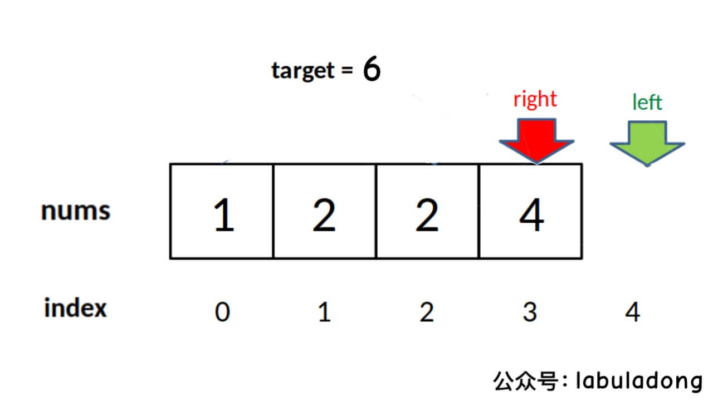
            */
            return -1;
        }
        return left;
    }

    int right_bound(vector<int>& nums, int target) {
        int left = 0, right = nums.size() - 1;
        while (left <= right) {
            int mid = left + (right - left) / 2;
            if (nums[mid] < target) {
                left = mid + 1;
            } else if (nums[mid] > target) {
                right = mid - 1;
            } else if (nums[mid] == target) {
                // 这里改成收缩左侧边界即可
                left = mid + 1;
            }
        }
        // 这里改为检查 right 越界的情况，见下图
        if (right < 0 || nums[right] != target) {
            /* <extend up -300>
            
            */
            return -1;
        }
        return right;
    }
};
```

```go
// by chatGPT (go)
func searchRange(nums []int, target int) []int {
    return []int{leftBound(nums, target), rightBound(nums, target)}
}

func leftBound(nums []int, target int) int {
    left, right := 0, len(nums)-1
    // 搜索区间为 [left, right]
    for left <= right {
        mid := left + (right-left)/2
        if nums[mid] < target {
            // 搜索区间变为 [mid+1, right]
            left = mid + 1
        } else if nums[mid] > target {
            // 搜索区间变为 [left, mid-1]
            right = mid - 1
        } else if nums[mid] == target {
            // 收缩右侧边界
            right = mid - 1
        }
    }
    // 检查出界情况
    if left >= len(nums) || nums[left] != target {
        /**<extend up -300>
        
        */
        return -1
    }
    return left
}

func rightBound(nums []int, target int) int {
    left, right := 0, len(nums)-1
    for left <= right {
        mid := left + (right-left)/2
        if nums[mid] < target {
            left = mid + 1
        } else if nums[mid] > target {
            right = mid - 1
        } else if nums[mid] == target {
            // 这里改成收缩左侧边界即可
            left = mid + 1
        }
    }
    // 这里改为检查 right 越界的情况，见下图
    if right < 0 || nums[right] != target {
        /**<extend up -300>
        
        */
        return -1
    }
    return right
}
```

```java
// by labuladong (java)
class Solution {
    public int[] searchRange(int[] nums, int target) {
        return new int[]{left_bound(nums, target), right_bound(nums, target)};
    }

    int left_bound(int[] nums, int target) {
        int left = 0, right = nums.length - 1;
        // 搜索区间为 [left, right]
        while (left <= right) {
            int mid = left + (right - left) / 2;
            if (nums[mid] < target) {
                // 搜索区间变为 [mid+1, right]
                left = mid + 1;
            } else if (nums[mid] > target) {
                // 搜索区间变为 [left, mid-1]
                right = mid - 1;
            } else if (nums[mid] == target) {
                // 收缩右侧边界
                right = mid - 1;
            }
        }
        // 检查出界情况
        if (left >= nums.length || nums[left] != target) {
            /**<extend up -300>
            
            */
            return -1;
        }
        return left;
    }

    int right_bound(int[] nums, int target) {
        int left = 0, right = nums.length - 1;
        while (left <= right) {
            int mid = left + (right - left) / 2;
            if (nums[mid] < target) {
                left = mid + 1;
            } else if (nums[mid] > target) {
                right = mid - 1;
            } else if (nums[mid] == target) {
                // 这里改成收缩左侧边界即可
                left = mid + 1;
            }
        }
        // 这里改为检查 right 越界的情况，见下图
        if (right < 0 || nums[right] != target) {
            /**<extend up -300>
            
            */
            return -1;
        }
        return right;
    }
}
```

```javascript
// by chatGPT (javascript)
var searchRange = function(nums, target) {
  return [left_bound(nums, target), right_bound(nums, target)];
};

var left_bound = function(nums, target) {
  let left = 0,
    right = nums.length - 1;
  // 搜索区间为 [left, right]
  while (left <= right) {
    let mid = left + Math.floor((right - left) / 2);
    if (nums[mid] < target) {
      // 搜索区间变为 [mid+1, right]
      left = mid + 1;
    } else if (nums[mid] > target) {
      // 搜索区间变为 [left, mid-1]
      right = mid - 1;
    } else if (nums[mid] === target) {
      // 收缩右侧边界
      right = mid - 1;
    }
  }
  // 检查出界情况
  if (left >= nums.length || nums[left] !== target) {
    /**<extend up -300>
    
    */
    return -1;
  }
  return left;
};

var right_bound = function(nums, target) {
  let left = 0,right = nums.length - 1;
  while (left <= right) {
    let mid = left + Math.floor((right - left) / 2);
    if (nums[mid] < target) {
      left = mid + 1;
    } else if (nums[mid] > target) {
      right = mid - 1;
    } else if (nums[mid] === target) {
      // 这里改成收缩左侧边界即可
      left = mid + 1;
    }
  }
  // 这里改为检查 right 越界的情况，见下图
  if (right < 0 || nums[right] !== target) {
    /**<extend up -300>
    
    */
    return -1;
  }
  return right;
};
```

```python
# by chatGPT (python)
class Solution:
    def searchRange(self, nums: List[int], target: int) -> List[int]:
        return [self.left_bound(nums, target), self.right_bound(nums, target)]
    
    def left_bound(self, nums: List[int], target: int) -> int:
        left, right = 0, len(nums) - 1
        # 搜索区间为 [left, right]
        while left <= right:
            mid = left + (right - left) // 2
            if nums[mid] < target:
                # 搜索区间变为 [mid+1, right]
                left = mid + 1
            elif nums[mid] > target:
                # 搜索区间变为 [left, mid-1]
                right = mid - 1
            elif nums[mid] == target:
                # 收缩右侧边界
                right = mid - 1
        # 检查出界情况
        if left >= len(nums) or nums[left] != target:
            """
            <extend up -300>
            
            """f
            return -1
        return left
    
    def right_bound(self, nums: List[int], target: int) -> int:
        left, right = 0, len(nums) - 1
        while left <= right:
            mid = left + (right - left) // 2
            if nums[mid] < target:
                left = mid + 1
            elif nums[mid] > target:
                right = mid - 1
            elif nums[mid] == target:
                # 这里改成收缩左侧边界即可
                left = mid + 1
        # 这里改为检查 right 越界的情况，见下图
        if right < 0 or nums[right] != target:
            '''
            <extend up -300>
            
            '''
            return -1
        return right
```

https://leetcode.cn/problems/find-first-and-last-position-of-element-in-sorted-array 的多语言解法👆

https://leetcode.cn/problems/find-k-closest-elements 的多语言解法👇

```cpp
// by chatGPT (cpp)
class Solution {
public:
    vector<int> findClosestElements(vector<int>& arr, int k, int x) {
        // 二分搜索找到 x 的位置
        int p = left_bound(arr, x);
        // 两端都开的区间 (left, right)
        int left = p - 1, right = p;
        vector<int> res;
        // 扩展区间，直到区间内包含 k 个元素
        while (right - left - 1 < k) {
            if (left == -1) {
                res.push_back(arr[right]);
                right++;
            } else if (right == arr.size()) {
                res.insert(res.begin(), arr[left]);
                left--;
            } else if (x - arr[left] > arr[right] - x) {
                res.push_back(arr[right]);
                right++;
            } else {
                res.insert(res.begin(), arr[left]);
                left--;
            }
        }
        return res;
    }

    // 搜索左侧边界的二分搜索
    int left_bound(vector<int>& nums, int target) {
        int left = 0;
        int right = nums.size();

        while (left < right) {
            int mid = left + (right - left) / 2;
            if (nums[mid] == target) {
                right = mid;
            } else if (nums[mid] < target) {
                left = mid + 1;
            } else if (nums[mid] > target) {
                right = mid;
            }
        }
        return left;
    }
};
```

```go
// by chatGPT (go)
func findClosestElements(arr []int, k int, x int) []int {
    // 二分搜索找到 x 的位置
    p := left_bound(arr, x)
    // 两端都开的区间 (left, right)
    left, right := p-1, p
    res := make([]int, 0)
    // 扩展区间，直到区间内包含 k 个元素
    for right-left-1 < k {
        if left == -1 {
            res = append(res, arr[right])
            right++
        } else if right == len(arr) {
            res = append([]int{arr[left]}, res...)
            left--
        } else if x-arr[left] > arr[right]-x {
            res = append(res, arr[right])
            right++
        } else {
            res = append([]int{arr[left]}, res...)
            left--
        }
    }
    return res
}

// 搜索左侧边界的二分搜索
func left_bound(nums []int, target int) int {
    left := 0
    right := len(nums)

    for left < right {
        mid := left + (right-left)/2
        if nums[mid] == target {
            right = mid
        } else if nums[mid] < target {
            left = mid + 1
        } else if nums[mid] > target {
            right = mid
        }
    }
    return left
}
```

```java
// by labuladong (java)
class Solution {
    public List<Integer> findClosestElements(int[] arr, int k, int x) {
        // 二分搜索找到 x 的位置
        int p = left_bound(arr, x);
        // 两端都开的区间 (left, right)
        int left = p - 1, right = p;
        LinkedList<Integer> res = new LinkedList<>();
        // 扩展区间，直到区间内包含 k 个元素
        while (right - left - 1 < k) {
            if (left == -1) {
                res.addLast(arr[right]);
                right++;
            } else if (right == arr.length) {
                res.addFirst(arr[left]);
                left--;
            } else if (x - arr[left] > arr[right] - x) {
                res.addLast(arr[right]);
                right++;
            } else {
                res.addFirst(arr[left]);
                left--;
            }
        }
        return res;
    }

    // 搜索左侧边界的二分搜索
    int left_bound(int[] nums, int target) {
        int left = 0;
        int right = nums.length;

        while (left < right) {
            int mid = left + (right - left) / 2;
            if (nums[mid] == target) {
                right = mid;
            } else if (nums[mid] < target) {
                left = mid + 1;
            } else if (nums[mid] > target) {
                right = mid;
            }
        }
        return left;
    }
}
```

```javascript
// by chatGPT (javascript)
var findClosestElements = function(arr, k, x) {
    // 二分搜索找到 x 的位置
    let p = left_bound(arr, x);
    // 两端都开的区间 (left, right)
    let left = p - 1, right = p;
    let res = [];
    // 扩展区间，直到区间内包含 k 个元素
    while (right - left - 1 < k) {
        if (left == -1) {
            res.push(arr[right]);
            right++;
        } else if (right == arr.length) {
            res.unshift(arr[left]);
            left--;
        } else if (x - arr[left] > arr[right] - x) {
            res.push(arr[right]);
            right++;
        } else {
            res.unshift(arr[left]);
            left--;
        }
    }
    return res;
};

// 搜索左侧边界的二分搜索
var left_bound = function(nums, target) {
    let left = 0;
    let right = nums.length;

    while (left < right) {
        let mid = left + Math.floor((right - left) / 2);
        if (nums[mid] == target) {
            right = mid;
        } else if (nums[mid] < target) {
            left = mid + 1;
        } else if (nums[mid] > target) {
            right = mid;
        }
    }
    return left;
};
```

```python
# by chatGPT (python)
class Solution:
    def findClosestElements(self, arr: List[int], k: int, x: int) -> List[int]:
        # 二分搜索找到 x 的位置
        p = self.left_bound(arr, x)
        # 两端都开的区间 (left, right)
        left, right = p - 1, p
        res = []
        # 扩展区间，直到区间内包含 k 个元素
        while right - left - 1 < k:
            if left == -1:
                res.append(arr[right])
                right += 1
            elif right == len(arr):
                res.insert(0, arr[left])
                left -= 1
            elif x - arr[left] > arr[right] - x:
                res.append(arr[right])
                right += 1
            else:
                res.insert(0, arr[left])
                left -= 1
        return res

    # 搜索左侧边界的二分搜索
    def left_bound(self, nums: List[int], target: int) -> int:
        left, right = 0, len(nums)

        while left < right:
            mid = left + (right - left) // 2
            if nums[mid] == target:
                right = mid
            elif nums[mid] < target:
                left = mid + 1
            elif nums[mid] > target:
                right = mid
        return left
```

https://leetcode.cn/problems/find-k-closest-elements 的多语言解法👆

https://leetcode.cn/problems/find-k-pairs-with-smallest-sums 的多语言解法👇

```cpp
// by chatGPT (cpp)
class Solution {
public:
    vector<vector<int>> kSmallestPairs(vector<int>& nums1, vector<int>& nums2, int k) {
        // 存储三元组 (num1[i], nums2[i], i)
        // i 记录 nums2 元素的索引位置，用于生成下一个节点
        priority_queue<vector<int>, vector<vector<int>>, greater<vector<int>>> pq([](const vector<int>& a, const vector<int>& b) {
            // 按照数对的元素和升序排序
            return a[0] + a[1] < b[0] + b[1];
        });
        // 按照 23 题的逻辑初始化优先级队列
        for (int i = 0; i < nums1.size(); i++) {
            pq.push({nums1[i], nums2[0], 0});
        }

        vector<vector<int>> res;
        // 执行合并多个有序链表的逻辑
        while (!pq.empty() && k > 0) {
            auto cur = pq.top();
            pq.pop();
            k--;
            // 链表中的下一个节点加入优先级队列
            int next_index = cur[2] + 1;
            if (next_index < nums2.size()) {
                pq.push({cur[0], nums2[next_index], next_index});
            }

            vector<int> pair = {cur[0], cur[1]};
            res.push_back(pair);
        }
        return res;
    }
};
```

```go
// by chatGPT (go)
func kSmallestPairs(nums1 []int, nums2 []int, k int) [][]int {
    // 存储三元组 (num1[i], nums2[i], i)
    // i 记录 nums2 元素的索引位置，用于生成下一个节点
    pq := make(PriorityQueue, 0)
    heap.Init(&pq)
    // 按照 23 题的逻辑初始化优先级队列
    for i := 0; i < len(nums1); i++ {
        pq.Push([]int{nums1[i], nums2[0], 0})
    }

    res := make([][]int, 0)
    // 执行合并多个有序链表的逻辑
    for pq.Len() > 0 && k > 0 {
        cur := pq.Pop().([]int)
        k--
        // 链表中的下一个节点加入优先级队列
        next_index := cur[2] + 1
        if next_index < len(nums2) {
            pq.Push([]int{cur[0], nums2[next_index], next_index})
        }

        pair := []int{cur[0], cur[1]}
        res = append(res, pair)
    }
    return res
}

type PriorityQueue [][]int

func (pq PriorityQueue) Len() int { return len(pq) }

func (pq PriorityQueue) Less(i, j int) bool {
    return pq[i][0]+pq[i][1] < pq[j][0]+pq[j][1]
}

func (pq PriorityQueue) Swap(i, j int) {
    pq[i], pq[j] = pq[j], pq[i]
}

func (pq *PriorityQueue) Push(x interface{}) {
    *pq = append(*pq, x.([]int))
}

func (pq *PriorityQueue) Pop() interface{} {
    old := *pq
    n := len(old)
    item := old[n-1]
    *pq = old[0 : n-1]
    return item
}
```

```java
// by labuladong (java)
class Solution {
    public List<List<Integer>> kSmallestPairs(int[] nums1, int[] nums2, int k) {
        // 存储三元组 (num1[i], nums2[i], i)
        // i 记录 nums2 元素的索引位置，用于生成下一个节点
        PriorityQueue<int[]> pq = new PriorityQueue<>((a, b) -> {
            // 按照数对的元素和升序排序
            return (a[0] + a[1]) - (b[0] + b[1]);
        });
        // 按照 23 题的逻辑初始化优先级队列
        for (int i = 0; i < nums1.length; i++) {
            pq.offer(new int[]{nums1[i], nums2[0], 0});
        }

        List<List<Integer>> res = new ArrayList<>();
        // 执行合并多个有序链表的逻辑
        while (!pq.isEmpty() && k > 0) {
            int[] cur = pq.poll();
            k--;
            // 链表中的下一个节点加入优先级队列
            int next_index = cur[2] + 1;
            if (next_index < nums2.length) {
                pq.add(new int[]{cur[0], nums2[next_index], next_index});
            }

            List<Integer> pair = new ArrayList<>();
            pair.add(cur[0]);
            pair.add(cur[1]);
            res.add(pair);
        }
        return res;
    }
}
```

```javascript
// by chatGPT (javascript)
var kSmallestPairs = function(nums1, nums2, k) {
    // 存储三元组 (num1[i], nums2[i], i)
    // i 记录 nums2 元素的索引位置，用于生成下一个节点
    const pq = new PriorityQueue((a, b) => {
        // 按照数对的元素和升序排序
        return (a[0] + a[1]) - (b[0] + b[1]);
    });
    // 按照 23 题的逻辑初始化优先级队列
    for (let i = 0; i < nums1.length; i++) {
        pq.offer([nums1[i], nums2[0], 0]);
    }

    const res = [];
    // 执行合并多个有序链表的逻辑
    while (!pq.isEmpty() && k > 0) {
        const cur = pq.poll();
        k--;
        // 链表中的下一个节点加入优先级队列
        const next_index = cur[2] + 1;
        if (next_index < nums2.length) {
            pq.add([cur[0], nums2[next_index], next_index]);
        }

        const pair = [cur[0], cur[1]];
        res.push(pair);
    }
    return res;
};

// 优先级队列的实现，用于存储三元组
class PriorityQueue {
    constructor(comparator) {
        this.heap = [];
        this.comparator = comparator;
    }

    isEmpty() {
        return this.heap.length === 0;
    }

    size() {
        return this.heap.length;
    }

    peek() {
        return this.heap[0];
    }

    offer(value) {
        this.heap.push(value);
        this.bubbleUp(this.heap.length - 1);
    }

    poll() {
        const result = this.heap[0];
        const end = this.heap.pop();
        if (this.heap.length > 0) {
            this.heap[0] = end;
            this.bubbleDown(0);
        }
        return result;
    }

    bubbleUp(index) {
        while (index > 0) {
            const parentIndex = (index - 1) >> 1;
            if (this.comparator(this.heap[index], this.heap[parentIndex]) < 0) {
                const tmp = this.heap[index];
                this.heap[index] = this.heap[parentIndex];
                this.heap[parentIndex] = tmp;
                index = parentIndex;
            } else {
                break;
            }
        }
    }

    bubbleDown(index) {
        const lastIndex = this.heap.length - 1;
        while (STATUS_PASSED_TEST) {
            const leftIndex = index * 2 + 1;
            const rightIndex = index * 2 + 2;
            let findIndex = index;
            if (leftIndex <= lastIndex && this.comparator(this.heap[leftIndex], this.heap[findIndex]) < 0) {
                findIndex = leftIndex;
            }
            if (rightIndex <= lastIndex && this.comparator(this.heap[rightIndex], this.heap[findIndex]) < 0) {
                findIndex = rightIndex;
            }
            if (index !== findIndex) {
                const tmp = this.heap[index];
                this.heap[index] = this.heap[findIndex];
                this.heap[findIndex] = tmp;
                index = findIndex;
            } else {
                break;
            }
        }
    }
}
```

```python
# by chatGPT (python)
import heapq

class Solution:
    def kSmallestPairs(self, nums1: List[int], nums2: List[int], k: int) -> List[List[int]]:
        # 存储三元组 (num1[i], nums2[i], i)
        # i 记录 nums2 元素的索引位置，用于生成下一个节点
        pq = []
        for i in range(len(nums1)):
            heapq.heappush(pq, [nums1[i], nums2[0], 0])
            
        res = []
        # 执行合并多个有序链表的逻辑
        while pq and k > 0:
            cur = heapq.heappop(pq)
            k -= 1
            # 链表中的下一个节点加入优先级队列
            next_index = cur[2] + 1
            if next_index < len(nums2):
                heapq.heappush(pq, [cur[0], nums2[next_index], next_index])
            
            pair = [cur[0], cur[1]]
            res.append(pair)
        
        return res
```

https://leetcode.cn/problems/find-k-pairs-with-smallest-sums 的多语言解法👆

https://leetcode.cn/problems/find-median-from-data-stream 的多语言解法👇

```cpp
// by chatGPT (cpp)
class MedianFinder {
private:
    priority_queue<int> large;  // 小顶堆
    priority_queue<int, vector<int>, greater<int>> small;  // 大顶堆

public:
    /** initialize your data structure here. */
    MedianFinder() {
        
    }
    
    void addNum(int num) {
        if (small.size() >= large.size()) {
            small.push(num);
            large.push(small.top());
            small.pop();
        } else {
            large.push(num);
            small.push(large.top());
            large.pop();
        }
    }
    
    double findMedian() {
        /**<extend up -100>
        
        */
        // 如果元素不一样多，多的那个堆的堆顶元素就是中位数
        if (large.size() < small.size()) {
            return small.top();
        } else if (large.size() > small.size()) {
            return large.top();
        }
        // 如果元素一样多，两个堆堆顶元素的平均数是中位数
        return (large.top() + small.top()) / 2.0;
        /**<extend up -100>
        
        */
    }
};
```

```go
// by chatGPT (go)
import "container/heap"

type MedianFinder struct {
    large *PriorityQueue
    small *PriorityQueue
}

// 小顶堆
type PriorityQueue []int

func (pq PriorityQueue) Len() int {
    return len(pq)
}

func (pq PriorityQueue) Less(i, j int) bool {
    return pq[i] < pq[j]
}

func (pq PriorityQueue) Swap(i, j int) {
    pq[i], pq[j] = pq[j], pq[i]
}

func (pq *PriorityQueue) Push(x interface{}) {
    *pq = append(*pq, x.(int))
}

func (pq *PriorityQueue) Pop() interface{} {
    old := *pq
    n := len(old)
    x := old[n-1]
    *pq = old[:n-1]
    return x
}

// 大顶堆
type ReversePriorityQueue []int

func (rpq ReversePriorityQueue) Len() int {
    return len(rpq)
}

func (rpq ReversePriorityQueue) Less(i, j int) bool {
    return rpq[i] > rpq[j]
}

func (rpq ReversePriorityQueue) Swap(i, j int) {
    rpq[i], rpq[j] = rpq[j], rpq[i]
}

func (rpq *ReversePriorityQueue) Push(x interface{}) {
    *rpq = append(*rpq, x.(int))
}

func (rpq *ReversePriorityQueue) Pop() interface{} {
    old := *rpq
    n := len(old)
    x := old[n-1]
    *rpq = old[:n-1]
    return x
}

func Constructor() MedianFinder {
    // 小顶堆
    large := &PriorityQueue{}
    // 大顶堆
    small := &ReversePriorityQueue{}

    return MedianFinder{
        large: large,
        small: small,
    }
}

func (this *MedianFinder) FindMedian() float64 {
    // 如果元素不一样多，多的那个堆的堆顶元素就是中位数
    if this.large.Len() < this.small.Len() {
        return float64(this.small.Top())
    } else if this.large.Len() > this.small.Len() {
        return float64(this.large.Top())
    }
    // 如果元素一样多，两个堆堆顶元素的平均数是中位数
    return (float64(this.large.Top()) + float64(this.small.Top())) / 2.0
}

func (this *MedianFinder) AddNum(num int) {
    if this.small.Len() >= this.large.Len() {
        this.small.Push(num)
        heap.Push(this.large, this.small.Pop())
    } else {
        this.large.Push(num)
        heap.Push(this.small, this.large.Pop())
    }
}

// 返回堆顶元素
func (pq *PriorityQueue) Top() int {
    return (*pq)[0]
}

// 返回堆顶元素
func (rpq *ReversePriorityQueue) Top() int {
    return (*rpq)[0]
}
```

```java
// by labuladong (java)
class MedianFinder {
    private PriorityQueue<Integer> large;
    private PriorityQueue<Integer> small;

    public MedianFinder() {
        // 小顶堆
        large = new PriorityQueue<>();
        // 大顶堆
        small = new PriorityQueue<>((a, b) -> {
            return b - a;
        });
    }

    public double findMedian() {
        /**<extend up -100>
        
        */
        // 如果元素不一样多，多的那个堆的堆顶元素就是中位数
        if (large.size() < small.size()) {
            return small.peek();
        } else if (large.size() > small.size()) {
            return large.peek();
        }
        // 如果元素一样多，两个堆堆顶元素的平均数是中位数
        return (large.peek() + small.peek()) / 2.0;
        /**<extend up -100>
        
        */
    }

    public void addNum(int num) {
        if (small.size() >= large.size()) {
            small.offer(num);
            large.offer(small.poll());
        } else {
            large.offer(num);
            small.offer(large.poll());
        }
    }
}
```

```javascript
// by chatGPT (javascript)
var MedianFinder = function() {
    // 小顶堆
    var large = new PriorityQueue();
    // 大顶堆
    var small = new PriorityQueue(function(a, b) {
        return b - a;
    });

    this.findMedian = function() {
        // 如果元素不一样多，多的那个堆的堆顶元素就是中位数
        if (large.size() < small.size()) {
            return small.peek();
        } else if (large.size() > small.size()) {
            return large.peek();
        }
        // 如果元素一样多，两个堆堆顶元素的平均数是中位数
        return (large.peek() + small.peek()) / 2.0;
    };

    this.addNum = function(num) {
        if (small.size() >= large.size()) {
            small.offer(num);
            large.offer(small.poll());
        } else {
            large.offer(num);
            small.offer(large.poll());
        }
    };
};
```

```python
# by chatGPT (python)
class MedianFinder:
    def __init__(self):
        # 小顶堆
        self.large = []
        # 大顶堆
        self.small = []

    def findMedian(self) -> float:
        # 如果元素不一样多，多的那个堆的堆顶元素就是中位数
        if len(self.large) < len(self.small):
            return float(self.small[0])
        elif len(self.large) > len(self.small):
            return float(self.large[0])
        # 如果元素一样多，两个堆堆顶元素的平均数是中位数
        return (self.large[0] + self.small[0]) / 2.0

    def addNum(self, num: int) -> None:
        if len(self.small) >= len(self.large):
            self.small.append(num)
            self.large.append(-heapq.heappushpop(self.small, -self.large[0]))
        else:
            self.large.append(num)
            self.small.append(-heapq.heappushpop(self.large, -self.small[0]))
```

https://leetcode.cn/problems/find-median-from-data-stream 的多语言解法👆

https://leetcode.cn/problems/find-mode-in-binary-search-tree 的多语言解法👇

```cpp
// by chatGPT (cpp)
class Solution {
public:
    vector<int> mode;
    TreeNode* prev = nullptr;
    // 当前元素的重复次数
    int curCount = 0;
    // 全局的最长相同序列长度
    int maxCount = 0;

    vector<int> findMode(TreeNode* root) {
        // 执行中序遍历
        traverse(root);

        vector<int> res(mode.size());
        for (int i = 0; i < res.size(); i++) {
            res[i] = mode[i];
        }
        return res;
    }

    void traverse(TreeNode* root) {
        if (root == nullptr) {
            return;
        }
        traverse(root->left);

        // 中序遍历位置
        if (prev == nullptr) {
            // 初始化
            curCount = 1;
            maxCount = 1;
            mode.push_back(root->val);
        } else {
            if (root->val == prev->val) {
                // root.val 重复的情况
                curCount++;
                if (curCount == maxCount) {
                    // root.val 是众数
                    mode.push_back(root->val);
                } else if (curCount > maxCount) {
                    // 更新众数
                    mode.clear();
                    maxCount = curCount;
                    mode.push_back(root->val);
                }
            }

            if (root->val != prev->val) {
                // root.val 不重复的情况
                curCount = 1;
                if (curCount == maxCount) {
                    mode.push_back(root->val);
                }
            }
        }
        // 别忘了更新 prev
        prev = root;

        traverse(root->right);
    }
};
```

```go
// by chatGPT (go)
func findMode(root *TreeNode) []int {
    var mode []int
    var prev *TreeNode
    var curCount, maxCount int

    traverse := func(node *TreeNode) {
        if node == nil {
            return
        }
        traverse(node.Left)

        // 中序遍历位置
        if prev == nil {
            // 初始化
            curCount = 1
            maxCount = 1
            mode = append(mode, node.Val)
        } else {
            if node.Val == prev.Val {
                // node.Val 重复的情况
                curCount++
                if curCount == maxCount {
                    // node.Val 是众数
                    mode = append(mode, node.Val)
                } else if curCount > maxCount {
                    // 更新众数
                    mode = make([]int, 0)
                    maxCount = curCount
                    mode = append(mode, node.Val)
                }
            }

            if node.Val != prev.Val {
                // node.Val 不重复的情况
                curCount = 1
                if curCount == maxCount {
                    mode = append(mode, node.Val)
                }
            }
        }
        // 别忘了更新 prev
        prev = node

        traverse(node.Right)
    }

    traverse(root)

    return mode
}
```

```java
// by labuladong (java)
class Solution {
    ArrayList<Integer> mode = new ArrayList<>();
    TreeNode prev = null;
    // 当前元素的重复次数
    int curCount = 0;
    // 全局的最长相同序列长度
    int maxCount = 0;

    public int[] findMode(TreeNode root) {
        // 执行中序遍历
        traverse(root);

        int[] res = new int[mode.size()];
        for (int i = 0; i < res.length; i++) {
            res[i] = mode.get(i);
        }
        return res;
    }

    void traverse(TreeNode root) {
        if (root == null) {
            return;
        }
        traverse(root.left);

        // 中序遍历位置
        if (prev == null) {
            // 初始化
            curCount = 1;
            maxCount = 1;
            mode.add(root.val);
        } else {
            if (root.val == prev.val) {
                // root.val 重复的情况
                curCount++;
                if (curCount == maxCount) {
                    // root.val 是众数
                    mode.add(root.val);
                } else if (curCount > maxCount) {
                    // 更新众数
                    mode.clear();
                    maxCount = curCount;
                    mode.add(root.val);
                }
            }

            if (root.val != prev.val) {
                // root.val 不重复的情况
                curCount = 1;
                if (curCount == maxCount) {
                    mode.add(root.val);
                }
            }
        }
        // 别忘了更新 prev
        prev = root;

        traverse(root.right);
    }
}
```

```javascript
// by chatGPT (javascript)
var findMode = function(root) {
    let mode = [];
    let prev = null;
    // 当前元素的重复次数
    let curCount = 0;
    // 全局的最长相同序列长度
    let maxCount = 0;

    function traverse(root) {
        if (root === null) {
            return;
        }
        traverse(root.left);

        // 中序遍历位置
        if (prev === null) {
            // 初始化
            curCount = 1;
            maxCount = 1;
            mode.push(root.val);
        } else {
            if (root.val === prev.val) {
                // root.val 重复的情况
                curCount++;
                if (curCount === maxCount) {
                    // root.val 是众数
                    mode.push(root.val);
                } else if (curCount > maxCount) {
                    // 更新众数
                    mode = [root.val];
                    maxCount = curCount;
                }
            }

            if (root.val !== prev.val) {
                // root.val 不重复的情况
                curCount = 1;
                if (curCount === maxCount) {
                    mode.push(root.val);
                }
            }
        }
        // 别忘了更新 prev
        prev = root;

        traverse(root.right);
    }

    traverse(root);

    return mode;
};
```

```python
# by chatGPT (python)
class Solution:
    def __init__(self):
        self.mode = []
        self.prev = None
        # 当前元素的重复次数
        self.curCount = 0
        # 全局的最长相同序列长度
        self.maxCount = 0
    
    def findMode(self, root: TreeNode) -> List[int]:
        # 执行中序遍历
        self.traverse(root)

        return self.mode
    
    def traverse(self, root: TreeNode) -> None:
        if not root:
            return
        self.traverse(root.left)

        # 中序遍历位置
        if not self.prev:
            # 初始化
            self.curCount = 1
            self.maxCount = 1
            self.mode.append(root.val)
        else:
            if root.val == self.prev.val:
                # root.val 重复的情况
                self.curCount += 1
                if self.curCount == self.maxCount:
                    # root.val 是众数
                    self.mode.append(root.val)
                elif self.curCount > self.maxCount:
                    # 更新众数
                    self.mode.clear()
                    self.maxCount = self.curCount
                    self.mode.append(root.val)

            if root.val != self.prev.val:
                # root.val 不重复的情况
                self.curCount = 1
                if self.curCount == self.maxCount:
                    self.mode.append(root.val)

        # 别忘了更新 prev
        self.prev = root
        self.traverse(root.right)
```

https://leetcode.cn/problems/find-mode-in-binary-search-tree 的多语言解法👆

https://leetcode.cn/problems/first-unique-character-in-a-string 的多语言解法👇

```cpp
// by chatGPT (cpp)
class Solution {
public:
    int firstUniqChar(string s) {
        int count[26] = {0};
        for (char c : s) {
            // 将字符转化成数字
            count[c - 'a']++;
        }
        for (int i = 0; i < s.length(); i++) {
            char c = s[i];
            if (count[c - 'a'] == 1) {
                // 第一个出现一次的字符
                return i;
            }
        }
        return -1;
    }
};
```

```go
// by chatGPT (go)
func firstUniqChar(s string) int {
    // 创建一个大小为26的整数数组count
    count := make([]int, 26)
    // 遍历字符串s的每一个字符
    for _, c := range s {
        // 将字符转化成数字
        count[c-'a']++
    }
    // 遍历字符串s的每一个字符
    for i, c := range s {
        // 找到第一个出现一次的字符
        if count[c-'a'] == 1 {
            return i
        }
    }
    // 没有出现一次的字符
    return -1
}
```

```java
// by labuladong (java)
class Solution {
    public int firstUniqChar(String s) {
        int[] count = new int[26];
        for (char c : s.toCharArray()) {
            // 将字符转化成数字
            count[c - 'a']++;
        }
        for (int i = 0; i < s.length(); i++) {
            char c = s.charAt(i);
            if (count[c - 'a'] == 1) {
                // 第一个出现一次的字符
                return i;
            }
        }
        return -1;
    }
}
```

```javascript
// by chatGPT (javascript)
var firstUniqChar = function(s) {
    let count = new Array(26).fill(0);
    for (let i = 0; i < s.length; i++) {
        // 将字符转化成数字
        count[s.charCodeAt(i) - 97]++;
    }
    for (let i = 0; i < s.length; i++) {
        if (count[s.charCodeAt(i) - 97] === 1) {
            // 第一个出现一次的字符
            return i;
        }
    }
    return -1;
}
```

```python
# by chatGPT (python)
class Solution:
    def firstUniqChar(self, s: str) -> int:
        count = [0]*26
        for c in s:
            # 将字符转化成数字
            count[ord(c) - ord('a')] += 1
        for i in range(len(s)):
            c = s[i]
            if count[ord(c) - ord('a')] == 1:
                # 第一个出现一次的字符
                return i
        return -1
```

https://leetcode.cn/problems/first-unique-character-in-a-string 的多语言解法👆

https://leetcode.cn/problems/flatten-binary-tree-to-linked-list 的多语言解法👇

```cpp
// by chatGPT (cpp)
class Solution {
public:
    // 定义：将以 root 为根的树拉平为链表
    void flatten(TreeNode* root) {
        // base case
        if (root == nullptr) return;
        // 先递归拉平左右子树
        flatten(root->left);
        flatten(root->right);

        /****后序遍历位置****/
        // 1、左右子树已经被拉平成一条链表
        TreeNode* left = root->left;
        TreeNode* right = root->right;

        // 2、将左子树作为右子树
        root->left = nullptr;
        root->right = left;

        // 3、将原先的右子树接到当前右子树的末端
        TreeNode* p = root;
        while (p->right != nullptr) {
            p = p->right;
        }
        p->right = right;
        /**<extend up -50>
        
        */
    }
};
```

```go
// by chatGPT (go)
// 定义一个 TreeNode 结构体

// 定义解题函数
func flatten(root *TreeNode)  {
    // base case
    if root == nil {
        return
    }
    // 先递归拉平左右子树
    flatten(root.Left)
    flatten(root.Right)

    /****后序遍历位置****/
    // 1、左右子树已经被拉平成一条链表
    left := root.Left
    right := root.Right

    // 2、将左子树作为右子树
    root.Left = nil
    root.Right = left

    // 3、将原先的右子树接到当前右子树的末端
    p := root
    for p.Right != nil {
        p = p.Right
    }
    p.Right = right
}
```

```java
// by labuladong (java)
class Solution {
    // 定义：将以 root 为根的树拉平为链表
    public void flatten(TreeNode root) {
        // base case
        if (root == null) return;
        // 先递归拉平左右子树
        flatten(root.left);
        flatten(root.right);

        /****后序遍历位置****/
        // 1、左右子树已经被拉平成一条链表
        TreeNode left = root.left;
        TreeNode right = root.right;

        // 2、将左子树作为右子树
        root.left = null;
        root.right = left;

        // 3、将原先的右子树接到当前右子树的末端
        TreeNode p = root;
        while (p.right != null) {
            p = p.right;
        }
        p.right = right;
        /**<extend up -50>
        
        */
    }
}
```

```javascript
// by chatGPT (javascript)
/**
 * @param {TreeNode} root
 * @return {void} Do not return anything, modify root in-place instead.
 */
var flatten = function(root) {
    // base case
    if (root == null) return;
    // 先递归拉平左右子树
    flatten(root.left);
    flatten(root.right);

    /****后序遍历位置****/
    // 1、左右子树已经被拉平成一条链表
    var left = root.left;
    var right = root.right;

    // 2、将左子树作为右子树
    root.left = null;
    root.right = left;

    // 3、将原先的右子树接到当前右子树的末端
    var p = root;
    while (p.right != null) {
        p = p.right;
    }
    p.right = right;
};
```

```python
# by chatGPT (python)
class Solution:
    def flatten(self, root: TreeNode) -> None:
        """
        Do not return anything, modify root in-place instead.
        """
        # base case
        if not root:
            return
        
        # 先递归拉平左右子树
        self.flatten(root.left)
        self.flatten(root.right)
        
        # 后序遍历位置
        # 1、左右子树已经被拉平成一条链表
        left = root.left
        right = root.right
        
        # 2、将左子树作为右子树
        root.left = None
        root.right = left
        
        # 3、将原先的右子树接到当前右子树的末端
        p = root
        while p.right:
            p = p.right
        p.right = right
```

https://leetcode.cn/problems/flatten-binary-tree-to-linked-list 的多语言解法👆

https://leetcode.cn/problems/flatten-nested-list-iterator 的多语言解法👇

```cpp
// by chatGPT (cpp)
class NestedIterator {
private:
    std::deque<NestedInteger> list;

public:
    NestedIterator(std::vector<NestedInteger> &nestedList) {
        // 不直接用 nestedList 的引用，是因为不能确定它的底层实现
        // 必须保证是 deque，否则下面的 push_front 会很低效
        list = std::deque<NestedInteger>(nestedList.begin(), nestedList.end());
    }

    int next() {
        // hasNext 方法保证了第一个元素一定是整数类型
        int val = list.front().getInteger();
        list.pop_front();
        return val;
    }

    bool hasNext() {
        // 循环拆分列表元素，直到列表第一个元素是整数类型
        while (!list.empty() && !list.front().isInteger()) {
            // 当列表开头第一个元素是列表类型时，进入循环
            std::vector<NestedInteger> first = list.front().getList();
            // 将第一个列表打平并按顺序添加到开头
            list.pop_front();
            for (int i = first.size() - 1; i >= 0; i--) {
                list.push_front(first[i]);
            }
        }
        return !list.empty();
    }
};
```

```go
// by chatGPT (go)
type NestedIterator struct {
    list []NestedInteger
}

func Constructor(nestedList []*NestedInteger) *NestedIterator {
    list := make([]NestedInteger, 0)
    for _, nestedInt := range nestedList {
        list = append(list, *nestedInt)
    }
    return &NestedIterator{list}
}

func (this *NestedIterator) Next() int {
    // hasNext 方法保证了第一个元素一定是整数类型
    res := this.list[0].GetInteger()
    this.list = this.list[1:]
    return res
}

func (this *NestedIterator) HasNext() bool {
    // 循环拆分列表元素，直到列表第一个元素是整数类型
    for len(this.list) > 0 && !this.list[0].IsInteger() {
        // 当列表开头第一个元素是列表类型时，进入循环
        first := this.list[0].GetList()
        this.list = this.list[1:]
        // 将第一个列表打平并按顺序添加到开头
        for i := len(first) - 1; i >= 0; i-- {
            this.list = append([]NestedInteger{first[i]}, this.list...)
        }
    }
    return len(this.list) > 0
}
```

```java
// by labuladong (java)
public class NestedIterator implements Iterator<Integer> {
    private LinkedList<NestedInteger> list;

    public NestedIterator(List<NestedInteger> nestedList) {
        // 不直接用 nestedList 的引用，是因为不能确定它的底层实现
        // 必须保证是 LinkedList，否则下面的 addFirst 会很低效
        list = new LinkedList<>(nestedList);
    }

    public Integer next() {
        // hasNext 方法保证了第一个元素一定是整数类型
        return list.remove(0).getInteger();
    }

    public boolean hasNext() {
        // 循环拆分列表元素，直到列表第一个元素是整数类型
        while (!list.isEmpty() && !list.get(0).isInteger()) {
            // 当列表开头第一个元素是列表类型时，进入循环
            List<NestedInteger> first = list.remove(0).getList();
            // 将第一个列表打平并按顺序添加到开头
            for (int i = first.size() - 1; i >= 0; i--) {
                list.addFirst(first.get(i));
            }
        }
        return !list.isEmpty();
    }
}
```

```javascript
// by chatGPT (javascript)
/**
 * @constructor
 * @param {Array<NestedInteger>} nestedList
 */
var NestedIterator = function(nestedList) {
    // 不直接用 nestedList 的引用，是因为不能确定它的底层实现
    // 必须保证是 LinkedList，否则下面的 addFirst 会很低效
    this.list = new LinkedList(nestedList);
};

/**
 * @this NestedIterator
 * @returns {number}
 */
NestedIterator.prototype.next = function() {
    // hasNext 方法保证了第一个元素一定是整数类型
    return this.list.remove(0).getInteger();
};

/**
 * @this NestedIterator
 * @returns {boolean}
 */
NestedIterator.prototype.hasNext = function() {
    // 循环拆分列表元素，直到列表第一个元素是整数类型
    while (!this.list.isEmpty() && !this.list.get(0).isInteger()) {
        // 当列表开头第一个元素是列表类型时，进入循环
        const first = this.list.remove(0).getList();
        // 将第一个列表打平并按顺序添加到开头
        for (let i = first.length - 1; i >= 0; i--) {
            this.list.addFirst(first[i]);
        }
    }
    return !this.list.isEmpty();
};
```

```python
# by chatGPT (python)
class NestedIterator:
    def __init__(self, nestedList: [NestedInteger]):
        # 不直接用 nestedList 的引用，是因为不能确定它的底层实现
        # 必须保证是 LinkedList，否则下面的 addFirst 会很低效
        self.list = deque(nestedList)

    def next(self) -> int:
        # hasNext 方法保证了第一个元素一定是整数类型
        return self.list.popleft().getInteger()

    def hasNext(self) -> bool:
        # 循环拆分列表元素，直到列表第一个元素是整数类型
        while self.list and not self.list[0].isInteger():
            # 当列表开头第一个元素是列表类型时，进入循环
            first = self.list.popleft().getList()
            # 将第一个列表打平并按顺序添加到开头
            for i in range(len(first)-1, -1, -1):
                self.list.appendleft(first[i])
        return bool(self.list)
```

https://leetcode.cn/problems/flatten-nested-list-iterator 的多语言解法👆

https://leetcode.cn/problems/flip-game 的多语言解法👇

```cpp
// by chatGPT (cpp)
class Solution {
public:
    vector<string> generatePossibleNextMoves(string currentState) {
        vector<string> res;
        for (int i = 1; i < currentState.size(); i++) {
            if (currentState[i] == '+' && currentState[i - 1] == '+') {
                // 做选择
                currentState[i] = '-';
                currentState[i - 1] = '-';
                res.push_back(currentState);
                // 撤销选择
                currentState[i] = '+';
                currentState[i - 1] = '+';
            }
        }
        return res;
    }
};
```

```go
// by chatGPT (go)
func generatePossibleNextMoves(currentState string) []string {
    res := []string{}
    arr := []rune(currentState)
    for i := 1; i < len(arr); i++ {
        if arr[i] == '+' && arr[i-1] == '+' {
            // 做选择
            arr[i] = '-'
            arr[i-1] = '-'
            res = append(res, string(arr))
            // 撤销选择
            arr[i] = '+'
            arr[i-1] = '+'
        }
    }
    return res
}
```

```java
// by labuladong (java)
class Solution {
    public List<String> generatePossibleNextMoves(String currentState) {
        List<String> res = new ArrayList<>();
        char[] arr = currentState.toCharArray();
        for (int i = 1; i < arr.length; i++) {
            if (arr[i] == '+' && arr[i - 1] == '+') {
                // 做选择
                arr[i] = '-';
                arr[i - 1] = '-';
                res.add(new String(arr));
                // 撤销选择
                arr[i] = '+';
                arr[i - 1] = '+';
            }
        }
        return res;
    }
}
```

```javascript
// by chatGPT (javascript)
var generatePossibleNextMoves = function(currentState) {
    var res = [];
    var arr = Array.from(currentState);
    for (var i = 1; i < arr.length; i++) {
        if (arr[i] === '+' && arr[i - 1] === '+') {
            // 做选择
            arr[i] = '-';
            arr[i - 1] = '-';
            res.push(arr.join(''));
            // 撤销选择
            arr[i] = '+';
            arr[i - 1] = '+';
        }
    }
    return res;
}
```

```python
# by chatGPT (python)
class Solution(object):
    def generatePossibleNextMoves(self, currentState):
        """
        :type currentState: str
        :rtype: List[str]
        """
        res = []
        for i in range(1, len(currentState)):
            if currentState[i] == '+' and currentState[i - 1] == '+':
                 # 做选择
                res.append(currentState[:i - 1] + '--' + currentState[i + 1:])
                # 撤销选择 is not needed in python due to its immutability of string
        return res
```

https://leetcode.cn/problems/flip-game 的多语言解法👆

https://leetcode.cn/problems/flip-game-ii 的多语言解法👇

```cpp
// by chatGPT (cpp)
class Solution {
public:
    // 直接把 293 的代码 copy 过来，生成所有可能的下一步
    vector<string> generatePossibleNextMoves(string currentState) {
        vector<string> res;
        for (int i = 1; i < currentState.size(); i++) {
            if (currentState[i] == '+' && currentState[i - 1] == '+') {
                // 做选择
                currentState[i] = '-';
                currentState[i - 1] = '-';
                res.push_back(currentState);
                // 撤销选择
                currentState[i] = '+';
                currentState[i - 1] = '+';
            }
        }
        return res;
    }

    // 备忘录
    unordered_map<string, bool> memo;

    bool canWin(string currentState) {
        // 记入备忘录
        memo.clear();
        return dp(currentState);
    }

    // 定义：输入字符串 s，返回在此局面下先手是否可能赢
    bool dp(string s) {
        if (memo.find(s) != memo.end()) {
            // 之前遇到过这种局面，直接返回结果
            return memo[s];
        }
        vector<string> nextStates = generatePossibleNextMoves(s);
        bool res = false;
        for (string nextState : nextStates) {
            // 只要有一个是 false，说明当前玩家赢了
            bool win = dp(nextState);
            // 后序位置，做判断
            if (!win) {
                res = true;
                break;
            }
        }
        // 记入备忘录
        memo[s] = res;
        return res;
    }
};
```

```go
// by chatGPT (go)
import "strings"

// 直接把 293 的代码 copy 过来，生成所有可能的下一步
func generatePossibleNextMoves(currentState string) []string {
    res := make([]string, 0)
    arr := []rune(currentState)
    for i := 1; i < len(arr); i++ {
        if arr[i] == '+' && arr[i-1] == '+' {
            // making a choice
            // 做选择
            arr[i] = '-'
            arr[i-1] = '-'
            res = append(res, string(arr))
            // undo choice
            // 撤销选择
            arr[i] = '+'
            arr[i-1] = '+'
        }
    }
    return res
}

func canWin(currentState string) bool {
    // Definition: Enter string s, return whether the first hand can win in this face.
    // 定义：输入字符串 s，返回在此局面下先手是否可能赢
    var dp func(string, map[string]bool) bool
    dp = func(s string, memo map[string]bool) bool {
        if _, ok := memo[s]; ok {
            // have encountered this position before, return the result directly
            // 之前遇到过这种局面，直接返回结果
            return memo[s]
        }
        res := false
        nextStates := generatePossibleNextMoves(s)
        for _, nextState := range nextStates {
            // As long as one is false, it means the current player won
            // 只要有一个是 false，说明当前玩家赢了
            win := dp(nextState, memo)
            // subsequent position, make a judgment
            // 后序位置，做判断
            if !win {
                res = true
                break
            }
        }
        // record in the memo
        // 记入备忘录
        memo[s] = res
        return res
    }

    // memo is a map that acts as the memoization for dp.
    // 备忘录
    memo := make(map[string]bool)
    return dp(currentState, memo)
}
```

```java
// by labuladong (java)
class Solution {

    // 直接把 293 的代码 copy 过来，生成所有可能的下一步
    List<String> generatePossibleNextMoves(String currentState) {
        List<String> res = new ArrayList<>();
        char[] arr = currentState.toCharArray();
        for (int i = 1; i < arr.length; i++) {
            if (arr[i] == '+' && arr[i - 1] == '+') {
                // 做选择
                arr[i] = '-';
                arr[i - 1] = '-';
                res.add(new String(arr));
                // 撤销选择
                arr[i] = '+';
                arr[i - 1] = '+';
            }
        }
        return res;
    }

    // 备忘录
    Map<String, Boolean> memo = new HashMap<>();

    public boolean canWin(String currentState) {
        // 记入备忘录
        memo.clear();
        return dp(currentState);
    }

    // 定义：输入字符串 s，返回在此局面下先手是否可能赢
    boolean dp(String s) {
        if (memo.containsKey(s)) {
            // 之前遇到过这种局面，直接返回结果
            return memo.get(s);
        }
        boolean res = false;
        List<String> nextStates = generatePossibleNextMoves(s);
        for (String nextState : nextStates) {
            // 只要有一个是 false，说明当前玩家赢了
            boolean win = dp(nextState);
            // 后序位置，做判断
            if (!win) {
                res = true;
                break;
            }
        }
        // 记入备忘录
        memo.put(s, res);
        return res;
    }
}
```

```python
# by chatGPT (python)
class Solution:

    # 直接把 293 的代码 copy 过来，生成所有可能的下一步
    def generatePossibleNextMoves(self, currentState):
        res = []
        arr = list(currentState)
        for i in range(1, len(arr)):
            if arr[i] == '+' and arr[i - 1] == '+':
                # 做选择
                arr[i] = '-'
                arr[i - 1] = '-'
                res.append("".join(arr))
                # 撤销选择
                arr[i] = '+'
                arr[i - 1] = '+'
        return res

    # 备忘录
    memo = {}

    def canWin(self, currentState):
        # 记入备忘录
        self.memo.clear()
        return self.dp(currentState)

    # 定义：输入字符串 s，返回在此局面下先手是否可能赢
    def dp(self, s):
        if s in self.memo:
            # 之前遇到过这种局面，直接返回结果
            return self.memo[s]
        res = False
        nextStates = self.generatePossibleNextMoves(s)
        for nextState in nextStates:
            # 只要有一个是 false，说明当前玩家赢了
            win = self.dp(nextState)
            # 后序位置，做判断
            if not win:
                res = True
                break
        # 记入备忘录
        self.memo[s] = res
        return res
```

https://leetcode.cn/problems/flip-game-ii 的多语言解法👆

https://leetcode.cn/problems/freedom-trail 的多语言解法👇

```cpp
// by labuladong (cpp)
class Solution {
    public:
    // 字符 -> 索引列表
    unordered_map<char, vector<int>> charToIndex;
    // 备忘录
    vector<vector<int>> memo;

    /* 主函数 */
    int findRotateSteps(string ring, string key) {
        int m = ring.size();
        int n = key.size();
        // 备忘录全部初始化为 0
        memo.resize(m, vector<int>(n, 0));
        // 记录圆环上字符到索引的映射
        for (int i = 0; i < ring.size(); i++) {
            charToIndex[ring[i]].push_back(i);
        }
        // 圆盘指针最初指向 12 点钟方向，
        // 从第一个字符开始输入 key
        return dp(ring, 0, key, 0);
    }

    // 计算圆盘指针在 ring[i]，输入 key[j..] 的最少操作数
    int dp(string& ring, int i, string& key, int j) {
        // base case 完成输入
        if (j == key.size()) return 0;
        // 查找备忘录，避免重叠子问题
        if (memo[i][j] != 0) return memo[i][j];

        int n = ring.size();
        // 做选择
        int res = INT_MAX;
        // ring 上可能有多个字符 key[j]
        for (int k : charToIndex[key[j]]) {
            // 拨动指针的次数
            int delta = abs(k - i);
            // 选择顺时针还是逆时针
            delta = min(delta, n - delta);
            // 将指针拨到 ring[k]，继续输入 key[j+1..]
            int subProblem = dp(ring, k, key, j + 1);
            // 选择「整体」操作次数最少的
            // 加一是因为按动按钮也是一次操作
            res = min(res, 1 + delta + subProblem);
        }
        // 将结果存入备忘录
        memo[i][j] = res;
        return res;
    }
};
```

```go
// by chatGPT (go)
// 计算两个数相减的绝对值
func abs(a, b int) int {
    if a > b {
        return b - a + 2*b
    } else {
        return a - b + 2*b
    }
}

// 返回两个数的最小值
func min(a, b int) int {
    if a < b {
        return a
    } else {
        return b
    }
}

/* 主函数 */
func findRotateSteps(ring string, key string) int {
    m := len(ring)
    n := len(key)
    // 备忘录全部初始化为 0
    memo := make([][]int, m)
    for i := range memo {
        memo[i] = make([]int, n)
    }
    // 记录圆环上字符到索引的映射
    charToIndex := make(map[byte][]int)
    for i := range ring {
        charToIndex[ring[i]] = append(charToIndex[ring[i]], i)
    }
    // 圆盘指针最初指向 12 点钟方向，
    // 从第一个字符开始输入 key
    return dp(ring, 0, key, 0, charToIndex, memo)
}

// 计算圆盘指针在 ring[i]，输入 key[j..] 的最少操作数
func dp(ring string, i int, key string, j int, charToIndex map[byte][]int, memo [][]int) int {
    // base case 完成输入
    if j == len(key) {
        return 0
    }
    // 查找备忘录，避免重叠子问题
    if memo[i][j] != 0 {
        return memo[i][j]
    }

    n := len(ring)
    // 做选择
    res := math.MaxInt32
    // ring 上可能有多个字符 key[j]
    for _, k := range charToIndex[key[j]] {
        // 拨动指针的次数
        delta := abs(k-i, n)
        // 选择顺时针还是逆时针
        delta = min(delta, n-delta)
        // 将指针拨到 ring[k]，继续输入 key[j+1..]
        subProblem := dp(ring, k, key, j+1, charToIndex, memo)
        // 选择「整体」操作次数最少的
        // 加一是因为按动按钮也是一次操作
        res = min(res, 1+delta+subProblem)
    }
    // 将结果存入备忘录
    memo[i][j] = res
    return res
}
```

```java
// by chatGPT (java)
class Solution {
    // 字符 -> 索引列表
    Map<Character, List<Integer>> charToIndex = new HashMap<>();
    // 备忘录
    int[][] memo;

    /* 主函数 */
    public int findRotateSteps(String ring, String key) {
        int m = ring.length();
        int n = key.length();
        // 备忘录全部初始化为 0
        memo = new int[m][n];
        for (int[] row : memo) {
            Arrays.fill(row, 0);
        }
        // 记录圆环上字符到索引的映射
        for (int i = 0; i < ring.length(); i++) {
            char c = ring.charAt(i);
            List<Integer> list = charToIndex.getOrDefault(c, new ArrayList<>());
            list.add(i);
            charToIndex.put(c, list);
        }
        // 圆盘指针最初指向 12 点钟方向，
        // 从第一个字符开始输入 key
        return dp(ring, 0, key, 0);
    }

    // 计算圆盘指针在 ring[i]，输入 key[j..] 的最少操作数
    private int dp(String ring, int i, String key, int j) {
        // base case 完成输入
        if (j == key.length()) return 0;
        // 查找备忘录，避免重叠子问题
        if (memo[i][j] != 0) return memo[i][j];

        int n = ring.length();
        // 做选择
        int res = Integer.MAX_VALUE;
        char c = key.charAt(j);
        // ring 上可能有多个字符 key[j]
        for (int k : charToIndex.getOrDefault(c, new ArrayList<>())) {
            // 拨动指针的次数
            int delta = Math.abs(k - i);
            // 选择顺时针还是逆时针
            delta = Math.min(delta, n - delta);
            // 将指针拨到 ring[k]，继续输入 key[j+1..]
            int subProblem = dp(ring, k, key, j + 1);
            // 选择「整体」操作次数最少的
            // 加一是因为按动按钮也是一次操作
            res = Math.min(res, 1 + delta + subProblem);
        }
        // 将结果存入备忘录
        memo[i][j] = res;
        return res;
    }
}
```

```javascript
// by chatGPT (javascript)
var findRotateSteps = function(ring, key) {
    // 字符 -> 索引列表
    const charToIndex = {};
    // 备忘录
    const memo = [];

    /* 记录圆环上字符到索引的映射 */
    for (let i = 0; i < ring.length; i++) {
        const char = ring.charAt(i);
        if (charToIndex[char] === undefined) {
            charToIndex[char] = [];
        }
        charToIndex[char].push(i);
    }

    /* 计算圆盘指针在 ring[i]，输入 key[j..] 的最少操作数 */
    function dp(i, j) {
        // base case 完成输入
        if (j === key.length) {
            return 0;
        }
        // 查找备忘录，避免重叠子问题
        if (memo[i] !== undefined && memo[i][j] !== undefined) {
            return memo[i][j];
        }

        const n = ring.length;
        // 做选择
        let res = Infinity;
        // ring 上可能有多个字符 key[j]
        for (let k of charToIndex[key.charAt(j)]) {
            // 拨动指针的次数
            let delta = Math.abs(k - i);
            // 选择顺时针还是逆时针
            delta = Math.min(delta, n - delta);
            // 将指针拨到 ring[k]，继续输入 key[j+1..]
            const subProblem = dp(k, j + 1);
            // 选择「整体」操作次数最少的
            // 加一是因为按动按钮也是一次操作
            res = Math.min(res, 1 + delta + subProblem);
        }
        // 将结果存入备忘录
        if (memo[i] === undefined) {
            memo[i] = [];
        }
        memo[i][j] = res;
        return res;
    }

    return dp(0, 0);
};
```

```python
# by chatGPT (python)
class Solution:
    def __init__(self):
        # 字符 -> 索引列表
        self.charToIndex = {}
        # 备忘录
        self.memo = []

    # 主函数
    def findRotateSteps(self, ring: str, key: str) -> int:
        m = len(ring)
        n = len(key)
        # 备忘录全部初始化为 0
        self.memo = [[0] * n for _ in range(m)]
        # 记录圆环上字符到索引的映射
        for i in range(m):
            char = ring[i]
            if char in self.charToIndex:
                self.charToIndex[char].append(i)
            else:
                self.charToIndex[char] = [i]
        # 圆盘指针最初指向 12 点钟方向，
        # 从第一个字符开始输入 key
        return self.dp(ring, 0, key, 0)

    # 计算圆盘指针在 ring[i]，输入 key[j..] 的最少操作数
    def dp(self, ring: str, i: int, key: str, j: int) -> int:
        # base case 完成输入
        if j == len(key):
            return 0
        # 查找备忘录，避免重叠子问题
        if self.memo[i][j] != 0:
            return self.memo[i][j]

        n = len(ring)
        # 做选择
        res = float('inf')
        # ring 上可能有多个字符 key[j]
        for k in self.charToIndex[key[j]]:
            # 拨动指针的次数
            delta = abs(k - i)
            # 选择顺时针还是逆时针
            delta = min(delta, n - delta)
            # 将指针拨到 ring[k]，继续输入 key[j+1..]
            subProblem = self.dp(ring, k, key, j + 1)
            # 选择「整体」操作次数最少的
            # 加一是因为按动按钮也是一次操作
            res = min(res, 1 + delta + subProblem)

        # 将结果存入备忘录
        self.memo[i][j] = res
        return res
```

https://leetcode.cn/problems/freedom-trail 的多语言解法👆

https://leetcode.cn/problems/fu-za-lian-biao-de-fu-zhi-lcof 的多语言解法👇

```cpp
// by chatGPT (cpp)
class Solution {
public:
    Node* copyRandomList(Node* head) {
        unordered_map<Node*, Node*> originToClone;
        // 第一次遍历，先把所有节点克隆出来
        for (Node* p = head; p != nullptr; p = p->next) {
            if (originToClone.find(p) == originToClone.end()) {
                originToClone[p] = new Node(p->val);
            }
        }
        // 第二次遍历，把克隆节点的结构连接好
        for (Node* p = head; p != nullptr; p = p->next) {
            if (p->next != nullptr) {
                originToClone[p]->next = originToClone[p->next];
            }
            if (p->random != nullptr) {
                originToClone[p]->random = originToClone[p->random];
            }
        }
        // 返回克隆之后的头结点
        return originToClone[head];
    }
};

// 用递归的方式进行遍历
class Solution2 {
public:
    Node* copyRandomList(Node* head) {
        traverse(head);
        return originToClone[head];
    }

private:
    // 记录 DFS 遍历过的节点，防止走回头路
    unordered_set<Node*> visited;
    // 记录原节点到克隆节点的映射
    unordered_map<Node*, Node*> originToClone;

    // DFS 图遍历框架
    void traverse(Node* node) {
        if (node == nullptr) {
            return;
        }
        if (visited.find(node) != visited.end()) {
            return;
        }
        // 前序位置，标记为已访问
        visited.insert(node);
        // 前序位置，克隆节点
        if (originToClone.find(node) == originToClone.end()) {
            originToClone[node] = new Node(node->val);
        }
        Node* cloneNode = originToClone[node];

        // 递归遍历邻居节点，并构建克隆图
        // 递归之后，邻居节点一定存在 originToClone 中

        traverse(node->next);
        cloneNode->next = originToClone[node->next];

        traverse(node->random);
        cloneNode->random = originToClone[node->random];
    }
};
```

```go
// by chatGPT (go)
/**
 * Definition for a Node.
 * type Node struct {
 *     Val int
 *     Next *Node
 *	   Random *Node
 * }
 */

func copyRandomList(head *Node) *Node {
    originToClone := make(map[*Node]*Node)
    // 第一次遍历，先把所有节点克隆出来
    for p := head; p != nil; p = p.Next {
        if _, ok := originToClone[p]; !ok {
            originToClone[p] = &Node{Val:p.Val}
        }
    }
    // 第二次遍历，把克隆节点的结构连接好
    for p := head; p != nil; p = p.Next {
        if p.Next != nil {
            originToClone[p].Next = originToClone[p.Next]
        }
        if p.Random != nil {
            originToClone[p].Random = originToClone[p.Random]
        }
    }
    // 返回克隆之后的头结点
    return originToClone[head]
}

// 用递归的方式进行遍历
func copyRandomList2(head *Node) *Node {
    if head == nil {
        return nil
    }
    visited := make(map[*Node]bool)
    originToClone := make(map[*Node]*Node)
    traverse(head, visited, originToClone)
    return originToClone[head]
}

// DFS 图遍历框架
func traverse(node *Node, visited map[*Node]bool, originToClone map[*Node]*Node) {
    if visited[node] {
        return
    }
    // 前序位置，标记为已访问
    visited[node] = true
    // 前序位置，克隆节点
    if _, ok := originToClone[node]; !ok {
        originToClone[node] = &Node{Val:node.Val}
    }
    cloneNode := originToClone[node]

    // 递归遍历邻居节点，并构建克隆图
    // 递归之后，邻居节点一定存在 originToClone 中
    if node.Next != nil {
        traverse(node.Next, visited, originToClone)
        cloneNode.Next = originToClone[node.Next]
    }
    if node.Random != nil {
        traverse(node.Random, visited, originToClone)
        cloneNode.Random = originToClone[node.Random]
    }
}
```

```java
// by labuladong (java)
class Solution {
    public Node copyRandomList(Node head) {
        HashMap<Node, Node> originToClone = new HashMap<>();
        // 第一次遍历，先把所有节点克隆出来
        for (Node p = head; p != null; p = p.next) {
            if (!originToClone.containsKey(p)) {
                originToClone.put(p, new Node(p.val));
            }
        }
        // 第二次遍历，把克隆节点的结构连接好
        for (Node p = head; p != null; p = p.next) {
            if (p.next != null) {
                originToClone.get(p).next = originToClone.get(p.next);
            }
            if (p.random != null) {
                originToClone.get(p).random = originToClone.get(p.random);
            }
        }
        // 返回克隆之后的头结点
        return originToClone.get(head);
    }
}

// 用递归的方式进行遍历
class Solution2 {
    public Node copyRandomList(Node head) {
        traverse(head);
        return originToClone.get(head);
    }

    // 记录 DFS 遍历过的节点，防止走回头路
    HashSet<Node> visited = new HashSet<>();
    // 记录原节点到克隆节点的映射
    HashMap<Node, Node> originToClone = new HashMap<>();

    // DFS 图遍历框架
    void traverse(Node node) {
        if (node == null) {
            return;
        }
        if (visited.contains(node)) {
            return;
        }
        // 前序位置，标记为已访问
        visited.add(node);
        // 前序位置，克隆节点
        if (!originToClone.containsKey(node)) {
            originToClone.put(node, new Node(node.val));
        }
        Node cloneNode = originToClone.get(node);

        // 递归遍历邻居节点，并构建克隆图
        // 递归之后，邻居节点一定存在 originToClone 中

        traverse(node.next);
        cloneNode.next = originToClone.get(node.next);

        traverse(node.random);
        cloneNode.random = originToClone.get(node.random);
    }
}
```

```javascript
// by chatGPT (javascript)
var copyRandomList = function(head) {
    const originToClone = new Map();

    // 第一次遍历，先把所有节点克隆出来
    for (let p = head; p != null; p = p.next) {
        if (!originToClone.has(p)) {
            originToClone.set(p, new Node(p.val));
        }
    }

    // 第二次遍历，把克隆节点的结构连接好
    for (let p = head; p != null; p = p.next) {
        if (p.next != null) {
            originToClone.get(p).next = originToClone.get(p.next);
        }
        if (p.random != null) {
            originToClone.get(p).random = originToClone.get(p.random);
        }
    }

    // 返回克隆之后的头结点
    return originToClone.get(head);
};

// 用递归的方式进行遍历
var copyRandomList2 = function(head) {
    const visited = new Set();
    const originToClone = new Map();

    // DFS 图遍历框架
    const traverse = (node) => {
        if (node == null) {
            return;
        }
        if (visited.has(node)) {
            return;
        }

        // 前序位置，标记为已访问
        visited.add(node);

        // 前序位置，克隆节点
        if (!originToClone.has(node)) {
            originToClone.set(node, new Node(node.val));
        }

        const cloneNode = originToClone.get(node);

        // 递归遍历邻居节点，并构建克隆图
        // 递归之后，邻居节点一定存在 originToClone 中

        traverse(node.next);
        cloneNode.next = originToClone.get(node.next);

        traverse(node.random);
        cloneNode.random = originToClone.get(node.random);
    };

    traverse(head);
    return originToClone.get(head);
};
```

```python
# by chatGPT (python)
class Solution:
    def copyRandomList(self, head: 'Node') -> 'Node':
        originToClone = {}
        # 第一次遍历，先把所有节点克隆出来
        for p in [head]:
            while p:
                if p not in originToClone:
                    originToClone[p] = Node(p.val)
                p = p.next
        # 第二次遍历，把克隆节点的结构连接好
        for p in [head]:
            while p:
                if p.next:
                    originToClone[p].next = originToClone[p.next]
                if p.random:
                    originToClone[p].random = originToClone[p.random]
                p = p.next
        # 返回克隆之后的头结点
        return originToClone.get(head)

class Solution2:
    def copyRandomList(self, head: 'Node') -> 'Node':
        self.visited = set()
        self.originToClone = {}
        self.traverse(head)
        return self.originToClone.get(head)

    # DFS 图遍历框架
    def traverse(self, node):
        if not node:
            return
        if node in self.visited:
            return
        # 前序位置，标记为已访问
        self.visited.add(node)
        # 前序位置，克隆节点
        if node not in self.originToClone:
            self.originToClone[node] = Node(node.val)
        cloneNode = self.originToClone[node]

        # 递归遍历邻居节点，并构建克隆图
        # 递归之后，邻居节点一定存在 originToClone 中

        self.traverse(node.next)
        cloneNode.next = self.originToClone.get(node.next)

        self.traverse(node.random)
        cloneNode.random = self.originToClone.get(node.random)
```

https://leetcode.cn/problems/fu-za-lian-biao-de-fu-zhi-lcof 的多语言解法👆

https://leetcode.cn/problems/g5c51o 的多语言解法👇

```cpp
// by chatGPT (cpp)
// 用优先级队列解决这道题
class Solution {
public:
    vector<int> topKFrequent(vector<int>& nums, int k) {
        // nums 中的元素 -> 该元素出现的频率
        unordered_map<int, int> valToFreq;
        for (int v : nums) {
            valToFreq[v]++;
        }

        priority_queue<pair<int, int>, vector<pair<int, int>>, greater<pair<int, int>>> pq;
        // 队列按照键值对中的值（元素出现频率）从小到大排序
        for (auto entry : valToFreq) {
            pq.push(make_pair(entry.second, entry.first));
            if (pq.size() > k) {
                // 弹出最小元素，维护队列内是 k 个频率最大的元素
                pq.pop();
            }
        }

        vector<int> res(k);
        for (int i = 0; i < k; i++) {
            // res 数组中存储前 k 个最大元素
            res[i] = pq.top().second;
            pq.pop();
        }

        return res;
    }
};

// 用计数排序的方法解决这道题
class Solution2 {
public:
    vector<int> topKFrequent(vector<int>& nums, int k) {
        // nums 中的元素 -> 该元素出现的频率
        unordered_map<int, int> valToFreq;
        for (int v : nums) {
            valToFreq[v]++;
        }

        // 频率 -> 这个频率有哪些元素
        vector<vector<int>> freqToVals(nums.size() + 1);
        for (auto entry : valToFreq) {
            int val = entry.first;
            int freq = entry.second;
            freqToVals[freq].push_back(val);
        }

        vector<int> res;
        // freqToVals 从后往前存储着出现最多的元素
        for (int i = freqToVals.size() - 1; i >= 0; i--) {
            if (freqToVals[i].size() == 0) continue;
            for (int j = 0; j < freqToVals[i].size(); j++) {
                // 将出现次数最多的 k 个元素装入 res
                res.push_back(freqToVals[i][j]);
                if (res.size() == k) {
                    return res;
                }
            }
        }

        return res;
    }
};
```

```go
// by chatGPT (go)
// 用优先级队列解决这道题
func topKFrequent(nums []int, k int) []int {
    // nums 中的元素 -> 该元素出现的频率
    valToFreq := make(map[int]int)
    for _, v := range nums {
        valToFreq[v] = valToFreq[v] + 1
    }

    // 个性化的 lambda
    lessFn := func(a, b interface{}) bool {
        a.(*MapEntry).Value.(int)
        return a.(*MapEntry).Value.(int) < b.(*MapEntry).Value.(int)
    }

    pq := priorityqueue.NewPriorityQueue(lessFn)
    for key, val := range valToFreq {
        pq.Insert(&MapEntry{Key: key, Value: val})
        if pq.Len() > k {
            pq.Pop()
        }
    }

    res := make([]int, k)
    for i := k - 1; i >= 0; i-- {
        // res 数组中存储前 k 个最大元素
        res[i] = pq.Pop().(*MapEntry).Key.(int)
    }

    return res
}

// MapEntry 提供给优先级队列使用的数据结构
type MapEntry struct {
    Key   interface{}
    Value interface{}
}

// 用计数排序的方法解决这道题
func topKFrequent2(nums []int, k int) []int {
    // nums 中的元素 -> 该元素出现的频率
    valToFreq := make(map[int]int)
    for _, v := range nums {
        valToFreq[v] = valToFreq[v] + 1
    }

    // 频率 -> 这个频率有哪些元素
    freqToVals := make([][]int, len(nums)+1)
    for key, val := range valToFreq {
        if freqToVals[val] == nil {
            freqToVals[val] = make([]int, 0)
        }
        freqToVals[val] = append(freqToVals[val], key)
    }

    res := make([]int, k)
    p := 0
    // freqToVals 从后往前存储着出现最多的元素
    for i := len(freqToVals) - 1; i > 0; i-- {
        valList := freqToVals[i]
        if valList == nil {
            continue
        }
        for _, val := range valList {
            // 将出现次数最多的 k 个元素装入 res
            res[p] = val
            p++
            if p == k {
                return res
            }
        }
    }

    return nil
}
```

```java
// by labuladong (java)
// 用优先级队列解决这道题
class Solution {
    public int[] topKFrequent(int[] nums, int k) {
        // nums 中的元素 -> 该元素出现的频率
        HashMap<Integer, Integer> valToFreq = new HashMap<>();
        for (int v : nums) {
            valToFreq.put(v, valToFreq.getOrDefault(v, 0) + 1);
        }

        PriorityQueue<Map.Entry<Integer, Integer>>
                pq = new PriorityQueue<>((entry1, entry2) -> {
            // 队列按照键值对中的值（元素出现频率）从小到大排序
            return entry1.getValue().compareTo(entry2.getValue());
        });

        for (Map.Entry<Integer, Integer> entry : valToFreq.entrySet()) {
            pq.offer(entry);
            if (pq.size() > k) {
                // 弹出最小元素，维护队列内是 k 个频率最大的元素
                pq.poll();
            }
        }

        int[] res = new int[k];
        for (int i = k - 1; i >= 0; i--) {
            // res 数组中存储前 k 个最大元素
            res[i] = pq.poll().getKey();
        }

        return res;
    }
}

// 用计数排序的方法解决这道题
class Solution2 {
    public int[] topKFrequent(int[] nums, int k) {
        // nums 中的元素 -> 该元素出现的频率
        HashMap<Integer, Integer> valToFreq = new HashMap<>();
        for (int v : nums) {
            valToFreq.put(v, valToFreq.getOrDefault(v, 0) + 1);
        }

        // 频率 -> 这个频率有哪些元素
        ArrayList<Integer>[] freqToVals = new ArrayList[nums.length + 1];
        for (int val : valToFreq.keySet()) {
            int freq = valToFreq.get(val);
            if (freqToVals[freq] == null) {
                freqToVals[freq] = new ArrayList<>();
            }
            freqToVals[freq].add(val);
        }

        int[] res = new int[k];
        int p = 0;
        // freqToVals 从后往前存储着出现最多的元素
        for (int i = freqToVals.length - 1; i > 0; i--) {
            ArrayList<Integer> valList = freqToVals[i];
            if (valList == null) continue;
            for (int j = 0; j < valList.size(); j++) {
                // 将出现次数最多的 k 个元素装入 res
                res[p] = valList.get(j);
                p++;
                if (p == k) {
                    return res;
                }
            }
        }

        return null;
    }
}
```

```javascript
// by chatGPT (javascript)
/**
 * @param {number[]} nums
 * @param {number} k
 * @return {number[]}
 */
var topKFrequent = function(nums, k) {
  // nums 中的元素 -> 该元素出现的频率
  const valToFreq = new Map();
  for (const v of nums) {
    valToFreq.set(v, (valToFreq.get(v) || 0) + 1);
  }

  const compare = (entry1, entry2) => entry1[1] - entry2[1];
  // 队列按照键值对中的值（元素出现频率）从小到大排序
  const pq = new PriorityQueue(compare);

  for (const entry of valToFreq.entries()) {
    pq.push(entry);
    if (pq.size() > k) {
      // 弹出最小元素，维护队列内是 k 个频率最大的元素
      pq.pop();
    }
  }

  const res = new Array(k);
  for (let i = k - 1; i >= 0; i--) {
    // res 数组中存储前 k 个最大元素
    res[i] = pq.pop()[0];
  }

  return res;
};

/**
 * @param {number[]} nums
 * @param {number} k
 * @return {number[]}
 */
var topKFrequent2 = function(nums, k) {
  // nums 中的元素 -> 该元素出现的频率
  const valToFreq = new Map();
  for (const v of nums) {
    valToFreq.set(v, (valToFreq.get(v) || 0) + 1);
  }

  // 频率 -> 这个频率有哪些元素
  const maxFreq = nums.length;
  const freqToVals = new Array(maxFreq + 1).map(() => new Array());
  for (const [val, freq] of valToFreq.entries()) {
    freqToVals[freq].push(val);
  }

  const res = new Array(k);
  let p = 0;
  // freqToVals 从后往前存储着出现最多的元素
  for (let freq = maxFreq; freq > 0; freq--) {
    const valList = freqToVals[freq];
    for (const val of valList) {
      // 将出现次数最多的 k 个元素装入 res
      res[p] = val;
      p++;
      if (p === k) {
        return res;
      }
    }
  }

  return null;
}
```

```python
# by chatGPT (python)
class Solution:
    def topKFrequent(self, nums: List[int], k: int) -> List[int]:
        # nums 中的元素 -> 该元素出现的频率
        valToFreq = {}
        for v in nums:
            valToFreq[v] = valToFreq.get(v, 0) + 1

        # 二叉堆按照键值对中的值（元素出现频率的负值）从小到大排列
        # 从二叉堆中pop出来的就是频率最大的键 （频率越大，负值越小）
        pq = [(-freq, val) for val, freq in valToFreq.items()]
        heapq.heapify(pq)

        # 将前 k 个最大元素装入 res
        res = []
        for i in range(k):
            res.append(heapq.heappop(pq)[1])

        return res


class Solution2:
    def topKFrequent(self, nums: List[int], k: int) -> List[int]:
        # nums 中的元素 -> 该元素出现的频率
        valToFreq = {}
        for v in nums:
            valToFreq[v] = valToFreq.get(v, 0) + 1

        # 频率 -> 这个频率有哪些元素
        freqToVals = [[] for _ in range(len(nums) + 1)]
        for val, freq in valToFreq.items():
            freqToVals[freq].append(val)

        # freqToVals 从后往前存储着出现最多的元素
        res = []
        for i in range(len(nums), 0, -1):
            if freqToVals[i]:
                for val in freqToVals[i]:
                    res.append(val)
                    if len(res) == k:
                        return res

        return res
```

https://leetcode.cn/problems/g5c51o 的多语言解法👆

https://leetcode.cn/problems/gaM7Ch 的多语言解法👇

```cpp
// by chatGPT (cpp)
class Solution {
public:
    vector<int> memo;

    int coinChange(vector<int>& coins, int amount) {
        memo.resize(amount + 1, -666);
        // dp 数组全都初始化为特殊值
        return dp(coins, amount);
    }

    int dp(vector<int>& coins, int amount) {
        if (amount == 0) return 0;
        if (amount < 0) return -1;
        // 查备忘录，防止重复计算
        if (memo[amount] != -666)
            return memo[amount];

        int res = INT_MAX;
        for (int coin : coins) {
            // 计算子问题的结果
            int subProblem = dp(coins, amount - coin);
            /**<extend up -200> 
            
            */
            // 子问题无解则跳过
            if (subProblem == -1) continue;
            // 在子问题中选择最优解，然后加一
            res = min(res, subProblem + 1);
        }
        // 把计算结果存入备忘录
        memo[amount] = (res == INT_MAX) ? -1 : res;
        return memo[amount];
    }
};
```

```go
// by chatGPT (go)
func coinChange(coins []int, amount int) int {
    memo := make([]int, amount+1)
    // dp 数组全都初始化为特殊值
    for i := 0; i < len(memo); i++ {
        memo[i] = -666
    }
    return dp(coins, amount, memo)
}

func dp(coins []int, amount int, memo []int) int {
    if amount == 0 {
        return 0
    }
    if amount < 0 {
        return -1
    }
    // 查备忘录，防止重复计算
    if memo[amount] != -666 {
        return memo[amount]
    }

    res := math.MaxInt32
    for _, coin := range coins {
        // 计算子问题的结果
        subProblem := dp(coins, amount-coin, memo)
        /**<extend up -200>
        
        */
        // 子问题无解则跳过
        if subProblem == -1 {
            continue
        }
        // 在子问题中选择最优解，然后加一
        res = min(res, subProblem+1)
    }
    // 把计算结果存入备忘录
    if res == math.MaxInt32 {
        memo[amount] = -1
    } else {
        memo[amount] = res
    }
    return memo[amount]
}

func min(x, y int) int {
    if x < y {
        return x
    }
    return y
}
```

```java
// by labuladong (java)
class Solution {
    int[] memo;

    public int coinChange(int[] coins, int amount) {
        memo = new int[amount + 1];
        // dp 数组全都初始化为特殊值
        Arrays.fill(memo, -666);
        return dp(coins, amount);
    }

    int dp(int[] coins, int amount) {
        if (amount == 0) return 0;
        if (amount < 0) return -1;
        // 查备忘录，防止重复计算
        if (memo[amount] != -666)
            return memo[amount];

        int res = Integer.MAX_VALUE;
        for (int coin : coins) {
            // 计算子问题的结果
            int subProblem = dp(coins, amount - coin);
            /**<extend up -200> 
            
            */
            // 子问题无解则跳过
            if (subProblem == -1) continue;
            // 在子问题中选择最优解，然后加一
            res = Math.min(res, subProblem + 1);
        }
        // 把计算结果存入备忘录
        memo[amount] = (res == Integer.MAX_VALUE) ? -1 : res;
        return memo[amount];
    }
}
```

```javascript
// by chatGPT (javascript)
var coinChange = function(coins, amount) {
    let memo = new Array(amount + 1).fill(-666);
    return dp(coins, amount);

    function dp(coins, amount) {
        if (amount == 0) return 0;
        if (amount < 0) return -1;
        // 查备忘录，防止重复计算
        if (memo[amount] != -666)
            return memo[amount];

        let res = Number.MAX_VALUE;
        for (let coin of coins) {
            // 计算子问题的结果
            let subProblem = dp(coins, amount - coin);
            /**<extend up -200> 
            
            */
            // 子问题无解则跳过
            if (subProblem == -1) continue;
            // 在子问题中选择最优解，然后加一
            res = Math.min(res, subProblem + 1);
        }
        // 把计算结果存入备忘录
        memo[amount] = (res == Number.MAX_VALUE) ? -1 : res;
        return memo[amount];
    }
};
```

```python
# by chatGPT (python)
class Solution:
    def coinChange(self, coins: List[int], amount: int) -> int:
        memo = [-666] * (amount + 1)  # dp 数组全都初始化为特殊值
        return self.dp(coins, amount, memo)

    def dp(self, coins: List[int], amount: int, memo: List[int]) -> int:
        if amount == 0:
            return 0
        if amount < 0:
            return -1
        # 查备忘录，防止重复计算
        if memo[amount] != -666:
            return memo[amount]

        res = float('inf')
        for coin in coins:
            # 计算子问题的结果
            sub_problem = self.dp(coins, amount - coin, memo)
            # 子问题无解则跳过
            if sub_problem == -1:
                continue
            # 在子问题中选择最优解，然后加一
            res = min(res, sub_problem + 1)

        # 把计算结果存入备忘录
        memo[amount] = -1 if res == float('inf') else res
        return memo[amount]
```

https://leetcode.cn/problems/gaM7Ch 的多语言解法👆

https://leetcode.cn/problems/gas-station 的多语言解法👇

```cpp
// by chatGPT (cpp)
class Solution {
public:
    int canCompleteCircuit(vector<int>& gas, vector<int>& cost) {
        int n = gas.size();
        // 相当于图像中的坐标点和最低点
        int sum = 0, minSum = 0;
        int start = 0;
        for (int i = 0; i < n; i++) {
            sum += gas[i] - cost[i];
            if (sum < minSum) {
                // 经过第 i 个站点后，使 sum 到达新低
                // 所以站点 i + 1 就是最低点（起点）
                start = i + 1;
                minSum = sum;
            }
        }
        if (sum < 0) {
            // 总油量小于总的消耗，无解
            return -1;
        }
        // 环形数组特性
        return start == n ? 0 : start;
    }
};
```

```go
// by chatGPT (go)
func canCompleteCircuit(gas []int, cost []int) int {
    n := len(gas)
    // 相当于图像中的坐标点和最低点
    sum, minSum := 0, 0
    start := 0
    for i := 0; i < n; i++ {
        sum += gas[i] - cost[i]
        if sum < minSum {
            // 经过第 i 个站点后，使 sum 到达新低
            // 所以站点 i + 1 就是最低点（起点）
            start = i + 1
            minSum = sum
        }
    }
    if sum < 0 {
        // 总油量小于总的消耗，无解
        return -1
    }
    // 环形数组特性
    if start == n {
        return 0
    }
    return start
}
```

```java
// by labuladong (java)
class Solution {
    public int canCompleteCircuit(int[] gas, int[] cost) {
        int n = gas.length;
        // 相当于图像中的坐标点和最低点
        int sum = 0, minSum = 0;
        int start = 0;
        for (int i = 0; i < n; i++) {
            sum += gas[i] - cost[i];
            if (sum < minSum) {
                // 经过第 i 个站点后，使 sum 到达新低
                // 所以站点 i + 1 就是最低点（起点）
                start = i + 1;
                minSum = sum;
            }
        }
        if (sum < 0) {
            // 总油量小于总的消耗，无解
            return -1;
        }
        // 环形数组特性
        return start == n ? 0 : start;
    }
}
```

```javascript
// by chatGPT (javascript)
var canCompleteCircuit = function(gas, cost) {
    const n = gas.length;
    // 相当于图像中的坐标点和最低点
    let sum = 0, minSum = 0;
    let start = 0;
    for (let i = 0; i < n; i++) {
        sum += gas[i] - cost[i];
        if (sum < minSum) {
            // 经过第 i 个站点后，使 sum 到达新低
            // 所以站点 i + 1 就是最低点（起点）
            start = i + 1;
            minSum = sum;
        }
    }
    if (sum < 0) {
        // 总油量小于总的消耗，无解
        return -1;
    }
    // 环形数组特性
    return start == n ? 0 : start;
};
```

```python
# by chatGPT (python)
class Solution:
    def canCompleteCircuit(self, gas: List[int], cost: List[int]) -> int:
        n = len(gas)
        # 相当于图像中的坐标点和最低点
        sum_, minSum, start = 0, 0, 0
        for i in range(n):
            sum_ += gas[i] - cost[i]
            if sum_ < minSum:
                # 经过第 i 个站点后，使 sum 到达新低
                # 所以站点 i + 1 就是最低点（起点）
                start = i + 1
                minSum = sum_
        if sum_ < 0:
            # 总油量小于总的消耗，无解
            return -1
        # 环形数组特性
        return 0 if start == n else start
```

https://leetcode.cn/problems/gas-station 的多语言解法👆

https://leetcode.cn/problems/generate-parentheses 的多语言解法👇

```cpp
// by labuladong (cpp)
class Solution {
    public:
    vector<string> generateParenthesis(int n) {
        if (n == 0) return {};
        // 记录所有合法的括号组合
        vector<string> res;
        // 回溯过程中的路径
        string track;
        // 可用的左括号和右括号数量初始化为 n
        backtrack(n, n, track, res);
        return res;
    }

    // 可用的左括号数量为 left 个，可用的右括号数量为 rgiht 个
    void backtrack(int left, int right, 
                string& track, vector<string>& res) {
        // 若左括号剩下的多，说明不合法
        if (right < left) return;
        // 数量小于 0 肯定是不合法的
        if (left < 0 || right < 0) return;
        // 当所有括号都恰好用完时，得到一个合法的括号组合
        if (left == 0 && right == 0) {
            res.push_back(track);
            return;
        }
        
        // 尝试放一个左括号
        track.push_back('('); // 选择
        backtrack(left - 1, right, track, res);
        track.pop_back(); // 撤消选择

        // 尝试放一个右括号
        track.push_back(')'); // 选择
        backtrack(left, right - 1, track, res);
        track.pop_back(); // 撤消选择
    }
}
```

```go
// by chatGPT (go)
func generateParenthesis(n int) []string {
    if n == 0 {
        return []string{}
    }
    // 记录所有合法的括号组合
    res := []string{}
    // 回溯过程中的路径
    var track string
    // 可用的左括号和右括号数量初始化为 n
    backtrack(n, n, &track, &res)
    return res
}

// 可用的左括号数量为 left 个，可用的右括号数量为 right 个
func backtrack(left int, right int, track *string, res *[]string) {
    // 若左括号剩下的多，说明不合法
    if right < left {
        return
    }
    // 数量小于 0 肯定是不合法的
    if left < 0 || right < 0 {
        return
    }
    // 当所有括号都恰好用完时，得到一个合法的括号组合
    if left == 0 && right == 0 {
        *res = append(*res, *track)
        return
    }

    // 尝试放一个左括号
    *track += "(" // 选择
    backtrack(left-1, right, track, res)
    *track = (*track)[:len(*track)-1] // 撤消选择

    // 尝试放一个右括号
    *track += ")" // 选择
    backtrack(left, right-1, track, res)
    *track = (*track)[:len(*track)-1] // 撤消选择
}
```

```java
// by chatGPT (java)
class Solution {
    public List<String> generateParenthesis(int n) {
        if (n == 0) return new ArrayList<>();
        // 记录所有合法的括号组合
        List<String> res = new ArrayList<>();
        // 回溯过程中的路径
        StringBuilder track = new StringBuilder();
        // 可用的左括号和右括号数量初始化为 n
        backtrack(n, n, track, res);
        return res;
    }

    // 可用的左括号数量为 left 个，可用的右括号数量为 right 个
    void backtrack(int left, int right, 
                StringBuilder track, List<String> res) {
        // 若左括号剩下的多，说明不合法
        if (right < left) return;
        // 数量小于 0 肯定是不合法的
        if (left < 0 || right < 0) return;
        // 当所有括号都恰好用完时，得到一个合法的括号组合
        if (left == 0 && right == 0) {
            res.add(track.toString());
            return;
        }
        
        // 尝试放一个左括号
        track.append('('); // 选择
        backtrack(left - 1, right, track, res);
        track.deleteCharAt(track.length() - 1); // 撤消选择

        // 尝试放一个右括号
        track.append(')'); // 选择
        backtrack(left, right - 1, track, res);
        track.deleteCharAt(track.length() - 1); // 撤消选择
    }
}
```

```javascript
// by chatGPT (javascript)
var generateParenthesis = function(n) {
    if (n === 0) return [];
    // 记录所有合法的括号组合
    var res = [];
    // 回溯过程中的路径
    var track = "";
    // 可用的左括号和右括号数量初始化为 n
    backtrack(n, n, track, res);
    return res;
};

// 可用的左括号数量为 left 个，可用的右括号数量为 right 个
function backtrack(left, right, track, res) {
    // 若左括号剩下的多，说明不合法
    if (right < left) return;
    // 数量小于 0 肯定是不合法的
    if (left < 0 || right < 0) return;
    // 当所有括号都恰好用完时，得到一个合法的括号组合
    if (left === 0 && right === 0) {
        res.push(track);
        return;
    }

    // 尝试放一个左括号
    track += '('; // 选择
    backtrack(left - 1, right, track, res);
    track = track.slice(0, -1); // 撤消选择

    // 尝试放一个右括号
    track += ')'; // 选择
    backtrack(left, right - 1, track, res);
    track = track.slice(0, -1); // 撤消选择
}
```

```python
# by chatGPT (python)
class Solution:
    def generateParenthesis(self, n: int) -> List[str]:
        if n == 0:
            return []
        # 记录所有合法的括号组合
        res = []
        # 回溯过程中的路径
        track = ''
        # 可用的左括号和右括号数量初始化为 n
        self.backtrack(n, n, track, res)
        return res

    # 可用的左括号数量为 left 个，可用的右括号数量为 right 个
    def backtrack(self, left, right, track, res):
        # 若左括号剩下的多，说明不合法
        if right < left:
            return
        # 数量小于 0 肯定是不合法的
        if left < 0 or right < 0:
            return
        # 当所有括号都恰好用完时，得到一个合法的括号组合
        if left == 0 and right == 0:
            res.append(track)
            return

        # 尝试放一个左括号
        track += '('  # 选择
        self.backtrack(left - 1, right, track, res)
        track = track[:-1]  # 撤消选择

        # 尝试放一个右括号
        track += ')'  # 选择
        self.backtrack(left, right - 1, track, res)
        track = track[:-1]  # 撤消选择
```

https://leetcode.cn/problems/generate-parentheses 的多语言解法👆

https://leetcode.cn/problems/gou-jian-cheng-ji-shu-zu-lcof 的多语言解法👇

```cpp
// by chatGPT (cpp)
class Solution {
public:
    vector<int> constructArr(vector<int>& nums) {
        int n = nums.size();
        if (n == 0) {
            return vector<int>();
        }
        // 从左到右的前缀积，prefix[i] 是 nums[0..i] 的元素积
        vector<int> prefix(n);
        prefix[0] = nums[0];
        for (int i = 1; i < n; i++) {
            prefix[i] = prefix[i - 1] * nums[i];
        }
        // 从右到左的前缀积，suffix[i] 是 nums[i..n-1] 的元素积
        vector<int> suffix(n);
        suffix[n - 1] = nums[n - 1];
        for (int i = n - 2; i >= 0; i--) {
            suffix[i] = suffix[i + 1] * nums[i];
        }
        // 结果数组
        vector<int> res(n);
        res[0] = suffix[1];
        res[n - 1] = prefix[n - 2];
        for (int i = 1; i < n - 1; i++) {
            // 除了 nums[i] 自己的元素积就是 nums[i] 左侧和右侧所有元素之积
            res[i] = prefix[i - 1] * suffix[i + 1];
        }
        return res;
    }
};
```

```go
// by chatGPT (go)
func constructArr(nums []int) []int {
    n := len(nums)
    if n == 0 {
        return []int{}
    }
    // 从左到右的前缀积，prefix[i] 是 nums[0..i] 的元素积
    prefix := make([]int, n)
    prefix[0] = nums[0]
    for i := 1; i < n; i++ {
        prefix[i] = prefix[i-1] * nums[i]
    }
    // 从右到左的前缀积，suffix[i] 是 nums[i..n-1] 的元素积
    suffix := make([]int, n)
    suffix[n-1] = nums[n-1]
    for i := n - 2; i >= 0; i-- {
        suffix[i] = suffix[i+1] * nums[i]
    }
    // 结果数组
    res := make([]int, n)
    res[0] = suffix[1]
    res[n-1] = prefix[n-2]
    for i := 1; i < n-1; i++ {
        // 除了 nums[i] 自己的元素积就是 nums[i] 左侧和右侧所有元素之积
        res[i] = prefix[i-1] * suffix[i+1]
    }
    return res
}
```

```java
// by labuladong (java)
class Solution {
    public int[] constructArr(int[] nums) {
        int n = nums.length;
        if (n == 0) {
            return new int[0];
        }
        // 从左到右的前缀积，prefix[i] 是 nums[0..i] 的元素积
        int[] prefix = new int[n];
        prefix[0] = nums[0];
        for (int i = 1; i < nums.length; i++) {
            prefix[i] = prefix[i - 1] * nums[i];
        }
        // 从右到左的前缀积，suffix[i] 是 nums[i..n-1] 的元素积
        int[] suffix = new int[n];
        suffix[n - 1] = nums[n - 1];
        for (int i = n - 2; i >= 0; i--) {
            suffix[i] = suffix[i + 1] * nums[i];
        }
        // 结果数组
        int[] res = new int[n];
        res[0] = suffix[1];
        res[n - 1] = prefix[n - 2];
        for (int i = 1; i < n - 1; i++) {
            // 除了 nums[i] 自己的元素积就是 nums[i] 左侧和右侧所有元素之积
            res[i] = prefix[i - 1] * suffix[i + 1];
        }
        return res;
    }
}
```

```javascript
// by chatGPT (javascript)
var constructArr = function(nums) {
    var n = nums.length;
    if (n == 0) {
        return new Array(0);
    }
    // 从左到右的前缀积，prefix[i] 是 nums[0..i] 的元素积
    var prefix = new Array(n);
    prefix[0] = nums[0];
    for (var i = 1; i < nums.length; i++) {
        prefix[i] = prefix[i - 1] * nums[i];
    }
    // 从右到左的前缀积，suffix[i] 是 nums[i..n-1] 的元素积
    var suffix = new Array(n);
    suffix[n - 1] = nums[n - 1];
    for (var i = n - 2; i >= 0; i--) {
        suffix[i] = suffix[i + 1] * nums[i];
    }
    // 结果数组
    var res = new Array(n);
    res[0] = suffix[1];
    res[n - 1] = prefix[n - 2];
    for (var i = 1; i < n - 1; i++) {
        // 除了 nums[i] 自己的元素积就是 nums[i] 左侧和右侧所有元素之积
        res[i] = prefix[i - 1] * suffix[i + 1];
    }
    return res;
};
```

```python
# by chatGPT (python)
class Solution:
    def constructArr(self, nums: List[int]) -> List[int]:
        n = len(nums)
        if n == 0:
            return []
        # 从左到右的前缀积，prefix[i] 是 nums[0..i] 的元素积
        prefix = [0] * n
        prefix[0] = nums[0]
        for i in range(1, n):
            prefix[i] = prefix[i - 1] * nums[i]
        # 从右到左的前缀积，suffix[i] 是 nums[i..n-1] 的元素积
        suffix = [0] * n
        suffix[n - 1] = nums[n - 1]
        for i in range(n - 2, -1, -1):
            suffix[i] = suffix[i + 1] * nums[i]
        # 结果数组
        res = [0] * n
        res[0] = suffix[1]
        res[n - 1] = prefix[n - 2]
        for i in range(1, n - 1):
            # 除了 nums[i] 自己的元素积就是 nums[i] 左侧和右侧所有元素之积
            res[i] = prefix[i - 1] * suffix[i + 1]
        return res
```

https://leetcode.cn/problems/gou-jian-cheng-ji-shu-zu-lcof 的多语言解法👆

https://leetcode.cn/problems/graph-valid-tree 的多语言解法👇

```cpp
// by chatGPT (cpp)
class Solution {
public:
    bool validTree(int n, vector<vector<int>>& edges) {
        // 初始化 0...n-1 共 n 个节点
        UF uf(n);
        // 遍历所有边，将组成边的两个节点进行连接
        for (auto edge : edges) {
            int u = edge[0];
            int v = edge[1];
            // 若两个节点已经在同一连通分量中，会产生环
            if (uf.connected(u, v)) {
                /**<extend down -200>
                
                */
                return false;
            }
            // 这条边不会产生环，可以是树的一部分
            uf.union(u, v);
            /**<extend down -150>
            
            */
        }
        // 要保证最后只形成了一棵树，即只有一个连通分量
        return uf.count() == 1;
    }

private:
    class UF {
        // 连通分量个数
        int count;
        // 存储一棵树
        vector<int> parent;
        // 记录树的「重量」
        vector<int> size;

    public:
        // n 为图中节点的个数
        UF(int n) {
            count = n;
            parent.resize(n);
            size.resize(n);
            for (int i = 0; i < n; i++) {
                parent[i] = i;
                size[i] = 1;
            }
        }

        // 将节点 p 和节点 q 连通
        void union(int p, int q) {
            int rootP = find(p);
            int rootQ = find(q);
            if (rootP == rootQ)
                return;

            // 小树接到大树下面，较平衡
            if (size[rootP] > size[rootQ]) {
                parent[rootQ] = rootP;
                size[rootP] += size[rootQ];
            } else {
                parent[rootP] = rootQ;
                size[rootQ] += size[rootP];
            }
            // 两个连通分量合并成一个连通分量
            count--;
        }

        // 判断节点 p 和节点 q 是否连通
        bool connected(int p, int q) {
            int rootP = find(p);
            int rootQ = find(q);
            return rootP == rootQ;
        }

        // 返回节点 x 的连通分量根节点
        int find(int x) {
            while (parent[x] != x) {
                // 进行路径压缩
                parent[x] = parent[parent[x]];
                x = parent[x];
            }
            return x;
        }

        // 返回图中的连通分量个数
        int count() {
            return count;
        }
    };
};
```

```go
// by chatGPT (go)
type UF struct {
    // 连通分量个数
    count   int
    parent  []int
    size    []int
}

func newUF(n int) *UF {
    uf := new(UF)
    uf.count = n
    uf.parent = make([]int, n)
    uf.size = make([]int, n)
    for i := 0; i < n; i++ {
        uf.parent[i] = i
        uf.size[i] = 1
    }
    return uf
}

func (uf *UF) Union(p, q int) {
    rootP := uf.Find(p)
    rootQ := uf.Find(q)
    if rootP == rootQ {
        return
    }

    // 小树接到大树下面，较平衡
    if uf.size[rootP] > uf.size[rootQ] {
        uf.parent[rootQ] = rootP
        uf.size[rootP] += uf.size[rootQ]
    } else {
        uf.parent[rootP] = rootQ
        uf.size[rootQ] += uf.size[rootP]
    }
    // 两个连通分量合并成一个连通分量
    uf.count--
}

func (uf *UF) Connected(p, q int) bool {
    rootP := uf.Find(p)
    rootQ := uf.Find(q)
    return rootP == rootQ
}

func (uf *UF) Find(x int) int {
    for uf.parent[x] != x {
        // 进行路径压缩
        uf.parent[x] = uf.parent[uf.parent[x]]
        x = uf.parent[x]
    }
    return x
}

func (uf *UF) Count() int {
    return uf.count
}

func validTree(n int, edges [][]int) bool {
    // 初始化 0...n-1 共 n 个节点
    uf := newUF(n)
    // 遍历所有边，将组成边的两个节点进行连接
    for _, edge := range edges {
        u, v := edge[0], edge[1]
        // 若两个节点已经在同一连通分量中，会产生环
        if uf.Connected(u, v) {
            /*
                
            */
            return false
        }
        // 这条边不会产生环，可以是树的一部分
        uf.Union(u, v)
        /*
            
        */
    }
    // 要保证最后只形成了一棵树，即只有一个连通分量
    return uf.Count() == 1
}
```

```java
// by labuladong (java)
class Solution {
    public boolean validTree(int n, int[][] edges) {
        // 初始化 0...n-1 共 n 个节点
        UF uf = new UF(n);
        // 遍历所有边，将组成边的两个节点进行连接
        for (int[] edge : edges) {
            int u = edge[0];
            int v = edge[1];
            // 若两个节点已经在同一连通分量中，会产生环
            if (uf.connected(u, v)) {
                /**<extend down -200>
                
                */
                return false;
            }
            // 这条边不会产生环，可以是树的一部分
            uf.union(u, v);
            /**<extend down -150>
            
            */
        }
        // 要保证最后只形成了一棵树，即只有一个连通分量
        return uf.count() == 1;
    }

    class UF {
        // 连通分量个数
        private int count;
        // 存储一棵树
        private int[] parent;
        // 记录树的「重量」
        private int[] size;

        // n 为图中节点的个数
        public UF(int n) {
            this.count = n;
            parent = new int[n];
            size = new int[n];
            for (int i = 0; i < n; i++) {
                parent[i] = i;
                size[i] = 1;
            }
        }

        // 将节点 p 和节点 q 连通
        public void union(int p, int q) {
            int rootP = find(p);
            int rootQ = find(q);
            if (rootP == rootQ)
                return;

            // 小树接到大树下面，较平衡
            if (size[rootP] > size[rootQ]) {
                parent[rootQ] = rootP;
                size[rootP] += size[rootQ];
            } else {
                parent[rootP] = rootQ;
                size[rootQ] += size[rootP];
            }
            // 两个连通分量合并成一个连通分量
            count--;
        }

        // 判断节点 p 和节点 q 是否连通
        public boolean connected(int p, int q) {
            int rootP = find(p);
            int rootQ = find(q);
            return rootP == rootQ;
        }

        // 返回节点 x 的连通分量根节点
        private int find(int x) {
            while (parent[x] != x) {
                // 进行路径压缩
                parent[x] = parent[parent[x]];
                x = parent[x];
            }
            return x;
        }

        // 返回图中的连通分量个数
        public int count() {
            return count;
        }
    }
}
```

```javascript
// by chatGPT (javascript)
/**
 * @param {number} n
 * @param {number[][]} edges
 * @return {boolean}
 */
var validTree = function(n, edges) {
    // 初始化 0...n-1 共 n 个节点
    let uf = new UF(n);
    // 遍历所有边，将组成边的两个节点进行连接
    for (let edge of edges) {
        let u = edge[0];
        let v = edge[1];
        // 若两个节点已经在同一连通分量中，会产生环
        if (uf.connected(u, v)) {
            return false;
        }
        // 这条边不会产生环，可以是树的一部分
        uf.union(u, v);
    }
    // 要保证最后只形成了一棵树，即只有一个连通分量
    return uf.count() == 1;
};

class UF {
    constructor(n) {
        this.count = n;
        this.parent = new Array(n);
        this.size = new Array(n);
        for (let i = 0; i < n; i++) {
            this.parent[i] = i;
            this.size[i] = 1;
        }
    }
    
    // 将节点 p 和节点 q 连通
    union(p, q) {
        let rootP = this.find(p);
        let rootQ = this.find(q);
        if (rootP === rootQ) {
            return;
        }
    
        // 小树接到大树下面，较平衡
        if (this.size[rootP] > this.size[rootQ]) {
            this.parent[rootQ] = rootP;
            this.size[rootP] += this.size[rootQ];
        } else {
            this.parent[rootP] = rootQ;
            this.size[rootQ] += this.size[rootP];
        }
        // 两个连通分量合并成一个连通分量
        this.count--;
    }

    // 判断节点 p 和节点 q 是否连通
    connected(p, q) {
        let rootP = this.find(p);
        let rootQ = this.find(q);
        return rootP === rootQ;
    }

    // 返回节点 x 的连通分量根节点
    find(x) {
        while (this.parent[x] !== x) {
            // 进行路径压缩
            this.parent[x] = this.parent[this.parent[x]];
            x = this.parent[x];
        }
        return x;
    }

    // 返回图中的连通分量个数
    count() {
        return this.count;
    }
}
```

```python
# by chatGPT (python)
class Solution:
    def validTree(self, n: int, edges: List[List[int]]) -> bool:
        # 初始化 0...n-1 共 n 个节点
        uf = UF(n)
        # 遍历所有边，将组成边的两个节点进行连接
        for edge in edges:
            u, v = edge[0], edge[1]
            # 若两个节点已经在同一连通分量中，会产生环
            if uf.connected(u, v):
                '''
                
                '''
                return False
            # 这条边不会产生环，可以是树的一部分
            uf.union(u, v)
            '''
            
            '''
        # 要保证最后只形成了一棵树，即只有一个连通分量
        return uf.count() == 1

class UF:
    # 连通分量个数
    def count(self)->int:
        return self.__count

    # n 为图中节点的个数
    def __init__(self, n: int):
        self.__count = n
        self.__parent = list(range(n))
        self.__size = [1] * n

    # 将节点 p 和节点 q 连通
    def union(self, p: int, q: int):
        rootP = self.find(p)
        rootQ = self.find(q)
        if rootP == rootQ:
            return

        # 小树接到大树下面，较平衡
        if self.__size[rootP] > self.__size[rootQ]:
            self.__parent[rootQ] = rootP
            self.__size[rootP] += self.__size[rootQ]
        else:
            self.__parent[rootP] = rootQ
            self.__size[rootQ] += self.__size[rootP]
        # 两个连通分量合并成一个连通分量
        self.__count -= 1

    # 判断节点 p 和节点 q 是否连通
    def connected(self, p: int, q: int) -> bool:
        rootP = self.find(p)
        rootQ = self.find(q)
        return rootP == rootQ

    # 返回节点 x 的连通分量根节点
    def find(self, x: int) -> int:
        while self.__parent[x] != x:
            # 进行路径压缩
            self.__parent[x] = self.__parent[self.__parent[x]]
            x = self.__parent[x]
        return x
```

https://leetcode.cn/problems/graph-valid-tree 的多语言解法👆

https://leetcode.cn/problems/group-anagrams 的多语言解法👇

```cpp
// by chatGPT (cpp)
class Solution {
public:
    vector<vector<string>> groupAnagrams(vector<string>& strs) {
        // 编码到分组的映射
        unordered_map<string, vector<string>> codeToGroup;
        for (string s : strs) {
            // 对字符串进行编码
            string code = encode(s);
            // 把编码相同的字符串放在一起
            codeToGroup[code].push_back(s);
        }

        // 获取结果
        vector<vector<string>> res;
        for (auto group : codeToGroup) {
            res.push_back(group.second);
        }

        return res;
    }

    // 利用每个字符的出现次数进行编码
    string encode(string s) {
        vector<char> count(26, 0);
        for (char c : s) {
            int delta = c - 'a';
            count[delta]++;
        }
        string code(count.begin(), count.end());
        return code;
    }
};
```

```go
// by chatGPT (go)
func groupAnagrams(strs []string) [][]string {
    // 编码到分组的映射
    codeToGroup := make(map[string][]string)
    for _, s := range strs {
        // 对字符串进行编码
        code := encode(s)
        // 把编码相同的字符串放在一起
        codeToGroup[code] = append(codeToGroup[code], s)
    }

    // 获取结果
    res := make([][]string, 0, len(codeToGroup))
    for _, group := range codeToGroup {
        res = append(res, group)
    }

    return res
}

// 利用每个字符的出现次数进行编码
func encode(s string) string {
    count := make([]byte, 26)
    for i := 0; i < len(s); i++ {
        delta := s[i] - 'a'
        count[delta]++
    }
    return string(count)
}
```

```java
// by labuladong (java)
class Solution {
    public List<List<String>> groupAnagrams(String[] strs) {
        // 编码到分组的映射
        HashMap<String, List<String>> codeToGroup = new HashMap<>();
        for (String s : strs) {
            // 对字符串进行编码
            String code = encode(s);
            // 把编码相同的字符串放在一起
            codeToGroup.putIfAbsent(code, new LinkedList<>());
            codeToGroup.get(code).add(s);
        }

        // 获取结果
        List<List<String>> res = new LinkedList<>();
        for (List<String> group : codeToGroup.values()) {
            res.add(group);
        }

        return res;
    }

    // 利用每个字符的出现次数进行编码
    String encode(String s) {
        char[] count = new char[26];
        for (char c : s.toCharArray()) {
            int delta = c - 'a';
            count[delta]++;
        }
        return new String(count);
    }
}
```

```javascript
// by chatGPT (javascript)
var groupAnagrams = function(strs) {
    // 编码到分组的映射
    let codeToGroup = new Map();
    for (let s of strs) {
        // 对字符串进行编码
        let code = encode(s);
        // 把编码相同的字符串放在一起
        if (!codeToGroup.has(code)) {
            codeToGroup.set(code, []);
        }
        codeToGroup.get(code).push(s);
    }

    // 获取结果
    let res = [];
    for (let group of codeToGroup.values()) {
        res.push(group);
    }

    return res;
};

// 利用每个字符的出现次数进行编码
function encode(s) {
    let count = new Array(26).fill(0);
    for (let c of s) {
        let delta = c.charCodeAt() - 'a'.charCodeAt();
        count[delta]++;
    }
    return count.toString();
}
```

```python
# by chatGPT (python)
class Solution:
    def groupAnagrams(self, strs: List[str]) -> List[List[str]]:
        # 编码到分组的映射
        codeToGroup = {}
        for s in strs:
            # 对字符串进行编码
            code = self.encode(s)
            # 把编码相同的字符串放在一起
            if code not in codeToGroup:
                codeToGroup[code] = []
            codeToGroup[code].append(s)

        # 获取结果
        res = []
        for group in codeToGroup.values():
            res.append(group)

        return res

    # 利用每个字符的出现次数进行编码
    def encode(self, s: str) -> str:
        count = [0] * 26
        for c in s:
            delta = ord(c) - ord('a')
            count[delta] += 1
        return str(count)
```

https://leetcode.cn/problems/group-anagrams 的多语言解法👆

https://leetcode.cn/problems/gu-piao-de-zui-da-li-run-lcof 的多语言解法👇

```cpp
// by chatGPT (cpp)
class Solution {
public:
    int maxProfit(vector<int>& prices) {
        int n = prices.size();
        vector<vector<int>> dp(n, vector<int>(2));
        for (int i = 0; i < n; i++) {
            if (i - 1 == -1) {
                // base case
                dp[i][0] = 0;
                dp[i][1] = -prices[i];
                continue;
            }
            dp[i][0] = max(dp[i - 1][0], dp[i - 1][1] + prices[i]);
            dp[i][1] = max(dp[i - 1][1], -prices[i]);
        }
        return dp[n - 1][0];
    }
};
```

```go
// by chatGPT (go)
func maxProfit(prices []int) int {
    n := len(prices)
    dp := make([][]int, n)
    for i := range dp {
        dp[i] = make([]int, 2)
    }
    for i := 0; i < n; i++ {
        if i-1 == -1 {
            dp[i][0] = 0
            dp[i][1] = -prices[i]
            continue
        }
        dp[i][0] = max(dp[i-1][0], dp[i-1][1]+prices[i])
        dp[i][1] = max(dp[i-1][1], -prices[i])
    }
    return dp[n-1][0]
}

func max(a, b int) int {
    if a > b {
        return a
    }
    return b
}
```

```java
// by labuladong (java)
class Solution {
    public int maxProfit(int[] prices) {
        int n = prices.length;
        int[][] dp = new int[n][2];
        for (int i = 0; i < n; i++) {
            if (i - 1 == -1) {
                // base case
                dp[i][0] = 0;
                dp[i][1] = -prices[i];
                continue;
            }
            dp[i][0] = Math.max(dp[i - 1][0], dp[i - 1][1] + prices[i]);
            dp[i][1] = Math.max(dp[i - 1][1], -prices[i]);
        }
        return dp[n - 1][0];
    }
}
```

```javascript
// by chatGPT (javascript)
var maxProfit = function(prices) {
    const n = prices.length;
    const dp = Array.from(Array(n), () => new Array(2).fill(0));
    for (let i = 0; i < n; i++) {
        if (i - 1 === -1) {
            // base case
            dp[i][0] = 0;
            dp[i][1] = -prices[i];
            continue;
        }
        dp[i][0] = Math.max(dp[i - 1][0], dp[i - 1][1] + prices[i]);
        dp[i][1] = Math.max(dp[i - 1][1], -prices[i]);
    }
    return dp[n - 1][0];
};
```

```python
# by chatGPT (python)
class Solution:
    def maxProfit(self, prices: List[int]) -> int:
        n = len(prices)
        dp = [[0]*2 for _ in range(n)]
        for i in range(n):
            if i - 1 == -1:
                dp[i][0] = 0
                dp[i][1] = -prices[i]
                continue
            dp[i][0] = max(dp[i-1][0], dp[i-1][1]+prices[i])
            dp[i][1] = max(dp[i-1][1], -prices[i])
        return dp[n-1][0]
```

https://leetcode.cn/problems/gu-piao-de-zui-da-li-run-lcof 的多语言解法👆

https://leetcode.cn/problems/h54YBf 的多语言解法👇

```cpp
// by chatGPT (cpp)
class Codec {
    string SEP = ",";
    string NULL = "#";

public:
    /* 主函数，将二叉树序列化为字符串 */
    string serialize(TreeNode* root) {
        stringstream ss;
        serialize(root, ss);
        return ss.str();
    }

    /* 辅助函数，将二叉树存入 stringstream */
    void serialize(TreeNode* root, stringstream& ss) {
        if (root == nullptr) {
            ss << NULL << SEP;
            return;
        }

        /******前序遍历位置******/
        ss << root->val << SEP;
        /***********************/

        serialize(root->left, ss);
        serialize(root->right, ss);
    }

    /* 主函数，将字符串反序列化为二叉树结构 */
    TreeNode* deserialize(string data) {
        // 将字符串转化成列表
        vector<string> nodes;
        stringstream ss(data);
        string s;
        while (getline(ss, s, SEP[0])) {
            nodes.push_back(s);
        }
        return deserialize(nodes);
    }

    /* 辅助函数，通过 nodes 列表构造二叉树 */
    TreeNode* deserialize(vector<string>& nodes) {
        if (nodes.empty()) return nullptr;

        /******前序遍历位置******/
        // 列表最左侧就是根节点
        string first = nodes[0];
        nodes.erase(nodes.begin());
        if (first == NULL) return nullptr;
        TreeNode* root = new TreeNode(stoi(first));
        /***********************/

        root->left = deserialize(nodes);
        root->right = deserialize(nodes);

        return root;
    }
};
```

```go
// by chatGPT (go)
type Codec struct {
    SEP  string
    NULL string
}

func Constructor() Codec {
    return Codec{",", "#"}
}

/* 主函数，将二叉树序列化为字符串 */
func (this *Codec) serialize(root *TreeNode) string {
    var sb strings.Builder
    this.serializeHelper(root, &sb)
    return sb.String()
}

/* 辅助函数，将二叉树存入 StringBuilder */
func (this *Codec) serializeHelper(root *TreeNode, sb *strings.Builder) {
    if root == nil {
        sb.WriteString(this.NULL)
        sb.WriteString(this.SEP)
        return
    }

    /******前序遍历位置******/
    sb.WriteString(strconv.Itoa(root.Val))
    sb.WriteString(this.SEP)
    /***********************/

    this.serializeHelper(root.Left, sb)
    this.serializeHelper(root.Right, sb)
}

/* 主函数，将字符串反序列化为二叉树结构 */
func (this *Codec) deserialize(data string) *TreeNode {
    // 将字符串转化成列表
    nodes := strings.Split(data, this.SEP)
    return this.deserializeHelper(&nodes)
}

/* 辅助函数，通过 nodes 列表构造二叉树 */
func (this *Codec) deserializeHelper(nodes *[]string) *TreeNode {
    if len(*nodes) == 0 {
        return nil
    }

    /******前序遍历位置******/
    // 列表最左侧就是根节点
    first := (*nodes)[0]
    *nodes = (*nodes)[1:]
    if first == this.NULL {
        return nil
    }
    val, _ := strconv.Atoi(first)
    root := &TreeNode{val, nil, nil}
    /***********************/

    root.Left = this.deserializeHelper(nodes)
    root.Right = this.deserializeHelper(nodes)

    return root
}
```

```java
// by labuladong (java)
public class Codec {
    String SEP = ",";
    String NULL = "#";

    /* 主函数，将二叉树序列化为字符串 */
    public String serialize(TreeNode root) {
        StringBuilder sb = new StringBuilder();
        serialize(root, sb);
        return sb.toString();
    }

    /* 辅助函数，将二叉树存入 StringBuilder */
    void serialize(TreeNode root, StringBuilder sb) {
        if (root == null) {
            sb.append(NULL).append(SEP);
            return;
        }

        /******前序遍历位置******/
        sb.append(root.val).append(SEP);
        /***********************/

        serialize(root.left, sb);
        serialize(root.right, sb);
    }

    /* 主函数，将字符串反序列化为二叉树结构 */
    public TreeNode deserialize(String data) {
        // 将字符串转化成列表
        LinkedList<String> nodes = new LinkedList<>();
        for (String s : data.split(SEP)) {
            nodes.addLast(s);
        }
        return deserialize(nodes);
    }

    /* 辅助函数，通过 nodes 列表构造二叉树 */
    TreeNode deserialize(LinkedList<String> nodes) {
        if (nodes.isEmpty()) return null;

        /******前序遍历位置******/
        // 列表最左侧就是根节点
        String first = nodes.removeFirst();
        if (first.equals(NULL)) return null;
        TreeNode root = new TreeNode(Integer.parseInt(first));
        /***********************/

        root.left = deserialize(nodes);
        root.right = deserialize(nodes);

        return root;
    }
}
```

```javascript
// by chatGPT (javascript)
var Codec = function() {
    this.SEP = ",";
    this.NULL = "#";
};

/* 主函数，将二叉树序列化为字符串 */
Codec.prototype.serialize = function(root) {
    let sb = [];
    this._serialize(root, sb);
    return sb.join('');
};

/* 辅助函数，将二叉树存入 StringBuilder */
Codec.prototype._serialize = function(root, sb) {
    if (!root) {
        sb.push(this.NULL, this.SEP);
        return;
    }

    /******前序遍历位置******/
    sb.push(root.val, this.SEP);
    /***********************/

    this._serialize(root.left, sb);
    this._serialize(root.right, sb);
};

/* 主函数，将字符串反序列化为二叉树结构 */
Codec.prototype.deserialize = function(data) {
    // 将字符串转化成列表
    let nodes = data.split(this.SEP);
    return this._deserialize(nodes);
};

/* 辅助函数，通过 nodes 列表构造二叉树 */
Codec.prototype._deserialize = function(nodes) {
    if (!nodes.length) return null;

    /******前序遍历位置******/
    // 列表最左侧就是根节点
    let first = nodes.shift();
    if (first === this.NULL) return null;
    let root = new TreeNode(parseInt(first));
    /***********************/

    root.left = this._deserialize(nodes);
    root.right = this._deserialize(nodes);

    return root;
};
```

```python
# by chatGPT (python)
class Codec:
    SEP = ","
    NULL = "#"

    def serialize(self, root: TreeNode) -> str:
        """
        Encodes a tree to a single string.

        :param root: TreeNode
        :return: str
        """
        sb = []
        self._serialize(root, sb)
        return self.SEP.join(sb)

    def _serialize(self, root: TreeNode, sb: List[str]) -> None:
        """
        Helper function to serialize the tree.

        :param root: TreeNode
        :param sb: List[str]
        """
        if root is None:
            sb.append(self.NULL)
            return

        # 前序遍历位置
        sb.append(str(root.val))
        # 递归遍历左子树
        self._serialize(root.left, sb)
        # 递归遍历右子树
        self._serialize(root.right, sb)

    def deserialize(self, data: str) -> TreeNode:
        """
        Decodes your encoded data to tree.

        :param data: str
        :return: TreeNode
        """
        nodes = data.split(self.SEP)
        return self._deserialize(nodes)

    def _deserialize(self, nodes: List[str]) -> TreeNode:
        """
        Helper function to deserialize the tree.

        :param nodes: List[str]
        :return: TreeNode
        """
        if not nodes:
            return None

        # 前序遍历位置
        val = nodes.pop(0)
        if val == self.NULL:
            return None

        # 创建当前节点
        root = TreeNode(int(val))
        # 递归构建左子树
        root.left = self._deserialize(nodes)
        # 递归构建右子树
        root.right = self._deserialize(nodes)

        return root
```

https://leetcode.cn/problems/h54YBf 的多语言解法👆

https://leetcode.cn/problems/he-bing-liang-ge-pai-xu-de-lian-biao-lcof 的多语言解法👇

```cpp
// by chatGPT (cpp)
class Solution {
public:
    ListNode* mergeTwoLists(ListNode* l1, ListNode* l2) {
        // 虚拟头结点
        ListNode* dummy = new ListNode(-1);
        ListNode* p = dummy;
        ListNode* p1 = l1;
        ListNode* p2 = l2;

        while (p1 != nullptr && p2 != nullptr) {
            /**<extend down -200>
            
            */
            // 比较 p1 和 p2 两个指针
            // 将值较小的的节点接到 p 指针
            if (p1->val > p2->val) {
                p->next = p2;
                p2 = p2->next;
            } else {
                p->next = p1;
                p1 = p1->next;
            }
            // p 指针不断前进
            p = p->next;
        }

        if (p1 != nullptr) {
            p->next = p1;
        }

        if (p2 != nullptr) {
            p->next = p2;
        }

        return dummy->next;
    }
};
```

```go
// by chatGPT (go)
func mergeTwoLists(l1 *ListNode, l2 *ListNode) *ListNode {
    // 虚拟头结点
    dummy := &ListNode{-1, nil}
    p := dummy
    p1, p2 := l1, l2

    for p1 != nil && p2 != nil {
        /**<extend down -200>
        
        */
        // 比较 p1 和 p2 两个指针
        // 将值较小的的节点接到 p 指针
        if p1.Val > p2.Val {
            p.Next = p2
            p2 = p2.Next
        } else {
            p.Next = p1
            p1 = p1.Next
        }
        // p 指针不断前进
        p = p.Next
    }

    if p1 != nil {
        p.Next = p1
    }

    if p2 != nil {
        p.Next = p2
    }

    return dummy.Next
}
```

```java
// by labuladong (java)
class Solution {
    public ListNode mergeTwoLists(ListNode l1, ListNode l2) {
        // 虚拟头结点
        ListNode dummy = new ListNode(-1), p = dummy;
        ListNode p1 = l1, p2 = l2;

        while (p1 != null && p2 != null) {
            /**<extend down -200>
            
            */
            // 比较 p1 和 p2 两个指针
            // 将值较小的的节点接到 p 指针
            if (p1.val > p2.val) {
                p.next = p2;
                p2 = p2.next;
            } else {
                p.next = p1;
                p1 = p1.next;
            }
            // p 指针不断前进
            p = p.next;
        }

        if (p1 != null) {
            p.next = p1;
        }

        if (p2 != null) {
            p.next = p2;
        }

        return dummy.next;
    }
}
```

```javascript
// by chatGPT (javascript)
var mergeTwoLists = function(l1, l2) {
    // 虚拟头结点
    let dummy = new ListNode(-1), p = dummy;
    let p1 = l1, p2 = l2;

    while (p1 != null && p2 != null) {
        /**<extend down -200>
        
        */
        // 比较 p1 和 p2 两个指针
        // 将值较小的的节点接到 p 指针
        if (p1.val > p2.val) {
            p.next = p2;
            p2 = p2.next;
        } else {
            p.next = p1;
            p1 = p1.next;
        }
        // p 指针不断前进
        p = p.next;
    }

    if (p1 != null) {
        p.next = p1;
    }

    if (p2 != null) {
        p.next = p2;
    }

    return dummy.next;
};
```

```python
# by chatGPT (python)
class Solution:
    def mergeTwoLists(self, l1: ListNode, l2: ListNode) -> ListNode:
        # 虚拟头结点
        dummy = ListNode(-1)
        p = dummy
        p1, p2 = l1, l2
        
        while p1 and p2:
            # 比较 p1 和 p2 两个指针
            # 将值较小的的节点接到 p 指针
            if p1.val > p2.val:
                p.next = p2
                p2 = p2.next
            else:
                p.next = p1
                p1 = p1.next
            # p 指针不断前进
            p = p.next
        
        if p1:
            p.next = p1
        if p2:
            p.next = p2
        
        return dummy.next
```

https://leetcode.cn/problems/he-bing-liang-ge-pai-xu-de-lian-biao-lcof 的多语言解法👆

https://leetcode.cn/problems/he-wei-sde-liang-ge-shu-zi-lcof 的多语言解法👇

```cpp
// by chatGPT (cpp)
class Solution {
public:
    vector<int> twoSum(vector<int>& nums, int target) {
        // 左右双指针
        int left = 0, right = nums.size() - 1;
        while (left < right) {
            int sum = nums[left] + nums[right];
            if (sum < target) {
                // 让和大一点
                left++;
            } else if (sum > target) {
                // 让和小一点
                right--;
            } else {
                // 找到两个数
                return {nums[left], nums[right]};
            }
        }
        return {};
    }
};
```

```go
// by chatGPT (go)
func twoSum(nums []int, target int) []int {
    // 左右双指针
    left, right := 0, len(nums)-1
    for left < right {
        sum := nums[left] + nums[right]
        if sum < target {
            // 让和大一点
            left++
        } else if sum > target {
            // 让和小一点
            right--
        } else {
            // 找到两个数
            return []int{nums[left], nums[right]}
        }
    }
    return nil
}
```

```java
// by labuladong (java)
class Solution {
    public int[] twoSum(int[] nums, int target) {
        // 左右双指针
        int left = 0, right = nums.length - 1;
        while (left < right) {
            int sum = nums[left] + nums[right];
            if (sum < target) {
                // 让和大一点
                left++;
            } else if (sum > target) {
                // 让和小一点
                right--;
            } else {
                // 找到两个数
                return new int[]{nums[left], nums[right]};
            }
        }
        return null;
    }
}
```

```javascript
// by chatGPT (javascript)
var twoSum = function(nums, target) {
    // 左右双指针
    let left = 0, right = nums.length - 1;
    while (left < right) {
        let sum = nums[left] + nums[right];
        if (sum < target) {
            // 让和大一点
            left++;
        } else if (sum > target) {
            // 让和小一点
            right--;
        } else {
            // 找到两个数
            return [nums[left], nums[right]];
        }
    }
    return null;
};
```

```python
# by chatGPT (python)
class Solution:
    def twoSum(self, nums: List[int], target: int) -> List[int]:
        # 左右双指针
        left, right = 0, len(nums) - 1
        while left < right:
            sum = nums[left] + nums[right]
            if sum < target:
                # 让和大一点
                left += 1
            elif sum > target:
                # 让和小一点
                right -= 1
            else:
                # 找到两个数
                return [nums[left], nums[right]]
        return None
```

https://leetcode.cn/problems/he-wei-sde-liang-ge-shu-zi-lcof 的多语言解法👆

https://leetcode.cn/problems/house-robber 的多语言解法👇

```cpp
// by chatGPT (cpp)
class Solution {
private:
    // 备忘录
    vector<int> memo;
public:
    // 主函数
    int rob(vector<int>& nums) {
        // 初始化备忘录
        memo = vector<int>(nums.size(), -1);
        // 强盗从第 0 间房子开始抢劫
        return dp(nums, 0);
    }

    // 返回 dp[start..] 能抢到的最大值
    int dp(vector<int>& nums, int start) {
        if (start >= nums.size()) {
            return 0;
        }
        // 避免重复计算
        if (memo[start] != -1) {
            return memo[start];
        }

        int res = max(dp(nums, start + 1), nums[start] + dp(nums, start + 2));
        // 记入备忘录
        memo[start] = res;
        return res;
    }
};
```

```go
// by chatGPT (go)
import "math"

// 主函数
func rob(nums []int) int {
    // 备忘录数组
    memo := make([]int, len(nums))
    // 填充备忘录数组为 -1
    for i := range memo {
        memo[i] = -1
    }
    // 强盗从第 0 间房子开始抢劫
    return dp(nums, 0, memo)
}

// 返回 dp[start..] 能抢到的最大值
func dp(nums []int, start int, memo []int) int {
    if start >= len(nums) {
        return 0
    }
    // 避免重复计算
    if memo[start] != -1 {
        return memo[start]
    }

    res := int(math.Max(float64(dp(nums, start+1, memo)), float64(nums[start]+dp(nums, start+2, memo))))
    // 记入备忘录
    memo[start] = res
    return res
}
```

```java
// by labuladong (java)
class Solution {
    // 备忘录
    private int[] memo;
    // 主函数
    public int rob(int[] nums) {
        // 初始化备忘录
        memo = new int[nums.length];
        Arrays.fill(memo, -1);
        // 强盗从第 0 间房子开始抢劫
        return dp(nums, 0);
    }

    // 返回 dp[start..] 能抢到的最大值
    private int dp(int[] nums, int start) {
        if (start >= nums.length) {
            return 0;
        }
        // 避免重复计算
        if (memo[start] != -1) return memo[start];

        int res = Math.max(dp(nums, start + 1),
                nums[start] + dp(nums, start + 2));
        // 记入备忘录
        memo[start] = res;
        return res;
    }
}
```

```javascript
// by chatGPT (javascript)
var rob = function(nums) {
    // 备忘录
    let memo = new Array(nums.length).fill(-1);
    // 强盗从第 0 间房子开始抢劫
    return dp(nums, 0, memo);
};

// 返回 dp[start..] 能抢到的最大值
function dp(nums, start, memo) {
    if (start >= nums.length) {
        return 0;
    }
    // 避免重复计算
    if (memo[start] != -1) return memo[start];

    let res = Math.max(dp(nums, start + 1, memo),
            nums[start] + dp(nums, start + 2, memo));
    // 记入备忘录
    memo[start] = res;
    return res;
}
```

```python
# by chatGPT (python)
class Solution:
    def __init__(self):
        self.memo = []

    def rob(self, nums: List[int]) -> int:
        self.memo = [-1] * len(nums)
        # 强盗从第 0 间房子开始抢劫
        return self.dp(nums, 0)

    # 返回 dp[start..] 能抢到的最大值
    def dp(self, nums: List[int], start: int) -> int:
        if start >= len(nums):
            return 0
        # 避免重复计算
        if self.memo[start] != -1:
            return self.memo[start]

        res = max(self.dp(nums, start + 1),
                  nums[start] + self.dp(nums, start + 2))
        # 记入备忘录
        self.memo[start] = res
        return res
```

https://leetcode.cn/problems/house-robber 的多语言解法👆

https://leetcode.cn/problems/house-robber-ii 的多语言解法👇

```cpp
// by chatGPT (cpp)
class Solution {
public:
    int rob(vector<int>& nums) {
        int n = nums.size();
        if (n == 1) return nums[0];

        vector<int> memo1(n, -1);
        vector<int> memo2(n, -1);
        // 两次调用使用两个不同的备忘录
        return max(
                dp(nums, 0, n - 2, memo1),
                dp(nums, 1, n - 1, memo2)
        );
    }

    // 定义：计算闭区间 [start,end] 的最优结果
    int dp(vector<int>& nums, int start, int end, vector<int>& memo) {
        if (start > end) {
            return 0;
        }

        if (memo[start] != -1) {
            return memo[start];
        }
        // 状态转移方程
        int res = max(
                dp(nums, start + 2, end, memo) + nums[start],
                dp(nums, start + 1, end, memo)
        );

        memo[start] = res;
        return res;
    }
};
```

```go
// by chatGPT (go)
func rob(nums []int) int {
    n := len(nums)
    if n == 1 {
        return nums[0]
    }

    memo1 := make([]int, n)
    memo2 := make([]int, n)
    for i := 0; i < n; i++ {
        memo1[i] = -1
        memo2[i] = -1
    }
    // 两次调用使用两个不同的备忘录
    return max(
        func() int {
            res := dp(nums, 0, n-2, memo1)
            return res
        }(),
        func() int {
            res := dp(nums, 1, n-1, memo2)
            return res
        }(),
    )
}

// 定义：计算闭区间 [start,end] 的最优结果
func dp(nums []int, start, end int, memo []int) int {
    if start > end {
        return 0
    }

    if memo[start] != -1 {
        return memo[start]
    }
    // 状态转移方程
    res := max(
        func() int {
            res := dp(nums, start+2, end, memo) + nums[start]
            return res
        }(),
        func() int {
            res := dp(nums, start+1, end, memo)
            return res
        }(),
    )

    memo[start] = res
    return res
}

func max(a, b int) int {
    if a > b {
        return a
    }
    return b
}
```

```java
// by labuladong (java)
class Solution {

    public int rob(int[] nums) {
        int n = nums.length;
        if (n == 1) return nums[0];

        int[] memo1 = new int[n];
        int[] memo2 = new int[n];
        Arrays.fill(memo1, -1);
        Arrays.fill(memo2, -1);
        // 两次调用使用两个不同的备忘录
        return Math.max(
                dp(nums, 0, n - 2, memo1),
                dp(nums, 1, n - 1, memo2)
        );
    }

    // 定义：计算闭区间 [start,end] 的最优结果
    int dp(int[] nums, int start, int end, int[] memo) {
        if (start > end) {
            return 0;
        }

        if (memo[start] != -1) {
            return memo[start];
        }
        // 状态转移方程
        int res = Math.max(
                dp(nums, start + 2, end, memo) + nums[start],
                dp(nums, start + 1, end, memo)
        );

        memo[start] = res;
        return res;
    }
}
```

```javascript
// by chatGPT (javascript)
var rob = function(nums) {
    const n = nums.length;
    if (n == 1) return nums[0];

    const memo1 = new Array(n).fill(-1);
    const memo2 = new Array(n).fill(-1);
    // 两次调用使用两个不同的备忘录
    return Math.max(
        dp(nums, 0, n - 2, memo1),
        dp(nums, 1, n - 1, memo2)
    );
};

// 定义：计算闭区间 [start,end] 的最优结果
const dp = function(nums, start, end, memo) {
    if (start > end) {
        return 0;
    }

    if (memo[start] != -1) {
        return memo[start];
    }
    // 状态转移方程
    const res = Math.max(
        dp(nums, start + 2, end, memo) + nums[start],
        dp(nums, start + 1, end, memo)
    );

    memo[start] = res;
    return res;
};
```

```python
# by chatGPT (python)
class Solution:
    def rob(self, nums: List[int]) -> int:
        n = len(nums)
        if n == 1:
            return nums[0]

        memo1 = [-1] * n
        memo2 = [-1] * n
        # 两次调用使用两个不同的备忘录
        return max(
            self.dp(nums, 0, n - 2, memo1),
            self.dp(nums, 1, n - 1, memo2)
        )

    # 定义：计算闭区间 [start,end] 的最优结果
    def dp(self, nums: List[int], start: int, end: int, memo: List[int]) -> int:
        if start > end:
            return 0

        if memo[start] != -1:
            return memo[start]
        # 状态转移方程
        res = max(
            self.dp(nums, start + 2, end, memo) + nums[start],
            self.dp(nums, start + 1, end, memo)
        )

        memo[start] = res
        return res
```

https://leetcode.cn/problems/house-robber-ii 的多语言解法👆

https://leetcode.cn/problems/house-robber-iii 的多语言解法👇

```cpp
// by chatGPT (cpp)
class Solution {
public:
    unordered_map<TreeNode*, int> memo;

    int rob(TreeNode* root) {
        if (root == nullptr) return 0;
        // 利用备忘录消除重叠子问题
        if (memo.count(root))
            return memo[root];
        // 抢，然后去下下家
        int do_it = root->val
                    + (root->left == nullptr ?
                       0 : rob(root->left->left) + rob(root->left->right))
                    + (root->right == nullptr ?
                       0 : rob(root->right->left) + rob(root->right->right));
        // 不抢，然后去下家
        int not_do = rob(root->left) + rob(root->right);

        int res = max(do_it, not_do);
        memo[root] = res;
        return res;
    }
};
```

```go
// by chatGPT (go)
// Definition for a binary tree node.
// type TreeNode struct {
//     Val int
//     Left *TreeNode
//     Right *TreeNode
// }

func rob(root *TreeNode) int {
    memo := make(map[*TreeNode]int)
    var robSub func(*TreeNode) int
    robSub = func(node *TreeNode) int {
        if node == nil {
            return 0
        }
        if _, ok := memo[node]; ok {
            return memo[node]
        }
        //考虑偷取该节点
        doIt := node.Val
        if node.Left != nil {
            doIt += robSub(node.Left.Left) + robSub(node.Left.Right)
        }
        if node.Right != nil {
            doIt += robSub(node.Right.Left) + robSub(node.Right.Right)
        }
        //不偷取该节点
        notDo := robSub(node.Left) + robSub(node.Right)
        res := max(doIt, notDo)
        memo[node] = res
        return res
    }
    return robSub(root)
}

func max(x, y int) int {
    if x > y {
        return x
    }
    return y
}
```

```java
// by labuladong (java)
class Solution {
    Map<TreeNode, Integer> memo = new HashMap<>();

    public int rob(TreeNode root) {
        if (root == null) return 0;
        // 利用备忘录消除重叠子问题
        if (memo.containsKey(root))
            return memo.get(root);
        // 抢，然后去下下家
        int do_it = root.val
                + (root.left == null ?
                0 : rob(root.left.left) + rob(root.left.right))
                + (root.right == null ?
                0 : rob(root.right.left) + rob(root.right.right));
        // 不抢，然后去下家
        int not_do = rob(root.left) + rob(root.right);

        int res = Math.max(do_it, not_do);
        memo.put(root, res);
        return res;
    }
}
```

```javascript
// by chatGPT (javascript)
var rob = function(root) {
    const memo = new Map();
    if (root === null) {
        return 0;
    }
    // 利用备忘录消除重叠子问题
    if (memo.has(root)) {
        return memo.get(root);
    }
    // 抢，然后去下下家
    let do_it = root.val +
        ((root.left === null) ?
            0 :
            rob(root.left.left) + rob(root.left.right)) +
        ((root.right === null) ?
            0 :
            rob(root.right.left) + rob(root.right.right));
    // 不抢，然后去下家
    let not_do = rob(root.left) + rob(root.right);
    let res = Math.max(do_it, not_do);
    memo.set(root, res);
    return res;
};
```

```python
# by chatGPT (python)
class Solution:
    def __init__(self):
        self.memo = {}

    def rob(self, root: TreeNode) -> int:
        if not root:
            return 0

        # 利用备忘录消除重叠子问题
        if root in self.memo:
            return self.memo[root]

        # 抢，然后去下下家
        do_it = root.val
        if root.left:
            do_it += self.rob(root.left.left) + self.rob(root.left.right)
        if root.right:
            do_it += self.rob(root.right.left) + self.rob(root.right.right)

        # 不抢，然后去下家
        not_do = self.rob(root.left) + self.rob(root.right)

        res = max(do_it, not_do)
        self.memo[root] = res
        return res
```

https://leetcode.cn/problems/house-robber-iii 的多语言解法👆

https://leetcode.cn/problems/hua-dong-chuang-kou-de-zui-da-zhi-lcof 的多语言解法👇

```cpp
// by chatGPT (cpp)
class Solution {
    /* 单调队列的实现 */
    class MonotonicQueue {
        deque<int> q;
    public:
        void push(int n) {
            // 将小于 n 的元素全部删除
            while (!q.empty() && q.back() < n) {
                 /**<extend down -300>
                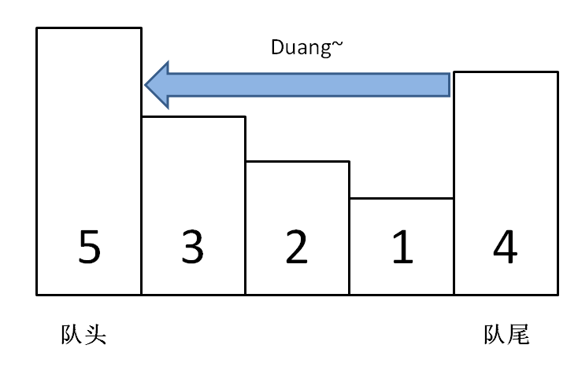
                */
                q.pop_back();
            }
            // 然后将 n 加入尾部
            q.push_back(n);
        }

        int max() {
            return q.front();
        }

        void pop(int n) {
            if (n == q.front()) {
                q.pop_front();
            }
        }
    };

public:
    /* 解题函数的实现 */
    vector<int> maxSlidingWindow(vector<int>& nums, int k) {
        MonotonicQueue window;
        vector<int> res;

        for (int i = 0; i < nums.size(); i++) {
            if (i < k - 1) {
                //先填满窗口的前 k - 1
                window.push(nums[i]);
            } else {
                /**<extend up -150>
                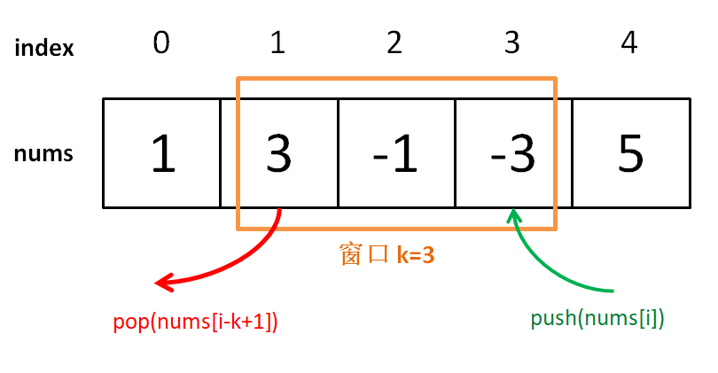
                */
                // 窗口向前滑动，加入新数字
                window.push(nums[i]);
                // 记录当前窗口的最大值
                res.push_back(window.max());
                // 移出旧数字
                window.pop(nums[i - k + 1]);
            }
        }
        return res;
    }
};
```

```go
// by chatGPT (go)
type MonotonicQueue struct {
    q []int
}

func (mq *MonotonicQueue) push(n int) {
    // 将小于 n 的元素全部删除
    for len(mq.q) > 0 && mq.q[len(mq.q)-1] < n {
        mq.q = mq.q[:len(mq.q)-1]
    }
    // 然后将 n 加入尾部
    mq.q = append(mq.q, n)
}

func (mq *MonotonicQueue) max() int {
    return mq.q[0]
}

func (mq *MonotonicQueue) pop(n int) {
    if n == mq.q[0] {
        mq.q = mq.q[1:]
    }
}

func maxSlidingWindow(nums []int, k int) []int {
    window := &MonotonicQueue{}
    res := []int{}

    for i := 0; i < len(nums); i++ {
        if i < k-1 {
            // 先填满窗口的前 k - 1
            window.push(nums[i])
        } else {
            // 窗口向前滑动，加入新数字
            window.push(nums[i])
            // 记录当前窗口的最大值
            res = append(res, window.max())
            // 移出旧数字
            window.pop(nums[i-k+1])
        }
    }
    return res
}
```

```java
// by labuladong (java)
class Solution {
    /* 单调队列的实现 */
    class MonotonicQueue {
        LinkedList<Integer> q = new LinkedList<>();
        public void push(int n) {
            // 将小于 n 的元素全部删除
            while (!q.isEmpty() && q.getLast() < n) {
                 /**<extend down -300>
                
                */
                q.pollLast();
            }
            // 然后将 n 加入尾部
            q.addLast(n);
        }

        public int max() {
            return q.getFirst();
        }

        public void pop(int n) {
            if (n == q.getFirst()) {
                q.pollFirst();
            }
        }
    }

    /* 解题函数的实现 */
    public int[] maxSlidingWindow(int[] nums, int k) {
        MonotonicQueue window = new MonotonicQueue();
        List<Integer> res = new ArrayList<>();

        for (int i = 0; i < nums.length; i++) {
            if (i < k - 1) {
                //先填满窗口的前 k - 1
                window.push(nums[i]);
            } else {
                /**<extend up -150>
                
                */
                // 窗口向前滑动，加入新数字
                window.push(nums[i]);
                // 记录当前窗口的最大值
                res.add(window.max());
                // 移出旧数字
                window.pop(nums[i - k + 1]);
            }
        }
        // 需要转成 int[] 数组再返回
        int[] arr = new int[res.size()];
        for (int i = 0; i < res.size(); i++) {
            arr[i] = res.get(i);
        }
        return arr;
    }
}
```

```javascript
// by chatGPT (javascript)
var Solution = function() {
    /* 单调队列的实现 */
    class MonotonicQueue {
        constructor() {
            this.q = [];
        }
        push(n) {
            // 将小于 n 的元素全部删除
            while (this.q.length > 0 && this.q[this.q.length - 1] < n) {
                 /**<extend down -300>
                
                */
                this.q.pop();
            }
            // 然后将 n 加入尾部
            this.q.push(n);
        }
        max() {
            return this.q[0];
        }
        pop(n) {
            if (n === this.q[0]) {
                this.q.shift();
            }
        }
    }

    /* 解题函数的实现 */
    this.maxSlidingWindow = function(nums, k) {
        const window = new MonotonicQueue();
        const res = [];

        for (let i = 0; i < nums.length; i++) {
            if (i < k - 1) {
                // 先填满窗口的前 k - 1
                window.push(nums[i]);
            } else {
                /**<extend up -150>
                
                */
                // 窗口向前滑动，加入新数字
                window.push(nums[i]);
                // 记录当前窗口的最大值
                res.push(window.max());
                // 移出旧数字
                window.pop(nums[i - k + 1]);
            }
        }
        // 需要转成 int[] 数组再返回
        return res;
    }
}
```

```python
# by chatGPT (python)
class Solution:
    # 单调队列的实现
    class MonotonicQueue:
        def __init__(self):
            self.q = []
        def push(self, n: int) -> None:
            # 将小于 n 的元素全部删除
            while self.q and self.q[-1] < n:
                '''
                <extend down -300>
                
                '''
                self.q.pop()
            # 然后将 n 加入尾部
            self.q.append(n)

        def max(self) -> int:
            return self.q[0]

        def pop(self, n: int) -> None:
            if n == self.q[0]:
                self.q.pop(0)

    # 解题函数的实现
    def maxSlidingWindow(self, nums: List[int], k: int) -> List[int]:
        window = self.MonotonicQueue()
        res = []

        for i in range(len(nums)):
            if i < k - 1:
                # 先填满窗口的前 k - 1
                window.push(nums[i])
            else:
                '''
                <extend up -150>
                
                '''
                # 窗口向前滑动，加入新数字
                window.push(nums[i])
                # 记录当前窗口的最大值
                res.append(window.max())
                # 移出旧数字
                window.pop(nums[i - k + 1])
        
        # 需要转成 int[] 数组再返回
        return res
```

https://leetcode.cn/problems/hua-dong-chuang-kou-de-zui-da-zhi-lcof 的多语言解法👆

https://leetcode.cn/problems/implement-queue-using-stacks 的多语言解法👇

```cpp
// by chatGPT (cpp)
class MyQueue {
private:
    stack<int> s1, s2;

public:
    MyQueue() {}

    /**
     * 添加元素到队尾
     */
    void push(int x) {
        s1.push(x);
    }

    /**
     * 删除队头的元素并返回
     */
    int pop() {
        // 先调用 peek 保证 s2 非空
        peek();
        int element = s2.top();
        s2.pop();
        return element;
    }

    /**
     * 返回队头元素
     */
    int peek() {
        if (s2.empty())
            // 把 s1 元素压入 s2
            while (!s1.empty()) {
                s2.push(s1.top());
                s1.pop();
            }
        return s2.top();
    }

    /**
     * 判断队列是否为空
     */
    bool empty() {
        return s1.empty() && s2.empty();
    }
};
```

```go
// by chatGPT (go)
type MyQueue struct {
    s1, s2 []int
}

func Constructor() MyQueue {
    return MyQueue{}
}

/** 
 * 添加元素到队尾
 */
func (q *MyQueue) Push(x int) {
    q.s1 = append(q.s1, x)
}

/** 
 * 删除队头的元素并返回
 */
func (q *MyQueue) Pop() int {
    // 先调用 Peek 保证 s2 非空
    q.Peek()
    val := q.s2[len(q.s2)-1]
    q.s2 = q.s2[:len(q.s2)-1]
    return val
}

/**
 * 返回队头元素
 */
func (q *MyQueue) Peek() int {
    if len(q.s2) == 0 {
        // 把 s1 元素压入 s2
        for len(q.s1) != 0 {
            q.s2 = append(q.s2, q.s1[len(q.s1)-1])
            q.s1 = q.s1[:len(q.s1)-1]
        }
    }
    return q.s2[len(q.s2)-1]
}

/** 
 * 判断队列是否为空
 */
func (q *MyQueue) Empty() bool {
    return len(q.s1) == 0 && len(q.s2) == 0
}
```

```java
// by labuladong (java)
class MyQueue {
    private Stack<Integer> s1, s2;

    public MyQueue() {
        s1 = new Stack<>();
        s2 = new Stack<>();
    }

    /**
     * 添加元素到队尾
     */
    public void push(int x) {
        s1.push(x);
    }

    /**
     * 删除队头的元素并返回
     */
    public int pop() {
        // 先调用 peek 保证 s2 非空
        peek();
        return s2.pop();
    }

    /**
     * 返回队头元素
     */
    public int peek() {
        if (s2.isEmpty())
            // 把 s1 元素压入 s2
            while (!s1.isEmpty())
                s2.push(s1.pop());
        return s2.peek();
    }

    /**
     * 判断队列是否为空
     */
    public boolean empty() {
        return s1.isEmpty() && s2.isEmpty();
    }
}
```

```javascript
// by chatGPT (javascript)
var MyQueue = function() {
    this.s1 = [];
    this.s2 = [];
};

/**
 * 添加元素到队尾
 */
MyQueue.prototype.push = function(x) {
    this.s1.push(x);
};

/**
 * 删除队头的元素并返回
 */
MyQueue.prototype.pop = function() {
    // 先调用 peek 保证 s2 非空
    this.peek();
    return this.s2.pop();
};

/**
 * 返回队头元素
 */
MyQueue.prototype.peek = function() {
    if (this.s2.length === 0)
        // 把 s1 元素压入 s2
        while (this.s1.length > 0)
            this.s2.push(this.s1.pop());
    return this.s2[this.s2.length - 1];
};

/**
 * 判断队列是否为空
 */
MyQueue.prototype.empty = function() {
    return this.s1.length === 0 && this.s2.length === 0;
};
```

```python
# by chatGPT (python)
class MyQueue:

    def __init__(self):
        self.s1 = []
        self.s2 = []

    def push(self, x: int) -> None:
        self.s1.append(x)

    def pop(self) -> int:
        # 先调用 peek 保证 s2 非空
        self.peek()
        return self.s2.pop()

    def peek(self) -> int:
        if not self.s2:
            # 把 s1 元素压入 s2
            while self.s1:
                self.s2.append(self.s1.pop())
        return self.s2[-1]

    def empty(self) -> bool:
        return not self.s1 and not self.s2
```

https://leetcode.cn/problems/implement-queue-using-stacks 的多语言解法👆

https://leetcode.cn/problems/implement-stack-using-queues 的多语言解法👇

```cpp
// by chatGPT (cpp)
class MyStack {
    queue<int> q;
    int top_elem = 0;

public:
    /**
     * 添加元素到栈顶
     */
    void push(int x) {
        // x 是队列的队尾，是栈的栈顶
        q.push(x);
        top_elem = x;
    }

    /**
     * 返回栈顶元素
     */
    int top() {
        return top_elem;
    }

    /**
     * 删除栈顶的元素并返回
     */
    int pop() {
        int size = q.size();
        // 留下队尾 2 个元素
        while (size > 2) {
            q.push(q.front());
            q.pop();
            size--;
        }
        // 记录新的队尾元素
        top_elem = q.front();
        q.push(q.front());
        q.pop();
        // 删除之前的队尾元素
        int tmp=q.front();
        q.pop();
        return tmp;
    }

    /**
     * 判断栈是否为空
     */
    bool empty() {
        return q.empty();
    }
};
```

```go
// by mario-huang (go)
package ImplementStackusingQueues

type MyStack struct {
    q       []int
    topElem int
}

func Constructor() MyStack {
    return MyStack{q: []int{}, topElem: 0}
}

/**
 * 添加元素到栈顶
 */
func (this *MyStack) Push(x int) {
    // x 是队列的队尾，是栈的栈顶
    this.q = append(this.q, x)
    this.topElem = x
}

/**
 * 删除栈顶的元素并返回
 */
func (this *MyStack) Pop() int {
    size := len(this.q)
    // 留下队尾 2 个元素
    for size > 2 {
        this.q = append(this.q, this.q[0])
        this.q = this.q[1:]
        size--
    }
    // 记录新的队尾元素
    this.topElem = this.q[0]
    this.q = append(this.q, this.q[0])
    this.q = this.q[1:]
    // 删除之前的队尾元素
    val := this.q[0]
    this.q = this.q[1:]
    return val
}

/**
 * 返回栈顶元素
 */
func (this *MyStack) Top() int {
    return this.topElem
}

/**
 * 判断栈是否为空
 */
func (this *MyStack) Empty() bool {
    return len(this.q) == 0
}
```

```java
// by labuladong (java)
class MyStack {
    Queue<Integer> q = new LinkedList<>();
    int top_elem = 0;

    /**
     * 添加元素到栈顶
     */
    public void push(int x) {
        // x 是队列的队尾，是栈的栈顶
        q.offer(x);
        top_elem = x;
    }

    /**
     * 返回栈顶元素
     */
    public int top() {
        return top_elem;
    }

    /**
     * 删除栈顶的元素并返回
     */
    public int pop() {
        int size = q.size();
        // 留下队尾 2 个元素
        while (size > 2) {
            q.offer(q.poll());
            size--;
        }
        // 记录新的队尾元素
        top_elem = q.peek();
        q.offer(q.poll());
        // 删除之前的队尾元素
        return q.poll();
    }

    /**
     * 判断栈是否为空
     */
    public boolean empty() {
        return q.isEmpty();
    }
}
```

```javascript
// by chatGPT (javascript)
var MyStack = function() {
    this.q = [];
    this.top_elem = 0;
};

/**
 * 添加元素到栈顶
 */
MyStack.prototype.push = function(x) {
    // x 是队列的队尾，是栈的栈顶
    this.q.push(x);
    this.top_elem = x;
};

/**
 * 返回栈顶元素
 */
MyStack.prototype.top = function() {
    return this.top_elem;
};

/**
 * 删除栈顶的元素并返回
 */
MyStack.prototype.pop = function() {
    var size = this.q.length;
    // 留下队尾 2 个元素
    while (size > 2) {
        this.q.push(this.q.shift());
        size--;
    }
    // 记录新的队尾元素
    this.top_elem = this.q[0];
    this.q.push(this.q.shift());
    // 删除之前的队尾元素
    return this.q.shift();
};

/**
 * 判断栈是否为空
 */
MyStack.prototype.empty = function() {
    return this.q.length === 0;
};
```

```python
# by chatGPT (python)
from queue import Queue

class MyStack:
    def __init__(self):
        self.q = Queue()
        self.top_elem = 0

    def push(self, x: int) -> None:
        """
        添加元素到栈顶
        """
        # x 是队列的队尾，是栈的栈顶
        self.q.put(x)
        self.top_elem = x

    def pop(self) -> int:
        """
        删除栈顶的元素并返回
        """
        size = self.q.qsize()
        # 留下队尾 2 个元素
        while size > 2:
            self.q.put(self.q.get())
            size -= 1
        # 记录新的队尾元素
        self.top_elem = self.q.queue[0]
        self.q.put(self.q.get())
        # 删除之前的队尾元素
        return self.q.get()

    def top(self) -> int:
        """
        返回栈顶元素
        """
        return self.top_elem

    def empty(self) -> bool:
        """
        判断栈是否为空
        """
        return self.q.empty()
```

https://leetcode.cn/problems/implement-stack-using-queues 的多语言解法👆

https://leetcode.cn/problems/insert-delete-getrandom-o1 的多语言解法👇

```cpp
// by labuladong (cpp)
class RandomizedSet {
    public:
    // 存储元素的值
    vector<int> nums;
    // 记录每个元素对应在 nums 中的索引
    unordered_map<int,int> valToIndex;

    bool insert(int val) {
        // 若 val 已存在，不用再插入
        if (valToIndex.count(val)) {
            return false;
        }
        // 若 val 不存在，插入到 nums 尾部，
        // 并记录 val 对应的索引值
        valToIndex[val] = nums.size();
        nums.push_back(val);
        return true;
    }

    bool remove(int val) {
        // 若 val 不存在，不用再删除
        if (!valToIndex.count(val)) {
            return false;
        }
        // 先拿到 val 的索引
        int index = valToIndex[val];
        // 将最后一个元素对应的索引修改为 index
        valToIndex[nums.back()] = index;
        // 交换 val 和最后一个元素
        swap(nums[index], nums.back());
        // 在数组中删除元素 val
        nums.pop_back();
        // 删除元素 val 对应的索引
        valToIndex.erase(val);
        return true;
    }

    int getRandom() {
        // 随机获取 nums 中的一个元素
        return nums[rand() % nums.size()];
    }
};
```

```go
// by chatGPT (go)
type RandomizedSet struct {
    // 存储元素的值
    nums []int
    // 记录每个元素对应在 nums 中的索引
    valToIndex map[int]int
}

func Constructor() RandomizedSet {
    return RandomizedSet{
        nums: []int{},
        valToIndex: make(map[int]int),
    }
}

func (this *RandomizedSet) Insert(val int) bool {
    // 若 val 已存在，不用再插入
    if _, ok := this.valToIndex[val]; ok {
        return false
    }
    // 若 val 不存在，插入到 nums 尾部，
    // 并记录 val 对应的索引值
    this.valToIndex[val] = len(this.nums)
    this.nums = append(this.nums, val)
    return true
}

func (this *RandomizedSet) Remove(val int) bool {
    // 若 val 不存在，不用再删除
    if _, ok := this.valToIndex[val]; !ok {
        return false
    }
    // 先拿到 val 的索引
    index := this.valToIndex[val]
    // 将最后一个元素对应的索引修改为 index
    this.valToIndex[this.nums[len(this.nums)-1]] = index
    // 交换 val 和最后一个元素
    this.nums[index], this.nums[len(this.nums)-1] = this.nums[len(this.nums)-1], this.nums[index]
    // 在数组中删除元素 val
    this.nums = this.nums[:len(this.nums)-1]
    // 删除元素 val 对应的索引
    delete(this.valToIndex, val)
    return true
}

func (this *RandomizedSet) GetRandom() int {
    // 随机获取 nums 中的一个元素
    return this.nums[rand.Intn(len(this.nums))]
}
```

```java
// by chatGPT (java)
class RandomizedSet {
    // 存储元素的值
    List<Integer> nums;
    // 记录每个元素对应在 nums 中的索引
    Map<Integer, Integer> valToIndex;

    public RandomizedSet() {
        nums = new ArrayList<>();
        valToIndex = new HashMap<>();
    }

    public boolean insert(int val) {
        // 若 val 已存在，不用再插入
        if (valToIndex.containsKey(val)) {
            return false;
        }
        // 若 val 不存在，插入到 nums 尾部，
        // 并记录 val 对应的索引值
        valToIndex.put(val, nums.size());
        nums.add(val);
        return true;
    }

    public boolean remove(int val) {
        // 若 val 不存在，不用再删除
        if (!valToIndex.containsKey(val)) {
            return false;
        }
        // 先拿到 val 的索引
        int index = valToIndex.get(val);
        // 将最后一个元素对应的索引修改为 index
        valToIndex.put(nums.get(nums.size() - 1), index);
        // 交换 val 和最后一个元素
        Collections.swap(nums, index, nums.size() - 1);
        // 在数组中删除元素 val
        nums.remove(nums.size() - 1);
        // 删除元素 val 对应的索引
        valToIndex.remove(val);
        return true;
    }

    public int getRandom() {
        // 随机获取 nums 中的一个元素
        return nums.get((int)(Math.random() * nums.size()));
    }
}
```

```javascript
// by chatGPT (javascript)
var RandomizedSet = function() {
    // 存储元素的值
    this.nums = [];
    // 记录每个元素对应在 nums 中的索引
    this.valToIndex = {};
};

RandomizedSet.prototype.insert = function(val) {
    // 若 val 已存在，不用再插入
    if (this.valToIndex[val] !== undefined) {
        return false;
    }
    // 若 val 不存在，插入到 nums 尾部，
    // 并记录 val 对应的索引值
    this.valToIndex[val] = this.nums.length;
    this.nums.push(val);
    return true;
};

RandomizedSet.prototype.remove = function(val) {
    // 若 val 不存在，不用再删除
    if (this.valToIndex[val] === undefined) {
        return false;
    }
    // 先拿到 val 的索引
    var index = this.valToIndex[val];
    // 将最后一个元素对应的索引修改为 index
    this.valToIndex[this.nums[this.nums.length - 1]] = index;
    // 交换 val 和最后一个元素
    var temp = this.nums[index];
    this.nums[index] = this.nums[this.nums.length - 1];
    this.nums[this.nums.length - 1] = temp;
    // 在数组中删除元素 val
    this.nums.pop();
    // 删除元素 val 对应的索引
    delete this.valToIndex[val];
    return true;
};

RandomizedSet.prototype.getRandom = function() {
    // 随机获取 nums 中的一个元素
    return this.nums[Math.floor(Math.random() * this.nums.length)];
};
```

```python
# by chatGPT (python)
class RandomizedSet:

    def __init__(self):
        """
        Initialize your data structure here.
        """
        self.nums = []              # 存储元素的值
        self.valToIndex = dict()    # 记录每个元素对应在 nums 中的索引

    def insert(self, val: int) -> bool:
        """
        Inserts a value to the set. Returns true if the set did not already contain the specified element.
        """
        # 若 val 已存在，不用再插入
        if val in self.valToIndex:
            return False
        # 若 val 不存在，插入到 nums 尾部，
        # 并记录 val 对应的索引值
        self.valToIndex[val] = len(self.nums)
        self.nums.append(val)
        return True

    def remove(self, val: int) -> bool:
        """
        Removes a value from the set. Returns true if the set contained the specified element.
        """
        # 若 val 不存在，不用再删除
        if val not in self.valToIndex:
            return False
        # 先拿到 val 的索引
        index = self.valToIndex[val]
        # 将最后一个元素对应的索引修改为 index
        self.valToIndex[self.nums[-1]] = index
        # 交换 val 和最后一个元素
        self.nums[index], self.nums[-1] = self.nums[-1], self.nums[index]
        # 在数组中删除元素 val
        self.nums.pop()
        # 删除元素 val 对应的索引
        del self.valToIndex[val]
        return True

    def getRandom(self) -> int:
        """
        Get a random element from the set.
        """
        # 随机获取 nums 中的一个元素
        return self.nums[random.randint(0, len(self.nums) - 1)]
```

https://leetcode.cn/problems/insert-delete-getrandom-o1 的多语言解法👆

https://leetcode.cn/problems/insert-into-a-binary-search-tree 的多语言解法👇

```cpp
// by chatGPT (cpp)
class Solution {
public:
    TreeNode* insertIntoBST(TreeNode* root, int val) {
        // 找到空位置插入新节点
        if (root == nullptr) return new TreeNode(val);
        // if (root->val == val)
        //     BST 中一般不会插入已存在元素
        if (root->val < val)
            root->right = insertIntoBST(root->right, val);
        if (root->val > val)
            root->left = insertIntoBST(root->left, val);
        return root;
    }
};
```

```go
// by chatGPT (go)
func insertIntoBST(root *TreeNode, val int) *TreeNode {
    // 找到空位置插入新节点
    if root == nil {
        return &TreeNode{Val: val}
    }
    // if (root.val == val)
    //     BST 中一般不会插入已存在元素
    if root.Val < val {
        root.Right = insertIntoBST(root.Right, val)
    }
    if root.Val > val {
        root.Left = insertIntoBST(root.Left, val)
    }
    return root
}
```

```java
// by labuladong (java)
class Solution {
    public TreeNode insertIntoBST(TreeNode root, int val) {
        // 找到空位置插入新节点
        if (root == null) return new TreeNode(val);
        // if (root.val == val)
        //     BST 中一般不会插入已存在元素
        if (root.val < val)
            root.right = insertIntoBST(root.right, val);
        if (root.val > val)
            root.left = insertIntoBST(root.left, val);
        return root;
    }
}
```

```javascript
// by chatGPT (javascript)
var insertIntoBST = function(root, val) {
    // 找到空位置插入新节点
    if (root == null) return new TreeNode(val);
    // if (root.val == val)
    //     BST 中一般不会插入已存在元素
    if (root.val < val)
        root.right = insertIntoBST(root.right, val);
    if (root.val > val)
        root.left = insertIntoBST(root.left, val);
    return root;
};
```

```python
# by chatGPT (python)
class Solution:
    def insertIntoBST(self, root: TreeNode, val: int) -> TreeNode:
        # 找到空位置插入新节点
        if root is None:
            return TreeNode(val)
        # if (root.val == val)
        #     BST 中一般不会插入已存在元素
        if root.val < val:
            root.right = self.insertIntoBST(root.right, val)
        if root.val > val:
            root.left = self.insertIntoBST(root.left, val)
        return root
```

https://leetcode.cn/problems/insert-into-a-binary-search-tree 的多语言解法👆

https://leetcode.cn/problems/intersection-of-two-linked-lists 的多语言解法👇

```cpp
// by chatGPT (cpp)
class Solution {
public:
    ListNode *getIntersectionNode(ListNode *headA, ListNode *headB) {
        // p1 指向 A 链表头结点，p2 指向 B 链表头结点
        ListNode *p1 = headA, *p2 = headB;
        while (p1 != p2) {
            // p1 走一步，如果走到 A 链表末尾，转到 B 链表
            if (p1 == nullptr) p1 = headB;
            else                p1 = p1->next;
            // p2 走一步，如果走到 B 链表末尾，转到 A 链表
            if (p2 == nullptr) p2 = headA;
            else                p2 = p2->next;
        }
        return p1;
    }
};
```

```go
// by chatGPT (go)
func getIntersectionNode(headA, headB *ListNode) *ListNode {
    // p1 指向 A 链表头结点，p2 指向 B 链表头结点
    p1, p2 := headA, headB
    for p1 != p2 {
        // p1 走一步，如果走到 A 链表末尾，转到 B 链表
        if p1 == nil {
            p1 = headB
        } else {
            p1 = p1.Next
        }
        // p2 走一步，如果走到 B 链表末尾，转到 A 链表
        if p2 == nil {
            p2 = headA
        } else {
            p2 = p2.Next
        }
    }
    return p1
}
```

```java
// by labuladong (java)
public class Solution {
    public ListNode getIntersectionNode(ListNode headA, ListNode headB) {
        // p1 指向 A 链表头结点，p2 指向 B 链表头结点
        ListNode p1 = headA, p2 = headB;
        while (p1 != p2) {
            // p1 走一步，如果走到 A 链表末尾，转到 B 链表
            if (p1 == null) p1 = headB;
            else            p1 = p1.next;
            // p2 走一步，如果走到 B 链表末尾，转到 A 链表
            if (p2 == null) p2 = headA;
            else            p2 = p2.next;
        }
        return p1;
    }
}
```

```javascript
// by chatGPT (javascript)
var getIntersectionNode = function(headA, headB) {
    // p1 指向 A 链表头结点，p2 指向 B 链表头结点
    let p1 = headA, p2 = headB;
    while (p1 !== p2) {
        // p1 走一步，如果走到 A 链表末尾，转到 B 链表
        if (p1 === null) p1 = headB;
        else             p1 = p1.next;
        // p2 走一步，如果走到 B 链表末尾，转到 A 链表
        if (p2 === null) p2 = headA;
        else             p2 = p2.next;
    }
    return p1;
};
```

```python
# by chatGPT (python)
class Solution:
    def getIntersectionNode(self, headA: ListNode, headB: ListNode) -> ListNode:
        # p1 指向 A 链表头结点，p2 指向 B 链表头结点
        p1, p2 = headA, headB
        while p1 != p2:
            # p1 走一步，如果走到 A 链表末尾，转到 B 链表
            if p1 is None:
                p1 = headB
            else:
                p1 = p1.next
            # p2 走一步，如果走到 B 链表末尾，转到 A 链表
            if p2 is None:
                p2 = headA
            else:
                p2 = p2.next
        return p1
```

https://leetcode.cn/problems/intersection-of-two-linked-lists 的多语言解法👆

https://leetcode.cn/problems/interval-list-intersections 的多语言解法👇

```cpp
// by chatGPT (cpp)
class Solution {
public:
    vector<vector<int>> intervalIntersection(vector<vector<int>>& A, vector<vector<int>>& B) {
        vector<vector<int>> res;
        int i = 0, j = 0;
        while (i < A.size() && j < B.size()) {
            int a1 = A[i][0], a2 = A[i][1];
            int b1 = B[j][0], b2 = B[j][1];

            if (b2 >= a1 && a2 >= b1) {
                res.push_back({
                    max(a1, b1), min(a2, b2)
                });
            }
            if (b2 < a2) {
                j++;
            } else {
                i++;
            }
        }
        return res;
    }
};
```

```go
// by chatGPT (go)
func intervalIntersection(A [][]int, B [][]int) [][]int {
    res := [][]int{}
    i, j := 0, 0
    for i < len(A) && j < len(B) {
        a1, a2 := A[i][0], A[i][1]
        b1, b2 := B[j][0], B[j][1]

        if b2 >= a1 && a2 >= b1 {
            res = append(res, []int{
                max(a1, b1), min(a2, b2),
            })
        }
        if b2 < a2 {
            j++
        } else {
            i++
        }
    }
    return res
}

func max(x, y int) int {
    if x > y {
        return x
    }
    return y
}

func min(x, y int) int {
    if x < y {
        return x
    }
    return y
}
```

```java
// by labuladong (java)
class Solution {
    public int[][] intervalIntersection(int[][] A, int[][] B) {
        List<int[]> res = new LinkedList<>();
        int i = 0, j = 0;
        while (i < A.length && j < B.length) {
            int a1 = A[i][0], a2 = A[i][1];
            int b1 = B[j][0], b2 = B[j][1];

            if (b2 >= a1 && a2 >= b1) {
                res.add(new int[]{
                        Math.max(a1, b1), Math.min(a2, b2)
                });
            }
            if (b2 < a2) {
                j++;
            } else {
                i++;
            }
        }
        return res.toArray(new int[0][0]);
    }
}
```

```javascript
// by chatGPT (javascript)
var intervalIntersection = function(A, B) {
    const res = [];
    let i = 0, j = 0;
    while (i < A.length && j < B.length) {
        const a1 = A[i][0], a2 = A[i][1];
        const b1 = B[j][0], b2 = B[j][1];

        if (b2 >= a1 && a2 >= b1) {
            res.push([
                Math.max(a1, b1), Math.min(a2, b2)
            ]);
        }
        if (b2 < a2) {
            j++;
        } else {
            i++;
        }
    }
    return res;
};
```

```python
# by chatGPT (python)
class Solution:
    def intervalIntersection(self, A: List[List[int]], B: List[List[int]]) -> List[List[int]]:
        res = []
        i, j = 0, 0
        while i < len(A) and j < len(B):
            a1, a2 = A[i][0], A[i][1]
            b1, b2 = B[j][0], B[j][1]

            if b2 >= a1 and a2 >= b1:
                res.append([max(a1, b1), min(a2, b2)])

            if b2 < a2:
                j += 1
            else:
                i += 1

        return res
```

https://leetcode.cn/problems/interval-list-intersections 的多语言解法👆

https://leetcode.cn/problems/invert-binary-tree 的多语言解法👇

```cpp
// by chatGPT (cpp)
// 「遍历」的思路
class Solution {
public:
    // 主函数
    TreeNode* invertTree(TreeNode* root) {
        // 遍历二叉树，交换每个节点的子节点
        traverse(root);
        return root;
    }

    // 二叉树遍历函数
    void traverse(TreeNode* root) {
        if (root == nullptr) {
            return;
        }

        /**** 前序位置 ****/
        // 每一个节点需要做的事就是交换它的左右子节点
        TreeNode* tmp = root->left;
        root->left = root->right;
        root->right = tmp;

        // 遍历框架，去遍历左右子树的节点
        traverse(root->left);
        traverse(root->right);
    }
};

// 「分解问题」的思路
class Solution2 {
public:
    // 定义：将以 root 为根的这棵二叉树翻转，返回翻转后的二叉树的根节点
    TreeNode* invertTree(TreeNode* root) {
        if (root == nullptr) {
            return nullptr;
        }
        // 利用函数定义，先翻转左右子树
        TreeNode* left = invertTree(root->left);
        TreeNode* right = invertTree(root->right);

        // 然后交换左右子节点
        root->left = right;
        root->right = left;

        // 和定义逻辑自恰：以 root 为根的这棵二叉树已经被翻转，返回 root
        return root;
    }
};
```

```go
// by chatGPT (go)
/**
 * Definition for a binary tree node.
 * type TreeNode struct {
 *     Val int
 *     Left *TreeNode
 *     Right *TreeNode
 * }
 */

//「遍历」的思路
func invertTree(root *TreeNode) *TreeNode {
    //遍历二叉树，交换每个节点的子节点
    traverse(root)
    return root
} 

//二叉树遍历函数
func traverse(root *TreeNode) {
    if root == nil {
        return
    }
    // 每一个节点需要做的事就是交换它的左右子节点
    tmp := root.Left
    root.Left = root.Right
    root.Right = tmp
    // 遍历框架，去遍历左右子树的节点
    traverse(root.Left)
    traverse(root.Right)
}

// 「分解问题」的思路
func invertTree2(root *TreeNode) *TreeNode {
    if root == nil {
        return nil
    }
    // 利用函数定义，先翻转左右子树
    left := invertTree2(root.Left)
    right := invertTree2(root.Right)
    // 然后交换左右子节点
    root.Left = right
    root.Right = left
    // 和定义逻辑自恰：以 root 为根的这棵二叉树已经被翻转，返回 root
    return root
}
```

```java
// by labuladong (java)
// 「遍历」的思路
class Solution {
    // 主函数
    public TreeNode invertTree(TreeNode root) {
        // 遍历二叉树，交换每个节点的子节点
        traverse(root);
        return root;
    }

    // 二叉树遍历函数
    void traverse(TreeNode root) {
        if (root == null) {
            return;
        }

        /**** 前序位置 ****/
        // 每一个节点需要做的事就是交换它的左右子节点
        TreeNode tmp = root.left;
        root.left = root.right;
        root.right = tmp;

        // 遍历框架，去遍历左右子树的节点
        traverse(root.left);
        traverse(root.right);
    }
}

// 「分解问题」的思路
class Solution2 {
    // 定义：将以 root 为根的这棵二叉树翻转，返回翻转后的二叉树的根节点
    TreeNode invertTree(TreeNode root) {
        if (root == null) {
            return null;
        }
        // 利用函数定义，先翻转左右子树
        TreeNode left = invertTree(root.left);
        TreeNode right = invertTree(root.right);

        // 然后交换左右子节点
        root.left = right;
        root.right = left;

        // 和定义逻辑自恰：以 root 为根的这棵二叉树已经被翻转，返回 root
        return root;
    }
}
```

```javascript
// by chatGPT (javascript)
/**
 * 「遍历」的思路
 */
var invertTree = function(root) {
  /**
   * 二叉树遍历函数
   */
  var traverse = function(root) {
    if (root === null) {
      return;
    }

    /**** 前序位置 ****/
    // 每一个节点需要做的事就是交换它的左右子节点
    var tmp = root.left;
    root.left = root.right;
    root.right = tmp;

    // 遍历框架，去遍历左右子树的节点
    traverse(root.left);
    traverse(root.right);
  }

  // 遍历二叉树，交换每个节点的子节点
  traverse(root);
  return root;
};

/**
 * 「分解问题」的思路
 */
var invertTree2 = function(root) {
  /**
   * 定义：将以 root 为根的这棵二叉树翻转，返回翻转后的二叉树的根节点
   */
  var invert = function(root) {
    if (root === null) {
      return null;
    }
    // 利用函数定义，先翻转左右子树
    var left = invert(root.left);
    var right = invert(root.right);

    // 然后交换左右子节点
    root.left = right;
    root.right = left;

    // 和定义逻辑自恰：以 root 为根的这棵二叉树已经被翻转，返回 root
    return root;
  }

  // 返回翻转后的二叉树的根节点
  return invert(root);
};
```

```python
# by chatGPT (python)
# 「遍历」的思路
class Solution:
    # 主函数
    def invertTree(self, root: TreeNode) -> TreeNode:
        # 遍历二叉树，交换每个节点的子节点
        self.traverse(root)
        return root

    # 二叉树遍历函数
    def traverse(self, root: TreeNode) -> None:
        if not root:
            return

        # 前序位置
        # 每一个节点需要做的事就是交换它的左右子节点
        tmp = root.left
        root.left = root.right
        root.right = tmp

        # 遍历框架，去遍历左右子树的节点
        self.traverse(root.left)
        self.traverse(root.right)


# 「分解问题」的思路
class Solution2:
    # 定义：将以 root 为根的这棵二叉树翻转，返回翻转后的二叉树的根节点
    def invertTree(self, root: TreeNode) -> TreeNode:
        if not root:
            return None
        # 利用函数定义，先翻转左右子树
        left = self.invertTree(root.left)
        right = self.invertTree(root.right)

        # 然后交换左右子节点
        root.left = right
        root.right = left

        # 和定义逻辑自恰：以 root 为根的这棵二叉树已经被翻转，返回 root
        return root
```

https://leetcode.cn/problems/invert-binary-tree 的多语言解法👆

https://leetcode.cn/problems/is-graph-bipartite 的多语言解法👇

```cpp
// by chatGPT (cpp)
class Solution {
public:
    // 记录图是否符合二分图性质
    bool ok = true;
    // 记录图中节点的颜色，false 和 true 代表两种不同颜色
    vector<bool> color;
    // 记录图中节点是否被访问过
    vector<bool> visited;

    // 主函数，输入邻接表，判断是否是二分图
    bool isBipartite(vector<vector<int>>& graph) {
        int n = graph.size();
        color.resize(n);
        visited.resize(n);
        // 因为图不一定是联通的，可能存在多个子图
        // 所以要把每个节点都作为起点进行一次遍历
        // 如果发现任何一个子图不是二分图，整幅图都不算二分图
        for (int v = 0; v < n; v++) {
            if (!visited[v]) {
                traverse(graph, v);
            }
        }
        return ok;
    }

    // DFS 遍历框架
    void traverse(vector<vector<int>>& graph, int v) {
        // 如果已经确定不是二分图了，就不用浪费时间再递归遍历了
        if (!ok) return;

        visited[v] = true;
        for (int w : graph[v]) {
            if (!visited[w]) {
                // 相邻节点 w 没有被访问过
                // 那么应该给节点 w 涂上和节点 v 不同的颜色
                color[w] = !color[v];
                // 继续遍历 w
                traverse(graph, w);
            } else {
                // 相邻节点 w 已经被访问过
                // 根据 v 和 w 的颜色判断是否是二分图
                if (color[w] == color[v]) {
                    // 若相同，则此图不是二分图
                    ok = false;
                }
            }
        }
    }
};
```

```go
// by chatGPT (go)
func isBipartite(graph [][]int) bool {
    n := len(graph)
    // 记录图是否符合二分图性质
    ok := true
    // 记录图中节点的颜色，false 和 true 代表两种不同颜色
    color := make([]bool, n)
    // 记录图中节点是否被访问过
    visited := make([]bool, n)

    traverse := func(v int) {
        // 如果已经确定不是二分图了，就不用浪费时间再递归遍历了
        if !ok {
            return
        }

        visited[v] = true
        for _, w := range graph[v] {
            if !visited[w] {
                // 相邻节点 w 没有被访问过
                // 那么应该给节点 w 涂上和节点 v 不同的颜色
                color[w] = !color[v]
                // 继续遍历 w
                traverse(w)
            } else {
                // 相邻节点 w 已经被访问过
                // 根据 v 和 w 的颜色判断是否是二分图
                if color[w] == color[v] {
                    // 若相同，则此图不是二分图
                    ok = false
                }
            }
        }
    }

    // 因为图不一定是联通的，可能存在多个子图
    // 所以要把每个节点都作为起点进行一次遍历
    // 如果发现任何一个子图不是二分图，整幅图都不算二分图
    for v := 0; v < n; v++ {
        if !visited[v] {
            traverse(v)
        }
    }
    return ok
}
```

```java
// by labuladong (java)
class Solution {

    // 记录图是否符合二分图性质
    private boolean ok = true;
    // 记录图中节点的颜色，false 和 true 代表两种不同颜色
    private boolean[] color;
    // 记录图中节点是否被访问过
    private boolean[] visited;

    // 主函数，输入邻接表，判断是否是二分图
    public boolean isBipartite(int[][] graph) {
        int n = graph.length;
        color = new boolean[n];
        visited = new boolean[n];
        // 因为图不一定是联通的，可能存在多个子图
        // 所以要把每个节点都作为起点进行一次遍历
        // 如果发现任何一个子图不是二分图，整幅图都不算二分图
        for (int v = 0; v < n; v++) {
            if (!visited[v]) {
                traverse(graph, v);
            }
        }
        return ok;
    }

    // DFS 遍历框架
    private void traverse(int[][] graph, int v) {
        // 如果已经确定不是二分图了，就不用浪费时间再递归遍历了
        if (!ok) return;

        visited[v] = true;
        for (int w : graph[v]) {
            if (!visited[w]) {
                // 相邻节点 w 没有被访问过
                // 那么应该给节点 w 涂上和节点 v 不同的颜色
                color[w] = !color[v];
                // 继续遍历 w
                traverse(graph, w);
            } else {
                // 相邻节点 w 已经被访问过
                // 根据 v 和 w 的颜色判断是否是二分图
                if (color[w] == color[v]) {
                    // 若相同，则此图不是二分图
                    ok = false;
                }
            }
        }
    }

}
```

```javascript
// by chatGPT (javascript)
/**
 * @param {number[][]} graph 邻接表
 * @return {boolean} 是否是二分图
 */
var isBipartite = function(graph) {
    // 记录图是否符合二分图性质
    let ok = true;
    // 记录图中节点的颜色，false 和 true 代表两种不同颜色
    const color = new Array(graph.length).fill(false);
    // 记录图中节点是否被访问过
    const visited = new Array(graph.length).fill(false);

    /**
     * DFS 遍历框架
     * @param {number} v 节点
     */
    const traverse = function(v) {
        // 如果已经确定不是二分图了，就不用浪费时间再递归遍历了
        if (!ok) {
            return;
        }

        visited[v] = true;
        for (const w of graph[v]) {
            if (!visited[w]) {
                // 相邻节点 w 没有被访问过
                // 那么应该给节点 w 涂上和节点 v 不同的颜色
                color[w] = !color[v];
                // 继续遍历 w
                traverse(w);
            } else {
                // 相邻节点 w 已经被访问过
                // 根据 v 和 w 的颜色判断是否是二分图
                if (color[w] === color[v]) {
                    // 若相同，则此图不是二分图
                    ok = false;
                }
            }
        }
    }

    // 因为图不一定是联通的，可能存在多个子图
    // 所以要把每个节点都作为起点进行一次遍历
    // 如果发现任何一个子图不是二分图，整幅图都不算二分图
    for (let v = 0; v < graph.length; v++) {
        if (!visited[v]) {
            traverse(v);
        }
    }

    return ok;
};
```

```python
# by chatGPT (python)
class Solution:
    def __init__(self):
        # 记录图是否符合二分图性质
        self.ok = True
        # 记录图中节点的颜色，false 和 true 代表两种不同颜色
        self.color = None
        # 记录图中节点是否被访问过
        self.visited = None

    # 主函数，输入邻接表，判断是否是二分图
    def isBipartite(self, graph: List[List[int]]) -> bool:
        n = len(graph)
        self.color = [False] * n
        self.visited = [False] * n
        # 因为图不一定是联通的，可能存在多个子图
        # 所以要把每个节点都作为起点进行一次遍历
        # 如果发现任何一个子图不是二分图，整幅图都不算二分图
        for v in range(n):
            if not self.visited[v]:
                self.traverse(graph, v)
        return self.ok

    # DFS 遍历框架
    def traverse(self, graph: List[List[int]], v: int) -> None:
        # 如果已经确定不是二分图了，就不用浪费时间再递归遍历了
        if not self.ok:
            return

        self.visited[v] = True
        for w in graph[v]:
            if not self.visited[w]:
                # 相邻节点 w 没有被访问过
                # 那么应该给节点 w 涂上和节点 v 不同的颜色
                self.color[w] = not self.color[v]
                # 继续遍历 w
                self.traverse(graph, w)
            else:
                # 相邻节点 w 已经被访问过
                # 根据 v 和 w 的颜色判断是否是二分图
                if self.color[w] == self.color[v]:
                    # 若相同，则此图不是二分图
                    self.ok = False
```

https://leetcode.cn/problems/is-graph-bipartite 的多语言解法👆

https://leetcode.cn/problems/is-subsequence 的多语言解法👇

```cpp
// by chatGPT (cpp)
class Solution {
public:
    bool isSubsequence(string s, string t) {
        int i = 0, j = 0;
        while (i < s.length() && j < t.length()) {
            if (s[i] == t[j]) {
                i++;
            }
            j++;
        }
        return i == s.length();
    }
};
```

```go
// by chatGPT (go)
func isSubsequence(s string, t string) bool {
    i, j := 0, 0
    for i < len(s) && j < len(t) {
        if s[i] == t[j] {
            i++
        }
        j++
    }
    return i == len(s)
}
```

```java
// by labuladong (java)
class Solution {
    public boolean isSubsequence(String s, String t) {
        int i = 0, j = 0;
        while (i < s.length() && j < t.length()) {
            if (s.charAt(i) == t.charAt(j)) {
                i++;
            }
            j++;
        }
        return i == s.length();
    }
}
```

```javascript
// by chatGPT (javascript)
/**
 * @param {string} s
 * @param {string} t
 * @return {boolean}
 */
var isSubsequence = function(s, t) {
    let i = 0, j = 0;
    while (i < s.length && j < t.length) {
        if (s.charAt(i) === t.charAt(j)) {
            i++;
        }
        j++;
    }
    return i === s.length;
};
```

```python
# by chatGPT (python)
class Solution:
    def isSubsequence(self, s: str, t: str) -> bool:
        i, j = 0, 0
        while i < len(s) and j < len(t):
            if s[i] == t[j]:
                i += 1
            j += 1
        return i == len(s)
```

https://leetcode.cn/problems/is-subsequence 的多语言解法👆

https://leetcode.cn/problems/jBjn9C 的多语言解法👇

```cpp
// by chatGPT (cpp)
class KthLargest {
private:
    int k;
    // 默认是小顶堆
    priority_queue<int, vector<int>, greater<int>> pq;
public:
    KthLargest(int k, vector<int>& nums) {
        // 将 nums 装入小顶堆，保留下前 k 大的元素
        for (int e : nums) {
            pq.push(e);
            if (pq.size() > k) {
                pq.pop();
            }
        }
        this->k = k;
    }

    int add(int val) {
        // 维护小顶堆只保留前 k 大的元素
        pq.push(val);
        if (pq.size() > k) {
            pq.pop();
        }
        // 堆顶就是第 k 大元素（即倒数第 k 小的元素）
        return pq.top();
    }
};
```

```go
// by chatGPT (go)
import (
	"container/heap"
)

// KthLargest 是一个数据结构，它维护了一个保留前 k 大元素的小顶堆
type KthLargest struct {
	k  int
	pq PriorityQueue
}

// Constructor 是 KthLargest 的构造函数
func Constructor(k int, nums []int) KthLargest {
	pq := make(PriorityQueue, 0, k)
	for _, e := range nums {
		pq.offer(e)
		if pq.Len() > k {
			pq.poll()
		}
	}
	return KthLargest{
		k:  k,
		pq: pq,
	}
}

// add 方法将一个元素添加到小顶堆中，并返回第 k 大元素
func (kl *KthLargest) add(val int) int {
	kl.pq.offer(val)
	if kl.pq.Len() > kl.k {
		kl.pq.poll()
	}
	// 堆顶就是第 k 大元素（即倒数第 k 小的元素）
	return kl.pq.peek()
}

// PriorityQueue 是一个带有 Peek 方法的小顶堆
type PriorityQueue []int

// Len 返回小顶堆中的元素数量
func (pq PriorityQueue) Len() int {
	return len(pq)
}

// Less 定义了小顶堆的排序规则
func (pq PriorityQueue) Less(i, j int) bool {
	return pq[i] < pq[j]
}

// Swap 交换小顶堆中的两个元素的位置
func (pq PriorityQueue) Swap(i, j int) {
	pq[i], pq[j] = pq[j], pq[i]
}

// Push 向小顶堆中添加一个元素
func (pq *PriorityQueue) Push(x interface{}) {
	item := x.(int)
	*pq = append(*pq, item)
}

// Pop 从小顶堆中弹出最小的元素
func (pq *PriorityQueue) Pop() interface{} {
	old := *pq
	n := len(old)
	item := old[n-1]
	*pq = old[:n-1]
	return item
}

// Peek 返回小顶堆中的最小元素
func (pq PriorityQueue) Peek() int {
	return pq[0]
}
```

```java
// by labuladong (java)
class KthLargest {

    private int k;
    // 默认是小顶堆
    private PriorityQueue<Integer> pq = new PriorityQueue<>();

    public KthLargest(int k, int[] nums) {
        // 将 nums 装入小顶堆，保留下前 k 大的元素
        for (int e : nums) {
            pq.offer(e);
            if (pq.size() > k) {
                pq.poll();
            }
        }
        this.k = k;
    }

    public int add(int val) {
        // 维护小顶堆只保留前 k 大的元素
        pq.offer(val);
        if (pq.size() > k) {
            pq.poll();
        }
        // 堆顶就是第 k 大元素（即倒数第 k 小的元素）
        return pq.peek();
    }
}
```

```javascript
// by chatGPT (javascript)
var KthLargest = function(k, nums) {
    this.k = k;
    // 默认是小顶堆
    this.pq = new PriorityQueue();
    // 将 nums 装入小顶堆，保留下前 k 大的元素
    for (let e of nums) {
        this.pq.offer(e);
        if (this.pq.size() > k) {
            this.pq.poll();
        }
    }
};

KthLargest.prototype.add = function(val) {
    // 维护小顶堆只保留前 k 大的元素
    this.pq.offer(val);
    if (this.pq.size() > this.k) {
        this.pq.poll();
    }
    // 堆顶就是第 k 大元素（即倒数第 k 小的元素）
    return this.pq.peek();
};

// PriorityQueue implementation
var PriorityQueue = function() {
    this.data = [];
};

PriorityQueue.prototype.offer = function(val) {
    this.data.push(val);
    this.bubbleUp(this.data.length - 1);
};

PriorityQueue.prototype.poll = function() {
    const last = this.data.pop();
    const result = this.data[0];
    if (this.data.length > 0) {
        this.data[0] = last;
        this.bubbleDown(0);
    }
    return result;
};

PriorityQueue.prototype.peek = function() {
    return this.data[0];
};

PriorityQueue.prototype.size = function() {
    return this.data.length;
};

PriorityQueue.prototype.bubbleUp = function(pos) {
    while (pos > 0) {
        const parent = Math.floor((pos - 1) / 2);
        if (this.data[parent] > this.data[pos]) {
            this.swap(parent, pos);
            pos = parent;
        } else {
            break;
        }
    }
};

PriorityQueue.prototype.bubbleDown = function(pos) {
    while (pos * 2 + 1 < this.data.length) {
        let minChild = pos * 2 + 1;
        if (pos * 2 + 2 < this.data.length && this.data[pos * 2 + 2] < this.data[minChild]) {
            minChild = pos * 2 + 2;
        }
        if (this.data[minChild] < this.data[pos]) {
            this.swap(minChild, pos);
            pos = minChild;
        } else {
            break;
        }
    }
};

PriorityQueue.prototype.swap = function(i, j) {
    const temp = this.data[i];
    this.data[i] = this.data[j];
    this.data[j] = temp;
};
```

```python
# by chatGPT (python)
from queue import PriorityQueue

class KthLargest:
    def __init__(self, k: int, nums: List[int]):
        self.k = k
        # 默认是小顶堆
        self.pq = PriorityQueue()
        # 将 nums 装入小顶堆，保留下前 k 大的元素
        for e in nums:
            self.pq.put(e)
            if self.pq.qsize() > k:
                self.pq.get()

    def add(self, val: int) -> int:
        # 维护小顶堆只保留前 k 大的元素
        self.pq.put(val)
        if self.pq.qsize() > self.k:
            self.pq.get()
        # 堆顶就是第 k 大元素（即倒数第 k 小的元素）
        return self.pq.queue[0]
```

https://leetcode.cn/problems/jBjn9C 的多语言解法👆

https://leetcode.cn/problems/ji-qi-ren-de-yun-dong-fan-wei-lcof 的多语言解法👇

```cpp
// by chatGPT (cpp)
class Solution {
public:
    int movingCount(int m, int n, int k) {
        vector<vector<bool>> visited(m, vector<bool>(n, false)); // 初始化 visited 矩阵为 false
        dfs(m, n, k, 0, 0, visited);
        return res;
    }
    
    // 记录合法坐标数
    int res = 0;
    
    void dfs(int m, int n, int k, int i, int j, vector<vector<bool>>& visited) {
        if (i < 0 || j < 0 || i >= m || j >= n) {
            // 超出索引边界
            return;
        }
        
        if (i / 10 + i % 10 + j / 10 + j % 10 > k) {
            // 坐标和超出 k 的限制
            return;
        }
        
        if (visited[i][j]) {
            // 之前已经访问过当前坐标
            return;
        }
        
        // 走到一个合法坐标
        res++;
        visited[i][j] = true;
        
        // DFS 遍历上下左右
        dfs(m, n, k, i + 1, j, visited);
        dfs(m, n, k, i, j + 1, visited);
        dfs(m, n, k, i - 1, j, visited);
        dfs(m, n, k, i, j - 1, visited);
    }
};
```

```go
// by chatGPT (go)
func movingCount(m int, n int, k int) int {
    visited := make([][]bool, m)
    for i := 0; i < m; i++ {
        visited[i] = make([]bool, n)
    }
    res := 0
    dfs(m, n, k, 0, 0, visited, &res)
    return res
}

func dfs(m, n, k, i, j int, visited [][]bool, res *int) {
    if i < 0 || j < 0 || i >= m || j >= n {
        return // 超出索引边界
    }
    if i/10+i%10+j/10+j%10 > k {
        return // 坐标和超出 k 的限制
    }
    if visited[i][j] {
        return // 之前已经访问过当前坐标
    }
    *res++
    visited[i][j] = true
    dfs(m, n, k, i+1, j, visited, res)
    dfs(m, n, k, i, j+1, visited, res)
    dfs(m, n, k, i-1, j, visited, res)
    dfs(m, n, k, i, j-1, visited, res)
}
```

```java
// by labuladong (java)
class Solution {
    public int movingCount(int m, int n, int k) {
        boolean[][] visited = new boolean[m][n];
        dfs(m, n, k, 0, 0, visited);
        return res;
    }

    // 记录合法坐标数
    int res = 0;

    public void dfs(int m, int n, int k, int i, int j, boolean[][] visited) {
        if (i < 0 || j < 0 || i >= m || j >= n) {
            // 超出索引边界
            return;
        }

        if (i / 10 + i % 10 + j / 10 + j % 10 > k) {
            // 坐标和超出 k 的限制
            return;
        }

        if (visited[i][j]) {
            // 之前已经访问过当前坐标
            return;
        }

        // 走到一个合法坐标
        res++;
        visited[i][j] = true;

        // DFS 遍历上下左右
        dfs(m, n, k, i + 1, j, visited);
        dfs(m, n, k, i, j + 1, visited);
        dfs(m, n, k, i - 1, j, visited);
        dfs(m, n, k, i, j - 1, visited);
    }
}
```

```javascript
// by chatGPT (javascript)
var movingCount = function(m, n, k) {
    let visited = new Array(m).fill(false).map(() => new Array(n).fill(false));
    let res = 0;
    
    function dfs(m, n, k, i, j, visited) {
        if (i < 0 || j < 0 || i >= m || j >= n) {
            // 超出索引边界
            return;
        }

        if (Math.floor(i / 10) + i % 10 + Math.floor(j / 10) + j % 10 > k) {
            // 坐标和超出 k 的限制
            return;
        }

        if (visited[i][j]) {
            // 之前已经访问过当前坐标
            return;
        }

        // 走到一个合法坐标
        res++;
        visited[i][j] = true;

        // DFS 遍历上下左右
        dfs(m, n, k, i + 1, j, visited);
        dfs(m, n, k, i, j + 1, visited);
        dfs(m, n, k, i - 1, j, visited);
        dfs(m, n, k, i, j - 1, visited);
    }
    
    dfs(m, n, k, 0, 0, visited);
    return res;
};
```

```python
# by chatGPT (python)
class Solution:
    def movingCount(self, m: int, n: int, k: int) -> int:
        def dfs(i: int, j: int, visited: List[List[bool]]):
            nonlocal res
            if i < 0 or j < 0 or i >= m or j >= n:
                # 超出索引边界
                return

            if i // 10 + i % 10 + j // 10 + j % 10 > k:
                # 坐标和超出 k 的限制
                return

            if visited[i][j]:
                # 之前已经访问过当前坐标
                return

            # 走到一个合法坐标
            res += 1
            visited[i][j] = True

            # DFS 遍历上下左右
            dfs(i + 1, j, visited)
            dfs(i, j + 1, visited)
            dfs(i - 1, j, visited)
            dfs(i, j - 1, visited)

        # 记录合法坐标数
        res = 0
        visited = [[False] * n for _ in range(m)]
        dfs(0, 0, visited)
        return res
```

https://leetcode.cn/problems/ji-qi-ren-de-yun-dong-fan-wei-lcof 的多语言解法👆

https://leetcode.cn/problems/jump-game 的多语言解法👇

```cpp
// by chatGPT (cpp)
class Solution {
public:
    bool canJump(vector<int>& nums) {
        int n = nums.size();
        int farthest = 0;
        for (int i = 0; i < n - 1; i++) {
            // 不断计算能跳到的最远距离
            farthest = max(farthest, i + nums[i]);
            // 可能碰到了 0，卡住跳不动了
            if (farthest <= i) {
                return false;
            }
        }
        return farthest >= n - 1;
    }
};
```

```go
// by chatGPT (go)
func canJump(nums []int) bool {
    n := len(nums)
    farthest := 0
    for i := 0; i < n-1; i++ {
        // 不断计算能跳到的最远距离
        farthest = max(farthest, i+nums[i])
        // 可能碰到了 0，卡住跳不动了
        if farthest <= i {
            return false
        }
    }
    return farthest >= n-1
}

func max(x, y int) int {
    if x > y {
        return x
    }
    return y
}
```

```java
// by labuladong (java)
class Solution {
    public boolean canJump(int[] nums) {
        int n = nums.length;
        int farthest = 0;
        for (int i = 0; i < n - 1; i++) {
            // 不断计算能跳到的最远距离
            farthest = Math.max(farthest, i + nums[i]);
            // 可能碰到了 0，卡住跳不动了
            if (farthest <= i) {
                return false;
            }
        }
        return farthest >= n - 1;
    }
}
```

```javascript
// by chatGPT (javascript)
var canJump = function(nums) {
    let n = nums.length;
    let farthest = 0;
    for (let i = 0; i < n - 1; i++) {
        // 不断计算能跳到的最远距离
        farthest = Math.max(farthest, i + nums[i]);
        // 可能碰到了 0，卡住跳不动了
        if (farthest <= i) {
            return false;
        }
    }
    return farthest >= n - 1;
};
```

```python
# by chatGPT (python)
class Solution:
    def canJump(self, nums: List[int]) -> bool:
        n = len(nums)
        farthest = 0
        for i in range(n - 1):
            # 不断计算能跳到的最远距离
            farthest = max(farthest, i + nums[i])
            # 可能碰到了 0，卡住跳不动了
            if farthest <= i:
                return False
        return farthest >= n - 1
```

https://leetcode.cn/problems/jump-game 的多语言解法👆

https://leetcode.cn/problems/jump-game-ii 的多语言解法👇

```cpp
// by chatGPT (cpp)
class Solution {
public:
    int jump(vector<int>& nums) {
        int n = nums.size();
        int end = 0, farthest = 0;
        int jumps = 0;
        for (int i = 0; i < n - 1; i++) {
            farthest = max(nums[i] + i, farthest);
            if (end == i) {
                jumps++;
                end = farthest;
            }
        }
        return jumps;
    }
};
```

```go
// by chatGPT (go)
func jump(nums []int) int {
    n := len(nums)
    end, farthest, jumps := 0, 0, 0
    for i := 0; i < n-1; i++ {
        farthest = max(nums[i]+i, farthest)
        if end == i {
            jumps++
            end = farthest
        }
    }
    return jumps
}

func max(x, y int) int {
    if x > y {
        return x
    }
    return y
}
```

```java
// by labuladong (java)
class Solution {
    public int jump(int[] nums) {
        int n = nums.length;
        int end = 0, farthest = 0;
        int jumps = 0;
        for (int i = 0; i < n - 1; i++) {
            farthest = Math.max(nums[i] + i, farthest);
            if (end == i) {
                jumps++;
                end = farthest;
            }
        }
        return jumps;
    }
}
```

```javascript
// by chatGPT (javascript)
/**
 * @param {number[]} nums
 * @return {number}
 */
var jump = function(nums) {
    const n = nums.length;
    let end = 0, farthest = 0, jumps = 0;
    for (let i = 0; i < n - 1; i++) {
        farthest = Math.max(nums[i] + i, farthest);
        if (end === i) {
            jumps++;
            end = farthest;
        }
    }
    return jumps;
};
```

```python
# by chatGPT (python)
class Solution:
    def jump(self, nums: List[int]) -> int:
        n = len(nums)
        end, farthest, jumps = 0, 0, 0
        for i in range(n - 1):
            farthest = max(nums[i] + i, farthest)
            if end == i:
                jumps += 1
                end = farthest
        return jumps
```

https://leetcode.cn/problems/jump-game-ii 的多语言解法👆

https://leetcode.cn/problems/kill-process 的多语言解法👇

```cpp
// by chatGPT (cpp)
class Solution {
public:
    vector<int> killProcess(vector<int>& pid, vector<int>& ppid, int kill) {
        // 构建多叉树，key 为父节点，value 为所有子节点的列表
        unordered_map<int, vector<int>> tree;
        for (int i = 0; i < pid.size(); i++) {
            int child = pid[i];
            int parent = ppid[i];
            tree[parent].push_back(child);
        }

        vector<int> res;
        // 我这里用 BFS 算法遍历子树，删除以 kill 为根的所有子节点
        queue<int> q;
        q.push(kill);
        while (!q.empty()) {
            int cur = q.front();
            q.pop();
            res.push_back(cur);
            if (tree.count(cur)) {
                // 所有子节点入队
                for (int child : tree[cur]) {
                    q.push(child);
                }
            }
        }
        return res;
    }
};
```

```go
// by chatGPT (go)
func killProcess(pid []int, ppid []int, kill int) []int {
    // 构建多叉树，key 为父节点，value 为所有子节点的列表
    tree := make(map[int][]int)
    for i := 0; i < len(pid); i++ {
        child := pid[i]
        parent := ppid[i]
        _, ok := tree[parent]
        if !ok {
            tree[parent] = make([]int, 0)
        }
        tree[parent] = append(tree[parent], child)
    }

    res := make([]int, 0)
    // 我这里用 BFS 算法遍历子树，删除以 kill 为根的所有子节点
    q := make([]int, 0)
    q = append(q, kill)
    for len(q) > 0 {
        cur := q[0]
        q = q[1:]
        res = append(res, cur)
        if children, ok := tree[cur]; ok {
            // 所有子节点入队
            for _, child := range children {
                q = append(q, child)
            }
        }
    }
    return res
}
```

```java
// by labuladong (java)
class Solution {
    public List<Integer> killProcess(List<Integer> pid, List<Integer> ppid, int kill) {
        // 构建多叉树，key 为父节点，value 为所有子节点的列表
        HashMap<Integer, List<Integer>> tree = new HashMap<>();
        for (int i = 0; i < pid.size(); i++) {
            int child = pid.get(i);
            int parent = ppid.get(i);
            tree.putIfAbsent(parent, new ArrayList<>());
            tree.get(parent).add(child);
        }

        List<Integer> res = new LinkedList<>();
        // 我这里用 BFS 算法遍历子树，删除以 kill 为根的所有子节点
        Queue<Integer> q = new LinkedList<>();
        q.offer(kill);
        while (!q.isEmpty()) {
            int cur = q.poll();
            res.add(cur);
            if (tree.containsKey(cur)) {
                // 所有子节点入队
                q.addAll(tree.get(cur));
            }
        }
        return res;
    }
}
```

```javascript
// by chatGPT (javascript)
var killProcess = function(pid, ppid, kill) {
    // 构建多叉树，key 为父节点，value 为所有子节点的列表
    const tree = new Map();
    for (let i = 0; i < pid.length; i++) {
        const child = pid[i];
        const parent = ppid[i];
        if (!tree.has(parent)) {
            tree.set(parent, []);
        }
        tree.get(parent).push(child);
    }

    const res = [];
    // 我这里用 BFS 算法遍历子树，删除以 kill 为根的所有子节点
    const q = [];
    q.push(kill);
    while (q.length) {
        const cur = q.shift();
        res.push(cur);
        if (tree.has(cur)) {
            // 所有子节点入队
            q.push(...tree.get(cur));
        }
    }
    return res;
};
```

```python
# by chatGPT (python)
class Solution:
    def killProcess(self, pid: List[int], ppid: List[int], kill: int) -> List[int]:
        # 构建多叉树，key 为父节点，value 为所有子节点的列表
        tree = {}
        for i in range(len(pid)):
            child = pid[i]
            parent = ppid[i]
            if parent not in tree:
                tree[parent] = []
            tree[parent].append(child)

        res = []
        # 我这里用 BFS 算法遍历子树，删除以 kill 为根的所有子节点
        q = []
        q.append(kill)
        while len(q) > 0:
            cur = q.pop(0)
            res.append(cur)
            if cur in tree:
                # 所有子节点入队
                q.extend(tree[cur])
        return res
```

https://leetcode.cn/problems/kill-process 的多语言解法👆

https://leetcode.cn/problems/koko-eating-bananas 的多语言解法👇

```cpp
// by chatGPT (cpp)
class Solution {
public:
    int minEatingSpeed(vector<int>& piles, int H) {
        int left = 1;
        int right = 1000000000 + 1;

        while (left < right) {
            int mid = left + (right - left) / 2;
            if (f(piles, mid) <= H) {
                right = mid;
            } else {
                left = mid + 1;
            }
        }
        return left;
    }

    // 定义：速度为 x 时，需要 f(x) 小时吃完所有香蕉
    // f(x) 随着 x 的增加单调递减
    int f(vector<int>& piles, int x) {
        int hours = 0;
        for (int i = 0; i < piles.size(); i++) {
            hours += piles[i] / x;
            if (piles[i] % x > 0) {
                hours++;
            }
        }
        return hours;
    }
};
```

```go
// by chatGPT (go)
func minEatingSpeed(piles []int, H int) int {
	left, right := 1, 1000000000+1

	for left < right {
		mid := left + (right-left)/2
		if f(piles, mid) <= H {
			right = mid
		} else {
			left = mid + 1
		}
	}

	return left
}

// 定义：速度为 x 时，需要 f(x) 小时吃完所有香蕉
// f(x) 随着 x 的增加单调递减
func f(piles []int, x int) int {
	hours := 0
	for i := 0; i < len(piles); i++ {
		hours += piles[i] / x
		if piles[i]%x > 0 {
			hours++
		}
	}
	return hours
}
```

```java
// by labuladong (java)
class Solution {
    public int minEatingSpeed(int[] piles, int H) {
        int left = 1;
        int right = 1000000000 + 1;

        while (left < right) {
            int mid = left + (right - left) / 2;
            if (f(piles, mid) <= H) {
                right = mid;
            } else {
                left = mid + 1;
            }
        }
        return left;
    }

    // 定义：速度为 x 时，需要 f(x) 小时吃完所有香蕉
    // f(x) 随着 x 的增加单调递减
    int f(int[] piles, int x) {
        int hours = 0;
        for (int i = 0; i < piles.length; i++) {
            hours += piles[i] / x;
            if (piles[i] % x > 0) {
                hours++;
            }
        }
        return hours;
    }
}
```

```javascript
// by chatGPT (javascript)
var minEatingSpeed = function(piles, H) {
    let left = 1;
    let right = 1000000000 + 1;

    while (left < right) {
        let mid = left + Math.floor((right - left) / 2);
        if (f(piles, mid) <= H) {
            right = mid;
        } else {
            left = mid + 1;
        }
    }
    return left;
};

// 定义：速度为 x 时，需要 f(x) 小时吃完所有香蕉
// f(x) 随着 x 的增加单调递减
var f = function(piles, x) {
    let hours = 0;
    for (let i = 0; i < piles.length; i++) {
        hours += Math.floor(piles[i] / x);
        if (piles[i] % x > 0) {
            hours++;
        }
    }
    return hours;
};
```

```python
# by chatGPT (python)
class Solution:
    def minEatingSpeed(self, piles: List[int], H: int) -> int:
        left = 1
        right = 1000000000 + 1

        while left < right:
            mid = left + (right - left) // 2
            if self.f(piles, mid) <= H:
                right = mid
            else:
                left = mid + 1
        return left

    # 定义：速度为 x 时，需要 f(x) 小时吃完所有香蕉
    # f(x) 随着 x 的增加单调递减
    def f(self, piles: List[int], x: int) -> int:
        hours = 0
        for i in range(len(piles)):
            hours += piles[i] // x
            if piles[i] % x > 0:
                hours += 1
        return hours
```

https://leetcode.cn/problems/koko-eating-bananas 的多语言解法👆

https://leetcode.cn/problems/kth-largest-element-in-a-stream 的多语言解法👇

```cpp
// by chatGPT (cpp)
class KthLargest {
private:
    int k;
    // 默认是小顶堆
    priority_queue<int, vector<int>, greater<int>> pq;

public:
    KthLargest(int k, vector<int>& nums) {
        // 将 nums 装入小顶堆，保留下前 k 大的元素
        for (int e : nums) {
            pq.push(e);
            if (pq.size() > k) {
                pq.pop();
            }
        }
        this->k = k;
    }

    int add(int val) {
        // 维护小顶堆只保留前 k 大的元素
        pq.push(val);
        if (pq.size() > k) {
            pq.pop();
        }
        // 堆顶就是第 k 大元素（即倒数第 k 小的元素）
        return pq.top();
    }
};
```

```go
// by chatGPT (go)
type KthLargest struct {
    k int
    pq *PriorityQueue
}

func Constructor(k int, nums []int) KthLargest {
    // 初始化优先队列
    pq := PriorityQueue{}
    heap.Init(&pq)

    // 将 nums 装入小顶堆，保留下前 k 大的元素
    for _, e := range nums {
        heap.Push(&pq, e)
        if pq.Len() > k {
            heap.Pop(&pq)
        }
    }

    return KthLargest{k: k, pq: &pq}
}

func (this *KthLargest) Add(val int) int {
    // 维护小顶堆只保留前 k 大的元素
    heap.Push(this.pq, val)
    if this.pq.Len() > this.k {
        heap.Pop(this.pq)
    }
    // 堆顶就是第 k 大元素（即倒数第 k 小的元素）
    return this.pq.Peek()
}

type PriorityQueue []int

func (pq PriorityQueue) Len() int {
    return len(pq)
}

func (pq PriorityQueue) Less(i, j int) bool {
    return pq[i] < pq[j]
}

func (pq PriorityQueue) Swap(i, j int) {
    pq[i], pq[j] = pq[j], pq[i]
}

func (pq *PriorityQueue) Push(x interface{}) {
    *pq = append(*pq, x.(int))
}

func (pq *PriorityQueue) Pop() interface{} {
    n := len(*pq)
    x := (*pq)[n-1]
    *pq = (*pq)[:n-1]
    return x
}

func (pq *PriorityQueue) Peek() int {
    return (*pq)[0]
}
```

```java
// by labuladong (java)
class KthLargest {

    private int k;
    // 默认是小顶堆
    private PriorityQueue<Integer> pq = new PriorityQueue<>();

    public KthLargest(int k, int[] nums) {
        // 将 nums 装入小顶堆，保留下前 k 大的元素
        for (int e : nums) {
            pq.offer(e);
            if (pq.size() > k) {
                pq.poll();
            }
        }
        this.k = k;
    }

    public int add(int val) {
        // 维护小顶堆只保留前 k 大的元素
        pq.offer(val);
        if (pq.size() > k) {
            pq.poll();
        }
        // 堆顶就是第 k 大元素（即倒数第 k 小的元素）
        return pq.peek();
    }
}
```

```javascript
// by chatGPT (javascript)
var KthLargest = function(k, nums) {
    this.k = k;
    // 默认是小顶堆
    this.pq = new PriorityQueue();
    
    // 将 nums 装入小顶堆，保留下前 k 大的元素
    for (var i = 0; i < nums.length; i++) {
        this.pq.offer(nums[i]);
        if (this.pq.size() > k) {
            this.pq.poll();
        }
    }
};

KthLargest.prototype.add = function(val) {
    // 维护小顶堆只保留前 k 大的元素
    this.pq.offer(val);
    if (this.pq.size() > this.k) {
        this.pq.poll();
    }
    // 堆顶就是第 k 大元素（即倒数第 k 小的元素）
    return this.pq.peek();
};

// 实现一个小顶堆，自行实现添加和弹出方法
class PriorityQueue {
    constructor() {
        this.data = [];
    }
    offer(val) {
        this.data.push(val);
        this.heapifyUp();
    }
    poll() {
        const first = this.data[0];
        const last = this.data.pop();
        if (this.data.length > 0) {
            this.data[0] = last;
            this.heapifyDown();
        }
        return first;
    }
    size() {
        return this.data.length;
    }
    heapifyUp() {
        let i = this.data.length - 1;
        while (i > 0) {
            const parent = (i - 1) >> 1;
            if (this.data[parent] > this.data[i]) {
                this.swap(parent, i);
                i = parent;
            } else {
                break;
            }
        }
    }
    heapifyDown() {
        let i = 0;
        const size = this.data.length;
        while (i < size) {
            let left = i * 2 + 1;
            let right = i * 2 + 2;
            if (left >= size) {
                break;
            }
            let j = left;
            if (right < size && this.data[right] < this.data[left]) {
                j = right;
            }
            if (this.data[i] > this.data[j]) {
                this.swap(i, j);
                i = j;
            } else {
                break;
            }
        }
    }
    swap(i, j) {
        [this.data[i], this.data[j]] = [this.data[j], this.data[i]];
    }
}
```

```python
# by chatGPT (python)
import queue

class KthLargest:

    def __init__(self, k: int, nums: List[int]):
        self.k = k
        self.pq = queue.PriorityQueue()
        # 将 nums 装入小顶堆，保留下前 k 大的元素
        for e in nums:
            self.pq.put(e)
            if self.pq.qsize() > k:
                self.pq.get()

    def add(self, val: int) -> int:
        # 维护小顶堆只保留前 k 大的元素
        self.pq.put(val)
        if self.pq.qsize() > self.k:
            self.pq.get()
        # 堆顶就是第 k 大元素（即倒数第 k 小的元素）
        return self.pq.queue[0]
```

https://leetcode.cn/problems/kth-largest-element-in-a-stream 的多语言解法👆

https://leetcode.cn/problems/kth-largest-element-in-an-array 的多语言解法👇

```cpp
// by chatGPT (cpp)
class Solution {
public:
    int findKthLargest(vector<int>& nums, int k) {
        // 小顶堆，堆顶是最小元素
        priority_queue<int, vector<int>, greater<int>> pq;
        for (int e : nums) {
            // 每个元素都要过一遍二叉堆
            pq.push(e);
            // 堆中元素多于 k 个时，删除堆顶元素
            if (pq.size() > k) {
                pq.pop();
            }
        }
        // pq 中剩下的是 nums 中 k 个最大元素，
        // 堆顶是最小的那个，即第 k 个最大元素
        return pq.top();
    }
};
```

```go
// by chatGPT (go)
func findKthLargest(nums []int, k int) int {
    // 小顶堆，堆顶是最小元素
    pq := priorityQueue{}
    for _, e := range nums {
        // 每个元素都要过一遍二叉堆
        pq.offer(e)
        // 堆中元素多于 k 个时，删除堆顶元素
        if pq.size() > k {
            pq.poll()
        }
    }
    // pq 中剩下的是 nums 中 k 个最大元素，
    // 堆顶是最小的那个，即第 k 个最大元素
    return pq.peek()
}

type priorityQueue []int

func (pq *priorityQueue) Len() int { return len(*pq) }

func (pq *priorityQueue) Less(i, j int) bool { return (*pq)[i] < (*pq)[j] }

func (pq *priorityQueue) Swap(i, j int) { (*pq)[i], (*pq)[j] = (*pq)[j], (*pq)[i] }

func (pq *priorityQueue) Push(x interface{}) { *pq = append(*pq, x.(int)) }

func (pq *priorityQueue) Pop() interface{} {
    old := *pq
    n := len(old)
    x := old[n-1]
    *pq = old[0 : n-1]
    return x
}

func (pq *priorityQueue) offer(e int) { heap.Push(pq, e) }

func (pq *priorityQueue) poll() int { return heap.Pop(pq).(int) }

func (pq *priorityQueue) peek() int { return (*pq)[0] }
```

```java
// by labuladong (java)
class Solution {
    public int findKthLargest(int[] nums, int k) {
        // 小顶堆，堆顶是最小元素
        PriorityQueue<Integer> pq = new PriorityQueue<>();
        for (int e : nums) {
            // 每个元素都要过一遍二叉堆
            pq.offer(e);
            // 堆中元素多于 k 个时，删除堆顶元素
            if (pq.size() > k) {
                pq.poll();
            }
        }
        // pq 中剩下的是 nums 中 k 个最大元素，
        // 堆顶是最小的那个，即第 k 个最大元素
        return pq.peek();
    }
}
```

```javascript
// by chatGPT (javascript)
var findKthLargest = function(nums, k) {
    // 小顶堆，堆顶是最小元素
    let pq = new PriorityQueue();
    for (let e of nums) {
        // 每个元素都要过一遍二叉堆
        pq.offer(e);
        // 堆中元素多于 k 个时，删除堆顶元素
        if (pq.size() > k) {
            pq.poll();
        }
    }
    // pq 中剩下的是 nums 中 k 个最大元素，
    // 堆顶是最小的那个，即第 k 个最大元素
    return pq.peek();
};

// JavaScript 的 PriorityQueue 实现可能不太一样，这里只是一个简单实现作为例子
class PriorityQueue {
    constructor() {
        this.data = [];
    }
    offer(val) {
        this.data.push(val);
        this.bubbleUp(this.size() - 1);
    }
    poll() {
        if (this.size() === 0) {
            return undefined;
        }
        const result = this.data[0];
        const last = this.data.pop();
        if (this.size() !== 0) {
            this.data[0] = last;
            this.bubbleDown(0);
        }
        return result;
    }
    peek() {
        return this.size() === 0 ? undefined : this.data[0];
    }
    size() {
        return this.data.length;
    }
    bubbleUp(index) {
        while (index > 0) {
            const parentIndex = Math.floor((index - 1) / 2);
            if (this.data[index] >= this.data[parentIndex]) {
                break;
            }
            this.swap(index, parentIndex);
            index = parentIndex;
        }
    }
    bubbleDown(index) {
        while (STATUS_PASSED_TEST) {
            const leftChildIndex = index * 2 + 1;
            const rightChildIndex = index * 2 + 2;
            let smallestChildIndex = index;
            if (leftChildIndex < this.size() && this.data[leftChildIndex] < this.data[smallestChildIndex]) {
                smallestChildIndex = leftChildIndex;
            }
            if (rightChildIndex < this.size() && this.data[rightChildIndex] < this.data[smallestChildIndex]) {
                smallestChildIndex = rightChildIndex;
            }
            if (smallestChildIndex === index) {
                break;
            }
            this.swap(index, smallestChildIndex);
            index = smallestChildIndex;
        }
    }
    swap(i, j) {
        [this.data[i], this.data[j]] = [this.data[j], this.data[i]];
    }
}
```

```python
# by chatGPT (python)
import heapq

class Solution:
    def findKthLargest(self, nums: List[int], k: int) -> int:
        # 小顶堆，堆顶是最小元素
        pq = []
        for e in nums:
            # 每个元素都要过一遍二叉堆
            heapq.heappush(pq, e)
            # 堆中元素多于 k 个时，删除堆顶元素
            if len(pq) > k:
                heapq.heappop(pq)
        # pq 中剩下的是 nums 中 k 个最大元素，
        # 堆顶是最小的那个，即第 k 个最大元素
        return pq[0]
```

https://leetcode.cn/problems/kth-largest-element-in-an-array 的多语言解法👆

https://leetcode.cn/problems/kth-smallest-element-in-a-bst 的多语言解法👇

```cpp
// by chatGPT (cpp)
class Solution {
public:
    int kthSmallest(TreeNode* root, int k) {
        // 利用 BST 的中序遍历特性
        traverse(root, k);
        return res;
    }

private:
    // 记录结果
    int res = 0;
    // 记录当前元素的排名
    int rank = 0;
    void traverse(TreeNode* root, int k) {
        if (root == nullptr) {
            return;
        }
        traverse(root->left, k);
        /* 中序遍历代码位置 */
        rank++;
        if (k == rank) {
            // 找到第 k 小的元素
            res = root->val;
            return;
        }
        /*****************/
        traverse(root->right, k);
    }
};
```

```go
// by chatGPT (go)
/**
 * Definition for a binary tree node.
 * type TreeNode struct {
 *     Val int
 *     Left *TreeNode
 *     Right *TreeNode
 * }
 */

// kthSmallest returns the kth smallest element in the BST rooted with root.
func kthSmallest(root *TreeNode, k int) int {
    // 记录结果
    var res int
    // 记录当前元素的排名
    var rank int

    // traverse recursively traverses the BST rooted with root in-order
    // and finds the rank-th smallest element in the BST.
    // It updates rank and res accordingly.
    var traverse func(root *TreeNode)
    traverse = func(root *TreeNode) {
        if root == nil {
            return
        }
        traverse(root.Left)
        /* 中序遍历代码位置 */
        rank++
        if k == rank {
            // 找到第 k 小的元素
            res = root.Val
            return
        }
        /*****************/
        traverse(root.Right)
    }

    traverse(root)
    return res
}
```

```java
// by labuladong (java)
class Solution {
    public int kthSmallest(TreeNode root, int k) {
        // 利用 BST 的中序遍历特性
        traverse(root, k);
        return res;
    }

    // 记录结果
    int res = 0;
    // 记录当前元素的排名
    int rank = 0;
    void traverse(TreeNode root, int k) {
        if (root == null) {
            return;
        }
        traverse(root.left, k);
        /* 中序遍历代码位置 */
        rank++;
        if (k == rank) {
            // 找到第 k 小的元素
            res = root.val;
            return;
        }
        /*****************/
        traverse(root.right, k);
    }
}
```

```javascript
// by chatGPT (javascript)
var kthSmallest = function(root, k) {
    // 记录结果
    let res = 0;
    // 记录当前元素的排名
    let rank = 0;
    function traverse(root, k) {
        if (root == null) {
            return;
        }
        traverse(root.left, k);
        /* 中序遍历代码位置 */
        rank++;
        if (k == rank) {
            // 找到第 k 小的元素
            res = root.val;
            return;
        }
        /*****************/
        traverse(root.right, k);
    }

    // 利用 BST 的中序遍历特性
    traverse(root, k);
    return res;
};
```

```python
# by chatGPT (python)
class Solution:
    def kthSmallest(self, root: TreeNode, k: int) -> int:
        # 利用 BST 的中序遍历特性
        self.res = 0
        self.rank = 0
        self.traverse(root, k)
        return self.res

    def traverse(self, root: TreeNode, k: int) -> None:
        if root is None:
            return
        self.traverse(root.left, k)
        # 中序遍历代码位置
        self.rank += 1
        if k == self.rank:
            # 找到第 k 小的元素
            self.res = root.val
            return
        self.traverse(root.right, k)
```

https://leetcode.cn/problems/kth-smallest-element-in-a-bst 的多语言解法👆

https://leetcode.cn/problems/kth-smallest-element-in-a-sorted-matrix 的多语言解法👇

```cpp
// by chatGPT (cpp)
class Solution {
public:
    int kthSmallest(vector<vector<int>>& matrix, int k) {
        // 存储二元组 (matrix[i][j], i, j)
        // i, j 记录当前元素的索引位置，用于生成下一个节点
        priority_queue<vector<int>, vector<vector<int>>, greater<vector<int>>> pq;
        // 初始化优先级队列，把每一行的第一个元素装进去
        for (int i = 0; i < matrix.size(); i++) {
            pq.push({matrix[i][0], i, 0});
        }

        int res = -1;
        // 执行合并多个有序链表的逻辑，找到第 k 小的元素
        while (!pq.empty() && k > 0) {
            auto cur = pq.top();
            pq.pop();
            res = cur[0];
            k--;
            // 链表中的下一个节点加入优先级队列
            int i = cur[1], j = cur[2];
            if (j + 1 < matrix[i].size()) {
                pq.push({matrix[i][j + 1], i, j + 1});
            }
        }
        return res;
    }
};
```

```go
// by chatGPT (go)
import (
    "container/heap"
)

func kthSmallest(matrix [][]int, k int) int {
    // 自定义一个最小堆类型
    pq := IntHeap{}
    // 初始化堆，把每一行的第一个元素装进去
    for i := 0; i < len(matrix); i++ {
        pq = append(pq, Item{value: matrix[i][0], row: i, col: 0})
    }
    heap.Init(&pq)

    var res int
    // 执行合并多个有序链表的逻辑，找到第 k 小的元素
    for k > 0 && pq.Len() > 0 {
        cur := heap.Pop(&pq).(Item)
        res = cur.value
        k--
        // 链表中的下一个节点加入堆
        row, col := cur.row, cur.col+1
        if col < len(matrix[row]) {
            heap.Push(&pq, Item{value: matrix[row][col], row: row, col: col})
        }
    }

    return res
}

// 定义一个 Item 类型，表示堆中的元素
type Item struct {
    value int // 当前元素的值
    row   int // 当前元素所在的行
    col   int // 当前元素所在的列
}

// 定义一个最小堆类型 IntHeap
// 实现 heap.Interface 接口的方法
type IntHeap []Item

func (t IntHeap) Len() int {
    return len(t)
}

func (t IntHeap) Less(i, j int) bool {
    return t[i].value < t[j].value
}

func (t IntHeap) Swap(i, j int) {
    t[i], t[j] = t[j], t[i]
}

func (t *IntHeap) Push(x interface{}) {
    *t = append(*t, x.(Item))
}

func (t *IntHeap) Pop() interface{} {
    n := len(*t)
    x := (*t)[n-1]
    *t = (*t)[:n-1]
    return x
}
```

```java
// by labuladong (java)
class Solution {
    public int kthSmallest(int[][] matrix, int k) {
        // 存储二元组 (matrix[i][j], i, j)
        // i, j 记录当前元素的索引位置，用于生成下一个节点
        PriorityQueue<int[]> pq = new PriorityQueue<>((a, b) -> {
            // 按照元素大小升序排序
            return a[0] - b[0];
        });


        // 初始化优先级队列，把每一行的第一个元素装进去
        for (int i = 0; i < matrix.length; i++) {
            pq.offer(new int[]{matrix[i][0], i, 0});
        }

        int res = -1;
        // 执行合并多个有序链表的逻辑，找到第 k 小的元素
        while (!pq.isEmpty() && k > 0) {
            int[] cur = pq.poll();
            res = cur[0];
            k--;
            // 链表中的下一个节点加入优先级队列
            int i = cur[1], j = cur[2];
            if (j + 1 < matrix[i].length) {
                pq.add(new int[]{matrix[i][j + 1], i, j + 1});
            }
        }
        return res;
    }
}
```

```javascript
// by chatGPT (javascript)
var kthSmallest = function(matrix, k) {
    // 存储二元组 (matrix[i][j], i, j)
    // i, j 记录当前元素的索引位置，用于生成下一个节点
    const pq = new PriorityQueue((a, b) => {
        // 按照元素大小升序排序
        return a[0] - b[0];
    });


    // 初始化优先级队列，把每一行的第一个元素装进去
    for (let i = 0; i < matrix.length; i++) {
        pq.offer([matrix[i][0], i, 0]);
    }

    let res = -1;
    // 执行合并多个有序链表的逻辑，找到第 k 小的元素
    while (!pq.isEmpty() && k > 0) {
        const cur = pq.poll();
        res = cur[0];
        k--;
        // 链表中的下一个节点加入优先级队列
        const i = cur[1], j = cur[2];
        if (j + 1 < matrix[i].length) {
            pq.offer([matrix[i][j + 1], i, j + 1]);
        }
    }
    return res;
};

class PriorityQueue {
    constructor(comparator) {
        this.heap = [];
        this.comparator = comparator;
    }

    isEmpty() {
        return this.heap.length === 0;
    }

    offer(val) {
        this.heap.push(val);
        this.bubbleUp(this.heap.length - 1);
    }

    poll() {
        if (this.isEmpty()) {
            return null;
        }
        const val = this.heap[0];
        const lastVal = this.heap.pop();
        if (this.heap.length > 0) {
            this.heap[0] = lastVal;
            this.sinkDown(0);
        }
        return val;
    }

    bubbleUp(pos) {
        while (pos > 0) {
            const parentPos = (pos - 1) >>> 1;
            if (this.comparator(this.heap[pos], this.heap[parentPos]) < 0) {
                [this.heap[pos], this.heap[parentPos]] = [this.heap[parentPos], this.heap[pos]];
                pos = parentPos;
            } else {
                break;
            }
        }
    }

    sinkDown(pos) {
        const lastPos = this.heap.length - 1;
        while (STATUS_PASSED_TEST) {
            const leftChildPos = pos * 2 + 1;
            const rightChildPos = pos * 2 + 2;
            let minPos = pos;
            if (leftChildPos <= lastPos && this.comparator(this.heap[leftChildPos], this.heap[minPos]) < 0) {
                minPos = leftChildPos;
            }
            if (rightChildPos <= lastPos && this.comparator(this.heap[rightChildPos], this.heap[minPos]) < 0) {
                minPos = rightChildPos;
            }
            if (minPos !== pos) {
                [this.heap[pos], this.heap[minPos]] = [this.heap[minPos], this.heap[pos]];
                pos = minPos;
            } else {
                break;
            }
        }
    }
};
```

```python
# by chatGPT (python)
import heapq

class Solution:
    def kthSmallest(self, matrix: List[List[int]], k: int) -> int:
        # 存储二元组 (matrix[i][j], i, j)
        # i, j 记录当前元素的索引位置，用于生成下一个节点
        pq = []
        
        # 初始化优先级队列，把每一行的第一个元素装进去
        for i in range(len(matrix)):
            heapq.heappush(pq, [matrix[i][0], i, 0])

        res = -1
        # 执行合并多个有序链表的逻辑，找到第 k 小的元素
        while len(pq) > 0 and k > 0:
            cur = heapq.heappop(pq)
            res = cur[0]
            k -= 1
            # 链表中的下一个节点加入优先级队列
            i, j = cur[1], cur[2]
            if j + 1 < len(matrix[i]):
                heapq.heappush(pq, [matrix[i][j + 1], i, j + 1])
        return res
```

https://leetcode.cn/problems/kth-smallest-element-in-a-sorted-matrix 的多语言解法👆

https://leetcode.cn/problems/lMSNwu 的多语言解法👇

```cpp
// by chatGPT (cpp)
class Solution {
public:
    ListNode* addTwoNumbers(ListNode* l1, ListNode* l2) {
        // 把链表元素转入栈中
        stack<int> stk1, stk2;
        while (l1 != nullptr) {
            stk1.push(l1->val);
            l1 = l1->next;
        }
        while (l2 != nullptr) {
            stk2.push(l2->val);
            l2 = l2->next;
        }

        // 接下来基本上是复用我在第 2 题的代码逻辑
        // 注意新节点要直接插入到 dummy 后面

        // 虚拟头结点（构建新链表时的常用技巧）
        ListNode* dummy = new ListNode(-1);

        // 记录进位
        int carry = 0;
        // 开始执行加法，两条链表走完且没有进位时才能结束循环
        while (!stk1.empty() || !stk2.empty() || carry > 0) {
            // 先加上上次的进位
            int val = carry;
            if (!stk1.empty()) {
                val += stk1.top();
                stk1.pop();
            }
            if (!stk2.empty()) {
                val += stk2.top();
                stk2.pop();
            }
            // 处理进位情况
            carry = val / 10;
            val = val % 10;
            // 构建新节点，直接接在 dummy 后面
            ListNode* newNode = new ListNode(val);
            newNode->next = dummy->next;
            dummy->next = newNode;
        }
        // 返回结果链表的头结点（去除虚拟头结点）
        ListNode* retNode = dummy->next;
        delete dummy;
        return retNode;
    }
};
```

```go
// by chatGPT (go)
func addTwoNumbers(l1 *ListNode, l2 *ListNode) *ListNode {
    // 把链表元素转入栈中
    stk1 := new(Stack)
    for l1 != nil {
        stk1.Push(l1.Val)
        l1 = l1.Next
    }
    stk2 := new(Stack)
    for l2 != nil {
        stk2.Push(l2.Val)
        l2 = l2.Next
    }

    // 接下来基本上是复用我在第 2 题的代码逻辑
    // 注意新节点要直接插入到 dummy 后面

    // 虚拟头结点（构建新链表时的常用技巧）
    dummy := &ListNode{Val: -1}

    // 记录进位
    carry := 0
    // 开始执行加法，两条链表走完且没有进位时才能结束循环
    for !stk1.IsEmpty() || !stk2.IsEmpty() || carry > 0 {
        // 先加上上次的进位
        val := carry
        if !stk1.IsEmpty() {
            val += stk1.Pop().(int)
        }
        if !stk2.IsEmpty() {
            val += stk2.Pop().(int)
        }
        // 处理进位情况
        carry = val / 10
        val = val % 10
        // 构建新节点，直接接在 dummy 后面
        newNode := &ListNode{Val: val}
        newNode.Next = dummy.Next
        dummy.Next = newNode
    }
    // 返回结果链表的头结点（去除虚拟头结点）
    return dummy.Next
}

// Stack 定义
type Stack struct {
    values []interface{}
}

func (s *Stack) Push(val interface{}) {
    s.values = append(s.values, val)
}

func (s *Stack) Pop() interface{} {
    if s.IsEmpty() {
        return nil
    }
    lastIndex := len(s.values) - 1
    val := s.values[lastIndex]
    s.values = s.values[:lastIndex]
    return val
}

func (s *Stack) IsEmpty() bool {
    return len(s.values) == 0
}
```

```java
// by labuladong (java)
class Solution {
    public ListNode addTwoNumbers(ListNode l1, ListNode l2) {
        // 把链表元素转入栈中
        Stack<Integer> stk1 = new Stack<>();
        while (l1 != null) {
            stk1.push(l1.val);
            l1 = l1.next;
        }
        Stack<Integer> stk2 = new Stack<>();
        while (l2 != null) {
            stk2.push(l2.val);
            l2 = l2.next;
        }

        // 接下来基本上是复用我在第 2 题的代码逻辑
        // 注意新节点要直接插入到 dummy 后面

        // 虚拟头结点（构建新链表时的常用技巧）
        ListNode dummy = new ListNode(-1);

        // 记录进位
        int carry = 0;
        // 开始执行加法，两条链表走完且没有进位时才能结束循环
        while (!stk1.isEmpty() || !stk2.isEmpty() || carry > 0) {
            // 先加上上次的进位
            int val = carry;
            if (!stk1.isEmpty()) {
                val += stk1.pop();
            }
            if (!stk2.isEmpty()) {
                val += stk2.pop();
            }
            // 处理进位情况
            carry = val / 10;
            val = val % 10;
            // 构建新节点，直接接在 dummy 后面
            ListNode newNode = new ListNode(val);
            newNode.next = dummy.next;
            dummy.next = newNode;
        }
        // 返回结果链表的头结点（去除虚拟头结点）
        return dummy.next;
    }
}
```

```javascript
// by chatGPT (javascript)
var addTwoNumbers = function(l1, l2) {
    // 把链表元素转入栈中
    const stk1 = [];
    while (l1 !== null) {
        stk1.push(l1.val);
        l1 = l1.next;
    }
    const stk2 = [];
    while (l2 !== null) {
        stk2.push(l2.val);
        l2 = l2.next;
    }

    // 接下来基本上是复用我在第 2 题的代码逻辑
    // 注意新节点要直接插入到 dummy 后面

    // 虚拟头结点（构建新链表时的常用技巧）
    const dummy = new ListNode(-1);

    // 记录进位
    let carry = 0;
    // 开始执行加法，两条链表走完且没有进位时才能结束循环
    while (stk1.length !== 0 || stk2.length !== 0 || carry > 0) {
        // 先加上上次的进位
        let val = carry;
        if (stk1.length !== 0) {
            val += stk1.pop();
        }
        if (stk2.length !== 0) {
            val += stk2.pop();
        }
        // 处理进位情况
        carry = Math.floor(val / 10);
        val = val % 10;
        // 构建新节点，直接接在 dummy 后面
        const newNode = new ListNode(val);
        newNode.next = dummy.next;
        dummy.next = newNode;
    }
    // 返回结果链表的头结点（去除虚拟头结点）
    return dummy.next;
};
```

```python
# by chatGPT (python)
class Solution:
    def addTwoNumbers(self, l1: ListNode, l2: ListNode) -> ListNode:
        # 把链表元素转入栈中
        stk1 = []
        while l1:
            stk1.append(l1.val)
            l1 = l1.next
        stk2 = []
        while l2:
            stk2.append(l2.val)
            l2 = l2.next

        # 接下来基本上是复用我在第 2 题的代码逻辑
        # 注意新节点要直接插入到 dummy 后面

        # 虚拟头结点（构建新链表时的常用技巧）
        dummy = ListNode(-1)

        # 记录进位
        carry = 0
        # 开始执行加法，两条链表走完且没有进位时才能结束循环
        while stk1 or stk2 or carry > 0:
            # 先加上上次的进位
            val = carry
            if stk1:
                val += stk1.pop()
            if stk2:
                val += stk2.pop()
            # 处理进位情况
            carry = val // 10
            val = val % 10
            # 构建新节点，直接接在 dummy 后面
            newNode = ListNode(val)
            newNode.next = dummy.next
            dummy.next = newNode
        # 返回结果链表的头结点（去除虚拟头结点）
        return dummy.next
```

https://leetcode.cn/problems/lMSNwu 的多语言解法👆

https://leetcode.cn/problems/letter-case-permutation 的多语言解法👇

```cpp
// by chatGPT (cpp)
class Solution {
public:
    string track;
    vector<string> res;
    
    vector<string> letterCasePermutation(string s) {
        backtrack(s, 0);
        return res;
    }

    void backtrack(string s, int index) {
        if (index == s.size()) {
            res.push_back(track);
            return;
        }

        if ('0' <= s[index] && s[index] <= '9') {
            // s[index] 是数字
            // 做选择
            track.push_back(s[index]);
            backtrack(s, index + 1);
            // 撤销选择
            track.pop_back();
        } else {
            // s[index] 是字母
            
            // 小写字母，做选择
            track.push_back(tolower(s[index]));
            backtrack(s, index + 1);
            // 撤销选择
            track.pop_back();

            // 大写字母，做选择
            track.push_back(toupper(s[index]));
            backtrack(s, index + 1);
            // 撤销选择
            track.pop_back();
        }
    }
};
```

```go
// by chatGPT (go)
func letterCasePermutation(s string) []string {
    var track []byte
    var res []string

    var backtrack func(s string, index int)
    backtrack = func(s string, index int) {
        if index == len(s) {
            res = append(res, string(track))
            return
        }

        if '0' <= s[index] && s[index] <= '9' {
            // s[index] 是数字
            // 做选择
            track = append(track, s[index])
            backtrack(s, index + 1)
            // 撤销选择
            track = track[:len(track)-1]
        } else {
            // s[index] 是字母

            // 小写字母，做选择
            track = append(track, byte(unicode.ToLower(rune(s[index]))))
            backtrack(s, index + 1)
            // 撤销选择
            track = track[:len(track)-1]

            // 大写字母，做选择
            track = append(track, byte(unicode.ToUpper(rune(s[index]))))
            backtrack(s, index + 1)
            // 撤销选择
            track = track[:len(track)-1]
        }
    }

    backtrack(s, 0)

    return res
}
```

```java
// by labuladong (java)
class Solution {
    public List<String> letterCasePermutation(String s) {
        backtrack(s, 0);
        return res;
    }

    StringBuilder track = new StringBuilder();
    List<String> res = new LinkedList<>();

    void backtrack(String s, int index) {
        if (index == s.length()) {
            res.add(track.toString());
            return;
        }

        if ('0' <= s.charAt(index) && s.charAt(index) <= '9') {
            // s[index] 是数字
            // 做选择
            track.append(s.charAt(index));
            backtrack(s, index + 1);
            // 撤销选择
            track.deleteCharAt(track.length() - 1);
        } else {
            // s[index] 是字母
            
            // 小写字母，做选择
            track.append(Character.toLowerCase(s.charAt(index)));
            backtrack(s, index + 1);
            // 撤销选择
            track.deleteCharAt(track.length() - 1);

            // 大写字母，做选择
            track.append(Character.toUpperCase(s.charAt(index)));
            backtrack(s, index + 1);
            // 撤销选择
            track.deleteCharAt(track.length() - 1);
        }
    }
}
```

```javascript
// by chatGPT (javascript)
var Solution = function() {
    this.track = [];
    this.res = [];

    this.letterCasePermutation = function(s) {
        this.backtrack(s, 0);
        return this.res;
    }

    this.backtrack = function(s, index) {
        if (index == s.length) {
            this.res.push(this.track.join(''));
            return;
        }

        if ('0' <= s.charAt(index) && s.charAt(index) <= '9') {
            // s[index] 是数字
            // 做选择
            this.track.push(s.charAt(index));
            this.backtrack(s, index + 1);
            // 撤销选择
            this.track.pop();
        } else {
            // s[index] 是字母
            
            // 小写字母，做选择
            this.track.push(s.charAt(index).toLowerCase());
            this.backtrack(s, index + 1);
            // 撤销选择
            this.track.pop();

            // 大写字母，做选择
            this.track.push(s.charAt(index).toUpperCase());
            this.backtrack(s, index + 1);
            // 撤销选择
            this.track.pop();
        }
    }
}
```

```python
# by chatGPT (python)
class Solution:
    def __init__(self):
        self.track = ""
        self.res = []    

    def letterCasePermutation(self, s: str) -> List[str]:
        self.backtrack(s, 0)
        return self.res

    def backtrack(self, s, index):
        if index == len(s):
            self.res.append(self.track)
            return

        if '0' <= s[index] <= '9':
            # s[index] 是数字
            # 做选择
            self.track += s[index]
            self.backtrack(s, index + 1)
            # 撤销选择
            self.track = self.track[:-1]
        else:
            # s[index] 是字母
            
            # 小写字母，做选择
            self.track += s[index].lower()
            self.backtrack(s, index + 1)
            # 撤销选择
            self.track = self.track[:-1]

            # 大写字母，做选择
            self.track += s[index].upper()
            self.backtrack(s, index + 1)
            # 撤销选择
            self.track = self.track[:-1]
```

https://leetcode.cn/problems/letter-case-permutation 的多语言解法👆

https://leetcode.cn/problems/letter-combinations-of-a-phone-number 的多语言解法👇

```java
// by labuladong (java)
class Solution {
    // 每个数字到字母的映射
    String[] mapping = new String[] {
            "", "", "abc", "def", "ghi", "jkl", "mno", "pqrs", "tuv", "wxyz"
    };

    List<String> res = new LinkedList<>();
    StringBuilder sb = new StringBuilder();

    public List<String> letterCombinations(String digits) {
        if (digits.isEmpty()) {
            return res;
        }
        // 从 digits[0] 开始进行回溯
        backtrack(digits, 0);
        return res;
    }

    // 回溯算法主函数
    void backtrack(String digits, int start) {
        if (sb.length() == digits.length()) {
            // 到达回溯树底部
            res.add(sb.toString());
            return;
        }

        // 回溯算法框架
        int digit = digits.charAt(start) - '0';
        for (char c : mapping[digit].toCharArray()) {
            // 做选择
            sb.append(c);
            // 递归下一层回溯树
            backtrack(digits, start + 1);
            // 撤销选择
            sb.deleteCharAt(sb.length() - 1);
        }
    }
}
```

https://leetcode.cn/problems/letter-combinations-of-a-phone-number 的多语言解法👆

https://leetcode.cn/problems/letter-tile-possibilities 的多语言解法👇

```cpp
// by chatGPT (cpp)
class Solution {
public:
    int res = 0;
    vector<bool> used;

    int numTilePossibilities(string s) {
        vector<char> nums(s.begin(), s.end());
        // 先排序，让相同的元素靠在一起
        sort(nums.begin(), nums.end());
        used = vector<bool>(nums.size(), false);
        backtrack(nums);
        return res - 1;
    }

    void backtrack(vector<char>& nums) {
        res++;

        for (int i = 0; i < nums.size(); i++) {
            if (used[i]) {
                continue;
            }
            // 新添加的剪枝逻辑，固定相同的元素在排列中的相对位置
            if (i > 0 && nums[i] == nums[i - 1] && !used[i - 1]) {
                continue;
            }
            used[i] = true;
            backtrack(nums);
            used[i] = false;
        }
    }
};
```

```go
// by chatGPT (go)
import (
	"sort"
	"strings"
)

func numTilePossibilities(s string) int {
	nums := strings.Split(s, "")
    // 先排序，让相同的元素靠在一起
	sort.Strings(nums)

	used := make([]bool, len(nums))
	res := 0

	var backtrack func(nums []string)
	backtrack = func(nums []string) {
		res++

		for i := 0; i < len(nums); i++ {
			if used[i] {
				continue
			}
            // 新添加的剪枝逻辑，固定相同的元素在排列中的相对位置
			if i > 0 && nums[i] == nums[i-1] && !used[i-1] {
				continue
			}
			used[i] = true
			backtrack(nums)
			used[i] = false
		}
	}
	backtrack(nums)
	return res - 1
}
```

```java
// by labuladong (java)
class Solution {

    int res = 0;
    boolean[] used;

    public int numTilePossibilities(String s) {
        char[] nums = s.toCharArray();
        // 先排序，让相同的元素靠在一起
        Arrays.sort(nums);
        used = new boolean[nums.length];
        backtrack(nums);
        return res - 1;
    }

    void backtrack(char[] nums) {
        res++;

        for (int i = 0; i < nums.length; i++) {
            if (used[i]) {
                continue;
            }
            // 新添加的剪枝逻辑，固定相同的元素在排列中的相对位置
            if (i > 0 && nums[i] == nums[i - 1] && !used[i - 1]) {
                continue;
            }
            used[i] = true;
            backtrack(nums);
            used[i] = false;
        }
    }
}
```

```javascript
// by chatGPT (javascript)
var numTilePossibilities = function(s) {
    var res = 0;
    var nums = s.split('').sort();
    var used = new Array(nums.length).fill(false);

    function backtrack(nums) {
        res++;

        for (var i = 0; i < nums.length; i++) {
            if (used[i]) {
                continue;
            }
            // 新添加的剪枝逻辑，固定相同的元素在排列中的相对位置
            if (i > 0 && nums[i] == nums[i - 1] && !used[i - 1]) {
                continue;
            }
            // 做选择
            used[i] = true;
            backtrack(nums);
            // 撤销选择
            used[i] = false;
        }
    }
    
    backtrack(nums);
    
    return res - 1;
};
```

```python
# by chatGPT (python)
class Solution:

    def __init__(self):
        self.res = 0
        self.used = []

    def numTilePossibilities(self, s: str) -> int:
        nums = list(s)
        # 先排序，让相同的元素靠在一起
        nums.sort()
        self.used = [False for _ in range(len(nums))]
        self.backtrack(nums)
        return self.res - 1

    def backtrack(self, nums: list) -> None:
        self.res += 1

        for i in range(len(nums)):
            if self.used[i]:
                continue
            # 新添加的剪枝逻辑，固定相同的元素在排列中的相对位置
            if i > 0 and nums[i] == nums[i - 1] and not self.used[i - 1]:
                continue
            self.used[i] = True
            self.backtrack(nums)
            self.used[i] = False
```

https://leetcode.cn/problems/letter-tile-possibilities 的多语言解法👆

https://leetcode.cn/problems/lfu-cache 的多语言解法👇

```cpp
// by chatGPT (cpp)
class LFUCache {
    // key 到 val 的映射，我们后文称为 KV 表
    unordered_map<int, int> keyToVal;
    // key 到 freq 的映射，我们后文称为 KF 表
    unordered_map<int, int> keyToFreq;
    // freq 到 key 列表的映射，我们后文称为 FK 表
    unordered_map<int, unordered_set<int>> freqToKeys;
    // 记录最小的频次
    int minFreq;
    // 记录 LFU 缓存的最大容量
    int cap;
public:
    LFUCache(int capacity) {
        keyToVal.clear();
        keyToFreq.clear();
        freqToKeys.clear();
        this->cap = capacity;
        this->minFreq = 0;
    }

    int get(int key) {
        if (!keyToVal.count(key)) {
            return -1;
        }
        // 增加 key 对应的 freq
        increaseFreq(key);
        return keyToVal[key];
    }

    void put(int key, int val) {
        if (this->cap <= 0) return;

        /* 若 key 已存在，修改对应的 val 即可 */
        if (keyToVal.count(key)) {
            keyToVal[key] = val;
            // key 对应的 freq 加一
            increaseFreq(key);
            return;
        }

        /* key 不存在，需要插入 */
        /* 容量已满的话需要淘汰一个 freq 最小的 key */
        if (this->cap <= keyToVal.size()) {
            removeMinFreqKey();
        }

        /* 插入 key 和 val，对应的 freq 为 1 */
        // 插入 KV 表
        keyToVal[key] = val;
        // 插入 KF 表
        keyToFreq[key] = 1;
        // 插入 FK 表
        freqToKeys[1].insert(key);
        // 插入新 key 后最小的 freq 肯定是 1
        this->minFreq = 1;
    }

private:
    void increaseFreq(int key) {
        int freq = keyToFreq[key];
        /* 更新 KF 表 */
        keyToFreq[key] = freq + 1;
        /* 更新 FK 表 */
        // 将 key 从 freq 对应的列表中删除
        freqToKeys[freq].erase(key);
        // 将 key 加入 freq + 1 对应的列表中
        freqToKeys[freq + 1].insert(key);
        // 如果 freq 对应的列表空了，移除这个 freq
        if (freqToKeys[freq].empty()) {
            freqToKeys.erase(freq);
            // 如果这个 freq 恰好是 minFreq，更新 minFreq
            if (freq == this->minFreq) {
                this->minFreq++;
            }
        }
    }

    void removeMinFreqKey() {
        // freq 最小的 key 列表
        unordered_set<int> keyList = freqToKeys[this->minFreq];
        // 其中最先被插入的那个 key 就是该被淘汰的 key
        int deletedKey = *keyList.begin();
        /* 更新 FK 表 */
        keyList.erase(deletedKey);
        if (keyList.empty()) {
            freqToKeys.erase(this->minFreq);
            // 问：这里需要更新 minFreq 的值吗？
        }
        /* 更新 KV 表 */
        keyToVal.erase(deletedKey);
        /* 更新 KF 表 */
        keyToFreq.erase(deletedKey);
    }
};
```

```go
// by chatGPT (go)
type LFUCache struct {
    // key 到 val 的映射，我们后文称为 KV 表
    keyToVal map[int]int
    // key 到 freq 的映射，我们后文称为 KF 表
    keyToFreq map[int]int
    // freq 到 key 列表的映射，我们后文称为 FK 表
    freqToKeys map[int]*linkedHashSet
    // 记录最小的频次
    minFreq int
    // 记录 LFU 缓存的最大容量
    cap int
}

func Constructor(capacity int) LFUCache {
    return LFUCache{
        keyToVal:   make(map[int]int),
        keyToFreq:  make(map[int]int),
        freqToKeys: make(map[int]*linkedHashSet),
        cap:        capacity,
        minFreq:    0,
    }
}

func (this *LFUCache) Get(key int) int {
    if _, ok := this.keyToVal[key]; !ok {
        return -1
    }
    // 增加 key 对应的 freq
    this.increaseFreq(key)
    return this.keyToVal[key]
}

func (this *LFUCache) Put(key int, val int) {
    if this.cap <= 0 {
        return
    }

    /* 若 key 已存在，修改对应的 val 即可 */
    if _, ok := this.keyToVal[key]; ok {
        this.keyToVal[key] = val
        // key 对应的 freq 加一
        this.increaseFreq(key)
        return
    }

    /* key 不存在，需要插入 */
    /* 容量已满的话需要淘汰一个 freq 最小的 key */
    if this.cap <= len(this.keyToVal) {
        this.removeMinFreqKey()
    }

    /* 插入 key 和 val，对应的 freq 为 1 */
    // 插入 KV 表
    this.keyToVal[key] = val
    // 插入 KF 表
    this.keyToFreq[key] = 1
    // 插入 FK 表
    this.freqToKeys[1].add(key)
    // 插入新 key 后最小的 freq 肯定是 1
    this.minFreq = 1
}

func (this *LFUCache) increaseFreq(key int) {
    freq := this.keyToFreq[key]
    /* 更新 KF 表 */
    this.keyToFreq[key] = freq + 1
    /* 更新 FK 表 */
    // 将 key 从 freq 对应的列表中删除
    this.freqToKeys[freq].remove(key)
    // 将 key 加入 freq + 1 对应的列表中
    if this.freqToKeys[freq+1] == nil {
        this.freqToKeys[freq+1] = newLinkedHashSet()
    }
    this.freqToKeys[freq+1].add(key)
    // 如果 freq 对应的列表空了，移除这个 freq
    if this.freqToKeys[freq].size() == 0 {
        delete(this.freqToKeys, freq)
        // 如果这个 freq 恰好是 minFreq，更新 minFreq
        if freq == this.minFreq {
            this.minFreq++
        }
    }
}

func (this *LFUCache) removeMinFreqKey() {
    // freq 最小的 key 列表
    keyList := this.freqToKeys[this.minFreq]
    // 其中最先被插入的那个 key 就是该被淘汰的 key
    deletedKey := keyList.iterator().next()
    /* 更新 FK 表 */
    keyList.remove(deletedKey)
    if keyList.size() == 0 {
        delete(this.freqToKeys, this.minFreq)
        // 问：这里需要更新 minFreq 的值吗？
    }
    /* 更新 KV 表 */
    delete(this.keyToVal, deletedKey)
    /* 更新 KF 表 */
    delete(this.keyToFreq, deletedKey)
}

// 封装一个链表
type linkedHashSet struct {
    m    map[int]*node
    head *node
    tail *node
}

func newLinkedHashSet() *linkedHashSet {
    head := &node{}
    tail := &node{}
    head.next = tail
    tail.prev = head
    return &linkedHashSet{
        m:    make(map[int]*node),
        head: head,
        tail: tail,
    }
}

func (this *linkedHashSet) size() int {
    return len(this.m)
}

func (this *linkedHashSet) add(key int) {
    if _, ok := this.m[key]; ok {
        return
    }
    n := &node{key: key}
    last := this.tail.prev
    last.next = n
    n.prev = last
    n.next = this.tail
    this.tail.prev = n
    this.m[key] = n
}

func (this *linkedHashSet) remove(key int) {
    if n, ok := this.m[key]; ok {
        n.prev.next = n.next
        n.next.prev = n.prev
        delete(this.m, key)
    }
}

func (this *linkedHashSet) iterator() *keyIterator {
    return &keyIterator{this.head.next}
}

type node struct {
    key  int
    prev *node
    next *node
}

type keyIterator struct {
    n *node
}

func (this *keyIterator) hasNext() bool {
    return this.n.next != nil
}

func (this *keyIterator) next() int {
    this.n = this.n.next
    return this.n.key
}
```

```java
// by labuladong (java)
class LFUCache {

    // key 到 val 的映射，我们后文称为 KV 表
    HashMap<Integer, Integer> keyToVal;
    // key 到 freq 的映射，我们后文称为 KF 表
    HashMap<Integer, Integer> keyToFreq;
    // freq 到 key 列表的映射，我们后文称为 FK 表
    HashMap<Integer, LinkedHashSet<Integer>> freqToKeys;
    // 记录最小的频次
    int minFreq;
    // 记录 LFU 缓存的最大容量
    int cap;

    public LFUCache(int capacity) {
        keyToVal = new HashMap<>();
        keyToFreq = new HashMap<>();
        freqToKeys = new HashMap<>();
        this.cap = capacity;
        this.minFreq = 0;
    }

    public int get(int key) {
        if (!keyToVal.containsKey(key)) {
            return -1;
        }
        // 增加 key 对应的 freq
        increaseFreq(key);
        return keyToVal.get(key);
    }

    public void put(int key, int val) {
        if (this.cap <= 0) return;

        /* 若 key 已存在，修改对应的 val 即可 */
        if (keyToVal.containsKey(key)) {
            keyToVal.put(key, val);
            // key 对应的 freq 加一
            increaseFreq(key);
            return;
        }

        /* key 不存在，需要插入 */
        /* 容量已满的话需要淘汰一个 freq 最小的 key */
        if (this.cap <= keyToVal.size()) {
            removeMinFreqKey();
        }

        /* 插入 key 和 val，对应的 freq 为 1 */
        // 插入 KV 表
        keyToVal.put(key, val);
        // 插入 KF 表
        keyToFreq.put(key, 1);
        // 插入 FK 表
        freqToKeys.putIfAbsent(1, new LinkedHashSet<>());
        freqToKeys.get(1).add(key);
        // 插入新 key 后最小的 freq 肯定是 1
        this.minFreq = 1;
    }

    private void increaseFreq(int key) {
        int freq = keyToFreq.get(key);
        /* 更新 KF 表 */
        keyToFreq.put(key, freq + 1);
        /* 更新 FK 表 */
        // 将 key 从 freq 对应的列表中删除
        freqToKeys.get(freq).remove(key);
        // 将 key 加入 freq + 1 对应的列表中
        freqToKeys.putIfAbsent(freq + 1, new LinkedHashSet<>());
        freqToKeys.get(freq + 1).add(key);
        // 如果 freq 对应的列表空了，移除这个 freq
        if (freqToKeys.get(freq).isEmpty()) {
            freqToKeys.remove(freq);
            // 如果这个 freq 恰好是 minFreq，更新 minFreq
            if (freq == this.minFreq) {
                this.minFreq++;
            }
        }
    }

    private void removeMinFreqKey() {
        // freq 最小的 key 列表
        LinkedHashSet<Integer> keyList = freqToKeys.get(this.minFreq);
        // 其中最先被插入的那个 key 就是该被淘汰的 key
        int deletedKey = keyList.iterator().next();
        /* 更新 FK 表 */
        keyList.remove(deletedKey);
        if (keyList.isEmpty()) {
            freqToKeys.remove(this.minFreq);
            // 问：这里需要更新 minFreq 的值吗？
        }
        /* 更新 KV 表 */
        keyToVal.remove(deletedKey);
        /* 更新 KF 表 */
        keyToFreq.remove(deletedKey);
    }
}
```

```javascript
// by chatGPT (javascript)
/**
 * @param {number} capacity
 */
var LFUCache = function(capacity) {
    // key 到 val 的映射，我们后文称为 KV 表
    this.keyToVal = new Map();
    // key 到 freq 的映射，我们后文称为 KF 表
    this.keyToFreq = new Map();
    // freq 到 key 列表的映射，我们后文称为 FK 表
    this.freqToKeys = new Map();
    // 记录最小的频次
    this.minFreq = 0;
    // 记录 LFU 缓存的最大容量
    this.cap = capacity;
};

/** 
 * @param {number} key
 * @return {number}
 */
LFUCache.prototype.get = function(key) {
    if (!this.keyToVal.has(key)) {
        return -1;
    }
    // 增加 key 对应的 freq
    this.increaseFreq(key);
    return this.keyToVal.get(key);
};

/** 
 * @param {number} key 
 * @param {number} val
 * @return {void}
 */
LFUCache.prototype.put = function(key, val) {
    if (this.cap <= 0) return;

    /* 若 key 已存在，修改对应的 val 即可 */
    if (this.keyToVal.has(key)) {
        this.keyToVal.set(key, val);
        // key 对应的 freq 加一
        this.increaseFreq(key);
        return;
    }

    /* key 不存在，需要插入 */
    /* 容量已满的话需要淘汰一个 freq 最小的 key */
    if (this.cap <= this.keyToVal.size) {
        this.removeMinFreqKey();
    }

    /* 插入 key 和 val，对应的 freq 为 1 */
    // 插入 KV 表
    this.keyToVal.set(key, val);
    // 插入 KF 表
    this.keyToFreq.set(key, 1);
    // 插入 FK 表
    if (!this.freqToKeys.has(1)) {
        this.freqToKeys.set(1, new Set());
    }
    this.freqToKeys.get(1).add(key);
    // 插入新 key 后最小的 freq 肯定是 1
    this.minFreq = 1;
};

/**
 * @param {number} key
 * @return {void}
 */
LFUCache.prototype.increaseFreq = function(key) {
    let freq = this.keyToFreq.get(key);
    /* 更新 KF 表 */
    this.keyToFreq.set(key, freq + 1);
    /* 更新 FK 表 */
    // 将 key 从 freq 对应的列表中删除
    this.freqToKeys.get(freq).delete(key);
    // 将 key 加入 freq + 1 对应的列表中
    if (!this.freqToKeys.has(freq + 1)) {
        this.freqToKeys.set(freq + 1, new Set());
    }
    this.freqToKeys.get(freq + 1).add(key);
    // 如果 freq 对应的列表空了，移除这个 freq
    if (this.freqToKeys.get(freq).size === 0) {
        this.freqToKeys.delete(freq);
        // 如果这个 freq 恰好是 minFreq，更新 minFreq
        if (freq === this.minFreq) {
            this.minFreq++;
        }
    }
}

/**
 * @return {void}
 */
LFUCache.prototype.removeMinFreqKey = function() {
    // freq 最小的 key 列表
    let keyList = this.freqToKeys.get(this.minFreq);
    // 其中最先被插入的那个 key 就是该被淘汰的 key
    let deletedKey = keyList.values().next().value;
    /* 更新 FK 表 */
    keyList.delete(deletedKey);
    if (keyList.size === 0) {
        this.freqToKeys.delete(this.minFreq);
        // 问：这里需要更新 minFreq 的值吗？
    }
    /* 更新 KV 表 */
    this.keyToVal.delete(deletedKey);
    /* 更新 KF 表 */
    this.keyToFreq.delete(deletedKey);
};
```

```python
# by chatGPT (python)
class LFUCache:

    def __init__(self, capacity: int):
        # key 到 val 的映射，我们后文称为 KV 表
        self.keyToVal = {}
        # key 到 freq 的映射，我们后文称为 KF 表
        self.keyToFreq = {}
        # freq 到 key 列表的映射，我们后文称为 FK 表
        self.freqToKeys = {}
        # 记录最小的频次
        self.minFreq = 0
        # 记录 LFU 缓存的最大容量
        self.cap = capacity

    def get(self, key: int) -> int:
        if key not in self.keyToVal:
            return -1
        # 增加 key 对应的 freq
        self.__increaseFreq(key)
        return self.keyToVal[key]

    def put(self, key: int, val: int) -> None:
        if self.cap <= 0:
            return

        # 若 key 已存在，修改对应的 val 即可
        if key in self.keyToVal:
            self.keyToVal[key] = val
            # key 对应的 freq 加一
            self.__increaseFreq(key)
            return

        # key 不存在，需要插入
        # 容量已满的话需要淘汰一个 freq 最小的 key
        if self.cap <= len(self.keyToVal):
            self.__removeMinFreqKey()

        # 插入 key 和 val，对应的 freq 为 1
        # 插入 KV 表
        self.keyToVal[key] = val
        # 插入 KF 表
        self.keyToFreq[key] = 1
        # 插入 FK 表
        self.freqToKeys.setdefault(1, set())
        self.freqToKeys[1].add(key)
        # 插入新 key 后最小的 freq 肯定是 1
        self.minFreq = 1

    def __increaseFreq(self, key: int):
        freq = self.keyToFreq[key]
        # 更新 KF 表
        self.keyToFreq[key] = freq + 1
        # 更新 FK 表
        # 将 key 从 freq 对应的列表中删除
        self.freqToKeys[freq].remove(key)
        # 将 key 加入 freq + 1 对应的列表中
        self.freqToKeys.setdefault(freq + 1, set())
        self.freqToKeys[freq + 1].add(key)
        # 如果 freq 对应的列表空了，移除这个 freq
        if not self.freqToKeys[freq]:
            del self.freqToKeys[freq]
            # 如果这个 freq 恰好是 minFreq，更新 minFreq
            if freq == self.minFreq:
                self.minFreq += 1

    def __removeMinFreqKey(self):
        # freq 最小的 key 列表
        keyList = self.freqToKeys[self.minFreq]
        # 其中最先被插入的那个 key 就是该被淘汰的 key
        deletedKey = keyList.pop()
        # 更新 FK 表
        if not keyList:
            del self.freqToKeys[self.minFreq]
        # 更新 KV 表
        del self.keyToVal[deletedKey]
        # 更新 KF 表
        del self.keyToFreq[deletedKey]
```

https://leetcode.cn/problems/lfu-cache 的多语言解法👆

https://leetcode.cn/problems/li-wu-de-zui-da-jie-zhi-lcof 的多语言解法👇

```cpp
// by chatGPT (cpp)
class Solution {
public:
    int maxValue(vector<vector<int>>& grid) {
        int m = grid.size();
        int n = grid[0].size();
        vector<vector<int>> dp(m, vector<int>(n, 0));

        /**** base case ****/
        dp[0][0] = grid[0][0];
        for (int i = 1; i < m; i++)
            dp[i][0] = dp[i - 1][0] + grid[i][0];

        for (int j = 1; j < n; j++)
            dp[0][j] = dp[0][j - 1] + grid[0][j];

        // 状态转移
        for (int i = 1; i < m; i++) {
            for (int j = 1; j < n; j++) {
                dp[i][j] = max(
                    dp[i - 1][j],
                    dp[i][j - 1]
                ) + grid[i][j];
            }
        }
        return dp[m - 1][n - 1];
    }
};
```

```go
// by chatGPT (go)
func maxValue(grid [][]int) int {
    m := len(grid)
    n := len(grid[0])
    dp := make([][]int, m)
    for i := range dp {
        dp[i] = make([]int, n)
    }

    /**** base case ****/
    dp[0][0] = grid[0][0]
    for i := 1; i < m; i++ {
        dp[i][0] = dp[i-1][0] + grid[i][0]
    }

    for j := 1; j < n; j++ {
        dp[0][j] = dp[0][j-1] + grid[0][j]
    }

    // 状态转移
    for i := 1; i < m; i++ {
        for j := 1; j < n; j++ {
            dp[i][j] = max(
                dp[i-1][j],
                dp[i][j-1],
            ) + grid[i][j]
        }
    }
    return dp[m-1][n-1]
}

func max(nums ...int) int {
    res := nums[0]
    for _, num := range nums[1:] {
        if num > res {
            res = num
        }
    }
    return res
}
```

```java
// by labuladong (java)
class Solution {
    public int maxValue(int[][] grid) {
        int m = grid.length;
        int n = grid[0].length;
        int[][] dp = new int[m][n];

        /**** base case ****/
        dp[0][0] = grid[0][0];
        for (int i = 1; i < m; i++)
            dp[i][0] = dp[i - 1][0] + grid[i][0];

        for (int j = 1; j < n; j++)
            dp[0][j] = dp[0][j - 1] + grid[0][j];

        // 状态转移
        for (int i = 1; i < m; i++) {
            for (int j = 1; j < n; j++) {
                dp[i][j] = Math.max(
                    dp[i - 1][j],
                    dp[i][j - 1]
                ) + grid[i][j];
            }
        }
        return dp[m - 1][n - 1];
    }
}
```

```javascript
// by chatGPT (javascript)
var maxValue = function(grid) {
    let m = grid.length;
    let n = grid[0].length;
    let dp = new Array(m).fill().map(() => new Array(n).fill(0));

    /**** base case ****/
    dp[0][0] = grid[0][0];
    for (let i = 1; i < m; i++)
        dp[i][0] = dp[i - 1][0] + grid[i][0];

    for (let j = 1; j < n; j++)
        dp[0][j] = dp[0][j - 1] + grid[0][j];

    // 状态转移
    for (let i = 1; i < m; i++) {
        for (let j = 1; j < n; j++) {
            dp[i][j] = Math.max(
                dp[i - 1][j],
                dp[i][j - 1]
            ) + grid[i][j];
        }
    }
    return dp[m - 1][n - 1];
};
```

```python
# by chatGPT (python)
class Solution:
    def maxValue(self, grid: List[List[int]]) -> int:
        m = len(grid)
        n = len(grid[0])
        dp = [[0] * n for _ in range(m)]

        # base case
        dp[0][0] = grid[0][0]
        for i in range(1, m):
            dp[i][0] = dp[i - 1][0] + grid[i][0]

        for j in range(1, n):
            dp[0][j] = dp[0][j - 1] + grid[0][j]

        # 状态转移
        for i in range(1, m):
            for j in range(1, n):
                dp[i][j] = max(
                    dp[i - 1][j],
                    dp[i][j - 1]
                ) + grid[i][j]

        return dp[m - 1][n - 1]
```

https://leetcode.cn/problems/li-wu-de-zui-da-jie-zhi-lcof 的多语言解法👆

https://leetcode.cn/problems/lian-xu-zi-shu-zu-de-zui-da-he-lcof 的多语言解法👇

```cpp
// by chatGPT (cpp)
class Solution {
public:
    int maxSubArray(vector<int>& nums) {
        int n = nums.size();
        if (n == 0) return 0;
        vector<int> dp(n);
        // base case
        // 第一个元素前面没有子数组
        dp[0] = nums[0];
        // 状态转移方程
        for (int i = 1; i < n; i++) {
            dp[i] = max(nums[i], nums[i] + dp[i - 1]);
        }
        // 得到 nums 的最大子数组
        int res = INT_MIN;
        for (int i = 0; i < n; i++) {
            res = max(res, dp[i]);
        }
        return res;
    }
};
```

```go
// by chatGPT (go)
func maxSubArray(nums []int) int {
    n := len(nums)
    if n == 0 {
        return 0
    }

    dp := make([]int, n)

    // base case
    dp[0] = nums[0]

    // 状态转移方程
    for i := 1; i < n; i++ {
        dp[i] = func() int {
            if nums[i] > nums[i]+dp[i-1] {
                return nums[i]
            }
            return nums[i] + dp[i-1]
        }()
    }

    // 得到 nums 的最大子数组
    res := math.MinInt32
    for i := 0; i < n; i++ {
        res = func() int {
            if res > dp[i] {
                return res
            }
            return dp[i]
        }()
    }

    return res
}
```

```java
// by labuladong (java)
class Solution {
    public int maxSubArray(int[] nums) {
        int n = nums.length;
        if (n == 0) return 0;
        int[] dp = new int[n];
        // base case
        // 第一个元素前面没有子数组
        dp[0] = nums[0];
        // 状态转移方程
        for (int i = 1; i < n; i++) {
            dp[i] = Math.max(nums[i], nums[i] + dp[i - 1]);
        }
        // 得到 nums 的最大子数组
        int res = Integer.MIN_VALUE;
        for (int i = 0; i < n; i++) {
            res = Math.max(res, dp[i]);
        }
        return res;
    }
}
```

```javascript
// by chatGPT (javascript)
var maxSubArray = function(nums) {
    const n = nums.length;
    if (n == 0) return 0;
    const dp = new Array(n).fill(0);
    // base case
    // 第一个元素前面没有子数组
    dp[0] = nums[0];
    // 状态转移方程
    for (let i = 1; i < n; i++) {
        dp[i] = Math.max(nums[i], nums[i] + dp[i - 1]);
    }
    // 得到 nums 的最大子数组
    let res = Number.MIN_SAFE_INTEGER;
    for (let i = 0; i < n; i++) {
        res = Math.max(res, dp[i]);
    }
    return res;
};
```

```python
# by chatGPT (python)
class Solution:
    def maxSubArray(self, nums: List[int]) -> int:
        n = len(nums)
        if n == 0:
            return 0
        dp = [0] * n
        # base case
        # 第一个元素前面没有子数组
        dp[0] = nums[0]
        # 状态转移方程
        for i in range(1, n):
            dp[i] = max(nums[i], nums[i] + dp[i - 1])
        # 得到 nums 的最大子数组
        res = float('-inf')
        for i in range(n):
            res = max(res, dp[i])
        return res
```

https://leetcode.cn/problems/lian-xu-zi-shu-zu-de-zui-da-he-lcof 的多语言解法👆

https://leetcode.cn/problems/liang-ge-lian-biao-de-di-yi-ge-gong-gong-jie-dian-lcof 的多语言解法👇

```cpp
// by chatGPT (cpp)
class Solution {
public:
    ListNode* getIntersectionNode(ListNode* headA, ListNode* headB) {
        // p1 指向 A 链表头结点，p2 指向 B 链表头结点
        ListNode* p1 = headA;
        ListNode* p2 = headB;
        while (p1 != p2) {
            // p1 走一步，如果走到 A 链表末尾，转到 B 链表
            if (p1 == nullptr) {
                p1 = headB;
            } else {
                p1 = p1->next;
            }
            // p2 走一步，如果走到 B 链表末尾，转到 A 链表
            if (p2 == nullptr) {
                p2 = headA;
            } else {
                p2 = p2->next;
            }
        }
        return p1;
    }
};
```

```go
// by chatGPT (go)
func getIntersectionNode(headA, headB *ListNode) *ListNode {
    // p1 指向 A 链表头结点，p2 指向 B 链表头结点
    p1, p2 := headA, headB
    for p1 != p2 {
        // p1 走一步，如果走到 A 链表末尾，转到 B 链表
        if p1 == nil {
            p1 = headB
        } else {
            p1 = p1.Next
        }
        // p2 走一步，如果走到 B 链表末尾，转到 A 链表
        if p2 == nil {
            p2 = headA
        } else {
            p2 = p2.Next
        }
    }
    return p1
}
```

```java
// by labuladong (java)
public class Solution {
    public ListNode getIntersectionNode(ListNode headA, ListNode headB) {
        // p1 指向 A 链表头结点，p2 指向 B 链表头结点
        ListNode p1 = headA, p2 = headB;
        while (p1 != p2) {
            // p1 走一步，如果走到 A 链表末尾，转到 B 链表
            if (p1 == null) p1 = headB;
            else            p1 = p1.next;
            // p2 走一步，如果走到 B 链表末尾，转到 A 链表
            if (p2 == null) p2 = headA;
            else            p2 = p2.next;
        }
        return p1;
    }
}
```

```javascript
// by chatGPT (javascript)
var getIntersectionNode = function(headA, headB) {
    // p1 指向 A 链表头结点，p2 指向 B 链表头结点
    let p1 = headA, p2 = headB;
    while (p1 != p2) {
        // p1 走一步，如果走到 A 链表末尾，转到 B 链表
        if (p1 == null) {
            p1 = headB;
        } else {
            p1 = p1.next;
        }
        // p2 走一步，如果走到 B 链表末尾，转到 A 链表
        if (p2 == null) {
            p2 = headA;
        } else {
            p2 = p2.next;
        }
    }
    return p1;
};
```

```python
# by chatGPT (python)
class Solution:
    def getIntersectionNode(self, headA: ListNode, headB: ListNode) -> ListNode:
        # p1 指向 A 链表头结点，p2 指向 B 链表头结点
        p1, p2 = headA, headB
        while p1 != p2:
            # p1 走一步，如果走到 A 链表末尾，转到 B 链表
            if p1 == None:
                p1 = headB
            else:
                p1 = p1.next
            # p2 走一步，如果走到 B 链表末尾，转到 A 链表
            if p2 == None:
                p2 = headA
            else:
                p2 = p2.next
        return p1
```

https://leetcode.cn/problems/liang-ge-lian-biao-de-di-yi-ge-gong-gong-jie-dian-lcof 的多语言解法👆

https://leetcode.cn/problems/linked-list-cycle 的多语言解法👇

```cpp
// by chatGPT (cpp)
class Solution {
public:
    bool hasCycle(ListNode *head) {
        // 快慢指针初始化指向 head
        ListNode *slow = head, *fast = head;
        // 快指针走到末尾时停止
        while (fast != nullptr && fast->next != nullptr) {
            // 慢指针走一步，快指针走两步
            slow = slow->next;
            fast = fast->next->next;
            // 快慢指针相遇，说明含有环
            if (slow == fast) {
                return true;
            }
        }
        // 不包含环
        return false;
    }
};
```

```go
// by chatGPT (go)
func hasCycle(head *ListNode) bool {
    // 快慢指针初始化指向 head
    slow, fast := head, head
    // 快指针走到末尾时停止
    for fast != nil && fast.Next != nil {
        // 慢指针走一步，快指针走两步
        slow = slow.Next
        fast = fast.Next.Next
        // 快慢指针相遇，说明含有环
        if slow == fast {
            return true
        }
    }
    // 不包含环
    return false
}
```

```java
// by labuladong (java)
public class Solution {
    public boolean hasCycle(ListNode head) {
        // 快慢指针初始化指向 head
        ListNode slow = head, fast = head;
        // 快指针走到末尾时停止
        while (fast != null && fast.next != null) {
            // 慢指针走一步，快指针走两步
            slow = slow.next;
            fast = fast.next.next;
            // 快慢指针相遇，说明含有环
            if (slow == fast) {
                return true;
            }
        }
        // 不包含环
        return false;
    }
}
```

```javascript
// by chatGPT (javascript)
/**
 * @param {ListNode} head
 * @return {boolean}
 */
var hasCycle = function(head) {
    // 快慢指针初始化指向 head
    let slow = head, fast = head;
    // 快指针走到末尾时停止
    while (fast !== null && fast.next !== null) {
        // 慢指针走一步，快指针走两步
        slow = slow.next;
        fast = fast.next.next;
        // 快慢指针相遇，说明含有环
        if (slow === fast) {
            return true;
        }
    }
    // 不包含环
    return false;
};
```

```python
# by chatGPT (python)
class Solution:
    def hasCycle(self, head: ListNode) -> bool:
        # 快慢指针初始化指向 head
        slow, fast = head, head
        # 快指针走到末尾时停止
        while fast and fast.next:
            # 慢指针走一步，快指针走两步
            slow = slow.next
            fast = fast.next.next
            # 快慢指针相遇，说明含有环
            if slow == fast:
                return True
        # 不包含环
        return False
```

https://leetcode.cn/problems/linked-list-cycle 的多语言解法👆

https://leetcode.cn/problems/linked-list-cycle-ii 的多语言解法👇

```cpp
// by chatGPT (cpp)
class Solution {
public:
    ListNode *detectCycle(ListNode *head) {
        ListNode *fast, *slow;
        fast = slow = head;
        while (fast != nullptr && fast->next != nullptr) {
            fast = fast->next->next;
            slow = slow->next;
            if (fast == slow) break;
            /**<extend down -200>
            
            */
        }
        // 上面的代码类似 hasCycle 函数
        if (fast == nullptr || fast->next == nullptr) {
            // fast 遇到空指针说明没有环
            return nullptr;
        }

        // 重新指向头结点
        slow = head;
        /**<extend up -100>
        
        */
        // 快慢指针同步前进，相交点就是环起点
        while (slow != fast) {
            fast = fast->next;
            slow = slow->next;
        }
        return slow;
    }
};
```

```go
// by chatGPT (go)
func detectCycle(head *ListNode) *ListNode {
    fast, slow := head, head
    for fast != nil && fast.Next != nil {
        fast = fast.Next.Next
        slow = slow.Next
        if fast == slow {
            break
            /**<extend down -200>
            
            */
        }
    }
    if fast == nil || fast.Next == nil {
        return nil
    }
    slow = head
    /**<extend up -100>
    
    */
    for slow != fast {
        slow = slow.Next
        fast = fast.Next
    }
    return slow
}
```

```java
// by labuladong (java)
public class Solution {
    public ListNode detectCycle(ListNode head) {
        ListNode fast, slow;
        fast = slow = head;
        while (fast != null && fast.next != null) {
            fast = fast.next.next;
            slow = slow.next;
            if (fast == slow) break;
            /**<extend down -200>
            
            */
        }
        // 上面的代码类似 hasCycle 函数
        if (fast == null || fast.next == null) {
            // fast 遇到空指针说明没有环
            return null;
        }

        // 重新指向头结点
        slow = head;
        /**<extend up -100>
        
        */
        // 快慢指针同步前进，相交点就是环起点
        while (slow != fast) {
            fast = fast.next;
            slow = slow.next;
        }
        return slow;
    }
}
```

```javascript
// by chatGPT (javascript)
/**
 * @param {ListNode} head
 * @return {ListNode}
 */
var detectCycle = function(head) {
    let fast = head, slow = head;
    while (fast !== null && fast.next !== null) {
        fast = fast.next.next;
        slow = slow.next;
        if (fast === slow) {
            break;
            /**<extend down -200>
            
            */
        }
    }
    // 上面的代码类似 hasCycle 函数
    if (fast === null || fast.next === null) {
        // fast 遇到空指针说明没有环
        return null;
    }

    // 重新指向头结点
    slow = head;
    /**<extend up -100>
    
    */
    // 快慢指针同步前进，相交点就是环起点
    while (slow !== fast) {
        fast = fast.next;
        slow = slow.next;
    }
    return slow;
};
```

```python
# by chatGPT (python)
class Solution:
    def detectCycle(self, head: ListNode) -> ListNode:
        fast = slow = head
        while fast and fast.next:
            fast = fast.next.next
            slow = slow.next
            if fast == slow:
                break
            """
            <extend down -200>
            
            """
        if not fast or not fast.next:
            return None
        
        slow = head
        """
        <extend up -100>
        
        """
        while slow != fast:
            slow = slow.next
            fast = fast.next
        
        return slow
```

https://leetcode.cn/problems/linked-list-cycle-ii 的多语言解法👆

https://leetcode.cn/problems/linked-list-random-node 的多语言解法👇

```cpp
// by chatGPT (cpp)
class Solution {
private:
    ListNode* head;
    std::random_device rd;
public:
    Solution(ListNode* head) {
        this->head = head;
    }
    
    /* 返回链表中一个随机节点的值 */
    int getRandom() {
        int i = 0, res = 0;
        ListNode* p = head;
        // while 循环遍历链表
        while (p != nullptr) {
            i++;
            // 生成一个 [0, i) 之间的整数
            // 这个整数等于 0 的概率就是 1/i
            if (0 == rd() % i) {
                res = p->val;
            }
            p = p->next;
        }
        return res;
    }
};
```

```go
// by chatGPT (go)
type Solution struct {
    head *ListNode
    r    *rand.Rand
}

/** @param head The linked list's head.
  Note that the head is guaranteed to be not null, so it contains at least one node. */
func Constructor(head *ListNode) Solution {
    return Solution{
        head: head,
        r:    rand.New(rand.NewSource(time.Now().UnixNano())),
    }
}

/** Returns a random node's value. */
func (this *Solution) GetRandom() int {
    i := 0
    res := 0
    p := this.head
    // while 循环遍历链表
    for p != nil {
        i++
        // 生成一个 [0, i) 之间的整数
        // 这个整数等于 0 的概率就是 1/i
        if 0 == this.r.Intn(i) {
            res = p.Val
        }
        p = p.Next
    }
    return res
}
```

```java
// by labuladong (java)
class Solution {

    ListNode head;
    Random r = new Random();

    public Solution(ListNode head) {
        this.head = head;
    }
    
    /* 返回链表中一个随机节点的值 */
    int getRandom() {
        int i = 0, res = 0;
        ListNode p = head;
        // while 循环遍历链表
        while (p != null) {
            i++;
            // 生成一个 [0, i) 之间的整数
            // 这个整数等于 0 的概率就是 1/i
            if (0 == r.nextInt(i)) {
                res = p.val;
            }
            p = p.next;
        }
        return res;
    }
}
```

```javascript
// by chatGPT (javascript)
/**
 * @param {ListNode} head
 * @return {number}
 */
var Solution = function(head) {
    this.head = head;
    this.r = new Random();
};

/**
 * Returns a random node's value.
 * @return {number}
 */
Solution.prototype.getRandom = function() {
    let i = 0;
    let res = 0;
    let p = this.head;
    // while 循环遍历链表
    while (p !== null) {
        i++;
        // 生成一个 [0, i) 之间的整数
        // 这个整数等于 0 的概率就是 1/i
        if (0 === this.r.nextInt(i)) {
            res = p.val;
        }
        p = p.next;
    }
    return res;
};
```

```python
# by chatGPT (python)
class Solution:

    def __init__(self, head: ListNode):
        self.head = head
        self.r = random.Random()

    def getRandom(self) -> int:
        i, res = 0, 0
        p = self.head
        # while 循环遍历链表
        while p:
            i += 1
            # 生成一个 [0, i) 之间的整数
            # 这个整数等于 0 的概率就是 1/i
            if 0 == self.r.randint(0, i-1):
                res = p.val
            p = p.next
        return res
```

https://leetcode.cn/problems/linked-list-random-node 的多语言解法👆

https://leetcode.cn/problems/longest-common-prefix 的多语言解法👇

```cpp
// by chatGPT (cpp)
class Solution {
public:
    string longestCommonPrefix(vector<string>& strs) {
        int m = strs.size();
        int n = strs[0].length();
        for (int col = 0; col < n; col++) {
            for (int row = 1; row < m; row++) {
                string thisStr = strs[row], prevStr = strs[row - 1];
                // 判断每个字符串的 col 索引是否都相同
                if (col >= thisStr.length() || col >= prevStr.length() ||
                        thisStr.at(col) != prevStr.at(col)) {
                    // 发现不匹配的字符，只有 strs[row][0..col-1] 是公共前缀
                    return strs[row].substr(0, col);
                }
            }
        }
        return strs[0];
    }
};
```

```go
// by chatGPT (go)
func longestCommonPrefix(strs []string) string {
    m := len(strs)
    // 以第一行的列数为基准
    n := len(strs[0])
    for col := 0; col < n; col++ {
        for row := 1; row < m; row++ {
            thisStr, prevStr := strs[row], strs[row-1]
            // 判断每个字符串的 col 索引是否都相同
            if col >= len(thisStr) || col >= len(prevStr) ||
                thisStr[col] != prevStr[col] {
                // 发现不匹配的字符，只有 strs[row][0..col-1] 是公共前缀
                return strs[row][:col]
            }
        }
    }
    return strs[0]
}
```

```java
// by labuladong (java)
class Solution {
    public String longestCommonPrefix(String[] strs) {
        int m = strs.length;
        // 以第一行的列数为基准
        int n = strs[0].length();
        for (int col = 0; col < n; col++) {
            for (int row = 1; row < m; row++) {
                String thisStr = strs[row], prevStr = strs[row - 1];
                // 判断每个字符串的 col 索引是否都相同
                if (col >= thisStr.length() || col >= prevStr.length() ||
                        thisStr.charAt(col) != prevStr.charAt(col)) {
                    // 发现不匹配的字符，只有 strs[row][0..col-1] 是公共前缀
                    return strs[row].substring(0, col);
                }
            }
        }
        return strs[0];
    }
}
```

```javascript
// by chatGPT (javascript)
var longestCommonPrefix = function(strs) {
    let m = strs.length;
    // 以第一行的列数为基准
    let n = strs[0].length;
    for (let col = 0; col < n; col++) {
        for (let row = 1; row < m; row++) {
            let thisStr = strs[row], prevStr = strs[row - 1];
            // 判断每个字符串的 col 索引是否都相同
            if (col >= thisStr.length || col >= prevStr.length ||
                    thisStr.charAt(col) != prevStr.charAt(col)) {
                    // 发现不匹配的字符，只有 strs[row][0..col-1] 是公共前缀
                return strs[row].substring(0, col);
            }
        }
    }
    return strs[0];
};
```

```python
# by chatGPT (python)
class Solution:
    def longestCommonPrefix(self, strs: List[str]) -> str:
        m = len(strs)
        # 以第一行的列数为基准
        n = len(strs[0])
        for col in range(n):
            for row in range(1, m):
                thisStr, prevStr = strs[row], strs[row - 1]
                # 判断每个字符串的 col 索引是否都相同
                if col >= len(thisStr) or col >= len(prevStr) or thisStr[col] != prevStr[col]:
                    # 发现不匹配的字符，只有 strs[row][0..col-1] 是公共前缀
                    return strs[row][:col]
        return strs[0]
```

https://leetcode.cn/problems/longest-common-prefix 的多语言解法👆

https://leetcode.cn/problems/longest-common-subsequence 的多语言解法👇

```cpp
// by chatGPT (cpp)
class Solution {
public:
    int longestCommonSubsequence(string s1, string s2) {
        int m = s1.length(), n = s2.length();
        // 定义：s1[0..i-1] 和 s2[0..j-1] 的 lcs 长度为 dp[i][j]
        int dp[m + 1][n + 1];
        // 目标：s1[0..m-1] 和 s2[0..n-1] 的 lcs 长度，即 dp[m][n]
        // base case: dp[0][..] = dp[..][0] = 0
        memset(dp, 0, sizeof(dp));
        
        for (int i = 1; i <= m; i++) {
            for (int j = 1; j <= n; j++) {
                // 现在 i 和 j 从 1 开始，所以要减一
                if (s1[i - 1] == s2[j - 1]) {
                    // s1[i-1] 和 s2[j-1] 必然在 lcs 中
                    dp[i][j] = 1 + dp[i - 1][j - 1];
                } else {
                    // s1[i-1] 和 s2[j-1] 至少有一个不在 lcs 中
                    dp[i][j] = max(dp[i][j - 1], dp[i - 1][j]);
                }
            }
        }

        return dp[m][n];
    }
};
```

```go
// by chatGPT (go)
func longestCommonSubsequence(s1 string, s2 string) int {
    m, n := len(s1), len(s2)
    //定义：s1[0..i-1] 和 s2[0..j-1] 的 lcs 长度为 dp[i][j]
    dp := make([][]int, m+1)
    for i := range dp {
        dp[i] = make([]int, n+1)
    }
    //目标：s1[0..m-1] 和 s2[0..n-1] 的 lcs 长度，即 dp[m][n]
    //base case: dp[0][..] = dp[..][0] = 0

    for i := 1; i <= m; i++ {
        for j := 1; j <= n; j++ {
            //现在 i 和 j 从 1 开始，所以要减一
            if s1[i-1] == s2[j-1] {
                //s1[i-1] 和 s2[j-1] 必然在 lcs 中
                dp[i][j] = 1 + dp[i-1][j-1]
            } else {
                //s1[i-1] 和 s2[j-1] 至少有一个不在 lcs 中
                dp[i][j] = max(dp[i][j-1], dp[i-1][j])
            }
        }
    }

    return dp[m][n]
}

func max(a, b int) int {
    if a > b {
        return a
    }
    return b
}
```

```java
// by labuladong (java)
class Solution {
    public int longestCommonSubsequence(String s1, String s2) {
        int m = s1.length(), n = s2.length();
        // 定义：s1[0..i-1] 和 s2[0..j-1] 的 lcs 长度为 dp[i][j]
        int[][] dp = new int[m + 1][n + 1];
        // 目标：s1[0..m-1] 和 s2[0..n-1] 的 lcs 长度，即 dp[m][n]
        // base case: dp[0][..] = dp[..][0] = 0

        for (int i = 1; i <= m; i++) {
            for (int j = 1; j <= n; j++) {
                // 现在 i 和 j 从 1 开始，所以要减一
                if (s1.charAt(i - 1) == s2.charAt(j - 1)) {
                    // s1[i-1] 和 s2[j-1] 必然在 lcs 中
                    dp[i][j] = 1 + dp[i - 1][j - 1];
                } else {
                    // s1[i-1] 和 s2[j-1] 至少有一个不在 lcs 中
                    dp[i][j] = Math.max(dp[i][j - 1], dp[i - 1][j]);
                }
            }
        }

        return dp[m][n];
    }
}
```

```javascript
// by chatGPT (javascript)
var longestCommonSubsequence = function(s1, s2) {
    const m = s1.length, n = s2.length;
    // 定义：s1[0..i-1] 和 s2[0..j-1] 的 lcs 长度为 dp[i][j]
    const dp = new Array(m + 1).fill(0).map(() => new Array(n + 1).fill(0));
    // 目标：s1[0..m-1] 和 s2[0..n-1] 的 lcs 长度，即 dp[m][n]
    // base case: dp[0][..] = dp[..][0] = 0

    for (let i = 1; i <= m; i++) {
        for (let j = 1; j <= n; j++) {
            // 现在 i 和 j 从 1 开始，所以要减一
            if (s1.charAt(i - 1) === s2.charAt(j - 1)) {
                // s1[i-1] 和 s2[j-1] 必然在 lcs 中
                dp[i][j] = 1 + dp[i - 1][j - 1];
            } else {
                // s1[i-1] 和 s2[j-1] 至少有一个不在 lcs 中
                dp[i][j] = Math.max(dp[i][j - 1], dp[i - 1][j]);
            }
        }
    }

    return dp[m][n];
};
```

```python
# by chatGPT (python)
class Solution:
    def longestCommonSubsequence(self, s1: str, s2: str) -> int:
        m, n = len(s1), len(s2)
        # 定义：s1[0..i-1] 和 s2[0..j-1] 的 lcs 长度为 dp[i][j]
        dp = [[0] * (n + 1) for _ in range(m + 1)]
        # 目标：s1[0..m-1] 和 s2[0..n-1] 的 lcs 长度，即 dp[m][n]
        # base case: dp[0][..] = dp[..][0] = 0

        for i in range(1, m + 1):
            for j in range(1, n + 1):
                # 现在 i 和 j 从 1 开始，所以要减一
                if s1[i - 1] == s2[j - 1]:
                    # s1[i-1] 和 s2[j-1] 必然在 lcs 中
                    dp[i][j] = 1 + dp[i - 1][j - 1]
                else:
                    # s1[i-1] 和 s2[j-1] 至少有一个不在 lcs 中
                    dp[i][j] = max(dp[i][j - 1], dp[i - 1][j])

        return dp[m][n]
```

https://leetcode.cn/problems/longest-common-subsequence 的多语言解法👆

https://leetcode.cn/problems/longest-consecutive-sequence 的多语言解法👇

```cpp
// by chatGPT (cpp)
class Solution {
public:
    int longestConsecutive(vector<int>& nums) {
        // 转化成哈希集合，方便快速查找是否存在某个元素
        unordered_set<int> set;
        for (int num : nums) {
            set.insert(num);
        }

        int res = 0;

        for (int num : set) {
            if (set.count(num - 1)) {
                // num 不是连续子序列的第一个，跳过
                continue;
            }
            // num 是连续子序列的第一个，开始向上计算连续子序列的长度
            int curNum = num;
            int curLen = 1;

            while (set.count(curNum + 1)) {
                curNum += 1;
                curLen += 1;
            }
            // 更新最长连续序列的长度
            res = max(res, curLen);
        }

        return res;
    }
};
```

```go
// by chatGPT (go)
func longestConsecutive(nums []int) int {
    // 转化成哈希集合，方便快速查找是否存在某个元素
    set := make(map[int]bool)
    for _, num := range nums {
        set[num] = true
    }

    res := 0

    for num := range set {
        if set[num-1] {
            // num 不是连续子序列的第一个，跳过
            continue
        }
        // num 是连续子序列的第一个，开始向上计算连续子序列的长度
        curNum := num
        curLen := 1

        for set[curNum+1] {
            curNum += 1
            curLen += 1
        }
        // 更新最长连续序列的长度
        res = max(res, curLen)
    }

    return res
}

func max(a, b int) int {
    if a > b {
        return a
    }
    return b
}
```

```java
// by labuladong (java)
class Solution {
    public int longestConsecutive(int[] nums) {
        // 转化成哈希集合，方便快速查找是否存在某个元素
        HashSet<Integer> set = new HashSet<Integer>();
        for (int num : nums) {
            set.add(num);
        }

        int res = 0;

        for (int num : set) {
            if (set.contains(num - 1)) {
                // num 不是连续子序列的第一个，跳过
                continue;
            }
            // num 是连续子序列的第一个，开始向上计算连续子序列的长度
            int curNum = num;
            int curLen = 1;

            while (set.contains(curNum + 1)) {
                curNum += 1;
                curLen += 1;
            }
            // 更新最长连续序列的长度
            res = Math.max(res, curLen);
        }

        return res;
    }
}
```

```javascript
// by chatGPT (javascript)
var longestConsecutive = function(nums) {
    // 转化成哈希集合，方便快速查找是否存在某个元素
    let set = new Set(nums);

    let res = 0;

    for (let num of set) {
        if (set.has(num - 1)) {
            // num 不是连续子序列的第一个，跳过
            continue;
        }
        // num 是连续子序列的第一个，开始向上计算连续子序列的长度
        let curNum = num;
        let curLen = 1;

        while (set.has(curNum + 1)) {
            curNum += 1;
            curLen += 1;
        }
        // 更新最长连续序列的长度
        res = Math.max(res, curLen);
    }

    return res;
};
```

```python
# by chatGPT (python)
class Solution:
    def longestConsecutive(self, nums: List[int]) -> int:
        # 转化成哈希集合，方便快速查找是否存在某个元素
        set_num = set(nums)

        res = 0

        for num in set_num:
            if num - 1 in set_num:
                # num 不是连续子序列的第一个，跳过
                continue
            # num 是连续子序列的第一个，开始向上计算连续子序列的长度
            cur_num = num
            cur_len = 1

            while cur_num + 1 in set_num:
                cur_num += 1
                cur_len += 1
            # 更新最长连续序列的长度
            res = max(res, cur_len)

        return res
```

https://leetcode.cn/problems/longest-consecutive-sequence 的多语言解法👆

https://leetcode.cn/problems/longest-increasing-subsequence 的多语言解法👇

```cpp
// by chatGPT (cpp)
class Solution {
public:
    int lengthOfLIS(vector<int>& nums) {
        // dp[i] 表示以 nums[i] 这个数结尾的最长递增子序列的长度
        vector<int> dp(nums.size(), 1);
        /**<extend down -200>
        
        */
        // base case：dp 数组全都初始化为 1

        for (int i = 0; i < nums.size(); i++) {
            for (int j = 0; j < i; j++) {
                if (nums[i] > nums[j])
                    dp[i] = max(dp[i], dp[j] + 1);
            }
        }

        int res = 0;
        for (int i = 0; i < dp.size(); i++) {
            res = max(res, dp[i]);
        }
        return res;
    }
};
```

```go
// by chatGPT (go)
func lengthOfLIS(nums []int) int {
    // dp[i] 表示以 nums[i] 这个数结尾的最长递增子序列的长度
    dp := make([]int, len(nums))
    // base case：dp 数组全都初始化为 1
    for i := 0; i < len(dp); i++ {
        dp[i] = 1
    }

    for i := 0; i < len(nums); i++ {
        for j := 0; j < i; j++ {
            if nums[i] > nums[j] {
                dp[i] = max(dp[i], dp[j]+1)
            }
        }
    }

    res := 0
    for i := 0; i < len(dp); i++ {
        res = max(res, dp[i])
    }
    return res
}

func max(a, b int) int {
    if a > b {
        return a
    }
    return b
}
```

```java
// by labuladong (java)
class Solution {
    public int lengthOfLIS(int[] nums) {
        // dp[i] 表示以 nums[i] 这个数结尾的最长递增子序列的长度
        int[] dp = new int[nums.length];
        /**<extend down -200>
        
        */
        // base case：dp 数组全都初始化为 1
        Arrays.fill(dp, 1);

        for (int i = 0; i < nums.length; i++) {
            for (int j = 0; j < i; j++) {
                if (nums[i] > nums[j])
                    dp[i] = Math.max(dp[i], dp[j] + 1);
            }
        }

        int res = 0;
        for (int i = 0; i < dp.length; i++) {
            res = Math.max(res, dp[i]);
        }
        return res;
    }
}
```

```javascript
// by chatGPT (javascript)
var lengthOfLIS = function(nums) {
    // dp[i] 表示以 nums[i] 这个数结尾的最长递增子序列的长度
    let dp = new Array(nums.length).fill(1);
    /**<extend down -200>
    
    */
    // base case：dp 数组全都初始化为 1

    for (let i = 0; i < nums.length; i++) {
        for (let j = 0; j < i; j++) {
            if (nums[i] > nums[j])
                dp[i] = Math.max(dp[i], dp[j] + 1);
        }
    }

    let res = 0;
    for (let i = 0; i < dp.length; i++) {
        res = Math.max(res, dp[i]);
    }
    return res;
};
```

```python
# by chatGPT (python)
class Solution:
    def lengthOfLIS(self, nums: List[int]) -> int:
        # dp[i] 表示以 nums[i] 这个数结尾的最长递增子序列的长度
        dp = [1] * len(nums)

        for i in range(len(nums)):
            for j in range(i):
                if nums[i] > nums[j]:
                    dp[i] = max(dp[i], dp[j] + 1)

        return max(dp)
```

https://leetcode.cn/problems/longest-increasing-subsequence 的多语言解法👆

https://leetcode.cn/problems/longest-palindromic-subsequence 的多语言解法👇

```cpp
// by chatGPT (cpp)
class Solution {
public:
    int longestPalindromeSubseq(string s) {
        int n = s.length();
        // dp 数组全部初始化为 0
        vector<vector<int>> dp(n, vector<int>(n, 0));
        // base case
        for (int i = 0; i < n; i++) {
            dp[i][i] = 1;
        }
        // 反着遍历保证正确的状态转移
        for (int i = n - 1; i >= 0; i--) {
            for (int j = i + 1; j < n; j++) {
                // 状态转移方程
                if (s[i] == s[j]) {
                    dp[i][j] = dp[i + 1][j - 1] + 2;
                } else {
                    dp[i][j] = max(dp[i + 1][j], dp[i][j - 1]);
                }
            }
        }
        // 整个 s 的最长回文子串长度
        return dp[0][n - 1];
    }
};
```

```go
// by chatGPT (go)
func longestPalindromeSubseq(s string) int {
    n := len(s)
    // dp 数组全部初始化为 0
    dp := make([][]int, n)
    for i := range dp {
        dp[i] = make([]int, n)
    }

    // base case
    for i := 0; i < n; i++ {
        dp[i][i] = 1
    }

    // 反着遍历保证正确的状态转移
    for i := n - 1; i >= 0; i-- {
        for j := i + 1; j < n; j++ {
            // 状态转移方程
            if s[i] == s[j] {
                dp[i][j] = dp[i+1][j-1] + 2
            } else {
                dp[i][j] = max(dp[i+1][j], dp[i][j-1])
            }
        }
    }

    // 整个 s 的最长回文子串长度
    return dp[0][n-1]
}

func max(x, y int) int {
    if x > y {
        return x
    }
    return y
}
```

```java
// by labuladong (java)
class Solution {
    public int longestPalindromeSubseq(String s) {
        int n = s.length();
        // dp 数组全部初始化为 0
        int[][] dp = new int[n][n];
        // base case
        for (int i = 0; i < n; i++) {
            dp[i][i] = 1;
        }
        // 反着遍历保证正确的状态转移
        for (int i = n - 1; i >= 0; i--) {
            for (int j = i + 1; j < n; j++) {
                // 状态转移方程
                if (s.charAt(i) == s.charAt(j)) {
                    dp[i][j] = dp[i + 1][j - 1] + 2;
                } else {
                    dp[i][j] = Math.max(dp[i + 1][j], dp[i][j - 1]);
                }
            }
        }
        // 整个 s 的最长回文子串长度
        return dp[0][n - 1];
    }
}
```

```javascript
// by chatGPT (javascript)
var longestPalindromeSubseq = function(s) {
    const n = s.length;
    // dp 数组全部初始化为 0
    const dp = new Array(n).fill(0).map(() => new Array(n).fill(0));
    // base case
    for (let i = 0; i < n; i++) {
        dp[i][i] = 1;
    }
    // 反着遍历保证正确的状态转移
    for (let i = n - 1; i >= 0; i--) {
        for (let j = i + 1; j < n; j++) {
            // 状态转移方程
            if (s.charAt(i) === s.charAt(j)) {
                dp[i][j] = dp[i + 1][j - 1] + 2;
            } else {
                dp[i][j] = Math.max(dp[i + 1][j], dp[i][j - 1]);
            }
        }
    }
    // 整个 s 的最长回文子串长度
    return dp[0][n - 1];
};
```

```python
# by chatGPT (python)
class Solution:
    def longestPalindromeSubseq(self, s: str) -> int:
        n = len(s)
        # dp 数组全部初始化为 0
        dp = [[0 for _ in range(n)] for _ in range(n)]
        # base case
        for i in range(n):
            dp[i][i] = 1
        # 反着遍历保证正确的状态转移
        for i in range(n - 1, -1, -1):
            for j in range(i + 1, n):
                # 状态转移方程
                if s[i] == s[j]:
                    dp[i][j] = dp[i + 1][j - 1] + 2
                else:
                    dp[i][j] = max(dp[i + 1][j], dp[i][j - 1])
        # 整个 s 的最长回文子串长度
        return dp[0][n - 1]
```

https://leetcode.cn/problems/longest-palindromic-subsequence 的多语言解法👆

https://leetcode.cn/problems/longest-palindromic-substring 的多语言解法👇

```cpp
// by chatGPT (cpp)
class Solution {
public:
    string longestPalindrome(string s) {
        string res = "";
        for (int i = 0; i < s.length(); i++) {
            // 以 s[i] 为中心的最长回文子串
            string s1 = palindrome(s, i, i);
            // 以 s[i] 和 s[i+1] 为中心的最长回文子串
            string s2 = palindrome(s, i, i + 1);
            // res = longest(res, s1, s2)
            res = res.length() > s1.length() ? res : s1;
            res = res.length() > s2.length() ? res : s2;
        }
        return res;
    }

    string palindrome(string s, int l, int r) {
        // 防止索引越界
        while (l >= 0 && r < s.length()
                && s[l] == s[r]) {
            // 向两边展开
            l--;
            r++;
        }
        // 返回以 s[l] 和 s[r] 为中心的最长回文串
        return s.substr(l + 1, r - l - 1);
    }
};
```

```go
// by chatGPT (go)
func longestPalindrome(s string) string {
    res := ""
    for i := 0; i < len(s); i++ {
        // 以 s[i] 为中心的最长回文子串
        s1 := palindrome(s, i, i)
        // 以 s[i] 和 s[i+1] 为中心的最长回文子串
        s2 := palindrome(s, i, i+1)
        // res = longest(res, s1, s2)
        if len(s1) > len(res) {
            res = s1
        }
        if len(s2) > len(res) {
            res = s2
        }
    }
    return res
}

func palindrome(s string, l, r int) string {
    // 防止索引越界
    for l >= 0 && r < len(s) && s[l] == s[r] {
        // 向两边展开
        l--
        r++
    }
    // 返回以 s[l] 和 s[r] 为中心的最长回文串
    return s[l+1 : r]
}
```

```java
// by labuladong (java)
class Solution {
    public String longestPalindrome(String s) {
        String res = "";
        for (int i = 0; i < s.length(); i++) {
            // 以 s[i] 为中心的最长回文子串
            String s1 = palindrome(s, i, i);
            // 以 s[i] 和 s[i+1] 为中心的最长回文子串
            String s2 = palindrome(s, i, i + 1);
            // res = longest(res, s1, s2)
            res = res.length() > s1.length() ? res : s1;
            res = res.length() > s2.length() ? res : s2;
        }
        return res;
    }

    String palindrome(String s, int l, int r) {
        // 防止索引越界
        while (l >= 0 && r < s.length()
                && s.charAt(l) == s.charAt(r)) {
            // 向两边展开
            l--;
            r++;
        }
        // 返回以 s[l] 和 s[r] 为中心的最长回文串
        return s.substring(l + 1, r);
    }
}
```

```javascript
// by chatGPT (javascript)
var longestPalindrome = function(s) {
    let res = "";
    for (let i = 0; i < s.length; i++) {
        // 以 s[i] 为中心的最长回文子串
        let s1 = palindrome(s, i, i);
        // 以 s[i] 和 s[i+1] 为中心的最长回文子串
        let s2 = palindrome(s, i, i + 1);
        // res = longest(res, s1, s2)
        res = res.length > s1.length ? res : s1;
        res = res.length > s2.length ? res : s2;
    }
    return res;

    function palindrome(s, l, r) {
        // 防止索引越界
        while (l >= 0 && r < s.length
                && s.charAt(l) == s.charAt(r)) {
            // 向两边展开
            l--;
            r++;
        }
        // 返回以 s[l] 和 s[r] 为中心的最长回文串
        return s.substring(l + 1, r);
    }
};
```

```python
# by chatGPT (python)
class Solution:
    def longestPalindrome(self, s: str) -> str:
        res = ""
        for i in range(len(s)):
            # 以 s[i] 为中心的最长回文子串
            s1 = self.palindrome(s, i, i)
            # 以 s[i] 和 s[i+1] 为中心的最长回文子串
            s2 = self.palindrome(s, i, i + 1)
            # res = longest(res, s1, s2)
            res = res if len(res) > len(s1) else s1
            res = res if len(res) > len(s2) else s2
        return res

    def palindrome(self, s: str, l: int, r: int) -> str:
        # 防止索引越界
        while l >= 0 and r < len(s) and s[l] == s[r]:
            # 向两边展开
            l -= 1
            r += 1
        # 返回以 s[l] 和 s[r] 为中心的最长回文串
        return s[l+1:r]
```

https://leetcode.cn/problems/longest-palindromic-substring 的多语言解法👆

https://leetcode.cn/problems/longest-substring-without-repeating-characters 的多语言解法👇

```cpp
// by labuladong (cpp)
class Solution {
    public:
    int lengthOfLongestSubstring(string s) {
        unordered_map<char, int> window;

        int left = 0, right = 0;
        int res = 0; // 记录结果
        while (right < s.size()) {
            char c = s[right];
            right++;
            // 进行窗口内数据的一系列更新
            window[c]++;
            // 判断左侧窗口是否要收缩
            while (window[c] > 1) {
                char d = s[left];
                left++;
                // 进行窗口内数据的一系列更新
                window[d]--;
            }
            // 在这里更新答案
            res = max(res, right - left);
        }
        return res;
    }
};
```

```go
// by chatGPT (go)
func lengthOfLongestSubstring(s string) int {
    window := make(map[byte]int)

    left, right := 0, 0
    res := 0 // 记录结果
    for right < len(s) {
        c := s[right]
        right++
        // 进行窗口内数据的一系列更新
        window[c]++
        // 判断左侧窗口是否要收缩
        for window[c] > 1 {
            d := s[left]
            left++
            // 进行窗口内数据的一系列更新
            window[d]--
        }
        // 在这里更新答案
        res = max(res, right - left)
    }
    return res
}

func max(a, b int) int {
    if a > b {
        return a
    }
    return b
}
```

```java
// by chatGPT (java)
class Solution {
    public int lengthOfLongestSubstring(String s) {
        Map<Character, Integer> window = new HashMap<>();

        int left = 0, right = 0;
        int res = 0; // 记录结果
        while (right < s.length()) {
            char c = s.charAt(right);
            right++;
            // 进行窗口内数据的一系列更新
            window.put(c, window.getOrDefault(c, 0) + 1);
            // 判断左侧窗口是否要收缩
            while (window.get(c) > 1) {
                char d = s.charAt(left);
                left++;
                // 进行窗口内数据的一系列更新
                window.put(d, window.get(d) - 1);
            }
            // 在这里更新答案
            res = Math.max(res, right - left);
        }
        return res;
    }
}
```

```javascript
// by chatGPT (javascript)
var lengthOfLongestSubstring = function(s) {
    let window = new Map();
    let left = 0, right = 0, res = 0;
    while (right < s.length) {
        let c = s[right];
        right++;
        // 进行窗口内数据的一系列更新
        window.set(c, (window.get(c) || 0) + 1);
        // 判断左侧窗口是否要收缩
        while (window.get(c) > 1) {
            let d = s[left];
            left++;
            // 进行窗口内数据的一系列更新
            window.set(d, window.get(d) - 1);
        }
        // 在这里更新答案
        res = Math.max(res, right - left);
    }
    return res;
};
```

```python
# by chatGPT (python)
class Solution:
    def lengthOfLongestSubstring(self, s: str) -> int:
        window = {}

        left = right = 0
        res = 0 # 记录结果
        while right < len(s):
            c = s[right]
            right += 1
            # 进行窗口内数据的一系列更新
            window[c] = window.get(c, 0) + 1
            # 判断左侧窗口是否要收缩
            while window[c] > 1:
                d = s[left]
                left += 1
                # 进行窗口内数据的一系列更新
                window[d] -= 1
            # 在这里更新答案
            res = max(res, right - left)
        return res
```

https://leetcode.cn/problems/longest-substring-without-repeating-characters 的多语言解法👆

https://leetcode.cn/problems/longest-valid-parentheses 的多语言解法👇

```cpp
// by chatGPT (cpp)
class Solution {
public:
    int longestValidParentheses(string s) {
        stack<int> stk;
        // dp[i] 的定义：记录以 s[i-1] 结尾的最长合法括号子串长度
        vector<int> dp(s.length() + 1, 0);
        for (int i = 0; i < s.length(); i++) {
            if (s[i] == '(') {
                // 遇到左括号，记录索引
                stk.push(i);
                // 左括号不可能是合法括号子串的结尾
                dp[i + 1] = 0;
            } else {
                // 遇到右括号
                if (!stk.empty()) {
                    // 配对的左括号对应索引
                    int leftIndex = stk.top();
                    stk.pop();
                    // 以这个右括号结尾的最长子串长度
                    int len = 1 + i - leftIndex + dp[leftIndex];
                    dp[i + 1] = len;
                } else {
                    // 没有配对的左括号
                    dp[i + 1] = 0;
                }
            }
        }
        // 计算最长子串的长度
        int res = 0;
        for (int i = 0; i < dp.size(); i++) {
            res = max(res, dp[i]);
        }
        return res;
    }
};
```

```go
// by chatGPT (go)
func longestValidParentheses(s string) int {
    stk := make([]int, 0)
    // dp[i] 的定义：记录以 s[i-1] 结尾的最长合法括号子串长度
    dp := make([]int, len(s)+1)
    for i := 0; i < len(s); i++ {
        if s[i] == '(' {
            // 遇到左括号，记录索引
            stk = append(stk, i)
            // 左括号不可能是合法括号子串的结尾
            dp[i+1] = 0
        } else {
            // 遇到右括号
            if len(stk) != 0 {
                // 配对的左括号对应索引
                leftIndex := stk[len(stk)-1]
                stk = stk[:len(stk)-1]
                // 以这个右括号结尾的最长子串长度
                len := 1 + i - leftIndex + dp[leftIndex]
                dp[i+1] = len
            } else {
                // 没有配对的左括号
                dp[i+1] = 0
            }
        }
    }
    // 计算最长子串的长度
    res := 0
    for i := 0; i < len(dp); i++ {
        res = max(res, dp[i])
    }
    return res
}

func max(a, b int) int {
    if a > b {
        return a
    }
    return b
}
```

```java
// by labuladong (java)
class Solution {
    public int longestValidParentheses(String s) {
        Stack<Integer> stk = new Stack<>();
        // dp[i] 的定义：记录以 s[i-1] 结尾的最长合法括号子串长度
        int[] dp = new int[s.length() + 1];
        for (int i = 0; i < s.length(); i++) {
            if (s.charAt(i) == '(') {
                // 遇到左括号，记录索引
                stk.push(i);
                // 左括号不可能是合法括号子串的结尾
                dp[i + 1] = 0;
            } else {
                // 遇到右括号
                if (!stk.isEmpty()) {
                    // 配对的左括号对应索引
                    int leftIndex = stk.pop();
                    // 以这个右括号结尾的最长子串长度
                    int len = 1 + i - leftIndex + dp[leftIndex];
                    dp[i + 1] = len;
                } else {
                    // 没有配对的左括号
                    dp[i + 1] = 0;
                }
            }
        }
        // 计算最长子串的长度
        int res = 0;
        for (int i = 0; i < dp.length; i++) {
            res = Math.max(res, dp[i]);
        }
        return res;
    }
}
```

```javascript
// by chatGPT (javascript)
var longestValidParentheses = function(s) {
    let stk = [];
    // dp[i] 的定义：记录以 s[i-1] 结尾的最长合法括号子串长度
    let dp = new Array(s.length + 1).fill(0);
    for (let i = 0; i < s.length; i++) {
        if (s.charAt(i) === '(') {
            // 遇到左括号，记录索引
            stk.push(i);
            // 左括号不可能是合法括号子串的结尾
            dp[i + 1] = 0;
        } else {
            // 遇到右括号
            if (stk.length > 0) {
                // 配对的左括号对应索引
                let leftIndex = stk.pop();
                // 以这个右括号结尾的最长子串长度
                let len = 1 + i - leftIndex + dp[leftIndex];
                dp[i + 1] = len;
            } else {
                // 没有配对的左括号
                dp[i + 1] = 0;
            }
        }
    }
    // 计算最长子串的长度
    let res = 0;
    for (let i = 0; i < dp.length; i++) {
        res = Math.max(res, dp[i]);
    }
    return res;
};
```

```python
# by chatGPT (python)
class Solution:
    def longestValidParentheses(self, s: str) -> int:
        stk = []
        # dp[i] 的定义：记录以 s[i-1] 结尾的最长合法括号子串长度
        dp = [0] * (len(s) + 1)
        for i in range(len(s)):
            if s[i] == '(':
                # 遇到左括号，记录索引
                stk.append(i)
                # 左括号不可能是合法括号子串的结尾
                dp[i + 1] = 0
            else:
                # 遇到右括号
                if stk:
                    # 配对的左括号对应索引
                    leftIndex = stk.pop()
                    # 以这个右括号结尾的最长子串长度
                    length = 1 + i - leftIndex + dp[leftIndex]
                    dp[i + 1] = length
                else:
                    # 没有配对的左括号
                    dp[i + 1] = 0
        # 计算最长子串的长度
        res = 0
        for i in range(len(dp)):
            res = max(res, dp[i])
        return res
```

https://leetcode.cn/problems/longest-valid-parentheses 的多语言解法👆

https://leetcode.cn/problems/lowest-common-ancestor-of-a-binary-tree 的多语言解法👇

```cpp
// by chatGPT (cpp)
class Solution {
public:
    TreeNode* lowestCommonAncestor(TreeNode* root, TreeNode* p, TreeNode* q) {
        // base case
        if (root == nullptr) return nullptr;
        if (root == p || root == q) return root;

        TreeNode* left = lowestCommonAncestor(root->left, p, q);
        TreeNode* right = lowestCommonAncestor(root->right, p, q);
        // 情况 1
        if (left != nullptr && right != nullptr) {
            return root;
        }
        // 情况 2
        if (left == nullptr && right == nullptr) {
            return nullptr;
        }
        // 情况 3
        return left == nullptr ? right : left;
    }
};
```

```go
// by chatGPT (go)
func lowestCommonAncestor(root, p, q *TreeNode) *TreeNode {
    // base case
    if root == nil {
        return nil
    }
    if root == p || root == q {
        return root
    }

    left := lowestCommonAncestor(root.Left, p, q)
    right := lowestCommonAncestor(root.Right, p, q)
    // 情况 1
    if left != nil && right != nil {
        return root
    }
    // 情况 2
    if left == nil && right == nil {
        return nil
    }
    // 情况 3
    if left == nil {
        return right
    }
    return left
}
```

```java
// by labuladong (java)
class Solution {
    public TreeNode lowestCommonAncestor(TreeNode root, TreeNode p, TreeNode q) {
        // base case
        if (root == null) return null;
        if (root == p || root == q) return root;

        TreeNode left = lowestCommonAncestor(root.left, p, q);
        TreeNode right = lowestCommonAncestor(root.right, p, q);
        // 情况 1
        if (left != null && right != null) {
            return root;
        }
        // 情况 2
        if (left == null && right == null) {
            return null;
        }
        // 情况 3
        return left == null ? right : left;
    }
}
```

```javascript
// by chatGPT (javascript)
var lowestCommonAncestor = function(root, p, q) {
    // base case
    if (root === null) return null;
    if (root === p || root === q) return root;

    var left = lowestCommonAncestor(root.left, p, q);
    var right = lowestCommonAncestor(root.right, p, q);
    // 情况 1
    if (left !== null && right !== null) {
        return root;
    }
    // 情况 2
    if (left === null && right === null) {
        return null;
    }
    // 情况 3
    return left === null ? right : left;
};
```

```python
# by chatGPT (python)
class Solution:
    def lowestCommonAncestor(self, root: 'TreeNode', p: 'TreeNode', q: 'TreeNode') -> 'TreeNode':
        # base case
        if not root:
            return None
        if root == p or root == q:
            return root

        left = self.lowestCommonAncestor(root.left, p, q)
        right = self.lowestCommonAncestor(root.right, p, q)
        # 情况 1
        if left and right:
            return root
        # 情况 2
        if not left and not right:
            return None
        # 情况 3
        return right if not left else left
```

https://leetcode.cn/problems/lowest-common-ancestor-of-a-binary-tree 的多语言解法👆

https://leetcode.cn/problems/lru-cache 的多语言解法👇

```cpp
// by chatGPT (cpp)
class LRUCache {
private:
    int cap;
    unordered_map<int, int> cache;

public:
    LRUCache(int capacity) {
        this->cap = capacity;
    }

    int get(int key) {
        if (cache.find(key) == cache.end()) {
            return -1;
        }
        // 将 key 变为最近使用
        makeRecently(key);
        return cache[key];
    }

    void put(int key, int val) {
        if (cache.find(key) != cache.end()) {
            // 修改 key 的值
            cache[key] = val;
            // 将 key 变为最近使用
            makeRecently(key);
            return;
        }

        if (cache.size() >= this->cap) {
            // 链表头部就是最久未使用的 key
            int oldestKey = cache.begin()->first;
            cache.erase(oldestKey);
        }
        // 将新的 key 添加链表尾部
        cache[key] = val;
    }

private:
    void makeRecently(int key) {
        int val = cache[key];
        // 删除 key，重新插入到队尾
        cache.erase(key);
        cache[key] = val;
    }
};
```

```go
// by chatGPT (go)
type LRUCache struct {
    cap  int
    cache map[int]int
    list  *list.List
}

func Constructor(capacity int) LRUCache {
    return LRUCache{
        cap:   capacity,
        cache: make(map[int]int),
        list:  list.New(),
    }
}

func (this *LRUCache) Get(key int) int {
    if val, ok := this.cache[key]; ok {
        // 将 key 移动到链表尾部表示最近访问
        this.makeRecently(key)
        return val
    }
    return -1
}

func (this *LRUCache) Put(key int, value int) {
    if _, ok := this.cache[key]; ok {
        // 修改 key 的值，将 key 移动到链表尾部表示最近访问
        this.cache[key] = value
        this.makeRecently(key)
        return
    }

    if len(this.cache) >= this.cap {
        // 链表头部就是最久未使用的 key
        this.removeOldest()
    }
    // 将新的 key-value 添加链表尾部
    this.cache[key] = value
    this.list.PushBack(key)
}

func (this *LRUCache) makeRecently(key int) {
    // 将 key 移动到链表尾部表示最近访问
    for e := this.list.Front(); e != nil; e = e.Next() {
        if e.Value.(int) == key {
            this.list.MoveToBack(e)
            break
        }
    }
}

func (this *LRUCache) removeOldest() {
    // 删除链表头部表示最久未使用的 key
    e := this.list.Front()
    delete(this.cache, e.Value.(int))
    this.list.Remove(e)
}
```

```java
// by labuladong (java)
class LRUCache {
    int cap;
    LinkedHashMap<Integer, Integer> cache = new LinkedHashMap<>();
    public LRUCache(int capacity) {
        this.cap = capacity;
    }

    public int get(int key) {
        if (!cache.containsKey(key)) {
            return -1;
        }
        // 将 key 变为最近使用
        makeRecently(key);
        return cache.get(key);
    }

    public void put(int key, int val) {
        if (cache.containsKey(key)) {
            // 修改 key 的值
            cache.put(key, val);
            // 将 key 变为最近使用
            makeRecently(key);
            return;
        }

        if (cache.size() >= this.cap) {
            // 链表头部就是最久未使用的 key
            int oldestKey = cache.keySet().iterator().next();
            cache.remove(oldestKey);
        }
        // 将新的 key 添加链表尾部
        cache.put(key, val);
    }

    private void makeRecently(int key) {
        int val = cache.get(key);
        // 删除 key，重新插入到队尾
        cache.remove(key);
        cache.put(key, val);
    }
}
```

```javascript
// by chatGPT (javascript)
/**
 * @param {number} capacity
 */
var LRUCache = function(capacity) {
    this.cap = capacity;
    this.cache = new Map();
};

/**
 * @param {number} key
 * @return {number}
 */
LRUCache.prototype.get = function(key) {
    if (!this.cache.has(key)) {
        return -1;
    }
    // 将 key 变为最近使用
    this.makeRecently(key);
    return this.cache.get(key);
};

/**
 * @param {number} key
 * @param {number} value
 * @return {void}
 */
LRUCache.prototype.put = function(key, value) {
    if (this.cache.has(key)) {
        // 修改 key 的值
        this.cache.set(key, value);
        // 将 key 变为最近使用
        this.makeRecently(key);
        return;
    }

    if (this.cache.size >= this.cap) {
        // 链表头部就是最久未使用的 key
        const oldestKey = this.cache.keys().next().value;
        this.cache.delete(oldestKey);
    }
    // 将新的 key 添加链表尾部
    this.cache.set(key, value);
};

/**
 * @param {number} key
 * @return {void}
 */
LRUCache.prototype.makeRecently = function(key) {
    const val = this.cache.get(key);
    // 删除 key，重新插入到队尾
    this.cache.delete(key);
    this.cache.set(key, val);
};
```

```python
# by chatGPT (python)
class LRUCache:
    def __init__(self, capacity: int):
        self.cap = capacity
        self.cache = collections.OrderedDict()

    def get(self, key: int) -> int:
        if key not in self.cache:
            return -1
        # 将 key 变为最近使用
        self.cache.move_to_end(key)
        return self.cache[key]

    def put(self, key: int, value: int) -> None:
        if key in self.cache:
            # 修改 key 的值
            self.cache[key] = value
            # 将 key 变为最近使用
            self.cache.move_to_end(key)
            return

        if len(self.cache) >= self.cap:
            # 链表头部就是最久未使用的 key
            self.cache.popitem(last=False)
        # 将新的 key 添加链表尾部
        self.cache[key] = value
```

https://leetcode.cn/problems/lru-cache 的多语言解法👆

https://leetcode.cn/problems/majority-element 的多语言解法👇

```cpp
// by chatGPT (cpp)
class Solution {
public:
    int majorityElement(vector<int>& nums) {
        // 我们想寻找的那个众数
        int target = 0;
        // 计数器（类比带电粒子例子中的带电性）
        int count = 0;
        for (int i = 0; i < nums.size(); i++) {
            if (count == 0) {
                // 当计数器为 0 时，假设 nums[i] 就是众数
                target = nums[i];
                // 众数出现了一次
                count = 1;
            } else if (nums[i] == target) {
                // 如果遇到的是目标众数，计数器累加
                count++;
            } else {
                // 如果遇到的不是目标众数，计数器递减
                count--;
            }
        }
        // 回想带电粒子的例子
        // 此时的 count 必然大于 0，此时的 target 必然就是目标众数
        return target;
    }
};
```

```go
// by chatGPT (go)
func majorityElement(nums []int) int {
    // 我们想寻找的那个众数
    target := 0
    // 计数器（类比带电粒子例子中的带电性）
    count := 0
    for i := 0; i < len(nums); i++ {
        if count == 0 {
            // 当计数器为 0 时，假设 nums[i] 就是众数
            target = nums[i]
            // 众数出现了一次
            count = 1
        } else if nums[i] == target {
            // 如果遇到的是目标众数，计数器累加
            count++
        } else {
            // 如果遇到的不是目标众数，计数器递减
            count--
        }
    }
    // 回想带电粒子的例子
    // 此时的 count 必然大于 0，此时的 target 必然就是目标众数
    return target
}
```

```java
// by labuladong (java)
class Solution {
    public int majorityElement(int[] nums) {
        // 我们想寻找的那个众数
        int target = 0;
        // 计数器（类比带电粒子例子中的带电性）
        int count = 0;
        for (int i = 0; i < nums.length; i++) {
            if (count == 0) {
                // 当计数器为 0 时，假设 nums[i] 就是众数
                target = nums[i];
                // 众数出现了一次
                count = 1;
            } else if (nums[i] == target) {
                // 如果遇到的是目标众数，计数器累加
                count++;
            } else {
                // 如果遇到的不是目标众数，计数器递减
                count--;
            }
        }
        // 回想带电粒子的例子
        // 此时的 count 必然大于 0，此时的 target 必然就是目标众数
        return target;
    }
}
```

```javascript
// by chatGPT (javascript)
var majorityElement = function(nums) {
    // 我们想寻找的那个众数
    let target = 0;
    // 计数器（类比带电粒子例子中的带电性）
    let count = 0;
    for (let i = 0; i < nums.length; i++) {
        if (count === 0) {
            // 当计数器为 0 时，假设 nums[i] 就是众数
            target = nums[i];
            // 众数出现了一次
            count = 1;
        } else if (nums[i] === target) {
            // 如果遇到的是目标众数，计数器累加
            count++;
        } else {
            // 如果遇到的不是目标众数，计数器递减
            count--;
        }
    }
    // 回想带电粒子的例子
    // 此时的 count 必然大于 0，此时的 target 必然就是目标众数
    return target;
};
```

```python
# by chatGPT (python)
class Solution:
    def majorityElement(self, nums: List[int]) -> int:
        # 我们想寻找的那个众数
        target = 0
        # 计数器（类比带电粒子例子中的带电性）
        count = 0
        for i in range(len(nums)):
            if count == 0:
                # 当计数器为 0 时，假设 nums[i] 就是众数
                target = nums[i]
                # 众数出现了一次
                count = 1
            elif nums[i] == target:
                # 如果遇到的是目标众数，计数器累加
                count += 1
            else:
                # 如果遇到的不是目标众数，计数器递减
                count -= 1
        # 回想带电粒子的例子
        # 此时的 count 必然大于 0，此时的 target 必然就是目标众数
        return target
```

https://leetcode.cn/problems/majority-element 的多语言解法👆

https://leetcode.cn/problems/matrix-block-sum 的多语言解法👇

```cpp
// by chatGPT (cpp)
class NumMatrix {
private:
    vector<vector<int>> preSum;
public:
    NumMatrix(vector<vector<int>>& matrix) {
        int m = matrix.size(), n = matrix[0].size();
        if (m == 0 || n == 0) return;
        // 构造前缀和矩阵
        preSum = vector<vector<int>>(m + 1, vector<int>(n + 1));
        for (int i = 1; i <= m; i++) {
            for (int j = 1; j <= n; j++) {
                // 计算每个矩阵 [0, 0, i, j] 的元素和
                preSum[i][j] = preSum[i - 1][j] + preSum[i][j - 1] + matrix[i - 1][j - 1] - preSum[i - 1][j - 1];
            }
        }
    }

    // 计算子矩阵 [x1, y1, x2, y2] 的元素和
    int sumRegion(int x1, int y1, int x2, int y2) {
        // 目标矩阵之和由四个相邻矩阵运算获得
        return preSum[x2 + 1][y2 + 1] - preSum[x1][y2 + 1] - preSum[x2 + 1][y1] + preSum[x1][y1];
    }
};

class Solution {
public:
    vector<vector<int>> matrixBlockSum(vector<vector<int>>& mat, int k) {
        int m = mat.size(), n = mat[0].size();
        NumMatrix numMatrix(mat);
        vector<vector<int>> res(m, vector<int>(n));
        for (int i = 0; i < m; i++) {
            for (int j = 0; j < n; j++) {
                // 左上角的坐标
                int x1 = max(i - k, 0);
                int y1 = max(j - k, 0);
                // 右下角坐标
                int x2 = min(i + k, m - 1);
                int y2 = min(j + k, n - 1);
                res[i][j] = numMatrix.sumRegion(x1, y1, x2, y2);
            }
        }
        return res;
    }
};
```

```go
// by chatGPT (go)
type NumMatrix struct {
    // 定义：preSum[i][j] 记录 matrix 中子矩阵 [0, 0, i-1, j-1] 的元素和
    preSum [][]int
}

func Constructor(matrix [][]int) NumMatrix {
    m, n := len(matrix), len(matrix[0])
    // 构造前缀和矩阵
    preSum := make([][]int, m+1)
    for i := range preSum {
        preSum[i] = make([]int, n+1)
    }
    for i := 1; i <= m; i++ {
        for j := 1; j <= n; j++ {
            // 计算每个矩阵 [0, 0, i, j] 的元素和
            preSum[i][j] = preSum[i-1][j] + preSum[i][j-1] + matrix[i-1][j-1] - preSum[i-1][j-1]
        }
    }
    return NumMatrix{preSum: preSum}
}

// 计算子矩阵 [x1, y1, x2, y2] 的元素和
func (n *NumMatrix) SumRegion(x1 int, y1 int, x2 int, y2 int) int {
    // 目标矩阵之和由四个相邻矩阵运算获得
    return n.preSum[x2+1][y2+1] - n.preSum[x1][y2+1] - n.preSum[x2+1][y1] + n.preSum[x1][y1]
}

func matrixBlockSum(mat [][]int, k int) [][]int {
    m, n := len(mat), len(mat[0])
    numMatrix := Constructor(mat)
    res := make([][]int, m)
    for i := range res {
        res[i] = make([]int, n)
    }
    for i := 0; i < m; i++ {
        for j := 0; j < n; j++ {
            // 左上角的坐标
            x1 := max(i-k, 0)
            y1 := max(j-k, 0)
            // 右下角坐标
            x2 := min(i+k, m-1)
            y2 := min(j+k, n-1)

            res[i][j] = numMatrix.SumRegion(x1, y1, x2, y2)
        }
    }
    return res
}

func max(a, b int) int {
    if a > b {
        return a
    }
    return b
}

func min(a, b int) int {
    if a < b {
        return a
    }
    return b
}
```

```java
// by labuladong (java)
class Solution {
    public int[][] matrixBlockSum(int[][] mat, int k) {
        int m = mat.length, n = mat[0].length;
        NumMatrix numMatrix = new NumMatrix(mat);
        int[][] res = new int[m][n];
        for (int i = 0; i < m; i++) {
            for (int j = 0; j < n; j++) {
                // 左上角的坐标
                int x1 = Math.max(i - k, 0);
                int y1 = Math.max(j - k, 0);
                // 右下角坐标
                int x2 = Math.min(i + k, m - 1);
                int y2 = Math.min(j + k, n - 1);

                res[i][j] = numMatrix.sumRegion(x1, y1, x2, y2);
            }
        }
        return res;
    }
}

class NumMatrix {
    // 定义：preSum[i][j] 记录 matrix 中子矩阵 [0, 0, i-1, j-1] 的元素和
    private int[][] preSum;

    public NumMatrix(int[][] matrix) {
        int m = matrix.length, n = matrix[0].length;
        if (m == 0 || n == 0) return;
        // 构造前缀和矩阵
        preSum = new int[m + 1][n + 1];
        for (int i = 1; i <= m; i++) {
            for (int j = 1; j <= n; j++) {
                // 计算每个矩阵 [0, 0, i, j] 的元素和
                preSum[i][j] = preSum[i - 1][j] + preSum[i][j - 1] + matrix[i - 1][j - 1] - preSum[i - 1][j - 1];
            }
        }
    }

    // 计算子矩阵 [x1, y1, x2, y2] 的元素和
    public int sumRegion(int x1, int y1, int x2, int y2) {
        // 目标矩阵之和由四个相邻矩阵运算获得
        return preSum[x2 + 1][y2 + 1] - preSum[x1][y2 + 1] - preSum[x2 + 1][y1] + preSum[x1][y1];
    }
}
```

```javascript
// by chatGPT (javascript)
/**
 * @param {number[][]} mat
 * @param {number} k
 * @return {number[][]}
 */
var matrixBlockSum = function(mat, k) {
    const m = mat.length, n = mat[0].length;
    const numMatrix = new NumMatrix(mat);
    const res = new Array(m);
    for (let i = 0; i < m; i++) {
        res[i] = new Array(n);
        for (let j = 0; j < n; j++) {
            // 左上角的坐标
            const x1 = Math.max(i - k, 0);
            const y1 = Math.max(j - k, 0);
            // 右下角坐标
            const x2 = Math.min(i + k, m - 1);
            const y2 = Math.min(j + k, n - 1);

            res[i][j] = numMatrix.sumRegion(x1, y1, x2, y2);
        }
    }
    return res;
};

class NumMatrix {
    /**
     * @param {number[][]} matrix
     */
    constructor(matrix) {
        const m = matrix.length, n = matrix[0].length;
        if (m === 0 || n === 0) return;
        // 构造前缀和矩阵
        this.preSum = new Array(m + 1);
        for (let i = 0; i <= m; i++) {
            this.preSum[i] = new Array(n + 1).fill(0);
        }
        for (let i = 1; i <= m; i++) {
            for (let j = 1; j <= n; j++) {
                // 计算每个矩阵 [0, 0, i, j] 的元素和
                this.preSum[i][j] = this.preSum[i - 1][j] + this.preSum[i][j - 1] + matrix[i - 1][j - 1] - this.preSum[i - 1][j - 1];
            }
        }
    }

    /**
     * @param {number} x1
     * @param {number} y1
     * @param {number} x2
     * @param {number} y2
     * @return {number}
     */
    sumRegion(x1, y1, x2, y2) {
        // 目标矩阵之和由四个相邻矩阵运算获得
        return this.preSum[x2 + 1][y2 + 1] - this.preSum[x1][y2 + 1] - this.preSum[x2 + 1][y1] + this.preSum[x1][y1];
    }
}
```

```python
# by chatGPT (python)
class Solution:
    def matrixBlockSum(self, mat: List[List[int]], k: int) -> List[List[int]]:
        m, n = len(mat), len(mat[0])
        numMatrix = NumMatrix(mat)
        res = [[0]*n for _ in range(m)]
        for i in range(m):
            for j in range(n):
                # 左上角的坐标
                x1, y1 = max(i - k, 0), max(j - k, 0)
                # 右下角坐标
                x2, y2 = min(i + k, m - 1), min(j + k, n - 1)

                res[i][j] = numMatrix.sumRegion(x1, y1, x2, y2)
        return res

class NumMatrix:
    def __init__(self, matrix: List[List[int]]):
        m, n = len(matrix), len(matrix[0])
        if m == 0 or n == 0:
            return
        # 构造前缀和矩阵
        self.preSum = [[0]*(n+1) for _ in range(m+1)]
        for i in range(1, m+1):
            for j in range(1, n+1):
                # 计算每个矩阵 [0, 0, i, j] 的元素和
                self.preSum[i][j] = self.preSum[i-1][j] + self.preSum[i][j-1] + matrix[i-1][j-1] - self.preSum[i-1][j-1]

    # 计算子矩阵 [x1, y1, x2, y2] 的元素和
    def sumRegion(self, x1: int, y1: int, x2: int, y2: int) -> int:
        # 目标矩阵之和由四个相邻矩阵运算获得
        return self.preSum[x2+1][y2+1] - self.preSum[x1][y2+1] - self.preSum[x2+1][y1] + self.preSum[x1][y1]
```

https://leetcode.cn/problems/matrix-block-sum 的多语言解法👆

https://leetcode.cn/problems/max-area-of-island 的多语言解法👇

```cpp
// by chatGPT (cpp)
class Solution {
public:
    int maxAreaOfIsland(vector<vector<int>>& grid) {
        // 记录岛屿的最大面积
        int res = 0;
        int m = grid.size(), n = grid[0].size();
        for (int i = 0; i < m; i++) {
            for (int j = 0; j < n; j++) {
                if (grid[i][j] == 1) {
                    // 淹没岛屿，并更新最大岛屿面积
                    res = max(res, dfs(grid, i, j));
                }
            }
        }
        return res;
    }

    // 淹没与 (i, j) 相邻的陆地，并返回淹没的陆地面积
    int dfs(vector<vector<int>>& grid, int i, int j) {
        int m = grid.size(), n = grid[0].size();
        if (i < 0 || j < 0 || i >= m || j >= n) {
            // 超出索引边界
            return 0;
        }
        if (grid[i][j] == 0) {
            // 已经是海水了
            return 0;
        }
        // 将 (i, j) 变成海水
        grid[i][j] = 0;

        return dfs(grid, i + 1, j)
                + dfs(grid, i, j + 1)
                + dfs(grid, i - 1, j)
                + dfs(grid, i, j - 1) + 1;
    }
};
```

```go
// by chatGPT (go)
func maxAreaOfIsland(grid [][]int) int {
    // 记录岛屿的最大面积
    res := 0
    m, n := len(grid), len(grid[0])
    for i := 0; i < m; i++ {
        for j := 0; j < n; j++ {
            if grid[i][j] == 1 {
                // 淹没岛屿，并更新最大岛屿面积
                res = Max(res, dfs(grid, i, j))
            }
        }
    }
    return res
}

// 淹没与 (i, j) 相邻的陆地，并返回淹没的陆地面积
func dfs(grid [][]int, i int, j int) int {
    m, n := len(grid), len(grid[0])
    if i < 0 || j < 0 || i >= m || j >= n {
        // 超出索引边界
        return 0
    }
    if grid[i][j] == 0 {
        // 已经是海水了
        return 0
    }
    // 将 (i, j) 变成海水
    grid[i][j] = 0

    return dfs(grid, i+1, j) +
           dfs(grid, i, j+1) +
           dfs(grid, i-1, j) +
           dfs(grid, i, j-1) + 1
}

// Max 获取两个数的最大值
func Max(x int, y int) int {
    if x > y {
        return x
    }
    return y
}
```

```java
// by labuladong (java)
class Solution {
    public int maxAreaOfIsland(int[][] grid) {
        // 记录岛屿的最大面积
        int res = 0;
        int m = grid.length, n = grid[0].length;
        for (int i = 0; i < m; i++) {
            for (int j = 0; j < n; j++) {
                if (grid[i][j] == 1) {
                    // 淹没岛屿，并更新最大岛屿面积
                    res = Math.max(res, dfs(grid, i, j));
                }
            }
        }
        return res;
    }

    // 淹没与 (i, j) 相邻的陆地，并返回淹没的陆地面积
    int dfs(int[][] grid, int i, int j) {
        int m = grid.length, n = grid[0].length;
        if (i < 0 || j < 0 || i >= m || j >= n) {
            // 超出索引边界
            return 0;
        }
        if (grid[i][j] == 0) {
            // 已经是海水了
            return 0;
        }
        // 将 (i, j) 变成海水
        grid[i][j] = 0;

        return dfs(grid, i + 1, j)
                + dfs(grid, i, j + 1)
                + dfs(grid, i - 1, j)
                + dfs(grid, i, j - 1) + 1;
    }
}
```

```javascript
// by chatGPT (javascript)
var maxAreaOfIsland = function(grid) {
    // 记录岛屿的最大面积
    let res = 0;
    const m = grid.length, n = grid[0].length;
    
    // 淹没与 (i, j) 相邻的陆地，并返回淹没的陆地面积
    const dfs = (grid, i, j) => {
        const m = grid.length, n = grid[0].length;
        if (i < 0 || j < 0 || i >= m || j >= n) {
            // 超出索引边界
            return 0;
        }
        if (grid[i][j] === 0) {
            // 已经是海水了
            return 0;
        }
        // 将 (i, j) 变成海水
        grid[i][j] = 0;

        return dfs(grid, i + 1, j)
                + dfs(grid, i, j + 1)
                + dfs(grid, i - 1, j)
                + dfs(grid, i, j - 1) + 1;
    };
    
    for (let i = 0; i < m; i++) {
        for (let j = 0; j < n; j++) {
            if (grid[i][j] === 1) {
                // 淹没岛屿，并更新最大岛屿面积
                res = Math.max(res, dfs(grid, i, j));
            }
        }
    }
    
    return res;
};
```

```python
# by chatGPT (python)
class Solution:
    def maxAreaOfIsland(self, grid: List[List[int]]) -> int:
        # 记录岛屿的最大面积
        res = 0
        m, n = len(grid), len(grid[0])
        for i in range(m):
            for j in range(n):
                if grid[i][j] == 1:
                    # 淹没岛屿，并更新最大岛屿面积
                    res = max(res, self.dfs(grid, i, j))
        return res
    
    # 淹没与 (i, j) 相邻的陆地，并返回淹没的陆地面积
    def dfs(self, grid: List[List[int]], i: int, j: int) -> int:
        m, n = len(grid), len(grid[0])
        if i < 0 or j < 0 or i >= m or j >= n:
            # 超出索引边界
            return 0
        if grid[i][j] == 0:
            # 已经是海水了
            return 0
        # 将 (i, j) 变成海水
        grid[i][j] = 0

        return self.dfs(grid, i + 1, j) \
               + self.dfs(grid, i - 1, j) \
               + self.dfs(grid, i, j + 1) \
               + self.dfs(grid, i, j - 1) \
               + 1
```

https://leetcode.cn/problems/max-area-of-island 的多语言解法👆

https://leetcode.cn/problems/maximum-binary-tree 的多语言解法👇

```cpp
// by chatGPT (cpp)
class Solution {
public:
    /* 主函数 */
    TreeNode* constructMaximumBinaryTree(vector<int>& nums) {
        return build(nums, 0, nums.size() - 1);
    }

    /* 定义：将 nums[lo..hi] 构造成符合条件的树，返回根节点 */
    TreeNode* build(vector<int>& nums, int lo, int hi) {
        /* base case */
        if (lo > hi) {
            return nullptr;
        }

        /* 找到数组中的最大值和对应的索引 */
        int index = -1, maxVal = INT_MIN;
        for (int i = lo; i <= hi; i++) {
            if (maxVal < nums[i]) {
                index = i;
                maxVal = nums[i];
            }
        }

        TreeNode* root = new TreeNode(maxVal);
        /* 递归调用构造左右子树 */
        root->left = build(nums, lo, index - 1);
        root->right = build(nums, index + 1, hi);

        return root;
    }
};
```

```go
// by chatGPT (go)
func constructMaximumBinaryTree(nums []int) *TreeNode {
    return build(nums, 0, len(nums)-1)
}

func build(nums []int, lo int, hi int) *TreeNode {
    // base case
    if lo > hi {
        return nil
    }

    // 找到数组中的最大值和对应的索引
    index, maxVal := -1, math.MinInt32
    for i := lo; i <= hi; i++ {
        if maxVal < nums[i] {
            index = i
            maxVal = nums[i]
        }
    }

    root := &TreeNode{Val: maxVal}
    // 递归调用构造左右子树
    root.Left = build(nums, lo, index-1)
    root.Right = build(nums, index+1, hi)

    return root
}
```

```java
// by labuladong (java)
class Solution {
    /* 主函数 */
    public TreeNode constructMaximumBinaryTree(int[] nums) {
        return build(nums, 0, nums.length - 1);
    }

    /* 定义：将 nums[lo..hi] 构造成符合条件的树，返回根节点 */
    TreeNode build(int[] nums, int lo, int hi) {
        // base case
        if (lo > hi) {
            return null;
        }

        // 找到数组中的最大值和对应的索引
        int index = -1, maxVal = Integer.MIN_VALUE;
        for (int i = lo; i <= hi; i++) {
            if (maxVal < nums[i]) {
                index = i;
                maxVal = nums[i];
            }
        }

        TreeNode root = new TreeNode(maxVal);
        // 递归调用构造左右子树
        root.left = build(nums, lo, index - 1);
        root.right = build(nums, index + 1, hi);

        return root;
    }
}
```

```javascript
// by chatGPT (javascript)
/**
 * @param {number[]} nums
 * @return {TreeNode}
 */
var constructMaximumBinaryTree = function(nums) {
  return build(nums, 0, nums.length - 1);
}

/**
 * Define: 将 nums[lo..hi] 构造成符合条件的树，返回根节点 
 */
var build = function(nums, lo, hi) {
  // base case
  if (lo > hi) {
    return null;
  }

  // 找到数组中的最大值和对应的索引
  var index = -1, maxVal = -Infinity;
  for (var i = lo; i <= hi; i++) {
    if (maxVal < nums[i]) {
      index = i;
      maxVal = nums[i];
    }
  }

  var root = new TreeNode(maxVal);
  // 递归调用构造左右子树
  root.left = build(nums, lo, index - 1);
  root.right = build(nums, index + 1, hi);

  return root;
}
```

```python
# by chatGPT (python)
# Definition for a binary tree node.
# class TreeNode:
#     def __init__(self, val=0, left=None, right=None):
#         self.val = val
#         self.left = left
#         self.right = right

class Solution:
    def constructMaximumBinaryTree(self, nums: List[int]) -> TreeNode:
        """
        :type nums: List[int]
        :rtype: TreeNode
        """
        def build(nums, lo, hi):
            # base case
            if lo > hi:
                return None

            # 找到数组中的最大值和对应的索引
            index, maxVal = lo, nums[lo]
            for i in range(lo, hi+1):
                if nums[i] > maxVal:
                    index, maxVal = i, nums[i]

            # 创建根节点
            root = TreeNode(maxVal)
            # 递归构建左右子树
            root.left = build(nums, lo, index - 1)
            root.right = build(nums, index + 1, hi)

            return root

        # 调用 build 函数
        return build(nums, 0, len(nums)-1)
```

https://leetcode.cn/problems/maximum-binary-tree 的多语言解法👆

https://leetcode.cn/problems/maximum-depth-of-binary-tree 的多语言解法👇

```cpp
// by chatGPT (cpp)
/***** 解法一，回溯算法思路 *****/
class Solution {
public:
    int depth = 0;
    int res = 0;

    int maxDepth(TreeNode* root) {
        traverse(root);
        return res;
    }

    // 遍历二叉树
    void traverse(TreeNode* root) {
        if (root == nullptr) {
            return;
        }

        // 前序遍历位置
        depth++;
        // 遍历的过程中记录最大深度
        res = max(res, depth);
        traverse(root->left);
        traverse(root->right);
        // 后序遍历位置
        depth--;
    }
};

/***** 解法二，动态规划思路 *****/
class Solution2 {
public:
    // 定义：输入一个节点，返回以该节点为根的二叉树的最大深度
    int maxDepth(TreeNode* root) {
        if (root == nullptr) {
            return 0;
        }
        int leftMax = maxDepth(root->left);
        int rightMax = maxDepth(root->right);
        // 根据左右子树的最大深度推出原二叉树的最大深度
        return 1 + max(leftMax, rightMax);
    }
};
```

```go
// by chatGPT (go)
/***** 解法一，回溯算法思路 *****/
func maxDepth(root *TreeNode) int {
    var depth int
    var res int
    traverse(root, &depth, &res)
    return res
}

// 遍历二叉树
func traverse(root *TreeNode, depth *int, res *int) {
    if root == nil {
        return
    }
    // 前序遍历位置
    *depth++
    // 遍历的过程中记录最大深度
    *res = max(*res,*depth)
    traverse(root.Left, depth, res)
    traverse(root.Right, depth, res)
    // 后序遍历位置
    *depth--
}

/***** 解法二，动态规划思路 *****/
func maxDepth2(root *TreeNode) int {
    if root == nil {
        return 0
    }
    leftMax := maxDepth2(root.Left)
    rightMax := maxDepth2(root.Right)
    // 根据左右子树的最大深度推出原二叉树的最大深度
    return 1 + max(leftMax, rightMax)
}

func max(x, y int) int {
    if x > y {
        return x
    }
    return y
}
```

```java
// by labuladong (java)
/***** 解法一，回溯算法思路 *****/
class Solution {

    int depth = 0;
    int res = 0;

    public int maxDepth(TreeNode root) {
        traverse(root);
        return res;
    }

    // 遍历二叉树
    void traverse(TreeNode root) {
        if (root == null) {
            return;
        }

        // 前序遍历位置
        depth++;
        // 遍历的过程中记录最大深度
        res = Math.max(res, depth);
        traverse(root.left);
        traverse(root.right);
        // 后序遍历位置
        depth--;
    }
}

/***** 解法二，动态规划思路 *****/
class Solution2 {
    // 定义：输入一个节点，返回以该节点为根的二叉树的最大深度
    public int maxDepth(TreeNode root) {
        if (root == null) {
            return 0;
        }
        int leftMax = maxDepth(root.left);
        int rightMax = maxDepth(root.right);
        // 根据左右子树的最大深度推出原二叉树的最大深度
        return 1 + Math.max(leftMax, rightMax);
    }
}
```

```javascript
// by chatGPT (javascript)
/**
 * 解法一，回溯算法思路
 */
function maxDepth(root) {
    let depth = 0;
    let res = 0;
    // 遍历二叉树
    function traverse(root) {
        if (root === null) {
        return;
        }

        // 前序遍历位置
        depth++;
        // 遍历的过程中记录最大深度
        res = Math.max(res, depth);
        traverse(root.left);
        traverse(root.right);
        // 后序遍历位置
        depth--;
    }
    traverse(root);
    return res;
}

/**
 * 解法二，动态规划思路
 */

// 定义：输入一个节点，返回以该节点为根的二叉树的最大深度
function maxDepth2(root) {
    if (root === null) {
        return 0;
    }
    const leftMax = maxDepth2(root.left);
    const rightMax = maxDepth2(root.right);
    // 根据左右子树的最大深度推出原二叉树的最大深度
    return 1 + Math.max(leftMax, rightMax);
}
```

```python
# by chatGPT (python)
# 解法一，回溯算法思路

class Solution:
    def maxDepth(self, root: TreeNode) -> int:
        self.res = 0
        self.traverse(root, 0)
        return self.res

    # 遍历二叉树
    def traverse(self, root: TreeNode, depth: int) -> None:
        if not root:
            return
        # 前序遍历位置
        depth += 1
        # 遍历的过程中记录最大深度
        self.res = max(self.res, depth)
        self.traverse(root.left, depth)
        self.traverse(root.right, depth)
        # 后序遍历位置
        depth -= 1


# 解法二，动态规划思路

class Solution:
    # 定义：输入一个节点，返回以该节点为根的二叉树的最大深度
    def maxDepth(self, root: TreeNode) -> int:
        if not root:
            return 0
        leftMax = self.maxDepth(root.left)
        rightMax = self.maxDepth(root.right)
        # 根据左右子树的最大深度推出原二叉树的最大深度
        return 1 + max(leftMax, rightMax)
```

https://leetcode.cn/problems/maximum-depth-of-binary-tree 的多语言解法👆

https://leetcode.cn/problems/maximum-depth-of-n-ary-tree 的多语言解法👇

```cpp
// by chatGPT (cpp)
// 分解问题的思路
class Solution {
public:
    int maxDepth(Node* root) {
        if (root == nullptr) {
            return 0;
        }
        int subTreeMaxDepth = 0;
        for (Node* child : root->children) {
            subTreeMaxDepth = max(subTreeMaxDepth, maxDepth(child));
        }
        return 1 + subTreeMaxDepth;
    }
};

// 遍历的思路
class Solution2 {
public:
    int maxDepth(Node* root) {
        traverse(root);
        return res;
    }

private:
    // 记录递归遍历到的深度
    int depth = 0;
    // 记录最大的深度
    int res = 0;

    void traverse(Node* root) {
        if (root == nullptr) {
            return;
        }
        // 前序遍历位置
        depth++;
        res = max(res, depth);

        for (Node* child : root->children) {
            traverse(child);
        }
        // 后序遍历位置
        depth--;
    }
};
```

```go
// by chatGPT (go)
// 分解问题的思路
func maxDepth(root *Node) int {
    if root == nil {
        return 0
    }
    subTreeMaxDepth := 0
    for _, child := range root.Children {
        subTreeMaxDepth = max(subTreeMaxDepth, maxDepth(child))
    }
    return 1 + subTreeMaxDepth
}

// 遍历的思路
func maxDepth(root *Node) int {
    // 记录递归遍历到的深度
    depth := 0
    // 记录最大的深度
    res := 0
    
    traverse(root, &depth, &res)
    return res
}

func traverse(root *Node, depth *int, res *int) {
    if root == nil {
        return
    }
    // 前序遍历位置
    (*depth)++
    *res = max(*res, *depth)

    for _, child := range root.Children {
        traverse(child, depth, res)
    }
    // 后序遍历位置
    (*depth)--
}

func max(a, b int) int {
    if a > b {
        return a
    }
    return b
}
```

```java
// by labuladong (java)
// 分解问题的思路
class Solution {
    public int maxDepth(Node root) {
        if (root == null) {
            return 0;
        }
        int subTreeMaxDepth = 0;
        for (Node child : root.children) {
            subTreeMaxDepth = Math.max(subTreeMaxDepth, maxDepth(child));
        }
        return 1 + subTreeMaxDepth;
    }
}

// 遍历的思路
class Solution2 {
    public int maxDepth(Node root) {
        traverse(root);
        return res;
    }

    // 记录递归遍历到的深度
    int depth = 0;
    // 记录最大的深度
    int res = 0;

    void traverse(Node root) {
        if (root == null) {
            return;
        }
        // 前序遍历位置
        depth++;
        res = Math.max(res, depth);

        for (Node child : root.children) {
            traverse(child);
        }
        // 后序遍历位置
        depth--;
    }
}
```

```javascript
// by chatGPT (javascript)
/**
 * 分解问题的思路
 */
var maxDepth = function(root) {
    // 若根结点为空，则直接返回 0
    if (!root) {
        return 0;
    }
    // 设定子树最大深度
    let subTreeMaxDepth = 0;
    // 遍历每个子结点
    for (let i = 0; i < root.children.length; i++) {
        subTreeMaxDepth = Math.max(subTreeMaxDepth, maxDepth(root.children[i]));
    }
    // 当前结点深度为最大子结点深度+1
    return 1 + subTreeMaxDepth;
};

/**
 * 遍历的思路
 */
var maxDepth2 = function(root) {
    // 记录递归遍历到的深度
    let depth = 0;
    // 记录最大的深度
    let res = 0;

    /**
     * 递归遍历
     */
    function traverse(root) {
        if (!root) {
            return;
        }
        // 前序遍历位置
        depth++;
        res = Math.max(res, depth);

        // 遍历每个子节点
        for (let i = 0; i < root.children.length; i++) {
            traverse(root.children[i]);
        }
        // 后序遍历位置
        depth--;
    }

    // 递归遍历获取最大深度
    traverse(root);
    return res;
}
```

```python
# by chatGPT (python)
# 分解问题的思路
class Solution:
    def maxDepth(self, root: 'Node') -> int:
        if not root:
            return 0
        subTreeMaxDepth = 0
        for child in root.children:
            subTreeMaxDepth = max(subTreeMaxDepth, self.maxDepth(child))
        return 1 + subTreeMaxDepth

# 遍历的思路
class Solution2:
    def maxDepth(self, root: 'Node') -> int:
        self.traverse(root)
        return self.res

    # 记录递归遍历到的深度
    def __init__(self):
        self.depth = 0
        # 记录最大的深度
        self.res = 0

    def traverse(self, root):
        if not root:
            return
        # 前序遍历位置
        self.depth += 1
        self.res = max(self.res, self.depth)

        for child in root.children:
            self.traverse(child)
        # 后序遍历位置
        self.depth -= 1
```

https://leetcode.cn/problems/maximum-depth-of-n-ary-tree 的多语言解法👆

https://leetcode.cn/problems/maximum-frequency-stack 的多语言解法👇

```cpp
// by chatGPT (cpp)
class FreqStack {
    // 记录 FreqStack 中元素的最大频率
    int maxFreq = 0;
    // 记录 FreqStack 中每个 val 对应的出现频率，后文就称为 VF 表
    unordered_map<int, int> valToFreq;
    // 记录频率 freq 对应的 val 列表，后文就称为 FV 表
    unordered_map<int, stack<int>> freqToVals;

public:
    void push(int val) {
        // 修改 VF 表：val 对应的 freq 加一
        int freq = valToFreq[val] + 1;
        valToFreq[val] = freq;
        // 修改 FV 表：在 freq 对应的列表加上 val
        freqToVals[freq].push(val);
        // 更新 maxFreq
        maxFreq = max(maxFreq, freq);
    }

    int pop() {
        // 修改 FV 表：pop 出一个 maxFreq 对应的元素 v
        stack<int> &vals = freqToVals[maxFreq];
        int v = vals.top(); vals.pop();
        // 修改 VF 表：v 对应的 freq 减一
        int freq = --valToFreq[v];
        // 更新 maxFreq
        if (vals.empty()) {
            // 如果 maxFreq 对应的元素空了
            maxFreq--;
        }
        return v;
    }
};
```

```go
// by chatGPT (go)
type FreqStack struct {
    // 记录 FreqStack 中元素的最大频率
    maxFreq int
    // 记录 FreqStack 中每个 val 对应的出现频率，后文就称为 VF 表
    valToFreq map[int]int
    // 记录频率 freq 对应的 val 列表，后文就称为 FV 表
    freqToVals map[int]*stack.Stack
}

func Constructor() FreqStack {
    return FreqStack{0, make(map[int]int), make(map[int]*stack.Stack)}
}

func (this *FreqStack) Push(val int) {
    // 修改 VF 表：val 对应的 freq 加一
    freq := this.valToFreq[val] + 1
    this.valToFreq[val] = freq
    // 修改 FV 表：在 freq 对应的列表加上 val
    if this.freqToVals[freq] == nil {
        this.freqToVals[freq] = stack.New()
    }
    this.freqToVals[freq].Push(val)
    // 更新 maxFreq
    if freq > this.maxFreq {
        this.maxFreq = freq
    }
}

func (this *FreqStack) Pop() int {
    // 修改 FV 表：pop 出一个 maxFreq 对应的元素 v
    vals := this.freqToVals[this.maxFreq]
    v := vals.Pop().(int)
    // 修改 VF 表：v 对应的 freq 减一
    freq := this.valToFreq[v] - 1
    this.valToFreq[v] = freq
    // 更新 maxFreq
    if vals.Len() == 0 {
        // 如果 maxFreq 对应的元素空了
        this.maxFreq--
    }
    return v
}
```

```java
// by labuladong (java)
class FreqStack {
    // 记录 FreqStack 中元素的最大频率
    int maxFreq = 0;
    // 记录 FreqStack 中每个 val 对应的出现频率，后文就称为 VF 表
    HashMap<Integer, Integer> valToFreq = new HashMap<>();
    // 记录频率 freq 对应的 val 列表，后文就称为 FV 表
    HashMap<Integer, Stack<Integer>> freqToVals = new HashMap<>();

    public void push(int val) {
        // 修改 VF 表：val 对应的 freq 加一
        int freq = valToFreq.getOrDefault(val, 0) + 1;
        valToFreq.put(val, freq);
        // 修改 FV 表：在 freq 对应的列表加上 val
        freqToVals.putIfAbsent(freq, new Stack<>());
        freqToVals.get(freq).push(val);
        // 更新 maxFreq
        maxFreq = Math.max(maxFreq, freq);
    }

    public int pop() {
        // 修改 FV 表：pop 出一个 maxFreq 对应的元素 v
        Stack<Integer> vals = freqToVals.get(maxFreq);
        int v = vals.pop();
        // 修改 VF 表：v 对应的 freq 减一
        int freq = valToFreq.get(v) - 1;
        valToFreq.put(v, freq);
        // 更新 maxFreq
        if (vals.isEmpty()) {
            // 如果 maxFreq 对应的元素空了
            maxFreq--;
        }
        return v;
    }
}
```

```javascript
// by chatGPT (javascript)
/**
 * @param {number} val
 * @return {void}
 */
var FreqStack = function() {
    // 记录 FreqStack 中元素的最大频率
    this.maxFreq = 0;
    // 记录 FreqStack 中每个 val 对应的出现频率，后文就称为 VF 表
    this.valToFreq = new Map();
    // 记录频率 freq 对应的 val 列表，后文就称为 FV 表
    this.freqToVals = new Map();
};

/**
 * @param {number} val
 * @return {void}
 */
FreqStack.prototype.push = function(val) {
    // 修改 VF 表：val 对应的 freq 加一
    const freq = this.valToFreq.get(val) + 1 || 1;
    this.valToFreq.set(val, freq);
    // 修改 FV 表：在 freq 对应的列表加上 val
    this.freqToVals.set(freq, this.freqToVals.get(freq) || []);
    this.freqToVals.get(freq).push(val);
    // 更新 maxFreq
    this.maxFreq = Math.max(this.maxFreq, freq);
};

/**
 * @return {number}
 */
FreqStack.prototype.pop = function() {
    // 修改 FV 表：pop 出一个 maxFreq 对应的元素 v
    const vals = this.freqToVals.get(this.maxFreq);
    const v = vals.pop();
    // 修改 VF 表：v 对应的 freq 减一
    const freq = this.valToFreq.get(v) - 1;
    this.valToFreq.set(v, freq);
    // 更新 maxFreq
    if (vals.length === 0) {
        // 如果 maxFreq 对应的元素空了
        this.maxFreq--;
    }
    return v;
};
```

```python
# by chatGPT (python)
class FreqStack:
    def __init__(self):
        # 记录 FreqStack 中元素的最大频率
        self.maxFreq = 0
        # 记录 FreqStack 中每个 val 对应的出现频率，后文就称为 VF 表
        self.valToFreq = {}
        # 记录频率 freq 对应的 val 列表，后文就称为 FV 表
        self.freqToVals = {}

    def push(self, val: int) -> None:
        # 修改 VF 表：val 对应的 freq 加一
        freq = self.valToFreq.get(val, 0) + 1
        self.valToFreq[val] = freq
        # 修改 FV 表：在 freq 对应的列表加上 val
        self.freqToVals.setdefault(freq, [])
        self.freqToVals[freq].append(val)
        # 更新 maxFreq
        self.maxFreq = max(self.maxFreq, freq)

    def pop(self) -> int:
        # 修改 FV 表：pop 出一个 maxFreq 对应的元素 v
        vals = self.freqToVals[self.maxFreq]
        v = vals.pop()
        # 修改 VF 表：v 对应的 freq 减一
        freq = self.valToFreq[v] - 1
        self.valToFreq[v] = freq
        # 更新 maxFreq
        if not vals:
            # 如果 maxFreq 对应的元素空了
            self.maxFreq -= 1
        return v
```

https://leetcode.cn/problems/maximum-frequency-stack 的多语言解法👆

https://leetcode.cn/problems/maximum-size-subarray-sum-equals-k 的多语言解法👇

```cpp
// by chatGPT (cpp)
class Solution {
public:
    int maxSubArrayLen(vector<int>& nums, int k) {
        int n = nums.size();
        // preSum 中的值 -> 对应的最小索引
        // 比如 preSum = [2,4,1,3,4]，preSumToIndex[4] = 1
        unordered_map<int, int> preSumToIndex;
        int maxLen = 0;
        // 前缀和数组
        int preSum = 0;
        // base case，这样索引相减的时候可以算出正确的子数组长度
        preSumToIndex[0] = -1;
        for (int i = 0; i < n; i++) {
            // 计算前缀和，维护 preSum = sum(nums[0..i])
            preSum += nums[i];
            // 确保 preSumToIndex 中记录的索引是第一次出现的位置
            preSumToIndex.emplace(preSum, i);
            int need = preSum - k;
            if (preSumToIndex.contains(need)) {
                int j = preSumToIndex[need];
                // nums[j + 1..i] 是和为 k 的子数组
                maxLen = max(maxLen, i - j);
            }
        }
        return maxLen;
    }
};
```

```go
// by chatGPT (go)
// 
// MaxSubArrayLen returns the maximum length of a contiguous subarray with sum equal to k.
func MaxSubArrayLen(nums []int, k int) int {
	n := len(nums)
	// preSum 中的值 -> 对应的最小索引
	// 比如 preSum = [2,4,1,3,4]，preSumToIndex[4] = 1
	preSumToIndex := make(map[int]int, n)
	maxLen := 0
	// 前缀和数组（在这道题中可以优化为一个变量）
	preSum := 0
	// base case，这样索引相减的时候可以算出正确的子数组长度
	preSumToIndex[0] = -1
	for i := 0; i < n; i++ {
		// 计算前缀和，维护 preSum = sum(nums[0..i])
		preSum += nums[i]
		// 确保 preSumToIndex 中记录的索引是第一次出现的位置
		if _, ok := preSumToIndex[preSum]; !ok {
			preSumToIndex[preSum] = i
		}
		need := preSum - k
		if j, ok := preSumToIndex[need]; ok {
			// nums[j..i] 是和为 k 的子数组
			maxLen = max(maxLen, i-j)
		}
	}
	return maxLen
}

func max(x, y int) int {
	if x > y {
		return x
	}
	return y
}
```

```java
// by labuladong (java)
class Solution {
    public static int maxSubArrayLen(int[] nums, int k) {
        int n = nums.length;
        // preSum 中的值 -> 对应的最小索引
        // 比如 preSum = [2,4,1,3,4]，preSumToIndex[4] = 1
        HashMap<Integer, Integer> preSumToIndex = new HashMap<>();
        int maxLen = 0;
        // 前缀和数组（在这道题中可以优化为一个变量）
        int preSum = 0;
        // base case，这样索引相减的时候可以算出正确的子数组长度
        preSumToIndex.put(0, -1);
        for (int i = 0; i < n; i++) {
            // 计算前缀和，维护 preSum = sum(nums[0..i])
            preSum += nums[i];
            // 确保 preSumToIndex 中记录的索引是第一次出现的位置
            preSumToIndex.putIfAbsent(preSum, i);
            int need = preSum[i] - k;
            if (preSumToIndex.containsKey(need)) {
                int j = preSumToIndex.get(need);
                // nums[j..i] 是和为 k 的子数组
                maxLen = Math.max(maxLen, i - j);
            }
        }
        return maxLen;
    }
}
```

```javascript
// by chatGPT (javascript)
/**
 * @param {number[]} nums
 * @param {number} k
 * @return {number}
 */
var maxSubArrayLen = function(nums, k) {
    let n = nums.length;
    // preSum 中的值 -> 对应的最小索引
    // 比如 preSum = [2,4,1,3,4]，preSumToIndex[4] = 1
    let preSumToIndex = new Map();
    let maxLen = 0;
    // 前缀和数组（在这道题中可以优化为一个变量）
    let preSum = 0;
    // base case，这样索引相减的时候可以算出正确的子数组长度
    preSumToIndex.set(0, -1);
    for (let i = 0; i < n; i++) {
        // 计算前缀和，维护 preSum = sum(nums[0..i])
        preSum += nums[i];
        // 确保 preSumToIndex 中记录的索引是第一次出现的位置
        if (!preSumToIndex.has(preSum)) {
            preSumToIndex.set(preSum, i);
        }
        let need = preSum - k;
        if (preSumToIndex.has(need)) {
            let j = preSumToIndex.get(need);
            // nums[j..i] 是和为 k 的子数组
            maxLen = Math.max(maxLen, i - j);
        }
    }
    return maxLen;
};
```

```python
# by chatGPT (python)
class Solution:
    def maxSubArrayLen(self, nums: List[int], k: int) -> int:
        n = len(nums)
        # preSum 中的值 -> 对应的最小索引
        # 比如 preSum = [2,4,1,3,4]，preSumToIndex[4] = 1
        preSumToIndex = {}
        maxLen = 0
        # 前缀和数组（在这道题中可以优化为一个变量）
        preSum = 0
        # base case，这样索引相减的时候可以算出正确的子数组长度
        preSumToIndex[0] = -1
        for i in range(n):
            # 计算前缀和，维护 preSum = sum(nums[0..i])
            preSum += nums[i]
            # 确保 preSumToIndex 中记录的索引是第一次出现的位置
            preSumToIndex.setdefault(preSum, i)
            need = preSum - k
            if need in preSumToIndex:
                j = preSumToIndex[need]
                # nums[j..i] 是和为 k 的子数组
                maxLen = max(maxLen, i - j)
        return maxLen
```

https://leetcode.cn/problems/maximum-size-subarray-sum-equals-k 的多语言解法👆

https://leetcode.cn/problems/maximum-subarray 的多语言解法👇

```cpp
// by chatGPT (cpp)
class Solution {
public:
    int maxSubArray(vector<int>& nums) {
        int n = nums.size();
        if (n == 0) return 0;
        vector<int> dp(n);
        // base case
        // 第一个元素前面没有子数组
        dp[0] = nums[0];
        // 状态转移方程
        for (int i = 1; i < n; i++) {
            dp[i] = max(nums[i], nums[i] + dp[i - 1]);
        }
        // 得到 nums 的最大子数组
        int res = INT_MIN;
        for (int i = 0; i < n; i++) {
            res = max(res, dp[i]);
        }
        return res;
    }
};
```

```go
// by chatGPT (go)
func maxSubArray(nums []int) int {
    n := len(nums)
    if n == 0 {
        return 0
    }
    dp := make([]int, n)
    // base case
    // 第一个元素前面没有子数组
    dp[0] = nums[0]
    // 状态转移方程
    for i := 1; i < n; i++ {
        dp[i] = max(nums[i], nums[i] + dp[i - 1])
    }
    // 得到 nums 的最大子数组
    res := math.MinInt32
    for i := 0; i < n; i++ {
        res = max(res, dp[i])
    }
    return res
}
   
func max(a, b int) int {
    if a > b {
        return a
    }
    return b
}
```

```java
// by labuladong (java)
class Solution {
    public int maxSubArray(int[] nums) {
        int n = nums.length;
        if (n == 0) return 0;
        int[] dp = new int[n];
        // base case
        // 第一个元素前面没有子数组
        dp[0] = nums[0];
        // 状态转移方程
        for (int i = 1; i < n; i++) {
            dp[i] = Math.max(nums[i], nums[i] + dp[i - 1]);
        }
        // 得到 nums 的最大子数组
        int res = Integer.MIN_VALUE;
        for (int i = 0; i < n; i++) {
            res = Math.max(res, dp[i]);
        }
        return res;
    }
}
```

```javascript
// by chatGPT (javascript)
/**
 * @param {number[]} nums
 * @return {number}
 */
var maxSubArray = function(nums) {
    const n = nums.length;
    if (n === 0) return 0;
    const dp = new Array(n);
    // base case
    // 第一个元素前面没有子数组
    dp[0] = nums[0];
    // 状态转移方程
    for (let i = 1; i < n; i++) {
        dp[i] = Math.max(nums[i], nums[i] + dp[i - 1]);
    }
    // 得到 nums 的最大子数组
    let res = -Infinity;
    for (let i = 0; i < n; i++) {
        res = Math.max(res, dp[i]);
    }
    return res;
};
```

```python
# by chatGPT (python)
class Solution:
    def maxSubArray(self, nums: List[int]) -> int:
        n = len(nums)
        if n == 0:
            return 0
        dp = [0] * n
        # base case
        # 第一个元素前面没有子数组
        dp[0] = nums[0]
        # 状态转移方程
        for i in range(1, n):
            dp[i] = max(nums[i], nums[i] + dp[i - 1])
        # 得到 nums 的最大子数组
        res = float('-inf')
        for i in range(n):
            res = max(res, dp[i])
        return res
```

https://leetcode.cn/problems/maximum-subarray 的多语言解法👆

https://leetcode.cn/problems/maximum-sum-bst-in-binary-tree 的多语言解法👇

```cpp
// by chatGPT (cpp)
class Solution {
    int maxSum = 0;
public:
    /* 主函数 */
    int maxSumBST(TreeNode* root) {
        traverse(root);
        return maxSum;
    }

    vector<int> findMaxMinSum(TreeNode* root) {
        // base case
        if (root == nullptr) {
            return {
                    1, INT_MAX, INT_MIN, 0
            };
        }

        // 递归计算左右子树
        vector<int> left = findMaxMinSum(root->left);
        vector<int> right = findMaxMinSum(root->right);

        /*******后序遍历位置*******/
        vector<int> res(4);
        // 这个 if 在判断以 root 为根的二叉树是不是 BST
        if (left[0] == 1 && right[0] == 1 &&
                root->val > left[2] && root->val < right[1]) {
            // 以 root 为根的二叉树是 BST
            res[0] = 1;
            // 计算以 root 为根的这棵 BST 的最小值
            res[1] = min(left[1], root->val);
            // 计算以 root 为根的这棵 BST 的最大值
            res[2] = max(right[2], root->val);
            // 计算以 root 为根的这棵 BST 所有节点之和
            res[3] = left[3] + right[3] + root->val;
            // 更新全局变量
            maxSum = max(maxSum, res[3]);
        } else {
            // 以 root 为根的二叉树不是 BST
            res[0] = 0;
            // 其他的值都没必要计算了，因为用不到
        }
        /**************************/

        return res;
    }

    void traverse(TreeNode* root) {
        if(root == nullptr) {
            return;
        }
        vector<int> res = findMaxMinSum(root);
        traverse(root->left);
        traverse(root->right);
    }
};
```

```go
// by chatGPT (go)
/**
 * Definition for a binary tree node.
 * type TreeNode struct {
 *     Val int
 *     Left *TreeNode
 *     Right *TreeNode
 * }
 */

/* 主函数 */
func maxSumBST(root *TreeNode) int {
    // 全局变量，记录 BST 最大节点之和
    maxSum := 0
    traverse(root, &maxSum)
    return maxSum
}

func findMaxMinSum(root *TreeNode, maxSum *int) []int {
    // base case
    if root == nil {
        return []int{1, math.MaxInt64, math.MinInt64, 0}
    }

    // 递归计算左右子树
    left := findMaxMinSum(root.Left, maxSum)
    right := findMaxMinSum(root.Right, maxSum)

    /*******后序遍历位置*******/
    res := make([]int, 4)
    // 这个 if 在判断以 root 为根的二叉树是不是 BST
    if left[0] == 1 && right[0] == 1 &&
        root.Val > left[2] && root.Val < right[1] {
        // 以 root 为根的二叉树是 BST
        res[0] = 1
        // 计算以 root 为根的这棵 BST 的最小值
        res[1] = int(math.Min(float64(left[1]), float64(root.Val)))
        // 计算以 root 为根的这棵 BST 的最大值
        res[2] = int(math.Max(float64(right[2]), float64(root.Val)))
        // 计算以 root 为根的这棵 BST 所有节点之和
        res[3] = left[3] + right[3] + root.Val
        // 更新全局变量
        *maxSum = int(math.Max(float64(*maxSum), float64(res[3])))
    } else {
        // 以 root 为根的二叉树不是 BST
        res[0] = 0
        // 其他的值都没必要计算了，因为用不到
    }
    /**************************/

    return res
}

func traverse(root *TreeNode, maxSum *int) {
    if root == nil {
        return
    }

    findMaxMinSum(root, maxSum)
    traverse(root.Left, maxSum)
    traverse(root.Right, maxSum)
}
```

```java
// by labuladong (java)
class Solution {
    // 全局变量，记录 BST 最大节点之和
    int maxSum = 0;

    /* 主函数 */
    public int maxSumBST(TreeNode root) {
        traverse(root);
        return maxSum;
    }

    int[] findMaxMinSum(TreeNode root) {
        // base case
        if (root == null) {
            return new int[] {
                    1, Integer.MAX_VALUE, Integer.MIN_VALUE, 0
            };
        }

        // 递归计算左右子树
        int[] left = findMaxMinSum(root.left);
        int[] right = findMaxMinSum(root.right);

        /*******后序遍历位置*******/
        int[] res = new int[4];
        // 这个 if 在判断以 root 为根的二叉树是不是 BST
        if (left[0] == 1 && right[0] == 1 &&
                root.val > left[2] && root.val < right[1]) {
            // 以 root 为根的二叉树是 BST
            res[0] = 1;
            // 计算以 root 为根的这棵 BST 的最小值
            res[1] = Math.min(left[1], root.val);
            // 计算以 root 为根的这棵 BST 的最大值
            res[2] = Math.max(right[2], root.val);
            // 计算以 root 为根的这棵 BST 所有节点之和
            res[3] = left[3] + right[3] + root.val;
            // 更新全局变量
            maxSum = Math.max(maxSum, res[3]);
        } else {
            // 以 root 为根的二叉树不是 BST
            res[0] = 0;
            // 其他的值都没必要计算了，因为用不到
        }
        /**************************/

        return res;
    }
}
```

```javascript
// by chatGPT (javascript)
var maxSumBST = function(root) {
      
    let maxSum = 0;

    const findMaxMinSum = node => { 
        if (node === null) {
            return [1, Infinity, -Infinity, 0];
        }

        let left = findMaxMinSum(node.left);
        let right = findMaxMinSum(node.right);
        
    /*******后序遍历位置*******/
        let res = new Array(4);
        if (left[0] === 1 && right[0] === 1 && node.val > left[2] && node.val < right[1]) { 
            res[0] = 1;
            res[1] = Math.min(left[1], node.val);
            res[2] = Math.max(right[2], node.val);
            res[3] = left[3] + right[3] + node.val;
            maxSum = Math.max(maxSum, res[3]);
        } else { 
            res[0] = 0;
        }
    /**************************/
        return res;
    }
    findMaxMinSum(root);

    return maxSum;
};
```

```python
# by chatGPT (python)
class Solution:
    def __init__(self):
        # 全局变量，记录 BST 最大节点之和
        self.maxSum = 0
    
    def maxSumBST(self, root: TreeNode) -> int:
        self.traverse(root)
        return self.maxSum
    
    def findMaxMinSum(self, root: TreeNode) -> List[int]:
        # base case
        if not root:
            return [1, float('inf'), float('-inf'), 0]
        
        # 递归计算左右子树
        left = self.findMaxMinSum(root.left)
        right = self.findMaxMinSum(root.right)
        
        /*******后序遍历位置*******/
        res = [0] * 4
        # 这个 if 在判断以 root 为根的二叉树是不是 BST
        if left[0] == 1 and right[0] == 1 and root.val > left[2] and root.val < right[1]:
            # 以 root 为根的二叉树是 BST
            res[0] = 1
            # 计算以 root 为根的这棵 BST 的最小值
            res[1] = min(left[1], root.val)
            # 计算以 root 为根的这棵 BST 的最大值
            res[2] = max(right[2], root.val)
            # 计算以 root 为根的这棵 BST 所有节点之和
            res[3] = left[3] + right[3] + root.val
            # 更新全局变量
            self.maxSum = max(self.maxSum, res[3])
        else:
            # 以 root 为根的二叉树不是 BST
            res[0] = 0
            # 其他的值都没必要计算了，因为用不到
        /**************************/
        return res
```

https://leetcode.cn/problems/maximum-sum-bst-in-binary-tree 的多语言解法👆

https://leetcode.cn/problems/merge-intervals 的多语言解法👇

```cpp
// by chatGPT (cpp)
class Solution {
public:
    vector<vector<int>> merge(vector<vector<int>>& intervals) {
        vector<vector<int>> res;
        // 按区间的 start 升序排列
        sort(intervals.begin(), intervals.end(), [](auto& a, auto& b){
            return a[0] < b[0];
        });

        res.push_back(intervals[0]);
        for (int i = 1; i < intervals.size(); i++) {
            auto& curr = intervals[i];
            // res 中最后一个元素的引用
            auto& last = res.back();
            if (curr[0] <= last[1]) {
                last[1] = max(last[1], curr[1]);
            } else {
                // 处理下一个待合并区间
                res.push_back(curr);
            }
        }
        return res;
    }
};
```

```go
// by chatGPT (go)
func merge(intervals [][]int) [][]int {
    res := [][]int{}
    // 按区间的 start 升序排列
    sort.Slice(intervals, func(i, j int) bool {
        return intervals[i][0] < intervals[j][0]
    })

    res = append(res, intervals[0])
    for i := 1; i < len(intervals); i++ {
        curr := intervals[i]
        // res 中最后一个元素的引用
        last := res[len(res) - 1]
        if curr[0] <= last[1] {
            last[1] = max(last[1], curr[1])
        } else {
            // 处理下一个待合并区间
            res = append(res, curr)
        }
    }
    return res
}

func max(x, y int) int {
    if x > y {
        return x
    }
    return y
}
```

```java
// by labuladong (java)
class Solution {
    public int[][] merge(int[][] intervals) {
        LinkedList<int[]> res = new LinkedList<>();
        // 按区间的 start 升序排列
        Arrays.sort(intervals, (a, b) -> {
            return a[0] - b[0];
        });

        res.add(intervals[0]);
        for (int i = 1; i < intervals.length; i++) {
            int[] curr = intervals[i];
            // res 中最后一个元素的引用
            int[] last = res.getLast();
            if (curr[0] <= last[1]) {
                last[1] = Math.max(last[1], curr[1]);
            } else {
                // 处理下一个待合并区间
                res.add(curr);
            }
        }
        return res.toArray(new int[0][0]);
    }
}
```

```javascript
// by chatGPT (javascript)
/**
 * @param {number[][]} intervals
 * @return {number[][]}
 */
var merge = function(intervals) {
    const res = [];
    // 按区间的 start 升序排列
    intervals.sort((a, b) => {
        return a[0] - b[0];
    });

    res.push(intervals[0]);
    for (let i = 1; i < intervals.length; i++) {
        const curr = intervals[i];
        // res 中最后一个元素的引用
        const last = res[res.length - 1];
        if (curr[0] <= last[1]) {
            last[1] = Math.max(last[1], curr[1]);
        } else {
            // 处理下一个待合并区间
            res.push(curr);
        }
    }
    return res;
};
```

```python
# by chatGPT (python)
class Solution:
    def merge(self, intervals: List[List[int]]) -> List[List[int]]:
        res = []
        # 按区间的 start 升序排列
        intervals.sort(key=lambda a: a[0])

        res.append(intervals[0])
        for curr in intervals[1:]:
            # res 中最后一个元素的引用
            last = res[-1]
            if curr[0] <= last[1]:
                last[1] = max(last[1], curr[1])
            else:
                # 处理下一个待合并区间
                res.append(curr)
        return res
```

https://leetcode.cn/problems/merge-intervals 的多语言解法👆

https://leetcode.cn/problems/merge-k-sorted-lists 的多语言解法👇

```cpp
// by chatGPT (cpp)
class Solution {
public:
    ListNode* mergeKLists(vector<ListNode*>& lists) {
        int size = lists.size();
        // 虚拟头结点
        ListNode* dummy = new ListNode(-1);
        ListNode* p = dummy;
        // 优先级队列，最小堆
        priority_queue<ListNode*, vector<ListNode*>, compare > pq;
        // 将 k 个链表的头结点加入最小堆
        for (auto head : lists) {
            if (head) pq.push(head);
        }

        while (!pq.empty()) {
            // 获取最小节点，接到结果链表中
            auto node = pq.top();
            pq.pop();
            p->next = node;
            if (node->next) {
                pq.push(node->next);
            }
            // p 指针不断前进
            p = p->next;
        }
        return dummy->next;
    }
private:
    // 自定义比较函数
    struct compare {
        bool operator() (ListNode* a, ListNode* b) {
            return a->val > b->val;
        }
    };
};
```

```go
// by chatGPT (go)
//Definition for singly-linked list.

func mergeKLists(lists []*ListNode) *ListNode {
    if len(lists) == 0 {
        return nil
    }
    // 虚拟头节点
    dummy := &ListNode{Val: -1}
    p := dummy
    // 优先队列,最小堆, 用golang的heap
    pq := make(Queue, len(lists))
    for i, head := range lists {
        if head != nil {
            pq[i] = head
        }
    }
    heap.Init(&pq)

    for pq.Len() != 0 {
        // 获取最小节点，接到结果链表中
        node := heap.Pop(&pq).(*ListNode)
        p.Next = node
        if node.Next != nil {
            heap.Push(&pq, node.Next)
        }
        // p 指针不断前进
        p = p.Next
    }
    return dummy.Next
}

// golang的堆排序Queue
type Queue []*ListNode

func (q Queue) Len() int { return len(q) }

func (q Queue) Less(i, j int) bool {
    return q[i].Val < q[j].Val
}

func (q Queue) Swap(i, j int) {
    q[i], q[j] = q[j], q[i]
}

func (q *Queue) Push(x interface{}) {
    *q = append(*q, x.(*ListNode))
}

func (q *Queue) Pop() interface{} {
    old := *q
    n := len(old)
    x := old[n-1]
    *q = old[:n-1]
    return x
}
```

```java
// by labuladong (java)
class Solution {
    public ListNode mergeKLists(ListNode[] lists) {
        if (lists.length == 0) return null;
        // 虚拟头结点
        ListNode dummy = new ListNode(-1);
        ListNode p = dummy;
        // 优先级队列，最小堆
        PriorityQueue<ListNode> pq = new PriorityQueue<>(
            lists.length, (a, b)->(a.val - b.val));
        // 将 k 个链表的头结点加入最小堆
        for (ListNode head : lists) {
            if (head != null)
                pq.add(head);
        }

        while (!pq.isEmpty()) {
            // 获取最小节点，接到结果链表中
            ListNode node = pq.poll();
            p.next = node;
            if (node.next != null) {
                pq.add(node.next);
            }
            // p 指针不断前进
            p = p.next;
        }
        return dummy.next;
    }
}
```

```javascript
// by chatGPT (javascript)
/**
* @param {ListNode[]} lists
* @return {ListNode}
*/
var mergeKLists = function(lists) {
    if (lists.length == 0) return null;
    // 虚拟头结点
    let dummy = new ListNode(-1);
    let p = dummy;
    // 优先级队列，最小堆
    let pq = new PriorityQueue({
        compare: (a, b) => (a.val - b.val)
    });
    // 将 k 个链表的头结点加入最小堆
    for (let head of lists) {
        if (head != null)
            pq.enqueue(head);
    }

    while (!pq.isEmpty()) {
        // 获取最小节点，接到结果链表中
        let node = pq.dequeue();
        p.next = node;
        if (node.next != null) {
            pq.enqueue(node.next);
        }
        // p 指针不断前进
        p = p.next;
    }
    return dummy.next;
};
```

```python
# by chatGPT (python)
class Solution:
    def mergeKLists(self, lists: List[ListNode]) -> ListNode:
        if not lists:
            return None
        # 虚拟头结点
        dummy = ListNode(-1)
        p = dummy
        # 优先级队列，最小堆
        pq = []
        for head in lists:
            if head:
                heapq.heappush(pq, (head.val, id(head), head))
        # 将 k 个链表的头结点加入最小堆
        while pq:
            # 获取最小节点，接到结果链表中
            node = heapq.heappop(pq)[2]
            p.next = node
            if node.next:
                heapq.heappush(pq, (node.next.val, id(node.next), node.next))
            # p 指针不断前进
            p = p.next
        return dummy.next
```

https://leetcode.cn/problems/merge-k-sorted-lists 的多语言解法👆

https://leetcode.cn/problems/merge-sorted-array 的多语言解法👇

```cpp
// by chatGPT (cpp)
class Solution {
public:
    void merge(vector<int>& nums1, int m, vector<int>& nums2, int n) {
        // 两个指针分别初始化在两个数组的最后一个元素（类似拉链两端的锯齿）
        int i = m - 1, j = n - 1;
        // 生成排序的结果（类似拉链的拉锁）
        int p = nums1.size() - 1;
        // 从后向前生成结果数组，类似合并两个有序链表的逻辑
        while (i >= 0 && j >= 0) {
            if (nums1[i] > nums2[j]) {
                nums1[p] = nums1[i];
                i--;
            } else {
                nums1[p] = nums2[j];
                j--;
            }
            p--;
        }
        // 可能其中一个数组的指针走到尽头了，而另一个还没走完
        // 因为我们本身就是在往 nums1 中放元素，所以只需考虑 nums2 是否剩元素即可
        while (j >= 0) {
            nums1[p] = nums2[j];
            j--;
            p--;
        }
    }
};
```

```go
// by chatGPT (go)
func merge(nums1 []int, m int, nums2 []int, n int)  {
    i, j, p := m-1, n-1, len(nums1)-1 // 初始化指针
    for i >= 0 && j >= 0 { // 两个数组都未遍历完时进行比较
        if nums1[i] > nums2[j] { // 挑选大的元素放入 nums1 的末位
            nums1[p] = nums1[i]
            i--
        } else {
            nums1[p] = nums2[j]
            j--
        }
        p-- // 从后往前生成结果
    }
    for j >= 0 { // nums2 剩余元素放入 nums1
        nums1[p] = nums2[j]
        j--
        p--
    }
}
```

```java
// by labuladong (java)
class Solution {
    public void merge(int[] nums1, int m, int[] nums2, int n) {
        // 两个指针分别初始化在两个数组的最后一个元素（类似拉链两端的锯齿）
        int i = m - 1, j = n - 1;
        // 生成排序的结果（类似拉链的拉锁）
        int p = nums1.length - 1;
        // 从后向前生成结果数组，类似合并两个有序链表的逻辑
        while (i >= 0 && j >= 0) {
            if (nums1[i] > nums2[j]) {
                nums1[p] = nums1[i];
                i--;
            } else {
                nums1[p] = nums2[j];
                j--;
            }
            p--;
        }
        // 可能其中一个数组的指针走到尽头了，而另一个还没走完
        // 因为我们本身就是在往 nums1 中放元素，所以只需考虑 nums2 是否剩元素即可
        while (j >= 0) {
            nums1[p] = nums2[j];
            j--;
            p--;
        }
    }
}
```

```javascript
// by chatGPT (javascript)
var merge = function(nums1, m, nums2, n) {
    // 两个指针分别初始化在两个数组的最后一个元素（类似拉链两端的锯齿）
    var i = m - 1, j = n - 1;
    // 生成排序的结果（类似拉链的拉锁）
    var p = nums1.length - 1;
    // 从后向前生成结果数组，类似合并两个有序链表的逻辑
    while (i >= 0 && j >= 0) {
        if (nums1[i] > nums2[j]) {
            nums1[p] = nums1[i];
            i--;
        } else {
            nums1[p] = nums2[j];
            j--;
        }
        p--;
    }
    // 可能其中一个数组的指针走到尽头了，而另一个还没走完
    // 因为我们本身就是在往 nums1 中放元素，所以只需考虑 nums2 是否剩元素即可
    while (j >= 0) {
        nums1[p] = nums2[j];
        j--;
        p--;
    }
};
```

```python
# by chatGPT (python)
class Solution:
    def merge(self, nums1: List[int], m: int, nums2: List[int], n: int) -> None:
        """
        Do not return anything, modify nums1 in-place instead.
        """
        # 两个指针分别初始化在两个数组的最后一个元素（类似拉链两端的锯齿）
        i, j = m - 1, n - 1
        # 生成排序的结果（类似拉链的拉锁）
        p = len(nums1) - 1
        # 从后向前生成结果数组，类似合并两个有序链表的逻辑
        while i >= 0 and j >= 0:
            if nums1[i] > nums2[j]:
                nums1[p] = nums1[i]
                i -= 1
            else:
                nums1[p] = nums2[j]
                j -= 1
            p -= 1
        # 可能其中一个数组的指针走到尽头了，而另一个还没走完
        # 因为我们本身就是在往 nums1 中放元素，所以只需考虑 nums2 是否剩元素即可
        while j >= 0:
            nums1[p] = nums2[j]
            j -= 1
            p -= 1
```

https://leetcode.cn/problems/merge-sorted-array 的多语言解法👆

https://leetcode.cn/problems/merge-two-sorted-lists 的多语言解法👇

```cpp
// by chatGPT (cpp)
class Solution {
public:
    ListNode* mergeTwoLists(ListNode* l1, ListNode* l2) {
        // 虚拟头结点
        ListNode* dummy = new ListNode(-1), *p = dummy;
        ListNode* p1 = l1, *p2 = l2;

        while (p1 != nullptr && p2 != nullptr) {
            /**<extend down -200>
            
            */
            // 比较 p1 和 p2 两个指针
            // 将值较小的的节点接到 p 指针
            if (p1->val > p2->val) {
                p->next = p2;
                p2 = p2->next;
            } else {
                p->next = p1;
                p1 = p1->next;
            }
            // p 指针不断前进
            p = p->next;
        }

        if (p1 != nullptr) {
            p->next = p1;
        }

        if (p2 != nullptr) {
            p->next = p2;
        }

        return dummy->next;
    }
};
```

```go
// by chatGPT (go)
/**
 * Definition for singly-linked list.
 * type ListNode struct {
 *     Val int
 *     Next *ListNode
 * }
 */
func mergeTwoLists(l1 *ListNode, l2 *ListNode) *ListNode {
    // 虚拟头结点
    dummy := &ListNode{-1, nil}
    p := dummy
    p1 := l1
    p2 := l2

    for p1 != nil && p2 != nil {
        /**<extend down -200>
        
        */
        // 比较 p1 和 p2 两个指针
        // 将值较小的的节点接到 p 指针
        if p1.Val > p2.Val {
            p.Next = p2
            p2 = p2.Next
        } else {
            p.Next = p1
            p1 = p1.Next
        }
        // p 指针不断前进
        p = p.Next
    }

    if p1 != nil {
        p.Next = p1
    }

    if p2 != nil {
        p.Next = p2
    }

    return dummy.Next
}
```

```java
// by labuladong (java)
class Solution {
    public ListNode mergeTwoLists(ListNode l1, ListNode l2) {
        // 虚拟头结点
        ListNode dummy = new ListNode(-1), p = dummy;
        ListNode p1 = l1, p2 = l2;

        while (p1 != null && p2 != null) {
            /**<extend down -200>
            
            */
            // 比较 p1 和 p2 两个指针
            // 将值较小的的节点接到 p 指针
            if (p1.val > p2.val) {
                p.next = p2;
                p2 = p2.next;
            } else {
                p.next = p1;
                p1 = p1.next;
            }
            // p 指针不断前进
            p = p.next;
        }

        if (p1 != null) {
            p.next = p1;
        }

        if (p2 != null) {
            p.next = p2;
        }

        return dummy.next;
    }
}
```

```javascript
// by chatGPT (javascript)
/**
 * @param {ListNode} l1
 * @param {ListNode} l2
 * @return {ListNode}
 */
var mergeTwoLists = function(l1, l2) {
    // 虚拟头结点
    var dummy = new ListNode(-1), p = dummy;
    var p1 = l1, p2 = l2;

    while (p1 !== null && p2 !== null) {
        /**<extend down -200>
        
        */
        // 比较 p1 和 p2 两个指针
        // 将值较小的的节点接到 p 指针
        if (p1.val > p2.val) {
            p.next = p2;
            p2 = p2.next;
        } else {
            p.next = p1;
            p1 = p1.next;
        }
        // p 指针不断前进
        p = p.next;
    }

    if (p1 !== null) {
        p.next = p1;
    }

    if (p2 !== null) {
        p.next = p2;
    }

    return dummy.next;
};
```

```python
# by chatGPT (python)
class Solution:
    def mergeTwoLists(self, l1: ListNode, l2: ListNode) -> ListNode:
        # 虚拟头结点
        dummy = ListNode(-1)
        p = dummy
        p1 = l1
        p2 = l2

        while p1 and p2:
            """
            <extend down -200>
            
            """
            # 比较 p1 和 p2 两个指针
            # 将值较小的的节点接到 p 指针
            if p1.val > p2.val:
                p.next = p2
                p2 = p2.next
            else:
                p.next = p1
                p1 = p1.next
            # p 指针不断前进
            p = p.next

        if p1:
            p.next = p1

        if p2:
            p.next = p2

        return dummy.next
```

https://leetcode.cn/problems/merge-two-sorted-lists 的多语言解法👆

https://leetcode.cn/problems/middle-of-the-linked-list 的多语言解法👇

```cpp
// by chatGPT (cpp)
class Solution {
public:
    ListNode* middleNode(ListNode* head) {
        // 快慢指针初始化指向 head
        ListNode* slow = head;
        ListNode* fast = head;
        // 快指针走到末尾时停止
        while (fast != nullptr && fast->next != nullptr) {
            // 慢指针走一步，快指针走两步
            slow = slow->next;
            fast = fast->next->next;
        }
        // 慢指针指向中点
        return slow;
    }
};
```

```go
// by chatGPT (go)
func middleNode(head *ListNode) *ListNode {
    // 快慢指针初始化指向 head
    slow, fast := head, head
    // 快指针走到末尾时停止
    for fast != nil && fast.Next != nil {
        // 慢指针走一步，快指针走两步
        slow = slow.Next
        fast = fast.Next.Next
    }
    // 慢指针指向中点
    return slow
}
```

```java
// by labuladong (java)
class Solution {
    public ListNode middleNode(ListNode head) {
        // 快慢指针初始化指向 head
        ListNode slow = head, fast = head;
        // 快指针走到末尾时停止
        while (fast != null && fast.next != null) {
            // 慢指针走一步，快指针走两步
            slow = slow.next;
            fast = fast.next.next;
        }
        // 慢指针指向中点
        return slow;
    }
}
```

```javascript
// by chatGPT (javascript)
var middleNode = function(head) {
  // 快慢指针初始化指向 head
  let slow = head, fast = head;
  // 快指针走到末尾时停止
  while (fast != null && fast.next != null) {
    // 慢指针走一步，快指针走两步
    slow = slow.next;
    fast = fast.next.next;
  }
  // 慢指针指向中点
  return slow;
};
```

```python
# by chatGPT (python)
class Solution:
    def middleNode(self, head: ListNode) -> ListNode:
        # 快慢指针初始化指向 head
        slow = fast = head
        # 快指针走到末尾时停止
        while fast and fast.next:
            # 慢指针走一步，快指针走两步
            slow = slow.next
            fast = fast.next.next
        # 慢指针指向中点
        return slow
```

https://leetcode.cn/problems/middle-of-the-linked-list 的多语言解法👆

https://leetcode.cn/problems/min-cost-to-connect-all-points 的多语言解法👇

```cpp
// by chatGPT (cpp)
class UF {
public:
    // 连通分量个数
    int count;
    // 存储一棵树
    vector<int> parent;
    // 记录树的「重量」
    vector<int> size;

    // n 为图中节点的个数
    UF(int n) {
        this->count = n;
        parent.resize(n);
        size.resize(n);
        for (int i = 0; i < n; i++) {
            parent[i] = i;
            size[i] = 1;
        }
    }

    // 将节点 p 和节点 q 连通
    void unionn(int p, int q) {
        int rootP = find(p);
        int rootQ = find(q);
        if (rootP == rootQ)
            return;

        // 小树接到大树下面，较平衡
        if (size[rootP] > size[rootQ]) {
            parent[rootQ] = rootP;
            size[rootP] += size[rootQ];
        } else {
            parent[rootP] = rootQ;
            size[rootQ] += size[rootP];
        }
        // 两个连通分量合并成一个连通分量
        count--;
    }

    // 判断节点 p 和节点 q 是否连通
    bool connected(int p, int q) {
        int rootP = find(p);
        int rootQ = find(q);
        return rootP == rootQ;
    }

    // 返回节点 x 的连通分量根节点
    int find(int x) {
        while (parent[x] != x) {
            // 进行路径压缩
            parent[x] = parent[parent[x]];
            x = parent[x];
        }
        return x;
    }

    // 返回图中的连通分量个数
    int getCount() {
        return this->count;
    }
};

class Solution {
public:
    int minCostConnectPoints(vector<vector<int>>& points) {
        int n = points.size();
        // 生成所有边及权重
        vector<vector<int>> edges;
        for (int i = 0; i < n; i++) {
            for (int j = i + 1; j < n; j++) {
                int xi = points[i][0], yi = points[i][1];
                int xj = points[j][0], yj = points[j][1];
                // 用坐标点在 points 中的索引表示坐标点
                edges.push_back({i, j, abs(xi - xj) + abs(yi - yj)});
            }
        }
        // 将边按照权重从小到大排序
        sort(edges.begin(), edges.end(), [](auto& a, auto& b){
            return a[2] < b[2];
        });
        // 执行 Kruskal 算法
        int mst = 0;
        UF uf(n);
        for (auto& edge : edges) {
            int u = edge[0];
            int v = edge[1];
            int weight = edge[2];
            // 若这条边会产生环，则不能加入 mst
            if (uf.connected(u, v)) {
                continue;
            }
            // 若这条边不会产生环，则属于最小生成树
            mst += weight;
            uf.unionn(u, v);
        }
        return mst;
    }
};
```

```go
// by chatGPT (go)
func minCostConnectPoints(points [][]int) int {
    n := len(points)
    // 生成所有边及权重
    edges := make([][]int, 0)
    for i := 0; i < n; i++ {
        for j := i + 1; j < n; j++ {
            xi, yi := points[i][0], points[i][1]
            xj, yj := points[j][0], points[j][1]
            // 用坐标点在 points 中的索引表示坐标点
            edges = append(edges, []int{i, j, abs(xi - xj) + abs(yi - yj)})
        }
    }
    // 将边按照权重从小到大排序
    sort.Slice(edges, func(i, j int) bool {
        return edges[i][2] < edges[j][2]
    })
    // 执行 Kruskal 算法
    mst := 0
    uf := NewUF(n)
    for _, edge := range edges {
        u, v, weight := edge[0], edge[1], edge[2]
        // 若这条边会产生环，则不能加入 mst
        if uf.connected(u, v) {
            continue
        }
        // 若这条边不会产生环，则属于最小生成树
        mst += weight
        uf.union(u, v)
    }
    return mst
}

func abs(x int) int {
    if x < 0 {
        return -x
    }
    return x
}

type UF struct {
    // 连通分量个数
    count int
    // 存储一棵树
    parent []int
    // 记录树的「重量」
    size []int
}

// NewUF returns a new UF with n nodes
func NewUF(n int) *UF {
    uf := &UF{}
    uf.count = n
    uf.parent = make([]int, n)
    uf.size = make([]int, n)
    for i := 0; i < n; i++ {
        uf.parent[i] = i
        uf.size[i] = 1
    }
    return uf
}

func (uf *UF) union(p, q int) {
    rootP := uf.find(p)
    rootQ := uf.find(q)
    if rootP == rootQ {
        return
    }
    // 小树接到大树下面，较平衡
    if uf.size[rootP] > uf.size[rootQ] {
        uf.parent[rootQ] = rootP
        uf.size[rootP] += uf.size[rootQ]
    } else {
        uf.parent[rootP] = rootQ
        uf.size[rootQ] += uf.size[rootP]
    }
    // 两个连通分量合并成一个连通分量
    uf.count--
}

func (uf *UF) connected(p, q int) bool {
    rootP := uf.find(p)
    rootQ := uf.find(q)
    return rootP == rootQ
}

func (uf *UF) find(x int) int {
    for uf.parent[x] != x {
        // 进行路径压缩
        uf.parent[x], x = uf.parent[uf.parent[x]], uf.parent[uf.parent[x]]
    }
    return x
}

func (uf *UF) Count() int {
    return uf.count
}
```

```java
// by labuladong (java)
class Solution {
    public int minCostConnectPoints(int[][] points) {
        int n = points.length;
        // 生成所有边及权重
        List<int[]> edges = new ArrayList<>();
        for (int i = 0; i < n; i++) {
            for (int j = i + 1; j < n; j++) {
                int xi = points[i][0], yi = points[i][1];
                int xj = points[j][0], yj = points[j][1];
                // 用坐标点在 points 中的索引表示坐标点
                edges.add(new int[]{
                        i, j, Math.abs(xi - xj) + Math.abs(yi - yj)
                });
            }
        }
        // 将边按照权重从小到大排序
        Collections.sort(edges, (a, b) -> {
            return a[2] - b[2];
        });
        // 执行 Kruskal 算法
        int mst = 0;
        UF uf = new UF(n);
        for (int[] edge : edges) {
            int u = edge[0];
            int v = edge[1];
            int weight = edge[2];
            // 若这条边会产生环，则不能加入 mst
            if (uf.connected(u, v)) {
                continue;
            }
            // 若这条边不会产生环，则属于最小生成树
            mst += weight;
            uf.union(u, v);
        }
        return mst;
    }

    class UF {
        // 连通分量个数
        private int count;
        // 存储一棵树
        private int[] parent;
        // 记录树的「重量」
        private int[] size;

        // n 为图中节点的个数
        public UF(int n) {
            this.count = n;
            parent = new int[n];
            size = new int[n];
            for (int i = 0; i < n; i++) {
                parent[i] = i;
                size[i] = 1;
            }
        }

        // 将节点 p 和节点 q 连通
        public void union(int p, int q) {
            int rootP = find(p);
            int rootQ = find(q);
            if (rootP == rootQ)
                return;

            // 小树接到大树下面，较平衡
            if (size[rootP] > size[rootQ]) {
                parent[rootQ] = rootP;
                size[rootP] += size[rootQ];
            } else {
                parent[rootP] = rootQ;
                size[rootQ] += size[rootP];
            }
            // 两个连通分量合并成一个连通分量
            count--;
        }

        // 判断节点 p 和节点 q 是否连通
        public boolean connected(int p, int q) {
            int rootP = find(p);
            int rootQ = find(q);
            return rootP == rootQ;
        }

        // 返回节点 x 的连通分量根节点
        private int find(int x) {
            while (parent[x] != x) {
                // 进行路径压缩
                parent[x] = parent[parent[x]];
                x = parent[x];
            }
            return x;
        }

        // 返回图中的连通分量个数
        public int count() {
            return count;
        }
    }
}
```

```javascript
// by chatGPT (javascript)
var minCostConnectPoints = function(points) {
    const n = points.length;
    // 生成所有边及权重
    let edges = [];
    for (let i = 0; i < n; i++) {
        for (let j = i + 1; j < n; j++) {
            const xi = points[i][0], yi = points[i][1];
            const xj = points[j][0], yj = points[j][1];
            // 用坐标点在 points 中的索引表示坐标点
            edges.push([i, j, Math.abs(xi - xj) + Math.abs(yi - yj)]);
        }
    }
    // 将边按照权重从小到大排序
    edges.sort((a, b) => {
        return a[2] - b[2];
    });
    // 执行 Kruskal 算法
    let mst = 0;
    const uf = new UF(n);
    for (let i = 0; i < edges.length; i++) {
        const u = edges[i][0];
        const v = edges[i][1];
        const weight = edges[i][2];
        // 若这条边会产生环，则不能加入 mst
        if (uf.connected(u, v)) {
            continue;
        }
        // 若这条边不会产生环，则属于最小生成树
        mst += weight;
        uf.union(u, v);
    }
    return mst;
};

class UF {
    // 连通分量个数
    count = 0;
    // 存储一棵树
    parent = [];
    // 记录树的「重量」
    size = [];

    // n 为图中节点的个数
    constructor(n) {
        this.count = n;
        this.parent = new Array(n).fill(0).map((_, index) => index);
        this.size = new Array(n).fill(1);
    }

    // 将节点 p 和节点 q 连通
    union(p, q) {
        let rootP = this.find(p);
        let rootQ = this.find(q);
        if (rootP == rootQ)
            return;

        // 小树接到大树下面，较平衡
        if (this.size[rootP] > this.size[rootQ]) {
            this.parent[rootQ] = rootP;
            this.size[rootP] += this.size[rootQ];
        } else {
            this.parent[rootP] = rootQ;
            this.size[rootQ] += this.size[rootP];
        }
        // 两个连通分量合并成一个连通分量
        this.count--;
    }

    // 判断节点 p 和节点 q 是否连通
    connected(p, q) {
        let rootP = this.find(p);
        let rootQ = this.find(q);
        return rootP == rootQ;
    }

    // 返回节点 x 的连通分量根节点
    find(x) {
        while (this.parent[x] != x) {
            // 进行路径压缩
            this.parent[x] = this.parent[this.parent[x]];
            x = this.parent[x];
        }
        return x;
    }

    // 返回图中的连通分量个数
    count() {
        return this.count;
    }
}
```

```python
# by chatGPT (python)
class Solution:
    def minCostConnectPoints(self, points: List[List[int]]) -> int:
        n = len(points)
        # 生成所有边及权重
        edges = []
        for i in range(n):
            for j in range(i + 1, n):
                xi, yi = points[i][0], points[i][1]
                xj, yj = points[j][0], points[j][1]
                # 用坐标点在 points 中的索引表示坐标点
                edges.append([i, j, abs(xi - xj) + abs(yi - yj)])
        # 将边按照权重从小到大排序
        edges.sort(key=lambda x: x[2])
        # 执行 Kruskal 算法
        mst = 0
        uf = UF(n)
        for edge in edges:
            u = edge[0]
            v = edge[1]
            weight = edge[2]
            # 若这条边会产生环，则不能加入 mst
            if uf.connected(u, v):
                continue
            # 若这条边不会产生环，则属于最小生成树
            mst += weight
            uf.union(u, v)
        return mst

class UF:
    # 连通分量个数
    count = 0
    # 存储一棵树
    parent = []
    # 记录树的「重量」
    size = []

    def __init__(self, n: int):
        # n 为图中节点的个数
        self.count = n
        self.parent = [i for i in range(n)]
        self.size = [1] * n

    # 将节点 p 和节点 q 连通
    def union(self, p: int, q: int) -> None:
        root_p = self.find(p)
        root_q = self.find(q)
        if root_p == root_q:
            return

        # 小树接到大树下面，较平衡
        if self.size[root_p] > self.size[root_q]:
            self.parent[root_q] = root_p
            self.size[root_p] += self.size[root_q]
        else:
            self.parent[root_p] = root_q
            self.size[root_q] += self.size[root_p]

        # 两个连通分量合并成一个连通分量
        self.count -= 1

    # 判断节点 p 和节点 q 是否连通
    def connected(self, p: int, q: int) -> bool:
        root_p = self.find(p)
        root_q = self.find(q)
        return root_p == root_q

    # 返回节点 x 的连通分量根节点
    def find(self, x: int) -> int:
        while self.parent[x] != x:
            # 进行路径压缩
            self.parent[x] = self.parent[self.parent[x]]
            x = self.parent[x]
        return x

    # 返回图中的连通分量个数
    def count(self) -> int:
        return self.count
```

https://leetcode.cn/problems/min-cost-to-connect-all-points 的多语言解法👆

https://leetcode.cn/problems/min-stack 的多语言解法👇

```cpp
// by chatGPT (cpp)
class MinStack {
    // 记录栈中的所有元素
    stack<int> stk;
    // 阶段性记录栈中的最小元素
    stack<int> minStk;

public:
    void push(int val) {
        stk.push(val);
        // 维护 minStk 栈顶为全栈最小元素
        if (minStk.empty() || val <= minStk.top()) {
            // 新插入的这个元素就是全栈最小的
            minStk.push(val);
        }
    }

    void pop() {
        // 弹出的元素是全栈最小的
        if (stk.top() == minStk.top()) {
            minStk.pop();
        }
        stk.pop();
    }

    int top() {
        return stk.top();
    }

    int getMin() {
        // minStk 栈顶为全栈最小元素
        return minStk.top();
    }
};
```

```go
// by chatGPT (go)
// 原始思路
type MinStack1 struct {
    // 记录栈中的所有元素
    stk     []int
    // 阶段性记录栈中的最小元素
    minStk  []int
}

/** initialize your data structure here. */
func Constructor1() MinStack1 {
    return MinStack1{}
}

func (this *MinStack1) Push(val int)  {
    this.stk = append(this.stk, val)
    // 维护 minStk 栈顶为全栈最小元素
    if len(this.minStk) == 0 || val <= this.minStk[len(this.minStk)-1] {
        // 新插入的这个元素就是全栈最小的
        this.minStk = append(this.minStk, val)
    } else {
        // 插入的这个元素比较大
        this.minStk = append(this.minStk, this.minStk[len(this.minStk)-1])
    }
}

func (this *MinStack1) Pop()  {
    this.stk = this.stk[:len(this.stk)-1]
    this.minStk = this.minStk[:len(this.minStk)-1]
}

func (this *MinStack1) Top() int {
    return this.stk[len(this.stk)-1]
}

func (this *MinStack1) GetMin() int {
    // minStk 栈顶为全栈最小元素
    return this.minStk[len(this.minStk)-1]
}

// 优化版
type MinStack struct {
    // 记录栈中的所有元素
    stk     []int
    // 阶段性记录栈中的最小元素
    minStk  []int
}

/** initialize your data structure here. */
func Constructor() MinStack {
    return MinStack{}
}

func (this *MinStack) Push(val int)  {
    this.stk = append(this.stk, val)
    // 维护 minStk 栈顶为全栈最小元素
    if len(this.minStk) == 0 || val <= this.minStk[len(this.minStk)-1] {
        // 新插入的这个元素就是全栈最小的
        this.minStk = append(this.minStk, val)
    }
}

func (this *MinStack) Pop()  {
    // 注意 Go 语言的语言特性，比较 int 相等直接用 ==
    if this.stk[len(this.stk)-1] == this.minStk[len(this.minStk)-1] {
        // 弹出的元素是全栈最小的
        this.minStk = this.minStk[:len(this.minStk)-1]
    }
    this.stk = this.stk[:len(this.stk)-1]
}

func (this *MinStack) Top() int {
    return this.stk[len(this.stk)-1]
}

func (this *MinStack) GetMin() int {
    // minStk 栈顶为全栈最小元素
    return this.minStk[len(this.minStk)-1]
}
```

```java
// by labuladong (java)
// 原始思路
class MinStack1 {
    // 记录栈中的所有元素
    Stack<Integer> stk = new Stack<>();
    // 阶段性记录栈中的最小元素
    Stack<Integer> minStk = new Stack<>();

    public void push(int val) {
        stk.push(val);
        // 维护 minStk 栈顶为全栈最小元素
        if (minStk.isEmpty() || val <= minStk.peek()) {
            // 新插入的这个元素就是全栈最小的
            minStk.push(val);
        } else {
            // 插入的这个元素比较大
            minStk.push(minStk.peek());
        }
    }
    
    public void pop() {
        stk.pop();
        minStk.pop();
    }
    
    public int top() {
        return stk.peek();
    }
    
    public int getMin() {
        // minStk 栈顶为全栈最小元素
        return minStk.peek();
    }
}
// 优化版
class MinStack {
    // 记录栈中的所有元素
    Stack<Integer> stk = new Stack<>();
    // 阶段性记录栈中的最小元素
    Stack<Integer> minStk = new Stack<>();

    public void push(int val) {
        stk.push(val);
        // 维护 minStk 栈顶为全栈最小元素
        if (minStk.isEmpty() || val <= minStk.peek()) {
            // 新插入的这个元素就是全栈最小的
            minStk.push(val);
        }
    }

    public void pop() {
        // 注意 Java 的语言特性，比较 Integer 相等要用 equals 方法
        if (stk.peek().equals(minStk.peek())) {
            // 弹出的元素是全栈最小的
            minStk.pop();
        }
        stk.pop();
    }

    public int top() {
        return stk.peek();
    }

    public int getMin() {
        // minStk 栈顶为全栈最小元素
        return minStk.peek();
    }
}
```

```javascript
// by chatGPT (javascript)
/**
 * initialize your data structure here.
 */
var MinStack = function() {
    // 记录栈中的所有元素
    this.stk = [];
    // 阶段性记录栈中的最小元素
    this.minStk = [];
};

/** 
 * @param {number} val
 * @return {void}
 */
MinStack.prototype.push = function(val) {
    this.stk.push(val);
    // 维护 minStk 栈顶为全栈最小元素
    if (this.minStk.length == 0 || val <= this.minStk[this.minStk.length - 1]) {
        // 新插入的这个元素就是全栈最小的
        this.minStk.push(val);
    }
};

/**
 * @return {void}
 */
MinStack.prototype.pop = function() {
    // 注意 JavaScript 的语言特性，比较 Number 相等不需要用 equals 方法
    if (this.stk[this.stk.length - 1] == this.minStk[this.minStk.length - 1]) {
        // 弹出的元素是全栈最小的
        this.minStk.pop();
    }
    this.stk.pop();
};

/**
 * @return {number}
 */
MinStack.prototype.top = function() {
    return this.stk[this.stk.length - 1];
};

/**
 * @return {number}
 */
MinStack.prototype.getMin = function() {
    // minStk 栈顶为全栈最小元素
    return this.minStk[this.minStk.length - 1];
};
```

```python
# by chatGPT (python)
class MinStack1:
    # 记录栈中的所有元素
    def __init__(self):
        self.stk = []
        # 阶段性记录栈中的最小元素
        self.minStk = []

    def push(self, val):
        self.stk.append(val)
        # 维护 minStk 栈顶为全栈最小元素
        if not self.minStk or val <= self.minStk[-1]:
            # 新插入的这个元素就是全栈最小的
            self.minStk.append(val)
        else:
            # 插入的这个元素比较大
            self.minStk.append(self.minStk[-1])

    def pop(self):
        self.stk.pop()
        self.minStk.pop()

    def top(self):
        return self.stk[-1]

    def getMin(self):
        # minStk 栈顶为全栈最小元素
        return self.minStk[-1]


# 优化版
class MinStack:
    # 记录栈中的所有元素
    def __init__(self):
        self.stk = []
        # 阶段性记录栈中的最小元素
        self.minStk = []

    def push(self, val):
        self.stk.append(val)
        # 维护 minStk 栈顶为全栈最小元素
        if not self.minStk or val <= self.minStk[-1]:
            # 新插入的这个元素就是全栈最小的
            self.minStk.append(val)

    def pop(self):
        # 注意 Python 语言相等比较可以使用 "==" 操作符
        if self.stk[-1] == self.minStk[-1]:
            # 弹出的元素是全栈最小的
            self.minStk.pop()
        self.stk.pop()

    def top(self):
        return self.stk[-1]

    def getMin(self):
        # minStk 栈顶为全栈最小元素
        return self.minStk[-1]
```

https://leetcode.cn/problems/min-stack 的多语言解法👆

https://leetcode.cn/problems/minimum-absolute-difference-in-bst 的多语言解法👇

```cpp
// by chatGPT (cpp)
class Solution {
public:
    int getMinimumDifference(TreeNode* root) {
        traverse(root);
        return res;
    }

    TreeNode* prev = nullptr;
    int res = INT_MAX;

    // 遍历函数
    void traverse(TreeNode* root) {
        if (root == nullptr) {
            return;
        }
        traverse(root->left);
        // 中序遍历位置
        if (prev != nullptr) {
            res = min(res, root->val - prev->val);
        }
        prev = root;
        traverse(root->right);
    }
};
```

```go
// by chatGPT (go)
/**
 * Definition for a binary tree node.
 * type TreeNode struct {
 *     Val int
 *     Left *TreeNode
 *     Right *TreeNode
 * }
 */

func getMinimumDifference(root *TreeNode) int {
    prev := (*TreeNode)(nil)
    res := math.MaxInt32

    var traverse func(root *TreeNode)
    traverse = func(root *TreeNode) {
        if root == nil {
            return
        }

        traverse(root.Left)
        // 中序遍历位置
        if prev != nil {
            res = min(res, root.Val - prev.Val)
        }

        prev = root
        traverse(root.Right)
    }

    traverse(root)
    return res
}

func min(x, y int) int {
    if x < y {
        return x
    }
    return y
}
```

```java
// by labuladong (java)
class Solution {
    public int getMinimumDifference(TreeNode root) {
        traverse(root);
        return res;
    }

    TreeNode prev = null;
    int res = Integer.MAX_VALUE;

    // 遍历函数
    void traverse(TreeNode root) {
        if (root == null) {
            return;
        }
        traverse(root.left);
        // 中序遍历位置
        if (prev != null) {
            res = Math.min(res, root.val - prev.val);
        }
        prev = root;
        traverse(root.right);
    }
}
```

```javascript
// by chatGPT (javascript)
/**
 * @param {TreeNode} root
 * @return {number}
 */
var getMinimumDifference = function(root) {
    let prev = null;
    let res = Number.MAX_SAFE_INTEGER;

    // 遍历函数
    function traverse(root) {
        if (root == null) {
            return;
        }
        traverse(root.left);
        // 中序遍历位置
        if (prev != null) {
            res = Math.min(res, root.val - prev.val);
        }
        prev = root;
        traverse(root.right);
    }

    traverse(root);
    return res;
}
```

```python
# by chatGPT (python)
class Solution:
    def getMinimumDifference(self, root: TreeNode) -> int:
        self.prev = None
        self.res = float('inf')
        self.traverse(root)
        return self.res
        
    # 遍历函数
    def traverse(self, root: TreeNode) -> None:
        if not root:
            return
        
        self.traverse(root.left)
        # 中序遍历位置
        if self.prev:
            self.res = min(self.res, root.val - self.prev.val)
        self.prev = root
        self.traverse(root.right)
```

https://leetcode.cn/problems/minimum-absolute-difference-in-bst 的多语言解法👆

https://leetcode.cn/problems/minimum-add-to-make-parentheses-valid 的多语言解法👇

```cpp
// by chatGPT (cpp)
class Solution {
public:
    int minAddToMakeValid(string s) {
        // res 记录插入次数
        int res = 0;
        // need 变量记录右括号的需求量
        int need = 0;

        for (int i = 0; i < s.length(); i++) {
            if (s[i] == '(') {
                // 对右括号的需求 + 1
                need++;
            }

            if (s[i] == ')') {
                // 对右括号的需求 - 1
                need--;

                if (need == -1) {
                    need = 0;
                    // 需插入一个左括号
                    res++;
                }
            }
        }

        return res + need;
    }
};
```

```go
// by chatGPT (go)
func minAddToMakeValid(s string) int {
    // res 记录插入次数
    res := 0
    // need 变量记录右括号的需求量
    need := 0

    for i := 0; i < len(s); i++ {
        if s[i] == '(' {
            // 对右括号的需求 + 1
            need++
        }

        if s[i] == ')' {
            // 对右括号的需求 - 1
            need--

            if need == -1 {
                need = 0
                // 需插入一个左括号
                res++
            }
        }
    }

    return res + need
}
```

```java
// by labuladong (java)
class Solution {
    public int minAddToMakeValid(String s) {
        // res 记录插入次数
        int res = 0;
        // need 变量记录右括号的需求量
        int need = 0;

        for (int i = 0; i < s.length(); i++) {
            if (s.charAt(i) == '(') {
                // 对右括号的需求 + 1
                need++;
            }

            if (s.charAt(i) == ')') {
                // 对右括号的需求 - 1
                need--;

                if (need == -1) {
                    need = 0;
                    // 需插入一个左括号
                    res++;
                }
            }
        }

        return res + need;
    }
}
```

```javascript
// by chatGPT (javascript)
var minAddToMakeValid = function(s) {
    // res 记录插入次数
    let res = 0;
    // need 变量记录右括号的需求量
    let need = 0;

    for (let i = 0; i < s.length; i++) {
        if (s.charAt(i) == '(') {
            // 对右括号的需求 + 1
            need++;
        }

        if (s.charAt(i) == ')') {
            // 对右括号的需求 - 1
            need--;

            if (need == -1) {
                need = 0;
                // 需插入一个左括号
                res++;
            }
        }
    }

    return res + need;
};
```

```python
# by chatGPT (python)
class Solution:
    def minAddToMakeValid(self, s: str) -> int:
        # res 记录插入次数
        res = 0
        # need 变量记录右括号的需求量
        need = 0

        for i in range(len(s)):
            if s[i] == '(':
                # 对右括号的需求 + 1
                need += 1

            if s[i] == ')':
                # 对右括号的需求 - 1
                need -= 1

                if need == -1:
                    need = 0
                    # 需插入一个左括号
                    res += 1

        return res + need
```

https://leetcode.cn/problems/minimum-add-to-make-parentheses-valid 的多语言解法👆

https://leetcode.cn/problems/minimum-ascii-delete-sum-for-two-strings 的多语言解法👇

```cpp
// by chatGPT (cpp)
class Solution {
public:
    // 备忘录
    int memo[1001][1001];

    /* 主函数 */
    int minimumDeleteSum(string s1, string s2) {
        int m = s1.size(), n = s2.size();
        // 备忘录值为 -1 代表未曾计算
        memset(memo, -1, sizeof(memo));
        return dp(s1, 0, s2, 0);
    }

    // 定义：将 s1[i..] 和 s2[j..] 删除成相同字符串，
    // 最小的 ASCII 码之和为 dp(s1, i, s2, j)。
    int dp(string s1, int i, string s2, int j) {
        int res = 0;
        // base case
        if (i == s1.size()) {
            // 如果 s1 到头了，那么 s2 剩下的都得删除
            for (; j < s2.size(); j++)
                res += s2[j];
            return res;
        }
        if (j == s2.size()) {
            // 如果 s2 到头了，那么 s1 剩下的都得删除
            for (; i < s1.size(); i++)
                res += s1[i];
            return res;
        }

        if (memo[i][j] != -1) {
            return memo[i][j];
        }

        if (s1[i] == s2[j]) {
            // s1[i] 和 s2[j] 都是在 lcs 中的，不用删除
            memo[i][j] = dp(s1, i + 1, s2, j + 1);
        } else {
            // s1[i] 和 s2[j] 至少有一个不在 lcs 中，删一个
            memo[i][j] = min(
                    s1[i] + dp(s1, i + 1, s2, j),
                    s2[j] + dp(s1, i, s2, j + 1)
            );
        }
        return memo[i][j];
    }
};
```

```go
// by chatGPT (go)
func minimumDeleteSum(s1 string, s2 string) int {
    m, n := len(s1), len(s2)
    // 备忘录值为 -1 代表未曾计算
    memo := make([][]int, m)
    for i := range memo {
        memo[i] = make([]int, n)
        for j := range memo[i] {
            memo[i][j] = -1
        }
    }

    var dp func(s1 string, i int, s2 string, j int) int
    // 定义：将 s1[i..] 和 s2[j..] 删除成相同字符串，
    // 最小的 ASCII 码之和为 dp(s1, i, s2, j)。
    dp = func(s1 string, i int, s2 string, j int) int {
        res := 0
        // base case
        if i == len(s1) {
            // 如果 s1 到头了，那么 s2 剩下的都得删除
            for ; j < len(s2); j++ {
                res += int(s2[j])
            }
            return res
        }
        if j == len(s2) {
            // 如果 s2 到头了，那么 s1 剩下的都得删除
            for ; i < len(s1); i++ {
                res += int(s1[i])
            }
            return res
        }

        if memo[i][j] != -1 {
            return memo[i][j]
        }

        if s1[i] == s2[j] {
            // s1[i] 和 s2[j] 都是在 lcs 中的，不用删除
            memo[i][j] = dp(s1, i + 1, s2, j + 1)
        } else {
            // s1[i] 和 s2[j] 至少有一个不在 lcs 中，删一个
            memo[i][j] = min(
                int(s1[i]) + dp(s1, i + 1, s2, j),
                int(s2[j]) + dp(s1, i, s2, j + 1),
            )
        }
        return memo[i][j]
    }

    return dp(s1, 0, s2, 0)
}

func min(a, b int) int {
    if a < b {
        return a
    }
    return b
}
```

```java
// by labuladong (java)
class Solution {

    // 备忘录
    int memo[][];

    /* 主函数 */
    public int minimumDeleteSum(String s1, String s2) {
        int m = s1.length(), n = s2.length();
        // 备忘录值为 -1 代表未曾计算
        memo = new int[m][n];
        for (int[] row : memo)
            Arrays.fill(row, -1);

        return dp(s1, 0, s2, 0);
    }

    // 定义：将 s1[i..] 和 s2[j..] 删除成相同字符串，
    // 最小的 ASCII 码之和为 dp(s1, i, s2, j)。
    int dp(String s1, int i, String s2, int j) {
        int res = 0;
        // base case
        if (i == s1.length()) {
            // 如果 s1 到头了，那么 s2 剩下的都得删除
            for (; j < s2.length(); j++)
                res += s2.charAt(j);
            return res;
        }
        if (j == s2.length()) {
            // 如果 s2 到头了，那么 s1 剩下的都得删除
            for (; i < s1.length(); i++)
                res += s1.charAt(i);
            return res;
        }

        if (memo[i][j] != -1) {
            return memo[i][j];
        }

        if (s1.charAt(i) == s2.charAt(j)) {
            // s1[i] 和 s2[j] 都是在 lcs 中的，不用删除
            memo[i][j] = dp(s1, i + 1, s2, j + 1);
        } else {
            // s1[i] 和 s2[j] 至少有一个不在 lcs 中，删一个
            memo[i][j] = Math.min(
                    s1.charAt(i) + dp(s1, i + 1, s2, j),
                    s2.charAt(j) + dp(s1, i, s2, j + 1)
            );
        }
        return memo[i][j];
    }
}
```

```javascript
// by chatGPT (javascript)
var minimumDeleteSum = function(s1, s2) {
    var m = s1.length, n = s2.length;
    // memo[i][j] 存储将s1[i...]和s2[j...]删除成相同字符串的最小ASCII码之和
    var memo = new Array(m);
    for(var i=0; i<memo.length; i++) memo[i] = new Array(n).fill(-1);

    // dp函数定义，计算删除成相同字符所需的最小ASCII码之和
    function dp(i, j) {
        var res = 0;
        // 如果 s1 到头了，那么 s2 剩下的都得删除
        if (i == s1.length) {
            for (; j < s2.length; j++)
                res += s2.charCodeAt(j);
            return res;
        }
        // 如果 s2 到头了，那么 s1 剩下的都得删除
        if (j == s2.length) {
            for (; i < s1.length; i++)
                res += s1.charCodeAt(i);
            return res;
        }

        // 如果memo数组已有记录则直接返回
        if (memo[i][j] != -1) {
            return memo[i][j];
        }

        // 如果s1[i]和s2[j]都在LCS中，则不需要删除
        if (s1.charAt(i) == s2.charAt(j)) {
            memo[i][j] = dp(i + 1, j + 1);
        } else {
            // s1[i] 和 s2[j] 至少有一个不在 lcs 中，需要删掉一个
            memo[i][j] = Math.min(
                    s1.charCodeAt(i) + dp(i + 1, j),
                    s2.charCodeAt(j) + dp(i, j + 1)
            );
        }
        return memo[i][j];
    }

    // 返回将s1和s2删除成相同字符串的最小ASCII码之和
    return dp(0, 0);
};
```

```python
# by chatGPT (python)
class Solution:
    def minimumDeleteSum(self, s1: str, s2: str) -> int:
        m, n = len(s1), len(s2)
        # 备忘录值为 -1 代表未曾计算
        memo = [[-1] * n for _ in range(m)]

        def dp(i: int, j: int) -> int:
            res = 0
            # base case
            if i == m:
                # 如果 s1 到头了，那么 s2 剩下的都得删除
                for k in range(j, n):
                    res += ord(s2[k])
                return res
            if j == n:
                # 如果 s2 到头了，那么 s1 剩下的都得删除
                for k in range(i, m):
                    res += ord(s1[k])
                return res

            if memo[i][j] != -1:
                return memo[i][j]

            if s1[i] == s2[j]:
                # s1[i] 和 s2[j] 都是在 lcs 中的，不用删除
                memo[i][j] = dp(i + 1, j + 1)
            else:
                # s1[i] 和 s2[j] 至少有一个不在 lcs 中，删一个
                memo[i][j] = min(
                    ord(s1[i]) + dp(i + 1, j),
                    ord(s2[j]) + dp(i, j + 1)
                )
            return memo[i][j]

        return dp(0, 0)
```

https://leetcode.cn/problems/minimum-ascii-delete-sum-for-two-strings 的多语言解法👆

https://leetcode.cn/problems/minimum-depth-of-binary-tree 的多语言解法👇

```cpp
// by chatGPT (cpp)
class Solution {
public:
    int minDepth(TreeNode* root) {
        if (root == NULL) return 0;
        queue<TreeNode*> q;
        q.push(root);
        // root 本身就是一层，depth 初始化为 1
        int depth = 1;

        while (!q.empty()) {
            /* 层数 step */
            int sz = q.size();
            /* 将当前队列中的所有节点向四周扩散 */
            for (int i = 0; i < sz; i++) {
                TreeNode* cur = q.front();
                q.pop();
                /* 判断是否到达终点 */
                if (cur->left == NULL && cur->right == NULL)
                    return depth;
                /* 将 cur 的相邻节点加入队列 */
                if (cur->left != NULL)
                    q.push(cur->left);
                if (cur->right != NULL)
                    q.push(cur->right);
            }
            /* 这里增加步数 */
            depth++;
        }
        return depth;
    }
};
```

```go
// by chatGPT (go)
/**
 * Definition for TreeNode.
 * type TreeNode struct {
 *     Val int
 *     Left *TreeNode
 *     Right *TreeNode
 * }
 */
func minDepth(root *TreeNode) int {
    if root == nil {
        return 0
    }
    q := []*TreeNode{root}
    // root 本身就是一层，depth 初始化为 1
    depth := 1

    for len(q) != 0 {
        /**<extend down -200>
        
        */
        sz := len(q)
        /* 遍历当前层的节点 */
        for i := 0; i < sz; i++ {
            cur := q[0]
            q = q[1:]
            /* 判断是否到达叶子结点 */
            if cur.Left == nil && cur.Right == nil {
                return depth
            }
            /* 将下一层节点加入队列 */
            if cur.Left != nil {
                q = append(q, cur.Left)
            }
            if cur.Right != nil {
                q = append(q, cur.Right)
            }
        }
        /* 这里增加步数 */
        depth++
    }
    return depth
}
```

```java
// by labuladong (java)
// 「迭代」的递归思路
class Solution {
    private int minDepth = Integer.MAX_VALUE;
    private int currentDepth = 0;

    public int minDepth(TreeNode root) {
        if (root == null) {
            return 0;
        }
        traverse(root);
        return minDepth;
    }

    private void traverse(TreeNode root) {
        if (root == null) {
            return;
        }

        // 做选择：在进入节点时增加当前深度
        currentDepth++;

        // 如果当前节点是叶子节点，更新最小深度
        if (root.left == null && root.right == null) {
            minDepth = Math.min(minDepth, currentDepth);
        }

        traverse(root.left);
        traverse(root.right);

        // 撤销选择：在离开节点时减少当前深度
        currentDepth--;
    }
}

// 「分解问题」的递归思路
class Solution2 {
    public int minDepth(TreeNode root) {
        // 基本情况：如果节点为空，返回深度为0
        if (root == null) {
            return 0;
        }

        // 递归计算左子树的最小深度
        int leftDepth = minDepth(root.left);
        // 递归计算右子树的最小深度
        int rightDepth = minDepth(root.right);

        // 特殊情况处理：如果左子树为空，返回右子树的深度加1
        if (leftDepth == 0) {
            return rightDepth + 1;
        }
        // 特殊情况处理：如果右子树为空，返回左子树的深度加1
        if (rightDepth == 0) {
            return leftDepth + 1;
        }

        // 计算并返回最小深度：左右子树深度的最小值加1
        return Math.min(leftDepth, rightDepth) + 1;
    }
}


// BFS 的思路
class Solution3 {
    public int minDepth(TreeNode root) {
        if (root == null) return 0;
        Queue<TreeNode> q = new LinkedList<>();
        q.offer(root);
        // root 本身就是一层，depth 初始化为 1
        int depth = 1;

        while (!q.isEmpty()) {
            /**<extend down -200>
            
            */
            int sz = q.size();
            /* 遍历当前层的节点 */
            for (int i = 0; i < sz; i++) {
                TreeNode cur = q.poll();
                /* 判断是否到达叶子结点 */
                if (cur.left == null && cur.right == null)
                    return depth;
                /* 将下一层节点加入队列 */
                if (cur.left != null)
                    q.offer(cur.left);
                if (cur.right != null)
                    q.offer(cur.right);
            }
            /* 这里增加步数 */
            depth++;
        }
        return depth;
    }
}
```

```javascript
// by chatGPT (javascript)
/**
 * @param {TreeNode} root
 * @return {number}
 */
var minDepth = function(root) {
    if (root === null) return 0;
    var q = [];
    q.push(root);
    //root本身就是一层，depth初始化为 1
    var depth = 1;

    while (q.length !== 0) {
        /** <extend down -200>
         
         */
        var sz = q.length;
        /* 遍历当前层的节点 */
        for (var i = 0; i < sz; i++) {

            var cur = q.shift();
            /* 判断是否到达叶子结点 */
            if (!cur.left && !cur.right) {
                return depth;
            }
            /* 将下一层节点加入队列 
            */
           if (cur.left !== null) {
             q.push(cur.left);
            }
            if (cur.right !== null) {
              q.push(cur.right);
             }
            
        }
        /* 这里增加步数 */
        depth++;
    }
    return depth;
};
```

```python
# by chatGPT (python)
class Solution:
    def minDepth(self, root: TreeNode) -> int:
        if not root:
            return 0
        q = collections.deque([root])
        # root 本身就是一层，depth 初始化为 1
        depth = 1
        while q:
            # extend down -200>
            # 
            sz = len(q)
            ## 遍历当前层的节点
            for i in range(sz):
                cur = q.popleft()
                ## 判断是否到达叶子结点
                if not cur.left and not cur.right:
                    return depth
                ## 将下一层节点加入队列
                if cur.left:
                    q.append(cur.left)
                if cur.right:
                    q.append(cur.right)
            ## 这里增加步数
            depth += 1
        return depth
```

https://leetcode.cn/problems/minimum-depth-of-binary-tree 的多语言解法👆

https://leetcode.cn/problems/minimum-distance-between-bst-nodes 的多语言解法👇

```cpp
// by chatGPT (cpp)
class Solution {
public:
    int minDiffInBST(TreeNode* root) {
        traverse(root);
        return res;
    }
    
    TreeNode* prev = nullptr;
    int res = INT_MAX;
    
    // 遍历函数
    void traverse(TreeNode* root) {
        if (root == nullptr) {
            return;
        }
        traverse(root->left);
        // 中序遍历位置
        if (prev != nullptr) {
            res = min(res, root->val - prev->val);
        }
        prev = root;
        traverse(root->right);
    }
};
```

```go
// by chatGPT (go)
func minDiffInBST(root *TreeNode) int {
    var (
        prev *TreeNode
        res = math.MaxInt32
        // 遍历函数
        traverse func(*TreeNode)
    )

    traverse = func(root *TreeNode) {
        if root == nil {
            return
        }
        traverse(root.Left)
        // 中序遍历位置
        if prev != nil {
            res = min(res, root.Val - prev.Val)
        }
        prev = root
        traverse(root.Right)
    }

    traverse(root)
    return res
}

func min(a, b int) int {
    if a < b {
        return a
    }
    return b
}
```

```java
// by labuladong (java)
class Solution {
    public int minDiffInBST(TreeNode root) {
        traverse(root);
        return res;
    }

    TreeNode prev = null;
    int res = Integer.MAX_VALUE;

    // 遍历函数
    void traverse(TreeNode root) {
        if (root == null) {
            return;
        }
        traverse(root.left);
        // 中序遍历位置
        if (prev != null) {
            res = Math.min(res, root.val - prev.val);
        }
        prev = root;
        traverse(root.right);
    }
}
```

```javascript
// by chatGPT (javascript)
/**
 * @param {TreeNode} root
 * @return {number}
 */
var minDiffInBST = function(root) {
  let prev = null;
  let res = Number.MAX_SAFE_INTEGER;

  // 遍历函数
  const traverse = (root) => {
    if (!root) {
      return;
    }
    traverse(root.left);
    // 中序遍历位置
    if (prev) {
      res = Math.min(res, root.val - prev.val);
    }
    prev = root;
    traverse(root.right);
  }

  traverse(root);
  return res;
};
```

```python
# by chatGPT (python)
class Solution:
    def minDiffInBST(self, root: TreeNode) -> int:
        self.prev = None
        self.res = float('inf')
        self.traverse(root)
        return self.res

    # 遍历函数
    def traverse(self, root: TreeNode) -> None:
        if not root:
            return
        self.traverse(root.left)
        # 中序遍历位置
        if self.prev:
            self.res = min(self.res, root.val - self.prev.val)
        self.prev = root
        self.traverse(root.right)
```

https://leetcode.cn/problems/minimum-distance-between-bst-nodes 的多语言解法👆

https://leetcode.cn/problems/minimum-falling-path-sum 的多语言解法👇

```cpp
// by chatGPT (cpp)
class Solution {
public:
    int minFallingPathSum(vector<vector<int>>& matrix) {
        int n = matrix.size();
        int res = INT_MAX;
        // 备忘录里的值初始化为 66666
        vector<vector<int>> memo(n, vector<int>(n, 66666));
        // 终点可能在 matrix[n-1] 的任意一列
        for (int j = 0; j < n; j++) {
            res = min(res, dp(matrix, memo, n - 1, j));
        }
        return res;
    }

    int dp(vector<vector<int>>& matrix, vector<vector<int>>& memo, int i, int j) {
        // 1、索引合法性检查
        if (i < 0 || j < 0 || i >= matrix.size() || j >= matrix[0].size()) {
            return 99999;
        }
        // 2、base case
        if (i == 0) {
            return matrix[0][j];
        }
        // 3、查找备忘录，防止重复计算
        if (memo[i][j] != 66666) {
            return memo[i][j];
        }
        // 进行状态转移
        memo[i][j] = matrix[i][j] + three_min(
            dp(matrix, memo, i - 1, j),
            dp(matrix, memo, i - 1, j - 1),
            dp(matrix, memo, i - 1, j + 1)
        );

        return memo[i][j];
    }

    int three_min(int a, int b, int c) {
        return min(a, min(b, c));
    }
};
```

```go
// by chatGPT (go)
import (
    "fmt"
    "math"
)

func minFallingPathSum(matrix [][]int) int {
    n := len(matrix)
    res := math.MaxInt32
    // 备忘录里的值初始化为 66666
    memo := make([][]int, n)
    for i := 0; i < n; i++ {
        memo[i] = make([]int, n)
        for j := 0; j < n; j++ {
            memo[i][j] = 66666
        }
    }
    // 终点可能在 matrix[n-1] 的任意一列
    for j := 0; j < n; j++ {
        res = min(res, dp(matrix, n-1, j, memo))
    }
    return res
}

// 备忘录
func dp(matrix [][]int, i, j int, memo [][]int) int {
    // 1、索引合法性检查
    if i < 0 || j < 0 ||
        i >= len(matrix) ||
        j >= len(matrix[0]) {
        return 99999
    }
    // 2、base case
    if i == 0 {
        return matrix[0][j]
    }
    // 3、查找备忘录，防止重复计算
    if memo[i][j] != 66666 {
        return memo[i][j]
    }
    memo[i][j] = matrix[i][j] + min(
        dp(matrix, i-1, j, memo),
        dp(matrix, i-1, j-1, memo),
        dp(matrix, i-1, j+1, memo),
    )
    return memo[i][j]
}

// 返回三个数中的最小值
func min(a, b, c int) int {
    return int(math.Min(float64(a), math.Min(float64(b), float64(c))))
}
```

```java
// by labuladong (java)
class Solution {
    public int minFallingPathSum(int[][] matrix) {
        int n = matrix.length;
        int res = Integer.MAX_VALUE;
        // 备忘录里的值初始化为 66666
        memo = new int[n][n];
        for (int i = 0; i < n; i++) {
            Arrays.fill(memo[i], 66666);
        }
        // 终点可能在 matrix[n-1] 的任意一列
        for (int j = 0; j < n; j++) {
            res = Math.min(res, dp(matrix, n - 1, j));
        }
        return res;
    }

    // 备忘录
    int[][] memo;

    int dp(int[][] matrix, int i, int j) {
        // 1、索引合法性检查
        if (i < 0 || j < 0 ||
                i >= matrix.length ||
                j >= matrix[0].length) {

            return 99999;
        }
        // 2、base case
        if (i == 0) {
            return matrix[0][j];
        }
        // 3、查找备忘录，防止重复计算
        if (memo[i][j] != 66666) {
            return memo[i][j];
        }
        // 进行状态转移
        memo[i][j] = matrix[i][j] + min(
                dp(matrix, i - 1, j),
                dp(matrix, i - 1, j - 1),
                dp(matrix, i - 1, j + 1)
        );

        return memo[i][j];
    }
    /**<extend up -100>
    
    */
    int min(int a, int b, int c) {
        return Math.min(a, Math.min(b, c));
    }
}
```

```javascript
// by chatGPT (javascript)
var minFallingPathSum = function(matrix) {
    var n = matrix.length, res = Number.MAX_VALUE;
    // 备忘录里的值初始化为 66666
    var memo = new Array(n).map(() => new Array(n).fill(66666));
    // 终点可能在 matrix[n-1] 的任意一列
    for (var j = 0; j < n; j++) {
        res = Math.min(res, dp(matrix, n - 1, j));
    }
    return res;

    function dp(matrix, i, j) {
        // 1、索引合法性检查
        if (i < 0 || j < 0 || i >= matrix.length || j >= matrix[0].length) {
            return 99999;
        }
        // 2、base case
        if (i === 0) {
            return matrix[0][j];
        }
        // 3、查找备忘录，防止重复计算
        if (memo[i][j] !== 66666) {
            return memo[i][j];
        }
        // 进行状态转移
        memo[i][j] = matrix[i][j] + min(
            dp(matrix, i - 1, j),
            dp(matrix, i - 1, j - 1),
            dp(matrix, i - 1, j + 1)
        );
        return memo[i][j];
    }

    // 求三者最小值
    function min(a, b, c) {
        return Math.min(a, Math.min(b, c));
    }
};
```

```python
# by chatGPT (python)
class Solution:
    def minFallingPathSum(self, matrix: List[List[int]]) -> int:
        n = len(matrix)
        res = float('inf')
        # 备忘录里的值初始化为 66666
        memo = [[66666]*n for _ in range(n)]
        # 终点可能在 matrix[n-1] 的任意一列
        for j in range(n):
            res = min(res, self.dp(matrix, memo, n-1, j))
        return res

    def dp(self, matrix, memo, i, j):
        # 1. 索引合法性检查
        if i < 0 or j < 0 or i >= len(matrix) or j >= len(matrix[0]):
            return 99999
        # 2. base case
        if i == 0:
            return matrix[0][j]
        # 3. 查找备忘录，防止重复计算
        if memo[i][j] != 66666:
            return memo[i][j]
        # 进行状态转移
        memo[i][j] = matrix[i][j] + min(
            self.dp(matrix, memo, i-1, j),
            self.dp(matrix, memo, i-1, j-1),
            self.dp(matrix, memo, i-1, j+1)
        )
        return memo[i][j]
```

https://leetcode.cn/problems/minimum-falling-path-sum 的多语言解法👆

https://leetcode.cn/problems/minimum-height-trees 的多语言解法👇

```cpp
// by chatGPT (cpp)
class Solution {
public:
    vector<int> findMinHeightTrees(int n, vector<vector<int>>& edges) {
        // 1、构建邻接表
        vector<vector<int>> graph(n);
        for (auto& edge : edges) {
            // 无向图，等同于双向图
            graph[edge[0]].push_back(edge[1]);
            graph[edge[1]].push_back(edge[0]);
        }

        // 2、找到所有的叶子节点
        vector<int> leaves;
        for (int i = 0; i < n; i++) {
            if (graph[i].size() == 1) {
                leaves.push_back(i);
            }
        }

        // 3、不断删除叶子节点，直到剩下的节点数小于等于 2 个
        int remainNodeNum = n;
        while (remainNodeNum > 2) {
            // 删除当前叶子节点，计算新的叶子节点
            remainNodeNum -= leaves.size();
            vector<int> newLeaves;
            for (auto leaf : leaves) {
                // 将被删除的叶子节点的邻接节点的度减 1
                int neighbor = graph[leaf][0];
                graph[neighbor].erase(find(graph[neighbor].begin(), graph[neighbor].end(), leaf));
                // 如果邻接节点的度为 1，说明它也变成了叶子节点
                if (graph[neighbor].size() == 1) {
                    newLeaves.push_back(neighbor);
                }
            }
            leaves = newLeaves;
        }

        // 最后剩下的节点就是根节点
        return leaves;
    }
};
```

```go
// by chatGPT (go)
func findMinHeightTrees(n int, edges [][]int) []int {
    // 1、构建邻接表
    graph := make([][]int, n)
    for i := 0; i < n; i++ {
        graph[i] = []int{}
    }
    for _, edge := range edges {
        // 无向图，等同于双向图
        graph[edge[0]] = append(graph[edge[0]], edge[1])
        graph[edge[1]] = append(graph[edge[1]], edge[0])
    }

    // 2、找到所有的叶子节点
    leaves := []int{}
    for i := 0; i < n; i++ {
        if len(graph[i]) == 1 {
            leaves = append(leaves, i)
        }
    }

    // 3、不断删除叶子节点，直到剩下的节点数小于等于 2 个
    remainNodeNum := n
    for remainNodeNum > 2 {
        // 删除当前叶子节点，计算新的叶子节点
        remainNodeNum -= len(leaves)
        newLeaves := []int{}
        for _, leaf := range leaves {
            // 将被删除的叶子节点的邻接节点的度减 1
            neighbor := graph[leaf][0]
            graph[neighbor] = removeElement(graph[neighbor], leaf)
            // 如果邻接节点的度为 1，说明它也变成了叶子节点
            if len(graph[neighbor]) == 1 {
                newLeaves = append(newLeaves, neighbor)
            }
        }
        leaves = newLeaves
    }

    // 最后剩下的节点就是根节点
    return leaves
}

// 删除切片中的元素
func removeElement(slice []int, elem int) []int {
    index := -1
    for i, v := range slice {
        if v == elem {
            index = i
            break
        }
    }
    if index == -1 {
        return slice
    }
    return append(slice[:index], slice[index+1:]...)
}
```

```java
// by labuladong (java)
class Solution {
    public List<Integer> findMinHeightTrees(int n, int[][] edges) {
        // 1、构建邻接表
        List<List<Integer>> graph = new ArrayList<>();
        for (int i = 0; i < n; i++) {
            graph.add(new ArrayList<Integer>());
        }
        for (int[] edge : edges) {
            // 无向图，等同于双向图
            graph.get(edge[0]).add(edge[1]);
            graph.get(edge[1]).add(edge[0]);
        }

        // 2、找到所有的叶子节点
        List<Integer> leaves = new ArrayList<>();
        for (int i = 0; i < n; i++) {
            if (graph.get(i).size() == 1) {
                leaves.add(i);
            }
        }

        // 3、不断删除叶子节点，直到剩下的节点数小于等于 2 个
        int remainNodeNum = n;
        while (remainNodeNum > 2) {
            // 删除当前叶子节点，计算新的叶子节点
            remainNodeNum -= leaves.size();
            List<Integer> newLeaves = new ArrayList<>();
            for (int leaf : leaves) {
                // 将被删除的叶子节点的邻接节点的度减 1
                int neighbor = graph.get(leaf).get(0);
                graph.get(neighbor).remove(leaf);
                // 如果邻接节点的度为 1，说明它也变成了叶子节点
                if (graph.get(neighbor).size() == 1) {
                    newLeaves.add(neighbor);
                }
        }

        // 最后剩下的节点就是根节点
        return leaves;
    }
}
```

```javascript
// by chatGPT (javascript)
var findMinHeightTrees = function(n, edges) {
    // 1、构建邻接表
    let graph = new Array(n);
    for(let i = 0; i < n; i++) {
        graph[i] = [];
    }
    for(let edge of edges) {
        // 无向图，等同于双向图
        graph[edge[0]].push(edge[1]);
        graph[edge[1]].push(edge[0]);
    }

    // 2、找到所有的叶子节点
    let leaves = [];
    for(let i = 0; i < n; i++) {
        if(graph[i].length === 1) {
            leaves.push(i);
        }
    }

    // 3、不断删除叶子节点，直到剩下的节点数小于等于 2 个
    let remainNodeNum = n;
    while(remainNodeNum > 2) {
        // 删除当前叶子节点，计算新的叶子节点
        remainNodeNum -= leaves.length;
        let newLeaves = [];
        for(let leaf of leaves) {
            // 将被删除的叶子节点的邻接节点的度减 1
            let neighbor = graph[leaf][0];
            graph[neighbor].splice(graph[neighbor].indexOf(leaf), 1);
            // 如果邻接节点的度为 1，说明它也变成了叶子节点
            if(graph[neighbor].length === 1) {
                newLeaves.push(neighbor);
            }
        }
        leaves = newLeaves;
    }

    // 最后剩下的节点就是根节点
    return leaves;
};
```

```python
# by chatGPT (python)
class Solution:
    def findMinHeightTrees(self, n: int, edges: List[List[int]]) -> List[int]:
        # 1、构建邻接表
        graph = [[] for _ in range(n)]
        for edge in edges:
            # 无向图，等同于双向图
            graph[edge[0]].append(edge[1])
            graph[edge[1]].append(edge[0])

        # 2、找到所有的叶子节点
        leaves = []
        for i in range(n):
            if len(graph[i]) == 1:
                leaves.append(i)

        # 3、不断删除叶子节点，直到剩下的节点数小于等于 2 个
        remainNodeNum = n
        while remainNodeNum > 2:
            # 删除当前叶子节点，计算新的叶子节点
            remainNodeNum -= len(leaves)
            newLeaves = []
            for leaf in leaves:
                # 将被删除的叶子节点的邻接节点的度减 1
                neighbor = graph[leaf][0]
                graph[neighbor].remove(leaf)
                # 如果邻接节点的度为 1，说明它也变成了叶子节点
                if len(graph[neighbor]) == 1:
                    newLeaves.append(neighbor)
            
            leaves = newLeaves

        # 最后剩下的节点就是根节点
        return leaves
```

https://leetcode.cn/problems/minimum-height-trees 的多语言解法👆

https://leetcode.cn/problems/minimum-insertions-to-balance-a-parentheses-string 的多语言解法👇

```cpp
// by chatGPT (cpp)
class Solution {
public:
    int minInsertions(string s) {
        int res = 0, need = 0;

        for (int i = 0; i < s.length(); i++) {
            if (s[i] == '(') {
                need += 2;
                if (need % 2 == 1) {
                    res++;
                    need--;
                }
            }

            if (s[i] == ')') {
                need--;
                if (need == -1) {
                    res++;
                    need = 1;
                }
            }
        }

        return res + need;
    }
};
```

```go
// by chatGPT (go)
func minInsertions(s string) int {
	res := 0
	need := 0

	for i := 0; i < len(s); i++ {
		if s[i] == '(' {
			need += 2
			if need%2 == 1 {
				res++
				need--
			}
		} else if s[i] == ')' {
			need--
			if need == -1 {
				res++
				need = 1
			}
		}
	}

	return res + need
}
```

```java
// by labuladong (java)
class Solution {
    public int minInsertions(String s) {
        int res = 0, need = 0;

        for (int i = 0; i < s.length(); i++) {
            if (s.charAt(i) == '(') {
                need += 2;
                if (need % 2 == 1) {
                    res++;
                    need--;
                }
            }

            if (s.charAt(i) == ')') {
                need--;
                if (need == -1) {
                    res++;
                    need = 1;
                }
            }
        }

        return res + need;
    }
}
```

```javascript
// by chatGPT (javascript)
var minInsertions = function(s) {
    let res = 0, need = 0;

    for (let i = 0; i < s.length; i++) {
        if (s.charAt(i) == '(') {
            need += 2;
            if (need % 2 == 1) {
                res++;
                need--;
            }
        }

        if (s.charAt(i) == ')') {
            need--;
            if (need == -1) {
                res++;
                need = 1;
            }
        }
    }
    return res + need;
};
```

```python
# by chatGPT (python)
class Solution:
    def minInsertions(self, s: str) -> int:
        res = 0
        need = 0
        
        # Traverse through string s
        for i in range(len(s)):
            if s[i] == '(':
                need += 2
                if need % 2 == 1:
                    res += 1
                    need -= 1
            
            if s[i] == ')':
                need -= 1
                if need == -1:
                    res += 1
                    need = 1
        
        return res + need
```

https://leetcode.cn/problems/minimum-insertions-to-balance-a-parentheses-string 的多语言解法👆

https://leetcode.cn/problems/minimum-number-of-arrows-to-burst-balloons 的多语言解法👇

```cpp
// by chatGPT (cpp)
class Solution {
public:
    // 区间调度问题
    int findMinArrowShots(vector<vector<int>>& intvs) {
        if (intvs.size() == 0) return 0;
        // 按 end 升序排序
        sort(intvs.begin(), intvs.end(), [](const auto& a, const auto& b) {
            return a[1] < b[1];
        });
        // 至少有一个区间不相交
        int count = 1;
        // 排序后，第一个区间就是 x
        int x_end = intvs[0][1];
        for (auto& interval : intvs) {
            int start = interval[0];
            // 把 >= 改成 > 就行了
            if (start > x_end) {
                count++;
                x_end = interval[1];
            }
        }
        return count;
    }
};
```

```go
// by chatGPT (go)
import (
    "fmt"
    "sort"
)

// findMinArrowShots 是区间调度问题的解决方案
func findMinArrowShots(intvs [][]int) int {
    if len(intvs) == 0 {
        return 0
    }
    // 按 end 升序排序
    sort.Slice(intvs, func(i, j int) bool {
        return intvs[i][1] < intvs[j][1]
    })
    // 至少有一个区间不相交
    count := 1
    // 排序后，第一个区间就是 x
    xEnd := intvs[0][1]
    for _, interval := range intvs {
        start := interval[0]
        // 把 >= 改成 > 就行了
        if start > xEnd {
            count++
            xEnd = interval[1]
        }
    }
    return count
}
```

```java
// by labuladong (java)
class Solution {
    // 区间调度问题
    public int findMinArrowShots(int[][] intvs) {
        if (intvs.length == 0) return 0;
        // 按 end 升序排序
        Arrays.sort(intvs, new Comparator<int[]>() {
            public int compare(int[] a, int[] b) {
                return a[1] - b[1];
            }
        });
        // 至少有一个区间不相交
        int count = 1;
        // 排序后，第一个区间就是 x
        int x_end = intvs[0][1];
        for (int[] interval : intvs) {
            int start = interval[0];
            // 把 >= 改成 > 就行了
            if (start > x_end) {
                count++;
                x_end = interval[1];
            }
        }
        return count;
    }
}
```

```javascript
// by chatGPT (javascript)
/**
 * @param {number[][]} intvs
 * @return {number}
 */
var findMinArrowShots = function(intvs) {
    if (intvs.length == 0) return 0;
    // 按 end 升序排序
    intvs.sort((a, b) => { return a[1] - b[1]; });
    // 至少有一个区间不相交
    let count = 1;
    // 排序后，第一个区间就是 x
    let xEnd = intvs[0][1];
    for (let interval of intvs) {
        let start = interval[0];
        // 把 >= 改成 > 就行了
        if (start > xEnd) {
            count++;
            xEnd = interval[1];
        }
    }
    return count;
}
```

```python
# by chatGPT (python)
# 区间调度问题
class Solution:
    def findMinArrowShots(self, intvs: List[List[int]]) -> int:
        if not intvs:
            return 0
        # 按 end 升序排序
        intvs.sort(key=lambda x: x[1])
        # 至少有一个区间不相交
        count = 1
        # 排序后，第一个区间就是 x
        x_end = intvs[0][1]
        for interval in intvs:
            start = interval[0]
            # 把 >= 改成 > 就行了
            if start > x_end:
                count += 1
                x_end = interval[1]
        return count
```

https://leetcode.cn/problems/minimum-number-of-arrows-to-burst-balloons 的多语言解法👆

https://leetcode.cn/problems/minimum-path-sum 的多语言解法👇

```cpp
// by chatGPT (cpp)
class Solution {
private:
    int memo[205][205];

public:
    int minPathSum(vector<vector<int>>& grid) {
        int m = grid.size();
        int n = grid[0].size();
        memset(memo, -1, sizeof memo);

        return dp(grid, m - 1, n - 1);
    }

    int dp(vector<vector<int>>& grid, int i, int j) {
        // base case
        if (i == 0 && j == 0) {
            return grid[0][0];
        }
        if (i < 0 || j < 0) {
            return INT_MAX;
        }

        // 避免重复计算
        if (memo[i][j] != -1) {
            return memo[i][j];
        }

        // 将计算结果记入备忘录
        memo[i][j] = min(
            dp(grid, i - 1, j),
            dp(grid, i, j - 1)
        ) + grid[i][j];

        return memo[i][j];
    }
};
```

```go
// by chatGPT (go)
import "math"

func minPathSum(grid [][]int) int {
    m, n := len(grid), len(grid[0])
    // 构造备忘录，初始值全部设为 -1
    memo := make([][]int, m)
    for i := range memo {
        memo[i] = make([]int, n)
        for j := range memo[i] {
            memo[i][j] = -1
        }
    }

    var dp func(i, j int) int
    dp = func(i, j int) int {
        // base case
        if i == 0 && j == 0 {
            return grid[0][0]
        }
        if i < 0 || j < 0 {
            return int(math.MaxInt64)
        }
        // 避免重复计算
        if memo[i][j] != -1 {
            return memo[i][j]
        }
        // 将计算结果记入备忘录
        memo[i][j] = min(
            dp(i-1, j), 
            dp(i, j-1),
        ) + grid[i][j]

        return memo[i][j]
    }
    return dp(m-1, n-1)
}

func min(a, b int) int {
    if a < b {
        return a
    }
    return b
}
```

```java
// by labuladong (java)
class Solution {
    int[][] memo;

    public int minPathSum(int[][] grid) {
        int m = grid.length;
        int n = grid[0].length;
        // 构造备忘录，初始值全部设为 -1
        memo = new int[m][n];
        for (int[] row : memo)
            Arrays.fill(row, -1);

        return dp(grid, m - 1, n - 1);
    }

    int dp(int[][] grid, int i, int j) {
        // base case
        if (i == 0 && j == 0) {
            return grid[0][0];
        }
        if (i < 0 || j < 0) {
            return Integer.MAX_VALUE;
        }
        // 避免重复计算
        if (memo[i][j] != -1) {
            return memo[i][j];
        }
        // 将计算结果记入备忘录
        memo[i][j] = Math.min(
                dp(grid, i - 1, j),
                dp(grid, i, j - 1)
        ) + grid[i][j];

        return memo[i][j];
    }
}
```

```javascript
// by chatGPT (javascript)
var minPathSum = function(grid) {
    const m = grid.length;
    const n = grid[0].length;
    // 构造备忘录，初始值全部设为 -1
    const memo = new Array(m);
    for (let i = 0; i < m; i++) {
        memo[i] = new Array(n).fill(-1);
    }

    return dp(grid, m - 1, n - 1);

    function dp(grid, i, j) {
        if (i === 0 && j === 0) {
            // base case
            return grid[0][0];
        }
        if (i < 0 || j < 0) {
            // 越界
            return Infinity;
        }
        // 避免重复计算
        if (memo[i][j] !== -1) {
            return memo[i][j];
        }
        // 将计算结果记入备忘录
        memo[i][j] = Math.min(
            dp(grid, i - 1, j),
            dp(grid, i, j - 1)
        ) + grid[i][j];

        return memo[i][j];
    }
};
```

```python
# by chatGPT (python)
class Solution:
    def minPathSum(self, grid: List[List[int]]) -> int:
        m = len(grid)
        n = len(grid[0])
        # 构造备忘录，初始值全部设为 -1
        memo = [[-1 for _ in range(n)] for _ in range(m)]

        return self.dp(grid, m - 1, n - 1, memo)

    def dp(self, grid: List[List[int]], i: int, j: int, memo: List[List[int]]) -> int:
        # base case
        if i == 0 and j == 0:
            return grid[0][0]
        if i < 0 or j < 0:
            return float("inf")
        # 避免重复计算
        if memo[i][j] != -1:
            return memo[i][j]
        # 将计算结果记入备忘录
        memo[i][j] = min(
            self.dp(grid, i - 1, j, memo),
            self.dp(grid, i, j - 1, memo)
        ) + grid[i][j]

        return memo[i][j]
```

https://leetcode.cn/problems/minimum-path-sum 的多语言解法👆

https://leetcode.cn/problems/minimum-window-substring 的多语言解法👇

```cpp
// by labuladong (cpp)
class Solution {
    public:
    string minWindow(string s, string t) {
        unordered_map<char, int> need, window;
        for (char c : t) need[c]++;

        int left = 0, right = 0;
        int valid = 0;
        // 记录最小覆盖子串的起始索引及长度
        int start = 0, len = INT_MAX;
        /**<extend down -200>
        
        */
        while (right < s.size()) {
            // c 是将移入窗口的字符
            char c = s[right];
            // 右移窗口
            right++;
            // 进行窗口内数据的一系列更新
            if (need.count(c)) {
                window[c]++;
                if (window[c] == need[c])
                    valid++;
            }

            // 判断左侧窗口是否要收缩
            while (valid == need.size()) {
                /**<extend down -200>
                
                */
                // 在这里更新最小覆盖子串
                if (right - left < len) {
                    start = left;
                    len = right - left;
                }
                // d 是将移出窗口的字符
                char d = s[left];
                // 左移窗口
                left++;
                // 进行窗口内数据的一系列更新
                if (need.count(d)) {
                    if (window[d] == need[d])
                        valid--;
                    window[d]--;
                }
            }
            /**<extend up -50>
            
            */
        }
        // 返回最小覆盖子串
        return len == INT_MAX ?
                "" : s.substr(start, len);
    }
};
```

```go
// by mario_huang (go)
func minWindow(s string, t string) string {
    need := map[byte]int{}
    window := map[byte]int{}
    for _, c := range []byte(t) {
        need[c]++
    }
    left, right := 0, 0
    valid := 0
    // 记录最小覆盖子串的起始索引及长度
    start, length := 0, math.MaxInt
    /**<extend down -200>
      
    */
    for right < len(s) {
        // c 是将移入窗口的字符
        c := s[right]
        // 右移窗口
        right++
        // 进行窗口内数据的一系列更新
        if _, ok := need[c]; ok {
            window[c]++
            if window[c] == need[c] {
                valid++
            }
        }
        // 判断左侧窗口是否要收缩
        for valid == len(need) {
            /**<extend down -200>
              
            */
            // 在这里更新最小覆盖子串
            if right-left < length {
                start = left
                length = right - left
            }
            // d 是将移出窗口的字符
            d := s[left]
            // 左移窗口
            left++
            // 进行窗口内数据的一系列更新
            if _, ok := need[d]; ok {
                if window[d] == need[d] {
                    valid--
                }
                window[d]--
            }
        }
        /**<extend up -50>
          
        */
    }
    // 返回最小覆盖子串
    if length == math.MaxInt {
        return ""
    } else {
        return s[start : start+length]
    }
}
```

```java
// by chatGPT (java)
class Solution {
    public String minWindow(String s, String t) {
        Map<Character, Integer> need = new HashMap<>();
        Map<Character, Integer> window = new HashMap<>();
        for (char c : t.toCharArray()) need.put(c, need.getOrDefault(c, 0) + 1);

        int left = 0, right = 0;
        int valid = 0;
        // 记录最小覆盖子串的起始索引及长度
        int start = 0, len = Integer.MAX_VALUE;

        while (right < s.length()) {
            // c 是将移入窗口的字符
            char c = s.charAt(right);
            // 右移窗口
            right++;
            // 进行窗口内数据的一系列更新
            if (need.containsKey(c)) {
                window.put(c, window.getOrDefault(c, 0) + 1);
                if (window.get(c).equals(need.get(c)))
                    valid++;
            }

            // 判断左侧窗口是否要收缩
            while (valid == need.size()) {
                // 在这里更新最小覆盖子串
                if (right - left < len) {
                    start = left;
                    len = right - left;
                }
                // d 是将移出窗口的字符
                char d = s.charAt(left);
                // 左移窗口
                left++;
                // 进行窗口内数据的一系列更新
                if (need.containsKey(d)) {
                    if (window.get(d).equals(need.get(d)))
                        valid--;
                    window.put(d, window.get(d) - 1);
                }
            }
        }

        // 返回最小覆盖子串
        return len == Integer.MAX_VALUE ? "" : s.substring(start, start + len);
    }
}
```

```javascript
// by chatGPT (javascript)
var minWindow = function(s, t) {
    const need = new Map();
    const window = new Map();
    // 统计 t 中每个字符出现的次数
    for (let c of t) {
        need.set(c, need.has(c) ? need.get(c) + 1 : 1)
    }

    let left = 0, right = 0;
    let valid = 0;
    // 记录最小覆盖子串的起始索引及长度
    let start = 0, len = Infinity;
    while (right < s.length) {
        // c 是将移入窗口的字符
        let c = s[right];
        // 右移窗口
        right++;
        // 进行窗口内数据的一系列更新
        if (need.has(c)) {
            window.set(c, window.has(c) ? window.get(c) + 1 : 1)
            if (window.get(c) === need.get(c))
                valid++;
        }

        // 判断左侧窗口是否要收缩
        while (valid === need.size) {
            // 在这里更新最小覆盖子串
            if (right - left < len) {
                start = left;
                len = right - left;
            }
            // d 是将移出窗口的字符
            let d = s[left];
            // 左移窗口
            left++;
            // 进行窗口内数据的一系列更新
            if (need.has(d)) {
                if (window.get(d) === need.get(d))
                    valid--;
                window.set(d, window.get(d) - 1)
            }
        }
    }
    // 返回最小覆盖子串
    return len === Infinity ?
            "" : s.substr(start, len);
};
```

```python
# by chatGPT (python)
class Solution:
    def minWindow(self, s: str, t: str) -> str:
        from collections import Counter
        need = Counter(t)
        window = Counter()

        left, right = 0, 0
        valid = 0
        # 记录最小覆盖子串的起始索引及长度
        start, length = 0, float('inf')
        """
        <extend down -200>
        
        """
        while right < len(s):
            # c 是将移入窗口的字符
            c = s[right]
            right += 1
            # 进行窗口内数据的一系列更新
            if c in need:
                window[c] += 1
                if window[c] == need[c]:
                    valid += 1

            # 判断左侧窗口是否要收缩
            while valid == len(need):
                """
                <extend down -200>
                
                """
                # 在这里更新最小覆盖子串
                if right - left < length:
                    start = left
                    length = right - left
                # d 是将移出窗口的字符
                d = s[left]
                left += 1
                # 进行窗口内数据的一系列更新
                if d in need:
                    if window[d] == need[d]:
                        valid -= 1
                    window[d] -= 1

            """
            <extend up -50>
            
            """
        # 返回最小覆盖子串
        return '' if length == float('inf') else s[start:start+length]
```

https://leetcode.cn/problems/minimum-window-substring 的多语言解法👆

https://leetcode.cn/problems/missing-number 的多语言解法👇

```cpp
// by chatGPT (cpp)
class Solution {
public:
    int missingNumber(vector<int>& nums) {
        int n = nums.size();
        int res = 0;
        // 先和新补的索引异或一下
        res ^= n;
        // 和其他的元素、索引做异或
        for (int i = 0; i < n; i++)
            res ^= i ^ nums[i];
        return res;
    }
};
```

```go
// by chatGPT (go)
/*
 * @lc app=leetcode id=268 lang=golang
 *
 * [268] Missing Number
 *
 * https://leetcode.com/problems/missing-number/description/
 *
 * algorithms
 * Easy (49.34%)
 * Total Accepted:    321.9K
 * Total Submissions: 647.5K
 * Testcase Example:  '[3,0,1]'
 *
 * Given an array containing n distinct numbers taken from 0, 1, 2, ..., n,
 * find the one that is missing from the array.
 *
 * Example 1:
 *
 *
 * Input: [3,0,1]
 * Output: 2
 *
 *
 * Example 2:
 *
 *
 * Input: [9,6,4,2,3,5,7,0,1]
 * Output: 8
 *
 *
 * Note:
 * Your algorithm should run in linear runtime complexity. Could you implement
 * it using only constant extra space complexity?
 */

func missingNumber(nums []int) int {
    n := len(nums)
    res := 0
    // 先和新补的索引异或一下
    res ^= n
    // 和其他的元素、索引做异或
    for i := 0; i < n; i++ {
        res ^= i ^ nums[i]
    }
    return res
}
```

```java
// by labuladong (java)
class Solution {
    public int missingNumber(int[] nums) {
        int n = nums.length;
        int res = 0;
        // 先和新补的索引异或一下
        res ^= n;
        // 和其他的元素、索引做异或
        for (int i = 0; i < n; i++)
            res ^= i ^ nums[i];
        return res;
    }
}
```

```javascript
// by chatGPT (javascript)
var missingNumber = function(nums) {
    let n = nums.length;
    let res = 0;
    // 先和新补的索引异或一下
    res ^= n;
    // 和其他的元素、索引做异或
    for (let i = 0; i < n; i++)
        res ^= i ^ nums[i];
    return res;
}
```

```python
# by chatGPT (python)
class Solution:
    def missingNumber(self, nums: List[int]) -> int:
        n = len(nums)
        res = 0
        # 先和新补的索引异或一下
        res ^= n
        # 和其他的元素、索引做异或
        for i in range(n):
            res ^= i ^ nums[i]
        return res
```

https://leetcode.cn/problems/missing-number 的多语言解法👆

https://leetcode.cn/problems/most-stones-removed-with-same-row-or-column 的多语言解法👇

```cpp
// by chatGPT (cpp)
class Solution {
public:
    int removeStones(vector<vector<int>>& stones) {
        int n = stones.size();

        // 一维坐标 -> 节点 ID
        unordered_map<int, int> codeToId;
        for (int i = 0; i < n; i++) {
            codeToId[encode(stones[i])] = i;
        }

        // 记录每一行每一列有哪些节点
        unordered_map<int, vector<int>> colIndexToCodes, rowIndexToCodes;
        for (auto point : stones) {
            int x = point[0], y = point[1];
            rowIndexToCodes[x].push_back(encode(point));
            colIndexToCodes[y].push_back(encode(point));
        }

        // 启动 union find 算法
        UF uf(n);

        // 把每一列的节点连通
        for (auto& [index, col] : colIndexToCodes) {
            int firstId = codeToId[col[0]];
            for (int i = 1; i < col.size(); i++) {
                int otherId = codeToId[col[i]];
                uf.my_union(firstId, otherId);
            }
        }

        // 把每一行的节点连通
        for (auto& [index, row] : rowIndexToCodes) {
            int firstId = codeToId[row[0]];
            for (int i = 1; i < row.size(); i++) {
                int otherId = codeToId[row[i]];
                uf.my_union(firstId, otherId);
            }
        }
        // 石头总数 - 连通分量数量就是被消除的石头个数
        return n - uf.count();
    }

    // 将二维坐标转化成一维索引
    int encode(vector<int>& point) {
        return point[0] * 10000 + point[1];
    }

};

// union find 算法模板
class UF {
public:
    // 连通分量个数
    int count;
    // 存储每个节点的父节点
    vector<int> parent;

    // n 为图中节点的个数
    UF(int n) : count(n), parent(n) {
        for (int i = 0; i < n; i++) {
            parent[i] = i;
        }
    }

    // 将节点 p 和节点 q 连通
    void my_union(int p, int q) {
        int rootP = find(p);
        int rootQ = find(q);

        if (rootP == rootQ) {
            return;
        }

        parent[rootQ] = rootP;
        // 两个连通分量合并成一个连通分量
        count--;
    }

    // 判断节点 p 和节点 q 是否连通
    bool connected(int p, int q) {
        int rootP = find(p);
        int rootQ = find(q);
        return rootP == rootQ;
    }

    int find(int x) {
        if (parent[x] != x) {
            parent[x] = find(parent[x]);
        }
        return parent[x];
    }
};
```

```go
// by chatGPT (go)
func removeStones(stones [][]int) int {
    n := len(stones)

    // 一维坐标 -> 节点 ID
    codeToId := make(map[int]int, n)
    for i := 0; i < n; i++ {
        codeToId[encode(stones[i])] = i
    }

    // 记录每一行每一列有哪些节点
    colIndexToCodes := make(map[int][]int)
    rowIndexToCodes := make(map[int][]int)
    for _, point := range stones {
        x, y := point[0], point[1]
        rowIndexToCodes[x] = append(rowIndexToCodes[x], encode(point))
        colIndexToCodes[y] = append(colIndexToCodes[y], encode(point))
    }

    // 启动 union find 算法
    uf := newUF(n)

    // 把每一列的节点连通
    for _, col := range colIndexToCodes {
        firstId := codeToId[col[0]]
        for i := 1; i < len(col); i++ {
            otherId := codeToId[col[i]]
            uf.union(firstId, otherId)
        }
    }

    // 把每一行的节点连通
    for _, row := range rowIndexToCodes {
        firstId := codeToId[row[0]]
        for i := 1; i < len(row); i++ {
            otherId := codeToId[row[i]]
            uf.union(firstId, otherId)
        }
    }
    // 石头总数 - 连通分量数量就是被消除的石头个数
    return n - uf.count()
}

// 将二维坐标转化成一维索引
func encode(point []int) int {
    return point[0]*10000 + point[1]
}

type UF struct {
    // 连通分量个数
    count int
    // 存储每个节点的父节点
    parent []int
}

// n 为图中节点的个数
func newUF(n int) *UF {
    uf := new(UF)
    uf.count = n
    uf.parent = make([]int, n)
    for i := 0; i < n; i++ {
        uf.parent[i] = i
    }
    return uf
}

// 将节点 p 和节点 q 连通
func (uf *UF) union(p int, q int) {
    rootP := uf.find(p)
    rootQ := uf.find(q)

    if rootP == rootQ {
        return
    }

    uf.parent[rootQ] = rootP
    // 两个连通分量合并成一个连通分量
    uf.count--
}

// 判断节点 p 和节点 q 是否连通
func (uf *UF) connected(p int, q int) bool {
    rootP := uf.find(p)
    rootQ := uf.find(q)
    return rootP == rootQ
}

func (uf *UF) find(x int) int {
    if uf.parent[x] != x {
        uf.parent[x] = uf.find(uf.parent[x])
    }
    return uf.parent[x]
}

// 返回图中的连通分量个数
func (uf *UF) count() int {
    return uf.count
}
```

```java
// by labuladong (java)
class Solution {
    public int removeStones(int[][] stones) {
        int n = stones.length;

        // 一维坐标 -> 节点 ID
        HashMap<Integer, Integer> codeToId = new HashMap<>();
        for (int i = 0; i < n; i++) {
            codeToId.put(encode(stones[i]), i);
        }

        // 记录每一行每一列有哪些节点
        HashMap<Integer, List<Integer>> colIndexToCodes = new HashMap<>();
        HashMap<Integer, List<Integer>> rowIndexToCodes = new HashMap<>();
        for (int[] point : stones) {
            int x = point[0], y = point[1];
            rowIndexToCodes.putIfAbsent(x, new ArrayList<>());
            colIndexToCodes.putIfAbsent(y, new ArrayList<>());
            rowIndexToCodes.get(x).add(encode(point));
            colIndexToCodes.get(y).add(encode(point));
        }

        // 启动 union find 算法
        UF uf = new UF(n);

        // 把每一列的节点连通
        for (int index : colIndexToCodes.keySet()) {
            List<Integer> col = colIndexToCodes.get(index);
            int firstId = codeToId.get(col.get(0));
            for (int i = 1; i < col.size(); i++) {
                int otherId = codeToId.get(col.get(i));
                uf.union(firstId, otherId);
            }
        }

        // 把每一行的节点连通
        for (int index : rowIndexToCodes.keySet()) {
            List<Integer> row = rowIndexToCodes.get(index);
            int firstId = codeToId.get(row.get(0));
            for (int i = 1; i < row.size(); i++) {
                int otherId = codeToId.get(row.get(i));
                uf.union(firstId, otherId);
            }
        }
        // 石头总数 - 连通分量数量就是被消除的石头个数
        return n - uf.count();
    }

    // 将二维坐标转化成一维索引
    int encode(int[] point) {
        return point[0] * 10000 + point[1];
    }

}

// union find 算法模板
class UF {
    // 连通分量个数
    private int count;
    // 存储每个节点的父节点
    private int[] parent;

    // n 为图中节点的个数
    public UF(int n) {
        this.count = n;
        parent = new int[n];
        for (int i = 0; i < n; i++) {
            parent[i] = i;
        }
    }

    // 将节点 p 和节点 q 连通
    public void union(int p, int q) {
        int rootP = find(p);
        int rootQ = find(q);

        if (rootP == rootQ) {
            return;
        }

        parent[rootQ] = rootP;
        // 两个连通分量合并成一个连通分量
        count--;
    }

    // 判断节点 p 和节点 q 是否连通
    public boolean connected(int p, int q) {
        int rootP = find(p);
        int rootQ = find(q);
        return rootP == rootQ;
    }

    public int find(int x) {
        if (parent[x] != x) {
            parent[x] = find(parent[x]);
        }
        return parent[x];
    }

    // 返回图中的连通分量个数
    public int count() {
        return count;
    }
}
```

```javascript
// by chatGPT (javascript)
/**
 * @param {number[][]} stones
 * @return {number}
 */
var removeStones = function(stones) {
    const n = stones.length;

    // 一维坐标 -> 节点 ID
    let codeToId = new Map();
    for (let i = 0; i < n; i++) {
        codeToId.set(encode(stones[i]), i);
    }

    // 记录每一行每一列有哪些节点
    let colIndexToCodes = new Map();
    let rowIndexToCodes = new Map();
    stones.forEach(point => {
        const x = point[0], y = point[1];
        rowIndexToCodes.set(x, rowIndexToCodes.get(x) || []);
        colIndexToCodes.set(y, colIndexToCodes.get(y) || []);
        rowIndexToCodes.get(x).push(encode(point));
        colIndexToCodes.get(y).push(encode(point));
    });

    // 启动 union find 算法
    let uf = new UF(n);

    // 把每一列的节点连通
    for (let index of colIndexToCodes.keys()) {
        const col = colIndexToCodes.get(index);
        const firstId = codeToId.get(col[0]);
        for (let i = 1; i < col.length; i++) {
            const otherId = codeToId.get(col[i]);
            uf.union(firstId, otherId);
        }
    }

    // 把每一行的节点连通
    for (let index of rowIndexToCodes.keys()) {
        const row = rowIndexToCodes.get(index);
        const firstId = codeToId.get(row[0]);
        for (let i = 1; i < row.length; i++) {
            const otherId = codeToId.get(row[i]);
            uf.union(firstId, otherId);
        }
    }

    // 石头总数 - 连通分量数量就是被消除的石头个数
    return n - uf.count();
};

// 将二维坐标转化成一维索引
function encode(point) {
    return point[0] * 10000 + point[1];
}

// union find 算法模板
class UF {
    // 连通分量个数
    count = 0;
    // 存储每个节点的父节点
    parent = [];

    // n 为图中节点的个数
    constructor(n) {
        this.count = n;
        this.parent = new Array(n).fill(0);
        for (let i = 0; i < n; i++) {
            this.parent[i] = i;
        }
    }

    // 将节点 p 和节点 q 连通
    union(p, q) {
        let rootP = this.find(p);
        let rootQ = this.find(q);

        if (rootP === rootQ) {
            return;
        }

        this.parent[rootQ] = rootP;
        // 两个连通分量合并成一个连通分量
        this.count--;
    }

    // 判断节点 p 和节点 q 是否连通
    connected(p, q) {
        let rootP = this.find(p);
        let rootQ = this.find(q);
        return rootP === rootQ;
    }

    find(x) {
        if (this.parent[x] !== x) {
            this.parent[x] = this.find(this.parent[x]);
        }
        return this.parent[x];
    }

    // 返回图中的连通分量个数
    count() {
        return this.count;
    }
}
```

```python
# by chatGPT (python)
class Solution:
    def removeStones(self, stones: List[List[int]]) -> int:
        n = len(stones)

        # 一维坐标 -> 节点 ID
        codeToId = {}
        for i in range(n):
            codeToId[self.encode(stones[i])] = i

        # 记录每一行每一列有哪些节点
        colIndexToCodes = {}
        rowIndexToCodes = {}
        for point in stones:
            x, y = point[0], point[1]
            rowIndexToCodes.setdefault(x, [])
            colIndexToCodes.setdefault(y, [])
            rowIndexToCodes[x].append(self.encode(point))
            colIndexToCodes[y].append(self.encode(point))

        # 启动 union find 算法
        uf = UF(n)

        # 把每一列的节点连通
        for index in colIndexToCodes.keys():
            col = colIndexToCodes[index]
            firstId = codeToId[col[0]]
            for i in range(1, len(col)):
                otherId = codeToId[col[i]]
                uf.union(firstId, otherId)

        # 把每一行的节点连通
        for index in rowIndexToCodes.keys():
            row = rowIndexToCodes[index]
            firstId = codeToId[row[0]]
            for i in range(1, len(row)):
                otherId = codeToId[row[i]]
                uf.union(firstId, otherId)

        # 石头总数 - 连通分量数量就是被消除的石头个数
        return n - uf.count()

    # 将二维坐标转化成一维索引
    def encode(self, point: List[int]) -> int:
        return point[0] * 10000 + point[1]


# union find 算法模板
class UF:
    # 连通分量个数
    def __init__(self, n: int):
        # 存储每个节点的父节点
        self.parent = list(range(n))
        self.count = n

    # 将节点 p 和节点 q 连通
    def union(self, p: int, q: int) -> None:
        rootP = self.find(p)
        rootQ = self.find(q)

        if rootP == rootQ:
            return

        self.parent[rootQ] = rootP
        # 两个连通分量合并成一个连通分量
        self.count -= 1

    # 判断节点 p 和节点 q 是否连通
    def connected(self, p: int, q: int) -> bool:
        rootP = self.find(p)
        rootQ = self.find(q)
        return rootP == rootQ

    def find(self, x: int) -> int:
        if self.parent[x] != x:
            self.parent[x] = self.find(self.parent[x])
        return self.parent[x]

    # 返回图中的连通分量个数
    def count(self) -> int:
        return self.count
```

https://leetcode.cn/problems/most-stones-removed-with-same-row-or-column 的多语言解法👆

https://leetcode.cn/problems/move-zeroes 的多语言解法👇

```cpp
// by chatGPT (cpp)
class Solution {
public:
    void moveZeroes(vector<int>& nums) {
        // 去除 nums 中的所有 0
        // 返回去除 0 之后的数组长度
        int p = removeElement(nums, 0);
        // 将 p 之后的所有元素赋值为 0
        for (; p < nums.size(); p++) {
            nums[p] = 0;
        }
    }

    // 双指针技巧，复用 [27. 移除元素] 的解法。
    int removeElement(vector<int>& nums, int val) {
        int fast = 0, slow = 0;
        while (fast < nums.size()) {
            if (nums[fast] != val) {
                nums[slow] = nums[fast];
                slow++;
            }
            fast++;
        }
        return slow;
    }
};
```

```go
// by chatGPT (go)
func moveZeroes(nums []int) {
    // 去除 nums 中的所有 0
    // 返回去除 0 之后的数组长度
    p := removeElement(nums, 0)
    // 将 p 之后的所有元素赋值为 0
    for ; p < len(nums); p++ {
        nums[p] = 0
    }
}

// 双指针技巧，复用 [27. 移除元素] 的解法。
func removeElement(nums []int, val int) int {
    fast := 0
    slow := 0
    for fast < len(nums) {
        if nums[fast] != val {
            nums[slow] = nums[fast]
            slow++
        }
        fast++
    }
    return slow
}
```

```java
// by labuladong (java)
class Solution {
    public void moveZeroes(int[] nums) {
        // 去除 nums 中的所有 0
        // 返回去除 0 之后的数组长度
        int p = removeElement(nums, 0);
        // 将 p 之后的所有元素赋值为 0
        for (; p < nums.length; p++) {
            nums[p] = 0;
        }
    }

    // 双指针技巧，复用 [27. 移除元素] 的解法。
    int removeElement(int[] nums, int val) {
        int fast = 0, slow = 0;
        while (fast < nums.length) {
            if (nums[fast] != val) {
                nums[slow] = nums[fast];
                slow++;
            }
            fast++;
        }
        return slow;
    }
}
```

```javascript
// by chatGPT (javascript)
var moveZeroes = function(nums) {
    // 去除 nums 中的所有 0
    // 返回去除 0 之后的数组长度
    var p = removeElement(nums, 0);
    // 将 p 之后的所有元素赋值为 0
    for (; p < nums.length; p++) {
        nums[p] = 0;
    }
};

// 双指针技巧，复用 [27. 移除元素] 的解法。
var removeElement = function(nums, val) {
    var fast = 0, slow = 0;
    while (fast < nums.length) {
        if (nums[fast] !== val) {
            nums[slow] = nums[fast];
            slow++;
        }
        fast++;
    }
    return slow;
};
```

```python
# by chatGPT (python)
class Solution:
    def moveZeroes(self, nums: List[int]) -> None:
        """
        Do not return anything, modify nums in-place instead.
        """
        # 去除 nums 中的所有 0
        # 返回去除 0 之后的数组长度
        p = self.removeElement(nums, 0)
        # 将 p 之后的所有元素赋值为 0
        for i in range(p, len(nums)):
            nums[i] = 0
            
    # 双指针技巧，复用 [27. 移除元素] 的解法。
    def removeElement(self, nums: List[int], val: int) -> int:
        fast = 0
        slow = 0
        while fast < len(nums):
            if nums[fast] != val:
                nums[slow] = nums[fast]
                slow += 1
            fast += 1
        return slow
```

https://leetcode.cn/problems/move-zeroes 的多语言解法👆

https://leetcode.cn/problems/n-ary-tree-level-order-traversal 的多语言解法👇

```cpp
// by chatGPT (cpp)
class Solution {
public:
    vector<vector<int>> levelOrder(Node* root) {
        vector<vector<int>> res;
        if (root == nullptr) {
            return res;
        }

        // 以下是标准的 BFS 算法遍历框架
        queue<Node*> q;
        q.push(root);

        while (!q.empty()) {
            int sz = q.size();
            vector<int> level;
            for (int i = 0; i < sz; i++) {
                Node* cur = q.front();
                q.pop();
                level.push_back(cur->val);
                // 多叉树可能有多个子节点，将所有子节点都加入队列
                for (Node* child : cur->children) {
                    q.push(child);
                }
            }
            // 当前层遍历完毕
            res.push_back(level);
        }
        return res;
    }
};
```

```go
// by chatGPT (go)
func levelOrder(root *Node) [][]int {
    res := [][]int{}
    if root == nil {
        return res
    }
    
    // 以下是标准的 BFS 算法遍历框架
    q := []*Node{root}

    for len(q) != 0 {
        sz := len(q)
        level := []int{}
        for i := 0; i < sz; i++ {
            cur := q[0]
            q = q[1:]
            level = append(level, cur.Val)
            // 多叉树可能有多个子节点，将所有子节点都加入队列
            for _, child := range cur.Children {
                q = append(q, child)
            }
        }
        // 当前层遍历完毕
        res = append(res, level)
    }
    return res
}
```

```java
// by labuladong (java)
class Solution {
    public List<List<Integer>> levelOrder(Node root) {
        List<List<Integer>> res = new LinkedList<>();
        if (root == null) {
            return res;
        }
        
        // 以下是标准的 BFS 算法遍历框架
        Queue<Node> q = new LinkedList<>();
        q.offer(root);

        while (!q.isEmpty()) {
            int sz = q.size();
            List<Integer> level = new LinkedList<>();
            for (int i = 0; i < sz; i++) {
                Node cur = q.poll();
                level.add(cur.val);
                // 多叉树可能有多个子节点，将所有子节点都加入队列
                for (Node child : cur.children) {
                    q.offer(child);
                }
            }
            // 当前层遍历完毕
            res.add(level);
        }
        return res;
    }
}
```

```javascript
// by chatGPT (javascript)
// 将 Java 代码转化为 JavaScript 代码
var levelOrder = function(root) {
  // 创建一个数组 res 来存储遍历结果
  const res = []
  if (!root) {
    // 如果结点为 null 则返回 res 数组
    return res
  }
  
  // 创建一个队列 q 用于 BFS 遍历
  let q = []
  q.push(root)

  while (q.length > 0) {
    // 记录当前队列中元素个数
    const sz = q.length
    // 创建一个数组 level 来存储当前层所有结点的值
    const level = []
    for (let i = 0; i < sz; i++) {
      // 弹出队头结点 cur 并将其值加入 level 数组中
      const cur = q.shift()
      level.push(cur.val)

      // 将当前结点的所有子节点加入队列 q 中
      for (const child of cur.children) {
        q.push(child)
      }
    }
  
    // 将当前层的值 level 加入到 res 数组中
    res.push(level)
  }
  
  // 返回遍历结果
  return res
}
```

```python
# by chatGPT (python)
class Solution:
    def levelOrder(self, root: 'Node') -> List[List[int]]:
        res = []
        if not root:
            return res

        # 以下是标准的 BFS 算法遍历框架
        q = deque()
        q.append(root)

        while q:
            sz = len(q)
            level = []
            for i in range(sz):
                cur = q.popleft()
                level.append(cur.val)
                # 多叉树可能有多个子节点，将所有子节点都加入队列
                for child in cur.children:
                    q.append(child)
            # 当前层遍历完毕
            res.append(level)
        return res
```

https://leetcode.cn/problems/n-ary-tree-level-order-traversal 的多语言解法👆

https://leetcode.cn/problems/n-ary-tree-postorder-traversal 的多语言解法👇

```cpp
// by chatGPT (cpp)
class Solution {
public:
    vector<int> postorder(Node* root) {
        traverse(root);
        return res;
    }

private:
    vector<int> res;

    void traverse(Node* root) {
        if (root == nullptr) {
            return;
        }
        // 前序遍历位置
        for (Node* child : root->children) {
            traverse(child);
        }
        // 后序遍历位置
        res.push_back(root->val);
    }
};
```

```go
// by chatGPT (go)
/**
 * Definition for a Node.
 * type Node struct {
 *     Val int
 *     Children []*Node
 * }
 */

func postorder(root *Node) []int {
    res := make([]int, 0)
    traverse(root, &res) // use closure to avoid using global variable
    return res
}

func traverse(root *Node, res *[]int) {
    if root == nil {
        return
    }
    // 前序遍历位置
    for _, child := range root.Children {
        traverse(child, res)
    }
    // 后序遍历位置
    *res = append(*res, root.Val)
}
```

```java
// by labuladong (java)
class Solution {
    public List<Integer> postorder(Node root) {
        traverse(root);
        return res;
    }

    List<Integer> res = new LinkedList<>();

    void traverse(Node root) {
        if (root == null) {
            return;
        }
        // 前序遍历位置
        for (Node child : root.children) {
            traverse(child);
        }
        // 后序遍历位置
        res.add(root.val);
    }
}
```

```javascript
// by chatGPT (javascript)
/**
 * @param {Node} root
 * @return {number[]}
 */
var postorder = function(root) {
    var res = [];

    var traverse = function(root) {
        if (root === null) {
            return;
        }
        // 前序遍历位置
        for (var i = 0; i < root.children.length; i++) {
            traverse(root.children[i]);
        }
        // 后序遍历位置
        res.push(root.val);
    };

    traverse(root);
    return res;
}
```

```python
# by chatGPT (python)
# Definition for a Node.
# class Node:
#     def __init__(self, val=None, children=None):
#         self.val = val
#         self.children = children if children is not None else []

class Solution:
    def postorder(self, root: 'Node') -> List[int]:
        self.traverse(root)
        return self.res
    
    res = []

    def traverse(self, root: 'Node') -> None:
        if not root:
            return
        # 前序遍历位置
        for child in root.children:
            self.traverse(child)
        # 后序遍历位置
        self.res.append(root.val)
```

https://leetcode.cn/problems/n-ary-tree-postorder-traversal 的多语言解法👆

https://leetcode.cn/problems/n-ary-tree-preorder-traversal 的多语言解法👇

```cpp
// by chatGPT (cpp)
class Solution {
public:
    vector<int> preorder(Node* root) {
        traverse(root);
        return res;
    }

private:
    vector<int> res;

    void traverse(Node* root) {
        if (!root) {
            return;
        }
        // 前序遍历位置
        res.push_back(root->val);
        for (Node* child : root->children) {
            traverse(child);
        }
        // 后序遍历位置
    }
};
```

```go
// by chatGPT (go)
import "container/list"

// Node Definition
type Node struct {
    Val      int
    Children []*Node
}

func preorder(root *Node) []int {
    var res []int
    traverse(root, &res)
    return res
}

func traverse(root *Node, res *[]int) {
    if root == nil {
        return
    }
    // 前序遍历位置
    *res = append(*res, root.Val)
    for _, child := range root.Children {
        traverse(child, res)
    }
    // 后序遍历位置
}
```

```java
// by labuladong (java)
class Solution {
    public List<Integer> preorder(Node root) {
        traverse(root);
        return res;
    }

    List<Integer> res = new LinkedList<>();

    void traverse(Node root) {
        if (root == null) {
            return;
        }
        // 前序遍历位置
        res.add(root.val);
        for (Node child : root.children) {
            traverse(child);
        }
        // 后序遍历位置
    }
}
```

```javascript
// by chatGPT (javascript)
var preorder = function(root) {
    var res = [];

    var traverse = function(root) {
        if (root === null) {
            return;
        }
        // 前序遍历位置
        res.push(root.val);
        for (var i = 0; i < root.children.length; i++) {
            traverse(root.children[i]);
        }
        // 后序遍历位置
    }

    traverse(root);
    return res;
}
```

```python
# by chatGPT (python)
class Solution:
    def preorder(self, root: 'Node') -> List[int]:
        self.traverse(root)
        return self.res
    
    def __init__(self):
        self.res = []

    def traverse(self, root: 'Node'):
        if not root:
            return
        # 前序遍历位置
        self.res.append(root.val)
        for child in root.children:
            self.traverse(child)
        # 后序遍历位置
```

https://leetcode.cn/problems/n-ary-tree-preorder-traversal 的多语言解法👆

https://leetcode.cn/problems/n-queens 的多语言解法👇

```cpp
// by labuladong (cpp)
class Solution {
    public:
    vector<vector<string>> res;

    /* 输入棋盘边长 n，返回所有合法的放置 */
    vector<vector<string>> solveNQueens(int n) {
        // '.' 表示空，'Q' 表示皇后，初始化空棋盘。
        vector<string> board(n, string(n, '.'));
        backtrack(board, 0);
        return res;
    }

    // 路径：board 中小于 row 的那些行都已经成功放置了皇后
    // 选择列表：第 row 行的所有列都是放置皇后的选择
    // 结束条件：row 超过 board 的最后一行
    void backtrack(vector<string>& board, int row) {
        // 触发结束条件
        if (row == board.size()) {
            res.push_back(board);
            return;
        }

        int n = board[row].size();
        for (int col = 0; col < n; col++) {
            // 排除不合法选择
            if (!isValid(board, row, col)) {
                /**<extend up -200>
                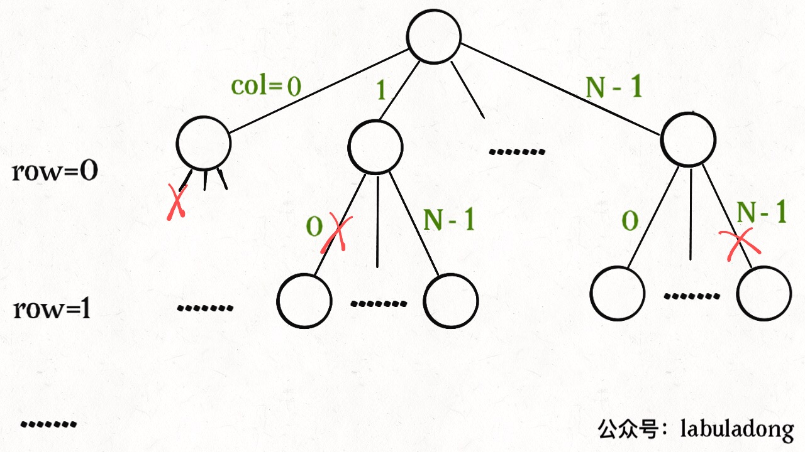
                */
                continue;
            }
            // 做选择
            board[row][col] = 'Q';
            // 进入下一行决策
            backtrack(board, row + 1);
            // 撤销选择
            board[row][col] = '.';
        }
    }

    /* 是否可以在 board[row][col] 放置皇后？*/
    bool isValid(vector<string>& board, int row, int col) {
        int n = board.size();
        // 检查列是否有皇后互相冲突
        for (int i = 0; i <= row; i++) {
            if (board[i][col] == 'Q')
                return false;
        }
        // 检查右上方是否有皇后互相冲突
        for (int i = row - 1, j = col + 1;
             i >= 0 && j < n; i--, j++) {
            if (board[i][j] == 'Q')
                return false;
        }
        // 检查左上方是否有皇后互相冲突
        for (int i = row - 1, j = col - 1;
             i >= 0 && j >= 0; i--, j--) {
            if (board[i][j] == 'Q')
                return false;
        }
        return true;
    }
};
```

```go
// by chatGPT (go)
type backtracking struct {
    res [][]string
}

func (b *backtracking) solveNQueens(n int) [][]string {
    board := make([]string, n)
    for i := 0; i < n; i++ {
        board[i] = strings.Repeat(".", n)
    }
    b.backtrack(board, 0)
    return b.res
}

func (b *backtracking) backtrack(board []string, row int) {
    if row == len(board) {
        temp := make([]string, len(board))
        copy(temp, board)
        b.res = append(b.res, temp)
        return
    }

    n := len(board[row])
    for col := 0; col < n; col++ {
        if !b.isValid(board, row, col) {
            // 排除不合法选择
            continue
        }
        // 做选择
        board[row] = board[row][:col] + "Q" + board[row][col+1:]
        // 进入下一行决策
        b.backtrack(board, row+1)
        // 撤销选择
        board[row] = board[row][:col] + "." + board[row][col+1:]
    }
}

func (b *backtracking) isValid(board []string, row, col int) bool {
    n := len(board)
    // 检查列是否有皇后互相冲突
    for i := 0; i <= row; i++ {
        if board[i][col] == 'Q' {
            return false
        }
    }
    // 检查右上方是否有皇后互相冲突
    for i, j := row-1, col+1; i >= 0 && j < n; i, j = i-1, j+1 {
        if board[i][j] == 'Q' {
            return false
        }
    }
    // 检查左上方是否有皇后互相冲突
    for i, j := row-1, col-1; i >= 0 && j >= 0; i, j = i-1, j-1 {
        if board[i][j] == 'Q' {
            return false
        }
    }
    return true
}
```

```java
// by chatGPT (java)
class Solution {
    List<List<String>> res = new ArrayList<>();

    /**
     * 输入棋盘边长 n，返回所有合法的放置
     */
    public List<List<String>> solveNQueens(int n) {
        // '.' 表示空，'Q' 表示皇后，初始化空棋盘。
        List<String> board = new ArrayList<>();
        StringBuilder sb = new StringBuilder();
        for (int i = 0; i < n; i++) {
            sb.append('.');
        }
        for (int i = 0; i < n; i++) {
            board.add(sb.toString());
        }
        backtrack(board, 0);
        return res;
    }

    /**
     * *路径：board 中小于 row 的那些行都已经成功放置了皇后
     * *选择列表：第 row 行的所有列都是放置皇后的选择
     * *结束条件：row 超过 board 的最后一行
     */
    private void backtrack(List<String> board, int row) {
        if (row == board.size()) {
            res.add(new ArrayList<>(board));
            return;
        }

        int n = board.get(row).length();
        for (int col = 0; col < n; col++) {
            // 排除不合法选择
            if (!isValid(board, row, col)) {
                /**<extend up -200>
                
                */
                continue;
            }
            // 做选择
            char[] arr = board.get(row).toCharArray();
            arr[col] = 'Q';
            board.set(row, String.valueOf(arr));
            // 进入下一行决策
            backtrack(board, row + 1);
            // 撤销选择
            arr[col] = '.';
            board.set(row, String.valueOf(arr));
        }
    }

    /* 是否可以在 board[row][col] 放置皇后？*/
    private boolean isValid(List<String> board, int row, int col) {
        int n = board.size();

        // 检查列是否有皇后互相冲突
        for (int i = 0; i <= row; i++) {
            if (board.get(i).charAt(col) == 'Q') {
                return false;
            }
        }

        // 检查右上方是否有皇后互相冲突
        for (int i = row - 1, j = col + 1; i >= 0 && j < n; i--, j++) {
            if (board.get(i).charAt(j) == 'Q') {
                return false;
            }
        }

        // 检查左上方是否有皇后互相冲突
        for (int i = row - 1, j = col - 1; i >= 0 && j >= 0; i--, j--) {
            if (board.get(i).charAt(j) == 'Q') {
                return false;
            }
        }

        return true;
    }
}
```

```javascript
// by chatGPT (javascript)
var solveNQueens = function(n) {
  var res = [];

  // '.' 表示空，'Q' 表示皇后，初始化空棋盘。
  var board = new Array(n);
  for (var i = 0; i < n; i++) {
    board[i] = new Array(n).fill('.');
  }

  backtrack(board, 0);

  return res;

  // 路径：board 中小于 row 的那些行都已经成功放置了皇后
  // 选择列表：第 row 行的所有列都是放置皇后的选择
  // 结束条件：row 超过 board 的最后一行
  function backtrack(board, row) {
    // 触发结束条件
    if (row === board.length) {
      res.push(Array.from(board, row => row.join('')));
      return;
    }

    var n = board.length;
    for (var col = 0; col < n; col++) {
      // 排除不合法选择
      if (!isValid(board, row, col)) {
        continue;
      }
      // 做选择
      board[row][col] = 'Q';
      // 进入下一行决策
      backtrack(board, row + 1);
      // 撤销选择
      board[row][col] = '.';
    }
  }

  /* 是否可以在 board[row][col] 放置皇后？*/
  function isValid(board, row, col) {
    var n = board.length;
    // 检查列是否有皇后互相冲突
    for (var i = 0; i <= row; i++) {
      if (board[i][col] === 'Q') {
        return false;
      }
    }
    // 检查右上方是否有皇后互相冲突
    for (var i = row - 1, j = col + 1; i >= 0 && j < n; i--, j++) {
      if (board[i][j] === 'Q') {
        return false;
      }
    }
    // 检查左上方是否有皇后互相冲突
    for (var i = row - 1, j = col - 1; i >= 0 && j >= 0; i--, j--) {
      if (board[i][j] === 'Q') {
        return false;
      }
    }
    return true;
  }
};
```

```python
# by chatGPT (python)
class Solution:
    def __init__(self):
        self.res = []

    def solveNQueens(self, n: int) -> List[List[str]]:
        board = [['.' for j in range(n)] for i in range(n)]  # 初始化空棋盘
        self.backtrack(board, 0)
        return self.res

    def backtrack(self, board: List[List[str]], row: int):
        if row == len(board):  # 触发结束条件
            self.res.append([''.join(board[i]) for i in range(len(board))])
            return

        for col in range(len(board[row])):
            if not self.isValid(board, row, col):  # 排除不合法选择
                continue
            board[row][col] = 'Q'  # 做选择
            self.backtrack(board, row + 1)  # 进入下一行决策
            board[row][col] = '.'  # 撤销选择

    def isValid(self, board: List[List[str]], row: int, col: int) -> bool:
        n = len(board)
        # 检查列是否有皇后互相冲突
        for i in range(row + 1):
            if board[i][col] == 'Q':
                return False
        # 检查右上方是否有皇后互相冲突
        for i, j in zip(range(row - 1, -1, -1), range(col + 1, n)):
            if board[i][j] == 'Q':
                return False
        # 检查左上方是否有皇后互相冲突
        for i, j in zip(range(row - 1, -1, -1), range(col - 1, -1, -1)):
            if board[i][j] == 'Q':
                return False
        return True
```

https://leetcode.cn/problems/n-queens 的多语言解法👆

https://leetcode.cn/problems/nZZqjQ 的多语言解法👇

```cpp
// by chatGPT (cpp)
class Solution {
public:
    int minEatingSpeed(vector<int>& piles, int H) {
        int left = 1;
        int right = 1000000000 + 1;
        while (left < right) {
            int mid = left + (right - left) / 2;
            if (f(piles, mid) <= H) {
                right = mid;
            } else {
                left = mid + 1;
            }
        }
        return left;
    }

    // 定义：速度为 x 时，需要 f(x) 小时吃完所有香蕉
    // f(x) 随着 x 的增加单调递减
    int f(vector<int>& piles, int x) {
        int hours = 0;
        for (int pile : piles) {
            hours += (pile + x - 1) / x;
        }
        return hours;
    }
};
```

```go
// by chatGPT (go)
// Go Solution Code for LeetCode Problem 875: Koko Eating Bananas

func minEatingSpeed(piles []int, H int) int {
    left := 1
    right := 1000000000 + 1

    for left < right {
        mid := left + (right - left) / 2
        if f(piles, mid) <= H {
            right = mid
        } else {
            left = mid + 1
        }
    }
    return left
}

// 定义：速度为 x 时，需要 f(x) 小时吃完所有香蕉
// f(x) 随着 x 的增加单调递减
func f(piles []int, x int) int {
    hours := 0
    for i := 0; i < len(piles); i++ {
        hours += piles[i] / x
        if piles[i] % x > 0 {
            hours++
        }
    }
    return hours
}
```

```java
// by labuladong (java)
class Solution {
    public int minEatingSpeed(int[] piles, int H) {
        int left = 1;
        int right = 1000000000 + 1;

        while (left < right) {
            int mid = left + (right - left) / 2;
            if (f(piles, mid) <= H) {
                right = mid;
            } else {
                left = mid + 1;
            }
        }
        return left;
    }

    // 定义：速度为 x 时，需要 f(x) 小时吃完所有香蕉
    // f(x) 随着 x 的增加单调递减
    int f(int[] piles, int x) {
        int hours = 0;
        for (int i = 0; i < piles.length; i++) {
            hours += piles[i] / x;
            if (piles[i] % x > 0) {
                hours++;
            }
        }
        return hours;
    }
}
```

```javascript
// by chatGPT (javascript)
/**
 * @param {number[]} piles
 * @param {number} H
 * @return {number}
 */
var minEatingSpeed = function(piles, H) {
    let left = 1;
    let right = 1000000000 + 1;

    while (left < right) {
        let mid = left + Math.floor((right - left) / 2);
        if (f(piles, mid) <= H) {
            right = mid;
        } else {
            left = mid + 1;
        }
    }
    return left;
};

// 定义：速度为 x 时，需要 f(x) 小时吃完所有香蕉
// f(x) 随着 x 的增加单调递减
function f(piles, x) {
    let hours = 0;
    for (let i = 0; i < piles.length; i++) {
        hours += Math.floor(piles[i] / x);
        if (piles[i] % x > 0) {
            hours++;
        }
    }
    return hours;
}
```

```python
# by chatGPT (python)
class Solution:
    def minEatingSpeed(self, piles: List[int], H: int) -> int:
        left = 1
        right = 1000000000 + 1

        while left < right:
            mid = left + (right - left) // 2
            if self.f(piles, mid) <= H:
                right = mid
            else:
                left = mid + 1
        return left

    # 定义：速度为 x 时，需要 f(x) 小时吃完所有香蕉
    # f(x) 随着 x 的增加单调递减
    def f(self, piles: List[int], x: int) -> int:
        hours = 0
        for i in range(len(piles)):
            hours += piles[i] // x
            if piles[i] % x > 0:
                hours += 1
        return hours
```

https://leetcode.cn/problems/nZZqjQ 的多语言解法👆

https://leetcode.cn/problems/nearest-exit-from-entrance-in-maze 的多语言解法👇

```cpp
// by chatGPT (cpp)
class Solution {
public:
    int nearestExit(vector<vector<char>>& maze, vector<int>& entrance) {
        int m = maze.size();
        int n = maze[0].size();
        vector<vector<int>> dirs {{0, 1}, {0, -1}, {1, 0}, {-1, 0}};
        
        // BFS 算法的队列和 visited 数组
        queue<vector<int>> queue;
        vector<vector<bool>> visited(m, vector<bool>(n, false));
        queue.push(entrance);
        visited[entrance[0]][entrance[1]] = true;
        // 启动 BFS 算法从 entrance 开始像四周扩散
        int step = 0;
        while (!queue.empty()) {
            int sz = queue.size();
            step++;
            // 扩散当前队列中的所有节点
            for (int i = 0; i < sz; i++) {
                vector<int> cur = queue.front();
                queue.pop();
                // 每个节点都会尝试向上下左右四个方向扩展一步
                for (vector<int> dir : dirs) {
                    int x = cur[0] + dir[0];
                    int y = cur[1] + dir[1];
                    if (x < 0 || x >= m || y < 0 || y >= n
                            || visited[x][y] || maze[x][y] == '+') {
                        continue;
                    }
                    if (x == 0 || x == m - 1 || y == 0 || y == n - 1) {
                        // 走到边界（出口）
                        return step;
                    }
                    visited[x][y] = true;
                    queue.push(vector<int>{x, y});
                }
            }
        }
        return -1;
    }
};
```

```go
// by chatGPT (go)
func nearestExit(maze [][]byte, entrance []int) int {
    m, n := len(maze), len(maze[0])
    dirs := [][]int{{0, 1}, {0, -1}, {1, 0}, {-1, 0}}

    // BFS 算法的队列和 visited 数组
    queue := [][]int{entrance}
    visited := make([][]bool, m)
    for i := 0; i < m; i++ {
        visited[i] = make([]bool, n)
    }
    visited[entrance[0]][entrance[1]] = true
    // 启动 BFS 算法从 entrance 开始像四周扩散
    step := 0
    for len(queue) > 0 {
        sz := len(queue)
        step++
        // 扩散当前队列中的所有节点
        for i := 0; i < sz; i++ {
            cur := queue[0]
            queue = queue[1:]
            // 每个节点都会尝试向上下左右四个方向扩展一步
            for _, dir := range dirs {
                x := cur[0] + dir[0]
                y := cur[1] + dir[1]
                if x < 0 || x >= m || y < 0 || y >= n || visited[x][y] || maze[x][y] == '+' {
                    continue
                }
                if x == 0 || x == m-1 || y == 0 || y == n-1 {
                    // 走到边界（出口）
                    return step
                }
                visited[x][y] = true
                queue = append(queue, []int{x, y})
            }
        }
    }
    return -1
}
```

```java
// by labuladong (java)
class Solution {
    public int nearestExit(char[][] maze, int[] entrance) {
        int m = maze.length;
        int n = maze[0].length;
        int[][] dirs = {{0, 1}, {0, -1}, {1, 0}, {-1, 0}};

        // BFS 算法的队列和 visited 数组
        Queue<int[]> queue = new LinkedList<>();
        boolean[][] visited = new boolean[m][n];
        queue.offer(entrance);
        visited[entrance[0]][entrance[1]] = true;
        // 启动 BFS 算法从 entrance 开始像四周扩散
        int step = 0;
        while (!queue.isEmpty()) {
            int sz = queue.size();
            step++;
            // 扩散当前队列中的所有节点
            for (int i = 0; i < sz; i++) {
                int[] cur = queue.poll();
                // 每个节点都会尝试向上下左右四个方向扩展一步
                for (int[] dir : dirs) {
                    int x = cur[0] + dir[0];
                    int y = cur[1] + dir[1];
                    if (x < 0 || x >= m || y < 0 || y >= n
                            || visited[x][y] || maze[x][y] == '+') {
                        continue;
                    }
                    if (x == 0 || x == m - 1 || y == 0 || y == n - 1) {
                        // 走到边界（出口）
                        return step;
                    }
                    visited[x][y] = true;
                    queue.offer(new int[]{x, y});
                }
            }
        }
        return -1;
    }
}
```

```javascript
// by chatGPT (javascript)
var nearestExit = function(maze, entrance) {
    const m = maze.length;
    const n = maze[0].length;
    const dirs = [[0, 1], [0, -1], [1, 0], [-1, 0]];

    // BFS 算法的队列和 visited 数组
    const queue = [];
    const visited = Array(m).fill(0).map(() => Array(n).fill(false));
    queue.push(entrance);
    visited[entrance[0]][entrance[1]] = true;

    // 启动 BFS 算法从 entrance 开始像四周扩散
    let step = 0;
    while (queue.length) {
        const sz = queue.length;
        step++;

        // 扩散当前队列中的所有节点
        for (let i = 0; i < sz; i++) {
            const cur = queue.shift();

            // 每个节点都会尝试向上下左右四个方向扩展一步
            for (const dir of dirs) {
                const x = cur[0] + dir[0];
                const y = cur[1] + dir[1];

                if (x < 0 || x >= m || y < 0 || y >= n || visited[x][y] || maze[x][y] === '+') {
                    continue;
                }

                if (x === 0 || x === m - 1 || y === 0 || y === n - 1) {
                    // 走到边界（出口）
                    return step;
                }

                visited[x][y] = true;
                queue.push([x, y]);
            }
        }
    }

    return -1;
};
```

```python
# by chatGPT (python)
class Solution:
    def nearestExit(self, maze: List[List[str]], entrance: List[int]) -> int:
        m, n = len(maze), len(maze[0])
        dirs = [(0, 1), (0, -1), (1, 0), (-1, 0)]

        # BFS 算法的队列和 visited 数组
        queue = deque()
        visited = [[False] * n for _ in range(m)]
        queue.append(tuple(entrance))
        visited[entrance[0]][entrance[1]] = True
        # 启动 BFS 算法从 entrance 开始像四周扩散
        step = 0
        while queue:
            sz = len(queue)
            step += 1
            # 扩散当前队列中的所有节点
            for _ in range(sz):
                cur_x, cur_y = queue.popleft()
                # 每个节点都会尝试向上下左右四个方向扩展一步
                for dir_x, dir_y in dirs:
                    nxt_x, nxt_y = cur_x + dir_x, cur_y + dir_y
                    if nxt_x < 0 or nxt_x >= m or nxt_y < 0 or nxt_y >= n \
                            or visited[nxt_x][nxt_y] or maze[nxt_x][nxt_y] == '+':
                        continue
                    if nxt_x == 0 or nxt_x == m - 1 or nxt_y == 0 or nxt_y == n - 1:
                        # 走到边界（出口）
                        return step
                    visited[nxt_x][nxt_y] = True
                    queue.append((nxt_x, nxt_y))
        return -1
```

https://leetcode.cn/problems/nearest-exit-from-entrance-in-maze 的多语言解法👆

https://leetcode.cn/problems/network-delay-time 的多语言解法👇

```cpp
// by chatGPT (cpp)
class Solution {
public:
    int networkDelayTime(vector<vector<int>>& times, int n, int k) {
        // 节点编号是从 1 开始的，所以要一个大小为 n + 1 的邻接表
        vector<vector<pair<int, int>>> graph(n + 1);
        for (int i = 1; i <= n; i++) {
            graph[i] = vector<pair<int, int>>();
        }
        // 构造图
        for (auto& edge : times) {
            int from = edge[0];
            int to = edge[1];
            int weight = edge[2];
            // from -> List<(to, weight)>
            // 邻接表存储图结构，同时存储权重信息
            graph[from].emplace_back(to, weight);
        }
        // 启动 dijkstra 算法计算以节点 k 为起点到其他节点的最短路径
        vector<int> distTo = dijkstra(k, graph, n);

        // 找到最长的那一条最短路径
        int res = 0;
        for (int i = 1; i < distTo.size(); i++) {
            if (distTo[i] == INT_MAX) {
                // 有节点不可达，返回 -1
                return -1;
            }
            res = max(res, distTo[i]);
        }
        return res;
    }

private:
    // 输入一个起点 start，计算从 start 到其他节点的最短距离
    vector<int> dijkstra(int start, vector<vector<pair<int, int>>>& graph, int n) {
        // 定义：distTo[i] 的值就是起点 start 到达节点 i 的最短路径权重
        vector<int> distTo(n + 1, INT_MAX);
        // base case，start 到 start 的最短距离就是 0
        distTo[start] = 0;

        // 优先级队列，distFromStart 较小的排在前面
        priority_queue<pair<int, int>, vector<pair<int, int>>, greater<pair<int, int>>> pq;
        // 从起点 start 开始进行 BFS
        pq.emplace(0, start);

        while (!pq.empty()) {
            auto [curDistFromStart, curNodeID] = pq.top();
            pq.pop();

            if (curDistFromStart > distTo[curNodeID]) {
                continue;
            }

            // 将 curNode 的相邻节点装入队列
            for (auto& [nextNodeID, weight] : graph[curNodeID]) {
                int distToNextNode = distTo[curNodeID] + weight;
                // 更新 dp table
                if (distTo[nextNodeID] > distToNextNode) {
                    distTo[nextNodeID] = distToNextNode;
                    pq.emplace(distToNextNode, nextNodeID);
                }
            }
        }
        return distTo;
    }
};
```

```go
// by chatGPT (go)
import (
	"container/heap"
	"math"
)

func networkDelayTime(times [][]int, n int, k int) int {
	// 节点编号是从 1 开始的，所以要一个大小为 n + 1 的邻接表
	graph := make([][][]int, n+1)
	for i := 1; i <= n; i++ {
		graph[i] = make([][]int, 0)
	}

	// 构造图
	for _, edge := range times {
		from := edge[0]
		to := edge[1]
		weight := edge[2]
		// from -> [ [to, weight], ... ]
		// 邻接表存储图结构，同时存储权重信息
		graph[from] = append(graph[from], []int{to, weight})
	}

	// 启动 dijkstra 算法计算以节点 k 为起点到其他节点的最短路径
	distTo := dijkstra(k, graph)

	// 找到最长的那一条最短路径
	res := 0
	for i := 1; i < len(distTo); i++ {
		if distTo[i] == math.MaxInt32 {
			// 有节点不可达，返回 -1
			return -1
		}
		res = max(res, distTo[i])
	}
	return res
}

type State struct {
	// 图节点的 id
	id int
	// 从 start 节点到当前节点的距离
	distFromStart int
}

type PriorityQueue []*State

func (pq PriorityQueue) Len() int { return len(pq) }
func (pq PriorityQueue) Less(i, j int) bool {
	return pq[i].distFromStart < pq[j].distFromStart
}
func (pq PriorityQueue) Swap(i, j int) { pq[i], pq[j] = pq[j], pq[i] }

func (pq *PriorityQueue) Push(x interface{}) {
	item := x.(*State)
	*pq = append(*pq, item)
}

func (pq *PriorityQueue) Pop() interface{} {
	old := *pq
	n := len(old)
	item := old[n-1]
	old[n-1] = nil       // avoid memory leak
	*pq = old[0 : n-1]
	return item
}

// 输入一个起点 start，计算从 start 到其他节点的最短距离
func dijkstra(start int, graph [][][]int) []int {
	// 定义：distTo[i] 的值就是起点 start 到达节点 i 的最短路径权重
	distTo := make([]int, len(graph))
	for i := 1; i < len(graph); i++ {
		distTo[i] = math.MaxInt32
	}
	// base case，start 到 start 的最短距离就是 0
	distTo[start] = 0

	// 优先级队列，distFromStart 较小的排在前面
	pq := make(PriorityQueue, 0)
	heap.Init(&pq)
	// 从起点 start 开始进行 BFS
	heap.Push(&pq, &State{id: start, distFromStart: 0})

	for pq.Len() > 0 {
		curState := heap.Pop(&pq).(*State)
		curNodeID := curState.id
		curDistFromStart := curState.distFromStart

		if curDistFromStart > distTo[curNodeID] {
			continue
		}

		// 将 curNode 的相邻节点装入队列
		for _, neighbor := range graph[curNodeID] {
			nextNodeID := neighbor[0]
			distToNextNode := distTo[curNodeID] + neighbor[1]
			// 更新 dp table
			if distTo[nextNodeID] > distToNextNode {
				distTo[nextNodeID] = distToNextNode
				heap.Push(&pq, &State{id: nextNodeID, distFromStart: distToNextNode})
			}
		}
	}
	return distTo
}

func max(a, b int) int {
	if a > b {
		return a
	}
	return b
}
```

```java
// by labuladong (java)
class Solution {
    public int networkDelayTime(int[][] times, int n, int k) {
        // 节点编号是从 1 开始的，所以要一个大小为 n + 1 的邻接表
        List<int[]>[] graph = new LinkedList[n + 1];
        for (int i = 1; i <= n; i++) {
            graph[i] = new LinkedList<>();
        }
        // 构造图
        for (int[] edge : times) {
            int from = edge[0];
            int to = edge[1];
            int weight = edge[2];
            // from -> List<(to, weight)>
            // 邻接表存储图结构，同时存储权重信息
            graph[from].add(new int[]{to, weight});
        }
        // 启动 dijkstra 算法计算以节点 k 为起点到其他节点的最短路径
        int[] distTo = dijkstra(k, graph);

        // 找到最长的那一条最短路径
        int res = 0;
        for (int i = 1; i < distTo.length; i++) {
            if (distTo[i] == Integer.MAX_VALUE) {
                // 有节点不可达，返回 -1
                return -1;
            }
            res = Math.max(res, distTo[i]);
        }
        return res;
    }

    class State {
        // 图节点的 id
        int id;
        // 从 start 节点到当前节点的距离
        int distFromStart;

        State(int id, int distFromStart) {
            this.id = id;
            this.distFromStart = distFromStart;
        }
    }

    // 输入一个起点 start，计算从 start 到其他节点的最短距离
    int[] dijkstra(int start, List<int[]>[] graph) {
        // 定义：distTo[i] 的值就是起点 start 到达节点 i 的最短路径权重
        int[] distTo = new int[graph.length];
        Arrays.fill(distTo, Integer.MAX_VALUE);
        // base case，start 到 start 的最短距离就是 0
        distTo[start] = 0;

        // 优先级队列，distFromStart 较小的排在前面
        Queue<State> pq = new PriorityQueue<>((a, b) -> {
            return a.distFromStart - b.distFromStart;
        });
        // 从起点 start 开始进行 BFS
        pq.offer(new State(start, 0));

        while (!pq.isEmpty()) {
            State curState = pq.poll();
            int curNodeID = curState.id;
            int curDistFromStart = curState.distFromStart;

            if (curDistFromStart > distTo[curNodeID]) {
                continue;
            }

            // 将 curNode 的相邻节点装入队列
            for (int[] neighbor : graph[curNodeID]) {
                int nextNodeID = neighbor[0];
                int distToNextNode = distTo[curNodeID] + neighbor[1];
                // 更新 dp table
                if (distTo[nextNodeID] > distToNextNode) {
                    distTo[nextNodeID] = distToNextNode;
                    pq.offer(new State(nextNodeID, distToNextNode));
                }
            }
        }
        return distTo;
    }
}
```

```javascript
// by chatGPT (javascript)
var networkDelayTime = function(times, n, k) {
    // 节点编号是从 1 开始的，所以要一个大小为 n + 1 的邻接表
    let graph = new Array(n + 1);
    for (let i = 1; i <= n; i++) {
        graph[i] = [];
    }
    // 构造图
    for (let edge of times) {
        let from = edge[0];
        let to = edge[1];
        let weight = edge[2];
        // from -> List<(to, weight)>
        // 邻接表存储图结构，同时存储权重信息
        graph[from].push([to, weight]);
    }
    // 启动 dijkstra 算法计算以节点 k 为起点到其他节点的最短路径
    let distTo = dijkstra(k, graph);

    // 找到最长的那一条最短路径
    let res = 0;
    for (let i = 1; i < distTo.length; i++) {
        if (distTo[i] === Infinity) {
            // 有节点不可达，返回 -1
            return -1;
        }
        res = Math.max(res, distTo[i]);
    }
    return res;
};

class State {
    // 图节点的 id
    constructor(id, distFromStart) {
        this.id = id;
        // 从 start 节点到当前节点的距离
        this.distFromStart = distFromStart;
    }
}

// 输入一个起点 start，计算从 start 到其他节点的最短距离
function dijkstra(start, graph) {
    // 定义：distTo[i] 的值就是起点 start 到达节点 i 的最短路径权重
    let distTo = new Array(graph.length).fill(Infinity);
    // base case，start 到 start 的最短距离就是 0
    distTo[start] = 0;

    // 优先级队列，distFromStart 较小的排在前面
    let pq = [];
    // 从起点 start 开始进行 BFS
    pq.push(new State(start, 0));
    pq.sort((a, b) => {
        return a.distFromStart - b.distFromStart;
    });

    while (pq.length > 0) {
        let curState = pq.shift();
        let curNodeID = curState.id;
        let curDistFromStart = curState.distFromStart;

        if (curDistFromStart > distTo[curNodeID]) {
            continue;
        }

        // 将 curNode 的相邻节点装入队列
        for (let neighbor of graph[curNodeID]) {
            let nextNodeID = neighbor[0];
            let distToNextNode = distTo[curNodeID] + neighbor[1];
            // 更新 dp table
            if (distTo[nextNodeID] > distToNextNode) {
                distTo[nextNodeID] = distToNextNode;
                pq.push(new State(nextNodeID, distToNextNode));
                pq.sort((a, b) => {
                    return a.distFromStart - b.distFromStart;
                });
            }
        }
    }
    return distTo;
}
```

```python
# by chatGPT (python)
import heapq
from typing import List

class Solution:
    def networkDelayTime(self, times: List[List[int]], n: int, k: int) -> int:
        # 节点编号是从 1 开始的，所以要一个大小为 n + 1 的邻接表
        graph = [[] for _ in range(n+1)]
        for edge in times:
            from_node, to_node, weight = edge[0], edge[1], edge[2]
            # from -> List<(to, weight)>
            # 邻接表存储图结构，同时存储权重信息
            graph[from_node].append((to_node, weight))
        # 启动 dijkstra 算法计算以节点 k 为起点到其他节点的最短路径
        dist_to = self.dijkstra(k, graph)

        # 找到最长的那一条最短路径
        res = 0
        for i in range(1, len(dist_to)):
            if dist_to[i] == float('inf'):
                # 有节点不可达，返回 -1
                return -1
            res = max(res, dist_to[i])
        return res

    class State:
        # 图节点的 id
        def __init__(self, id: int, dist_from_start: int):
            self.id = id
            # 从 start 节点到当前节点的距离
            self.dist_from_start = dist_from_start

        def __lt__(self, other):
            return self.dist_from_start < other.dist_from_start

    # 输入一个起点 start，计算从 start 到其他节点的最短距离
    def dijkstra(self, start: int, graph: List[List[int]]) -> List[int]:
        # 定义：distTo[i] 的值就是起点 start 到达节点 i 的最短路径权重
        dist_to = [float('inf')] * len(graph)
        # base case，start 到 start 的最短距离就是 0
        dist_to[start] = 0

        # 优先级队列，distFromStart 较小的排在前面
        pq = [Solution.State(start, 0)]
        # 从起点 start 开始进行 BFS
        heapq.heapify(pq)

        while pq:
            cur_state = heapq.heappop(pq)
            cur_node_id = cur_state.id
            cur_dist_from_start = cur_state.dist_from_start

            if cur_dist_from_start > dist_to[cur_node_id]:
                continue

            # 将 cur_node 的相邻节点装入队列
            for neighbor in graph[cur_node_id]:
                next_node_id, dist_to_next_node = neighbor[0], dist_to[cur_node_id] + neighbor[1]
                # 更新 dp table
                if dist_to[next_node_id] > dist_to_next_node:
                    dist_to[next_node_id] = dist_to_next_node
                    heapq.heappush(pq, Solution.State(next_node_id, dist_to_next_node))
        return dist_to
```

https://leetcode.cn/problems/network-delay-time 的多语言解法👆

https://leetcode.cn/problems/next-greater-element-i 的多语言解法👇

```cpp
// by chatGPT (cpp)
class Solution {
public:
    vector<int> nextGreaterElement(vector<int>& nums1, vector<int>& nums2) {
        // 记录 nums2 中每个元素的下一个更大元素
        vector<int> greater = nextGreaterElement(nums2);
        // 转化成映射：元素 x -> x 的下一个最大元素
        map<int, int> greaterMap;
        for (int i = 0; i < nums2.size(); i++) {
            greaterMap[nums2[i]] = greater[i];
        }
        // nums1 是 nums2 的子集，所以根据 greaterMap 可以得到结果
        vector<int> res(nums1.size());
        for (int i = 0; i < nums1.size(); i++) {
            res[i] = greaterMap[nums1[i]];
        }
        return res;
    }

    // 计算 nums 中每个元素的下一个更大元素
    vector<int> nextGreaterElement(vector<int>& nums) {
        int n = nums.size();
        // 存放答案的数组
        vector<int> res(n);
        stack<int> s;
        // 倒着往栈里放
        for (int i = n - 1; i >= 0; i--) {
            // 判定个子高矮
            while (!s.empty() && s.top() <= nums[i]) {
                // 矮个起开，反正也被挡着了。。。
                s.pop();
            }
            // nums[i] 身后的下一个更大元素
            res[i] = s.empty() ? -1 : s.top();
            s.push(nums[i]);
        }
        return res;
    }
};
```

```go
// by chatGPT (go)
import "fmt"

func nextGreaterElement(nums1 []int, nums2 []int) []int {
    // 记录 nums2 中每个元素的下一个更大元素
    greater := nextGreater(nums2)
    // 转化成映射：元素 x -> x 的下一个最大元素
    greaterMap := make(map[int]int)
    for i, v := range nums2 {
        greaterMap[v] = greater[i]
    }
    // nums1 是 nums2 的子集，所以根据 greaterMap 可以得到结果
    res := make([]int, len(nums1))
    for i, v := range nums1 {
        res[i] = greaterMap[v]
    }
    return res
}

// 计算 nums 中每个元素的下一个更大元素
func nextGreater(nums []int) []int {
    n := len(nums)
    // 存放答案的数组
    res := make([]int, n)
    s := []int{}
    // 倒着往栈里放
    for i := n - 1; i >= 0; i-- {
        // 判定个子高矮
        for len(s) != 0 && s[len(s)-1] <= nums[i] {
            // 矮个起开，反正也被挡着了。。。
            s = s[:len(s)-1]
        }
        // nums[i] 身后的下一个更大元素
        if len(s) == 0 {
            res[i] = -1
        } else {
            res[i] = s[len(s)-1]
        }
        s = append(s, nums[i])
    }
    return res
}
```

```java
// by labuladong (java)
class Solution {
    public int[] nextGreaterElement(int[] nums1, int[] nums2) {
        // 记录 nums2 中每个元素的下一个更大元素
        int[] greater = nextGreaterElement(nums2);
        // 转化成映射：元素 x -> x 的下一个最大元素
        HashMap<Integer, Integer> greaterMap = new HashMap<>();
        for (int i = 0; i < nums2.length; i++) {
            greaterMap.put(nums2[i], greater[i]);
        }
        // nums1 是 nums2 的子集，所以根据 greaterMap 可以得到结果
        int[] res = new int[nums1.length];
        for (int i = 0; i < nums1.length; i++) {
            res[i] = greaterMap.get(nums1[i]);
        }
        return res;
    }

    // 计算 nums 中每个元素的下一个更大元素
    int[] nextGreaterElement(int[] nums) {
        int n = nums.length;
        // 存放答案的数组
        int[] res = new int[n];
        Stack<Integer> s = new Stack<>();
        // 倒着往栈里放
        for (int i = n - 1; i >= 0; i--) {
            // 判定个子高矮
            while (!s.isEmpty() && s.peek() <= nums[i]) {
                // 矮个起开，反正也被挡着了。。。
                s.pop();
            }
            // nums[i] 身后的下一个更大元素
            res[i] = s.isEmpty() ? -1 : s.peek();
            s.push(nums[i]);
        }
        return res;
    }
}
```

```javascript
// by chatGPT (javascript)
var nextGreaterElement = function(nums1, nums2) {
    // 记录 nums2 中每个元素的下一个更大元素
    var greater = nextGreater(nums2);
    // 转化成映射：元素 x -> x 的下一个最大元素
    var greaterMap = new Map();
    for (var i = 0; i < nums2.length; i++) {
        greaterMap.set(nums2[i], greater[i]);
    }
    // nums1 是 nums2 的子集，所以根据 greaterMap 可以得到结果
    var res = new Array(nums1.length);
    for (var i = 0; i < nums1.length; i++) {
        res[i] = greaterMap.get(nums1[i]);
    }
    return res;
};

// 计算 nums 中每个元素的下一个更大元素
var nextGreater = function(nums) {
    var n = nums.length;
    // 存放答案的数组
    var res = new Array(n);
    var s = [];
    // 倒着往栈里放
    for (var i = n - 1; i >= 0; i--) {
        // 判定个子高矮
        while (s.length && s[s.length-1] <= nums[i]) {
            // 矮个起开，反正也被挡着了。。。
            s.pop();
        }
        // nums[i] 身后的下一个更大元素
        res[i] = s.length == 0 ? -1 : s[s.length-1];
        s.push(nums[i]);
    }
    return res;
};
```

```python
# by chatGPT (python)
class Solution:
    def nextGreaterElement(self, nums1: List[int], nums2: List[int]) -> List[int]:
        # 记录 nums2 中每个元素的下一个更大元素
        greater = self.nextGreater(nums2)
        # 转化成映射：元素 x -> x 的下一个最大元素
        greaterMap = {}
        for i in range(len(nums2)):
            greaterMap[nums2[i]] = greater[i]
        # nums1 是 nums2 的子集，所以根据 greaterMap 可以得到结果
        res = []
        for num in nums1:
            res.append(greaterMap[num])
        return res

    # 计算 nums 中每个元素的下一个更大元素
    def nextGreater(self, nums: List[int]) -> List[int]:
        n = len(nums)
        # 存放答案的数组
        res = [-1] * n
        s = []
        # 倒着往栈里放
        for i in range(n - 1, -1, -1):
            # 判定个子高矮
            while s and s[-1] <= nums[i]:
                # 矮个起开，反正也被挡着了。。。
                s.pop()
            # nums[i] 身后的下一个更大元素
            if s:
                res[i] = s[-1]
            s.append(nums[i])
        return res
```

https://leetcode.cn/problems/next-greater-element-i 的多语言解法👆

https://leetcode.cn/problems/nim-game 的多语言解法👇

```cpp
// by chatGPT (cpp)
class Solution {
public:
    bool canWinNim(int n) {
        // 如果上来就踩到 4 的倍数，那就认输吧
        // 否则，可以把对方控制在 4 的倍数，必胜
        return n % 4 != 0;
    }
};
```

```go
// by chatGPT (go)
func canWinNim(n int) bool {
    // 如果上来就踩到 4 的倍数，那就认输吧
    // 否则，可以把对方控制在 4 的倍数，必胜
    return n % 4 != 0
}
```

```java
// by labuladong (java)
class Solution {
    public boolean canWinNim(int n) {
        // 如果上来就踩到 4 的倍数，那就认输吧
        // 否则，可以把对方控制在 4 的倍数，必胜
        return n % 4 != 0;
    }
}
```

```javascript
// by chatGPT (javascript)
var canWinNim = function(n) {
    // 如果上来就踩到 4 的倍数，那就认输吧
    // 否则，可以把对方控制在 4 的倍数，必胜
    return n % 4 !== 0;
};
```

```python
# by chatGPT (python)
class Solution:
    def canWinNim(self, n: int) -> bool:
        # 如果上来就踩到 4 的倍数，那就认输吧
        # 否则，可以把对方控制在 4 的倍数，必胜
        return n % 4 != 0
```

https://leetcode.cn/problems/nim-game 的多语言解法👆

https://leetcode.cn/problems/non-decreasing-subsequences 的多语言解法👇

```cpp
// by chatGPT (cpp)
class Solution {
public:
    vector<vector<int>> findSubsequences(vector<int>& nums) {
        if (nums.empty()) {
            return res;
        }
        backtrack(nums, 0);
        return res;
    }
    
private:
    vector<vector<int>> res;
    // 记录回溯的路径
    deque<int> track;  
    
    // 回溯算法主函数
    void backtrack(vector<int>& nums, int start) {
        if (track.size() >= 2) {
            // 找到一个合法答案
            res.push_back(vector<int>(track.begin(), track.end()));
        }
        // 用哈希集合防止重复选择相同元素
        unordered_set<int> used;
        // 回溯算法标准框架
        for (int i = start; i < nums.size(); i++) {
            // 保证集合中元素都是递增顺序
            if (!track.empty() && track.back() > nums[i]) {
                continue;
            }
            // 保证不要重复使用相同的元素
            if (used.count(nums[i])) {
                continue;
            }
            // 选择 nums[i]
            used.insert(nums[i]);
            track.push_back(nums[i]);
            // 递归遍历下一层回溯树
            backtrack(nums, i + 1);
            // 撤销选择 nums[i]
            track.pop_back();
        }
    }
};
```

```go
// by chatGPT (go)
func findSubsequences(nums []int) [][]int {
    res := [][]int{}
    if len(nums) == 0 {
        return res
    }
    track := []int{}
    backtrack(nums, 0, &track, &res)
    return res
}

// 回溯算法主函数
func backtrack(nums []int, start int, track *[]int, res *[][]int) {
    if len(*track) >= 2 {
        // 找到一个合法答案
        temp := make([]int, len(*track))
        copy(temp, *track)
        *res = append(*res, temp)
    }
    // 用哈希集合防止重复选择相同元素
    used := make(map[int]bool)
    // 回溯算法标准框架
    for i := start; i < len(nums); i++ {
        // 保证集合中元素都是递增顺序
        if len(*track) > 0 && (*track)[len(*track)-1] > nums[i] {
            continue
        }
        // 保证不要重复使用相同的元素
        if used[nums[i]] {
            continue
        }
        // 选择 nums[i]
        used[nums[i]] = true
        *track = append(*track, nums[i])
        // 递归遍历下一层回溯树
        backtrack(nums, i+1, track, res)
        // 撤销选择 nums[i]
        *track = (*track)[:len(*track)-1]
    }
}
```

```java
// by labuladong (java)
class Solution {
    public List<List<Integer>> findSubsequences(int[] nums) {
        if (nums.length == 0) {
            return res;
        }
        backtrack(nums, 0);
        return res;
    }

    List<List<Integer>> res = new LinkedList<>();
    // 记录回溯的路径
    LinkedList<Integer> track = new LinkedList<>();

    // 回溯算法主函数
    void backtrack(int[] nums, int start) {
        if (track.size() >= 2) {
            // 找到一个合法答案
            res.add(new LinkedList<>(track));
        }
        // 用哈希集合防止重复选择相同元素
        HashSet<Integer> used = new HashSet<>();
        // 回溯算法标准框架
        for (int i = start; i < nums.length; i++) {
            // 保证集合中元素都是递增顺序
            if (!track.isEmpty() && track.getLast() > nums[i]) {
                continue;
            }
            // 保证不要重复使用相同的元素
            if (used.contains(nums[i])) {
                /**<extend up -200>
                 
                 */
                continue;
            }
            // 选择 nums[i]
            used.add(nums[i]);
            track.add(nums[i]);
            // 递归遍历下一层回溯树
            backtrack(nums, i + 1);
            // 撤销选择 nums[i]
            track.removeLast();
        }
    }
}
```

```javascript
// by chatGPT (javascript)
/**
 * @param {number[]} nums
 * @return {number[][]}
 */
var findSubsequences = function(nums) {
    var res = [];
    // 记录回溯的路径
    var track = [];

    // 回溯算法主函数
    var backtrack = function(nums, start) {
        if (track.length >= 2) {
            // 找到一个合法答案
            res.push([...track]);
        }
        // 用哈希集合防止重复选择相同元素
        var used = new Set();
        // 回溯算法标准框架
        for (var i = start; i < nums.length; i++) {
            // 保证集合中元素都是递增顺序
            if (track.length!==0 && track[track.length-1] > nums[i]) {
                continue;
            }
            // 保证不要重复使用相同的元素
            if (used.has(nums[i])) {
                /**<extend up -200>
                 
                 */
                continue;
            }
            // 选择 nums[i]
            used.add(nums[i]);
            track.push(nums[i]);
            // 递归遍历下一层回溯树
            backtrack(nums, i + 1);
            // 撤销选择 nums[i]
            track.pop();
        }
    }

    if (nums.length === 0) {
        return res;
    }
    backtrack(nums, 0);
    return res;
};
```

```python
# by chatGPT (python)
class Solution:
    def findSubsequences(self, nums: List[int]) -> List[List[int]]:
        if len(nums) == 0:
            return self.res
        self.backtrack(nums, 0)
        return self.res

    # Initialize empty list for storing result
    res = []
    # Initialize empty list for storing the path
    track = []

    # Backtracking algorithm main function
    def backtrack(self, nums: List[int], start: int) -> None:
        # If a valid answer is found (path has length 2 or greater), add to the result list
        if len(self.track) >= 2:
            self.res.append(self.track[:])
        # Use hash set to avoid selecting duplicate elements
        used = set()
        # Standard backtracking algorithm framework
        for i in range(start, len(nums)):
            # Ensure the elements in the track list are in increasing order
            if len(self.track) > 0 and self.track[-1] > nums[i]:
                continue
            # Avoid using the same element multiple times
            if nums[i] in used:
                # Extend up -200
                # 
                continue
            used.add(nums[i])
            self.track.append(nums[i])
            self.backtrack(nums, i+1)
            self.track.pop()
```

https://leetcode.cn/problems/non-decreasing-subsequences 的多语言解法👆

https://leetcode.cn/problems/non-overlapping-intervals 的多语言解法👇

```cpp
// by chatGPT (cpp)
class Solution {
public:
    int eraseOverlapIntervals(vector<vector<int>>& intervals) {
        int n = intervals.size();
        return n - intervalSchedule(intervals);
    }

    // 区间调度算法，算出 intvs 中最多有几个互不相交的区间
    int intervalSchedule(vector<vector<int>>& intvs) {
        if (intvs.empty()) return 0;
        // 按 end 升序排序
        sort(intvs.begin(), intvs.end(), [](const vector<int>& a, const vector<int>& b){
            return a[1] < b[1];
        });
        // 至少有一个区间不相交
        int count = 1;
        // 排序后，第一个区间就是 x
        int x_end = intvs[0][1];
        for (const auto& interval : intvs) {
            int start = interval[0];
            if (start >= x_end) {
                // 找到下一个选择的区间了
                count++;
                x_end = interval[1];
            }
        }
        return count;
    }
};
```

```go
// by chatGPT (go)
import "sort"

func eraseOverlapIntervals(intervals [][]int) int {
	n := len(intervals)
	return n - intervalSchedule(intervals)
}

// 区间调度算法，算出 intvs 中最多有几个互不相交的区间
func intervalSchedule(intvs [][]int) int {
	if len(intvs) == 0 {
		return 0
	}
	// 按 end 升序排序
	sort.Slice(intvs, func(i, j int) bool {
		return intvs[i][1] < intvs[j][1]
	})
	// 至少有一个区间不相交
	count := 1
	// 排序后，第一个区间就是 x
	xEnd := intvs[0][1]
	for _, interval := range intvs {
		start := interval[0]
		if start >= xEnd {
			// 找到下一个选择的区间了
			count++
			xEnd = interval[1]
		}
	}
	return count
}
```

```java
// by labuladong (java)
class Solution {
    public int eraseOverlapIntervals(int[][] intervals) {
        int n = intervals.length;
        return n - intervalSchedule(intervals);
    }

    // 区间调度算法，算出 intvs 中最多有几个互不相交的区间
    int intervalSchedule(int[][] intvs) {
        if (intvs.length == 0) return 0;
        // 按 end 升序排序
        Arrays.sort(intvs, new Comparator<int[]>() {
            public int compare(int[] a, int[] b) {
                return a[1] - b[1];
            }
        });
        // 至少有一个区间不相交
        int count = 1;
        // 排序后，第一个区间就是 x
        int x_end = intvs[0][1];
        for (int[] interval : intvs) {
            int start = interval[0];
            if (start >= x_end) {
                // 找到下一个选择的区间了
                count++;
                x_end = interval[1];
            }
        }
        return count;
    }
}
```

```javascript
// by chatGPT (javascript)
/**
 * @param {number[][]} intervals
 * @return {number}
 */
var eraseOverlapIntervals = function(intervals) {
    var n = intervals.length;
    return n - intervalSchedule(intervals);
};

/**
 * 区间调度算法，算出 intvs 中最多有几个互不相交的区间
 * @param {number[][]} intvs
 * @return {number}
 */
var intervalSchedule = function(intvs) {
    if (intvs.length === 0) return 0;
    // 按 end 升序排序
    intvs.sort((a, b) => a[1] - b[1]);
    // 至少有一个区间不相交
    var count = 1;
    // 排序后，第一个区间就是 x
    var x_end = intvs[0][1];
    for (var i = 1; i < intvs.length; i++) {
        var start = intvs[i][0];
        if (start >= x_end) {
            // 找到下一个选择的区间了
            count++;
            x_end = intvs[i][1];
        }
    }
    return count;
};
```

```python
# by chatGPT (python)
class Solution:
    def eraseOverlapIntervals(self, intervals: List[List[int]]) -> int:
        n = len(intervals)
        return n - self.intervalSchedule(intervals)

    # 区间调度算法，算出 intvs 中最多有几个互不相交的区间
    def intervalSchedule(self, intvs: List[List[int]]) -> int:
        if len(intvs) == 0:
            return 0
        # 按 end 升序排序
        intvs = sorted(intvs, key=lambda x:x[1])
        # 至少有一个区间不相交
        count = 1
        # 排序后，第一个区间就是 x
        x_end = intvs[0][1]
        for interval in intvs:
            start = interval[0]
            if start >= x_end:
                # 找到下一个选择的区间了
                count += 1
                x_end = interval[1]
        return count
```

https://leetcode.cn/problems/non-overlapping-intervals 的多语言解法👆

https://leetcode.cn/problems/nth-digit 的多语言解法👇

```cpp
// by chatGPT (cpp)
class Solution {
public:
    int findNthDigit(int n) {
        // 位数（一位数，两位数...）
        int digit = 1;
        // 1,10,100, 1000 这样的后缀
        long long base = 1;

        while (n > 9 * base * digit) {
            n -= 9 * base * digit;
            base *= 10;
            digit++;
        }

        // 此时假设 base = 1000，那么说明 n 是 100~999 中的某个三位数的某一位
        // 哪个三位数呢？这样算：
        long long val = base + (n - 1) / digit;
        // 是这个三位数的第几位呢？这样算：
        int index = (n - 1) % digit;

        // 怎么把 val 的第 index 这一位数字抠出来呢？可以转化成字符串来算：
        return to_string(val)[index] - '0';
    }
};
```

```go
// by chatGPT (go)
func findNthDigit(n int) int {
    // 位数（一位数，两位数...）
    digit := 1
    // 1,10,100, 1000 这样的后缀
    base := int64(1)

    for n > 9*base*int64(digit) {
        n -= 9 * int(base) * digit
        base *= 10
        digit++
    }

    // 此时假设 base = 1000，那么说明 n 是 100~999 中的某个三位数的某一位
    // 哪个三位数呢？这样算：
    val := base + (int64(n)-1)/int64(digit)
    // 是这个三位数的第几位呢？这样算：
    index := (n - 1) % digit

    // 怎么把 val 的第 index 这一位数字抠出来呢？可以转化成字符串来算：
    return int(strconv.Itoa(int(val))[index] - '0')
}
```

```java
// by labuladong (java)
class Solution {
    public int findNthDigit(int n) {
        // 位数（一位数，两位数...）
        int digit = 1;
        // 1,10,100, 1000 这样的后缀
        long base = 1;

        while (n > 9 * base * digit) {
            n -= 9 * base * digit;
            base *= 10;
            digit++;
        }

        // 此时假设 base = 1000，那么说明 n 是 100~999 中的某个三位数的某一位
        // 哪个三位数呢？这样算：
        long val = base + (n - 1) / digit;
        // 是这个三位数的第几位呢？这样算：
        int index = (n - 1) % digit;

        // 怎么把 val 的第 index 这一位数字抠出来呢？可以转化成字符串来算：
        return ("" + val).charAt(index) - '0';
    }
}
```

```javascript
// by chatGPT (javascript)
var findNthDigit = function(n) {
  // 位数（一位数，两位数...）
  let digit = 1;
  // 1,10,100, 1000 这样的后缀
  let base = 1;

  while (n > 9 * base * digit) {
    n -= 9 * base * digit;
    base *= 10;
    digit++;
  }

  // 此时假设 base = 1000，那么说明 n 是 100~999 中的某个三位数的某一位
  // 哪个三位数呢？这样算：
  let val = base + Math.floor((n - 1) / digit);
  // 是这个三位数的第几位呢？这样算：
  let index = (n - 1) % digit;

  // 怎么把 val 的第 index 这一位数字抠出来呢？可以转化成字符串来算：
  return ("" + val).charAt(index) - '0';
};
```

```python
# by chatGPT (python)
class Solution:
    def findNthDigit(self, n: int) -> int:
        # 位数（一位数，两位数...）
        digit = 1
        # 1,10,100, 1000 这样的后缀
        base = 1

        while n > 9 * base * digit:
            n -= 9 * base * digit
            base *= 10
            digit += 1

        # 此时假设 base = 1000，那么说明 n 是 100~999 中的某个三位数的某一位
        # 哪个三位数呢？这样算：
        val = base + (n - 1) // digit
        # 是这个三位数的第几位呢？这样算：
        index = (n - 1) % digit

        # 怎么把 val 的第 index 这一位数字抠出来呢？可以转化成字符串来算：
        return int(str(val)[index])
```

https://leetcode.cn/problems/nth-digit 的多语言解法👆

https://leetcode.cn/problems/number-of-1-bits 的多语言解法👇

```cpp
// by chatGPT (cpp)
class Solution {
public:
    // you need to treat n as an unsigned value
    int hammingWeight(uint32_t n) {
        int res = 0;
        while (n != 0) {
            n = n & (n - 1);
            res++;
        }
        return res;
    }
};
```

```go
// by chatGPT (go)
func hammingWeight(n uint32) int {
    res := 0
    for n != 0 {
        n &= n - 1
        res++
    }
    return res
}
```

```java
// by labuladong (java)
public class Solution {
    // you need to treat n as an unsigned value
    public int hammingWeight(int n) {
        int res = 0;
        while (n != 0) {
            n = n & (n - 1);
            res++;
        }
        return res;
    }
}
```

```javascript
// by chatGPT (javascript)
var hammingWeight = function(n) {
    // you need to treat n as an unsigned value
    var res = 0;
    while (n !== 0) {
        n = n & (n - 1);
        res++;
    }
    return res;
}
```

```python
# by chatGPT (python)
class Solution:
    # you need to treat n as an unsigned value
    def hammingWeight(self, n: int) -> int:
        res = 0
        while n != 0:
            n = n & (n-1)
            res += 1
        return res
```

https://leetcode.cn/problems/number-of-1-bits 的多语言解法👆

https://leetcode.cn/problems/number-of-closed-islands 的多语言解法👇

```cpp
// by chatGPT (cpp)
class Solution {
public:
    // 主函数：计算封闭岛屿的数量
    int closedIsland(vector<vector<int>>& grid) {
        int m = grid.size(), n = grid[0].size();
        for (int j = 0; j < n; j++) {
            // 把靠上边的岛屿淹掉
            dfs(grid, 0, j);
            // 把靠下边的岛屿淹掉
            dfs(grid, m - 1, j);
        }
        for (int i = 0; i < m; i++) {
            // 把靠左边的岛屿淹掉
            dfs(grid, i, 0);
            // 把靠右边的岛屿淹掉
            dfs(grid, i, n - 1);
        }
        // 遍历 grid，剩下的岛屿都是封闭岛屿
        int res = 0;
        for (int i = 0; i < m; i++) {
            for (int j = 0; j < n; j++) {
                if (grid[i][j] == 0) {
                    res++;
                    dfs(grid, i, j);
                }
            }
        }
        return res;
    }

    // 从 (i, j) 开始，将与之相邻的陆地都变成海水
    void dfs(vector<vector<int>>& grid, int i, int j) {
        int m = grid.size(), n = grid[0].size();
        if (i < 0 || j < 0 || i >= m || j >= n) {
            return;
        }
        if (grid[i][j] == 1) {
            // 已经是海水了
            return;
        }
        // 将 (i, j) 变成海水
        grid[i][j] = 1;
        // 淹没上下左右的陆地
        dfs(grid, i + 1, j);
        dfs(grid, i, j + 1);
        dfs(grid, i - 1, j);
        dfs(grid, i, j - 1);
    }
};
```

```go
// by chatGPT (go)
// 计算封闭岛屿的数量
func closedIsland(grid [][]int) int {
    m, n := len(grid), len(grid[0])
    for j := 0; j < n; j++ {
        // 把靠上边的岛屿淹掉
        dfs(grid, 0, j)
        // 把靠下边的岛屿淹掉
        dfs(grid, m-1, j)
    }
    for i := 0; i < m; i++ {
        // 把靠左边的岛屿淹掉
        dfs(grid, i, 0)
        // 把靠右边的岛屿淹掉
        dfs(grid, i, n-1)
    }
    // 遍历 grid，剩下的岛屿都是封闭岛屿
    res := 0
    for i := 0; i < m; i++ {
        for j := 0; j < n; j++ {
            if grid[i][j] == 0 {
                res++
                dfs(grid, i, j)
            }
        }
    }
    return res
}

// 从 (i, j) 开始，将与之相邻的陆地都变成海水
func dfs(grid [][]int, i, j int) {
    m, n := len(grid), len(grid[0])
    if i < 0 || j < 0 || i >= m || j >= n {
        return
    }
    if grid[i][j] == 1 {
        // 已经是海水了
        return
    }
    // 将 (i, j) 变成海水
    grid[i][j] = 1
    // 淹没上下左右的陆地
    dfs(grid, i+1, j)
    dfs(grid, i, j+1)
    dfs(grid, i-1, j)
    dfs(grid, i, j-1)
}
```

```java
// by labuladong (java)
class Solution {
     // 主函数：计算封闭岛屿的数量
    public int closedIsland(int[][] grid) {
        int m = grid.length, n = grid[0].length;
        for (int j = 0; j < n; j++) {
            // 把靠上边的岛屿淹掉
            dfs(grid, 0, j);
            // 把靠下边的岛屿淹掉
            dfs(grid, m - 1, j);
        }
        for (int i = 0; i < m; i++) {
            // 把靠左边的岛屿淹掉
            dfs(grid, i, 0);
            // 把靠右边的岛屿淹掉
            dfs(grid, i, n - 1);
        }
        // 遍历 grid，剩下的岛屿都是封闭岛屿
        int res = 0;
        for (int i = 0; i < m; i++) {
            for (int j = 0; j < n; j++) {
                if (grid[i][j] == 0) {
                    res++;
                    dfs(grid, i, j);
                }
            }
        }
        return res;
    }

    // 从 (i, j) 开始，将与之相邻的陆地都变成海水
    void dfs(int[][] grid, int i, int j) {
        int m = grid.length, n = grid[0].length;
        if (i < 0 || j < 0 || i >= m || j >= n) {
            return;
        }
        if (grid[i][j] == 1) {
            // 已经是海水了
            return;
        }
        // 将 (i, j) 变成海水
        grid[i][j] = 1;
        // 淹没上下左右的陆地
        dfs(grid, i + 1, j);
        dfs(grid, i, j + 1);
        dfs(grid, i - 1, j);
        dfs(grid, i, j - 1);
    }
}
```

```javascript
// by chatGPT (javascript)
var closedIsland = function(grid) {
    var m = grid.length, n = grid[0].length;
    for (var j = 0; j < n; j++) {
        // 把靠上边的岛屿淹掉
        dfs(grid, 0, j);
        // 把靠下边的岛屿淹掉
        dfs(grid, m - 1, j);
    }
    for (var i = 0; i < m; i++) {
        // 把靠左边的岛屿淹掉
        dfs(grid, i, 0);
        // 把靠右边的岛屿淹掉
        dfs(grid, i, n - 1);
    }
    // 遍历 grid，剩下的岛屿都是封闭岛屿
    var res = 0;
    for (var i = 0; i < m; i++) {
        for (var j = 0; j < n; j++) {
            if (grid[i][j] === 0) {
                res++;
                dfs(grid, i, j);
            }
        }
    }
    return res;
}

// 从 (i, j) 开始，将与之相邻的陆地都变成海水
function dfs(grid, i, j) {
    var m = grid.length, n = grid[0].length;
    if (i < 0 || j < 0 || i >= m || j >= n) {
        return;
    }
    if (grid[i][j] === 1) {
        // 已经是海水了
        return;
    }
    // 将 (i, j) 变成海水
    grid[i][j] = 1;
    // 淹没上下左右的陆地
    dfs(grid, i + 1, j);
    dfs(grid, i, j + 1);
    dfs(grid, i - 1, j);
    dfs(grid, i, j - 1);
}
```

```python
# by chatGPT (python)
class Solution:
    def closedIsland(self, grid: List[List[int]]) -> int:
        m, n = len(grid), len(grid[0])
        for j in range(n):
            # 把靠上边的岛屿淹掉
            self.dfs(grid, 0, j)
            # 把靠下边的岛屿淹掉
            self.dfs(grid, m - 1, j)
        for i in range(m):
            # 把靠左边的岛屿淹掉
            self.dfs(grid, i, 0)
            # 把靠右边的岛屿淹掉
            self.dfs(grid, i, n - 1)
        # 遍历 grid，剩下的岛屿都是封闭岛屿
        res = 0
        for i in range(m):
            for j in range(n):
                if grid[i][j] == 0:
                    res += 1
                    self.dfs(grid, i, j)
        return res

    # 从 (i, j) 开始，将与之相邻的陆地都变成海水
    def dfs(self, grid: List[List[int]], i: int, j: int) -> None:
        m, n = len(grid), len(grid[0])
        if i < 0 or j < 0 or i >= m or j >= n:
            return
        if grid[i][j] == 1:
            # 已经是海水了
            return
        # 将 (i, j) 变成海水
        grid[i][j] = 1
        # 淹没上下左右的陆地
        self.dfs(grid, i + 1, j)
        self.dfs(grid, i, j + 1)
        self.dfs(grid, i - 1, j)
        self.dfs(grid, i, j - 1)
```

https://leetcode.cn/problems/number-of-closed-islands 的多语言解法👆

https://leetcode.cn/problems/number-of-distinct-islands 的多语言解法👇

```cpp
// by chatGPT (cpp)
class Solution {
public:
    int numDistinctIslands(vector<vector<int>>& grid) {
        int m = grid.size(), n = grid[0].size();
        // 记录所有岛屿的序列化结果
        unordered_set<string> islands;
        for (int i = 0; i < m; i++) {
            for (int j = 0; j < n; j++) {
                if (grid[i][j] == 1) {
                    // 淹掉这个岛屿，同时存储岛屿的序列化结果
                    string s;
                    // 初始的方向可以随便写，不影响正确性
                    dfs(grid, i, j, s, 's'); // 用字符代替数字，方便后续拼接
                    islands.insert(s);
                    /**<extend up -200>
                    
                    */
                }
            }
        }
        // 不相同的岛屿数量
        return islands.size();
    }

private:
    void dfs(vector<vector<int>>& grid, int i, int j, string& s, char dir) {
        int m = grid.size(), n = grid[0].size();
        if (i < 0 || j < 0 || i >= m || j >= n 
            || grid[i][j] == 0) {
            return;
        }
        // 前序遍历位置：进入 (i, j)
        grid[i][j] = 0;
        s += dir;
        dfs(grid, i - 1, j, s, 'u'); // 上
        dfs(grid, i + 1, j, s, 'd'); // 下
        dfs(grid, i, j - 1, s, 'l'); // 左
        dfs(grid, i, j + 1, s, 'r'); // 右
        
        // 后序遍历位置：离开 (i, j)
        s += 'b';
    }
};
```

```go
// by chatGPT (go)
// LeetCode问题“不同岛屿的数量”的解决方案： https://leetcode.com/problems/number-of-distinct-islands/
// 作者：Obadiah Crowe
// 时间：2021年7月29日
import (
	"fmt"
	"strconv"
	"strings"
)

func numDistinctIslands(grid [][]int) int {
	// 计算行数和列数
	m, n := len(grid), len(grid[0])

	// 存储所有不同岛屿的序列化结果
	islands := make(map[string]bool)
	for i := 0; i < m; i++ {
		for j := 0; j < n; j++ {
			if grid[i][j] == 1 {
				// 淹没此岛屿，同时存储其序列化结果
				var sb strings.Builder
				// 初始方向可以是任意的，不会影响正解
				dfs(grid, i, j, &sb, 666)
				islands[sb.String()] = true
				/**<向上扩展-200>
				
				*/
			}
		}
	}

	// 岛屿数量即为不同岛屿序列化结果的数量
	return len(islands)
}

func dfs(grid [][]int, i, j int, sb *strings.Builder, dir int) {
	// 计算行数和列数
	m, n := len(grid), len(grid[0])

	// 如果(i, j)不在网格范围内, 或者是海洋, 直接返回
	if i < 0 || j < 0 || i >= m || j >= n || grid[i][j] == 0 {
		return
	}

	// pre-order: 进入点(i, j)
	grid[i][j] = 0 // 淹没该岛屿
	sb.WriteString(strconv.Itoa(dir) + ",") //记录方向

	dfs(grid, i-1, j, sb, 1) // 上
	dfs(grid, i+1, j, sb, 2) // 下
	dfs(grid, i, j-1, sb, 3) // 左
	dfs(grid, i, j+1, sb, 4) // 右

	// post-order: 离开点(i, j)
	sb.WriteString(strconv.Itoa(-dir) + ",") // 记录方向
}
```

```java
// by labuladong (java)
class Solution {
    public int numDistinctIslands(int[][] grid) {
        int m = grid.length, n = grid[0].length;
        // 记录所有岛屿的序列化结果
        HashSet<String> islands = new HashSet<>();
        for (int i = 0; i < m; i++) {
            for (int j = 0; j < n; j++) {
                if (grid[i][j] == 1) {
                    // 淹掉这个岛屿，同时存储岛屿的序列化结果
                    StringBuilder sb = new StringBuilder();
                    // 初始的方向可以随便写，不影响正确性
                    dfs(grid, i, j, sb, 666);
                    islands.add(sb.toString());
                    /**<extend up -200>
                    
                    */
                }
            }
        }
        // 不相同的岛屿数量
        return islands.size();
    }

    private void dfs(int[][] grid, int i, int j, StringBuilder sb, int dir) {
        int m = grid.length, n = grid[0].length;
        if (i < 0 || j < 0 || i >= m || j >= n 
            || grid[i][j] == 0) {
            return;
        }
        // 前序遍历位置：进入 (i, j)
        grid[i][j] = 0;
        sb.append(dir).append(',');
        
        dfs(grid, i - 1, j, sb, 1); // 上
        dfs(grid, i + 1, j, sb, 2); // 下
        dfs(grid, i, j - 1, sb, 3); // 左
        dfs(grid, i, j + 1, sb, 4); // 右
        
        // 后序遍历位置：离开 (i, j)
        sb.append(-dir).append(',');
    }
}
```

```javascript
// by chatGPT (javascript)
var numDistinctIslands = function(grid) {
    var m = grid.length, n = grid[0].length;
    // Record the serialization results of all islands
    var islands = new Set();
    for(var i=0; i<m; i++) {
        for(var j=0; j<n; j++) {
            if(grid[i][j] == 1) {
                // Drown the island and store the serialization result of the island
                var sb = new StringBuilder();
                // The initial direction can be written randomly, which does not affect the correctness
                dfs(grid, i, j, sb, 666);
                islands.add(sb.toString());
                /**<extend up -200>
                
                */
            }
        }
    } 
    // The number of different islands
    return islands.size();

    function dfs(grid, i, j, sb, dir) {
        if(i<0 || j<0 || i>=m || j>=n || grid[i][j] == 0) {
            return;
        } 
        // Pre-order traversal position: enter (i, j)
        grid[i][j] = 0;
        sb.append(dir).append(',');

        dfs(grid, i-1, j, sb, 1); // up
        dfs(grid, i+1, j, sb, 2); // down
        dfs(grid, i, j-1, sb, 3); // left
        dfs(grid, i, j+1, sb, 4); // right

        // Post-order traversal position: leave (i, j)
        sb.append(-dir).append(',');
    }
};
```

```python
# by chatGPT (python)
class Solution:
    def numDistinctIslands(self, grid: List[List[int]]) -> int:
        m, n = len(grid), len(grid[0])
        islands = set() # 记录所有岛屿的序列化结果
        for i in range(m):
            for j in range(n):
                if grid[i][j] == 1: # 如果岛屿是1
                    # 淹掉这个岛屿，同时存储岛屿的序列化结果
                    sb = [] # 没有StringBuilder，用数组代替
                    # 初始的方向可以随便写，不影响正确性
                    self.dfs(grid, i, j, sb, 666)
                    islands.add("".join(sb))
                    #

        return len(islands) # 返回不同的岛屿数量

    def dfs(self, grid: List[List[int]], i: int, j: int, sb: List[str], dir: int) -> None:
        m, n = len(grid), len(grid[0])
        if i < 0 or j < 0 or i >= m or j >= n or grid[i][j] == 0:
            return
        # 前序遍历位置：进入 (i, j)
        grid[i][j] = 0
        sb.append(str(dir)).append(',')

        self.dfs(grid, i - 1, j, sb, 1)  # 上
        self.dfs(grid, i + 1, j, sb, 2)  # 下
        self.dfs(grid, i, j - 1, sb, 3)  # 左
        self.dfs(grid, i, j + 1, sb, 4)  # 右

        # 后序遍历位置：离开 (i, j)
        sb.append(str(-dir)).append(',')
```

https://leetcode.cn/problems/number-of-distinct-islands 的多语言解法👆

https://leetcode.cn/problems/number-of-enclaves 的多语言解法👇

```cpp
// by chatGPT (cpp)
class Solution {
public:
    int numEnclaves(vector<vector<int>>& grid) {

        int m = grid.size(), n = grid[0].size();
        
        for (int i = 0; i < m; i++) {
            dfs(grid, i, 0);
            dfs(grid, i, n - 1);
        }

        for (int j = 0; j < n; j++) {
            dfs(grid, 0, j);
            dfs(grid, m - 1, j);
        }

        int res = 0;
        for (int i = 0; i < m; i++) {
            for (int j = 0; j < n; j++) {
                if (grid[i][j] == 1) {
                    res += 1;
                }
            }
        }
        return res;
    }

    void dfs(vector<vector<int>>& grid, int i, int j) {
        int m = grid.size(), n = grid[0].size();
        if (i < 0 || j < 0 || i >= m || j >= n || grid[i][j] == 0) {
            return;
        }

        grid[i][j] = 0;

        dfs(grid, i + 1, j);
        dfs(grid, i, j + 1);
        dfs(grid, i - 1, j);
        dfs(grid, i, j - 1);
    }
};
```

```go
// by chatGPT (go)
// LeetCode 题目链接 https://leetcode-cn.com/problems/number-of-enclaves/
func numEnclaves(grid [][]int) int {
    m, n := len(grid), len(grid[0])

    for i := 0; i < m; i++ {
        dfs(grid, i, 0)
        dfs(grid, i, n-1)
    }

    for j := 0; j < n; j++ {
        dfs(grid, 0, j)
        dfs(grid, m-1, j)
    }

    var res int
    for i := 0; i < m; i++ {
        for j := 0; j < n; j++ {
            if grid[i][j] == 1 {
                res += 1
            }
        }
    }
    return res
}

func dfs(grid [][]int, i, j int) {
    m, n := len(grid), len(grid[0])
    if i < 0 || j < 0 || i >= m || j >= n || grid[i][j] == 0 {
        return
    }

    grid[i][j] = 0

    dfs(grid, i+1, j)
    dfs(grid, i, j+1)
    dfs(grid, i-1, j)
    dfs(grid, i, j-1)
}
```

```java
// by labuladong (java)
class Solution {
    public int numEnclaves(int[][] grid) {
        int m = grid.length, n = grid[0].length;

        for (int i = 0; i < m; i++) {
            dfs(grid, i, 0);
            dfs(grid, i, n - 1);
        }

        for (int j = 0; j < n; j++) {
            dfs(grid, 0, j);
            dfs(grid, m - 1, j);
        }

        int res = 0;
        for (int i = 0; i < m; i++) {
            for (int j = 0; j < n; j++) {
                if (grid[i][j] == 1) {
                    res += 1;
                }
            }
        }
        return res;
    }

    void dfs(int[][] grid, int i, int j) {
        int m = grid.length, n = grid[0].length;
        if (i < 0 || j < 0 || i >= m || j >= n || grid[i][j] == 0) {
            return;
        }

        grid[i][j] = 0;

        dfs(grid, i + 1, j);
        dfs(grid, i, j + 1);
        dfs(grid, i - 1, j);
        dfs(grid, i, j - 1);
    }
}
```

```javascript
// by chatGPT (javascript)
/**
 * @param {number[][]} grid
 * @return {number}
 */
var numEnclaves = function(grid) {
    var m = grid.length, n = grid[0].length;

    for (var i = 0; i < m; i++) {
        dfs(grid, i, 0);
        dfs(grid, i, n - 1);
    }

    for (var j = 0; j < n; j++) {
        dfs(grid, 0, j);
        dfs(grid, m - 1, j);
    }

    var res = 0;
    for (var row = 0; row < m; row++) {
        for (var col = 0; col < n; col++) {
            if (grid[row][col] === 1) {
                res += 1;
            }
        }
    }
    return res;
};

function dfs(grid, i, j) {
    var m = grid.length, n = grid[0].length;
    if (i < 0 || j < 0 || i >= m || j >= n || grid[i][j] === 0) {
        return;
    }

    grid[i][j] = 0;

    dfs(grid, i + 1, j);
    dfs(grid, i, j + 1);
    dfs(grid, i - 1, j);
    dfs(grid, i, j - 1);
}
```

```python
# by chatGPT (python)
class Solution:
    def numEnclaves(self, grid: List[List[int]]) -> int:
        m, n = len(grid), len(grid[0])

        for i in range(m):
            self.dfs(grid, i, 0)
            self.dfs(grid, i, n - 1)

        for j in range(n):
            self.dfs(grid, 0, j)
            self.dfs(grid, m - 1, j)

        res = 0
        for i in range(m):
            for j in range(n):
                if grid[i][j] == 1:
                    res += 1
        return res

    def dfs(self, grid: List[List[int]], i: int, j: int) -> None:
        m, n = len(grid), len(grid[0])
        if i < 0 or j < 0 or i >= m or j >= n or grid[i][j] == 0:
            return

        grid[i][j] = 0

        self.dfs(grid, i + 1, j)
        self.dfs(grid, i, j + 1)
        self.dfs(grid, i - 1, j)
        self.dfs(grid, i, j - 1)
```

https://leetcode.cn/problems/number-of-enclaves 的多语言解法👆

https://leetcode.cn/problems/number-of-islands 的多语言解法👇

```cpp
// by chatGPT (cpp)
class Solution {
    // 主函数，计算岛屿数量
public:
    int numIslands(vector<vector<char>>& grid) {
        int res = 0;
        int m = grid.size(), n = grid[0].size();
        // 遍历 grid
        for (int i = 0; i < m; i++) {
            for (int j = 0; j < n; j++) {
                if (grid[i][j] == '1') {
                    // 每发现一个岛屿，岛屿数量加一
                    res++;
                    // 然后使用 DFS 将岛屿淹了
                    dfs(grid, i, j);
                }
            }
        }
        return res;
    }

private:
    // 从 (i, j) 开始，将与之相邻的陆地都变成海水
    void dfs(vector<vector<char>>& grid, int i, int j) {
        int m = grid.size(), n = grid[0].size();
        if (i < 0 || j < 0 || i >= m || j >= n) {
            // 超出索引边界
            return;
        }
        if (grid[i][j] == '0') {
            // 已经是海水了
            return;
        }
        // 将 (i, j) 变成海水
        grid[i][j] = '0';
        // 淹没上下左右的陆地
        dfs(grid, i + 1, j);
        dfs(grid, i, j + 1);
        dfs(grid, i - 1, j);
        dfs(grid, i, j - 1);
    }
};
```

```go
// by chatGPT (go)
func numIslands(grid [][]byte) int {
    res := 0
    m, n := len(grid), len(grid[0])
    // 遍历 grid
    for i := 0; i < m; i++ {
        for j := 0; j < n; j++ {
            if grid[i][j] == '1' {
                // 每发现一个岛屿，岛屿数量加一
                res++
                // 然后使用 DFS 将岛屿淹了
                dfs(grid, i, j)
            }
        }
    }
    return res
}

// 从 (i, j) 开始，将与之相邻的陆地都变成海水
func dfs(grid [][]byte, i, j int) {
    m, n := len(grid), len(grid[0])
    if i < 0 || j < 0 || i >= m || j >= n {
        // 超出索引边界
        return
    }
    if grid[i][j] == '0' {
        // 已经是海水了
        return
    }
    // 将 (i, j) 变成海水
    grid[i][j] = '0'
    // 淹没上下左右的陆地
    dfs(grid, i+1, j)
    dfs(grid, i, j+1)
    dfs(grid, i-1, j)
    dfs(grid, i, j-1)
}
```

```java
// by labuladong (java)
class Solution {
    // 主函数，计算岛屿数量
    public int numIslands(char[][] grid) {
        int res = 0;
        int m = grid.length, n = grid[0].length;
        // 遍历 grid
        for (int i = 0; i < m; i++) {
            for (int j = 0; j < n; j++) {
                if (grid[i][j] == '1') {
                    // 每发现一个岛屿，岛屿数量加一
                    res++;
                    // 然后使用 DFS 将岛屿淹了
                    dfs(grid, i, j);
                }
            }
        }
        return res;
    }

    // 从 (i, j) 开始，将与之相邻的陆地都变成海水
    void dfs(char[][] grid, int i, int j) {
        int m = grid.length, n = grid[0].length;
        if (i < 0 || j < 0 || i >= m || j >= n) {
            // 超出索引边界
            return;
        }
        if (grid[i][j] == '0') {
            // 已经是海水了
            return;
        }
        // 将 (i, j) 变成海水
        grid[i][j] = '0';
        // 淹没上下左右的陆地
        dfs(grid, i + 1, j);
        dfs(grid, i, j + 1);
        dfs(grid, i - 1, j);
        dfs(grid, i, j - 1);
    }
}
```

```javascript
// by chatGPT (javascript)
var numIslands = function(grid) {
    var res = 0;
    var m = grid.length, n = grid[0].length;
    // 遍历 grid
    for (var i = 0; i < m; i++) {
        for (var j = 0; j < n; j++) {
            if (grid[i][j] == '1') {
                // 每发现一个岛屿，岛屿数量加一
                res++;
                // 然后使用 DFS 将岛屿淹了
                dfs(grid, i, j);
            }
        }
    }
    return res;
};

// 从 (i, j) 开始，将与之相邻的陆地都变成海水
function dfs(grid, i, j) {
    var m = grid.length, n = grid[0].length;
    if (i < 0 || j < 0 || i >= m || j >= n) {
        // 超出索引边界
        return;
    }
    if (grid[i][j] == '0') {
        // 已经是海水了
        return;
    }
    // 将 (i, j) 变成海水
    grid[i][j] = '0';
    // 淹没上下左右的陆地
    dfs(grid, i + 1, j);
    dfs(grid, i, j + 1);
    dfs(grid, i - 1, j);
    dfs(grid, i, j - 1);
}
```

```python
# by chatGPT (python)
class Solution:
    def numIslands(self, grid: List[List[str]]) -> int:
        res = 0
        m = len(grid)
        n = len(grid[0])
        # 遍历 grid
        for i in range(m):
            for j in range(n):
                if grid[i][j] == '1':
                    # 每发现一个岛屿，岛屿数量加一
                    res += 1
                    # 然后使用 DFS 将岛屿淹了
                    self.dfs(grid, i, j)
        return res

    # 从 (i, j) 开始，将与之相邻的陆地都变成海水
    def dfs(self, grid: List[List[str]], i: int, j: int) -> None:
        m = len(grid)
        n = len(grid[0])
        if i < 0 or j < 0 or i >= m or j >= n:
            # 超出索引边界
            return
        if grid[i][j] == '0':
            # 已经是海水了
            return
        # 将 (i, j) 变成海水
        grid[i][j] = '0'
        # 淹没上下左右的陆地
        self.dfs(grid, i + 1, j)
        self.dfs(grid, i, j + 1)
        self.dfs(grid, i - 1, j)
        self.dfs(grid, i, j - 1)
```

https://leetcode.cn/problems/number-of-islands 的多语言解法👆

https://leetcode.cn/problems/number-of-students-unable-to-eat-lunch 的多语言解法👇

```cpp
// by chatGPT (cpp)
class Solution {
public:
    int countStudents(vector<int>& students, vector<int>& sandwiches) {
        //studentCount [0 or 1] 分别代表吃 0 和吃 1的学生数量
        vector<int> studentCount(2, 0);
        for (int type : students) {
            studentCount[type]++;
        }
        //遍历三明治栈，若栈顶的三明治无法被取走，则剩下的人都吃不上了
        for (int type : sandwiches) {
            if (studentCount[type] == 0) {
                //两种喜好加起来就是剩下的学生数量
                return studentCount[0] + studentCount[1];
            }
            studentCount[type]--;
        }
        return 0;
    }
};
```

```go
// by chatGPT (go)
func countStudents(students []int, sandwiches []int) int {
    // studentCount[0 or 1] 分别代表吃 0 和吃 1的学生数量
    studentCount := [2]int{0, 0}
    for _, type_ := range students {
        studentCount[type_]++
    }
    // 遍历三明治栈，若栈顶的三明治无法被取走，则剩下的人都吃不上了
    for _, type_ := range sandwiches {
        if studentCount[type_] == 0 {
            // 两种喜好加起来就是剩下的学生数量
            return studentCount[0] + studentCount[1]
        }
        studentCount[type_]--
    }
    return 0
}
```

```java
// by labuladong (java)
class Solution {
    public int countStudents(int[] students, int[] sandwiches) {
        // studentCount[0 or 1] 分别代表吃 0 和吃 1的学生数量
        int[] studentCount = new int[2];
        for (int type : students) {
            studentCount[type]++;
        }
        // 遍历三明治栈，若栈顶的三明治无法被取走，则剩下的人都吃不上了
        for (int type : sandwiches) {
            if (studentCount[type] == 0) {
                // 两种喜好加起来就是剩下的学生数量
                return studentCount[0] + studentCount[1];
            }
            studentCount[type]--;
        }
        return 0;
    }
}
```

```javascript
// by chatGPT (javascript)
var countStudents = function(students, sandwiches) {
    // studentCount[0 or 1] 分别代表吃 0 和吃 1的学生数量
    var studentCount = new Array(2).fill(0);
    for (var type of students) {
        studentCount[type]++;
    }
    // 遍历三明治栈，若栈顶的三明治无法被取走，则剩下的人都吃不上了
    for (var type of sandwiches) {
        if (studentCount[type] == 0) {
            // 两种喜好加起来就是剩下的学生数量
            return studentCount[0] + studentCount[1];
        }
        studentCount[type]--;
    }
    return 0;
}
```

```python
# by chatGPT (python)
class Solution:
    def countStudents(self, students: List[int], sandwiches: List[int]) -> int:
        # studentCount[0 or 1] 分别代表吃 0 和吃 1的学生数量
        studentCount = [0,0]
        for type in students:
            studentCount[type] += 1
        # 遍历三明治栈，若栈顶的三明治无法被取走，则剩下的人都吃不上了
        for type in sandwiches:
            if studentCount[type] == 0:
                # 两种喜好加起来就是剩下的学生数量
                return studentCount[0] + studentCount[1]
            studentCount[type] -= 1
        return 0
```

https://leetcode.cn/problems/number-of-students-unable-to-eat-lunch 的多语言解法👆

https://leetcode.cn/problems/open-the-lock 的多语言解法👇

```cpp
// by chatGPT (cpp)
class Solution {
public:
    int openLock(vector<string>& deadends, string target) {
        // 记录需要跳过的死亡密码
        unordered_set<string> deads(deadends.begin(), deadends.end());
        // 记录已经穷举过的密码，防止走回头路
        unordered_set<string> visited;
        queue<string> q;
        // 从起点开始启动广度优先搜索
        int step = 0;
        q.push("0000");
        visited.insert("0000");

        while (!q.empty()) {
            int sz = q.size();
            /* 将当前队列中的所有节点向周围扩散 */
            for (int i = 0; i < sz; i++) {
                string cur = q.front(); q.pop();

                /* 判断是否到达终点 */
                if (deads.count(cur))
                    continue;
                if (cur == target)
                    return step;

                /* 将一个节点的未遍历相邻节点加入队列 */
                for (int j = 0; j < 4; j++) {
                    string up = plusOne(cur, j);
                    if (!visited.count(up)) {
                        q.push(up);
                        visited.insert(up);
                    }
                    string down = minusOne(cur, j);
                    if (!visited.count(down)) {
                        q.push(down);
                        visited.insert(down);
                    }
                }
            }
            /* 在这里增加步数 */
            step++;
        }
        // 如果穷举完都没找到目标密码，那就是找不到了
        return -1;
    }

    // 将 s[j] 向上拨动一次
    string plusOne(string s, int j) {
        if (s[j] == '9') s[j] = '0';
        else s[j] += 1;
        return s;
    }

    // 将 s[i] 向下拨动一次
    string minusOne(string s, int j) {
        if (s[j] == '0') s[j] = '9';
        else s[j] -= 1;
        return s;
    }
};
```

```go
// by chatGPT (go)
import "fmt"

func openLock(deadends []string, target string) int {
    // 记录需要跳过的死亡密码
    deads := make(map[string]bool)
    for _, s := range deadends {
        deads[s] = true
    }
    // 记录已经穷举过的密码，防止走回头路
    visited := make(map[string]bool)
    q := make([]string, 0)
    // 从起点开始启动广度优先搜索
    step := 0
    q = append(q, "0000")
    visited["0000"] = true

    for len(q) > 0 {
        sz := len(q)
        /* 将当前队列中的所有节点向周围扩散 */
        for i := 0; i < sz; i++ {
            cur := q[0]
            q = q[1:]

            /* 判断是否到达终点 */
            if deads[cur] {
                continue
            }
            if cur == target {
                return step
            }

            /* 将一个节点的未遍历相邻节点加入队列 */
            for j := 0; j < 4; j++ {
                up := plusOne(cur, j)
                if !visited[up] {
                    q = append(q, up)
                    visited[up] = true
                }
                down := minusOne(cur, j)
                if !visited[down] {
                    q = append(q, down)
                    visited[down] = true
                }
            }
        }
        /* 在这里增加步数 */
        step++
    }
    // 如果穷举完都没找到目标密码，那就是找不到了
    return -1
}

// 将 s[j] 向上拨动一次
func plusOne(s string, j int) string {
    ch := []byte(s)
    if ch[j] == '9' {
        ch[j] = '0'
    } else {
        ch[j] += 1
    }
    return string(ch)
}

// 将 s[i] 向下拨动一次
func minusOne(s string, j int) string {
    ch := []byte(s)
    if ch[j] == '0' {
        ch[j] = '9'
    } else {
        ch[j] -= 1
    }
    return string(ch)
}
```

```java
// by labuladong (java)
class Solution {
    public int openLock(String[] deadends, String target) {
        // 记录需要跳过的死亡密码
        Set<String> deads = new HashSet<>();
        for (String s : deadends) deads.add(s);
        // 记录已经穷举过的密码，防止走回头路
        Set<String> visited = new HashSet<>();
        Queue<String> q = new LinkedList<>();
        // 从起点开始启动广度优先搜索
        int step = 0;
        q.offer("0000");
        visited.add("0000");

        while (!q.isEmpty()) {
            int sz = q.size();
            /* 将当前队列中的所有节点向周围扩散 */
            for (int i = 0; i < sz; i++) {
                String cur = q.poll();

                /* 判断是否到达终点 */
                if (deads.contains(cur))
                    continue;
                if (cur.equals(target))
                    return step;

                /* 将一个节点的未遍历相邻节点加入队列 */
                for (int j = 0; j < 4; j++) {
                    String up = plusOne(cur, j);
                    if (!visited.contains(up)) {
                        q.offer(up);
                        visited.add(up);
                    }
                    String down = minusOne(cur, j);
                    if (!visited.contains(down)) {
                        q.offer(down);
                        visited.add(down);
                    }
                }
            }
            /* 在这里增加步数 */
            step++;
        }
        // 如果穷举完都没找到目标密码，那就是找不到了
        return -1;
    }

    // 将 s[j] 向上拨动一次
    String plusOne(String s, int j) {
        char[] ch = s.toCharArray();
        if (ch[j] == '9')
            ch[j] = '0';
        else
            ch[j] += 1;
        return new String(ch);
    }

    // 将 s[i] 向下拨动一次
    String minusOne(String s, int j) {
        char[] ch = s.toCharArray();
        if (ch[j] == '0')
            ch[j] = '9';
        else
            ch[j] -= 1;
        return new String(ch);
    }
}
```

```javascript
// by chatGPT (javascript)
var openLock = function(deadends, target) {
  // 记录需要跳过的死亡密码
  const deads = new Set(deadends);
  // 记录已经穷举过的密码，防止走回头路
  const visited = new Set();
  const q = [];
  // 从起点开始启动广度优先搜索
  let step = 0;
  q.push("0000");
  visited.add("0000");

  while (q.length > 0) {
    let sz = q.length;
    /* 将当前队列中的所有节点向周围扩散 */
    for (let i = 0; i < sz; i++) {
      let cur = q.shift();
      /* 判断是否到达终点 */
      if (deads.has(cur)) continue;
          if (cur === target) return step;

      /* 将一个节点的未遍历相邻节点加入队列 */
      for (let j = 0; j < 4; j++) {
        let up = plusOne(cur, j);
        if (!visited.has(up)) {
          q.push(up);
          visited.add(up);
        }
        let down = minusOne(cur, j);
        if (!visited.has(down)) {
          q.push(down);
          visited.add(down);
        }
      }
    }
    /* 在这里增加步数 */
    step++;
  }
  // 如果穷举完都没找到目标密码，那就是找不到了
  return -1;
}

// 将 s[j] 向上拨动一次
function plusOne(s, j) {
  let ch = s.split("");
  if (ch[j] === "9") ch[j] = "0";
  else ch[j] = String(+ch[j]+1);
  return ch.join("");
}

// 将 s[i] 向下拨动一次
function minusOne(s, j) {
  let ch = s.split("");
  if (ch[j] === "0") ch[j] = "9";
  else ch[j] = String(+ch[j]-1);
  return ch.join("");
}
```

```python
# by chatGPT (python)
class Solution:
    def openLock(self, deadends: List[str], target: str) -> int:
        # 记录需要跳过的死亡密码
        deads = set(deadends)
        # 记录已经穷举过的密码，防止走回头路
        visited = set()
        q = collections.deque()
        # 从起点开始启动广度优先搜索
        step = 0
        q.append("0000")
        visited.add("0000")

        while q:
            sz = len(q)
            # 将当前队列中的所有节点向周围扩散
            for i in range(sz):
                cur = q.popleft()

                # 判断是否到达终点
                if cur in deads:
                    continue
                if cur == target:
                    return step

                # 将一个节点的未遍历相邻节点加入队列
                for j in range(4):
                    up = plusOne(cur,j)
                    if up not in visited:
                        q.append(up)
                        visited.add(up)
                    down = minusOne(cur,j)
                    if down not in visited:
                        q.append(down)
                        visited.add(down)
            # 在这里增加步数
            step += 1
        # 如果穷举完都没找到目标密码，那就是找不到了
        return -1

    # 将 s[j] 向上拨动一次
    def plusOne(s: str, j: int) -> str:
        ch = list(s)
        if ch[j] == '9':
            ch[j] = '0'
        else:
            ch[j] = chr(ord(ch[j])+1)
        return "".join(ch)

    # 将 s[i] 向下拨动一次
    def minusOne(s: str, j: int) -> str:
        ch = list(s)
        if ch[j] == '0':
            ch[j] = '9'
        else:
            ch[j] = chr(ord(ch[j])-1)
        return "".join(ch)
```

https://leetcode.cn/problems/open-the-lock 的多语言解法👆

https://leetcode.cn/problems/out-of-boundary-paths 的多语言解法👇

```cpp
// by chatGPT (cpp)
class Solution {
private:
    int memo[50][50][51];
    int m, n;
public:
    //定义一个记录出界路径数量的函数
    int findPaths(int m, int n, int maxMove, int startRow, int startColumn) {
        this->m = m;
        this->n = n;
        // 备忘录初始化为特殊值 -1
        memset(memo, -1, sizeof(memo));
        // 按照定义，计算从 (startRow, startColumn) 开始，最大移动次数为 maxMove 的出界路径数量
        return dp(maxMove, startRow, startColumn);
    }

    //从 (i,j) 出发，最大移动次数为 maxMove，出界的路径数量为 dp(maxMove, i, j)
    int dp(int maxMove, int i, int j) {
        // base case，找到一条出界路径
        if (i < 0 || j < 0 || i >= m || j >= n) {
            return 1;
        }
        // 避免冗余计算
        if (memo[i][j][maxMove] != -1) {
            return memo[i][j][maxMove];
        }
        // 无法在有限的步数内出界
        if (maxMove == 0) {
            return 0;
        }
        // 状态转移关系：
        // 在 maxMove 步之内从 (i, j) 踢出界的路径数量等于
        // 在 maxMove - 1 步之内从 (i, j) 的相邻位置踢出界的路径数量之和

        long res = 0;
        res += dp(maxMove - 1, i, j + 1); //向右走
        res += dp(maxMove - 1, i + 1, j); //向下走
        res += dp(maxMove - 1, i - 1, j); //向上走
        res += dp(maxMove - 1, i, j - 1); //向左走

        memo[i][j][maxMove] = (int) (res % 1000000007); // 保存结果
        return memo[i][j][maxMove];
    }
};
```

```go
// by chatGPT (go)
// 定义一个三维备忘录
func findPaths(m int, n int, maxMove int, startRow int, startColumn int) int {
    memo := make([][][]int, m)
    for i := 0; i < m; i++ {
        memo[i] = make([][]int, n)
        for j := 0; j < n; j++ {
            memo[i][j] = make([]int, maxMove+1)
            for k := 0; k <= maxMove; k++ {
                // 备忘录初始化为 -1
                memo[i][j][k] = -1
            }
        }
    }

    // 按照定义，计算从 (startRow, startColumn) 开始，最大移动次数为 maxMove 的出界路径数量
    return dp(memo, maxMove, startRow, startColumn, m, n)
}

// 定义：从 (i, j) 出发，最大移动次数为 maxMove，出界的路径数量为 dp(memo, maxMove, i, j)
func dp(memo [][][]int, maxMove int, i int, j int, m int, n int) int {
    // base case，找到一条出界路径
    if i < 0 || j < 0 || i >= m || j >= n {
        return 1
    }
    // 避免冗余计算
    if memo[i][j][maxMove] != -1 {
        return memo[i][j][maxMove]
    }
    // 无法在有限的步数内出界
    if maxMove == 0 {
        return 0
    }
    // 状态转移关系：
    // 在 maxMove 步之内从 (i, j) 踢出界的路径数量等于
    // 在 maxMove - 1 步之内从 (i, j) 的相邻位置踢出界的路径数量之和
    var res, mod int
    mod = 1e9 + 7
    res += dp(memo, maxMove-1, i, j+1, m, n)
    res += dp(memo, maxMove-1, i+1, j, m, n)
    res += dp(memo, maxMove-1, i-1, j, m, n)
    res += dp(memo, maxMove-1, i, j-1, m, n)
	
    memo[i][j][maxMove] = res % mod
    return memo[i][j][maxMove]
}
```

```java
// by labuladong (java)
class Solution {
    int[][][] memo;
    int m, n;

    public int findPaths(int m, int n, int maxMove, int startRow, int startColumn) {
        this.m = m;
        this.n = n;
        memo = new int[m][n][maxMove + 1];
        // 备忘录初始化为特殊值 -1
        for (int[][] plane : memo) {
            for (int[] row : plane) {
                Arrays.fill(row, -1);
            }
        }
        // 按照定义，计算从 (startRow, startColumn) 开始，最大移动次数为 maxMove 的出界路径数量
        return dp(maxMove, startRow, startColumn);
    }

    // 定义：从 (i, j) 出发，最大移动次数为 maxMove，出界的路径数量为 dp(maxMove, i, j)
    int dp(int maxMove, int i, int j) {
        // base case，找到一条出界路径
        if (i < 0 || j < 0 || i >= m || j >= n) {
            return 1;
        }
        // 避免冗余计算
        if (memo[i][j][maxMove] != -1) {
            return memo[i][j][maxMove];
        }
        // 无法在有限的步数内出界
        if (maxMove == 0) {
            return 0;
        }
        // 状态转移关系：
        // 在 maxMove 步之内从 (i, j) 踢出界的路径数量等于
        // 在 maxMove - 1 步之内从 (i, j) 的相邻位置踢出界的路径数量之和
        long res = 0;
        res += dp(maxMove - 1, i, j + 1);
        res += dp(maxMove - 1, i + 1, j);
        res += dp(maxMove - 1, i - 1, j);
        res += dp(maxMove - 1, i, j - 1);

        memo[i][j][maxMove] = (int) (res % 1000000007);
        return memo[i][j][maxMove];
    }
}
```

```javascript
// by chatGPT (javascript)
/**
 * @param {number} m
 * @param {number} n
 * @param {number} maxMove
 * @param {number} startRow
 * @param {number} startColumn
 * @return {number}
 */
var findPaths = function(m, n, maxMove, startRow, startColumn) {
    // memo数组用于存储计算过的结果，避免重复计算
    let memo = new Array(m);
    for (let i = 0; i < m; i++) {
        memo[i] = new Array(n);
        for (let j = 0; j < n; j++) {
            memo[i][j] = new Array(maxMove + 1).fill(-1);
        }
    }
    // 按照定义，计算从(startRow, startColumn)开始，最大移动次数为maxMove的出界路径数量
    return dp(maxMove, startRow, startColumn);

    // 定义：从(i, j)出发，最大移动次数为maxMove，出界的路径数量为dp(maxMove, i, j)
    function dp(maxMove, i, j) {
        // base case，找到一条出界路径
        if (i < 0 || j < 0 || i >= m || j >= n) {
            return 1;
        }
        // 避免冗余计算
        if (memo[i][j][maxMove] !== -1) {
            return memo[i][j][maxMove];
        }
        // 无法在有限的步数内出界
        if (maxMove === 0) {
            return 0;
        }
        // 状态转移关系：
        // 在 maxMove 步之内从 (i, j) 踢出界的路径数量等于
        // 在 maxMove - 1 步之内从 (i, j) 的相邻位置踢出界的路径数量之和
        let res = 0;
        res += dp(maxMove - 1, i, j + 1);
        res += dp(maxMove - 1, i + 1, j);
        res += dp(maxMove - 1, i - 1, j);
        res += dp(maxMove - 1, i, j - 1);

        memo[i][j][maxMove] = res % 1000000007;
        return memo[i][j][maxMove];
    }
};
```

```python
# by chatGPT (python)
class Solution:
    def findPaths(self, m: int, n: int, maxMove: int, startRow: int, startColumn: int) -> int:
        memo = [[[-1 for _ in range(maxMove + 1)] for _ in range(n)] for _ in range(m)]

        def dp(maxMove: int, i: int, j: int) -> int:
            # base case，找到一条出界路径
            if i < 0 or j < 0 or i >= m or j >= n:
                return 1
            # 避免冗余计算
            if memo[i][j][maxMove] != -1:
                return memo[i][j][maxMove]
            # 无法在有限的步数内出界
            if maxMove == 0:
                return 0
            # 状态转移关系：
            # 在 maxMove 步之内从 (i, j) 踢出界的路径数量等于
            # 在 maxMove - 1 步之内从 (i, j) 的相邻位置踢出界的路径数量之和
            res = 0
            res += dp(maxMove - 1, i, j + 1)
            res += dp(maxMove - 1, i + 1, j)
            res += dp(maxMove - 1, i - 1, j)
            res += dp(maxMove - 1, i, j - 1)

            memo[i][j][maxMove] = res % 1000000007
            return memo[i][j][maxMove]

        # 备忘录初始化为特殊值 -1
        for plane in memo:
            for row in plane:
                for k in range(maxMove + 1):
                    row[k] = -1

        # 按照定义，计算从 (startRow, startColumn) 开始，最大移动次数为 maxMove 的出界路径数量
        return dp(maxMove, startRow, startColumn)
```

https://leetcode.cn/problems/out-of-boundary-paths 的多语言解法👆

https://leetcode.cn/problems/palindrome-linked-list 的多语言解法👇

```cpp
// by chatGPT (cpp)
class Solution {
public:
    bool isPalindrome(ListNode* head) {
        ListNode *slow, *fast;   // Define two pointers
        slow = fast = head;      // Initialize the pointers
        while (fast != nullptr && fast->next != nullptr) {  // Loop until fast pointer reaches the end
            slow = slow->next;   // Move slow pointer one step
            fast = fast->next->next;   // Move fast pointer two step
        }

        if (fast != nullptr)    // If fast pointer is not nullptr
            slow = slow->next;  // Move the slow pointer one step

        ListNode *left = head;  // Initialize left pointer to head
        ListNode *right = reverse(slow);   // Reverse the right half of the list and make the right pointer point to the new head
        while (right != nullptr) {        // Loop until right pointer is nullptr
            if (left->val != right->val)  // If the values of left and right pointers are not equal
                return false;            // Return false
            left = left->next;           // Move the left pointer one step
            right = right->next;         // Move the right pointer one step
        }

        return true;   // Return true if all elements in the list are equal to their corresponding elements in the reversed list
    }

    ListNode* reverse(ListNode* head) {
        ListNode *pre = nullptr, *cur = head;   // Define two pointers
        while (cur != nullptr) {   // Loop until the last node of the list is reached
            ListNode *next = cur->next;    // Store the next pointer temporarily
            cur->next = pre;               // Reverse the pointer
            pre = cur;                     // Move the pre pointer one step
            cur = next;                    // Move the cur pointer one step forward
        }
        return pre;            // Return the new head
    }
};
```

```go
// by chatGPT (go)
func isPalindrome(head *ListNode) bool {
    slow, fast := head, head
    for fast != nil && fast.Next != nil {
        slow = slow.Next
        fast = fast.Next.Next
    }

    if fast != nil {
        slow = slow.Next
    }

    left, right := head, reverse(slow)
    for right != nil {
        if left.Val != right.Val {
            return false
        }
        left = left.Next
        right = right.Next
    }

    return true
}

func reverse(head *ListNode) *ListNode {
    var pre, cur *ListNode
    cur = head
    for cur != nil {
        next := cur.Next
        cur.Next = pre
        pre = cur
        cur = next
    }
    return pre
}
```

```java
// by labuladong (java)
class Solution {
    public boolean isPalindrome(ListNode head) {
        ListNode slow, fast;
        slow = fast = head;
        while (fast != null && fast.next != null) {
            slow = slow.next;
            fast = fast.next.next;
        }

        if (fast != null)
            slow = slow.next;

        ListNode left = head;
        ListNode right = reverse(slow);
        while (right != null) {
            if (left.val != right.val)
                return false;
            left = left.next;
            right = right.next;
        }

        return true;
    }

    ListNode reverse(ListNode head) {
        ListNode pre = null, cur = head;
        while (cur != null) {
            ListNode next = cur.next;
            cur.next = pre;
            pre = cur;
            cur = next;
        }
        return pre;
    }
}
```

```javascript
// by chatGPT (javascript)
var isPalindrome = function(head) {
  let [slow, fast] = [head, head];
  while (fast !== null && fast.next !== null) {
    slow = slow.next;
    fast = fast.next.next;
  }

  if (fast !== null)
    slow = slow.next;

  let left = head;
  let right = reverse(slow);
  while (right !== null) {
    if (left.val !== right.val)
      return false;
    left = left.next;
    right = right.next;
  }

  return true;
};

function reverse(head) {
  let [pre, cur] = [null, head];
  while (cur !== null) {
    let next = cur.next;
    cur.next = pre;
    pre = cur;
    cur = next;
  }
  return pre;
}
```

```python
# by chatGPT (python)
class Solution:
    def isPalindrome(self, head: ListNode) -> bool:
        slow, fast = head, head
        while fast and fast.next:
            slow = slow.next
            fast = fast.next.next
        
        if fast:
            slow = slow.next

        left = head
        right = self.reverse(slow)
        while right:
            if left.val != right.val:
                return False
            left = left.next
            right = right.next
            
        return True
    
    def reverse(self, head: ListNode) -> ListNode:
        pre, cur = None, head
        while cur:
            next_node = cur.next
            cur.next = pre
            pre = cur
            cur = next_node
            
        return pre
```

https://leetcode.cn/problems/palindrome-linked-list 的多语言解法👆

https://leetcode.cn/problems/palindrome-number 的多语言解法👇

```cpp
// by chatGPT (cpp)
class Solution {
public:
    bool isPalindrome(int x) {
        if (x < 0) {
            return false;
        }
        int temp = x;
        // y 是 x 翻转后的数字
        int y = 0;
        while (temp > 0) {
            int last_num = temp % 10;
            temp = temp / 10;
            // 从最高位生成数字的技巧
            y = y * 10 + last_num;
        }
        return y == x;
    }
};
```

```go
// by chatGPT (go)
// IsPalindrome 是判断一个整数是否为回文数的函数
func IsPalindrome(x int) bool {
	// 如果 x 是负数，那么它不可能为回文数，直接返回 false
	if x < 0 {
		return false
	}

	// temp 是 x 的副本
	temp := x
	// y 是 x 翻转后的数字
	y := 0

	// 将 temp 逆序生成 y
	for temp > 0 {
		lastNum := temp % 10
		temp = temp / 10
		y = y*10 + lastNum
	}

	// 如果 x 和 y 相等，那么 x 就是回文数
	return y == x
}
```

```java
// by labuladong (java)
class Solution {
    public boolean isPalindrome(int x) {
        if (x < 0) {
            return false;
        }
        int temp = x;
        // y 是 x 翻转后的数字
        int y = 0;
        while (temp > 0) {
            int last_num = temp % 10;
            temp = temp / 10;
            // 从最高位生成数字的技巧
            y = y * 10 + last_num;
        }
        return y == x;
    }
}
```

```javascript
// by chatGPT (javascript)
/**
 * @param {number} x
 * @return {boolean}
 */
var isPalindrome = function(x) {
    if (x < 0) {
        return false;
    }
    var temp = x;
    // y 是 x 翻转后的数字
    var y = 0;
    while (temp > 0) {
        var last_num = temp % 10;
        temp = Math.floor(temp / 10);
        // 从最高位生成数字的技巧
        y = y * 10 + last_num;
    }
    return y == x;
};
```

```python
# by chatGPT (python)
class Solution:
    def isPalindrome(self, x: int) -> bool:
        if x < 0:
            return False
        temp = x
        # y 是 x 翻转后的数字
        y = 0
        while temp > 0:
            last_num = temp % 10
            temp = temp // 10
            # 从最高位生成数字的技巧
            y = y * 10 + last_num
        return y == x
```

https://leetcode.cn/problems/palindrome-number 的多语言解法👆

https://leetcode.cn/problems/pancake-sorting 的多语言解法👇

```cpp
// by chatGPT (cpp)
class Solution {
    vector<int> res; 
    
public:
    vector<int> pancakeSort(vector<int>& cakes) {
        sort(cakes, cakes.size());
        return res;
    }

    void sort(vector<int>& cakes, int n) {
        // base case
        if (n == 1) return;

        // 寻找最大饼的索引
        int maxCake = 0;
        int maxCakeIndex = 0;
        for (int i = 0; i < n; i++)
            if (cakes[i] > maxCake) {
                maxCakeIndex = i;
                maxCake = cakes[i];
            }

        // 第一次翻转，将最大饼翻到最上面
        reverse(cakes, 0, maxCakeIndex);
        res.push_back(maxCakeIndex + 1);
        // 第二次翻转，将最大饼翻到最下面
        reverse(cakes, 0, n - 1);
        res.push_back(n);
        //递归调用
        sort(cakes, n - 1);
    }

    void reverse(vector<int>& arr, int i, int j) {
        while (i < j) {
            int temp = arr[i];
            arr[i] = arr[j];
            arr[j] = temp;
            i++;
            j--;
        }
    }
};
```

```go
// by chatGPT (go)
/**
 * Definition for singly-linked list.
 * type ListNode struct {
 *     Val int
 *     Next *ListNode
 * }
 */

func pancakeSort(cakes []int) []int {
    // 记录反转操作序列
    res := []int{}
    sort(cakes, len(cakes), &res)
    return res
}

func sort(cakes []int, n int, res *[]int) {
    // base case
    if n == 1 {
        return
    }

    // 寻找最大饼的索引
    maxCake := 0
    maxCakeIndex := 0
    for i := 0; i < n; i++ {
        if cakes[i] > maxCake {
            maxCakeIndex = i
            maxCake = cakes[i]
        }
    }

    // 第一次翻转，将最大饼翻到最上面
    reverse(cakes, 0, maxCakeIndex)
    *res = append(*res, maxCakeIndex+1)
    // 第二次翻转，将最大饼翻到最下面
    reverse(cakes, 0, n-1)
    *res = append(*res, n)

    // 递归调用
    sort(cakes, n-1, res)
}

func reverse(arr []int, i int, j int) {
    for i < j {
        temp := arr[i]
        arr[i] = arr[j];
        arr[j] = temp;
        i++
        j--
    }
}
```

```java
// by labuladong (java)
class Solution {
    // 记录反转操作序列
    LinkedList<Integer> res = new LinkedList<>();

    public List<Integer> pancakeSort(int[] cakes) {
        sort(cakes, cakes.length);
        return res;
    }

    void sort(int[] cakes, int n) {
        // base case
        if (n == 1) return;

        // 寻找最大饼的索引
        int maxCake = 0;
        int maxCakeIndex = 0;
        for (int i = 0; i < n; i++)
            if (cakes[i] > maxCake) {
                maxCakeIndex = i;
                maxCake = cakes[i];
            }

        // 第一次翻转，将最大饼翻到最上面
        reverse(cakes, 0, maxCakeIndex);
        res.add(maxCakeIndex + 1);
        // 第二次翻转，将最大饼翻到最下面
        reverse(cakes, 0, n - 1);
        res.add(n);
        /**<extend up -150>
        
        */
        // 递归调用
        sort(cakes, n - 1);
        /**<extend up -150>
        
        */
    }

    void reverse(int[] arr, int i, int j) {
        while (i < j) {
            int temp = arr[i];
            arr[i] = arr[j];
            arr[j] = temp;
            i++;
            j--;
        }
    }
}
```

```javascript
// by chatGPT (javascript)
var pancakeSort = function(cakes) {
    // Record the flip sequence 
    // 记录反转操作序列
    const res = [];

    // Sort the cakes array and record the flipping sequence
    // 对蛋糕数组进行排序，并记录翻转序列
    sort(cakes, cakes.length);

    // Return the flipping sequence 
    // 返回翻转序列
    return res;

    /**
     * Sort the cakes array in decreasing order recursively
     * 递归以递减的顺序对蛋糕数组排序
     * @param {number[]} cakes - The array for sorting
     * @param {number} n - The length of the array
     */
    function sort(cakes, n) {
        // Base case
        // 基本情况
        if (n == 1) return;

        // Find the index of max cake
        // 找到最大蛋糕的索引
        let maxCake = 0;
        let maxCakeIndex = 0;

        for (let i = 0; i < n; i++) {
            if (cakes[i] > maxCake) {
                maxCakeIndex = i;
                maxCake = cakes[i];
            }
        }

        // First flip to bring the max cake to the top
        // 第一次翻转，将最大饼翻到最上面
        reverse(cakes, 0, maxCakeIndex);

        res.push(maxCakeIndex + 1);

        // Second flip the max cake to bring it to the bottom
        // 第二次翻转，将最大饼翻到最下面
        reverse(cakes, 0, n - 1);

        res.push(n);

        // Recursively call the sort function with length-1
        // 递归调用长度减1的 sort 函数
        sort(cakes, n - 1);
    }

    /**
     * Flip the cake array from index i to index j
     * 翻转蛋糕数组从 i 到 j 索引
     * @param {number[]} arr - The array for flipping
     * @param {number} i - The start index
     * @param {number} j - The end index
     */
    function reverse(arr, i, j) {
        while (i < j) {
            let temp = arr[i];
            arr[i] = arr[j];
            arr[j] = temp;
            i++;
            j--;
        }
    }
};
```

```python
# by chatGPT (python)
class Solution:
    def __init__(self):
        self.res = [] #记录反转操作序列
    def pancakeSort(self, cakes: List[int]) -> List[int]:
        self.sort(cakes, len(cakes))
        return self.res

    def sort(self, cakes: List[int], n: int) -> None:
        # base case
        if n == 1:
            return

        # 寻找最大饼的索引
        maxCake = 0
        maxCakeIndex = 0
        for i in range(n):
            if cakes[i] > maxCake:
                maxCakeIndex = i
                maxCake = cakes[i]

        # 第一次翻转，将最大饼翻到最上面
        self.reverse(cakes, 0, maxCakeIndex)
        self.res.append(maxCakeIndex + 1)
        # 第二次翻转，将最大饼翻到最下面
        self.reverse(cakes, 0, n - 1)
        self.res.append(n)

        #递归调用
        self.sort(cakes, n - 1)

    def reverse(self, arr: List[int], i: int, j: int) -> None:
        while i < j:
            arr[i], arr[j] = arr[j], arr[i]
            i += 1
            j -= 1
```

https://leetcode.cn/problems/pancake-sorting 的多语言解法👆

https://leetcode.cn/problems/partition-equal-subset-sum 的多语言解法👇

```cpp
// by chatGPT (cpp)
class Solution {
public:
    bool canPartition(vector<int>& nums) {
        int sum = 0;
        for (int num : nums) sum += num;
        // 和为奇数时，不可能划分成两个和相等的集合
        if (sum % 2 != 0) return false;
        int n = nums.size();
        sum = sum / 2;
        vector<vector<bool>> dp(n + 1, vector<bool>(sum + 1, false));
        // base case
        for (int i = 0; i <= n; i++)
            dp[i][0] = true;

        for (int i = 1; i <= n; i++) {
            for (int j = 1; j <= sum; j++) {
                if (j - nums[i - 1] < 0) { 
                    // 背包容量不足，不能装入第 i 个物品
                    dp[i][j] = dp[i - 1][j];
                } else { 
                    // 装入或不装入背包
                    dp[i][j] = dp[i - 1][j] || dp[i - 1][j - nums[i - 1]];
                }
            }
        }
        return dp[n][sum];
    }
};
```

```go
// by chatGPT (go)
func canPartition(nums []int) bool {
    var sum int
    for _, num := range nums {
        sum += num
    }
    // 和为奇数时，不可能划分成两个和相等的集合
    if sum % 2 != 0 {
        return false
    }
    n := len(nums)
    sum = sum / 2
    dp := make([][]bool, n+1)
    for i := range dp {
        dp[i] = make([]bool, sum+1)
    }
    // base case
    for i := 0; i <= n; i++ {
        dp[i][0] = true
    }

    for i := 1; i <= n; i++ {
        for j := 1; j <= sum; j++ {
            if j - nums[i-1] < 0 {
                // 背包容量不足，不能装入第 i 个物品
                dp[i][j] = dp[i - 1][j]
            } else {
                // 装入或不装入背包
                dp[i][j] = dp[i - 1][j] || dp[i - 1][j - nums[i - 1]]
            }
        }
    }
    return dp[n][sum]
}
```

```java
// by labuladong (java)
class Solution {
    public boolean canPartition(int[] nums) {
        int sum = 0;
        for (int num : nums) sum += num;
        // 和为奇数时，不可能划分成两个和相等的集合
        if (sum % 2 != 0) return false;
        int n = nums.length;
        sum = sum / 2;
        boolean[][] dp = new boolean[n + 1][sum + 1];
        // base case
        for (int i = 0; i <= n; i++)
            dp[i][0] = true;

        for (int i = 1; i <= n; i++) {
            for (int j = 1; j <= sum; j++) {
                if (j - nums[i - 1] < 0) {
                    // 背包容量不足，不能装入第 i 个物品
                    dp[i][j] = dp[i - 1][j];
                } else {
                    // 装入或不装入背包
                    dp[i][j] = dp[i - 1][j] || dp[i - 1][j - nums[i - 1]];
                }
            }
        }
        return dp[n][sum];
    }
}
```

```javascript
// by chatGPT (javascript)
var canPartition = function(nums) {
    var sum = nums.reduce(function(acc, curr){return acc + curr});
    // 和为奇数时，不可能划分成两个和相等的集合
    if (sum % 2 !== 0) return false;
    var n = nums.length;
    sum = sum / 2;
    var dp = new Array(n + 1).fill().map(() => new Array(sum + 1).fill(false));
    // base case
    for (var i = 0; i <= n; i++)
        dp[i][0] = true;

    for (var i = 1; i <= n; i++) {
        for (var j = 1; j <= sum; j++) {
            if (j - nums[i - 1] < 0) {
                // 背包容量不足，不能装入第 i 个物品
                dp[i][j] = dp[i - 1][j];
            } else {
                // 装入或不装入背包
                dp[i][j] = dp[i - 1][j] || dp[i - 1][j - nums[i - 1]];
            }
        }
    }
    return dp[n][sum];
};
```

```python
# by chatGPT (python)
class Solution:
    def canPartition(self, nums: List[int]) -> bool:
        sum_ = sum(nums)
        # 和为奇数时，不可能划分成两个和相等的集合
        if sum_ % 2 != 0:
            return False
        n = len(nums)
        sum_ = sum_ // 2
        dp = [[False] * (sum_ + 1) for _ in range(n + 1)]
        
        # base case
        for i in range(n + 1):
            dp[i][0] = True

        for i in range(1, n + 1):
            for j in range(1, sum_ + 1):
                if j - nums[i - 1] < 0:
                    # 背包容量不足，不能装入第 i 个物品
                    dp[i][j] = dp[i - 1][j]
                else:
                    # 装入或不装入背包
                    dp[i][j] = dp[i - 1][j] or dp[i - 1][j - nums[i - 1]]
        return dp[n][sum_]
```

https://leetcode.cn/problems/partition-equal-subset-sum 的多语言解法👆

https://leetcode.cn/problems/partition-to-k-equal-sum-subsets 的多语言解法👇

```cpp
// by chatGPT (cpp)
class Solution {
public:
    bool canPartitionKSubsets(vector<int>& nums, int k) {
        // 排除一些基本情况
        if (k > nums.size()) return false;
        int sum = accumulate(nums.begin(), nums.end(), 0);
        if (sum % k != 0) return false;

        int used = 0;
        int target = sum / k;
        return backtrack(k, 0, nums, 0, used, target);
    }
    
private:
    unordered_map<int, bool> memo;

    bool backtrack(int k, int bucket, vector<int>& nums, int start, int used, int target) {
        if (k == 0) {
            return true;
        }
        if (bucket == target) {
            bool res = backtrack(k - 1, 0, nums, 0, used, target);
            memo[used] = res;
            return res;
        }

        if (memo.count(used)) {
            return memo[used];
        }

        for (int i = start; i < nums.size(); i++) {
            if ((used >> i) & 1) {
                continue;
            }
            if (nums[i] + bucket > target) {
                continue;
            }
            used |= 1 << i;
            bucket += nums[i];
            if (backtrack(k, bucket, nums, i + 1, used, target)) {
                return true;
            }
            used ^= 1 << i;
            bucket -= nums[i];
        }

        return false;
    }
};
```

```go
// by chatGPT (go)
func canPartitionKSubsets(nums []int, k int) bool {
    memo := make(map[int]bool)
    // 排除一些基本情况
    if k > len(nums) {
        return false
    }
    sum := 0
    for _, v := range nums {
        sum += v
    }
    if sum%k != 0 {
        return false
    }

    var backtrack func(k, bucket int, nums []int, start, used, target int) bool
    backtrack = func(k, bucket int, nums []int, start, used, target int) bool {
        // base case
        if k == 0 {
            // 所有桶都被装满了，而且 nums 一定全部用完了
            return true
        }
        if bucket == target {
            // 装满了当前桶，递归穷举下一个桶的选择
            // 让下一个桶从 nums[0] 开始选数字
            if res, ok := memo[used]; ok {
                return res
            }
            res := backtrack(k-1, 0, nums, 0, used, target)
            // 缓存结果
            memo[used] = res
            return res
        }

        if res, ok := memo[used]; ok {
            // 避免冗余计算
            return res
        }

        for i := start; i < len(nums); i++ {
            // 剪枝
            if (used>>i)&1 == 1 { // 判断第 i 位是否是 1
                // nums[i] 已经被装入别的桶中
                continue
            }
            if nums[i]+bucket > target {
                continue
            }
            // 做选择
            newUsed := used | 1<<i // 将第 i 位置为 1
            newBucket := bucket + nums[i]
            // 递归穷举下一个数字是否装入当前桶
            if backtrack(k, newBucket, nums, i+1, newUsed, target) {
                return true
            }
            // 撤销选择
        }

        memo[used] = false
        return false
    }

    used := 0 // 使用位图技巧
    target := sum / k
    // k 号桶初始什么都没装，从 nums[0] 开始做选择
    return backtrack(k, 0, nums, 0, used, target)
}
```

```java
// by labuladong (java)
class Solution {
    public boolean canPartitionKSubsets(int[] nums, int k) {
        // 排除一些基本情况
        if (k > nums.length) return false;
        int sum = 0;
        for (int v : nums) sum += v;
        if (sum % k != 0) return false;
        
        int used = 0; // 使用位图技巧
        int target = sum / k;
        // k 号桶初始什么都没装，从 nums[0] 开始做选择
        return backtrack(k, 0, nums, 0, used, target);
    }

    HashMap<Integer, Boolean> memo = new HashMap<>();

    boolean backtrack(int k, int bucket,
                    int[] nums, int start, int used, int target) {        
        // base case
        if (k == 0) {
            // 所有桶都被装满了，而且 nums 一定全部用完了
            return true;
        }
        if (bucket == target) {
            // 装满了当前桶，递归穷举下一个桶的选择
            // 让下一个桶从 nums[0] 开始选数字
            boolean res = backtrack(k - 1, 0, nums, 0, used, target);
            // 缓存结果
            memo.put(used, res);
            return res;
        }
        
        if (memo.containsKey(used)) {
            // 避免冗余计算
            return memo.get(used);
        }

        for (int i = start; i < nums.length; i++) {
            // 剪枝
            if (((used >> i) & 1) == 1) { // 判断第 i 位是否是 1
                // nums[i] 已经被装入别的桶中
                continue;
            }
            if (nums[i] + bucket > target) {
                continue;
            }
            // 做选择
            used |= 1 << i; // 将第 i 位置为 1
            bucket += nums[i];
            /**<extend down -200>
            
            */
            // 递归穷举下一个数字是否装入当前桶
            if (backtrack(k, bucket, nums, i + 1, used, target)) {
                return true;
            }
            // 撤销选择
            used ^= 1 << i; // 将第 i 位置为 0
            bucket -= nums[i];
        }

        return false;
    }
}
```

```javascript
// by chatGPT (javascript)
var canPartitionKSubsets = function(nums, k) {
    let memo = new Map();
    
    function backtrack(k, bucket, nums, start, used, target) {  
        // base case
        if (k == 0) {
            // 所有桶都被装满了，而且 nums 一定全部用完了
            return true;
        }
        if (bucket == target) {
            // 装满了当前桶，递归穷举下一个桶的选择
            // 让下一个桶从 nums[0] 开始选数字
            let res = backtrack(k - 1, 0, nums, 0, used, target);
            // 缓存结果
            memo.set(used, res);
            return res;
        }

        if (memo.has(used)) {
            // 避免冗余计算
            return memo.get(used);
        }

        for (let i = start; i < nums.length; i++) {
            // 剪枝
            if (((used >> i) & 1) == 1) { // 判断第 i 位是否是 1
                // nums[i] 已经被装入别的桶中
                continue;
            }
            if (nums[i] + bucket > target) {
                continue;
            }
            // 做选择
            let newUsed = used | (1 << i); // 将第 i 位置为 1
            let newBucket = bucket + nums[i];
            /**<extend down -200>
            
            */
            // 递归穷举下一个数字是否装入当前桶
            if (backtrack(k, newBucket, nums, i + 1, newUsed, target)) {
                return true;
            }
            // 撤销选择
            newUsed ^= (1 << i); // 将第 i 位置为 0
            newBucket -= nums[i];
        }

        memo.set(used, false);
        return false;
    }

    // 排除一些基本情况
    if (k > nums.length) return false;
    let sum = 0;
    for (let v of nums) sum += v;
    if (sum % k != 0) return false;

    let used = 0; // 使用位图技巧
    let target = sum / k;
    // k 号桶初始什么都没装，从 nums[0] 开始做选择
    return backtrack(k, 0, nums, 0, used, target);
};
```

```python
# by chatGPT (python)
class Solution:
    def canPartitionKSubsets(self, nums: List[int], k: int) -> bool:
        # 排除一些基本情况
        if k > len(nums):
            return False
        _sum = sum(nums)
        if _sum % k != 0:
            return False
        
        used = 0 # 使用位图技巧
        target = _sum // k
        # k 号桶初始什么都没装，从 nums[0] 开始做选择
        return self.backtrack(k, 0, nums, 0, used, target, {})
        
    def backtrack(self, k: int, bucket: int, nums: List[int], start: int, used: int, target: int, memo: Dict[int, bool]) -> bool:        
        # base case
        if k == 0:
            # 所有桶都被装满了，而且 nums 一定全部用完了
            return True
        if bucket == target:
            # 装满了当前桶，递归穷举下一个桶的选择
            # 让下一个桶从 nums[0] 开始选数字
            if used in memo:
                return memo[used]
            res = self.backtrack(k - 1, 0, nums, 0, used, target, memo)
            # 缓存结果
            memo[used] = res
            return res
        
        for i in range(start, len(nums)):
            # 剪枝
            if used >> i & 1 == 1:
                # nums[i] 已经被装入别的桶中
                continue
            if nums[i] + bucket > target:
                continue
            # 做选择
            used |= 1 << i # 将第 i 位置为 1
            bucket += nums[i]
            # 递归穷举下一个数字是否装入当前桶
            if self.backtrack(k, bucket, nums, i + 1, used, target, memo):
                return True
            # 撤销选择
            used ^= 1 << i # 将第 i 位置为 0
            bucket -= nums[i]
            
        return False
```

https://leetcode.cn/problems/partition-to-k-equal-sum-subsets 的多语言解法👆

https://leetcode.cn/problems/pascals-triangle 的多语言解法👇

```cpp
// by chatGPT (cpp)
// 迭代方式
class Solution {
public:
    vector<vector<int>> generate(int numRows) {
        vector<vector<int>> res;
        if (numRows < 1) {
            return res;
        }
        // 先把第一层装进去作为 base case
        vector<int> firstRow(1, 1);
        res.push_back(firstRow);
        // 开始一层一层生成，装入 res
        for (int i = 2; i <= numRows; i++) {
            vector<int> prevRow = res.back();
            res.push_back(generateNextRow(prevRow));
        }
        return res;
    }

    // 输入上一层的元素，生成并返回下一层的元素
    vector<int> generateNextRow(vector<int>& prevRow) {
        vector<int> curRow(1, 1);
        for (int i = 0; i < prevRow.size() - 1; i++) {
            curRow.push_back(prevRow[i] + prevRow[i + 1]);
        }
        curRow.push_back(1);
        return curRow;
    }
};

// 递归方式
class Solution2 {
public:
    // 定义：输入 numRows，返回行数为 numRows 的杨辉三角
    vector<vector<int>> generate(int numRows) {
        // 递归的 base case
        if (numRows == 1) {
            vector<vector<int>> triangle(1, vector<int>(1, 1));
            return triangle;
        }

        // 先递归生成高度为 numRows - 1 的杨辉三角
        vector<vector<int>> triangle = generate(numRows - 1);

        // 根据最底层元素生成一行新元素
        vector<int> bottomRow = triangle.back();
        vector<int> newRow(1, 1);
        for (int i = 0; i < bottomRow.size() - 1; i++) {
            newRow.push_back(bottomRow[i] + bottomRow[i + 1]);
        }
        newRow.push_back(1);
        // 把新的一行放到杨辉三角底部
        triangle.push_back(newRow);

        return triangle;
    }
};
```

```go
// by chatGPT (go)
// 迭代方式
func generate(numRows int) [][]int {
    res := [][]int{}
    if numRows < 1 {
        return res
    }
    // 先把第一层装进去作为 base case
    firstRow := []int{1}
    res = append(res, firstRow)
    // 开始一层一层生成，装入 res
    for i := 2; i <= numRows; i++ {
        prevRow := res[len(res)-1]
        res = append(res, generateNextRow(prevRow))
    }
    return res
}

// 输入上一层的元素，生成并返回下一层的元素
func generateNextRow(prevRow []int) []int {
    curRow := []int{1}
    for i := 0; i < len(prevRow)-1; i++ {
        curRow = append(curRow, prevRow[i]+prevRow[i+1])
    }
    curRow = append(curRow, 1)
    return curRow
}

// 递归方式
func generate(numRows int) [][]int {
    // 递归的 base case
    if numRows == 1 {
        triangle := [][]int{}
        // 先把第一层装进去作为 base case
        firstRow := []int{1}
        triangle = append(triangle, firstRow)
        return triangle
    }

    // 先递归生成高度为 numRows - 1 的杨辉三角
    triangle := generate(numRows - 1)

    // 根据最底层元素生成一行新元素
    bottomRow := triangle[len(triangle)-1]
    newRow := []int{1}
    for i := 0; i < len(bottomRow)-1; i++ {
        newRow = append(newRow, bottomRow[i]+bottomRow[i+1])
    }
    newRow = append(newRow, 1)
    // 把新的一行放到杨辉三角底部
    triangle = append(triangle, newRow)

    return triangle
}
```

```java
// by labuladong (java)
// 迭代方式
class Solution {
    public List<List<Integer>> generate(int numRows) {
        List<List<Integer>> res = new ArrayList<>();
        if (numRows < 1) {
            return res;
        }
        // 先把第一层装进去作为 base case
        List<Integer> firstRow = new ArrayList<>();
        firstRow.add(1);
        res.add(firstRow);
        // 开始一层一层生成，装入 res
        for (int i = 2; i <= numRows; i++) {
            List<Integer> prevRow = res.get(res.size() - 1);
            res.add(generateNextRow(prevRow));
        }
        return res;
    }

    // 输入上一层的元素，生成并返回下一层的元素
    List<Integer> generateNextRow(List<Integer> prevRow) {
        List<Integer> curRow = new ArrayList<>();
        curRow.add(1);
        for (int i = 0; i < prevRow.size() - 1; i++) {
            curRow.add(prevRow.get(i) + prevRow.get(i + 1));
        }
        curRow.add(1);
        return curRow;
    }
}

// 递归方式
class Solution2 {
    // 定义：输入 numRows，返回行数为 numRows 的杨辉三角
    public List<List<Integer>> generate(int numRows) {
        // 递归的 base case
        if (numRows == 1) {
            List<List<Integer>> triangle = new ArrayList<>();
            // 先把第一层装进去作为 base case
            List<Integer> firstRow = new ArrayList<>();
            firstRow.add(1);
            triangle.add(firstRow);
            return triangle;
        }

        // 先递归生成高度为 numRows - 1 的杨辉三角
        List<List<Integer>> triangle = generate(numRows - 1);

        // 根据最底层元素生成一行新元素
        List<Integer> bottomRow = triangle.get(triangle.size() - 1);
        List<Integer> newRow = new ArrayList<>();
        newRow.add(1);
        for (int i = 0; i < bottomRow.size() - 1; i++) {
            newRow.add(bottomRow.get(i) + bottomRow.get(i + 1));
        }
        newRow.add(1);
        // 把新的一行放到杨辉三角底部
        triangle.add(newRow);

        return triangle;
    }
}
```

```javascript
// by chatGPT (javascript)
var generate = function(numRows) {
    var res = []
    if (numRows < 1) {
        return res;
    }
    // 先把第一层装进去作为 base case
    var firstRow = [1];
    res.push(firstRow);
    // 开始一层一层生成，装入 res
    for (var i = 2; i <= numRows; i++) {
        var prevRow = res[res.length - 1];
        res.push(generateNextRow(prevRow));
    }
    return res;
}

// 输入上一层的元素，生成并返回下一层的元素
var generateNextRow = function(prevRow) {
    var curRow = [1];
    for (var i = 0; i < prevRow.length - 1; i++) {
        curRow.push(prevRow[i] + prevRow[i + 1]);
    }
    curRow.push(1);
    return curRow;
}

// 定义：输入 numRows，返回行数为 numRows 的杨辉三角
var generate = function(numRows) {
    // 递归的 base case
    if (numRows == 1) {
        var triangle = [];
        // 先把第一层装进去作为 base case
        var firstRow = [1];
        triangle.push(firstRow);
        return triangle;
    }

    // 先递归生成高度为 numRows - 1 的杨辉三角
    var triangle = generate(numRows - 1);

    // 根据最底层元素生成一行新元素
    var bottomRow = triangle[triangle.length - 1];
    var newRow = [1];
    for (var i = 0; i < bottomRow.length - 1; i++) {
        newRow.push(bottomRow[i] + bottomRow[i + 1]);
    }
    newRow.push(1);
    // 把新的一行放到杨辉三角底部
    triangle.push(newRow);

    return triangle;
}
```

```python
# by chatGPT (python)
# 迭代方式
class Solution:
    def generate(self, numRows: int) -> List[List[int]]:
        res = []
        if numRows < 1:
            return res
        # 先把第一层装进去作为 base case
        firstRow = [1]
        res.append(firstRow)
        # 开始一层一层生成，装入 res
        for i in range(2, numRows+1):
            prevRow = res[-1]
            res.append(self.generateNextRow(prevRow))
        return res

    # 输入上一层的元素，生成并返回下一层的元素
    def generateNextRow(self, prevRow: List[int]) -> List[int]:
        curRow = [1]
        for i in range(len(prevRow) - 1):
            curRow.append(prevRow[i] + prevRow[i + 1])
        curRow.append(1)
        return curRow


# 递归方式
class Solution2:
    # 定义：输入 numRows，返回行数为 numRows 的杨辉三角
    def generate(self, numRows: int) -> List[List[int]]:
        # 递归的 base case
        if numRows == 1:
            triangle = []
            # 先把第一层装进去作为 base case
            firstRow = [1]
            triangle.append(firstRow)
            return triangle

        # 先递归生成高度为 numRows - 1 的杨辉三角
        triangle = self.generate(numRows - 1)

        # 根据最底层元素生成一行新元素
        bottomRow = triangle[-1]
        newRow = [1]
        for i in range(len(bottomRow) - 1):
            newRow.append(bottomRow[i] + bottomRow[i + 1])
        newRow.append(1)
        # 把新的一行放到杨辉三角底部
        triangle.append(newRow)

        return triangle
```

https://leetcode.cn/problems/pascals-triangle 的多语言解法👆

https://leetcode.cn/problems/path-with-maximum-probability 的多语言解法👇

```cpp
// by chatGPT (cpp)
#include <bits/stdc++.h>
using namespace std;

// struct 不再需要声明，直接在结构体内进行定义
class Solution {
public:
    double maxProbability(int n, vector<vector<int>>& edges, vector<double>& succProb, int start, int end) {
        vector<vector<pair<double, int>>> graph(n);
        for (int i = 0; i < edges.size(); i++) {
            int from = edges[i][0];
            int to = edges[i][1];
            double weight = succProb[i];
            // 无向图其实就是双向图
            graph[from].push_back(make_pair(weight, to));
            graph[to].push_back(make_pair(weight, from));
        }
        return dijkstra(start, end, graph);
    }

    struct State {
        int id;
        double distFromStart;
        State(int id, double distFromStart) : id(id), distFromStart(distFromStart) {}
        bool operator < (const State& rhs) const {
            return distFromStart < rhs.distFromStart;
        }
    };

    double dijkstra(int start, int end, vector<vector<pair<double, int>>>& graph) {
        int V = graph.size();
        vector<double> distTo(V, -1);
        distTo[start] = 1;
        priority_queue<State> pq;
        pq.push(State(start, 1));
        while (!pq.empty()) {
            State curState = pq.top();
            pq.pop();
            int curNodeID = curState.id;
            double curDistFromStart = curState.distFromStart;
            if (curNodeID == end) {
                return curDistFromStart;
            }
            if (curDistFromStart < distTo[curNodeID]) {
                continue;
            }
            for (auto neighbor : graph[curNodeID]) {
                int nextNodeID = neighbor.second;
                double distToNextNode = distTo[curNodeID] * neighbor.first;
                if (distTo[nextNodeID] < distToNextNode) {
                    distTo[nextNodeID] = distToNextNode;
                    pq.push(State(nextNodeID, distToNextNode));
                }
            }
        }
        return 0.0;
    }
};
```

```go
// by chatGPT (go)
type State struct {
    id   int
    dist float64
}

func maxProbability(n int, edges [][]int, succProb []float64, start int, end int) float64 {
    graph := make([][]State, n)
    for i := 0; i < n; i++ {
        graph[i] = make([]State, 0)
    }

    // 构造无向图
    for i := 0; i < len(edges); i++ {
        from := edges[i][0]
        to := edges[i][1]
        weight := succProb[i]
        // 无向图其实就是双向图
        graph[from] = append(graph[from], State{to, weight})
        graph[to] = append(graph[to], State{from, weight})
    }

    return dijkstra(start, end, graph)
}

func dijkstra(start int, end int, graph [][]State) float64 {
    // 图中节点的个数
    V := len(graph)
    // 记录最短路径的权重，你可以理解为 dp table
    // 定义：distTo[i] 的值就是节点 start 到达节点 i 的最短路径权重
    distTo := make([]float64, V)
    // dp table 初始化为正无穷
    for i := 0; i < V; i++ {
        distTo[i] = -1
    }
    // base case，start 到 start 的最短距离就是 0
    distTo[start] = 1

    // 优先级队列，distFromStart 较小的排在前面
    pq := make(PriorityQueue, 0)
    heap.Init(&pq)
    //从起点 start 开始进行 BFS
    heap.Push(&pq, &State{id: start, dist: 1})

    for pq.Len() > 0 {
        curState := heap.Pop(&pq).(*State)
        curNodeID := curState.id
        curDistFromStart := curState.dist

        // 在这里加一个判断就行了，其他代码不用改
        if curNodeID == end {
            return curDistFromStart
        }

        if curDistFromStart < distTo[curNodeID] {
            // 已经有一条更短的路径到达 curNode 节点了
            continue
        }
        // 将 curNode 的相邻节点装入队列
        for _, neighbor := range graph[curNodeID] {
            nextNodeID := neighbor.id
            // 看看从 curNode 达到 nextNode 的距离是否会更短
            distToNextNode := distTo[curNodeID] * neighbor.dist
            if distTo[nextNodeID] < distToNextNode {
                // 更新 dp table
                distTo[nextNodeID] = distToNextNode
                // 将这个节点以及距离放入队列
                heap.Push(&pq, &State{nextNodeID, distToNextNode})
            }
        }
    }
    return 0.0
}

// 优先级队列数据结构，用于实现 BFS 广度优先搜索
type PriorityQueue []*State

func (pq PriorityQueue) Len() int {
    return len(pq)
}

func (pq PriorityQueue) Less(i, j int) bool {
    return pq[i].dist > pq[j].dist
}

func (pq PriorityQueue) Swap(i, j int) {
    pq[i], pq[j] = pq[j], pq[i]
}

func (pq *PriorityQueue) Push(x interface{}) {
    item := x.(*State)
    *pq = append(*pq, item)
}

func (pq *PriorityQueue) Pop() interface{} {
    old := *pq
    n := len(old)
    item := old[n-1]
    *pq = old[0 : n-1]
    return item
}
```

```java
// by labuladong (java)
class Solution {
    public double maxProbability(int n, int[][] edges, double[] succProb, int start, int end) {
        List<double[]>[] graph = new LinkedList[n];
        for (int i = 0; i < n; i++) {
            graph[i] = new LinkedList<>();
        }
        // 构造无向图
        for (int i = 0; i < edges.length; i++) {
            int from = edges[i][0];
            int to = edges[i][1];
            double weight = succProb[i];
            // 无向图其实就是双向图
            graph[from].add(new double[]{(double)to, weight});
            graph[to].add(new double[]{(double)from, weight});
        }
        
        
        return dijkstra(start, end, graph);
    }
    
    class State {
        // 图节点的 id
        int id;
        // 从 start 节点到当前节点的距离
        double distFromStart;

        State(int id, double distFromStart) {
            this.id = id;
            this.distFromStart = distFromStart;
        }
    }
    
    double dijkstra(int start, int end, List<double[]>[] graph) {
        // 图中节点的个数
        int V = graph.length;
        // 记录最短路径的权重，你可以理解为 dp table
        // 定义：distTo[i] 的值就是节点 start 到达节点 i 的最短路径权重
        double[] distTo = new double[V];
        // dp table 初始化为正无穷
        Arrays.fill(distTo, -1);
        // base case，start 到 start 的最短距离就是 0
        distTo[start] = 1;

        // 优先级队列，distFromStart 较小的排在前面
        Queue<State> pq = new PriorityQueue<>((a, b) -> {
            return Double.compare(b.distFromStart, a.distFromStart);
        });
        // 从起点 start 开始进行 BFS
        pq.offer(new State(start, 1));

        while (!pq.isEmpty()) {
            State curState = pq.poll();
            int curNodeID = curState.id;
            double curDistFromStart = curState.distFromStart;

            // 在这里加一个判断就行了，其他代码不用改
            if (curNodeID == end) {
                return curDistFromStart;
            }
            
            if (curDistFromStart < distTo[curNodeID]) {
                // 已经有一条更短的路径到达 curNode 节点了
                continue;
            }
            // 将 curNode 的相邻节点装入队列
            for (double[] neighbor : graph[curNodeID]) {
                int nextNodeID = (int)neighbor[0];
                // 看看从 curNode 达到 nextNode 的距离是否会更短
                double distToNextNode = distTo[curNodeID] * neighbor[1];
                if (distTo[nextNodeID] < distToNextNode) {
                    // 更新 dp table
                    distTo[nextNodeID] = distToNextNode;
                    // 将这个节点以及距离放入队列
                    pq.offer(new State(nextNodeID, distToNextNode));
                }
            }
        }
        return 0.0;
    }
}
```

```javascript
// by chatGPT (javascript)
/**
 * @param {number} n
 * @param {number[][]} edges
 * @param {number[]} succProb
 * @param {number} start
 * @param {number} end
 * @return {number}
 */
var maxProbability = function(n, edges, succProb, start, end) {
    const graph = [];
    for (let i = 0; i < n; i++) {
        graph[i] = [];
    }
    // 构造无向图
    for (let i = 0; i < edges.length; i++) {
        const from = edges[i][0];
        const to = edges[i][1];
        const weight = succProb[i];
        // 无向图其实就是双向图
        graph[from].push([to, weight]);
        graph[to].push([from, weight]);
    }


    return dijkstra(start, end, graph);
};

class State {
    // 图节点的 id
    constructor(id, distFromStart) {
        this.id = id;
        // 从 start 节点到当前节点的距离
        this.distFromStart = distFromStart;
    }
}

function dijkstra(start, end, graph) {
    // 图中节点的个数
    const V = graph.length;
    // 记录最短路径的权重，你可以理解为 dp table
    // 定义：distTo[i] 的值就是节点 start 到达节点 i 的最短路径权重
    const distTo = new Array(V).fill(-1);
    // dp table 初始化为正无穷
    distTo[start] = 1;

    // 优先级队列，distFromStart 较小的排在前面
    const pq = new PriorityQueue({
        compare: (a, b) => {
            return b.distFromStart - a.distFromStart;
        }
    });
    // 从起点 start 开始进行 BFS
    pq.enqueue(new State(start, 1));

    while (!pq.isEmpty()) {
        const curState = pq.dequeue();
        const curNodeID = curState.id;
        const curDistFromStart = curState.distFromStart;

        // 在这里加一个判断就行了，其他代码不用改
        if (curNodeID === end) {
            return curDistFromStart;
        }

        if (curDistFromStart < distTo[curNodeID]) {
            // 已经有一条更短的路径到达 curNode 节点了
            continue;
        }
        // 将 curNode 的相邻节点装入队列
        for (const neighbor of graph[curNodeID]) {
            const nextNodeID = neighbor[0];
            // 看看从 curNode 达到 nextNode 的距离是否会更短
            const distToNextNode = distTo[curNodeID] * neighbor[1];
            if (distTo[nextNodeID] < distToNextNode) {
                // 更新 dp table
                distTo[nextNodeID] = distToNextNode;
                // 将这个节点以及距离放入队列
                pq.enqueue(new State(nextNodeID, distToNextNode));
            }
        }
    }
    return 0.0;
}
```

```python
# by chatGPT (python)
import heapq
from typing import List


class Solution:
    def maxProbability(self, n: int, edges: List[List[int]], succProb: List[float], start: int, end: int) -> float:
        graph = [[] for _ in range(n)]
        for i in range(len(edges)):
            from_, to = edges[i][0], edges[i][1]
            weight = succProb[i]
            graph[from_].append((to, weight))
            graph[to].append((from_, weight))

        return self.dijkstra(start, end, graph)

    class State:
        def __init__(self, id_, distFromStart):
            self.id = id_
            self.distFromStart = distFromStart

        def __lt__(self, other):
            return self.distFromStart > other.distFromStart

    def dijkstra(self, start, end, graph):
        V = len(graph)
        # 记录最短路径的权重，你可以理解为 dp table
        # 定义：distTo[i] 的值就是节点 start 到达节点 i 的最短路径权重
        distTo = [-1] * V
        # dp table 初始化为正无穷
        distTo[start] = 1

        # 优先级队列，distFromStart 较小的排在前面
        pq = []
        # 从起点 start 开始进行 BFS
        heapq.heappush(pq, self.State(start, 1))

        while pq:
            curState = heapq.heappop(pq)
            curNodeID = curState.id
            curDistFromStart = curState.distFromStart

            # 在这里加一个判断就行了，其他代码不用改
            if curNodeID == end:
                return curDistFromStart

            if curDistFromStart < distTo[curNodeID]:
                # 已经有一条更短的路径到达 curNode 节点了
                continue
            # 将 curNode 的相邻节点装入队列
            for neighbor in graph[curNodeID]:
                nextNodeID = neighbor[0]
                # 看看从 curNode 达到 nextNode 的距离是否会更短
                distToNextNode = distTo[curNodeID] * neighbor[1]
                if distTo[nextNodeID] < distToNextNode:
                    # 更新 dp table
                    distTo[nextNodeID] = distToNextNode
                    # 将这个节点以及距离放入队列
                    heapq.heappush(pq, self.State(nextNodeID, distToNextNode))
        return 0.0
```

https://leetcode.cn/problems/path-with-maximum-probability 的多语言解法👆

https://leetcode.cn/problems/path-with-minimum-effort 的多语言解法👇

```cpp
// by chatGPT (cpp)
class Solution {
public:
    // Dijkstra 算法，计算 (0, 0) 到 (m - 1, n - 1) 的最小体力消耗
    int minimumEffortPath(vector<vector<int>>& heights) {
        int m = heights.size(), n = heights[0].size();
        // 定义：从 (0, 0) 到 (i, j) 的最小体力消耗是 effortTo[i][j]
        vector<vector<int>> effortTo(m,vector<int>(n, INT_MAX)); // dp table 初始化为正无穷
        // base case，起点到起点的最小消耗就是 0
        effortTo[0][0] = 0;

        // 优先级队列，effortFromStart 较小的排在前面
        priority_queue<State,vector<State>,Comp> pq; // 第二个参数就是自定义语法格式，详见下方
        // 从起点 (0, 0) 开始进行 BFS
        pq.push(State(0, 0, 0));

        while (!pq.empty()) {
            State curState = pq.top();
            pq.pop();
            int curX = curState.x;
            int curY = curState.y;
            int curEffortFromStart = curState.effortFromStart;

            // 到达终点提前结束
            if (curX == m - 1 && curY == n - 1) {
                return curEffortFromStart;
            }

            if (curEffortFromStart > effortTo[curX][curY]) {
                continue;
            }
            // 将 (curX, curY) 的相邻坐标装入队列
            for (auto& neighbor : adj(heights, curX, curY)) {
                int nextX = neighbor[0];
                int nextY = neighbor[1];
                // 计算从 (curX, curY) 达到 (nextX, nextY) 的消耗
                int effortToNextNode = max(
                    effortTo[curX][curY],
                    abs(heights[curX][curY] - heights[nextX][nextY])
                );
                // 更新 dp table
                if (effortTo[nextX][nextY] > effortToNextNode) {
                    effortTo[nextX][nextY] = effortToNextNode;
                    pq.push(State(nextX, nextY, effortToNextNode));
                }
            }
        }
        // 正常情况不会达到这个 return
        return -1;
    }

    // 方向数组，上下左右的坐标偏移量
    vector<vector<int>> dirs {{0, 1}, {1, 0}, {0, -1}, {-1, 0}};

    // 返回坐标 (x, y) 的上下左右相邻坐标
    vector<vector<int>> adj(vector<vector<int>>& matrix, int x, int y) {
        int m = matrix.size(), n = matrix[0].size();
        // 存储相邻节点
        vector<vector<int>> neighbors;
        for (auto& dir : dirs) {
            int nx = x + dir[0];
            int ny = y + dir[1];
            if (nx >= m || nx < 0 || ny >= n || ny < 0) {
                // 索引越界
                continue;
            }
            neighbors.push_back({nx, ny});
        }
        return neighbors;
    }

    struct State {
        // 矩阵中的一个位置
        int x, y;
        // 从起点 (0, 0) 到当前位置的最小体力消耗（距离）
        int effortFromStart;

        State(int x, int y, int effortFromStart) {
            this->x = x;
            this->y = y;
            this->effortFromStart = effortFromStart;
        }
    };

    struct Comp {
        bool operator() (State& a, State& b) {
            return a.effortFromStart > b.effortFromStart;
        }
    };
};
```

```go
// by chatGPT (go)
func minimumEffortPath(heights [][]int) int {
    m := len(heights)
    n := len(heights[0])
    // 定义：从 (0, 0) 到 (i, j) 的最小体力消耗是 effortTo[i][j]
    effortTo := make([][]int, m)
    for i := range effortTo {
        effortTo[i] = make([]int, n)
        // dp table 初始化为正无穷
        for j := range effortTo[i] {
            effortTo[i][j] = math.MaxInt32
        }
    }
    // base case，起点到起点的最小消耗就是 0
    effortTo[0][0] = 0

    // 方向数组，上下左右的坐标偏移量
    var dirs = [][2]int{{0, 1}, {1, 0}, {0, -1}, {-1, 0}}

    // 返回坐标 (x, y) 的上下左右相邻坐标
    var adj = func(x, y int) [][]int {
        // 存储相邻节点
        neighbors := make([][]int, 0)
        for _, dir := range dirs {
            nx, ny := x+dir[0], y+dir[1]
            if nx >= m || nx < 0 || ny >= n || ny < 0 {
                // 索引越界
                continue
            }
            neighbors = append(neighbors, []int{nx, ny})
        }
        return neighbors
    }

    // 优先级队列的类型定义
    type PriorityQueue []*State

    func (pq PriorityQueue) Len() int            { return len(pq) }
    func (pq PriorityQueue) Less(i, j int) bool  { return pq[i].effortFromStart < pq[j].effortFromStart }
    func (pq PriorityQueue) Swap(i, j int)       { pq[i], pq[j] = pq[j], pq[i] }
    func (pq *PriorityQueue) Push(x interface{}) { *pq = append(*pq, x.(*State)) }
    func (pq *PriorityQueue) Pop() interface{} {
        old := *pq
        n := len(old)
        item := old[n-1]
        *pq = old[0 : n-1]
        return item
    }

    // 从起点 (0, 0) 开始进行 BFS
    pq := make(PriorityQueue, 0)
    heap.Init(&pq)
    pq.Push(&State{0, 0, 0})
    for pq.Len() > 0 {
        curState := heap.Pop(&pq).(*State)
        curX, curY, curEffortFromStart := curState.x, curState.y, curState.effortFromStart

        // 到达终点提前结束
        if curX == m-1 && curY == n-1 {
            return curEffortFromStart
        }

        if curEffortFromStart > effortTo[curX][curY] {
            continue
        }
        // 将 (curX, curY) 的相邻坐标装入队列
        for _, neighbor := range adj(curX, curY) {
            nextX, nextY := neighbor[0], neighbor[1]
            // 计算从 (curX, curY) 达到 (nextX, nextY) 的消耗
            effortToNextNode := max(
                effortTo[curX][curY],
                abs(heights[curX][curY]-heights[nextX][nextY]),
            )
            // 更新 dp table
            if effortTo[nextX][nextY] > effortToNextNode {
                effortTo[nextX][nextY] = effortToNextNode
                heap.Push(&pq, &State{nextX, nextY, effortToNextNode})
            }
        }
    }
    // 正常情况不会达到这个 return
    return -1
}

type State struct {
    // 矩阵中的一个位置
    x, y int
    // 从起点 (0, 0) 到当前位置的最小体力消耗（距离）
    effortFromStart int
}

func max(x, y int) int {
    if x > y {
        return x
    }
    return y
}

func abs(x int) int {
    if x < 0 {
        return -x
    }
    return x
}
```

```java
// by labuladong (java)
class Solution {
    // Dijkstra 算法，计算 (0, 0) 到 (m - 1, n - 1) 的最小体力消耗
    public int minimumEffortPath(int[][] heights) {
        int m = heights.length, n = heights[0].length;
        // 定义：从 (0, 0) 到 (i, j) 的最小体力消耗是 effortTo[i][j]
        int[][] effortTo = new int[m][n];
        // dp table 初始化为正无穷
        for (int i = 0; i < m; i++) {
            Arrays.fill(effortTo[i], Integer.MAX_VALUE);
        }
        // base case，起点到起点的最小消耗就是 0
        effortTo[0][0] = 0;

        // 优先级队列，effortFromStart 较小的排在前面
        Queue<State> pq = new PriorityQueue<>((a, b) -> {
            return a.effortFromStart - b.effortFromStart;
        });

        // 从起点 (0, 0) 开始进行 BFS
        pq.offer(new State(0, 0, 0));

        while (!pq.isEmpty()) {
            State curState = pq.poll();
            int curX = curState.x;
            int curY = curState.y;
            int curEffortFromStart = curState.effortFromStart;

            // 到达终点提前结束
            if (curX == m - 1 && curY == n - 1) {
                return curEffortFromStart;
            }

            if (curEffortFromStart > effortTo[curX][curY]) {
                continue;
            }
            // 将 (curX, curY) 的相邻坐标装入队列
            for (int[] neighbor : adj(heights, curX, curY)) {
                int nextX = neighbor[0];
                int nextY = neighbor[1];
                // 计算从 (curX, curY) 达到 (nextX, nextY) 的消耗
                int effortToNextNode = Math.max(
                        effortTo[curX][curY],
                        Math.abs(heights[curX][curY] - heights[nextX][nextY])
                );
                // 更新 dp table
                if (effortTo[nextX][nextY] > effortToNextNode) {
                    effortTo[nextX][nextY] = effortToNextNode;
                    pq.offer(new State(nextX, nextY, effortToNextNode));
                }
            }
        }
        // 正常情况不会达到这个 return
        return -1;
    }

    // 方向数组，上下左右的坐标偏移量
    int[][] dirs = new int[][]{{0, 1}, {1, 0}, {0, -1}, {-1, 0}};

    // 返回坐标 (x, y) 的上下左右相邻坐标
    List<int[]> adj(int[][] matrix, int x, int y) {
        int m = matrix.length, n = matrix[0].length;
        // 存储相邻节点
        List<int[]> neighbors = new ArrayList<>();
        for (int[] dir : dirs) {
            int nx = x + dir[0];
            int ny = y + dir[1];
            if (nx >= m || nx < 0 || ny >= n || ny < 0) {
                // 索引越界
                continue;
            }
            neighbors.add(new int[]{nx, ny});
        }
        return neighbors;
    }

    class State {
        // 矩阵中的一个位置
        int x, y;
        // 从起点 (0, 0) 到当前位置的最小体力消耗（距离）
        int effortFromStart;

        State(int x, int y, int effortFromStart) {
            this.x = x;
            this.y = y;
            this.effortFromStart = effortFromStart;
        }
    }
}
```

```javascript
// by chatGPT (javascript)
var minimumEffortPath = function(heights) {

    // Dijkstra 算法，计算 (0, 0) 到 (m - 1, n - 1) 的最小体力消耗
    let m = heights.length,
        n = heights[0].length,
        // 定义：从 (0, 0) 到 (i, j) 的最小体力消耗是 effortTo[i][j]
        effortTo = Array.from({ length: m }, () => Array(n).fill(Number.MAX_SAFE_INTEGER)),
        // 方向数组，上下左右的坐标偏移量
        dirs = [[0, 1], [1, 0], [0, -1], [-1, 0]],
        // 优先级队列，effortFromStart 较小的排在前面
        pq = [];

    // 从起点 (0, 0) 开始进行 BFS
    pq.push(new State(0, 0, 0));

    // base case，起点到起点的最小消耗就是 0
    effortTo[0][0] = 0;

    class State {
        // 矩阵中的一个位置
        // 从起点 (0, 0) 到当前位置的最小体力消耗（距离）
        constructor(x, y, effortFromStart) {
            this.x = x;
            this.y = y;
            this.effortFromStart = effortFromStart;
        }
    }

    function adj(matrix, x, y) {
        let m = matrix.length, n = matrix[0].length;
        // 存储相邻节点
        let neighbors = [];
        for (let dir of dirs) {
            let nx = x + dir[0];
            let ny = y + dir[1];
            if (nx >= m || nx < 0 || ny >= n || ny < 0) {
                // 索引越界
                continue;
            }
            neighbors.push([nx, ny]);
        }
        return neighbors;
    }

    while (pq.length != 0) {
        let curState = pq.shift();
        let curX = curState.x;
        let curY = curState.y;
        let curEffortFromStart = curState.effortFromStart;

        // 到达终点提前结束
        if (curX == m - 1 && curY == n - 1) {
            return curEffortFromStart;
        }
    
        if (curEffortFromStart > effortTo[curX][curY]) {
            continue;
        }

        // 将 (curX, curY) 的相邻坐标装入队列
        for (let neighbor of adj(heights, curX, curY)) {
            let nextX = neighbor[0];
            let nextY = neighbor[1];
            // 计算从 (curX, curY) 达到 (nextX, nextY) 的消耗
            let effortToNextNode = Math.max(
                effortTo[curX][curY],
                Math.abs(heights[curX][curY] - heights[nextX][nextY])
            );
            // 更新 dp table
            if (effortTo[nextX][nextY] > effortToNextNode) {
                effortTo[nextX][nextY] = effortToNextNode;
                pq.push(new State(nextX, nextY, effortToNextNode));
            }
        }
    }
    
    // 正常情况不会达到这个 return
    return -1;
};
```

```python
# by chatGPT (python)
import heapq

class Solution:
    def minimumEffortPath(self, heights: List[List[int]]) -> int:
        m, n = len(heights), len(heights[0])
        # 定义：从 (0, 0) 到 (i, j) 的最小体力消耗是 effortTo[i][j]
        effortTo = [[float('inf')] * n for _ in range(m)]
        # base case，起点到起点的最小消耗就是 0
        effortTo[0][0] = 0
        
        # 优先级队列，effortFromStart 较小的排在前面
        pq = []
        
        # 从起点 (0, 0) 开始进行 BFS
        heapq.heappush(pq, [0, 0, 0])

        while pq:
            curEffortFromStart, curX, curY = heapq.heappop(pq)
            
            # 到达终点提前结束
            if curX == m - 1 and curY == n - 1:
                return curEffortFromStart
            
            if curEffortFromStart > effortTo[curX][curY]:
                continue
                
            # 将 (curX, curY) 的相邻坐标装入队列
            for nextX, nextY in self.adj(heights, curX, curY):
                # 计算从 (curX, curY) 达到 (nextX, nextY) 的消耗
                effortToNextNode = max(
                    effortTo[curX][curY],
                    abs(heights[curX][curY] - heights[nextX][nextY])
                )
                # 更新 dp table
                if effortTo[nextX][nextY] > effortToNextNode:
                    effortTo[nextX][nextY] = effortToNextNode
                    heapq.heappush(pq, [effortToNextNode, nextX, nextY])
                    
        # 正常情况不会达到这个 return
        return -1
    
    # 方向数组，上下左右的坐标偏移量
    dirs = [[0, 1], [1, 0], [0, -1], [-1, 0]]

    # 返回坐标 (x, y) 的上下左右相邻坐标
    def adj(self, matrix, x, y):
        m, n = len(matrix), len(matrix[0])
        # 存储相邻节点
        neighbors = []
        for dir in self.dirs:
            nx = x + dir[0]
            ny = y + dir[1]
            if nx >= m or nx < 0 or ny >= n or ny < 0:
                # 索引越界
                continue
            neighbors.append([nx, ny])
        return neighbors
```

https://leetcode.cn/problems/path-with-minimum-effort 的多语言解法👆

https://leetcode.cn/problems/peak-index-in-a-mountain-array 的多语言解法👇

```cpp
// by chatGPT (cpp)
class Solution {
public:
    int peakIndexInMountainArray(vector<int>& nums) {
        // 取两端都闭的二分搜索
        int left = 0, right = nums.size() - 1;
        // 因为题目必然有解，所以设置 left == right 为结束条件
        while (left < right) {
            int mid = left + (right - left) / 2;
            if (nums[mid] > nums[mid + 1]) {
                // mid 本身就是峰值或其左侧有一个峰值
                right = mid;
            } else {
                // mid 右侧有一个峰值
                left = mid + 1;
            }
        }
        return left;
    }
};
```

```go
// by chatGPT (go)
func peakIndexInMountainArray(nums []int) int {
    // 取两端都闭的二分搜索
    left, right := 0, len(nums)-1
    // 因为题目必然有解，所以设置 left == right 为结束条件
    for left < right {
        mid := left + (right-left)/2
        if nums[mid] > nums[mid+1] {
            // mid 本身就是峰值或其左侧有一个峰值
            right = mid
        } else {
            // mid 右侧有一个峰值
            left = mid + 1
        }
    }
    return left
}
```

```java
// by labuladong (java)
class Solution {
    public int peakIndexInMountainArray(int[] nums) {
        // 取两端都闭的二分搜索
        int left = 0, right = nums.length - 1;
        // 因为题目必然有解，所以设置 left == right 为结束条件
        while (left < right) {
            int mid = left + (right - left) / 2;
            if (nums[mid] > nums[mid + 1]) {
                // mid 本身就是峰值或其左侧有一个峰值
                right = mid;
            } else {
                // mid 右侧有一个峰值
                left = mid + 1;
            }
        }
        return left;
    }
}
```

```javascript
// by chatGPT (javascript)
/**
 * @param {number[]} nums
 * @return {number}
 */
var peakIndexInMountainArray = function(nums) {
    // 取两端都闭的二分搜索
    let left = 0, right = nums.length - 1;
    // 因为题目必然有解，所以设置 left == right 为结束条件
    while (left < right) {
        const mid = left + Math.floor((right - left) / 2);
        if (nums[mid] > nums[mid + 1]) {
            // mid 本身就是峰值或其左侧有一个峰值
            right = mid;
        } else {
            // mid 右侧有一个峰值
            left = mid + 1;
        }
    }
    return left;
};
```

```python
# by chatGPT (python)
class Solution:
    def peakIndexInMountainArray(self, nums: List[int]) -> int:
        # 取两端都闭的二分搜索
        left, right = 0, len(nums) - 1
        # 因为题目必然有解，所以设置 left == right 为结束条件
        while left < right:
            mid = left + (right - left) // 2
            if nums[mid] > nums[mid + 1]:
                # mid 本身就是峰值或其左侧有一个峰值
                right = mid
            else:
                # mid 右侧有一个峰值
                left = mid + 1
        return left
```

https://leetcode.cn/problems/peak-index-in-a-mountain-array 的多语言解法👆

https://leetcode.cn/problems/peeking-iterator 的多语言解法👇

```cpp
// by chatGPT (cpp)
class PeekingIterator : public Iterator<int> {
private:
    Iterator<int>* iter; // 迭代器
    int nextElem; // 缓存下一个元素
public:
    PeekingIterator(const vector<int>& nums) : Iterator(nums) {
        iter = &nums; // 初始化迭代器
        if (Iterator::hasNext()) { // 检查是否有下一个元素
            nextElem = Iterator::next(); // 取出下一个元素并缓存
        }
    }

    int peek() { // 返回当前缓存的元素
        return nextElem;
    }

    int next() { // 返回缓存的下一个元素，并更新缓存
        int res = nextElem;
        if (Iterator::hasNext()) {
            nextElem = Iterator::next();
        } else {
            nextElem = NULL;
        }
        return res;
    }

    bool hasNext() const { // 检查是否有下一个元素
        return nextElem != NULL;
    }
};
```

```go
// by chatGPT (go)
type Iterator interface {
    hasNext() bool
    next() int
}

type PeekingIterator struct {
    iter     Iterator
    // 保存下一个元素的缓存
    nextElem int
}

func Constructor(iter Iterator) *PeekingIterator {
    this := new(PeekingIterator)
    this.iter = iter
    // 把下一个元素提前拿出来并缓存起来
    if iter.hasNext() {
        this.nextElem = iter.next()
    }
    return this
}

// 返回迭代器的下一个元素，但是不移动迭代器的指针
func (this *PeekingIterator) peek() int {
    return this.nextElem
}

//以下方法和 Iterator 接口中的一样。
func (this *PeekingIterator) next() int {
    res := this.nextElem
    // 如果迭代器还有下一个元素，就更新缓存
    if this.iter.hasNext() {
        this.nextElem = this.iter.next()
    } else {
        this.nextElem = 0
    }
    return res
}

func (this *PeekingIterator) hasNext() bool {
    return this.nextElem != 0
}
```

```java
// by labuladong (java)
// Java Iterator interface reference:
// https://docs.oracle.com/javase/8/docs/api/java/util/Iterator.html

class PeekingIterator implements Iterator<Integer> {
	private Iterator<Integer> iter;
	// 把迭代器的下一个元素提前拿出来并缓存起来
	private Integer nextElem;

	public PeekingIterator(Iterator<Integer> iterator) {
		this.iter = iterator;
		this.nextElem = iterator.next();
	}

	public Integer peek() {
		return nextElem;
	}


	@Override
	public Integer next() {
		Integer res = nextElem;
		// 更新 nextElem
		if (iter.hasNext()) {
			nextElem = iter.next();
		} else {
			nextElem = null;
		}
		return res;
	}

	@Override
	public boolean hasNext() {
		return nextElem != null;
	}
}
```

```javascript
// by chatGPT (javascript)
/**
 * Javascript iterator reference:
 * https://developer.mozilla.org/en-US/docs/Web/JavaScript/Reference/Iteration_protocols#The_iterator_protocol
 */

var PeekingIterator = function(iterator) {
  this.iter = iterator;
  // 把迭代器的下一个元素提前拿出来并缓存起来
  this.nextElem = iterator.next();
};

PeekingIterator.prototype.peek = function() {
  return this.nextElem;
};

PeekingIterator.prototype.next = function() {
  var res = this.nextElem;
  // 更新 nextElem
  if (this.iter.hasNext()) {
    this.nextElem = this.iter.next();
  } else {
    this.nextElem = null;
  }
  return res;
};

PeekingIterator.prototype.hasNext = function() {
  return this.nextElem !== null;
};
```

```python
# by chatGPT (python)
# Python Iterator interface reference:
# https://docs.python.org/3/library/stdtypes.html#iterator-types

class PeekingIterator:
    def __init__(self, iterator):
        self.iter = iterator
        # 把迭代器的下一个元素提前拿出来并缓存起来
        self.next_elem = self.iter.__next__()

    def peek(self):
        return self.next_elem

    def __next__(self):
        res = self.next_elem
        # 更新 next_elem
        try:
            self.next_elem = self.iter.__next__()
        except StopIteration:
            self.next_elem = None
        return res

    def __iter__(self):
        return self

    def __bool__(self):
        return self.next_elem is not None
```

https://leetcode.cn/problems/peeking-iterator 的多语言解法👆

https://leetcode.cn/problems/perfect-rectangle 的多语言解法👇

```cpp
// by chatGPT (cpp)
class Solution {
public:
    bool isRectangleCover(vector<vector<int>>& rectangles) {
        int X1 = INT_MAX, Y1 = INT_MAX;
        int X2 = INT_MIN, Y2 = INT_MIN;
        set<pair<int, int>> points;
        int actual_area = 0;
        for(auto &r: rectangles){
            //计算完美矩形的理论顶点坐标
            X1 = min(X1, r[0]);
            Y1 = min(Y1, r[1]);
            X2 = max(X2, r[2]);
            Y2 = max(Y2, r[3]);
            //累加小矩形的面积
            actual_area += (r[2] - r[0]) * (r[3] - r[1]);
            
            //记录最终形成的图形中的顶点
            pair<int, int> p1 = {r[0], r[1]};
            pair<int, int> p2 = {r[0], r[3]};
            pair<int, int> p3 = {r[2], r[1]};
            pair<int, int> p4 = {r[2], r[3]};
            vector<pair<int, int>> cur_points = {p1, p2, p3, p4};
            //如果坐标已经存在，那么从set里面删除
            //如果坐标不存在，那么添加
            for(auto &p: cur_points){
                if(points.count(p)) points.erase(p);
                else points.insert(p);
            }
        }
        // 判断面积是否相同
        int expected_area = (X2 - X1) * (Y2 - Y1);
        if(actual_area != expected_area) return false;
        // 判断最终留下的顶点个数是否为 4
        if(points.size() != 4) return false;
        // 判断留下的 4 个顶点是否是完美矩形的顶点
        if(!points.count({X1, Y1})) return false;
        if(!points.count({X1, Y2})) return false;
        if(!points.count({X2, Y1})) return false;
        if(!points.count({X2, Y2})) return false;
        // 面积和顶点都对应，说明矩形符合题意
        return true;
    }
};
```

```go
// by chatGPT (go)
func isRectangleCover(rectangles [][]int) bool {
    inf := 1<<31 - 1
    X1, Y1 := inf, inf
    X2, Y2 := -inf, -inf

    points := make(map[[2]int]bool)
    actual_area := 0
    for _, rectangle := range rectangles {
        // 计算完美矩形的理论顶点坐标
        x1, y1, x2, y2 := rectangle[0], rectangle[1], rectangle[2], rectangle[3]
        X1, Y1 = min(X1, x1), min(Y1, y1)
        X2, Y2 = max(X2, x2), max(Y2, y2)
        // 累加小矩形的面积
        actual_area += (x2 - x1) * (y2 - y1)
        // 记录最终形成的图形中的顶点
        p1, p2 := [2]int{x1, y1}, [2]int{x1, y2}
        p3, p4 := [2]int{x2, y1}, [2]int{x2, y2}
        for _, p := range [][2]int{p1, p2, p3, p4} {
            if _, ok := points[p]; ok {
                delete(points, p)
            } else {
                points[p] = true
            }
        }
    }
    // 判断面积是否相同
    expected_area := (X2 - X1) * (Y2 - Y1)
    if actual_area != expected_area {
        return false
    }
    // 判断最终留下的顶点个数是否为 4
    if len(points) != 4 {
        return false
    }
    // 判断留下的 4 个顶点是否是完美矩形的顶点
    if !points[[2]int{X1, Y1}] {
        return false
    }
    if !points[[2]int{X1, Y2}] {
        return false
    }
    if !points[[2]int{X2, Y1}] {
        return false
    }
    if !points[[2]int{X2, Y2}] {
        return false
    }
    // 面积和顶点都对应，说明矩形符合题意
    return true
}

func min(a, b int) int {
    if a < b {
        return a
    }
    return b
}

func max(a, b int) int {
    if a > b {
        return a
    }
    return b
}
```

```java
// by chatGPT (java)
class Solution {
    public boolean isRectangleCover(int[][] rectangles) {
        int X1 = Integer.MAX_VALUE, Y1 = Integer.MAX_VALUE;
        int X2 = Integer.MIN_VALUE, Y2 = Integer.MIN_VALUE;
      
        Set<String> points = new HashSet<>();
        int actual_area = 0;
      
        for(int[] rectangle: rectangles){
            // 计算完美矩形的理论顶点坐标
            X1 = Math.min(X1, rectangle[0]);
            Y1 = Math.min(Y1, rectangle[1]);
            X2 = Math.max(X2, rectangle[2]);
            Y2 = Math.max(Y2, rectangle[3]);
            // 累加小矩形的面积
            actual_area += (rectangle[2] - rectangle[0]) * (rectangle[3] - rectangle[1]);
            // 记录最终形成的图形中的顶点
            String p1 = rectangle[0] + "," + rectangle[1];
            String p2 = rectangle[0] + "," + rectangle[3];
            String p3 = rectangle[2] + "," + rectangle[1];
            String p4 = rectangle[2] + "," + rectangle[3];
            for (String p : new String[] { p1, p2, p3, p4 }) {
                if (points.contains(p))
                    points.remove(p);
                else
                    points.add(p);
            }
        }
        // 判断面积是否相同
        int expected_area = (X2 - X1) * (Y2 - Y1);
        if(actual_area!=expected_area){
            return false;
        }
        // 判断最终留下的顶点个数是否为 4
        if(points.size()!=4){
            return false;
        }
        // 判断留下的 4 个顶点是否是完美矩形的顶点
        if (!points.contains(X1 + "," + Y1))
            return false;
        if (!points.contains(X1 + "," + Y2))
            return false;
        if (!points.contains(X2 + "," + Y1))
            return false;
        if (!points.contains(X2 + "," + Y2))
            return false;
        // 面积和顶点都对应，说明矩形符合题意
        return true;
    }
}
```

```javascript
// by chatGPT (javascript)
/**
* @param {number[][]} rectangles
* @return {boolean}
*/
var isRectangleCover = function(rectangles) {
    let X1 = Infinity, Y1 = Infinity;   // 记录最左下角点的坐标
    let X2 = -Infinity, Y2 = -Infinity; // 记录最右上角点的坐标
    let points = new Set();             // 记录每个小矩形的四个角落
    let actual_area = 0;                // 记录小矩形的面积之和
    for(let i=0; i<rectangles.length; i++){
        let x1 = rectangles[i][0];
        let y1 = rectangles[i][1];
        let x2 = rectangles[i][2];
        let y2 = rectangles[i][3];
        X1 = Math.min(X1, x1);
        Y1 = Math.min(Y1, y1);
        X2 = Math.max(X2, x2);
        Y2 = Math.max(Y2, y2);
        actual_area += (x2 - x1) * (y2 - y1);
        let p1 = [x1, y1];
        let p2 = [x1, y2];
        let p3 = [x2, y1];
        let p4 = [x2, y2];
        for(let point of [p1, p2, p3, p4]){ // 遍历每个小矩形内的四个角落
            if(points.has(point)) points.delete(point); // 如果已经在points中，删除
            else points.add(point); // 如果不在points中，添加
        }
    }
    let expected_area = (X2-X1) * (Y2-Y1); // 理论完美矩形的面积
    if(actual_area !== expected_area) return false;
    if(points.length !== 4) return false;
    if(!points.has([X1, Y1]) || !points.has([X1, Y2]) || !points.has([X2, Y1]) || !points.has([X2, Y2])) return false; // 判断是否是完美矩形的四个角落坐标点
    return true;
};
```

```python
# by labuladong (python)
class Solution:
    def isRectangleCover(self, rectangles: List[List[int]]) -> bool:
        X1, Y1 = float('inf'), float('inf')
        X2, Y2 = -float('inf'), -float('inf')
        
        points = set()
        actual_area = 0
        for x1, y1, x2, y2 in rectangles:
            # 计算完美矩形的理论顶点坐标
            X1, Y1 = min(X1, x1), min(Y1, y1)
            X2, Y2 = max(X2, x2), max(Y2, y2)
            # 累加小矩形的面积
            actual_area += (x2 - x1) * (y2 - y1)
            # 记录最终形成的图形中的顶点
            p1, p2 = (x1, y1), (x1, y2)
            p3, p4 = (x2, y1), (x2, y2)
            for p in [p1, p2, p3, p4]:
                if p in points: points.remove(p)
                else:           points.add(p)
        # 判断面积是否相同
        expected_area = (X2 - X1) * (Y2 - Y1)
        if actual_area != expected_area:
            return False
        # 判断最终留下的顶点个数是否为 4
        if len(points) != 4:       return False
        # 判断留下的 4 个顶点是否是完美矩形的顶点
        if (X1, Y1) not in points: return False
        if (X1, Y2) not in points: return False
        if (X2, Y1) not in points: return False
        if (X2, Y2) not in points: return False
        # 面积和顶点都对应，说明矩形符合题意
        return True
```

https://leetcode.cn/problems/perfect-rectangle 的多语言解法👆

https://leetcode.cn/problems/perfect-squares 的多语言解法👇

```cpp
// by chatGPT (cpp)
class Solution {
public:
    int numSquares(int n) {
        // 定义：和为 i 的平方数的最小数量是 dp[i]
        vector<int> dp(n + 1);
        // base case
        dp[0] = 0;
        // 状态转移方程
        for (int i = 1; i <= n; i++) {
            dp[i] = i; // 最坏的情况就是每个数都是 1，最多也就 i 个数
            for (int j = 1; j * j <= i; j++) {
                // i - j * j 只要再加一个平方数 j * j 即可凑出 i
                dp[i] = min(dp[i], dp[i - j * j] + 1);
            }
        }
        return dp[n];
    }
};
```

```go
// by chatGPT (go)
func numSquares(n int) int {
    // 定义：和为 i 的平方数的最小数量是 dp[i]
    dp := make([]int, n+1)
    // base case
    dp[0] = 0
    // 状态转移方程
    for i := 1; i <= n; i++ {
        dp[i] = i
        for j := 1; j*j <= i; j++ {
            dp[i] = min(dp[i], dp[i-j*j]+1)
        }
    }
    return dp[n]
}

func min(a, b int) int {
    if a < b {
        return a
    }
    return b
}
```

```java
// by labuladong (java)
class Solution {
    public int numSquares(int n) {
        // 定义：和为 i 的平方数的最小数量是 dp[i]
        int[] dp = new int[n + 1];
        Arrays.fill(dp, Integer.MAX_VALUE);
        // base case
        dp[0] = 0;
        // 状态转移方程
        for (int i = 1; i <= n; i++) {
            for (int j = 1; j * j <= i; j++) {
                // i - j * j 只要再加一个平方数 j * j 即可凑出 i
                dp[i] = Math.min(dp[i], dp[i - j * j] + 1);
            }
        }
        return dp[n];
    }
}
```

```javascript
// by chatGPT (javascript)
var numSquares = function(n) {
    // 定义：和为 i 的平方数的最小数量是 dp[i]
    const dp = new Array(n+1).fill(0);
    // base case
    dp[0] = 0;
    // 状态转移方程
    for (let i = 1; i <= n; i++) {
        dp[i] = i;
        for (let j = 1; j * j <= i; j++) {
            // i - j * j 只要再加一个平方数 j * j 即可凑出 i
            dp[i] = Math.min(dp[i], dp[i - j * j] + 1);
        }
    }
    return dp[n];
};
```

```python
# by chatGPT (python)
class Solution:
    def numSquares(self, n: int) -> int:
        # 定义：和为 i 的平方数的最小数量是 dp[i]
        dp = [float('inf')] * (n+1)
        # base case
        dp[0] = 0
        # 状态转移方程
        for i in range(1, n+1):
            for j in range(1, int(i**0.5)+1):
                # i - j * j 只要再加一个平方数 j * j 即可凑出 i
                dp[i] = min(dp[i], dp[i - j*j] + 1)
        return dp[n]
```

https://leetcode.cn/problems/perfect-squares 的多语言解法👆

https://leetcode.cn/problems/permutation-in-string 的多语言解法👇

```cpp
// by labuladong (cpp)
class Solution {
    public:

    // 判断 s 中是否存在 t 的排列
    bool checkInclusion(string t, string s) {
        unordered_map<char, int> need, window;
        for (char c : t) need[c]++;

        int left = 0, right = 0;
        int valid = 0;
        while (right < s.size()) {
            char c = s[right];
            right++;
            // 进行窗口内数据的一系列更新
            if (need.count(c)) {
                window[c]++;
                if (window[c] == need[c])
                    valid++;
            }

            // 判断左侧窗口是否要收缩
            while (right - left >= t.size()) {
                // 在这里判断是否找到了合法的子串
                if (valid == need.size())
                    return true;
                char d = s[left];
                left++;
                // 进行窗口内数据的一系列更新
                if (need.count(d)) {
                    if (window[d] == need[d])
                        valid--;
                    window[d]--;
                }
            }
        }
        // 未找到符合条件的子串
        return false;
    }
};
```

```go
// by chatGPT (go)
// 判断 s 中是否存在 t 的排列
func checkInclusion(t string, s string) bool {
    need, window := make(map[byte]int), make(map[byte]int)
    for i := range t {
        need[t[i]]++
    }

    left, right := 0, 0
    valid := 0
    for right < len(s) {
        c := s[right]
        right++
        // 进行窗口内数据的一系列更新
        if _, ok := need[c]; ok {
            window[c]++
            if window[c] == need[c] {
                valid++
            }
        }

        // 判断左侧窗口是否要收缩
        for right-left >= len(t) {
            // 在这里判断是否找到了符合条件的子串
            if valid == len(need) {
                return true
            }
            d := s[left]
            left++
            // 进行窗口内数据的一系列更新
            if _, ok := need[d]; ok {
                if window[d] == need[d] {
                    valid--
                }
                window[d]--
            }
        }
    }
    // 未找到符合条件的子串
    return false
}
```

```java
// by chatGPT (java)
class Solution {
    public boolean checkInclusion(String t, String s) {
        //使用哈希表用于记录 t 中每个字符出现的次数
        Map<Character, Integer> need = new HashMap<>(), window = new HashMap<>();
        for (int i = 0; i < t.length(); i++) {
            char c = t.charAt(i);
            need.put(c, need.getOrDefault(c, 0) + 1);
        }

        //初始化窗口的左右边界及合法字符个数
        int left = 0, right = 0, valid = 0;
        while (right < s.length()) {
            //c 是将移入窗口的字符
            char c = s.charAt(right);
            //右移窗口
            right++;
            //进行窗口内数据的一系列更新
            if (need.containsKey(c)) {
                window.put(c, window.getOrDefault(c, 0) + 1);
                if (window.get(c).equals(need.get(c)))
                    valid++;
            }

            //判断左侧窗口是否要收缩
            while (right - left >= t.length()) {
                //在这里判断是否找到了合法的子串
                if (valid == need.size())
                    return true;
                //d 是将移出窗口的字符
                char d = s.charAt(left);
                //左移窗口
                left++;

                //进行窗口内数据的一系列更新
                if (need.containsKey(d)) {
                    if (window.get(d).equals(need.get(d)))
                        valid--;
                    window.put(d, window.get(d) - 1);
                }
            }
        }
        //未找到符合条件的子串
        return false;
    }
}
```

```javascript
// by chatGPT (javascript)
var checkInclusion = function(t, s) {
    // 初始化 need 和 window 哈希表
    let need = new Map();
    let window = new Map();
    for (let c of t) {
        need.set(c, (need.get(c) || 0) + 1);
    }

    let left = 0;
    let right = 0;
    let valid = 0;
    while (right < s.length) {
        let c = s[right];
        right++;
        // 进行窗口内数据的更新
        if (need.has(c)) {
            window.set(c, (window.get(c) || 0) + 1);
            if (window.get(c) === need.get(c)) {
                valid++;
            }
        }

        // 判断左侧窗口是否需要收缩
        while (right - left >= t.length) {
            // 更新结果
            if (valid === need.size) {
                return true;
            }
            let d = s[left];
            left++;
            // 进行窗口内数据的更新
            if (need.has(d)) {
                if (window.get(d) === need.get(d)) {
                    valid--;
                }
                window.set(d, (window.get(d) || 0) - 1);
            }
        }
    }
    // 未找到符合条件的子串
    return false;
};
```

```python
# by chatGPT (python)
class Solution:
    def checkInclusion(self, t: str, s: str) -> bool:
        # 创建字典，记录字符需要出现的次数
        need, window = Counter(t), Counter()
        left, right, valid = 0, 0, 0
        
        # 右指针前移，更新窗口内数据
        while right < len(s):
            c = s[right]
            right += 1
            # 如果该字符在需要的字典里，更新窗口内字典
            if need[c]:
                window[c] += 1
                # 如果窗口内字典该字符准确次数与需要的次数相同，计数器+1
                if window[c] == need[c]:
                    valid += 1

            # 判断左侧窗口是否需要收缩
            while right - left >= len(t):
                # 如果子串合法，返回True
                if valid == len(need):
                    return True
                # 左指针前移了，需要从窗口内字典中减掉一个元素
                d = s[left]
                left += 1
                if need[d]:
                    # 如果窗口内字典该字符准确次数与需要的次数相同，计数器-1
                    if window[d] == need[d]:
                        valid -= 1
                    window[d] -= 1
        # 未找到合法的子串，返回False
        return False
```

https://leetcode.cn/problems/permutation-in-string 的多语言解法👆

https://leetcode.cn/problems/permutations 的多语言解法👇

```cpp
// by chatGPT (cpp)
class Solution {
public:
    vector<vector<int>> res;

    /* 主函数，输入一组不重复的数字，返回它们的全排列 */
    vector<vector<int>> permute(vector<int>& nums) {
        // 记录「路径」
        deque<int> track;
        // 「路径」中的元素会被标记为 true，避免重复使用
        vector<bool> used(nums.size(), false);
        
        backtrack(nums, track, used);
        return res;
    }

    // 路径：记录在 track 中
    // 选择列表：nums 中不存在于 track 的那些元素（used[i] 为 false）
    // 结束条件：nums 中的元素全都在 track 中出现
    void backtrack(vector<int>& nums, deque<int>& track, vector<bool>& used) {
        // 触发结束条件
        if (track.size() == nums.size()) {
            res.push_back(vector<int>(track.begin(), track.end()));
            return;
        }

        for (int i = 0; i < nums.size(); i++) {
            // 排除不合法的选择
            if (used[i]) {
                /**<extend up -200>
                
                */
                // nums[i] 已经在 track 中，跳过
                continue;
            }
            // 做选择
            track.push_back(nums[i]);
            used[i] = true;
            // 进入下一层决策树
            backtrack(nums, track, used);
            // 取消选择
            track.pop_back();
            used[i] = false;
        }
    }
};
```

```go
// by chatGPT (go)
func permute(nums []int) [][]int {
    res := [][]int{}
    track := []int{}   // 记录「路径」
    used := make([]bool, len(nums))  // 「路径」中的元素会被标记为 true，避免重复使用

    var backtrack func(int)  // 定义回溯函数

    backtrack = func(level int) {
        if level == len(nums) {   // 触发结束条件
            tmp := make([]int, len(track))
            copy(tmp, track)
            res = append(res, tmp)
            return
        }
        // 枚举出所有可能的选择
        for i := 0; i < len(nums); i++ {
            if used[i] {  // 排除不合法的选择
                continue
            }
            track = append(track, nums[i])  // 做选择
            used[i] = true
            backtrack(level+1)  // 进入下一层决策树
            track = track[:len(track)-1]  // 取消选择
            used[i] = false
        }
    }

    backtrack(0)
    return res
}
```

```java
// by labuladong (java)
class Solution {

    List<List<Integer>> res = new LinkedList<>();

    /* 主函数，输入一组不重复的数字，返回它们的全排列 */
    List<List<Integer>> permute(int[] nums) {
        // 记录「路径」
        LinkedList<Integer> track = new LinkedList<>();
        // 「路径」中的元素会被标记为 true，避免重复使用
        boolean[] used = new boolean[nums.length];
        
        backtrack(nums, track, used);
        return res;
    }

    // 路径：记录在 track 中
    // 选择列表：nums 中不存在于 track 的那些元素（used[i] 为 false）
    // 结束条件：nums 中的元素全都在 track 中出现
    void backtrack(int[] nums, LinkedList<Integer> track, boolean[] used) {
        // 触发结束条件
        if (track.size() == nums.length) {
            res.add(new LinkedList(track));
            return;
        }

        for (int i = 0; i < nums.length; i++) {
            // 排除不合法的选择
            if (used[i]) {
                /**<extend up -200>
                
                */
                // nums[i] 已经在 track 中，跳过
                continue;
            }
            // 做选择
            track.add(nums[i]);
            used[i] = true;
            // 进入下一层决策树
            backtrack(nums, track, used);
            // 取消选择
            track.removeLast();
            used[i] = false;
        }
    }
}
```

```javascript
// by chatGPT (javascript)
var permute = function(nums) {
    let res = [];
    let track = [];
    let used = new Array(nums.length).fill(false);
    // 路径：记录在 track 中
    // 选择列表：nums 中不存在于 track 的那些元素（used[i] 为 false）
    // 结束条件：nums 中的元素全都在 track 中出现
    const backtrack = (nums, track, used) => {
        // 触发结束条件
        if (track.length === nums.length) {
            res.push([...track]);
            return;
        }

        for (let i = 0; i < nums.length; i++) {
            // 排除不合法的选择
            if (used[i]) {
                // nums[i] 已经在 track 中，跳过
                continue;
            }
            // 做选择
            track.push(nums[i]);
            used[i] = true;
            // 进入下一层决策树
            backtrack(nums, track, used);
            // 取消选择
            track.pop();
            used[i] = false;
        }
    }
    backtrack(nums, track, used);
    return res;
}
```

```python
# by chatGPT (python)
class Solution:
    def __init__(self):
        self.res = []

    # 主函数，输入一组不重复的数字，返回它们的全排列 
    def permute(self, nums: List[int]) -> List[List[int]]:

        # 记录「路径」
        track = []
        # 「路径」中的元素会被标记为 true，避免重复使用
        used = [False] * len(nums)
        
        self.backtrack(nums, track, used)
        return self.res

    # 路径：记录在 track 中
    # 选择列表：nums 中不存在于 track 的那些元素（used[i] 为 false）
    # 结束条件：nums 中的元素全都在 track 中出现
    def backtrack(self, nums: List[int], track: List[int], used: List[bool]) -> None:

        # 触发结束条件
        if len(track) == len(nums):
            self.res.append(track[:])
            return

        for i in range(len(nums)):
            # 排除不合法的选择
            if used[i]:
                # nums[i] 已经在 track 中，跳过
                continue
            # 做选择
            track.append(nums[i])
            used[i] = True
            # 进入下一层决策树
            self.backtrack(nums, track, used)
            # 取消选择
            track.pop()
            used[i] = False
```

https://leetcode.cn/problems/permutations 的多语言解法👆

https://leetcode.cn/problems/populating-next-right-pointers-in-each-node 的多语言解法👇

```cpp
// by chatGPT (cpp)
class Solution {
public:
    // 主函数
    Node* connect(Node* root) {
        if (root == nullptr) return nullptr;
        // 遍历「三叉树」，连接相邻节点
        traverse(root->left, root->right);
        return root;
    }

    // 三叉树遍历框架
    void traverse(Node* node1, Node* node2) {
        if (node1 == nullptr || node2 == nullptr) {
            return;
        }
        /**** 前序位置 ****/
        // 将传入的两个节点穿起来
        node1->next = node2;
        
        // 连接相同父节点的两个子节点
        traverse(node1->left, node1->right);
        traverse(node2->left, node2->right);
        // 连接跨越父节点的两个子节点
        traverse(node1->right, node2->left);
    }
};
```

```go
// by chatGPT (go)
func connect(root *Node) *Node {
    if root == nil {
        return nil
    }
    // 二叉树层序遍历框架
    q := make([]*Node, 0)
    q = append(q, root)
    for len(q) > 0 {
        sz := len(q)
        // 遍历一层
        var pre *Node
        for i := 0; i < sz; i++ {
            cur := q[0]
            q = q[1:]
            // 链接当前层所有节点的 next 指针
            if pre != nil {
                pre.Next = cur
            }
            pre = cur
            // 将下一层节点装入队列
            if cur.Left != nil {
                q = append(q, cur.Left)
            }
            if cur.Right != nil {
                q = append(q, cur.Right)
            }
        }
    }
    return root
}
```

```java
// by labuladong (java)
class Solution {
    // 主函数
    public Node connect(Node root) {
        if (root == null) return null;
        // 遍历「三叉树」，连接相邻节点
        traverse(root.left, root.right);
        return root;
    }

    // 三叉树遍历框架
    void traverse(Node node1, Node node2) {
        if (node1 == null || node2 == null) {
            return;
        }
        /**** 前序位置 ****/
        // 将传入的两个节点穿起来
        node1.next = node2;
        
        // 连接相同父节点的两个子节点
        traverse(node1.left, node1.right);
        traverse(node2.left, node2.right);
        // 连接跨越父节点的两个子节点
        traverse(node1.right, node2.left);
    }
}
```

```javascript
// by chatGPT (javascript)
var connect = function(root) {
    if (root === null) {
        return null;
    }
    // 二叉树层序遍历框架
    const q = [];
    q.push(root);
    while (q.length > 0) {
        const sz = q.length;
        // 遍历一层
        let pre = null;
        for (let i = 0; i < sz; i++) {
            const cur = q.shift();
            // 链接当前层所有节点的 next 指针
            if (pre !== null) {
                pre.next = cur;
            }
            pre = cur;
            // 将下一层节点装入队列
            if (cur.left !== null) {
                q.push(cur.left);
            }
            if (cur.right !== null) {
                q.push(cur.right);
            }
        }
    }
    return root;
};
```

```python
# by chatGPT (python)
# Definition for a Node.
# class Node:
#     def __init__(self, val = 0, left = None, right = None, next = None):
#         self.val = val
#         self.left = left
#         self.right = right
#         self.next = next

class Solution:
    # 主函数
    def connect(self, root: 'Node') -> 'Node':
        if not root:
            return

        # 遍历「三叉树」，连接相邻节点
        self.traverse(root.left, root.right)

        return root

    # 三叉树遍历框架
    def traverse(self, node1, node2):
        # 终止条件
        if not node1 or not node2:
            return
        # 将传入的两个节点穿起来
        node1.next = node2
        # 连接相同父节点的两个子节点
        self.traverse(node1.left, node1.right)
        self.traverse(node2.left, node2.right)
        # 连接跨越父节点的两个子节点
        self.traverse(node1.right, node2.left)
```

https://leetcode.cn/problems/populating-next-right-pointers-in-each-node 的多语言解法👆

https://leetcode.cn/problems/possible-bipartition 的多语言解法👇

```cpp
// by chatGPT (cpp)
class Solution {
private:
    bool ok = true;
    vector<bool> color;
    vector<bool> visited;

public:
    bool possibleBipartition(int n, vector<vector<int>>& dislikes) {
        // 图节点编号从 1 开始
        color.resize(n + 1);
        visited.resize(n + 1);
        // 转化成邻接表表示图结构
        vector<vector<int>> graph = buildGraph(n, dislikes);

        for (int v = 1; v <= n; v++) {
            if (!visited[v]) {
                traverse(graph, v);
            }
        }
        return ok;
    }

    // 建图函数
    vector<vector<int>> buildGraph(int n, vector<vector<int>>& dislikes) {
        // 图节点编号为 1...n
        vector<vector<int>> graph(n + 1);
        for (int i = 1; i <= n; i++) {
            graph[i] = vector<int>();
        }
        for (auto& edge : dislikes) {
            int v = edge[1];
            int w = edge[0];
            // 「无向图」相当于「双向图」
            // v -> w
            graph[v].push_back(w);
            // w -> v
            graph[w].push_back(v);
        }
        return graph;
    }

    // 和之前判定二分图的 traverse 函数完全相同
    void traverse(vector<vector<int>>& graph, int v) {
        if (!ok) return;
        visited[v] = true;
        for (int w : graph[v]) {
            if (!visited[w]) {
                color[w] = !color[v];
                traverse(graph, w);
            } else {
                if (color[w] == color[v]) {
                    ok = false;
                }
            }
        }
    }
};
```

```go
// by chatGPT (go)
import "fmt"

func possibleBipartition(n int, dislikes [][]int) bool {
	color := make([]bool, n+1)
	visited := make([]bool, n+1)
	ok := true

	// 转化成邻接表表示图结构
	graph := buildGraph(n, dislikes)

	var traverse func(int)
	traverse = func(v int) {
		if !ok {
			return
		}
		visited[v] = true
		for _, w := range graph[v] {
			if !visited[w] {
				color[w] = !color[v]
				traverse(w)
			} else {
				if color[w] == color[v] {
					ok = false
				}
			}
		}
	}

	// 全图遍历，防止非连通图出现
	for v := 1; v <= n; v++ {
		if !visited[v] {
			traverse(v)
		}
	}

	return ok
}

// 建图函数
func buildGraph(n int, dislikes [][]int) []([]int) {
	graph := make([]([]int), n+1)
	for i := range graph {
		graph[i] = make([]int, 0)
	}
	for _, edge := range dislikes {
		v := edge[1]
		w := edge[0]
		// 「无向图」相当于「双向图」
		// v -> w
		graph[v] = append(graph[v], w)
		// w -> v
		graph[w] = append(graph[w], v)
	}
	return graph
}
```

```java
// by labuladong (java)
class Solution {

    private boolean ok = true;
    private boolean[] color;
    private boolean[] visited;

    public boolean possibleBipartition(int n, int[][] dislikes) {
        // 图节点编号从 1 开始
        color = new boolean[n + 1];
        visited = new boolean[n + 1];
        // 转化成邻接表表示图结构
        List<Integer>[] graph = buildGraph(n, dislikes);

        for (int v = 1; v <= n; v++) {
            if (!visited[v]) {
                traverse(graph, v);
            }
        }
        return ok;
    }

    // 建图函数
    private List<Integer>[] buildGraph(int n, int[][] dislikes) {
        // 图节点编号为 1...n
        List<Integer>[] graph = new LinkedList[n + 1];
        for (int i = 1; i <= n; i++) {
            graph[i] = new LinkedList<>();
        }
        for (int[] edge : dislikes) {
            int v = edge[1];
            int w = edge[0];
            // 「无向图」相当于「双向图」
            // v -> w
            graph[v].add(w);
            // w -> v
            graph[w].add(v);
        }
        return graph;
    }

    // 和之前判定二分图的 traverse 函数完全相同
    private void traverse(List<Integer>[] graph, int v) {
        if (!ok) return;
        visited[v] = true;
        for (int w : graph[v]) {
            if (!visited[w]) {
                color[w] = !color[v];
                traverse(graph, w);
            } else {
                if (color[w] == color[v]) {
                    ok = false;
                }
            }
        }
    }

}
```

```javascript
// by chatGPT (javascript)
/**
 * @param {number} n
 * @param {number[][]} dislikes
 * @return {boolean}
 */
var possibleBipartition = function(n, dislikes) {
    let ok = true;
    let color = new Array(n + 1);
    let visited = new Array(n + 1);
    let graph = buildGraph(n, dislikes);
    // 建图函数
    function buildGraph(n, dislikes) {
        // 图节点编号为 1...n
        let graph = new Array(n + 1);
        for (let i = 1; i <= n; i++) {
            graph[i] = new Array();
        }
        for (let i = 0; i < dislikes.length; i++) {
            let v = dislikes[i][0];
            let w = dislikes[i][1];
            // 「无向图」相当于「双向图」
            // v -> w
            graph[v].push(w);
            // w -> v
            graph[w].push(v);
        }
        return graph;
    }
    // 和之前判定二分图的 traverse 函数完全相同
    function traverse(graph, v) {
        if (!ok) return;
        visited[v] = true;
        for (let i = 0; i < graph[v].length; i++) {
            let w = graph[v][i];
            if (!visited[w]) {
                color[w] = !color[v];
                traverse(graph, w);
            } else {
                if (color[w] == color[v]) {
                    ok = false;
                }
            }
        }
    }
    for (let v = 1; v <= n; v++) {
        if (!visited[v]) {
            traverse(graph, v);
        }
    }
    return ok;
};
```

```python
# by chatGPT (python)
class Solution:
    def __init__(self):
        self.ok = True
        self.color = None
        self.visited = None

    def possibleBipartition(self, n: int, dislikes: List[List[int]]) -> bool:
        # 图节点编号从 1 开始
        self.color = [False] * (n + 1)
        self.visited = [False] * (n + 1)
        # 转化成邻接表表示图结构
        graph = self.buildGraph(n, dislikes)

        for v in range(1, n+1):
            if not self.visited[v]:
                self.traverse(graph, v)
        return self.ok

    # 建图函数
    def buildGraph(self, n: int, dislikes: List[List[int]]) -> List[List[int]]:
        # 图节点编号为 1...n
        graph = [[] for _ in range(n + 1)]
        for edge in dislikes:
            v = edge[1]
            w = edge[0]
            # 「无向图」相当于「双向图」
            # v -> w
            graph[v].append(w)
            # w -> v
            graph[w].append(v)
        return graph

    # 和之前判定二分图的 traverse 函数完全相同
    def traverse(self, graph: List[List[int]], v: int) -> None:
        if not self.ok:
            return
        self.visited[v] = True
        for w in graph[v]:
            if not self.visited[w]:
                self.color[w] = not self.color[v]
                self.traverse(graph, w)
            else:
                if self.color[w] == self.color[v]:
                    self.ok = False
```

https://leetcode.cn/problems/possible-bipartition 的多语言解法👆

https://leetcode.cn/problems/power-of-two 的多语言解法👇

```cpp
// by chatGPT (cpp)
class Solution {
public:
    bool isPowerOfTwo(int n) {
        if (n <= 0) return false;
        return (n & (n - 1)) == 0;
    }
};
```

```go
// by chatGPT (go)
// Solution to LeetCode problem: Power of Two
// https://leetcode.com/problems/power-of-two/
import "fmt"

func isPowerOfTwo(n int) bool {
    if n <= 0 {
        return false
    }
    return (n & (n - 1)) == 0
}
```

```java
// by labuladong (java)
class Solution {
    public boolean isPowerOfTwo(int n) {
        if (n <= 0) return false;
        return (n & (n - 1)) == 0;
    }
}
```

```javascript
// by chatGPT (javascript)
/**
 * @param {number} n
 * @return {boolean}
 */
var isPowerOfTwo = function(n) {
    if (n <= 0) return false;
    return (n & (n - 1)) == 0;
};
```

```python
# by chatGPT (python)
class Solution:
    def isPowerOfTwo(self, n: int) -> bool:
        if n <= 0:
            return False
        return (n & (n - 1)) == 0
```

https://leetcode.cn/problems/power-of-two 的多语言解法👆

https://leetcode.cn/problems/powx-n 的多语言解法👇

```cpp
// by chatGPT (cpp)
class Solution {
public:
    double myPow(double a, int k) {
        if (k == 0) return 1;

        if (k == INT_MIN) {
            // 把 k 是 INT_MIN 的情况单独拿出来处理
            // 避免 -k 整型溢出
            return myPow(1 / a, -(k + 1)) / a;
        }

        if (k < 0) {
            return myPow(1 / a, -k);
        }

        if (k % 2 == 1) {
            // k 是奇数
            return (a * myPow(a, k - 1));
        } else {
            // k 是偶数
            double sub = myPow(a, k / 2);
            return (sub * sub);
        }
    }
};
```

```go
// by chatGPT (go)
// Golang Code
func myPow(a float64, k int) float64 {
    if k == 0 {
        return 1
    }

    if k == math.MinInt32 {
        // 把 k 是 INT_MIN 的情况单独拿出来处理
        // 避免 -k 整型溢出
        return myPow(1 / a, -(k + 1)) / a
    }

    if k < 0 {
        return myPow(1 / a, -k)
    }
    if k % 2 == 1 {
        // k 是奇数
        return (a * myPow(a, k - 1))
    } else {
        // k 是偶数
        sub := myPow(a, k / 2)
        return (sub * sub)
    }
}
```

```java
// by labuladong (java)
class Solution {
    public double myPow(double a, int k) {
        if (k == 0) return 1;

        if (k == Integer.MIN_VALUE) {
            // 把 k 是 INT_MIN 的情况单独拿出来处理
            // 避免 -k 整型溢出
            return myPow(1 / a, -(k + 1)) / a;
        }

        if (k < 0) {
            return myPow(1 / a, -k);
        }

        if (k % 2 == 1) {
            // k 是奇数
            return (a * myPow(a, k - 1));
        } else {
            // k 是偶数
            double sub = myPow(a, k / 2);
            return (sub * sub);
        }
    }
}
```

```javascript
// by chatGPT (javascript)
/**
 * @param {number} a
 * @param {number} k
 * @return {number}
 */
var myPow = function(a, k) {
    if (k === 0) return 1;

    if (k === -2147483648) {
        // 把 k 是 INT_MIN 的情况单独拿出来处理
        // 避免 -k 整型溢出
        return myPow(1 / a, -(k + 1)) / a;
    }

    if (k < 0) {
        return myPow(1 / a, -k);
    }

    if (k % 2 === 1) {
        // k 是奇数
        return (a * myPow(a, k - 1));
    } else {
        // k 是偶数
        const sub = myPow(a, k / 2);
        return (sub * sub);
    }
};
```

```python
# by chatGPT (python)
class Solution:
    def myPow(self, a: float, k: int) -> float:
        if k == 0:
            return 1

        if k == -2147483648:
            # 把 k 是 INT_MIN 的情况单独拿出来处理
            # 避免 -k 整型溢出
            return self.myPow(1 / a, -(k + 1)) / a

        if k < 0:
            return self.myPow(1 / a, -k)

        if k % 2 == 1:
            # k 是奇数
            return a * self.myPow(a, k - 1)
        else:
            # k 是偶数
            sub = self.myPow(a, k // 2)
            return sub * sub
```

https://leetcode.cn/problems/powx-n 的多语言解法👆

https://leetcode.cn/problems/preimage-size-of-factorial-zeroes-function 的多语言解法👇

```cpp
// by chatGPT (cpp)
class Solution {
public:
    int preimageSizeFZF(int K) {
        // 左边界和右边界之差 + 1 就是答案
        return (int)(right_bound(K) - left_bound(K) + 1);
    }

    // 逻辑不变，数据类型全部改成 long
    long trailingZeroes(long n) {
        long res = 0;
        for (long d = n; d / 5 > 0; d = d / 5) {
            res += d / 5;
        }
        return res;
    }

    /* 搜索 trailingZeroes(n) == K 的左侧边界 */
    long left_bound(int target) {
        long lo = 0, hi = LONG_MAX;
        while (lo < hi) {
            long mid = lo + (hi - lo) / 2;
            if (trailingZeroes(mid) < target) {
                lo = mid + 1;
            } else if (trailingZeroes(mid) > target) {
                hi = mid;
            } else {
                hi = mid;
            }
        }
        return lo;
    }

    /* 搜索 trailingZeroes(n) == K 的右侧边界 */
    long right_bound(int target) {
        long lo = 0, hi = LONG_MAX;
        while (lo < hi) {
            long mid = lo + (hi - lo) / 2;
            if (trailingZeroes(mid) < target) {
                lo = mid + 1;
            } else if (trailingZeroes(mid) > target) {
                hi = mid;
            } else {
                lo = mid + 1;
            }
        }

        return lo - 1;
    }
};
```

```go
// by chatGPT (go)
import "math"

func preimageSizeFZF(K int) int {
    // 左边界和右边界之差 + 1 就是答案
    return int(right_bound(K) - left_bound(K) + 1)
}

// 逻辑不变，数据类型全部改成 int64
func trailingZeroes(n int64) int64 {
    var res int64 = 0
    for d := n; d / 5 > 0; d = d / 5 {
        res += d / 5
    }
    return res
}

/* 搜索 trailingZeroes(n) == K 的左侧边界 */
func left_bound(target int) int64 {
    var lo, hi int64 = 0, math.MaxInt64
    for lo < hi {
        mid := lo + (hi - lo) / 2
        if trailingZeroes(mid) < int64(target) {
            lo = mid + 1
        } else if trailingZeroes(mid) > int64(target) {
            hi = mid
        } else {
            hi = mid
        }
    }
    return lo
}

/* 搜索 trailingZeroes(n) == K 的右侧边界 */
func right_bound(target int) int64 {
    var lo, hi int64 = 0, math.MaxInt64
    for lo < hi {
        mid := lo + (hi - lo) / 2
        if trailingZeroes(mid) < int64(target) {
            lo = mid + 1
        } else if trailingZeroes(mid) > int64(target) {
            hi = mid
        } else {
            lo = mid + 1
        }
    }

    return lo - 1
}
```

```java
// by labuladong (java)
class Solution {
    public int preimageSizeFZF(int K) {
        // 左边界和右边界之差 + 1 就是答案
        return (int)(right_bound(K) - left_bound(K) + 1);
    }

    // 逻辑不变，数据类型全部改成 long
    long trailingZeroes(long n) {
        long res = 0;
        for (long d = n; d / 5 > 0; d = d / 5) {
            res += d / 5;
        }
        return res;
    }

    /* 搜索 trailingZeroes(n) == K 的左侧边界 */
    long left_bound(int target) {
        long lo = 0, hi = Long.MAX_VALUE;
        while (lo < hi) {
            long mid = lo + (hi - lo) / 2;
            if (trailingZeroes(mid) < target) {
                lo = mid + 1;
            } else if (trailingZeroes(mid) > target) {
                hi = mid;
            } else {
                hi = mid;
            }
        }
        return lo;
    }

    /* 搜索 trailingZeroes(n) == K 的右侧边界 */
    long right_bound(int target) {
        long lo = 0, hi = Long.MAX_VALUE;
        while (lo < hi) {
            long mid = lo + (hi - lo) / 2;
            if (trailingZeroes(mid) < target) {
                lo = mid + 1;
            } else if (trailingZeroes(mid) > target) {
                hi = mid;
            } else {
                lo = mid + 1;
            }
        }

        return lo - 1;
    }
}
```

```javascript
// by chatGPT (javascript)
var preimageSizeFZF = function (K) {
  // 左边界和右边界之差 + 1 就是答案
  return right_bound(K) - left_bound(K) + 1;
};

// 逻辑不变，数据类型全部改成 long
var trailingZeroes = function (n) {
  var res = 0;
  for (var d = n; Math.floor(d / 5) > 0; d = Math.floor(d / 5)) {
    res += Math.floor(d / 5);
  }
  return res;
};

/* 搜索 trailingZeroes(n) == K 的左侧边界 */
var left_bound = function (target) {
  var lo = 0,
    hi = Number.MAX_VALUE;
  while (lo < hi) {
    var mid = lo + Math.floor((hi - lo) / 2);
    if (trailingZeroes(mid) < target) {
      lo = mid + 1;
    } else if (trailingZeroes(mid) > target) {
      hi = mid;
    } else {
      hi = mid;
    }
  }
  return lo;
};

/* 搜索 trailingZeroes(n) == K 的右侧边界 */
var right_bound = function (target) {
  var lo = 0,
    hi = Number.MAX_VALUE;
  while (lo < hi) {
    var mid = lo + Math.floor((hi - lo) / 2);
    if (trailingZeroes(mid) < target) {
      lo = mid + 1;
    } else if (trailingZeroes(mid) > target) {
      hi = mid;
    } else {
      lo = mid + 1;
    }
  }

  return lo - 1;
};
```

```python
# by chatGPT (python)
class Solution:
    def preimageSizeFZF(self, K: int) -> int:
        # 左边界和右边界之差 + 1 就是答案
        return int(self.right_bound(K) - self.left_bound(K) + 1)

    # 逻辑不变，数据类型全部改成 long
    def trailingZeroes(self, n: int) -> int:
        res = 0
        for d in range(n, 0, -1):
            while d % 5 == 0:
                res += 1 
                d //= 5
        return res
        
    """ 搜索 trailingZeroes(n) == K 的左侧边界 """
    def left_bound(self, target: int) -> int:
        lo, hi = 0, float('inf')
        while lo < hi:
            mid = lo + (hi - lo) // 2
            if self.trailingZeroes(mid) < target:
                lo = mid + 1
            elif self.trailingZeroes(mid) > target:
                hi = mid 
            else:
                hi = mid
                
        return lo
        
    
    """ 搜索 trailingZeroes(n) == K 的右侧边界 """
    def right_bound(self, target: int) -> int:
        lo, hi = 0, float('inf')
        while lo < hi:
            mid = lo + (hi - lo) // 2
            if self.trailingZeroes(mid) < target:
                lo = mid + 1
            elif self.trailingZeroes(mid) > target:
                hi = mid
            else:
                lo = mid + 1
                
        return lo - 1
```

https://leetcode.cn/problems/preimage-size-of-factorial-zeroes-function 的多语言解法👆

https://leetcode.cn/problems/product-of-the-last-k-numbers 的多语言解法👇

```cpp
// by chatGPT (cpp)
class ProductOfNumbers {
    // 前缀积数组
    // preProduct[i] / preProduct[j] 就是 [i, j] 之间的元素积
    vector<int> preProduct;

public:
    ProductOfNumbers() {
        // 初始化放一个 1，便于计算后续添加元素的乘积
        preProduct.push_back(1);
    }

    void add(int num) {
        if (num == 0) {
            // 如果添加的元素是 0，则前面的元素积都废了
            preProduct.clear();
            preProduct.push_back(1);
            return;
        }
        int n = preProduct.size();
        // 前缀积数组中每个元素
        preProduct.push_back(preProduct[n - 1] * num);
    }

    int getProduct(int k) {
        int n = preProduct.size();
        if (k > n - 1) {
            // 不足 k 个元素，是因为最后 k 个元素存在 0
            return 0;
        }
        // 计算最后 k 个元素积
        return preProduct[n - 1] / preProduct[n - k - 1];
    }
};
```

```go
// by chatGPT (go)
type ProductOfNumbers struct {
    // 前缀积数组
    // preProduct[i] / preProduct[j] 就是 [i, j] 之间的元素积
    preProduct []int
}

func Constructor() ProductOfNumbers {
    // 初始化放一个 1，便于计算后续添加元素的乘积
    return ProductOfNumbers{[]int{1}}
}

func (this *ProductOfNumbers) Add(num int) {
    if num == 0 {
        // 如果添加的元素是 0，则前面的元素积都废了
        this.preProduct = []int{1}
        return
    }
    n := len(this.preProduct)
    // 前缀积数组中每个元素
    this.preProduct = append(this.preProduct, this.preProduct[n-1]*num)
}

func (this *ProductOfNumbers) GetProduct(k int) int {
    n := len(this.preProduct)
    if k > n-1 {
        // 不足 k 个元素，是因为最后 k 个元素存在 0
        return 0
    }
    // 计算最后 k 个元素积
    return this.preProduct[n-1] / this.preProduct[n-k-1]
}
```

```java
// by labuladong (java)
class ProductOfNumbers {
    // 前缀积数组
    // preProduct[i] / preProduct[j] 就是 [i, j] 之间的元素积
    ArrayList<Integer> preProduct = new ArrayList<>();

    public ProductOfNumbers() {
        // 初始化放一个 1，便于计算后续添加元素的乘积
        preProduct.add(1);
    }

    public void add(int num) {
        if (num == 0) {
            // 如果添加的元素是 0，则前面的元素积都废了
            preProduct.clear();
            preProduct.add(1);
            return;
        }
        int n = preProduct.size();
        // 前缀积数组中每个元素
        preProduct.add(preProduct.get(n - 1) * num);
    }

    public int getProduct(int k) {
        int n = preProduct.size();
        if (k > n - 1) {
            // 不足 k 个元素，是因为最后 k 个元素存在 0
            return 0;
        }
        // 计算最后 k 个元素积
        return preProduct.get(n - 1) / preProduct.get(n - k - 1);
    }
}
```

```javascript
// by chatGPT (javascript)
var ProductOfNumbers = function() {
    // 前缀积数组
    // preProduct[i] / preProduct[j] 就是 [i, j] 之间的元素积
    this.preProduct = [1];
};

ProductOfNumbers.prototype.add = function(num) {
    if (num === 0) {
        // 如果添加的元素是 0，则前面的元素积都废了
        this.preProduct = [1];
        return;
    }
    var n = this.preProduct.length;
    // 前缀积数组中每个元素
    this.preProduct.push(this.preProduct[n - 1] * num);
};

ProductOfNumbers.prototype.getProduct = function(k) {
    var n = this.preProduct.length;
    if (k > n - 1) {
        // 不足 k 个元素，是因为最后 k 个元素存在 0
        return 0;
    }
    // 计算最后 k 个元素积
    return this.preProduct[n - 1] / this.preProduct[n - k - 1];
};
```

```python
# by chatGPT (python)
class ProductOfNumbers:
    # 前缀积数组
    # preProduct[i] / preProduct[j] 就是 [i, j] 之间的元素积
    def __init__(self):
        self.preProduct = [1]

    def add(self, num: int) -> None:
        if num == 0:
            # 如果添加的元素是 0，则前面的元素积都废了
            self.preProduct.clear()
            self.preProduct.append(1)
            return
        n = len(self.preProduct)
        # 前缀积数组中每个元素
        self.preProduct.append(self.preProduct[n - 1] * num)

    def getProduct(self, k: int) -> int:
        n = len(self.preProduct)
        if k > n - 1:
            # 不足 k 个元素，是因为最后 k 个元素存在 0
            return 0
        # 计算最后 k 个元素积
        return self.preProduct[n - 1] // self.preProduct[n - k - 1]
```

https://leetcode.cn/problems/product-of-the-last-k-numbers 的多语言解法👆

https://leetcode.cn/problems/qJnOS7 的多语言解法👇

```cpp
// by chatGPT (cpp)
class Solution {
public:
    int longestCommonSubsequence(string s1, string s2) {
        int m = s1.length(), n = s2.length();
        // 定义：s1[0..i-1] 和 s2[0..j-1] 的 lcs 长度为 dp[i][j]
        vector<vector<int>> dp(m + 1, vector<int>(n + 1, 0));
        // 目标：s1[0..m-1] 和 s2[0..n-1] 的 lcs 长度，即 dp[m][n]
        // base case: dp[0][..] = dp[..][0] = 0

        for (int i = 1; i <= m; i++) {
            for (int j = 1; j <= n; j++) {
                // 现在 i 和 j 从 1 开始，所以要减一
                if (s1[i - 1] == s2[j - 1]) {
                    // s1[i-1] 和 s2[j-1] 必然在 lcs 中
                    dp[i][j] = 1 + dp[i - 1][j - 1];
                } else {
                    // s1[i-1] 和 s2[j-1] 至少有一个不在 lcs 中
                    dp[i][j] = max(dp[i][j - 1], dp[i - 1][j]);
                }
            }
        }

        return dp[m][n];
    }
};
```

```go
// by chatGPT (go)
func longestCommonSubsequence(s1 string, s2 string) int {
    m, n := len(s1), len(s2)
    // 定义：s1[0..i-1] 和 s2[0..j-1] 的 lcs 长度为 dp[i][j]
    dp := make([][]int, m+1)
    for i := 0; i <= m; i++ {
        dp[i] = make([]int, n+1)
    }
    // 目标：s1[0..m-1] 和 s2[0..n-1] 的 lcs 长度，即 dp[m][n]
    // base case: dp[0][..] = dp[..][0] = 0

    for i := 1; i <= m; i++ {
        for j := 1; j <= n; j++ {
            // 现在 i 和 j 从 1 开始，所以要减一
            if s1[i-1] == s2[j-1] {
                // s1[i-1] 和 s2[j-1] 必然在 lcs 中
                dp[i][j] = 1 + dp[i-1][j-1]
            } else {
                // s1[i-1] 和 s2[j-1] 至少有一个不在 lcs 中
                dp[i][j] = max(dp[i][j-1], dp[i-1][j])
            }
        }
    }

    return dp[m][n]
}

func max(a, b int) int {
    if a > b {
        return a
    }
    return b
}
```

```java
// by labuladong (java)
class Solution {
    public int longestCommonSubsequence(String s1, String s2) {
        int m = s1.length(), n = s2.length();
        // 定义：s1[0..i-1] 和 s2[0..j-1] 的 lcs 长度为 dp[i][j]
        int[][] dp = new int[m + 1][n + 1];
        // 目标：s1[0..m-1] 和 s2[0..n-1] 的 lcs 长度，即 dp[m][n]
        // base case: dp[0][..] = dp[..][0] = 0

        for (int i = 1; i <= m; i++) {
            for (int j = 1; j <= n; j++) {
                // 现在 i 和 j 从 1 开始，所以要减一
                if (s1.charAt(i - 1) == s2.charAt(j - 1)) {
                    // s1[i-1] 和 s2[j-1] 必然在 lcs 中
                    dp[i][j] = 1 + dp[i - 1][j - 1];
                } else {
                    // s1[i-1] 和 s2[j-1] 至少有一个不在 lcs 中
                    dp[i][j] = Math.max(dp[i][j - 1], dp[i - 1][j]);
                }
            }
        }

        return dp[m][n];
    }
}
```

```javascript
// by chatGPT (javascript)
var longestCommonSubsequence = function(s1, s2) {
    var m = s1.length, n = s2.length;
    // 定义：s1[0..i-1] 和 s2[0..j-1] 的 lcs 长度为 dp[i][j]
    var dp = new Array(m + 1);
    for(var i = 0;i<m+1;i++){
        dp[i] = new Array(n+1).fill(0);
    }

    // 目标：s1[0..m-1] 和 s2[0..n-1] 的 lcs 长度，即 dp[m][n]
    // base case: dp[0][..] = dp[..][0] = 0

    for (var i = 1; i <= m; i++) {
        for (var j = 1; j <= n; j++) {
            // 现在 i 和 j 从 1 开始，所以要减一
            if (s1.charAt(i - 1) == s2.charAt(j - 1)) {
                // s1[i-1] 和 s2[j-1] 必然在 lcs 中
                dp[i][j] = 1 + dp[i - 1][j - 1];
            } else {
                // s1[i-1] 和 s2[j-1] 至少有一个不在 lcs 中
                dp[i][j] = Math.max(dp[i][j - 1], dp[i - 1][j]);
            }
        }
    }

    return dp[m][n];
};
```

```python
# by chatGPT (python)
class Solution:
    def longestCommonSubsequence(self, s1: str, s2: str) -> int:
        m, n = len(s1), len(s2)
        # 定义：s1[0..i-1] 和 s2[0..j-1] 的 lcs 长度为 dp[i][j]
        dp = [[0] * (n + 1) for _ in range(m + 1)]
        # 目标：s1[0..m-1] 和 s2[0..n-1] 的 lcs 长度，即 dp[m][n]
        # base case: dp[0][..] = dp[..][0] = 0

        for i in range(1, m + 1):
            for j in range(1, n + 1):
                # 现在 i 和 j 从 1 开始，所以要减一
                if s1[i - 1] == s2[j - 1]:
                    # s1[i-1] 和 s2[j-1] 必然在 lcs 中
                    dp[i][j] = 1 + dp[i - 1][j - 1]
                else:
                    # s1[i-1] 和 s2[j-1] 至少有一个不在 lcs 中
                    dp[i][j] = max(dp[i][j - 1], dp[i - 1][j])

        return dp[m][n]
```

https://leetcode.cn/problems/qJnOS7 的多语言解法👆

https://leetcode.cn/problems/qing-wa-tiao-tai-jie-wen-ti-lcof 的多语言解法👇

```cpp
// by chatGPT (cpp)
class Solution {
    // 备忘录
    vector<int> memo;
    int MOD = 1000000007;

public:
    int numWays(int n) {
        if (n == 0) {
            return 1;
        }
        memo = vector(n + 1, 0);
        return dp(n);
    }

    // 定义：爬到第 n 级台阶的方法个数为 dp(n)
    int dp(int n) {
        // base case
        if (n <= 2) {
            return n;
        }
        if (memo[n] > 0) {
            return memo[n];
        }
        // 状态转移方程：
        // 爬到第 n 级台阶的方法个数等于爬到 n - 1 的方法个数和爬到 n - 2 的方法个数之和。
        memo[n] = (dp(n - 1) + dp(n - 2)) % MOD;
        return memo[n];
    }
};
```

```go
// by chatGPT (go)
func numWays(n int) int {
    memo := make([]int, n+1)
    
    var dp func(int) int
    dp = func(n int) int {
        // base case
        if n <= 2 {
            return n
        }
        if memo[n] > 0 {
            return memo[n]
        }
        // 状态转移方程：
        // 爬到第 n 级台阶的方法个数等于爬到 n - 1 的方法个数和爬到 n - 2 的方法个数之和。
        memo[n] = dp(n-1) + dp(n-2)
        return memo[n]
    }

    return dp(n)
}
```

```java
// by labuladong (java)
class Solution {
    // 备忘录
    int[] memo;

    public int climbStairs(int n) {
        memo = new int[n + 1];
        return dp(n);
    }

    // 定义：爬到第 n 级台阶的方法个数为 dp(n)
    int dp(int n) {
        // base case
        if (n <= 2) {
            return n;
        }
        if (memo[n] > 0) {
            return memo[n];
        }
        // 状态转移方程：
        // 爬到第 n 级台阶的方法个数等于爬到 n - 1 的方法个数和爬到 n - 2 的方法个数之和。
        memo[n] = dp(n - 1) + dp(n - 2);
        return memo[n];
    }
}
```

```javascript
// by chatGPT (javascript)
/**
 * @param {number} n
 * @return {number}
 */
var numWays = function(n) {
    // 备忘录
    const memo = [];
    memo.length = n + 1;
    memo.fill(0);
    return dp(n, memo);
};

/**
 * @param {number} n
 * @param {number[]} memo
 * @return {number}
 */
var dp = function(n, memo) {
    // base case
    if (n <= 2) {
        return n;
    }
    if (memo[n] > 0) {
        return memo[n];
    }
    // 状态转移方程：
    // 爬到第 n 级台阶的方法个数等于爬到 n - 1 的方法个数和爬到 n - 2 的方法个数之和。
    memo[n] = dp(n - 1, memo) + dp(n - 2, memo);
    return memo[n];
};
```

```python
# by chatGPT (python)
class Solution:
    # 备忘录
    memo = []
    MOD = 1e9 + 7
    def numWays(self, n: int) -> int:
        self.memo = [-1] * (n + 1)
        return self.dp(n)

    # 定义：爬到第 n 级台阶的方法个数为 dp(n)
    def dp(self, n: int) -> int:
        # base case
        if n <= 2:
            return n if n else 1

        if self.memo[n] != -1:
            return self.memo[n]

        # 状态转移方程：
        # 爬到第 n 级台阶的方法个数等于爬到 n - 1 的方法个数和爬到 n - 2 的方法个数之和。
        self.memo[n] = self.dp(n - 1) + self.dp(n - 2)
        return round(self.memo[n] % self.MOD)
```

https://leetcode.cn/problems/qing-wa-tiao-tai-jie-wen-ti-lcof 的多语言解法👆

https://leetcode.cn/problems/qn8gGX 的多语言解法👇

```cpp
// by chatGPT (cpp)
class Solution {
public:
    vector<vector<int>> kSmallestPairs(vector<int>& nums1, vector<int>& nums2, int k) {
        // 存储三元组 (num1[i], nums2[i], i)
        // i 记录 nums2 元素的索引位置，用于生成下一个节点
        auto cmp = [](auto & a, auto & b) {
            return a[0] + a[1] > b[0] + b[1];
        };
        priority_queue<vector<int>, vector<vector<int>>, decltype(cmp)> pq(cmp);
        // 按照 23 题的逻辑初始化优先级队列
        for (int i = 0; i < nums1.size(); i++) {
            pq.push({nums1[i], nums2[0], 0});
        }

        vector<vector<int>> res;
        // 执行合并多个有序链表的逻辑
        while (!pq.empty() && k > 0) {
            auto cur = pq.top();
            pq.pop();
            k--;
            // 链表中的下一个节点加入优先级队列
            int next_index = cur[2] + 1;
            if (next_index < nums2.size()) {
                pq.push({cur[0], nums2[next_index], next_index});
            }

            vector<int> pair;
            pair.push_back(cur[0]);
            pair.push_back(cur[1]);
            res.push_back(pair);
        }
        return res;
    }
};
```

```go
// by chatGPT (go)
import (
	"container/heap"
	"fmt"
)

type item struct {
	num1   int
	num2   int
	num2Index int
}

// 用于转换 item 为 heap 中实际存储的数据
type itemHeap []item

func (h itemHeap) Len() int { return len(h) }
func (h itemHeap) Less(i, j int) bool {
	return h[i].num1 + h[i].num2 < h[j].num1 + h[j].num2
}
func (h itemHeap) Swap(i, j int) { h[i], h[j] = h[j], h[i] }
func (h *itemHeap) Push(x interface{}) { *h = append(*h, x.(item)) }
func (h *itemHeap) Pop() interface{} {
	old := *h
	n := len(old)
	x := old[n-1]
	*h = old[:n-1]
	return x
}

func kSmallestPairs(nums1 []int, nums2 []int, k int) [][]int {
	// 存储三元组 (num1[i], nums2[i], i)
	// i 记录 nums2 元素的索引位置，用于生成下一个节点
	pq := &itemHeap{}
	heap.Init(pq)

	// 按照23题的逻辑初始化优先级队列
	for i := 0; i < len(nums1); i++ {
		heap.Push(pq, item{nums1[i], nums2[0], 0})
	}

	res := [][]int{}
	// 执行合并多个有序链表的逻辑
	for pq.Len() > 0 && k > 0 {
		cur := heap.Pop(pq).(item)
		k--
		// 链表中的下一个节点加入优先级队列
		nextIndex := cur.num2Index + 1
		if nextIndex < len(nums2) {
			heap.Push(pq, item{cur.num1, nums2[nextIndex], nextIndex})
		}

		pair := []int{cur.num1, cur.num2}
		res = append(res, pair)
	}
	return res
}
```

```java
// by labuladong (java)
class Solution {
    public List<List<Integer>> kSmallestPairs(int[] nums1, int[] nums2, int k) {
        // 存储三元组 (num1[i], nums2[i], i)
        // i 记录 nums2 元素的索引位置，用于生成下一个节点
        PriorityQueue<int[]> pq = new PriorityQueue<>((a, b) -> {
            // 按照数对的元素和升序排序
            return (a[0] + a[1]) - (b[0] + b[1]);
        });
        // 按照 23 题的逻辑初始化优先级队列
        for (int i = 0; i < nums1.length; i++) {
            pq.offer(new int[]{nums1[i], nums2[0], 0});
        }

        List<List<Integer>> res = new ArrayList<>();
        // 执行合并多个有序链表的逻辑
        while (!pq.isEmpty() && k > 0) {
            int[] cur = pq.poll();
            k--;
            // 链表中的下一个节点加入优先级队列
            int next_index = cur[2] + 1;
            if (next_index < nums2.length) {
                pq.add(new int[]{cur[0], nums2[next_index], next_index});
            }

            List<Integer> pair = new ArrayList<>();
            pair.add(cur[0]);
            pair.add(cur[1]);
            res.add(pair);
        }
        return res;
    }
}
```

```javascript
// by chatGPT (javascript)
/**
 * @param {number[]} nums1
 * @param {number[]} nums2
 * @param {number} k
 * @return {number[][]}
 */

var kSmallestPairs = function(nums1, nums2, k) {
    // 存储三元组 (num1[i], nums2[i], i)
    // i 记录 nums2 元素的索引位置，用于生成下一个节点
    const pq = new PriorityQueue((a, b) => {
        // 按照数对的元素和升序排序
        return (a[0] + a[1]) - (b[0] + b[1]);
    });
    // 按照 23 题的逻辑初始化优先级队列
    for (let i = 0; i < nums1.length; i++) {
        pq.offer([nums1[i], nums2[0], 0]);
    }

    const res = [];
    // 执行合并多个有序链表的逻辑
    while (!pq.isEmpty() && k > 0) {
        const cur = pq.poll();
        k--;
        // 链表中的下一个节点加入优先级队列
        const next_index = cur[2] + 1;
        if (next_index < nums2.length) {
            pq.add([cur[0], nums2[next_index], next_index]);
        }

        const pair = [];
        pair.push(cur[0]);
        pair.push(cur[1]);
        res.push(pair);
    }
    return res;
};

// An implementation of the PriorityQueue.
class PriorityQueue {
    constructor(compare = (a, b) => a - b) {
        this.compare = compare;
        this.heap = [];
    }
    get size() {
        return this.heap.length;
    }
    isEmpty() {
        return this.size === 0;
    }
    peek() {
        return this.heap[0];
    }
    offer(node) {
        this.heap.push(node);
        this._siftUp();
    }
    poll() {
        const poppedValue = this.peek();
        const bottom = this.size - 1;
        if (bottom > 0) {
            this._swap(0, bottom);
        }
        this.heap.pop();
        this._siftDown();
        return poppedValue;
    }
    _greater(i, j) {
        return this.compare(this.heap[i], this.heap[j]) < 0;
    }
    _swap(i, j) {
        [this.heap[i], this.heap[j]] = [this.heap[j], this.heap[i]];
    }
    _siftUp() {
        let nodeIdx = this.size - 1;
        while (nodeIdx > 0 && this._greater(nodeIdx, Math.floor((nodeIdx + 1) / 2) - 1)) {
            const parentIdx = Math.floor((nodeIdx + 1) / 2) - 1;
            this._swap(nodeIdx, parentIdx);
            nodeIdx = parentIdx;
        }
    }
    _siftDown() {
        let nodeIdx = 0;
        while (
            (2 * nodeIdx + 1 < this.size && this._greater(2 * nodeIdx + 1, nodeIdx)) ||
            (2 * nodeIdx + 2 < this.size && this._greater(2 * nodeIdx + 2, nodeIdx))
        ) {
            const greaterChildIdx =
                2 * nodeIdx + 2 >= this.size || this._greater(2 * nodeIdx + 1, 2 * nodeIdx + 2)
                    ? 2 * nodeIdx + 1
                    : 2 * nodeIdx + 2;
            this._swap(greaterChildIdx, nodeIdx);
            nodeIdx = greaterChildIdx;
        }
    }
}
```

```python
# by chatGPT (python)
class Solution:
    def kSmallestPairs(self, nums1: List[int], nums2: List[int], k: int) -> List[List[int]]:
        # 存储三元组 (num1[i], nums2[i], i)
        # i 记录 nums2 元素的索引位置，用于生成下一个节点
        pq = []
        for i in range(len(nums1)):
            heapq.heappush(pq, [nums1[i]+nums2[0], nums1[i], nums2[0], 0])

        res = []
        while pq and k > 0:
            _, num1, num2, idx2 = heapq.heappop(pq)
            res.append([num1, num2])
            k -= 1
            if idx2 < len(nums2)-1:
                heapq.heappush(pq, [num1+nums2[idx2+1], num1, nums2[idx2+1], idx2+1])
        return res
```

https://leetcode.cn/problems/qn8gGX 的多语言解法👆

https://leetcode.cn/problems/que-shi-de-shu-zi-lcof 的多语言解法👇

```cpp
// by chatGPT (cpp)
class Solution {
public:
    int missingNumber(vector<int>& nums) {
        // 搜索左侧的二分搜索
        int left = 0, right = nums.size() - 1;
        while (left <= right) {
            int mid = left + (right - left) / 2;
            if (nums[mid] > mid) {
                // mid 和 nums[mid] 不对应，说明左边有元素缺失
                right = mid - 1;
            } else {
                // mid 和 nums[mid] 对应，说明元素缺失在右边
                left = mid + 1;
            }
        }
        return left;
    }
};
```

```go
// by chatGPT (go)
// missingNumber returns the missing number in the given array using binary search
func missingNumber(nums []int) int {
    // 搜索左侧的二分搜索
    left, right := 0, len(nums)-1

    for left <= right {
        mid := left + (right - left) / 2
        if nums[mid] > mid {
            // mid 和 nums[mid] 不对应，说明左边有元素缺失
            right = mid - 1
        } else {
            // mid 和 nums[mid] 对应，说明元素缺失在右边
            left = mid + 1
        }
    }

    return left
}
```

```java
// by labuladong (java)
class Solution {
    public int missingNumber(int[] nums) {
        // 搜索左侧的二分搜索
        int left = 0, right = nums.length - 1;
        while (left <= right) {
            int mid = left + (right - left) / 2;
            if (nums[mid] > mid) {
                // mid 和 nums[mid] 不对应，说明左边有元素缺失
                right = mid - 1;
            } else {
                // mid 和 nums[mid] 对应，说明元素缺失在右边
                left = mid + 1;
            }
        }
        return left;
    }
}
```

```javascript
// by chatGPT (javascript)
var missingNumber = function(nums) {
    // 搜索左侧的二分搜索
    var left = 0, right = nums.length - 1;
    while (left <= right) {
        var mid = left + Math.floor((right - left) / 2);
        if (nums[mid] > mid) {
            // mid 和 nums[mid] 不对应，说明左边有元素缺失
            right = mid - 1;
        } else {
            // mid 和 nums[mid] 对应，说明元素缺失在右边
            left = mid + 1;
        }
    }
    return left;
}
```

```python
# by chatGPT (python)
class Solution:
    def missingNumber(self, nums: List[int]) -> int:
        # 搜索左侧的二分搜索
        left, right = 0, len(nums) - 1
        while left <= right:
            mid = left + (right - left) // 2
            if nums[mid] > mid:
                # mid 和 nums[mid] 不对应，说明左边有元素缺失
                right = mid - 1
            else:
                # mid 和 nums[mid] 对应，说明元素缺失在右边
                left = mid + 1
        return left
```

https://leetcode.cn/problems/que-shi-de-shu-zi-lcof 的多语言解法👆

https://leetcode.cn/problems/random-flip-matrix 的多语言解法👇

```cpp
// by chatGPT (cpp)
class Solution {
private:
    int m, n;
    // 抽象一维数组的长度
    int len;
    // 已删除元素到尾部未删除元素的映射
    unordered_map<int, int> deletedToExist;
    // 这个 deletedToExist 存的到底是什么呢？举个例子你就明白了：
    // 假设数组 [1,2,3,4,5]，我第一次随机选择了元素 2，
    // 然后我就会在 deletedToExist 记录一个映射 2 -> 5，并删除最后的元素 5
    // 现在数组是 [1,2,3,4]，我第二次随机选择又选到了 2，
    // 但不能重复选择同一个元素，所以我选择 5，因为 deletedToExist[2] = 5
    // 然后我再更新 deletedToExist，记录 2 -> 4 并删除最后的元素 4
    // 以此类推，这样就能保证随机选择到相同的元素时也能等概率地返回不同的元素

    mt19937 rand_engine = mt19937(time(nullptr));

public:
    Solution(int m, int n) {
        this->m = m;
        this->n = n;
        this->len = m * n;
        this->deletedToExist = unordered_map<int, int>();
    }

    vector<int> flip() {
        int rand_num = rand_engine() % len;
        // 这个随机数可能已经被删掉了（刚才已经被选过）
        int res = rand_num;
        if (deletedToExist.count(rand_num)) {
            res = deletedToExist[rand_num];
        }
        // 把 rand 置换到数组尾部
        int last = len - 1;
        // 尾部的那个元素也可能已经被删掉了
        if (deletedToExist.count(last)) {
            last = deletedToExist[last];
        }
        deletedToExist[rand_num] = last;
        // 把尾部的这个元素删掉
        len--;
        // 一维坐标转化成二维坐标
        return {res / n, res % n};
    }

    void reset() {
        this->len = this->m * this->n;
        this->deletedToExist.clear();
    }
};
```

```go
// by chatGPT (go)
type Solution struct {
    m, n int
    // 抽象一维数组的长度
    len int
    // 已删除元素到尾部未删除元素的映射
    deletedToExist map[int]int
    // 这个 deletedToExist 存的到底是什么呢？举个例子你就明白了：
    // 假设数组 [1,2,3,4,5]，我第一次随机选择了元素 2，
    // 然后我就会在 deletedToExist 记录一个映射 2 -> 5，并删除最后的元素 5
    // 现在数组是 [1,2,3,4]，我第二次随机选择又选到了 2，
    // 但不能重复选择同一个元素，所以我选择 5，因为 deletedToExist[2] = 5
    // 然后我再更新 deletedToExist，记录 2 -> 4 并删除最后的元素 4
    // 以此类推，这样就能保证随机选择到相同的元素时也能等概率地返回不同的元素
    random *rand.Rand
}

func Constructor(m int, n int) Solution {
    return Solution{
        m:              m,
        n:              n,
        len:            m * n,
        deletedToExist: make(map[int]int),
        random:         rand.New(rand.NewSource(time.Now().Unix())),
    }
}

func (this *Solution) Flip() []int {
    rand := this.random.Intn(this.len)
    // 这个随机数可能已经被删掉了（刚才已经被选过）
    res := rand
    if val, ok := this.deletedToExist[rand]; ok {
        res = val
    }
    // 把 rand 置换到数组尾部
    last := this.len - 1
    // 尾部的那个元素也可能已经被删掉了
    if val, ok := this.deletedToExist[last]; ok {
        last = val
    }
    this.deletedToExist[rand] = last
    // 把尾部的这个元素删掉
    this.len--
    // 一维坐标转化成二维坐标
    return []int{res / this.n, res % this.n}
}

func (this *Solution) Reset() {
    this.len = this.m * this.n
    this.deletedToExist = make(map[int]int)
}
```

```java
// by labuladong (java)
class Solution {

    int m, n;
    // 抽象一维数组的长度
    int len;
    // 已删除元素到尾部未删除元素的映射
    HashMap<Integer, Integer> deletedToExist;
    // 这个 deletedToExist 存的到底是什么呢？举个例子你就明白了：
    // 假设数组 [1,2,3,4,5]，我第一次随机选择了元素 2，
    // 然后我就会在 deletedToExist 记录一个映射 2 -> 5，并删除最后的元素 5
    // 现在数组是 [1,2,3,4]，我第二次随机选择又选到了 2，
    // 但不能重复选择同一个元素，所以我选择 5，因为 deletedToExist[2] = 5
    // 然后我再更新 deletedToExist，记录 2 -> 4 并删除最后的元素 4
    // 以此类推，这样就能保证随机选择到相同的元素时也能等概率地返回不同的元素

    Random random = new Random();

    public Solution(int m, int n) {
        this.m = m;
        this.n = n;
        this.len = m * n;
        this.deletedToExist = new HashMap<>();
    }

    public int[] flip() {
        int rand = random.nextInt(len);
        // 这个随机数可能已经被删掉了（刚才已经被选过）
        int res = rand;
        if (deletedToExist.containsKey(rand)) {
            res = deletedToExist.get(rand);
        }
        // 把 rand 置换到数组尾部
        int last = len - 1;
        // 尾部的那个元素也可能已经被删掉了
        if (deletedToExist.containsKey(last)) {
            last = deletedToExist.get(last);
        }
        deletedToExist.put(rand, last);
        // 把尾部的这个元素删掉
        len--;
        // 一维坐标转化成二维坐标
        return new int[]{res / n, res % n};
    }

    public void reset() {
        this.len = this.m * this.n;
        this.deletedToExist.clear();
    }
}
```

```javascript
// by chatGPT (javascript)
/**
 * @param {number} m
 * @param {number} n
 */
var Solution = function(m, n) {
  this.m = m;
  this.n = n;
  //抽象一维数组的长度
  this.len = m * n;
  //已删除元素到尾部未删除元素的映射
  this.deletedToExist = new Map();
  //这个deletedToExist存的到底是什么呢？举个例子你就明白了：
  //假设数组[1,2,3,4,5]，我第一次随机选择了元素2，
  //然后我就会在deletedToExist记录一个映射2->5，并删除最后的元素5
  //现在数组是[1,2,3,4]，我第二次随机选择又选到了2，
  //但不能重复选择同一个元素，所以我选择5，因为deletedToExist[2]=5
  //然后我再更新deletedToExist，记录2->4并删除最后的元素4
  //以此类推，这样就能保证随机选择到相同的元素时也能等概率地返回不同的元素
  this.random = Math.random;
};

/**
 * @return {number[]}
 */
Solution.prototype.flip = function() {
  let rand = Math.floor(this.random() * this.len);
  //这个随机数可能已经被删掉了（刚才已经被选过）
  let res = rand;
  if (this.deletedToExist.has(rand)) {
    res = this.deletedToExist.get(rand);
  }
  //把rand置换到数组尾部
  let last = this.len - 1;
  //尾部的那个元素也可能已经被删掉了
  if (this.deletedToExist.has(last)) {
    last = this.deletedToExist.get(last);
  }
  this.deletedToExist.set(rand, last);
  //把尾部的这个元素删掉
  this.len--;
  //一维坐标转化成二维坐标
  return [Math.floor(res / this.n), res % this.n];
};

Solution.prototype.reset = function() {
  this.len = this.m * this.n;
  this.deletedToExist.clear();
};
```

```python
# by chatGPT (python)
class Solution:
    def __init__(self, m: int, n: int):
        self.m = m  # 矩阵的行数
        self.n = n  # 矩阵的列数
        self.len = m * n  # 抽象一维数组的长度
        # 已删除元素到尾部未删除元素的映射
        self.deletedToExist = {}

    def flip(self) -> List[int]:
        rand = random.randint(0, self.len - 1)  # 随机选择一个元素
        res = rand
        # 这个随机数可能已经被删掉了（刚才已经被选过）
        if rand in self.deletedToExist:
            res = self.deletedToExist[rand]
        # 把随机选择的元素置换到数组尾部
        last = self.len - 1
        # 尾部的那个元素也可能已经被删掉了
        if last in self.deletedToExist:
            last = self.deletedToExist[last]
        self.deletedToExist[rand] = last
        # 把尾部的元素标记为已删除
        self.len -= 1
        # 返回一维数组中索引为 res 的元素的二维坐标
        return [res // self.n, res % self.n]

    def reset(self) -> None:
        self.len = self.m * self.n  # 重置抽象一维数组的长度
        self.deletedToExist.clear()  # 清空已删除元素到尾部未删除元素的映射
```

https://leetcode.cn/problems/random-flip-matrix 的多语言解法👆

https://leetcode.cn/problems/random-pick-index 的多语言解法👇

```cpp
// by chatGPT (cpp)
class Solution {
private:
    vector<int> nums;
public:
    Solution(vector<int>& nums) {
        this->nums = nums;
    }
    
    int pick(int target) {
        int count = 0, res = -1;
        for (int i = 0; i < nums.size(); i++) {
            if (nums[i] != target) {
                continue;
            }
            count++;
            if (rand() % count == 0) {
                res = i;
            }
        }
        return res;
    }
};
```

```go
// by chatGPT (go)
// Constructor function that receives a nums array and returns a solution struct
func Constructor(nums []int) Solution {
    randSource := rand.NewSource(time.Now().UnixNano())
    randGen := rand.New(randSource)
    return Solution{nums, randGen}
}

// Pick function receives a target value and returns the index of the element in the nums array
func Pick(s *Solution, target int) int {
    count := 0
    res := -1
    for i := 0; i < len(s.nums); i++ {
        if s.nums[i] != target {
            continue
        }
        count++
        if s.rand.Intn(count) == 0 {
            res = i
        }
    }
    return res
}
```

```java
// by labuladong (java)
class Solution {
    int[] nums;
    Random rand;

    public Solution(int[] nums) {
        this.nums = nums;
        this.rand = new Random();
    }

    public int pick(int target) {
        int count = 0, res = -1;
        for (int i = 0; i < nums.length; i++) {
            if (nums[i] != target) {
                continue;
            }
            count++;
            if (rand.nextInt(count) == 0) {
                res = i;
            }
        }

        return res;
    }
}
```

```javascript
// by chatGPT (javascript)
/**
 * @param {number[]} nums
 */
var Solution = function(nums) {
    this.nums = nums;
    this.rand = new Random();
};

/**
 * @param {number} target
 * @return {number}
 */
Solution.prototype.pick = function(target) {
    let count = 0;
    let res = -1;
    for (let i = 0; i < this.nums.length; i++) {
        if (this.nums[i] !== target) {
            continue;
        }
        count++;
        if (this.rand.nextInt(count) === 0) {
            res = i;
        }
    }
    return res;
};
```

```python
# by chatGPT (python)
import random

class Solution:
    def __init__(self, nums: List[int]):
        self.nums = nums
        self.rand = random.Random()

    def pick(self, target: int) -> int:
        count, res = 0, -1
        for i in range(len(self.nums)):
            if self.nums[i] != target:
                continue
            count += 1
            if self.rand.randint(1, count) == 1:
                res = i
        return res
```

https://leetcode.cn/problems/random-pick-index 的多语言解法👆

https://leetcode.cn/problems/random-pick-with-blacklist 的多语言解法👇

```cpp
// by labuladong (cpp)
class Solution {
public:
    int sz;
    unordered_map<int, int> mapping;

    Solution(int N, vector<int>& blacklist) {
        sz = N - blacklist.size();
        for (int b : blacklist) {
            mapping[b] = 666;
        }

        int last = N - 1;
        for (int b : blacklist) {
            // 如果 b 已经在区间 [sz, N)
            // 可以直接忽略
            if (b >= sz) {
                continue;
            }
            while (mapping.count(last)) {
                last--;
            }
            mapping[b] = last;
            last--;
        }
    }

    int pick() {
        // 随机选取一个索引
        int index = rand() % sz;
        // 这个索引命中了黑名单，
        // 需要被映射到其他位置
        if (mapping.count(index)) {
            return mapping[index];
        }
        // 若没命中黑名单，则直接返回
        return index;
    }
};
```

```go
// by chatGPT (go)
type Solution struct {
    sz      int
    mapping map[int]int
}

// 构造函数，初始化黑名单映射表
// N: [0, N) 中的数字
// blacklist: 黑名单中的数字
func Constructor(N int, blacklist []int) Solution {
    s := Solution{}
    s.sz = N - len(blacklist)
    s.mapping = make(map[int]int)

    for _, b := range blacklist {
        s.mapping[b] = 666
    }

    last := N - 1
    for _, b := range blacklist {
        // 已经在区间 [sz, N) 的数字可以直接忽略
        if b >= s.sz {
            continue
        }
        // 找到可以映射到b的值
        for _, ok := s.mapping[last]; ok; _, ok = s.mapping[last] {
            last--
        }
        s.mapping[b] = last
        last--
    }

    return s
}

// 从集合中随机选择一个不在黑名单中的数字
func (this *Solution) Pick() int {
    index := rand.Intn(this.sz)
    if val, ok := this.mapping[index]; ok {
        return val
    }
    return index
}
```

```java
// by chatGPT (java)
class Solution {
    int sz;
    Map<Integer, Integer> mapping;

    public Solution(int N, int[] blacklist) {
        sz = N - blacklist.length;
        mapping = new HashMap<>();

        for (int b : blacklist) {
            mapping.put(b, 666); // 标记黑名单
        }

        int last = N - 1;
        for (int b : blacklist) {
            // 如果 b 已经在区间 [sz, N)，可以直接忽略
            if (b >= sz) {
                continue;
            }
            while (mapping.containsKey(last)) { // 找到可以映射的位置
                last--;
            }
            mapping.put(b, last); // 映射
            last--;
        }
    }

    public int pick() {
        // 随机选取一个索引
        int index = (int)(Math.random() * sz);
        // 这个索引命中了黑名单，需要被映射到其他位置
        if (mapping.containsKey(index)) {
            return mapping.get(index);
        }
        // 若没命中黑名单，则直接返回
        return index;
    }
}
```

```javascript
// by chatGPT (javascript)
/**
 * @param {number} N
 * @param {number[]} blacklist
 */
var Solution = function(N, blacklist) {
   // 求出白名单的长度 
   this.sz = N - blacklist.length;
   // 创建一个字典，用于快速查找黑名单中的元素
   this.mapping = {};
   // 将所有黑名单中的元素标记为 666
   blacklist.forEach((b) => {
      this.mapping[b] = 666;
   });
   // 遍历黑名单中的元素，为之给定一个新的位置
   let last = N - 1;
   // 注意遍历的顺序，需要将最后的黑名单尽量映射到白名单前面的位置
   blacklist.forEach((b) => {
      // 如果该黑名单元素已经在白名单的范围内了，则不需要进行映射
      if (b >= this.sz) {
         return;
      }
      // 找到还未被映射的最大的位置
      while (this.mapping.hasOwnProperty(last)) {
         last--;
      }
      // 为当前黑名单元素 b 指定一个新的位置
      this.mapping[b] = last;
      last--;
   });
};

/**
 * @return {number}
 */
Solution.prototype.pick = function() {
   // 随机选取一个索引值
   let index = Math.floor(Math.random() * this.sz);
   // 如果该索引位是黑名单中的元素，则将其映射到新的位置上
   if (this.mapping.hasOwnProperty(index)) {
      return this.mapping[index];
   }
   // 否则直接返回该索引值
   return index;
};
```

```python
# by chatGPT (python)
class Solution:
    def __init__(self, N: int, blacklist: List[int]):
        # 需要返回的数字范围为[0, sz)
        self.sz = N - len(blacklist)
        # 将黑名单中的数字映射到666，即避免选中
        self.mapping = {}
        for b in blacklist:
            self.mapping[b] = 666
        
        # 对于黑名单中的数字，如果其在[0, sz)范围内，
        # 且不在mapping中，对其进行重新映射
        last = N - 1
        for b in blacklist:
            if b >= self.sz:
                continue
            # 在映射中查找不在黑名单中，且小于N的最大的数last
            while last in self.mapping:
                last -= 1
            # 将b映射到last
            self.mapping[b] = last
            last -= 1

    def pick(self) -> int:
        # 随机选择一个数字
        index = random.randint(0, self.sz-1)
        # 如果所选数字在映射中，返回其映射值
        if index in self.mapping:
            return self.mapping[index]
        # 如果所选数字不在映射中，直接返回
        return index
```

https://leetcode.cn/problems/random-pick-with-blacklist 的多语言解法👆

https://leetcode.cn/problems/range-addition 的多语言解法👇

```cpp
// by chatGPT (cpp)
class Solution {
public:
    vector<int> getModifiedArray(int length, vector<vector<int>>& updates) {
        // nums 初始化为全 0
        vector<int> nums(length, 0);
        // 构造差分解法
        Difference df(nums);
        for (auto update : updates) {
            int i = update[0];
            int j = update[1];
            int val = update[2];
            df.increment(i, j, val);
        }
        return df.result();
    }

    class Difference {
    private:
        // 差分数组
        vector<int> diff;

    public:
        Difference(vector<int>& nums) {
            assert(nums.size() > 0);
            diff.resize(nums.size());
            // 构造差分数组
            diff[0] = nums[0];
            for (int i = 1; i < nums.size(); i++) {
                diff[i] = nums[i] - nums[i - 1];
            }
        }

        /* 给闭区间 [i, j] 增加 val（可以是负数）*/
        void increment(int i, int j, int val) {
            diff[i] += val;
            if (j + 1 < diff.size()) {
                diff[j + 1] -= val;
            }
        }

        vector<int> result() {
            vector<int> res(diff.size());
            // 根据差分数组构造结果数组
            res[0] = diff[0];
            for (int i = 1; i < diff.size(); i++) {
                res[i] = res[i - 1] + diff[i];
            }
            return res;
        }
    };
};
```

```go
// by chatGPT (go)
func getModifiedArray(length int, updates [][]int) []int {
    // nums 初始化为全 0
    var nums = make([]int, length)

    // 构造差分解法
    df := Difference{nums}
    for _, update := range updates {
        i := update[0]
        j := update[1]
        val := update[2]
        df.increment(i, j, val)
    }
    return df.result()
}

type Difference struct {
    // 差分数组
    diff []int
}

func (df *Difference) increment(i, j, val int) {
    df.diff[i] += val
    if j+1 < len(df.diff) {
        df.diff[j+1] -= val
    }
}

func (df *Difference) result() []int {
    res := make([]int, len(df.diff))
    // 根据差分数组构造结果数组
    res[0] = df.diff[0]
    for i := 1; i < len(df.diff); i++ {
        res[i] = res[i-1] + df.diff[i]
    }
    return res
}
```

```java
// by labuladong (java)
class Solution {
    public int[] getModifiedArray(int length, int[][] updates) {
        // nums 初始化为全 0
        int[] nums = new int[length];
        // 构造差分解法
        Difference df = new Difference(nums);
        for (int[] update : updates) {
            int i = update[0];
            int j = update[1];
            int val = update[2];
            df.increment(i, j, val);
        }
        return df.result();
    }

    class Difference {
        // 差分数组
        private int[] diff;

        public Difference(int[] nums) {
            assert nums.length > 0;
            diff = new int[nums.length];
            // 构造差分数组
            diff[0] = nums[0];
            for (int i = 1; i < nums.length; i++) {
                diff[i] = nums[i] - nums[i - 1];
            }
        }

        /* 给闭区间 [i, j] 增加 val（可以是负数）*/
        public void increment(int i, int j, int val) {
            diff[i] += val;
            if (j + 1 < diff.length) {
                diff[j + 1] -= val;
            }
        }

        public int[] result() {
            int[] res = new int[diff.length];
            // 根据差分数组构造结果数组
            res[0] = diff[0];
            for (int i = 1; i < diff.length; i++) {
                res[i] = res[i - 1] + diff[i];
            }
            return res;
        }
    }

}
```

```javascript
// by chatGPT (javascript)
var getModifiedArray = function(length, updates) {
    // nums 初始化为全 0
    var nums = new Array(length);
    nums.fill(0);
    // 构造差分解法
    var df = new Difference(nums);
    for (var k = 0; k < updates.length; k++) {
        var i = updates[k][0];
        var j = updates[k][1];
        var val = updates[k][2];
        df.increment(i, j, val);
    }
    return df.result();
};

var Difference = function(nums) {
    // 差分数组
    var diff = [];
    if (nums.length > 0) {
        // 构造差分数组
        diff[0] = nums[0];
        for (var i = 1; i < nums.length; i++) {
            diff[i] = nums[i] - nums[i - 1];
        }
    }

    /* 给闭区间 [i, j] 增加 val（可以是负数）*/
    this.increment = function(i, j, val) {
        diff[i] += val;
        if (j + 1 < diff.length) {
            diff[j + 1] -= val;
        }
    }

    this.result = function() {
        var res = new Array(diff.length);
        // 根据差分数组构造结果数组
        res[0] = diff[0];
        for (var i = 1; i < diff.length; i++) {
            res[i] = res[i - 1] + diff[i];
        }
        return res;
    }
};
```

```python
# by chatGPT (python)
class Solution:
    def getModifiedArray(self, length: int, updates: List[List[int]]) -> List[int]:
        # nums 初始化为全 0
        nums = [0]*length 
        # 构造差分解法
        df = Difference(nums)
        for update in updates:
            i = update[0]
            j = update[1]
            val = update[2]
            df.increment(i, j, val)
        return df.result()

    class Difference:
        # 差分数组
        def __init__(self, nums: List[int]):
            assert len(nums) > 0
            self.diff = [0]*len(nums)
            # 构造差分数组
            self.diff[0] = nums[0]
            for i in range(1, len(nums)):
                self.diff[i] = nums[i] - nums[i - 1]

        # 给闭区间 [i, j] 增加 val（可以是负数）
        def increment(self, i: int, j: int, val: int) -> None:
            self.diff[i] += val
            if j + 1 < len(self.diff):
                self.diff[j + 1] -= val
     
        def result(self) -> List[int]:
            res = [0]*len(self.diff)
            # 根据差分数组构造结果数组
            res[0] = self.diff[0]
            for i in range(1, len(self.diff)):
                res[i] = res[i - 1] + self.diff[i]
            return res
```

https://leetcode.cn/problems/range-addition 的多语言解法👆

https://leetcode.cn/problems/range-sum-query-2d-immutable 的多语言解法👇

```cpp
// by chatGPT (cpp)
class NumMatrix {
private:
    // preSum[i][j] 记录矩阵 [0, 0, i, j] 的元素和
    vector<vector<int>> preSum;

public:
    NumMatrix(vector<vector<int>>& matrix) {
        int m = matrix.size(), n = matrix[0].size();
        if (m == 0 || n == 0) return;
        // 构造前缀和矩阵
        preSum = vector<vector<int>>(m + 1, vector<int>(n + 1, 0));
        for (int i = 1; i <= m; i++) {
            for (int j = 1; j <= n; j++) {
                // 计算每个矩阵 [0, 0, i, j] 的元素和
                preSum[i][j] = preSum[i-1][j] + preSum[i][j-1] + matrix[i - 1][j - 1] - preSum[i-1][j-1];
            }
        }
    }

    // 计算子矩阵 [x1, y1, x2, y2] 的元素和
    int sumRegion(int x1, int y1, int x2, int y2) {
        // 目标矩阵之和由四个相邻矩阵运算获得
        return preSum[x2+1][y2+1] - preSum[x1][y2+1] - preSum[x2+1][y1] + preSum[x1][y1];
    }
};
```

```go
// by chatGPT (go)
type NumMatrix struct {
    // preSum[i][j] 记录矩阵 [0, 0, i, j] 的元素和
    preSum [][]int
}

func Constructor(matrix [][]int) NumMatrix {
    m, n := len(matrix), len(matrix[0])
    if m == 0 || n == 0 {
        return NumMatrix{}
    }
    // 构造前缀和矩阵
    preSum := make([][]int, m+1)
    for i := 0; i <= m; i++ {
        preSum[i] = make([]int, n+1)
    }
    for i := 1; i <= m; i++ {
        for j := 1; j <= n; j++ {
            // 计算每个矩阵 [0, 0, i, j] 的元素和
            preSum[i][j] = preSum[i-1][j] + preSum[i][j-1] + matrix[i-1][j-1] - preSum[i-1][j-1]
        }
    }
    return NumMatrix{preSum: preSum}
}

func (this *NumMatrix) SumRegion(x1 int, y1 int, x2 int, y2 int) int {
    // 目标矩阵之和由四个相邻矩阵运算获得
    return this.preSum[x2+1][y2+1] - this.preSum[x1][y2+1] - this.preSum[x2+1][y1] + this.preSum[x1][y1]
}
```

```java
// by labuladong (java)
class NumMatrix {
    // preSum[i][j] 记录矩阵 [0, 0, i-1, j-1] 的元素和
    private int[][] preSum;

    public NumMatrix(int[][] matrix) {
        int m = matrix.length, n = matrix[0].length;
        if (m == 0 || n == 0) return;
        // 构造前缀和矩阵
        preSum = new int[m + 1][n + 1];
        for (int i = 1; i <= m; i++) {
            for (int j = 1; j <= n; j++) {
                // 计算每个矩阵 [0, 0, i, j] 的元素和
                preSum[i][j] = preSum[i-1][j] + preSum[i][j-1] + matrix[i - 1][j - 1] - preSum[i-1][j-1];
            }
        }
    }

    // 计算子矩阵 [x1, y1, x2, y2] 的元素和
    public int sumRegion(int x1, int y1, int x2, int y2) {
        // 目标矩阵之和由四个相邻矩阵运算获得
        return preSum[x2+1][y2+1] - preSum[x1][y2+1] - preSum[x2+1][y1] + preSum[x1][y1];
    }
}
```

```javascript
// by chatGPT (javascript)
/**
 * @param {number[][]} matrix 矩阵
 */
var NumMatrix = function(matrix) {
  const m = matrix.length, n = matrix[0].length;
  if (m == 0 || n == 0) return;
  // preSum[i][j] 记录矩阵 [0, 0, i, j] 的元素和
  this.preSum = new Array(m + 1).fill().map(() => new Array(n + 1).fill(0));
  for (let i = 1; i <= m; i++) {
    for (let j = 1; j <= n; j++) {
      // 计算每个矩阵 [0, 0, i, j] 的元素和
      this.preSum[i][j] = this.preSum[i - 1][j] + this.preSum[i][j - 1] + matrix[i - 1][j - 1] - this.preSum[i - 1][j - 1];
    }
  }
};

/**
 * @param {number} x1 子矩阵左上角坐标x
 * @param {number} y1 子矩阵左上角坐标y
 * @param {number} x2 子矩阵右下角坐标x
 * @param {number} y2 子矩阵右下角坐标y
 * @return {number} 子矩阵元素和
 */
NumMatrix.prototype.sumRegion = function(x1, y1, x2, y2) {
  // 目标矩阵之和由四个相邻矩阵运算获得
  return this.preSum[x2 + 1][y2 + 1] - this.preSum[x1][y2 + 1] - this.preSum[x2 + 1][y1] + this.preSum[x1][y1];
};
```

```python
# by chatGPT (python)
class NumMatrix:
    # preSum[i][j] 记录矩阵 [0, 0, i, j] 的元素和
    def __init__(self, matrix: List[List[int]]):
        m, n = len(matrix), len(matrix[0])
        if m == 0 or n == 0:
            return
        # 构造前缀和矩阵
        self.preSum = [[0] * (n + 1) for _ in range(m + 1)]
        for i in range(1, m + 1):
            for j in range(1, n + 1):
                # 计算每个矩阵 [0, 0, i, j] 的元素和
                self.preSum[i][j] = self.preSum[i - 1][j] + self.preSum[i][j - 1] + matrix[i - 1][j - 1] - self.preSum[i - 1][j - 1]

    # 计算子矩阵 [x1, y1, x2, y2] 的元素和
    def sumRegion(self, x1: int, y1: int, x2: int, y2: int) -> int:
        # 目标矩阵之和由四个相邻矩阵运算获得
        return self.preSum[x2 + 1][y2 + 1] - self.preSum[x1][y2 + 1] - self.preSum[x2 + 1][y1] + self.preSum[x1][y1]
```

https://leetcode.cn/problems/range-sum-query-2d-immutable 的多语言解法👆

https://leetcode.cn/problems/range-sum-query-immutable 的多语言解法👇

```cpp
// by chatGPT (cpp)
class NumArray {
    // 前缀和数组
private:
    vector<int> preSum;

public:
    /* 输入一个数组，构造前缀和 */
    NumArray(vector<int>& nums) {
        // preSum[0] = 0，便于计算累加和
        preSum.resize(nums.size() + 1);
        // 计算 nums 的累加和
        for (int i = 1; i < preSum.size(); i++) {
            preSum[i] = preSum[i - 1] + nums[i - 1];
        }
    }

    /* 查询闭区间 [left, right] 的累加和 */
    int sumRange(int left, int right) {
        return preSum[right + 1] - preSum[left];
    }
};
```

```go
// by chatGPT (go)
type NumArray struct {
    preSum []int
}

/* 输入一个数组，构造前缀和 */
func Constructor(nums []int) NumArray {
    // preSum[0] = 0，便于计算累加和
    preSum := make([]int, len(nums)+1)
    // 计算 nums 的累加和
    for i := 1; i < len(preSum); i++ {
        preSum[i] = preSum[i-1] + nums[i-1]
    }
    return NumArray{preSum}
}

/* 查询闭区间 [left, right] 的累加和 */
func (this *NumArray) SumRange(left int, right int) int {
    return this.preSum[right+1] - this.preSum[left]
}
```

```java
// by labuladong (java)
class NumArray {
    // 前缀和数组
    private int[] preSum;

    /* 输入一个数组，构造前缀和 */
    public NumArray(int[] nums) {
        // preSum[0] = 0，便于计算累加和
        preSum = new int[nums.length + 1];
        // 计算 nums 的累加和
        for (int i = 1; i < preSum.length; i++) {
            preSum[i] = preSum[i - 1] + nums[i - 1];
        }
    }

    /* 查询闭区间 [left, right] 的累加和 */
    public int sumRange(int left, int right) {
        return preSum[right + 1] - preSum[left];
    }
}
```

```javascript
// by chatGPT (javascript)
/**
 * @param {number[]} nums
 */
var NumArray = function(nums) {
    // 前缀和数组
    this.preSum = [];
    // preSum[0] = 0，便于计算累加和
    this.preSum[0] = 0;
    // 计算 nums 的累加和
    for (let i = 1; i <= nums.length; i++) {
        this.preSum[i] = this.preSum[i - 1] + nums[i - 1];
    }
};

/** 
 * @param {number} left
 * @param {number} right
 * @return {number}
 */
NumArray.prototype.sumRange = function(left, right) {
    return this.preSum[right + 1] - this.preSum[left];
};
```

```python
# by chatGPT (python)
class NumArray:
    # 前缀和数组
    def __init__(self, nums: List[int]):
        self.preSum = [0] * (len(nums) + 1)
        for i in range(1, len(self.preSum)):
            self.preSum[i] = self.preSum[i - 1] + nums[i - 1]
    
    # 查询闭区间 [left, right] 的累加和
    def sumRange(self, left: int, right: int) -> int:
        return self.preSum[right + 1] - self.preSum[left]
```

https://leetcode.cn/problems/range-sum-query-immutable 的多语言解法👆

https://leetcode.cn/problems/regular-expression-matching 的多语言解法👇

```cpp
// by labuladong (cpp)
class Solution {
    public:
    // 备忘录
    vector<vector<int>> memo;

    bool isMatch(string s, string p) {
        int m = s.size(), n = p.size();
        memo = vector<vector<int>>(m, vector<int>(n, -1));
        // 指针 i，j 从索引 0 开始移动
        return dp(s, 0, p, 0);
    }

    /* 计算 p[j..] 是否匹配 s[i..] */
    bool dp(string& s, int i, string& p, int j) {
        int m = s.size(), n = p.size();
        // base case
        if (j == n) {
            return i == m;
        }
        if (i == m) {
            if ((n - j) % 2 == 1) {
                return false;
            }
            for (; j + 1 < n; j += 2) {
                if (p[j + 1] != '*') {
                    return false;
                }
            }
            return true;
        }

        // 查备忘录，防止重复计算
        if (memo[i][j] != -1) {
            return memo[i][j];
        }

        bool res = false;

        if (s[i] == p[j] || p[j] == '.') {
            if (j < n - 1 && p[j + 1] == '*') {
                res = dp(s, i, p, j + 2)
                        || dp(s, i + 1, p, j);
            } else {
                res = dp(s, i + 1, p, j + 1);
            }
        } else {
            if (j < n - 1 && p[j + 1] == '*') {
                res = dp(s, i, p, j + 2);
            } else {
                res = false;
            }
        }
        // 将当前结果记入备忘录
        memo[i][j] = res;
        return res;
    }
};
```

```go
// by chatGPT (go)
func isMatch(s string, p string) bool {
    // 备忘录
    memo := make([][]int, len(s))
    for i := range memo {
        memo[i] = make([]int, len(p))
        for j := range memo[i] {
            memo[i][j] = -1
        }
    }
    // 指针 i，j 从索引 0 开始移动
    return dp(s, 0, p, 0, memo)
}

/* 计算 p[j..] 是否匹配 s[i..] */
func dp(s string, i int, p string, j int, memo [][]int) bool {
    m, n := len(s), len(p)
    // base case
    if j == n {
        return i == m
    }
    if i == m {
        if (n-j)%2 == 1 {
            return false
        }
        for ; j+1 < n; j += 2 {
            if p[j+1] != '*' {
                return false
            }
        }
        return true
    }

    // 查备忘录，防止重复计算
    if memo[i][j] != -1 {
        return memo[i][j] == 1
    }

    var res bool

    if s[i] == p[j] || p[j] == '.' {
        if j < n-1 && p[j+1] == '*' {
            res = dp(s, i, p, j+2, memo) || dp(s, i+1, p, j, memo)
        } else {
            res = dp(s, i+1, p, j+1, memo)
        }
    } else {
        if j < n-1 && p[j+1] == '*' {
            res = dp(s, i, p, j+2, memo)
        } else {
            res = false
        }
    }
    // 将当前结果记入备忘录
    memo[i][j] = 0
    if res {
        memo[i][j] = 1
    }
    return res
}
```

```java
// by chatGPT (java)
class Solution {
    // 备忘录
    int[][] memo;

    public boolean isMatch(String s, String p) {
        int m = s.length(), n = p.length();
        memo = new int[m][n];
        for (int i = 0; i < m; i++) {
            Arrays.fill(memo[i], -1);
        }
        // 指针 i，j 从索引 0 开始移动
        return dp(s, 0, p, 0);
    }

    /* 计算 p[j..] 是否匹配 s[i..] */
    private boolean dp(String s, int i, String p, int j) {
        int m = s.length(), n = p.length();
        // base case
        if (j == n) {
            return i == m;
        }
        if (i == m) {
            if ((n - j) % 2 == 1) {
                return false;
            }
            for (; j + 1 < n; j += 2) {
                if (p.charAt(j + 1) != '*') {
                    return false;
                }
            }
            return true;
        }

        // 查备忘录，防止重复计算
        if (memo[i][j] != -1) {
            return memo[i][j] == 1;
        }

        boolean res = false;

        if (s.charAt(i) == p.charAt(j) || p.charAt(j) == '.') {
            if (j < n - 1 && p.charAt(j + 1) == '*') {
                res = dp(s, i, p, j + 2)
                        || dp(s, i + 1, p, j);
            } else {
                res = dp(s, i + 1, p, j + 1);
            }
        } else {
            if (j < n - 1 && p.charAt(j + 1) == '*') {
                res = dp(s, i, p, j + 2);
            } else {
                res = false;
            }
        }
        // 将当前结果记入备忘录
        memo[i][j] = res ? 1 : 0;
        return res;
    }
}
```

```javascript
// by chatGPT (javascript)
var isMatch = function(s, p) {
    let m = s.length, n = p.length;
    // 备忘录
    let memo = new Array(m + 1);
    for (let i = 0; i < memo.length; i++) {
        memo[i] = new Array(n + 1).fill(-1);
    }

    return dp(0, 0);

    /* 计算 p[j..] 是否匹配 s[i..] */
    function dp(i, j) {
        // 查备忘录，防止重复计算
        if (memo[i][j] !== -1) {
            return memo[i][j];
        }
        let res = false;
        // base case
        if (j === n) {
            res = i === m;
        } else {
            let firstMatch = i < m && (p[j] === s[i] || p[j] === '.');
            if (j + 1 < n && p[j + 1] === '*') {
                res = dp(i, j + 2) || (firstMatch && dp(i + 1, j));
            } else {
                res = firstMatch && dp(i + 1, j + 1);
            }
        }
        // 将当前结果记入备忘录
        memo[i][j] = res;
        return res;
    }
};
```

```python
# by chatGPT (python)
class Solution:
    # 备忘录
    memo = []

    def isMatch(self, s: str, p: str) -> bool:
        m, n = len(s), len(p)
        self.memo = [[-1] * n for _ in range(m)]
        # 指针 i，j 从索引 0 开始移动
        return self.dp(s, 0, p, 0)

    # 计算 p[j..] 是否匹配 s[i..]
    def dp(self, s: str, i: int, p: str, j: int) -> bool:
        m, n = len(s), len(p)
        # base case
        if j == n:
            return i == m
        if i == m:
            if (n - j) % 2 == 1:
                return False
            for k in range(j + 1, n, 2):
                if p[k] != '*':
                    return False
            return True

        # 查备忘录，防止重复计算
        if self.memo[i][j] != -1:
            return self.memo[i][j]

        res = False

        if s[i] == p[j] or p[j] == '.':
            if j < n - 1 and p[j + 1] == '*':
                res = self.dp(s, i, p, j + 2) or self.dp(s, i + 1, p, j)
            else:
                res = self.dp(s, i + 1, p, j + 1)
        else:
            if j < n - 1 and p[j + 1] == '*':
                res = self.dp(s, i, p, j + 2)
            else:
                res = False
        # 将当前结果记入备忘录
        self.memo[i][j] = res
        return res
```

https://leetcode.cn/problems/regular-expression-matching 的多语言解法👆

https://leetcode.cn/problems/remove-covered-intervals 的多语言解法👇

```cpp
// by chatGPT (cpp)
class Solution {
public:
    int removeCoveredIntervals(vector<vector<int>>& intervals) {
        // 按照起点升序排列，起点相同时降序排列
        sort(intervals.begin(), intervals.end(), [](vector<int>& a, vector<int>& b) {
            if (a[0] == b[0]) {
                return b[1] < a[1];
            }
            return a[0] < b[0];
        });

        // 记录合并区间的起点和终点
        int left = intervals[0][0];
        int right = intervals[0][1];

        int res = 0;
        for (int i = 1; i < intervals.size(); i++) {
            vector<int>& intv = intervals[i];
            // 情况一，找到覆盖区间
            if (left <= intv[0] && right >= intv[1]) {
                res++;
            }
            // 情况二，找到相交区间，合并
            if (right >= intv[0] && right <= intv[1]) {
                right = intv[1];
            }
            // 情况三，完全不相交，更新起点和终点
            if (right < intv[0]) {
                left = intv[0];
                right = intv[1];
            }
        }

        return intervals.size() - res;
    }
};
```

```go
// by chatGPT (go)
import "sort"

func removeCoveredIntervals(intervals [][]int) int {
    // 按照起点升序排列，起点相同时降序排列
    sort.Slice(intervals, func(i, j int) bool {
        if intervals[i][0] == intervals[j][0] {
            return intervals[j][1] < intervals[i][1]
        } 
        return intervals[i][0] < intervals[j][0]
    })

    // 记录合并区间的起点和终点
    left, right := intervals[0][0], intervals[0][1]

    res := 0
    for i := 1; i < len(intervals); i++ {
        intv := intervals[i]
        // 情况一，找到覆盖区间
        if left <= intv[0] && right >= intv[1] {
            res++
        }
        // 情况二，找到相交区间，合并
        if right >= intv[0] && right <= intv[1] {
            right = intv[1]
        }
        // 情况三，完全不相交，更新起点和终点
        if right < intv[0] {
            left, right = intv[0], intv[1]
        }
    }

    return len(intervals) - res
}
```

```java
// by labuladong (java)
class Solution {
    public int removeCoveredIntervals(int[][] intervals) {
        // 按照起点升序排列，起点相同时降序排列
        Arrays.sort(intervals, (a, b) -> {
            if (a[0] == b[0]) {
                return b[1] - a[1];
            }
            return a[0] - b[0];
        });

        // 记录合并区间的起点和终点
        int left = intervals[0][0];
        int right = intervals[0][1];

        int res = 0;
        for (int i = 1; i < intervals.length; i++) {
            int[] intv = intervals[i];
            // 情况一，找到覆盖区间
            if (left <= intv[0] && right >= intv[1]) {
                res++;
            }
            // 情况二，找到相交区间，合并
            if (right >= intv[0] && right <= intv[1]) {
                right = intv[1];
            }
            // 情况三，完全不相交，更新起点和终点
            if (right < intv[0]) {
                left = intv[0];
                right = intv[1];
            }
        }

        return intervals.length - res;
    }
}
```

```javascript
// by chatGPT (javascript)
/**
 * @param {number[][]} intervals
 * @return {number}
 */
var removeCoveredIntervals = function(intervals) {
    // 按照起点升序排列，起点相同时降序排列
    intervals.sort((a, b) => {
        if (a[0] == b[0]) {
            return b[1] - a[1];
        }
        return a[0] - b[0];
    });

    // 记录合并区间的起点和终点
    let left = intervals[0][0];
    let right = intervals[0][1];

    let res = 0;
    for (let i = 1; i < intervals.length; i++) {
        const intv = intervals[i];
        // 情况一，找到覆盖区间
        if (left <= intv[0] && right >= intv[1]) {
            res++;
        }
        // 情况二，找到相交区间，合并
        if (right >= intv[0] && right <= intv[1]) {
            right = intv[1];
        }
        // 情况三，完全不相交，更新起点和终点
        if (right < intv[0]) {
            left = intv[0];
            right = intv[1];
        }
    }

    return intervals.length - res;
};
```

```python
# by chatGPT (python)
class Solution:
    def removeCoveredIntervals(self, intervals: List[List[int]]) -> int:
        """
        :type intervals: List[List[int]]
        :rtype: int
        """
        # 按照起点升序排列，起点相同时降序排列
        intervals.sort(key=lambda a: (a[0], -a[1]))
        
        # 记录合并区间的起点和终点
        left, right = intervals[0][0], intervals[0][1]
        res = 0
        for i in range(1, len(intervals)):
            intv = intervals[i]
            # 情况一，找到覆盖区间
            if left <= intv[0] and right >= intv[1]:
                res += 1
            # 情况二，找到相交区间，合并
            if right >= intv[0] and right <= intv[1]:
                right = intv[1]
            # 情况三，完全不相交，更新起点和终点
            if right < intv[0]:
                left, right = intv[0], intv[1]
                
        return len(intervals) - res
```

https://leetcode.cn/problems/remove-covered-intervals 的多语言解法👆

https://leetcode.cn/problems/remove-duplicate-letters 的多语言解法👇

```cpp
// by chatGPT (cpp)
class Solution {
public:
    string removeDuplicateLetters(string s) {
        stack<char> stk;

        // 维护一个计数器记录字符串中字符的数量
        // 因为输入为 ASCII 字符，大小 256 够用了
        int count[256] = {0};
        for (int i = 0; i < s.length(); i++) {
            count[s[i]]++;
        }

        bool inStack[256] = {false};
        for (char c : s) {
            // 每遍历过一个字符，都将对应的计数减一
            count[c]--;

            if (inStack[c]) continue;

            while (!stk.empty() && stk.top() > c) {
                // 若之后不存在栈顶元素了，则停止 pop
                if (count[stk.top()] == 0) {
                    break;
                }
                // 若之后还有，则可以 pop
                inStack[stk.top()] = false;
                stk.pop();
            }
            stk.push(c);
            inStack[c] = true;
        }

        string res;
        while (!stk.empty()) {
            res.push_back(stk.top());
            stk.pop();
        }
        reverse(res.begin(), res.end());
        return res;
    }
};
```

```go
// by chatGPT (go)
func removeDuplicateLetters(s string) string {
    stk := []rune{}

    // 维护一个计数器记录字符串中字符的数量
    // 因为输入为 ASCII 字符，大小 256 够用了
    count := [256]int{}
    for _, c := range s {
        count[c]++
    }

    inStack := [256]bool{}
    for _, c := range s {
        // 每遍历过一个字符，都将对应的计数减一
        count[c]--

        if inStack[c] {
            continue
        }

        for len(stk) > 0 && stk[len(stk)-1] > c {
            // 若之后不存在栈顶元素了，则停止 pop
            if count[stk[len(stk)-1]] == 0 {
                break
            }
            // 若之后还有，则可以 pop
            inStack[stk[len(stk)-1]] = false
            stk = stk[:len(stk)-1]
        }
        stk = append(stk, c)
        inStack[c] = true
    }

    sb := strings.Builder{}
    for i := len(stk) - 1; i >= 0; i-- {
        sb.WriteRune(stk[i])
    }
    return sb.String()
}
```

```java
// by labuladong (java)
class Solution {
    public String removeDuplicateLetters(String s) {
        Stack<Character> stk = new Stack<>();

        // 维护一个计数器记录字符串中字符的数量
        // 因为输入为 ASCII 字符，大小 256 够用了
        int[] count = new int[256];
        for (int i = 0; i < s.length(); i++) {
            count[s.charAt(i)]++;
        }

        boolean[] inStack = new boolean[256];
        for (char c : s.toCharArray()) {
            // 每遍历过一个字符，都将对应的计数减一
            count[c]--;

            if (inStack[c]) continue;

            while (!stk.isEmpty() && stk.peek() > c) {
                // 若之后不存在栈顶元素了，则停止 pop
                if (count[stk.peek()] == 0) {
                    break;
                }
                // 若之后还有，则可以 pop
                inStack[stk.pop()] = false;
            }
            stk.push(c);
            inStack[c] = true;
        }

        StringBuilder sb = new StringBuilder();
        while (!stk.empty()) {
            sb.append(stk.pop());
        }
        return sb.reverse().toString();
    }
}
```

```javascript
// by chatGPT (javascript)
/**
 * @param {string} s
 * @return {string}
 */
var removeDuplicateLetters = function(s) {
    let stk = [];

    // 维护一个计数器记录字符串中字符的数量
    // 因为输入为 ASCII 字符，大小 256 够用了
    let count = Array(256).fill(0);
    for (let i = 0; i < s.length; i++) {
        count[s.charCodeAt(i)]++;
    }

    let inStack = Array(256).fill(false);
    for (let i = 0; i < s.length; i++) {
        let c = s.charAt(i);
        // 每遍历过一个字符，都将对应的计数减一
        count[c.charCodeAt(0)]--;

        if (inStack[c.charCodeAt(0)]) continue;

        while (stk.length > 0 && stk[stk.length - 1] > c) {
            // 若之后不存在栈顶元素了，则停止 pop
            if (count[stk[stk.length - 1].charCodeAt(0)] == 0) {
                break;
            }
            // 若之后还有，则可以 pop
            inStack[stk.pop().charCodeAt(0)] = false;
        }
        stk.push(c);
        inStack[c.charCodeAt(0)] = true;
    }

    let sb = "";
    while (stk.length > 0) {
        sb += stk.pop();
    }
    return sb.split("").reverse().join("");
};
```

```python
# by chatGPT (python)
class Solution:
    def removeDuplicateLetters(self, s: str) -> str:
        stk = []

        # 维护一个计数器记录字符串中字符的数量
        # 因为输入为 ASCII 字符，大小 256 够用了
        count = [0] * 256
        for i in range(len(s)):
            count[ord(s[i])] += 1

        inStack = [False] * 256
        for c in s:
            # 每遍历过一个字符，都将对应的计数减一
            count[ord(c)] -= 1

            if inStack[ord(c)]:
                continue

            while len(stk) > 0 and stk[-1] > c:
                # 若之后不存在栈顶元素了，则停止 pop
                if count[ord(stk[-1])] == 0:
                    break
                # 若之后还有，则可以 pop
                inStack[ord(stk.pop())] = False
            stk.append(c)
            inStack[ord(c)] = True

        sb = []
        while len(stk) > 0:
            sb.append(stk.pop())
        return "".join(sb)[::-1]
```

https://leetcode.cn/problems/remove-duplicate-letters 的多语言解法👆

https://leetcode.cn/problems/remove-duplicates-from-sorted-array 的多语言解法👇

```cpp
// by chatGPT (cpp)
class Solution {
public:
    int removeDuplicates(vector<int>& nums) {
        if (nums.size() == 0) {
            return 0;
        }
        int slow = 0, fast = 0;
        while (fast < nums.size()) {
            if (nums[fast] != nums[slow]) {
                slow++;
                // 维护 nums[0..slow] 无重复
                nums[slow] = nums[fast];
            }
            fast++;
        }
        // 数组长度为索引 + 1
        return slow + 1;
    }
};
```

```go
// by chatGPT (go)
func removeDuplicates(nums []int) int {
    // 如果数组为空，直接返回 0
    if len(nums) == 0 {
        return 0
    }
    // 定义快慢指针，初始化都指向数组头部
    slow, fast := 0, 0
    // 快指针向后遍历数组，直到末尾
    for fast < len(nums) {
        // 如果两个指针指向的元素不相同
        if nums[fast] != nums[slow] {
            // 慢指针向后移动，并且将慢指针位置上的值设为快指针位置上的值
            slow++
            nums[slow] = nums[fast]
        }
        // 快指针继续向后移动
        fast++
    }
    // slow 指向数组的最后一个不重复元素的位置
    // 数组长度为索引 + 1
    return slow + 1
}
```

```java
// by labuladong (java)
class Solution {
    public int removeDuplicates(int[] nums) {
        if (nums.length == 0) {
            return 0;
        }
        int slow = 0, fast = 0;
        while (fast < nums.length) {
            if (nums[fast] != nums[slow]) {
                slow++;
                // 维护 nums[0..slow] 无重复
                nums[slow] = nums[fast];
            }
            fast++;
        }
        // 数组长度为索引 + 1
        return slow + 1;
    }
}
```

```javascript
// by chatGPT (javascript)
/**
 * @param {number[]} nums
 * @return {number}
 */
var removeDuplicates = function(nums) {
    if (nums.length === 0) {
        return 0;
    }
    let slow = 0, fast = 0;
    while (fast < nums.length) {
        if (nums[fast] !== nums[slow]) {
            slow++;
            // 维护 nums[0..slow] 无重复
            nums[slow] = nums[fast];
        }
        fast++;
    }
    // 数组长度为索引 + 1
    return slow + 1;
};
```

```python
# by chatGPT (python)
class Solution:
    def removeDuplicates(self, nums: List[int]) -> int:
        if len(nums) == 0:
            return 0
        slow, fast = 0, 0
        while fast < len(nums):
            if nums[fast] != nums[slow]:
                slow += 1
                # 维护 nums[0..slow] 无重复
                nums[slow] = nums[fast]
            fast += 1
        # 数组长度为索引 + 1
        return slow + 1
```

https://leetcode.cn/problems/remove-duplicates-from-sorted-array 的多语言解法👆

https://leetcode.cn/problems/remove-duplicates-from-sorted-array-ii 的多语言解法👇

```cpp
// by chatGPT (cpp)
class Solution {
public:
    int removeDuplicates(vector<int>& nums) {
        if (nums.size() == 0) {
            return 0;
        }
        // 快慢指针，维护 nums[0..slow] 为结果子数组
        int slow = 0, fast = 0;
        // 记录一个元素重复的次数
        int count = 0;
        while (fast < nums.size()) {
            if (nums[fast] != nums[slow]) {
                slow++;
                nums[slow] = nums[fast];
            } else if (slow < fast && count < 2) {
                // 当一个元素重复次数不到 2 次时，也
                slow++;
                nums[slow] = nums[fast];
            }
            fast++;
            count++;
            if (fast < nums.size() && nums[fast] != nums[fast - 1]) {
                // 遇到不同的元素
                count = 0;
            }
        }
        // 数组长度为索引 + 1
        return slow + 1;
    }
};
```

```go
// by chatGPT (go)
func removeDuplicates(nums []int) int {
    if len(nums) == 0 {
        return 0
    }
    // 快慢指针，维护 nums[0..slow] 为结果子数组
    slow, fast := 0, 0
    // 记录一个元素重复的次数
    count := 0
    for fast < len(nums) {
        if nums[fast] != nums[slow] {
            slow++
            nums[slow] = nums[fast]
        } else if slow < fast && count < 2 {
            // 当一个元素重复次数不到 2 次时，也
            slow++
            nums[slow] = nums[fast]
        }
        fast++
        count++
        if fast < len(nums) && nums[fast] != nums[fast - 1] {
            // 遇到不同的元素
            count = 0
        }
    }
    // 数组长度为索引 + 1
    return slow + 1
}
```

```java
// by labuladong (java)
class Solution {
    public int removeDuplicates(int[] nums) {
        if (nums.length == 0) {
            return 0;
        }
        // 快慢指针，维护 nums[0..slow] 为结果子数组
        int slow = 0, fast = 0;
        // 记录一个元素重复的次数
        int count = 0;
        while (fast < nums.length) {
            if (nums[fast] != nums[slow]) {
                // 此时，对于 nums[0..slow] 来说，nums[fast] 是一个新的元素，加进来
                slow++;
                nums[slow] = nums[fast];
            } else if (slow < fast && count < 2) {
                // 此时，对于 nums[0..slow] 来说，nums[fast] 重复次数小于 2，也加进来
                slow++;
                nums[slow] = nums[fast];
            }
            fast++;
            count++;
            if (fast < nums.length && nums[fast] != nums[fast - 1]) {
                // fast 遇到新的不同的元素时，重置 count
                count = 0;
            }
        }
        // 数组长度为索引 + 1
        return slow + 1;
    }
}
```

```javascript
// by chatGPT (javascript)
var removeDuplicates = function(nums) {
    if (nums.length == 0) {
        return 0;
    }
    // 快慢指针，维护 nums[0..slow] 为结果子数组
    let slow = 0, fast = 0;
    // 记录一个元素重复的次数
    let count = 0;
    while (fast < nums.length) {
        if (nums[fast] != nums[slow]) {
            slow++;
            nums[slow] = nums[fast];
        } else if (slow < fast && count < 2) {
            // 当一个元素重复次数不到 2 次时，也
            slow++;
            nums[slow] = nums[fast];
        }
        fast++;
        count++;
        if (fast < nums.length && nums[fast] != nums[fast - 1]) {
            // 遇到不同的元素
            count = 0;
        }
    }
    // 数组长度为索引 + 1
    return slow + 1;
};
```

```python
# by chatGPT (python)
class Solution:
    def removeDuplicates(self, nums: List[int]) -> int:
        if len(nums) == 0:
            return 0
        # 快慢指针，维护 nums[0..slow] 为结果子数组
        slow, fast = 0, 0
        # 记录一个元素重复的次数
        count = 0
        while fast < len(nums):
            if nums[fast] != nums[slow]:
                slow += 1
                nums[slow] = nums[fast]
            elif slow < fast and count < 2:
                # 当一个元素重复次数不到 2 次时，也
                slow += 1
                nums[slow] = nums[fast]
            fast += 1
            count += 1
            if fast < len(nums) and nums[fast] != nums[fast - 1]:
                # 遇到不同的元素
                count = 0
        # 数组长度为索引 + 1
        return slow + 1
```

https://leetcode.cn/problems/remove-duplicates-from-sorted-array-ii 的多语言解法👆

https://leetcode.cn/problems/remove-duplicates-from-sorted-list 的多语言解法👇

```cpp
// by chatGPT (cpp)
class Solution {
public:
    ListNode* deleteDuplicates(ListNode* head) {  // 删除链表中重复的元素
        if (head == NULL) return NULL;  // 如果链表为空，直接返回NULL
        ListNode *slow = head, *fast = head;  // 定义快慢指针，初始都指向头结点
        while (fast != NULL) {  // 只要快指针没有遍历完整个链表
            if (fast->val != slow->val) {  // 快慢指针值不同
                slow->next = fast;  // 慢指针连接新节点
                slow = slow->next;  // 慢指针向后移动一位
            }
            fast = fast->next;  // 快指针向后移动一位
        }
        slow->next = NULL;  // 断开与后面重复元素的连接
        return head;  // 返回头结点
    }
};
```

```go
// by chatGPT (go)
func deleteDuplicates(head *ListNode) *ListNode {
    if head == nil {
        return nil
    }

    slow, fast := head, head
    for fast != nil {
        if fast.Val != slow.Val {
            // nums[slow] = nums[fast];
            slow.Next = fast
            // slow++;
            slow = slow.Next
        }
        // fast++
        fast = fast.Next
    }
    // 断开与后面重复元素的连接
    slow.Next = nil
    return head
}
```

```java
// by labuladong (java)
class Solution {
    public deleteDuplicates(ListNode head) {
        if (head == null) return null;
        ListNode slow = head, fast = head;
        while (fast != null) {
            if (fast.val != slow.val) {
                // nums[slow] = nums[fast];
                slow.next = fast;
                // slow++;
                slow = slow.next;
            }
            // fast++
            fast = fast.next;
        }
        // 断开与后面重复元素的连接
        slow.next = null;
        return head;
    }
}
```

```javascript
// by chatGPT (javascript)
/**
 * @param {ListNode} head
 * @return {ListNode}
 */
var deleteDuplicates = function(head) {
  if (head === null) return null;
  var slow = head;
  var fast = head;
  while (fast !== null) {
    if (fast.val !== slow.val) {
      // nums[slow] = nums[fast];
      slow.next = fast;
      // slow++;
      slow = slow.next;
    }
    // fast++
    fast = fast.next;
  }
  // 断开与后面重复元素的连接
  slow.next = null;
  return head;
};
```

```python
# by chatGPT (python)
class Solution:
    def deleteDuplicates(self, head: ListNode) -> ListNode:
        if head == None:
            return None
        slow = head
        fast = head
        while fast != None:
            if fast.val != slow.val:
                # nums[slow] = nums[fast];
                slow.next = fast
                # slow++;
                slow = slow.next
            # fast++
            fast = fast.next
        # 断开与后面重复元素的连接
        slow.next = None
        return head
```

https://leetcode.cn/problems/remove-duplicates-from-sorted-list 的多语言解法👆

https://leetcode.cn/problems/remove-element 的多语言解法👇

```cpp
// by chatGPT (cpp)
class Solution {
public:
    int removeElement(vector<int>& nums, int val) {
        int fast = 0, slow = 0;
        while (fast < nums.size()) {
            if (nums[fast] != val) {
                nums[slow] = nums[fast];
                slow++;
            }
            fast++;
        }
        return slow;
    }
};
```

```go
// by chatGPT (go)
// 双指针法
func removeElement(nums []int, val int) int {
    var fast, slow int
    for fast < len(nums) {
        if nums[fast] != val {
            nums[slow] = nums[fast]
            slow++
        }
        fast++
    }
    return slow
}
```

```java
// by labuladong (java)
class Solution {
    public int removeElement(int[] nums, int val) {
        int fast = 0, slow = 0;
        while (fast < nums.length) {
            if (nums[fast] != val) {
                nums[slow] = nums[fast];
                slow++;
            }
            fast++;
        }
        return slow;
    }
}
```

```javascript
// by chatGPT (javascript)
/**
 * @param {number[]} nums
 * @param {number} val
 * @return {number}
 */
var removeElement = function(nums, val) {
    let fast = 0, slow = 0;
    while (fast < nums.length) {
        if (nums[fast] !== val) {
            nums[slow] = nums[fast];
            slow++;
        }
        fast++;
    }
    return slow;
};
```

```python
# by chatGPT (python)
class Solution:
    def removeElement(self, nums: List[int], val: int) -> int:
        fast, slow = 0, 0
        while fast < len(nums):
            if nums[fast] != val:
                nums[slow] = nums[fast]
                slow += 1
            fast += 1
        return slow
```

https://leetcode.cn/problems/remove-element 的多语言解法👆

https://leetcode.cn/problems/remove-nth-node-from-end-of-list 的多语言解法👇

```cpp
// by chatGPT (cpp)
class Solution {
public:
    ListNode* removeNthFromEnd(ListNode* head, int n) {
        // 虚拟头结点
        ListNode* dummy = new ListNode(-1);
        dummy->next = head;
        // 删除倒数第 n 个，要先找倒数第 n + 1 个节点
        ListNode* x = findFromEnd(dummy, n + 1);
        // 删掉倒数第 n 个节点
        x->next = x->next->next;
        return dummy->next;
    }

    // 返回链表的倒数第 k 个节点
    ListNode* findFromEnd(ListNode* head, int k) {
        ListNode* p1 = head;
        // p1 先走 k 步
        for (int i = 0; i < k; i++) {
            p1 = p1->next;
        }
        ListNode* p2 = head;
        // p1 和 p2 同时走 n - k 步
        while (p1 != NULL) {
            p2 = p2->next;
            p1 = p1->next;
        }
        // p2 现在指向第 n - k 个节点
        return p2;
    }
};
```

```go
// by chatGPT (go)
// 主函数
func removeNthFromEnd(head *ListNode, n int) *ListNode {
    // 虚拟头结点
    dummy := &ListNode{Val: -1, Next: head}
    // 删除倒数第 n 个，要先找倒数第 n + 1 个节点
    x := findFromEnd(dummy, n + 1)
    // 删掉倒数第 n 个节点
    x.Next = x.Next.Next
    return dummy.Next
}

// 返回链表的倒数第 k 个节点
func findFromEnd(head *ListNode, k int) *ListNode {
    p1, p2 := head, head
    // p1 先走 k 步
    for i := 0; i < k; i++ {
        p1 = p1.Next
    }
    // p1 和 p2 同时走 n - k 步
    for p1 != nil {
        p1 = p1.Next
        p2 = p2.Next
    }
    // p2 现在指向第 n - k 个节点
    return p2
}
```

```java
// by labuladong (java)
class Solution {
    // 主函数
    public ListNode removeNthFromEnd(ListNode head, int n) {
        // 虚拟头结点
        ListNode dummy = new ListNode(-1);
        dummy.next = head;
        // 删除倒数第 n 个，要先找倒数第 n + 1 个节点
        ListNode x = findFromEnd(dummy, n + 1);
        // 删掉倒数第 n 个节点
        x.next = x.next.next;
        return dummy.next;
    }

    // 返回链表的倒数第 k 个节点
    ListNode findFromEnd(ListNode head, int k) {
        ListNode p1 = head;
        // p1 先走 k 步
        for (int i = 0; i < k; i++) {
            p1 = p1.next;
        }
        ListNode p2 = head;
        // p1 和 p2 同时走 n - k 步
        while (p1 != null) {
            p2 = p2.next;
            p1 = p1.next;
        }
        // p2 现在指向第 n - k 个节点
        return p2;
    }
}
```

```javascript
// by chatGPT (javascript)
var removeNthFromEnd = function(head, n) {
    // 虚拟头结点
    let dummy = new ListNode(-1);
    dummy.next = head;
    // 删除倒数第 n 个，要先找倒数第 n + 1 个节点
    let x = findFromEnd(dummy, n + 1);
    // 删掉倒数第 n 个节点
    x.next = x.next.next;
    return dummy.next;
};

// 返回链表的倒数第 k 个节点
var findFromEnd = function(head, k) {
    let p1 = head;
    // p1 先走 k 步
    for (let i = 0; i < k; i++) {
        p1 = p1.next;
    }
    let p2 = head;
    // p1 和 p2 同时走 n - k 步
    while (p1 != null) {
        p2 = p2.next;
        p1 = p1.next;
    }
    // p2 现在指向第 n - k 个节点
    return p2;
};
```

```python
# by chatGPT (python)
# Definition for singly-linked list.
# class ListNode:
#     def __init__(self, val=0, next=None):
#         self.val = val
#         self.next = next

class Solution:
    def removeNthFromEnd(self, head: ListNode, n: int) -> ListNode:
        # 虚拟头结点
        dummy = ListNode(-1)
        dummy.next = head
        # 删除倒数第 n 个，要先找倒数第 n + 1 个节点
        x = self.findFromEnd(dummy, n + 1)
        # 删掉倒数第 n 个节点
        x.next = x.next.next
        return dummy.next

    # 返回链表的倒数第 k 个节点
    def findFromEnd(self, head: ListNode, k: int) -> ListNode:
        p1 = head
        # p1 先走 k 步
        for i in range(k):
            p1 = p1.next
        p2 = head
        # p1 和 p2 同时走 n - k 步
        while p1 != None:
            p1 = p1.next
            p2 = p2.next
        # p2 现在指向第 n - k 个节点
        return p2
```

https://leetcode.cn/problems/remove-nth-node-from-end-of-list 的多语言解法👆

https://leetcode.cn/problems/reshape-the-matrix 的多语言解法👇

```cpp
// by chatGPT (cpp)
class Solution {
public:
    vector<vector<int>> matrixReshape(vector<vector<int>>& mat, int r, int c) {
        int m = mat.size(), n = mat[0].size();
        // 如果想成功 reshape，元素个数应该相同
        if (r * c != m * n) {
            return mat;
        }

        vector<vector<int>> res(r, vector<int>(c, 0));
        for (int i = 0; i < m * n; i++) {
            set(res, i, get(mat, i));
        }
        return res;
    }

    // 通过一维坐标访问二维数组中的元素
    int get(vector<vector<int>>& matrix, int index) {
        int m = matrix.size(), n = matrix[0].size();
        // 计算二维中的横纵坐标
        int i = index / n, j = index % n;
        return matrix[i][j];
    }

    // 通过一维坐标设置二维数组中的元素
    void set(vector<vector<int>>& matrix, int index, int value) {
        int m = matrix.size(), n = matrix[0].size();
        // 计算二维中的横纵坐标
        int i = index / n, j = index % n;
        matrix[i][j] = value;
    }
};
```

```go
// by chatGPT (go)
func matrixReshape(mat [][]int, r int, c int) [][]int {
    m := len(mat)
    n := len(mat[0])

    if r*c != m*n {
        return mat
    }

    res := make([][]int,r)
    for i := range res {
        res[i] = make([]int,c)
    }

    for i := 0; i < m * n; i++ {
        set(res, i, get(mat, i))
    }
    return res
}

// get 通过一维坐标访问二维数组中的元素
func get(matrix [][]int, index int) int {
    n := len(matrix[0])
    i := index / n
    j := index % n
    return matrix[i][j]
}

// set 通过一维坐标设置二维数组中的元素
func set(matrix [][]int, index int, value int) {
    n := len(matrix[0])
    i := index / n
    j := index % n
    matrix[i][j] = value
}
```

```java
// by labuladong (java)
class Solution {
    public int[][] matrixReshape(int[][] mat, int r, int c) {
        int m = mat.length, n = mat[0].length;
        // 如果想成功 reshape，元素个数应该相同
        if (r * c != m * n) {
            return mat;
        }

        int[][] res = new int[r][c];
        for (int i = 0; i < m * n; i++) {
            set(res, i, get(mat, i));
        }
        return res;
    }

    // 通过一维坐标访问二维数组中的元素
    int get(int[][] matrix, int index) {
        int m = matrix.length, n = matrix[0].length;
        // 计算二维中的横纵坐标
        int i = index / n, j = index % n;
        return matrix[i][j];
    }

    // 通过一维坐标设置二维数组中的元素
    void set(int[][] matrix, int index, int value) {
        int m = matrix.length, n = matrix[0].length;
        // 计算二维中的横纵坐标
        int i = index / n, j = index % n;
        matrix[i][j] = value;
    }
}
```

```javascript
// by chatGPT (javascript)
var matrixReshape = function(mat, r, c) {
    var m = mat.length, n = mat[0].length;
    // 如果想成功 reshape，元素个数应该相同
    if (r * c !== m * n) {
        return mat;
    }

    var res = new Array(r);
    for (var i = 0; i < r; i++) {
        res[i] = new Array(c);
    }

    for (var i = 0; i < m * n; i++) {
        set(res, i, get(mat, i));
    }
    return res;
}

// 通过一维坐标访问二维数组中的元素
var get = function(matrix, index) {
    var m = matrix.length, n = matrix[0].length;
    // 计算二维中的横纵坐标
    var i = Math.floor(index / n), j = index % n;
    return matrix[i][j];
}

// 通过一维坐标设置二维数组中的元素
var set = function(matrix, index, value) {
    var m = matrix.length, n = matrix[0].length;
    // 计算二维中的横纵坐标
    var i = Math.floor(index / n), j = index % n;
    matrix[i][j] = value;
}
```

```python
# by chatGPT (python)
class Solution:
    def matrixReshape(self, mat: List[List[int]], r: int, c: int) -> List[List[int]]:
        m, n = len(mat), len(mat[0])
        # 如果想成功 reshape，元素个数应该相同
        if r * c != m * n:
            return mat

        res = [[0] * c for _ in range(r)]
        for i in range(m * n):
            self.set(res, i, self.get(mat, i))
        return res

    # 通过一维坐标访问二维数组中的元素
    def get(self, matrix:List[List[int]], index:int) -> int:
        m, n = len(matrix), len(matrix[0])
        # 计算二维中的横纵坐标
        i, j = index // n, index % n
        return matrix[i][j]

    # 通过一维坐标设置二维数组中的元素
    def set(self, matrix:List[List[int]], index:int, value:int) -> None:
        m, n = len(matrix), len(matrix[0])
        # 计算二维中的横纵坐标
        i, j = index // n, index % n
        matrix[i][j] = value
```

https://leetcode.cn/problems/reshape-the-matrix 的多语言解法👆

https://leetcode.cn/problems/reverse-linked-list 的多语言解法👇

```cpp
// by chatGPT (cpp)
/**
 * Definition for singly-linked list.
 * struct ListNode {
 *     int val;
 *     ListNode *next;
 *     ListNode(int x) : val(x), next(NULL) {}
 * };
 */
class Solution {
public:
    ListNode* reverseList(ListNode* head) {
        if (head == NULL || head->next == NULL) {
            return head;
        }
        ListNode* last = reverseList(head->next);
        /**<extend up -200>
        
        */
        head->next->next = head;
        /**<extend up -200>
        
        */
        head->next = NULL;
        /**<extend up -200>
        
        */
        return last;
    }
};
```

```go
// by chatGPT (go)
func reverseList(head *ListNode) *ListNode {
    if head == nil || head.Next == nil {
        return head
    }
    last := reverseList(head.Next)
    /* <extend up - 200>
    
    */
    head.Next.Next = head
    /* <extend up - 200>
    
    */
    head.Next = nil
    /* <extend up - 200>
    
    */
    return last
}
```

```java
// by labuladong (java)
class Solution {
    public ListNode reverseList(ListNode head) {
        if (head == null || head.next == null) {
            return head;
        }
        ListNode last = reverseList(head.next);
        /**<extend up -200>
        
        */
        head.next.next = head;
        /**<extend up -200>
        
        */
        head.next = null;
        /**<extend up -200>
        
        */
        return last;
    }
}
```

```javascript
// by chatGPT (javascript)
/**
 * Definition for singly-linked list.
 * function ListNode(val, next) {
 *     this.val = (val===undefined ? 0 : val)
 *     this.next = (next===undefined ? null : next)
 * }
 */
/**
 * @param {ListNode} head
 * @return {ListNode}
 */
var reverseList = function(head) {
    if (head === null || head.next === null) {
        return head;
    }
    var last = reverseList(head.next);
    /**<extend up -200>
    
    */
    head.next.next = head;
    /**<extend up -200>
    
    */
    head.next = null;
    /**<extend up -200>
    
    */
    return last;
};
```

```python
# by chatGPT (python)
class Solution:
    def reverseList(self, head: ListNode) -> ListNode:
        if head is None or head.next is None:
            return head
        last = self.reverseList(head.next)
        """
        <extend up -200>
        
        """
        head.next.next = head
        """
        <extend up -200>
        
        """
        head.next = None
        """
        <extend up -200>
        
        """
        return last
```

https://leetcode.cn/problems/reverse-linked-list 的多语言解法👆

https://leetcode.cn/problems/reverse-linked-list-ii 的多语言解法👇

```cpp
// by chatGPT (cpp)
class Solution {
public:
    ListNode* reverseBetween(ListNode* head, int m, int n) {
        // base case
        if (m == 1) {
            return reverseN(head, n);
        }
        // 前进到反转的起点触发 base case
        head->next = reverseBetween(head->next, m - 1, n - 1);
        return head;
    }

private:
    ListNode* successor = nullptr; // 后驱节点
    // 反转以 head 为起点的 n 个节点，返回新的头结点
    ListNode* reverseN(ListNode* head, int n) {
        if (n == 1) {
            // 记录第 n + 1 个节点
            successor = head->next;
            return head;
        }
        // 以 head->next 为起点，需要反转前 n - 1 个节点
        ListNode* last = reverseN(head->next, n - 1);

        head->next->next = head;
        // 让反转之后的 head 节点和后面的节点连起来
        head->next = successor;
        return last;
        /**<extend up -90>
        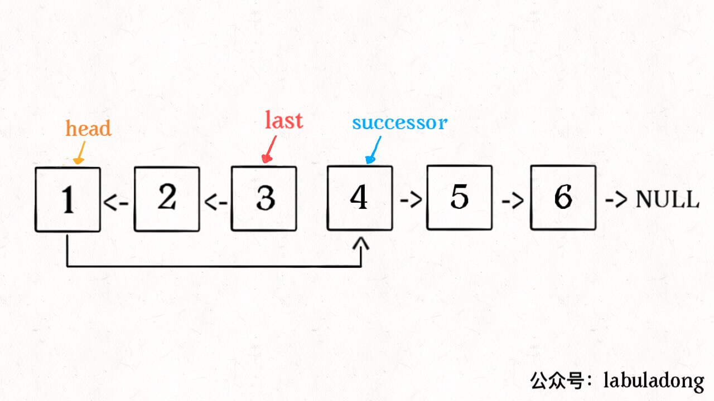
        */
    }
};
```

```go
// by chatGPT (go)
/**
 * Definition for singly-linked list.
 * type ListNode struct {
 *     Val int
 *     Next *ListNode
 * }
 */
 
func reverseBetween(head *ListNode, m int, n int) *ListNode {
    var successor *ListNode // 后驱节点

    // 反转以 head 为起点的 n 个节点，返回新的头结点
    var reverseN func(head *ListNode, n int) (*ListNode)
    reverseN = func(head *ListNode, n int) (*ListNode) {
        if n == 1 {
            // 记录第 n + 1 个节点
            successor = head.Next
            return head
        }
        // 以 head.Next 为起点，需要反转前 n - 1 个节点
        last := reverseN(head.Next, n - 1)

        head.Next.Next = head
        // 让反转之后的 head 节点和后面的节点连起来
        head.Next = successor
        return last
    }

    // base case
    if m == 1 {
        return reverseN(head, n)
    }
    // 前进到反转的起点触发 base case
    head.Next = reverseBetween(head.Next, m - 1, n - 1)
    return head
}
```

```java
// by labuladong (java)
class Solution {
    public ListNode reverseBetween(ListNode head, int m, int n) {
        // base case
        if (m == 1) {
            return reverseN(head, n);
        }
        // 前进到反转的起点触发 base case
        head.next = reverseBetween(head.next, m - 1, n - 1);
        return head;
    }

    ListNode successor = null; // 后驱节点
    // 反转以 head 为起点的 n 个节点，返回新的头结点
    ListNode reverseN(ListNode head, int n) {
        if (n == 1) {
            // 记录第 n + 1 个节点
            successor = head.next;
            return head;
        }
        // 以 head.next 为起点，需要反转前 n - 1 个节点
        ListNode last = reverseN(head.next, n - 1);

        head.next.next = head;
        // 让反转之后的 head 节点和后面的节点连起来
        head.next = successor;
        return last;
        /**<extend up -90>
        
        */
    }
}
```

```javascript
// by chatGPT (javascript)
var reverseBetween = function(head, m, n) {
    let successor = null;
    // 反转以 head 为起点的 n 个节点，返回新的头结点
    const reverseN = function(head, n) {
        if (n == 1) {
            // 记录第 n + 1 个节点
            successor = head.next;
            return head;
        }
        const last = reverseN(head.next, n - 1);
        head.next.next = head;
        // 让反转之后的 head 节点和后面的节点连起来
        head.next = successor;
        return last;
        /**<extend up -90>
        
        */
    };
    // base case
    if (m == 1) {
        return reverseN(head, n);
    }
    // 前进到反转的起点触发 base case
    head.next = reverseBetween(head.next, m - 1, n - 1);
    return head;
};
```

```python
# by chatGPT (python)
class Solution:
    def reverseBetween(self, head: ListNode, m: int, n: int) -> ListNode:
        # base case
        if m == 1:
            return self.reverseN(head, n)
        # 前进到反转的起点触发 base case
        head.next = self.reverseBetween(head.next, m - 1, n - 1)
        return head

    successor = None # 后驱节点
    # 反转以 head 为起点的 n 个节点，返回新的头结点
    def reverseN(self, head: ListNode, n: int) -> ListNode:
        if n == 1:
            # 记录第 n + 1 个节点
            self.successor = head.next
            return head
        # 以 head.next 为起点，需要反转前 n - 1 个节点
        last = self.reverseN(head.next, n - 1)

        head.next.next = head
        # 让反转之后的 head 节点和后面的节点连起来
        head.next = self.successor
        return last
        """
        <extend up -90>
        
        """
```

https://leetcode.cn/problems/reverse-linked-list-ii 的多语言解法👆

https://leetcode.cn/problems/reverse-nodes-in-k-group 的多语言解法👇

```cpp
// by chatGPT (cpp)
class Solution {
public:
    ListNode* reverseKGroup(ListNode* head, int k) {
         if(head == NULL) return NULL;
    	//区间[a,b)包含k个待反转元素
    	ListNode *a, *b;
    	a = b = head;
    	for (int i = 0; i < k; i++) {
    		//不足k个，直接返回
    		if (b == NULL) return head;
    		b = b->next;
    	}
    	//反转前k个元素
    	ListNode *newHead = reverse(a, b);
    	//递归反转后续链表并连接起来
    	a->next = reverseKGroup(b, k);
    	return newHead;
    }
    ListNode *reverse(ListNode *a, ListNode *b) {
    	ListNode *pre, *cur, *nxt;
    	cur = a; pre = NULL;
    	while (cur != b) {
    		nxt = cur->next;
    		cur->next = pre;
    		pre = cur;
    		cur = nxt;
    	}
    	return pre;
    }
};
```

```go
// by chatGPT (go)
// 给出一个链表和一个数k，比如1->2->3->4->5->6，k=2，那么你需要返回的结果是2->1->4->3->6->5。
func reverseKGroup(head *ListNode, k int) *ListNode {
    if head == nil {
        return nil
    }
    
    a, b := head, head
    // 找到需要翻转的区间 [a, b)
    for i := 0; i < k; i++ {
        if b == nil {
            return head
        }
        b = b.Next
    }

    // 反转区间内的链表
    newHead := reverse(a, b)
    // 递归将后续链表的区间也翻转，然后再将它链接到新的区间内
    a.Next = reverseKGroup(b, k)
    /** <extend up -90>
    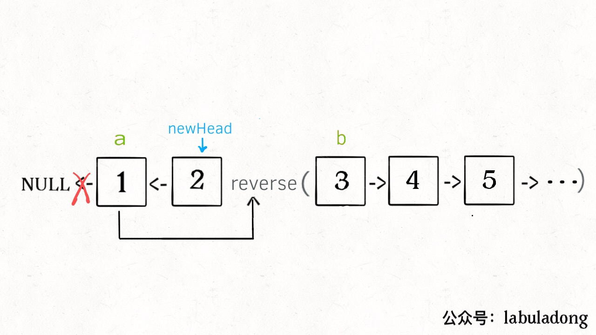
    */

    return newHead
}

// 翻转区间 [a, b)，包头不包尾
func reverse(a, b *ListNode) *ListNode {
    // 初始化三个指针
    pre, cur, nxt := (*ListNode)(nil), a, a

    // 循环将当前节点指向前一个节点，然后将前一个节点和当前节点往后移动
    for cur != b {
        nxt = cur.Next
        cur.Next = pre
        pre, cur = cur, nxt
    }

    // 返回新的头结点
    return pre
}
```

```java
// by labuladong (java)
class Solution {
    public ListNode reverseKGroup(ListNode head, int k) {
        if (head == null) return null;
        // 区间 [a, b) 包含 k 个待反转元素
        ListNode a, b;
        a = b = head;
        for (int i = 0; i < k; i++) {
            // 不足 k 个，不需要反转，base case
            if (b == null) return head;
            b = b.next;
        }
        // 反转前 k 个元素
        ListNode newHead = reverse(a, b);
        // 递归反转后续链表并连接起来
        a.next = reverseKGroup(b, k);
        /**<extend up -90>
        
        */
        return newHead;
    }

    /* 反转区间 [a, b) 的元素，注意是左闭右开 */
    ListNode reverse(ListNode a, ListNode b) {
        /**<extend up -300>
        
        */
        ListNode pre, cur, nxt;
        pre = null;
        cur = a;
        nxt = a;
        // while 终止的条件改一下就行了
        while (cur != b) {
            nxt = cur.next;
            cur.next = pre;
            pre = cur;
            cur = nxt;
        }
        // 返回反转后的头结点
        return pre;
    }
}
```

```javascript
// by chatGPT (javascript)
/**
 * @param {ListNode} head
 * @param {number} k
 * @return {ListNode}
 */
var reverseKGroup = function(head, k) {
    if (!head) return null;
    // 区间 [a, b) 包含 k 个待反转元素
    let a = head, b = head;
    for (let i = 0; i < k; i++) {
        // 不足 k 个，不需要反转，base case
        if (!b) return head;
        b = b.next;
    }
    // 反转前 k 个元素
    let newHead = reverse(a, b);
    // 递归反转后续链表并连接起来
    a.next = reverseKGroup(b, k);
    /** <extend up -90>
    
    */
    return newHead;
};

/* 反转区间 [a, b) 的元素，注意是左闭右开 */
var reverse = function(a, b) {
    /** <extend up -300>
    
    */
    let pre = null, cur = a, nxt = a;
    // while 终止的条件改一下就行了
    while (cur !== b) {
        nxt = cur.next;
        cur.next = pre;
        pre = cur;
        cur = nxt;
    }
    // 返回反转后的头结点
    return pre;
};
```

```python
# by chatGPT (python)
class Solution:
    def reverseKGroup(self, head: ListNode, k: int) -> ListNode:
        if not head:
            return None
        # 区间 [a, b) 包含 k 个待反转元素
        a = b = head
        for i in range(k):
            # 不足 k 个，不需要反转，base case
            if not b:
                return head
            b = b.next
        # 反转前 k 个元素
        newHead = self.reverse(a, b)
        # 递归反转后续链表并连接起来
        a.next = self.reverseKGroup(b, k)
        """
        <extend up -90>
        
        """
        return newHead

    """ 反转区间 [a, b) 的元素，注意是左闭右开 """
    def reverse(self, a: ListNode, b: ListNode) -> ListNode:
        """
        <extend up -300>
        
        """
        pre, cur, nxt = None, a, a
        # while 终止的条件改一下就行了
        while cur != b:
            nxt = cur.next
            cur.next = pre
            pre = cur
            cur = nxt
        # 返回反转后的头结点
        return pre
```

https://leetcode.cn/problems/reverse-nodes-in-k-group 的多语言解法👆

https://leetcode.cn/problems/reverse-words-in-a-string 的多语言解法👇

```cpp
// by chatGPT (cpp)
class Solution {
public:
    string reverseWords(string s) {
        string res;
        // 清洗一下数据，去除多余的空格
        for (int i = 0; i < s.size(); i++) {
            char c = s[i];
            if (c != ' ') {
                // 单词中的字母/数字
                res += c;
            }
 
            else if (res.back() != ' ') {
                // 单词之间保留一个空格
                res += ' ';
            }
        }
        // 末尾如果有空格，清除之
        if (res.back() == ' ') {
            res.pop_back();
        }
 
        // 清洗之后的字符串
        char *chars = new char[res.size() + 1];
        strcpy(chars, res.c_str());
        int n = strlen(chars);
        // 进行单词的翻转，先整体翻转
        reverse(chars, 0, n - 1);
        // 再把每个单词翻转
        for (int i = 0; i < n; ) {
            for (int j = i; j < n; j++) {
                if (j + 1 == n || chars[j + 1] == ' ') {
                    // chars[i..j] 是一个单词，翻转之
                    reverse(chars, i, j);
                    // 把 i 置为下一个单词的首字母
                    i = j + 2;
                    break;
                }
            }
        }
        // 最后得到题目想要的结果
        return chars;
    }
 
    // 翻转 arr[i..j]
    void reverse(char* arr, int i, int j) {
        while (i < j) {
            char temp = arr[i];
            arr[i] = arr[j];
            arr[j] = temp;
            i++;
            j--;
        }
    }
};
```

```go
// by chatGPT (go)
func reverseWords(s string) string {
    sb := strings.Builder{}
    // 先清洗一下数据，把多于的空格都删掉
    for i := 0; i < len(s); i++ {
        c := s[i]
        if c != ' ' {
            // 单词中的字母/数字
            sb.WriteByte(c)
        } else if sb.Len() > 0 && sb.String()[sb.Len()-1] != ' ' {
            // 单词之间保留一个空格
            sb.WriteByte(' ')
        }
    }
    // 末尾如果有空格，清除之
    str := sb.String()
    if len(str) > 0 && str[len(str)-1] == ' ' {
        str = str[:len(str)-1]
    }

    // 清洗之后的字符串
    chars := []byte(str)
    n := len(chars)
    // 进行单词的翻转，先整体翻转
    reverse(chars, 0, n-1)
    // 再把每个单词翻转
    for i := 0; i < n; {
        for j := i; j < n; j++ {
            if j+1 == n || chars[j+1] == ' ' {
                // chars[i..j] 是一个单词，翻转之
                reverse(chars, i, j)
                // 把 i 置为下一个单词的首字母
                i = j + 2
                break
            }
        }
    }
    // 最后得到题目想要的结果
    return string(chars)
}

// 翻转 arr[i..j]
func reverse(arr []byte, i, j int) {
    for i < j {
        arr[i], arr[j] = arr[j], arr[i]
        i++
        j--
    }
}
```

```java
// by labuladong (java)
class Solution {
    public String reverseWords(String s) {
        StringBuilder sb = new StringBuilder();
        // 先清洗一下数据，把多于的空格都删掉
        for (int i = 0; i < s.length(); i++) {
            char c = s.charAt(i);
            if (c != ' ') {
                // 单词中的字母/数字
                sb.append(c);
            } else if (!sb.isEmpty() && sb.charAt(sb.length() - 1) != ' ') {
                // 单词之间保留一个空格
                sb.append(' ');
            }
        }
        if (sb.isEmpty()) {
            return "";
        }
        // 末尾如果有空格，清除之
        if (sb.charAt(sb.length() - 1) == ' ') {
            sb.deleteCharAt(sb.length() - 1);
        }

        // 清洗之后的字符串
        char[] chars = sb.toString().toCharArray();
        int n = chars.length;
        // 进行单词的翻转，先整体翻转
        reverse(chars, 0, n - 1);
        // 再把每个单词翻转
        for (int i = 0; i < n; ) {
            for (int j = i; j < n; j++) {
                if (j + 1 == n || chars[j + 1] == ' ') {
                    // chars[i..j] 是一个单词，翻转之
                    reverse(chars, i, j);
                    // 把 i 置为下一个单词的首字母
                    i = j + 2;
                    break;
                }
            }
        }
        // 最后得到题目想要的结果
        return new String(chars);
    }

    // 翻转 arr[i..j]
    void reverse(char[] arr, int i, int j) {
        while (i < j) {
            char temp = arr[i];
            arr[i] = arr[j];
            arr[j] = temp;
            i++;
            j--;
        }
    }
}
```

```javascript
// by chatGPT (javascript)
var reverseWords = function(s) {
    let sb = "";
    // 先清洗一下数据，把多于的空格都删掉
    for (let i = 0; i < s.length; i++) {
        let c = s.charAt(i);
        if (c !== ' ') {
            // 单词中的字母/数字
            sb += c;
        } else if (sb !== "" && sb[sb.length - 1] !== ' ') {
            // 单词之间保留一个空格
            sb += ' ';
        }
    }
    // 末尾如果有空格，清除之
    if (sb[sb.length - 1] === ' ') {
        sb = sb.substring(0, sb.length - 1);
    }

    // 清洗之后的字符串
    let chars = sb.split('');
    let n = chars.length;
    // 进行单词的翻转，先整体翻转
    reverse(chars, 0, n - 1);
    // 再把每个单词翻转
    for (let i = 0; i < n;) {
        for (let j = i; j < n; j++) {
            if (j + 1 === n || chars[j + 1] === ' ') {
                // chars[i..j] 是一个单词，翻转之
                reverse(chars, i, j);
                // 把 i 置为下一个单词的首字母
                i = j + 2;
                break;
            }
        }
    }
    // 最后得到题目想要的结果
    return chars.join("");
};

// 翻转 arr[i..j]
function reverse(arr, i, j) {
    while (i < j) {
        let temp = arr[i];
        arr[i] = arr[j];
        arr[j] = temp;
        i++;
        j--;
    }
}
```

```python
# by chatGPT (python)
class Solution:
    def reverseWords(self, s: str) -> str:
        sb = []
        # 先清洗一下数据，把多余的空格都删掉
        for c in s:
            if c != ' ':
                # 单词中的字母/数字
                sb.append(c)
            elif sb and sb[-1] != ' ':
                # 单词之间保留一个空格
                sb.append(' ')
        # 末尾如果有空格，清除之
        if sb and sb[-1] == ' ':
            sb.pop()
        
        # 清洗之后的字符串
        chars = sb

        # 进行单词的翻转，先整体翻转
        def reverse(l, r):
            while l < r:
                chars[l], chars[r] = chars[r], chars[l]
                l += 1
                r -= 1
        
        n = len(chars)
        reverse(0, n-1)
        
        # 再把每个单词翻转
        start = end = 0
        while end < n:
            if chars[end] == ' ':
                reverse(start, end-1)
                start = end + 1
            end += 1
        
        # 翻转最后一个单词
        reverse(start, n-1)
        
        # 最后得到题目想要的结果
        return "".join(chars)
```

https://leetcode.cn/problems/reverse-words-in-a-string 的多语言解法👆

https://leetcode.cn/problems/rotate-image 的多语言解法👇

```cpp
// by chatGPT (cpp)
class Solution {
public:
    void rotate(vector<vector<int>>& matrix) {
        int n = matrix.size();
        // 先沿对角线反转二维矩阵
        for (int i = 0; i < n; i++) {
            for (int j = i; j < n; j++) {
                // swap(matrix[i][j], matrix[j][i]);
                int temp = matrix[i][j];
                matrix[i][j] = matrix[j][i];
                matrix[j][i] = temp;
            }
        }
        // 然后反转二维矩阵的每一行
        for (auto& row : matrix) {
            ::reverse(row.begin(), row.end());
        }
    }

    // 反转一维数组
    void reverse(vector<int>& arr) {
        int i = 0, j = arr.size() - 1;
        while (j > i) {
            // swap(arr[i], arr[j]);
            int temp = arr[i];
            arr[i] = arr[j];
            arr[j] = temp;
            i++;
            j--;
        }
    }
};
```

```go
// by chatGPT (go)
func rotate(matrix [][]int) {
    n := len(matrix)
    // 先沿对角线反转二维矩阵
    for i := 0; i < n; i++ {
        for j := i; j < n; j++ {
            matrix[i][j], matrix[j][i] = matrix[j][i], matrix[i][j]
        }
    }
    // 然后反转二维矩阵的每一行
    for _, row := range matrix {
        reverse(row)
    }
}

// 反转一维数组
func reverse(arr []int) {
    i, j := 0, len(arr) - 1
    for j > i {
        arr[i], arr[j] = arr[j], arr[i]
        i++
        j--
    }
}
```

```java
// by labuladong (java)
class Solution {
    public void rotate(int[][] matrix) {
        int n = matrix.length;
        // 先沿对角线反转二维矩阵
        for (int i = 0; i < n; i++) {
            for (int j = i; j < n; j++) {
                // swap(matrix[i][j], matrix[j][i]);
                int temp = matrix[i][j];
                matrix[i][j] = matrix[j][i];
                matrix[j][i] = temp;
            }
        }
        // 然后反转二维矩阵的每一行
        for (int[] row : matrix) {
            reverse(row);
        }
    }

    // 反转一维数组
    void reverse(int[] arr) {
        int i = 0, j = arr.length - 1;
        while (j > i) {
            // swap(arr[i], arr[j]);
            int temp = arr[i];
            arr[i] = arr[j];
            arr[j] = temp;
            i++;
            j--;
        }
    }
}
```

```javascript
// by chatGPT (javascript)
/**
 * @param {number[][]} matrix
 * @return {void} Do not return anything, modify matrix in-place instead.
 */
var rotate = function(matrix) {
    var n = matrix.length;
    // 先沿对角线反转二维矩阵
    for (var i = 0; i < n; i++) {
        for (var j = i; j < n; j++) {
            // swap(matrix[i][j], matrix[j][i]);
            var temp = matrix[i][j];
            matrix[i][j] = matrix[j][i];
            matrix[j][i] = temp;
        }
    }
    // 然后反转二维矩阵的每一行
    for (var row of matrix) {
        reverse(row);
    }
}

// 反转一维数组
function reverse(arr) {
    var i = 0, j = arr.length - 1;
    while (j > i) {
        // swap(arr[i], arr[j]);
        var temp = arr[i];
        arr[i] = arr[j];
        arr[j] = temp;
        i++;
        j--;
    }
}
```

```python
# by chatGPT (python)
class Solution:
    def rotate(self, matrix: List[List[int]]) -> None:
        n = len(matrix)
        # 先沿对角线反转二维矩阵
        for i in range(n):
            for j in range(i, n):
                # swap(matrix[i][j], matrix[j][i]);
                temp = matrix[i][j]
                matrix[i][j] = matrix[j][i]
                matrix[j][i] = temp
        # 然后反转二维矩阵的每一行
        for row in matrix:
            self.reverse(row)
    
    # 反转一维数组
    def reverse(self, arr: List[int]) -> None:
        i, j = 0, len(arr) - 1
        while j > i:
            # swap(arr[i], arr[j]);
            temp = arr[i]
            arr[i] = arr[j]
            arr[j] = temp
            i += 1
            j -= 1
```

https://leetcode.cn/problems/rotate-image 的多语言解法👆

https://leetcode.cn/problems/russian-doll-envelopes 的多语言解法👇

```cpp
// by chatGPT (cpp)
class Solution {
public:
    int maxEnvelopes(vector<vector<int>>& envelopes) {
        int n = envelopes.size();
        // 按宽度升序排列，如果宽度一样，则按高度降序排列
        sort(envelopes.begin(), envelopes.end(), [](vector<int>& a, vector<int>& b){
            if(a[0] == b[0]){
                return b[1] < a[1];
            }else{
                return a[0] < b[0];
            }
        });
        // 对高度数组寻找 LIS
        vector<int> height(n);
        for (int i = 0; i < n; i++){
            height[i] = envelopes[i][1];
        }
        return lengthOfLIS(height);
    }

    /* 返回 nums 中 LIS 的长度 */
    int lengthOfLIS(vector<int>& nums) {
        int piles = 0, n = nums.size();
        vector<int> top(n);
        for (int i = 0; i < n; i++) {
            // 要处理的扑克牌
            int poker = nums[i];
            int left = 0, right = piles;
            // 二分查找插入位置
            while (left < right) {
                int mid = (left + right) / 2;
                if (top[mid] >= poker)
                    right = mid;
                else
                    left = mid + 1;
            }
            if (left == piles) piles++;
            // 把这张牌放到牌堆顶
            top[left] = poker;
        }
        // 牌堆数就是 LIS 长度
        return piles;
    }
};
```

```go
// by chatGPT (go)
import "sort"

func maxEnvelopes(envelopes [][]int) int {
    n := len(envelopes)
    // 按宽度升序排列，如果宽度一样，则按高度降序排列
    sort.Slice(envelopes, func(i, j int) bool {
        if envelopes[i][0] < envelopes[j][0] {
            return true
        }
        if envelopes[i][0] == envelopes[j][0] {
            return envelopes[i][1] > envelopes[j][1]
        }
        return false
    })
    // 对高度数组寻找 LIS
    height := make([]int, n)
    for i := 0; i < n; i++ {
        height[i] = envelopes[i][1]
    }

    return lengthOfLIS(height)
}

/* 返回 nums 中 LIS 的长度 */
func lengthOfLIS(nums []int) int {
    piles, n := 0, len(nums)
    top := make([]int, n)
    for i := 0; i < n; i++ {
        // 要处理的扑克牌
        poker := nums[i]
        left, right := 0, piles
        // 二分查找插入位置
        for left < right {
            mid := (left + right) / 2
            if top[mid] >= poker {
                right = mid
            } else {
                left = mid + 1
            }
        }
        if left == piles {
            piles++
        }
        // 把这张牌放到牌堆顶
        top[left] = poker
    }
    // 牌堆数就是 LIS 长度
    return piles
}
```

```java
// by labuladong (java)
class Solution {
    public int maxEnvelopes(int[][] envelopes) {
        int n = envelopes.length;
        // 按宽度升序排列，如果宽度一样，则按高度降序排列
        Arrays.sort(envelopes, new Comparator<int[]>() 
        {
            public int compare(int[] a, int[] b) {
                return a[0] == b[0] ? 
                    b[1] - a[1] : a[0] - b[0];
            }
        });
        // 对高度数组寻找 LIS
        int[] height = new int[n];
        for (int i = 0; i < n; i++)
            height[i] = envelopes[i][1];

        return lengthOfLIS(height);
    }

    /* 返回 nums 中 LIS 的长度 */
    public int lengthOfLIS(int[] nums) {
        int piles = 0, n = nums.length;
        int[] top = new int[n];
        for (int i = 0; i < n; i++) {
            // 要处理的扑克牌
            int poker = nums[i];
            int left = 0, right = piles;
            // 二分查找插入位置
            while (left < right) {
                int mid = (left + right) / 2;
                if (top[mid] >= poker)
                    right = mid;
                else
                    left = mid + 1;
            }
            if (left == piles) piles++;
            // 把这张牌放到牌堆顶
            top[left] = poker;
        }
        // 牌堆数就是 LIS 长度
        return piles;
    }
}
```

```javascript
// by chatGPT (javascript)
/**
 * @param {number[][]} envelopes
 * @return {number}
 */
var maxEnvelopes = function(envelopes) {
    const n = envelopes.length;
    // 按宽度升序排列，如果宽度一样，则按高度降序排列
    envelopes.sort((a, b) => {
        if (a[0] === b[0]) {
            return b[1] - a[1];
        } else {
            return a[0] - b[0];
        }
    });

    // 对高度数组寻找 LIS
    const height = new Array(n).fill(0).map((_, i) => envelopes[i][1]);
    return lengthOfLIS(height);
}

/**
 * @param {number[]} nums
 * @return {number}
 */
const lengthOfLIS = (nums) => {
    // piles 表示牌堆数
    let piles = 0;
    const n = nums.length;
    const top = new Array(n).fill(0);

    for (let i = 0; i < n; i++) {
        // 要处理的扑克牌
        let poker = nums[i];
        let left = 0;
        let right = piles;

        // 二分查找插入位置
        while (left < right) {
            let mid = Math.floor((left + right) / 2);
            if (top[mid] >= poker) {
                right = mid;
            } else {
                left = mid + 1;
            }
        }

        if (left === piles) piles++;
        // 把这张牌放到牌堆顶
        top[left] = poker;
    }

    // 牌堆数就是 LIS 长度
    return piles;
};
```

```python
# by chatGPT (python)
class Solution:
    def maxEnvelopes(self, envelopes: List[List[int]]) -> int:
        n = len(envelopes)
        # 按宽度升序排列，如果宽度一样，则按高度降序排列
        envelopes.sort(key=lambda x: (x[0], -x[1]))
        # 对高度数组寻找 LIS
        height = [0] * n
        for i in range(n):
            height[i] = envelopes[i][1]

        return self.lengthOfLIS(height)

    def lengthOfLIS(self, nums: List[int]) -> int:
        piles = 0
        n = len(nums)
        top = [0] * n
        for i in range(n):
            # 要处理的扑克牌
            poker = nums[i]
            left, right = 0, piles
            # 二分查找插入位置
            while left < right:
                mid = (left + right) // 2
                if top[mid] >= poker:
                    right = mid
                else:
                    left = mid + 1
            if left == piles:
                piles += 1
            # 把这张牌放到牌堆顶
            top[left] = poker
        # 牌堆数就是 LIS 长度
        return piles
```

https://leetcode.cn/problems/russian-doll-envelopes 的多语言解法👆

https://leetcode.cn/problems/same-tree 的多语言解法👇

```cpp
// by chatGPT (cpp)
// 定义：输入两个根节点，返回以它们为根的两棵二叉树是否相同
class Solution {
public:
    bool isSameTree(TreeNode* p, TreeNode* q) {
        // 判断一对节点是否相同
        if (p == nullptr && q == nullptr) {
            return true;
        }
        if (p == nullptr || q == nullptr) {
            return false;
        }
        if (p->val != q->val) {
            return false;
        }
        // 判断其他节点是否相同
        return isSameTree(p->left, q->left) && isSameTree(p->right, q->right);
    }
};
```

```go
// by chatGPT (go)
// 定义：输入两个根节点，返回以它们为根的两棵二叉树是否相同
 func isSameTree(p *TreeNode, q *TreeNode) bool {
     // 判断一对节点是否相同
     if p == nil && q == nil {
         return true
     }
     if p == nil || q == nil {
         return false
     }
     if p.Val != q.Val {
         return false
     }
     // 判断其他节点是否相同
     return isSameTree(p.Left, q.Left) && isSameTree(p.Right, q.Right)
 }
```

```java
// by labuladong (java)
class Solution {
    // 定义：输入两个根节点，返回以它们为根的两棵二叉树是否相同
    public boolean isSameTree(TreeNode p, TreeNode q) {
        // 判断一对节点是否相同
        if (p == null && q == null) {
            return true;
        }
        if (p == null || q == null) {
            return false;
        }
        if (p.val != q.val) {
            return false;
        }
        // 判断其他节点是否相同
        return isSameTree(p.left, q.left) && isSameTree(p.right, q.right);
    }
}
```

```javascript
// by chatGPT (javascript)
/**
 * 定义：输入两个根节点，返回以它们为根的两棵二叉树是否相同
 * @param {TreeNode} p
 * @param {TreeNode} q
 * @return {boolean}
 */
var isSameTree = function(p, q) {
    // 判断一对节点是否相同
    if (p == null && q == null) {
        return true;
    }
    if (p == null || q == null) {
        return false;
    }
    if (p.val != q.val) {
        return false;
    }
    // 判断其他节点是否相同
    return isSameTree(p.left, q.left) && isSameTree(p.right, q.right);
};
```

```python
# by chatGPT (python)
# 定义：输入两个根节点，返回以它们为根的两棵二叉树是否相同
class Solution:
    def isSameTree(self, p: TreeNode, q: TreeNode) -> bool:
        # 判断一对节点是否相同
        if p == None and q == None:
            return True
        if p == None or q == None:
            return False
        if p.val != q.val:
            return False
        # 判断其他节点是否相同
        return self.isSameTree(p.left, q.left) and self.isSameTree(p.right, q.right)
```

https://leetcode.cn/problems/same-tree 的多语言解法👆

https://leetcode.cn/problems/satisfiability-of-equality-equations 的多语言解法👇

```cpp
// by chatGPT (cpp)
class Solution {
public:
    bool equationsPossible(vector<string>& equations) {
        // 26 个英文字母
        UF uf(26);
        // 先让相等的字母形成连通分量
        for (string eq : equations) {
            if (eq[1] == '=') {
                char x = eq[0];
                char y = eq[3];
                uf.union_(x - 'a', y - 'a');
            }
        }
        // 检查不等关系是否打破相等关系的连通性
        for (string eq : equations) {
            if (eq[1] == '!') {
                char x = eq[0];
                char y = eq[3];
                // 如果相等关系成立，就是逻辑冲突
                if (uf.connected(x - 'a', y - 'a'))
                    return false;
            }
        }
        return true;
    }
};

class UF {
public:
    // 记录连通分量个数
    int count;
    // 存储若干棵树
    vector<int> parent;
    // 记录树的“重量”
    vector<int> size;

    UF(int n) {
        this->count = n;
        parent.resize(n);
        size.resize(n);
        for (int i = 0; i < n; i++) {
            parent[i] = i;
            size[i] = 1;
        }
    }

    /* 将 p 和 q 连通 */
    void union_(int p, int q) {
        int rootP = find(p);
        int rootQ = find(q);
        if (rootP == rootQ)
            return;

        // 小树接到大树下面，较平衡
        if (size[rootP] > size[rootQ]) {
            parent[rootQ] = rootP;
            size[rootP] += size[rootQ];
        } else {
            parent[rootP] = rootQ;
            size[rootQ] += size[rootP];
        }
        count--;
    }

    /* 判断 p 和 q 是否互相连通 */
    bool connected(int p, int q) {
        int rootP = find(p);
        int rootQ = find(q);
        // 处于同一棵树上的节点，相互连通
        return rootP == rootQ;
    }

    /* 返回节点 x 的根节点 */
    int find(int x) {
        while (parent[x] != x) {
            // 进行路径压缩
            parent[x] = parent[parent[x]];
            x = parent[x];
        }
        return x;
    }

    int getCount() {
        return count;
    }
};
```

```go
// by chatGPT (go)
type UF struct {
    // 记录连通分量个数
    Count int
    // 存储若干棵树
    Parent []int
    // 记录树的“重量”
    Size []int
}

func NewUF(n int) *UF {
    u := UF{}
    u.Count = n
    u.Parent = make([]int, n)
    u.Size = make([]int, n)
    for i := 0; i < n; i++ {
        u.Parent[i] = i
        u.Size[i] = 1
    }
    return &u
}

/* 将 p 和 q 连通 */
func (u *UF) Union(p, q int) {
    rootP := u.find(p)
    rootQ := u.find(q)
    if rootP == rootQ {
        return
    }

    // 小树接到大树下面，较平衡
    if u.Size[rootP] > u.Size[rootQ] {
        u.Parent[rootQ] = rootP
        u.Size[rootP] += u.Size[rootQ]
    } else {
        u.Parent[rootP] = rootQ
        u.Size[rootQ] += u.Size[rootP]
    }
    u.Count--
}

/* 判断 p 和 q 是否互相连通 */
func (u *UF) Connected(p, q int) bool {
    rootP := u.find(p)
    rootQ := u.find(q)
    // 处于同一棵树上的节点，相互连通
    return rootP == rootQ
}

/* 返回节点 x 的根节点 */
func (u *UF) find(x int) int {
    for u.Parent[x] != x {
        // 进行路径压缩
        u.Parent[x] = u.Parent[u.Parent[x]]
        x = u.Parent[x]
    }
    return x
}

func equationsPossible(equations []string) bool {
    // 26 个英文字母
    uf := NewUF(26)
    // 先让相等的字母形成连通分量
    for _, eq := range equations {
        if eq[1] == '=' {
            x := eq[0]
            y := eq[3]
            uf.Union(int(x-'a'), int(y-'a'))
        }
    }
    // 检查不等关系是否打破相等关系的连通性
    for _, eq := range equations {
        if eq[1] == '!' {
            x := eq[0]
            y := eq[3]
            // 如果相等关系成立，就是逻辑冲突
            if uf.Connected(int(x-'a'), int(y-'a')) {
                return false
            }
        }
    }
    return true
}
```

```java
// by labuladong (java)
class Solution {
    public boolean equationsPossible(String[] equations) {
        // 26 个英文字母
        UF uf = new UF(26);
        // 先让相等的字母形成连通分量
        for (String eq : equations) {
            if (eq.charAt(1) == '=') {
                char x = eq.charAt(0);
                char y = eq.charAt(3);
                uf.union(x - 'a', y - 'a');
            }
        }
        // 检查不等关系是否打破相等关系的连通性
        for (String eq : equations) {
            if (eq.charAt(1) == '!') {
                char x = eq.charAt(0);
                char y = eq.charAt(3);
                // 如果相等关系成立，就是逻辑冲突
                if (uf.connected(x - 'a', y - 'a'))
                    return false;
            }
        }
        return true;
    }
}

class UF {
    // 记录连通分量个数
    private int count;
    // 存储若干棵树
    private int[] parent;
    // 记录树的“重量”
    private int[] size;

    public UF(int n) {
        this.count = n;
        parent = new int[n];
        size = new int[n];
        for (int i = 0; i < n; i++) {
            parent[i] = i;
            size[i] = 1;
        }
    }

    /* 将 p 和 q 连通 */
    public void union(int p, int q) {
        int rootP = find(p);
        int rootQ = find(q);
        if (rootP == rootQ)
            return;

        // 小树接到大树下面，较平衡
        if (size[rootP] > size[rootQ]) {
            parent[rootQ] = rootP;
            size[rootP] += size[rootQ];
        } else {
            parent[rootP] = rootQ;
            size[rootQ] += size[rootP];
        }
        count--;
    }

    /* 判断 p 和 q 是否互相连通 */
    public boolean connected(int p, int q) {
        int rootP = find(p);
        int rootQ = find(q);
        // 处于同一棵树上的节点，相互连通
        return rootP == rootQ;
    }

    /* 返回节点 x 的根节点 */
    private int find(int x) {
        while (parent[x] != x) {
            // 进行路径压缩
            parent[x] = parent[parent[x]];
            x = parent[x];
        }
        return x;
    }

    public int count() {
        return count;
    }
}
```

```javascript
// by chatGPT (javascript)
var equationsPossible = function(equations) {
    // 26 个英文字母
  let uf = new ufFunc(26);
  // 先让相等的字母形成连通分量
  for (let i = 0 ; i <equations.length; i++) {
    let eq = equations[i];
    if (eq.charAt(1) == '=') {
      let x = eq.charAt(0);
      let y = eq.charAt(3);
      uf.union(x.charCodeAt()-97, y.charCodeAt()-97);
    }
  }
  // 检查不等关系是否打破相等关系的连通性
  for (let i = 0 ; i <equations.length; i++) {
    let eq = equations[i];
    if (eq.charAt(1) == '!') {
      let x = eq.charAt(0);
      let y = eq.charAt(3);
      // 如果相等关系成立，就是逻辑冲突
      if (uf.connected(x.charCodeAt()-97, y.charCodeAt()-97))
        return false;
      }
  }
  return true;
 }

class ufFunc {
  // 记录连通分量个数
  constructor(n) {
    this.count = n;
    // 存储若干棵树
    this.parent = [];
    // 记录树的“重量”
    this.size = [];
    for (let i = 0; i < n; i++) {
      this.parent.push(i);
      this.size.push(1);
    }
  }

  /* 将 p 和 q 连通 */
  union(p, q) {
    let rootP = this.find(p);
    let rootQ = this.find(q);
    if (rootP == rootQ)
      return;

    // 小树接到大树下面，较平衡
    if (this.size[rootP] > this.size[rootQ]) {
      this.parent[rootQ] = rootP;
      this.size[rootP] += this.size[rootQ];
    } else {
      this.parent[rootP] = rootQ;
      this.size[rootQ] += this.size[rootP];
    }
    this.count--;
  }

  /* 判断 p 和 q 是否互相连通 */
  connected(p, q) {
    let rootP = this.find(p);
    let rootQ = this.find(q);
    // 处于同一棵树上的节点，相互连通
    return rootP == rootQ;
  }

  /* 返回节点 x 的根节点 */
  find(x) {
    while (this.parent[x] != x) {
      // 进行路径压缩
      this.parent[x] = this.parent[this.parent[x]];
      x = this.parent[x];
    }
    return x;
  }

  count() {
      return this.count;
  }
}
```

```python
# by chatGPT (python)
class Solution:
    def equationsPossible(self, equations: List[str]) -> bool:
        uf = UF(26) #26个字母
        # 先让相等的字母形成连通分量
        for eq in equations:
            if eq[1] == "=":
                x = ord(eq[0]) - ord('a')
                y = ord(eq[3]) - ord('a')
                uf.union(x, y)

        # 检查不等关系是否打破相等关系的连通性
        for eq in equations:
            if eq[1] == "!":
                x = ord(eq[0]) - ord('a')
                y = ord(eq[3]) - ord('a')
                # 如果相等关系成立，就是逻辑冲突
                if uf.connected(x, y):
                    return False
        return True

class UF:
    # 记录连通分量个数
    def __init__(self, n):
        self.count = n
        # 存储若干棵树
        self.parent = [i for i in range(n)]
        # 记录树的“重量”
        self.size = [1] * n

    # 将 p 和 q 连通
    def union(self, p, q):
        rootP = self.find(p)
        rootQ = self.find(q)
        if rootP == rootQ:
            return

        # 小树接到大树下面，较平衡
        if self.size[rootP] > self.size[rootQ]:
            self.parent[rootQ] = rootP
            self.size[rootP] += self.size[rootQ]
        else:
            self.parent[rootP] = rootQ
            self.size[rootQ] += self.size[rootP]
        self.count -= 1

    # 判断 p 和 q 是否互相连通
    def connected(self, p, q):
        rootP = self.find(p)
        rootQ = self.find(q)
        # 处于同一棵树上的节点，相互连通
        return rootP == rootQ

    # 返回节点 x 的根节点
    def find(self, x):
        while self.parent[x] != x:
            # 进行路径压缩
            self.parent[x] = self.parent[self.parent[x]]
            x = self.parent[x]
        return x

    def count(self):
        return self.count
```

https://leetcode.cn/problems/satisfiability-of-equality-equations 的多语言解法👆

https://leetcode.cn/problems/search-a-2d-matrix 的多语言解法👇

```cpp
// by chatGPT (cpp)
class Solution {
public:
    bool searchMatrix(vector<vector<int>>& matrix, int target) {
        int m = matrix.size(), n = matrix[0].size();
        // 把二维数组映射到一维
        int left = 0, right = m * n - 1;
        // 前文讲的标准的二分搜索框架
        while(left <= right) {
            int mid = left + (right - left) / 2;
            if(get(matrix, mid) == target)
                return true;
            else if (get(matrix, mid) < target)
                left = mid + 1;
            else if (get(matrix, mid) > target)
                right = mid - 1;
        }
        return false;
    }

    // 通过一维坐标访问二维数组中的元素
    int get(vector<vector<int>>& matrix, int index) {
        int m = matrix.size(), n = matrix[0].size();
        // 计算二维中的横纵坐标
        int i = index / n, j = index % n;
        return matrix[i][j];
    }
};
```

```go
// by chatGPT (go)
func searchMatrix(matrix [][]int, target int) bool {
    m, n := len(matrix), len(matrix[0])
    // 把二维数组映射到一维
    left, right := 0, m*n-1
    // 前文讲的标准的二分搜索框架
    for left <= right {
        mid := left + (right-left)/2
        if get(matrix, mid) == target {
            return true
        } else if get(matrix, mid) < target {
            left = mid + 1
        } else if get(matrix, mid) > target {
            right = mid - 1
        }
    }
    return false
}

// 通过一维坐标访问二维数组中的元素
func get(matrix [][]int, index int) int {
    n := len(matrix[0])
    // 计算二维中的横纵坐标
    i, j := index/n, index%n
    return matrix[i][j]
}
```

```java
// by labuladong (java)
class Solution {
    public boolean searchMatrix(int[][] matrix, int target) {
        int m = matrix.length, n = matrix[0].length;
        // 把二维数组映射到一维
        int left = 0, right = m * n - 1;
        // 前文讲的标准的二分搜索框架
        while(left <= right) {
            int mid = left + (right - left) / 2;
            if(get(matrix, mid) == target)
                return true;
            else if (get(matrix, mid) < target)
                left = mid + 1;
            else if (get(matrix, mid) > target)
                right = mid - 1;
        }
        return false;
    }

    // 通过一维坐标访问二维数组中的元素
    int get(int[][] matrix, int index) {
        int m = matrix.length, n = matrix[0].length;
        // 计算二维中的横纵坐标
        int i = index / n, j = index % n;
        return matrix[i][j];
    }
}
```

```javascript
// by chatGPT (javascript)
var searchMatrix = function(matrix, target) {
    var m = matrix.length, n = matrix[0].length;
    // 把二维数组映射到一维
    var left = 0, right = m * n - 1;
    // 前文讲的标准的二分搜索框架
    while(left <= right) {
        var mid = left + Math.floor((right - left) / 2);
        if(get(matrix, mid) == target)
            return true;
        else if (get(matrix, mid) < target)
            left = mid + 1;
        else if (get(matrix, mid) > target)
            right = mid - 1;
    }
    return false;
};

// 通过一维坐标访问二维数组中的元素
var get = function(matrix, index) {
    var m = matrix.length, n = matrix[0].length;
    // 计算二维中的横纵坐标
    var i = Math.floor(index / n), j = index % n;
    return matrix[i][j];
};
```

```python
# by chatGPT (python)
class Solution:
    def searchMatrix(self, matrix: List[List[int]], target: int) -> bool:
        m, n = len(matrix), len(matrix[0])
        # 把二维数组映射到一维
        left, right = 0, m * n - 1
        # 前文讲的标准的二分搜索框架
        while(left <= right):
            mid = left + (right - left) // 2
            if(self.get(matrix, mid) == target):
                return True
            elif self.get(matrix, mid) < target:
                left = mid + 1
            elif self.get(matrix, mid) > target:
                right = mid - 1
        return False

    # 通过一维坐标访问二维数组中的元素
    def get(self, matrix: List[List[int]], index: int) -> int:
        m, n = len(matrix), len(matrix[0])
        # 计算二维中的横纵坐标
        i, j = index // n, index % n
        return matrix[i][j]
```

https://leetcode.cn/problems/search-a-2d-matrix 的多语言解法👆

https://leetcode.cn/problems/search-a-2d-matrix-ii 的多语言解法👇

```cpp
// by chatGPT (cpp)
class Solution {
public:
    bool searchMatrix(vector<vector<int>>& matrix, int target) {
        int m = matrix.size(), n = matrix[0].size();
        // 初始化在右上角
        int i = 0, j = n - 1;
        while (i < m && j >= 0) {
            if (matrix[i][j] == target) {
                return true;
            }
            if (matrix[i][j] < target) {
                // 需要大一点，往下移动
                i++;
            } else {
                // 需要小一点，往左移动
                j--;
            }
        }
        // while 循环中没有找到，则 target 不存在
        return false;
    }
};
```

```go
// by chatGPT (go)
func searchMatrix(matrix [][]int, target int) bool {
    m, n := len(matrix), len(matrix[0])
    // 初始化在右上角
    i, j := 0, n-1
    for i < m && j >= 0 {
        if matrix[i][j] == target {
            return true
        }
        if matrix[i][j] < target {
            // 需要大一点，往下移动
            i++
        } else {
            // 需要小一点，往左移动
            j--
        }
    }
    // for 循环中没有找到，则 target 不存在
    return false
}
```

```java
// by labuladong (java)
class Solution {
    public boolean searchMatrix(int[][] matrix, int target) {
        int m = matrix.length, n = matrix[0].length;
        // 初始化在右上角
        int i = 0, j = n - 1;
        while (i < m && j >= 0) {
            if (matrix[i][j] == target) {
                return true;
            }
            if (matrix[i][j] < target) {
                // 需要大一点，往下移动
                i++;
            } else {
                // 需要小一点，往左移动
                j--;
            }
        }
        // while 循环中没有找到，则 target 不存在
        return false;
    }
}
```

```javascript
// by chatGPT (javascript)
var searchMatrix = function(matrix, target) {
    var m = matrix.length, n = matrix[0].length;
    // 初始化在右上角
    var i = 0, j = n - 1;
    while (i < m && j >= 0) {
        if (matrix[i][j] == target) {
            return true;
        }
        if (matrix[i][j] < target) {
            // 需要大一点，往下移动
            i++;
        } else {
            // 需要小一点，往左移动
            j--;
        }
    }
    // while 循环中没有找到，则 target 不存在
    return false;
};
```

```python
# by chatGPT (python)
class Solution:
    def searchMatrix(self, matrix: List[List[int]], target: int) -> bool:
        m, n = len(matrix), len(matrix[0])
        # 初始化在右上角
        i, j = 0, n - 1
        while i < m and j >= 0:
            if matrix[i][j] == target:
                return True
            if matrix[i][j] < target:
                # 需要大一点，往下移动
                i += 1
            else:
                # 需要小一点，往左移动
                j -= 1
        # while 循环中没有找到，则 target 不存在
        return False
```

https://leetcode.cn/problems/search-a-2d-matrix-ii 的多语言解法👆

https://leetcode.cn/problems/search-in-a-binary-search-tree 的多语言解法👇

```cpp
// by chatGPT (cpp)
class Solution {
public:
    TreeNode* searchBST(TreeNode* root, int target) {
        if (root == NULL) {
            return NULL;
        }
        // 去左子树搜索
        if (root->val > target) {
            return searchBST(root->left, target);
        }
        // 去右子树搜索
        if (root->val < target) {
            return searchBST(root->right, target);
        }
        return root;
    }
};
```

```go
// by chatGPT (go)
func searchBST(root *TreeNode, target int) *TreeNode {
    if root == nil {
        return nil
    }
    // 去左子树搜索
    if root.Val > target {
        return searchBST(root.Left, target)
    }
    // 去右子树搜索
    if root.Val < target {
        return searchBST(root.Right, target)
    }
    return root
}
```

```java
// by labuladong (java)
class Solution {
    public TreeNode searchBST(TreeNode root, int target) {
        if (root == null) {
            return null;
        }
        // 去左子树搜索
        if (root.val > target) {
            return searchBST(root.left, target);
        }
        // 去右子树搜索
        if (root.val < target) {
            return searchBST(root.right, target);
        }
        return root;
    }
}
```

```javascript
// by chatGPT (javascript)
/**
 * @param {TreeNode} root
 * @param {number} val
 * @return {TreeNode}
 */
var searchBST = function(root, val) {
    if (root === null) {
        return null;
    }
    // 去左子树搜索
    if (root.val > val) {
        return searchBST(root.left, val);
    }
    // 去右子树搜索
    if (root.val < val) {
        return searchBST(root.right, val);
    }
    return root;
};
```

```python
# by chatGPT (python)
class Solution:
    def searchBST(self, root: TreeNode, target: int) -> TreeNode:
        if not root:
            return None
        # 去左子树搜索
        if root.val > target:
            return self.searchBST(root.left, target)
        # 去右子树搜索
        if root.val < target:
            return self.searchBST(root.right, target)
        return root
```

https://leetcode.cn/problems/search-in-a-binary-search-tree 的多语言解法👆

https://leetcode.cn/problems/search-insert-position 的多语言解法👇

```cpp
// by chatGPT (cpp)
class Solution {
public:
    int searchInsert(vector<int>& nums, int target) {
        return left_bound(nums, target);
    }

    // 搜索左侧边界的二分算法
    int left_bound(vector<int>& nums, int target) {
        if (nums.size() == 0) return -1;
        int left = 0;
        int right = nums.size(); // 注意

        while (left < right) { // 注意
            int mid = left + (right - left) / 2;
            if (nums[mid] == target) {
                right = mid;
            } else if (nums[mid] < target) {
                left = mid + 1;
            } else if (nums[mid] > target) {
                right = mid; // 注意
            }
        }
        return left;
    }
};
```

```go
// by chatGPT (go)
import "fmt"

func searchInsert(nums []int, target int) int {
    return leftBound(nums, target)
}

// leftBound is a binary search algorithm that searches for the left boundary
func leftBound(nums []int, target int) int {
    if len(nums) == 0 {
        return -1
    }
    left, right := 0, len(nums) // 注意

    for left < right { // 注意
        mid := left + (right-left)/2
        if nums[mid] == target {
            right = mid
        } else if nums[mid] < target {
            left = mid + 1
        } else if nums[mid] > target {
            right = mid // 注意
        }
    }
    return left
}
```

```java
// by labuladong (java)
class Solution {
    public int searchInsert(int[] nums, int target) {
        return left_bound(nums, target);
    }

    // 搜索左侧边界的二分算法
    int left_bound(int[] nums, int target) {
        if (nums.length == 0) return -1;
        int left = 0;
        int right = nums.length; // 注意

        while (left < right) { // 注意
            int mid = left + (right - left) / 2;
            if (nums[mid] == target) {
                right = mid;
            } else if (nums[mid] < target) {
                left = mid + 1;
            } else if (nums[mid] > target) {
                right = mid; // 注意
            }
        }
        return left;
    }
}
```

```javascript
// by chatGPT (javascript)
/**
 * @param {number[]} nums
 * @param {number} target
 * @return {number}
 */
var searchInsert = function(nums, target) {
    return left_bound(nums, target);
};

/**
 * 搜索左侧边界的二分算法
 * @param {number[]} nums
 * @param {number} target
 * @return {number}
 */
var left_bound = function(nums, target) {
    if (nums.length == 0) return -1;
    let left = 0;
    let right = nums.length; // 注意

    while (left < right) { // 注意
        let mid = left + Math.floor((right - left) / 2);
        if (nums[mid] == target) {
            right = mid;
        } else if (nums[mid] < target) {
            left = mid + 1;
        } else if (nums[mid] > target) {
            right = mid; // 注意
        }
    }
    return left;
};
```

```python
# by chatGPT (python)
class Solution:
    def searchInsert(self, nums: List[int], target: int) -> int:
        return self.left_bound(nums, target)

    # 搜索左侧边界的二分算法
    def left_bound(self, nums: List[int], target: int) -> int:
        if not nums:
            return -1
        left = 0
        right = len(nums)  # 注意

        while left < right:  # 注意
            mid = left + (right - left) // 2
            if nums[mid] == target:
                right = mid
            elif nums[mid] < target:
                left = mid + 1
            elif nums[mid] > target:
                right = mid  # 注意

        return left
```

https://leetcode.cn/problems/search-insert-position 的多语言解法👆

https://leetcode.cn/problems/seat-reservation-manager 的多语言解法👇

```cpp
// by chatGPT (cpp)
class SeatManager {
    // 利用优先级队列自动排序，队头的元素就是最小的
    priority_queue<int, vector<int>, greater<int>> pq;

public:
    SeatManager(int n) {
        // 初始化所有空闲座位
        for (int i = 1; i <= n; i++) {
            pq.push(i);
        }
    }

    int reserve() {
        // 拿出队头元素（最小）
        int seat = pq.top();
        pq.pop();
        return seat;
    }

    void unreserve(int i) {
        pq.push(i);
    }
};
```

```go
// by chatGPT (go)
import "container/heap"

// 定义一个数组类型，并重写 Len(), Less(), Swap() 方法，实现堆 heap 的接口
type PriorityQueue []int

func (pq PriorityQueue) Len() int {
    return len(pq)
}

func (pq PriorityQueue) Less(i, j int) bool {
    return pq[i] < pq[j]
}

func (pq PriorityQueue) Swap(i, j int) {
    pq[i], pq[j] = pq[j], pq[i]
}

func (pq *PriorityQueue) Push(x interface{}) {
    *pq = append(*pq, x.(int))
}

func (pq *PriorityQueue) Pop() interface{} {
    old := *pq
    n := len(old)
    x := old[n-1]
    *pq = old[0 : n-1]
    return x
}

type SeatManager struct {
    pq PriorityQueue
}

func Constructor(n int) SeatManager {
    pq := make([]int, n)
    for i := 0; i < n; i++ {
        pq[i] = i + 1
    }
    return SeatManager{pq: pq}
}

func (this *SeatManager) Reserve() int {
    return heap.Pop(&this.pq).(int)
}

func (this *SeatManager) Unreserve(seatNumber int) {
    heap.Push(&this.pq, seatNumber)
}
```

```java
// by labuladong (java)
class SeatManager {
    // 利用优先级队列自动排序，队头的元素就是最小的
    PriorityQueue<Integer> pq = new PriorityQueue<>();

    public SeatManager(int n) {
        // 初始化所有空闲座位
        for (int i = 1; i <= n; i++) {
            pq.offer(i);
        }
    }

    public int reserve() {
        // 拿出队头元素（最小）
        return pq.poll();
    }

    public void unreserve(int i) {
        pq.offer(i);
    }
}
```

```javascript
// by chatGPT (javascript)
/**
 * @param {number} n
 */
var SeatManager = function(n) {
  /**
   * 利用优先队列（最小堆）自动排序，队头的元素就是最小的
   * PriorityQueue 是 Java 里的一个内置类，JavaScript 中没有
   * 可以手写实现一个最小堆，也可以转换为数组，使用数组 API 来模拟优先队列
   */
  this.pq = [];
  for (let i = 1; i <= n; i++) {
    this.pq.push(i);
  }
  this.pq.sort((a, b) => a - b);
};

/**
 * @return {number}
 */
SeatManager.prototype.reserve = function() {
  /**
   * 拿出队头元素（最小）
   */
  return this.pq.shift();
};

/**
 * @param {number} i
 * @return {void}
 */
SeatManager.prototype.unreserve = function(i) {
  this.pq.push(i);
  this.pq.sort((a, b) => a - b);
};

/**
 * Your SeatManager object will be instantiated and called as such:
 * var obj = new SeatManager(n)
 * var param_1 = obj.reserve()
 * obj.unreserve(i)
 */
```

```python
# by chatGPT (python)
import heapq 

class SeatManager:
    # 利用优先级队列自动排序，队头的元素就是最小的
    def __init__(self, n: int):
        self.pq = [i for i in range(1,n+1)]
        heapq.heapify(self.pq)

    def reserve(self) -> int:
        # 拿出队头元素（最小）
        return heapq.heappop(self.pq)

    def unreserve(self, seatNumber: int) -> None:
        heapq.heappush(self.pq, seatNumber)
```

https://leetcode.cn/problems/seat-reservation-manager 的多语言解法👆

https://leetcode.cn/problems/serialize-and-deserialize-binary-tree 的多语言解法👇

```cpp
// by chatGPT (cpp)
class Codec {
public:
    string SEP = ",";
    string NULL_STR = "#";

    /* 主函数，将二叉树序列化为字符串 */
    string serialize(TreeNode* root) {
        if(!root) return string(NULL_STR) + SEP;
        /* 前序遍历位置 */
        string res = to_string(root->val) + SEP;
        /******************/
        res += serialize(root->left);
        res += serialize(root->right);
        return res;
    }

    /* 主函数，将字符串反序列化为二叉树结构 */
    TreeNode* deserialize(string data) {
        LinkedList<string> nodes;
        string cur = "";
        for(char &c: data) {
            if(c == SEP) {
                nodes.push_back(cur);
                cur = "";
            } else cur += c;
        }
        return deserialize(nodes);
    }

    /* 辅助函数，通过 nodes 列表构造二叉树 */
    TreeNode* deserialize(LinkedList<string> &nodes) {
        if(nodes.empty()) return NULL_STRptr;

        /* 前序遍历位置 */
        string first = nodes.front(); nodes.pop_front();
        if(first == NULL_STR) return NULL_STRptr;
        TreeNode* root = new TreeNode(stoi(first));
        /******************/

        root->left = deserialize(nodes);
        root->right = deserialize(nodes);

        return root;
    }
};
```

```go
// by chatGPT (go)
import (
    "strconv"
    "strings"
)


type Codec struct {
    SEP  string
    NULL string
}

func Constructor() Codec {
    return Codec{
        SEP:  ",",
        NULL: "#",
    }
}

/* 辅助函数，将二叉树存入 StringBuilder */
func (this *Codec) serialize(root *TreeNode, sb *strings.Builder) {
    if root == nil {
        sb.WriteString(this.NULL)
        sb.WriteString(this.SEP)
        return
    }

    /******前序遍历位置******/
    sb.WriteString(strconv.Itoa(root.Val))
    sb.WriteString(this.SEP)
    /***********************/

    this.serialize(root.Left, sb)
    this.serialize(root.Right, sb)
}

/* 主函数，将二叉树序列化为字符串 */
func (this *Codec) serializeTree(root *TreeNode) string {
    sb := &strings.Builder{}
    this.serialize(root, sb)
    return sb.String()
}

/* 辅助函数，通过 nodes 列表构造二叉树 */
func (this *Codec) deserialize(nodes *[]string) *TreeNode {
    if len(*nodes) == 0 {
        return nil
    }

    /******前序遍历位置******/
    // 列表最左侧就是根节点
    first := (*nodes)[0]
    *nodes = (*nodes)[1:]
    if first == this.NULL {
        return nil
    }
    root := &TreeNode{
        Val: atoi(first),
    }
    /***********************/

    root.Left = this.deserialize(nodes)
    root.Right = this.deserialize(nodes)

    return root
}

/* 主函数，将字符串反序列化为二叉树结构 */
func (this *Codec) deserializeTree(data string) *TreeNode {
    // 将字符串转化成列表
    nodes := strings.Split(data, this.SEP)
    return this.deserialize(&nodes)
}

func atoi(s string) int {
    n, _ := strconv.Atoi(s)
    return n
}
```

```java
// by labuladong (java)
public class Codec {
    String SEP = ",";
    String NULL = "#";

    /* 主函数，将二叉树序列化为字符串 */
    public String serialize(TreeNode root) {
        StringBuilder sb = new StringBuilder();
        serialize(root, sb);
        return sb.toString();
    }

    /* 辅助函数，将二叉树存入 StringBuilder */
    void serialize(TreeNode root, StringBuilder sb) {
        if (root == null) {
            sb.append(NULL).append(SEP);
            return;
        }

        /******前序遍历位置******/
        sb.append(root.val).append(SEP);
        /***********************/

        serialize(root.left, sb);
        serialize(root.right, sb);
    }

    /* 主函数，将字符串反序列化为二叉树结构 */
    public TreeNode deserialize(String data) {
        // 将字符串转化成列表
        LinkedList<String> nodes = new LinkedList<>();
        for (String s : data.split(SEP)) {
            nodes.addLast(s);
        }
        return deserialize(nodes);
    }

    /* 辅助函数，通过 nodes 列表构造二叉树 */
    TreeNode deserialize(LinkedList<String> nodes) {
        if (nodes.isEmpty()) return null;

        /******前序遍历位置******/
        // 列表最左侧就是根节点
        String first = nodes.removeFirst();
        if (first.equals(NULL)) return null;
        TreeNode root = new TreeNode(Integer.parseInt(first));
        /***********************/

        root.left = deserialize(nodes);
        root.right = deserialize(nodes);

        return root;
    }
}
```

```javascript
// by chatGPT (javascript)
/**
 * @constructor
 */
var Codec = function() {
    // 用于连接节点字符串的分隔符
    this.SEP = ",";
    // 空节点的表示
    this.NULL = "#";
};

/**
 * Encodes a tree to a single string.
 *
 * @param {TreeNode} root
 * @return {string}
 */
Codec.prototype.serialize = function(root) {
    var sb = [];
    this.serializeHelper(root, sb);
    return sb.join("");
};

/**
 * 将字符串反序列化为二叉树结构
 * Decodes your encoded data to tree.
 *
 * @param {string} data
 * @return {TreeNode}
 */
Codec.prototype.deserialize = function(data) {
    // 将字符串转化成列表
    var nodes = data.split(this.SEP);
    return this.deserializeHelper(nodes);
};

Codec.prototype.serializeHelper = function(root, sb) {
    if (root === null) {
        sb.push(this.NULL, this.SEP);
        return;
    }
    // 前序遍历位置
    sb.push(root.val, this.SEP);
    this.serializeHelper(root.left, sb);
    this.serializeHelper(root.right, sb);
};

Codec.prototype.deserializeHelper = function(nodes) {
    if (nodes.length === 0) return null;
    // 前序遍历位置：列表最左侧就是根节点
    var val = nodes.shift();
    if (val === this.NULL) return null;
    var root = new TreeNode(parseInt(val));
    root.left = this.deserializeHelper(nodes);
    root.right = this.deserializeHelper(nodes);
    return root;
};
```

```python
# by chatGPT (python)
class Codec:
    def __init__(self):
        self.SEP = ','
        self.NULL = '#'

    # 将二叉树序列化为字符串
    def serialize(self, root: TreeNode) -> str:
        sb = []
        self._serialize(root, sb)
        return ''.join(sb)

    # 将二叉树存入列表
    def _serialize(self, root, sb):
        if not root:
            sb.append(self.NULL).append(self.SEP)
            return 

        # 前序遍历位置
        sb.append(str(root.val)).append(self.SEP)

        self._serialize(root.left, sb)
        self._serialize(root.right, sb)

    # 将字符串反序列化为二叉树结构
    def deserialize(self, data: str) -> TreeNode:
        # 将字符串转化成列表
        nodes = data.split(self.SEP)
        return self._deserialize(nodes)

    # 通过 nodes 列表构造二叉树
    def _deserialize(self, nodes):
        if not nodes:
            return None

        # 前序遍历位置
        val = nodes.pop(0)
        if val == self.NULL:
            return None
        root = TreeNode(int(val))

        root.left = self._deserialize(nodes)
        root.right = self._deserialize(nodes)

        return root
```

https://leetcode.cn/problems/serialize-and-deserialize-binary-tree 的多语言解法👆

https://leetcode.cn/problems/set-mismatch 的多语言解法👇

```cpp
// by chatGPT (cpp)
class Solution {
public:
    vector<int> findErrorNums(vector<int>& nums) {
        int n=nums.size();
        int dup=-1;
        for(int i=0;i<n;i++){
            // 现在的元素是从1开始的
            int index = abs(nums[i])-1;
            if(nums[index]<0)
                dup = abs(nums[i]);
            else
                nums[index]*=-1;
        }
        int missing=-1;
        for(int i=0;i<n;i++)
            if(nums[i]>0)
                // 将索引转换成元素
                missing=i+1;
        return {dup,missing};
    }
};
```

```go
// by chatGPT (go)
func findErrorNums(nums []int) []int {
    n := len(nums)
    dup := -1
    for i := 0; i < n; i++ {
        // 现在的元素是从 1 开始的
        index := abs(nums[i]) - 1
        if nums[index] < 0 {
            dup = abs(nums[i])
        } else {
            nums[index] *= -1
        }
    }

    missing := -1
    for i := 0; i < n; i++ {
        if nums[i] > 0 {
            // 将索引转换成元素
            missing = i + 1
        }
    }

    return []int{dup, missing}
}

func abs(a int) int {
    if a < 0 {
        return -a
    }
    return a
}
```

```java
// by labuladong (java)
class Solution {
    public int[] findErrorNums(int[] nums) {
        int n = nums.length;
        int dup = -1;
        for (int i = 0; i < n; i++) {
            // 现在的元素是从 1 开始的
            int index = Math.abs(nums[i]) - 1;
            if (nums[index] < 0)
                dup = Math.abs(nums[i]);
            else
                nums[index] *= -1;
        }

        int missing = -1;
        for (int i = 0; i < n; i++)
            if (nums[i] > 0)
                // 将索引转换成元素
                missing = i + 1;

        return new int[]{dup, missing};
    }
}
```

```javascript
// by chatGPT (javascript)
/**
 * @param {number[]} nums
 * @return {number[]}
 */
var findErrorNums = function(nums) {
    var n = nums.length;
    var dup = -1;
    for (var i = 0; i < n; i++) {
        // 现在的元素是从 1 开始的
        var index = Math.abs(nums[i]) - 1;
        if (nums[index] < 0)
            dup = Math.abs(nums[i]);
        else
            nums[index] *= -1;
    }

    var missing = -1;
    for (var i = 0; i < n; i++)
        if (nums[i] > 0)
            // 将索引转换成元素
            missing = i + 1;

    return [dup, missing];
};
```

```python
# by chatGPT (python)
class Solution:
    def findErrorNums(self, nums: List[int]) -> List[int]:
        n = len(nums)
        dup = -1
        for i in range(n):
            # 现在的元素是从 1 开始的
            index = abs(nums[i]) - 1
            if nums[index] < 0:
                dup = abs(nums[i])
            else:
                nums[index] *= -1

        missing = -1
        for i in range(n):
            if nums[i] > 0:
                # 将索引转换成元素
                missing = i + 1

        return [dup, missing]
```

https://leetcode.cn/problems/set-mismatch 的多语言解法👆

https://leetcode.cn/problems/shan-chu-lian-biao-de-jie-dian-lcof 的多语言解法👇

```cpp
// by chatGPT (cpp)
class Solution {
public:
    ListNode* deleteNode(ListNode* head, int val) {
        // 存放删除 val 的链表
        ListNode* dummy = new ListNode(-1);
        // q 指针负责生成结果链表
        ListNode* q = dummy;
        // p 负责遍历原链表
        ListNode* p = head;
        while (p != nullptr) {
            if (p->val != val) {
                // 把值不为 val 的节点接到结果链表上
                q->next = p;
                q = q->next;
            }
            // 断开原链表中的每个节点的 next 指针
            ListNode* temp = p->next;
            p->next = nullptr;
            p = temp;
        }

        return dummy->next;
    }
};
```

```go
// by chatGPT (go)
func deleteNode(head *ListNode, val int) *ListNode {
    // 存放删除 val 的链表
    dummy := &ListNode{
        Val: -1,
        Next: nil,
    }
    // q 指针负责生成结果链表
    q := dummy
    // p 负责遍历原链表
    p := head
    for p != nil {
        if p.Val != val {
            // 把值不为 val 的节点接到结果链表上
            q.Next = p
            q = q.Next
        }
        // 断开原链表中的每个节点的 next 指针
        temp := p.Next
        p.Next = nil
        p = temp
    }

    return dummy.Next
}
```

```java
// by labuladong (java)
class Solution {
    public ListNode deleteNode(ListNode head, int val) {
        // 存放删除 val 的链表
        ListNode dummy = new ListNode(-1);
        // q 指针负责生成结果链表
        ListNode q = dummy;
        // p 负责遍历原链表
        ListNode p = head;
        while (p != null) {
            if (p.val != val) {
                // 把值不为 val 的节点接到结果链表上
                q.next = p;
                q = q.next;
            }
            // 断开原链表中的每个节点的 next 指针
            ListNode temp = p.next;
            p.next = null;
            p = temp;
        }

        return dummy.next;
    }
}
```

```javascript
// by chatGPT (javascript)
/**
 * @param {ListNode} head
 * @param {number} val
 * @return {ListNode}
 */
var deleteNode = function(head, val) {
    // 存放删除 val 的链表
    let dummy = new ListNode(-1);
    // q 指针负责生成结果链表
    let q = dummy;
    // p 负责遍历原链表
    let p = head;
    while (p != null) {
        if (p.val != val) {
            // 把值不为 val 的节点接到结果链表上
            q.next = p;
            q = q.next;
        }
        // 断开原链表中的每个节点的 next 指针
        let temp = p.next;
        p.next = null;
        p = temp;
    }

    return dummy.next;
};
```

```python
# by chatGPT (python)
# Definition for singly-linked list.
# class ListNode:
#     def __init__(self, val=0, next=None):
#         self.val = val
#         self.next = next

class Solution:
    def deleteNode(self, head: ListNode, val: int) -> ListNode:
        # 存放删除 val 的链表
        dummy = ListNode(-1)
        # q 指针负责生成结果链表
        q = dummy
        # p 负责遍历原链表
        p = head
        while p:
            if p.val != val:
                # 把值不为 val 的节点接到结果链表上
                q.next = p
                q = q.next
            # 断开原链表中的每个节点的 next 指针
            temp = p.next
            p.next = None
            p = temp

        return dummy.next
```

https://leetcode.cn/problems/shan-chu-lian-biao-de-jie-dian-lcof 的多语言解法👆

https://leetcode.cn/problems/shortest-path-in-binary-matrix 的多语言解法👇

```cpp
// by chatGPT (cpp)
class Solution {
public:
    int shortestPathBinaryMatrix(vector<vector<int>>& grid) {
        int m = grid.size(), n = grid[0].size();
        if (grid[0][0] == 1 || grid[m - 1][n - 1] == 1) {
            return -1;
        }

        queue<pair<int, int>> q;
        // 需要记录走过的路径，避免死循环
        vector<vector<bool>> visited(m, vector<bool>(n, false));

        // 初始化队列，从 (0, 0) 出发
        q.push({0, 0});
        visited[0][0] = true;
        int pathLen = 1;

        // 执行 BFS 算法框架，从值为 0 的坐标开始向八个方向扩散
        vector<vector<int>> dirs = {
                {0, 1}, {0, -1}, {1, 0}, {-1, 0},
                {1, 1}, {1, -1}, {-1, 1}, {-1, -1}
        };
        while (!q.empty()) {
            int sz = q.size();
            for (int __ = 0; __ < sz; __++) {
                auto cur = q.front();
                q.pop();
                int x = cur.first, y = cur.second;
                if (x == m - 1 && y == n - 1) {
                    return pathLen;
                }
                // 向八个方向扩散
                for (int i = 0; i < 8; i++) {
                    int nextX = x + dirs[i][0];
                    int nextY = y + dirs[i][1];
                    // 确保相邻的这个坐标没有越界且值为 0 且之前没有走过
                    if (nextX >= 0 && nextX < m && nextY >= 0 && nextY < n
                            && grid[nextX][nextY] == 0 && !visited[nextX][nextY]) {
                        q.push({nextX, nextY});
                        visited[nextX][nextY] = true;
                    }
                }
            }
            pathLen++;
        }
        return -1;
    }
};
```

```go
// by chatGPT (go)
func shortestPathBinaryMatrix(grid [][]int) int {
    m, n := len(grid), len(grid[0])
    if grid[0][0] == 1 || grid[m-1][n-1] == 1 {
        return -1
    }

    q := make([][]int, 0)
    // 需要记录走过的路径，避免死循环
    visited := make([][]bool, m)
    for i := 0; i < m; i++ {
        visited[i] = make([]bool, n)
    }

    // 初始化队列，从 (0, 0) 出发
    q = append(q, []int{0, 0})
    visited[0][0] = true
    pathLen := 1

    // 执行 BFS 算法框架，从值为 0 的坐标开始向八个方向扩散
    dirs := [][]int{
        {0, 1}, {0, -1}, {1, 0}, {-1, 0},
        {1, 1}, {1, -1}, {-1, 1}, {-1, -1},
    }
    for len(q) > 0 {
        sz := len(q)
        for i := 0; i < sz; i++ {
            cur := q[i]
            x, y := cur[0], cur[1]
            if x == m-1 && y == n-1 {
                return pathLen
            }
            // 向八个方向扩散
            for j := 0; j < 8; j++ {
                nextX := x + dirs[j][0]
                nextY := y + dirs[j][1]
                // 确保相邻的这个坐标没有越界且值为 0 且之前没有走过
                if nextX >= 0 && nextX < m && nextY >= 0 && nextY < n &&
                    grid[nextX][nextY] == 0 && !visited[nextX][nextY] {
                    q = append(q, []int{nextX, nextY})
                    visited[nextX][nextY] = true
                }
            }
        }
        pathLen++
        q = q[sz:]
    }
    return -1
}
```

```java
// by labuladong (java)
class Solution {
    public int shortestPathBinaryMatrix(int[][] grid) {
        int m = grid.length, n = grid[0].length;
        if (grid[0][0] == 1 || grid[m - 1][n - 1] == 1) {
            return -1;
        }

        Queue<int[]> q = new LinkedList<>();
        // 需要记录走过的路径，避免死循环
        boolean[][] visited = new boolean[m][n];

        // 初始化队列，从 (0, 0) 出发
        q.offer(new int[]{0, 0});
        visited[0][0] = true;
        int pathLen = 1;

        // 执行 BFS 算法框架，从值为 0 的坐标开始向八个方向扩散
        int[][] dirs = new int[][]{
                {0, 1}, {0, -1}, {1, 0}, {-1, 0},
                {1, 1}, {1, -1}, {-1, 1}, {-1, -1}
        };
        while (!q.isEmpty()) {
            int sz = q.size();
            for (int __ = 0; __ < sz; __++) {
                int[] cur = q.poll();
                int x = cur[0], y = cur[1];
                if (x == m - 1 && y == n - 1) {
                    return pathLen;
                }
                // 向八个方向扩散
                for (int i = 0; i < 8; i++) {
                    int nextX = x + dirs[i][0];
                    int nextY = y + dirs[i][1];
                    // 确保相邻的这个坐标没有越界且值为 0 且之前没有走过
                    if (nextX >= 0 && nextX < m && nextY >= 0 && nextY < n
                            && grid[nextX][nextY] == 0 && !visited[nextX][nextY]) {
                        q.offer(new int[]{nextX, nextY});
                        visited[nextX][nextY] = true;
                    }
                }
            }
            pathLen++;
        }
        return -1;
    }
}
```

```javascript
// by chatGPT (javascript)
/**
 * @param {number[][]} grid
 * @return {number}
 */
var shortestPathBinaryMatrix = function(grid) {
    const m = grid.length, n = grid[0].length;
    if (grid[0][0] === 1 || grid[m - 1][n - 1] === 1) {
        return -1;
    }

    const q = [];
    // 需要记录走过的路径，避免死循环
    const visited = new Array(m).fill(0).map(() => new Array(n).fill(false));

    // 初始化队列，从 (0, 0) 出发
    q.push([0, 0]);
    visited[0][0] = true;
    let pathLen = 1;

    // 执行 BFS 算法框架，从值为 0 的坐标开始向八个方向扩散
    const dirs = [
        [0, 1], [0, -1], [1, 0], [-1, 0],
        [1, 1], [1, -1], [-1, 1], [-1, -1]
    ];
    while (q.length) {
        const sz = q.length;
        for (let __ = 0; __ < sz; __++) {
            const cur = q.shift();
            const x = cur[0], y = cur[1];
            if (x === m - 1 && y === n - 1) {
                return pathLen;
            }
            // 向八个方向扩散
            for (let i = 0; i < 8; i++) {
                const nextX = x + dirs[i][0];
                const nextY = y + dirs[i][1];
                // 确保相邻的这个坐标没有越界且值为 0 且之前没有走过
                if (nextX >= 0 && nextX < m && nextY >= 0 && nextY < n
                        && grid[nextX][nextY] === 0 && !visited[nextX][nextY]) {
                    q.push([nextX, nextY]);
                    visited[nextX][nextY] = true;
                }
            }
        }
        pathLen++;
    }
    return -1;
};
```

```python
# by chatGPT (python)
from collections import deque

class Solution:
    def shortestPathBinaryMatrix(self, grid: List[List[int]]) -> int:
        # 获取矩阵大小
        m, n = len(grid), len(grid[0])
        # 如果起点或终点为障碍物，则无法到达终点
        if grid[0][0] == 1 or grid[m - 1][n - 1] == 1:
            return -1
        
        # 初始化队列、visited数组
        q = deque()
        visited = [[False for _ in range(n)] for _ in range(m)]
        
        # 将起点加入队列，并标记为已访问
        q.append([0, 0])
        visited[0][0] = True
        # 记录路径长度
        pathLen = 1
        
        # 定义8个方向数组
        dirs = [[0, 1], [0, -1], [1, 0], [-1, 0], [1, 1], [1, -1], [-1, 1], [-1, -1]]
        while q:
            sz = len(q)
            # 遍历当前层的所有结点
            for _ in range(sz):
                cur = q.popleft()
                x, y = cur[0], cur[1]
                # 如果当前结点是目标点，则返回路径长度
                if x == m - 1 and y == n - 1:
                    return pathLen
                # 向八个方向扩散
                for i in range(8):
                    nextX = x + dirs[i][0]
                    nextY = y + dirs[i][1]
                    # 确保相邻的这个坐标没有越界且值为 0 且之前没有走过
                    if 0 <= nextX < m and 0 <= nextY < n and not visited[nextX][nextY] and grid[nextX][nextY] == 0:
                        q.append([nextX, nextY])
                        visited[nextX][nextY] = True
            # 层数增加
            pathLen += 1
        # 如果无法到达终点，则返回 -1
        return -1
```

https://leetcode.cn/problems/shortest-path-in-binary-matrix 的多语言解法👆

https://leetcode.cn/problems/shu-ju-liu-zhong-de-zhong-wei-shu-lcof 的多语言解法👇

```cpp
// by chatGPT (cpp)
class MedianFinder {
private:
    priority_queue<int, vector<int>, greater<int>> large; // 小顶堆
    priority_queue<int, vector<int>, less<int>> small; // 大顶堆
public:
    MedianFinder() {}
    
    /**<extend up -100>
    
    */
    double findMedian() {
        if(large.size() < small.size()) {
            return small.top();
        } else if(large.size() > small.size()) {
            return large.top();
        }
        return (large.top() + small.top()) / 2.0; //如果元素一样多，中位数就是两个堆顶元素平均数
        /**<extend up -100>
        
        */
    }
    
    void addNum(int num) {
        if(small.size() >= large.size()) {
            small.push(num);
            large.push(small.top());
            small.pop();
        } else {
            large.push(num);
            small.push(large.top());
            large.pop();
        }
    }
};
```

```go
// by chatGPT (go)
func addTwoNumbers(l1 *ListNode, l2 *ListNode) *ListNode {
    var carry int
    var result *ListNode
    var head *ListNode
    for l1 != nil || l2 != nil || carry != 0 {
        sum := 0
        if l1 != nil {
            sum += l1.Val
            l1 = l1.Next
        }
        if l2 != nil {
            sum += l2.Val
            l2 = l2.Next
        }
        sum += carry
        carry = sum / 10
        node := &ListNode{Val: sum % 10} // 求和的处理
        if result == nil {
            result = node
            head = node
        } else {
            result.Next = node
            result = result.Next
        }
    }
    return head
}
```

```java
// by labuladong (java)
class MedianFinder {
    private PriorityQueue<Integer> large;
    private PriorityQueue<Integer> small;

    public MedianFinder() {
        // 小顶堆
        large = new PriorityQueue<>();
        // 大顶堆
        small = new PriorityQueue<>((a, b) -> {
            return b - a;
        });
    }

    public double findMedian() {
        /**<extend up -100>
        
        */
        // 如果元素不一样多，多的那个堆的堆顶元素就是中位数
        if (large.size() < small.size()) {
            return small.peek();
        } else if (large.size() > small.size()) {
            return large.peek();
        }
        // 如果元素一样多，两个堆堆顶元素的平均数是中位数
        return (large.peek() + small.peek()) / 2.0;
        /**<extend up -100>
        
        */
    }

    public void addNum(int num) {
        if (small.size() >= large.size()) {
            small.offer(num);
            large.offer(small.poll());
        } else {
            large.offer(num);
            small.offer(large.poll());
        }
    }
}
```

```javascript
// by chatGPT (javascript)
/**
 * 现有一个按非递减顺序排序的整数数组 nums。
 * 请你删除重复出现的元素，使每个元素只出现一次。
 * 返回删除后数组的新长度。
 * 不要使用额外的数组空间，必须在原地修改输入数组并在使用 O(1) 额外空间的条件下完成。
 * 
 * 给定 nums = [0,0,1,1,1,2,2,3,3,4],
 * 
 * 返回 新长度5, 并且原数组 nums 的前五个元素为 0、1、2、3 和 4。
 * 
 * 你不需要考虑数组中超出新长度后面的元素。
 */

/**
 * 思路很简单，因为数组已经是非递减排列的了，意思就是数组中之后会出现比当前下标的值还小的值都会在之前出现，所以我们可以考虑双指针法。
 * 既然想到了双指针，那么要开一个变量储存数组中不重复的个数，这个变量命名为NonDuplicate即可。开始的时候它的值是1，因为第一个数一定是不重复的。
 * 随后，我们遍历数组，比较i和i+1位置的值：
 *  if(nums[i]!==nums[i+1])，则说明num[i+1]是不重复的，此时就将nums[j]赋值为nums[i+1], 非重复数的个数NonDuplicate++
 * 最后再把nums数组中前NonDuplicate个数赋值为nums中各个元素，最后NonDuplicate就是数组中不重复的个数。
 * 时间复杂度：O(n)，因为数组只遍历了一次。
 * 空间复杂度：O(1)，没有利用额外的空间
 */

var removeDuplicates = function(nums) {
    let NonDuplicate =1;
    let n = nums.length;
    let j=0;
    for(let i=0; i<n-1; i++){
        if(nums[i]!==nums[i+1]){
            nums[j] = nums[i+1];
            NonDuplicate++;
            j++;
        }else{
            continue;
        }
    }
    for (;j<n;j++){
        nums.pop();
    }
    return NonDuplicate;
};
```

```python
# by chatGPT (python)
from queue import PriorityQueue

class MedianFinder:
    def __init__(self):
        # 小顶堆
        self.large = PriorityQueue()
        # 大顶堆
        self.small = PriorityQueue(lambda a,b : b-a)

    def findMedian(self) -> float:
        """
        <extend up -100>
        
        """
        # 如果元素不一样多，多的那个堆的堆顶元素就是中位数
        if self.large.qsize() < self.small.qsize():
            return self.small.queue[0]
        elif self.large.qsize() > self.small.qsize():
            return self.large.queue[0]
        # 如果元素一样多，两个堆堆顶元素的平均数是中位数
        return (self.large.queue[0] + self.small.queue[0]) / 2.0
        """
        <extend up -100>
        
        """

    def addNum(self, num: int) -> None:
        if self.small.qsize() >= self.large.qsize():
            self.small.put(num)
            self.large.put(self.small.get())
        else:
            self.large.put(num)
            self.small.put(self.large.get())
```

https://leetcode.cn/problems/shu-ju-liu-zhong-de-zhong-wei-shu-lcof 的多语言解法👆

https://leetcode.cn/problems/shu-zhi-de-zheng-shu-ci-fang-lcof 的多语言解法👇

```cpp
// by chatGPT (cpp)
class Solution {
public:
    double myPow(double a, int k) {
        if (k == 0) return 1;

        if (k == INT_MIN) {
            // 把 k 是 INT_MIN 的情况单独拿出来处理
            // 避免 -k 整型溢出
            return myPow(1 / a, -(k + 1)) / a;
        }

        if (k < 0) {
            return myPow(1 / a, -k);
        }

        if (k % 2 == 1) {
            // k 是奇数
            return (a * myPow(a, k - 1));
        } else {
            // k 是偶数
            double sub = myPow(a, k / 2);
            return (sub * sub);
        }
    }
};
```

```go
// by chatGPT (go)
func myPow(a float64, k int) float64 {
    if k == 0 { // 如果 k 等于 0，直接返回 1
        return 1
    }

    if k == -2147483648 { // 把 k 是 INT_MIN 的情况单独拿出来处理
        // 避免 -k 整型溢出
        return myPow(1 / a, -(k + 1)) / a
    }

    if k < 0 { // 如果 k 小于 0，递归转换成 1 / a 的相反数
        return myPow(1 / a, -k)
    }

    if k % 2 == 1 { // 如果 k 是奇数，递归运算 k - 1
        return a * myPow(a, k - 1)
    } else { // 如果 k 是偶数，递归运算 k / 2
        sub := myPow(a, k / 2)
        return sub * sub
    }
}
```

```java
// by labuladong (java)
class Solution {
    public double myPow(double a, int k) {
        if (k == 0) return 1;

        if (k == Integer.MIN_VALUE) {
            // 把 k 是 INT_MIN 的情况单独拿出来处理
            // 避免 -k 整型溢出
            return myPow(1 / a, -(k + 1)) / a;
        }

        if (k < 0) {
            return myPow(1 / a, -k);
        }

        if (k % 2 == 1) {
            // k 是奇数
            return (a * myPow(a, k - 1));
        } else {
            // k 是偶数
            double sub = myPow(a, k / 2);
            return (sub * sub);
        }
    }
}
```

```javascript
// by chatGPT (javascript)
/**
 * @param {number} a
 * @param {number} k
 * @return {number}
 */
var myPow = function(a, k) {
    if (k === 0) return 1;

    if (k === -2147483648) {
        // 把 k 是 INT_MIN 的情况单独拿出来处理
        // 避免 -k 整型溢出
        return myPow(1 / a, -(k + 1)) / a;
    }

    if (k < 0) {
        return myPow(1 / a, -k);
    }

    if (k % 2 === 1) {
        // k 是奇数
        return (a * myPow(a, k - 1));
    } else {
        // k 是偶数
        var sub = myPow(a, k / 2);
        return (sub * sub);
    }
};
```

```python
# by chatGPT (python)
class Solution:
    def myPow(self, a: float, k: int) -> float:
        if k == 0:
            return 1

        if k == -2147483648:  # k 是 INT_MIN 的情况单独拿出来处理
            # 避免 -k 整型溢出
            return self.myPow(1 / a, -(k + 1)) / a

        if k < 0:
            return self.myPow(1 / a, -k)

        if k % 2 == 1:  # k 是奇数
            return a * self.myPow(a, k - 1)
        else:  # k 是偶数
            sub = self.myPow(a, k // 2)
            return sub * sub
```

https://leetcode.cn/problems/shu-zhi-de-zheng-shu-ci-fang-lcof 的多语言解法👆

https://leetcode.cn/problems/shu-zi-xu-lie-zhong-mou-yi-wei-de-shu-zi-lcof 的多语言解法👇

```cpp
// by chatGPT (cpp)
class Solution {
public:
    int findNthDigit(int n) {
        if (n == 0) {
            return 0;
        }
        return findNthDigit_100(n);
    }

    // 第 400 题的解法代码
    int findNthDigit_400(int n) {
        // 位数（一位数，两位数...）
        int digit = 1;
        // 1,10,100, 1000 这样的后缀
        long base = 1;

        while (n > 9 * base * digit) {
            n -= 9 * base * digit;
            base *= 10;
            digit++;
        }

        // 此时假设 base = 1000，那么说明 n 是 100~999 中的某个三位数的某一位
        // 哪个三位数呢？这样算：
        long val = base + (n - 1) / digit;
        // 是这个三位数的第几位呢？这样算：
        int index = (n - 1) % digit;

        // 怎么把 val 的第 index 这一位数字抠出来呢？这样算：
        return (to_string(val))[index] - '0';
    }

    int findNthDigit_100(int n) {
        // 按位计数是从 0 开始的，故需先 -1
        n--;

        for (int bit = 1; bit <= 11; bit++) {
            int firstNum = pow(10, bit - 1);
            int lastNum = pow(10, bit) - 1;
            int bitNums = lastNum - firstNum + 1;
            int totalNums = bitNums * bit;
            if (n < totalNums) {
                int numTimes = n / bit;
                int numIndex = n % bit;
                int targetNum = firstNum + numTimes;
                string targetStr = to_string(targetNum);
                return targetStr[numIndex] - '0';
            }
            n -= totalNums;
        }
        return -1;
    }
};
```

```go
// by chatGPT (go)
import "strconv"

func findNthDigit(n int) int {
	if n == 0 {
		return 0
	}
	return findNthDigit400(n)
}

// 第 400 题的解法代码
func findNthDigit400(n int) int {
	// 位数（一位数，两位数...）
	digit := 1
	// 1,10,100, 1000 这样的后缀
	base := 1
	for n > 9*base*digit {
		n -= 9 * base * digit
		base *= 10
		digit++
	}

	// 此时假设 base = 1000，那么说明 n 是 100~999 中的某个三位数的某一位
	// 哪个三位数呢？这样算：
	val := base + (n-1)/digit
	// 是这个三位数的第几位呢？这样算：
	index := (n - 1) % digit
	// 怎么把 val 的第 index 这一位数字抠出来呢？这样算：
	return int(strconv.Itoa(val)[index] - '0')
}
```

```java
// by labuladong (java)
class Solution {
    public int findNthDigit(int n) {
        if (n == 0) {
            return 0;
        }
        return findNthDigit_100(n);
    }

    // 第 400 题的解法代码
    int findNthDigit_400(int n) {
        // 位数（一位数，两位数...）
        int digit = 1;
        // 1,10,100, 1000 这样的后缀
        long base = 1;

        while (n > 9 * base * digit) {
            n -= 9 * base * digit;
            base *= 10;
            digit++;
        }

        // 此时假设 base = 1000，那么说明 n 是 100~999 中的某个三位数的某一位
        // 哪个三位数呢？这样算：
        long val = base + (n - 1) / digit;
        // 是这个三位数的第几位呢？这样算：
        int index = (n - 1) % digit;

        // 怎么把 val 的第 index 这一位数字抠出来呢？这样算：
        return ("" + val).charAt(index) - '0';
    }
}
```

```javascript
// by chatGPT (javascript)
/**
 * @param {number} n
 * @return {number}
 */
var findNthDigit = function(n) {
    if (n == 0) {
        return 0;
    }
    return findNthDigit_100(n);
};

// 第 400 题的解法代码
var findNthDigit_400 = function(n) {
    // 位数（一位数，两位数...）
    var digit = 1;
    // 1,10,100, 1000 这样的后缀
    var base = 1;

    while (n > 9 * base * digit) {
        n -= 9 * base * digit;
        base *= 10;
        digit++;
    }

    // 此时假设 base = 1000，那么说明 n 是 100~999 中的某个三位数的某一位
    // 哪个三位数呢？这样算：
    var val = base + Math.floor((n - 1) / digit);
    // 是这个三位数的第几位呢？这样算：
    var index = (n - 1) % digit;

    // 怎么把 val 的第 index 这一位数字抠出来呢？这样算：
    return parseInt(("" + val).charAt(index));
};
```

```python
# by chatGPT (python)
class Solution:
    def findNthDigit(self, n: int) -> int:
        if n == 0:
            return 0
        return self.findNthDigit_400(n)

    # 第 400 题的解法代码
    def findNthDigit_400(self, n: int) -> int:
        # 位数（一位数，两位数...）
        digit = 1
        # 1,10,100, 1000 这样的后缀
        base = 1

        while n > 9 * base * digit:
            n -= 9 * base * digit
            base *= 10
            digit += 1

        # 此时假设 base = 1000，那么说明 n 是 100~999 中的某个三位数的某一位
        # 哪个三位数呢？这样算：
        val = base + (n - 1) // digit
        # 是这个三位数的第几位呢？这样算：
        index = (n - 1) % digit

        # 怎么把 val 的第 index 这一位数字抠出来呢？这样算：
        return int(str(val)[index])
```

https://leetcode.cn/problems/shu-zi-xu-lie-zhong-mou-yi-wei-de-shu-zi-lcof 的多语言解法👆

https://leetcode.cn/problems/shu-zu-zhong-chu-xian-ci-shu-chao-guo-yi-ban-de-shu-zi-lcof 的多语言解法👇

```cpp
// by chatGPT (cpp)
class Solution {
public:
    int majorityElement(vector<int>& nums) {
        // 我们想寻找的那个众数
        int target = 0;
        // 计数器（类比带电粒子例子中的带电性）
        int count = 0;
        for (int i = 0; i < nums.size(); i++) {
            if (count == 0) {
                // 当计数器为 0 时，假设 nums[i] 就是众数
                target = nums[i];
                // 众数出现了一次
                count = 1;
            } else if (nums[i] == target) {
                // 如果遇到的是目标众数，计数器累加
                count++;
            } else {
                // 如果遇到的不是目标众数，计数器递减
                count--;
            }
        }
        // 回想带电粒子的例子
        // 此时的 count 必然大于 0，此时的 target 必然就是目标众数
        return target;
    }
};
```

```go
// by chatGPT (go)
func majorityElement(nums []int) int {
    // 我们想寻找的那个众数
    target := 0
    // 计数器（类比带电粒子例子中的带电性）
    count := 0

    for i := 0; i < len(nums); i++ {
        if count == 0 {
            // 当计数器为 0 时，假设 nums[i] 就是众数
            target = nums[i]
            // 众数出现了一次
            count = 1
        } else if nums[i] == target {
            // 如果遇到的是目标众数，计数器累加
            count++
        } else {
            // 如果遇到的不是目标众数，计数器递减
            count--
        }
    }

    // 回想带电粒子的例子
    // 此时的 count 必然大于 0，此时的 target 必然就是目标众数
    return target
}
```

```java
// by labuladong (java)
class Solution {
    public int majorityElement(int[] nums) {
        // 我们想寻找的那个众数
        int target = 0;
        // 计数器（类比带电粒子例子中的带电性）
        int count = 0;
        for (int i = 0; i < nums.length; i++) {
            if (count == 0) {
                // 当计数器为 0 时，假设 nums[i] 就是众数
                target = nums[i];
                // 众数出现了一次
                count = 1;
            } else if (nums[i] == target) {
                // 如果遇到的是目标众数，计数器累加
                count++;
            } else {
                // 如果遇到的不是目标众数，计数器递减
                count--;
            }
        }
        // 回想带电粒子的例子
        // 此时的 count 必然大于 0，此时的 target 必然就是目标众数
        return target;
    }
}
```

```javascript
// by chatGPT (javascript)
var majorityElement = function(nums) {
    // 我们想寻找的那个众数
    let target = 0;
    // 计数器（类比带电粒子例子中的带电性）
    let count = 0;
    for (let i = 0; i < nums.length; i++) {
        if (count == 0) {
            // 当计数器为 0 时，假设 nums[i] 就是众数
            target = nums[i];
            // 众数出现了一次
            count = 1;
        } else if (nums[i] == target) {
            // 如果遇到的是目标众数，计数器累加
            count++;
        } else {
            // 如果遇到的不是目标众数，计数器递减
            count--;
        }
    }
    // 回想带电粒子的例子
    // 此时的 count 必然大于 0，此时的 target 必然就是目标众数
    return target;
};
```

```python
# by chatGPT (python)
class Solution:
    def majorityElement(self, nums: List[int]) -> int:
        # 我们想寻找的那个众数
        target = 0
        # 计数器（类比带电粒子例子中的带电性）
        count = 0
        for i in range(len(nums)):
            if count == 0:
                # 当计数器为 0 时，假设 nums[i] 就是众数
                target = nums[i]
                # 众数出现了一次
                count = 1
            elif nums[i] == target:
                # 如果遇到的是目标众数，计数器累加
                count += 1
            else:
                # 如果遇到的不是目标众数，计数器递减
                count -= 1
        # 回想带电粒子的例子
        # 此时的 count 必然大于 0，此时的 target 必然就是目标众数
        return target
```

https://leetcode.cn/problems/shu-zu-zhong-chu-xian-ci-shu-chao-guo-yi-ban-de-shu-zi-lcof 的多语言解法👆

https://leetcode.cn/problems/shu-zu-zhong-de-ni-xu-dui-lcof 的多语言解法👇

```cpp
// by chatGPT (cpp)
class Solution {
public:
    int reversePairs(vector<int>& nums) {
        if (nums.size() == 0) {
            return 0;
        }
        // 执行归并排序
        sort(nums);
        return count;
    }

    void sort(vector<int>& nums) {
        temp.resize(nums.size());
        sort(nums, 0, nums.size() - 1);
    }

    // 归并排序
    void sort(vector<int>& nums, int lo, int hi) {
        if (lo == hi) {
            return;
        }
        int mid = lo + (hi - lo) / 2;
        sort(nums, lo, mid);
        sort(nums, mid + 1, hi);
        merge(nums, lo, mid, hi);
    }

    // 记录「翻转对」的个数
    int count = 0;

    void merge(vector<int>& nums, int lo, int mid, int hi) {
        for (int i = lo; i <= hi; i++) {
            temp[i] = nums[i];
        }

        // 进行效率优化，维护左闭右开区间 [mid+1, end) 中的元素乘 2 小于 nums[i]
        // 为什么 end 是开区间？因为这样的话可以保证初始区间 [mid+1, mid+1) 是一个空区间
        int end = mid + 1;
        for (int i = lo; i <= mid; i++) {
            // nums 中的元素可能较大，乘 2 可能溢出，所以转化成 long
            while (end <= hi && nums[i] > nums[end]) {
                end++;
            }
            count += end - (mid + 1);
        }

        // 数组双指针技巧，合并两个有序数组
        int i = lo, j = mid + 1;
        for (int p = lo; p <= hi; p++) {
            if (i == mid + 1) {
                nums[p] = temp[j++];
            } else if (j == hi + 1) {
                nums[p] = temp[i++];
            } else if (temp[i] > temp[j]) {
                nums[p] = temp[j++];
            } else {
                nums[p] = temp[i++];
            }
        }
    }

private:
    vector<int> temp;
};
```

```go
// by chatGPT (go)
func reversePairs(nums []int) int {
    if len(nums) == 0 {
        return 0
    }
    // 执行归并排序并统计「翻转对」的个数
    return sort(nums)
}

func sort(nums []int) int {
    var temp = make([]int, len(nums))
    var count = 0 // 统计翻转对个数
    sortHelper(nums, 0, len(nums) - 1, temp, &count)
    return count
}

// 归并排序
func sortHelper(nums []int, lo, hi int, temp []int, count *int) {
    if lo == hi {
        return
    }
    mid := lo + (hi - lo) / 2
    sortHelper(nums, lo, mid, temp, count)
    sortHelper(nums, mid + 1, hi, temp, count)
    merge(nums, lo, mid, hi, temp, count)
}

func merge(nums []int, lo, mid, hi int, temp []int, count *int) {
    // 先将 nums 中 [lo, hi] 的数复制到 temp 中
    for i := lo; i <= hi; i++ {
        temp[i] = nums[i]
    }

    // 进行效率优化，维护左闭右开区间 [mid+1, end) 中的元素乘 2 小于 nums[i]
    // 为什么 end 是开区间？因为这样的话可以保证初始区间 [mid+1, mid+1) 是一个空区间
    end := mid + 1
    for i := lo; i <= mid; i++ {
        // nums 中的元素可能较大，乘 2 可能溢出，所以转化成 int64
        for end <= hi && int64(nums[i]) > int64(nums[end]) * 2 {
            end++
        }
        *count += end - (mid + 1)
    }

    // 数组双指针技巧，合并两个有序数组
    i, j := lo, mid + 1
    for p := lo; p <= hi; p++ {
        if i == mid + 1 {
            nums[p] = temp[j]
            j++
        } else if j == hi + 1 {
            nums[p] = temp[i]
            i++
        } else if temp[i] > temp[j] {
            nums[p] = temp[j]
            j++
        } else {
            nums[p] = temp[i]
            i++
        }
    }
}
```

```java
// by labuladong (java)
class Solution {
    public int reversePairs(int[] nums) {
        if (nums.length == 0) {
            return 0;
        }
        // 执行归并排序
        sort(nums);
        return count;
    }

    private int[] temp;

    public void sort(int[] nums) {
        temp = new int[nums.length];
        sort(nums, 0, nums.length - 1);
    }

    // 归并排序
    private void sort(int[] nums, int lo, int hi) {
        if (lo == hi) {
            return;
        }
        int mid = lo + (hi - lo) / 2;
        sort(nums, lo, mid);
        sort(nums, mid + 1, hi);
        merge(nums, lo, mid, hi);
    }

    // 记录「翻转对」的个数
    private int count = 0;

    private void merge(int[] nums, int lo, int mid, int hi) {
        for (int i = lo; i <= hi; i++) {
            temp[i] = nums[i];
        }

        // 进行效率优化，维护左闭右开区间 [mid+1, end) 中的元素乘 2 小于 nums[i]
        // 为什么 end 是开区间？因为这样的话可以保证初始区间 [mid+1, mid+1) 是一个空区间
        int end = mid + 1;
        for (int i = lo; i <= mid; i++) {
            // nums 中的元素可能较大，乘 2 可能溢出，所以转化成 long
            while (end <= hi && nums[i] > nums[end]) {
                end++;
            }
            count += end - (mid + 1);
        }

        // 数组双指针技巧，合并两个有序数组
        int i = lo, j = mid + 1;
        for (int p = lo; p <= hi; p++) {
            if (i == mid + 1) {
                nums[p] = temp[j++];
            } else if (j == hi + 1) {
                nums[p] = temp[i++];
            } else if (temp[i] > temp[j]) {
                nums[p] = temp[j++];
            } else {
                nums[p] = temp[i++];
            }
        }
    }
}
```

```javascript
// by chatGPT (javascript)
var reversePairs = function(nums) {
    if (nums.length == 0) {
        return 0;
    }
    // 执行归并排序
    sort(nums);
    return count;
};

function sort(nums) {
    var temp = new Array(nums.length);
    var count = new Array(1);
    sortUtil(nums, 0, nums.length - 1, temp, count);
}

// 归并排序
function sortUtil(nums, lo, hi, temp, count) {
    if (lo == hi) {
        return;
    }
    var mid = parseInt(lo + (hi - lo) / 2);
    sortUtil(nums, lo, mid, temp, count);
    sortUtil(nums, mid + 1, hi, temp, count);
    merge(nums, lo, mid, hi, temp, count);
}

// 记录「翻转对」的个数
function merge(nums, lo, mid, hi, temp, count) {
    for (var i = lo; i <= hi; i++) {
        temp[i] = nums[i];
    }

    // 进行效率优化，维护左闭右开区间 [mid+1, end) 中的元素乘 2 小于 nums[i]
    // 为什么 end 是开区间？因为这样的话可以保证初始区间 [mid+1, mid+1) 是一个空区间
    var end = mid + 1;
    for (var i = lo; i <= mid; i++) {
        // nums 中的元素可能较大，乘 2 可能溢出，所以转化成 long
        while (end <= hi && nums[i] > nums[end]) {
            end++;
        }
        count[0] += end - (mid + 1);
    }

    // 数组双指针技巧，合并两个有序数组
    var i = lo, j = mid + 1;
    for (var p = lo; p <= hi; p++) {
        if (i == mid + 1) {
            nums[p] = temp[j++];
        } else if (j == hi + 1) {
            nums[p] = temp[i++];
        } else if (temp[i] > temp[j]) {
            nums[p] = temp[j++];
        } else {
            nums[p] = temp[i++];
        }
    }
}
```

```python
# by chatGPT (python)
class Solution:
    def __init__(self):
        self.count = 0
        self.tmp = []

    # 包装方法
    def reversePairs(self, nums: List[int]) -> int:
        if not nums:
            return 0
        # 执行归并排序
        self.ms(nums, 0, len(nums) - 1)
        return self.count

    # 归并排序
    def ms(self, nums, left, right):
        if left >= right:
            return
        mid = (left + right) >> 1
        self.ms(nums, left, mid)
        self.ms(nums, mid + 1, right)
        self.merge(nums, left, mid, right)

    # 合并两个有序数组
    def merge(self, nums, left, mid, right):
        i, j = left, mid + 1
        t = []
        # 进行效率优化，维护左闭右开区间 [mid+1, end) 中的元素乘 2 小于 nums[i]
        # 为什么 end 是开区间？因为这样的话可以保证初始区间 [mid+1, mid+1) 是一个空区间
        end = mid + 1
        while i <= mid and j <= right:
            if nums[i] <= nums[j]:
                t.append(nums[i])
                i += 1
            else:
                t.append(nums[j])
                j += 1
                self.count += (mid - i + 1)

        while i <= mid:
            t.append(nums[i])
            i += 1

        while j <= right:
            t.append(nums[j])
            j += 1

        nums[left:right + 1] = t
```

https://leetcode.cn/problems/shu-zu-zhong-de-ni-xu-dui-lcof 的多语言解法👆

https://leetcode.cn/problems/shu-zu-zhong-zhong-fu-de-shu-zi-lcof 的多语言解法👇

```cpp
// by chatGPT (cpp)
class Solution {
public:
    int findRepeatNumber(vector<int>& nums) {
        for (int num : nums) {
            if (nums[abs(num)] < 0) {
                // 之前已经把对应索引的元素变成负数了，
                // 这说明 num 重复出现了两次
                return abs(num);
            } else {
                // 把索引 num 的元素置为负数
                nums[abs(num)] *= -1;
            }
        }
        // 如果没有在 for 循环中返回，说明重复的那个元素是 0
        return 0;
    }
};
```

```go
// by chatGPT (go)
func findRepeatNumber(nums []int) int {
    for _, num := range nums {
        if nums[abs(num)] < 0 {
            // 之前已经把对应索引的元素变成负数了，
            // 这说明 num 重复出现了两次
            return abs(num)
        } else {
            // 把索引 num 的元素置为负数
            nums[abs(num)] *= -1
        }
    }
    // 如果没有在 for 循环中返回，说明重复的那个元素是 0
    return 0
}

func abs(num int) int {
    if num < 0 {
        return -num
    }
    return num
}
```

```java
// by labuladong (java)
class Solution {
    public int findRepeatNumber(int[] nums) {
        // 先把 nums 数组中的所有元素都加一，避免 0 的影响
        for (int i = 0; i < nums.length; i++) {
            nums[i] = nums[i] + 1;
        }

        for (int num : nums) {
            // 该元素对应的索引
            int index = Math.abs(num) - 1;
            if (nums[index] < 0) {
                // 之前已经把对应索引的元素变成负数了，
                // 这说明 num 重复出现了两次
                // 注意结果要减一
                return Math.abs(num) - 1;
            } else {
                // 把索引 num 的元素置为负数
                nums[index] *= -1;
            }
        }
        return -1;
    }
}
```

```javascript
// by chatGPT (javascript)
/**
 * @param {number[]} nums
 * @return {number}
 */
var findRepeatNumber = function(nums) {
    for (let num of nums) {
        if (nums[Math.abs(num)] < 0) {
            // 之前已经把对应索引的元素变成负数了，
            // 这说明 num 重复出现了两次
            return Math.abs(num);
        } else {
            // 把索引 num 的元素置为负数
            nums[Math.abs(num)] *= -1;
        }
    }
    // 如果没有在 for 循环中返回，说明重复的那个元素是 0
    return 0;
};
```

```python
# by chatGPT (python)
class Solution:
    def findRepeatNumber(self, nums: List[int]) -> int:
        for num in nums:
            if nums[abs(num)] < 0:
                # 之前已经把对应索引的元素变成负数了，
                # 这说明 num 重复出现了两次
                return abs(num)
            else:
                # 把索引 num 的元素置为负数
                nums[abs(num)] *= -1
        # 如果没有在 for 循环中返回，说明重复的那个元素是 0
        return 0
```

https://leetcode.cn/problems/shu-zu-zhong-zhong-fu-de-shu-zi-lcof 的多语言解法👆

https://leetcode.cn/problems/simplify-path 的多语言解法👇

```cpp
// by chatGPT (cpp)
class Solution {
public:
    string simplifyPath(string path) {
        vector<string> parts;
        int start = 0;
        for (int i = 1; i <= path.size(); ++i) {
            if (path[i] == '/' || i == path.size()) {
                string part = path.substr(start + 1, i - start - 1);
                if (part == "" || part == ".") {
                    // part 为空或为 . ，忽略
                } else if (part == "..") {
                    if (!parts.empty()) parts.pop_back();
                } else {
                    parts.push_back(part);
                }
                start = i;
            }
        }
        string res = "";
        for (string part : parts) {
            res += "/" + part;
        }
        return res.empty() ? "/" : res;
    }
};
```

```go
// by chatGPT (go)
import (
    "strings"
)

func simplifyPath(path string) string {
    parts := strings.Split(path, "/")
    stk := make([]string, 0)
    // 借助栈计算最终的文件夹路径
    for _, part := range parts {
        if part == "" || part == "." {
            continue
        }
        if part == ".." {
            if len(stk) != 0 {
                stk = stk[:len(stk)-1]
            }
        } else {
            stk = append(stk, part)
        }
    }
    // 栈中存储的文件夹组成路径
    res := ""
    for i := len(stk) - 1; i >= 0; i-- {
        res = "/" + stk[i] + res
    }
    if res == "" {
        res = "/"
    }
    return res
}
```

```java
// by labuladong (java)
class Solution {
    public String simplifyPath(String path) {
        String[] parts = path.split("/");
        Stack<String> stk = new Stack<>();
        // 借助栈计算最终的文件夹路径
        for (String part : parts) {
            if (part.isEmpty() || part.equals(".")) {
                continue;
            }
            if (part.equals("..")) {
                if (!stk.isEmpty()) stk.pop();
                continue;
            }
            stk.push(part);
        }
        // 栈中存储的文件夹组成路径
        String res = "";
        while (!stk.isEmpty()) {
            res = "/" + stk.pop() + res;
        }
        return res.isEmpty() ? "/" : res;
    }
}
```

```javascript
// by chatGPT (javascript)
var simplifyPath = function(path) {
    var parts = path.split("/");
    var stk = [];
    // 借助栈计算最终的文件夹路径
    for (var i = 0; i < parts.length; i++) {
        var part = parts[i];
        if (part === "" || part === ".") {
            continue;
        }
        if (part === "..") {
            if (stk.length !== 0) stk.pop();
            continue;
        }
        stk.push(part);
    }
    // 栈中存储的文件夹组成路径
    var res = "";
    while (stk.length !== 0) {
        res = "/" + stk.pop() + res;
    }
    return res === "" ? "/" : res;
};
```

```python
# by chatGPT (python)
class Solution:
    def simplifyPath(self, path: str) -> str:
        parts = path.split("/")
        stk = []
        # 借助栈计算最终的文件夹路径
        for part in parts:
            if part == '' or part == '.':
                continue
            if part == '..':
                if stk:
                    stk.pop()
                continue
            stk.append(part)
        # 栈中存储的文件夹组成路径
        res = ""
        while stk:
            res = '/' + stk.pop() + res
        return res if res else '/'
```

https://leetcode.cn/problems/simplify-path 的多语言解法👆

https://leetcode.cn/problems/single-number 的多语言解法👇

```cpp
// by chatGPT (cpp)
class Solution {
public:
    int singleNumber(vector<int>& nums) {
        int res = 0;
        for (int n : nums) {
            res ^= n;
        }
        return res;
    }
};
```

```go
// by chatGPT (go)
/**
 * @param nums: List[int]
 * @return: int
 */
func singleNumber(nums []int) int {
    res := 0
    for _, n := range nums {
        res ^= n
    }
    return res
}
```

```java
// by labuladong (java)
class Solution {
    public int singleNumber(int[] nums) {
        int res = 0;
        for (int n : nums) {
            res ^= n;
        }
        return res;
    }
}
```

```javascript
// by chatGPT (javascript)
/**
 * @param {number[]} nums
 * @return {number}
 */
var singleNumber = function(nums) {
    let res = 0;
    for (let n of nums) {
        res ^= n;
    }
    return res;
};
```

```python
# by chatGPT (python)
class Solution:
    def singleNumber(self, nums: List[int]) -> int:
        res = 0
        for n in nums:
            res ^= n
        return res
```

https://leetcode.cn/problems/single-number 的多语言解法👆

https://leetcode.cn/problems/single-threaded-cpu 的多语言解法👇

```cpp
// by chatGPT (cpp)
class Solution {
public:
    vector<int> getOrder(vector<vector<int>>& tasks) {
        int n = tasks.size();
        // 把原始索引也添加上，方便后面排序用
        vector<vector<int>> triples;
        for (int i = 0; i < n; i++) {
            triples.push_back({tasks[i][0], tasks[i][1], i});
        }
        // 数组先按照任务的开始时间排序
        sort(triples.begin(), triples.end(), [](auto a, auto b){
            return a[0] < b[0];
        });

        // 按照任务的处理时间排序，如果处理时间相同，按照原始索引排序
        auto cmp = [](vector<int>& a, vector<int>& b){
            if (a[1] != b[1]) {
                // 比较处理时间
                return a[1] > b[1];
            }
            // 比较原始索引
            return a[2] > b[2];
        };
        priority_queue<vector<int>, vector<vector<int>>, decltype(cmp)> pq(cmp);

        vector<int> res;
        // 记录完成任务的时间线
        int now = 0;
        int i = 0;
        while (res.size() < n) {
            if (!pq.empty()) {
                // 完成队列中的一个任务
                vector<int> triple = pq.top();
                pq.pop();
                res.push_back(triple[2]);
                // 每完成一个任务，就要推进时间线
                now += triple[1];
            } else if (i < n && triples[i][0] > now) {
                // 队列为空可能因为还没到开始时间，
                // 直接把时间线推进到最近任务的开始时间
                now = triples[i][0];
            }

            // 由于时间线的推进，会产生可以开始执行的任务
            for (; i < n && triples[i][0] <= now; i++) {
                pq.push(triples[i]);
            }
        }

        return res;
    }
};
```

```go
// by chatGPT (go)
// 定义任务
type task struct {
    // 入队时间，即开始时间
    enqueTime int
    // 处理时间
    interval int
    // 原始索引
    id int
}

// 自定义优先队列，按照任务处理时间排序，如果处理时间相同，按照原始索引排序
type queue []task

// 比较器，如果想要当前元素在队首，那么返回 true
func (q queue) Less(i, j int) bool {
    if q[i].interval == q[j].interval {
        return q[i].id < q[j].id
    }
    return q[i].interval < q[j].interval
}

// 计算队列长度
func (q queue) Len() int {
    return len(q)
}

// 交换元素
func (q queue) Swap(i, j int) {
    q[i], q[j] = q[j], q[i]
}

// 入队
func (q *queue) Push(p interface{}) {
    *q = append(*q, p.(task))
}

// 出队
func (q *queue) Pop() interface{} {
    top := (*q)[len(*q)-1]
    *q = (*q)[:len(*q)-1]
    return top
}

func getOrder(tasks [][]int) []int {
    // 任务数量
    n := len(tasks)
    // 把原始索引也添加上，方便后面排序用
    tasksWithID := make([]task, n)
    for i := range tasks {
        tasksWithID[i] = task{tasks[i][0], tasks[i][1], i}
    }
    // 数组先按照任务的开始时间排序
    sort.Slice(tasksWithID, func(i, j int) bool {
        return tasksWithID[i].enqueTime < tasksWithID[j].enqueTime
    })

    // 任务队列
    q := make(queue, 0, n)
    // 结果数组
    res := make([]int, 0, n)
    // 记录现在的时间线
    i, now := 0, 0
    // 当前还未完成的任务数目
    for len(res) < n {
        // 时间线被推进，产生新任务
        for ; i < n && tasksWithID[i].enqueTime <= now; i++ {
            q = append(q, tasksWithID[i])
        }
        // 如果当前队列为空，因为时间线还未到第一个任务的开始时间，直接将时间线推进到第一个任务的开始时间，并将 i 移向下一个任务
        if len(q) == 0 {
            now = tasksWithID[i].enqueTime
            i++
        } else { // 处理队列中任务
            heap.Init(&q)
            top := heap.Pop(&q).(task)
            res = append(res, top.id)
            now += top.interval
        }
    }
    return res
}
```

```java
// by labuladong (java)
class Solution {
    public int[] getOrder(int[][] tasks) {
        int n = tasks.length;
        // 把原始索引也添加上，方便后面排序用
        ArrayList<int[]> triples = new ArrayList<>();
        for (int i = 0; i < tasks.length; i++) {
            triples.add(new int[]{tasks[i][0], tasks[i][1], i});
        }
        // 数组先按照任务的开始时间排序
        triples.sort((a, b) -> {
            return a[0] - b[0];
        });

        // 按照任务的处理时间排序，如果处理时间相同，按照原始索引排序
        PriorityQueue<int[]> pq = new PriorityQueue<>((a, b) -> {
            if (a[1] != b[1]) {
                // 比较处理时间
                return a[1] - b[1];
            }
            // 比较原始索引
            return a[2] - b[2];
        });

        ArrayList<Integer> res = new ArrayList<>();
        // 记录完成任务的时间线
        int now = 0;
        int i = 0;
        while (res.size() < n) {
            if (!pq.isEmpty()) {
                // 完成队列中的一个任务
                int[] triple = pq.poll();
                res.add(triple[2]);
                // 每完成一个任务，就要推进时间线
                now += triple[1];
            } else if (i < n && triples.get(i)[0] > now) {
                // 队列为空可能因为还没到开始时间，
                // 直接把时间线推进到最近任务的开始时间
                now = triples.get(i)[0];
            }

            // 由于时间线的推进，会产生可以开始执行的任务
            for (; i < n && triples.get(i)[0] <= now; i++) {
                pq.offer(triples.get(i));
            }
        }

        // Java 语言特性，将 List 转化成 int[] 格式
        int[] arr = new int[n];
        for (int j = 0; j < n; j++) {
            arr[j] = res.get(j);
        }
        return arr;
    }
}
```

```javascript
// by chatGPT (javascript)
/**
 * @param {number[][]} tasks
 * @return {number[]}
 */
var getOrder = function(tasks) {
    const n = tasks.length;

    // 把原始索引也添加上，方便后面排序用
    const triples = [];
    for (let i = 0; i < tasks.length; i++) {
        triples.push([tasks[i][0], tasks[i][1], i]);
    }

    // 数组先按照任务的开始时间排序
    triples.sort((a, b) => {
        return a[0] - b[0];
    });

    // 按照任务的处理时间排序，如果处理时间相同，按照原始索引排序
    const pq = new PriorityQueue((a, b) => {
        if (a[1] !== b[1]) {
            // 比较处理时间
            return a[1] - b[1];
        }
        // 比较原始索引
        return a[2] - b[2];
    });

    const res = [];
    // 记录完成任务的时间线
    let now = 0;
    let i = 0;
    while (res.length < n) {
        if (!pq.isEmpty()) {
            // 完成队列中的一个任务
            const triple = pq.poll();
            res.push(triple[2]);
            // 每完成一个任务，就要推进时间线
            now += triple[1];
        } else if (i < n && triples[i][0] > now) {
            // 队列为空可能因为还没到开始时间，
            // 直接把时间线推进到最近任务的开始时间
            now = triples[i][0];
        }

        // 由于时间线的推进，会产生可以开始执行的任务
        for (; i < n && triples[i][0] <= now; i++) {
            pq.offer(triples[i]);
        }
    }

    // JavaScript语言特性，不需要转化成int[]格式
    return res;
};

class PriorityQueue {
    constructor(comparator) {
        this.heap = [];
        this.comparator = comparator;
    }

    isEmpty() {
        return this.heap.length === 0;
    }

    size() {
        return this.heap.length;
    }

    peek() {
        return this.isEmpty() ? null : this.heap[0];
    }

    offer(item) {
        this.heap.push(item);
        this.siftUp(this.heap.length - 1);
    }

    poll() {
        if (this.isEmpty()) {
            return null;
        }

        const item = this.heap[0];
        this.heap[0] = this.heap[this.heap.length - 1];
        this.heap.pop();
        this.siftDown(0);
        return item;
    }

    heapify() {
        if (this.isEmpty()) {
            return;
        }

        for (let i = Math.floor(this.size() / 2) - 1; i >= 0; i--) {
            this.siftDown(i);
        }
    }

    siftUp(index) {
        let parent = Math.floor((index - 1) / 2);

        while (index > 0 && this.comparator(this.heap[index], this.heap[parent]) < 0) {
            const tmp = this.heap[index];
            this.heap[index] = this.heap[parent];
            this.heap[parent] = tmp;

            index = parent;
            parent = Math.floor((index - 1) / 2);
        }
    }

    siftDown(index) {
        let child = index * 2 + 1;

        while (child < this.size()) {
            if (child + 1 < this.size() && this.comparator(this.heap[child + 1], this.heap[child]) < 0) {
                child++;
            }

            if (this.comparator(this.heap[child], this.heap[index]) < 0) {
                const tmp = this.heap[index];
                this.heap[index] = this.heap[child];
                this.heap[child] = tmp;

                index = child;
                child = index * 2 + 1;
            } else {
                break;
            }
        }
    }
}
```

```python
# by chatGPT (python)
class Solution:
    def getOrder(self, tasks: List[List[int]]) -> List[int]:
        n = len(tasks)
        # 把原始索引也添加上，方便后面排序用
        triples = []
        for i in range(n):
            triples.append([tasks[i][0], tasks[i][1], i])
        # 数组先按照任务的开始时间排序
        triples.sort(key=lambda a: a[0])

        # 按照任务的处理时间排序，如果处理时间相同，按照原始索引排序
        pq = []
        heapq.heapify(pq)
        for a in triples:
            heapq.heappush(pq, (a[1], a[2]))

        res = []
        # 记录完成任务的时间线
        now = 0
        while len(res) < n:
            if pq:
                # 完成队列中的一个任务
                triple = heapq.heappop(pq)
                res.append(triple[1])
                # 每完成一个任务，就要推进时间线
                now += triple[0]
            elif triples[0][0] > now:
                # 队列为空可能因为还没到开始时间，
                # 直接把时间线推进到最近任务的开始时间
                now = triples[0][0]
            else:
                # 由于时间线的推进，会产生可以开始执行的任务
                while triples and triples[0][0] <= now:
                    a = triples.pop(0)
                    heapq.heappush(pq, (a[1], a[2]))

        # Java 语言特性，将 List 转化成 int[] 格式
        return res
```

https://leetcode.cn/problems/single-threaded-cpu 的多语言解法👆

https://leetcode.cn/problems/sliding-puzzle 的多语言解法👇

```cpp
// by chatGPT (cpp)
class Solution {
public:
    int slidingPuzzle(vector<vector<int>>& board) {
        int m = 2, n = 3;
        string target = "123450";
        // 将 2x3 的数组转化成字符串作为 BFS 的起点
        string start = "";
        for (int i = 0; i < m; i++) {
            for (int j = 0; j < n; j++) {
                start += to_string(board[i][j]);
            }
        }

        // 记录一维字符串的相邻索引
        int neighbor[6][3] = {
            {1, 3},
            {0, 4, 2},
            {1, 5},
            {0, 4},
            {3, 1, 5},
            {4, 2}
        };

        /******* BFS 算法框架开始 *******/
        queue<string> q;
        unordered_set<string> visited;
        // 从起点开始 BFS 搜索
        q.push(start);
        visited.insert(start);

        int step = 0;
        while (!q.empty()) {
            int sz = q.size();
            for (int i = 0; i < sz; i++) {
                string cur = q.front();
                q.pop();
                // 判断是否达到目标局面
                if (target == cur) {
                    return step;
                }
                // 找到数字 0 的索引
                int idx = 0;
                for (; cur[idx] != '0'; idx++) ;
                // 将数字 0 和相邻的数字交换位置
                for (int j = 0; j < 3; j++) {
                    int adj = neighbor[idx][j];
                    string new_board = swap(cur, adj, idx);
                    // 防止走回头路
                    if (visited.find(new_board) == visited.end()) {
                        q.push(new_board);
                        visited.insert(new_board);
                    }
                }
            }
            step++;
        }
        /******* BFS 算法框架结束 *******/
        return -1;
    }

    string swap(string str, int i, int j) {
        char temp = str[i];
        str[i] = str[j];
        str[j] = temp;
        return str;
    }
};
```

```go
// by chatGPT (go)
import "fmt"

func slidingPuzzle(board [][]int) int {
    m, n := 2, 3
    sb := make([]byte, 0, 6)
    target := "123450"
    // 将 2x3 的数组转化成字符串作为 BFS 的起点
    for i := 0; i < m; i++ {
        for j := 0; j < n; j++ {
            sb = append(sb, byte(board[i][j]+'0'))
        }
    }
    start := string(sb)

    // 记录一维字符串的相邻索引
    neighbor := [][]int{
        {1, 3},
        {0, 4, 2},
        {1, 5},
        {0, 4},
        {3, 1, 5},
        {4, 2},
    }

    /******* BFS 算法框架开始 *******/
    q := []string{start}
    visited := make(map[string]bool)
    // 从起点开始 BFS 搜索
    visited[start] = true

    step := 0
    for len(q) > 0 {
        sz := len(q)
        for i := 0; i < sz; i++ {
            cur := q[i]
            // 判断是否达到目标局面
            if cur == target {
                return step
            }
            // 找到数字 0 的索引
            idx := 0
            for cur[idx] != '0' {
                idx++
            }
            // 将数字 0 和相邻的数字交换位置
            for _, adj := range neighbor[idx] {
                newBoard := swap([]byte(cur), adj, idx)
                // 防止走回头路
                if !visited[newBoard] {
                    q = append(q, newBoard)
                    visited[newBoard] = true
                }
            }
        }
        q = q[sz:]
        step++
    }
    /******* BFS 算法框架结束 *******/
    return -1
}

func swap(chars []byte, i, j int) string {
    temp := chars[i]
    chars[i] = chars[j]
    chars[j] = temp
    return string(chars)
}
```

```java
// by labuladong (java)
class Solution {
    public int slidingPuzzle(int[][] board) {
        int m = 2, n = 3;
        StringBuilder sb = new StringBuilder();
        String target = "123450";
        // 将 2x3 的数组转化成字符串作为 BFS 的起点
        for (int i = 0; i < m; i++) {
            for (int j = 0; j < n; j++) {
                sb.append(board[i][j]);
            }
        }
        String start = sb.toString();

        // 记录一维字符串的相邻索引
        int[][] neighbor = new int[][]{
                {1, 3},
                {0, 4, 2},
                {1, 5},
                {0, 4},
                {3, 1, 5},
                {4, 2}
        };

        /******* BFS 算法框架开始 *******/
        Queue<String> q = new LinkedList<>();
        HashSet<String> visited = new HashSet<>();
        // 从起点开始 BFS 搜索
        q.offer(start);
        visited.add(start);

        int step = 0;
        while (!q.isEmpty()) {
            int sz = q.size();
            for (int i = 0; i < sz; i++) {
                String cur = q.poll();
                // 判断是否达到目标局面
                if (target.equals(cur)) {
                    return step;
                }
                // 找到数字 0 的索引
                int idx = 0;
                for (; cur.charAt(idx) != '0'; idx++) ;
                // 将数字 0 和相邻的数字交换位置
                for (int adj : neighbor[idx]) {
                    String new_board = swap(cur.toCharArray(), adj, idx);
                    // 防止走回头路
                    if (!visited.contains(new_board)) {
                        q.offer(new_board);
                        visited.add(new_board);
                    }
                }
            }
            step++;
        }
        /******* BFS 算法框架结束 *******/
        return -1;
    }

    private String swap(char[] chars, int i, int j) {
        char temp = chars[i];
        chars[i] = chars[j];
        chars[j] = temp;
        return new String(chars);
    }

}
```

```javascript
// by chatGPT (javascript)
var slidingPuzzle = function(board) {
  const m = 2, n = 3;
  
  let sb = '';
  const target = '123450';
  // 将 2x3 的数组转化成字符串作为 BFS 的起点
  for (let i = 0; i < m; i++) {
      for (let j = 0; j < n; j++) {
          sb += board[i][j];
      }
  }
  let start = sb.toString();

  // 记录一维字符串的相邻索引
  const neighbor = [
      [1, 3],
      [0, 4, 2],
      [1, 5],
      [0, 4],
      [3, 1, 5],
      [4, 2]
  ];
  
  /******* BFS 算法框架开始 *******/
  let q = [];
  const visited = new Set();
  // 从起点开始 BFS 搜索
  q.push(start);
  visited.add(start);

  let step = 0;
  while (q.length) {
      const sz = q.length;
      for (let i = 0; i < sz; i++) {
          const cur = q.shift();
          // 判断是否达到目标局面
          if (target === cur) {
              return step;
          }
          // 找到数字 0 的索引
          let idx = 0;
          for (; cur.charAt(idx) !== '0'; idx++) ;
          // 将数字 0 和相邻的数字交换位置
          for (const adj of neighbor[idx]) {
              const new_board = swap(cur.slice(0), adj, idx);
              // 防止走回头路
              if (!visited.has(new_board)) {
                  q.push(new_board);
                  visited.add(new_board);
              }
          }
      }
      step++;
  }
  /******* BFS 算法框架结束 *******/
  return -1;
};

var swap = function(chars, i, j) {
  [chars[i], chars[j]] = [chars[j], chars[i]];
  return chars.join('');
};
```

```python
# by chatGPT (python)
class Solution:
    def slidingPuzzle(self, board: List[List[int]]) -> int:
        m, n = 2, 3
        sb = []
        target = "123450"
        # 将 2x3 的数组转化成字符串作为 BFS 的起点
        for i in range(m):
            for j in range(n):
                sb.append(str(board[i][j]))
        start = ''.join(sb)

        # 记录一维字符串的相邻索引
        neighbor = [
            [1, 3],
            [0, 4, 2],
            [1, 5],
            [0, 4],
            [3, 1, 5],
            [4, 2]
        ]

        # BFS 算法框架开始
        q = collections.deque()
        visited = set()
        # 从起点开始 BFS 搜索
        q.append(start)
        visited.add(start)

        step = 0
        while q:
            sz = len(q)
            for i in range(sz):
                cur = q.popleft()
                # 判断是否达到目标局面
                if target == cur:
                    return step
                # 找到数字 0 的索引
                idx = cur.find('0')
                # 将数字 0 和相邻的数字交换位置
                for adj in neighbor[idx]:
                    new_board = self.swap(cur, adj, idx)
                    # 防止走回头路
                    if new_board not in visited:
                        q.append(new_board)
                        visited.add(new_board)
            step += 1
        # BFS 算法框架结束
        return -1

    def swap(self, chars, i, j):
        chars = list(chars)
        chars[i], chars[j] = chars[j], chars[i]
        return ''.join(chars)
```

https://leetcode.cn/problems/sliding-puzzle 的多语言解法👆

https://leetcode.cn/problems/sliding-window-maximum 的多语言解法👇

```cpp
// by chatGPT (cpp)
class Solution {
public:
    /* 单调队列的实现 */
    class MonotonicQueue {
    private:
        deque<int> q;
    public:
        void push(int n) {
            // 将小于 n 的元素全部删除
            while (!q.empty() && q.back() < n) {
                q.pop_back();
            }
            // 然后将 n 加入尾部
            q.push_back(n);
        }

        int max() {
            return q.front();
        }

        void pop(int n) {
            if (n == q.front()) {
                q.pop_front();
            }
        }
    };

    /* 解题函数的实现 */
    vector<int> maxSlidingWindow(vector<int>& nums, int k) {
        MonotonicQueue window;
        vector<int> res;

        for (int i = 0; i < nums.size(); i++) {
            if (i < k - 1) {
                //先填满窗口的前 k - 1
                window.push(nums[i]);
            } else {
                // 窗口向前滑动，加入新数字
                window.push(nums[i]);
                // 记录当前窗口的最大值
                res.push_back(window.max());
                // 移出旧数字
                window.pop(nums[i - k + 1]);
            }
        }

        return res;
    }
};
```

```go
// by chatGPT (go)
/* 单调队列的实现 */
type MonotonicQueue struct {
    q []int
}

func (mq *MonotonicQueue) push(n int) {
    // 将小于 n 的元素全部删除
    for len(mq.q) > 0 && mq.q[len(mq.q)-1] < n {
        mq.q = mq.q[:len(mq.q)-1]
    }
    // 然后将 n 加入尾部
    mq.q = append(mq.q, n)
}

func (mq *MonotonicQueue) max() int {
    return mq.q[0]
}

func (mq *MonotonicQueue) pop(n int) {
    if n == mq.q[0] {
        mq.q = mq.q[1:]
    }
}

/* 解题函数的实现 */
func maxSlidingWindow(nums []int, k int) []int {
    window := MonotonicQueue{make([]int, 0)}
    res := make([]int, 0)

    for i := 0; i < len(nums); i++ {
        if i < k-1 {
            // 先填满窗口的前 k - 1
            window.push(nums[i])
        } else {
            // 窗口向前滑动，加入新数字
            window.push(nums[i])
            // 记录当前窗口的最大值
            res = append(res, window.max())
            // 移出旧数字
            window.pop(nums[i-k+1])
        }
    }
    return res
}
```

```java
// by labuladong (java)
class Solution {
    /* 单调队列的实现 */
    class MonotonicQueue {
        LinkedList<Integer> q = new LinkedList<>();
        public void push(int n) {
            // 将小于 n 的元素全部删除
            while (!q.isEmpty() && q.getLast() < n) {
                 /**<extend down -300>
                
                */
                q.pollLast();
            }
            // 然后将 n 加入尾部
            q.addLast(n);
        }

        public int max() {
            return q.getFirst();
        }

        public void pop(int n) {
            if (n == q.getFirst()) {
                q.pollFirst();
            }
        }
    }

    /* 解题函数的实现 */
    public int[] maxSlidingWindow(int[] nums, int k) {
        MonotonicQueue window = new MonotonicQueue();
        List<Integer> res = new ArrayList<>();

        for (int i = 0; i < nums.length; i++) {
            if (i < k - 1) {
                //先填满窗口的前 k - 1
                window.push(nums[i]);
            } else {
                /**<extend up -150>
                
                */
                // 窗口向前滑动，加入新数字
                window.push(nums[i]);
                // 记录当前窗口的最大值
                res.add(window.max());
                // 移出旧数字
                window.pop(nums[i - k + 1]);
            }
        }
        // 需要转成 int[] 数组再返回
        int[] arr = new int[res.size()];
        for (int i = 0; i < res.size(); i++) {
            arr[i] = res.get(i);
        }
        return arr;
    }
}
```

```javascript
// by chatGPT (javascript)
var maxSlidingWindow = function(nums, k) {
    /**
     * 单调队列的实现
     */
    class MonotonicQueue {
        constructor() {
            this.q = []
        }
        
        push(n) {
            // 将小于 n 的元素全部删除
            while (this.q.length !== 0 && this.q[this.q.length - 1] < n) {
                /**<extend down -300>
                
                */
                this.q.pop()
            }
            // 然后将 n 加入尾部
            this.q.push(n)
        }

        max() {
            return this.q[0]
        }

        pop(n) {
            if (this.q[0] === n) {
                this.q.shift()
            }
        }
    }

    /**
     * 解题函数的实现
     */
    const window = new MonotonicQueue()
    const res = []

    for (let i = 0; i < nums.length; i++) {
        if (i < k - 1) {
            //先填满窗口的前 k - 1
            window.push(nums[i])
        } else {
            /**<extend up -150>
            
            */
            // 窗口向前滑动，加入新数字
            window.push(nums[i])
            // 记录当前窗口的最大值
            res.push(window.max())
            // 移出旧数字
            window.pop(nums[i - k + 1])
        }
    }
    return res
}
```

```python
# by chatGPT (python)
class Solution:
    # Monotonic Queue Implementation
    class MonotonicQueue:
        def __init__(self):
            self.q = []
        
        # Push elements into the queue
        def push(self, n):
            # remove all elements smaller than n from the tail of the queue
            while self.q and self.q[-1] < n:
                # extend down -300
                # 
                self.q.pop()
            # then insert n at the tail
            self.q.append(n)
        
        # Get maximum element in the queue
        def max(self):
            return self.q[0]
        
        # Remove element n from the queue
        def pop(self, n):
            if n == self.q[0]:
                self.q.pop(0)

    # Implementing the solution function
    def maxSlidingWindow(self, nums: List[int], k: int) -> List[int]:
        window = self.MonotonicQueue()
        res = []

        for i in range(len(nums)):
            if i < k - 1:
                # fill up the first k-1 elements of the window initially
                window.push(nums[i])
            else:
                # slide the window forward and add the new element
                window.push(nums[i])
                # record the maximum value of the current window
                res.append(window.max())
                # remove the old element
                window.pop(nums[i - k + 1])
        
        # converting the recorded elements into an integer array
        return res
```

https://leetcode.cn/problems/sliding-window-maximum 的多语言解法👆

https://leetcode.cn/problems/smallest-subsequence-of-distinct-characters 的多语言解法👇

```cpp
// by chatGPT (cpp)
class Solution {
public:
    string smallestSubsequence(string s) {
        stack<char> stk;

        // 维护一个计数器记录字符串中字符的数量
        // 因为输入为 ASCII 字符，大小 256 够用了
        int count[256] = {0};
        for (int i = 0; i < s.length(); i++) {
            count[s[i]]++;
        }

        bool inStack[256] = {false};
        for (char c : s) {
            // 每遍历过一个字符，都将对应的计数减一
            count[c]--;

            if (inStack[c]) continue;

            while (!stk.empty() && stk.top() > c) {
                // 若之后不存在栈顶元素了，则停止 pop
                if (count[stk.top()] == 0) {
                    break;
                }
                // 若之后还有，则可以 pop
                inStack[stk.top()] = false;
                stk.pop();
            }
            stk.push(c);
            inStack[c] = true;
        }

        string res;
        while (!stk.empty()) {
            res += stk.top();
            stk.pop();
        }
        reverse(res.begin(), res.end());
        return res;
    }
};
```

```go
// by chatGPT (go)
func smallestSubsequence(s string) string {
    stk := make([]byte, 0)

    // 维护一个计数器记录字符串中字符的数量
    // 因为输入为 ASCII 字符，大小 256 够用了
    count := make([]int, 256)
    for i := 0; i < len(s); i++ {
        count[s[i]]++
    }

    inStack := make([]bool, 256)
    for _, c := range s {
        // 每遍历过一个字符，都将对应的计数减一
        count[c]--

        if inStack[c] {
            continue
        }

        for len(stk) > 0 && stk[len(stk)-1] > byte(c) {
            // 若之后不存在栈顶元素了，则停止 pop
            if count[stk[len(stk)-1]] == 0 {
                break
            }
            // 若之后还有，则可以 pop
            inStack[stk[len(stk)-1]] = false
            stk = stk[:len(stk)-1]
        }
        stk = append(stk, byte(c))
        inStack[c] = true
    }

    sb := make([]byte, 0, len(s))
    for i := len(stk) - 1; i >= 0; i-- {
        sb = append(sb, stk[i])
    }
    return string(sb)
}
```

```java
// by labuladong (java)
class Solution {
    public String smallestSubsequence(String s) {
        Stack<Character> stk = new Stack<>();

        // 维护一个计数器记录字符串中字符的数量
        // 因为输入为 ASCII 字符，大小 256 够用了
        int[] count = new int[256];
        for (int i = 0; i < s.length(); i++) {
            count[s.charAt(i)]++;
        }

        boolean[] inStack = new boolean[256];
        for (char c : s.toCharArray()) {
            // 每遍历过一个字符，都将对应的计数减一
            count[c]--;

            if (inStack[c]) continue;

            while (!stk.isEmpty() && stk.peek() > c) {
                // 若之后不存在栈顶元素了，则停止 pop
                if (count[stk.peek()] == 0) {
                    break;
                }
                // 若之后还有，则可以 pop
                inStack[stk.pop()] = false;
            }
            stk.push(c);
            inStack[c] = true;
        }

        StringBuilder sb = new StringBuilder();
        while (!stk.empty()) {
            sb.append(stk.pop());
        }
        return sb.reverse().toString();
    }
}
```

```javascript
// by chatGPT (javascript)
/**
 * @param {string} s
 * @return {string}
 */
var smallestSubsequence = function(s) {
  // 创建一个“栈” data structure（使用 array 实现）来处理字符串
  const stk = [];
  // 创建一个数组用于记录字符数量
  // 因为输入为 ASCII 字符，大小 256 够用了
  const count = new Array(256).fill(0);
  for(let i = 0; i < s.length; i++) {
      count[s.charCodeAt(i)]++;
  }

  // 创建一个 boolean 数组来记录字符是否出现在“栈”中
  const inStack = new Array(256).fill(false);
  for(let c of s) {
      // 每遍历过一个字符，都将对应的计数减一
      count[c.charCodeAt()]--;
      // 如果该字符已经在“栈”中，则跳过
      if(inStack[c.charCodeAt()]) continue;
      // 如果该字符不在“栈”中，则需要将“栈”中比该字符大的字符出栈
      while(stk.length && stk[stk.length - 1] > c) {
          // 如果弹出的字符在后面还会出现，则需要添加回来，停止出栈
          if(count[stk[stk.length - 1].charCodeAt()] === 0) break;
          // 如果弹出的字符在后面不再出现，则可以继续出栈
          inStack[stk.pop().charCodeAt()] = false;
      }
      // 将字符压入“栈”中，标记为出现
      stk.push(c);
      inStack[c.charCodeAt()] = true;
  }
  // 构造结果字符串
  return stk.join('');
};
```

```python
# by chatGPT (python)
class Solution:
    def smallestSubsequence(self, s: str) -> str:
        stk = []
        # 维护一个计数器记录字符串中字符的数量
        # 因为输入为 ASCII 字符，大小 256 够用了
        count = [0] * 256
        for i in range(len(s)):
            count[ord(s[i])] += 1

        inStack = [False] * 256
        for c in s:
            # 每遍历过一个字符，都将对应的计数减一
            count[ord(c)] -= 1

            if inStack[ord(c)]:
                continue

            while stk and stk[-1] > c:
                # 若之后不存在栈顶元素了，则停止 pop
                if count[ord(stk[-1])] == 0:
                    break
                # 若之后还有，则可以 pop
                inStack[ord(stk.pop())] = False

            stk.append(c)
            inStack[ord(c)] = True

        return ''.join(stk)
```

https://leetcode.cn/problems/smallest-subsequence-of-distinct-characters 的多语言解法👆

https://leetcode.cn/problems/sort-characters-by-frequency 的多语言解法👇

```cpp
// by chatGPT (cpp)
class Solution {
public:
    string frequencySort(string s) {
        vector<char> chars(s.begin(), s.end());
        // s 中的字符 -> 该字符出现的频率
        unordered_map<char, int> charToFreq;
        for (char ch : chars) {
            charToFreq[ch]++;
        }

        auto cmp = [](pair<char, int>& entry1, pair<char, int>& entry2) {
            return entry1.second < entry2.second;
        };
        // 队列按照键值对中的值（字符出现频率）从大到小排序
        priority_queue<pair<char, int>, vector<pair<char, int>>, decltype(cmp)> pq(cmp);

        // 按照字符频率排序
        for (auto& entry : charToFreq) {
            pq.push(entry);
        }

        string res = "";
        while (!pq.empty()) {
            // 把频率最高的字符排在前面
            pair<char, int> entry = pq.top();
            pq.pop();
            res += string(entry.second, entry.first);
        }

        return res;
    }
};
```

```go
// by chatGPT (go)
// 题目地址 https://leetcode-cn.com/problems/sort-characters-by-frequency/
func frequencySort(s string) string {
    chars := []rune(s)
    // s 中的字符 -> 该字符出现的频率
    charToFreq := make(map[rune]int)
    for _, ch := range chars {
        charToFreq[ch]++
    }

    pq := priorityQueue{}
    // 队列按照键值对中的值（字符出现频率）从大到小排序
    for k, v := range charToFreq {
        pq = append(pq, entry{k, v})
    }
    sort.Sort(sort.Reverse(pq))

    var sb strings.Builder
    for _, e := range pq {
        // 把频率最高的字符排在前面
        s := strings.Repeat(string(e.ch), e.count)
        sb.WriteString(s)
    }

    return sb.String()
}

type entry struct {
    ch    rune
    count int
}

type priorityQueue []entry

func (pq priorityQueue) Len() int           { return len(pq) }
func (pq priorityQueue) Less(i, j int) bool { return pq[i].count < pq[j].count }
func (pq priorityQueue) Swap(i, j int)      { pq[i], pq[j] = pq[j], pq[i] }
func (pq *priorityQueue) Push(x interface{}) {
    *pq = append(*pq, x.(entry))
}
func (pq *priorityQueue) Pop() interface{} {
    old := *pq
    n := len(old)
    x := old[n-1]
    *pq = old[0 : n-1]
    return x
}
```

```java
// by labuladong (java)
class Solution {
    public String frequencySort(String s) {
        char[] chars = s.toCharArray();
        // s 中的字符 -> 该字符出现的频率
        HashMap<Character, Integer> charToFreq = new HashMap<>();
        for (char ch : chars) {
            charToFreq.put(ch, charToFreq.getOrDefault(ch, 0) + 1);
        }

        PriorityQueue<Map.Entry<Character, Integer>>
                pq = new PriorityQueue<>((entry1, entry2) -> {
            // 队列按照键值对中的值（字符出现频率）从大到小排序
            return entry2.getValue().compareTo(entry1.getValue());
        });

        // 按照字符频率排序
        for (Map.Entry<Character, Integer> entry : charToFreq.entrySet()) {
            pq.offer(entry);
        }

        StringBuilder sb = new StringBuilder();
        while (!pq.isEmpty()) {
            // 把频率最高的字符排在前面
            Map.Entry<Character, Integer> entry = pq.poll();
            String part = String.valueOf(entry.getKey()).repeat(entry.getValue());
            sb.append(part);
        }

        return sb.toString();
    }
}
```

```javascript
// by chatGPT (javascript)
/**
* @param {string} s
* @return {string}
*/
var frequencySort = function(s) {
    let chars = s.split('');
    let charToFreq = new Map();
    chars.forEach(ch => {
        charToFreq.set(ch, charToFreq.get(ch) + 1 || 1);
    });

    let pq = new PriorityQueue((a, b) => {
        // 队列按照键值对中的值（字符出现频率）从大到小排序
        return b.value - a.value;
    });

    // 按照字符频率排序
    charToFreq.forEach((value, key) => {
        pq.offer({key, value});
    });

    let sb = [];
    while (!pq.isEmpty()) {
        // 把频率最高的字符排在前面
        let {key, value} = pq.poll();
        let part = key.repeat(value);
        sb.push(part);
    }

    return sb.join('');
};

class PriorityQueue {
    constructor(compareFn) {
        this.queue = [];
        this.compareFn = compareFn;
    }

    isEmpty() {
        return this.queue.length === 0;
    }

    offer(item) {
        this.queue.push(item);
        this.queue.sort(this.compareFn);
    }

    poll() {
        return this.queue.shift();
    }
}
```

```python
# by chatGPT (python)
class Solution:
    def frequencySort(self, s: str) -> str:
        chars = list(s)
        # s 中的字符 -> 该字符出现的频率
        charToFreq = {}
        for ch in chars:
            charToFreq[ch] = charToFreq.get(ch, 0) + 1

        pq = []
        for key, value in charToFreq.items():
            # 创建优先队列
            pq.append((value, key))
        
        # 对优先队列中的元素按照出现频率进行排序
        pq.sort(reverse=True)
        
        res = ''
        for freq, ch in pq:
            # 把频率最高的字符排在前面
            part = ch * freq
            res += part

        return res
```

https://leetcode.cn/problems/sort-characters-by-frequency 的多语言解法👆

https://leetcode.cn/problems/sort-the-matrix-diagonally 的多语言解法👇

```cpp
// by chatGPT (cpp)
class Solution {
public:
    vector<vector<int>> diagonalSort(vector<vector<int>>& mat) {
        int m = mat.size(), n = mat[0].size();

        // 存储所有对角线的元素列表
        unordered_map<int, vector<int>> diagonals;

        for (int i = 0; i < m; i++) {
            for (int j = 0; j < n; j++) {
                // 横纵坐标之差可以作为一条对角线的 ID
                int diagonalID = i - j;
                diagonals[diagonalID].push_back(mat[i][j]);
            }
        }

        // 从数组末尾删除元素效率较高，所以我们把 vector 倒序排序
        for (auto& diagonal: diagonals) {
            sort(diagonal.second.rbegin(), diagonal.second.rend());
        }

        // 把排序结果回填二维矩阵
        for (int i = 0; i < m; i++) {
            for (int j = 0; j < n; j++) {
                vector<int>& diagonal = diagonals[i - j];
                mat[i][j] = diagonal.back();
                diagonal.pop_back();
            }
        }

        return mat;
    }
};
```

```go
// by chatGPT (go)
// DiagonalSort function
func DiagonalSort(mat [][]int) [][]int {
    m, n := len(mat), len(mat[0])

    // 存储所有对角线的元素列表
    diagonals := make(map[int][]int)

    for i := 0; i < m; i++ {
        for j := 0; j < n; j++ {
            // 横纵坐标之差可以作为一条对角线的 ID
            diagonalID := i - j
            if _, ok := diagonals[diagonalID]; !ok {
                diagonals[diagonalID] = make([]int, 0)
            }
            diagonals[diagonalID] = append(diagonals[diagonalID], mat[i][j])
        }
    }

    // 从数组末尾删除元素效率较高，所以我们把 []int 倒序排序
    for _, v := range diagonals {
        sort.Sort(sort.Reverse(sort.IntSlice(v)))
    }

    // 把排序结果回填二维矩阵
    for i := 0; i < m; i++ {
        for j := 0; j < n; j++ {
            diagonal := diagonals[i-j]
            mat[i][j] = diagonal[len(diagonal)-1]
            diagonals[i-j] = diagonal[:len(diagonal)-1]
        }
    }

    return mat
}
```

```java
// by labuladong (java)
class Solution {
    public int[][] diagonalSort(int[][] mat) {
        int m = mat.length, n = mat[0].length;

        // 存储所有对角线的元素列表
        HashMap<Integer, ArrayList<Integer>> diagonals = new HashMap<>();

        for (int i = 0; i < m; i++) {
            for (int j = 0; j < n; j++) {
                // 横纵坐标之差可以作为一条对角线的 ID
                int diagonalID = i - j;
                diagonals.putIfAbsent(diagonalID, new ArrayList<>());
                diagonals.get(diagonalID).add(mat[i][j]);
            }
        }

        // 从数组末尾删除元素效率较高，所以我们把 ArrayList 倒序排序
        for (List<Integer> diagonal: diagonals.values()) {
            Collections.sort(diagonal, Collections.reverseOrder());
        }

        // 把排序结果回填二维矩阵
        for (int i = 0; i < m; i++) {
            for (int j = 0; j < n; j++) {
                ArrayList<Integer> diagonal = diagonals.get(i - j);
                mat[i][j] = diagonal.remove(diagonal.size() - 1);
            }
        }

        return mat;
    }
}
```

```javascript
// by chatGPT (javascript)
/**
 * @param {number[][]} mat
 * @return {number[][]}
 */
var diagonalSort = function(mat) {
    let m = mat.length, n = mat[0].length;

    // 存储所有对角线的元素列表
    let diagonals = new Map();

    for (let i = 0; i < m; i++) {
        for (let j = 0; j < n; j++) {
            // 横纵坐标之差可以作为一条对角线的 ID
            let diagonalID = i - j;
            if (!diagonals.has(diagonalID)) {
                diagonals.set(diagonalID, []);
            }
            diagonals.get(diagonalID).push(mat[i][j]);
        }
    }

    // 从数组末尾删除元素效率较高，所以我们把数组倒序排序
    for (let diagonal of diagonals.values()) {
        diagonal.sort((a, b) => b - a);
    }

    // 把排序结果回填二维矩阵
    for (let i = 0; i < m; i++) {
        for (let j = 0; j < n; j++) {
            let diagonal = diagonals.get(i - j);
            mat[i][j] = diagonal.pop();
        }
    }

    return mat;
};
```

```python
# by chatGPT (python)
class Solution:
    def diagonalSort(self, mat: List[List[int]]) -> List[List[int]]:
        m, n = len(mat), len(mat[0])
        
        # 存储所有对角线的元素列表
        diagonals = {}
        
        for i in range(m):
            for j in range(n):
                # 横纵坐标之差可以作为一条对角线的 ID
                diagonalID = i - j
                if diagonalID not in diagonals:
                    diagonals[diagonalID] = []
                diagonals[diagonalID].append(mat[i][j])
                
        # 从数组末尾删除元素效率较高，所以我们把列表倒序排序
        for diagonal in diagonals.values():
            diagonal.sort(reverse=True)
        
        # 把排序结果回填矩阵
        for i in range(m):
            for j in range(n):
                diagonal = diagonals[i - j]
                mat[i][j] = diagonal.pop()

        return mat
```

https://leetcode.cn/problems/sort-the-matrix-diagonally 的多语言解法👆

https://leetcode.cn/problems/squares-of-a-sorted-array 的多语言解法👇

```cpp
// by chatGPT (cpp)
class Solution {
public:
    vector<int> sortedSquares(vector<int>& nums) {
        int n = nums.size();
        // 两个指针分别初始化在正负子数组绝对值最大的元素索引
        int i = 0, j = n - 1;
        // 得到的有序结果是降序的
        int p = n - 1;
        vector<int> res(n);
        // 执行双指针合并有序数组的逻辑
        while (i <= j) {
            if (abs(nums[i]) > abs(nums[j])) {
                res[p] = nums[i] * nums[i];
                i++;
            } else {
                res[p] = nums[j] * nums[j];
                j--;
            }
            p--;
        }
        return res;
    }
};
```

```go
// by chatGPT (go)
func sortedSquares(nums []int) []int {
    n := len(nums)
    // 两个指针分别初始化在正负子数组绝对值最大的元素索引
    i, j := 0, n-1
    // 得到的有序结果是降序的
    p := n - 1
    res := make([]int, n)
    // 执行双指针合并有序数组的逻辑
    for i <= j {
        if math.Abs(float64(nums[i])) > math.Abs(float64(nums[j])) {
            res[p] = nums[i] * nums[i]
            i++
        } else {
            res[p] = nums[j] * nums[j]
            j--
        }
        p--
    }
    return res
}
```

```java
// by labuladong (java)
class Solution {
    public int[] sortedSquares(int[] nums) {
        int n = nums.length;
        // 两个指针分别初始化在正负子数组绝对值最大的元素索引
        int i = 0, j = n - 1;
        // 得到的有序结果是降序的
        int p = n - 1;
        int[] res = new int[n];
        // 执行双指针合并有序数组的逻辑
        while (i <= j) {
            if (Math.abs(nums[i]) > Math.abs(nums[j])) {
                res[p] = nums[i] * nums[i];
                i++;
            } else {
                res[p] = nums[j] * nums[j];
                j--;
            }
            p--;
        }
        return res;
    }
}
```

```javascript
// by chatGPT (javascript)
/**
 * @param {number[]} nums
 * @return {number[]}
 */
var sortedSquares = function(nums) {
    let n = nums.length;
    // 两个指针分别初始化在正负子数组绝对值最大的元素索引
    let i = 0, j = n - 1;
    // 得到的有序结果是降序的
    let p = n - 1;
    let res = new Array(n);
    // 执行双指针合并有序数组的逻辑
    while (i <= j) {
        if (Math.abs(nums[i]) > Math.abs(nums[j])) {
            res[p] = nums[i] * nums[i];
            i++;
        } else {
            res[p] = nums[j] * nums[j];
            j--;
        }
        p--;
    }
    return res;
};
```

```python
# by chatGPT (python)
class Solution:
    def sortedSquares(self, nums: List[int]) -> List[int]:
        n = len(nums)
        # 两个指针分别初始化在正负子数组绝对值最大的元素索引
        i, j = 0, n - 1
        # 得到的有序结果是降序的
        p = n - 1
        res = [0] * n
        # 执行双指针合并有序数组的逻辑
        while i <= j:
            if abs(nums[i]) > abs(nums[j]):
                res[p] = nums[i] * nums[i]
                i += 1
            else:
                res[p] = nums[j] * nums[j]
                j -= 1
            p -= 1
        return res
```

https://leetcode.cn/problems/squares-of-a-sorted-array 的多语言解法👆

https://leetcode.cn/problems/stone-game 的多语言解法👇

```cpp
// by chatGPT (cpp)
class Solution {
public:
    bool stoneGame(vector<int>& piles) {
        return true;
    }
};
```

```go
// by chatGPT (go)
func stoneGame(piles []int) bool {
    return true
}
```

```java
// by labuladong (java)
class Solution {
    public boolean stoneGame(int[] piles) {
        return true;
    }
}
```

```javascript
// by chatGPT (javascript)
/**
 * @param {number[]} piles
 * @return {boolean}
 */
var stoneGame = function(piles) {
    return true;
};
```

```python
# by chatGPT (python)
class Solution:
    def stoneGame(self, piles: List[int]) -> bool:
        return True
```

https://leetcode.cn/problems/stone-game 的多语言解法👆

https://leetcode.cn/problems/string-to-integer-atoi 的多语言解法👇

```cpp
// by chatGPT (cpp)
class Solution {
public:
    int myAtoi(string str) {
        int n = str.length();
        int i = 0;
        // 记录正负号
        int sign = 1;
        // 用 long 避免 int 溢出
        long res = 0;
        // 跳过前导空格
        while (i < n && str[i] == ' ') {
            i++;
        }
        if (i == n) {
            return 0;
        }

        // 记录符号位
        if (str[i] == '-') {
            sign = -1;
            i++;
        } else if (str[i] == '+') {
            i++;
        }
        if (i == n) {
            return 0;
        }

        // 统计数字位
        while (i < n && '0' <= str[i] && str[i] <= '9') {
            res = res * 10 + str[i] - '0';
            if (res > INT_MAX) {
                break;
            }
            i++;
        }
        // 如果溢出，强转成 int 就会和真实值不同
        if ((int) res != res) {
            return sign == 1 ? INT_MAX : INT_MIN;
        }
        return (int) res * sign;
    }
};
```

```go
// by chatGPT (go)
import "math"

func myAtoi(str string) int {
    n := len(str)
    i := 0
    // 记录正负号
    sign := 1
    // 用 long 避免 int 溢出
    var res int64 = 0
    // 跳过前导空格
    for i < n && str[i] == ' ' {
        i++
    }
    if i == n {
        return 0
    }
    // 记录符号位
    if str[i] == '-' {
        sign = -1
        i++
    } else if str[i] == '+' {
        i++
    }
    if i == n {
        return 0
    }
    // 统计数字位
    for i < n && '0' <= str[i] && str[i] <= '9' {
        res = res * 10 + int64(str[i]-'0')
        if res > math.MaxInt32 {
            break
        }
        i++
    }
    // 如果溢出，强转成 int 就会和真实值不同
    if res > math.MaxInt32 {
        if sign == 1 {
            return math.MaxInt32
        } else {
            return math.MinInt32
        }
    }
    return int(res) * sign
}
```

```java
// by labuladong (java)
class Solution {
    public int myAtoi(String str) {
        int n = str.length();
        int i = 0;
        // 记录正负号
        int sign = 1;
        // 用 long 避免 int 溢出
        long res = 0;
        // 跳过前导空格
        while (i < n && str.charAt(i) == ' ') {
            i++;
        }
        if (i == n) {
            return 0;
        }

        // 记录符号位
        if (str.charAt(i) == '-') {
            sign = -1;
            i++;
        } else if (str.charAt(i) == '+') {
            i++;
        }
        if (i == n) {
            return 0;
        }

        // 统计数字位
        while (i < n && '0' <= str.charAt(i) && str.charAt(i) <= '9') {
            res = res * 10 + str.charAt(i) - '0';
            if (res > Integer.MAX_VALUE) {
                break;
            }
            i++;
        }
        // 如果溢出，强转成 int 就会和真实值不同
        if ((int) res != res) {
            return sign == 1 ? Integer.MAX_VALUE : Integer.MIN_VALUE;
        }
        return (int) res * sign;
    }
}
```

```javascript
// by chatGPT (javascript)
var myAtoi = function(str) {
    var n = str.length;
    var i = 0;
    // 记录正负号
    var sign = 1;
    // 用 long 避免 int 溢出
    var res = 0;
    // 跳过前导空格
    while (i < n && str.charAt(i) == ' ') {
        i++;
    }
    if (i === n) {
        return 0;
    }

    // 记录符号位
    if (str.charAt(i) == '-') {
        sign = -1;
        i++;
    } else if (str.charAt(i) == '+') {
        i++;
    }
    if (i === n) {
        return 0;
    }

    // 统计数字位
    while (i < n && '0' <= str.charAt(i) && str.charAt(i) <= '9') {
        res = res * 10 + str.charAt(i) - '0';
        if (res > 2147483647) {
            break;
        }
        i++;
    }
    // 如果溢出，强转成 int 就会和真实值不同
    if (Math.trunc(res) !== res) {
        return sign === 1 ? 2147483647 : -2147483648;
    }
    return res * sign;
};
```

```python
# by chatGPT (python)
class Solution:
    def myAtoi(self, str: str) -> int:
        n = len(str)
        i = 0
        # 记录正负号
        sign = 1
        # 用 long 避免 int 溢出
        res = 0
        # 跳过前导空格
        while i < n and str[i] == ' ':
            i += 1
        if i == n:
            return 0

        # 记录符号位
        if str[i] == '-':
            sign = -1
            i += 1
        elif str[i] == '+':
            i += 1
        if i == n:
            return 0

        # 统计数字位
        while i < n and '0' <= str[i] <= '9':
            res = res * 10 + ord(str[i]) - ord('0')
            if res > 2 ** 31 - 1:
                break
            i += 1
        # 如果溢出，强转成 int 就会和真实值不同
        if res != int(res):
            return sign * (2 ** 31 - 1) if sign == 1 else -2 ** 31
        return int(res) * sign
```

https://leetcode.cn/problems/string-to-integer-atoi 的多语言解法👆

https://leetcode.cn/problems/subsets 的多语言解法👇

```cpp
// by labuladong (cpp)
class Solution {
    public:
    vector<vector<int>> res;
    vector<vector<int>> subsets(vector<int>& nums) {
        // 记录走过的路径
        vector<int> track;
        backtrack(nums, 0, track);
        return res;
    }

    void backtrack(vector<int>& nums, int start, vector<int>& track) {
        res.push_back(track);
        for (int i = start; i < nums.size(); i++) {
            // 做选择
            track.push_back(nums[i]);
            // 回溯
            backtrack(nums, i + 1, track);
            // 撤销选择
            track.pop_back();
        }
    }
};
```

```go
// by chatGPT (go)
// 
// subsets is a function that returns all possible subsets of an array of integers.
func subsets(nums []int) [][]int {
	res := [][]int{}
	track := []int{}
	backtrack(nums, 0, track, &res)
	return res
}

func backtrack(nums []int, start int, track []int, res *[][]int) {
	temp := make([]int, len(track))
	copy(temp, track)
	*res = append(*res, temp)
	for i := start; i < len(nums); i++ {
		// 做选择
		track = append(track, nums[i])
		// 回溯
		backtrack(nums, i+1, track, res)
		// 撤销选择
		track = track[:len(track)-1]
	}
}
```

```java
// by chatGPT (java)
class Solution {
    //定义二维数组res用于存储结果
    List<List<Integer>> res = new LinkedList<>();

    public List<List<Integer>> subsets(int[] nums) {
        //定义路径数组
        List<Integer> track = new LinkedList<>();
        backtrack(nums, 0, track);

        return res;
    }

    public void backtrack(int[] nums, int start, List<Integer> track) {
        //添加路径数组到结果数组中
        res.add(new LinkedList<>(track));
        //for循环遍历数组nums
        for (int i = start; i < nums.length; i++) {
            //做选择，将选择添加到路径数组中
            track.add(nums[i]);
            //回溯，继续向后遍历
            backtrack(nums, i + 1, track);
            //撤销选择，将选择从路径中删除
            track.remove(track.size() - 1);
        }
    }
}
```

```javascript
// by chatGPT (javascript)
var subsets = function(nums) {
    var res = [];
    var track = [];
    // 记录走过的路径
    backtrack(nums, 0, track);
    return res;

    function backtrack(nums, start, track) {
        res.push([...track]);
        for (var i = start; i < nums.length; i++) {
            // 做选择
            track.push(nums[i]);
            // 回溯
            backtrack(nums, i + 1, track);
            // 撤销选择
            track.pop();
        }
    }
};
```

```python
# by chatGPT (python)
class Solution:
    def subsets(self, nums: List[int]) -> List[List[int]]:
        res = []
        track = []
        # 记录走过的路径
        self.backtrack(nums, 0, track, res)
        return res
    
    def backtrack(self, nums, start, track, res):
        res.append(track[:])
        for i in range(start, len(nums)):
            # 做选择
            track.append(nums[i])
            # 回溯
            self.backtrack(nums, i + 1, track, res)
            # 撤销选择
            track.pop()
```

https://leetcode.cn/problems/subsets 的多语言解法👆

https://leetcode.cn/problems/sudoku-solver 的多语言解法👇

```cpp
// by chatGPT (cpp)
class Solution {
public:
    void solveSudoku(vector<vector<char>>& board) {
        backtrack(board, 0, 0);
    }

    bool backtrack(vector<vector<char>>& board, int i, int j) {
        int m = 9, n = 9;
        if (j == n) {
            // 穷举到最后一列的话就换到下一行重新开始。
            return backtrack(board, i + 1, 0);
        }
        if (i == m) {
            // 找到一个可行解，触发 base case
            return true;
        }

        if (board[i][j] != '.') {
            // 如果有预设数字，不用我们穷举
            return backtrack(board, i, j + 1);
        }

        for (char ch = '1'; ch <= '9'; ch++) {
            // 如果遇到不合法的数字，就跳过
            if (!isValid(board, i, j, ch))
                continue;

            board[i][j] = ch;
            // 如果找到一个可行解，立即结束
            if (backtrack(board, i, j + 1)) {
                return true;
            }
            board[i][j] = '.';
        }
        // 穷举完 1~9，依然没有找到可行解，此路不通
        return false;
    }

    bool isValid(vector<vector<char>>& board, int r, int c, char n) {
        for (int i = 0; i < 9; i++) {
            // 判断行是否存在重复
            if (board[r][i] == n) return false;
            // 判断列是否存在重复
            if (board[i][c] == n) return false;
            // 判断 3 x 3 方框是否存在重复
            if (board[(r/3)*3 + i/3][(c/3)*3 + i%3] == n)
                return false;
        }
        return true;
    }
};
```

```go
// by chatGPT (go)
func solveSudoku(board [][]byte) {
    backtrack(board, 0, 0)
}

func backtrack(board [][]byte, i int, j int) bool {
    m, n := 9, 9
    if j == n {
        // 穷举到最后一列的话就换到下一行重新开始。
        return backtrack(board, i+1, 0)
    }
    if i == m {
        // 找到一个可行解，触发 base case
        return true
    }

    if board[i][j] != '.' {
        // 如果有预设数字，不用我们穷举
        return backtrack(board, i, j+1)
    }

    for ch := '1'; ch <= '9'; ch++ {
        // 如果遇到不合法的数字，就跳过
        if !isValid(board, i, j, byte(ch)) {
            continue
        }

        board[i][j] = byte(ch)
        // 如果找到一个可行解，立即结束
        if backtrack(board, i, j+1) {
            return true
        }
        board[i][j] = '.'
    }
    // 穷举完 1~9，依然没有找到可行解，此路不通
    return false
}

// 判断 board[i][j] 是否可以填入 n
func isValid(board [][]byte, r int, c int, n byte) bool {
    for i := 0; i < 9; i++ {
        // 判断行是否存在重复
        if board[r][i] == n {
            return false
        }
        // 判断列是否存在重复
        if board[i][c] == n {
            return false
        }
        // 判断 3 x 3 方框是否存在重复
        if board[(r/3)*3+i/3][(c/3)*3+i%3] == n {
            return false
        }
    }
    return true
}
```

```java
// by labuladong (java)
class Solution {
    public void solveSudoku(char[][] board) {
        backtrack(board, 0, 0);
    }

    boolean backtrack(char[][] board, int i, int j) {
        int m = 9, n = 9;
        if (j == n) {
            // 穷举到最后一列的话就换到下一行重新开始。
            return backtrack(board, i + 1, 0);
        }
        if (i == m) {
            // 找到一个可行解，触发 base case
            return true;
        }

        if (board[i][j] != '.') {
            // 如果有预设数字，不用我们穷举
            return backtrack(board, i, j + 1);
        }

        for (char ch = '1'; ch <= '9'; ch++) {
            // 如果遇到不合法的数字，就跳过
            if (!isValid(board, i, j, ch))
                continue;

            board[i][j] = ch;
            // 如果找到一个可行解，立即结束
            if (backtrack(board, i, j + 1)) {
                return true;
            }
            board[i][j] = '.';
        }
        // 穷举完 1~9，依然没有找到可行解，此路不通
        return false;
    }

    // 判断 board[i][j] 是否可以填入 n
    boolean isValid(char[][] board, int r, int c, char n) {
        for (int i = 0; i < 9; i++) {
            // 判断行是否存在重复
            if (board[r][i] == n) return false;
            // 判断列是否存在重复
            if (board[i][c] == n) return false;
            // 判断 3 x 3 方框是否存在重复
            if (board[(r/3)*3 + i/3][(c/3)*3 + i%3] == n)
                return false;
        }
        return true;
    }
}
```

```javascript
// by chatGPT (javascript)
/**
 * @param {character[][]} board
 * @return {void} Do not return anything, modify board in-place instead.
 */
var solveSudoku = function(board) {
    backtrack(board, 0, 0);
};

var backtrack = function(board, i, j) {
    const m = 9, n = 9;
    if (j == n) {
        // 穷举到最后一列的话就换到下一行重新开始。
        return backtrack(board, i + 1, 0);
    }
    if (i == m) {
        // 找到一个可行解，触发 base case
        return true;
    }

    if (board[i][j] != '.') {
        // 如果有预设数字，不用我们穷举
        return backtrack(board, i, j + 1);
    }

    for (let ch = '1'; ch <= '9'; ch++) {
        // 如果遇到不合法的数字，就跳过
        if (!isValid(board, i, j, ch))
            continue;

        board[i][j] = ch;
        // 如果找到一个可行解，立即结束
        if (backtrack(board, i, j + 1)) {
            return true;
        }
        board[i][j] = '.';
    }
    // 穷举完 1~9，依然没有找到可行解，此路不通
    return false;
}

var isValid = function(board, r, c, n) {
    for (let i = 0; i < 9; i++) {
        // 判断行是否存在重复
        if (board[r][i] == n) return false;
        // 判断列是否存在重复
        if (board[i][c] == n) return false;
        // 判断 3 x 3 方框是否存在重复
        if (board[Math.floor(r/3)*3 + Math.floor(i/3)][Math.floor(c/3)*3 + i%3] == n)
            return false;
    }
    return true;
};
```

```python
# by chatGPT (python)
class Solution:
    def solveSudoku(self, board: List[List[str]]) -> None:
        """
        Do not return anything, modify board in-place instead.
        """
        self.backtrack(board, 0, 0)

    def backtrack(self, board: List[List[str]], i: int, j: int) -> bool:
        m, n = 9, 9
        if j == n:
            # 穷举到最后一列的话就换到下一行重新开始。
            return self.backtrack(board, i + 1, 0)
        if i == m:
            # 找到一个可行解，触发 base case
            return True

        if board[i][j] != '.':
            # 如果有预设数字，不用我们穷举
            return self.backtrack(board, i, j + 1)

        for ch in range(1, 10):
            ch = str(ch)
            # 如果遇到不合法的数字，就跳过
            if not self.isValid(board, i, j, ch):
                continue

            board[i][j] = ch
            # 如果找到一个可行解，立即结束
            if self.backtrack(board, i, j + 1):
                return True
            board[i][j] = '.'
        # 穷举完 1~9，依然没有找到可行解，此路不通
        return False

    # 判断 board[i][j] 是否可以填入 n
    def isValid(self, board: List[List[str]], r: int, c: int, n: str) -> bool:
        for i in range(9):
            # 判断行是否存在重复
            if board[r][i] == n:
                return False
            # 判断列是否存在重复
            if board[i][c] == n:
                return False
            # 判断 3 x 3 方框是否存在重复
            if board[(r // 3) * 3 + i // 3][(c // 3) * 3 + i % 3] == n:
                return False
        return True
```

https://leetcode.cn/problems/sudoku-solver 的多语言解法👆

https://leetcode.cn/problems/super-egg-drop 的多语言解法👇

```cpp
// by chatGPT (cpp)
class Solution {
public:
    int superEggDrop(int K, int N) {
        // m 最多不会超过 N 次（线性扫描）
        vector<vector<int>> dp(K + 1, vector<int>(N + 1));
        // base case:
        // dp[0][..] = 0
        // dp[..][0] = 0
        // C++默认初始化为0
        int m = 0;
        while (dp[K][m] < N) {
            m++;
            for (int k = 1; k <= K; k++)
                dp[k][m] = dp[k][m - 1] + dp[k - 1][m - 1] + 1;
        }
        return m;
    }
};
```

```go
// by chatGPT (go)
func superEggDrop(K int, N int) int {
  // m 最多不会超过 N 次（线性扫描）
  dp := make([][]int, K + 1)
  for i := 0; i <= K; i++ {
    dp[i] = make([]int, N + 1)
  }
  // base case:
  // dp[0][..] = 0
  // dp[..][0] = 0
  // Go 默认初始化数组都为 0
  m := 0
  for dp[K][m] < N {
    m++
    for k := 1; k <= K; k++ {
      dp[k][m] = dp[k][m - 1] + dp[k - 1][m - 1] + 1
    }
  }
  return m
}
```

```java
// by labuladong (java)
class Solution {
    public int superEggDrop(int K, int N) {
        // m 最多不会超过 N 次（线性扫描）
        int[][] dp = new int[K + 1][N + 1];
        // base case:
        // dp[0][..] = 0
        // dp[..][0] = 0
        // Java 默认初始化数组都为 0
        int m = 0;
        while (dp[K][m] < N) {
            m++;
            for (int k = 1; k <= K; k++)
                dp[k][m] = dp[k][m - 1] + dp[k - 1][m - 1] + 1;
        }
        return m;
    }
}
```

```javascript
// by chatGPT (javascript)
var superEggDrop = function(K, N) {
    // m 最多不会超过 N 次（线性扫描）
    var dp = new Array(K + 1).fill(0).map(x => new Array(N + 1).fill(0));
    // base case:
    // dp[0][..] = 0
    // dp[..][0] = 0
    // JavaScript 默认初始化数组都为 undefined

    var m = 0;
    while (dp[K][m] < N) {
        m++;
        for (var k = 1; k <= K; k++)
            dp[k][m] = dp[k][m - 1] + dp[k - 1][m - 1] + 1;
    }
    return m;
};
```

```python
# by chatGPT (python)
class Solution:
    def superEggDrop(self, K: int, N: int) -> int:
        # m 最多不会超过 N 次（线性扫描）
        dp = [[0] * (N + 1) for _ in range(K + 1)]
        # base case:
        # dp[0][..] = 0
        # dp[..][0] = 0
        # Java 默认初始化数组都为 0
        m = 0
        while dp[K][m] < N:
            m += 1
            for k in range(1, K + 1):
                dp[k][m] = dp[k][m - 1] + dp[k - 1][m - 1] + 1
        return m
```

https://leetcode.cn/problems/super-egg-drop 的多语言解法👆

https://leetcode.cn/problems/super-pow 的多语言解法👇

```cpp
// by labuladong (cpp)
class Solution {
    public:

    int base = 1337;

    // 计算 a 的 k 次方然后与 base 求模的结果
    int mypow(int a, int k) {
        // 对因子求模
        a %= base;
        int res = 1;
        for (int _ = 0; _ < k; _++) {
            // 这里有乘法，是潜在的溢出点
            res *= a;
            // 对乘法结果求模
            res %= base;
        }
        return res;
    }

    int superPow(int a, vector<int>& b) {
        if (b.empty()) return 1;
        int last = b.back();
        b.pop_back();

        int part1 = mypow(a, last);
        int part2 = mypow(superPow(a, b), 10);
        // 每次乘法都要求模
        return (part1 * part2) % base;
    }
};
```

```go
// by chatGPT (go)
const base = 1337

// 计算 a 的 k 次方然后与 base 求模的结果
func mypow(a, k int) int {
	// 对因子求模
	a %= base
	res := 1
	for i := 0; i < k; i++ {
		// 这里有乘法，是潜在的溢出点
		res *= a
		// 对乘法结果求模
		res %= base
	}
	return res
}

func superPow(a int, b []int) int {
	if len(b) == 0 {
		return 1
	}
	last := b[len(b)-1]
	b = b[:len(b)-1]

	part1 := mypow(a, last)
	part2 := mypow(superPow(a, b), 10)
	// 每次乘法都要求模
	return (part1 * part2) % base
}
```

```java
// by chatGPT (java)
class Solution {
    int base = 1337;

    // 计算 a 的 k 次方然后与 base 求模的结果
    private int mypow(int a, int k) {
        // 对因子求模
        a %= base;
        int res = 1;
        for (int i = 0; i < k; i++) {
            // 这里有乘法，是潜在的溢出点
            res *= a;
            // 对乘法结果求模
            res %= base;
        }
        return res;
    }

    public int superPow(int a, int[] b) {
        if (b.length == 0) return 1;
        int last = b[b.length - 1];
        int[] newB = Arrays.copyOf(b, b.length - 1);

        int part1 = mypow(a, last);
        int part2 = mypow(superPow(a, newB), 10);
        // 每次乘法都要求模
        return (part1 * part2) % base;
    }
}
```

```javascript
// by chatGPT (javascript)
var superPow = function(a, b) {
  const base = 1337;
  
  function mypow(a, k) {
    // 对因子求模
    a %= base;
    let res = 1;
    for (let _ = 0; _ < k; _++) {
      // 这里有乘法，是潜在的溢出点
      res *= a;
      // 对乘法结果求模
      res %= base;
    }
    return res;
  }

  if (b.length === 0) return 1;
  const last = b.pop();

  const part1 = mypow(a, last);
  const part2 = mypow(superPow(a, b), 10);
  // 每次乘法都要求模
  return (part1 * part2) % base;
};
```

```python
# by chatGPT (python)
class Solution:
    def __init__(self):
        self.base = 1337

    # 计算 a 的 k 次方然后与 base 求模的结果
    def mypow(self, a: int, k: int) -> int:
        # 对因子求模
        a %= self.base
        res = 1
        for _ in range(k):
            # 这里有乘法，是潜在的溢出点
            res = (res * a) % self.base
        return res

    def superPow(self, a: int, b: List[int]) -> int:
        if not b:
            return 1
        last = b.pop()

        part1 = self.mypow(a, last)
        part2 = self.mypow(self.superPow(a, b), 10)
        # 每次乘法都要求模
        return (part1 * part2) % self.base
```

https://leetcode.cn/problems/super-pow 的多语言解法👆

https://leetcode.cn/problems/super-ugly-number 的多语言解法👇

```cpp
// by chatGPT (cpp)
class Solution {
public:
    int nthSuperUglyNumber(int n, vector<int>& primes) {
        // 优先队列中装三元组 int[] {product, prime, pi}
        // 其中 product 代表链表节点的值，prime 是计算下一个节点所需的质数因子，pi 代表链表上的指针
        priority_queue<vector<int>, vector<vector<int>>, greater<vector<int>>> pq;

        // 把多条链表的头结点加入优先级队列
        for (int i = 0; i < primes.size(); i++) {
            pq.push({ 1, primes[i], 1 });
        }

        // 可以理解为最终合并的有序链表（结果链表）
        vector<int> ugly(n + 1);
        // 可以理解为结果链表上的指针
        int p = 1;

        while (p <= n) {
            // 取三个链表的最小结点
            vector<int> pair = pq.top();
            pq.pop();
            int product = pair[0];
            int prime = pair[1];
            int index = pair[2];

            // 避免结果链表出现重复元素
            if (product != ugly[p - 1]) {
                // 接到结果链表上
                ugly[p] = product;
                p++;
            }

            // 生成下一个节点加入优先级队列
            vector<int> nextPair = { ugly[index] * prime, prime, index + 1 };
            pq.push(nextPair);
        }
        return ugly[n];
    }
};
```

```go
// by chatGPT (go)
func nthSuperUglyNumber(n int, primes []int) int {
    // 优先队列中装三元组 int[] {product, prime, pi}
    // 其中 product 代表链表节点的值，prime 是计算下一个节点所需的质数因子，pi 代表链表上的指针
    pq := make(PriorityQueue, 0)
    heap.Init(&pq)

    // 把多条链表的头结点加入优先级队列
    for i := 0; i < len(primes); i++ {
        pq.Push(&IntTriples{product: 1, prime: primes[i], pi: 1})
    }

    // 可以理解为最终合并的有序链表（结果链表）
    ugly := make([]int, n+1)
    // 可以理解为结果链表上的指针
    p := 1

    for p <= n {
        // 取三个链表的最小结点
        pair := heap.Pop(&pq).(*IntTriples)
        product, prime, index := pair.product, pair.prime, pair.pi

        // 避免结果链表出现重复元素
        if product != ugly[p-1] {
            // 接到结果链表上
            ugly[p] = product
            p++
        }

        // 生成下一个节点加入优先级队列
        nextPair := &IntTriples{product: ugly[index] * prime, prime: prime, pi: index + 1}
        heap.Push(&pq, nextPair)
    }

    return ugly[n]
}

// 优先队列的封装
type PriorityQueue []*IntTriples

func (pq PriorityQueue) Len() int {
    return len(pq)
}

func (pq PriorityQueue) Less(i, j int) bool {
    return pq[i].product < pq[j].product
}

func (pq PriorityQueue) Swap(i, j int) {
    pq[i], pq[j] = pq[j], pq[i]
}

func (pq *PriorityQueue) Push(x interface{}) {
    item := x.(*IntTriples)
    *pq = append(*pq, item)
}

func (pq *PriorityQueue) Pop() interface{} {
    old := *pq
    n := len(old)
    item := old[n-1]
    *pq = old[0 : n-1]
    return item
}

// 封装三元组
type IntTriples struct {
    product int
    prime   int
    pi      int
}
```

```java
// by labuladong (java)
class Solution {
    public int nthSuperUglyNumber(int n, int[] primes) {
        // 优先队列中装三元组 int[] {product, prime, pi}
        // 其中 product 代表链表节点的值，prime 是计算下一个节点所需的质数因子，pi 代表链表上的指针
        PriorityQueue<int[]> pq = new PriorityQueue<>((a, b) -> {
            return a[0] - b[0];
        });

        // 把多条链表的头结点加入优先级队列
        for (int i = 0; i < primes.length; i++) {
            pq.offer(new int[]{ 1, primes[i], 1 });
        }

        // 可以理解为最终合并的有序链表（结果链表）
        int[] ugly = new int[n + 1];
        // 可以理解为结果链表上的指针
        int p = 1;

        while (p <= n) {
            // 取三个链表的最小结点
            int[] pair = pq.poll();
            int product = pair[0];
            int prime = pair[1];
            int index = pair[2];

            // 避免结果链表出现重复元素
            if (product != ugly[p - 1]) {
                // 接到结果链表上
                ugly[p] = product;
                p++;
            }

            // 生成下一个节点加入优先级队列
            int[] nextPair = new int[]{ugly[index] * prime, prime, index + 1};
            pq.offer(nextPair);
        }
        return ugly[n];
    }
}
```

```javascript
// by chatGPT (javascript)
var nthSuperUglyNumber = function(n, primes) {
    // 优先队列中装三元组 int[] {product, prime, pi}
    // 其中 product 代表链表节点的值，prime 是计算下一个节点所需的质数因子，pi 代表链表上的指针
    let pq = new PriorityQueue((a, b) => {
        return a[0] - b[0];
    });

    // 把多条链表的头结点加入优先级队列
    for (let i = 0; i < primes.length; i++) {
        pq.offer([ 1, primes[i], 1 ]);
    }

    // 可以理解为最终合并的有序链表（结果链表）
    let ugly = new Array(n + 1);
    // 可以理解为结果链表上的指针
    let p = 1;

    while (p <= n) {
        // 取三个链表的最小结点
        let pair = pq.poll();
        let product = pair[0];
        let prime = pair[1];
        let index = pair[2];

        // 避免结果链表出现重复元素
        if (product != ugly[p - 1]) {
            // 接到结果链表上
            ugly[p] = product;
            p++;
        }

        // 生成下一个节点加入优先级队列
        let nextPair = [ugly[index] * prime, prime, index + 1];
        pq.offer(nextPair);
    }
    return ugly[n];
};
```

```python
# by chatGPT (python)
import heapq

class Solution:
    def nthSuperUglyNumber(self, n: int, primes: List[int]) -> int:
        # 优先队列中装三元组 int[] {product, prime, pi}
        # 其中 product 代表链表节点的值，prime 是计算下一个节点所需的质数因子，pi 代表链表上的指针
        pq = []

        # 把多条链表的头结点加入优先级队列
        for i in range(len(primes)):
            heapq.heappush(pq, [1, primes[i], 1])

        # 可以理解为最终合并的有序链表（结果链表）
        ugly = [0] * (n+1)
        # 可以理解为结果链表上的指针
        p = 1

        while p <= n:
            # 取三个链表的最小结点
            product, prime, index = heapq.heappop(pq)

            # 避免结果链表出现重复元素
            if product != ugly[p - 1]:
                # 接到结果链表上
                ugly[p] = product
                p += 1

            # 生成下一个节点加入优先级队列
            nextPair = [ugly[index] * prime, prime, index + 1]
            heapq.heappush(pq, nextPair)

        return ugly[n]
```

https://leetcode.cn/problems/super-ugly-number 的多语言解法👆

https://leetcode.cn/problems/surrounded-regions 的多语言解法👇

```cpp
// by chatGPT (cpp)
class Solution {
public:
    void solve(vector<vector<char>>& board) {
        if (board.empty()) return;

        int m = board.size();
        int n = board[0].size();
        // 给 dummy 留一个额外位置
        UF uf = UF(m * n + 1);
        int dummy = m * n;
        // 将首列和末列的 O 与 dummy 连通
        for (int i = 0; i < m; i++) {
            if (board[i][0] == 'O')
                uf.union(i * n, dummy);
            if (board[i][n - 1] == 'O')
                uf.union(i * n + n - 1, dummy);
        }
        // 将首行和末行的 O 与 dummy 连通
        for (int j = 0; j < n; j++) {
            /**<extend up -150>
            
            */
            if (board[0][j] == 'O')
                uf.union(j, dummy);
            if (board[m - 1][j] == 'O')
                uf.union(n * (m - 1) + j, dummy);
        }
        // 方向数组 d 是上下左右搜索的常用手法
        vector<vector<int>> d = {{1, 0}, {0, 1}, {0, -1}, {-1, 0}};
        for (int i = 1; i < m - 1; i++)
            for (int j = 1; j < n - 1; j++)
                if (board[i][j] == 'O')
                    // 将此 O 与上下左右的 O 连通
                    for (int k = 0; k < 4; k++) {
                        int x = i + d[k][0];
                        int y = j + d[k][1];
                        if (board[x][y] == 'O')
                            uf.union(x * n + y, i * n + j);
                    }
        // 所有不和 dummy 连通的 O，都要被替换
        for (int i = 1; i < m - 1; i++)
            for (int j = 1; j < n - 1; j++)
                if (!uf.connected(dummy, i * n + j))
                    board[i][j] = 'X';
    }
};

class UF {
public:
    // 记录连通分量个数
    int count;
    // 存储若干棵树
    vector<int> parent;
    // 记录树的“重量”
    vector<int> size;

    UF(int n) {
        this->count = n;
        parent = vector<int>(n);
        size = vector<int>(n);
        for (int i = 0; i < n; i++) {
            parent[i] = i;
            size[i] = 1;
        }
    }

    /* 将 p 和 q 连通 */
    void union(int p, int q) {
        int rootP = find(p);
        int rootQ = find(q);
        if (rootP == rootQ)
            return;

        // 小树接到大树下面，较平衡
        if (size[rootP] > size[rootQ]) {
            parent[rootQ] = rootP;
            size[rootP] += size[rootQ];
        } else {
            parent[rootP] = rootQ;
            size[rootQ] += size[rootP];
        }
        count--;
    }

    /* 判断 p 和 q 是否互相连通 */
    bool connected(int p, int q) {
        int rootP = find(p);
        int rootQ = find(q);
        // 处于同一棵树上的节点，相互连通
        return rootP == rootQ;
    }

    /* 返回节点 x 的根节点 */
    int find(int x) {
        while (parent[x] != x) {
            // 进行路径压缩
            parent[x] = parent[parent[x]];
            x = parent[x];
        }
        return x;
    }
};
```

```go
// by chatGPT (go)
func solve(board [][]byte) {
    if len(board) == 0 {
        return
    }

    m := len(board)
    n := len(board[0])
    // 给 dummy 留一个额外位置
    uf := NewUF(m*n + 1)
    dummy := m*n
    // 将首列和末列的 O 与 dummy 连通
    for i := 0; i < m; i++ {
        if board[i][0] == 'O' {
            uf.union(i*n, dummy)
        }
        if board[i][n-1] == 'O' {
            uf.union(i*n+n-1, dummy)
        }
    }
    // 将首行和末行的 O 与 dummy 连通
    for j := 0; j < n; j++ {
        if board[0][j] == 'O' {
            uf.union(j, dummy)
        }
        if board[m-1][j] == 'O' {
            uf.union(n*(m-1)+j, dummy)
        }
    }
    // 方向数组 d 是上下左右搜索的常用手法
    d := [][]int{{1, 0}, {0, 1}, {0, -1}, {-1, 0}}
    for i := 1; i < m-1; i++ {
        for j := 1; j < n-1; j++ {
            if board[i][j] == 'O' {
                // 将此 O 与上下左右的 O 连通
                for k := 0; k < 4; k++ {
                    x := i + d[k][0]
                    y := j + d[k][1]
                    if board[x][y] == 'O' {
                        uf.union(x*n+y, i*n+j)
                    }
                }
            }
        }
    }
    // 所有不和 dummy 连通的 O，都要被替换
    for i := 1; i < m-1; i++ {
        for j := 1; j < n-1; j++ {
            if !uf.connected(dummy, i*n+j) {
                board[i][j] = 'X'
            }
        }
    }
}

type UF struct {
    // 记录连通分量个数
    count int
    // 存储若干棵树
    parent []int
    // 记录树的“重量”
    size []int
}

func NewUF(n int) *UF {
    u := &UF{count: n, parent: make([]int, n), size: make([]int, n)}
    for i := 0; i < n; i++ {
        u.parent[i] = i
        u.size[i] = 1
    }
    return u
}

/* 将 p 和 q 连通 */
func (u *UF) union(p, q int) {
    rootP := u.find(p)
    rootQ := u.find(q)
    if rootP == rootQ {
        return
    }

    // 小树接到大树下面，较平衡
    if u.size[rootP] > u.size[rootQ] {
        u.parent[rootQ] = rootP
        u.size[rootP] += u.size[rootQ]
    } else {
        u.parent[rootP] = rootQ
        u.size[rootQ] += u.size[rootP]
    }
    u.count--
}

/* 判断 p 和 q 是否互相连通 */
func (u *UF) connected(p, q int) bool {
    return u.find(p) == u.find(q)
}

/* 返回节点 x 的根节点 */
func (u *UF) find(x int) int {
    for u.parent[x] != x {
        // 进行路径压缩
        u.parent[x] = u.parent[u.parent[x]]
        x = u.parent[x]
    }
    return x
}

func (u *UF) Count() int {
    return u.count
}
```

```java
// by labuladong (java)
class Solution {
    public void solve(char[][] board) {
        if (board.length == 0) return;

        int m = board.length;
        int n = board[0].length;
        // 给 dummy 留一个额外位置
        UF uf = new UF(m * n + 1);
        int dummy = m * n;
        // 将首列和末列的 O 与 dummy 连通
        for (int i = 0; i < m; i++) {
            if (board[i][0] == 'O')
                uf.union(i * n, dummy);
            if (board[i][n - 1] == 'O')
                uf.union(i * n + n - 1, dummy);
        }
        // 将首行和末行的 O 与 dummy 连通
        for (int j = 0; j < n; j++) {
            /**<extend up -150>
            
            */
            if (board[0][j] == 'O')
                uf.union(j, dummy);
            if (board[m - 1][j] == 'O')
                uf.union(n * (m - 1) + j, dummy);
        }
        // 方向数组 d 是上下左右搜索的常用手法
        int[][] d = new int[][]{{1, 0}, {0, 1}, {0, -1}, {-1, 0}};
        for (int i = 1; i < m - 1; i++)
            for (int j = 1; j < n - 1; j++)
                if (board[i][j] == 'O')
                    // 将此 O 与上下左右的 O 连通
                    for (int k = 0; k < 4; k++) {
                        int x = i + d[k][0];
                        int y = j + d[k][1];
                        if (board[x][y] == 'O')
                            uf.union(x * n + y, i * n + j);
                    }
        // 所有不和 dummy 连通的 O，都要被替换
        for (int i = 1; i < m - 1; i++)
            for (int j = 1; j < n - 1; j++)
                if (!uf.connected(dummy, i * n + j))
                    board[i][j] = 'X';
    }
}

class UF {
    // 记录连通分量个数
    private int count;
    // 存储若干棵树
    private int[] parent;
    // 记录树的“重量”
    private int[] size;

    public UF(int n) {
        this.count = n;
        parent = new int[n];
        size = new int[n];
        for (int i = 0; i < n; i++) {
            parent[i] = i;
            size[i] = 1;
        }
    }

    /* 将 p 和 q 连通 */
    public void union(int p, int q) {
        int rootP = find(p);
        int rootQ = find(q);
        if (rootP == rootQ)
            return;

        // 小树接到大树下面，较平衡
        if (size[rootP] > size[rootQ]) {
            parent[rootQ] = rootP;
            size[rootP] += size[rootQ];
        } else {
            parent[rootP] = rootQ;
            size[rootQ] += size[rootP];
        }
        count--;
    }

    /* 判断 p 和 q 是否互相连通 */
    public boolean connected(int p, int q) {
        int rootP = find(p);
        int rootQ = find(q);
        // 处于同一棵树上的节点，相互连通
        return rootP == rootQ;
    }

    /* 返回节点 x 的根节点 */
    private int find(int x) {
        while (parent[x] != x) {
            // 进行路径压缩
            parent[x] = parent[parent[x]];
            x = parent[x];
        }
        return x;
    }

    public int count() {
        return count;
    }
}
```

```javascript
// by chatGPT (javascript)
/**
 * @param {character[][]} board
 * @return {void} Do not return anything, modify board in-place instead.
 */
var solve = function(board) {
    if (board.length == 0) return;

    const m = board.length;
    const n = board[0].length;
    // 给 dummy 留一个额外位置
    const uf = new UF(m * n + 1);
    const dummy = m * n;
    // 将首列和末列的 O 与 dummy 连通
    for (let i = 0; i < m; i++) {
        if (board[i][0] == 'O')
            uf.union(i * n, dummy);
        if (board[i][n - 1] == 'O')
            uf.union(i * n + n - 1, dummy);
    }
    // 将首行和末行的 O 与 dummy 连通
    
    const d = [[1, 0], [0, 1], [0, -1], [-1, 0]];
    for (let j = 0; j < n; j++) {
        /**<extend up -150>
        
        */
        if (board[0][j] == 'O')
            uf.union(j, dummy);
        if (board[m - 1][j] == 'O')
            uf.union(n * (m - 1) + j, dummy);
    }
    // 方向数组 d 是上下左右搜索的常用手法

    for (let i = 1; i < m - 1; i++)
        for (let j = 1; j < n - 1; j++)
            if (board[i][j] == 'O')
                // 将此 O 与上下左右的 O 连通
                for (let k = 0; k < 4; k++) {
                    const x = i + d[k][0];
                    const y = j + d[k][1];
                    if (board[x][y] == 'O')
                        uf.union(x * n + y, i * n + j);
                }
    // 所有不和 dummy 连通的 O，都要被替换
    for (let i = 1; i < m - 1; i++)
        for (let j = 1; j < n - 1; j++)
            if (!uf.connected(dummy, i * n + j))
                board[i][j] = 'X';
}

class UF {
    // 记录连通分量个数
    count;
    // 存储若干棵树
    parent;
    // 记录树的“重量”
    size;

    constructor(n) {
        this.count = n;
        this.parent = [];
        this.size = [];
        for (let i = 0; i < n; i++) {
            this.parent[i] = i;
            this.size[i] = 1;
        }
    }

    /* 将 p 和 q 连通 */
    union(p, q) {
        const rootP = this.find(p);
        const rootQ = this.find(q);
        if (rootP == rootQ)
            return;

        // 小树接到大树下面，较平衡
        if (this.size[rootP] > this.size[rootQ]) {
            this.parent[rootQ] = rootP;
            this.size[rootP] += this.size[rootQ];
        } else {
            this.parent[rootP] = rootQ;
            this.size[rootQ] += this.size[rootP];
        }
        this.count--;
    }

    /* 判断 p 和 q 是否互相连通 */
    connected(p, q) {
        const rootP = this.find(p);
        const rootQ = this.find(q);
        // 处于同一棵树上的节点，相互连通
        return rootP == rootQ;
    }

    /* 返回节点 x 的根节点 */
    find(x) {
        while (this.parent[x] != x) {
            // 进行路径压缩
            this.parent[x] = this.parent[this.parent[x]];
            x = this.parent[x];
        }
        return x;
    }

    count() {
        return this.count;
    }
}
```

```python
# by chatGPT (python)
class Solution:
    def solve(self, board: List[List[str]]) -> None:
        """
        Do not return anything, modify board in-place instead.
        """
        if not board:
            return

        m, n = len(board), len(board[0])
        # 给 dummy 留一个额外位置
        uf = UF(m * n + 1)
        dummy = m * n
        # 将首列和末列的 O 与 dummy 连通
        for i in range(m):
            if board[i][0] == 'O':
                uf.union(i * n, dummy)
            if board[i][n - 1] == 'O':
                uf.union(i * n + n - 1, dummy)
        # 将首行和末行的 O 与 dummy 连通
        for j in range(n):
            # extend up -150
            if board[0][j] == 'O':
                uf.union(j, dummy)
            if board[m - 1][j] == 'O':
                uf.union(n * (m - 1) + j, dummy)
        # 方向数组 d 是上下左右搜索的常用手法
        d = [[1, 0], [0, 1], [0, -1], [-1, 0]]
        for i in range(1, m - 1):
            for j in range(1, n - 1):
                if board[i][j] == 'O':
                    # 将此 O 与上下左右的 O 连通
                    for k in range(4):
                        x = i + d[k][0]
                        y = j + d[k][1]
                        if board[x][y] == 'O':
                            uf.union(x * n + y, i * n + j)
        # 所有不和 dummy 连通的 O，都要被替换
        for i in range(1, m - 1):
            for j in range(1, n - 1):
                if not uf.connected(dummy, i * n + j):
                    board[i][j] = 'X'

class UF:
    # 记录连通分量个数
    def __init__(self, n: int):
        self.count = n
        # 存储若干棵树
        self.parent = list(range(n))
        # 记录树的“重量”
        self.size = [1] * n

    # 将 p 和 q 连通
    def union(self, p: int, q: int) -> None:
        rootP = self.find(p)
        rootQ = self.find(q)
        if rootP == rootQ:
            return

        # 小树接到大树下面，较平衡
        if self.size[rootP] > self.size[rootQ]:
            self.parent[rootQ] = rootP
            self.size[rootP] += self.size[rootQ]
        else:
            self.parent[rootP] = rootQ
            self.size[rootQ] += self.size[rootP]
        self.count -= 1

    # 判断 p 和 q 是否互相连通
    def connected(self, p: int, q: int) -> bool:
        rootP = self.find(p)
        rootQ = self.find(q)
        # 处于同一棵树上的节点，相互连通
        return rootP == rootQ

    # 返回节点 x 的根节点
    def find(self, x: int) -> int:
        while self.parent[x] != x:
            # 进行路径压缩
            self.parent[x] = self.parent[self.parent[x]]
            x = self.parent[x]
        return x

    def count(self) -> int:
        return self.count
```

https://leetcode.cn/problems/surrounded-regions 的多语言解法👆

https://leetcode.cn/problems/swap-nodes-in-pairs 的多语言解法👇

```cpp
// by chatGPT (cpp)
class Solution {
    // 定义：输入以 head 开头的单链表，将这个单链表中的每两个元素翻转，
    // 返回翻转后的链表头结点
public:
    ListNode* swapPairs(ListNode* head) {
        if (head == nullptr || head->next == nullptr) { //递归结束条件
            return head;
        }
        ListNode* first = head;
        ListNode* second = head->next;
        ListNode* others = head->next->next;
        // 先把前两个元素翻转
        second->next = first;
        // 利用递归定义，将剩下的链表节点两两翻转，接到后面
        first->next = swapPairs(others);
        // 现在整个链表都成功翻转了，返回新的头结点
        return second;
        /**<extend up -200>
        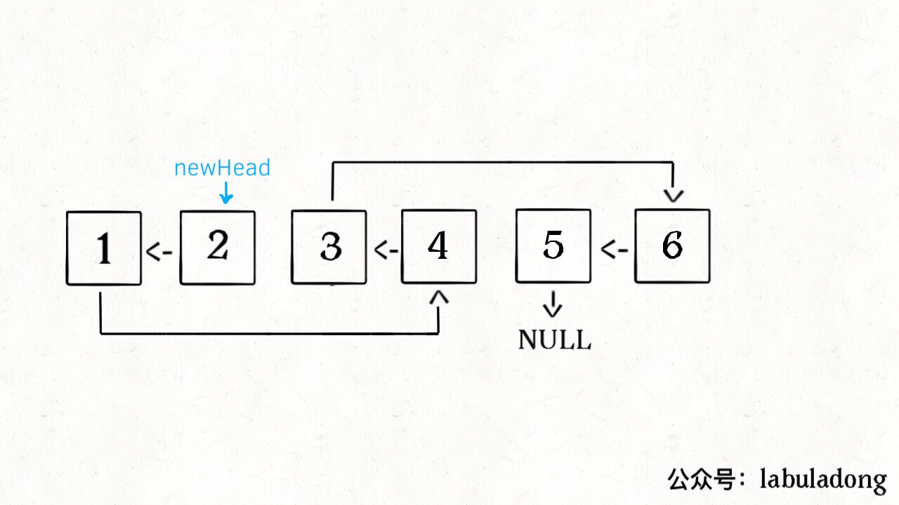
        */
    }
};
```

```go
// by chatGPT (go)
// 定义：输入以 head 开头的单链表，将这个单链表中的每两个元素翻转，
// 返回翻转后的链表头结点
func swapPairs(head *ListNode) *ListNode {
    if head == nil || head.Next == nil {
        return head
    }
    first := head
    second := head.Next
    others := head.Next.Next
    // 先把前两个元素翻转
    second.Next = first
    // 利用递归定义，将剩下的链表节点两两翻转，接到后面
    first.Next = swapPairs(others)
    // 现在整个链表都成功翻转了，返回新的头结点
    return second
}
```

```java
// by labuladong (java)
class Solution {
    // 定义：输入以 head 开头的单链表，将这个单链表中的每两个元素翻转，
    // 返回翻转后的链表头结点
    public ListNode swapPairs(ListNode head) {
        if (head == null || head.next == null) {
            return head;
        }
        ListNode first = head;
        ListNode second = head.next;
        ListNode others = head.next.next;
        // 先把前两个元素翻转
        second.next = first;
        // 利用递归定义，将剩下的链表节点两两翻转，接到后面
        first.next = swapPairs(others);
        // 现在整个链表都成功翻转了，返回新的头结点
        return second;
        /**<extend up -200>
        
        */
    }
}
```

```javascript
// by chatGPT (javascript)
/**
 * 定义：输入以 head 开头的单链表，将这个单链表中的每两个元素翻转，
 * 返回翻转后的链表头结点
 */
var swapPairs = function(head) {
    if (head == null || head.next == null) {
        return head;
    }
    // 先把前两个元素翻转
    let first = head;
    let second = head.next;
    let others = head.next.next;
    second.next = first;
    // 利用递归定义，将剩下的链表节点两两翻转，接到后面
    first.next = swapPairs(others);
    // 现在整个链表都成功翻转了，返回新的头结点
    return second;
    /**<extend up -200>
    
    */
};
```

```python
# by chatGPT (python)
# Definition for singly-linked list.
# class ListNode:
#     def __init__(self, x):
#         self.val = x
#         self.next = None

class Solution:
    def swapPairs(self, head: ListNode) -> ListNode:
        """
        :type head: ListNode
        :rtype: ListNode
        输入以 head 开头的单链表，将这个单链表中的每两个元素翻转，
        返回翻转后的链表头结点
        """
        if not head or not head.next:
            # 如果当前节点 head 为空, 或者下一个节点 head.next 为空, 将 head 直接返回
            return head
        # 定义三个变量, 分别为当前节点, 当前节点的下一个节点和下下个节点
        first, second, others = head, head.next, head.next.next
        # 先把前两个元素翻转
        second.next = first
        # 利用递归定义, 将剩下的链表节点两两翻转, 接到后面
        first.next = self.swapPairs(others)
        # 现在整个链表都成功翻转了, 返回新的头结点
        return second
        """
        原链表为：head → 1 → 2 → 3 → 4 → null，
        要求链表为：head → 2 → 1 → 4 → 3 → null。
        
        """
```

https://leetcode.cn/problems/swap-nodes-in-pairs 的多语言解法👆

https://leetcode.cn/problems/target-sum 的多语言解法👇

```cpp
// by chatGPT (cpp)
class Solution {
public:
    int findTargetSumWays(vector<int>& nums, int target) {
        if (nums.empty()) return 0;
        return dp(nums, 0, target);
    }

    // 备忘录
    unordered_map<string, int> memo;

    int dp(vector<int>& nums, int i, int remain) {
        // base case
        if (i == nums.size()) {
            if (remain == 0) return 1;
            return 0;
        }
        // 把它俩转成字符串才能作为哈希表的键
        string key = to_string(i) + "," + to_string(remain);
        // 避免重复计算
        if (memo.count(key)) {
            return memo[key];
        }
        // 还是穷举
        int result = dp(nums, i + 1, remain - nums[i]) + dp(nums, i + 1, remain + nums[i]);
        // 记入备忘录
        memo[key] = result;
        return result;
    }
};
```

```go
// by chatGPT (go)
func findTargetSumWays(nums []int, target int) int {
    // 如果nums为空，则直接返回0
    if len(nums) == 0 {
        return 0
    }
    // 定义备忘录
    memo := make(map[string]int)
    // 调用DP函数
    return dp(nums, 0, target, memo)
}

func dp(nums []int, i, remain int, memo map[string]int) int {
    // base case
    if i == len(nums) {
        if remain == 0 {
            return 1
        }
        return 0
    }
    // 把它俩转成字符串才能作为哈希表的键
    key := strconv.Itoa(i) + "," + strconv.Itoa(remain)
    // 避免重复计算
    if val, ok := memo[key]; ok {
        return val
    }
    // 还是穷举
    result := dp(nums, i+1, remain-nums[i], memo) + dp(nums, i+1, remain+nums[i], memo)
    // 记入备忘录
    memo[key] = result
    return result
}
```

```java
// by labuladong (java)
class Solution {
    public int findTargetSumWays(int[] nums, int target) {
        if (nums.length == 0) return 0;
        return dp(nums, 0, target);
    }

    // 备忘录
    HashMap<String, Integer> memo = new HashMap<>();

    int dp(int[] nums, int i, int remain) {
        // base case
        if (i == nums.length) {
            if (remain == 0) return 1;
            return 0;
        }
        // 把它俩转成字符串才能作为哈希表的键
        String key = i + "," + remain;
        // 避免重复计算
        if (memo.containsKey(key)) {
            return memo.get(key);
        }
        // 还是穷举
        int result = dp(nums, i + 1, remain - nums[i]) + dp(nums, i + 1, remain + nums[i]);
        // 记入备忘录
        memo.put(key, result);
        return result;
    }
}
```

```javascript
// by chatGPT (javascript)
// 传入一个整数数组和目标值target，求有多少种方法使得数组中的元素之和为target，每个元素可以选择加或者减
var findTargetSumWays = function (nums, target) {
  // 数组长度为0直接返回0
  if (nums.length === 0) return 0;

  // 备忘录哈希表，记录已经计算过的子问题的结果，避免重复计算
  const memo = new Map();

  // 递归函数
  const dp = (nums, i, remain) => {
    // 如果已经遍历到了数组的末尾，判断remain是否等于0，如果等于0则返回1，否则返回0
    if (i === nums.length) {
      if (remain === 0) return 1;
      return 0;
    }

    // 用i和remain作为键，判断是否已经计算过这个子问题，如果已经计算，则直接返回结果，否则继续计算
    const key = i + "," + remain;

    if (memo.has(key)) {
      return memo.get(key);
    }

    // 分别递归计算加上和减去当前元素后能够得到目标值的方案数量，相加得到当前子问题的解
    const result =
      dp(nums, i + 1, remain - nums[i]) + dp(nums, i + 1, remain + nums[i]);

    // 把计算结果存入备忘录
    memo.set(key, result);

    // 返回当前子问题的解
    return result;
  };

  // 从0开始遍历数组，计算从每个索引开始的子问题，最终得到问题的解
  return dp(nums, 0, target);
};
```

```python
# by chatGPT (python)
class Solution:
    def findTargetSumWays(self, nums: List[int], target: int) -> int:
        if len(nums) == 0: return 0
        # 调用备忘录函数
        return self.dp(nums, 0, target, {})

    def dp(self, nums, i, remain, memo): 
        # base case
        if i == len(nums):
            if remain == 0: return 1
            return 0
        # 把它俩转成字符串才能作为哈希表的键
        key = str(i) + "," + str(remain)
        # 避免重复计算
        if key in memo:
            return memo[key]
        # 还是穷举
        result = self.dp(nums, i + 1, remain - nums[i], memo) + self.dp(nums, i + 1, remain + nums[i], memo)
        # 记入备忘录
        memo[key] = result
        return result
```

https://leetcode.cn/problems/target-sum 的多语言解法👆

https://leetcode.cn/problems/the-maze 的多语言解法👇

```cpp
// by chatGPT (cpp)
class Solution {
public:
    bool hasPath(vector<vector<int>>& maze, vector<int>& start, vector<int>& destination) {
        int m = maze.size(), n = maze[0].size();
        // 方向数组，方便上下左右移动
        int dirs[4][2] = {{0,1},{0,-1},{1,0},{-1,0}};

        // BFS 算法的队列和 visited 数组
        queue<vector<int>> q;
        vector<vector<bool>> visited(m, vector<bool>(n, false));
        // 加入起点
        q.push(start);
        visited[start[0]][start[1]] = true;
        // 启动 BFS 算法框架
        while (!q.empty()) {
            vector<int> cur = q.front();
            q.pop();
            // 向四个方向扩展
            for (auto dir : dirs) {
                int x = cur[0], y = cur[1];
                // 和其他题目不同的是，这里一直走到墙，而不是只走一步
                while (x >= 0 && x < m && y >= 0 && y < n && maze[x][y] == 0) {
                    x += dir[0];
                    y += dir[1];
                }
                x -= dir[0];
                y -= dir[1];
                // 判断是否到达终点
                if (x == destination[0] && y == destination[1]) {
                    return true;
                }
                if (!visited[x][y]) {
                    visited[x][y] = true;
                    q.push({x, y});
                }
            }
        }
        return false;
    }
};
```

```go
// by chatGPT (go)
import "fmt"

func hasPath(maze [][]int, start []int, destination []int) bool {
    m, n := len(maze), len(maze[0])
    // 方向数组，方便上下左右移动
    dirs := [][]int{{0, 1}, {0, -1}, {1, 0}, {-1, 0}}

    q := [][]int{start}
    visited := make([][]bool, m)
    for i := range visited {
        visited[i] = make([]bool, n)
    }
    visited[start[0]][start[1]] = true

    // 启动 BFS 算法框架
    for len(q) > 0 {
        cur := q[0]
        q = q[1:]
        // 向四个方向扩展
        for _, dir := range dirs {
            x, y := cur[0], cur[1]
            // 和其他题目不同的是，这里一直走到墙，而不是只走一步
            for x >= 0 && x < m && y >= 0 && y < n && maze[x][y] == 0 {
                x += dir[0]
                y += dir[1]
            }
            x -= dir[0]
            y -= dir[1]
            // 判断是否到达终点
            if x == destination[0] && y == destination[1] {
                return true
            }
            if !visited[x][y] {
                visited[x][y] = true
                q = append(q, []int{x, y})
            }
        }
    }
    return false
}

func main() {
    maze := [][]int{
        {0,0,1,0,0},
        {0,0,0,0,0},
        {0,0,0,1,0},
        {1,1,0,1,1},
        {0,0,0,0,0},
    }
    start := []int{0, 4}
    destination := []int{4, 4}
    fmt.Println(hasPath(maze, start, destination)) // Output: true
}
```

```java
// by labuladong (java)
class Solution {
    public boolean hasPath(int[][] maze, int[] start, int[] destination) {
        int m = maze.length, n = maze[0].length;
        // 方向数组，方便上下左右移动
        int[][] dirs = {{0,1},{0,-1},{1,0},{-1,0}};

        // BFS 算法的队列和 visited 数组
        Queue<int[]> q = new LinkedList<>();
        boolean[][] visited = new boolean[m][n];
        // 加入起点
        q.offer(start);
        visited[start[0]][start[1]] = true;
        // 启动 BFS 算法框架
        while (!q.isEmpty()) {
            int[] cur = q.poll();
            // 向四个方向扩展
            for (int[] dir : dirs) {
                int x = cur[0], y = cur[1];
                // 和其他题目不同的是，这里一直走到墙，而不是只走一步
                while (x >= 0 && x < m && y >= 0 && y < n && maze[x][y] == 0) {
                    x += dir[0];
                    y += dir[1];
                }
                x -= dir[0];
                y -= dir[1];
                // 判断是否到达终点
                if (x == destination[0] && y == destination[1]) {
                    return true;
                }
                if (!visited[x][y]) {
                    visited[x][y] = true;
                    q.offer(new int[]{x, y});
                }
            }
        }
        return false;
    }
}
```

```javascript
// by chatGPT (javascript)
var hasPath = function(maze, start, destination) {
    var m = maze.length, n = maze[0].length;
    // 方向数组，方便上下左右移动
    var dirs = [[0,1],[0,-1],[1,0],[-1,0]];

    // BFS 算法的队列和 visited 数组
    var q = [];
    var visited = new Array(m);
    for (var i = 0; i < m; i++) {
        visited[i] = new Array(n).fill(false);
    }
    // 加入起点
    q.push(start);
    visited[start[0]][start[1]] = true;
    // 启动 BFS 算法框架
    while (q.length > 0) {
        var cur = q.shift();
        // 向四个方向扩展
        for (var i = 0; i < 4; i++) {
            var dir = dirs[i];
            var x = cur[0], y = cur[1];
            // 和其他题目不同的是，这里一直走到墙，而不是只走一步
            while (x >= 0 && x < m && y >= 0 && y < n && maze[x][y] == 0) {
                x += dir[0];
                y += dir[1];
            }
            x -= dir[0];
            y -= dir[1];
            // 判断是否到达终点
            if (x == destination[0] && y == destination[1]) {
                return true;
            }
            if (!visited[x][y]) {
                visited[x][y] = true;
                q.push([x, y]);
            }
        }
    }
    return false;
};
```

```python
# by chatGPT (python)
from typing import List
from queue import Queue

class Solution:
    def hasPath(self, maze: List[List[int]], start: List[int], destination: List[int]) -> bool:
        m, n = len(maze), len(maze[0])   # 获取矩阵的行和列
        dirs = [(0, 1), (0, -1), (1, 0), (-1, 0)]   # 四个方向

        q = Queue()   # BFS 算法的队列
        visited = [[False for _ in range(n)] for _ in range(m)]   # visited 数组
        q.put(start)   # 加入起点
        visited[start[0]][start[1]] = True   # 设置该点已访问
        # 启动 BFS 算法框架
        while not q.empty():
            x, y = q.get()
            # 向四个方向扩展
            for dir in dirs:
                # 和其他题目不同的是，这里一直走到墙，而不是只走一步
                nr, nc = x, y
                while 0 <= nr < m and 0 <= nc < n and not maze[nr][nc]:
                    nr += dir[0]
                    nc += dir[1]
                nr -= dir[0]   # 走过墙后需要回退一步
                nc -= dir[1]
                # 判断是否到达终点
                if (nr, nc) == tuple(destination):
                    return True
                if not visited[nr][nc]:
                    visited[nr][nc] = True   # 设置该点已访问
                    q.put((nr, nc))

        return False
```

https://leetcode.cn/problems/the-maze 的多语言解法👆

https://leetcode.cn/problems/the-maze-ii 的多语言解法👇

```cpp
// by chatGPT (cpp)
class Solution {
public:
    int shortestDistance(vector<vector<int>>& maze, vector<int>& start, vector<int>& destination) {
        int m = maze.size(), n = maze[0].size();
        // 方向数组，方便上下左右移动
        vector<vector<int>> dirs = {{0, 1}, {0, -1}, {1, 0}, {-1, 0}};

        // BFS 算法的队列和 visited 数组
        queue<vector<int>> q;
        vector<vector<bool>> visited(m, vector<bool>(n, false));
        // 加入起点
        q.push(start);
        visited[start[0]][start[1]] = true;
        // 启动 BFS 算法框架
        while (!q.empty()) {
            vector<int> cur = q.front();
            q.pop();
            // 向四个方向扩展
            for (auto dir : dirs) {
                int x = cur[0], y = cur[1];
                int step = 0;
                // 和其他题目不同的是，这里一直走到墙，而不是只走一步，同时要记录走过的步数
                while (x >= 0 && x < m && y >= 0 && y < n && maze[x][y] == 0) {
                    x += dir[0];
                    y += dir[1];
                    step++;
                }
                x -= dir[0];
                y -= dir[1];
                step--;
                // 判断是否到达终点
                if (x == destination[0] && y == destination[1]) {
                    return step;
                }
                if (!visited[x][y]) {
                    visited[x][y] = true;
                    q.push({x, y});
                }
            }
        }
        return -1;
    }
};
```

```go
// by chatGPT (go)
import "container/list"

func shortestDistance(maze [][]int, start []int, destination []int) int {
    m, n := len(maze), len(maze[0])
    // 方向数组，方便上下左右移动
    dirs := [][]int{{0,1},{0,-1},{1,0},{-1,0}}

    // BFS 算法的队列和 visited 数组
    q := list.New()
    visited := make([][]bool, m)
    for i := range visited {
        visited[i] = make([]bool, n)
    }
    // 加入起点
    q.PushBack(start)
    visited[start[0]][start[1]] = true
    // 启动 BFS 算法框架
    for q.Len() != 0 {
        cur := q.Front().Value.([]int)
        q.Remove(q.Front())
        // 向四个方向扩展
        for _, dir := range dirs {
            x, y := cur[0], cur[1]
            step := 0
            // 和其他题目不同的是，这里一直走到墙，而不是只走一步，同时要记录走过的步数
            for x >= 0 && x < m && y >= 0 && y < n && maze[x][y] == 0 {
                x += dir[0]
                y += dir[1]
                step++
            }
            x -= dir[0]
            y -= dir[1]
            step--
            // 判断是否到达终点
            if x == destination[0] && y == destination[1] {
                return step
            }
            if !visited[x][y] {
                visited[x][y] = true
                q.PushBack([]int{x, y})
            }
        }
    }
    return -1
}
```

```java
// by labuladong (java)
class Solution {
    public int shortestDistance(int[][] maze, int[] start, int[] destination) {
        int m = maze.length, n = maze[0].length;
        // 方向数组，方便上下左右移动
        int[][] dirs = {{0,1},{0,-1},{1,0},{-1,0}};

        // BFS 算法的队列和 visited 数组
        Queue<int[]> q = new LinkedList<>();
        boolean[][] visited = new boolean[m][n];
        // 加入起点
        q.offer(start);
        visited[start[0]][start[1]] = true;
        int step = 0;
        // 启动 BFS 算法框架
        while (!q.isEmpty()) {
            int[] cur = q.poll();
            // 向四个方向扩展
            for (int[] dir : dirs) {
                int x = cur[0], y = cur[1];
                // 和其他题目不同的是，这里一直走到墙，而不是只走一步，同时要记录走过的步数
                while (x >= 0 && x < m && y >= 0 && y < n && maze[x][y] == 0) {
                    x += dir[0];
                    y += dir[1];
                    step++;
                }
                x -= dir[0];
                y -= dir[1];
                step--;
                // 判断是否到达终点
                if (x == destination[0] && y == destination[1]) {
                    return step;
                }
                if (!visited[x][y]) {
                    visited[x][y] = true;
                    q.offer(new int[]{x, y});
                }
            }
        }
        return -1;
    }
}
```

```javascript
// by chatGPT (javascript)
var shortestDistance = function(maze, start, destination) {
    var m = maze.length, n = maze[0].length;
    // 方向数组，方便上下左右移动
    var dirs = [[0,1],[0,-1],[1,0],[-1,0]];

    // BFS 算法的队列和 visited 数组
    var q = [];
    var visited = new Array(m);
    for (var i = 0; i < m; i++) {
        visited[i] = new Array(n).fill(false);
    }
    // 加入起点
    q.push(start);
    visited[start[0]][start[1]] = true;
    // 启动 BFS 算法框架
    while (q.length > 0) {
        var cur = q.shift();
        // 向四个方向扩展
        for (var dir of dirs) {
            var x = cur[0], y = cur[1];
            var step = 0;
            // 和其他题目不同的是，这里一直走到墙，而不是只走一步，同时要记录走过的步数
            while (x >= 0 && x < m && y >= 0 && y < n && maze[x][y] == 0) {
                x += dir[0];
                y += dir[1];
                step++;
            }
            x -= dir[0];
            y -= dir[1];
            step--;
            // 判断是否到达终点
            if (x == destination[0] && y == destination[1]) {
                return step;
            }
            if (!visited[x][y]) {
                visited[x][y] = true;
                q.push([x, y]);
            }
        }
    }
    return -1;
};
```

```python
# by chatGPT (python)
from queue import Queue

class Solution:
    def shortestDistance(self, maze: List[List[int]], start: List[int], destination: List[int]) -> int:
        m, n = len(maze), len(maze[0])

        # 方向数组，方便上下左右移动
        dirs = [(0,1), (0,-1), (1,0), (-1,0)]

        # BFS 算法的队列和 visited 数组
        q = Queue()
        visited = [[False for _ in range(n)] for _ in range(m)]
        # 加入起点
        q.put(start)
        visited[start[0]][start[1]] = True
        # 启动 BFS 算法框架
        while not q.empty():
            cur = q.get()
            # 向四个方向扩展
            for dir in dirs:
                x, y = cur[0], cur[1]
                step = 0
                # 和其他题目不同的是，这里一直走到墙，而不是只走一步，同时要记录走过的步数
                while x >= 0 and x < m and y >= 0 and y < n and maze[x][y] == 0:
                    x += dir[0]
                    y += dir[1]
                    step += 1
                x -= dir[0]
                y -= dir[1]
                step -= 1
                # 判断是否到达终点
                if x == destination[0] and y == destination[1]:
                    return step
                if not visited[x][y]:
                    visited[x][y] = True
                    q.put((x, y))
        return -1
```

https://leetcode.cn/problems/the-maze-ii 的多语言解法👆

https://leetcode.cn/problems/ti-huan-kong-ge-lcof 的多语言解法👇

```cpp
// by chatGPT (cpp)
class Solution {
public:
    string replaceSpace(string s) {
        string ans;
        for (char c : s) {
            if (c == ' ') {
                ans += "%20";
            } else {
                ans += c;
            }
        }
        return ans;
    }
};
```

```go
// by chatGPT (go)
/**
 * @author ylx
 * @date 2021/2/2 19:19
 * @description Go 实现的 LeetCode 剑指 Offer 05. 替换空格
 */
func replaceSpace(s string) string {
    var res strings.Builder
    for i := 0; i < len(s); i++ {
        if s[i] == ' ' {
            res.WriteString("%20")
        } else {
            res.WriteByte(s[i])
        }
    }
    return res.String()
}
```

```java
// by labuladong (java)
class Solution {
    public String replaceSpace(String s) {
        StringBuilder sb = new StringBuilder();
        for (int i = 0; i < s.length(); i++) {
            char c = s.charAt(i);
            if (c == ' ') {
                sb.append("%20");
            } else {
                sb.append(c);
            }
        }
        return sb.toString();
    }
}
```

```javascript
// by chatGPT (javascript)
var replaceSpace = function(s) {
  var sb = [];
  for (var i = 0; i < s.length; i++) {
    var c = s.charAt(i);
    if (c === ' ') {
      sb.push('%20');
    } else {
      sb.push(c);
    }
  }
  return sb.join('');
};
```

```python
# by chatGPT (python)
class Solution:
    def replaceSpace(self, s: str) -> str:
        sb = []
        for c in s:
            if c == ' ':
                sb.append('%20')
            else:
                sb.append(c)
        return ''.join(sb)
```

https://leetcode.cn/problems/ti-huan-kong-ge-lcof 的多语言解法👆

https://leetcode.cn/problems/top-k-frequent-elements 的多语言解法👇

```cpp
// by chatGPT (cpp)
class Solution {
public:
    vector<int> topKFrequent(vector<int>& nums, int k) {
        // nums 中的元素 -> 该元素出现的频率
        unordered_map<int, int> valToFreq;
        for (int v : nums) {
            valToFreq[v]++;
        }

        priority_queue<pair<int, int>, vector<pair<int, int>>, greater<>> pq;
        for (auto& [val, freq] : valToFreq) {
            pq.emplace(freq, val);
            if (pq.size() > k) {
                pq.pop();
            }
        }

        vector<int> res(k);
        int i = k - 1;
        while (!pq.empty()) {
            res[i] = pq.top().second;
            pq.pop();
            i--;
        }

        return res;
    }
};

class Solution2 {
public:
    vector<int> topKFrequent(vector<int>& nums, int k) {
        // nums 中的元素 -> 该元素出现的频率
        unordered_map<int, int> valToFreq;
        for (int v : nums) {
            valToFreq[v]++;
        }

        // 频率 -> 这个频率有哪些元素
        vector<vector<int>> freqToVals(nums.size() + 1);
        for (auto& [val, freq] : valToFreq) {
            freqToVals[freq].push_back(val);
        }

        vector<int> res(k);
        int p = 0;
        // freqToVals 从后往前存储着出现最多的元素
        for (int i = freqToVals.size() - 1; i > 0; i--) {
            for (int j = 0; j < freqToVals[i].size(); j++) {
                res[p] = freqToVals[i][j];
                p++;
                if (p == k) {
                    return res;
                }
            }
        }

        return res;
    }
};
```

```go
// by chatGPT (go)
// 用优先级队列解决这道题
func topKFrequent(nums []int, k int) []int {
    // nums 中的元素 -> 该元素出现的频率
    valToFreq := make(map[int]int)
    for _, v := range nums {
        valToFreq[v]++
    }

    // 定义优先队列，队列按照键值对中的值（元素出现频率）从小到大排序。
    pq := priorityQueue{}
    for key, value := range valToFreq {
        pq = pq.Push(MapEntry{key, value})
        if len(pq) > k {
            pq.Pop()
        }
    }

    res := make([]int, k)
    for i := k - 1; i >= 0; i-- {
        // res 数组中存储前 k 个最大元素
        res[i] = pq.Pop().key
    }

    return res
}

// 定义优先级队列
type MapEntry struct {
    key   int
    value int
}
type priorityQueue []MapEntry

func (pq priorityQueue) Len() int      { return len(pq) }
func (pq priorityQueue) Swap(i, j int) { pq[i], pq[j] = pq[j], pq[i] }
func (pq priorityQueue) Less(i, j int) bool {
    return pq[i].value < pq[j].value
}
func (pq priorityQueue) Push(x interface{}) priorityQueue {
    item := x.(MapEntry)
    return append(pq, item)
}
func (pq priorityQueue) Pop() MapEntry {
    item := pq[pq.Len()-1]
    pq = pq[:pq.Len()-1]
    return item
}

// 用计数排序的方法解决这道题
func topKFrequent2(nums []int, k int) []int {
    // nums 中的元素 -> 该元素出现的频率
    valToFreq := make(map[int]int)
    for _, v := range nums {
        valToFreq[v]++
    }

    // 频率 -> 这个频率有哪些元素
    freqToVals := make([][]int, len(nums)+1)
    for val, freq := range valToFreq {
        if _, ok := freqToVals[freq]; !ok {
            freqToVals[freq] = []int{}
        }
        freqToVals[freq] = append(freqToVals[freq], val)
    }

    res := make([]int, 0, k)
    // freqToVals 从后往前存储着出现最多的元素
    for i := len(freqToVals) - 1; i > 0; i-- {
        if len(freqToVals[i]) == 0 {
            continue
        }
        res = append(res, freqToVals[i]...)
        if len(res) >= k {
            res = res[:k]
            break
        }
    }

    return res
}
```

```java
// by labuladong (java)
// 用优先级队列解决这道题
class Solution {
    public int[] topKFrequent(int[] nums, int k) {
        // nums 中的元素 -> 该元素出现的频率
        HashMap<Integer, Integer> valToFreq = new HashMap<>();
        for (int v : nums) {
            valToFreq.put(v, valToFreq.getOrDefault(v, 0) + 1);
        }

        PriorityQueue<Map.Entry<Integer, Integer>>
                pq = new PriorityQueue<>((entry1, entry2) -> {
            // 队列按照键值对中的值（元素出现频率）从小到大排序
            return entry1.getValue().compareTo(entry2.getValue());
        });

        for (Map.Entry<Integer, Integer> entry : valToFreq.entrySet()) {
            pq.offer(entry);
            if (pq.size() > k) {
                // 弹出最小元素，维护队列内是 k 个频率最大的元素
                pq.poll();
            }
        }

        int[] res = new int[k];
        for (int i = k - 1; i >= 0; i--) {
            // res 数组中存储前 k 个最大元素
            res[i] = pq.poll().getKey();
        }

        return res;
    }
}

// 用计数排序的方法解决这道题
class Solution2 {
    public int[] topKFrequent(int[] nums, int k) {
        // nums 中的元素 -> 该元素出现的频率
        HashMap<Integer, Integer> valToFreq = new HashMap<>();
        for (int v : nums) {
            valToFreq.put(v, valToFreq.getOrDefault(v, 0) + 1);
        }

        // 频率 -> 这个频率有哪些元素
        ArrayList<Integer>[] freqToVals = new ArrayList[nums.length + 1];
        for (int val : valToFreq.keySet()) {
            int freq = valToFreq.get(val);
            if (freqToVals[freq] == null) {
                freqToVals[freq] = new ArrayList<>();
            }
            freqToVals[freq].add(val);
        }

        int[] res = new int[k];
        int p = 0;
        // freqToVals 从后往前存储着出现最多的元素
        for (int i = freqToVals.length - 1; i > 0; i--) {
            ArrayList<Integer> valList = freqToVals[i];
            if (valList == null) continue;
            for (int j = 0; j < valList.size(); j++) {
                // 将出现次数最多的 k 个元素装入 res
                res[p] = valList.get(j);
                p++;
                if (p == k) {
                    return res;
                }
            }
        }

        return null;
    }
}
```

```javascript
// by chatGPT (javascript)
var topKFrequent = function(nums, k) {
    // nums 中的元素 -> 该元素出现的频率
    const valToFreq = new Map();
    for (let v of nums) {
        valToFreq.set(v, valToFreq.get(v) ? valToFreq.get(v) + 1: 1);
    }

    const pq = new PriorityQueue((a, b) => a.value < b.value);

    for (let [key, value] of valToFreq) {
        pq.offer({key, value});
        if (pq.size() > k) {
            pq.poll();
        }
    }

    const res = [];
    for (let i = 0; i < k; i++) {
        res.push(pq.poll().key);
    }
    return res;
};
```

```python
# by chatGPT (python)
# 用优先级队列解决这道题
class Solution:
    def topKFrequent(self, nums: List[int], k: int) -> List[int]:
        # nums 中的元素 -> 该元素出现的频率
        valToFreq = {}
        for v in nums:
            valToFreq[v] = valToFreq.get(v, 0) + 1

        pq = []
        # 按照键值对中的值（元素出现频率）从小到大排序
        for entry in valToFreq.items():
            heapq.heappush(pq, (entry[1], entry[0]))
            if len(pq) > k:
                # 弹出最小元素，维护队列内是 k 个频率最大的元素
                heapq.heappop(pq)

        res = []
        for i in range(k - 1, -1, -1):
            # res 数组中存储前 k 个最大元素
            res.append(heapq.heappop(pq)[1])

        return res[::-1]

# 用计数排序的方法解决这道题
class Solution2:
    def topKFrequent(self, nums: List[int], k: int) -> List[int]:
        # nums 中的元素 -> 该元素出现的频率
        valToFreq = {}
        for v in nums:
            valToFreq[v] = valToFreq.get(v, 0) + 1

        # 频率 -> 这个频率有哪些元素
        freqToVals = [[] for _ in range(len(nums) + 1)]
        for val, freq in valToFreq.items():
            freqToVals[freq].append(val)

        res = []
        # freqToVals 从后往前存储着出现最多的元素
        for i in range(len(freqToVals) - 1, 0, -1):
            valList = freqToVals[i]
            for j in range(len(valList)):
                # 将出现次数最多的 k 个元素装入 res
                res.append(valList[j])
                if len(res) == k:
                    return res

        return res
```

https://leetcode.cn/problems/top-k-frequent-elements 的多语言解法👆

https://leetcode.cn/problems/top-k-frequent-words 的多语言解法👇

```cpp
// by chatGPT (cpp)
class Solution {
public:
    vector<string> topKFrequent(vector<string>& words, int k) {
        // 字符串 -> 该字符串出现的频率
        unordered_map<string, int> wordToFreq;
        for (string word : words) {
            wordToFreq[word] += 1;
        }

        // 重载 lambda 表达式，处理相同频率的集合按字典序优先级
        auto cmp = [&](const pair<string, int>& a, const pair<string, int>& b) {
            if (a.second == b.second) {
                return a.first < b.first;
            }
            return a.second > b.second;
        };
        priority_queue<pair<string, int>, vector<pair<string, int>>, decltype(cmp)> pq(cmp);

        // 维护出现频率最多的 k 个字符串
        for (auto it : wordToFreq) {
            pq.emplace(it.first, it.second);
            if (pq.size() > k) {
                pq.pop();
            }
        }

        // 把出现次数最多的 k 个字符串返回
        vector<string> res(k, "");
        for (int i = k - 1; i >= 0; --i) {
            res[i] = pq.top().first;
            pq.pop();
        }
        return res;
    }
};
```

```go
// by chatGPT (go)
func topKFrequent(words []string, k int) []string {
    // 字符串 -> 该字符串出现的频率
    wordToFreq := make(map[string]int)
    for _, word := range words {
        wordToFreq[word]++
    }

    pq := priorityQueue{}
    heap.Init(&pq)

    // entry结构体数组
    type entry struct {
        key   string
        value int
    }

    // 大顶堆函数
    heapFunc := func(a, b *entry) bool {
        // 注意这里，如果出现频率相同，按照字符串字典序排序
        if a.value == b.value {
            return a.key > b.key
        }
        // 队列按照字符串出现频率从小到大排序
        return a.value < b.value
    }

    // 维护出现频率最多的 k 个单词
    for key, value := range wordToFreq {
        en := &entry{key, value}
        if pq.Len() == k {
            if heapFunc(pq[0], en) {
                heap.Pop(&pq)
                heap.Push(&pq, en)
            }
        } else {
            heap.Push(&pq, en)
        }
    }

    // 把出现次数最多的 k 个字符串返回
    res := make([]string, k)
    for i := k - 1; i >= 0; i-- {
        res[i] = heap.Pop(&pq).(*entry).key
    }
    return res
}

// 定义堆排序函数
type priorityQueue []*entry

func (pq priorityQueue) Len() int { return len(pq) }

func (pq priorityQueue) Less(i, j int) bool {
    // 注意这里，仿佛要反着来
    return pq[i].value > pq[j].value
}

func (pq priorityQueue) Swap(i, j int) { pq[i], pq[j] = pq[j], pq[i] }

func (pq *priorityQueue) Push(x interface{}) {
    // 注意类型转换
    item := x.(*entry)
    *pq = append(*pq, item)
}

func (pq *priorityQueue) Pop() interface{} {
    old := *pq
    n := len(old)
    item := old[n-1]
    *pq = old[0 : n-1]
    return item
}
```

```java
// by labuladong (java)
class Solution {
    public List<String> topKFrequent(String[] words, int k) {
        // 字符串 -> 该字符串出现的频率
        HashMap<String, Integer> wordToFreq = new HashMap<>();
        for (String word : words) {
            wordToFreq.put(word, wordToFreq.getOrDefault(word, 0) + 1);
        }

        PriorityQueue<Map.Entry<String, Integer>> pq = new PriorityQueue<>(
                (entry1, entry2) -> {
                    if (entry1.getValue().equals(entry2.getValue())) {
                        // 如果出现频率相同，按照字符串字典序排序
                        return entry2.getKey().compareTo(entry1.getKey());
                    }
                    // 队列按照字符串出现频率从小到大排序
                    return entry1.getValue().compareTo(entry2.getValue());
                });

        // 按照字符串频率升序排序
        for (Map.Entry<String, Integer> entry : wordToFreq.entrySet()) {
            pq.offer(entry);
            if (pq.size() > k) {
                // 维护出现频率最多的 k 个单词
                pq.poll();
            }
        }

        // 把出现次数最多的 k 个字符串返回
        LinkedList<String> res = new LinkedList<>();
        while (!pq.isEmpty()) {
            res.addFirst(pq.poll().getKey());
        }
        return res;
    }
}
```

```javascript
// by chatGPT (javascript)
var topKFrequent = function(words, k) {
    // 字符串 -> 该字符串出现的频率
    let wordToFreq = new Map();
    for (let word of words) {
        wordToFreq.set(word, wordToFreq.get(word) + 1 || 1);
    }

    let pq = new PriorityQueue((a, b) => {
        if (a.freq === b.freq) {
            // 如果出现频率相同，按照字符串字典序排序
            return b.word.localeCompare(a.word);
        }
        // 队列按照字符串出现频率从小到大排序
        return a.freq - b.freq;
    });

    // 按照字符串频率升序排序
    for (let [word, freq] of wordToFreq.entries()) {
        pq.offer({ word, freq });
        if (pq.size > k) {
            // 维护出现频率最多的 k 个单词
            pq.poll();
        }
    }

    // 把出现次数最多的 k 个字符串返回
    let res = [];
    while (!pq.isEmpty()) {
        res.push(pq.poll().word);
    }
    return res.reverse();
};
```

```python
# by chatGPT (python)
class Solution:
    def topKFrequent(self, words: List[str], k: int) -> List[str]:
        # 字符串 -> 该字符串出现的频率
        wordToFreq = {}
        for word in words:
            wordToFreq[word] = wordToFreq.get(word, 0) + 1

        pq = []
        for word, freq in wordToFreq.items():
            # 存储负值，让小根堆变成大根堆
            pq.append((-freq, word))

        # 构建小根堆
        heapq.heapify(pq)

        # 取出前k个高频单词
        res = []
        for _ in range(k):
            freq, word = heapq.heappop(pq)
            res.append(word)

        return res
```

https://leetcode.cn/problems/top-k-frequent-words 的多语言解法👆

https://leetcode.cn/problems/transpose-matrix 的多语言解法👇

```cpp
// by chatGPT (cpp)
class Solution {
public:
    vector<vector<int>> transpose(vector<vector<int>>& matrix) {
        int m = matrix.size(), n = matrix[0].size();
        // 转置矩阵的长和宽颠倒
        vector<vector<int>> res(n, vector<int>(m));
        for (int i = 0; i < m; i++) {
            for (int j = 0; j < n; j++) {
                res[j][i] = matrix[i][j];
            }
        }
        return res;
    }
};
```

```go
// by chatGPT (go)
// leetcode format 
func transpose(matrix [][]int) [][]int {
    m, n := len(matrix), len(matrix[0])
    //  转置矩阵的长和宽颠倒
    res := make([][]int, n)
    for i := range res {
        res[i] = make([]int, m)
    }
    for i := 0; i < m; i++ {
        for j := 0; j < n; j++ {
            res[j][i] = matrix[i][j]
        }
    }
    return res
}
```

```java
// by labuladong (java)
class Solution {
    public int[][] transpose(int[][] matrix) {
        int m = matrix.length, n = matrix[0].length;
        // 转置矩阵的长和宽颠倒
        int[][] res = new int[n][m];
        for (int i = 0; i < m; i++)
            for (int j = 0; j < n; j++) {
                res[j][i] = matrix[i][j];
            }
        return res;
    }
}
```

```javascript
// by chatGPT (javascript)
var transpose = function(matrix) {
    var m = matrix.length, n = matrix[0].length;
    // 转置矩阵的长和宽颠倒
    var res = new Array(n).fill().map(() => new Array(m).fill(0));
    for (var i = 0; i < m; i++)
        for (var j = 0; j < n; j++) {
            res[j][i] = matrix[i][j];
        }
    return res;
}
```

```python
# by chatGPT (python)
class Solution:
    def transpose(self, matrix: List[List[int]]) -> List[List[int]]:
        m, n = len(matrix), len(matrix[0]) #转置矩阵的长和宽颠倒
        res = [[0] * m for _ in range(n)]
        for i in range(m):
            for j in range(n):
                res[j][i] = matrix[i][j]
        return res
```

https://leetcode.cn/problems/transpose-matrix 的多语言解法👆

https://leetcode.cn/problems/trapping-rain-water 的多语言解法👇

```cpp
// by chatGPT (cpp)
class Solution {
public:
    int trap(vector<int>& height) {
        if (height.empty()) {
            return 0;
        }
        int n = height.size();
        int res = 0;
        // 数组充当备忘录
        vector<int> l_max(n);
        vector<int> r_max(n);
        // 初始化 base case
        l_max[0] = height[0];
        r_max[n - 1] = height[n - 1];
        // 从左向右计算 l_max
        for (int i = 1; i < n; i++) {
            l_max[i] = max(height[i], l_max[i - 1]);
        }
        // 从右向左计算 r_max
        for (int i = n - 2; i >= 0; i--) {
            r_max[i] = max(height[i], r_max[i + 1]);
        }
        // 计算答案
        for (int i = 1; i < n - 1; i++) {
            res += min(l_max[i], r_max[i]) - height[i];
        }
        /**<extend up -300>
        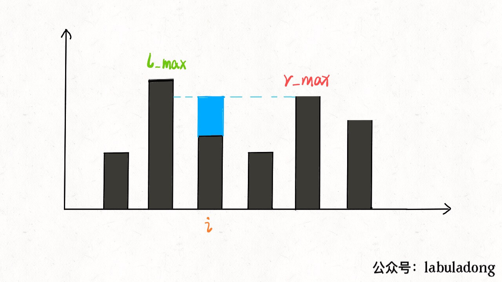
        */
        return res;
    }
};
```

```go
// by chatGPT (go)
func trap(height []int) int {
    if len(height) == 0 {
        return 0
    }
    n := len(height)
    res := 0
    // 数组充当备忘录
    l_max := make([]int, n)
    r_max := make([]int, n)
    // 初始化 base case
    l_max[0] = height[0]
    r_max[n - 1] = height[n - 1]
    // 从左向右计算 l_max
    for i := 1; i < n; i++ {
        l_max[i] = max(height[i], l_max[i - 1])
    }
    // 从右向左计算 r_max
    for i := n - 2; i >= 0; i-- {
        r_max[i] = max(height[i], r_max[i + 1])
    }
    // 计算答案
    for i := 1; i < n - 1; i++ {
        res += min(l_max[i], r_max[i]) - height[i]
        /**<extend up -300>
        
        */
    } 
    return res;
}

func max(a, b int) int {
    if a > b {
        return a
    }
    return b 
}

func min(a, b int) int {
    if a < b {
        return a
    }
    return b 
}
```

```java
// by labuladong (java)
class Solution {
    public int trap(int[] height) {
        if (height.length == 0) {
            return 0;
        }
        int n = height.length;
        int res = 0;
        // 数组充当备忘录
        int[] l_max = new int[n];
        int[] r_max = new int[n];
        // 初始化 base case
        l_max[0] = height[0];
        r_max[n - 1] = height[n - 1];
        // 从左向右计算 l_max
        for (int i = 1; i < n; i++)
            l_max[i] = Math.max(height[i], l_max[i - 1]);
        // 从右向左计算 r_max
        for (int i = n - 2; i >= 0; i--)
            r_max[i] = Math.max(height[i], r_max[i + 1]);
        // 计算答案
        for (int i = 1; i < n - 1; i++)
            res += Math.min(l_max[i], r_max[i]) - height[i];
            /**<extend up -300>
            
            */
        return res;
    }
}
```

```javascript
// by chatGPT (javascript)
var trap = function(height) {
  if (height.length == 0) {
    return 0;
  }
  var n = height.length;
  var res = 0;
  // 数组充当备忘录
  var l_max = new Array(n);
  var r_max = new Array(n);
  // 初始化 base case
  l_max[0] = height[0];
  r_max[n - 1] = height[n - 1];
  // 从左向右计算 l_max
  for (var i = 1; i < n; i++) {
    l_max[i] = Math.max(height[i], l_max[i - 1]);
  }
  // 从右向左计算 r_max
  for (var i = n - 2; i >= 0; i--) {
    r_max[i] = Math.max(height[i], r_max[i + 1]);
  }
  // 计算答案
  for (var i = 1; i < n - 1; i++) {
    res += Math.min(l_max[i], r_max[i]) - height[i];
  }
  /**<extend up -300>
  
  */
  return res;
};
```

```python
# by chatGPT (python)
class Solution:
    def trap(self, height: List[int]) -> int:
        if not height:
            return 0
        n = len(height)
        res = 0
        # 数组充当备忘录
        l_max = [0] * n
        r_max = [0] * n
        # 初始化 base case
        l_max[0] = height[0]
        r_max[n - 1] = height[n - 1]
        # 从左向右计算 l_max
        for i in range(1, n):
            l_max[i] = max(height[i], l_max[i - 1])
        # 从右向左计算 r_max
        for i in range(n - 2, -1, -1):
            r_max[i] = max(height[i], r_max[i + 1])
        # 计算答案
        for i in range(1, n - 1):
            res += min(l_max[i], r_max[i]) - height[i]
            """
            extend up -300
            
            """
        return res
```

https://leetcode.cn/problems/trapping-rain-water 的多语言解法👆

https://leetcode.cn/problems/two-sum 的多语言解法👇

```cpp
// by chatGPT (cpp)
class Solution {
public:
    vector<int> twoSum(vector<int>& nums, int target) {
        // 维护 val -> index 的映射
        unordered_map<int, int> valToIndex;
        for (int i = 0; i < nums.size(); i++) {
            // 查表，看看是否有能和 nums[i] 凑出 target 的元素
            int need = target - nums[i];
            if (valToIndex.count(need)) {
                return vector<int>{valToIndex[need], i};
            }
            // 存入 val -> index 的映射
            valToIndex[nums[i]] = i;
        }
        return vector<int>{};
    }
};
```

```go
// by chatGPT (go)
func twoSum(nums []int, target int) []int {
    // 维护 val -> index 的映射
    valToIndex := make(map[int]int)

    for i, num := range nums {
        // 查表，看看是否有能和 nums[i] 凑出 target 的元素
        need := target - num
        if valToIndex[need] != 0 {
            return []int{valToIndex[need] - 1, i}
        }
        // 存入 val -> index 的映射
        valToIndex[num] = i + 1
    }

    return nil
}
```

```java
// by labuladong (java)
class Solution {
    public int[] twoSum(int[] nums, int target) {
        // 维护 val -> index 的映射
        HashMap<Integer, Integer> valToIndex = new HashMap<>();
        for (int i = 0; i < nums.length; i++) {
            // 查表，看看是否有能和 nums[i] 凑出 target 的元素
            int need = target - nums[i];
            if (valToIndex.containsKey(need)) {
                return new int[]{valToIndex.get(need), i};
            }
            // 存入 val -> index 的映射
            valToIndex.put(nums[i], i);
        }
        return null;
    }
}
```

```javascript
// by chatGPT (javascript)
var twoSum = function(nums, target) {
    // 维护 val -> index 的映射
    var valToIndex = new Map();
    for (var i = 0; i < nums.length; i++) {
        // 查表，看看是否有能和 nums[i] 凑出 target 的元素
        var need = target - nums[i];
        if (valToIndex.has(need)) {
            return [valToIndex.get(need), i];
        }
        // 存入 val -> index 的映射
        valToIndex.set(nums[i], i);
    }
    return null;
};
```

```python
# by chatGPT (python)
class Solution:
    def twoSum(self, nums: List[int], target: int) -> List[int]:
        # 维护 val -> index 的映射
        valToIndex = {}
        for i in range(len(nums)):
            # 查表，看看是否有能和 nums[i] 凑出 target 的元素
            need = target - nums[i]
            if need in valToIndex:
                return [valToIndex[need], i]
            # 存入 val -> index 的映射
            valToIndex[nums[i]] = i
        return []
```

https://leetcode.cn/problems/two-sum 的多语言解法👆

https://leetcode.cn/problems/two-sum-less-than-k 的多语言解法👇

```cpp
// by chatGPT (cpp)
class Solution {
public:
    int twoSumLessThanK(vector<int>& nums, int k) {
        // 数组双指针一般都要先排序
        sort(nums.begin(), nums.end());
        // 左右指针技巧
        int lo = 0, hi = nums.size() - 1;
        int sum = -1;
        while (lo < hi) {
            if (nums[lo] + nums[hi] < k) {
                // 比目标值 k 小，则右移左指针
                sum = max(sum, nums[lo] + nums[hi]);
                lo++;
            } else {
                // 比目标值 k 大，则左移右指针
                hi--;
            }
        }
        return sum;
    }
};
```

```go
// by chatGPT (go)
// 
import "sort"

// TwoSumLessThanK 函数返回 nums 数组中任意两个数的最大和，
// 但不超过 k 的和
func twoSumLessThanK(nums []int, k int) int {
	// 数组双指针一般都要先排序
	sort.Ints(nums)

	// 左右指针技巧
	lo, hi := 0, len(nums)-1
	sum := -1

	for lo < hi {
		if nums[lo]+nums[hi] < k {
			// 比目标值 k 小，则右移左指针
			sum = max(sum, nums[lo]+nums[hi])
			lo++
		} else {
			// 比目标值 k 大，则左移右指针
			hi--
		}
	}

	return sum
}

// 辅助函数 max 返回两个整数中的较大值
func max(a, b int) int {
	if a > b {
		return a
	}
	return b
}
```

```java
// by labuladong (java)
class Solution {
    public int twoSumLessThanK(int[] nums, int k) {
        // 数组双指针一般都要先排序
        Arrays.sort(nums);
        // 左右指针技巧
        int lo = 0, hi = nums.length - 1;
        int sum = -1;
        while (lo < hi) {
            if (nums[lo] + nums[hi] < k) {
                // 比目标值 k 小，则右移左指针
                sum = Math.max(sum, nums[lo] + nums[hi]);
                lo++;
            } else {
                // 比目标值 k 大，则左移右指针
                hi--;
            }
        }
        return sum;
    }
}
```

```javascript
// by chatGPT (javascript)
var twoSumLessThanK = function(nums, k) {
   // 数组双指针一般都要先排序
   nums.sort(function(a, b){return a - b});
   // 左右指针技巧
   var lo = 0, hi = nums.length - 1;
   var sum = -1;
   while (lo < hi) {
       if (nums[lo] + nums[hi] < k) {
           // 比目标值 k 小，则右移左指针
           sum = Math.max(sum, nums[lo] + nums[hi]);
           lo++;
       } else {
           // 比目标值 k 大，则左移右指针
           hi--;
       }
   }
   return sum;
};
```

```python
# by chatGPT (python)
class Solution:
    def twoSumLessThanK(self, nums: List[int], k: int) -> int:
        # 数组双指针一般都要先排序
        nums.sort()
        # 左右指针技巧
        lo, hi = 0, len(nums) - 1
        sum = -1
        while lo < hi:
            if nums[lo] + nums[hi] < k:
                # 比目标值 k 小，则右移左指针
                sum = max(sum, nums[lo] + nums[hi])
                lo += 1
            else:
                # 比目标值 k 大，则左移右指针
                hi -= 1
        return sum
```

https://leetcode.cn/problems/two-sum-less-than-k 的多语言解法👆

https://leetcode.cn/problems/uUsW3B 的多语言解法👇

```cpp
// by labuladong (cpp)
class Solution {
    public:

    vector<vector<int>>res;
    vector<vector<int>> combine(int n, int k) {
        if (k <= 0 || n <= 0) return res;
        vector<int> track;
        backtrack(n, k, 1, track);
        return res;
    }

    void backtrack(int n, int k, int start, vector<int>& track) {
        // 到达树的底部
        if (k == track.size()) {
            res.push_back(track);
            return;
        }
        // 注意 i 从 start 开始递增
        for (int i = start; i <= n; i++) {
            // 做选择
            track.push_back(i);
            backtrack(n, k, i + 1, track);
            // 撤销选择
            track.pop_back();
        }
    }
};
```

```go
// by chatGPT (go)
/**
 * Definition for a binary tree node.
 * type TreeNode struct {
 *     Val int
 *     Left *TreeNode
 *     Right *TreeNode
 * }
 */

func combine(n int, k int) [][]int {
    res := make([][]int, 0)
    if k <= 0 || n <= 0 {
        return res
    }
    track := make([]int, 0)
    backtrack(n, k, 1, track, &res)
    return res
}

func backtrack(n, k, start int, track []int, res *[][]int) {
    // 到达树的底部
    if k == len(track) {
        temp := make([]int, len(track))
        copy(temp, track)
        *res = append(*res, temp)
        return
    }
    // 注意 i 从 start 开始递增
    for i := start; i <= n; i++ {
        // 做选择
        track = append(track, i)
        backtrack(n, k, i+1, track, res)
        // 撤销选择
        track = track[:len(track)-1]
    }
}
```

```java
// by chatGPT (java)
class Solution {
    List<List<Integer>> res = new ArrayList<>();

    public List<List<Integer>> combine(int n, int k) {
        if (k <= 0 || n <= 0) return res;
        List<Integer> track = new ArrayList<>();
        backtrack(n, k, 1, track);
        return res;
    }

    private void backtrack(int n, int k, int start, List<Integer> track) {
        // 到达树的底部
        if (k == track.size()) {
            res.add(new ArrayList<>(track));
            return;
        }
        // 注意 i 从 start 开始递增
        for (int i = start; i <= n; i++) {
            // 做选择
            track.add(i);
            backtrack(n, k, i + 1, track);
            // 撤销选择
            track.remove(track.size() - 1);
        }
    }
}
```

```javascript
// by chatGPT (javascript)
var combine = function(n, k) {
  let res = [];
  if (k <= 0 || n <= 0) return res;
  let track = [];
  // 到达树的底部
  const backtrack = function(n, k, start, track) {
    if (k === track.length) {
      res.push([...track]);
      return;
    }
    // 注意 i 从 start 开始递增
    for (let i = start; i <= n; i++) {
      // 做选择
      track.push(i);
      backtrack(n, k, i + 1, track);
      // 撤销选择
      track.pop();
    }
  };
  backtrack(n, k, 1, track);
  return res;
};
```

```python
# by chatGPT (python)
class Solution:
    def combine(self, n: int, k: int) -> List[List[int]]:
        res = []
        if k <= 0 or n <= 0:
            return res
        def backtrack(n: int, k: int, start: int, track: List[int]) -> None:
            # 到达树的底部
            if k == len(track):
                res.append(track)
                return
            # 注意 i 从 start 开始递增
            for i in range(start, n + 1):
                # 做选择
                track.append(i)
                backtrack(n, k, i + 1, track[:])
                # 撤销选择
                track.pop()
        backtrack(n, k, 1, [])
        return res
```

https://leetcode.cn/problems/uUsW3B 的多语言解法👆

https://leetcode.cn/problems/ugly-number 的多语言解法👇

```cpp
// by chatGPT (cpp)
class Solution {
public:
    bool isUgly(int n) {
        if (n <= 0) return false;
        // 如果 n 是丑数，分解因子应该只有 2, 3, 5
        while (n % 2 == 0) n /= 2;
        while (n % 3 == 0) n /= 3;
        while (n % 5 == 0) n /= 5;
        return n == 1;
    }
};
```

```go
// by chatGPT (go)
func isUgly(n int) bool {
    if n <= 0 {
        return false
    }
    // 如果 n 是丑数，分解因子应该只有 2, 3, 5
    for n % 2 == 0 {
        n /= 2
    }
    for n % 3 == 0 {
        n /= 3
    }
    for n % 5 == 0 {
        n /= 5
    }
    return n == 1
}
```

```java
// by labuladong (java)
class Solution {
    public boolean isUgly(int n) {
        if (n <= 0) return false;
        // 如果 n 是丑数，分解因子应该只有 2, 3, 5
        while (n % 2 == 0) n /= 2;
        while (n % 3 == 0) n /= 3;
        while (n % 5 == 0) n /= 5;
        return n == 1;
    }
}
```

```javascript
// by chatGPT (javascript)
var isUgly = function(n) {
    if (n <= 0) return false;
    // 如果 n 是丑数，分解因子应该只有 2, 3, 5
    while (n % 2 === 0) n /= 2;
    while (n % 3 === 0) n /= 3;
    while (n % 5 === 0) n /= 5;
    return n === 1;
};
```

```python
# by chatGPT (python)
class Solution:
    def isUgly(self, n: int) -> bool:
        if n <= 0:
            return False
        # 如果 n 是丑数，分解因子应该只有 2, 3, 5
        while n % 2 == 0:
            n //= 2
        while n % 3 == 0:
            n //= 3
        while n % 5 == 0:
            n //= 5
        return n == 1
```

https://leetcode.cn/problems/ugly-number 的多语言解法👆

https://leetcode.cn/problems/ugly-number-ii 的多语言解法👇

```cpp
// by chatGPT (cpp)
class Solution {
public:
    int nthUglyNumber(int n) {
        // 可以理解为三个指向有序链表头结点的指针
        int p2 = 1, p3 = 1, p5 = 1;
        // 可以理解为三个有序链表的头节点的值
        int product2 = 1, product3 = 1, product5 = 1;
        // 可以理解为最终合并的有序链表（结果链表）
        vector<int> ugly(n + 1, 0);
        // 可以理解为结果链表上的指针
        int p = 1;

        // 开始合并三个有序链表
        while (p <= n) {
            // 取三个链表的最小结点
            int min_val = min(min(product2, product3), product5);
            // 接到结果链表上
            ugly[p] = min_val;
            p++;
            // 前进对应有序链表上的指针
            if (min_val == product2) {
                product2 = 2 * ugly[p2];
                p2++;
            }
            if (min_val == product3) {
                product3 = 3 * ugly[p3];
                p3++;
            }
            if (min_val == product5) {
                product5 = 5 * ugly[p5];
                p5++;
            }
        }
        // 返回第 n 个丑数
        return ugly[n];
    }
};
```

```go
// by chatGPT (go)
func nthUglyNumber(n int) int {
    // 可以理解为三个指向有序链表头结点的指针
    p2, p3, p5 := 1, 1, 1
    // 可以理解为三个有序链表的头节点的值
    product2, product3, product5 := 1, 1, 1
    // 可以理解为最终合并的有序链表（结果链表）
    ugly := make([]int, n+1)
    // 可以理解为结果链表上的指针
    p := 1

    // 开始合并三个有序链表
    for p <= n {
        // 取三个链表的最小结点
        min := min(product2, product3, product5)
        // 接到结果链表上
        ugly[p] = min
        p++
        // 前进对应有序链表上的指针
        if min == product2 {
            product2 = 2 * ugly[p2]
            p2++
        }
        if min == product3 {
            product3 = 3 * ugly[p3]
            p3++
        }
        if min == product5 {
            product5 = 5 * ugly[p5]
            p5++
        }
    }
    // 返回第 n 个丑数
    return ugly[n]
}

// 取三个数的最小值
func min(i, j, k int) int {
    if i < j {
        if i < k {
            return i
        } else {
            return k
        }
    } else {
        if j < k {
            return j
        } else {
            return k
        }
    }
}
```

```java
// by labuladong (java)
class Solution {
    public int nthUglyNumber(int n) {
        // 可以理解为三个指向有序链表头结点的指针
        int p2 = 1, p3 = 1, p5 = 1;
        // 可以理解为三个有序链表的头节点的值
        int product2 = 1, product3 = 1, product5 = 1;
        // 可以理解为最终合并的有序链表（结果链表）
        int[] ugly = new int[n + 1];
        // 可以理解为结果链表上的指针
        int p = 1;

        // 开始合并三个有序链表
        while (p <= n) {
            // 取三个链表的最小结点
            int min = Math.min(Math.min(product2, product3), product5);
            // 接到结果链表上
            ugly[p] = min;
            p++;
            // 前进对应有序链表上的指针
            if (min == product2) {
                product2 = 2 * ugly[p2];
                p2++;
            }
            if (min == product3) {
                product3 = 3 * ugly[p3];
                p3++;
            }
            if (min == product5) {
                product5 = 5 * ugly[p5];
                p5++;
            }
        }
        // 返回第 n 个丑数
        return ugly[n];
    }
}
```

```javascript
// by chatGPT (javascript)
var nthUglyNumber = function(n) {
    // 可以理解为三个指向有序链表头结点的指针
    let p2 = 1, p3 = 1, p5 = 1;
    // 可以理解为三个有序链表的头节点的值
    let product2 = 1, product3 = 1, product5 = 1;
    // 可以理解为最终合并的有序链表（结果链表）
    let ugly = new Array(n + 1);
    // 可以理解为结果链表上的指针
    let p = 1;
  
    // 开始合并三个有序链表
    while (p <= n) {
        // 取三个链表的最小结点
        let min = Math.min(Math.min(product2, product3), product5);
        // 接到结果链表上
        ugly[p] = min;
        p++;
        // 前进对应有序链表上的指针
        if (min === product2) {
            product2 = 2 * ugly[p2];
            p2++;
        }
        if (min === product3) {
            product3 = 3 * ugly[p3];
            p3++;
        }
        if (min === product5) {
            product5 = 5 * ugly[p5];
            p5++;
        }
    }
    // 返回第 n 个丑数
    return ugly[n];
};
```

```python
# by chatGPT (python)
class Solution:
    def nthUglyNumber(self,n: int) -> int:
        # 三个指向有序链表头结点的指针
        p2,p3,p5 = 1,1,1
        # 三个有序链表的头节点的值
        product2, product3, product5 = 1, 1, 1
        # 最终合并的有序链表（结果链表）
        ugly = [0] * (n + 1)
        # 结果链表上的指针
        p = 1

        # 开始合并三个有序链表
        while p <= n:
            # 取三个链表的最小结点
            minv = min(product2, product3, product5)
            # 接到结果链表上
            ugly[p] = minv
            p += 1
            # 前进对应有序链表上的指针
            if minv == product2:
                product2 = 2 * ugly[p2]
                p2 += 1
            if minv == product3:
                product3 = 3 * ugly[p3]
                p3 += 1
            if minv == product5:
                product5 = 5 * ugly[p5]
                p5 += 1

        # 返回第 n 个丑数
        return ugly[n]
```

https://leetcode.cn/problems/ugly-number-ii 的多语言解法👆

https://leetcode.cn/problems/ugly-number-iii 的多语言解法👇

```cpp
// by chatGPT (cpp)
// 二分搜索 + 数学解法
class Solution {
public:
    int nthUglyNumber(int n, int a, int b, int c) {
        // 题目说本题结果在 [1, 2 * 10^9] 范围内，
        // 所以就按照这个范围初始化两端都闭的搜索区间
        int left = 1, right = (int) 2e9;
        // 搜索左侧边界的二分搜索
        while (left <= right) {
            int mid = left + (right - left) / 2;
            if (f(mid, a, b, c) < n) {
                // [1..mid] 中的元素个数不足 n，所以目标在右侧
                left = mid + 1;
            } else {
                // [1..mid] 中的元素个数大于 n，所以目标在左侧
                right = mid - 1;
            }
        }
        return left;
    }

    // 计算 [1..num] 之间有多少个能够被 a 或 b 或 c 整除的数字
    long f(int num, int a, int b, int c) {
        long setA = num / a, setB = num / b, setC = num / c;
        long setAB = num / lcm(a, b);
        long setAC = num / lcm(a, c);
        long setBC = num / lcm(b, c);
        long setABC = num / lcm(lcm(a, b), c);
        // 集合论定理：A + B + C - A ∩ B - A ∩ C - B ∩ C + A ∩ B ∩ C
        return setA + setB + setC - setAB - setAC - setBC + setABC;
        /*
        
        */
    }

    // 计算最大公因数（辗转相除/欧几里得算法）
    long gcd(long a, long b) {
        if (a < b) {
            // 保证 a > b
            return gcd(b, a);
        }
        if (b == 0) {
            return a;
        }
        return gcd(b, a % b);
    }

    // 最小公倍数
    long lcm(long a, long b) {
        // 最小公倍数就是乘积除以最大公因数
        return a * b / gcd(a, b);
    }
};

// 用合并单链表的思路（超时）
class Solution2 {
public:
    int nthUglyNumber(int n, int a, int b, int c) {
        // 可以理解为三个有序链表的头结点的值
        long productA = a, productB = b, productC = c;
        // 可以理解为合并之后的有序链表上的指针
        int p = 1;

        long min = -666;

        // 开始合并三个有序链表，获取第 n 个节点的值
        while (p <= n) {
            // 取三个链表的最小结点
            min = std::min({productA, productB, productC});
            p++;
            // 前进最小结点对应链表的指针
            if (min == productA) {
                productA += a;
            }
            if (min == productB) {
                productB += b;
            }
            if (min == productC) {
                productC += c;
            }
        }
        return (int) min;
    }
};
```

```go
// by chatGPT (go)
// 二分搜索 + 数学解法
func nthUglyNumber(n int, a int, b int, c int) int {
    // 题目说本题结果在 [1, 2 * 10^9] 范围内，
    // 所以就按照这个范围初始化两端都闭的搜索区间
    left, right := 1, 2*int(1e9)
    // 搜索左侧边界的二分搜索
    for left <= right {
        mid := left + (right-left)/2
        if f(mid, a, b, c) < n {
            // [1..mid] 中的元素个数不足 n，所以目标在右侧
            left = mid + 1
        } else {
            // [1..mid] 中的元素个数大于 n，所以目标在左侧
            right = mid - 1
        }
    }
    return left
}

// 计算 [1..num] 之间有多少个能够被 a 或 b 或 c 整除的数字
func f(num int, a int, b int, c int) int {
    setA := num / a
    setB := num / b
    setC := num / c
    setAB := num / lcm(a, b)
    setAC := num / lcm(a, c)
    setBC := num / lcm(b, c)
    setABC := num / lcm(lcm(a, b), c)
    // 集合论定理：A + B + C - A ∩ B - A ∩ C - B ∩ C + A ∩ B ∩ C
    return setA + setB + setC - setAB - setAC - setBC + setABC
}

// 计算最大公因数（辗转相除/欧几里得算法）
func gcd(a int64, b int64) int64 {
    if a < b {
        // 保证 a > b
        return gcd(b, a)
    }
    if b == 0 {
        return a
    }
    return gcd(b, a%b)
}

// 最小公倍数
func lcm(a int64, b int64) int64 {
    // 最小公倍数就是乘积除以最大公因数
    return a * b / gcd(a, b)
}
```

```java
// by labuladong (java)
// 二分搜索 + 数学解法
class Solution {
    public int nthUglyNumber(int n, int a, int b, int c) {
        // 题目说本题结果在 [1, 2 * 10^9] 范围内，
        // 所以就按照这个范围初始化两端都闭的搜索区间
        int left = 1, right = (int) 2e9;
        // 搜索左侧边界的二分搜索
        while (left <= right) {
            int mid = left + (right - left) / 2;
            if (f(mid, a, b, c) < n) {
                // [1..mid] 中的元素个数不足 n，所以目标在右侧
                left = mid + 1;
            } else {
                // [1..mid] 中的元素个数大于 n，所以目标在左侧
                right = mid - 1;
            }
        }
        return left;
    }

    // 计算 [1..num] 之间有多少个能够被 a 或 b 或 c 整除的数字
    long f(int num, int a, int b, int c) {
        long setA = num / a, setB = num / b, setC = num / c;
        long setAB = num / lcm(a, b);
        long setAC = num / lcm(a, c);
        long setBC = num / lcm(b, c);
        long setABC = num / lcm(lcm(a, b), c);
        // 集合论定理：A + B + C - A ∩ B - A ∩ C - B ∩ C + A ∩ B ∩ C
        return setA + setB + setC - setAB - setAC - setBC + setABC;
        /**<extend up -400>
        
        */
    }

    // 计算最大公因数（辗转相除/欧几里得算法）
    long gcd(long a, long b) {
        if (a < b) {
            // 保证 a > b
            return gcd(b, a);
        }
        if (b == 0) {
            return a;
        }
        return gcd(b, a % b);
    }

    // 最小公倍数
    long lcm(long a, long b) {
        // 最小公倍数就是乘积除以最大公因数
        return a * b / gcd(a, b);
    }
}

// 用合并单链表的思路（超时）
class Solution2 {
    public int nthUglyNumber(int n, int a, int b, int c) {
        // 可以理解为三个有序链表的头结点的值
        long productA = a, productB = b, productC = c;
        // 可以理解为合并之后的有序链表上的指针
        int p = 1;

        long min = -666;

        // 开始合并三个有序链表，获取第 n 个节点的值
        while (p <= n) {
            // 取三个链表的最小结点
            min = Math.min(Math.min(productA, productB), productC);
            p++;
            // 前进最小结点对应链表的指针
            if (min == productA) {
                productA += a;
            }
            if (min == productB) {
                productB += b;
            }
            if (min == productC) {
                productC += c;
            }
        }
        return (int) min;
    }
}
```

```javascript
// by chatGPT (javascript)
/**
 * @param {number} n
 * @param {number} a
 * @param {number} b
 * @param {number} c
 * @return {number}
 */
var nthUglyNumber = function(n, a, b, c) {
  // 题目说本题结果在 [1, 2 * 10^9] 范围内，
  // 所以就按照这个范围初始化两端都闭的搜索区间
  let left = 1, right = 2e9;
  // 搜索左侧边界的二分搜索
  while (left <= right) {
    let mid = left + (right - left) / 2;
    if (f(mid, a, b, c) < n) {
      // [1..mid] 中的元素个数不足 n，所以目标在右侧
      left = mid + 1;
    } else {
      // [1..mid] 中的元素个数大于 n，所以目标在左侧
      right = mid - 1;
    }
  }
  return left;
  
  // 计算 [1..num] 之间有多少个能够被 a 或 b 或 c 整除的数字
  function f(num, a, b, c) {
    let setA = Math.floor(num / a), setB = Math.floor(num / b), setC = Math.floor(num / c);
    let setAB = Math.floor(num / lcm(a, b));
    let setAC = Math.floor(num / lcm(a, c));
    let setBC = Math.floor(num / lcm(b, c));
    let setABC = Math.floor(num / lcm(lcm(a, b), c));
    // 集合论定理：A + B + C - A ∩ B - A ∩ C - B ∩ C + A ∩ B ∩ C
    return setA + setB + setC - setAB - setAC - setBC + setABC;
    /**<extend up -400>
    
    */
  }

  // 计算最大公因数（辗转相除/欧几里得算法）
  function gcd(a, b) {
    if (a < b) {
      // 保证 a > b
      return gcd(b, a);
    }
    if (b === 0) {
      return a;
    }
    return gcd(b, a % b);
  }

  // 最小公倍数
  function lcm(a, b) {
    // 最小公倍数就是乘积除以最大公因数
    return a * b / gcd(a, b);
  }
};
```

```python
# by chatGPT (python)
class Solution:
    def nthUglyNumber(self, n: int, a: int, b: int, c: int) -> int:
        def gcd(x: int, y: int) -> int:
            if x < y:
                # 保证 x > y
                return gcd(y, x)
            if y == 0:
                return x
            return gcd(y, x % y)

        def lcm(x: int, y: int) -> int:
            # 最小公倍数就是乘积除以最大公因数
            return x * y // gcd(x, y)

        # 题目说本题结果在 [1, 2 * 10^9] 范围内，
        # 所以就按照这个范围初始化两端都闭的搜索区间
        left, right = 1, 2 * 10 ** 9
        # 搜索左侧边界的二分搜索
        while left <= right:
            mid = (left + right) // 2
            if (mid // a + mid // b + mid // c -
               mid // lcm(a, b) - mid // lcm(b, c) -
               mid // lcm(a, c) + mid // lcm(lcm(a, b), c)) < n:
                # [1..mid] 中的元素个数不足 n，所以目标在右侧
                left = mid + 1
            else:
                # [1..mid] 中的元素个数大于 n，所以目标在左侧
                right = mid - 1
        return left
```

https://leetcode.cn/problems/ugly-number-iii 的多语言解法👆

https://leetcode.cn/problems/unique-binary-search-trees 的多语言解法👇

```cpp
// by chatGPT (cpp)
class Solution {
public:
    // 备忘录
    int memo[20][20];

    int numTrees(int n) {
        // 备忘录的值初始化为 0
        memset(memo, 0, sizeof(memo));
        return count(1, n);
    }

    int count(int lo, int hi) {
        if (lo > hi) return 1;
        // 查备忘录
        if (memo[lo][hi] != 0) {
            return memo[lo][hi];
        }

        int res = 0;
        for (int mid = lo; mid <= hi; mid++) {
            int left = count(lo, mid - 1);
            int right = count(mid + 1, hi);
            res += left * right;
        }
        // 将结果存入备忘录
        memo[lo][hi] = res;

        return res;
    }
};
```

```go
// by chatGPT (go)
func numTrees(n int) int {
    // 备忘录的值初始化为 0
    memo := make([][]int, n+1)
    for i := 0; i <= n; i++ {
        memo[i] = make([]int, n+1)
    }

    var count func(lo, hi int) int
    count = func(lo, hi int) int {
        if lo > hi {
            return 1
        }
        // 查备忘录
        if memo[lo][hi] != 0 {
            return memo[lo][hi]
        }

        res := 0
        for mid := lo; mid <= hi; mid++ {
            left := count(lo, mid-1)
            right := count(mid+1, hi)
            res += left * right
        }
        // 将结果存入备忘录
        memo[lo][hi] = res

        return res
    }

    return count(1, n)
}
```

```java
// by labuladong (java)
class Solution {
    // 备忘录
    int[][] memo;

    int numTrees(int n) {
        // 备忘录的值初始化为 0
        memo = new int[n + 1][n + 1];
        return count(1, n);
    }

    int count(int lo, int hi) {
        if (lo > hi) return 1;
        // 查备忘录
        if (memo[lo][hi] != 0) {
            return memo[lo][hi];
        }

        int res = 0;
        for (int mid = lo; mid <= hi; mid++) {
            int left = count(lo, mid - 1);
            int right = count(mid + 1, hi);
            res += left * right;
        }
        // 将结果存入备忘录
        memo[lo][hi] = res;

        return res;
    }
}
```

```javascript
// by chatGPT (javascript)
var numTrees = function(n) {
    //备忘录
    var memo = new Array(n+1).fill(0).map(() => new Array(n+1).fill(0));
    //计算树的个数
    function count(lo, hi) {
        //当左端点大于右端点时，返回1
        if (lo > hi) return 1;
        //查看备忘录
        if (memo[lo][hi] != 0) {
            return memo[lo][hi];
        }

        var res = 0;
        //用mid遍历左右子树的所有根节点
        for (var mid = lo; mid <= hi; mid++) {
            //计算左子树的个数
            var left = count(lo, mid - 1);
            //计算右子树的个数
            var right = count(mid + 1, hi);
            //计算总的方案数
            res += left * right;
        }

        //将结果存入备忘录
        memo[lo][hi] = res;

        return res;
    }
    //返回全部区间 [1, n] 的方案数
    return count(1, n);
};
```

```python
# by chatGPT (python)
class Solution:
    def __init__(self):
        # 备忘录
        self.memo = []
        
    def numTrees(self, n: int) -> int:
        # 备忘录的值初始化为 0
        self.memo = [[0]*(n+1) for _ in range(n+1)]
        return self.count(1, n)

    def count(self, lo: int, hi: int) -> int:
        if lo > hi:
            return 1
        # 查备忘录
        if self.memo[lo][hi] != 0:
            return self.memo[lo][hi]

        res = 0
        for mid in range(lo, hi+1):
            left = self.count(lo, mid - 1)
            right = self.count(mid + 1, hi)
            res += left * right
        # 将结果存入备忘录
        self.memo[lo][hi] = res

        return res
```

https://leetcode.cn/problems/unique-binary-search-trees 的多语言解法👆

https://leetcode.cn/problems/unique-binary-search-trees-ii 的多语言解法👇

```cpp
// by chatGPT (cpp)
class Solution {
public:
    /* 主函数 */
    vector<TreeNode*> generateTrees(int n) {
        if (n == 0) return vector<TreeNode*>({});
        // 构造闭区间 [1, n] 组成的 BST
        return build(1, n);
    }

    /* 构造闭区间 [lo, hi] 组成的 BST */
    vector<TreeNode*> build(int lo, int hi) {
        vector<TreeNode*> res;
        // base case
        if (lo > hi) {
            res.push_back(nullptr);
            return res;
        }

        // 1、穷举 root 节点的所有可能。
        for (int i = lo; i <= hi; i++) {
            // 2、递归构造出左右子树的所有合法 BST。
            vector<TreeNode*> leftTree = build(lo, i - 1);
            vector<TreeNode*> rightTree = build(i + 1, hi);
            // 3、给 root 节点穷举所有左右子树的组合。
            for (auto left : leftTree) {
                for (auto right : rightTree) {
                    // i 作为根节点 root 的值
                    TreeNode* root = new TreeNode(i);
                    root->left = left;
                    root->right = right;
                    res.push_back(root);
                }
            }
        }
        return res;
    }
};
```

```go
// by chatGPT (go)
/* 主函数 */
func generateTrees(n int) []*TreeNode {
    if n == 0 { return []*TreeNode{} }
    // 构造闭区间 [1, n] 组成的 BST
    return build(1, n)
}

/* 构造闭区间 [lo, hi] 组成的 BST */
func build(lo, hi int) []*TreeNode {
    res := []*TreeNode{}
    // base case
    if lo > hi {
        res = append(res, nil)
        return res
    }

    // 1、穷举 root 节点的所有可能。
    for i := lo; i <= hi; i++ {
        // 2、递归构造出左右子树的所有合法 BST。
        leftTree := build(lo, i-1)
        rightTree := build(i+1, hi)
        // 3、给 root 节点穷举所有左右子树的组合。
        for _, left := range leftTree {
            for _, right := range rightTree {
                // i 作为根节点 root 的值
                root := &TreeNode{Val: i}
                root.Left = left
                root.Right = right
                res = append(res, root)
            }
        }
    }
    return res
}
```

```java
// by labuladong (java)
class Solution {
    /* 主函数 */
    public List<TreeNode> generateTrees(int n) {
        if (n == 0) return new LinkedList<>();
        // 构造闭区间 [1, n] 组成的 BST
        return build(1, n);
    }

    /* 构造闭区间 [lo, hi] 组成的 BST */
    List<TreeNode> build(int lo, int hi) {
        List<TreeNode> res = new LinkedList<>();
        // base case
        if (lo > hi) {
            res.add(null);
            return res;
        }

        // 1、穷举 root 节点的所有可能。
        for (int i = lo; i <= hi; i++) {
            // 2、递归构造出左右子树的所有合法 BST。
            List<TreeNode> leftTree = build(lo, i - 1);
            List<TreeNode> rightTree = build(i + 1, hi);
            // 3、给 root 节点穷举所有左右子树的组合。
            for (TreeNode left : leftTree) {
                for (TreeNode right : rightTree) {
                    // i 作为根节点 root 的值
                    TreeNode root = new TreeNode(i);
                    root.left = left;
                    root.right = right;
                    res.add(root);
                }
            }
        }
        return res;
    }
}
```

```javascript
// by chatGPT (javascript)
var generateTrees = function(n) {
  if (n == 0) return new Array();
  // 构造闭区间 [1, n] 组成的 BST
  return build(1, n);
}

var build = function(lo, hi) {
  // 存储 BST 的结果集
  var res = new Array();
  // base case
  if (lo > hi) {
    // 注意：这里必须添加 null，否则在下面无法递归左右子树
    res.push(null);
    return res;
  }
  // 1、穷举 root 节点的所有可能
  for (var i = lo; i <= hi; i++) {
    // 2、递归构造出左右子树的所有合法 BST
    var leftTree = build(lo, i - 1);
    var rightTree = build(i + 1, hi);
    // 3、给 root 节点穷举所有左右子树的组合
    for (var j = 0; j < leftTree.length; j++) {
      for (var k = 0; k < rightTree.length; k++) {
        // i 作为根节点 root 的值
        var root = new TreeNode(i);
        root.left = leftTree[j];
        root.right = rightTree[k];
        res.push(root);
      }
    }
  }
  return res;
};
```

```python
# by chatGPT (python)
class Solution:
    def generateTrees(self, n: int) -> List[TreeNode]:
        if n == 0: # 如果节点数量为 0，则返回一个空列表
            return [] 
        return self.build(1, n) # 构造闭区间 [1, n] 的 BST

    def build(self, lo: int, hi: int) -> List[TreeNode]:
        res = []
        # 当 lo > hi 时，不存在节点，将 None 存入结果列表中，并返回
        if lo > hi: 
            res.append(None)
            return res

        # 1、穷举 root 节点的所有可能。
        for i in range(lo, hi + 1): 
            # 2、递归构造出左右子树的所有合法 BST。
            leftTree = self.build(lo, i - 1)
            rightTree = self.build(i + 1, hi)
            # 3、给 root 节点穷举所有左右子树的组合。
            for left in leftTree:
                for right in rightTree:
                    # i 作为根节点 root 的值
                    root = TreeNode(i)
                    root.left = left
                    root.right = right
                    res.append(root)

        return res
```

https://leetcode.cn/problems/unique-binary-search-trees-ii 的多语言解法👆

https://leetcode.cn/problems/unique-paths 的多语言解法👇

```cpp
// by chatGPT (cpp)
class Solution {
    // 备忘录
    int[][] memo;

public:
    int uniquePaths(int m, int n) {
        memo = new int*[m];
        for(int i=0;i<m;i++) {
            memo[i] = new int[n];
            for(int j=0;j<n;j++) {
                memo[i][j] = 0;
            }
        }
        return dp(m - 1, n - 1);
    }

    int dp(int x, int y) {
        // base case
        if (x == 0 && y == 0) {
            return 1;
        }
        if (x < 0 || y < 0) {
            return 0;
        }
        // 避免冗余计算
        if (memo[x][y] > 0) {
            return memo[x][y];
        }
        // 状态转移方程：
        // 到达 (x, y) 的路径数等于到达 (x - 1, y) 和 (x, y - 1) 路径数之和
        memo[x][y] = dp(x - 1, y) + dp(x, y - 1);
        return memo[x][y];
    }
};
```

```go
// by chatGPT (go)
func uniquePaths(m int, n int) int {
    // 备忘录
    memo := make([][]int, m)
    for i := 0; i < m; i++ {
        memo[i] = make([]int, n)
    }

    // 定义：从 (0, 0) 到 (x, y) 有 dp(x, y) 条路径
    var dp func(int, int) int
    dp = func(x int, y int) int {
        // base case
        if x == 0 && y == 0 {
            return 1
        }
        if x < 0 || y < 0 {
            return 0
        }
        // 避免冗余计算
        if memo[x][y] > 0 {
            return memo[x][y]
        }
        // 状态转移方程：
        // 到达 (x, y) 的路径数等于到达 (x - 1, y) 和 (x, y - 1) 路径数之和
        memo[x][y] = dp(x-1, y) + dp(x, y-1)
        return memo[x][y]
    }

    return dp(m-1, n-1)
}
```

```java
// by labuladong (java)
class Solution {
    // 备忘录
    int[][] memo;

    public int uniquePaths(int m, int n) {
        memo = new int[m][n];
        return dp(m - 1, n - 1);
    }

    // 定义：从 (0, 0) 到 (x, y) 有 dp(x, y) 条路径
    int dp(int x, int y) {
        // base case
        if (x == 0 && y == 0) {
            return 1;
        }
        if (x < 0 || y < 0) {
            return 0;
        }
        // 避免冗余计算
        if (memo[x][y] > 0) {
            return memo[x][y];
        }
        // 状态转移方程：
        // 到达 (x, y) 的路径数等于到达 (x - 1, y) 和 (x, y - 1) 路径数之和
        memo[x][y] = dp(x - 1, y) + dp(x, y - 1);
        return memo[x][y];
    }
}
```

```javascript
// by chatGPT (javascript)
var uniquePaths = function(m, n) {
    // 备忘录
    const memo = new Array(m).fill(0).map(() => new Array(n).fill(0));
    return dp(m - 1, n - 1);

    // 定义：从 (0, 0) 到 (x, y) 有 dp(x, y) 条路径
    function dp(x, y) {
        // base case
        if (x === 0 && y === 0) {
            return 1;
        }
        if (x < 0 || y < 0) {
            return 0;
        }
        // 避免冗余计算
        if (memo[x][y] > 0) {
            return memo[x][y];
        }
        // 状态转移方程：
        // 到达 (x, y) 的路径数等于到达 (x - 1, y) 和 (x, y - 1) 路径数之和
        memo[x][y] = dp(x - 1, y) + dp(x, y - 1);
        return memo[x][y];
    }
};
```

```python
# by chatGPT (python)
class Solution:
    # 备忘录
    memo = []

    def uniquePaths(self, m: int, n: int) -> int:
        self.memo = [[0] * n for _ in range(m)]
        return self.dp(m - 1, n - 1)

    # 定义：从 (0, 0) 到 (x, y) 有 dp(x, y) 条路径
    def dp(self, x: int, y: int) -> int:
        # base case
        if x == 0 and y == 0:
            return 1
        if x < 0 or y < 0:
            return 0
        # 避免冗余计算
        if self.memo[x][y] > 0:
            return self.memo[x][y]
        # 状态转移方程：
        # 到达 (x, y) 的路径数等于到达 (x - 1, y) 和 (x, y - 1) 路径数之和
        self.memo[x][y] = self.dp(x - 1, y) + self.dp(x, y - 1)
        return self.memo[x][y]
```

https://leetcode.cn/problems/unique-paths 的多语言解法👆

https://leetcode.cn/problems/univalued-binary-tree 的多语言解法👇

```cpp
// by chatGPT (cpp)
class Solution {
public:
    bool isUnivalTree(TreeNode* root) {
        if (root == nullptr) {
            return true;
        }
        prev = root->val;
        traverse(root);
        return isUnival;
    }

    int prev;
    bool isUnival = true;

    void traverse(TreeNode* root) {
        if (root == nullptr || !isUnival) {
            return;
        }
        if (root->val != prev) {
            isUnival = false;
            return;
        }
        traverse(root->left);
        traverse(root->right);
    }
};
```

```go
// by chatGPT (go)
func isUnivalTree(root *TreeNode) bool {
    var (
        prev int       // Closure to maintain previous node's value
        isUnival bool = true   // Closure to maintain result, whether tree is unival or not
    )

    var traverse func(root *TreeNode)
    traverse = func(root *TreeNode) {
        if root == nil || !isUnival {
            return
        }
        if root.Val != prev {
            isUnival = false
            return
        }
        traverse(root.Left)
        traverse(root.Right)
    }

    if root == nil {
        return true
    }
    prev = root.Val
    traverse(root)
    return isUnival
}
```

```java
// by labuladong (java)
class Solution {
    public boolean isUnivalTree(TreeNode root) {
        if (root == null) {
            return true;
        }
        prev = root.val;
        traverse(root);
        return isUnival;
    }

    int prev;
    boolean isUnival = true;

    void traverse(TreeNode root) {
        if (root == null || !isUnival) {
            return;
        }
        if (root.val != prev) {
            isUnival = false;
            return;
        }
        traverse(root.left);
        traverse(root.right);
    }
}
```

```javascript
// by chatGPT (javascript)
/**
 * @param {TreeNode} root
 * @return {boolean}
 */
var isUnivalTree = function(root) {
    if (root == null) {
        return true;
    }

    var prev = root.val;
    var isUnival = true;

    var traverse = function(root) {
        if (root == null || !isUnival) {
            return;
        }
        if (root.val != prev) {
            isUnival = false;
            return;
        }
        traverse(root.left);
        traverse(root.right);
    }

    traverse(root);
    return isUnival;
};
```

```python
# by chatGPT (python)
class Solution:
    def isUnivalTree(self, root: TreeNode) -> bool:
        if not root:
            return True
        self.prev = root.val
        self.isUnival = True
        self.traverse(root)
        return self.isUnival
    
    def traverse(self, root: TreeNode) -> None:
        if not root or not self.isUnival:
            return
        if root.val != self.prev:
            self.isUnival = False
            return
        self.traverse(root.left)
        self.traverse(root.right)
```

https://leetcode.cn/problems/univalued-binary-tree 的多语言解法👆

https://leetcode.cn/problems/valid-anagram 的多语言解法👇

```cpp
// by chatGPT (cpp)
class Solution {
public:
    // 判断字符串 s 和 t 是否为字母异位词
    bool isAnagram(string s, string t) {
        // 使用 encode 函数计算两个字符串中各字符出现的次数
        int[] count1 = encode(s);
        int[] count2 = encode(t);
        // 判断两个字符串中所有字符出现的数量是否相同
        for (int i = 0; i < count1.length; i++) {
            if (count1[i] != count2[i]) {
                return false;
            }
        }
        return true;
    }

    // 计算字符串中各字符出现的次数
    int[] encode(string s) {
        int[] count = new int[26];
        for (char c : s.toCharArray()) {
            int delta = c - 'a';
            count[delta]++;
        }
        return count;
    }
};
```

```go
// by chatGPT (go)
func isAnagram(s string, t string) bool {
    count1 := encode(s)
    count2 := encode(t)
    // 确保两个字符串中所有字符出现的数量相同
    for i := 0; i < len(count1); i++ {
        if count1[i] != count2[i] {
            return false
        }
    }
    return true
}

// 计算字符的出现次数
func encode(s string) []int {
    count := make([]int, 26)
    for _, c := range s {
        delta := int(c - 'a')
        count[delta]++
    }
    return count
}
```

```java
// by labuladong (java)
class Solution {
    public boolean isAnagram(String s, String t) {
        int[] count1 = encode(s);
        int[] count2 = encode(t);
        // 确保两个字符串中所有字符出现的数量相同
        for (int i = 0; i < count1.length; i++) {
            if (count1[i] != count2[i]) {
                return false;
            }
        }

        return true;
    }

    // 计算字符的出现次数
    int[] encode(String s) {
        int[] count = new int[26];
        for (char c : s.toCharArray()) {
            int delta = c - 'a';
            count[delta]++;
        }
        return count;
    }
}
```

```javascript
// by chatGPT (javascript)
var isAnagram = function(s, t) {
    var count1 = encode(s);
    var count2 = encode(t);
    // 确保两个字符串中所有字符出现的数量相同
    for (var i = 0; i < count1.length; i++) {
        if (count1[i] !== count2[i]) {
            return false;
        }
    }

    return true;
};

// 计算字符的出现次数
var encode = function(s) {
    var count = new Array(26).fill(0);
    for (var i = 0; i < s.length; i++) {
        var delta = s.charCodeAt(i) - 'a'.charCodeAt(0);
        count[delta]++;
    }
    return count;
};
```

```python
# by chatGPT (python)
class Solution:
    def isAnagram(self, s: str, t: str) -> bool:
        count1 = self.encode(s)
        count2 = self.encode(t)
        # 确保两个字符串中所有字符出现的数量相同
        for i in range(len(count1)):
            if count1[i] != count2[i]:
                return False

        return True

    # 计算字符的出现次数
    def encode(self, s: str) -> List[int]:
        count = [0] * 26
        for c in s:
            delta = ord(c) - ord('a')
            count[delta] += 1
        return count
```

https://leetcode.cn/problems/valid-anagram 的多语言解法👆

https://leetcode.cn/problems/valid-palindrome 的多语言解法👇

```cpp
// by chatGPT (cpp)
class Solution {
public:
    bool isPalindrome(string s) {
        // 先把所有字符转化成小写，并过滤掉空格和标点这类字符
        string nstr;
        for(int i=0;i<s.size();i++){
            char c = s[i];
            if(isalnum(c)){
                nstr += tolower(c);
            }
        }
        // 然后对剩下的这些目标字符执行双指针算法，判断回文串
        int left = 0, right = nstr.size() - 1;
        while(left<right){
            if(nstr[left]!=nstr[right]){
                return false;
            }
            left++;
            right--;
        }
        return true;
    }
};
```

```go
// by chatGPT (go)
func isPalindrome(s string) bool {
    // 先把所有字符转化成小写，并过滤掉空格和标点这类字符
    var sb strings.Builder
    for i := 0; i < len(s); i++ {
        c := s[i]
        if unicode.IsLetter(c) || unicode.IsDigit(c) {
            sb.WriteRune(unicode.ToLower(rune(c)))
        }
    }

    // 然后对剩下的这些目标字符执行双指针算法，判断回文串
    s = sb.String()
    // 一左一右两个指针相向而行
    left, right := 0, len(s)-1
    for left < right {
        if s[left] != s[right] {
            return false
        }
        left++
        right--
    }
    return true
}
```

```java
// by labuladong (java)
class Solution {
    public boolean isPalindrome(String s) {
        // 先把所有字符转化成小写，并过滤掉空格和标点这类字符
        StringBuilder sb = new StringBuilder();
        for (int i = 0; i < s.length(); i++) {
            char c = s.charAt(i);
            if (Character.isLetterOrDigit(c)) {
                sb.append(Character.toLowerCase(c));
            }
        }

        // 然后对剩下的这些目标字符执行双指针算法，判断回文串
        s = sb.toString();
        // 一左一右两个指针相向而行
        int left = 0, right = s.length() - 1;
        while (left < right) {
            if (s.charAt(left) != s.charAt(right)) {
                return false;
            }
            left++;
            right--;
        }
        return true;
    }
}
```

```javascript
// by chatGPT (javascript)
var isPalindrome = function(s) {
    // 先把所有字符转化成小写，并过滤掉空格和标点这类字符
    let sb = "";
    for (let i = 0; i < s.length; i++) {
        let c = s.charAt(i);
        if (/[a-zA-Z0-9]/.test(c)) {
            sb += c.toLowerCase();
        }
    }

    // 然后对剩下的这些目标字符执行双指针算法，判断回文串
    s = sb;
    // 一左一右两个指针相向而行
    let left = 0;
    let right = s.length - 1;
    while (left < right) {
        if (s.charAt(left) != s.charAt(right)) {
            return false;
        }
        left++;
        right--;
    }
    return true;
};
```

```python
# by chatGPT (python)
class Solution:
    def isPalindrome(self, s: str) -> bool:
        # 先把所有字符转化成小写，并过滤掉空格和标点这类字符
        sb = []
        for c in s:
            if c.isalnum():
                sb.append(c.lower())

        # 然后对剩下的这些目标字符执行双指针算法，判断回文串
        s = "".join(sb)
        # 一左一右两个指针相向而行
        left, right = 0, len(s) - 1
        while left < right:
            if s[left] != s[right]:
                return False
            left += 1
            right -= 1
        return True
```

https://leetcode.cn/problems/valid-palindrome 的多语言解法👆

https://leetcode.cn/problems/valid-parentheses 的多语言解法👇

```cpp
// by chatGPT (cpp)
class Solution {
public:
    bool isValid(string str) {
        stack<char> left;
        for (char c : str) {
            if (c == '(' || c == '{' || c == '[')
                left.push(c);
            else // 字符 c 是右括号
                if (!left.empty() && leftOf(c) == left.top())
                    left.pop();
                else
                    // 和最近的左括号不匹配
                    return false;
        }
        // 是否所有的左括号都被匹配了
        return left.empty();
    }

    char leftOf(char c) {
        if (c == '}') return '{';
        if (c == ')') return '(';
        return '[';
    }
};
```

```go
// by chatGPT (go)
// 包名为 main
// 定义一个字节数组栈类型
type Stack []byte

// 入栈操作
func (s *Stack) push(str byte) {
    *s = append(*s, str)
}

// 出栈操作
func (s *Stack) pop() byte {
    if len(*s) == 0 {
        return 0
    }
    res := (*s)[len(*s)-1]
    *s = (*s)[:len(*s)-1]
    return res
}

// 判断给定字符串是否是合法的括号序列
func isValid(str string) bool {
    // 定义一个栈 left 保存左括号
    var left Stack
    // 遍历字符
    for i := range str {
        c := str[i]
        // 当 c 是左括号时，入栈 left
        if c == '(' || c == '[' || c == '{' {
            left.push(c)
        } else { // 当 c 是右括号时
            // 如果栈 left 非空，且栈顶的左括号和当前右括号匹配，则弹出栈顶元素
            if len(left) != 0 && leftOf(c) == left.pop() {
                continue
            } else { // 当前左括号和最近的左括号不匹配
                return false
            }
        }
    }
    // 是否所有的左括号都被匹配了
    return len(left) == 0
}

// 返回左括号
func leftOf(c byte) byte {
    if c == '}' {
        return '{'
    } else if c == ')' {
        return '('
    } else {
        return '['
    }
}
```

```java
// by labuladong (java)
class Solution {
    public boolean isValid(String str) {
        Stack<Character> left = new Stack<>();
        for (char c : str.toCharArray()) {
            if (c == '(' || c == '{' || c == '[')
                left.push(c);
            else // 字符 c 是右括号
                if (!left.isEmpty() && leftOf(c) == left.peek())
                    left.pop();
                else
                    // 和最近的左括号不匹配
                    return false;
        }
        // 是否所有的左括号都被匹配了
        return left.isEmpty();
    }

    char leftOf(char c) {
        if (c == '}') return '{';
        if (c == ')') return '(';
        return '[';
    }
}
```

```javascript
// by chatGPT (javascript)
var isValid = function(str) {
    // 建立一个栈
    let left = [];
    // 遍历字符串中的每一个字符
    for (let c of str) {
        // 如果是左括号，则入栈
        if (c == '(' || c == '{' || c == '[')
            left.push(c);
        else { // 字符 c 是右括号
            // 如果栈不为空，并且最近入栈的左括号可以匹配，则出栈
            if (left.length && leftOf(c) == left[left.length-1])
                left.pop();
            else
                // 和最近的左括号不匹配
                return false;
        }
    }
    // 是否所有的左括号都被匹配了
    return !left.length;
}

function leftOf(c) {
    if (c == '}') return '{';
    if (c == ')') return '(';
    return '[';
}
```

```python
# by chatGPT (python)
class Solution:
    def isValid(self, s: str) -> bool:
        left = []  # 使用栈结构，存储所有待匹配的左括号
        for c in s:
            if c == '(' or c == '{' or c == '[':
                left.append(c)  # 如果字符 c 是左括号，则将其加入左括号栈 left 中
            else:
                if left and self.leftOf(c) == left[-1]:  # 如果字符 c 是右括号，则比较它与最近一次加入栈 left 中的左括号是否匹配
                    left.pop()  # 如果匹配，则将最近的左括号出栈，否则返回 False
                else:
                    return False
        return not left  # 最后判断栈是否为空，如果是则说明所有的左括号都被匹配了，返回 True，否则返回 False

    def leftOf(self, c: str) -> str:
        if c == '}':
            return '{'
        elif c == ')':
            return '('
        else:
            return '['
```

https://leetcode.cn/problems/valid-parentheses 的多语言解法👆

https://leetcode.cn/problems/validate-binary-search-tree 的多语言解法👇

```cpp
// by chatGPT (cpp)
class Solution {
public:
    bool isValidBST(TreeNode* root) {
        // 限定以root为根的子树节点必须满足max.val > root.val > min.val 
        return checkValidBST(root, nullptr, nullptr);
    }

    // 限定root节点符合min和max的限制
    bool checkValidBST(TreeNode* root, TreeNode* minNode, TreeNode* maxNode) {
        // base case
        if (root == nullptr) return true;
        // 若root.val不符合max和min的限制，说明不是合法BST
        if (minNode != nullptr && root->val <= minNode->val) return false;
        if (maxNode != nullptr && root->val >= maxNode->val) return false;
        // 限定左子树的最大值是root.val，右子树的最小值是root.val
        return checkValidBST(root->left, minNode, root)
            && checkValidBST(root->right, root, maxNode);
    }
};
```

```go
// by chatGPT (go)
func isValidBST(root *TreeNode) bool {
    return isValid(root, nil, nil)
}

/* 限定以 root 为根的子树节点必须满足 max.val > root.val > min.val */
func isValid(root *TreeNode, min *TreeNode, max *TreeNode) bool {
    // base case
    if root == nil {
        return true
    }
    // 若 root.val 不符合 max 和 min 的限制，说明不是合法 BST
    if min != nil && root.Val <= min.Val {
        return false
    }
    if max != nil && root.Val >= max.Val {
        return false
    }
    // 限定左子树的最大值是 root.Val，右子树的最小值是 root.Val
    return isValid(root.Left, min, root) && isValid(root.Right, root, max)
}
```

```java
// by labuladong (java)
class Solution {
    public boolean isValidBST(TreeNode root) {
        return isValidBST(root, null, null);
    }

    /* 限定以 root 为根的子树节点必须满足 max.val > root.val > min.val */
    boolean isValidBST(TreeNode root, TreeNode min, TreeNode max) {
        // base case
        if (root == null) return true;
        // 若 root.val 不符合 max 和 min 的限制，说明不是合法 BST
        if (min != null && root.val <= min.val) return false;
        if (max != null && root.val >= max.val) return false;
        // 限定左子树的最大值是 root.val，右子树的最小值是 root.val
        return isValidBST(root.left, min, root)
                && isValidBST(root.right, root, max);
    }
}
```

```javascript
// by chatGPT (javascript)
/**
 * @param {TreeNode} root
 * @return {boolean}
 */
var isValidBST = function(root) {
    return helper(root, null, null);
};

/**
 * 限定以 root 为根的子树节点必须满足 max.val > root.val > min.val 
 * @param {TreeNode} root
 * @param {TreeNode} min
 * @param {TreeNode} max
 * @return {boolean}
 */
var helper = function(root, min, max) {
    // base case
    if (root == null) return true;
    // 若 root.val 不符合 max 和 min 的限制，说明不是合法 BST
    if (min != null && root.val <= min.val) return false;
    if (max != null && root.val >= max.val) return false;
    // 限定左子树的最大值是root.val，右子树的最小值是root.val
    return helper(root.left, min, root) && helper(root.right, root, max);
};
```

```python
# by chatGPT (python)
class Solution:
    def isValidBST(self, root: TreeNode) -> bool:
        return self.helper(root, None, None)
    
    # 限定以 root 为根的子树节点必须满足 max.val > root.val > min.val
    def helper(self, root, min_node, max_node):
        # base case
        if not root:
            return True
        # 若 root.val 不符合 max 和 min 的限制，说明不是合法 BST
        if min_node and root.val <= min_node.val:
            return False
        if max_node and root.val >= max_node.val:
            return False
        # 限定左子树的最大值是 root.val，右子树的最小值是 root.val
        return self.helper(root.left, min_node, root) and self.helper(root.right, root, max_node)
```

https://leetcode.cn/problems/validate-binary-search-tree 的多语言解法👆

https://leetcode.cn/problems/video-stitching 的多语言解法👇

```cpp
// by chatGPT (cpp)
class Solution {
public:
    int videoStitching(vector<vector<int>>& clips, int T) {
        if (T == 0) return 0;
        //按起点升序排列，起点相同的降序排列
        //PS：其实起点相同的不用降序排列也可以，不过我觉得这样更清晰
        sort(clips.begin(), clips.end(), [](vector<int>& a, vector<int>& b){
            if (a[0] == b[0]) {
                return b[1] < a[1];
            }
            return a[0] < b[0];
        });
        //记录选择的短视频个数
        int res = 0;

        int curEnd = 0, nextEnd = 0;
        int i = 0, n = clips.size();
        while (i < n && clips[i][0] <= curEnd) {
            //在第res个视频的区间内贪心选择下一个视频
            while (i < n && clips[i][0] <= curEnd) {
                nextEnd = max(nextEnd, clips[i][1]);
                i++;
            }
            //找到下一个视频，更新curEnd
            res++;
            curEnd = nextEnd;
            if (curEnd >= T) {
                //已经可以拼出区间 [0, T]
                return res;
            }
        }
        //无法连续拼出区间 [0, T]
        return -1;
    }
};
```

```go
// by chatGPT (go)
import "sort"

func videoStitching(clips [][]int, T int) int {
	if T == 0 {
		return 0
	}
	// 按起点升序排列，起点相同的降序排列
	// PS：其实起点相同的不用降序排列也可以，不过我觉得这样更清晰
	sort.Slice(clips, func(i, j int) bool {
		a, b := clips[i], clips[j]
		if a[0] == b[0] {
			return b[1] < a[1]
		}
		return a[0] < b[0]
	})
	// 记录选择的短视频个数
	var res int

	curEnd, nextEnd := 0, 0
	i, n := 0, len(clips)
	for i < n && clips[i][0] <= curEnd {
		// 在第 res 个视频的区间内贪心选择下一个视频
		for i < n && clips[i][0] <= curEnd {
			nextEnd = max(nextEnd, clips[i][1])
			i++
		}
		// 找到下一个视频，更新 curEnd
		res++
		curEnd = nextEnd
		if curEnd >= T {
			// 已经可以拼出区间 [0, T]
			return res
		}
	}
	// 无法连续拼出区间 [0, T]
	return -1
}

func max(a, b int) int {
	if a > b {
		return a
	}
	return b
}
```

```java
// by labuladong (java)
class Solution {
    public int videoStitching(int[][] clips, int T) {
        if (T == 0) return 0;
        // 按起点升序排列，起点相同的降序排列
        // PS：其实起点相同的不用降序排列也可以，不过我觉得这样更清晰
        Arrays.sort(clips, (a, b) -> {
            if (a[0] == b[0]) {
                return b[1] - a[1];
            }
            return a[0] - b[0];
        });
        // 记录选择的短视频个数
        int res = 0;

        int curEnd = 0, nextEnd = 0;
        int i = 0, n = clips.length;
        while (i < n && clips[i][0] <= curEnd) {
            // 在第 res 个视频的区间内贪心选择下一个视频
            while (i < n && clips[i][0] <= curEnd) {
                nextEnd = Math.max(nextEnd, clips[i][1]);
                i++;
            }
            // 找到下一个视频，更新 curEnd
            res++;
            curEnd = nextEnd;
            if (curEnd >= T) {
                // 已经可以拼出区间 [0, T]
                return res;
            }
        }
        // 无法连续拼出区间 [0, T]
        return -1;
    }
}
```

```javascript
// by chatGPT (javascript)
var videoStitching = function(clips, T) {
    if (T == 0) return 0;
    // 按起点升序排列，起点相同的降序排列
    // PS：其实起点相同的不用降序排列也可以，不过我觉得这样更清晰
    clips.sort((a, b) => {
        if (a[0] == b[0]) {
            return b[1] - a[1];
        }
        return a[0] - b[0];
    });
    // 记录选择的短视频个数
    var res = 0;

    var curEnd = 0, nextEnd = 0;
    var i = 0, n = clips.length;
    while (i < n && clips[i][0] <= curEnd) {
        // 在第 res 个视频的区间内贪心选择下一个视频
        while (i < n && clips[i][0] <= curEnd) {
            nextEnd = Math.max(nextEnd, clips[i][1]);
            i++;
        }
        // 找到下一个视频，更新 curEnd
        res++;
        curEnd = nextEnd;
        if (curEnd >= T) {
            // 已经可以拼出区间 [0, T]
            return res;
        }
    }
    // 无法连续拼出区间 [0, T]
    return -1;
};
```

```python
# by chatGPT (python)
class Solution:
    def videoStitching(self, clips: List[List[int]], T: int) -> int:
        if T == 0:
            return 0
        # 按起点升序排列，起点相同的降序排列
        # PS：其实起点相同的不用降序排列也可以，不过我觉得这样更清晰
        clips.sort(key=lambda x: (x[0], -x[1]))
        # 记录选择的短视频个数
        res = 0
        curEnd, nextEnd = 0, 0
        i, n = 0, len(clips)
        while i < n and clips[i][0] <= curEnd:
            # 在第 res 个视频的区间内贪心选择下一个视频
            while i < n and clips[i][0] <= curEnd:
                nextEnd = max(nextEnd, clips[i][1])
                i += 1
            # 找到下一个视频，更新 curEnd
            res += 1
            curEnd = nextEnd
            if curEnd >= T:
                # 已经可以拼出区间 [0, T]
                return res
        # 无法连续拼出区间 [0, T]
        return -1
```

https://leetcode.cn/problems/video-stitching 的多语言解法👆

https://leetcode.cn/problems/vvXgSW 的多语言解法👇

```cpp
// by chatGPT (cpp)
// Definition for singly-linked list.
// struct ListNode {
//     int val;
//     ListNode *next;
//     ListNode(int x) : val(x), next(NULL) {}
// };

// Definition for singly-linked list.
// struct ListNode {
//     int val;
//     ListNode *next;
//     ListNode(int x) : val(x), next(NULL) {}
// };

// Definition for singly-linked list.
// struct ListNode {
//     int val;
//     ListNode *next;
//     ListNode(int x) : val(x), next(NULL) {}
// };

// Definition for singly-linked list.
// struct ListNode {
//     int val;
//     ListNode *next;
//     ListNode(int x) : val(x), next(NULL) {}
// };

// Definition for singly-linked list.
// struct ListNode {
//     int val;
//     ListNode *next;
//     ListNode(int x) : val(x), next(NULL) {}
// };

// Definition for singly-linked list.
// struct ListNode {
//     int val;
//     ListNode *next;
//     ListNode(int x) : val(x), next(NULL) {}
// };

// Definition for singly-linked list.
// struct ListNode {
//     int val;
//     ListNode *next;
//     ListNode(int x) : val(x), next(NULL) {}
// };

// Definition for singly-linked list.
// struct ListNode {
//     int val;
//     ListNode *next;
//     ListNode(int x) : val(x), next(NULL) {}
// };

// Definition for singly-linked list.
// struct ListNode {
//     int val;
//     ListNode *next;
//     ListNode(int x) : val(x), next(NULL) {}
// };

class Solution {
public:
    ListNode* mergeKLists(vector<ListNode*>& lists) {
        if (lists.size() == 0) { return nullptr; }
        // 虚拟头结点
        ListNode* dummy = new ListNode(-1);
        ListNode* p = dummy;
        // 优先级队列，最小堆
        auto cmp = [](ListNode* a, ListNode* b) { return a->val > b->val; };
        priority_queue<ListNode*, vector<ListNode*>, decltype(cmp)> pq(cmp);

        // 将 k 个链表的头结点加入最小堆
        for (auto head : lists) {
            if (head != nullptr)
                pq.push(head);
        }

        while (!pq.empty()) {
            // 获取最小节点，接到结果链表中
            ListNode* node = pq.top();
            p->next = node;
            pq.pop();
            if (node->next != nullptr) {
                pq.push(node->next);
            }
            // p 指针不断前进
            p = p->next;
        }
        return dummy->next;
    }
};
```

```go
// by chatGPT (go)
func mergeKLists(lists []*ListNode) *ListNode {
    if len(lists) == 0 {
        return nil
    }

    // 虚拟头结点
    dummy := &ListNode{}
    p := dummy

    // 优先级队列，最小堆
    pq := make(PriorityQueue, 0)
    for _, head := range lists {
        if head != nil {
            pq.Push(head)
        }
    }

    for !pq.IsEmpty() {
        // 获取最小节点，接到结果链表中
        node := pq.Pop().(*ListNode)
        p.Next = node
        if node.Next != nil {
            pq.Push(node.Next)
        }
        // p 指针不断前进
        p = p.Next
    }
    return dummy.Next
}

// 优先级队列，最小堆
type PriorityQueue []*ListNode

func (pq PriorityQueue) Len() int { return len(pq) }

func (pq PriorityQueue) Less(i, j int) bool {
    return pq[i].Val < pq[j].Val
}

func (pq PriorityQueue) Swap(i, j int) {
    pq[i], pq[j] = pq[j], pq[i]
}

func (pq *PriorityQueue) Push(x interface{}) {
    *pq = append(*pq, x.(*ListNode))
}

func (pq *PriorityQueue) Pop() interface{} {
    n := len(*pq)
    x := (*pq)[n-1]
    *pq = (*pq)[:n-1]
    return x
}

func (pq PriorityQueue) IsEmpty() bool {
    return len(pq) == 0
}
```

```java
// by labuladong (java)
class Solution {
    public ListNode mergeKLists(ListNode[] lists) {
        if (lists.length == 0) return null;
        // 虚拟头结点
        ListNode dummy = new ListNode(-1);
        ListNode p = dummy;
        // 优先级队列，最小堆
        PriorityQueue<ListNode> pq = new PriorityQueue<>(
            lists.length, (a, b)->(a.val - b.val));
        // 将 k 个链表的头结点加入最小堆
        for (ListNode head : lists) {
            if (head != null)
                pq.add(head);
        }

        while (!pq.isEmpty()) {
            // 获取最小节点，接到结果链表中
            ListNode node = pq.poll();
            p.next = node;
            if (node.next != null) {
                pq.add(node.next);
            }
            // p 指针不断前进
            p = p.next;
        }
        return dummy.next;
    }
}
```

```javascript
// by chatGPT (javascript)
var mergeKLists = function(lists) {
    if (lists.length == 0) return null;
    // 虚拟头结点
    var dummy = new ListNode(-1);
    var p = dummy;
    // 优先级队列，最小堆
    var pq = new PriorityQueue(
        lists.length, (a, b) => (a.val - b.val));
    // 将 k 个链表的头结点加入最小堆
    for (var head of lists) {
        if (head != null)
            pq.add(head);
    }

    while (!pq.isEmpty()) {
        // 获取最小节点，接到结果链表中
        var node = pq.poll();
        p.next = node;
        if (node.next != null) {
            pq.add(node.next);
        }
        // p 指针不断前进
        p = p.next;
    }
    return dummy.next;
}
```

```python
# by chatGPT (python)
class Solution:
    def mergeKLists(self, lists: List[ListNode]) -> ListNode:
        if not lists:
            return None
        # 虚拟头结点
        dummy = ListNode(-1)
        p = dummy
        # 优先级队列，最小堆
        pq = []
        for head in lists:
            if head:
                # 将 k 个链表的头结点加入最小堆
                heapq.heappush(pq, (head.val, head))
        while pq:
            # 获取最小节点，接到结果链表中
            val, node = heapq.heappop(pq)
            p.next = node
            if node.next:
                heapq.heappush(pq, (node.next.val, node.next))
            # p 指针不断前进
            p = p.next
        return dummy.next
```

https://leetcode.cn/problems/vvXgSW 的多语言解法👆

https://leetcode.cn/problems/w6cpku 的多语言解法👇

```cpp
// by chatGPT (cpp)
class Solution {
public:
    // 记录累加和
    int sum = 0;
    TreeNode* convertBST(TreeNode* root) {
        traverse(root);
        return root;
    }

    // 遍历右子树 -> 维护累加和 -> 转换为累加树 -> 遍历左子树
    void traverse(TreeNode* root) {
        if (root == nullptr) {
            return;
        }
        traverse(root->right); // 遍历右子树
        sum += root->val; // 维护累加和
        root->val = sum; // 将BST转换为累加树
        traverse(root->left); // 遍历左子树
    }
};
```

```go
// by chatGPT (go)
/**
 * Definition for a binary tree node.
 * type TreeNode struct {
 *     Val int
 *     Left *TreeNode
 *     Right *TreeNode
 * }
 */

func convertBST(root *TreeNode) *TreeNode {
    var sum int 
    var traverse func(*TreeNode)
    //记录累加和
    traverse = func(root *TreeNode) {
        if root == nil {
            return
        }
        traverse(root.Right)
        //维护累加和
        sum += root.Val
        //将BST转化成累加树
        root.Val = sum
        traverse(root.Left)
    }
    traverse(root)
    return root
}
```

```java
// by labuladong (java)
class Solution {
    public TreeNode convertBST(TreeNode root) {
        traverse(root);
        return root;
    }

    // 记录累加和
    int sum = 0;
    void traverse(TreeNode root) {
        if (root == null) {
            return;
        }
        traverse(root.right);
        // 维护累加和
        sum += root.val;
        // 将 BST 转化成累加树
        root.val = sum;
        traverse(root.left);
    }
}
```

```javascript
// by chatGPT (javascript)
/**
 * @param {TreeNode} root
 * @return {TreeNode}
 */
var convertBST = function(root) {
    // 记录累加和
    let sum = 0;
    function traverse(root) {
        if (root === null) {
            return;
        }
        traverse(root.right);
        // 维护累加和
        sum += root.val;
        // 将 BST 转化成累加树
        root.val = sum;
        traverse(root.left);
    }

    traverse(root);
    return root;
}
```

```python
# by chatGPT (python)
class Solution:
    def convertBST(self, root: TreeNode) -> TreeNode:
        self.sum = 0 #记录累加和
        self.traverse(root)
        return root
    
    def traverse(self, root: TreeNode) -> None:
        if not root:
            return
        self.traverse(root.right)
        self.sum += root.val #维护累加和
        root.val = self.sum #将 BST 转化成累加树
        self.traverse(root.left)
```

https://leetcode.cn/problems/w6cpku 的多语言解法👆

https://leetcode.cn/problems/walls-and-gates 的多语言解法👇

```cpp
// by chatGPT (cpp)
class Solution {
public:
    void wallsAndGates(vector<vector<int>>& rooms) {
        const int ROOM = INT_MAX;
        const int GATE = 0;

        int m = rooms.size();
        int n = rooms[0].size();

        queue<pair<int, int>> q;
        // 把所有的门放入队列，作为 BFS 遍历的起点
        for (int i = 0; i < m; i++) {
            for (int j = 0; j < n; j++) {
                if (rooms[i][j] == GATE) {
                    q.push({i, j});
                }
            }
        }

        vector<vector<int>> dirs = {{1, 0}, {-1, 0}, {0, 1}, {0, -1}};
        // 开始执行 BFS 算法，根据 BFS 算法的特性，第一次遍历到新节点所走的步数就是最短距离
        while (!q.empty()) {
            auto cur = q.front();
            q.pop();
            int x = cur.first, y = cur.second;
            for (auto d : dirs) {
                int next_x = x + d[0], next_y = y + d[1];
                if (next_x < 0 || next_y < 0 || next_x >= m || next_y >= n
                        || rooms[next_x][next_y] != ROOM) {
                    // 这个位置是障碍物或者已经计算出最短距离了，跳过
                    continue;
                }
                // 计算出 (next_x, next_y) 达到最近的门的距离
                rooms[next_x][next_y] = rooms[x][y] + 1;
                q.push({next_x, next_y});
            }
        }
    }
};
```

```go
// by chatGPT (go)
func wallsAndGates(rooms [][]int) {
    const ROOM, GATE = math.MaxInt32, 0

    m, n := len(rooms), len(rooms[0])

    q := [][]int{}
    // 把所有的门放入队列，作为 BFS 遍历的起点
    for i := 0; i < m; i++ {
        for j := 0; j < n; j++ {
            if rooms[i][j] == GATE {
                q = append(q, []int{i, j})
            }
        }
    }

    dirs := [][]int{{1, 0}, {-1, 0}, {0, 1}, {0, -1}}
    // 开始执行 BFS 算法，根据 BFS 算法的特性，第一次遍历到新节点所走的步数就是最短距离
    for len(q) > 0 {
        cur := q[0]
        q = q[1:]
        x, y := cur[0], cur[1]
        for _, d := range dirs {
            next_x, next_y := x+d[0], y+d[1]
            if next_x < 0 || next_y < 0 || next_x >= m || next_y >= n || rooms[next_x][next_y] != ROOM {
                // 这个位置是障碍物或者已经计算出最短距离了，跳过
                continue
            }
            // 计算出 (next_x, next_y) 达到最近的门的距离
            rooms[next_x][next_y] = rooms[x][y] + 1
            q = append(q, []int{next_x, next_y})
        }
    }
}
```

```java
// by labuladong (java)
class Solution {

    public void wallsAndGates(int[][] rooms) {
        final int ROOM = Integer.MAX_VALUE;
        final int GATE = 0;

        int m = rooms.length;
        int n = rooms[0].length;

        Queue<int[]> q = new LinkedList<>();
        // 把所有的门放入队列，作为 BFS 遍历的起点
        for (int i = 0; i < m; i++) {
            for (int j = 0; j < n; j++) {
                if (rooms[i][j] == GATE) {
                    q.add(new int[]{i, j});
                }
            }
        }

        int[][] dirs = new int[][]{{1, 0}, {-1, 0}, {0, 1}, {0, -1}};
        // 开始执行 BFS 算法，根据 BFS 算法的特性，第一次遍历到新节点所走的步数就是最短距离
        while (!q.isEmpty()) {
            int[] cur = q.poll();
            int x = cur[0], y = cur[1];
            for (int[] d : dirs) {
                int next_x = x + d[0], next_y = y + d[1];
                if (next_x < 0 || next_y < 0 || next_x >= m || next_y >= n
                        || rooms[next_x][next_y] != ROOM) {
                    // 这个位置是障碍物或者已经计算出最短距离了，跳过
                    continue;
                }
                // 计算出 (next_x, next_y) 达到最近的门的距离
                rooms[next_x][next_y] = rooms[x][y] + 1;
                q.offer(new int[]{next_x, next_y});
            }
        }
    }
}
```

```javascript
// by chatGPT (javascript)
/**
 * @param {number[][]} rooms
 * @return {void} Do not return anything, modify rooms in-place instead.
 */

var wallsAndGates = function(rooms) {
  const ROOM = Infinity;
  const GATE = 0;

  let m = rooms.length;
  let n = rooms[0].length;

  let q = [];
  // 把所有的门放入队列，作为 BFS 遍历的起点
  for (let i = 0; i < m; i++) {
    for (let j = 0; j < n; j++) {
      if (rooms[i][j] === GATE) {
        q.push([i, j]);
      }
    }
  }

  let dirs = [[1, 0], [-1, 0], [0, 1], [0, -1]];
  // 开始执行 BFS 算法，根据 BFS 算法的特性，第一次遍历到新节点所走的步数就是最短距离
  while (q.length) {
    let cur = q.shift();
    let x = cur[0], y = cur[1];

    for (let i = 0; i < dirs.length; i++) {
      let next_x = x + dirs[i][0], next_y = y + dirs[i][1];
      if (next_x < 0 || next_y < 0 || next_x >= m || next_y >= n || rooms[next_x][next_y] !== ROOM) {
        // 这个位置是障碍物或者已经计算出最短距离了，跳过
        continue;
      }
      // 计算出 (next_x, next_y) 达到最近的门的距离
      rooms[next_x][next_y] = rooms[x][y] + 1;
      q.push([next_x, next_y]);
    }
  }
};
```

```python
# by chatGPT (python)
from collections import deque

class Solution:
    def wallsAndGates(self, rooms: List[List[int]]) -> None:
        """
        Do not return anything, modify rooms in-place instead.
        """
        ROOM = float('inf')
        GATE = 0
        
        m = len(rooms)
        n = len(rooms[0])
        
        q = deque()
        # 把所有的门放入队列，作为 BFS 遍历的起点
        for i in range(m):
            for j in range(n):
                if rooms[i][j] == GATE:
                    q.append([i, j])
        
        dirs = [[1, 0], [-1, 0], [0, 1], [0, -1]]
        # 开始执行 BFS 算法，根据 BFS 算法的特性，第一次遍历到新节点所走的步数就是最短距离
        while q:
            cur = q.popleft()
            x = cur[0]
            y = cur[1]
            for d in dirs:
                next_x = x + d[0]
                next_y = y + d[1]
                if next_x < 0 or next_y < 0 or next_x >= m or next_y >= n or rooms[next_x][next_y] != ROOM:
                    # 这个位置是障碍物或者已经计算出最短距离了，跳过
                    continue
                # 计算出 (next_x, next_y) 达到最近的门的距离
                rooms[next_x][next_y] = rooms[x][y] + 1
                q.append([next_x, next_y])
```

https://leetcode.cn/problems/walls-and-gates 的多语言解法👆

https://leetcode.cn/problems/wildcard-matching 的多语言解法👇

```cpp
// by labuladong (cpp)
class Solution {
    public:
    // 备忘录，-1 代表还未计算，0 代表 false，1 代表 true
    vector<vector<int>> memo;

    bool isMatch(string s, string p) {
        if (p.empty()) {
            return s.empty();
        }
        // 将 p 中相邻的 * 去除，以提升效率
        string pp = remove_adj_star(p);
        int m = s.size(), n = pp.size();
        // 备忘录初始化为 -1
        memo = vector<vector<int>>(m, vector<int>(n, -1));
        // 执行自顶向下带备忘录的动态规划
        return dp(s, 0, pp, 0);
    }

    // 删除相邻的 * 号，返回删除后的字符
    string remove_adj_star(string p) {
        if (p.empty()) {
            return "";
        }
        string pp;
        pp.push_back(p[0]);
        for (int i = 1; i < p.size(); i++) {
            if (p[i] == '*' && p[i - 1] == '*') {
                continue;
            }
            pp.push_back(p[i]);
        }
        return pp;
    }

    // 定义：判断 s[i..] 是否能被 p[j..] 匹配
    bool dp(string& s, int i, string& p, int j) {
        // base case
        if (j == p.size() && i == s.size()) {
            return true;
        }
        if (i == s.size()) {
            for (int k = j; k < p.size(); k++) {
                if (p[k] != '*') {
                    return false;
                }
            }
            return true;
        }
        if (j == p.size()) {
            return false;
        }
        if (memo[i][j] != -1) {
            return bool(memo[i][j]);
        }

        bool res = false;
        if (s[i] == p[j] || p[j] == '?') {
            // s[i] 和 p[j] 完成匹配
            res = dp(s, i + 1, p, j + 1);
        } else if (p[j] == '*') {
            // s[i] 和 p[j] 不匹配，但 p[j] 是通配符 *
            // 可以匹配 0 个或多个 s 中的字符，
            // 只要有一种情况能够完成匹配即可
            res = dp(s, i + 1, p, j)
                    || dp(s, i, p, j + 1);
        }
        // 将 s[i] 和 p[j] 的匹配结果存储备忘录
        memo[i][j] = res;

        return res;
    }
};
```

```go
// by chatGPT (go)
func isMatch(s string, p string) bool {
    // 备忘录，-1 代表还未计算，0 代表 false，1 代表 true
    memo := make([][]int, len(s))
    for i := range memo {
        memo[i] = make([]int, len(p))
        for j := range memo[i] {
            memo[i][j] = -1
        }
    }

    if len(p) == 0 {
        return len(s) == 0
    }
    // 将 p 中相邻的 * 去除，以提升效率
    pp := removeAdjStar(p)

    return dp(s, 0, pp, 0, memo)
}

// 删除相邻的 * 号，返回删除后的字符
func removeAdjStar(p string) string {
    if len(p) == 0 {
        return ""
    }
    pp := []byte{p[0]}
    for i := 1; i < len(p); i++ {
        if p[i] == '*' && p[i-1] == '*' {
            continue
        }
        pp = append(pp, p[i])
    }
    return string(pp)
}

// 定义：判断 s[i..] 是否能被 p[j..] 匹配
func dp(s string, i int, p string, j int, memo [][]int) bool {
    // base case
    if j == len(p) && i == len(s) {
        return true
    }
    if i == len(s) {
        for k := j; k < len(p); k++ {
            if p[k] != '*' {
                return false
            }
        }
        return true
    }
    if j == len(p) {
        return false
    }
    if memo[i][j] != -1 {
        return memo[i][j] == 1
    }

    var res bool
    if s[i] == p[j] || p[j] == '?' {
        // s[i] 和 p[j] 完成匹配
        res = dp(s, i+1, p, j+1, memo)
    } else if p[j] == '*' {
        // s[i] 和 p[j] 不匹配，但 p[j] 是通配符 *
        // 可以匹配 0 个或多个 s 中的字符，
        // 只要有一种情况能够完成匹配即可
        res = dp(s, i+1, p, j, memo) || dp(s, i, p, j+1, memo)
    }
    // 将 s[i] 和 p[j] 的匹配结果存储备忘录
    memo[i][j] = 0
    if res {
        memo[i][j] = 1
    }

    return res
}
```

```java
// by chatGPT (java)
class Solution {
    // 备忘录，-1 代表还未计算，0 代表 false，1 代表 true
    private int[][] memo;

    public boolean isMatch(String s, String p) {
        if (p.isEmpty()) {
            return s.isEmpty();
        }
        // 将 p 中相邻的 * 去除，以提升效率
        String pp = removeAdjStar(p);
        int m = s.length(), n = pp.length();
        // 备忘录初始化为 -1
        memo = new int[m][n];
        for (int i = 0; i < m; i++) {
            Arrays.fill(memo[i], -1);
        }
        // 执行自顶向下带备忘录的动态规划
        return dp(s, 0, pp, 0);
    }

    // 删除相邻的 * 号，返回删除后的字符
    private String removeAdjStar(String p) {
        if (p.isEmpty()) {
            return "";
        }
        StringBuilder sb = new StringBuilder();
        sb.append(p.charAt(0));
        for (int i = 1; i < p.length(); i++) {
            if (p.charAt(i) == '*' && p.charAt(i - 1) == '*') {
                continue;
            }
            sb.append(p.charAt(i));
        }
        return sb.toString();
    }

    // 定义：判断 s[i..] 是否能被 p[j..] 匹配
    private boolean dp(String s, int i, String p, int j) {
        // base case
        if (j == p.length() && i == s.length()) {
            return true;
        }
        if (i == s.length()) {
            for (int k = j; k < p.length(); k++) {
                if (p.charAt(k) != '*') {
                    return false;
                }
            }
            return true;
        }
        if (j == p.length()) {
            return false;
        }
        if (memo[i][j] != -1) {
            return memo[i][j] == 1;
        }

        boolean res = false;
        if (s.charAt(i) == p.charAt(j) || p.charAt(j) == '?') {
            // s[i] 和 p[j] 完成匹配
            res = dp(s, i + 1, p, j + 1);
        } else if (p.charAt(j) == '*') {
            // s[i] 和 p[j] 不匹配，但 p[j] 是通配符 *
            // 可以匹配 0 个或多个 s 中的字符，
            // 只要有一种情况能够完成匹配即可
            res = dp(s, i + 1, p, j)
                    || dp(s, i, p, j + 1);
        }
        // 将 s[i] 和 p[j] 的匹配结果存储备忘录
        memo[i][j] = res ? 1 : 0;

        return res;
    }
}
```

```javascript
// by chatGPT (javascript)
var isMatch = function(s, p) {
    // 备忘录，-1 代表还未计算，0 代表 false，1 代表 true
    var memo = [];

    function remove_adj_star(p) {
        if (p.length === 0) {
            return "";
        }
        var pp = p[0];
        for (var i = 1; i < p.length; i++) {
            if (p[i] === '*' && p[i - 1] == '*') {
                continue;
            }
            pp += p[i];
        }
        return pp;
    }

    // 定义：判断 s[i..] 是否能被 p[j..] 匹配
    function dp(s, i, p, j) {
        // base case
        if (j === p.length && i === s.length) {
            return true;
        }
        if (i === s.length) {
            for (var k = j; k < p.length; k++) {
                if (p[k] !== '*') {
                    return false;
                }
            }
            return true;
        }
        if (j === p.length) {
            return false;
        }
        if (typeof memo[i] !== "undefined" && typeof memo[i][j] !== "undefined" && memo[i][j] !== -1) {
            return memo[i][j] === 1;
        }

        var res = false;
        if (s[i] === p[j] || p[j] === '?') {
            // s[i] 和 p[j] 完成匹配
            res = dp(s, i + 1, p, j + 1);
        } else if (p[j] === '*') {
            // s[i] 和 p[j] 不匹配，但 p[j] 是通配符 *
            // 可以匹配 0 个或多个 s 中的字符，
            // 只要有一种情况能够完成匹配即可
            res = dp(s, i + 1, p, j) || dp(s, i, p, j + 1);
        }
        // 将 s[i] 和 p[j] 的匹配结果存储备忘录
        if (typeof memo[i] === "undefined") {
            memo[i] = [];
        }
        memo[i][j] = res ? 1 : 0;

        return res;
    }

    // 将 p 中相邻的 * 去除，以提升效率
    var pp = remove_adj_star(p);
    var m = s.length, n = pp.length;
    // 备忘录初始化为 -1
    for (var i = 0; i < m; i++) {
        memo[i] = [];
        for (var j = 0; j < n; j++) {
            memo[i][j] = -1;
        }
    }
    // 执行自顶向下带备忘录的动态规划
    return dp(s, 0, pp, 0);
};
```

```python
# by chatGPT (python)
class Solution:
    def isMatch(self, s: str, p: str) -> bool:
        if not p:
            return not s
        # 将 p 中相邻的 * 去除，以提升效率
        pp = self.remove_adj_star(p)
        m, n = len(s), len(pp)
        # 备忘录初始化为 -1
        memo = [[-1] * n for _ in range(m)]
        # 执行自顶向下带备忘录的动态规划
        return self.dp(s, 0, pp, 0, memo)

    # 删除相邻的 * 号，返回删除后的字符
    def remove_adj_star(self, p: str) -> str:
        if not p:
            return ""
        pp = p[0]
        for i in range(1, len(p)):
            if p[i] == '*' and p[i - 1] == '*':
                continue
            pp += p[i]
        return pp

    # 定义：判断 s[i..] 是否能被 p[j..] 匹配
    def dp(self, s: str, i: int, p: str, j: int, memo: List[List[int]]) -> bool:
        # base case
        if j == len(p) and i == len(s):
            return True
        if i == len(s):
            for k in range(j, len(p)):
                if p[k] != '*':
                    return False
            return True
        if j == len(p):
            return False
        if memo[i][j] != -1:
            return bool(memo[i][j])

        res = False
        if s[i] == p[j] or p[j] == '?':
            # s[i] 和 p[j] 完成匹配
            res = self.dp(s, i + 1, p, j + 1, memo)
        elif p[j] == '*':
            # s[i] 和 p[j] 不匹配，但 p[j] 是通配符 *
            # 可以匹配 0 个或多个 s 中的字符，
            # 只要有一种情况能够完成匹配即可
            res = self.dp(s, i + 1, p, j, memo) or self.dp(s, i, p, j + 1, memo)
        # 将 s[i] 和 p[j] 的匹配结果存储备忘录
        memo[i][j] = res

        return res
```

https://leetcode.cn/problems/wildcard-matching 的多语言解法👆

https://leetcode.cn/problems/word-break-ii 的多语言解法👇

```cpp
// by chatGPT (cpp)
class Solution {
public:
    vector<string> res;
    // 记录回溯路径
    deque<string> track;

    vector<string> wordBreak(string s, vector<string>& wordDict) {
        // 根据函数定义，判断 s[0..] 是否能够被拼出
        backtrack(s, 0, wordDict);
        return res;
    }

    // 回溯算法框架
    void backtrack(string s, int i, vector<string>& wordDict) {
        // base case，整个 s 都被拼出来了
        if (i == s.length()) {
            res.emplace_back(track[0]);
            for (int j = 1; j < track.size(); ++j) {
                res.back() += " " + track[j];
            }
            return;
        }
        if (i > s.length()) {
            return;
        }

        // 遍历所有单词，尝试匹配 s[i..] 的前缀
        for (const string& word : wordDict) {
            int len = word.length();
            // 单词太长，跳过
            if (i + len > s.length()) {
                continue;
            }
            // 无法匹配，跳过
            string subStr = s.substr(i, len);
            if (subStr != word) {
                continue;
            }
            // s[i..] 的前缀被 word 匹配，做选择
            track.emplace_back(word);
            backtrack(s, i + len, wordDict);
            // 撤销选择
            track.pop_back();
        }
    }
};
```

```go
// by chatGPT (go)
func wordBreak(s string, wordDict []string) []string {
    res := []string{}
    // 记录回溯路径
    track := []string{}
    // 根据函数定义，判断 s[0..] 是否能够被拼出
    backtrack(s, 0, wordDict, &track, &res)
    return res
}

// 回溯算法框架
func backtrack(s string, i int, wordDict []string, track *[]string, res *[]string) {
    // base case，整个 s 都被拼出来了
    if i == len(s) {
        *res = append(*res, strings.Join(*track, " "))
        return
    }
    if i > len(s) {
        return
    }

    // 遍历所有单词，尝试匹配 s[i..] 的前缀
    for _, word := range(wordDict) {
        len := len(word)
        // 单词太长，跳过
        if i + len > len(s) {
            continue
        }
        // 无法匹配，跳过
        subStr := s[i:i+len]
        if subStr != word {
            continue
        }
        // s[i..] 的前缀被 word 匹配，做选择
        *track = append(*track, word)
        backtrack(s, i + len, wordDict, track, res)
        // 撤销选择
        *track = (*track)[:len(*track)-1]
    }
}
```

```java
// by labuladong (java)
class Solution {

    List<String> res = new LinkedList<>();
    // 记录回溯路径
    LinkedList<String> track = new LinkedList<>();

    public List<String> wordBreak(String s, List<String> wordDict) {
        // 根据函数定义，判断 s[0..] 是否能够被拼出
        backtrack(s, 0, wordDict);
        return res;
    }

    // 回溯算法框架
    void backtrack(String s, int i, List<String> wordDict) {
        // base case，整个 s 都被拼出来了
        if (i == s.length()) {
            res.add(String.join(" ", track));
            return;
        }
        if (i > s.length()) {
            return;
        }

        // 遍历所有单词，尝试匹配 s[i..] 的前缀
        for (String word : wordDict) {
            int len = word.length();
            // 单词太长，跳过
            if (i + len > s.length()) {
                continue;
            }
            // 无法匹配，跳过
            String subStr = s.substring(i, i + len);
            if (!subStr.equals(word)) {
                continue;
            }
            // s[i..] 的前缀被 word 匹配，做选择
            track.addLast(word);
            backtrack(s, i + len, wordDict);
            // 撤销选择
            track.removeLast();
        }
    }
}
```

```javascript
// by chatGPT (javascript)
var wordBreak = function(s, wordDict) {
  let res = [];  // 记录结果
  let track = []; // 记录回溯路径

  // 回溯算法框架
  function backtrack(s, i, wordDict) {
    // base case，整个 s 都被拼出来了
    if (i === s.length) {
      res.push(track.join(" "));
      return;
    }
    if (i > s.length) {
      return;
    }

    // 遍历所有单词，尝试匹配 s[i..] 的前缀
    for (let word of wordDict) {
      let len = word.length;
      // 单词太长，跳过
      if (i + len > s.length) {
        continue;
      }
      // 无法匹配，跳过
      let subStr = s.substring(i, i + len);
      if (subStr !== word) {
        continue;
      }
      // s[i..] 的前缀被 word 匹配，做选择
      track.push(word);
      backtrack(s, i + len, wordDict);
      // 撤销选择
      track.pop();
    }
  }

  backtrack(s, 0, wordDict);
  return res;
};
```

```python
# by chatGPT (python)
class Solution:
    def __init__(self):
        self.res = []
        # 记录回溯路径
        self.track = []

    def wordBreak(self, s: str, wordDict: List[str]) -> List[str]:
        # 根据函数定义，判断 s[0..] 是否能够被拼出
        self.backtrack(s, 0, wordDict)
        return self.res

    # 回溯算法框架
    def backtrack(self, s: str, i: int, wordDict: List[str]) -> None:
        # base case，整个 s 都被拼出来了
        if i == len(s):
            self.res.append(" ".join(self.track))
            return
        if i > len(s):
            return

        # 遍历所有单词，尝试匹配 s[i..] 的前缀
        for word in wordDict:
            length = len(word)
            # 单词太长，跳过
            if i + length > len(s):
                continue
            # 无法匹配，跳过
            sub_str = s[i:i + length]
            if sub_str != word:
                continue
            # s[i..] 的前缀被 word 匹配，做选择
            self.track.append(word)
            self.backtrack(s, i + length, wordDict)
            # 撤销选择
            self.track.pop()
```

https://leetcode.cn/problems/word-break-ii 的多语言解法👆

https://leetcode.cn/problems/word-pattern 的多语言解法👇

```cpp
// by chatGPT (cpp)
class Solution {
public:
    bool wordPattern(string pattern, string s) {
        vector<string> words;
        string sub_s = "";

        //将单词存入vector中
        for (int i = 0; i < s.size(); i++) {
            if (s[i] == ' ') {
                words.push_back(sub_s);
                sub_s = "";
            } else {
                sub_s += s[i];
            }
        }
        words.push_back(sub_s);
        if (pattern.size() != words.size()) {
            return false;
        }

        //记录pattern字符到单词的映射
        unordered_map<char, string> patternToWord;
        //记录哪些已经有pattern对应的单词
        unordered_set<string> wordSet;

        for (int i = 0; i < pattern.size(); i++) {
            char c = pattern[i];
            string word = words[i];
            if (!patternToWord.count(c)) {
                if (wordSet.count(word)) {
                    //这个单词以前已经有其他模式字符对应了
                    return false;
                }
                //添加c->word的映射
                patternToWord[c] = word;
            } else {
                //这个pattern字符已经出现过，确保和之前对应的单词相同
                if (patternToWord[c] != word) {
                    return false;
                }
            }
            //这个单词已经有模式字符对应
            wordSet.insert(word);

        }
        return true;
    }
};

class Solution2 {
public:
    bool wordPattern(string pattern, string s) {
        vector<string> words;
        string sub_s = "";

        //将单词存入vector中
        for (int i = 0; i < s.size(); i++) {
            if (s[i] == ' ') {
                words.push_back(sub_s);
                sub_s = "";
            } else {
                sub_s += s[i];
            }
        }
        words.push_back(sub_s);
        if (pattern.size() != words.size()) {
            return false;
        }

        //记录pattern字符到单词的映射
        unordered_map<string, char> wordToPattern;
        unordered_set<char> patternCharSet;

        for (int i = 0; i < pattern.size(); i++) {
            char c = pattern[i];
            string word = words[i];
            if (!wordToPattern.count(word)) {
                //当前这个单词还没有对应的模式字符
                if (patternCharSet.count(c)) {
                    //对应的模式字符之前已经对应了其他单词
                    return false;
                }
                //添加word->c的映射
                wordToPattern[word] = c;
            }
            else {
                //这个单词之前已经出现过，确保当前单词和之前对应的模式字符相同
                if (wordToPattern[word] != c) {
                    return false;
                }
            }
            patternCharSet.insert(c);
        }
        return true;
    }
};
```

```go
// by chatGPT (go)
func wordPattern(pattern string, s string) bool {
    words := strings.Split(s, " ")
    if len(pattern) != len(words) {
        return false
    }
    // 记录 pattern 字符到单词的映射
    patternToWord := make(map[byte]string)
    // 记录那些已经有 pattern 对应的单词
    wordSet := make(map[string]bool)

    for i := 0; i < len(pattern); i++ {
        c := pattern[i]
        word := words[i]
        if _, ok := patternToWord[c]; !ok {
            if _, ok := wordSet[word]; ok {
                // 这个单词以前已经有其他模式字符对应了
                return false
            }
            // 添加 c -> word 的映射
            patternToWord[c] = word
        } else {
            // 这个 pattern 字符已经出现过，确保和之前对应的单词相同
            if patternToWord[c] != word {
                return false
            }
        }
        // 这个单词已经有模式字符对应
        wordSet[word] = true
    }
    return true
}


func wordPattern2(pattern string, s string) bool {
    words := strings.Split(s, " ")
    if len(pattern) != len(words) {
        return false
    }
    // 记录 word 到 pattern 字符的映射
    wordToPattern := make(map[string]byte)
    // 记录那些已经有单词对应的 pattern 字符
    patternCharSet := make(map[byte]bool)

    for i := 0; i < len(pattern); i++ {
        c := pattern[i]
        word := words[i]
        if _, ok := wordToPattern[word]; !ok {
            // 当前这个单词还没有对应的模式字符
            if _, ok := patternCharSet[c]; ok {
                // 对应的模式字符之前已经对应了其他单词
                return false
            }
            // 添加 word -> c 的映射
            wordToPattern[word] = c
        } else {
            // 这个单词之前已经出现过，确保当前单词和之前对应的模式字符相同
            if wordToPattern[word] != c {
                return false
            }
        }
        patternCharSet[c] = true
    }
    return true
}
```

```java
// by labuladong (java)
class Solution {
    public boolean wordPattern(String pattern, String s) {
        String[] words = s.split(" ");
        if (pattern.length() != words.length) {
            return false;
        }
        // 记录 pattern 字符到单词的映射
        HashMap<Character, String> patternToWord = new HashMap<>();
        // 记录那些已经有 pattern 对应的单词
        HashSet<String> wordSet = new HashSet<>();

        for (int i = 0; i < pattern.length(); i++) {
            char c = pattern.charAt(i);
            String word = words[i];
            if (!patternToWord.containsKey(c)) {
                if (wordSet.contains(word)) {
                    // 这个单词以前已经有其他模式字符对应了
                    return false;
                }
                // 添加 c -> word 的映射
                patternToWord.put(c, word);
            } else {
                // 这个 pattern 字符已经出现过，确保和之前对应的单词相同
                if (!patternToWord.get(c).equals(word)) {
                    return false;
                }
            }
            // 这个单词已经有模式字符对应
            wordSet.add(word);
        }
        return true;
    }
}


class Solution2 {
    public boolean wordPattern(String pattern, String s) {
        String[] words = s.split(" ");
        if (pattern.length() != words.length) {
            return false;
        }
        // 记录 pattern 字符到单词的映射
        HashMap<String, Character> wordToPattern = new HashMap<>();
        HashSet<Character> patternCharSet = new HashSet<>();

        for (int i = 0; i < pattern.length(); i++) {
            char c = pattern.charAt(i);
            String word = words[i];
            if (!wordToPattern.containsKey(word)) {
                // 当前这个单词还没有对应的模式字符
                if (patternCharSet.contains(c)) {
                    // 对应的模式字符之前已经对应了其他单词
                    return false;
                }
                // 添加 word -> c 的映射
                wordToPattern.put(word, c);
            } else {
                // 这个单词之前已经出现过，确保当前单词和之前对应的模式字符相同
                if (!wordToPattern.get(word).equals(c)) {
                    return false;
                }
            }
            patternCharSet.add(c);
        }
        return true;
    }
}
```

```javascript
// by chatGPT (javascript)
var wordPattern = function(pattern, s) {
    var words = s.split(" ");
    if (pattern.length !== words.length) {
        return false;
    }
    // 记录 pattern 字符到单词的映射
    var patternToWord = new Map();
    // 记录那些已经有 pattern 对应的单词
    var wordSet = new Set();

    for (var i = 0; i < pattern.length; i++) {
        var c = pattern.charAt(i);
        var word = words[i];
        if (!patternToWord.has(c)) {
            if (wordSet.has(word)) {
                // 这个单词以前已经有其他模式字符对应了
                return false;
            }
            // 添加 c -> word 的映射
            patternToWord.set(c, word);
        } else {
            // 这个 pattern 字符已经出现过，确保和之前对应的单词相同
            if (!patternToWord.get(c) === (word)) {
                return false;
            }
        }
        // 这个单词已经有模式字符对应
        wordSet.add(word);
    }
    return true;
};


var wordPattern2 = function(pattern, s) {
    var words = s.split(" ");
    if (pattern.length !== words.length) {
        return false;
    }
    // 记录 pattern 字符到单词的映射
    var wordToPattern = new Map();
    var patternCharSet = new Set();

    for (var i = 0; i < pattern.length; i++) {
        var c = pattern.charAt(i);
        var word = words[i];
        if (!wordToPattern.has(word)) {
            // 当前这个单词还没有对应的模式字符
            if (patternCharSet.has(c)) {
                // 对应的模式字符之前已经对应了其他单词
                return false;
            }
            // 添加 word -> c 的映射
            wordToPattern.set(word, c);
        } else {
            // 这个单词之前已经出现过，确保当前单词和之前对应的模式字符相同
            if (!wordToPattern.get(word) === c) {
                return false;
            }
        }
        patternCharSet.add(c);
    }
    return true;
};
```

```python
# by chatGPT (python)
class Solution:
    def wordPattern(self, pattern: str, s: str) -> bool:
        words = s.split(" ")
        if len(pattern) != len(words):
            return False
        #记录 pattern 字符到单词的映射
        patternToWord = {}
        #记录那些已经有 pattern 对应的单词
        wordSet = set()

        for i in range(len(pattern)):
            c = pattern[i]
            word = words[i]
            if c not in patternToWord:
                if word in wordSet:
                    #这个单词以前已经有其他模式字符对应了
                    return False
                #添加 c -> word 的映射
                patternToWord[c] = word
            else:
                #这个 pattern 字符已经出现过，确保和之前对应的单词相同
                if patternToWord[c] != word:
                    return False
            #这个单词已经有模式字符对应
            wordSet.add(word)
        return True
        

class Solution2:
    def wordPattern(self, pattern: str, s: str) -> bool:
        words = s.split(" ")
        if len(pattern) != len(words):
            return False
        #记录 pattern 字符到单词的映射
        wordToPattern = {}
        patternCharSet = set()

        for i in range(len(pattern)):
            c = pattern[i]
            word = words[i]
            if word not in wordToPattern:
                #当前这个单词还没有对应的模式字符
                if c in patternCharSet:
                    #对应的模式字符之前已经对应了其他单词
                    return False
                #添加 word -> c 的映射
                wordToPattern[word] = c
            else:
                #这个单词之前已经出现过，确保当前单词和之前对应的模式字符相同
                if wordToPattern[word] != c:
                    return False
            patternCharSet.add(c)
        return True
```

https://leetcode.cn/problems/word-pattern 的多语言解法👆

https://leetcode.cn/problems/word-search 的多语言解法👇

```cpp
// by chatGPT (cpp)
class Solution {
    bool found = false;
public:
    bool exist(vector<vector<char>>& board, string word) {
        int m = board.size(), n = board[0].size();
        for (int i = 0; i < m; i++) {
            for (int j = 0; j < n; j++) {
                dfs(board, i, j, word, 0);
                if (found) {  // 如果找到了一个答案，直接返回true
                    return true;
                }
            }
        }
        return false;  // 没有找到答案，返回false
    }

    // 从 (i, j) 开始向四周搜索，试图匹配 word[p..]
    void dfs(vector<vector<char>>& board, int i, int j, string& word, int p) {
        if (p == word.size()) {  // 整个word已经被匹配完，找到了一个答案
            found = true;
            return;
        }
        if (found) {  // 已经找到了一个答案，不用再搜索了
            return;
        }
        int m = board.size(), n = board[0].size();
        if (i < 0 || j < 0 || i >= m || j >= n) {  // 在边界之外，返回
            return;
        }
        if (board[i][j] != word[p]) {  // 与当前字符不匹配，返回
            return;
        }

        // 因为之前匹配的字符不能重复匹配，所以我们给它们添加一个负号标记
        board[i][j] = (char)(-board[i][j]);
        dfs(board, i + 1, j, word, p + 1);  // 向下搜索
        dfs(board, i, j + 1, word, p + 1);  // 向右搜索
        dfs(board, i - 1, j, word, p + 1);  // 向上搜索
        dfs(board, i, j - 1, word, p + 1);  // 向左搜索
        board[i][j] = (char)(-board[i][j]);  // 回溯当前字符
    }
};
```

```go
// by chatGPT (go)
func exist(board [][]byte, word string) bool {
    m, n := len(board), len(board[0])
    found := false
    var dfs func(i, j, p int)
    dfs = func(i, j, p int) {
        if p == len(word) {
            // 整个 word 已经被匹配完，找到了一个答案
            found = true
            return
        }
        if found {
            // 已经找到了一个答案，不用再搜索了
            return
        }
        if i < 0 || j < 0 || i >= m || j >= n {
            return
        }
        if board[i][j] != word[p] {
            return
        }

        // 已经匹配过的字符，我们给它添一个负号作为标记，避免走回头路
        board[i][j] ^= 255
        // word[p] 被 board[i][j] 匹配，开始向四周搜索 word[p+1..]
        dfs(i+1, j, p+1)
        dfs(i, j+1, p+1)
        dfs(i-1, j, p+1)
        dfs(i, j-1, p+1)
        board[i][j] ^= 255
    }
    for i := 0; i < m; i++ {
        for j := 0; j < n; j++ {
            dfs(i, j, 0)
            if found {
                return true
            }
        }
    }
    return false
}
```

```java
// by labuladong (java)
class Solution {

    boolean found = false;

    public boolean exist(char[][] board, String word) {
        int m = board.length, n = board[0].length;
        for (int i = 0; i < m; i++) {
            for (int j = 0; j < n; j++) {
                dfs(board, i, j, word, 0);
                if (found) {
                    return true;
                }
            }
        }
        return false;
    }

    // 从 (i, j) 开始向四周搜索，试图匹配 word[p..]
    void dfs(char[][] board, int i, int j, String word, int p) {
        if (p == word.length()) {
            // 整个 word 已经被匹配完，找到了一个答案
            found = true;
            return;
        }
        if (found) {
            // 已经找到了一个答案，不用再搜索了
            return;
        }
        int m = board.length, n = board[0].length;
        if (i < 0 || j < 0 || i >= m || j >= n) {
            return;
        }
        if (board[i][j] != word.charAt(p)) {
            return;
        }

        // 已经匹配过的字符，我们给它添一个负号作为标记，避免走回头路
        board[i][j] = (char)(-board[i][j]);
        // word[p] 被 board[i][j] 匹配，开始向四周搜索 word[p+1..]
        dfs(board, i + 1, j, word, p + 1);
        dfs(board, i, j + 1, word, p + 1);
        dfs(board, i - 1, j, word, p + 1);
        dfs(board, i, j - 1, word, p + 1);
        board[i][j] = (char)(-board[i][j]);
    }
}
```

```javascript
// by chatGPT (javascript)
/**
 * @param {character[][]} board
 * @param {string} word
 * @return {boolean}
 */
var exist = function(board, word) {
    let found = false;
    let dfs = function(board, i, j, word, p){
        // 当整个 word 已经被匹配完，找到了一个答案
        if (p == word.length) {
            found = true;
            return;
        }
        // 已经找到了一个答案，不用再搜索了
        if (found) {
            return;
        }
        let m = board.length, n = board[0].length;
        // 如果越界了，直接返回
        if (i < 0 || j < 0 || i >= m || j >= n) {
            return;
        }
        // 如果当前字符和 word 的当前字符不相等，返回
        if (board[i][j] != word.charAt(p)) {
            return;
        }
        // 已经匹配过的字符，我们给它添一个负号作为标记，避免走回头路
        board[i][j] = -board[i][j];
        // word[p] 被 board[i][j] 匹配，开始向四周搜索 word[p+1..]
        dfs(board, i + 1, j, word, p + 1);
        dfs(board, i, j + 1, word, p + 1);
        dfs(board, i - 1, j, word, p + 1);
        dfs(board, i, j - 1, word, p + 1);
        board[i][j] = -board[i][j];
    }
    let m = board.length, n = board[0].length;
    for (let i = 0; i < m; i++) {
        for (let j = 0; j < n; j++) {
            dfs(board, i, j, word, 0);
            if (found) {
                return true;
            }
        }
    }
    return false;
};
```

```python
# by chatGPT (python)
class Solution:
    def __init__(self):
        self.found = False
    
    def exist(self, board: List[List[str]], word: str) -> bool:
        m, n = len(board), len(board[0])
        for i in range(m):
            for j in range(n):
                self.dfs(board, i, j, word, 0)
                # 如果找到了一个答案，则直接返回True
                if self.found:
                    return True
        return False
    
    # 从 (i, j) 开始向四周搜索，试图匹配 word[p..]
    def dfs(self, board, i, j, word, p):
        if p == len(word):
            # 整个 word 已经被匹配完，找到了一个答案
            self.found = True
            return
        if self.found:
            # 已经找到了一个答案，不用再搜索了
            return
        m, n = len(board), len(board[0])
        if i < 0 or j < 0 or i >= m or j >= n:
            return
        if board[i][j] != word[p]:
            return
        
        # 已经匹配过的字符，我们给它添一个负号作为标记，避免走回头路
        board[i][j] = -board[i][j]
        
        # word[p] 被 board[i][j] 匹配，开始向四周搜索 word[p+1..]
        self.dfs(board, i+1, j, word, p+1)
        self.dfs(board, i, j+1, word, p+1)
        self.dfs(board, i-1, j, word, p+1)
        self.dfs(board, i, j-1, word, p+1)
        
        # 还原标记（恢复现场）
        board[i][j] = -board[i][j]
```

https://leetcode.cn/problems/word-search 的多语言解法👆

https://leetcode.cn/problems/wtcaE1 的多语言解法👇

```cpp
// by labuladong (cpp)
class Solution {
    public:
    int lengthOfLongestSubstring(string s) {
        unordered_map<char, int> window;

        int left = 0, right = 0;
        int res = 0; // 记录结果
        while (right < s.size()) {
            char c = s[right];
            right++;
            // 进行窗口内数据的一系列更新
            window[c]++;
            // 判断左侧窗口是否要收缩
            while (window[c] > 1) {
                char d = s[left];
                left++;
                // 进行窗口内数据的一系列更新
                window[d]--;
            }
            // 在这里更新答案
            res = max(res, right - left);
        }
        return res;
    }
};
```

```go
// by chatGPT (go)
func lengthOfLongestSubstring(s string) int {
    window := make(map[byte]int) // 用哈希表记录窗口中每个字符出现的次数
    left, right := 0, 0 // 定义一些变量，记录窗口的左右边界和最长子串的长度
    res := 0
    for right < len(s) { // 当右边界没有到字符串的末尾时，执行循环
        c := s[right] // 获取当前右边界指向的字符
        right++ // 右边界后移一位
        window[c]++ // 哈希表中加入当前字符，记录出现的次数
        for window[c] > 1 { // 如果当前字符在窗口中的出现次数大于1，则进入循环
            d := s[left] // 获取窗口中最左边的字符
            left++ // 左边界右移一位
            window[d]-- // 从哈希表中移除最左边的字符
        }
        res = max(res, right - left) // 更新最长子串的长度
    }
    return res // 返回最长子串的长度
}

func max(a, b int) int { // 定义一个函数用于返回两个整数中的最大值
    if a > b { // 如果a大于b
        return a // 返回a
    }
    return b // 否则返回b
}
```

```java
// by chatGPT (java)
class Solution {
    public int lengthOfLongestSubstring(String s) {
        // 使用哈希表记录窗口内字符出现次数
        Map<Character, Integer> window = new HashMap<>();

        int left = 0, right = 0;
        int res = 0; // 记录结果
        while (right < s.length()) {
            char c = s.charAt(right);
            right++;
            // 进行窗口内数据的一系列更新
            window.put(c, window.getOrDefault(c, 0) + 1);

            // 判断左侧窗口是否要收缩
            while (window.get(c) > 1) {
                char d = s.charAt(left);
                left++;
                // 进行窗口内数据的一系列更新
                window.put(d, window.getOrDefault(d, 0) - 1);
            }
            // 在这里更新答案
            res = Math.max(res, right - left);
        }
        return res;
    }
}
```

```javascript
// by chatGPT (javascript)
/**
 * @param {string} s
 * @return {number}
 */
var lengthOfLongestSubstring = function(s) {
    // 创建一个映射表，用于记录字母出现的次数
    let window = {};
    // 定义两个指针，分别表示窗口的左右边界
    let left = 0;
    let right = 0;
    // 定义一个变量，用于记录最长的子串长度
    let res = 0;

    // 当右边界没有超过字符串s的长度时，一直循环
    while (right < s.length) {
        let c = s[right];
        right++;

        // 更新映射表
        window[c] = window[c] ? window[c] + 1 : 1;
        
        // 如果当前字母出现的次数大于1（即窗口内已经有了该字母），需要收缩左边界，使得窗口内不再有重复的字母
        while (window[c] > 1) {
            let d = s[left];
            left++;

            // 更新映射表
            window[d]--;
        }
        
        // 更新当前最长的子串长度
        res = Math.max(res, right - left);
    }

    return res;
};
```

```python
# by chatGPT (python)
class Solution:
    def lengthOfLongestSubstring(self, s: str) -> int:
        # 创建一个哈希表
        window = {}
        
        # 定义左右指针和结果变量
        left, right = 0, 0
        res = 0
        
        # 当右指针小于字符串长度时
        while right < len(s):
            c = s[right]
            right += 1
            
            # 将字符添加到哈希表中并更新出现的次数
            if c not in window:
                window[c] = 1
            else:
                window[c] += 1
            
            # 当窗口中字符出现次数大于 1 时，将左指针向右移动，更新哈希表中的值
            while window[c] > 1:
                d = s[left]
                left += 1
                window[d] -= 1
            
            # 更新结果变量，记录最长子串长度
            res = max(res, right - left)
        
        # 返回最长子串长度
        return res
```

https://leetcode.cn/problems/wtcaE1 的多语言解法👆

https://leetcode.cn/problems/xu-lie-hua-er-cha-shu-lcof 的多语言解法👇

```cpp
// by chatGPT (cpp)
class Codec {
public:
    string SEP = ",";
    string EMPTY = "#";

    /* 主函数，将二叉树序列化为字符串 */
    string serialize(TreeNode* root) {
        string res = "";
        serialize(root, res);
        return res;
    }

    /* 辅助函数，将二叉树存入字符串 */
    void serialize(TreeNode* root, string& res) {
        if (root == nullptr) {
            res += EMPTY + SEP;
            return;
        }

        /******前序遍历位置******/
        res += to_string(root->val) + SEP;
        /***********************/

        serialize(root->left, res);
        serialize(root->right, res);
    }
  
    /* 主函数，将字符串反序列化为二叉树结构 */
    TreeNode* deserialize(string data) {
        // 将字符串转化成列表
        vector<string> nodes;
        string s = "";
        for (char& c : data) {
            if (c == SEP[0]) {
                nodes.emplace_back(s);
                s = "";
            }
            else {
                s += c;
            }
        }
        if (!s.empty()) nodes.emplace_back(s);
        return deserialize(nodes);
    }

    /* 辅助函数，通过 nodes 列表构造二叉树 */
    TreeNode* deserialize(vector<string>& nodes) {
        if (nodes.empty()) return nullptr;

        /******前序遍历位置******/
        // 列表最左侧就是根节点
        string first = nodes[0];
        nodes.erase(nodes.begin());
        if (first == EMPTY) return nullptr;
        TreeNode* root = new TreeNode(stoi(first));
        /***********************/

        root->left = deserialize(nodes);
        root->right = deserialize(nodes);

        return root;
    }
};
```

```go
// by chatGPT (go)
type Codec struct {
    SEP string
    NULL string
}

func Constructor() Codec {
    return Codec{
        SEP: ",",
        NULL: "#",
    }
}

/* 辅助函数，将二叉树存入字符串 */
func (this *Codec) serialize(root *TreeNode, sb *strings.Builder) {
    if root == nil {
        sb.WriteString(this.NULL)
        sb.WriteString(this.SEP)
        return
    }

    /******前序遍历位置******/
    sb.WriteString(strconv.Itoa(root.Val))
    sb.WriteString(this.SEP)
    /***********************/

    this.serialize(root.Left, sb)
    this.serialize(root.Right, sb)
}

/* 主函数，将二叉树序列化为字符串 */
func (this *Codec) serialize(root *TreeNode) string {
    var sb strings.Builder
    this.serialize(root, &sb)
    return sb.String()
}

/* 辅助函数，根据字符串构建二叉树 */
func (this *Codec) deserialize(nodes *[]string) *TreeNode {
    if len(*nodes) == 0 {
        return nil
    }
    /* 从 nodes 中取出一个元素作为当前子树的根节点 */
    first := (*nodes)[0]
    if first == this.NULL {
        // 若该元素为 "#" ，代表其为空节点，直接弹出并返回 nil
        *nodes = (*nodes)[1:]
        return nil
    }
    /* 否则，该元素实际上是整数，将其转化为节点 */
    val, _ := strconv.Atoi(first)
    root := &TreeNode{Val: val}
    /* 递归构造左右子树 */
    *nodes = (*nodes)[1:]
    root.Left = this.deserialize(nodes)
    root.Right = this.deserialize(nodes)
    return root
}

/* 主函数，将字符串反序列化为二叉树结构 */
func (this *Codec) deserialize(data string) *TreeNode {
    nodes := strings.Split(data, this.SEP)
    return this.deserialize(&nodes)
}
```

```java
// by labuladong (java)
public class Codec {
    String SEP = ",";
    String NULL = "#";

    /* 主函数，将二叉树序列化为字符串 */
    public String serialize(TreeNode root) {
        StringBuilder sb = new StringBuilder();
        serialize(root, sb);
        return sb.toString();
    }

    /* 辅助函数，将二叉树存入 StringBuilder */
    void serialize(TreeNode root, StringBuilder sb) {
        if (root == null) {
            sb.append(NULL).append(SEP);
            return;
        }

        /******前序遍历位置******/
        sb.append(root.val).append(SEP);
        /***********************/

        serialize(root.left, sb);
        serialize(root.right, sb);
    }

    /* 主函数，将字符串反序列化为二叉树结构 */
    public TreeNode deserialize(String data) {
        // 将字符串转化成列表
        LinkedList<String> nodes = new LinkedList<>();
        for (String s : data.split(SEP)) {
            nodes.addLast(s);
        }
        return deserialize(nodes);
    }

    /* 辅助函数，通过 nodes 列表构造二叉树 */
    TreeNode deserialize(LinkedList<String> nodes) {
        if (nodes.isEmpty()) return null;

        /******前序遍历位置******/
        // 列表最左侧就是根节点
        String first = nodes.removeFirst();
        if (first.equals(NULL)) return null;
        TreeNode root = new TreeNode(Integer.parseInt(first));
        /***********************/

        root.left = deserialize(nodes);
        root.right = deserialize(nodes);

        return root;
    }
}
```

```javascript
// by chatGPT (javascript)
/**
 * Encodes a tree to a single string.
 *
 * @param {TreeNode} root
 * @return {string}
 */
var serialize = function(root) {
    if(!root) {
        return '#,'; // 把空节点转换为 "#,"
    }
    return root.val + ',' + serialize(root.left) + serialize(root.right); // 先把当前节点的值存入字符串，然后递归地序列化左子树和右子树
};

/**
 * Decodes your encoded data to tree.
 *
 * @param {string} data
 * @return {TreeNode}
 */
var deserialize = function(data) {
    var nodes = data.split(','); // 把字符串转换成节点列表
    var dfs = function() {
        var value = nodes.shift(); // 当前字符串对应的节点
        if(value === '#') { // 遇到空节点，返回 null
            return null;
        }
        var node = new TreeNode(value); // 创建当前节点
        node.left = dfs(); // 递归构造左子树
        node.right = dfs(); // 递归构造右子树
        return node;
    };
    return dfs(); // 从根节点开始构造二叉树
};

/**
 * Your functions will be called as such:
 * deserialize(serialize(root));
 */
```

```python
# by chatGPT (python)
class Codec:
    def __init__(self):
        self.SEP = ","
        self.NULL = "#"
    
    # 主函数，将二叉树序列化为字符串
    def serialize(self, root: TreeNode) -> str:
        sb = []
        self._serialize(root, sb)
        return ''.join(sb)

    # 辅助函数，将二叉树存入列表
    def _serialize(self, root: TreeNode, sb: list):
        if not root:
            sb.append(self.NULL).append(self.SEP)
            return

        # 前序遍历
        sb.append(str(root.val)).append(self.SEP)

        self._serialize(root.left, sb)
        self._serialize(root.right, sb)

    # 主函数，将字符串反序列化为二叉树结构
    def deserialize(self, data: str) -> TreeNode:
        # 将字符串转化成列表
        nodes = data.split(self.SEP)
        return self._deserialize(nodes)

    # 辅助函数，通过 nodes 列表构造二叉树 
    def _deserialize(self, nodes: list) -> TreeNode:
        if not nodes:
            return None

        # 前序遍历
        first = nodes.pop(0)
        if first == self.NULL:
            return None
        root = TreeNode(int(first))

        root.left = self._deserialize(nodes)
        root.right = self._deserialize(nodes)

        return root
```

https://leetcode.cn/problems/xu-lie-hua-er-cha-shu-lcof 的多语言解法👆

https://leetcode.cn/problems/xx4gT2 的多语言解法👇

```cpp
// by chatGPT (cpp)
class Solution {
public:
    int findKthLargest(vector<int>& nums, int k) {
        priority_queue<int, vector<int>, greater<int>> pq; // 小顶堆，堆顶是最小元素
        for (auto e : nums) {
            // 每个元素都要过一遍二叉堆
            pq.push(e);
            // 堆中元素多于 k 个时，删除堆顶元素
            if (pq.size() > k) {
                pq.pop();
            }
        }
        // pq 中剩下的是 nums 中 k 个最大元素，
        // 堆顶是最小的那个，即第 k 个最大元素
        return pq.top();
    }
};
```

```go
// by chatGPT (go)
import "container/heap"

func findKthLargest(nums []int, k int) int {
    pq := &minHeap{}
    heap.Init(pq)
    for _, e := range nums {
        // 每个元素都要过一遍小根堆
        heap.Push(pq, e)
        // 堆中元素多于 k 个时，删除堆顶元素
        if pq.Len() > k {
            heap.Pop(pq)
        }
    }
    // pq 中剩下的是 nums 中 k 个最大元素，
    // 堆顶是最小的那个，即第 k 个最大元素
    return (*pq)[0]
}

type minHeap []int

func (h minHeap) Len() int { return len(h) }
func (h minHeap) Less(i, j int) bool { return h[i] < h[j] }
func (h minHeap) Swap(i, j int) { h[i], h[j] = h[j], h[i] }
func (h *minHeap) Push(x interface{}) {
    *h = append(*h, x.(int))
}

func (h *minHeap) Pop() interface{} {
    old := *h
    n := len(old)
    x := old[n-1]
    *h = old[:n-1]
    return x
}
```

```java
// by labuladong (java)
class Solution {
    public int findKthLargest(int[] nums, int k) {
        // 小顶堆，堆顶是最小元素
        PriorityQueue<Integer> pq = new PriorityQueue<>();
        for (int e : nums) {
            // 每个元素都要过一遍二叉堆
            pq.offer(e);
            // 堆中元素多于 k 个时，删除堆顶元素
            if (pq.size() > k) {
                pq.poll();
            }
        }
        // pq 中剩下的是 nums 中 k 个最大元素，
        // 堆顶是最小的那个，即第 k 个最大元素
        return pq.peek();
    }
}
```

```javascript
// by chatGPT (javascript)
var findKthLargest = function(nums, k) {
    // 小顶堆，堆顶是最小元素
    const pq = new PriorityQueue()
    for (let i = 0; i < nums.length; i++) {
        const e = nums[i]
        // 每个元素都要过一遍二叉堆
        pq.offer(e)
        // 堆中元素多于 k 个时，删除堆顶元素
        if (pq.size() > k) {
            pq.poll();
        }
    }
    // pq 中剩下的是 nums 中 k 个最大元素，
    // 堆顶是最小的那个，即第 k 个最大元素
    return pq.peek()
};
```

```python
# by chatGPT (python)
import heapq

class Solution:
    def findKthLargest(self, nums: List[int], k: int) -> int:
        # 小顶堆，堆顶是最小元素
        pq = []
        for e in nums:
            # 每个元素都要过一遍二叉堆
            heapq.heappush(pq, e)
            # 堆中元素多于 k 个时，删除堆顶元素
            if len(pq) > k:
                heapq.heappop(pq)
        # pq 中剩下的是 nums 中 k 个最大元素，
        # 堆顶是最小的那个，即第 k 个最大元素
        return pq[0]
```

https://leetcode.cn/problems/xx4gT2 的多语言解法👆

https://leetcode.cn/problems/yong-liang-ge-zhan-shi-xian-dui-lie-lcof 的多语言解法👇

```cpp
// by chatGPT (cpp)
class MyQueue {
private:
    stack<int> s1, s2;
public:
    MyQueue() {
        s1 = stack<int>();
        s2 = stack<int>();
    }

    /**
     * 添加元素到队尾
     */
    void push(int x) {
        s1.push(x);
    }

    /** 
     * 删除队头的元素并返回
     */
    int pop() {
        // 先调用 peek 保证 s2 非空
        peek();
        int val = s2.top();
        s2.pop();
        return val;
    }

    /** 
     * 返回队头元素
     */
    int peek() {
        if (s2.empty())
            // 把 s1 元素压入 s2
            while (!s1.empty()) {
                int val = s1.top();
                s1.pop();
                s2.push(val);
            }
        return s2.top();
    }

    /**
     * 判断队列是否为空
     */
    bool empty() {
        return s1.empty() && s2.empty();
    }
};
```

```go
// by chatGPT (go)
type MyQueue struct {
    s1, s2 *stack.Stack
}

func Constructor() MyQueue {
    return MyQueue{
        s1: stack.New(),
        s2: stack.New(),
    }
}

/**
 * 添加元素到队尾
 */
func (this *MyQueue) Push(x int) {
    this.s1.Push(x)
}

/**
 * 删除队头的元素并返回
 */
func (this *MyQueue) Pop() int {
    // 先调用 Peek 保证 s2 非空
    this.Peek()
    return this.s2.Pop().(int)
}

/**
 * 返回队头元素
 */
func (this *MyQueue) Peek() int {
    if this.s2.Empty() {
        // 把 s1 元素压入 s2
        for !this.s1.Empty() {
            this.s2.Push(this.s1.Pop())
        }
    }
    return this.s2.Peek().(int)
}

/**
 * 判断队列是否为空
 */
func (this *MyQueue) Empty() bool {
    return this.s1.Empty() && this.s2.Empty()
}
```

```java
// by labuladong (java)
class MyQueue {
    private Stack<Integer> s1, s2;

    public MyQueue() {
        s1 = new Stack<>();
        s2 = new Stack<>();
    }

    /**
     * 添加元素到队尾
     */
    public void push(int x) {
        s1.push(x);
    }

    /**
     * 删除队头的元素并返回
     */
    public int pop() {
        // 先调用 peek 保证 s2 非空
        peek();
        return s2.pop();
    }

    /**
     * 返回队头元素
     */
    public int peek() {
        if (s2.isEmpty())
            // 把 s1 元素压入 s2
            while (!s1.isEmpty())
                s2.push(s1.pop());
        return s2.peek();
    }

    /**
     * 判断队列是否为空
     */
    public boolean empty() {
        return s1.isEmpty() && s2.isEmpty();
    }
}
```

```javascript
// by chatGPT (javascript)
/**
 * Initialize your data structure here.
 */
var MyQueue = function() {
    this.s1 = [];
    this.s2 = [];
};

/**
 * Push element x to the back of queue. 
 * @param {number} x
 * @return {void}
 */
MyQueue.prototype.push = function(x) {
    this.s1.push(x);
};

/**
 * Removes the element from in front of queue and returns that element.
 * @return {number}
 */
MyQueue.prototype.pop = function() {
    // 先调用 peek 保证 s2 非空
    this.peek();
    return this.s2.pop();
};

/**
 * Get the front element.
 * @return {number}
 */
MyQueue.prototype.peek = function() {
    if (this.s2.length === 0) {
        // 把 s1 元素压入 s2
        while (this.s1.length !== 0) {
            this.s2.push(this.s1.pop());
        }
    }
    return this.s2[this.s2.length - 1];
};

/**
 * Returns whether the queue is empty.
 * @return {boolean}
 */
MyQueue.prototype.empty = function() {
    return this.s1.length === 0 && this.s2.length === 0;
};
```

```python
# by chatGPT (python)
class CQueue:
    def __init__(self):
        """
        初始化一个队列，使用两个堆栈 s1 和 s2
        """
        self.s1 = []
        self.s2 = []
    
    def appendTail(self, value):
        """
        添加元素到队尾
        """
        self.s1.append(value)
    
    def deleteHead(self):
        """
        删除队头的元素并返回
        """
        # 先调用 peek 保证 s2 非空
        if self.peek() is None:
            return -1
        else: 
            return self.s2.pop() 
    
    def peek(self):
        """
        返回队头元素
        """
        if not self.s2:
            # 把 s1 元素压入 s2
            while self.s1:
                self.s2.append(self.s1.pop())
        
        return self.s2[-1] if self.s2 else None
        
    
    def empty(self):
        """
        判断队列是否为空
        """
        return not self.s1 and not self.s2
```

https://leetcode.cn/problems/yong-liang-ge-zhan-shi-xian-dui-lie-lcof 的多语言解法👆

https://leetcode.cn/problems/zai-pai-xu-shu-zu-zhong-cha-zhao-shu-zi-lcof 的多语言解法👇

```cpp
// by chatGPT (cpp)
class Solution {
public:
    int search(vector<int>& nums, int target) {
        int left_index = left_bound(nums, target);
        if (left_index == -1) {
            return 0;
        }
        int right_index = right_bound(nums, target);
        // 根据左右边界即可推导出元素出现的次数
        return right_index - left_index + 1;
    }

    int left_bound(vector<int>& nums, int target) {
        int left = 0, right = nums.size() - 1;
        // 搜索区间为 [left, right]
        while (left <= right) {
            int mid = left + (right - left) / 2;
            if (nums[mid] < target) {
                // 搜索区间变为 [mid+1, right]
                left = mid + 1;
            } else if (nums[mid] > target) {
                // 搜索区间变为 [left, mid-1]
                right = mid - 1;
            } else if (nums[mid] == target) {
                // 收缩右侧边界
                right = mid - 1;
            }
        }
        // 检查出界情况
        if (left >= nums.size() || nums[left] != target) {
            /**<extend up -300>
             
             */
            return -1;
        }
        return left;
    }

    int right_bound(vector<int>& nums, int target) {
        int left = 0, right = nums.size() - 1;
        while (left <= right) {
            int mid = left + (right - left) / 2;
            if (nums[mid] < target) {
                left = mid + 1;
            } else if (nums[mid] > target) {
                right = mid - 1;
            } else if (nums[mid] == target) {
                // 这里改成收缩左侧边界即可
                left = mid + 1;
            }
        }
        // 这里改为检查 right 越界的情况，见下图
        if (right < 0 || nums[right] != target) {
            /**<extend up -300>
             
             */
            return -1;
        }
        return right;
    }
};
```

```go
// by chatGPT (go)
// 二分查找
// 在排序数组中查找元素的第一个和最后一个位置
func search(nums []int, target int) int {
    // 元素第一次出现的位置
    leftIndex := leftBound(nums, target)
    if leftIndex == -1 {
        return 0
    }
    // 元素最后一次出现的位置
    rightIndex := rightBound(nums, target)
    // 根据左右边界即可推导出元素出现的次数
    return rightIndex - leftIndex + 1
}

// 二分查找，查找元素第一次出现的位置
func leftBound(nums []int, target int) int {
    left, right := 0, len(nums)-1
    // 搜索区间为 [left, right]
    for left <= right {
        mid := left + (right-left)/2
        if nums[mid] < target {
            // 搜索区间变为 [mid+1, right]
            left = mid + 1
        } else if nums[mid] > target {
            // 搜索区间变为 [left, mid-1]
            right = mid - 1
        } else if nums[mid] == target {
            // 收缩右侧边界
            right = mid - 1
        }
    }
    // 检查出界情况
    if left >= len(nums) || nums[left] != target {
        // 该元素在数组中不存在的情况
        return -1
    }
    return left
}

// 二分查找，查找元素最后一次出现的位置
func rightBound(nums []int, target int) int {
    left, right := 0, len(nums)-1
    // 搜索区间为 [left, right]
    for left <= right {
        mid := left + (right-left)/2
        if nums[mid] < target {
            // 搜索区间变为 [mid+1, right]
            left = mid + 1
        } else if nums[mid] > target {
            // 搜索区间变为 [left, mid-1]
            right = mid - 1
        } else if nums[mid] == target {
            // 收缩左侧边界
            left = mid + 1
        }
    }
    // 检查出界情况
    if right < 0 || nums[right] != target {
        // 该元素在数组中不存在的情况
        return -1
    }
    return right
}
```

```java
// by labuladong (java)
class Solution {
    public int search(int[] nums, int target) {
        int left_index = left_bound(nums, target);
        if (left_index == -1) {
            return 0;
        }
        int right_index = right_bound(nums, target);
        // 根据左右边界即可推导出元素出现的次数
        return right_index - left_index + 1;
    }

    int left_bound(int[] nums, int target) {
        int left = 0, right = nums.length - 1;
        // 搜索区间为 [left, right]
        while (left <= right) {
            int mid = left + (right - left) / 2;
            if (nums[mid] < target) {
                // 搜索区间变为 [mid+1, right]
                left = mid + 1;
            } else if (nums[mid] > target) {
                // 搜索区间变为 [left, mid-1]
                right = mid - 1;
            } else if (nums[mid] == target) {
                // 收缩右侧边界
                right = mid - 1;
            }
        }
        // 检查出界情况
        if (left >= nums.length || nums[left] != target) {
            /**<extend up -300>
             
             */
            return -1;
        }
        return left;
    }

    int right_bound(int[] nums, int target) {
        int left = 0, right = nums.length - 1;
        while (left <= right) {
            int mid = left + (right - left) / 2;
            if (nums[mid] < target) {
                left = mid + 1;
            } else if (nums[mid] > target) {
                right = mid - 1;
            } else if (nums[mid] == target) {
                // 这里改成收缩左侧边界即可
                left = mid + 1;
            }
        }
        // 这里改为检查 right 越界的情况，见下图
        if (right < 0 || nums[right] != target) {
            /**<extend up -300>
             
             */
            return -1;
        }
        return right;
    }
}
```

```javascript
// by chatGPT (javascript)
/**
 * @param {number[]} nums
 * @param {number} target
 * @return {number}
 */
var search = function(nums, target) {
  function left_bound(nums, target) {
    let left = 0
    let right = nums.length - 1
    // 搜索区间为 [left, right]
    while (left <= right) {
      let mid = left + Math.floor((right - left) / 2)
      if (nums[mid] < target) {
        // 搜索区间变为 [mid+1, right]
        left = mid + 1
      } else if (nums[mid] > target) {
        // 搜索区间变为 [left, mid-1]
        right = mid - 1
      } else if (nums[mid] === target) {
        // 收缩右侧边界
        right = mid - 1
      }
    }
    // 检查出界情况
    if (left >= nums.length || nums[left] !== target) {
      /**<extend up -300>
       
       */
      return -1;
    }
    return left;
  }

  function right_bound(nums, target) {
    let left = 0
    let right = nums.length - 1
    while (left <= right) {
      let mid = left + Math.floor((right - left) / 2)
      if (nums[mid] < target) {
        left = mid + 1
      } else if (nums[mid] > target) {
        right = mid - 1
      } else if (nums[mid] === target) {
        // 这里改成收缩左侧边界即可
        left = mid + 1
      }
    }
    // 这里改为检查 right 越界的情况，见下图
    if (right < 0 || nums[right] !== target) {
      /**<extend up -300>
       
       */
      return -1;
    }
    return right;
  }

  let left_index = left_bound(nums, target);
  if (left_index === -1) {
    return 0;
  }
  let right_index = right_bound(nums, target);
  // 根据左右边界即可推导出元素出现的次数
  return right_index - left_index + 1;
};
```

```python
# by chatGPT (python)
class Solution:
    def search(self, nums: List[int], target: int) -> int:
        left_index = self.left_bound(nums, target)
        if left_index == -1:
            return 0
        right_index = self.right_bound(nums, target)
        # 根据左右边界即可推导出元素出现的次数
        return right_index - left_index + 1

    def left_bound(self, nums: List[int], target: int) -> int:
        left, right = 0, len(nums) - 1
        # 搜索区间为 [left, right]
        while left <= right:
            mid = left + (right - left) // 2
            if nums[mid] < target:
                # 搜索区间变为 [mid+1, right]
                left = mid + 1
            elif nums[mid] > target:
                # 搜索区间变为 [left, mid-1]
                right = mid - 1
            elif nums[mid] == target:
                # 收缩右侧边界
                right = mid - 1
        # 检查出界情况
        if left >= len(nums) or nums[left] != target:
            """
            <extend up -300>
            
            """
            return -1
        return left

    def right_bound(self, nums: List[int], target: int) -> int:
        left, right = 0, len(nums) - 1
        while left <= right:
            mid = left + (right - left) // 2
            if nums[mid] < target:
                left = mid + 1
            elif nums[mid] > target:
                right = mid - 1
            elif nums[mid] == target:
                # 这里改成收缩左侧边界即可
                left = mid + 1
        # 这里改为检查 right 越界的情况，见下图
        if right < 0 or nums[right] != target:
            """
            <extend up -300>
            
            """
            return -1
        return right
```

https://leetcode.cn/problems/zai-pai-xu-shu-zu-zhong-cha-zhao-shu-zi-lcof 的多语言解法👆

https://leetcode.cn/problems/zheng-ze-biao-da-shi-pi-pei-lcof 的多语言解法👇

```cpp
// by labuladong (cpp)
class Solution {
    public:
    // 备忘录
    vector<vector<int>> memo;

    bool isMatch(string s, string p) {
        int m = s.size(), n = p.size();
        memo = vector<vector<int>>(m, vector<int>(n, -1));
        // 指针 i，j 从索引 0 开始移动
        return dp(s, 0, p, 0);
    }

    /* 计算 p[j..] 是否匹配 s[i..] */
    bool dp(string& s, int i, string& p, int j) {
        int m = s.size(), n = p.size();
        // base case
        if (j == n) {
            return i == m;
        }
        if (i == m) {
            if ((n - j) % 2 == 1) {
                return false;
            }
            for (; j + 1 < n; j += 2) {
                if (p[j + 1] != '*') {
                    return false;
                }
            }
            return true;
        }

        // 查备忘录，防止重复计算
        if (memo[i][j] != -1) {
            return memo[i][j];
        }

        bool res = false;

        if (s[i] == p[j] || p[j] == '.') {
            if (j < n - 1 && p[j + 1] == '*') {
                res = dp(s, i, p, j + 2)
                        || dp(s, i + 1, p, j);
            } else {
                res = dp(s, i + 1, p, j + 1);
            }
        } else {
            if (j < n - 1 && p[j + 1] == '*') {
                res = dp(s, i, p, j + 2);
            } else {
                res = false;
            }
        }
        // 将当前结果记入备忘录
        memo[i][j] = res;
        return res;
    }
};
```

```go
// by chatGPT (go)
func isMatch(s string, p string) bool {
    // 备忘录
    memo := make([][]int, len(s))
    for i := range memo {
        memo[i] = make([]int, len(p))
        for j := range memo[i] {
            memo[i][j] = -1
        }
    }
    // 指针 i，j 从索引 0 开始移动
    return dp(s, 0, p, 0, memo)
}

/* 计算 p[j..] 是否匹配 s[i..] */
func dp(s string, i int, p string, j int, memo [][]int) bool {
    m, n := len(s), len(p)
    // base case
    if j == n {
        return i == m
    }
    if i == m {
        if (n-j)%2 == 1 {
            return false
        }
        for ; j+1 < n; j += 2 {
            if p[j+1] != '*' {
                return false
            }
        }
        return true
    }
    // 查备忘录，防止重复计算
    if memo[i][j] != -1 {
        return memo[i][j] == 1
    }

    var res bool

    if s[i] == p[j] || p[j] == '.' {
        if j < n-1 && p[j+1] == '*' {
            res = dp(s, i, p, j+2, memo) || dp(s, i+1, p, j, memo)
        } else {
            res = dp(s, i+1, p, j+1, memo)
        }
    } else {
        if j < n-1 && p[j+1] == '*' {
            res = dp(s, i, p, j+2, memo)
        }
    }
    // 将当前结果记入备忘录
    if res {
        memo[i][j] = 1
    } else {
        memo[i][j] = 0
    }
    return res
}
```

```java
// by chatGPT (java)
class Solution {
    // 备忘录
    private int[][] memo;

    public boolean isMatch(String s, String p) {
        int m = s.length(), n = p.length();
        memo = new int[m][n];
        for (int i = 0; i < m; i++) {
            Arrays.fill(memo[i], -1);
        }
        // 指针 i，j 从索引 0 开始移动
        return dp(s, 0, p, 0);
    }

    /* 计算 p[j..] 是否匹配 s[i..] */
    private boolean dp(String s, int i, String p, int j) {
        int m = s.length(), n = p.length();
        // base case
        if (j == n) {
            return i == m;
        }
        if (i == m) {
            if ((n - j) % 2 == 1) {
                return false;
            }
            for (; j + 1 < n; j += 2) {
                if (p.charAt(j + 1) != '*') {
                    return false;
                }
            }
            return true;
        }

        // 查备忘录，防止重复计算
        if (memo[i][j] != -1) {
            return memo[i][j] == 1;
        }

        boolean res = false;

        if (s.charAt(i) == p.charAt(j) || p.charAt(j) == '.') {
            if (j < n - 1 && p.charAt(j + 1) == '*') {
                res = dp(s, i, p, j + 2)
                        || dp(s, i + 1, p, j);
            } else {
                res = dp(s, i + 1, p, j + 1);
            }
        } else {
            if (j < n - 1 && p.charAt(j + 1) == '*') {
                res = dp(s, i, p, j + 2);
            } else {
                res = false;
            }
        }
        // 将当前结果记入备忘录
        memo[i][j] = res ? 1 : 0;
        return res;
    }
}
```

```javascript
// by chatGPT (javascript)
var isMatch = function(s, p) {
    var m = s.length,
        n = p.length;
    var memo = new Array(m + 1); // 先构造一个数组
    for (var i = 0; i <= m; i++) {
        memo[i] = new Array(n + 1).fill(false);
    }
    memo[0][0] = true; // 两个字符串为空串时，互相匹配

    for (i = 0; i <= m; i++) {
        for (var j = 1; j <= n; j++) {
            if (p.charAt(j - 1) === '*') {
                // * 号能匹配 0 次或更多次
                memo[i][j] = memo[i][j - 2] // 匹配 0 次
                || (i > 0 && (s.charAt(i - 1) === p.charAt(j - 2) || p.charAt(j - 2) === '.') && memo[i - 1][j]);
            } else {
                if (i > 0 && (s.charAt(i - 1) === p.charAt(j - 1) || p.charAt(j - 1) === '.')) {
                    memo[i][j] = memo[i - 1][j - 1];
                }
            }
        }
    }

    return memo[m][n]; // 返回从两个字符串的尾部开始，是否相互匹配
};
```

```python
# by chatGPT (python)
class Solution:
    def isMatch(self, s: str, p: str) -> bool:
        # 备忘录
        memo = []
        # 创建大小为m*n的备忘录，初始值为-1
        m = len(s)
        n = len(p)
        for i in range(m):
            memo.append([-1] * n)
        # 索引指针 i,j 从 0 开始移动
        return self.dp(s, 0, p, 0, memo)

    # 计算 p[j..] 是否匹配 s[i..]
    def dp(self, s, i, p, j, memo):
        m = len(s)
        n = len(p)
        # 如果 j 达到结尾，判断 i 是否也到结尾
        if j == n:
            return i == m
        # 如果 i 达到结尾，判断 j 接下来的字符能否匹配空串
        if i == m:
            if (n - j) % 2 == 1:
                return False
            for k in range(j + 1, n, 2):
                if p[k] != '*':
                    return False
            return True

        # 查备忘录，防止重复计算
        if memo[i][j] != -1:
            return memo[i][j]

        res = False
        if s[i] == p[j] or p[j] == '.':
            if j < n - 1 and p[j + 1] == '*':
                res = self.dp(s, i, p, j + 2, memo) or self.dp(s, i + 1, p, j, memo)
            else:
                res = self.dp(s, i + 1, p, j + 1, memo)
        else:
            if j < n - 1 and p[j + 1] == '*':
                res = self.dp(s, i, p, j + 2, memo)
            else:
                res = False

        # 记入当前结果到备忘录
        memo[i][j] = res
        return res
```

https://leetcode.cn/problems/zheng-ze-biao-da-shi-pi-pei-lcof 的多语言解法👆

https://leetcode.cn/problems/zhong-jian-er-cha-shu-lcof 的多语言解法👇

```cpp
// by chatGPT (cpp)
class Solution {
public:
    // 存储 inorder 中值到索引的映射
    unordered_map<int, int> valToIndex;

    TreeNode* buildTree(vector<int>& preorder, vector<int>& inorder) {
        for (int i = 0; i < inorder.size(); i++) {
            valToIndex[inorder[i]] = i;
        }
        return build(preorder, 0, preorder.size() - 1,
                    inorder, 0, inorder.size() - 1);
    }

    /*
       定义：前序遍历数组为 preorder[preStart..preEnd]，
       中序遍历数组为 inorder[inStart..inEnd]，
       构造这个二叉树并返回该二叉树的根节点
    */
    TreeNode* build(vector<int>& preorder, int preStart, int preEnd,
                   vector<int>& inorder, int inStart, int inEnd) {
        if (preStart > preEnd) {
            return nullptr;
        }

        // root 节点对应的值就是前序遍历数组的第一个元素
        int rootVal = preorder[preStart];
        // rootVal 在中序遍历数组中的索引
        int index = valToIndex[rootVal];

        int leftSize = index - inStart;

        // 先构造出当前根节点
        TreeNode* root = new TreeNode(rootVal);
        /**<extend up -200>
        
        */
        // 递归构造左右子树
        root->left = build(preorder, preStart + 1, preStart + leftSize,
                inorder, inStart, index - 1);

        root->right = build(preorder, preStart + leftSize + 1, preEnd,
                inorder, index + 1, inEnd);
        return root;
    }
};
```

```go
// by chatGPT (go)
func buildTree(preorder []int, inorder []int) *TreeNode {
    indexMap := make(map[int]int)
    for i, val := range inorder {
        indexMap[val] = i
    }
    return build(preorder, inorder, 0, len(preorder)-1, 0, len(inorder)-1, indexMap)
}

func build(preorder []int, inorder []int, preStart int, preEnd int, inStart int, inEnd int, indexMap map[int]int) *TreeNode {
    if preStart > preEnd {
        return nil
    }

    // root 节点对应的值就是前序遍历数组的第一个元素
    rootVal := preorder[preStart]
    // rootVal 在中序遍历数组中的索引
    index := indexMap[rootVal]

    leftSize := index - inStart

    // 先构造出当前根节点
    root := &TreeNode{Val: rootVal}
    // 递归构造左右子树
    root.Left = build(preorder, inorder, preStart+1, preStart+leftSize, inStart, index-1, indexMap)
    root.Right = build(preorder, inorder, preStart+leftSize+1, preEnd, index+1, inEnd, indexMap)
    return root
}
```

```java
// by labuladong (java)
class Solution {
    // 存储 inorder 中值到索引的映射
    HashMap<Integer, Integer> valToIndex = new HashMap<>();

    public TreeNode buildTree(int[] preorder, int[] inorder) {
        for (int i = 0; i < inorder.length; i++) {
            valToIndex.put(inorder[i], i);
        }
        return build(preorder, 0, preorder.length - 1,
                    inorder, 0, inorder.length - 1);
    }

    /*
       定义：前序遍历数组为 preorder[preStart..preEnd]，
       中序遍历数组为 inorder[inStart..inEnd]，
       构造这个二叉树并返回该二叉树的根节点
    */
    TreeNode build(int[] preorder, int preStart, int preEnd,
                   int[] inorder, int inStart, int inEnd) {
        if (preStart > preEnd) {
            return null;
        }

        // root 节点对应的值就是前序遍历数组的第一个元素
        int rootVal = preorder[preStart];
        // rootVal 在中序遍历数组中的索引
        int index = valToIndex.get(rootVal);

        int leftSize = index - inStart;

        // 先构造出当前根节点
        TreeNode root = new TreeNode(rootVal);
        /**<extend up -200>
        
        */
        // 递归构造左右子树
        root.left = build(preorder, preStart + 1, preStart + leftSize,
                inorder, inStart, index - 1);

        root.right = build(preorder, preStart + leftSize + 1, preEnd,
                inorder, index + 1, inEnd);
        return root;
    }
}
```

```javascript
// by chatGPT (javascript)
var buildTree = function(preorder, inorder) {
    // 存储 inorder 中值到索引的映射
    const valToIndex = new Map();
    for (let i = 0; i < inorder.length; i++) {
        valToIndex.set(inorder[i], i);
    }
    return build(preorder, 0, preorder.length - 1,
                    inorder, 0, inorder.length - 1);
};

/*
   定义：前序遍历数组为 preorder[preStart..preEnd]，
   中序遍历数组为 inorder[inStart..inEnd]，
   构造这个二叉树并返回该二叉树的根节点
*/
function build(preorder, preStart, preEnd,
                   inorder, inStart, inEnd) {
    if (preStart > preEnd) {
        return null;
    }

    // root 节点对应的值就是前序遍历数组的第一个元素
    const rootVal = preorder[preStart];
    // rootVal 在中序遍历数组中的索引
    const index = valToIndex.get(rootVal);

    const leftSize = index - inStart;

    // 先构造出当前根节点
    const root = new TreeNode(rootVal);
    /**<extend up -200>
    
    */
    // 递归构造左右子树
    root.left = build(preorder, preStart + 1, preStart + leftSize,
            inorder, inStart, index - 1);

    root.right = build(preorder, preStart + leftSize + 1, preEnd,
            inorder, index + 1, inEnd);
    return root;
}
```

```python
# by chatGPT (python)
class Solution:
    def __init__(self):
        # 存储 inorder 中值到索引的映射
        self.valToIndex = {}

    def buildTree(self, preorder: List[int], inorder: List[int]) -> TreeNode:
        for i in range(len(inorder)):
            self.valToIndex[inorder[i]] = i
        return self.build(preorder, 0, len(preorder) - 1,
                           inorder, 0, len(inorder) - 1)

    '''
       定义：前序遍历数组为 preorder[preStart..preEnd]，
       中序遍历数组为 inorder[inStart..inEnd]，
       构造这个二叉树并返回该二叉树的根节点
    '''

    def build(self, preorder: List[int], preStart: int, preEnd: int,
              inorder: List[int], inStart: int, inEnd: int) -> TreeNode:
        if preStart > preEnd:
            return None

        # root 节点对应的值就是前序遍历数组的第一个元素
        rootVal = preorder[preStart]
        # rootVal 在中序遍历数组中的索引
        index = self.valToIndex[rootVal]

        leftSize = index - inStart

        # 先构造出当前根节点
        root = TreeNode(rootVal)
        """
        <extend up -200>
        
        """

        # 递归构造左右子树
        root.left = self.build(preorder, preStart + 1, preStart + leftSize,
                               inorder, inStart, index - 1)

        root.right = self.build(preorder, preStart + leftSize + 1, preEnd,
                                inorder, index + 1, inEnd)
        return root
```

https://leetcode.cn/problems/zhong-jian-er-cha-shu-lcof 的多语言解法👆

https://leetcode.cn/problems/zi-fu-chuan-de-pai-lie-lcof 的多语言解法👇

```cpp
// by chatGPT (cpp)
class Solution {
public:
    vector<string> permutation(string s) {
        permuteUnique(s);
        // 根据 res 容量构造返回数组
        vector<string> arr = vector<string>(res.size());
        for (int i = 0; i < res.size(); i++) {
            arr[i] = res[i];
        }
        return arr;
    }

    // 保存所有的排列结果
    vector<string> res;
    // 排列的过程中记录一条排列路径
    string track;
    // 标记在这个排列路径中哪些元素已经被访问过
    vector<bool> used;

    void permuteUnique(string nums) {
        // 先对排列的元素进行排序，相同元素正着排列
        sort(nums.begin(), nums.end());
        // 初始化 used 数组为 false
        used.resize(nums.size(), false);
        backtrack(nums);
    }

    void backtrack(string nums) {
        // 如果生成的路径长度等于元素长度，这就是一条完整的排列路径，添加到 res 中
        if (track.length() == nums.length()) {
            res.push_back(track);
            return;
        }

        // 枚举排列路径中所有未使用的元素
        for (int i = 0; i < nums.length(); i++) {
            // 如果这个元素已经被访问过，直接跳过
            if (used[i]) {
                continue;
            }
            // 使用这个元素时，应对通过访问顺序来避免其中相同元素顺序不同的重复排列
            if (i > 0 && nums[i] == nums[i - 1] && !used[i - 1]) {
                continue;
            }
            // 将这个元素添加到排列路径中
            track.push_back(nums[i]);
            used[i] = true;
            backtrack(nums);
            track.pop_back();
            used[i] = false;
        }
    }
};
```

```go
// by chatGPT (go)
import "sort"

func permutation(s string) []string {
    res := []string{}
    track := []byte{}
    used := make([]bool, len(s))
    nums := []byte(s)
    sort.Slice(nums, func(i, j int) bool { return nums[i] < nums[j] })
    backtrack(nums, &res, track, used)
    return res
}

func backtrack(nums []byte, res *[]string, track []byte, used []bool) {
    if len(track) == len(nums) {
        *res = append(*res, string(track))
        return
    }

    for i := 0; i < len(nums); i++ {
        if used[i] {
            continue
        }
        // 新添加的剪枝逻辑，固定相同的元素在排列中的相对位置
        if i > 0 && nums[i] == nums[i-1] && !used[i-1] {
            continue
        }
        track = append(track, nums[i])
        used[i] = true
        backtrack(nums, res, track, used)
        track = track[:len(track)-1]
        used[i] = false
    }
}
```

```java
// by labuladong (java)
class Solution {
    public String[] permutation(String s) {
        permuteUnique(s.toCharArray());
        String[] arr = new String[res.size()];
        for (int i = 0; i < res.size(); i++) {
            arr[i] = res.get(i);
        }
        return arr;
    }

    List<String> res = new ArrayList<>();
    StringBuilder track = new StringBuilder();
    boolean[] used;

    public List<String> permuteUnique(char[] nums) {
        // 先排序，让相同的元素靠在一起
        Arrays.sort(nums);
        used = new boolean[nums.length];
        backtrack(nums);
        return res;
    }

    void backtrack(char[] nums) {
        if (track.length() == nums.length) {
            res.add(track.toString());
            return;
        }

        for (int i = 0; i < nums.length; i++) {
            if (used[i]) {
                continue;
            }
            // 新添加的剪枝逻辑，固定相同的元素在排列中的相对位置
            if (i > 0 && nums[i] == nums[i - 1] && !used[i - 1]) {
                continue;
            }
            track.append(nums[i]);
            used[i] = true;
            backtrack(nums);
            track.deleteCharAt(track.length() - 1);
            used[i] = false;
        }
    }
}
```

```javascript
// by chatGPT (javascript)
/**
 * @param {string} s
 * @return {string[]}
 */
var permutation = function(s) {
    let res = [];
    let track = [];
    let used;

    var permuteUnique = function(nums) {
        // 先排序，让相同的元素靠在一起
        nums.sort();
        used = new Array(nums.length).fill(false);
        backtrack(nums);
        return res;
    };

    var backtrack = function(nums) {
        if (track.length === nums.length) {
            res.push(track.join(""));
            return;
        }

        for (let i = 0; i < nums.length; i++) {
            if (used[i]) {
            continue;
            }
            // 新添加的剪枝逻辑，固定相同的元素在排列中的相对位置
            if (i > 0 && nums[i] === nums[i - 1] && !used[i - 1]) {
            continue;
            }
            track.push(nums[i]);
            used[i] = true;
            backtrack(nums);
            track.pop();
            used[i] = false;
        }
    };

    permuteUnique(s.split(""));
    let arr = new Array(res.size());
    for (let i = 0; i < res.size(); i++) {
        arr[i] = res.get(i);
    }
    return arr;
};
```

```python
# by chatGPT (python)
class Solution:
    def permutation(self, s: str) -> List[str]:
        self.permuteUnique(list(s))
        # 将结果转化为字符串数组返回
        arr = [None] * len(self.res)
        for i in range(len(self.res)):
            arr[i] = self.res[i]
        return arr

    # 存储结果的列表
    res = []
    # 存储每一次递归后得到的排列方案
    track = ""
    # 记录每个字符是否被使用过
    used = []

    def permuteUnique(self, nums: List[str]) -> None:
        """
        :type nums: List[int]
        :rtype: List[List[int]]
        """
        # 先排序，让相同的元素靠在一起
        nums.sort()
        # 初始化标记列表
        self.used = [False] * len(nums)
        self.backtrack(nums)

    def backtrack(self, nums: List[str]) -> None:
        if len(self.track) == len(nums):
            self.res.append(self.track)
            return

        for i in range(len(nums)):
            if self.used[i]:
                continue
            # 新添加的剪枝逻辑，固定相同的元素在排列中的相对位置
            if i > 0 and nums[i] == nums[i - 1] and not self.used[i - 1]:
                continue
            self.track += nums[i]
            self.used[i] = True
            self.backtrack(nums)
            self.track = self.track[:-1]
            self.used[i] = False
```

https://leetcode.cn/problems/zi-fu-chuan-de-pai-lie-lcof 的多语言解法👆

https://leetcode.cn/problems/zlDJc7 的多语言解法👇

```cpp
// by chatGPT (cpp)
class Solution {
public:
    int openLock(vector<string>& deadends, string target) {
        // 记录需要跳过的死亡密码
        unordered_set<string> deads(deadends.begin(), deadends.end());
        // 记录已经穷举过的密码，防止走回头路
        unordered_set<string> visited;
        queue<string> q;
        // 从起点开始启动广度优先搜索
        int step = 0;
        q.push("0000");
        visited.emplace("0000");

        while (!q.empty()) {
            int sz = q.size();
            /* 将当前队列中的所有节点向周围扩散 */
            for (int i = 0; i < sz; i++) {
                string cur = q.front();
                q.pop();

                /* 判断是否到达终点 */
                if (deads.find(cur) != deads.end())
                    continue;
                if (cur == target)
                    return step;

                /* 将一个节点的未遍历相邻节点加入队列 */
                for (int j = 0; j < 4; j++) {
                    string up = plusOne(cur, j);
                    if (visited.find(up) == visited.end()) {
                        q.push(up);
                        visited.emplace(up);
                    }
                    string down = minusOne(cur, j);
                    if (visited.find(down) == visited.end()) {
                        q.push(down);
                        visited.emplace(down);
                    }
                }
            }
            /* 在这里增加步数 */
            step++;
        }
        // 如果穷举完都没找到目标密码，那就是找不到了
        return -1;
    }

    // 将 s[j] 向上拨动一次
    string plusOne(string s, int j) {
        if (s[j] == '9')
            s[j] = '0';
        else
            s[j] += 1;
        return s;
    }

    // 将 s[i] 向下拨动一次
    string minusOne(string s, int j) {
        if (s[j] == '0')
            s[j] = '9';
        else
            s[j] -= 1;
        return s;
    }
};
```

```go
// by chatGPT (go)
func openLock(deadends []string, target string) int {
    // 记录需要跳过的死亡密码
    var deads = map[string]bool{}
    for _, s := range deadends {
        deads[s] = true
    }
    // 记录已经穷举过的密码，防止走回头路
    var visited = map[string]bool{}
    q := []string{"0000"}
    // 从起点开始启动广度优先搜索
    step := 0
    visited["0000"] = true

    for len(q) > 0 {
        sz := len(q)
        /* 将当前队列中的所有节点向周围扩散 */
        for i := 0; i < sz; i++ {
            cur := q[0]
            q = q[1:]

            /* 判断是否到达终点 */
            if deads[cur] {
                continue
            }
            if cur == target {
                return step
            }

            /* 将一个节点的未遍历相邻节点加入队列 */
            for j := 0; j < 4; j++ {
                up := plusOne(cur, j)
                if !visited[up] {
                    q = append(q, up)
                    visited[up] = true
                }
                down := minusOne(cur, j)
                if !visited[down] {
                    q = append(q, down)
                    visited[down] = true
                }
            }
        }
        /* 在这里增加步数 */
        step++
    }
    // 如果穷举完都没找到目标密码，那就是找不到了
    return -1
}

// 将 s[j] 向上拨动一次
func plusOne(s string, j int) string {
    ch := []byte(s)
    if ch[j] == '9' {
        ch[j] = '0'
    } else {
        ch[j] += 1
    }
    return string(ch)
}

// 将 s[i] 向下拨动一次
func minusOne(s string, j int) string {
    ch := []byte(s)
    if ch[j] == '0' {
        ch[j] = '9'
    } else {
        ch[j] -= 1
    }
    return string(ch)
}
```

```java
// by labuladong (java)
class Solution {
    public int openLock(String[] deadends, String target) {
        // 记录需要跳过的死亡密码
        Set<String> deads = new HashSet<>();
        for (String s : deadends) deads.add(s);
        // 记录已经穷举过的密码，防止走回头路
        Set<String> visited = new HashSet<>();
        Queue<String> q = new LinkedList<>();
        // 从起点开始启动广度优先搜索
        int step = 0;
        q.offer("0000");
        visited.add("0000");

        while (!q.isEmpty()) {
            int sz = q.size();
            /* 将当前队列中的所有节点向周围扩散 */
            for (int i = 0; i < sz; i++) {
                String cur = q.poll();

                /* 判断是否到达终点 */
                if (deads.contains(cur))
                    continue;
                if (cur.equals(target))
                    return step;

                /* 将一个节点的未遍历相邻节点加入队列 */
                for (int j = 0; j < 4; j++) {
                    String up = plusOne(cur, j);
                    if (!visited.contains(up)) {
                        q.offer(up);
                        visited.add(up);
                    }
                    String down = minusOne(cur, j);
                    if (!visited.contains(down)) {
                        q.offer(down);
                        visited.add(down);
                    }
                }
            }
            /* 在这里增加步数 */
            step++;
        }
        // 如果穷举完都没找到目标密码，那就是找不到了
        return -1;
    }

    // 将 s[j] 向上拨动一次
    String plusOne(String s, int j) {
        char[] ch = s.toCharArray();
        if (ch[j] == '9')
            ch[j] = '0';
        else
            ch[j] += 1;
        return new String(ch);
    }

    // 将 s[i] 向下拨动一次
    String minusOne(String s, int j) {
        char[] ch = s.toCharArray();
        if (ch[j] == '0')
            ch[j] = '9';
        else
            ch[j] -= 1;
        return new String(ch);
    }
}
```

```javascript
// by chatGPT (javascript)
var openLock = function (deadends, target) {
  // 记录需要跳过的死亡密码
  const deads = new Set(deadends);
  // 记录已经穷举过的密码，防止走回头路
  const visited = new Set();
  const q = [];
  let step = 0;
  // 从起点开始启动广度优先搜索
  q.push("0000");
  visited.add("0000");

  while (q.length > 0) {
    let sz = q.length;
    /* 将当前队列中的所有节点向周围扩散 */
    for (let i = 0; i < sz; i++) {
      let cur = q.shift();
      /* 判断是否到达终点 */
      if (deads.has(cur)) {
        continue;
      }
      if (cur === target) {
        return step;
      }
      /* 将一个节点的未遍历相邻节点加入队列 */
      for (let j = 0; j < 4; j++) {
        let up = plusOne(cur, j);
        if (!visited.has(up)) {
          q.push(up);
          visited.add(up);
        }
        let down = minusOne(cur, j);
        if (!visited.has(down)) {
          q.push(down);
          visited.add(down);
        }
      }
    }
    /* 在这里增加步数 */
    step++;
  }
  // 如果穷举完都没找到目标密码，那就是找不到了
  return -1;

  // 将 s[j] 向上拨动一次
  function plusOne(s, j) {
    let ch = s.split('');
    if (ch[j] === '9') {
      ch[j] = '0';
    } else {
      ch[j] = (+ch[j] + 1).toString();
    }
    return ch.join('');
  }
  // 将 s[i] 向下拨动一次
  function minusOne(s, j) {
    let ch = s.split('');
    if (ch[j] === '0') {
      ch[j] = '9';
    } else {
      ch[j] = (+ch[j] - 1).toString();
    }
    return ch.join('');
  }
};
```

```python
# by chatGPT (python)
class Solution:
    def openLock(self, deadends: List[str], target: str) -> int:
        #记录需要跳过的死亡密码
        deads = set(deadends)
        #记录已经穷举过的密码，防止走回头路
        visited = set()
        q = deque()
        #从起点开始启动广度优先搜索
        step = 0
        q.append("0000")
        visited.add("0000")

        while q:
            sz = len(q)
            #将当前队列中的所有节点向周围扩散
            for i in range(sz):
                cur = q.popleft()

                #判断是否到达终点
                if cur in deads:
                    continue
                if cur == target:
                    return step

                # 将一个节点的未遍历相邻节点加入队列
                for j in range(4):
                    up = self.plusOne(cur, j)
                    if up not in visited:
                        q.append(up)
                        visited.add(up)
                    down = self.minusOne(cur, j)
                    if down not in visited:
                        q.append(down)
                        visited.add(down)

            #在这里增加步数
            step += 1
        #如果穷举完都没找到目标密码，那就是找不到了
        return -1

    
    #将 s[j] 向上拨动一次
    def plusOne(self, s: str, j: int) -> str:
        ch = list(s)
        if ch[j] == '9':
            ch[j] = '0'
        else:
            ch[j] = chr(ord(ch[j]) + 1)
        return "".join(ch)

    #将 s[i] 向下拨动一次
    def minusOne(self, s: str, j: int) -> str:
        ch = list(s)
        if ch[j] == '0':
            ch[j] = '9'
        else:
            ch[j] = chr(ord(ch[j]) - 1)
        return "".join(ch)
```

https://leetcode.cn/problems/zlDJc7 的多语言解法👆

https://leetcode.cn/problems/zui-chang-bu-han-zhong-fu-zi-fu-de-zi-zi-fu-chuan-lcof 的多语言解法👇

```cpp
// by labuladong (cpp)
class Solution {
    public:
    int lengthOfLongestSubstring(string s) {
        unordered_map<char, int> window;

        int left = 0, right = 0;
        int res = 0; // 记录结果
        while (right < s.size()) {
            char c = s[right];
            right++;
            // 进行窗口内数据的一系列更新
            window[c]++;
            // 判断左侧窗口是否要收缩
            while (window[c] > 1) {
                char d = s[left];
                left++;
                // 进行窗口内数据的一系列更新
                window[d]--;
            }
            // 在这里更新答案
            res = max(res, right - left);
        }
        return res;
    }
};
```

```go
// by chatGPT (go)
/**
 * @param s: a string
 * @return: the length of the longest substring without repeating characters
 */
func lengthOfLongestSubstring(s string) int {
    window := make(map[byte]int)

    left, right := 0, 0
    res := 0 // 记录结果
    for right < len(s) {
        c := s[right]
        right++
        // 进行窗口内数据的一系列更新
        window[c]++
        // 判断左侧窗口是否要收缩
        for window[c] > 1 {
            d := s[left]
            left++
            // 进行窗口内数据的一系列更新
            window[d]--
        }
        // 在这里更新答案
        res = max(res, right - left)
    }
    return res
}

func max(x, y int) int {
    if x > y {
        return x
    }
    return y
}
```

```java
// by chatGPT (java)
class Solution {
    public int lengthOfLongestSubstring(String s) {
        Map<Character, Integer> window = new HashMap<>();

        int left = 0, right = 0;
        int res = 0; // 记录结果
        while (right < s.length()) {
            char c = s.charAt(right);
            right++;
            // 进行窗口内数据的一系列更新
            window.put(c, window.getOrDefault(c, 0) + 1);
            // 判断左侧窗口是否要收缩
            while (window.get(c) > 1) {
                char d = s.charAt(left);
                left++;
                // 进行窗口内数据的一系列更新
                window.put(d, window.get(d) - 1);
            }
            // 在这里更新答案
            res = Math.max(res, right - left);
        }
        return res;
    }
}
```

```javascript
// by chatGPT (javascript)
var lengthOfLongestSubstring = function(s) {
    // 哈希表记录窗口中字符出现的次数
    var window = new Map();
    // 左指针、右指针
    var left = 0, right = 0;
    // 最长子串长度
    var res = 0;
    while (right < s.length) {
        // 移动右指针，扩大窗口
        var c = s.charAt(right);
        right++;
        // 更新哈希表
        if(window.has(c)){
            window.set(c, window.get(c) + 1);
        } else {
            window.set(c, 1);
        }
        // 如果当前字符在窗口中已经出现过，则考虑收缩窗口
        while (window.get(c) > 1) {
            // 移动左指针，收缩窗口
            var d = s.charAt(left);
            left++;
            // 更新哈希表
            window.set(d, window.get(d) - 1);
        }
        // 更新最长子串长度
        res = Math.max(res, right - left);
    }
    return res;
};
```

```python
# by chatGPT (python)
class Solution:
    def lengthOfLongestSubstring(self, s: str) -> int:
        window = {}  # 用于记录窗口中各字符出现的次数
        left = right = res = 0  # left为窗口左边界，right为窗口右边界，[left, right)为当前窗口，res用来记录最长无重复子串的长度

        while right < len(s):
            c = s[right]
            right += 1
            window[c] = window.get(c, 0) + 1  # 将字符c的出现次数加1

            while window[c] > 1:  # 当右侧窗口中的字符c的个数大于1时，说明当前窗口中不符合条件，需要进行调整
                d = s[left]
                left += 1
                window[d] -= 1  # 将窗口左侧的字符d移出窗口，其在window中的出现次数减1

            res = max(res, right - left)  # 更新最长无重复子串的长度

        return res
```

https://leetcode.cn/problems/zui-chang-bu-han-zhong-fu-zi-fu-de-zi-zi-fu-chuan-lcof 的多语言解法👆

https://leetcode.cn/problems/zui-xiao-de-kge-shu-lcof 的多语言解法👇

```cpp
// by chatGPT (cpp)
// 二叉堆的解法思路
class Solution1 {
public:
    vector<int> getLeastNumbers(vector<int>& arr, int k) {
        // 大顶堆，堆顶是最大元素
        priority_queue<int> pq;
        for (int e : arr) {
            // 每个元素都要过一遍二叉堆
            pq.push(e);
            // 堆中元素多于 k 个时，删除堆顶元素
            if (pq.size() > k) {
                pq.pop();
            }
        }
        // pq 中剩下的是 arr 中最小的 k 个元素
        vector<int> res(k);
        int i = 0;
        while (!pq.empty()) {
            res[i] = pq.top();
            pq.pop();
            i++;
        }
        return res;
    }
};

// 快速选择的解法思路
class Solution {
public:
    vector<int> getLeastNumbers(vector<int>& arr, int k) {
        vector<int> res(k);
        // 注意此题的 k 是元素个数而不是索引，所以和索引 p 做比较时要 - 1
        // 首先随机打乱数组
        shuffle(arr);
        int lo = 0, hi = arr.size() - 1;
        // 现在开始寻找第 k 大的元素
        while (lo <= hi) {
            // 在 arr[lo..hi] 中选一个分界点
            int p = partition(arr, lo, hi);
            if (p < k - 1) {
                // 第 k 大的元素在 arr[p+1..hi] 中
                lo = p + 1;
            } else if (p > k - 1) {
                // 第 k 大的元素在 arr[lo..p-1] 中
                hi = p - 1;
            } else {
                // arr[p] 就是第 k 大元素，又因为快速排序的性质，
                // arr[p] 左边的元素都比 arr[p] 小，所以现在 arr[0..k] 就是我们要找的答案
                for (int i = 0; i < k; i++) {
                    res[i] = arr[i];
                }
                return res;
            }
        }
        return res;
    }

    // 对 nums[lo..hi] 进行切分
    int partition(vector<int>& nums, int lo, int hi) {
        int pivot = nums[lo];
        // 关于区间的边界控制需格外小心，稍有不慎就会出错
        // 我这里把 i, j 定义为开区间，同时定义：
        // [lo, i) <= pivot；(j, hi] > pivot
        // 之后都要正确维护这个边界区间的定义
        int i = lo + 1, j = hi;
        // 当 i > j 时结束循环，以保证区间 [lo, hi] 都被覆盖
        while (i <= j) {
            while (i < hi && nums[i] <= pivot) {
                i++;
                // 此 while 结束时恰好 nums[i] > pivot
            }
            while (j > lo && nums[j] > pivot) {
                j--;
                // 此 while 结束时恰好 nums[j] <= pivot
            }

            if (i >= j) {
                break;
            }
            // 此时 [lo, i) <= pivot && (j, hi] > pivot
            // 交换 nums[j] 和 nums[i]
            swap(nums[i], nums[j]);
            // 此时 [lo, i] <= pivot && [j, hi] > pivot
        }
        // 最后将 pivot 放到合适的位置，即 pivot 左边元素较小，右边元素较大
        swap(nums[lo], nums[j]);
        return j;
    }

    // 洗牌算法，将输入的数组随机打乱
    void shuffle(vector<int>& nums) {
        srand((unsigned)time(NULL));
        int n = nums.size();
        for (int i = 0; i < n; i++) {
            // 生成 [i, n - 1] 的随机数
            int r = i + rand() % (n - i);
            swap(nums[i], nums[r]);
        }
    }

    // 原地交换数组中的两个元素
    void swap(int& a, int& b) {
        int temp = a;
        a = b;
        b = temp;
    }
};
```

```go
// by chatGPT (go)
// 二叉堆的解法思路
func getLeastNumbers(arr []int, k int) []int {
    // 大顶堆，堆顶是最大元素
    pq := make(IntHeap, 0)
    heap.Init(&pq)
    for _, e := range arr {
        // 每个元素都要过一遍二叉堆
        heap.Push(&pq, e)
        // 堆中元素多于 k 个时，删除堆顶元素
        if pq.Len() > k {
            heap.Pop(&pq)
        }
    }
    // pq 中剩下的是 arr 中最小的 k 个元素
    res := make([]int, k)
    i := 0
    for pq.Len() > 0 {
        res[i] = heap.Pop(&pq).(int)
        i++
    }
    return res
}

type IntHeap []int

func (h IntHeap) Len() int           { return len(h) }
func (h IntHeap) Less(i, j int) bool { return h[i] > h[j] }
func (h IntHeap) Swap(i, j int)      { h[i], h[j] = h[j], h[i] }

func (h *IntHeap) Push(x interface{}) {
    *h = append(*h, x.(int))
}

func (h *IntHeap) Pop() interface{} {
    old := *h
    n := len(old)
    x := old[n-1]
    *h = old[0 : n-1]
    return x
}

// 快速选择的解法思路
func getLeastNumbers(arr []int, k int) []int {
    res := make([]int, k)
    // 注意此题的 k 是元素个数而不是索引，所以和索引 p 做比较时要 - 1
    // 首先随机打乱数组
    shuffle(arr)
    lo, hi := 0, len(arr)-1
    // 现在开始寻找第 k 大的元素
    for lo <= hi {
        // 在 arr[lo..hi] 中选一个分界点
        p := partition(arr, lo, hi)
        if p < k-1 {
            // 第 k 大的元素在 arr[p+1..hi] 中
            lo = p + 1
        } else if p > k-1 {
            // 第 k 大的元素在 arr[lo..p-1] 中
            hi = p - 1
        } else {
            // arr[p] 就是第 k 大元素，又因为快速排序的性质，
            // arr[p] 左边的元素都比 arr[p] 小，所以现在 arr[0..k] 就是我们要找的答案
            copy(res, arr[:k])
            return res
        }
    }
    return res
}

// 对 nums[lo..hi] 进行切分
func partition(nums []int, lo, hi int) int {
    pivot := nums[lo]
    // 关于区间的边界控制需格外小心，稍有不慎就会出错
    // 我这里把 i, j 定义为开区间，同时定义：
    // [lo, i) <= pivot；(j, hi] > pivot
    // 之后都要正确维护这个边界区间的定义
    i, j := lo+1, hi
    // 当 i > j 时结束循环，以保证区间 [lo, hi] 都被覆盖
    for i <= j {
        for i < hi && nums[i] <= pivot {
            i++
            // 此 while 结束时恰好 nums[i] > pivot
        }
        for j > lo && nums[j] > pivot {
            j--
            // 此 while 结束时恰好 nums[j] <= pivot
        }

        if i >= j {
            break
        }
        // 此时 [lo, i) <= pivot && (j, hi] > pivot
        // 交换 nums[j] 和 nums[i]
        nums[i], nums[j] = nums[j], nums[i]
        // 此时 [lo, i] <= pivot && [j, hi] > pivot
    }
    // 最后将 pivot 放到合适的位置，即 pivot 左边元素较小，右边元素较大
    nums[lo], nums[j] = nums[j], nums[lo]
    return j
}

// 洗牌算法，将输入的数组随机打乱
func shuffle(nums []int) {
    rand.Seed(time.Now().UnixNano())
    n := len(nums)
    for i := 0; i < n; i++ {
        // 生成 [i, n - 1] 的随机数
        r := i + rand.Intn(n-i)
        nums[i], nums[r] = nums[r], nums[i]
    }
}
```

```java
// by labuladong (java)
// 二叉堆的解法思路
class Solution1 {
    public int[] getLeastNumbers(int[] arr, int k) {
        // 大顶堆，堆顶是最大元素
        PriorityQueue<Integer> pq = new PriorityQueue<>((a, b) -> {
            return b - a;
        });
        for (int e : arr) {
            // 每个元素都要过一遍二叉堆
            pq.offer(e);
            // 堆中元素多于 k 个时，删除堆顶元素
            if (pq.size() > k) {
                pq.poll();
            }
        }
        // pq 中剩下的是 arr 中最小的 k 个元素
        int[] res = new int[k];
        int i = 0;
        while (!pq.isEmpty()) {
            res[i] = pq.poll();
            i++;
        }
        return res;
    }
}

// 快速选择的解法思路
class Solution {
    public int[] getLeastNumbers(int[] arr, int k) {
        int[] res = new int[k];
        // 注意此题的 k 是元素个数而不是索引，所以和索引 p 做比较时要 - 1
        // 首先随机打乱数组
        shuffle(arr);
        int lo = 0, hi = arr.length - 1;
        // 现在开始寻找第 k 大的元素
        while (lo <= hi) {
            // 在 arr[lo..hi] 中选一个分界点
            int p = partition(arr, lo, hi);
            if (p < k - 1) {
                // 第 k 大的元素在 arr[p+1..hi] 中
                lo = p + 1;
            } else if (p > k - 1) {
                // 第 k 大的元素在 arr[lo..p-1] 中
                hi = p - 1;
            } else {
                // arr[p] 就是第 k 大元素，又因为快速排序的性质，
                // arr[p] 左边的元素都比 arr[p] 小，所以现在 arr[0..k] 就是我们要找的答案
                for (int i = 0; i < k; i++) {
                    res[i] = arr[i];
                }
                return res;
            }
        }
        return res;
    }

    // 对 nums[lo..hi] 进行切分
    private static int partition(int[] nums, int lo, int hi) {
        int pivot = nums[lo];
        // 关于区间的边界控制需格外小心，稍有不慎就会出错
        // 我这里把 i, j 定义为开区间，同时定义：
        // [lo, i) <= pivot；(j, hi] > pivot
        // 之后都要正确维护这个边界区间的定义
        int i = lo + 1, j = hi;
        // 当 i > j 时结束循环，以保证区间 [lo, hi] 都被覆盖
        while (i <= j) {
            while (i < hi && nums[i] <= pivot) {
                i++;
                // 此 while 结束时恰好 nums[i] > pivot
            }
            while (j > lo && nums[j] > pivot) {
                j--;
                // 此 while 结束时恰好 nums[j] <= pivot
            }

            if (i >= j) {
                break;
            }
            // 此时 [lo, i) <= pivot && (j, hi] > pivot
            // 交换 nums[j] 和 nums[i]
            swap(nums, i, j);
            // 此时 [lo, i] <= pivot && [j, hi] > pivot
        }
        // 最后将 pivot 放到合适的位置，即 pivot 左边元素较小，右边元素较大
        swap(nums, lo, j);
        return j;
    }

    // 洗牌算法，将输入的数组随机打乱
    private static void shuffle(int[] nums) {
        Random rand = new Random();
        int n = nums.length;
        for (int i = 0 ; i < n; i++) {
            // 生成 [i, n - 1] 的随机数
            int r = i + rand.nextInt(n - i);
            swap(nums, i, r);
        }
    }

    // 原地交换数组中的两个元素
    private static void swap(int[] nums, int i, int j) {
        int temp = nums[i];
        nums[i] = nums[j];
        nums[j] = temp;
    }
}
```

```javascript
// by chatGPT (javascript)
var getLeastNumbers = function(arr, k) {
  // 大顶堆，堆顶是最大元素
  let pq = new PriorityQueue((a, b) => {
    return b - a;
  });
  for (let e of arr) {
    // 每个元素都要过一遍二叉堆
    pq.offer(e);
    // 堆中元素多于 k 个时，删除堆顶元素
    if (pq.size() > k) {
      pq.poll();
    }
  }
  // pq 中剩下的是 arr 中最小的 k 个元素
  let res = new Array(k);
  let i = 0;
  while (pq.size() > 0) {
    res[i] = pq.poll();
    i++;
  }
  return res;
}

class PriorityQueue {
  constructor(compareFn = (a, b) => a - b) {
    this.compareFn = compareFn;
    this.heap = [];
  }

  // 获取堆的大小
  size() {
    return this.heap.length;
  }

  // 获取堆顶元素
  peek() {
    if (this.heap.length === 0) {
      return null;
    }
    return this.heap[0];
  }

  // 删除堆顶元素
  poll() {
    if (this.heap.length === 0) {
      return null;
    }
    const top = this.heap[0];
    const last = this.heap.pop();
    if (this.heap.length > 0) {
      this.heap[0] = last;
      this.siftDown(0);
    }
    return top;
  }

  // 向堆中插入一个元素
  offer(elem) {
    this.heap.push(elem);
    this.siftUp(this.heap.length - 1);
  }

  // 元素下滤操作
  siftDown(k) {
    while (2 * k + 1 < this.heap.length) {
      let j = 2 * k + 1;
      if (j + 1 < this.heap.length && this.compareFn(this.heap[j + 1], this.heap[j]) < 0) {
        j++;
      }
      if (this.compareFn(this.heap[k], this.heap[j]) <= 0) {
        break;
      }
      this.swap(k, j);
      k = j;
    }
  }

  // 元素上滤操作
  siftUp(k) {
    while (k > 0 && this.compareFn(this.heap[k], this.heap[Math.floor((k - 1) / 2)]) < 0) {
      this.swap(k, Math.floor((k - 1) / 2));
      k = Math.floor((k - 1) / 2);
    }
  }

  // 交换堆中的两个元素
  swap(i, j) {
    const temp = this.heap[i];
    this.heap[i] = this.heap[j];
    this.heap[j] = temp;
  }
}

var getLeastNumbers = function(arr, k) {
  let res = new Array(k);
  // 注意此题的 k 是元素个数而不是索引，所以和索引 p 做比较时要 - 1
  // 首先随机打乱数组
  shuffle(arr);
  let lo = 0, hi = arr.length - 1;
  // 现在开始寻找第 k 大的元素
  while (lo <= hi) {
    // 在 arr[lo..hi] 中选一个分界点
    let p = partition(arr, lo, hi);
    if (p < k - 1) {
      // 第 k 大的元素在 arr[p+1..hi] 中
      lo = p + 1;
    } else if (p > k - 1) {
      // 第 k 大的元素在 arr[lo..p-1] 中
      hi = p - 1;
    } else {
      // arr[p] 就是第 k 大元素，又因为快速排序的性质，
      // arr[p] 左边的元素都比 arr[p] 小，所以现在 arr[0..k] 就是我们要找的答案
      for (let i = 0; i < k; i++) {
        res[i] = arr[i];
      }
      return res;
    }
  }
  return res;
}

// 对 nums[lo..hi] 进行切分
function partition(nums, lo, hi) {
  let pivot = nums[lo];
  // 关于区间的边界控制需格外小心，稍有不慎就会出错
  // 我这里把 i, j 定义为开区间，同时定义：
  // [lo, i) <= pivot；(j, hi] > pivot
  // 之后都要正确维护这个边界区间的定义
  let i = lo + 1, j = hi;
  // 当 i > j 时结束循环，以保证区间 [lo, hi] 都被覆盖
  while (i <= j) {
    while (i < hi && nums[i] <= pivot) {
      i++;
      // 此 while 结束时恰好 nums[i] > pivot
    }
    while (j > lo && nums[j] > pivot) {
      j--;
      // 此 while 结束时恰好 nums[j] <= pivot
    }

    if (i >= j) {
      break;
    }
    // 此时 [lo, i) <= pivot && (j, hi] > pivot
    // 交换 nums[j] 和 nums[i]
    swap(nums, i, j);
    // 此时 [lo, i] <= pivot && [j, hi] > pivot
  }
  // 最后将 pivot 放到合适的位置，即 pivot 左边元素较小，右边元素较大
  swap(nums, lo, j);
  return j;
}

// 洗牌算法，将输入的数组随机打乱
function shuffle(nums) {
  let rand = new Random();
  let n = nums.length;
  for (let i = 0; i < n; i++) {
    // 生成 [i, n - 1] 的随机数
    let r = i + rand.nextInt(n - i);
    swap(nums, i, r);
  }
}

// 原地交换数组中的两个元素
function swap(nums, i, j) {
  let temp = nums[i];
  nums[i] = nums[j];
  nums[j] = temp;
}

class Random {
  nextInt(bound) {
    return Math.floor(Math.random() * bound);
  }
}
```

```python
# by chatGPT (python)
# 二叉堆的解法思路
class Solution1:
    def getLeastNumbers(self, arr: List[int], k: int) -> List[int]:
        # 大顶堆，堆顶是最大元素
        pq = []
        for e in arr:
            # 每个元素都要过一遍二叉堆
            heapq.heappush(pq, -e)
            # 堆中元素多于 k 个时，删除堆顶元素
            if len(pq) > k:
                heapq.heappop(pq)
        # pq 中剩下的是 arr 中最小的 k 个元素
        res = []
        while pq:
            res.append(-heapq.heappop(pq))
        return res[::-1]

# 快速选择的解法思路
class Solution:
    def getLeastNumbers(self, arr: List[int], k: int) -> List[int]:
        res = [0] * k

        # 注意此题的 k 是元素个数而不是索引，所以和索引 p 做比较时要 - 1
        # 首先随机打乱数组
        self.shuffle(arr)
        lo, hi = 0, len(arr) - 1
        # 现在开始寻找第 k 大的元素
        while lo <= hi:
            # 在 arr[lo..hi] 中选一个分界点
            p = self.partition(arr, lo, hi)
            if p < k - 1:
                # 第 k 大的元素在 arr[p+1..hi] 中
                lo = p + 1
            elif p > k - 1:
                # 第 k 大的元素在 arr[lo..p-1] 中
                hi = p - 1
            else:
                # arr[p] 就是第 k 大元素，又因为快速排序的性质，
                # arr[p] 左边的元素都比 arr[p] 小，所以现在 arr[0..k] 就是我们要找的答案
                for i in range(k):
                    res[i] = arr[i]
                return res

        return res

    # 对 nums[lo..hi] 进行切分
    @staticmethod
    def partition(nums: List[int], lo: int, hi: int) -> int:
        pivot = nums[lo]
        # 关于区间的边界控制需格外小心，稍有不慎就会出错
        # 我这里把 i, j 定义为开区间，同时定义：
        # [lo, i) <= pivot；(j, hi] > pivot
        # 之后都要正确维护这个边界区间的定义
        i, j = lo + 1, hi
        # 当 i > j 时结束循环，以保证区间 [lo, hi] 都被覆盖
        while i <= j:
            while i < hi and nums[i] <= pivot:
                i += 1
                # 此 while 结束时恰好 nums[i] > pivot
            while j > lo and nums[j] > pivot:
                j -= 1
                # 此 while 结束时恰好 nums[j] <= pivot

            if i >= j:
                break
            # 此时 [lo, i) <= pivot && (j, hi] > pivot
            # 交换 nums[j] 和 nums[i]
            nums[i], nums[j] = nums[j], nums[i]
            # 此时 [lo, i] <= pivot && [j, hi] > pivot

        # 最后将 pivot 放到合适的位置，即 pivot 左边元素较小，右边元素较大
        nums[lo], nums[j] = nums[j], nums[lo]
        return j

    # 洗牌算法，将输入的数组随机打乱
    @staticmethod
    def shuffle(nums: List[int]) -> None:
        n = len(nums)
        for i in range(n):
            # 生成 [i, n - 1] 的随机数
            r = i + random.randint(0, n - i - 1)
            nums[i], nums[r] = nums[r], nums[i]
```

https://leetcode.cn/problems/zui-xiao-de-kge-shu-lcof 的多语言解法👆

https://leetcode.cn/problems/zuo-xuan-zhuan-zi-fu-chuan-lcof 的多语言解法👇

```cpp
// by chatGPT (cpp)
class Solution {
public:
    string reverseLeftWords(string s, int n) {
        return s.substr(n) + s.substr(0, n);
    }
};
```

```go
// by chatGPT (go)
func reverseLeftWords(s string, n int) string {
    return s[n:] + s[:n]
}
```

```java
// by labuladong (java)
class Solution {
    public String reverseLeftWords(String s, int n) {
        return s.substring(n) + s.substring(0, n);
    }
}
```

```javascript
// by chatGPT (javascript)
/**
 * @param {string} s
 * @param {number} n
 * @return {string}
 */
var reverseLeftWords = function(s, n) {
    return s.substring(n) + s.substring(0, n);
};
```

```python
# by chatGPT (python)
class Solution:
    def reverseLeftWords(self, s: str, n: int) -> str:
        return s[n:] + s[:n]
```

https://leetcode.cn/problems/zuo-xuan-zhuan-zi-fu-chuan-lcof 的多语言解法👆