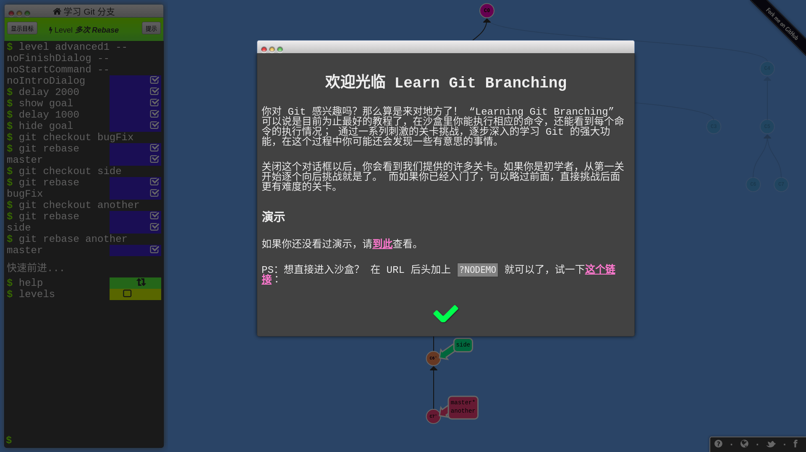
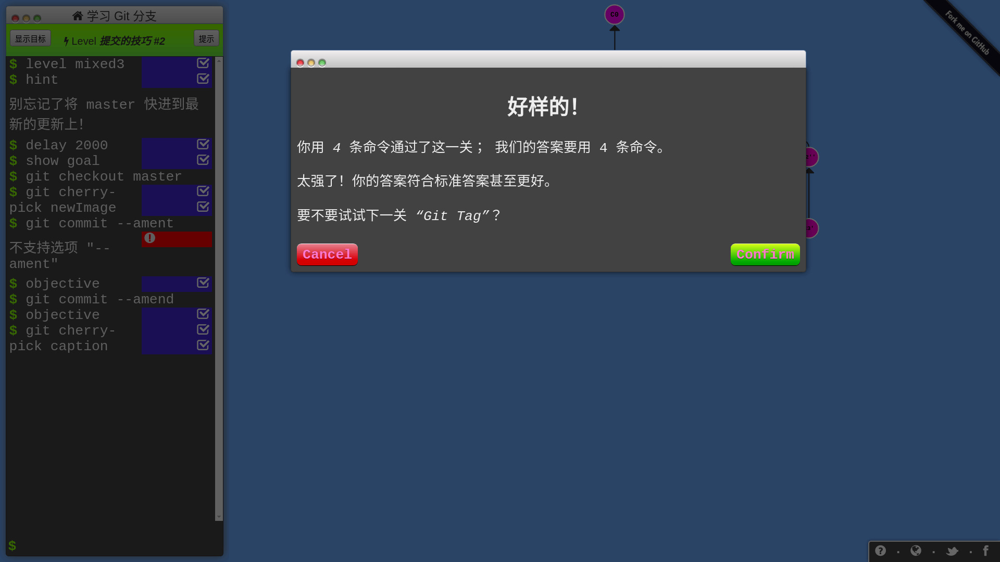
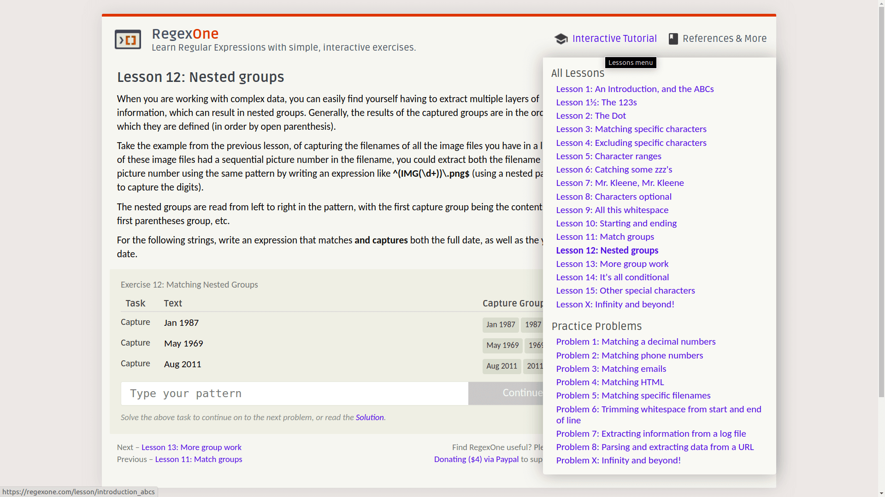
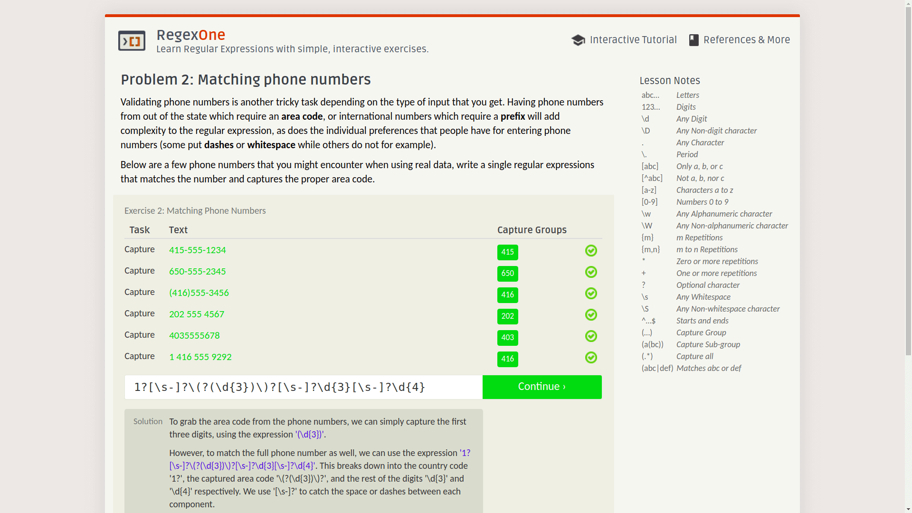
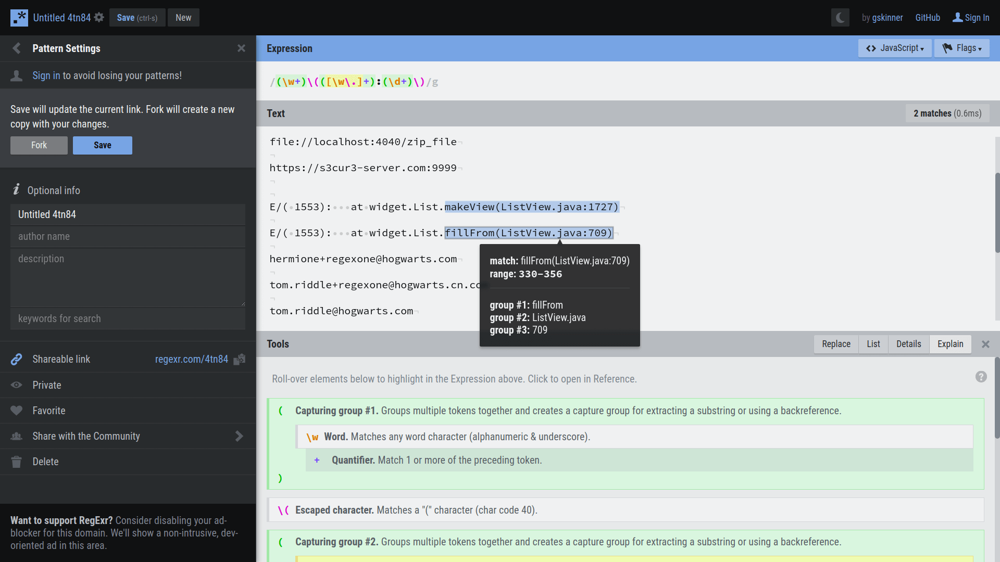
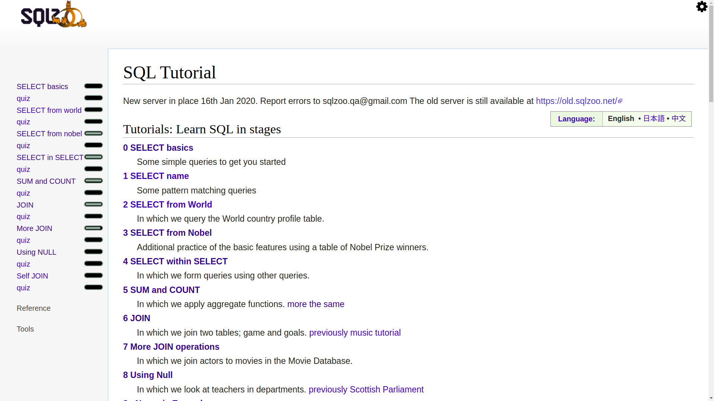
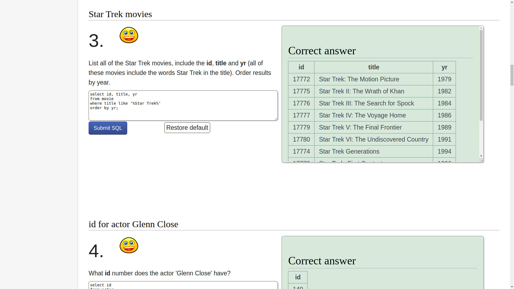

# 在线刷题学习平台

相关推荐：
  * [区间调度之区间合并问题](https://labuladong.gitee.io/algo/)
  * [别再说你不懂Linux内存管理了，10张图给你安排的明明白白](https://labuladong.gitee.io/algo/)

**-----------**

虽说我没事就喜欢喷应试教育，但我也从应试教育中发现了一个窍门：如果能够以刷题的形式学习某项技能，效率和效果是最佳的。对于技术的学习，我经常面临的困境是，**理论知识知道的不少，但是有的场景实在无法模拟，缺少亲自动手实践的机会**，如果能有一本带标准答案的习题册让我刷刷就好了。

所以在学习新技术时，我首先会去搜索是否有在线刷题平台，你还别说，有的大神真就做了很不错的在线练习平台，下面就介绍几个平台，分别是学习 Git、SQL、正则表达式的在线练习平台。

### 一、练习 Git

这是个叫做 Learning Git Branching 的项目，是我一定要推荐的：

正如对话框中的自我介绍，这确实也是我至今发现的**最好**的 Git 动画教程，没有之一。

想当年我用 Git 就会 `add .`，`clone`，`push`，`pull`，`commit` 几个命令，其他的命令完全不会，Git 就是一个下载器，Github 就是个资源网站加免费图床，命令能不能达成目的都是靠运气。什么版本控制，我根本搞不懂，也懒得去看那一堆乱七八糟的文档。

这个网站的教程不是给你举那种修改文件的细节例子，而是将每次 `commit` 都抽象成树的节点，**用动画闯关的形式**，让你自由使用 Git 命令完成目标：

所有 Git 分支都被可视化了，你只要在左侧的命令行输入 Git 命令，分支会进行相应的变化，只要达成任务目标，你就过关啦！网站还会记录你的命令数，试试能不能以最少的命令数过关！

我一开始以为这个教程只包含本地 Git 仓库的版本管理，**后来我惊奇地发现它还有远程仓库的操作教程**！

真的跟玩游戏一样，难度设计合理，流畅度很好，我一玩都停不下来了，几小时就打通了，哈哈哈！

总之，这个教程很适合初学和进阶，如果你觉得自己对 Git 的掌握还不太好，用 Git 命令还是靠碰运气，就可以玩玩这个教程，相信能够让你更熟练地使用 Git。

它是一个开源项目，Github 项目地址：

https://github.com/pcottle/learnGitBranching

教程网站地址：

https://learngitbranching.js.org

### 二、练习正则表达式

**正则表达式是个非常强有力的工具**，可以说计算机中的一切数据都是字符，借助正则表达式这种模式匹配工具，操作计算机可以说是如虎添翼。

我这里要推荐两个网站，一个是练习平台，一个是测试正则表达式的平台。

先说练习平台，叫做 RegexOne：

前面有基本教程，后面有一些常见的正则表达式题目，比如判断邮箱、URL、电话号，或者抽取日志的关键信息等等。

只要写出符合要求的正则表达式，就可以进入下一个问题，关键是每道题还有标准答案，可以点击下面的 solution 按钮查看：

RegexOne 网址：

https://regexone.com/

再说测试工具，是个叫做 RegExr 的 Github 项目，这是它的网站：

可以看见，输入文本和正则模式串后，**网站会给正则表达式添加好看且容易辨认的样式，自动在文本中搜索模式串，高亮显示匹配的字符串，并且还会显示每个分组捕获的字符串**。

这个网站可以配合前面的正则练习平台使用，在这里尝试各种表达式，成功匹配之后粘贴过去。

RegExr 网址：

https://regexr.com/

### 三、练习 SQL

这是一个叫做 SQLZOO 的网站，左侧是所有的练习内容：

SQLZOO 是一款很好用的 SQL 练习平台，英文不难理解，可以直接看英文版，但是也可以切换繁体中文，比较友好。

这里都是比较常用的 SQL 命令，给你一个需求，你写 SQL 语句实现正确的查询结果。**最重要的是，这里不仅对每个命令的用法有详细解释，每个专题后面还有选择题（quiz），而且有判题系统，甚至有的比较难的题目还有视频讲解**：

至于难度，循序渐进，即便对新手也很友好，靠后的问题确实比较有技巧性，相信这是热爱思维挑战的人喜欢的！LeetCode 也有 SQL 相关的题目，不过难度一般比较大，我觉得 SQLZOO 刷完基础 SQL 命令再去 LeetCode 刷比较合适。

网站地址：

https://sqlzoo.net/

**＿＿＿＿＿＿＿＿＿＿＿＿＿**

**刷算法，学套路，认准 labuladong，公众号和 [在线电子书](https://labuladong.gitee.io/algo/) 持续更新最新文章**。

**本小抄即将出版，微信扫码关注公众号，后台回复「小抄」限时免费获取，回复「进群」可进刷题群一起刷题，带你搞定 LeetCode**。

======其他语言代码======