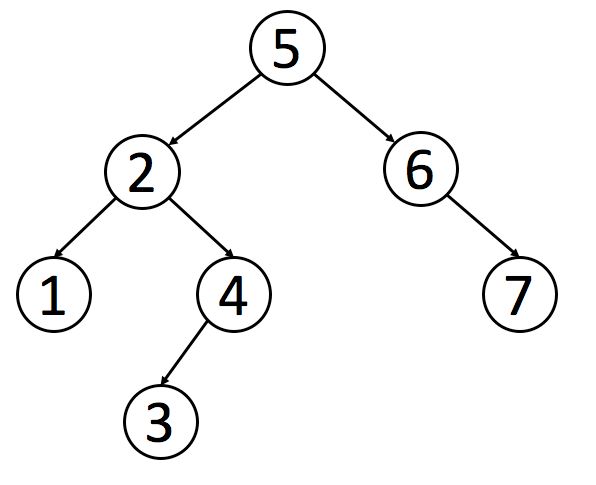
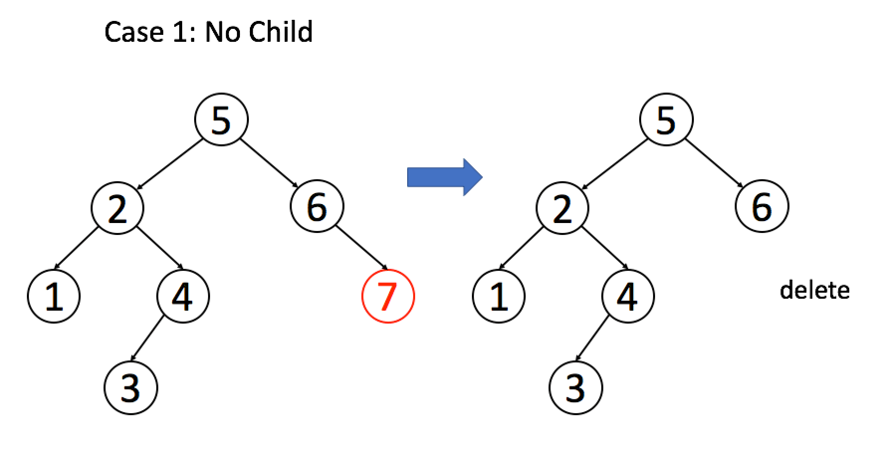

# 二叉搜索树操作集锦


<p align='center'>
<a href="https://github.com/labuladong/fucking-algorithm" target="view_window"></a>
<a href="https://www.zhihu.com/people/labuladong"></a>
<a href="https://i.loli.net/2020/10/10/MhRTyUKfXZOlQYN.jpg"></a>
<a href="https://space.bilibili.com/14089380"></a>
</p>


相关推荐：
  * [特殊数据结构：单调队列](https://labuladong.gitee.io/algo/)
  * [一行代码就能解决的算法题](https://labuladong.gitee.io/algo/)

读完本文，你不仅学会了算法套路，还可以顺便去 LeetCode 上拿下如下题目：

[100.相同的树](https://leetcode-cn.com/problems/same-tree)

[450.删除二叉搜索树中的节点](https://leetcode-cn.com/problems/delete-node-in-a-bst)

[701.二叉搜索树中的插入操作](https://leetcode-cn.com/problems/insert-into-a-binary-search-tree)

[700.二叉搜索树中的搜索](https://leetcode-cn.com/problems/search-in-a-binary-search-tree)

[98.验证二叉搜索树](https://leetcode-cn.com/problems/validate-binary-search-tree)

**-----------**

通过之前的文章[框架思维](https://labuladong.gitee.io/algo/)，二叉树的遍历框架应该已经印到你的脑子里了，这篇文章就来实操一下，看看框架思维是怎么灵活运用，秒杀一切二叉树问题的。

二叉树算法的设计的总路线：明确一个节点要做的事情，然后剩下的事抛给框架。

```java
void traverse(TreeNode root) {
    // root 需要做什么？在这做。
    // 其他的不用 root 操心，抛给框架
    traverse(root.left);
    traverse(root.right);
}
```

举两个简单的例子体会一下这个思路，热热身。

**1. 如何把二叉树所有的节点中的值加一？**

```java
void plusOne(TreeNode root) {
    if (root == null) return;
    root.val += 1;

    plusOne(root.left);
    plusOne(root.right);
}
```

**2. 如何判断两棵二叉树是否完全相同？**

```java
boolean isSameTree(TreeNode root1, TreeNode root2) {
    // 都为空的话，显然相同
    if (root1 == null && root2 == null) return true;
    // 一个为空，一个非空，显然不同
    if (root1 == null || root2 == null) return false;
    // 两个都非空，但 val 不一样也不行
    if (root1.val != root2.val) return false;

    // root1 和 root2 该比的都比完了
    return isSameTree(root1.left, root2.left)
        && isSameTree(root1.right, root2.right);
}
```

借助框架，上面这两个例子不难理解吧？如果可以理解，那么所有二叉树算法你都能解决。


二叉搜索树（Binary Search Tree，简称 BST）是一种很常用的的二叉树。它的定义是：一个二叉树中，任意节点的值要大于等于左子树所有节点的值，且要小于等于右边子树的所有节点的值。

如下就是一个符合定义的 BST：




下面实现 BST 的基础操作：判断 BST 的合法性、增、删、查。其中“删”和“判断合法性”略微复杂。

**零、判断 BST 的合法性**

这里是有坑的哦，我们按照刚才的思路，每个节点自己要做的事不就是比较自己和左右孩子吗？看起来应该这样写代码：
```java
boolean isValidBST(TreeNode root) {
    if (root == null) return true;
    if (root.left != null && root.val <= root.left.val) return false;
    if (root.right != null && root.val >= root.right.val) return false;

    return isValidBST(root.left)
        && isValidBST(root.right);
}
```

但是这个算法出现了错误，BST 的每个节点应该要小于右边子树的所有节点，下面这个二叉树显然不是 BST，但是我们的算法会把它判定为 BST。


出现错误，不要慌张，框架没有错，一定是某个细节问题没注意到。我们重新看一下 BST 的定义，root 需要做的不只是和左右子节点比较，而是要整个左子树和右子树所有节点比较。怎么办，鞭长莫及啊！

这种情况，我们可以使用辅助函数，增加函数参数列表，在参数中携带额外信息，请看正确的代码：

```java
boolean isValidBST(TreeNode root) {
    return isValidBST(root, null, null);
}

boolean isValidBST(TreeNode root, TreeNode min, TreeNode max) {
    if (root == null) return true;
    if (min != null && root.val <= min.val) return false;
    if (max != null && root.val >= max.val) return false;
    return isValidBST(root.left, min, root) 
        && isValidBST(root.right, root, max);
}
```

**一、在 BST 中查找一个数是否存在**

根据我们的指导思想，可以这样写代码：

```java
boolean isInBST(TreeNode root, int target) {
    if (root == null) return false;
    if (root.val == target) return true;

    return isInBST(root.left, target)
        || isInBST(root.right, target);
}
```

这样写完全正确，充分证明了你的框架性思维已经养成。现在你可以考虑一点细节问题了：如何充分利用信息，把 BST 这个“左小右大”的特性用上？

很简单，其实不需要递归地搜索两边，类似二分查找思想，根据 target 和 root.val 的大小比较，就能排除一边。我们把上面的思路稍稍改动：

```java
boolean isInBST(TreeNode root, int target) {
    if (root == null) return false;
    if (root.val == target)
        return true;
    if (root.val < target) 
        return isInBST(root.right, target);
    if (root.val > target)
        return isInBST(root.left, target);
    // root 该做的事做完了，顺带把框架也完成了，妙
}
```

于是，我们对原始框架进行改造，抽象出一套**针对 BST 的遍历框架**：

```java
void BST(TreeNode root, int target) {
    if (root.val == target)
        // 找到目标，做点什么
    if (root.val < target) 
        BST(root.right, target);
    if (root.val > target)
        BST(root.left, target);
}
```


**二、在 BST 中插入一个数**

对数据结构的操作无非遍历 + 访问，遍历就是“找”，访问就是“改”。具体到这个问题，插入一个数，就是先找到插入位置，然后进行插入操作。

上一个问题，我们总结了 BST 中的遍历框架，就是“找”的问题。直接套框架，加上“改”的操作即可。一旦涉及“改”，函数就要返回 TreeNode 类型，并且对递归调用的返回值进行接收。

```java
TreeNode insertIntoBST(TreeNode root, int val) {
    // 找到空位置插入新节点
    if (root == null) return new TreeNode(val);
    // if (root.val == val)
    //     BST 中一般不会插入已存在元素
    if (root.val < val) 
        root.right = insertIntoBST(root.right, val);
    if (root.val > val) 
        root.left = insertIntoBST(root.left, val);
    return root;
}
```


**三、在 BST 中删除一个数**

这个问题稍微复杂，不过你有框架指导，难不住你。跟插入操作类似，先“找”再“改”，先把框架写出来再说：

```java
TreeNode deleteNode(TreeNode root, int key) {
    if (root.val == key) {
        // 找到啦，进行删除
    } else if (root.val > key) {
        root.left = deleteNode(root.left, key);
    } else if (root.val < key) {
        root.right = deleteNode(root.right, key);
    }
    return root;
}
```

找到目标节点了，比方说是节点 A，如何删除这个节点，这是难点。因为删除节点的同时不能破坏 BST 的性质。有三种情况，用图片来说明。

情况 1：A 恰好是末端节点，两个子节点都为空，那么它可以当场去世了。

图片来自 LeetCode


```java
if (root.left == null && root.right == null)
    return null;
```

情况 2：A 只有一个非空子节点，那么它要让这个孩子接替自己的位置。

图片来自 LeetCode


```java
// 排除了情况 1 之后
if (root.left == null) return root.right;
if (root.right == null) return root.left;
```

情况 3：A 有两个子节点，麻烦了，为了不破坏 BST 的性质，A 必须找到左子树中最大的那个节点，或者右子树中最小的那个节点来接替自己。我们以第二种方式讲解。

图片来自 LeetCode


```java
if (root.left != null && root.right != null) {
    // 找到右子树的最小节点
    TreeNode minNode = getMin(root.right);
    // 把 root 改成 minNode
    root.val = minNode.val;
    // 转而去删除 minNode
    root.right = deleteNode(root.right, minNode.val);
}
```

三种情况分析完毕，填入框架，简化一下代码：

```java
TreeNode deleteNode(TreeNode root, int key) {
    if (root == null) return null;
    if (root.val == key) {
        // 这两个 if 把情况 1 和 2 都正确处理了
        if (root.left == null) return root.right;
        if (root.right == null) return root.left;
        // 处理情况 3
        TreeNode minNode = getMin(root.right);
        root.val = minNode.val;
        root.right = deleteNode(root.right, minNode.val);
    } else if (root.val > key) {
        root.left = deleteNode(root.left, key);
    } else if (root.val < key) {
        root.right = deleteNode(root.right, key);
    }
    return root;
}

TreeNode getMin(TreeNode node) {
    // BST 最左边的就是最小的
    while (node.left != null) node = node.left;
    return node;
} 
```

删除操作就完成了。注意一下，这个删除操作并不完美，因为我们一般不会通过 root.val = minNode.val 修改节点内部的值来交换节点，而是通过一系列略微复杂的链表操作交换 root 和 minNode 两个节点。因为具体应用中，val 域可能会很大，修改起来很耗时，而链表操作无非改一改指针，而不会去碰内部数据。

但这里忽略这个细节，旨在突出 BST 基本操作的共性，以及借助框架逐层细化问题的思维方式。

**四、最后总结**

通过这篇文章，你学会了如下几个技巧：

1. 二叉树算法设计的总路线：把当前节点要做的事做好，其他的交给递归框架，不用当前节点操心。

2. 如果当前节点会对下面的子节点有整体影响，可以通过辅助函数增长参数列表，借助参数传递信息。

3. 在二叉树框架之上，扩展出一套 BST 遍历框架：
```java
void BST(TreeNode root, int target) {
    if (root.val == target)
        // 找到目标，做点什么
    if (root.val < target) 
        BST(root.right, target);
    if (root.val > target)
        BST(root.left, target);
}
```

4. 掌握了 BST 的基本操作。


**＿＿＿＿＿＿＿＿＿＿＿＿＿**

**刷算法，学套路，认准 labuladong，公众号和 [在线电子书](https://labuladong.gitee.io/algo/) 持续更新最新文章**。

**本小抄即将出版，微信扫码关注公众号，后台回复「小抄」限时免费获取，回复「进群」可进刷题群一起刷题，带你搞定 LeetCode**。

<p align='center'>

</p>


======其他语言代码======  

[100.相同的树](https://leetcode-cn.com/problems/same-tree)

[450.删除二叉搜索树中的节点](https://leetcode-cn.com/problems/delete-node-in-a-bst)

[701.二叉搜索树中的插入操作](https://leetcode-cn.com/problems/insert-into-a-binary-search-tree)

[700.二叉搜索树中的搜索](https://leetcode-cn.com/problems/search-in-a-binary-search-tree)

[98.验证二叉搜索树](https://leetcode-cn.com/problems/validate-binary-search-tree)

### c++

[dekunma](https://www.linkedin.com/in/dekun-ma-036a9b198/)提供第98题C++代码：

```c++
/**
 * Definition for a binary tree node.
 * struct TreeNode {
 *     int val;
 *     TreeNode *left;
 *     TreeNode *right;
 *     TreeNode(int x) : val(x), left(NULL), right(NULL) {}
 * };
 */
class Solution {
public:
    bool isValidBST(TreeNode* root) {
        // 用helper method求解
        return isValidBST(root, nullptr, nullptr);
    }

    bool isValidBST(TreeNode* root, TreeNode* min, TreeNode* max) {
        // base case, root为nullptr
        if (!root) return true;

        // 不符合BST的条件
        if (min && root->val <= min->val) return false;
        if (max && root->val >= max->val) return false;

        // 向左右子树分别递归求解
        return isValidBST(root->left, min, root) 
            && isValidBST(root->right, root, max);
    }
};
```


[yanggg1997](https://github.com/yanggg1997)提供第100题C++代码：

``` c++
/**
 * Definition for a binary tree node.
 * struct TreeNode {
 *     int val;
 *     TreeNode *left;
 *     TreeNode *right;
 *     TreeNode() : val(0), left(nullptr), right(nullptr) {}
 *     TreeNode(int x) : val(x), left(nullptr), right(nullptr) {}
 *     TreeNode(int x, TreeNode *left, TreeNode *right) : val(x), left(left), right(right) {}
 * };
 */
class Solution {
public:
    bool isSameTree(TreeNode* p, TreeNode* q) {
		// 若当前节点均为空，则此处相同
        if(!p && !q) return true;	
        // 若当前节点在一棵树上有而另一棵树上为空，则两棵树不同
        if(!p && q) return false;	
        if(p && !q) return false;
        // 若当前节点在两棵树上均存在。
        if(p->val != q->val)
        {
            return false;
        }
        else
        {
            // 向左右子树分别递归判断
            return isSameTree(p->left, q->left) && isSameTree(p->right, q->right);
        }
    }
};
```

### python

[ChenjieXu](https://github.com/ChenjieXu)提供第98题Python3代码：

```python
def isValidBST(self, root):
        # 递归函数
        def helper(node, lower = float('-inf'), upper = float('inf')):
            if not node:
                return True
            
            val = node.val
            if val <= lower or val >= upper:
                return False
            # 右节点
            if not helper(node.right, val, upper):
                return False
            # 左节点
            if not helper(node.left, lower, val):
                return False
            return True

        return helper(root)
        
```

[lixiandea](https://github.com/lixiandea)提供第100题Python3代码：

```python
# Definition for a binary tree node.
# class TreeNode:
#     def __init__(self, val=0, left=None, right=None):
#         self.val = val
#         self.left = left
#         self.right = right
class Solution:
    def isSameTree(self, p: TreeNode, q: TreeNode) -> bool:
    '''
    当前节点值相等且树的子树相等，则树相等。
    递归退出条件：两个节点存在一个节点为空
    '''
        if p == None:
            if q == None:
                return True
            else:
                return False
        if q == None:
            return False
        # 当前节点相同且左子树和右子树分别相同
        return p.val==q.val and self.isSameTree(p.left, q.left) and self.isSameTree(p.right, q.right)
```


[Edwenc](https://github.com/Edwenc) 提供 leetcode第450题的python3 代码：

```python
# Definition for a binary tree node.
# class TreeNode:
#     def __init__(self, val=0, left=None, right=None):
#         self.val = val
#         self.left = left
#         self.right = right

class Solution:
    def deleteNode(self, root: TreeNode, key: int) -> TreeNode:
        #  如果没有树  直接返回None
        if root == None:
            return None

        #  如果要删除的结点  就是当前结点
        if root.val == key:
            #  左子树为空  只有右子树需要被更新  直接返回
            if root.left == None:
                return root.right
            #  右子树为空  只有左子树需要被更新  直接返回
            if root.right== None:
                return root.left

            #  找出此结点左子树的最大值
            #  用这个最大值  来代替当前结点
            #  再在左子树中递归地删除这个最大值结点
            big = self.getMax( root.left )
            root.val = big.val
            root.left = self.deleteNode( root.left , big.val )
        
        #  当前结点较大  它的左子树中需要删除节点  递归到左子树
        elif root.val > key:
            root.left = self.deleteNode( root.left , key)
        #  当前结点较小  它的右子树中需要删除节点  递归到右子树
        else:
            root.right= self.deleteNode( root.right, key)

        return root

    #  辅助函数
    #  功能是找出此二叉搜索树中最大元素的结点  并返回此结点
    def getMax( self , node ):
        #  一直找它的右子树  直到为空
        while node.right:
            node = node.right
        return node
```

### java
```
/**
* 第【98】题的扩展解法：
* 对于BST，有一个重要的性质，即“BST的中序遍历是单调递增的”。抓住这个性质，我们可以通过中序遍历来判断该二叉树是不是BST。
* 我们定义preNode节点表示上一个遍历的节点，在中序遍历的时候，比较当前节点和preNode节点的大小，一旦有节点小于或等于前一个节点，则不满足BST的规则，直接返回false，否则遍历结束，返回true。
*/
TreeNode preNode = null;
public boolean isValidBST(TreeNode root) {
    if (root == null) return true;

    boolean leftRes = isValidBST(root.left);

    if (preNode != null && root.val <= preNode.val) {
        return false;
    }
    preNode = root;

    boolean rightRes = isValidBST(root.right);

    return leftRes && rightRes;
}
```


### javascript

1. 如何把二叉树所有的节点中的值加一？

热热身，体会体会二叉树的递归思想。

```js
let plusOne = function(root) {
    if (root == null) return;
    root.val += 1;

    plusOne(root.left);
    plusOne(root.right);
}
```


2. 如何判断两棵二叉树是否完全相同？

[100.相同的树](https://leetcode-cn.com/problems/same-tree)

```js
/**
 * Definition for a binary tree node.
 * function TreeNode(val) {
 *     this.val = val;
 *     this.left = this.right = null;
 * }
 */
/**
 * @param {TreeNode} p
 * @param {TreeNode} q
 * @return {boolean}
 */
var isSameTree = function(p, q) {
    if(p == null && q == null) 
        return true;
    if(p == null || q == null) 
        return false;
    if(p.val != q.val) 
        return false;
    return isSameTree(p.left, q.left) && isSameTree(p.right, q.right);
};
```


零、判断 BST 的合法性

[98. 验证二叉搜索树](https://leetcode-cn.com/problems/validate-binary-search-tree/)

```js
/**
 * Definition for a binary tree node.
 * function TreeNode(val, left, right) {
 *     this.val = (val===undefined ? 0 : val)
 *     this.left = (left===undefined ? null : left)
 *     this.right = (right===undefined ? null : right)
 * }
 */
/**
 * @param {TreeNode} root
 * @return {boolean}
 */
var isValidBST = function (root) {
    return helper(root, null, null);
};

var helper = function (root, min, max) {
    if (root == null) return true;
    if (min != null && root.val <= min.val) return false;
    if (max != null && root.val >= max.val) return false;
    return helper(root.left, min, root)
        && helper(root.right, root, max);
}
```


一、在BST 中查找一个数是否存在

[700.二叉搜索树中的搜索](https://leetcode-cn.com/problems/search-in-a-binary-search-tree)

```js
/**
 * Definition for a binary tree node.
 * function TreeNode(val, left, right) {
 *     this.val = (val===undefined ? 0 : val)
 *     this.left = (left===undefined ? null : left)
 *     this.right = (right===undefined ? null : right)
 * }
 */
/**
 * @param {TreeNode} root
 * @param {number} val
 * @return {TreeNode}
 */
var searchBST = function(root, target) {
    if (root == null) return null;
    if (root.val === target)
        return root;
    if (root.val < target) 
        return searchBST(root.right, target);
    if (root.val > target)
        return searchBST(root.left, target);
    // root 该做的事做完了，顺带把框架也完成了，妙
};
```


二、在 BST 中插入一个数

[701.二叉搜索树中的插入操作](https://leetcode-cn.com/problems/insert-into-a-binary-search-tree)

```js
/**
 * Definition for a binary tree node.
 * function TreeNode(val, left, right) {
 *     this.val = (val===undefined ? 0 : val)
 *     this.left = (left===undefined ? null : left)
 *     this.right = (right===undefined ? null : right)
 * }
 */
/**
 * @param {TreeNode} root
 * @param {number} val
 * @return {TreeNode}
 */
var insertIntoBST = function(root, val) {
    // 找到空位置插入新节点
    if (root == null) return new TreeNode(val);
    // if (root.val == val)
    //     BST 中一般不会插入已存在元素
    if (root.val < val) 
        root.right = insertIntoBST(root.right, val);
    if (root.val > val) 
        root.left = insertIntoBST(root.left, val);
    return root;
};
```


三、在 BST 中删除一个数

[450.删除二叉搜索树中的节点](https://leetcode-cn.com/problems/delete-node-in-a-bst)

```js
/**
 * Definition for a binary tree node.
 * function TreeNode(val, left, right) {
 *     this.val = (val===undefined ? 0 : val)
 *     this.left = (left===undefined ? null : left)
 *     this.right = (right===undefined ? null : right)
 * }
 */
/**
 * @param {TreeNode} root
 * @param {number} key
 * @return {TreeNode}
 */
var deleteNode = function(root, key) {
  if (!root) return null
  // if key > root.val, delete node in root.right. Otherwise delete node in root.left.
  if (key > root.val) {
    const rightNode = deleteNode(root.right, key)
    root.right = rightNode
    return root
  } else if (key < root.val) {
    const leftNode = deleteNode(root.left, key)
    root.left = leftNode
    return root
  } else {
    // now root.val === key
    if (!root.left) {
      return root.right
    }
    if (!root.right) {
      return root.left
    }
    // 将删除元素的左下方元素替代删除元素;
    // 将左下方元素的右侧最下方子元素衔接删除元素的右下方子元素;
    const rightChild = root.right
    let newRightChild = root.left
    while (newRightChild.right) {
      newRightChild = newRightChild.right
    }
    newRightChild.right = rightChild
    return root.left
  }
};
```
