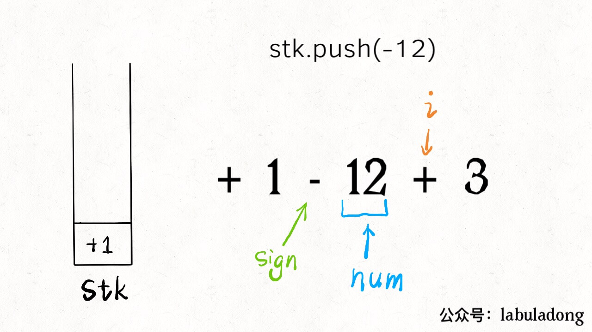
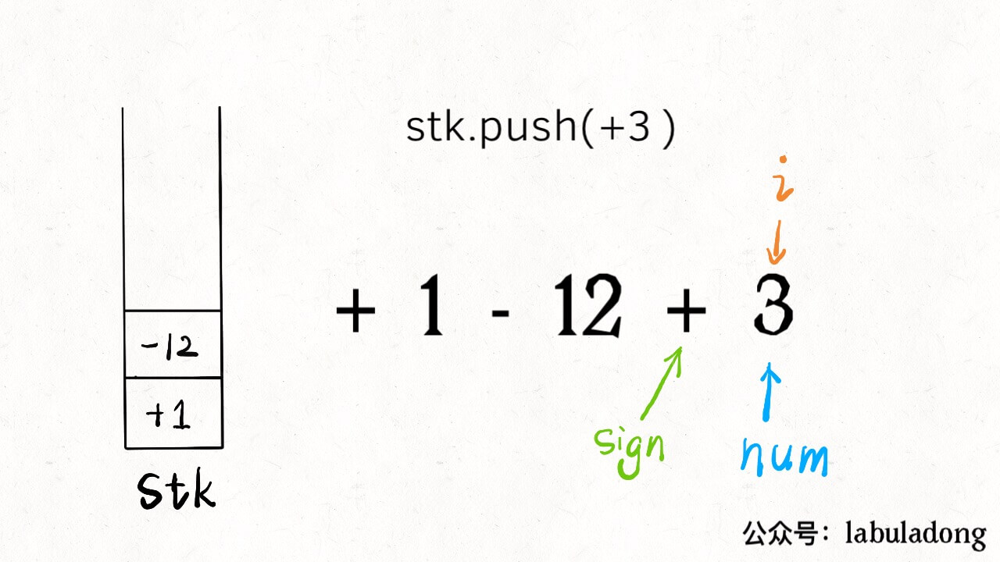
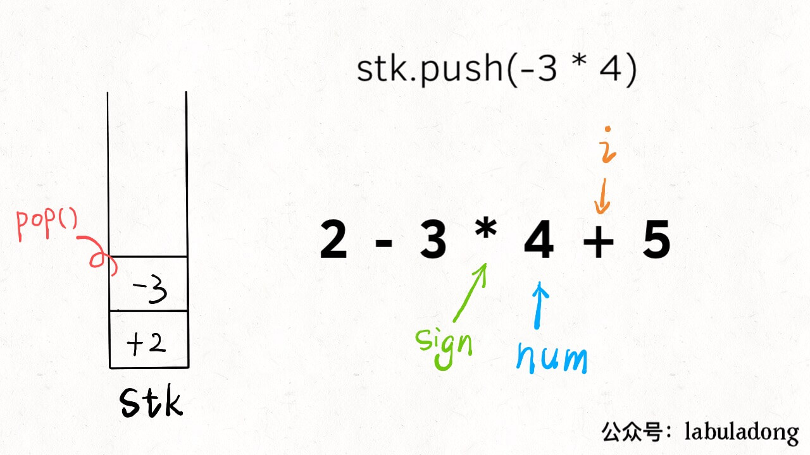
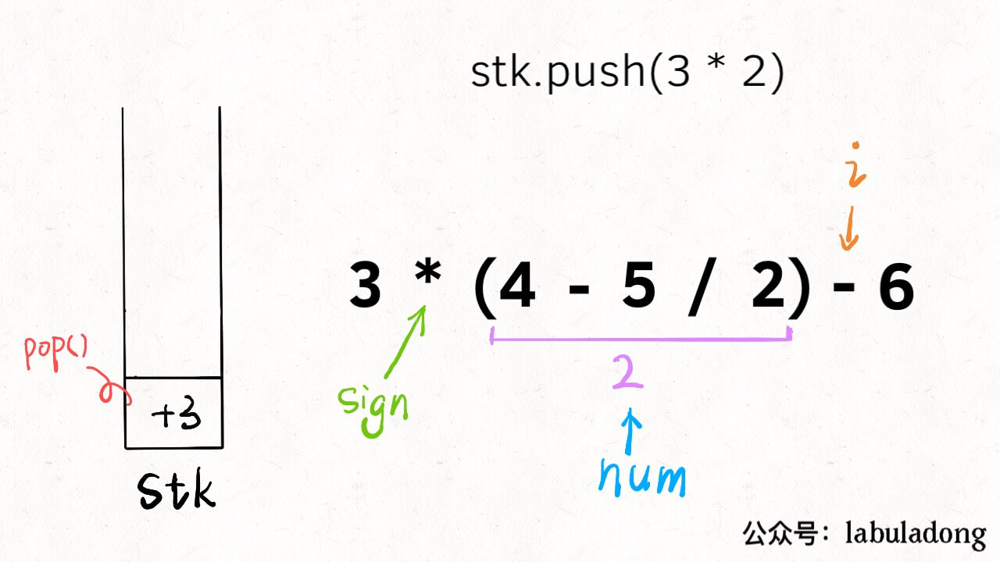

# 拆解复杂问题：实现计算器

我们最终要实现的计算器功能如下：
 
1、输入一个字符串，可以包含`+ - * /`、数字、括号以及空格，你的算法返回运算结构。

2、要符合运算法则，括号的优先级最高，先乘除后加减。

3、除号是整数除法，无论正负都向 0 取整（5/2=2，-5/2=-2）。

4、可以假定输入的算式一定合法，且计算过程不会出现整型溢出，不会出现除数为 0 的意外情况。

比如输入如下字符串，算法会返回 9：

`3 * (2-6 /(3 -7))`

可以看到，这就已经非常接近我们实际生活中使用的计算器了，虽然我们以前肯定都用过计算器，但是如果简单思考一下其算法实现，就会大惊失色：

1、按照常理处理括号，要先计算最内层的括号，然后向外慢慢化简。这个过程我们手算都容易出错，何况写成算法呢！

2、要做到先乘除，后加减，这一点教会小朋友还不算难，但教给计算机恐怕有点困难。

3、要处理空格。我们为了美观，习惯性在数字和运算符之间打个空格，但是计算之中得想办法忽略这些空格。

我记得很多大学数据结构的教材上，在讲栈这种数据结构的时候，应该都会用计算器举例，但是有一说一，讲的真的垃圾，不知道多少未来的计算机科学家就被这种简单的数据结构劝退了。

那么本文就来聊聊怎么实现上述一个功能完备的计算器功能，**关键在于层层拆解问题，化整为零，逐个击破**，相信这种思维方式能帮大家解决各种复杂问题。

下面就来拆解，从最简单的一个问题开始。

### 一、字符串转整数

是的，就是这么一个简单的问题，首先告诉我，怎么把一个字符串形式的**正**整数，转化成 int 型？

```cpp
string s = "458";

int n = 0;
for (int i = 0; i < s.size(); i++) {
    char c = s[i];
    n = 10 * n + (c - '0');
}
// n 现在就等于 458
```

这个还是很简单的吧，老套路了。但是即便这么简单，依然有坑：**`(c - '0')`的这个括号不能省略，否则可能造成整型溢出**。

因为变量`c`是一个 ASCII 码，如果不加括号就会先加后减，想象一下`s`如果接近 INT_MAX，就会溢出。所以用括号保证先减后加才行。

### 二、处理加减法

现在进一步，**如果输入的这个算式只包含加减法，而且不存在空格**，你怎么计算结果？我们拿字符串算式`1-12+3`为例，来说一个很简单的思路：

1、先给第一个数字加一个默认符号`+`，变成`+1-12+3`。

2、把一个运算符和数字组合成一对儿，也就是三对儿`+1`，`-12`，`+3`，把它们转化成数字，然后放到一个栈中。

3、将栈中所有的数字求和，就是原算式的结果。

我们直接看代码，结合一张图就看明白了：

```cpp
int calculate(string s) {
    stack<int> stk;
    // 记录算式中的数字
    int num = 0;
    // 记录 num 前的符号，初始化为 +
    char sign = '+';
    for (int i = 0; i < s.size(); i++) {
        char c = s[i];
        // 如果是数字，连续读取到 num
        if (isdigit(c)) 
            num = 10 * num + (c - '0');
        // 如果不是数字，就是遇到了下一个符号，
        // 之前的数字和符号就要存进栈中
        if (!isdigit(c) || i == s.size() - 1) {
            switch (sign) {
                case '+':
                    stk.push(num); break;
                case '-':
                    stk.push(-num); break;
            }
            // 更新符号为当前符号，数字清零
            sign = c;
            num = 0;
        }
    }
    // 将栈中所有结果求和就是答案
    int res = 0;
    while (!stk.empty()) {
        res += stk.top();
        stk.pop();
    }
    return res;
}
```

我估计就是中间带`switch`语句的部分有点不好理解吧，`i`就是从左到右扫描，`sign`和`num`跟在它身后。当`s[i]`遇到一个运算符时，情况是这样的：



所以说，此时要根据`sign`的 case 不同选择`nums`的正负号，存入栈中，然后更新`sign`并清零`nums`记录下一对儿符合和数字的组合。

另外注意，不只是遇到新的符号会触发入栈，当`i`走到了算式的尽头（`i == s.size() - 1`），也应该将前面的数字入栈，方便后续计算最终结果。



至此，仅处理紧凑加减法字符串的算法就完成了，请确保理解以上内容，后续的内容就基于这个框架修修改改就完事儿了。

### 三、处理乘除法

其实思路跟仅处理加减法没啥区别，拿字符串`2-3*4+5`举例，核心思路依然是把字符串分解成符号和数字的组合。

比如上述例子就可以分解为`+2`，`-3`，`*4`，`+5`几对儿，我们刚才不是没有处理乘除号吗，很简单，**其他部分都不用变**，在`switch`部分加上对应的 case 就行了：

```cpp
for (int i = 0; i < s.size(); i++) {
    char c = s[i];
    if (isdigit(c)) 
        num = 10 * num + (c - '0');

    if (!isdigit(c) || i == s.size() - 1) {
        switch (sign) {
            int pre;
            case '+':
                stk.push(num); break;
            case '-':
                stk.push(-num); break;
            // 只要拿出前一个数字做对应运算即可
            case '*':
                pre = stk.top();
                stk.pop();
                stk.push(pre * num);
                break;
            case '/':
                pre = stk.top();
                stk.pop();
                stk.push(pre / num);
                break;
        }
        // 更新符号为当前符号，数字清零
        sign = c;
        num = 0;
    }
}
```



**乘除法优先于加减法体现在，乘除法可以和栈顶的数结合，而加减法只能把自己放入栈**。

现在我们思考一下**如何处理字符串中可能出现的空格字符**。其实也非常简单，想想空格字符的出现，会影响我们现有代码的哪一部分？

```cpp
// 如果 c 非数字
if (!isdigit(c) || i == s.size() - 1) {
    switch (c) {...}
    sign = c;
    num = 0;
}
```

显然空格会进入这个 if 语句，但是我们并不想让空格的情况进入这个 if，因为这里会更新`sign`并清零`nums`，空格根本就不是运算符，应该被忽略。

那么只要多加一个条件即可：

```cpp
if ((!isdigit(c) && c != ' ') || i == s.size() - 1) {
    ...
}
```

好了，现在我们的算法已经可以按照正确的法则计算加减乘除，并且自动忽略空格符，剩下的就是如何让算法正确识别括号了。

### 四、处理括号

处理算式中的括号看起来应该是最难的，但真没有看起来那么难。

为了规避编程语言的繁琐细节，我把前面解法的代码翻译成 Python 版本：

```python
def calculate(s: str) -> int:
        
    def helper(s: List) -> int:
        stack = []
        sign = '+'
        num = 0

        while len(s) > 0:
            c = s.pop(0)
            if c.isdigit():
                num = 10 * num + int(c)

            if (not c.isdigit() and c != ' ') or len(s) == 0:
                if sign == '+':
                    stack.append(num)
                elif sign == '-':
                    stack.append(-num)
                elif sign == '*':
                    stack[-1] = stack[-1] * num
                elif sign == '/':
                    # python 除法向 0 取整的写法
                    stack[-1] = int(stack[-1] / float(num))                    
                num = 0
                sign = c

        return sum(stack)
    # 需要把字符串转成列表方便操作
    return helper(list(s))
```

这段代码跟刚才 C++ 代码完全相同，唯一的区别是，不是从左到右遍历字符串，而是不断从左边`pop`出字符，本质还是一样的。

那么，为什么说处理括号没有看起来那么难呢，**因为括号具有递归性质**。我们拿字符串`3*(4-5/2)-6`举例：

calculate(`3*(4-5/2)-6`)
= 3 * calculate(`4-5/2`) - 6
= 3 * 2 - 6
= 0

可以脑补一下，无论多少层括号嵌套，通过 calculate 函数递归调用自己，都可以将括号中的算式化简成一个数字。**换句话说，括号包含的算式，我们直接视为一个数字就行了**。

现在的问题是，递归的开始条件和结束条件是什么？**遇到`(`开始递归，遇到`)`结束递归**：

```python
def calculate(s: str) -> int:
        
    def helper(s: List) -> int:
        stack = []
        sign = '+'
        num = 0

        while len(s) > 0:
            c = s.pop(0)
            if c.isdigit():
                num = 10 * num + int(c)
            # 遇到左括号开始递归计算 num
            if c == '(':
                num = helper(s)

            if (not c.isdigit() and c != ' ') or len(s) == 0:
                if sign == '+': ...
                elif sign == '-': ... 
                elif sign == '*': ...
                elif sign == '/': ...
                num = 0
                sign = c
            # 遇到右括号返回递归结果
            if c == ')': break
        return sum(stack)

    return helper(list(s))
```




你看，加了两三行代码，就可以处理括号了，这就是递归的魅力。至此，计算器的全部功能就实现了，通过对问题的层层拆解化整为零，再回头看，这个问题似乎也没那么复杂嘛。

### 五、最后总结

本文借实现计算器的问题，主要想表达的是一种处理复杂问题的思路。

我们首先从字符串转数字这个简单问题开始，进而处理只包含加减法的算式，进而处理包含加减乘除四则运算的算式，进而处理空格字符，进而处理包含括号的算式。

**可见，对于一些比较困难的问题，其解法并不是一蹴而就的，而是步步推进，螺旋上升的**。如果一开始给你原题，你不会做，甚至看不懂答案，都很正常，关键在于我们自己如何简化问题，如何以退为进。

**退而求其次是一种很聪明策略**。你想想啊，假设这是一道考试题，你不会实现这个计算器，但是你写了字符串转整数的算法并指出了容易溢出的陷阱，那起码可以得 20 分吧；如果你能够处理加减法，那可以得 40 分吧；如果你能处理加减乘除四则运算，那起码够 70 分了；再加上处理空格字符，80 有了吧。我就是不会处理括号，那就算了，80 已经很 OK 了好不好。

**致力于把算法讲清楚！欢迎关注我的微信公众号 labuladong，查看更多通俗易懂的文章**：


[上一篇：常用的位操作](../算法思维系列/常用的位操作.md)

[下一篇：烧饼排序](../算法思维系列/烧饼排序.md)

[目录](../README.md#目录)