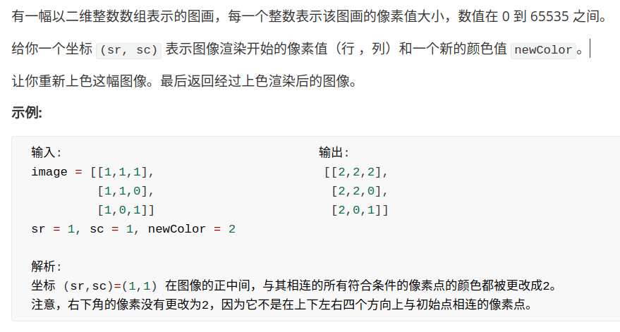

# FloodFill算法详解及应用


<p align='center'>
<a href="https://github.com/labuladong/fucking-algorithm" target="view_window"></a>
<a href="https://www.zhihu.com/people/labuladong"></a>
<a href="https://i.loli.net/2020/10/10/MhRTyUKfXZOlQYN.jpg"></a>
<a href="https://space.bilibili.com/14089380"></a>
</p>


相关推荐：
  * [如何高效进行模幂运算](https://labuladong.gitee.io/algo/)
  * [经典动态规划：0-1 背包问题](https://labuladong.gitee.io/algo/)

读完本文，你不仅学会了算法套路，还可以顺便去 LeetCode 上拿下如下题目：

[733.图像渲染](https://leetcode-cn.com/problems/flood-fill)

**-----------**

啥是 FloodFill 算法呢，最直接的一个应用就是「颜色填充」，就是 Windows 绘画本中那个小油漆桶的标志，可以把一块被圈起来的区域全部染色。


这种算法思想还在许多其他地方有应用。比如说扫雷游戏，有时候你点一个方格，会一下子展开一片区域，这个展开过程，就是 FloodFill 算法实现的。


类似的，像消消乐这类游戏，相同方块积累到一定数量，就全部消除，也是 FloodFill 算法的功劳。


通过以上的几个例子，你应该对 FloodFill 算法有个概念了，现在我们要抽象问题，提取共同点。

### 一、构建框架

以上几个例子，都可以抽象成一个二维矩阵（图片其实就是像素点矩阵），然后从某个点开始向四周扩展，直到无法再扩展为止。

矩阵，可以抽象为一幅「图」，这就是一个图的遍历问题，也就类似一个 N 叉树遍历的问题。几行代码就能解决，直接上框架吧：

```java
// (x, y) 为坐标位置
void fill(int x, int y) {
    fill(x - 1, y); // 上
    fill(x + 1, y); // 下
    fill(x, y - 1); // 左
    fill(x, y + 1); // 右
}
```

这个框架可以解决所有在二维矩阵中遍历的问题，说得高端一点，这就叫深度优先搜索（Depth First Search，简称 DFS），说得简单一点，这就叫四叉树遍历框架。坐标 (x, y) 就是 root，四个方向就是 root 的四个子节点。

下面看一道 LeetCode 题目，其实就是让我们来实现一个「颜色填充」功能。



根据上篇文章，我们讲了「树」算法设计的一个总路线，今天就可以用到：

```java
int[][] floodFill(int[][] image,
        int sr, int sc, int newColor) {

    int origColor = image[sr][sc];
    fill(image, sr, sc, origColor, newColor);
    return image;
}

void fill(int[][] image, int x, int y,
        int origColor, int newColor) {
    // 出界：超出边界索引
    if (!inArea(image, x, y)) return;
    // 碰壁：遇到其他颜色，超出 origColor 区域
    if (image[x][y] != origColor) return;
    image[x][y] = newColor;
    
    fill(image, x, y + 1, origColor, newColor);
    fill(image, x, y - 1, origColor, newColor);
    fill(image, x - 1, y, origColor, newColor);
    fill(image, x + 1, y, origColor, newColor);
}

boolean inArea(int[][] image, int x, int y) {
    return x >= 0 && x < image.length
        && y >= 0 && y < image[0].length;
}
```

只要你能够理解这段代码，一定要给你鼓掌，给你 99 分，因为你对「框架思维」的掌控已经炉火纯青，此算法已经 cover 了 99% 的情况，仅有一个细节问题没有解决，就是当 origColor 和 newColor 相同时，会陷入无限递归。

### 二、研究细节

为什么会陷入无限递归呢，很好理解，因为每个坐标都要搜索上下左右，那么对于一个坐标，一定会被上下左右的坐标搜索。**被重复搜索时，必须保证递归函数能够能正确地退出，否则就会陷入死循环。**

为什么 newColor 和 origColor 不同时可以正常退出呢？把算法流程画个图理解一下：


可以看到，fill(1, 1) 被重复搜索了，我们用 fill(1, 1)* 表示这次重复搜索。fill(1, 1)* 执行时，(1, 1) 已经被换成了 newColor，所以 fill(1, 1)* 会在这个 if 语句被怼回去，正确退出了。

```java
// 碰壁：遇到其他颜色，超出 origColor 区域
if (image[x][y] != origColor) return;
```


但是，如果说 origColor 和 newColor 一样，这个 if 语句就无法让 fill(1, 1)* 正确退出，而是开启了下面的重复递归，形成了死循环。


### 三、处理细节

如何避免上述问题的发生，最容易想到的就是用一个和 image 一样大小的二维 bool 数组记录走过的地方，一旦发现重复立即 return。

```java
 // 出界：超出边界索引
if (!inArea(image, x, y)) return;
// 碰壁：遇到其他颜色，超出 origColor 区域
if (image[x][y] != origColor) return;
// 不走回头路
if (visited[x][y]) return;
visited[x][y] = true;
image[x][y] = newColor;
```

完全 OK，这也是处理「图」的一种常用手段。不过对于此题，不用开数组，我们有一种更好的方法，那就是回溯算法。

前文 [回溯算法框架套路](https://labuladong.gitee.io/algo/)讲过，这里不再赘述，直接套回溯算法框架：

```java
void fill(int[][] image, int x, int y,
        int origColor, int newColor) {
    // 出界：超出数组边界
    if (!inArea(image, x, y)) return;
    // 碰壁：遇到其他颜色，超出 origColor 区域
    if (image[x][y] != origColor) return;
    // 已探索过的 origColor 区域
    if (image[x][y] == -1) return;
    
    // choose：打标记，以免重复
    image[x][y] = -1;
    fill(image, x, y + 1, origColor, newColor);
    fill(image, x, y - 1, origColor, newColor);
    fill(image, x - 1, y, origColor, newColor);
    fill(image, x + 1, y, origColor, newColor);
    // unchoose：将标记替换为 newColor
    image[x][y] = newColor;
}
```

这种解决方法是最常用的，相当于使用一个特殊值 -1 代替 visited 数组的作用，达到不走回头路的效果。为什么是 -1，因为题目中说了颜色取值在 0 - 65535 之间，所以 -1 足够特殊，能和颜色区分开。


### 四、拓展延伸：自动魔棒工具和扫雷

大部分图片编辑软件一定有「自动魔棒工具」这个功能：点击一个地方，帮你自动选中相近颜色的部分。如下图，我想选中老鹰，可以先用自动魔棒选中蓝天背景，然后反向选择，就选中了老鹰。我们来分析一下自动魔棒工具的原理。


显然，这个算法肯定是基于 FloodFill 算法的，但有两点不同：首先，背景色是蓝色，但不能保证都是相同的蓝色，毕竟是像素点，可能存在肉眼无法分辨的深浅差异，而我们希望能够忽略这种细微差异。第二，FloodFill 算法是「区域填充」，这里更像「边界填充」。

对于第一个问题，很好解决，可以设置一个阈值 threshold，在阈值范围内波动的颜色都视为 origColor：

```java
if (Math.abs(image[x][y] - origColor) > threshold)
    return;
```

对于第二个问题，我们首先明确问题：不要把区域内所有 origColor 的都染色，而是只给区域最外圈染色。然后，我们分析，如何才能仅给外围染色，即如何才能找到最外围坐标，最外围坐标有什么特点？


可以发现，区域边界上的坐标，至少有一个方向不是 origColor，而区域内部的坐标，四面都是 origColor，这就是解决问题的关键。保持框架不变，使用 visited 数组记录已搜索坐标，主要代码如下：

```java
int fill(int[][] image, int x, int y,
    int origColor, int newColor) {
    // 出界：超出数组边界
    if (!inArea(image, x, y)) return 0;
    // 已探索过的 origColor 区域
    if (visited[x][y]) return 1;
    // 碰壁：遇到其他颜色，超出 origColor 区域
    if (image[x][y] != origColor) return 0;

    visited[x][y] = true;
    
    int surround = 
          fill(image, x - 1, y, origColor, newColor)
        + fill(image, x + 1, y, origColor, newColor)
        + fill(image, x, y - 1, origColor, newColor)
        + fill(image, x, y + 1, origColor, newColor);
    
    if (surround < 4)
        image[x][y] = newColor;
    
    return 1;
}
```

这样，区域内部的坐标探索四周后得到的 surround 是 4，而边界的坐标会遇到其他颜色，或超出边界索引，surround 会小于 4。如果你对这句话不理解，我们把逻辑框架抽象出来看：

```java
int fill(int[][] image, int x, int y,
    int origColor, int newColor) {
    // 出界：超出数组边界
    if (!inArea(image, x, y)) return 0;
    // 已探索过的 origColor 区域
    if (visited[x][y]) return 1;
    // 碰壁：遇到其他颜色，超出 origColor 区域
    if (image[x][y] != origColor) return 0;
    // 未探索且属于 origColor 区域
    if (image[x][y] == origColor) {
        // ...
        return 1;
    }
}
```

这 4 个 if 判断涵盖了 (x, y) 的所有可能情况，surround 的值由四个递归函数相加得到，而每个递归函数的返回值就这四种情况的一种。借助这个逻辑框架，你一定能理解上面那句话了。

这样就实现了仅对 origColor 区域边界坐标染色的目的，等同于完成了魔棒工具选定区域边界的功能。

这个算法有两个细节问题，一是必须借助 visited 来记录已探索的坐标，而无法使用回溯算法；二是开头几个 if 顺序不可打乱。读者可以思考一下原因。

同理，思考扫雷游戏，应用 FloodFill 算法展开空白区域的同时，也需要计算并显示边界上雷的个数，如何实现的？其实也是相同的思路，遇到雷就返回 true，这样 surround 变量存储的就是雷的个数。当然，扫雷的 FloodFill 算法不能只检查上下左右，还得加上四个斜向。


以上详细讲解了 FloodFill 算法的框架设计，**二维矩阵中的搜索问题，都逃不出这个算法框架**。

**＿＿＿＿＿＿＿＿＿＿＿＿＿**

**刷算法，学套路，认准 labuladong，公众号和 [在线电子书](https://labuladong.gitee.io/algo/) 持续更新最新文章**。

**本小抄即将出版，微信扫码关注公众号，后台回复「小抄」限时免费获取，回复「进群」可进刷题群一起刷题，带你搞定 LeetCode**。

<p align='center'>

</p>

======其他语言代码======

[733.图像渲染](https://leetcode-cn.com/problems/flood-fill)


### javascript

**BFS**
从起始像素向上下左右扩散，只要相邻的点存在并和起始点颜色相同，就染成新的颜色，并继续扩散。

借助一个队列去遍历节点，考察出列的节点，带出满足条件的节点入列。已经染成新色的节点不会入列，避免重复访问节点。

时间复杂度：O(n)。空间复杂度：O(n)

```js
const floodFill = (image, sr, sc, newColor) => {
  const m = image.length;
  const n = image[0].length;
  const oldColor = image[sr][sc];
  if (oldColor == newColor) return image;

  const fill = (i, j) => {
    if (i < 0 || i >= m || j < 0 || j >= n || image[i][j] != oldColor) {
      return;
    }
    image[i][j] = newColor; 
    fill(i - 1, j);
    fill(i + 1, j);
    fill(i, j - 1);
    fill(i, j + 1);
  };

  fill(sr, sc);
  return image;
};
```


**DFS**

思路与上文相同。

```js
/**
 * @param {number[][]} image
 * @param {number} sr
 * @param {number} sc
 * @param {number} newColor
 * @return {number[][]}
 */
let floodFill = function (image, sr, sc, newColor) {
    let origColor = image[sr][sc];
    fill(image, sr, sc, origColor, newColor);
    return image;
}

let fill = function (image, x, y, origColor, newColor) {
    // 出界：超出边界索引
    if (!inArea(image, x, y)) return;

    // 碰壁：遇到其他颜色，超出 origColor 区域
    if (image[x][y] !== origColor) return;

    // 已探索过的 origColor 区域
    if (image[x][y] === -1) return;

    // 打标记 避免重复
    image[x][y] = -1;

    fill(image, x, y + 1, origColor, newColor);
    fill(image, x, y - 1, origColor, newColor);
    fill(image, x - 1, y, origColor, newColor);
    fill(image, x + 1, y, origColor, newColor);

    // un choose：将标记替换为 newColor
    image[x][y] = newColor;
}

let inArea = function (image, x, y) {
    return x >= 0 && x < image.length
        && y >= 0 && y < image[0].length;
}
```

