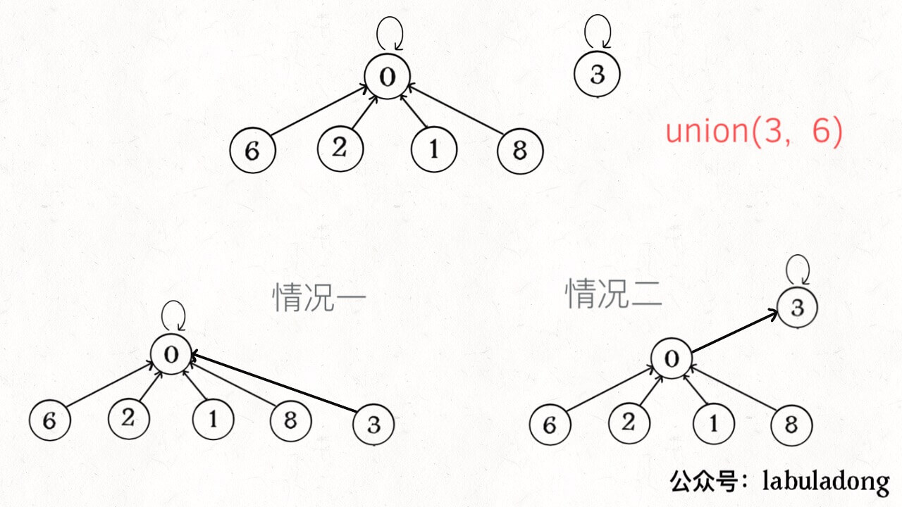
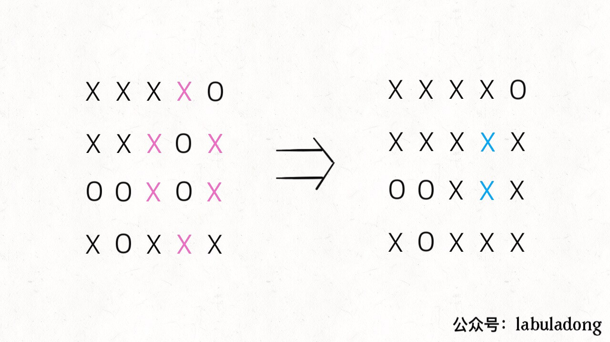

# Union-Find算法应用


<p align='center'>
<a href="https://github.com/labuladong/fucking-algorithm" target="view_window"></a>
<a href="https://www.zhihu.com/people/labuladong"></a>
<a href="https://i.loli.net/2020/10/10/MhRTyUKfXZOlQYN.jpg"></a>
<a href="https://space.bilibili.com/14089380"></a>
</p>


相关推荐：
  * [手把手带你刷二叉树（第一期）](https://labuladong.gitee.io/algo/)
  * [二分查找详解](https://labuladong.gitee.io/algo/)

读完本文，你不仅学会了算法套路，还可以顺便去 LeetCode 上拿下如下题目：

[130.被围绕的区域](https://leetcode-cn.com/problems/surrounded-regions)

[990.等式方程的可满足性](https://leetcode-cn.com/problems/satisfiability-of-equality-equations)

[261.以图判树](https://leetcode-cn.com/problems/graph-valid-tree/)

**-----------**

上篇文章很多读者对于 Union-Find 算法的应用表示很感兴趣，这篇文章就拿几道 LeetCode 题目来讲讲这个算法的巧妙用法。

首先，复习一下，Union-Find 算法解决的是图的动态连通性问题，这个算法本身不难，能不能应用出来主要是看你抽象问题的能力，是否能够把原始问题抽象成一个有关图论的问题。

先复习一下上篇文章写的算法代码，回答读者提出的几个问题：

```java
class UF {
    // 记录连通分量个数
    private int count;
    // 存储若干棵树
    private int[] parent;
    // 记录树的“重量”
    private int[] size;

    public UF(int n) {
        this.count = n;
        parent = new int[n];
        size = new int[n];
        for (int i = 0; i < n; i++) {
            parent[i] = i;
            size[i] = 1;
        }
    }
    
    /* 将 p 和 q 连通 */
    public void union(int p, int q) {
        int rootP = find(p);
        int rootQ = find(q);
        if (rootP == rootQ)
            return;
        
        // 小树接到大树下面，较平衡
        if (size[rootP] > size[rootQ]) {
            parent[rootQ] = rootP;
            size[rootP] += size[rootQ];
        } else {
            parent[rootP] = rootQ;
            size[rootQ] += size[rootP];
        }
        count--;
    }

    /* 判断 p 和 q 是否互相连通 */
    public boolean connected(int p, int q) {
        int rootP = find(p);
        int rootQ = find(q);
        // 处于同一棵树上的节点，相互连通
        return rootP == rootQ;
    }

    /* 返回节点 x 的根节点 */
    private int find(int x) {
        while (parent[x] != x) {
            // 进行路径压缩
            parent[x] = parent[parent[x]];
            x = parent[x];
        }
        return x;
    }
    
    public int count() {
        return count;
    }
}
```

算法的关键点有 3 个：

1、用 `parent` 数组记录每个节点的父节点，相当于指向父节点的指针，所以 `parent` 数组内实际存储着一个森林（若干棵多叉树）。

2、用 `size` 数组记录着每棵树的重量，目的是让 `union` 后树依然拥有平衡性，而不会退化成链表，影响操作效率。

3、在 `find` 函数中进行路径压缩，保证任意树的高度保持在常数，使得 `union` 和 `connected` API 时间复杂度为 O(1)。

有的读者问，**既然有了路径压缩，`size` 数组的重量平衡还需要吗**？这个问题很有意思，因为路径压缩保证了树高为常数（不超过 3），那么树就算不平衡，高度也是常数，基本没什么影响。

我认为，论时间复杂度的话，确实，不需要重量平衡也是 O(1)。但是如果加上 `size` 数组辅助，效率还是略微高一些，比如下面这种情况：



如果带有重量平衡优化，一定会得到情况一，而不带重量优化，可能出现情况二。高度为 3 时才会触发路径压缩那个 `while` 循环，所以情况一根本不会触发路径压缩，而情况二会多执行很多次路径压缩，将第三层节点压缩到第二层。

也就是说，去掉重量平衡，虽然对于单个的 `find` 函数调用，时间复杂度依然是 O(1)，但是对于 API 调用的整个过程，效率会有一定的下降。当然，好处就是减少了一些空间，不过对于 Big O 表示法来说，时空复杂度都没变。

下面言归正传，来看看这个算法有什么实际应用。

### 一、DFS 的替代方案

很多使用 DFS 深度优先算法解决的问题，也可以用 Union-Find 算法解决。

比如第 130 题，被围绕的区域：给你一个 M×N 的二维矩阵，其中包含字符 `X` 和 `O`，让你找到矩阵中**四面**被 `X` 围住的 `O`，并且把它们替换成 `X`。

```java
void solve(char[][] board);
```

注意哦，必须是四面被围的 `O` 才能被换成 `X`，也就是说边角上的 `O` 一定不会被围，进一步，与边角上的 `O` 相连的 `O` 也不会被 `X` 围四面，也不会被替换。



PS：这让我想起小时候玩的棋类游戏「黑白棋」，只要你用两个棋子把对方的棋子夹在中间，对方的子就被替换成你的子。可见，占据四角的棋子是无敌的，与其相连的边棋子也是无敌的（无法被夹掉）。

解决这个问题的传统方法也不困难，先用 for 循环遍历棋盘的**四边**，用 DFS 算法把那些与边界相连的 `O` 换成一个特殊字符，比如 `#`；然后再遍历整个棋盘，把剩下的 `O` 换成 `X`，把 `#` 恢复成 `O`。这样就能完成题目的要求，时间复杂度 O(MN)。

这个问题也可以用 Union-Find 算法解决，虽然实现复杂一些，甚至效率也略低，但这是使用 Union-Find 算法的通用思想，值得一学。

**你可以把那些不需要被替换的 `O` 看成一个拥有独门绝技的门派，它们有一个共同祖师爷叫 `dummy`，这些 `O` 和 `dummy` 互相连通，而那些需要被替换的 `O` 与 `dummy` 不连通**。


这就是 Union-Find 的核心思路，明白这个图，就很容易看懂代码了。

首先要解决的是，根据我们的实现，Union-Find 底层用的是一维数组，构造函数需要传入这个数组的大小，而题目给的是一个二维棋盘。

这个很简单，二维坐标 `(x,y)` 可以转换成 `x * n + y` 这个数（`m` 是棋盘的行数，`n` 是棋盘的列数）。敲黑板，**这是将二维坐标映射到一维的常用技巧**。

其次，我们之前描述的「祖师爷」是虚构的，需要给他老人家留个位置。索引 `[0.. m*n-1]` 都是棋盘内坐标的一维映射，那就让这个虚拟的 `dummy` 节点占据索引 `m * n` 好了。

```java
void solve(char[][] board) {
    if (board.length == 0) return;

    int m = board.length;
    int n = board[0].length;
    // 给 dummy 留一个额外位置
    UF uf = new UF(m * n + 1);
    int dummy = m * n;
    // 将首列和末列的 O 与 dummy 连通
    for (int i = 0; i < m; i++) {
        if (board[i][0] == 'O')
            uf.union(i * n, dummy);
        if (board[i][n - 1] == 'O')
            uf.union(i * n + n - 1, dummy);
    }
    // 将首行和末行的 O 与 dummy 连通
    for (int j = 0; j < n; j++) {
        if (board[0][j] == 'O')
            uf.union(j, dummy);
        if (board[m - 1][j] == 'O')
            uf.union(n * (m - 1) + j, dummy);
    }
    // 方向数组 d 是上下左右搜索的常用手法
    int[][] d = new int[][]{{1,0}, {0,1}, {0,-1}, {-1,0}};
    for (int i = 1; i < m - 1; i++) 
        for (int j = 1; j < n - 1; j++) 
            if (board[i][j] == 'O')
                // 将此 O 与上下左右的 O 连通
                for (int k = 0; k < 4; k++) {
                    int x = i + d[k][0];
                    int y = j + d[k][1];
                    if (board[x][y] == 'O')
                        uf.union(x * n + y, i * n + j);
                }
    // 所有不和 dummy 连通的 O，都要被替换
    for (int i = 1; i < m - 1; i++) 
        for (int j = 1; j < n - 1; j++) 
            if (!uf.connected(dummy, i * n + j))
                board[i][j] = 'X';
}
```

这段代码很长，其实就是刚才的思路实现，只有和边界 `O` 相连的 `O` 才具有和 `dummy` 的连通性，他们不会被替换。

说实话，Union-Find 算法解决这个简单的问题有点杀鸡用牛刀，它可以解决更复杂，更具有技巧性的问题，**主要思路是适时增加虚拟节点，想办法让元素「分门别类」，建立动态连通关系**。

### 二、判定合法等式

这个问题用 Union-Find 算法就显得十分优美了。题目是这样：

给你一个数组 `equations`，装着若干字符串表示的算式。每个算式 `equations[i]` 长度都是 4，而且只有这两种情况：`a==b` 或者 `a!=b`，其中 `a,b` 可以是任意小写字母。你写一个算法，如果 `equations` 中所有算式都不会互相冲突，返回 true，否则返回 false。

比如说，输入 `["a==b","b!=c","c==a"]`，算法返回 false，因为这三个算式不可能同时正确。

再比如，输入 `["c==c","b==d","x!=z"]`，算法返回 true，因为这三个算式并不会造成逻辑冲突。

我们前文说过，动态连通性其实就是一种等价关系，具有「自反性」「传递性」和「对称性」，其实 `==` 关系也是一种等价关系，具有这些性质。所以这个问题用 Union-Find 算法就很自然。

核心思想是，**将 `equations` 中的算式根据 `==` 和 `!=` 分成两部分，先处理 `==` 算式，使得他们通过相等关系各自勾结成门派；然后处理 `!=` 算式，检查不等关系是否破坏了相等关系的连通性**。

```java    
boolean equationsPossible(String[] equations) {
    // 26 个英文字母
    UF uf = new UF(26);
    // 先让相等的字母形成连通分量
    for (String eq : equations) {
        if (eq.charAt(1) == '=') {
            char x = eq.charAt(0);
            char y = eq.charAt(3);
            uf.union(x - 'a', y - 'a');
        }
    }
    // 检查不等关系是否打破相等关系的连通性
    for (String eq : equations) {
        if (eq.charAt(1) == '!') {
            char x = eq.charAt(0);
            char y = eq.charAt(3);
            // 如果相等关系成立，就是逻辑冲突
            if (uf.connected(x - 'a', y - 'a'))
                return false;
        }
    }
    return true;
}
```

至此，这道判断算式合法性的问题就解决了，借助 Union-Find 算法，是不是很简单呢？

### 三、简单总结

使用 Union-Find 算法，主要是如何把原问题转化成图的动态连通性问题。对于算式合法性问题，可以直接利用等价关系，对于棋盘包围问题，则是利用一个虚拟节点，营造出动态连通特性。

另外，将二维数组映射到一维数组，利用方向数组 `d` 来简化代码量，都是在写算法时常用的一些小技巧，如果没见过可以注意一下。

很多更复杂的 DFS 算法问题，都可以利用 Union-Find 算法更漂亮的解决。LeetCode 上 Union-Find 相关的问题也就二十多道，有兴趣的读者可以去做一做。


**＿＿＿＿＿＿＿＿＿＿＿＿＿**

**刷算法，学套路，认准 labuladong，公众号和 [在线电子书](https://labuladong.gitee.io/algo/) 持续更新最新文章**。

**本小抄即将出版，微信扫码关注公众号，后台回复「小抄」限时免费获取，回复「进群」可进刷题群一起刷题，带你搞定 LeetCode**。

<p align='center'>

</p>
======其他语言代码======

[130.被围绕的区域](https://leetcode-cn.com/problems/surrounded-regions)

[990.等式方程的可满足性](https://leetcode-cn.com/problems/satisfiability-of-equality-equations)

[261.以图判树](https://leetcode-cn.com/problems/graph-valid-tree/)


### java

第261题的Java代码（提供：[LEODPEN](https://github.com/LEODPEN)）

```java
class Solution {

    class DisjointSet {

        int count; // 连通分量的总个数
        int[] parent; // 每个节点的头节点（不一定是连通分量的最终头节点）
        int[] size; // 每个连通分量的大小

        public DisjointSet(int n) {
            parent = new int[n];
            size = new int[n];
            // 初为n个连通分量，期望最后为1
            count = n;
            for (int i = 0; i < n; i++) {
                // 初始的连通分量只有该节点本身
                parent[i] = i;
                size[i] = 1;
            }
        }

        /**
         * @param first  节点1
         * @param second 节点2
         * @return 未连通 && 连通成功
         */
        public boolean union(int first, int second) {
            // 分别找到包含first 和 second 的最终根节点
            int firstParent = findRootParent(first), secondParent = findRootParent(second);
            // 相等说明已经处于一个连通分量，即说明有环
            if (firstParent == secondParent) return false;
            // 将较小的连通分量融入较大的连通分量
            if (size[firstParent] >= size[secondParent]) {
                parent[secondParent] = firstParent;
                size[firstParent] += size[secondParent];
            } else {
                parent[firstParent] = secondParent;
                size[secondParent] += size[firstParent];
            }
            // 连通分量已合并，count减少
            count--;
            return true;
        }

        /**
         * @param node 某节点
         * @return 包含该节点的连通分量的最终根节点
         */
        private int findRootParent(int node) {
            while (node != parent[node]) {
                // 压缩路径
                parent[node] = parent[parent[node]];
                node = parent[node];
            }
            return node;
        }
    }

    public boolean validTree(int n, int[][] edges) {
        // 树的特性：节点数 = 边数 + 1
        if (edges.length != n - 1) return false;
        DisjointSet djs = new DisjointSet(n);
        for (int[] edg : edges) {
            // 判断连通情况（如果合并的两个点在一个连通分量里，说明有环）
            if (!djs.union(edg[0], edg[1])) return false;
        }
        // 是否全部节点均已相连
        return djs.count == 1;
    }
}
```


### javascript

[130.被围绕的区域](https://leetcode-cn.com/problems/surrounded-regions)

```js
class UF {
    // 记录连通分量
    count;

    // 节点 x 的根节点是 parent[x]
    parent;

    // 记录树的“重量”
    size;

    constructor(n) {

        // 一开始互不连通
        this.count = n;

        // 父节点指针初始指向自己
        this.parent = new Array(n);

        this.size = new Array(n);

        for (let i = 0; i < n; i++) {
            this.parent[i] = i;
            this.size[i] = 1;
        }
    }

    /* 返回某个节点 x 的根节点 */
    find(x) {
        // 根节点的 parent[x] == x
        while (this.parent[x] !== x) {
            // 进行路径压缩
            this.parent[x] = this.parent[this.parent[x]];
            x = this.parent[x];
        }
        return x;
    }

    /* 将 p 和 q 连接 */
    union(p, q) {
        // 如果某两个节点被连通，则让其中的（任意）
        // 一个节点的根节点接到另一个节点的根节点上
        let rootP = this.find(p);
        let rootQ = this.find(q);
        if (rootP === rootQ) return;

        // 小树接到大树下面，较平衡
        if (this.size[rootP] > this.size[rootQ]) {
            this.parent[rootQ] = rootP;
            this.size[rootP] += this.size[rootQ];
        } else {
            this.parent[rootP] = rootQ;
            this.size[rootQ] += this.size[rootP];
        }

        this.count--; // 两个分量合二为一
    }

    /* 判断 p 和 q 是否连通 */
    connected(p, q) {
        let rootP = this.find(p);
        let rootQ = this.find(q);
        return rootP === rootQ;
    };

    /* 返回图中有多少个连通分量 */
    getCount() {
        return this.count;
    };
}

/**
 * @param {[][]} board
 * @return {void} Do not return anything, modify board in-place instead.
 */
let solve = function (board) {
    if (board.length === 0) return;

    let m = board.length;
    let n = board[0].length;

    // 给 dummy 留一个额外位置
    let uf = new UF(m * n + 1);
    let dummy = m * n;
    // 将首列和末列的 O 与 dummy 连通
    for (let i = 0; i < m; i++) {
        if (board[i][0] === 'O')
            uf.union(i * n, dummy);
        if (board[i][n - 1] === 'O')
            uf.union(i * n + n - 1, dummy);
    }
    // 将首行和末行的 O 与 dummy 连通
    for (let j = 0; j < n; j++) {
        if (board[0][j] === 'O')
            uf.union(j, dummy);
        if (board[m - 1][j] === 'O')
            uf.union(n * (m - 1) + j, dummy);
    }
    // 方向数组 d 是上下左右搜索的常用手法
    let d = [[1, 0], [0, 1], [0, -1], [-1, 0]];
    for (let i = 1; i < m - 1; i++)
        for (let j = 1; j < n - 1; j++)
            if (board[i][j] === 'O')
                // 将此 O 与上下左右的 O 连通
                for (let k = 0; k < 4; k++) {
                    let x = i + d[k][0];
                    let y = j + d[k][1];
                    if (board[x][y] === 'O')
                        uf.union(x * n + y, i * n + j);
                }
    // 所有不和 dummy 连通的 O，都要被替换
    for (let i = 1; i < m - 1; i++)
        for (let j = 1; j < n - 1; j++)
            if (!uf.connected(dummy, i * n + j))
                board[i][j] = 'X';
}
```


[990.等式方程的可满足性](https://leetcode-cn.com/problems/surrounded-regions)

需要注意的点主要为js字符与ASCII码互转。

在java、c这些语言中，字符串直接相减，得到的是ASCII码的差值，结果为整数；而js中`"a" - "b"`的结果为NaN，所以需要使用`charCodeAt(index)`方法来获取字符的ASCII码，index不填时，默认结果为第一个字符的ASCII码。

```js
class UF {
    // 记录连通分量
    count;

    // 节点 x 的根节点是 parent[x]
    parent;

    // 记录树的“重量”
    size;

    constructor(n) {

        // 一开始互不连通
        this.count = n;

        // 父节点指针初始指向自己
        this.parent = new Array(n);

        this.size = new Array(n);

        for (let i = 0; i < n; i++) {
            this.parent[i] = i;
            this.size[i] = 1;
        }
    }

    /* 返回某个节点 x 的根节点 */
    find(x) {
        // 根节点的 parent[x] == x
        while (this.parent[x] !== x) {
            // 进行路径压缩
            this.parent[x] = this.parent[this.parent[x]];
            x = this.parent[x];
        }
        return x;
    }

    /* 将 p 和 q 连接 */
    union(p, q) {
        // 如果某两个节点被连通，则让其中的（任意）
        // 一个节点的根节点接到另一个节点的根节点上
        let rootP = this.find(p);
        let rootQ = this.find(q);
        if (rootP === rootQ) return;

        // 小树接到大树下面，较平衡
        if (this.size[rootP] > this.size[rootQ]) {
            this.parent[rootQ] = rootP;
            this.size[rootP] += this.size[rootQ];
        } else {
            this.parent[rootP] = rootQ;
            this.size[rootQ] += this.size[rootP];
        }

        this.count--; // 两个分量合二为一
    }

    /* 判断 p 和 q 是否连通 */
    connected(p, q) {
        let rootP = this.find(p);
        let rootQ = this.find(q);
        return rootP === rootQ;
    };

    /* 返回图中有多少个连通分量 */
    getCount() {
        return this.count;
    };
}
/**
 * @param {string[]} equations
 * @return {boolean}
 */
let equationsPossible = function (equations) {
    // 26 个英文字母
    let uf = new UF(26);
    // 先让相等的字母形成连通分量
    for (let eq of equations) {
        if (eq[1] === '=') {
            let x = eq[0];
            let y = eq[3];

            // 'a'.charCodeAt() 为 97
            uf.union(x.charCodeAt(0) - 97, y.charCodeAt(0) - 97);
        }
    }
    // 检查不等关系是否打破相等关系的连通性
    for (let eq of equations) {
        if (eq[1] === '!') {
            let x = eq[0];
            let y = eq[3];
            // 如果相等关系成立，就是逻辑冲突
            if (uf.connected(x.charCodeAt(0) - 97, y.charCodeAt(0) - 97))
                return false;
        }
    }
    return true;
};
```

