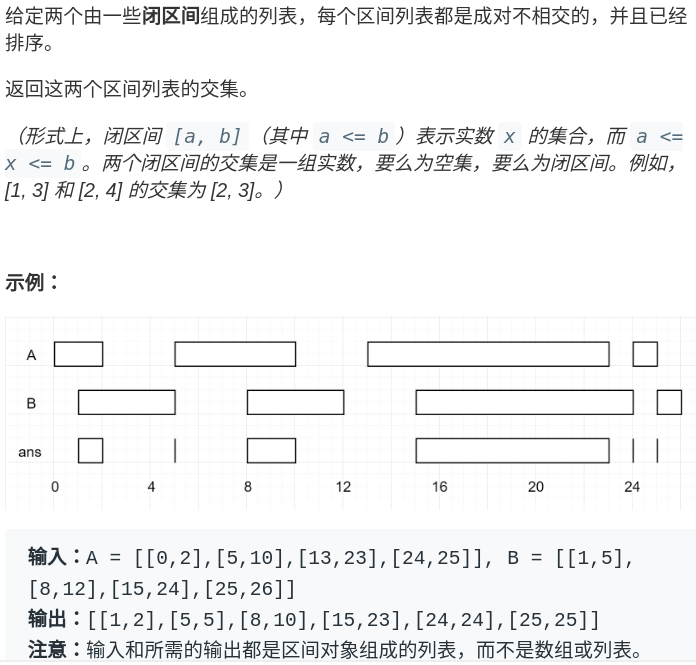
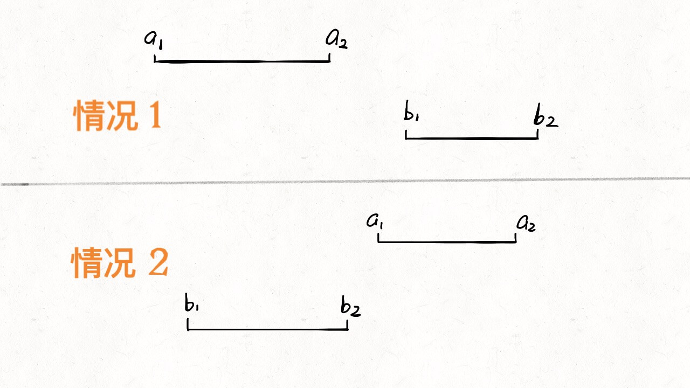
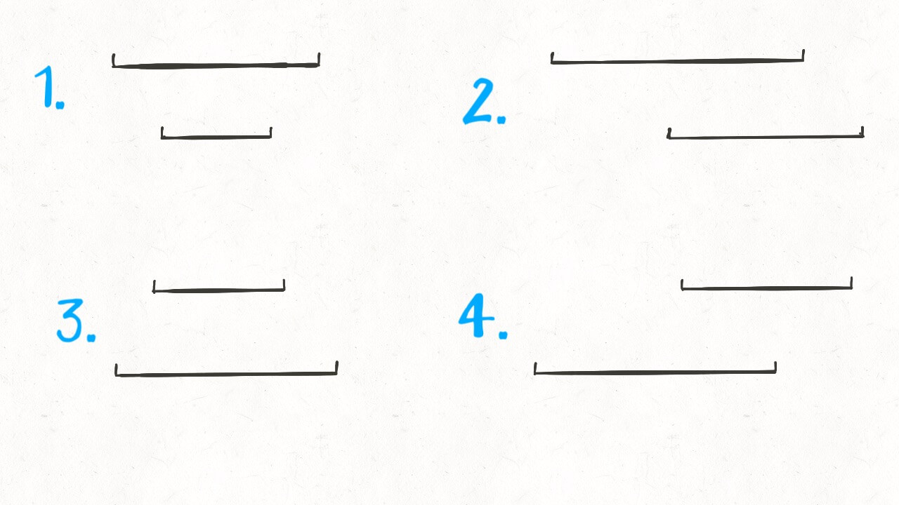
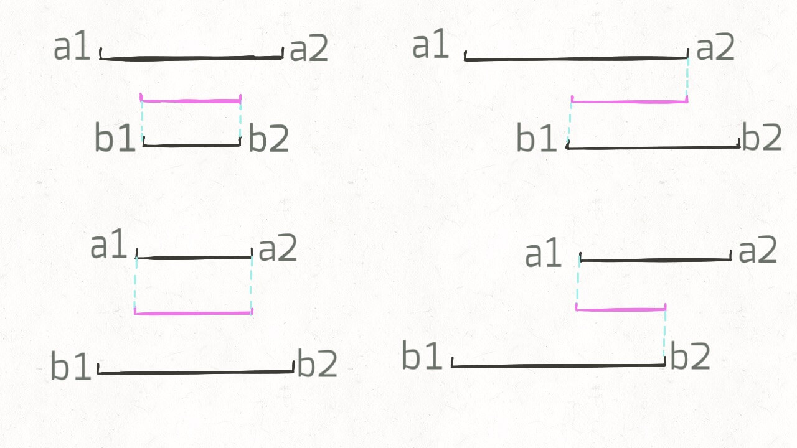
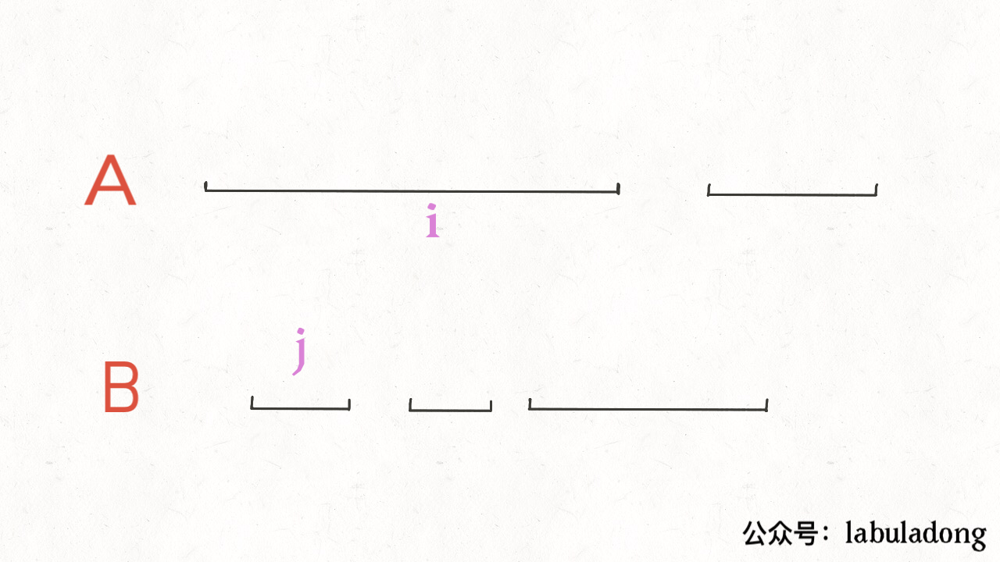

# 区间交集问题


<p align='center'>
<a href="https://github.com/labuladong/fucking-algorithm" target="view_window"></a>
<a href="https://www.zhihu.com/people/labuladong"></a>
<a href="https://i.loli.net/2020/10/10/MhRTyUKfXZOlQYN.jpg"></a>
<a href="https://space.bilibili.com/14089380"></a>
</p>


相关推荐：
  * [经典动态规划：编辑距离](https://labuladong.gitee.io/algo/)
  * [经典动态规划：高楼扔鸡蛋（进阶）](https://labuladong.gitee.io/algo/)

读完本文，你不仅学会了算法套路，还可以顺便去 LeetCode 上拿下如下题目：

[986.区间列表的交集](https://leetcode-cn.com/problems/interval-list-intersections)

**-----------**

本文是区间系列问题的第三篇，前两篇分别讲了区间的最大不相交子集和重叠区间的合并，今天再写一个算法，可以快速找出两组区间的交集。

先看下题目，LeetCode 第 986 题就是这个问题：



题目很好理解，就是让你找交集，注意区间都是闭区间。

### 思路

解决区间问题的思路一般是先排序，以便操作，不过题目说已经排好序了，那么可以用两个索引指针在 `A` 和 `B` 中游走，把交集找出来，代码大概是这样的：

```python
# A, B 形如 [[0,2],[5,10]...]
def intervalIntersection(A, B):
    i, j = 0, 0
    res = []
    while i < len(A) and j < len(B):
        # ...
        j += 1
        i += 1
    return res
```

不难，我们先老老实实分析一下各种情况。

首先，**对于两个区间**，我们用 `[a1,a2]` 和 `[b1,b2]` 表示在 `A` 和 `B` 中的两个区间，那么什么情况下这两个区间**没有交集**呢：



只有这两种情况，写成代码的条件判断就是这样：

```python
if b2 < a1 or a2 < b1:
    [a1,a2] 和 [b1,b2] 无交集
```

那么，什么情况下，两个区间存在交集呢？根据命题的否定，上面逻辑的否命题就是存在交集的条件：

```python
# 不等号取反，or 也要变成 and
if b2 >= a1 and a2 >= b1:
    [a1,a2] 和 [b1,b2] 存在交集
```

接下来，两个区间存在交集的情况有哪些呢？穷举出来：



这很简单吧，就这四种情况而已。那么接下来思考，这几种情况下，交集是否有什么共同点呢？



我们惊奇地发现，交集区间是有规律的！如果交集区间是 `[c1,c2]`，那么 `c1=max(a1,b1)`，`c2=min(a2,b2)`！这一点就是寻找交集的核心，我们把代码更进一步：

```python
while i < len(A) and j < len(B):
    a1, a2 = A[i][0], A[i][1]
    b1, b2 = B[j][0], B[j][1]
    if b2 >= a1 and a2 >= b1:
        res.append([max(a1, b1), min(a2, b2)])
    # ...
```

最后一步，我们的指针 `i` 和 `j` 肯定要前进（递增）的，什么时候应该前进呢？



结合动画示例就很好理解了，是否前进，只取决于 `a2` 和 `b2` 的大小关系：

```python
while i < len(A) and j < len(B):
    # ...
    if b2 < a2:
        j += 1
    else:
        i += 1
```

### 代码

```python
# A, B 形如 [[0,2],[5,10]...]
def intervalIntersection(A, B):
    i, j = 0, 0 # 双指针
    res = []
    while i < len(A) and j < len(B):
        a1, a2 = A[i][0], A[i][1]
        b1, b2 = B[j][0], B[j][1]
        # 两个区间存在交集
        if b2 >= a1 and a2 >= b1:
            # 计算出交集，加入 res
            res.append([max(a1, b1), min(a2, b2)])
        # 指针前进
        if b2 < a2: j += 1
        else:       i += 1
    return res
```

总结一下，区间类问题看起来都比较复杂，情况很多难以处理，但实际上通过观察各种不同情况之间的共性可以发现规律，用简洁的代码就能处理。

另外，区间问题没啥特别厉害的奇技淫巧，其操作也朴实无华，但其应用却十分广泛。

**＿＿＿＿＿＿＿＿＿＿＿＿＿**

**刷算法，学套路，认准 labuladong，公众号和 [在线电子书](https://labuladong.gitee.io/algo/) 持续更新最新文章**。

**本小抄即将出版，微信扫码关注公众号，后台回复「小抄」限时免费获取，回复「进群」可进刷题群一起刷题，带你搞定 LeetCode**。

<p align='center'>

</p>
======其他语言代码======

[986.区间列表的交集](https://leetcode-cn.com/problems/interval-list-intersections)


### java

[KiraZh](https://github.com/KiraZh)提供第986题Java代码

```java
class Solution {
    public int[][] intervalIntersection(int[][] A, int[][] B) {
        List<int[]> res = new ArrayList<>();
        int a = 0, b = 0;
        while(a < A.length && b < B.length) {
            // 确定左边界，两个区间左边界的最大值
            int left = Math.max(A[a][0], B[b][0]);
            // 确定右边界，两个区间右边界的最小值
            int right = Math.min(A[a][1], B[b][1]);
            // 左边界小于右边界则加入结果集
            if (left <= right) 
                res.add(new int[] {left, right});
            // 右边界更大的保持不动，另一个指针移动，继续比较
            if(A[a][1] < B[b][1]) a++;
            else b++;
        }
        // 将结果转为数组
        return res.toArray(new int[0][]);
    }
}
```


### javascript

[986.区间列表的交集](https://leetcode-cn.com/problems/interval-list-intersections)

```js
/**
 * @param {number[][]} firstList
 * @param {number[][]} secondList
 * @return {number[][]}
 */
var intervalIntersection = function (firstList, secondList) {
  let i, j;
  i = j = 0;

  let res = [];

  while (i < firstList.length && j < secondList.length) {
    let a1 = firstList[i][0];
    let a2 = firstList[i][1];
    let b1 = secondList[j][0];
    let b2 = secondList[j][1];

    //  两个区间存在交集
    if (b2 >= a1 && a2 >= b1) {
      // 计算出交集，加入 res
      res.push([Math.max(a1, b1), Math.min(a2, b2)])
    }

    // 指针前进
    if (b2 < a2) {
      j += 1;
    } else {
      i += 1
    }
  }
  return res;
};
```

