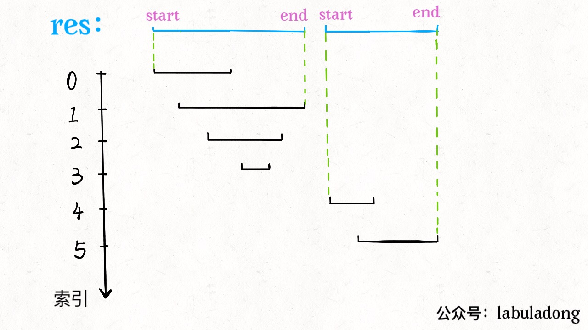
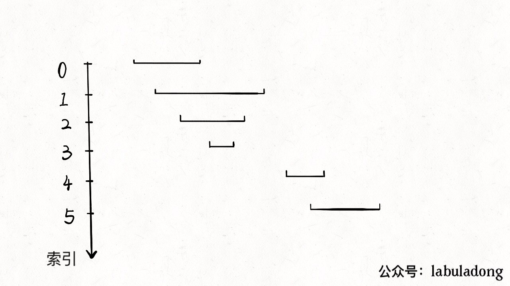

# 区间调度问题之区间合并


<p align='center'>
<a href="https://github.com/labuladong/fucking-algorithm" target="view_window"></a>
<a href="https://www.zhihu.com/people/labuladong"></a>
<a href="https://i.loli.net/2020/10/10/MhRTyUKfXZOlQYN.jpg"></a>
<a href="https://space.bilibili.com/14089380"></a>
</p>


相关推荐：
  * [Git原理之最近公共祖先](https://labuladong.gitee.io/algo/)
  * [洗牌算法](https://labuladong.gitee.io/algo/)

读完本文，你不仅学会了算法套路，还可以顺便去 LeetCode 上拿下如下题目：

[56.合并区间](https://leetcode-cn.com/problems/merge-intervals)

**-----------**

上篇文章用贪心算法解决了区间调度问题：给你很多区间，让你求其中的最大不重叠子集。

其实对于区间相关的问题，还有很多其他类型，本文就来讲讲区间合并问题（Merge Interval）。

LeetCode 第 56 题就是一道相关问题，题目很好理解：


我们解决区间问题的一般思路是先排序，然后观察规律。

### 一、思路

一个区间可以表示为 `[start, end]`，前文聊的区间调度问题，需要按 `end` 排序，以便满足贪心选择性质。而对于区间合并问题，其实按 `end` 和 `start` 排序都可以，不过为了清晰起见，我们选择按 `start` 排序。


**显然，对于几个相交区间合并后的结果区间 `x`，`x.start` 一定是这些相交区间中 `start` 最小的，`x.end` 一定是这些相交区间中 `end` 最大的。**



由于已经排了序，`x.start` 很好确定，求 `x.end` 也很容易，可以类比在数组中找最大值的过程：

```java
int max_ele = arr[0];
for (int i = 1; i < arr.length; i++) 
    max_ele = max(max_ele, arr[i]);
return max_ele;
```

### 二、代码

```python
# intervals 形如 [[1,3],[2,6]...]
def merge(intervals):
    if not intervals: return []
    # 按区间的 start 升序排列
    intervals.sort(key=lambda intv: intv[0])
    res = []
    res.append(intervals[0])
    
    for i in range(1, len(intervals)):
        curr = intervals[i]
        # res 中最后一个元素的引用
        last = res[-1]
        if curr[0] <= last[1]:
            # 找到最大的 end
            last[1] = max(last[1], curr[1])
        else:
            # 处理下一个待合并区间
            res.append(curr)
    return res
```

看下动画就一目了然了：



至此，区间合并问题就解决了。本文篇幅短小，因为区间合并只是区间问题的一个类型，后续还有一些区间问题。本想把所有问题类型都总结在一篇文章，但有读者反应，长文只会收藏不会看... 所以还是分成小短文吧，读者有什么看法可以在留言板留言交流。

本文终，希望对你有帮助。

**＿＿＿＿＿＿＿＿＿＿＿＿＿**

**刷算法，学套路，认准 labuladong，公众号和 [在线电子书](https://labuladong.gitee.io/algo/) 持续更新最新文章**。

**本小抄即将出版，微信扫码关注公众号，后台回复「小抄」限时免费获取，回复「进群」可进刷题群一起刷题，带你搞定 LeetCode**。

<p align='center'>

</p>
======其他语言代码======

[56.合并区间](https://leetcode-cn.com/problems/merge-intervals)


### java

```java
class Solution {
    /**
     *  1. 先对区间集合进行排序（根据开始位置）
     *  2. 合并的情况一共有三种
     *    a.                        b.                   c.
     *          |---------|             |--------|             |--------|
     *              |---------|              |--|                            |--------|
     *      a和b两种情况，合并取右边界大的值，c情况不合并
     *  
     */

    private int[][] tmp;
    
    public int[][] merge(int[][] intervals) {
        if(intervals == null ||intervals.length == 0)return new int[0][0];
        int length = intervals.length;
        //将列表中的区间按照左端点升序排序
        // Arrays.sort(intervals,(v1,v2) -> v1[0]-v2[0]);
        
        this.tmp = new int[length][2];
        sort(intervals,0,length-1);

        int[][] ans = new int[length][2];
        int index = -1;
        for(int[] interval:intervals){
            // 当结果数组是空是，或者当前区间的起始位置 > 结果数组中最后区间的终止位置（即上图情况c）；
            // 则不合并，直接将当前区间加入结果数组。
            if(index == -1 || interval[0] > ans[index][1]){
                ans[++index] = interval;
            }else{
                // 反之将当前区间合并至结果数组的最后区间（即上图情况a,b）
                ans[index][1] = Math.max(ans[index][1],interval[1]);
            }
        }
        return Arrays.copyOf(ans, index + 1);
    }

    //归并排序
    public void sort(int[][] intervals,int l,int r){
        if(l >= r)return;

        int mid = l + (r-l)/2;
        sort(intervals,l,mid);
        sort(intervals,mid+1,r);

        //合并
        int i=l,j=mid+1;
        for(int k=l;k<=r;k++){
            if(i>mid)tmp[k]=intervals[j++];
            else if(j>r)tmp[k]=intervals[i++];
            else if(intervals[i][0]>intervals[j][0])tmp[k] = intervals[j++];
            else tmp[k] = intervals[i++];
        }

        System.arraycopy(tmp,l,intervals,l,r-l+1);
    }

}
```

### c++

[Kian](https://github.com/KianKw/) 提供第 56 题 C++ 代码

```c++
class Solution {
public:
    vector<vector<int>> merge(vector<vector<int>>& intervals) {
        // len 为 intervals 的长度
        int len = intervals.size();
        if (len < 1)
            return {};

        // 按区间的 start 升序排列
        sort(intervals.begin(), intervals.end());

        // 初始化 res 数组
        vector<vector<int>> res;
        res.push_back(intervals[0]);

        for (int i = 1; i < len; i++) {
            vector<int> curr = intervals[i];
            // res.back() 为 res 中最后一个元素的索引
            if (curr[0] <= res.back()[1]) {
                // 找到最大的 end
                res.back()[1] = max(res.back()[1], curr[1]);
            } else {
                // 处理下一个待合并区间
                res.push_back(curr);
            }
        }
        return res;
    }
};
```


### javascript

[56. 合并区间](https://leetcode-cn.com/problems/merge-intervals/)

```js
/**
 * @param {number[][]} intervals
 * @return {number[][]}
 */
var merge = function (intervals) {
    if (intervals.length < 1) {
        return []
    }

    // 按区间的 start 升序排列
    intervals.sort((a, b) => {
        return a[0] - b[0]
    })

    const res = []
    res.push(intervals[0].concat())

    for (let i = 1; i < intervals.length; i++) {

        let curr = intervals[i]
        // res 中最后一个元素的引用
        let last = res[res.length - 1]

        if (curr[0] <= last[1]) {
            // 找到最大的 end
            last[1] = Math.max(last[1], curr[1])
        } else {
            // 处理下一个待合并区间
            res.push(curr.concat())
        }
    }
    return res
}
```

