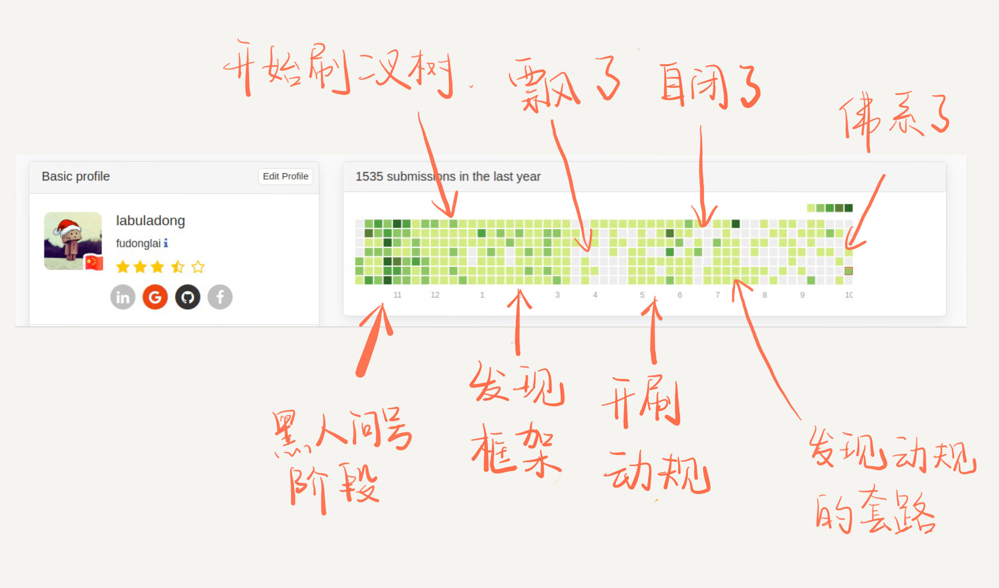

# 学习算法和刷题的思路指南


<p align='center'>
<a href="https://github.com/labuladong/fucking-algorithm" target="view_window"></a>
<a href="https://www.zhihu.com/people/labuladong"></a>
<a href="https://i.loli.net/2020/10/10/MhRTyUKfXZOlQYN.jpg"></a>
<a href="https://space.bilibili.com/14089380"></a>
</p>


相关推荐：
  * [twoSum问题的核心思想](https://labuladong.gitee.io/algo/)
  * [经典动态规划：高楼扔鸡蛋（进阶）](https://labuladong.gitee.io/algo/)

**-----------**

通知：如果本站对你学习算法有帮助，**请收藏网址，并推荐给你的朋友**。由于 **labuladong** 的算法套路太火，很多人直接拿我的 GitHub 文章去开付费专栏，价格还不便宜。我这免费写给你看，**多宣传原创作者是你唯一能做的**，谁也不希望劣币驱逐良币对吧？

这是好久之前的一篇文章「学习数据结构和算法的框架思维」的修订版。之前那篇文章收到广泛好评，没看过也没关系，这篇文章会涵盖之前的所有内容，并且会举很多代码的实例，教你如何使用框架思维。 

首先，这里讲的都是普通的数据结构，咱不是搞算法竞赛的，野路子出生，我只会解决常规的问题。另外，以下是我个人的经验的总结，没有哪本算法书会写这些东西，所以请读者试着理解我的角度，别纠结于细节问题，因为这篇文章就是希望对数据结构和算法建立一个框架性的认识。

从整体到细节，自顶向下，从抽象到具体的框架思维是通用的，不只是学习数据结构和算法，学习其他任何知识都是高效的。

### 一、数据结构的存储方式

**数据结构的存储方式只有两种：数组（顺序存储）和链表（链式存储）**。

这句话怎么理解，不是还有散列表、栈、队列、堆、树、图等等各种数据结构吗？

我们分析问题，一定要有递归的思想，自顶向下，从抽象到具体。你上来就列出这么多，那些都属于「上层建筑」，而数组和链表才是「结构基础」。因为那些多样化的数据结构，究其源头，都是在链表或者数组上的特殊操作，API 不同而已。

比如说「队列」、「栈」这两种数据结构既可以使用链表也可以使用数组实现。用数组实现，就要处理扩容缩容的问题；用链表实现，没有这个问题，但需要更多的内存空间存储节点指针。

「图」的两种表示方法，邻接表就是链表，邻接矩阵就是二维数组。邻接矩阵判断连通性迅速，并可以进行矩阵运算解决一些问题，但是如果图比较稀疏的话很耗费空间。邻接表比较节省空间，但是很多操作的效率上肯定比不过邻接矩阵。

「散列表」就是通过散列函数把键映射到一个大数组里。而且对于解决散列冲突的方法，拉链法需要链表特性，操作简单，但需要额外的空间存储指针；线性探查法就需要数组特性，以便连续寻址，不需要指针的存储空间，但操作稍微复杂些。

「树」，用数组实现就是「堆」，因为「堆」是一个完全二叉树，用数组存储不需要节点指针，操作也比较简单；用链表实现就是很常见的那种「树」，因为不一定是完全二叉树，所以不适合用数组存储。为此，在这种链表「树」结构之上，又衍生出各种巧妙的设计，比如二叉搜索树、AVL 树、红黑树、区间树、B 树等等，以应对不同的问题。

了解 Redis 数据库的朋友可能也知道，Redis 提供列表、字符串、集合等等几种常用数据结构，但是对于每种数据结构，底层的存储方式都至少有两种，以便于根据存储数据的实际情况使用合适的存储方式。

综上，数据结构种类很多，甚至你也可以发明自己的数据结构，但是底层存储无非数组或者链表，**二者的优缺点如下**：

**数组**由于是紧凑连续存储,可以随机访问，通过索引快速找到对应元素，而且相对节约存储空间。但正因为连续存储，内存空间必须一次性分配够，所以说数组如果要扩容，需要重新分配一块更大的空间，再把数据全部复制过去，时间复杂度 O(N)；而且你如果想在数组中间进行插入和删除，每次必须搬移后面的所有数据以保持连续，时间复杂度 O(N)。

**链表**因为元素不连续，而是靠指针指向下一个元素的位置，所以不存在数组的扩容问题；如果知道某一元素的前驱和后驱，操作指针即可删除该元素或者插入新元素，时间复杂度 O(1)。但是正因为存储空间不连续，你无法根据一个索引算出对应元素的地址，所以不能随机访问；而且由于每个元素必须存储指向前后元素位置的指针，会消耗相对更多的储存空间。


### 二、数据结构的基本操作

对于任何数据结构，其基本操作无非遍历 + 访问，再具体一点就是：增删查改。

**数据结构种类很多，但它们存在的目的都是在不同的应用场景，尽可能高效地增删查改**。话说这不就是数据结构的使命么？

如何遍历 + 访问？我们仍然从最高层来看，各种数据结构的遍历 + 访问无非两种形式：线性的和非线性的。

线性就是 for/while 迭代为代表，非线性就是递归为代表。再具体一步，无非以下几种框架：

数组遍历框架，典型的线性迭代结构：

```java
void traverse(int[] arr) {
    for (int i = 0; i < arr.length; i++) {
        // 迭代访问 arr[i]
    }
}
```

链表遍历框架，兼具迭代和递归结构：

```java
/* 基本的单链表节点 */
class ListNode {
    int val;
    ListNode next;
}

void traverse(ListNode head) {
    for (ListNode p = head; p != null; p = p.next) {
        // 迭代访问 p.val
    }
}

void traverse(ListNode head) {
    // 递归访问 head.val
    traverse(head.next)
}
```

二叉树遍历框架，典型的非线性递归遍历结构：

```java
/* 基本的二叉树节点 */
class TreeNode {
    int val;
    TreeNode left, right;
}

void traverse(TreeNode root) {
    traverse(root.left)
    traverse(root.right)
}
```

你看二叉树的递归遍历方式和链表的递归遍历方式，相似不？再看看二叉树结构和单链表结构，相似不？如果再多几条叉，N 叉树你会不会遍历？

二叉树框架可以扩展为 N 叉树的遍历框架：

```java
/* 基本的 N 叉树节点 */
class TreeNode {
    int val;
    TreeNode[] children;
}

void traverse(TreeNode root) {
    for (TreeNode child : root.children)
        traverse(child);
}
```

N 叉树的遍历又可以扩展为图的遍历，因为图就是好几 N 叉棵树的结合体。你说图是可能出现环的？这个很好办，用个布尔数组 visited 做标记就行了，这里就不写代码了。

**所谓框架，就是套路。不管增删查改，这些代码都是永远无法脱离的结构，你可以把这个结构作为大纲，根据具体问题在框架上添加代码就行了，下面会具体举例**。

### 三、算法刷题指南

首先要明确的是，**数据结构是工具，算法是通过合适的工具解决特定问题的方法**。也就是说，学习算法之前，最起码得了解那些常用的数据结构，了解它们的特性和缺陷。

那么该如何在 LeetCode 刷题呢？之前的文章[算法学习之路](https://labuladong.gitee.io/algo/)写过一些，什么按标签刷，坚持下去云云。现在距那篇文章已经过去将近一年了，我不说那些不痛不痒的话，直接说具体的建议：

**先刷二叉树，先刷二叉树，先刷二叉树**！

这是我这刷题一年的亲身体会，下图是去年十月份的提交截图：



公众号文章的阅读数据显示，大部分人对数据结构相关的算法文章不感兴趣，而是更关心动规回溯分治等等技巧。为什么要先刷二叉树呢，**因为二叉树是最容易培养框架思维的，而且大部分算法技巧，本质上都是树的遍历问题**。

刷二叉树看到题目没思路？根据很多读者的问题，其实大家不是没思路，只是没有理解我们说的「框架」是什么。**不要小看这几行破代码，几乎所有二叉树的题目都是一套这个框架就出来了**。

```java
void traverse(TreeNode root) {
    // 前序遍历
    traverse(root.left)
    // 中序遍历
    traverse(root.right)
    // 后序遍历
}
```

比如说我随便拿几道题的解法出来，不用管具体的代码逻辑，只要看看框架在其中是如何发挥作用的就行。

LeetCode 124 题，难度 Hard，让你求二叉树中最大路径和，主要代码如下：

```cpp
int ans = INT_MIN;
int oneSideMax(TreeNode* root) {
    if (root == nullptr) return 0;
    int left = max(0, oneSideMax(root->left));
    int right = max(0, oneSideMax(root->right));
    ans = max(ans, left + right + root->val);
    return max(left, right) + root->val;
}
```

你看，这就是个后序遍历嘛。

LeetCode 105 题，难度 Medium，让你根据前序遍历和中序遍历的结果还原一棵二叉树，很经典的问题吧，主要代码如下：

```java
TreeNode buildTree(int[] preorder, int preStart, int preEnd, 
    int[] inorder, int inStart, int inEnd, Map<Integer, Integer> inMap) {

    if(preStart > preEnd || inStart > inEnd) return null;

    TreeNode root = new TreeNode(preorder[preStart]);
    int inRoot = inMap.get(root.val);
    int numsLeft = inRoot - inStart;

    root.left = buildTree(preorder, preStart + 1, preStart + numsLeft, 
                          inorder, inStart, inRoot - 1, inMap);
    root.right = buildTree(preorder, preStart + numsLeft + 1, preEnd, 
                          inorder, inRoot + 1, inEnd, inMap);
    return root;
}
```

不要看这个函数的参数很多，只是为了控制数组索引而已，本质上该算法也就是一个前序遍历。

LeetCode 99 题，难度 Hard，恢复一棵 BST，主要代码如下：

```cpp
void traverse(TreeNode* node) {
    if (!node) return;
    traverse(node->left);
    if (node->val < prev->val) {
        s = (s == NULL) ? prev : s;
        t = node;
    }
    prev = node;
    traverse(node->right);
}
```

这不就是个中序遍历嘛，对于一棵 BST 中序遍历意味着什么，应该不需要解释了吧。

你看，Hard 难度的题目不过如此，而且还这么有规律可循，只要把框架写出来，然后往相应的位置加东西就行了，这不就是思路吗。

对于一个理解二叉树的人来说，刷一道二叉树的题目花不了多长时间。那么如果你对刷题无从下手或者有畏惧心理，不妨从二叉树下手，前 10 道也许有点难受；结合框架再做 20 道，也许你就有点自己的理解了；刷完整个专题，再去做什么回溯动规分治专题，**你就会发现只要涉及递归的问题，都是树的问题**。

再举例吧，说几道我们之前文章写过的问题。

[动态规划详解](https://labuladong.gitee.io/algo/)说过凑零钱问题，暴力解法就是遍历一棵 N 叉树：


```python
def coinChange(coins: List[int], amount: int):

    def dp(n):
        if n == 0: return 0
        if n < 0: return -1

        res = float('INF')
        for coin in coins:
            subproblem = dp(n - coin)
            # 子问题无解，跳过
            if subproblem == -1: continue
            res = min(res, 1 + subproblem)
        return res if res != float('INF') else -1
    
    return dp(amount)
```

这么多代码看不懂咋办？直接提取出框架，就能看出核心思路了：

```python
# 不过是一个 N 叉树的遍历问题而已
def dp(n):
    for coin in coins:
        dp(n - coin)
```

其实很多动态规划问题就是在遍历一棵树，你如果对树的遍历操作烂熟于心，起码知道怎么把思路转化成代码，也知道如何提取别人解法的核心思路。

再看看回溯算法，前文[回溯算法详解](https://labuladong.gitee.io/algo/)干脆直接说了，回溯算法就是个 N 叉树的前后序遍历问题，没有例外。

比如 N 皇后问题吧，主要代码如下：

```java
void backtrack(int[] nums, LinkedList<Integer> track) {
    if (track.size() == nums.length) {
        res.add(new LinkedList(track));
        return;
    }
    
    for (int i = 0; i < nums.length; i++) {
        if (track.contains(nums[i]))
            continue;
        track.add(nums[i]);
        // 进入下一层决策树
        backtrack(nums, track);
        track.removeLast();
    }

/* 提取出 N 叉树遍历框架 */
void backtrack(int[] nums, LinkedList<Integer> track) {
    for (int i = 0; i < nums.length; i++) {
        backtrack(nums, track);
}
```

N 叉树的遍历框架，找出来了把～你说，树这种结构重不重要？

**综上，对于畏惧算法的朋友来说，可以先刷树的相关题目，试着从框架上看问题，而不要纠结于细节问题**。

纠结细节问题，就比如纠结 i 到底应该加到 n 还是加到 n - 1，这个数组的大小到底应该开 n 还是 n + 1 ？

从框架上看问题，就是像我们这样基于框架进行抽取和扩展，既可以在看别人解法时快速理解核心逻辑，也有助于找到我们自己写解法时的思路方向。

当然，如果细节出错，你得不到正确的答案，但是只要有框架，你再错也错不到哪去，因为你的方向是对的。

但是，你要是心中没有框架，那么你根本无法解题，给了你答案，你也不会发现这就是个树的遍历问题。

这种思维是很重要的，[动态规划详解](https://labuladong.gitee.io/algo/)中总结的找状态转移方程的几步流程，有时候按照流程写出解法，说实话我自己都不知道为啥是对的，反正它就是对了。。。

**这就是框架的力量，能够保证你在快睡着的时候，依然能写出正确的程序；就算你啥都不会，都能比别人高一个级别。**


### 四、总结几句

数据结构的基本存储方式就是链式和顺序两种，基本操作就是增删查改，遍历方式无非迭代和递归。

刷算法题建议从「树」分类开始刷，结合框架思维，把这几十道题刷完，对于树结构的理解应该就到位了。这时候去看回溯、动规、分治等算法专题，对思路的理解可能会更加深刻一些。


**＿＿＿＿＿＿＿＿＿＿＿＿＿**

**刷算法，学套路，认准 labuladong，公众号和 [在线电子书](https://labuladong.gitee.io/algo/) 持续更新最新文章**。

**本小抄即将出版，微信扫码关注公众号，后台回复「小抄」限时免费获取，回复「进群」可进刷题群一起刷题，带你搞定 LeetCode**。

<p align='center'>

</p>

======其他语言代码======