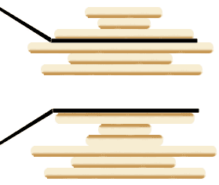

# 烧饼排序


<p align='center'>
<a href="https://github.com/labuladong/fucking-algorithm" target="view_window"></a>
<a href="https://www.zhihu.com/people/labuladong"></a>
<a href="https://i.loli.net/2020/10/10/MhRTyUKfXZOlQYN.jpg"></a>
<a href="https://space.bilibili.com/14089380"></a>
</p>


相关推荐：
  * [手把手带你刷二叉树（第三期）](https://labuladong.gitee.io/algo/)
  * [Union-Find算法应用](https://labuladong.gitee.io/algo/)

读完本文，你不仅学会了算法套路，还可以顺便去 LeetCode 上拿下如下题目：

[969.煎饼排序](https://leetcode-cn.com/problems/pancake-sorting)

**-----------**

烧饼排序是个很有意思的实际问题：假设盘子上有 `n` 块**面积大小不一**的烧饼，你如何用一把锅铲进行若干次翻转，让这些烧饼的大小有序（小的在上，大的在下）？


设想一下用锅铲翻转一堆烧饼的情景，其实是有一点限制的，我们每次只能将最上面的若干块饼子翻转：



我们的问题是，**如何使用算法得到一个翻转序列，使得烧饼堆变得有序**？

首先，需要把这个问题抽象，用数组来表示烧饼堆：


如何解决这个问题呢？其实类似上篇文章 [递归反转链表的一部分](https://labuladong.gitee.io/algo/)，这也是需要**递归思想**的。

### 一、思路分析

为什么说这个问题有递归性质呢？比如说我们需要实现这样一个函数：

```java
// cakes 是一堆烧饼，函数会将前 n 个烧饼排序
void sort(int[] cakes, int n);
```

如果我们找到了前 `n` 个烧饼中最大的那个，然后设法将这个饼子翻转到最底下：


那么，原问题的规模就可以减小，递归调用 `pancakeSort(A, n-1)` 即可：


接下来，对于上面的这 `n - 1` 块饼，如何排序呢？还是先从中找到最大的一块饼，然后把这块饼放到底下，再递归调用 `pancakeSort(A, n-1-1)`……

你看，这就是递归性质，总结一下思路就是：

1、找到 `n` 个饼中最大的那个。

2、把这个最大的饼移到最底下。

3、递归调用 `pancakeSort(A, n - 1)`。

base case：`n == 1` 时，排序 1 个饼时不需要翻转。

那么，最后剩下个问题，**如何设法将某块烧饼翻到最后呢**？

其实很简单，比如第 3 块饼是最大的，我们想把它换到最后，也就是换到第 `n` 块。可以这样操作：

1、用锅铲将前 3 块饼翻转一下，这样最大的饼就翻到了最上面。

2、用锅铲将前 `n` 块饼全部翻转，这样最大的饼就翻到了第 `n` 块，也就是最后一块。

以上两个流程理解之后，基本就可以写出解法了，不过题目要求我们写出具体的反转操作序列，这也很简单，只要在每次翻转烧饼时记录下来就行了。    

### 二、代码实现

只要把上述的思路用代码实现即可，唯一需要注意的是，数组索引从 0 开始，而我们要返回的结果是从 1 开始算的。

```java
// 记录反转操作序列
LinkedList<Integer> res = new LinkedList<>();

List<Integer> pancakeSort(int[] cakes) {
    sort(cakes, cakes.length);
    return res;
}

void sort(int[] cakes, int n) {
    // base case
    if (n == 1) return;
    
    // 寻找最大饼的索引
    int maxCake = 0;
    int maxCakeIndex = 0;
    for (int i = 0; i < n; i++)
        if (cakes[i] > maxCake) {
            maxCakeIndex = i;
            maxCake = cakes[i];
        }
    
    // 第一次翻转，将最大饼翻到最上面
    reverse(cakes, 0, maxCakeIndex);
    res.add(maxCakeIndex + 1);
    // 第二次翻转，将最大饼翻到最下面
    reverse(cakes, 0, n - 1);
    res.add(n);

    // 递归调用
    sort(cakes, n - 1);
}

void reverse(int[] arr, int i, int j) {
    while (i < j) {
        int temp = arr[i];
        arr[i] = arr[j];
        arr[j] = temp;
        i++; j--;
    }
}
```

通过刚才的详细解释，这段代码应该是很清晰了。

算法的时间复杂度很容易计算，因为递归调用的次数是 `n`，每次递归调用都需要一次 for 循环，时间复杂度是 O(n)，所以总的复杂度是 O(n^2)。

**最后，我们可以思考一个问题​**：按照我们这个思路，得出的操作序列长度应该为​ `2(n - 1)`，因为每次递归都要进行 2 次翻转并记录操作，总共有 `n` 层递归，但由于 base case 直接返回结果，不进行翻转，所以最终的操作序列长度应该是固定的 `2(n - 1)`。

显然，这个结果不是最优的（最短的），比如说一堆煎饼 `[3,2,4,1]`，我们的算法得到的翻转序列是 `[3,4,2,3,1,2]`，但是最快捷的翻转方法应该是 `[2,3,4]`：

初始状态 ：[3,2,4,1]
翻前 2 个：[2,3,4,1]
翻前 3 个：[4,3,2,1]
翻前 4 个：[1,2,3,4]

如果要求你的算法计算排序烧饼的**最短**操作序列，你该如何计算呢？或者说，解决这种求最优解法的问题，核心思路什么，一定需要使用什么算法技巧呢？

不妨分享一下你的思考。

**＿＿＿＿＿＿＿＿＿＿＿＿＿**

**刷算法，学套路，认准 labuladong，公众号和 [在线电子书](https://labuladong.gitee.io/algo/) 持续更新最新文章**。

**本小抄即将出版，微信扫码关注公众号，后台回复「小抄」限时免费获取，回复「进群」可进刷题群一起刷题，带你搞定 LeetCode**。

<p align='center'>

</p>
======其他语言代码======

[969.煎饼排序](https://leetcode-cn.com/problems/pancake-sorting)


### python3

[fengshuu](https://github.com/fengshuu) 提供 Python3 解法代码：

```python
class Solution:
    # 记录反转操作序列
    def __init__(self):
        self.res = []

    def pancakeSort(self, arr: List[int]) -> List[int]:

        self.sort(arr, len(arr))
        return self.res

    def sort(self, cakes: List[int], n: int):
        # base case
        if 1 == n:
            return

        # 寻找最大饼的索引
        max_cake_index = cakes[:n].index(n)

        # 下面进行把最大的饼放到最后的两次翻转
        # 如果最后一个饼就是最大的, 就不需要翻转, 直接进行下次递归
        if max_cake_index != n - 1:
            # 第一次翻转, 将最大饼翻到最上面
            # 如果第一个饼本来就是最大的, 就不需要第一次翻转.
            if max_cake_index != 0:
                cakes[:max_cake_index + 1] = cakes[:max_cake_index + 1][::-1]
                self.res.append(max_cake_index + 1)

            # 第二次翻转，将最大饼翻到最下面
            cakes[:n] = cakes[:n][::-1]
            self.res.append(n)

        # 递归调用
        self.sort(cakes, n - 1)
```


### c++

[fengshuu](https://github.com/fengshuu) 提供 C++ 解法代码：

```cpp
class Solution {
public:
    vector<int> pancakeSort(vector<int>& arr) {
        sort(arr, arr.size());
        return res;
    }
    
private:
    // 记录反转操作序列
    vector<int> res;
    void sort(vector<int>& cakes, int n){
        // base case
        if(n == 1) return;
        
        // 寻找最大饼的索引
        int maxCakeIndex = max_element(cakes.begin(), cakes.begin() + n) - cakes.begin();
        
        // 下面进行把最大的饼放到最后的两次翻转
        // 如果最后一个饼就是最大的, 就不需要翻转, 直接进行下次递归
        if (maxCakeIndex == n-1){
            sort(cakes, n - 1);
            return;
        }
            
        // 第一次翻转, 将最大饼翻到最上面
        // 如果第一个饼本来就是最大的, 就不需要第一次翻转.
        if (maxCakeIndex != 0) {
            reverse(cakes.begin(), cakes.begin() + maxCakeIndex + 1);
            res.push_back(maxCakeIndex + 1);
        }
        
        // 第二次翻转，将最大饼翻到最下面
        reverse(cakes.begin(), cakes.begin() + n);
        res.push_back(n);
        
        // 递归调用
        sort(cakes, n - 1);
    }
};
```

### java

[L-WEIWEI](https://github.com/L-WWEEII) 提供 第969题的 Java 代码：

```java
class Solution {
    public List<Integer> pancakeSort(int[] A) {
        List<Integer> ans = new ArrayList<Integer>();
        int len = A.length;
        if(len == 0){
            return ans;
        }
        // maxIndex[0] == 当前轮次的最大元素， maxIndex[1] == 最大元素下标
        int[] maxIndex = new int[2];
        maxIndex[0] = Integer.MIN_VALUE;
        int maxCount = 0;
        // maxCount == len 时，说明完成了整个数组的最大值沉底操作，
        while(maxCount < len - 1){
            maxCount = maxValueDown(A, maxIndex, maxCount, ans);
            // 每做完一次最大值沉底操作，初始化最大元素值
            maxIndex[0] = Integer.MIN_VALUE;
        }
        return ans;
    }
    public int maxValueDown(int[] A, int[] maxIndex, int maxCount, List<Integer> ans){
        // 遍历条件为 i < A.length - maxCount ， 每次最大值沉底时，maxCount + 1，因此下次遍历即可不对最后 maxCount 个元素做操作
        for(int i = 0; i < A.length - maxCount; i++){
            // 元素大于当前储存的元素时，将值与下标 copy 到 maxIndex 数组中
            if(A[i] > maxIndex[0]){
                maxIndex[0] = A[i];
                maxIndex[1] = i;
            }
        }
        // 如果当前轮次最大元素的下标的下一位是上一轮次的最大下标，则不做翻转操作，直接返回 maxCount + 1 
        if(maxIndex[1] + 1 == A.length - maxCount){
            return maxCount + 1;
        }
        // 使用最大值沉底时，当本轮最大值在首位时，不需要再将其先翻转至首位，所以不添加
        if(maxIndex[1] > 0){
            // 将该轮次要翻转的下标添加到结果集中，结果集中需要的是翻转的位置而不是下标，所以添加时下标得 + 1
            ans.add(maxIndex[1] + 1);
        }
        // 双指针原地交换数组中的值
        // 左指针指0
        int left = 0;
        // 右指针指向当前轮次最大元素的下标
        int right = maxIndex[1];
        while(left < right){
            // 交换元素值
            A[left] += A[right];
            A[right] = A[left] - A[right];
            A[left] -= A[right];
            left++;
            right--;
        }
        // 上面交换玩元素值后，当前轮次最大元素排在首位，再从上一轮次最大元素 - 1 的位置翻转
        //     则当前轮次的最大元素成功沉底
        ans.add(A.length - maxCount);
        left = 0;
        right = A.length - 1 - maxCount;
        while(left < right){
            A[left] += A[right];
            A[right] = A[left] - A[right];
            A[left] -= A[right];
            left++;
            right--;
        }
        return maxCount + 1;
    }
}
```


### javascript

```js
/**
 * @param {number[]} arr
 * @return {number[]}
 */
var pancakeSort = function (arr) {
    let res = []

    const sort = (cakes, n) => {
        // base case
        if (n === 1) return;

        // 寻找最大饼的索引
        let maxCake = 0;
        let maxCakeIndex = 0;
        for (let i = 0; i < n; i++)
            if (cakes[i] > maxCake) {
                maxCakeIndex = i;
                maxCake = cakes[i];
            }

        // 第一次翻转，将最大饼翻到最上面
        reverse(cakes, 0, maxCakeIndex);
        res.push(maxCakeIndex + 1);
        // 第二次翻转，将最大饼翻到最下面
        reverse(cakes, 0, n - 1);
        res.push(n);

        // 递归调用
        sort(cakes, n - 1);
    }

    let reverse = (arr, i, j) => {
        while (i < j) {
            let temp = arr[i];
            arr[i] = arr[j];
            arr[j] = temp;
            i++;
            j--;
        }
    }
    
    sort(arr, arr.length)
    return res;
};
```

也可以写成下面这样。

```js
var reserve = function (nums, k) {
    let l = 0, r = k - 1
    while (l < r) {
        let temp = nums[l]
        nums[l] = nums[r]
        nums[r] = temp
        l++
        r--
    }
}
/**
 * @param {number[]} arr
 * @return {number[]}
 */
var pancakeSort = function (arr) {
    let n = arr.length
    if (n === 0) return []
    let nums = [...arr], ans = []
    nums.sort((a, b) => a - b)
    for (let i = n - 1, j = 0; i > -1; i--, j++) {
        let index = arr.indexOf(nums[i])
        ans.push(index + 1, n - j)
        reserve(arr, index + 1)
        reserve(arr, n - j)
    }
    return ans
};
```

