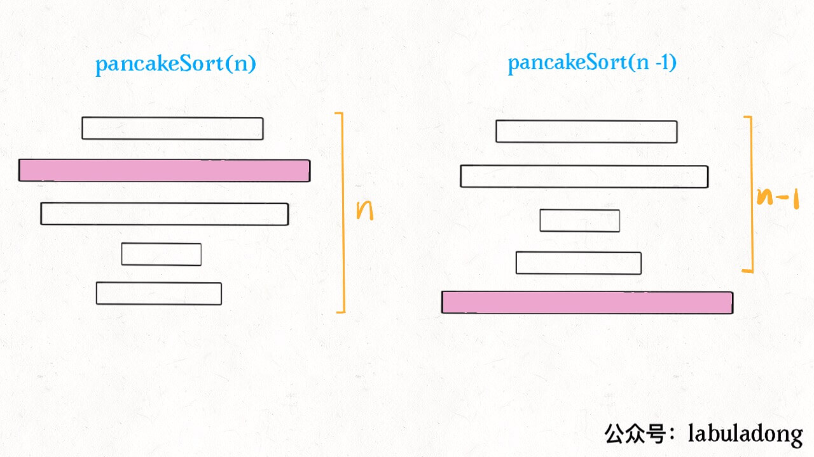

# 烧饼排序


<p align='center'>
<a href="https://github.com/labuladong/fucking-algorithm" target="view_window"></a>
<a href="https://www.zhihu.com/people/labuladong"></a>
<a href="https://i.loli.net/2020/10/10/MhRTyUKfXZOlQYN.jpg"></a>
<a href="https://space.bilibili.com/14089380"></a>
</p>


相关推荐：
  * [手把手带你刷二叉树（第三期）](https://labuladong.gitbook.io/algo)
  * [Union-Find算法应用](https://labuladong.gitbook.io/algo)

读完本文，你不仅学会了算法套路，还可以顺便去 LeetCode 上拿下如下题目：

[969.煎饼排序](https://leetcode-cn.com/problems/pancake-sorting)

**-----------**

烧饼排序是个很有意思的实际问题：假设盘子上有 `n` 块**面积大小不一**的烧饼，你如何用一把锅铲进行若干次翻转，让这些烧饼的大小有序（小的在上，大的在下）？


设想一下用锅铲翻转一堆烧饼的情景，其实是有一点限制的，我们每次只能将最上面的若干块饼子翻转：


我们的问题是，**如何使用算法得到一个翻转序列，使得烧饼堆变得有序**？

首先，需要把这个问题抽象，用数组来表示烧饼堆：


如何解决这个问题呢？其实类似上篇文章 [递归反转链表的一部分](https://labuladong.gitbook.io/algo)，这也是需要**递归思想**的。

### 一、思路分析

为什么说这个问题有递归性质呢？比如说我们需要实现这样一个函数：

```java
// cakes 是一堆烧饼，函数会将前 n 个烧饼排序
void sort(int[] cakes, int n);
```

如果我们找到了前 `n` 个烧饼中最大的那个，然后设法将这个饼子翻转到最底下：


那么，原问题的规模就可以减小，递归调用 `pancakeSort(A, n-1)` 即可：



接下来，对于上面的这 `n - 1` 块饼，如何排序呢？还是先从中找到最大的一块饼，然后把这块饼放到底下，再递归调用 `pancakeSort(A, n-1-1)`……

你看，这就是递归性质，总结一下思路就是：

1、找到 `n` 个饼中最大的那个。

2、把这个最大的饼移到最底下。

3、递归调用 `pancakeSort(A, n - 1)`。

base case：`n == 1` 时，排序 1 个饼时不需要翻转。

那么，最后剩下个问题，**如何设法将某块烧饼翻到最后呢**？

其实很简单，比如第 3 块饼是最大的，我们想把它换到最后，也就是换到第 `n` 块。可以这样操作：

1、用锅铲将前 3 块饼翻转一下，这样最大的饼就翻到了最上面。

2、用锅铲将前 `n` 块饼全部翻转，这样最大的饼就翻到了第 `n` 块，也就是最后一块。

以上两个流程理解之后，基本就可以写出解法了，不过题目要求我们写出具体的反转操作序列，这也很简单，只要在每次翻转烧饼时记录下来就行了。    

### 二、代码实现

只要把上述的思路用代码实现即可，唯一需要注意的是，数组索引从 0 开始，而我们要返回的结果是从 1 开始算的。

```java
// 记录反转操作序列
LinkedList<Integer> res = new LinkedList<>();

List<Integer> pancakeSort(int[] cakes) {
    sort(cakes, cakes.length);
    return res;
}

void sort(int[] cakes, int n) {
    // base case
    if (n == 1) return;
    
    // 寻找最大饼的索引
    int maxCake = 0;
    int maxCakeIndex = 0;
    for (int i = 0; i < n; i++)
        if (cakes[i] > maxCake) {
            maxCakeIndex = i;
            maxCake = cakes[i];
        }
    
    // 第一次翻转，将最大饼翻到最上面
    reverse(cakes, 0, maxCakeIndex);
    res.add(maxCakeIndex + 1);
    // 第二次翻转，将最大饼翻到最下面
    reverse(cakes, 0, n - 1);
    res.add(n);

    // 递归调用
    sort(cakes, n - 1);
}

void reverse(int[] arr, int i, int j) {
    while (i < j) {
        int temp = arr[i];
        arr[i] = arr[j];
        arr[j] = temp;
        i++; j--;
    }
}
```

通过刚才的详细解释，这段代码应该是很清晰了。

算法的时间复杂度很容易计算，因为递归调用的次数是 `n`，每次递归调用都需要一次 for 循环，时间复杂度是 O(n)，所以总的复杂度是 O(n^2)。

**最后，我们可以思考一个问题​**：按照我们这个思路，得出的操作序列长度应该为​ `2(n - 1)`，因为每次递归都要进行 2 次翻转并记录操作，总共有 `n` 层递归，但由于 base case 直接返回结果，不进行翻转，所以最终的操作序列长度应该是固定的 `2(n - 1)`。

显然，这个结果不是最优的（最短的），比如说一堆煎饼 `[3,2,4,1]`，我们的算法得到的翻转序列是 `[3,4,2,3,1,2]`，但是最快捷的翻转方法应该是 `[2,3,4]`：

初始状态 ：[3,2,4,1]
翻前 2 个：[2,3,4,1]
翻前 3 个：[4,3,2,1]
翻前 4 个：[1,2,3,4]

如果要求你的算法计算排序烧饼的**最短**操作序列，你该如何计算呢？或者说，解决这种求最优解法的问题，核心思路什么，一定需要使用什么算法技巧呢？

不妨分享一下你的思考。

**＿＿＿＿＿＿＿＿＿＿＿＿＿**

**刷算法，学套路，认准 labuladong，公众号和 [在线电子书](https://labuladong.gitbook.io/algo) 持续更新最新文章**。

**本小抄即将出版，微信扫码关注公众号，后台回复「小抄」限时免费获取，回复「进群」可进刷题群一起刷题，带你搞定 LeetCode**。

<p align='center'>

</p>

======其他语言代码======