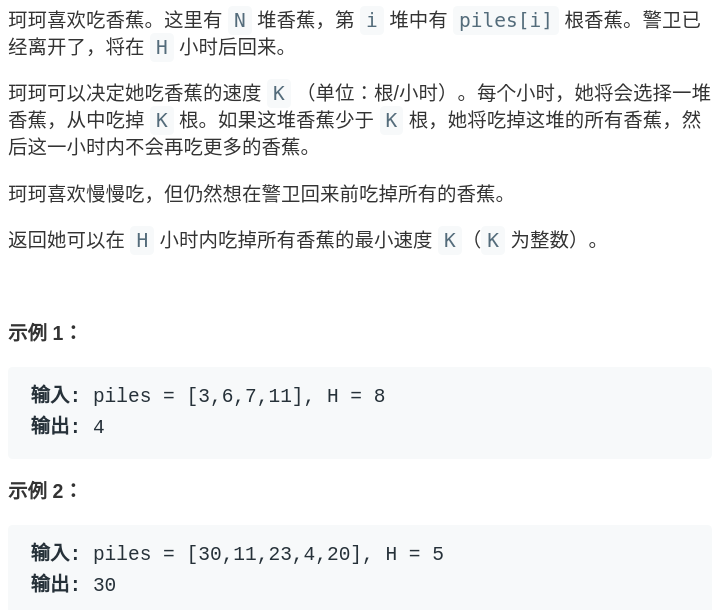
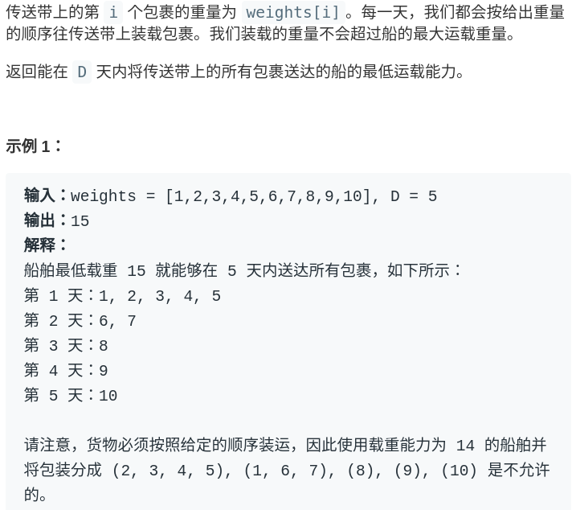

# 如何运用二分查找算法


<p align='center'>
<a href="https://github.com/labuladong/fucking-algorithm" target="view_window"></a>
<a href="https://www.zhihu.com/people/labuladong"></a>
<a href="https://i.loli.net/2020/10/10/MhRTyUKfXZOlQYN.jpg"></a>
<a href="https://space.bilibili.com/14089380"></a>
</p>


相关推荐：
  * [如何运用贪心思想玩跳跃游戏](https://labuladong.gitee.io/algo/)
  * [如何寻找最长回文子串](https://labuladong.gitee.io/algo/)

读完本文，你不仅学会了算法套路，还可以顺便去 LeetCode 上拿下如下题目：

[875.爱吃香蕉的珂珂](https://leetcode-cn.com/problems/koko-eating-bananas)

[1011.在D天内送达包裹的能力](https://leetcode-cn.com/problems/capacity-to-ship-packages-within-d-days)

**-----------**

二分查找到底有能运用在哪里？

最常见的就是教科书上的例子，在**有序数组**中搜索给定的某个目标值的索引。再推广一点，如果目标值存在重复，修改版的二分查找可以返回目标值的左侧边界索引或者右侧边界索引。

PS：以上提到的三种二分查找算法形式在前文「二分查找详解」有代码详解，如果没看过强烈建议看看。

抛开有序数组这个枯燥的数据结构，二分查找如何运用到实际的算法问题中呢？当搜索空间有序的时候，就可以通过二分搜索「剪枝」，大幅提升效率。

说起来玄乎得很，本文先用一个具体的「Koko 吃香蕉」的问题来举个例子。

### 一、问题分析



也就是说，Koko 每小时最多吃一堆香蕉，如果吃不下的话留到下一小时再吃；如果吃完了这一堆还有胃口，也只会等到下一小时才会吃下一堆。在这个条件下，让我们确定 Koko 吃香蕉的**最小速度**（根/小时）。

如果直接给你这个情景，你能想到哪里能用到二分查找算法吗？如果没有见过类似的问题，恐怕是很难把这个问题和二分查找联系起来的。

那么我们先抛开二分查找技巧，想想如何暴力解决这个问题呢？

首先，算法要求的是「`H` 小时内吃完香蕉的最小速度」，我们不妨称为 `speed`，请问 `speed` 最大可能为多少，最少可能为多少呢？

显然最少为 1，最大为 `max(piles)`，因为一小时最多只能吃一堆香蕉。那么暴力解法就很简单了，只要从 1 开始穷举到 `max(piles)`，一旦发现发现某个值可以在 `H` 小时内吃完所有香蕉，这个值就是最小速度：

```java
int minEatingSpeed(int[] piles, int H) {
	// piles 数组的最大值
    int max = getMax(piles);
    for (int speed = 1; speed < max; speed++) {
    	// 以 speed 是否能在 H 小时内吃完香蕉
        if (canFinish(piles, speed, H))
            return speed;
    }
    return max;
}
```

注意这个 for 循环，就是在**连续的空间线性搜索，这就是二分查找可以发挥作用的标志**。由于我们要求的是最小速度，所以可以用一个**搜索左侧边界的二分查找**来代替线性搜索，提升效率：

```java
int minEatingSpeed(int[] piles, int H) {
    // 套用搜索左侧边界的算法框架
    int left = 1, right = getMax(piles) + 1;
    while (left < right) {
        // 防止溢出
        int mid = left + (right - left) / 2;
        if (canFinish(piles, mid, H)) {
            right = mid;
        } else {
            left = mid + 1;
        }
    }
    return left;
}
```

PS：如果对于这个二分查找算法的细节问题有疑问，建议看下前文「二分查找详解」搜索左侧边界的算法模板，这里不展开了。

剩下的辅助函数也很简单，可以一步步拆解实现：

```java
// 时间复杂度 O(N)
boolean canFinish(int[] piles, int speed, int H) {
    int time = 0;
    for (int n : piles) {
        time += timeOf(n, speed);
    }
    return time <= H;
}

int timeOf(int n, int speed) {
    return (n / speed) + ((n % speed > 0) ? 1 : 0);
}

int getMax(int[] piles) {
    int max = 0;
    for (int n : piles)
        max = Math.max(n, max);
    return max;
}
```

至此，借助二分查找技巧，算法的时间复杂度为 O(NlogN)。

### 二、扩展延伸

类似的，再看一道运输问题：



要在 `D` 天内运输完所有货物，货物不可分割，如何确定运输的最小载重呢（下文称为 `cap`）？

其实本质上和 Koko 吃香蕉的问题一样的，首先确定 `cap` 的最小值和最大值分别为 `max(weights)` 和 `sum(weights)`。

我们要求**最小载重**，所以可以用搜索左侧边界的二分查找算法优化线性搜索：

```java
// 寻找左侧边界的二分查找
int shipWithinDays(int[] weights, int D) {
	// 载重可能的最小值
    int left = getMax(weights);
	// 载重可能的最大值 + 1
    int right = getSum(weights) + 1;
    while (left < right) {
        int mid = left + (right - left) / 2;
        if (canFinish(weights, D, mid)) {
            right = mid;
        } else {
            left = mid + 1;
        }
    }
    return left;
}

// 如果载重为 cap，是否能在 D 天内运完货物？
boolean canFinish(int[] w, int D, int cap) {
    int i = 0;
    for (int day = 0; day < D; day++) {
        int maxCap = cap;
        while ((maxCap -= w[i]) >= 0) {
            i++;
            if (i == w.length)
                return true;
        }
    }
    return false;
}
```

通过这两个例子，你是否明白了二分查找在实际问题中的应用？

```java
for (int i = 0; i < n; i++)
    if (isOK(i))
        return ans;
```

**＿＿＿＿＿＿＿＿＿＿＿＿＿**

**刷算法，学套路，认准 labuladong，公众号和 [在线电子书](https://labuladong.gitee.io/algo/) 持续更新最新文章**。

**本小抄即将出版，微信扫码关注公众号，后台回复「小抄」限时免费获取，回复「进群」可进刷题群一起刷题，带你搞定 LeetCode**。

<p align='center'>

</p>
======其他语言代码======

[875.爱吃香蕉的珂珂](https://leetcode-cn.com/problems/koko-eating-bananas)

[1011.在D天内送达包裹的能力](https://leetcode-cn.com/problems/capacity-to-ship-packages-within-d-days)


### c++
[cchroot](https://github.com/cchroot) 提供 C++ 代码：

```c++
class Solution {
public:
    int minEatingSpeed(vector<int>& piles, int H) {
        // 二分法查找最小速度
        // 初始化最小速度为 1，最大速度为题目设定的最大值 10^9
        // 这里也可以遍历 piles 数组，获取数组中的最大值，设置 right 为数组中的最大值即可(因为每堆香蕉1小时吃完是最快的)
        // log2(10^9) 约等于30，次数不多，所以这里暂时就不采取遍历获取最大值了
        int left = 1, right = pow(10, 9);
        while (left < right) { // 二分法基本的防止溢出
            int mid = left + (right - left) / 2;
            // 以 mid 的速度吃香蕉，是否能在 H 小时内吃完香蕉
            if (!canFinish(piles, mid, H))
                left = mid + 1;
            else
                right = mid;
        }
        return left;
    }

    // 以 speed 的速度是否能把香蕉吃完
    bool canFinish(vector<int>& piles, int speed, int H) {
        int time = 0;
        // 遍历累加时间 time
        for (int p: piles)
            time += (p - 1) / speed + 1;
        return time <= H; // time 小于等于 H 说明能在 H 小时吃完返回 true, 否则返回 false
    }
};
```

### python
[tonytang731](https://https://github.com/tonytang731) 提供 Python3 代码：

```python
import math

class Solution:
    def minEatingSpeed(self, piles, H):
        # 初始化起点和终点， 最快的速度可以一次拿完最大的一堆
        start = 1
        end = max(piles)
        
        # while loop进行二分查找
        while start + 1 < end:
            mid = start + (end - start) // 2
            
            # 如果中点所需时间大于H, 我们需要加速， 将起点设为中点
            if self.timeH(piles, mid) > H:
                start = mid
            # 如果中点所需时间小于H, 我们需要减速， 将终点设为中点
            else:
                end = mid
                
        # 提交前确认起点是否满足条件，我们要尽量慢拿
        if self.timeH(piles, start) <= H:
            return start
        
        # 若起点不符合， 则中点是答案
        return end
            
        
        
    def timeH(self, piles, K):
        # 初始化时间
        H = 0
        
        #求拿每一堆需要多长时间
        for pile in piles:
            H += math.ceil(pile / K)
            
        return H
```


### javascript

用js写二分的时候，一定要注意使用`Math.floor((right - left) / 2)`或者`paserInt()`将结果整数化！由于js不声明变量类型，很多时候就很难发现自己浮点数、整数使用的问题。

[875.爱吃香蕉的珂珂](https://leetcode-cn.com/problems/koko-eating-bananas)

```js
/**
 * @param {number[]} piles
 * @param {number} H
 * @return {number}
 */
var minEatingSpeed = function (piles, H) {
    // 套用搜索左侧边界的算法框架
    let left = 1, right = getMax(piles) + 1;

    while (left < right) {
        // 防止溢出
        let mid = left + Math.floor((right - left) / 2);
        if (canFinish(piles, mid, H)) {
            right = mid;
        } else {
            left = mid + 1;
        }
    }
    return left;
};

// 时间复杂度 O(N)
let canFinish = (piles, speed, H) => {
    let time = 0;
    for (let n of piles) {
        time += timeOf(n, speed);
    }
    return time <= H;
}

// 计算所需时间
let timeOf = (n, speed) => {
    return Math.floor(
        (n / speed) + ((n % speed > 0) ? 1 : 0)
    );
}

let getMax = (piles) => {
    let max = 0;
    for (let n of piles) {
        max = Math.max(n, max);
    }
    return max;
}

```


[传送门：1011.在D天内送达包裹的能力](https://leetcode-cn.com/problems/capacity-to-ship-packages-within-d-days)

```js
// 第1011题
/**
 * @param {number[]} weights
 * @param {number} D
 * @return {number}
 */
// 寻找左侧边界的二分查找
var shipWithinDays = function (weights, D) {
    // 载重可能的最小值
    let left = getMax(weights);
    
    // 载重可能的最大值 + 1
    let right = getSum(weights) + 1;

    while (left < right) {
        let mid = left + Math.floor((right - left) / 2);
        if (canFinish(weights, D, mid)) {
            right = mid;
        } else {
            left = mid + 1;
        }
    }
    return left;
}

// 如果载重为 cap，是否能在 D 天内运完货物？
let canFinish = (w, D, cap) => {
    let i = 0;
    for (let day = 0; day < D; day++) {
        let maxCap = cap;
        while ((maxCap -= w[i]) >= 0) {
            i++;
            if (i === w.length)
                return true;
        }
    }
    return false;
}

let getMax = (piles) => {
    let max = 0;
    for (let n of piles) {
        max = Math.max(n, max);
    }
    return max;
}

/**
 * @param {number[]} weights
 // 获取货物总重量
 */
let getSum = (weights) => {
    return weights.reduce((total, cur) => {
        total += cur;
        return total
    }, 0)
}
```

