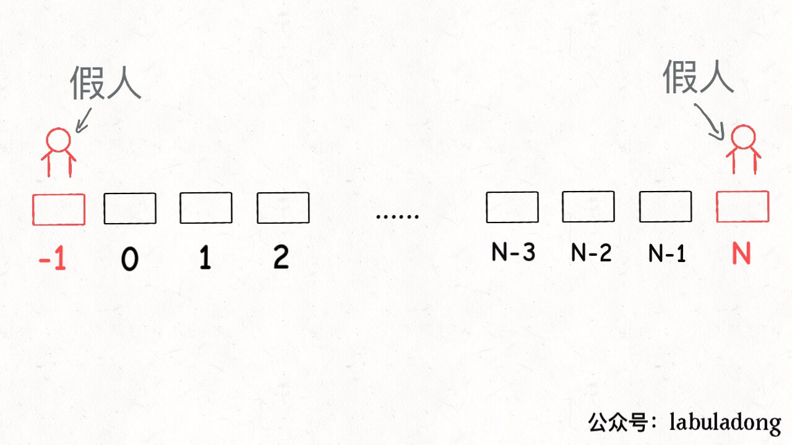
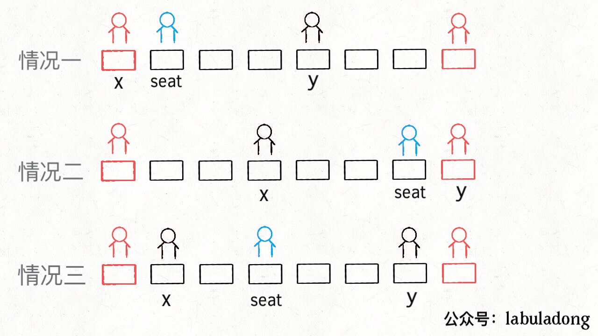
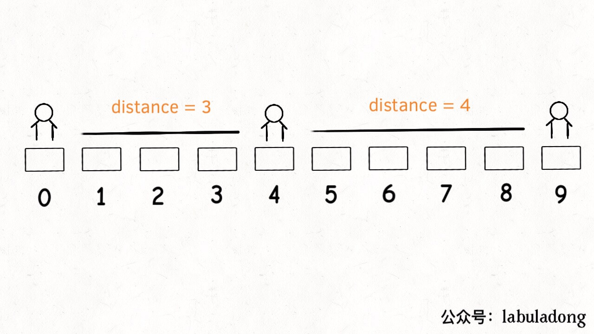
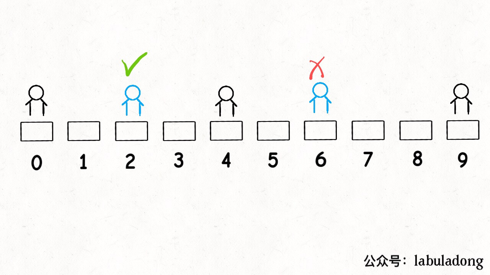
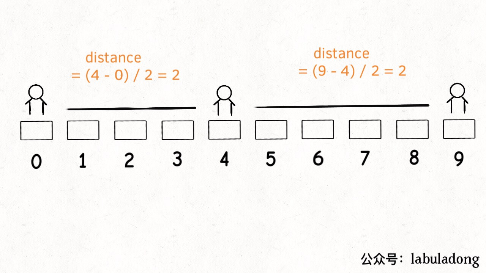

# 如何调度考生的座位


<p align='center'>
<a href="https://github.com/labuladong/fucking-algorithm" target="view_window"></a>
<a href="https://www.zhihu.com/people/labuladong"></a>
<a href="https://i.loli.net/2020/10/10/MhRTyUKfXZOlQYN.jpg"></a>
<a href="https://space.bilibili.com/14089380"></a>
</p>


相关推荐：
  * [一个方法团灭 LeetCode 股票买卖问题](https://labuladong.gitee.io/algo/)
  * [Linux shell 的实用小技巧](https://labuladong.gitee.io/algo/)

读完本文，你不仅学会了算法套路，还可以顺便去 LeetCode 上拿下如下题目：

[855.考场就座](https://leetcode-cn.com/problems/exam-room)

**-----------**

这是 LeetCode 第 855 题，有趣且具有一定技巧性。这种题目并不像动态规划这类算法拼智商，而是看你对常用数据结构的理解和写代码的水平，个人认为值得重视和学习。

另外说句题外话，很多读者都问，算法框架是如何总结出来的，其实框架反而是慢慢从细节里抠出来的。希望大家看了我们的文章之后，最好能抽时间把相关的问题亲自做一做，纸上得来终觉浅，绝知此事要躬行嘛。

先来描述一下题目：假设有一个考场，考场有一排共 `N` 个座位，索引分别是 `[0..N-1]`，考生会**陆续**进入考场考试，并且可能在**任何时候**离开考场。

你作为考官，要安排考生们的座位，满足：**每当一个学生进入时，你需要最大化他和最近其他人的距离；如果有多个这样的座位，安排到他到索引最小的那个座位**。这很符合实际情况对吧，

也就是请你实现下面这样一个类：

```java
class ExamRoom {
    // 构造函数，传入座位总数 N
    public ExamRoom(int N);
    // 来了一名考生，返回你给他分配的座位
    public int seat();
    // 坐在 p 位置的考生离开了
    // 可以认为 p 位置一定坐有考生
    public void leave(int p);
}
```

比方说考场有 5 个座位，分别是 `[0..4]`：

第一名考生进入时（调用 `seat()`），坐在任何位置都行，但是要给他安排索引最小的位置，也就是返回位置 0。

第二名学生进入时（再调用 `seat()`），要和旁边的人距离最远，也就是返回位置 4。

第三名学生进入时，要和旁边的人距离最远，应该做到中间，也就是座位 2。

如果再进一名学生，他可以坐在座位 1 或者 3，取较小的索引 1。

以此类推。

刚才所说的情况，没有调用 `leave` 函数，不过读者肯定能够发现规律：

**如果将每两个相邻的考生看做线段的两端点，新安排考生就是找最长的线段，然后让该考生在中间把这个线段「二分」，中点就是给他分配的座位。`leave(p)` 其实就是去除端点 `p`，使得相邻两个线段合并为一个**。

核心思路很简单对吧，所以这个问题实际上实在考察你对数据结构的理解。对于上述这个逻辑，你用什么数据结构来实现呢？

### 一、思路分析

根据上述思路，首先需要把坐在教室的学生抽象成线段，我们可以简单的用一个大小为 2 的数组表示。

另外，思路需要我们找到「最长」的线段，还需要去除线段，增加线段。

**但凡遇到在动态过程中取最值的要求，肯定要使用有序数据结构，我们常用的数据结构就是二叉堆和平衡二叉搜索树了**。二叉堆实现的优先级队列取最值的时间复杂度是 O(logN)，但是只能删除最大值。平衡二叉树也可以取最值，也可以修改、删除任意一个值，而且时间复杂度都是 O(logN)。

综上，二叉堆不能满足 `leave` 操作，应该使用平衡二叉树。所以这里我们会用到 Java 的一种数据结构 `TreeSet`，这是一种有序数据结构，底层由红黑树维护有序性。

这里顺便提一下，一说到集合（Set）或者映射（Map），有的读者可能就想当然的认为是哈希集合（HashSet）或者哈希表（HashMap），这样理解是有点问题的。

因为哈希集合/映射底层是由哈希函数和数组实现的，特性是遍历无固定顺序，但是操作效率高，时间复杂度为 O(1)。

而集合/映射还可以依赖其他底层数据结构，常见的就是红黑树（一种平衡二叉搜索树），特性是自动维护其中元素的顺序，操作效率是 O(logN)。这种一般称为「有序集合/映射」。

我们使用的 `TreeSet` 就是一个有序集合，目的就是为了保持线段长度的有序性，快速查找最大线段，快速删除和插入。

### 二、简化问题

首先，如果有多个可选座位，需要选择索引最小的座位对吧？**我们先简化一下问题，暂时不管这个要求**，实现上述思路。

这个问题还用到一个常用的编程技巧，就是使用一个「虚拟线段」让算法正确启动，这就和链表相关的算法需要「虚拟头结点」一个道理。

```java
// 将端点 p 映射到以 p 为左端点的线段
private Map<Integer, int[]> startMap;
// 将端点 p 映射到以 p 为右端点的线段
private Map<Integer, int[]> endMap;
// 根据线段长度从小到大存放所有线段
private TreeSet<int[]> pq;
private int N;

public ExamRoom(int N) {
    this.N = N;
    startMap = new HashMap<>();
    endMap = new HashMap<>();
    pq = new TreeSet<>((a, b) -> {
        // 算出两个线段的长度
        int distA = distance(a);
        int distB = distance(b);
        // 长度更长的更大，排后面
        return distA - distB;
    });
    // 在有序集合中先放一个虚拟线段
    addInterval(new int[] {-1, N});
}

/* 去除一个线段 */
private void removeInterval(int[] intv) {
    pq.remove(intv);
    startMap.remove(intv[0]);
    endMap.remove(intv[1]);
}

/* 增加一个线段 */
private void addInterval(int[] intv) {
    pq.add(intv);
    startMap.put(intv[0], intv);
    endMap.put(intv[1], intv);
}

/* 计算一个线段的长度 */
private int distance(int[] intv) {
    return intv[1] - intv[0] - 1;
}
```

「虚拟线段」其实就是为了将所有座位表示为一个线段：



有了上述铺垫，主要 API `seat` 和 `leave` 就可以写了：

```java
public int seat() {
    // 从有序集合拿出最长的线段
    int[] longest = pq.last();
    int x = longest[0];
    int y = longest[1];
    int seat;
    if (x == -1) { // 情况一
        seat = 0;
    } else if (y == N) { // 情况二
        seat = N - 1;
    } else { // 情况三
        seat = (y - x) / 2 + x;
    }
    // 将最长的线段分成两段
    int[] left = new int[] {x, seat};
    int[] right = new int[] {seat, y};
    removeInterval(longest);
    addInterval(left);
    addInterval(right);
    return seat;
}

public void leave(int p) {
    // 将 p 左右的线段找出来
    int[] right = startMap.get(p);
    int[] left = endMap.get(p);
    // 合并两个线段成为一个线段
    int[] merged = new int[] {left[0], right[1]};
    removeInterval(left);
    removeInterval(right);
    addInterval(merged);
}
```



至此，算法就基本实现了，代码虽多，但思路很简单：找最长的线段，从中间分隔成两段，中点就是 `seat()` 的返回值；找 `p` 的左右线段，合并成一个线段，这就是 `leave(p)` 的逻辑。

### 三、进阶问题

但是，题目要求多个选择时选择索引最小的那个座位，我们刚才忽略了这个问题。比如下面这种情况会出错：



现在有序集合里有线段 `[0,4]` 和 `[4,9]`，那么最长线段 `longest` 就是后者，按照 `seat` 的逻辑，就会分割 `[4,9]`，也就是返回座位 6。但正确答案应该是座位 2，因为 2 和 6 都满足最大化相邻考生距离的条件，二者应该取较小的。



**遇到题目的这种要求，解决方式就是修改有序数据结构的排序方式**。具体到这个问题，就是修改 `TreeMap` 的比较函数逻辑：

```java
pq = new TreeSet<>((a, b) -> {
    int distA = distance(a);
    int distB = distance(b);
    // 如果长度相同，就比较索引
    if (distA == distB)
        return b[0] - a[0];
    return distA - distB;
});
```

除此之外，还要改变 `distance` 函数，**不能简单地让它计算一个线段两个端点间的长度，而是让它计算该线段中点和端点之间的长度**。

```java
private int distance(int[] intv) {
    int x = intv[0];
    int y = intv[1];
    if (x == -1) return y;
    if (y == N) return N - 1 - x;
    // 中点和端点之间的长度
    return (y - x) / 2;
}
```



这样，`[0,4]` 和 `[4,9]` 的 `distance` 值就相等了，算法会比较二者的索引，取较小的线段进行分割。到这里，这道算法题目算是完全解决了。

### 四、最后总结

本文聊的这个问题其实并不算难，虽然看起来代码很多。核心问题就是考察有序数据结构的理解和使用，来梳理一下。

处理动态问题一般都会用到有序数据结构，比如平衡二叉搜索树和二叉堆，二者的时间复杂度差不多，但前者支持的操作更多。

既然平衡二叉搜索树这么好用，还用二叉堆干嘛呢？因为二叉堆底层就是数组，实现简单啊，详见旧文「二叉堆详解」。你实现个红黑树试试？操作复杂，而且消耗的空间相对来说会多一些。具体问题，还是要选择恰当的数据结构来解决。

希望本文对大家有帮助。

**＿＿＿＿＿＿＿＿＿＿＿＿＿**

**刷算法，学套路，认准 labuladong，公众号和 [在线电子书](https://labuladong.gitee.io/algo/) 持续更新最新文章**。

**本小抄即将出版，微信扫码关注公众号，后台回复「小抄」限时免费获取，回复「进群」可进刷题群一起刷题，带你搞定 LeetCode**。

<p align='center'>

</p>
======其他语言代码======

[855.考场就座](https://leetcode-cn.com/problems/exam-room)

### javascript

js内置没有treeset相关的实现，而且实现起来也比较麻烦。

array记录有人的位置

seat的情况如下：

- 如果没有array时，seatNo默认0
- 有array有一个时，则看离两边的距离，选距离远的
- 两两遍历取中间值和初始值之和

```js
class ExamRoom {
    /**
     * @param {number} N
     */
    constructor(N) {
        this.array = [];
        this.seatNo = 0;
        this.number = N - 1;
    }
    /**
     * @return {number}
     */
    seat() {
        this.seatNo = 0;
        if (this.array.length == 1) {
            if (this.array[0] == 0) {
                this.seatNo = this.number;
            } else if (this.array[0] == this.number) {
                this.seatNo = 0;
            } else {
                let distance1 = this.array[0];
                let distance2 = this.number - this.array[0];
                if (distance1 >= distance2) {
                    this.seatNo = 0 + distance1;
                } else {
                    this.seatNo = distance1 + distance2;
                }
            }
        } else if ((this.array.length > 1)) {
            let maxDistance = this.array[0], start;
            for (let i = 0; i < this.array.length - 1; i++) {
                let distance = Math.floor((this.array[i + 1] - this.array[i] >>> 1));
                if (maxDistance < distance) {
                    maxDistance = distance;
                    start = this.array[i]
                    this.seatNo = start + maxDistance;
                }
            }
            if (this.number - this.array[this.array.length - 1] > maxDistance) {
                this.seatNo = this.number;
            }
        }
        this.array.push(this.seatNo);
        this.array.sort((a, b) => { return a - b })
        return this.seatNo;
    }
    /** 
     * @param {number} p
     * @return {void}
     */
    leave(p) {
        let index = this.array.indexOf(p)
        this.array.splice(index, 1)
    };
}
```

