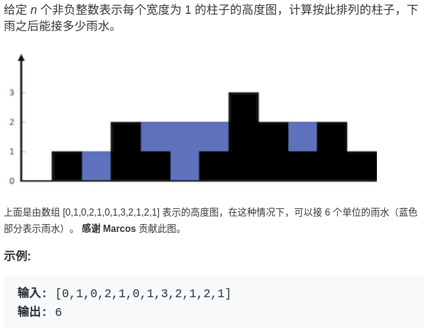
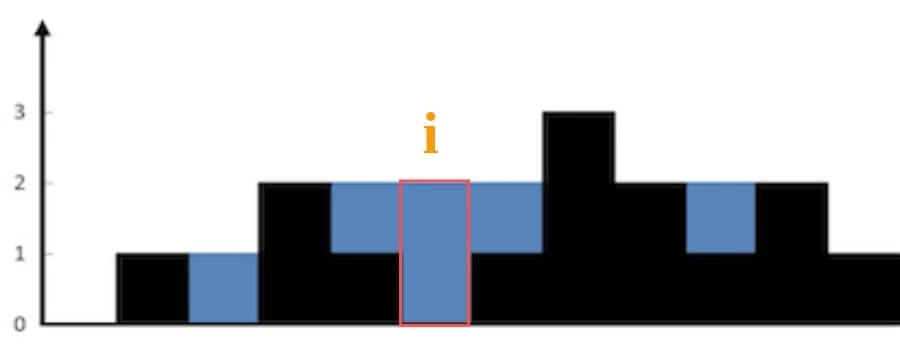

# 接雨水问题详解

接雨水这道题目挺有意思，在面试题中出现频率还挺高的，本文就来步步优化，讲解一下这道题。

先看一下题目：



就是用一个数组表示一个条形图，问你这个条形图最多能接多少水。

```java
int trap(int[] height);
```

下面就来由浅入深介绍暴力解法 -> 备忘录解法 -> 双指针解法，在 O(N) 时间 O(1) 空间内解决这个问题。

### 一、核心思路

我第一次看到这个问题，无计可施，完全没有思路，相信很多朋友跟我一样。所以对于这种问题，我们不要想整体，而应该去想局部；就像之前的文章处理字符串问题，不要考虑如何处理整个字符串，而是去思考应该如何处理每一个字符。

这么一想，可以发现这道题的思路其实很简单。具体来说，仅仅对于位置 i，能装下多少水呢？



能装 2 格水。为什么恰好是两格水呢？因为 height[i] 的高度为 0，而这里最多能盛 2 格水，2-0=2。

为什么位置 i 最多能盛 2 格水呢？因为，位置 i 能达到的水柱高度和其左边的最高柱子、右边的最高柱子有关，我们分别称这两个柱子高度为 `l_max` 和 `r_max`；**位置 i 最大的水柱高度就是 `min(l_max, r_max)`。**

更进一步，对于位置 i，能够装的水为：

```python
water[i] = min(
               # 左边最高的柱子
               max(height[0..i]),  
               # 右边最高的柱子
               max(height[i..end]) 
            ) - height[i]
    
```


这就是本问题的核心思路，我们可以简单写一个暴力算法：

```cpp
int trap(vector<int>& height) {
    int n = height.size();
    int ans = 0;
    for (int i = 1; i < n - 1; i++) {
        int l_max = 0, r_max = 0;
        // 找右边最高的柱子
        for (int j = i; j < n; j++)
            r_max = max(r_max, height[j]);
        // 找左边最高的柱子
        for (int j = i; j >= 0; j--)
            l_max = max(l_max, height[j]);
        // 如果自己就是最高的话，
        // l_max == r_max == height[i]
        ans += min(l_max, r_max) - height[i];
    }
    return ans;
}
```

有之前的思路，这个解法应该是很直接粗暴的，时间复杂度 O(N^2)，空间复杂度 O(1)。但是很明显这种计算 `r_max` 和 `l_max` 的方式非常笨拙，一般的优化方法就是备忘录。

### 二、备忘录优化

之前的暴力解法，不是在每个位置 i 都要计算 `r_max` 和 `l_max` 吗？我们直接把结果都缓存下来，别傻不拉几的每次都遍历，这时间复杂度不就降下来了嘛。

我们开两个**数组** `r_max` 和 `l_max` 充当备忘录，`l_max[i]` 表示位置 i 左边最高的柱子高度，`r_max[i]` 表示位置 i 右边最高的柱子高度。预先把这两个数组计算好，避免重复计算：

```cpp
int trap(vector<int>& height) {
    if (height.empty()) return 0;
    int n = height.size();
    int ans = 0;
    // 数组充当备忘录
    vector<int> l_max(n), r_max(n);
    // 初始化 base case
    l_max[0] = height[0];
    r_max[n - 1] = height[n - 1];
    // 从左向右计算 l_max
    for (int i = 1; i < n; i++)
        l_max[i] = max(height[i], l_max[i - 1]);
    // 从右向左计算 r_max
    for (int i = n - 2; i >= 0; i--) 
        r_max[i] = max(height[i], r_max[i + 1]);
    // 计算答案
    for (int i = 1; i < n - 1; i++) 
        ans += min(l_max[i], r_max[i]) - height[i];
    return ans;
}
```

这个优化其实和暴力解法差不多，就是避免了重复计算，把时间复杂度降低为 O(N)，已经是最优了，但是空间复杂度是 O(N)。下面来看一个精妙一些的解法，能够把空间复杂度降低到 O(1)。

### 三、双指针解法

这种解法的思路是完全相同的，但在实现手法上非常巧妙，我们这次也不要用备忘录提前计算了，而是用双指针**边走边算**，节省下空间复杂度。

首先，看一部分代码：

```cpp
int trap(vector<int>& height) {
    int n = height.size();
    int left = 0, right = n - 1;
    
    int l_max = height[0];
    int r_max = height[n - 1];
    
    while (left <= right) {
        l_max = max(l_max, height[left]);
        r_max = max(r_max, height[right]);
        left++; right--;
    }
}
```

对于这部分代码，请问 `l_max` 和 `r_max` 分别表示什么意义呢？

很容易理解，**`l_max` 是 `height[0..left]` 中最高柱子的高度，`r_max` 是 `height[right..end]` 的最高柱子的高度**。

明白了这一点，直接看解法：

```cpp
int trap(vector<int>& height) {
    if (height.empty()) return 0;
    int n = height.size();
    int left = 0, right = n - 1;
    int ans = 0;
    
    int l_max = height[0];
    int r_max = height[n - 1];
    
    while (left <= right) {
        l_max = max(l_max, height[left]);
        r_max = max(r_max, height[right]);
        
        // ans += min(l_max, r_max) - height[i]
        if (l_max < r_max) {
            ans += l_max - height[left];
            left++; 
        } else {
            ans += r_max - height[right];
            right--;
        }
    }
    return ans;
}
```

你看，其中的核心思想和之前一模一样，换汤不换药。但是细心的读者可能会发现次解法还是有点细节差异：

之前的备忘录解法，`l_max[i]` 和 `r_max[i]` 代表的是 `height[0..i]` 和 `height[i..end]` 的最高柱子高度。

```cpp
ans += min(l_max[i], r_max[i]) - height[i];
```


但是双指针解法中，`l_max` 和 `r_max` 代表的是 `height[0..left]` 和 `height[right..end]` 的最高柱子高度。比如这段代码：

```cpp
if (l_max < r_max) {
    ans += l_max - height[left];
    left++; 
} 
```


此时的 `l_max` 是 `left` 指针左边的最高柱子，但是 `r_max` 并不一定是 `left` 指针右边最高的柱子，这真的可以得到正确答案吗？

其实这个问题要这么思考，我们只在乎 `min(l_max, r_max)`。对于上图的情况，我们已经知道 `l_max < r_max` 了，至于这个 `r_max` 是不是右边最大的，不重要，重要的是 `height[i]` 能够装的水只和 `l_max` 有关。


坚持原创高质量文章，致力于把算法问题讲清楚，欢迎关注我的公众号 labuladong 获取最新文章：


[ruicore](https://github.com/ruicore) 提供 Python3 代码：

* 暴力版本
```py
# 这是 Python3.5 新加入的 type hint
from typing import List


class Solution:
    def trap(self, height: List[int]) -> int:

        # 空 height 直接返回 0
        if not height:
            return 0
        ans, n = 0, len(height)
        for i in range(1, n):
            left_max, right_max = 0, 0
            # 寻找右边最高的柱子
            for j in range(i, n):
                right_max = max(right_max, height[j])
            # 寻找左边最高的柱子
            for j in range(i, -1, -1):
                left_max = max(left_max, height[j])
            # 当前位置可以存储的最大水量
            ans += min(left_max, right_max) - height[i]

        return ans
```

* 备忘录版本
```py
class Solution:
    def trap(self, height: List[int]) -> int:
        # 空 height 直接返回 0
        if not height:
            return 0
        ans, n = 0, len(height)

        # 初始化 left_max，right_max 数组
        left_max, right_max = [0] * n, [0] * n
        left_max[0], right_max[-1] = height[0], height[-1]

        # 从左向右遍历，对每个当前位置，求从`起始位置` 到 `当前位置（包括当前位置）`的最高的水柱，记为 left_max[i]
        # 即 left_max[i] 表示 height 从 0 到 i（包括i）的最大值
        for i in range(1, n):
            left_max[i] = max(height[i], left_max[i - 1])
        # 同理，从右向左遍历，right_max[i] 表示 height 从 i（包括i）到最后一个位置的最大值
        for i in range(n - 2, -1, -1):
            right_max[i] = max(height[i], right_max[i + 1])

        # 依次求每个位置可以存储的水量，求和
        for i in range(1, n):
            ans += min(left_max[i], right_max[i]) - height[i]
        # 在 Python 中，对于 for 循环求和的场景，可以使用内置函数 sum，运算会更快
        # sum((min(left_max[i], right_max[i]) - height[i]) for i in range(1, n))

        return ans

```

* 双指针版本
```py
class Solution:
    def trap(self, height: List[int]) -> int:
        # 空 height 直接返回 0
        if not height:
            return 0

        ans, n = 0, len(height)
        left, right = 0, n - 1

        # 左边最高的柱子，右边最高的柱子
        left_max, right_max = height[0], height[-1]
        while left < right:
            # 更新左边最高的柱子，left_max 表示从 0 到 left-1 位置的最大值
            # 为求的从 0 到 left 的最大值，只需要 left_max 和 height[left] 比较
            left_max = max(left_max, height[left])
            # 同理，right_max 表示从 right+1 到最后一个位置的最大值
            # 为求的从 right 到最后一个位置的最大值，只需要 right_max 和 height[right] 比较
            right_max = max(right_max, height[right])

            # 下面的等价于 ans += min(left_max[i], right_max[i]) - height[i]
            if left_max < right_max:
                ans += left_max - height[left]
                left += 1
            else:
                ans += right_max - height[right]
                right -= 1

        return ans
```

[eric wang](https://www.github.com/eric496) 提供 Java 代码

```java
public int trap(int[] height) {
    if (height.length == 0) {
        return 0;
    }
    
    int n = height.length;
    int left = 0, right = n - 1;
    int ans = 0;
    
    int l_max = height[0];
    int r_max = height[n - 1];
    
    while (left <= right) {
        l_max = Math.max(l_max, height[left]);
        r_max = Math.max(r_max, height[right]);
        
        if (l_max < r_max) {
            ans += l_max - height[left];
            left++;
        } else {
            ans += r_max - height[right];
            right--;
        }
    }
    
    return ans;
}
```

[eric wang](https://www.github.com/eric496) 提供 Python3 代码

```python
def trap(self, height: List[int]) -> int:
    if not height:
        return 0
    
    n = len(height)
    left, right = 0, n - 1
    ans = 0
    
    l_max = height[0]
    r_max = height[n - 1]
    
    while left <= right:
        l_max = max(l_max, height[left])
        r_max = max(r_max, height[right])
        
        if l_max < r_max:
            ans += l_max - height[left]
            left += 1
        else:
            ans += r_max - height[right]
            right -= 1
            
    return ans
```

[上一篇：如何运用二分查找算法](../高频面试系列/koko偷香蕉.md)

[下一篇：如何去除有序数组的重复元素](../高频面试系列/如何去除有序数组的重复元素.md)

[目录](../README.md#目录)