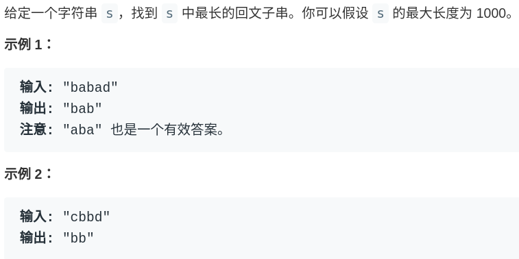

# 如何寻找最长回文子串


<p align='center'>
<a href="https://github.com/labuladong/fucking-algorithm" target="view_window"></a>
<a href="https://www.zhihu.com/people/labuladong"></a>
<a href="https://i.loli.net/2020/10/10/MhRTyUKfXZOlQYN.jpg"></a>
<a href="https://space.bilibili.com/14089380"></a>
</p>


相关推荐：
  * [如何运用二分查找算法](https://labuladong.gitee.io/algo/)
  * [动态规划答疑篇](https://labuladong.gitee.io/algo/)

读完本文，你不仅学会了算法套路，还可以顺便去 LeetCode 上拿下如下题目：

[5.最长回文子串](https://leetcode-cn.com/problems/longest-palindromic-substring)

**-----------**

回文串是面试常常遇到的问题（虽然问题本身没啥意义），本文就告诉你回文串问题的核心思想是什么。

首先，明确一下什：**回文串就是正着读和反着读都一样的字符串**。

比如说字符串 `aba` 和 `abba` 都是回文串，因为它们对称，反过来还是和本身一样。反之，字符串 `abac` 就不是回文串。

可以看到回文串的的长度可能是奇数，也可能是偶数，这就添加了回文串问题的难度，解决该类问题的核心是**双指针**。下面就通过一道最长回文子串的问题来具体理解一下回文串问题：



```cpp
string longestPalindrome(string s) {}
```

### 一、思考

对于这个问题，我们首先应该思考的是，给一个字符串 `s`，如何在 `s` 中找到一个回文子串？

有一个很有趣的思路：既然回文串是一个正着反着读都一样的字符串，那么如果我们把 `s` 反转，称为 `s'`，然后在 `s` 和 `s'` 中寻找**最长公共子串**，这样应该就能找到最长回文子串。

比如说字符串 `abacd`，反过来是 `dcaba`，它的最长公共子串是 `aba`，也就是最长回文子串。

但是这个思路是错误的，比如说字符串 `aacxycaa`，反转之后是 `aacyxcaa`，最长公共子串是 `aac`，但是最长回文子串应该是 `aa`。

虽然这个思路不正确，但是**这种把问题转化为其他形式的思考方式是非常值得提倡的**。

下面，就来说一下正确的思路，如何使用双指针。

**寻找回文串的问题核心思想是：从中间开始向两边扩散来判断回文串**。对于最长回文子串，就是这个意思：

```python
for 0 <= i < len(s):
    找到以 s[i] 为中心的回文串
    更新答案
```

但是呢，我们刚才也说了，回文串的长度可能是奇数也可能是偶数，如果是 `abba`这种情况，没有一个中心字符，上面的算法就没辙了。所以我们可以修改一下：

```python
for 0 <= i < len(s):
    找到以 s[i] 为中心的回文串
    找到以 s[i] 和 s[i+1] 为中心的回文串
    更新答案
```

PS：读者可能发现这里的索引会越界，等会会处理。

### 二、代码实现

按照上面的思路，先要实现一个函数来寻找最长回文串，这个函数是有点技巧的：

```cpp
string palindrome(string& s, int l, int r) {
    // 防止索引越界
    while (l >= 0 && r < s.size()
            && s[l] == s[r]) {
        // 向两边展开
        l--; r++;
    }
    // 返回以 s[l] 和 s[r] 为中心的最长回文串
    return s.substr(l + 1, r - l - 1);
}
```

为什么要传入两个指针 `l` 和 `r` 呢？**因为这样实现可以同时处理回文串长度为奇数和偶数的情况**：

```python
for 0 <= i < len(s):
    # 找到以 s[i] 为中心的回文串
    palindrome(s, i, i)
    # 找到以 s[i] 和 s[i+1] 为中心的回文串
    palindrome(s, i, i + 1)
    更新答案
```

下面看下 `longestPalindrome` 的完整代码：

```cpp
string longestPalindrome(string s) {
    string res;
    for (int i = 0; i < s.size(); i++) {
        // 以 s[i] 为中心的最长回文子串
        string s1 = palindrome(s, i, i);
        // 以 s[i] 和 s[i+1] 为中心的最长回文子串
        string s2 = palindrome(s, i, i + 1);
        // res = longest(res, s1, s2)
        res = res.size() > s1.size() ? res : s1;
        res = res.size() > s2.size() ? res : s2;
    }
    return res;
}
```

至此，这道最长回文子串的问题就解决了，时间复杂度 O(N^2)，空间复杂度 O(1)。

值得一提的是，这个问题可以用动态规划方法解决，时间复杂度一样，但是空间复杂度至少要 O(N^2) 来存储 DP table。这道题是少有的动态规划非最优解法的问题。

另外，这个问题还有一个巧妙的解法，时间复杂度只需要 O(N)，不过该解法比较复杂，我个人认为没必要掌握。该算法的名字叫 Manacher's Algorithm（马拉车算法），有兴趣的读者可以自行搜索一下。


**＿＿＿＿＿＿＿＿＿＿＿＿＿**

**刷算法，学套路，认准 labuladong，公众号和 [在线电子书](https://labuladong.gitee.io/algo/) 持续更新最新文章**。

**本小抄即将出版，微信扫码关注公众号，后台回复「小抄」限时免费获取，回复「进群」可进刷题群一起刷题，带你搞定 LeetCode**。

<p align='center'>

</p>
======其他语言代码======

[5.最长回文子串](https://leetcode-cn.com/problems/longest-palindromic-substring)

### java

[cchromt](https://github.com/cchroot) 提供 Java 代码：

```java
// 中心扩展算法
class Solution {
    public String longestPalindrome(String s) {
        // 如果字符串长度小于2，则直接返回其本身
        if (s.length() < 2) {
            return s;
        }
        String res = "";
        for (int i = 0; i < s.length() - 1; i++) {
            // 以 s.charAt(i) 为中心的最长回文子串
            String s1 = palindrome(s, i, i);
            // 以 s.charAt(i) 和 s.charAt(i+1) 为中心的最长回文子串
            String s2 = palindrome(s, i, i + 1);
            res = res.length() > s1.length() ? res : s1;
            res = res.length() > s2.length() ? res : s2;
        }
        return res;
    }

    public String palindrome(String s, int left, int right) {
        // 索引未越界的情况下，s.charAt(left) == s.charAt(right) 则继续向两边拓展
        while (left >= 0 && right < s.length() && s.charAt(left) == s.charAt(right)) {
            left--;
            right++;
        }
        // 这里要注意，跳出 while 循环时，恰好满足 s.charAt(i) != s.charAt(j)，因此截取的的字符串为[left+1, right-1]
        return s.substring(left + 1, right);
    }
}
```


[enrilwang](https://github.com/enrilwang) 提供 Python 代码：

```python
# 中心扩展算法
class Solution:
    def longestPalindrome(self, s: str) -> str:
        #用n来装字符串长度，res来装答案
        n = len(s)  
        res = str()
        #字符串长度小于2，就返回本身
        if n < 2: return s
        for i in range(n-1):
            #oddstr是以i为中心的最长回文子串
            oddstr = self.centerExtend(s,i,i)
            #evenstr是以i和i+1为中心的最长回文子串
            evenstr = self.centerExtend(s,i,i+1)
            temp = oddstr if len(oddstr)>len(evenstr) else evenstr
            if len(temp)>len(res):res=temp
        
        return res

    def centerExtend(self,s:str,left,right)->str:
        
        while left >= 0 and right < len(s) and s[left] == s[right]:
            left -= 1
            right += 1
        #这里要注意，跳出while循环时，恰好s[left] != s[right]
        return s[left+1:right]


```


做完这题，大家可以去看看 [647. 回文子串](https://leetcode-cn.com/problems/palindromic-substrings/) ,也是类似的题目


### javascript

```js
/**
 * @param {string} s
 * @return {string}
 */
var longestPalindrome = function (s) {
    let res = "";
    for (let i = 0; i < s.length; i++) {
        // 以s[i]为中心的最长回文子串
        let s1 = palindrome(s,i,i);

        // 以 s[i] 和 s[i+1] 为中心的最长回文子串
        let s2 = palindrome(s, i, i + 1);

        // res = longest(res, s1, s2)
        res = res.length > s1.length ? res : s1;
        res = res.length > s2.length ? res : s2;
    }
};

// 寻找最长回文串
let palindrome = (s, l, r) => {
    // 防止索引越界
    while (l >= 0 && r < s.length && s[l] === s[r]) {
        // 向两边展开
        l--;
        r++;
    }

    // 返回以s[l]和s[r]为中心的最长回文串
    return s.substr(l + 1, r - l - 1)
}
```


