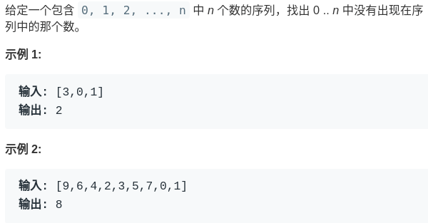
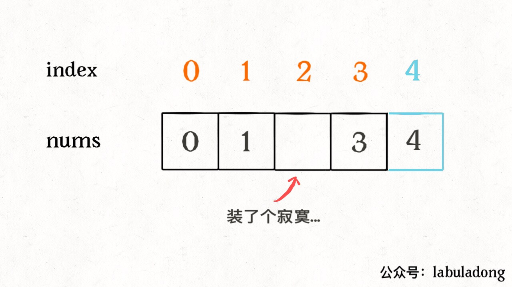
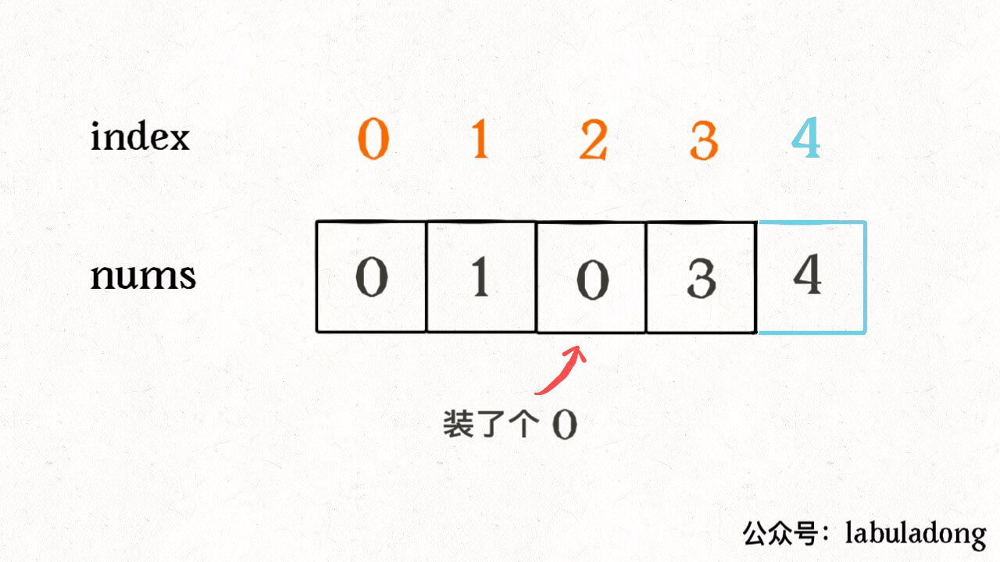
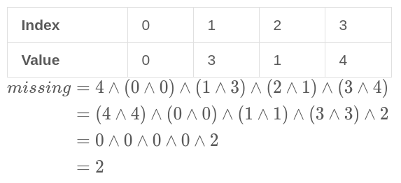

# 如何寻找消失的元素


<p align='center'>
<a href="https://github.com/labuladong/fucking-algorithm" target="view_window"></a>
<a href="https://www.zhihu.com/people/labuladong"></a>
<a href="https://i.loli.net/2020/10/10/MhRTyUKfXZOlQYN.jpg"></a>
<a href="https://space.bilibili.com/14089380"></a>
</p>


相关推荐：
  * [学习算法和数据结构的思路指南](https://labuladong.gitee.io/algo/)
  * [回溯算法最佳实践：括号生成](https://labuladong.gitee.io/algo/)

读完本文，你不仅学会了算法套路，还可以顺便去 LeetCode 上拿下如下题目：

[448.找到所有数组中消失的数字](https://leetcode-cn.com/problems/find-all-numbers-disappeared-in-an-array)

**-----------**

之前也有文章写过几个有趣的智力题，今天再聊一道巧妙的题目。

题目非常简单：



给一个长度为 n 的数组，其索引应该在 `[0,n)`，但是现在你要装进去 n + 1 个元素 `[0,n]`，那么肯定有一个元素装不下嘛，请你找出这个缺失的元素。

这道题不难的，我们应该很容易想到，把这个数组排个序，然后遍历一遍，不就很容易找到缺失的那个元素了吗？

或者说，借助数据结构的特性，用一个 HashSet 把数组里出现的数字都储存下来，再遍历 `[0,n]` 之间的数字，去 HashSet 中查询，也可以很容易查出那个缺失的元素。

排序解法的时间复杂度是 O(NlogN)，HashSet 的解法时间复杂度是 O(N)，但是还需要 O(N) 的空间复杂度存储 HashSet。

**第三种方法是位运算**。

对于异或运算（`^`），我们知道它有一个特殊性质：一个数和它本身做异或运算结果为 0，一个数和 0 做异或运算还是它本身。

而且异或运算满足交换律和结合律，也就是说：

2 ^ 3 ^ 2 = 3 ^ (2 ^ 2) = 3 ^ 0 = 3

而这道题索就可以通过这些性质巧妙算出缺失的那个元素。比如说 `nums = [0,3,1,4]`：


为了容易理解，我们假设先把索引补一位，然后让每个元素和自己相等的索引相对应：




这样做了之后，就可以发现除了缺失元素之外，所有的索引和元素都组成一对儿了，现在如果把这个落单的索引 2 找出来，也就找到了缺失的那个元素。

如何找这个落单的数字呢，**只要把所有的元素和索引做异或运算，成对儿的数字都会消为 0，只有这个落单的元素会剩下**，也就达到了我们的目的。

```java
int missingNumber(int[] nums) {
    int n = nums.length;
    int res = 0;
    // 先和新补的索引异或一下
    res ^= n;
    // 和其他的元素、索引做异或
    for (int i = 0; i < n; i++)
        res ^= i ^ nums[i];
    return res;
}
```



由于异或运算满足交换律和结合律，所以总是能把成对儿的数字消去，留下缺失的那个元素的。

至此，时间复杂度 O(N)，空间复杂度 O(1)，已经达到了最优，我们是否就应该打道回府了呢？

如果这样想，说明我们受算法的毒害太深，随着我们学习的知识越来越多，反而容易陷入思维定式，这个问题其实还有一个特别简单的解法：**等差数列求和公式**。

题目的意思可以这样理解：现在有个等差数列 0, 1, 2,..., n，其中少了某一个数字，请你把它找出来。那这个数字不就是 `sum(0,1,..n) - sum(nums)` 嘛？

```java
int missingNumber(int[] nums) {
    int n = nums.length;
    // 公式：(首项 + 末项) * 项数 / 2
    int expect = (0 + n) * (n + 1) / 2;

    int sum = 0;
    for (int x : nums) 
        sum += x;
    return expect - sum;
}
```

你看，这种解法应该是最简单的，但说实话，我自己也没想到这个解法，而且我去问了几个大佬，他们也没想到这个最简单的思路。相反，如果去问一个初中生，他也许很快就能想到。

做到这一步了，我们是否就应该打道回府了呢？

如果这样想，说明我们对细节的把控还差点火候。在用求和公式计算 `expect` 时，你考虑过**整型溢出**吗？如果相乘的结果太大导致溢出，那么结果肯定是错误的。

刚才我们的思路是把两个和都加出来然后相减，为了避免溢出，干脆一边求和一边减算了。很类似刚才位运算解法的思路，仍然假设 `nums = [0,3,1,4]`，先补一位索引再让元素跟索引配对：




我们让每个索引减去其对应的元素，再把相减的结果加起来，不就是那个缺失的元素吗？

```java
public int missingNumber(int[] nums) {
    int n = nums.length;
    int res = 0;
    // 新补的索引
    res += n - 0;
    // 剩下索引和元素的差加起来
    for (int i = 0; i < n; i++) 
        res += i - nums[i];
    return res;
}
```

由于加减法满足交换律和结合律，所以总是能把成对儿的数字消去，留下缺失的那个元素的。

至此这道算法题目经历九曲十八弯，终于再也没有什么坑了。


**＿＿＿＿＿＿＿＿＿＿＿＿＿**

**刷算法，学套路，认准 labuladong，公众号和 [在线电子书](https://labuladong.gitee.io/algo/) 持续更新最新文章**。

**本小抄即将出版，微信扫码关注公众号，后台回复「小抄」限时免费获取，回复「进群」可进刷题群一起刷题，带你搞定 LeetCode**。

<p align='center'>

</p>
======其他语言代码======

[剑指 Offer 53 - II. 0～n-1中缺失的数字](https://leetcode-cn.com/problems/que-shi-de-shu-zi-lcof/)

[448.找到所有数组中消失的数字](https://leetcode-cn.com/problems/find-all-numbers-disappeared-in-an-array)


### python

```python
def missingNumber(self, nums: List[int]) -> int:
    #思路1，位运算
    res = len(nums)
    for i,num in enumerate(nums):
        res ^= i^num
        return res
```

```python
def missingNumber(self, nums: List[int]) -> int:
    #思路2，求和
    n = len(nums)
    return n*(n+1)//2-sum(nums)
```

```python
def missingNumber(self, nums: List[int]) -> int:
    #思路3，防止整形溢出的优化
    res = len(nums)
    for i,num in enumerate(nums):
        res+=i-num
        return res
```

事实上，在python3中不存在整数溢出的问题（只要内存放得下），思路3的优化提升并不大，不过看上去有内味了哈...

### c++

[happy-yuxuan](https://github.com/happy-yuxuan) 提供 三种方法的 C++ 代码：

```c++
// 方法：异或元素和索引
int missingNumber(vector<int>& nums) {
    int n = nums.size();
    int res = 0;
    // 先和新补的索引异或一下
    res ^= n;
    // 和其他的元素、索引做异或
    for (int i = 0; i < n; i++)
        res ^= i ^ nums[i];
    return res;
}
```

```c++
// 方法：等差数列求和
int missingNumber(vector<int>& nums) {
    int n = nums.size();
    // 公式：(首项 + 末项) * 项数 / 2
    int expect = (0 + n) * (n + 1) / 2;
    int sum = 0;
    for (int x : nums) 
        sum += x;
    return expect - sum;
}
```

```c++
// 方法：防止整型溢出
int missingNumber(vector<int>& nums) {
    int n = nums.size();
    int res = 0;
    // 新补的索引
    res += n - 0;
    // 剩下索引和元素的差加起来
    for (int i = 0; i < n; i++) 
        res += i - nums[i];
    return res;
}
```


### javascript

[传送门：剑指 Offer 53 - II. 0～n-1中缺失的数字](https://leetcode-cn.com/problems/que-shi-de-shu-zi-lcof/)

**位运算**

```js
/**
 * @param {number[]} nums
 * @return {number}
 */
var missingNumber = function(nums) {
    let n = nums.length;
    let res = 0;

    // 先和新补的索引异或一下
    res ^= n;

    // 和其它的元素、索引做异或
    for (let i = 0; i < n; i++) {
        res ^= i ^ nums[i];
    }
    return res;
};
```

**直接相减**

```js
/**
 * @param {number[]} nums
 * @return {number}
 */
var missingNumber = function(nums) {
    let n = nums.length;
    let res = 0;
    // 新补的索引
    res += n - 0;

    // 剩下索引和元素的差加起来
    for (let i = 0; i < n; i++) {
        res += i - nums[i];
    }
    return res;
};
```


[传送门：448. 找到所有数组中消失的数字](https://leetcode-cn.com/problems/find-all-numbers-disappeared-in-an-array/)

这道题的核心思路是将访问过的元素变成负数，第二次遍历直接收集正数并加入结果集中。

```js
/**
 * @param {number[]} nums
 * @return {number[]}
 */
var findDisappearedNumbers = function (nums) {
    for (let i = 0; i < nums.length; i++) {
        let newIndex = Math.abs(nums[i]) - 1;
        if (nums[newIndex] > 0) {
            nums[newIndex] *= -1;
        }
    }
    
    let result = [];
    for (let i = 1; i <= nums.length; i++) {
        if (nums[i - 1] > 0) {
            result.push(i);
        }
    }
    return result;
};

```

